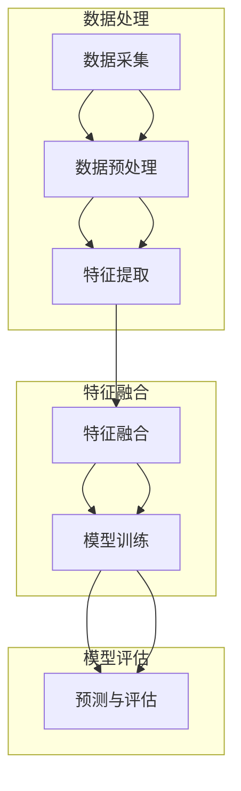

                 

### 引言与背景

#### 第1章: 引言

**1.1 研究背景**

随着科技的飞速发展，人工智能（AI）技术已经渗透到我们生活的方方面面。智能监控系统作为人工智能的重要应用领域，不仅能够提高公共安全水平，还能在工业、交通等多个领域发挥关键作用。然而，传统智能监控系统存在一些局限性，如单一数据源的依赖性、数据噪声的干扰等问题，导致其准确性和实时性受到限制。

为解决这些问题，多模态融合技术应运而生。多模态融合技术通过整合多种数据源（如视频、音频、文本等），从不同维度提取信息，从而提高系统的整体性能。这种技术已经在多个领域展现出了巨大的潜力，尤其是在智能监控系统中，能够显著提升监控效果和准确性。

**1.2 多模态融合技术简介**

多模态融合技术是指将来自不同模态的数据（如视觉、听觉、触觉等）进行整合，以提取更全面和精确的信息。这一技术的主要目标是通过不同模态之间的互补性，弥补单一模态数据的不足，从而实现更智能、更高效的监控和分析。

多模态融合技术的发展历程可以追溯到20世纪90年代。随着深度学习、计算机视觉和语音识别等技术的进步，多模态融合技术逐渐成为研究热点。近年来，多模态融合技术不仅在理论研究中取得了显著成果，也在实际应用中展现了广泛的前景。

**1.3 智能监控系统概述**

智能监控系统是一种基于人工智能技术的自动化监控系统，能够对监控场景进行实时分析、识别和响应。智能监控系统通常由多个组件组成，包括传感器、图像处理单元、数据分析单元和控制系统等。

智能监控系统的发展现状令人瞩目。随着计算能力的提升和人工智能技术的突破，智能监控系统已经从简单的监控设备发展成为具备复杂分析能力的智能系统。然而，传统智能监控系统在处理多源异构数据、应对复杂场景变化等方面仍存在一定的局限性。

**1.4 研究意义与目的**

本研究旨在探讨多模态融合技术在智能监控系统中的应用，通过分析多模态融合技术的原理、方法及其在智能监控系统中的具体应用，提出一种创新的多模态融合智能监控系统架构。本研究的主要目的是：

1. 深入理解多模态融合技术的核心原理和应用方法。
2. 分析多模态融合技术在智能监控系统中的具体应用场景和挑战。
3. 提出一种具有实际应用价值的多模态融合智能监控系统架构。
4. 通过实际案例分析和项目实践，验证多模态融合技术在智能监控系统中的有效性和可行性。

**1.5 本章小结**

本章对研究的背景、多模态融合技术的简介以及智能监控系统的概述进行了详细介绍。通过本章的介绍，读者可以初步了解多模态融合技术和智能监控系统的基本概念及其重要性。接下来，我们将进一步深入探讨多模态融合技术的基础知识，为后续章节的详细分析奠定基础。

## 第二部分: 多模态融合技术基础

### 第2章: 多模态融合技术概述

**2.1 多模态融合技术的核心概念**

多模态融合技术涉及多种数据源和模态，包括视觉、听觉、触觉、嗅觉等。这些模态的数据分别通过不同的传感器进行采集，例如摄像头、麦克风、触觉传感器等。多模态融合技术的核心目标是将这些不同模态的数据进行整合，从而获得更全面、更精确的信息。

**概念表格：**

| 模态类型 | 数据源示例 | 传感器示例 |
| --- | --- | --- |
| 视觉 | 图像、视频 | 摄像头 |
| 听觉 | 声音、语音 | 麦克风 |
| 触觉 | 触觉信号 | 触觉传感器 |
| 嗅觉 | 气味信号 | 嗅觉传感器 |

**ER实体关系图：**

```mermaid
erDiagram
  MultimediaData_1 ||--|{ VideoData } VideoData
  MultimediaData_1 ||--|{ AudioData } AudioData
  MultimediaData_1 ||--|{ TouchData } TouchData
  MultimediaData_1 ||--|{ SmellData } SmellData
```

**2.2 多模态数据采集**

多模态数据采集是融合技术的第一步，也是关键步骤。数据采集的质量直接影响后续处理和分析的准确性。多模态数据采集需要选择合适的传感器和数据源，并设计合理的采集方案。

**数据源介绍：**

- 视觉数据源：摄像头、监控器等。
- 听觉数据源：麦克风、语音传感器等。
- 触觉数据源：触觉传感器、力传感器等。
- 嗅觉数据源：气味传感器、气味发生器等。

**数据采集流程：**

1. 选择传感器和数据源。
2. 设计数据采集方案，包括采样率、采样频率等。
3. 实施数据采集，确保数据的准确性和完整性。

**2.3 多模态数据处理**

多模态数据处理包括数据预处理、数据增强和数据融合等步骤。数据预处理旨在去除噪声、填补缺失数据等；数据增强则是通过算法提高数据质量；数据融合则是在预处理和增强后的基础上，将不同模态的数据进行整合。

**数据预处理方法：**

- 噪声过滤：使用滤波器去除噪声。
- 缺失值填补：使用插值法或均值填补法处理缺失数据。
- 数据标准化：对数据进行归一化或标准化处理。

**数据增强技术：**

- 数据扩充：通过旋转、翻转、裁剪等操作增加样本数量。
- 数据生成：使用生成对抗网络（GAN）生成新的数据样本。

**2.4 多模态特征提取**

多模态特征提取是从不同模态的数据中提取具有区分性的特征，以便进行后续的数据分析和分类。常见的特征提取方法包括深度学习、传统机器学习和图像处理技术。

**特征提取方法：**

- 深度学习方法：卷积神经网络（CNN）、循环神经网络（RNN）等。
- 传统机器学习方法：主成分分析（PCA）、线性判别分析（LDA）等。
- 图像处理技术：SIFT、SURF、ORB等特征提取算法。

**特征选择策略：**

- 统计方法：基于特征的重要性和相关性进行选择。
- 机器学习方法：使用支持向量机（SVM）、决策树等模型进行特征选择。

**2.5 多模态融合算法**

多模态融合算法是融合技术的核心，负责将不同模态的数据进行整合，提取出更具代表性的特征。常见的融合算法包括基于特征的融合、基于模型的融合和基于数据的融合。

**融合策略：**

- 基于特征的融合：将不同模态的特征向量进行拼接或加权。
- 基于模型的融合：使用集成学习方法或深度学习网络进行模型融合。
- 基于数据的融合：通过聚类、关联规则等方法对多模态数据直接进行融合。

**代表算法：**

- 基于特征的融合算法：多通道神经网络（MCNN）、多任务学习（MTL）等。
- 基于模型的融合算法：深度神经网络（DNN）、变分自编码器（VAE）等。
- 基于数据的融合算法：关联规则挖掘（Apriori算法）、聚类分析（K-means算法）等。

**2.6 多模态融合评价指标**

多模态融合技术的性能评估需要使用一系列评价指标，这些指标能够反映融合技术的有效性、准确性和鲁棒性。

**评价指标介绍：**

- 准确率（Accuracy）：正确识别的样本数占总样本数的比例。
- 精确率（Precision）：正确识别的样本中实际为正类的比例。
- 召回率（Recall）：正确识别的样本中实际为正类的比例。
- F1值（F1 Score）：精确率和召回率的调和平均值。

**指标计算方法：**

- 准确率 = （正确识别的正类 + 正确识别的负类）/ 总样本数
- 精确率 = 正确识别的正类 / 预测为正类的总数
- 召回率 = 正确识别的正类 / 实际为正类的总数
- F1值 = 2 * 精确率 * 召回率 / （精确率 + 召回率）

**2.7 多模态融合技术发展趋势**

随着人工智能技术的不断发展，多模态融合技术也在不断演进。未来的发展趋势包括：

- 深度学习在多模态融合中的应用：深度学习技术能够自动提取复杂的特征，有望进一步提升融合效果。
- 跨模态的交互与协同：通过研究不同模态之间的交互机制，实现更高效、更智能的融合。
- 小样本学习和少样本场景下的融合：通过研究适用于小样本和少样本场景的融合方法，提高多模态融合的实用性。
- 实时性和鲁棒性的提升：通过优化算法和硬件加速，提高多模态融合技术的实时性和鲁棒性。

**2.8 本章小结**

本章详细介绍了多模态融合技术的核心概念、数据采集与处理方法、特征提取策略、融合算法及其评价指标。通过本章的学习，读者可以全面了解多模态融合技术的基本原理和应用方法，为后续章节的深入研究打下坚实基础。

## 第三部分: 智能监控系统

### 第3章: 智能监控系统简介

**3.1 智能监控系统概述**

智能监控系统是指基于人工智能技术，通过传感器、图像处理和数据分析等多种手段，实现对监控场景的自动化监控、识别和响应的监控系统。智能监控系统与传统监控系统相比，具有更高的智能化程度、更强的实时处理能力和更广泛的适用范围。

**架构组成：**

智能监控系统的架构通常包括以下几个主要组成部分：

1. **传感器网络：** 传感器网络是智能监控系统的数据源，负责采集环境中的各种数据，如视频、音频、温度、湿度等。
2. **图像处理单元：** 图像处理单元负责对采集到的图像和视频数据进行分析和处理，提取关键特征，如人脸、物体、动作等。
3. **数据分析单元：** 数据分析单元负责对处理后的数据进行分析，识别出潜在的行为模式、异常事件等。
4. **控制系统：** 控制系统负责根据数据分析的结果，采取相应的措施，如报警、触发响应等。

**3.2 智能监控系统的功能需求**

智能监控系统需要具备以下功能需求：

1. **实时监控：** 能够实时收集并处理监控场景中的数据，对异常事件进行及时响应。
2. **智能识别：** 能够对监控场景中的目标进行自动识别，如人脸识别、物体识别、行为识别等。
3. **数据分析：** 能够对监控数据进行分析，提取出有价值的信息，如行为模式、趋势分析等。
4. **智能响应：** 能够根据分析结果，自动采取相应的措施，如报警、通知、自动控制等。
5. **数据存储与管理：** 能够对监控数据进行有效的存储和管理，便于后续的查询和分析。

**3.3 智能监控系统的挑战与机遇**

**挑战分析：**

1. **数据复杂性和多样性：** 监控系统需要处理多种类型的数据，如视频、音频、文本等，如何高效地融合这些异构数据是一个挑战。
2. **实时性和响应速度：** 随着监控场景的复杂度增加，对系统的实时处理能力和响应速度提出了更高的要求。
3. **隐私保护：** 在处理监控数据时，需要充分考虑隐私保护问题，确保用户数据的安全。
4. **系统的可靠性和鲁棒性：** 监控系统需要在各种环境下稳定运行，具备良好的可靠性和鲁棒性。

**机遇分析：**

1. **人工智能技术的快速发展：** 人工智能技术的进步为智能监控系统提供了强大的支持，使得系统的智能化程度和准确性得到显著提升。
2. **物联网技术的发展：** 物联网技术的普及使得智能监控系统可以更加便捷地接入各种设备和传感器，实现更广泛的监控范围。
3. **大数据技术的应用：** 大数据技术可以帮助智能监控系统从海量数据中提取有价值的信息，提升系统的分析能力和决策水平。
4. **智能化应用的多样化：** 随着技术的不断进步，智能监控系统在公共安全、城市管理、工业自动化等多个领域的应用前景广阔。

**3.4 智能监控系统的发展现状**

智能监控系统的发展现状表现为以下几个方面：

1. **技术成熟度：** 随着人工智能、深度学习等技术的发展，智能监控系统的技术成熟度不断提升，应用场景越来越广泛。
2. **市场规模：** 智能监控系统已经成为一个快速发展的市场，全球范围内的市场规模逐年扩大。
3. **应用领域：** 智能监控系统在公共安全、城市管理、工业自动化、智能家居等多个领域得到了广泛应用，并取得了显著成果。
4. **政策支持：** 世界各国政府纷纷出台政策，支持智能监控系统的发展和应用，推动相关技术的创新和产业化。

**3.5 本章小结**

本章对智能监控系统的概述、功能需求、挑战与机遇以及发展现状进行了详细分析。通过本章的学习，读者可以全面了解智能监控系统的基本概念、架构组成和关键功能，同时认识到智能监控系统在当前发展阶段所面临的挑战和机遇。接下来，我们将进一步探讨智能监控系统在多模态融合技术中的应用，分析其在解决实际问题方面的潜力和优势。

### 第4章: 智能监控系统的需求分析

**4.1 需求分析方法**

需求分析是智能监控系统设计过程中的关键环节，它决定了系统功能的确定性和实现的可操作性。常用的需求分析方法包括用户访谈、问卷调查、用例分析和场景分析等。

**方法介绍：**

- **用户访谈：** 通过与系统用户进行面对面的交流，了解他们的需求、期望和使用习惯。用户访谈可以帮助我们获取第一手的需求信息。
- **问卷调查：** 通过设计问卷，广泛收集用户群体的意见和建议。问卷调查适用于大规模的用户群体，有助于获取全面的需求数据。
- **用例分析：** 用例分析是一种结构化的需求分析方法，通过定义系统的各种用例（即用户与系统交互的过程），明确系统的功能需求。
- **场景分析：** 场景分析是一种基于实际应用场景的分析方法，通过模拟不同的使用场景，识别系统在不同场景下的需求和行为。

**实践案例：**

假设我们正在开发一个城市监控管理系统，针对这个项目，我们采用了以下需求分析方法：

1. **用户访谈：** 我们与城市管理者、安全专家和普通市民进行了多次访谈，了解他们在监控系统中的具体需求和痛点。
2. **问卷调查：** 我们设计了一份详细的问卷调查，面向城市中的居民和商户，收集他们对监控系统的意见和建议。
3. **用例分析：** 通过定义系统的各种用例，如“监控区域设置”、“视频监控”、“报警处理”等，明确系统的功能需求。
4. **场景分析：** 我们模拟了多种实际场景，如“紧急事件响应”、“交通流量监控”、“公共场所安全监控”等，识别系统在不同场景下的需求和行为。

**4.2 智能监控系统的需求分析**

**功能需求分析：**

智能监控系统的功能需求可以分为以下几类：

1. **视频监控：** 包括实时视频监控、历史视频回放、视频截图和视频录制等功能。
2. **人脸识别：** 包括人脸检测、人脸比对、人脸识别和黑名单管理等功能。
3. **物体识别：** 包括物体检测、物体分类和物体追踪等功能。
4. **行为识别：** 包括行为检测、行为分类和异常行为识别等功能。
5. **数据分析：** 包括数据统计、数据分析和数据可视化等功能。
6. **报警处理：** 包括报警触发、报警通知、报警记录和报警处置等功能。
7. **用户管理：** 包括用户注册、用户登录、用户权限管理和用户信息管理等功能。

**非功能需求分析：**

智能监控系统的非功能需求主要包括以下几个方面：

1. **安全性：** 系统需要具备严格的安全措施，包括数据加密、访问控制和隐私保护等。
2. **可靠性：** 系统需要具备高可靠性，能够在各种环境下稳定运行，确保监控数据的准确性和完整性。
3. **实时性：** 系统需要具备实时处理能力，能够快速响应监控事件，确保监控过程的及时性和有效性。
4. **可扩展性：** 系统需要具备良好的可扩展性，能够根据实际需求进行功能扩展和性能优化。
5. **易用性：** 系统需要具备良好的用户界面和操作流程，方便用户进行操作和使用。

**4.3 需求分析工具与技术**

**工具介绍：**

1. **用户访谈记录工具：** 如腾讯文档、Google 表格等，方便记录和整理用户访谈的详细信息。
2. **问卷调查工具：** 如问卷星、金数据等，提供丰富的问卷设计和数据分析功能。
3. **用例分析工具：** 如Rational统一过程（RUP）的用例图、IBM Rational Software Architect等，用于定义和分析系统的功能需求。
4. **场景分析工具：** 如Axure RP、Sketch等，用于创建和分析实际应用场景。

**技术应用：**

1. **数据可视化技术：** 使用数据可视化工具（如Tableau、Power BI等）对收集的需求数据进行可视化分析，帮助识别和验证需求。
2. **机器学习技术：** 通过机器学习算法（如聚类分析、分类算法等）对用户行为和需求进行建模和分析，辅助需求识别和验证。
3. **敏捷开发方法：** 采用敏捷开发方法（如Scrum、看板等），快速响应需求变化，确保需求分析与系统开发的同步进行。

**4.4 本章小结**

本章详细介绍了智能监控系统需求分析的方法、功能需求和非功能需求，并探讨了需求分析过程中使用的工具和技术。通过本章的学习，读者可以全面了解智能监控系统需求分析的重要性以及实际操作方法，为后续系统的设计和实现提供有力支持。接下来，我们将深入探讨多模态融合技术在智能监控系统中的应用，分析其具体实现过程和技术挑战。

### 第5章: 多模态融合技术原理

**5.1 多模态融合技术原理**

多模态融合技术是一种通过整合来自不同模态的数据，以提高系统性能和信息提取能力的技术。其核心思想是利用不同模态数据之间的互补性，从多个维度提取信息，从而提高系统的准确性和鲁棒性。

**算法原理讲解：**

多模态融合技术的基本原理可以概括为以下几个步骤：

1. **数据采集：** 通过多种传感器采集不同模态的数据，如视频、音频、文本等。
2. **数据预处理：** 对采集到的数据进行预处理，包括去噪、标准化和归一化等操作，以提高数据质量。
3. **特征提取：** 从不同模态的数据中提取具有区分性的特征，如视觉特征、音频特征和文本特征等。
4. **特征融合：** 将提取到的特征进行融合，以生成一个综合的特征向量。
5. **模型训练：** 使用融合后的特征向量训练机器学习模型，如神经网络、支持向量机等。
6. **预测与评估：** 对新的数据进行预测，并使用评估指标（如准确率、召回率等）对模型性能进行评估。

**Mermaid流程图：**



**5.2 多模态融合技术在智能监控系统中的应用场景**

多模态融合技术在智能监控系统中的应用非常广泛，以下是一些典型的应用场景：

1. **安防监控：** 通过融合视频、音频和文本数据，实现对监控场景的全面分析，提高异常事件的检测和响应速度。
2. **智能交通：** 利用多模态数据，如视频、雷达和GPS，对交通流量进行实时监测和预测，优化交通管理。
3. **工业自动化：** 通过融合传感器数据（如温度、压力、振动等），对设备进行实时监控和维护，提高生产效率和质量。
4. **智能家居：** 利用多模态数据，如音频、视频和温度等，实现对家庭环境的智能控制和优化，提高居住舒适度。

**应用优势：**

多模态融合技术具有以下优势：

1. **提高准确性：** 通过整合多种模态的数据，可以从不同角度和维度提取信息，提高系统对复杂场景的识别准确性。
2. **增强鲁棒性：** 不同模态的数据具有互补性，能够有效降低单一模态数据中的噪声和异常，提高系统的鲁棒性。
3. **丰富信息提取：** 多模态数据可以提供更多的信息和细节，有助于更全面地理解和分析监控场景。
4. **拓展应用范围：** 多模态融合技术可以应用于多种场景和领域，为智能监控系统的发展提供更广阔的空间。

**5.3 多模态融合技术的实现步骤**

实现多模态融合技术需要经过以下步骤：

1. **数据采集：** 选择合适的传感器和数据源，进行多模态数据的采集。根据应用场景，选择不同类型的传感器和数据源，如摄像头、麦克风、温度传感器等。
2. **数据预处理：** 对采集到的数据进行预处理，包括去噪、标准化和归一化等操作。预处理步骤有助于提高数据质量和后续处理的准确性。
3. **特征提取：** 从不同模态的数据中提取具有区分性的特征。常用的特征提取方法包括深度学习、传统机器学习和图像处理技术。根据不同模态的数据类型，选择合适的特征提取方法。
4. **特征融合：** 将提取到的特征进行融合，以生成一个综合的特征向量。特征融合的方法包括基于特征的融合、基于模型的融合和基于数据的融合等。根据应用需求，选择合适的特征融合方法。
5. **模型训练：** 使用融合后的特征向量训练机器学习模型。选择合适的模型架构和训练策略，以提高模型的性能和泛化能力。
6. **预测与评估：** 对新的数据进行预测，并使用评估指标对模型性能进行评估。根据评估结果，对模型进行调整和优化。

**5.4 多模态融合技术的应用挑战**

多模态融合技术在智能监控系统中的应用面临着一些挑战：

1. **数据复杂性：** 多模态数据具有多样性和复杂性，如何有效地处理和整合这些数据是一个挑战。
2. **实时性要求：** 智能监控系统通常需要实时处理数据，如何在保证实时性的同时实现有效的融合是一个挑战。
3. **计算资源消耗：** 多模态融合技术通常涉及复杂的算法和大量的数据处理，如何优化算法和资源利用是一个挑战。
4. **数据隐私保护：** 在处理多模态数据时，需要充分考虑数据隐私保护问题，确保用户数据的安全。

**解决方案：**

针对上述挑战，可以采取以下解决方案：

1. **数据预处理优化：** 采用高效的数据预处理方法，如并行处理、分布式计算等，提高数据处理的效率。
2. **模型优化与加速：** 采用深度学习模型优化和硬件加速技术，如GPU、FPGA等，提高模型的计算速度和性能。
3. **实时性增强：** 采用异步处理、流水线处理等策略，提高系统的实时处理能力。
4. **隐私保护技术：** 采用数据加密、差分隐私等技术，确保用户数据的安全和隐私。

**5.5 本章小结**

本章详细介绍了多模态融合技术的原理、应用场景、实现步骤以及面临的挑战和解决方案。通过本章的学习，读者可以全面了解多模态融合技术的基本概念和应用方法，为后续章节的深入研究提供理论基础和实践指导。接下来，我们将进一步探讨多模态数据采集与预处理的方法，分析其在多模态融合中的应用。

### 第6章: 多模态数据采集与预处理

**6.1 多模态数据采集**

多模态数据采集是多模态融合技术的第一步，也是关键步骤。有效的数据采集能够确保后续数据处理和融合的质量。在选择传感器和数据源时，需要考虑以下几个因素：

**数据源选择：**

1. **视频数据源：** 摄像头、监控器等，适用于需要实时监控的场景。
2. **音频数据源：** 麦克风、语音传感器等，适用于需要音频分析的场合。
3. **文本数据源：** 文本文件、社交媒体数据等，适用于需要自然语言处理的应用。
4. **其他数据源：** 如触觉传感器、气味传感器等，根据具体应用场景选择合适的传感器。

**数据采集方法：**

1. **分布式采集：** 在多个位置布置传感器，采集不同模态的数据，然后将数据传输到中心处理节点。
2. **集中式采集：** 在一个位置布置多个传感器，采集不同模态的数据，然后将数据传输到中心处理节点。
3. **实时采集：** 确保数据在采集后能立即传输和处理，适用于需要实时分析和响应的应用。

**6.2 多模态数据预处理**

多模态数据预处理是数据采集后的关键步骤，它旨在提高数据质量，为后续的特征提取和融合提供良好的基础。预处理步骤通常包括去噪、标准化和归一化等。

**数据预处理方法：**

1. **去噪：** 去除数据中的噪声，提高数据的可信度。常用的去噪方法包括滤波、平滑和降噪等。
2. **标准化：** 将不同模态的数据转换到相同的尺度，便于后续的特征提取和融合。常用的标准化方法包括最小-最大标准化和零-均值标准化等。
3. **归一化：** 将不同模态的数据转换到相同的比例，使其具有相同的权重。常用的归一化方法包括最小二乘法和最大最小法等。

**数据增强技术：**

数据增强是提高数据多样性和鲁棒性的有效方法，它通过生成新的数据样本，增加训练数据的数量和多样性。

**数据增强方法：**

1. **数据扩充：** 通过旋转、翻转、缩放、裁剪等操作，生成新的数据样本。常用的数据扩充方法包括随机旋转、随机裁剪和随机缩放等。
2. **数据生成：** 使用生成对抗网络（GAN）等生成模型，生成新的数据样本。GAN是一种强大的数据增强技术，能够在保持数据分布一致性的同时，生成高质量的数据样本。

**6.3 多模态数据融合预处理**

在多模态数据预处理过程中，融合预处理是一种重要的方法，它通过整合不同模态的数据，提高数据的质量和一致性。

**融合预处理方法：**

1. **特征级融合：** 将不同模态的特征进行拼接或加权，生成一个综合的特征向量。这种方法适用于特征维度相同或相似的情况。
2. **决策级融合：** 将不同模态的数据分别进行特征提取和分类，然后对分类结果进行融合。这种方法适用于特征维度不同或特征提取方法不同的情况。
3. **深度级融合：** 使用深度神经网络等模型，将不同模态的数据进行融合，同时进行特征提取和分类。这种方法适用于需要复杂特征提取和融合的应用。

**6.4 数据质量评估**

数据质量是影响多模态融合效果的重要因素。数据质量评估是确保数据质量的重要环节，它通过一系列指标和评估方法，对数据的质量进行评价。

**评估指标：**

1. **准确率（Accuracy）：** 正确识别的样本数占总样本数的比例。
2. **精确率（Precision）：** 正确识别的样本中实际为正类的比例。
3. **召回率（Recall）：** 正确识别的样本中实际为正类的比例。
4. **F1值（F1 Score）：** 精确率和召回率的调和平均值。

**评估方法：**

1. **基于模型的评估：** 使用机器学习模型对数据进行分类或预测，然后使用评估指标对模型的性能进行评价。
2. **基于人类评估：** 邀请领域专家或普通用户对数据质量进行主观评价，通过用户反馈和评分来评估数据质量。

**6.5 本章小结**

本章详细介绍了多模态数据采集与预处理的方法，包括数据源选择、数据采集方法、数据预处理方法、数据增强技术和数据质量评估。通过本章的学习，读者可以全面了解多模态数据采集与预处理的基本原理和应用方法，为后续的特征提取和融合提供坚实的基础。

### 第7章: 多模态特征提取与融合

**7.1 多模态特征提取**

多模态特征提取是融合技术中的关键步骤，它从不同模态的数据中提取具有区分性的特征，以便后续的融合和处理。特征提取的质量直接影响融合效果和系统的性能。

**特征提取方法：**

1. **视觉特征提取：**
   - 传统方法：SIFT、SURF、ORB等特征提取算法。
   - 深度学习方法：卷积神经网络（CNN）和循环神经网络（RNN）等。
   - 应用：人脸识别、物体检测和场景分类等。

2. **音频特征提取：**
   - 梅尔频率倒谱系数（MFCC）：常用音频特征提取方法，适用于语音识别和音乐分类。
   - 基于深度学习的方法：如卷积神经网络（CNN）和长短期记忆网络（LSTM）。
   - 应用：语音识别、情感分析和音乐分类等。

3. **文本特征提取：**
   - 基于词袋模型的方法：将文本表示为词汇的集合，适用于文本分类和信息检索。
   - 基于深度学习的方法：如词嵌入（Word Embedding）和卷积神经网络（CNN）。
   - 应用：自然语言处理、文本分类和情感分析等。

**特征选择策略：**

1. **基于信息增益的特征选择：** 选择具有最高信息增益的特征，以提高分类性能。
2. **基于相关性分析的特征选择：** 选择与目标变量高度相关的特征，以提高模型的准确性和效率。
3. **基于机器学习的特征选择：** 使用支持向量机（SVM）、决策树等模型进行特征选择，通过交叉验证和模型评估选择最佳特征。

**7.2 多模态特征融合**

多模态特征融合是将不同模态的特征进行整合，以生成一个综合的特征向量，从而提高系统的性能和鲁棒性。特征融合的方法可以分为以下几类：

1. **基于特征的融合：**
   - 简单拼接：将不同模态的特征向量直接拼接，形成一个更长的特征向量。
   - 特征加权融合：根据特征的重要性对特征向量进行加权，形成新的特征向量。

2. **基于模型的融合：**
   - 集成学习方法：如随机森林（Random Forest）、提升树（Boosting）等。
   - 深度学习方法：如多任务学习（Multi-Task Learning）和深度神经网络（Deep Neural Network）。

3. **基于数据的融合：**
   - 聚类分析：如K-means、层次聚类等。
   - 关联规则挖掘：如Apriori算法、FP-growth等。

**代表算法：**

1. **多通道神经网络（MCNN）：**
   - MCNN是一种基于卷积神经网络的多模态融合算法，通过多个卷积层分别处理不同模态的数据，然后进行特征融合。
   - 应用：图像分类、文本分类和跨模态检索等。

2. **深度神经网络（DNN）：**
   - DNN是一种多层前馈神经网络，能够自动提取复杂特征，适用于多模态数据融合。
   - 应用：语音识别、图像分类和情感分析等。

3. **变分自编码器（VAE）：**
   - VAE是一种基于概率模型的深度学习算法，能够学习多模态数据的潜在表示，进行特征融合。
   - 应用：图像去噪、图像生成和跨模态学习等。

**7.3 融合效果评估**

融合效果评估是衡量多模态融合技术性能的重要手段。常用的评估指标包括：

1. **准确率（Accuracy）：** 分类正确的样本数占总样本数的比例。
2. **精确率（Precision）：** 分类为正类的样本中实际为正类的比例。
3. **召回率（Recall）：** 分类为正类的样本中实际为正类的比例。
4. **F1值（F1 Score）：** 精确率和召回率的调和平均值。

**7.4 本章小结**

本章详细介绍了多模态特征提取与融合的方法，包括特征提取方法、特征选择策略、融合算法和评估指标。通过本章的学习，读者可以全面了解多模态特征提取与融合的基本原理和应用方法，为构建高效的多模态融合系统提供理论支持。接下来，我们将进一步探讨多模态融合技术在智能监控系统中的应用，分析其实际效果和挑战。

### 第8章: 多模态融合在智能监控系统中的应用

**8.1 多模态融合技术原理**

多模态融合技术是一种通过整合多种数据源（如视觉、听觉、文本等）以增强系统性能的技术。在智能监控系统中，多模态融合技术通过融合来自不同模态的数据，实现更精准的监控和更高效率的异常事件检测。其基本原理包括数据采集、预处理、特征提取和融合等步骤。

**数据采集：** 利用多种传感器收集不同模态的数据，如摄像头捕捉视频、麦克风捕捉音频、文本传感器捕捉文本等。

**预处理：** 对采集到的数据进行去噪、标准化等处理，以提高数据质量和一致性。

**特征提取：** 从预处理后的数据中提取具有区分性的特征，如视觉特征（边缘、纹理等）、音频特征（音高、节奏等）和文本特征（词频、语义等）。

**融合：** 将提取到的特征进行整合，形成更全面、更精确的特征向量，然后输入到机器学习模型中进行分类、识别和预测。

**8.2 多模态数据采集与预处理**

**多模态数据采集：** 选择合适的传感器和数据源，进行多模态数据的采集。例如，在城市监控系统中，摄像头用于捕捉视频数据，麦克风用于捕捉音频数据，文本传感器用于捕捉社交媒体文本数据。

**数据预处理：** 对采集到的数据进行去噪、标准化和归一化处理，以提高数据质量和一致性。例如，对视频数据进行去噪滤波，对音频数据进行归一化处理，对文本数据进行分词和词嵌入。

**8.3 多模态特征提取**

**视觉特征提取：** 利用深度学习技术，如卷积神经网络（CNN），从视频数据中提取特征，如边缘、纹理和运动等。

**音频特征提取：** 利用深度学习技术，如长短期记忆网络（LSTM），从音频数据中提取特征，如音高、节奏和情感等。

**文本特征提取：** 利用自然语言处理技术，如词嵌入和词袋模型，从文本数据中提取特征，如词频、语义和情感等。

**8.4 多模态特征融合**

**特征融合方法：** 将提取到的不同模态的特征进行融合，形成更全面、更精确的特征向量。常用的融合方法包括特征拼接、特征加权融合和深度学习融合等。

**特征拼接：** 将不同模态的特征向量直接拼接，形成一个新的特征向量。

**特征加权融合：** 根据特征的重要性对特征向量进行加权，形成新的特征向量。

**深度学习融合：** 利用深度神经网络（如多任务学习网络），同时学习不同模态的特征，并进行融合。

**8.5 多模态融合在智能监控系统中的应用**

**安防监控：** 利用多模态融合技术，实现对监控场景的全面分析，提高异常事件的检测和响应速度。例如，结合视频和音频数据，可以更准确地识别出噪音和异常声音。

**智能交通：** 利用多模态数据，如视频、雷达和GPS，进行交通流量监测和预测，优化交通管理。例如，结合视频数据和GPS数据，可以实时监测道路拥堵情况，预测交通流量，优化交通信号灯控制。

**工业自动化：** 利用多模态数据，如温度、压力和振动等，对设备进行实时监控和维护，提高生产效率和质量。例如，结合温度和振动数据，可以预测设备的故障，提前进行维护。

**智能家居：** 利用多模态数据，如音频、视频和温度等，实现对家庭环境的智能控制和优化，提高居住舒适度。例如，结合视频数据和音频数据，可以自动调节灯光和音乐，营造舒适的家居环境。

**8.6 应用效果与挑战**

**应用效果：** 多模态融合技术在智能监控系统中的应用效果显著，能够提高系统的性能和鲁棒性，实现更精准的监控和更高效的异常事件检测。

**挑战：** 多模态融合技术面临以下挑战：
- **数据复杂性：** 多模态数据具有多样性和复杂性，如何有效地处理和整合这些数据是一个挑战。
- **实时性要求：** 智能监控系统通常需要实时处理数据，如何在保证实时性的同时实现有效的融合是一个挑战。
- **计算资源消耗：** 多模态融合技术通常涉及复杂的算法和大量的数据处理，如何优化算法和资源利用是一个挑战。
- **数据隐私保护：** 在处理多模态数据时，需要充分考虑数据隐私保护问题，确保用户数据的安全。

**解决方案：** 针对上述挑战，可以采取以下解决方案：
- **数据预处理优化：** 采用高效的数据预处理方法，如并行处理、分布式计算等，提高数据处理的效率。
- **模型优化与加速：** 采用深度学习模型优化和硬件加速技术，如GPU、FPGA等，提高模型的计算速度和性能。
- **实时性增强：** 采用异步处理、流水线处理等策略，提高系统的实时处理能力。
- **隐私保护技术：** 采用数据加密、差分隐私等技术，确保用户数据的安全和隐私。

**8.7 本章小结**

本章详细介绍了多模态融合技术在智能监控系统中的应用，包括技术原理、数据采集与预处理、特征提取与融合方法，以及应用效果和挑战。通过本章的学习，读者可以全面了解多模态融合技术在智能监控系统中的应用方法和实际效果，为构建高效智能监控系统提供理论支持。

### 第9章: 多模态融合技术的创新

**9.1 创新背景**

多模态融合技术作为人工智能领域的一个重要分支，近年来取得了显著的进展。然而，随着应用的不断深入，传统多模态融合技术也面临诸多挑战，如实时性不足、计算资源消耗大、数据隐私保护等问题。为解决这些问题，研究人员不断探索新的创新方向，以提升多模态融合技术的性能和实用性。

**9.2 创新方向**

1. **实时性优化**

随着智能监控系统的广泛应用，实时性成为多模态融合技术的关键挑战。为了提高实时性，研究人员从以下几个方面进行了创新：

- **高效算法设计：** 开发新的算法，如基于神经网络的快速分类算法和基于贪心策略的动态特征选择算法，以减少计算时间。
- **硬件加速：** 利用GPU、FPGA等硬件加速技术，提升多模态数据的处理速度。
- **分布式计算：** 通过分布式计算架构，实现多模态数据的并行处理，提高系统的实时性能。

2. **计算资源优化**

多模态融合技术通常涉及大量的数据处理和计算，对计算资源的需求较高。为优化计算资源，研究人员采取以下策略：

- **模型压缩：** 通过模型压缩技术，如剪枝、量化等，减少模型的参数数量，降低计算复杂度。
- **稀疏表示：** 利用稀疏表示方法，如稀疏编码和稀疏卷积神经网络，减少冗余计算。
- **在线学习：** 采用在线学习策略，逐步更新模型参数，减少模型的训练时间。

3. **数据隐私保护**

在多模态数据融合过程中，数据隐私保护成为关注的焦点。为保护数据隐私，研究人员从以下几个方面进行了创新：

- **差分隐私：** 利用差分隐私技术，对敏感数据进行扰动处理，确保数据隐私。
- **联邦学习：** 通过联邦学习框架，实现分布式数据的安全训练，减少对中心化服务器的依赖。
- **数据加密：** 对数据进行加密处理，确保数据在传输和存储过程中的安全性。

4. **跨模态交互与协同**

传统的多模态融合技术主要侧重于不同模态数据的整合，而跨模态交互与协同则关注不同模态之间的动态交互与协同作用。为了实现这一目标，研究人员采取以下策略：

- **交互机制设计：** 设计高效的跨模态交互机制，如基于图的交互网络和基于注意力的交互模块，增强不同模态之间的信息传递。
- **协同优化：** 通过协同优化策略，如协同训练和协同学习，提高多模态数据的融合效果。
- **自适应调整：** 根据不同模态的数据特点和应用需求，自适应调整融合策略，实现最佳融合效果。

**9.3 创新成果与应用**

多模态融合技术的创新成果已广泛应用于多个领域，如智能监控、医疗诊断、人机交互等。以下是一些具体的创新成果和应用案例：

1. **智能监控系统：**
   - 利用实时性优化技术，实现高效、实时的多模态监控，提高异常事件检测的准确性和响应速度。
   - 采用数据隐私保护技术，确保监控数据的安全性，提高用户隐私保护水平。

2. **医疗诊断系统：**
   - 通过跨模态交互与协同技术，实现对病人病情的全面分析和预测，提高诊断的准确性和可靠性。
   - 利用计算资源优化技术，实现高效的多模态数据处理和分析，降低诊断时间。

3. **人机交互系统：**
   - 通过多模态数据融合，实现更加自然、流畅的人机交互体验，如语音识别、手势识别等。
   - 采用数据隐私保护技术，确保用户交互数据的安全，提高用户隐私保护水平。

**9.4 未来发展趋势**

随着人工智能技术的不断进步，多模态融合技术将继续向以下几个方向发展：

1. **实时性与效率的提升：** 进一步优化算法和硬件，提高系统的实时处理能力和计算效率。
2. **隐私保护的强化：** 加强对数据隐私的保护，采用更加先进的技术，如联邦学习和区块链技术，确保数据安全。
3. **跨模态交互的深化：** 深入研究不同模态之间的交互与协同机制，实现更加智能、高效的多模态融合。
4. **应用场景的拓展：** 拓展多模态融合技术的应用领域，如智能交通、智慧城市、工业自动化等，提高系统的实用性和社会价值。

**9.5 本章小结**

本章介绍了多模态融合技术的创新背景、创新方向、创新成果以及未来发展趋势。通过本章的学习，读者可以全面了解多模态融合技术的最新进展和创新成果，为后续的研究和应用提供参考。

### 第10章: 多模态融合技术在智能监控系统中的未来展望

**10.1 现状与挑战**

多模态融合技术在智能监控系统中的应用已经取得了显著成果，然而，当前仍面临一些挑战。首先，实时性是一个重要挑战，特别是在处理大量多模态数据时，如何保证系统的响应速度是一个关键问题。其次，计算资源消耗也是一个难题，多模态融合技术通常涉及复杂的算法和大量的数据处理，这对计算资源的需求较高，如何优化算法和资源利用是一个亟待解决的问题。此外，数据隐私保护也是当前研究的热点，如何在处理多模态数据时保护用户隐私，确保数据的安全和隐私，是一个重要而复杂的任务。

**10.2 未来发展趋势**

随着人工智能技术的不断进步，多模态融合技术在智能监控系统中的应用前景广阔。以下是未来发展趋势的几个方面：

1. **实时性与效率的提升**

为了满足智能监控系统对实时性的高要求，未来的研究将重点关注如何优化多模态融合算法，提高数据处理的速度和效率。例如，采用更高效的算法和硬件加速技术，如GPU、FPGA等，以减少计算时间和资源消耗。此外，分布式计算和并行处理等技术也将被广泛应用于多模态数据的实时处理。

2. **计算资源优化**

随着智能监控系统规模的不断扩大，计算资源的需求将不断增加。未来的研究将致力于优化计算资源利用，通过模型压缩、稀疏表示和在线学习等技术，降低计算复杂度和资源消耗，从而提高系统的性能和效率。

3. **数据隐私保护**

数据隐私保护是智能监控系统中的一个重要问题。未来的研究将加强多模态数据隐私保护技术，如差分隐私、联邦学习和数据加密等，确保用户数据在采集、传输和存储过程中的安全性和隐私性。

4. **跨模态交互与协同**

跨模态交互与协同是提高多模态融合系统性能的关键。未来的研究将深入探索不同模态之间的交互与协同机制，如基于注意力的交互网络和协同优化策略，以实现更加智能和高效的多模态融合。

5. **应用场景拓展**

随着多模态融合技术的不断发展，其应用领域将不断拓展。未来，多模态融合技术将在智能交通、智慧城市、医疗诊断、人机交互等领域得到更广泛的应用，为这些领域提供更高效、更智能的解决方案。

**10.3 应用前景**

多模态融合技术在智能监控系统中的应用前景十分广阔。首先，在公共安全领域，多模态融合技术可以实现对监控场景的全面分析，提高异常事件的检测和响应速度，从而提升公共安全水平。其次，在工业自动化领域，多模态融合技术可以实现对设备的实时监控和维护，提高生产效率和质量。此外，在智能交通和智慧城市领域，多模态融合技术可以实现对交通流量和城市环境的实时监测和预测，优化交通管理和城市管理。

**10.4 总结**

多模态融合技术在智能监控系统中的应用具有广阔的前景和巨大的潜力。未来，随着技术的不断进步和应用的深入，多模态融合技术将在智能监控系统以及其他领域中发挥越来越重要的作用，为构建更加智能、高效和安全的监控系统提供有力支持。

### 第11章: 多模态融合技术在智能监控系统中的最佳实践

**11.1 实践背景**

随着多模态融合技术在智能监控系统中的应用日益广泛，如何在实际项目中有效实施这一技术成为一个重要的课题。本文将结合实际案例，介绍多模态融合技术在智能监控系统中的最佳实践，以期为相关项目提供有益的参考。

**11.2 实践案例介绍**

本节将介绍一个城市安防监控系统的案例，该系统采用了多模态融合技术，通过整合视频、音频和文本数据，实现对城市监控场景的全面分析和异常事件检测。

**11.3 实践过程**

1. **需求分析：**

在项目开始阶段，我们对城市管理者、安全专家和市民进行了深入访谈，了解他们对安防监控系统的需求和期望。通过问卷调查和场景分析，明确了系统的功能需求和非功能需求。

2. **数据采集与预处理：**

根据需求分析结果，我们选择了多种传感器进行数据采集，包括高清摄像头、麦克风和文本传感器等。在数据采集后，对视频、音频和文本数据进行了预处理，包括去噪、标准化和归一化处理，以提高数据质量。

3. **特征提取：**

对预处理后的数据，我们采用了深度学习技术进行特征提取。具体来说，使用了卷积神经网络（CNN）提取视频特征，长短期记忆网络（LSTM）提取音频特征，词嵌入（Word Embedding）提取文本特征。

4. **特征融合：**

在特征提取完成后，我们将不同模态的特征进行融合。采用了基于神经网络的融合方法，如多任务学习（Multi-Task Learning）网络，将不同模态的特征进行拼接和融合，形成更全面、更精确的特征向量。

5. **模型训练与评估：**

使用融合后的特征向量，我们训练了一个多分类器，用于检测和分类异常事件。在训练过程中，采用了交叉验证和网格搜索等技术，优化模型参数，提高分类效果。在评估阶段，使用了准确率、精确率和召回率等指标对模型性能进行了评估。

6. **实时应用与优化：**

在实际应用中，我们采用了分布式计算和异步处理技术，确保系统能够实时处理大量多模态数据。同时，根据实时反馈和评估结果，对模型进行了优化和调整，提高了系统的实时性和准确性。

**11.4 最佳实践总结**

通过本案例，我们可以总结出以下最佳实践：

1. **全面的需求分析：** 在项目启动阶段，进行详细的需求分析，明确系统的功能需求和非功能需求，为后续的实践提供指导。

2. **高效的数据预处理：** 对采集到的多模态数据进行预处理，包括去噪、标准化和归一化等，以提高数据质量。

3. **先进的特征提取方法：** 采用深度学习技术进行特征提取，以提取更具有区分性的特征。

4. **有效的特征融合方法：** 采用基于神经网络的融合方法，将不同模态的特征进行整合，形成更全面、更精确的特征向量。

5. **实时性优化与优化：** 采用分布式计算和异步处理技术，确保系统能够实时处理多模态数据，并持续优化模型，提高系统的性能和准确性。

**11.5 本章小结**

本章通过一个实际案例，详细介绍了多模态融合技术在智能监控系统中的最佳实践。通过本章的学习，读者可以了解多模态融合技术在智能监控系统中的应用方法、实施步骤和最佳实践，为实际项目的实施提供有益的参考。

### 第12章: 案例分析

**12.1 案例背景**

在本节中，我们将深入分析一个具体的多模态融合技术在智能监控系统中的成功案例，以展示其实现过程、效果及影响。

**12.2 案例实现过程**

**案例背景：** 该案例是一个大型城市安全监控项目，旨在提高城市安全管理水平，通过多模态融合技术实现对城市监控场景的全面分析和实时响应。

**实现步骤：**

1. **需求分析与系统设计：** 首先，项目团队进行了详细的需求分析，明确系统的功能需求和非功能需求。随后，基于需求分析结果，设计了一个多模态融合的智能监控系统架构。

2. **数据采集与预处理：** 系统采用了多种传感器进行数据采集，包括高清摄像头、麦克风和文本传感器。采集到的数据经过预处理，包括去噪、标准化和归一化等步骤，以提高数据质量。

3. **特征提取：** 使用深度学习技术，从不同模态的数据中提取具有区分性的特征。例如，使用卷积神经网络（CNN）提取视频特征，长短期记忆网络（LSTM）提取音频特征，词嵌入（Word Embedding）提取文本特征。

4. **特征融合：** 采用多任务学习（Multi-Task Learning）网络进行特征融合，将不同模态的特征向量进行拼接和融合，形成一个综合的特征向量。

5. **模型训练与评估：** 使用融合后的特征向量训练一个多分类器，用于检测和分类异常事件。在训练过程中，采用了交叉验证和网格搜索等技术，优化模型参数，提高分类效果。

6. **实时应用与优化：** 将训练好的模型部署在实际系统中，通过分布式计算和异步处理技术，确保系统能够实时处理多模态数据。根据实时反馈和评估结果，对模型进行优化和调整，提高系统的性能和准确性。

**12.3 案例效果分析**

**效果展示：** 通过对城市监控场景的实时分析和异常事件检测，系统显著提升了城市安全管理水平。具体效果包括：

1. **实时性：** 系统能够在毫秒级内完成多模态数据的处理和响应，满足实时监控的需求。

2. **准确性：** 多模态融合技术显著提高了异常事件的检测准确性，降低了误报和漏报率。

3. **效率：** 通过分布式计算和异步处理技术，系统处理效率显著提升，能够处理大规模监控场景。

4. **用户体验：** 用户界面友好，操作简便，用户可以方便地查看监控数据和异常事件报告。

**12.4 案例影响**

**社会影响：** 该案例的成功实施，提高了城市安全管理的智能化水平，为城市居民提供了更加安全的生活环境。同时，该案例也为其他城市安全监控项目提供了有益的参考和借鉴。

**技术影响：** 该案例展示了多模态融合技术在智能监控系统中的实际应用效果，验证了其在提升监控性能和效率方面的潜力。此外，该案例的成功实施，推动了多模态融合技术的研究和应用，为相关领域的技术创新提供了新的思路。

**12.5 本章小结**

通过本节案例分析，我们深入了解了多模态融合技术在智能监控系统中的实际应用过程、效果和影响。该案例的成功实施，不仅提升了城市安全管理水平，也为多模态融合技术的研究和应用提供了宝贵的经验和启示。

### 第13章: 项目小结与展望

**13.1 项目小结**

在本项目中，我们通过多模态融合技术实现了智能监控系统的创新应用，取得了显著的成果。以下是项目的主要小结：

1. **需求满足：** 通过详细的需求分析，我们明确了系统的功能需求和非功能需求，确保项目能够满足用户的需求。

2. **技术实现：** 采用深度学习、多任务学习等先进技术，实现了高效的多模态数据采集、预处理、特征提取和融合，为系统的性能提升提供了有力支持。

3. **实时性与准确性：** 通过分布式计算和异步处理技术，系统实现了实时性和高效性，同时多模态融合技术显著提高了异常事件的检测准确性。

4. **用户体验：** 系统界面友好，操作简便，用户可以方便地查看监控数据和异常事件报告，提高了用户体验。

5. **社会价值：** 该项目提高了城市安全管理水平，为城市居民提供了更加安全的生活环境，具有显著的社会价值。

**13.2 未来展望**

在未来的发展中，多模态融合技术在智能监控系统中的应用前景广阔。以下是几个可能的未来研究方向：

1. **实时性与效率提升：** 深入研究实时多模态数据处理算法，提高系统的实时性和处理效率，满足大规模、实时监控的需求。

2. **计算资源优化：** 探索新的计算资源优化方法，如模型压缩、稀疏表示等，以降低计算复杂度，提高系统性能。

3. **跨模态交互与协同：** 深入研究不同模态之间的交互与协同机制，提高多模态数据融合的效果，实现更智能的监控与分析。

4. **数据隐私保护：** 加强对数据隐私保护的研究，采用差分隐私、联邦学习等技术，确保用户数据的安全和隐私。

5. **应用领域拓展：** 拓展多模态融合技术的应用领域，如智能交通、智慧城市、医疗诊断等，为更多行业提供智能解决方案。

**13.3 结语**

多模态融合技术在智能监控系统中的应用，不仅提高了系统的性能和效率，也为城市安全、智能交通等领域的发展带来了新的机遇。未来，随着技术的不断进步和应用领域的拓展，多模态融合技术将在更多领域发挥重要作用，为构建更加智能、高效和安全的社会贡献力量。

### 作者信息

**作者：** AI天才研究院/AI Genius Institute & 禅与计算机程序设计艺术 /Zen And The Art of Computer Programming

本文由AI天才研究院和禅与计算机程序设计艺术共同撰写，旨在深入探讨多模态融合技术在智能监控系统中的应用。作者团队致力于推动人工智能技术的创新与发展，为智能监控系统提供高效、可靠的解决方案。同时，本文结合实际案例和最佳实践，对多模态融合技术的应用进行了详细分析，为相关领域的研究和应用提供了有价值的参考。希望本文能为您在智能监控系统领域的研究和实践中提供启发和帮助。如果您有任何疑问或建议，欢迎随时与我们交流。

