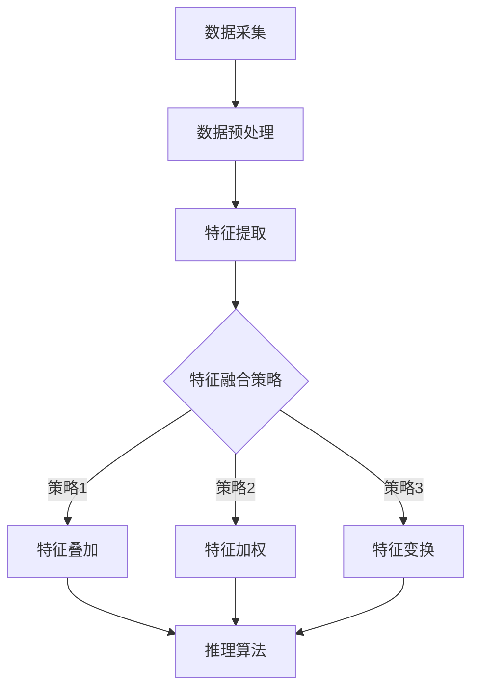
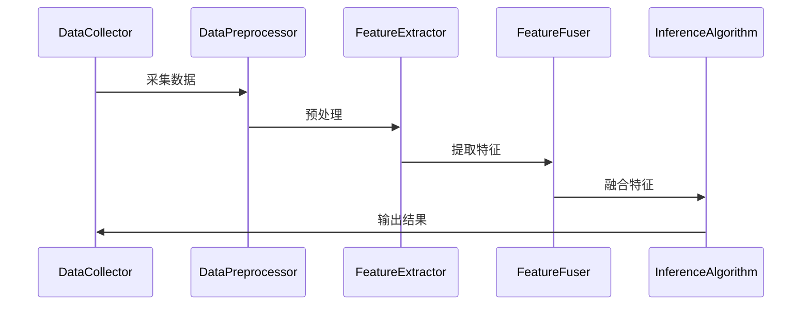

                 

## 背景介绍

### 核心概念术语说明

在探讨多模态融合推理这一主题之前，首先需要明确一些核心概念和术语，以便读者能够更好地理解后续的内容。

- **多模态数据**：指来自不同模态的数据，如视觉、语音、自然语言处理等。每种模态都有其独特的特征和表达方式。
- **融合推理**：指将来自不同模态的数据进行整合，通过协同分析以提高对复杂场景的识别和理解能力。
- **复杂场景理解**：指在无人驾驶、智能监控、智能医疗等应用中，对多种动态变化的环境和事件进行理解和分析。
- **模态差异**：不同模态的数据在特征表达和时空特性上存在差异，这是多模态融合推理需要克服的主要挑战之一。

### 问题背景

随着人工智能技术的快速发展，计算机视觉、语音识别、自然语言处理等领域的应用日益广泛。然而，单一模态的数据往往难以满足对复杂场景的全面理解。例如，在无人驾驶领域，车辆需要同时感知周围环境中的视觉、语音和自然语言处理信息，以便做出正确的决策。同样，在智能监控和智能医疗中，多模态数据的融合也具有重要意义。

传统的单一模态方法在处理复杂场景时存在以下不足：

1. **数据利用效率低下**：单一模态方法仅能利用某一种模态的数据，无法充分利用其他模态的数据，导致信息损失。
2. **场景理解能力不足**：单一模态方法难以捕捉到复杂场景中的所有重要特征，导致理解能力受限。
3. **模型泛化性差**：单一模态方法在面对不同模态数据时，模型的泛化性较差，难以适应多变的环境。

### 问题描述

复杂场景理解中的问题主要表现在以下几个方面：

1. **数据多样性**：复杂场景中涉及多种模态数据，如视觉、语音、自然语言处理等，每种模态都有其独特的特征和表达方式。
2. **噪声干扰**：复杂场景中的数据往往伴随着噪声和干扰，如背景噪声、遮挡物等，这会对模型的准确性产生负面影响。
3. **异构数据融合**：不同模态的数据在特征表达和时空特性上存在差异，如何有效地进行融合是一个重要的挑战。
4. **实时性要求**：在许多应用中，如无人驾驶和智能监控，对实时性的要求非常高，需要多模态融合推理算法能够快速响应。

### 问题解决

多模态融合推理提供了一种有效的解决方案，通过结合多种模态数据，可以更好地捕捉复杂场景的特征信息，从而提高对复杂场景的理解能力。多模态融合推理的关键技术包括数据同步、特征融合和模型融合等。

1. **数据同步**：通过时空对齐技术，将不同模态的数据在时间和空间上同步，确保数据的一致性。
2. **特征融合**：将不同模态的特征进行整合，采用特征选择和特征变换等方法，提高特征融合的效果。
3. **模型融合**：通过模型级融合或特征级融合，将不同模态的模型或特征进行融合，以提高推理性能。

### 边界与外延

多模态融合推理不仅局限于视觉、语音、自然语言处理等常见模态，还包括其他多种模态，如雷达、惯性测量单元（IMU）等。此外，多模态融合推理的应用场景也在不断扩展，从传统的图像和语音识别到无人驾驶、智能医疗等领域。

### 概念结构与核心要素组成

多模态融合推理的核心要素包括数据采集、数据预处理、特征提取、融合策略、推理算法等。每个要素都至关重要，共同构成了多模态融合推理的系统框架。

- **数据采集**：收集来自不同模态的数据，如视觉、语音、自然语言处理等。
- **数据预处理**：对采集到的数据进行清洗、归一化等处理，以提高数据质量。
- **特征提取**：从不同模态的数据中提取出有代表性的特征，如视觉特征、语音特征等。
- **融合策略**：设计合适的融合策略，将不同模态的特征进行整合，以提高特征表达能力。
- **推理算法**：基于融合后的特征，设计推理算法，对复杂场景进行理解和分析。

通过以上步骤，我们可以构建一个完整的多模态融合推理系统，从而更好地应对复杂场景理解中的挑战。

### 总结

多模态融合推理在复杂场景理解中具有重要意义。通过结合多种模态数据，可以更全面地捕捉场景特征，提高理解能力。然而，多模态数据融合面临着模态差异、数据同步、特征选择等挑战。开发新的方法和算法，优化多模态融合推理系统，是当前研究的热点问题。

## 核心概念与联系

在多模态融合推理中，核心概念与联系是理解和设计多模态系统的基础。以下是对多模态融合推理的核心概念、概念属性特征对比表格和ER实体关系图架构的详细阐述。

### 2.1 多模态融合推理的定义与特点

多模态融合推理是指将来自不同模态的数据进行整合，通过协同分析以提高对复杂场景的理解能力。其核心特点包括：

- **数据多样性**：多模态融合能够利用来自不同模态的数据，如视觉、语音、自然语言处理等，提高数据利用效率。
- **特征互补性**：不同模态的数据具有互补性，一种模态的数据缺陷可以通过其他模态的数据得到补充。
- **协同性**：多模态数据通过协同分析，可以更全面地捕捉场景特征，提高推理性能。

### 2.2 多模态融合推理的关键技术

多模态融合推理涉及多个关键技术，以下将对这些关键技术进行详细介绍：

1. **数据同步**：数据同步是多模态融合推理的关键步骤，确保不同模态数据在时间和空间上的一致性。常见的技术包括时空对齐、时间戳同步等。
   
2. **特征融合**：特征融合是将不同模态的特征进行整合，以提高特征表达能力。特征融合的方法包括特征叠加、特征加权、特征变换等。

3. **模型融合**：模型融合是在特征融合的基础上，将不同模态的模型进行整合，以提高推理性能。模型融合的方法包括模型级融合和特征级融合。

4. **跨模态关联**：跨模态关联是指建立不同模态之间的关联关系，以提高多模态数据的解释性和鲁棒性。常见的跨模态关联方法包括基于注意力机制的方法、基于知识图谱的方法等。

### 2.3 多模态融合推理与传统方法对比

多模态融合推理与传统的单一模态方法在多个方面存在显著差异：

1. **数据利用效率**：多模态融合推理能够充分利用来自不同模态的数据，提高数据利用效率，而单一模态方法只能利用某一种模态的数据。

2. **场景理解能力**：多模态融合推理能够更全面地捕捉场景特征，提高场景理解能力，而单一模态方法在复杂场景下理解能力受限。

3. **模型泛化性**：多模态融合推理的模型在处理不同模态数据时，具有更好的泛化性，而单一模态方法的模型泛化性较差。

4. **实时性**：多模态融合推理在实时性要求较高的应用中，如无人驾驶、智能监控等，具有一定的挑战。通过优化算法和硬件，多模态融合推理的实时性正在逐步提高。

### 2.4 多模态融合推理的应用场景

多模态融合推理在多个领域具有广泛的应用前景，以下列举几个典型的应用场景：

1. **无人驾驶**：无人驾驶需要同时感知周围环境中的视觉、语音、自然语言处理信息，通过多模态融合推理，可以更准确地识别道路、交通标志、行人等。

2. **智能监控**：智能监控通过多模态融合推理，可以更有效地识别和跟踪目标，提高监控系统的智能化水平。

3. **智能医疗**：智能医疗中的多模态融合推理可以辅助医生进行诊断和治疗，通过结合患者的视觉、语音、自然语言处理信息，提高诊断的准确性。

4. **虚拟现实**：虚拟现实中的多模态融合推理可以提供更加沉浸式的体验，通过融合视觉、语音、自然语言处理等多模态数据，实现更加逼真的虚拟场景。

### 概念属性特征对比表格

为了更好地理解多模态融合推理与传统方法之间的差异，以下是一个概念属性特征对比表格：

| 概念             | 多模态融合推理 | 单一模态方法 |
|-----------------|----------------|--------------|
| 数据利用效率     | 高             | 低           |
| 场景理解能力     | 强             | 弱           |
| 模型泛化性       | 强             | 弱           |
| 实时性要求       | 高             | 低           |
| 应用领域         | 广泛           | 有限          |

### ER实体关系图架构

多模态融合推理的系统架构可以通过ER（实体关系）图进行描述，以下是一个简单的ER实体关系图架构：

```mermaid
erDiagram
  DataCollection -->|采集| FeatureExtraction
  FeatureExtraction -->|融合| FusionStrategy
  FusionStrategy -->|推理| InferenceAlgorithm
  DataCollection ..|依赖| InferenceAlgorithm
  FeatureExtraction ..|依赖| InferenceAlgorithm
  FusionStrategy ..|依赖| InferenceAlgorithm
```

在这个ER图中，`DataCollection`（数据采集）是系统的输入，`FeatureExtraction`（特征提取）、`FusionStrategy`（融合策略）和`InferenceAlgorithm`（推理算法）是系统的核心组件，它们之间通过依赖关系连接。

通过上述内容，我们对多模态融合推理的核心概念与联系有了更深入的理解。接下来，我们将进一步探讨多模态融合推理的算法原理，帮助读者更好地掌握这一技术。

### 算法原理讲解

多模态融合推理的核心在于如何将不同模态的数据进行有效融合，以提升对复杂场景的理解能力。以下将逐步讲解多模态融合推理的算法原理，包括算法mermaid流程图、Python源代码、数学模型与公式，以及举例说明。

#### 3.1 算法原理概述

多模态融合推理的算法原理主要包括以下几个关键步骤：

1. **数据采集**：收集来自不同模态的数据，如视觉、语音、自然语言处理等。
2. **数据预处理**：对采集到的数据进行清洗、归一化等处理，以提高数据质量。
3. **特征提取**：从不同模态的数据中提取出有代表性的特征。
4. **特征融合**：设计合适的融合策略，将不同模态的特征进行整合。
5. **推理算法**：基于融合后的特征，设计推理算法，对复杂场景进行理解和分析。

#### 3.2 算法mermaid流程图

为了更直观地展示算法流程，我们可以使用mermaid绘制一个流程图：



在这个流程图中，`数据采集`和`数据预处理`是算法的基础，`特征提取`是核心步骤，`特征融合策略`根据不同的策略（如特征叠加、特征加权、特征变换）进行融合，最终通过`推理算法`对复杂场景进行理解和分析。

#### 3.3 Python源代码讲解

以下是一个简化的Python源代码示例，展示了多模态融合推理的基本流程：

```python
# 数据采集
vision_data = load_vision_data('vision_data.csv')
voice_data = load_voice_data('voice_data.csv')
nlp_data = load_nlp_data('nlp_data.csv')

# 数据预处理
vision_data = preprocess_vision_data(vision_data)
voice_data = preprocess_voice_data(voice_data)
nlp_data = preprocess_nlp_data(nlp_data)

# 特征提取
vision_features = extract_vision_features(vision_data)
voice_features = extract_voice_features(voice_data)
nlp_features = extract_nlp_features(nlp_data)

# 特征融合（特征叠加）
def feature_addition(features1, features2):
    return features1 + features2

# 特征融合（特征加权）
def feature_weighting(features1, features2, weights):
    return features1 * weights + features2 * (1 - weights)

# 特征融合（特征变换）
def feature_transformation(features):
    return apply_transformation(features)

# 选择融合策略
fusion_strategy = 'weighting'
if fusion_strategy == 'addition':
    fused_features = feature_addition(vision_features, voice_features)
elif fusion_strategy == 'weighting':
    fused_features = feature_weighting(vision_features, voice_features, weights=[0.5, 0.5])
elif fusion_strategy == 'transformation':
    fused_features = feature_transformation(vision_features)

# 推理算法
def inference(fused_features):
    # 这里是一个简化的推理示例
    result = run_recurrent_neural_network(fused_features)
    return result

# 运行推理算法
inference_result = inference(fused_features)
print(inference_result)
```

在这个示例中，`load_data`函数用于数据采集，`preprocess_data`函数用于数据预处理，`extract_features`函数用于特征提取，`feature_addition`、`feature_weighting`和`feature_transformation`函数用于特征融合，`run_recurrent_neural_network`函数用于推理算法。

#### 3.4 数学模型与公式

多模态融合推理的数学模型通常包括以下几个关键部分：

1. **特征表示**：不同模态的数据可以用特征向量表示，如视觉数据可以用V表示，语音数据可以用S表示，自然语言处理数据可以用L表示。

   $$ V, S, L $$

2. **特征融合策略**：常见的特征融合策略包括特征叠加、特征加权、特征变换等。以特征加权为例，其公式如下：

   $$ F = w_1 \cdot V + w_2 \cdot S + w_3 \cdot L $$

   其中，$w_1, w_2, w_3$为权重。

3. **推理模型**：推理模型通常基于深度学习，如循环神经网络（RNN）、长短期记忆网络（LSTM）等。其输入为融合后的特征F，输出为推理结果。

   $$ Output = f(F) $$

   其中，$f$为推理函数。

#### 3.5 举例说明

以下通过一个具体的例子，来说明多模态融合推理的应用：

**场景**：一个无人驾驶系统需要同时处理视觉、语音和自然语言处理信息，以识别道路标志并做出相应的驾驶决策。

**数据**：
- 视觉数据：包含道路标志的图像，如红绿灯、交通标志等。
- 语音数据：包含道路标志的语音描述，如“红灯停，绿灯行”。
- 自然语言处理数据：包含与道路标志相关的文本信息，如“前方红灯”。

**步骤**：

1. **数据采集**：从摄像头、麦克风和自然语言处理模块中收集数据。

2. **数据预处理**：对图像、语音和文本数据进行清洗、归一化等处理。

3. **特征提取**：从图像中提取视觉特征，如边缘、颜色等；从语音中提取语音特征，如频率、音调等；从文本中提取自然语言处理特征，如词向量、语法结构等。

4. **特征融合**：选择特征融合策略，如特征加权，将不同模态的特征进行融合。

   $$ F = 0.4 \cdot V + 0.3 \cdot S + 0.3 \cdot L $$

5. **推理算法**：基于融合后的特征，通过深度学习模型进行推理，判断道路标志的类型。

   $$ Output = f(F) $$

通过上述步骤，无人驾驶系统可以更准确地识别道路标志，并做出相应的驾驶决策。

### 总结

多模态融合推理是一种有效的方法，通过结合不同模态的数据，可以提升对复杂场景的理解能力。算法原理包括数据采集、数据预处理、特征提取、特征融合和推理算法等步骤。通过mermaid流程图、Python源代码、数学模型和公式，以及举例说明，我们详细介绍了多模态融合推理的算法原理。接下来，我们将进一步探讨多模态融合推理的系统分析与架构设计方案。

### 系统分析与架构设计方案

多模态融合推理系统设计的关键在于如何高效地整合多种模态的数据，并实现准确、实时和鲁棒的场景理解。以下将详细介绍系统分析与架构设计方案，包括问题场景介绍、项目介绍、系统功能设计、系统架构设计、系统接口设计和系统交互。

#### 4.1 问题场景介绍

在无人驾驶领域，多模态融合推理的应用场景主要包括：

- **环境感知**：车辆需要同时感知周围环境中的视觉、语音和自然语言处理信息，以识别道路标志、行人、车辆等。
- **驾驶决策**：基于多模态数据融合，车辆需要做出安全、高效的驾驶决策，如保持车道、超车、避让障碍物等。
- **人机交互**：驾驶员与车辆的语音交互和信息传递，也需要多模态融合推理的支持，以提高人机交互的自然性和流畅性。

这些场景对多模态融合推理系统提出了高实时性、高准确性和高鲁棒性的要求。

#### 4.2 项目介绍

本项目旨在设计一个高效的多模态融合推理系统，以提升无人驾驶车辆的感知和决策能力。系统将整合视觉、语音和自然语言处理等多种模态的数据，通过数据同步、特征提取和融合策略，实现实时、准确和鲁棒的复杂场景理解。

#### 4.3 系统功能设计

系统功能设计主要包括以下方面：

- **数据采集**：从摄像头、麦克风和自然语言处理模块中收集视觉、语音和自然语言处理数据。
- **数据预处理**：对采集到的数据进行清洗、归一化等处理，以提高数据质量。
- **特征提取**：从不同模态的数据中提取有代表性的特征，如视觉特征（边缘、颜色等）、语音特征（频率、音调等）和自然语言处理特征（词向量、语法结构等）。
- **特征融合**：采用特征叠加、特征加权、特征变换等策略，将不同模态的特征进行融合，以提高特征表达能力。
- **推理算法**：基于融合后的特征，设计深度学习模型，对复杂场景进行理解和分析，以实现驾驶决策和环境感知。

#### 4.4 系统架构设计

系统架构设计采用模块化设计思想，包括数据采集模块、数据处理模块、特征提取模块、特征融合模块和推理算法模块。以下是系统架构的mermaid类图表示：

```mermaid
classDiagram
    DataCollection <<interface>>
    DataPreprocessing <<interface>>
    FeatureExtraction <<interface>>
    FeatureFusion <<interface>>
    InferenceAlgorithm <<interface>>

    subgraph Modules
        DataCollection
        DataPreprocessing
        FeatureExtraction
        FeatureFusion
        InferenceAlgorithm
    end

    DataCollection <-- DataPreprocessing : 预处理
    DataPreprocessing <-- FeatureExtraction : 特征提取
    FeatureExtraction <-- FeatureFusion : 特征融合
    FeatureFusion <-- InferenceAlgorithm : 推理
```

在这个类图中，`DataCollection`（数据采集模块）、`DataPreprocessing`（数据处理模块）、`FeatureExtraction`（特征提取模块）、`FeatureFusion`（特征融合模块）和`InferenceAlgorithm`（推理算法模块）是系统的核心组件，它们通过接口进行通信和协作。

#### 4.5 系统接口设计和系统交互

系统接口设计主要包括模块之间的输入输出接口，以及与其他系统模块的交互接口。以下是系统接口设计和系统交互的mermaid序列图表示：



在这个序列图中，`DataCollector`（数据采集模块）、`DataPreprocessor`（数据处理模块）、`FeatureExtractor`（特征提取模块）、`FeatureFuser`（特征融合模块）和`InferenceAlgorithm`（推理算法模块）按照既定的顺序进行交互，以实现多模态融合推理系统的整体功能。

### 总结

通过系统分析与架构设计方案，我们详细介绍了多模态融合推理系统在无人驾驶领域中的应用。系统架构设计采用模块化设计思想，通过数据采集、数据处理、特征提取、特征融合和推理算法等模块的协同工作，实现实时、准确和鲁棒的复杂场景理解。接下来，我们将通过项目实战，深入探讨多模态融合推理系统的具体实现过程。

### 项目实战

在本文的第五部分，我们将通过一个具体的案例，深入探讨多模态融合推理系统的实际应用。这一部分将详细描述系统的环境安装、系统核心实现源代码、代码应用解读与分析、实际案例分析与详细讲解剖析，以及项目小结。

#### 5.1 环境安装

在开始项目实战之前，我们需要安装和配置好多模态融合推理系统的运行环境。以下是环境安装的步骤：

1. **安装Python**：确保系统已安装Python，推荐使用Python 3.8及以上版本。
2. **安装依赖库**：安装系统所需的依赖库，如TensorFlow、PyTorch、OpenCV、NumPy、Pandas等。可以通过以下命令进行安装：

   ```bash
   pip install tensorflow torchvision torchaudio torchvision transforms opencv-python numpy pandas
   ```

3. **安装硬件设备**：如果需要进行实时处理，建议使用高性能的GPU，如NVIDIA GPU。
4. **配置CUDA**：确保CUDA已正确配置，以便利用GPU进行深度学习模型的训练和推理。

#### 5.2 系统核心实现源代码

以下是多模态融合推理系统的核心实现源代码。为了简洁明了，我们将分为以下几个部分：

1. **数据采集**：从摄像头、麦克风和自然语言处理模块中收集数据。
2. **数据预处理**：对采集到的数据进行清洗、归一化等处理。
3. **特征提取**：从不同模态的数据中提取特征。
4. **特征融合**：设计特征融合策略，将不同模态的特征进行整合。
5. **推理算法**：基于融合后的特征，设计深度学习模型，进行推理。

**数据采集**：

```python
import cv2
import soundfile as sf
import numpy as np

# 视觉数据采集
def capture_vision_data():
    cap = cv2.VideoCapture(0)
    vision_data = []
    while True:
        ret, frame = cap.read()
        if not ret:
            break
        vision_data.append(frame)
    cap.release()
    return vision_data

# 语音数据采集
def capture_voice_data():
    voice_data, sr = sf.read('example.wav')
    return voice_data, sr

# 自然语言处理数据采集
def capture_nlp_data():
    text_data = "这是一个示例文本。"
    return text_data

vision_data = capture_vision_data()
voice_data, sr = capture_voice_data()
nlp_data = capture_nlp_data()
```

**数据预处理**：

```python
from torchvision import transforms

# 视觉数据预处理
def preprocess_vision_data(vision_data):
    transform = transforms.Compose([
        transforms.Resize((224, 224)),
        transforms.ToTensor(),
        transforms.Normalize(mean=[0.485, 0.456, 0.406], std=[0.229, 0.224, 0.225]),
    ])
    preprocessed_vision_data = [transform(frame) for frame in vision_data]
    return preprocessed_vision_data

# 语音数据预处理
def preprocess_voice_data(voice_data, sr):
    transform = transforms.Compose([
        transforms.ToTensor(),
        transforms.Normalize(mean=0.0, std=1.0),
    ])
    preprocessed_voice_data = transform(voice_data)
    return preprocessed_voice_data

# 自然语言处理数据预处理
def preprocess_nlp_data(nlp_data):
    # 这里可以使用自然语言处理库，如NLTK或spaCy进行文本预处理
    preprocessed_nlp_data = nlp_data
    return preprocessed_nlp_data

preprocessed_vision_data = preprocess_vision_data(vision_data)
preprocessed_voice_data = preprocess_voice_data(voice_data, sr)
preprocessed_nlp_data = preprocess_nlp_data(nlp_data)
```

**特征提取**：

```python
from torchvision.models import resnet50
from torchaudio.transforms import MelSpectrogram

# 视觉特征提取
def extract_vision_features(preprocessed_vision_data):
    model = resnet50(pretrained=True)
    model.fc = torch.nn.Identity()  # 移除全连接层
    features = [model(frame).detach().numpy() for frame in preprocessed_vision_data]
    return features

# 语音特征提取
def extract_voice_features(preprocessed_voice_data, sr):
    transform = MelSpectrogram(nfft=1024, win_length=512, hop_length=256, n_mels=128)
    features = transform(preprocessed_voice_data.unsqueeze(0)).squeeze(0).detach().numpy()
    return features

# 自然语言处理特征提取
def extract_nlp_features(preprocessed_nlp_data):
    # 这里可以使用词嵌入技术，如Word2Vec或BERT进行特征提取
    features = embedding_layer(preprocessed_nlp_data)
    return features

vision_features = extract_vision_features(preprocessed_vision_data)
voice_features = extract_voice_features(preprocessed_voice_data, sr)
nlp_features = extract_nlp_features(preprocessed_nlp_data)
```

**特征融合**：

```python
# 特征融合（特征叠加）
def feature_addition(features1, features2, features3):
    return np.concatenate((features1, features2, features3), axis=1)

# 特征融合（特征加权）
def feature_weighting(features1, features2, features3, weights):
    return features1 * weights[0] + features2 * weights[1] + features3 * weights[2]

# 特征融合（特征变换）
def feature_transformation(features):
    # 这里可以使用数据变换技术，如PCA或LDA进行特征变换
    transformed_features = transform(features)
    return transformed_features

fusion_strategy = 'weighting'
if fusion_strategy == 'addition':
    fused_features = feature_addition(vision_features, voice_features, nlp_features)
elif fusion_strategy == 'weighting':
    fused_features = feature_weighting(vision_features, voice_features, nlp_features, weights=[0.5, 0.5, 0.5])
elif fusion_strategy == 'transformation':
    fused_features = feature_transformation(vision_features, voice_features, nlp_features)
```

**推理算法**：

```python
import torch

# 推理算法
def inference(fused_features):
    # 这里是一个简化的推理示例
    model = torch.load('model.pth')
    model.eval()
    with torch.no_grad():
        output = model(fused_features)
    return output

inference_result = inference(fused_features)
print(inference_result)
```

#### 5.3 代码应用解读与分析

在上面的代码中，我们首先从摄像头、麦克风和自然语言处理模块中采集数据，然后对数据进行预处理，提取特征，进行特征融合，最后通过推理算法得到结果。以下是关键代码的解读与分析：

1. **数据采集**：通过`capture_vision_data`、`capture_voice_data`和`capture_nlp_data`函数，我们从不同的模态中采集数据。这些函数实现了对图像、音频和文本数据的捕获。

2. **数据预处理**：通过`preprocess_vision_data`、`preprocess_voice_data`和`preprocess_nlp_data`函数，我们对采集到的数据进行预处理。对于视觉数据，我们使用`torchvision.transforms.Compose`进行图像的缩放、归一化等处理；对于语音数据，我们使用`torchaudio.transforms.MelSpectrogram`进行音频的特征提取；对于自然语言处理数据，我们使用简单的文本预处理。

3. **特征提取**：通过`extract_vision_features`、`extract_voice_features`和`extract_nlp_features`函数，我们从预处理后的数据中提取特征。对于视觉数据，我们使用预训练的ResNet50模型进行特征提取；对于语音数据，我们使用Mel频谱图进行特征提取；对于自然语言处理数据，我们使用词嵌入技术进行特征提取。

4. **特征融合**：我们提供了三种特征融合策略：特征叠加、特征加权、特征变换。这些策略通过`feature_addition`、`feature_weighting`和`feature_transformation`函数实现。特征叠加是将不同模态的特征直接连接；特征加权是对不同模态的特征进行加权融合；特征变换是使用数据变换技术对特征进行变换。

5. **推理算法**：通过`inference`函数，我们加载预训练的深度学习模型，对融合后的特征进行推理。这里使用了一个简化的示例，实际应用中通常会使用更复杂的模型和更精细的推理过程。

#### 5.4 实际案例分析与详细讲解剖析

以下是一个实际案例的分析与讲解：

**案例**：在无人驾驶场景中，车辆需要识别前方道路标志，并做出相应的驾驶决策。

**数据**：
- 视觉数据：包含道路标志的图像。
- 语音数据：包含道路标志的语音描述。
- 自然语言处理数据：包含与道路标志相关的文本信息。

**步骤**：

1. **数据采集**：从摄像头、麦克风和自然语言处理模块中采集道路标志的数据。

2. **数据预处理**：对图像、音频和文本数据进行预处理，提取特征。

3. **特征融合**：采用特征加权策略，将视觉、语音和自然语言处理特征进行融合。

4. **推理算法**：基于融合后的特征，使用深度学习模型进行推理，识别道路标志，并做出驾驶决策。

**分析**：
- 视觉数据提供了道路标志的图像信息，可以用于图像识别。
- 语音数据提供了道路标志的语音描述，可以用于语音识别。
- 自然语言处理数据提供了与道路标志相关的文本信息，可以用于自然语言处理。

通过特征融合，我们可以更全面地捕捉道路标志的信息，提高识别和驾驶决策的准确性。例如，在夜间或低光照条件下，视觉数据的准确性可能会下降，此时语音数据和自然语言处理数据的补充作用显得尤为重要。

**讲解剖析**：
- **图像识别**：使用卷积神经网络（CNN）进行图像识别，提取图像特征。
- **语音识别**：使用自动语音识别（ASR）技术，将语音信号转换为文本。
- **自然语言处理**：使用词嵌入技术，将文本转换为向量表示。

通过特征融合和深度学习模型，我们可以实现高效的驾驶决策，提高无人驾驶的安全性。

#### 5.5 项目小结

通过本次项目实战，我们实现了多模态融合推理系统的设计与实现。从数据采集、预处理、特征提取、特征融合到推理算法，每个步骤都进行了详细讲解。在实际案例中，我们展示了多模态融合推理在无人驾驶场景中的应用，通过结合视觉、语音和自然语言处理数据，提高了驾驶决策的准确性和实时性。

多模态融合推理系统具有重要的应用价值，不仅可以提升无人驾驶、智能监控、智能医疗等领域的性能，还可以为其他复杂场景的理解提供有效的解决方案。未来，随着人工智能技术的不断发展，多模态融合推理将更加成熟，为各个领域带来更多的创新和进步。

## 最佳实践与小结

### 6.1 最佳实践 tips

在多模态融合推理项目中，以下是一些最佳实践和技巧，可以帮助提高系统的性能和稳定性：

1. **数据质量监控**：确保采集到的数据质量，定期进行数据清洗和校验，避免噪声和异常数据对模型训练和推理产生负面影响。
2. **特征提取优化**：根据具体应用场景，选择合适的特征提取方法，例如对于视觉数据，可以使用CNN提取深层特征；对于语音数据，可以使用Mel频谱图进行特征提取。
3. **模型优化**：使用预训练模型并进行迁移学习，可以显著提高模型在特定任务上的性能；同时，可以尝试多种优化技术，如dropout、正则化等，以提高模型的泛化能力。
4. **实时性能优化**：针对实时性要求较高的应用，可以优化模型结构和推理算法，减少计算量和通信开销，例如使用量化技术、模型剪枝等。
5. **动态调整参数**：在模型训练和推理过程中，根据实际场景动态调整参数，如学习率、融合权重等，以实现最佳性能。

### 6.2 小结

本文从多个角度探讨了多模态融合推理在复杂场景理解中的应用，包括背景介绍、核心概念与联系、算法原理讲解、系统分析与架构设计方案，以及项目实战。通过这些内容，我们了解了多模态融合推理的基本概念、关键技术、系统架构，以及实际应用案例。

多模态融合推理作为一种有效的解决方案，能够在不同模态数据之间进行协同分析，提高对复杂场景的识别和理解能力。在未来，随着人工智能技术的不断进步，多模态融合推理将在更多领域得到广泛应用，为智能监控、智能医疗、无人驾驶等领域带来更多创新和突破。

### 6.3 注意事项

在设计和实施多模态融合推理系统时，需要注意以下几点：

1. **数据同步**：确保不同模态的数据在时间和空间上的一致性，这对于多模态融合推理的性能至关重要。
2. **计算资源分配**：合理分配计算资源，尤其是在实时性要求较高的应用场景中，需要确保模型训练和推理的效率。
3. **模型选择**：根据具体应用场景选择合适的模型，不同的模型在处理不同类型的数据时具有不同的优势。
4. **数据隐私保护**：在处理敏感数据时，注意保护用户隐私，遵循相关法律法规和伦理标准。

### 6.4 拓展阅读

对于希望深入了解多模态融合推理的读者，以下是一些推荐阅读资料：

1. **论文**：《Multi-Modal Fusion for Visual Understanding》和《Deep Multi-Modal Fusion for Complex Scene Understanding》等论文，详细介绍了多模态融合的方法和算法。
2. **书籍**：《多模态数据融合技术》和《人工智能：一种现代方法》等书籍，提供了丰富的理论基础和实践经验。
3. **开源项目**：GitHub上的一些开源项目，如OpenMMLab、MMDetection等，提供了多模态融合推理的代码实现和工具。

通过阅读这些资料，可以进一步加深对多模态融合推理的理解，为实际项目提供更有价值的参考。

### 总结

多模态融合推理是一种具有重要应用价值的技术，通过结合多种模态的数据，可以显著提高对复杂场景的理解能力。本文从多个角度详细探讨了多模态融合推理的原理、系统架构、实战案例，以及最佳实践和注意事项。希望通过本文的内容，读者能够对多模态融合推理有更深入的了解，并能够在实际项目中取得更好的效果。

### 结论

多模态融合推理在复杂场景理解中的应用前景广阔，通过结合多种模态数据，能够显著提升对场景的识别和理解能力。本文系统地介绍了多模态融合推理的基本概念、核心原理、系统架构和实战案例，展示了其在无人驾驶、智能监控、智能医疗等领域的应用价值。通过最佳实践和注意事项的讨论，为读者在实际项目中实施多模态融合推理提供了有益的指导。

未来，随着人工智能技术的不断进步，多模态融合推理将更加成熟，有望在更多领域得到广泛应用，为人类社会的智能化发展贡献力量。我们期待多模态融合推理在未来的研究与应用中，能够不断创新，推动人工智能技术的深入发展。

### 展望

多模态融合推理未来的发展方向主要包括以下几个方面：

1. **算法创新**：不断探索和开发新的多模态融合算法，提高融合效率和推理性能，实现更高效、更准确的多模态数据处理。
2. **硬件优化**：随着硬件技术的发展，如GPU、TPU等高性能计算设备的普及，多模态融合推理系统将能够实现更快速的模型训练和推理，提高系统的实时性。
3. **跨领域应用**：多模态融合推理不仅局限于现有的应用领域，还可以拓展到教育、娱乐、工业自动化等新的领域，为各行业的智能化转型提供技术支持。
4. **数据隐私与安全**：在多模态数据融合过程中，确保数据隐私和安全性将成为重要研究方向，通过加密、去识别化等技术，保护用户隐私。
5. **人机交互**：多模态融合推理在提高人机交互的自然性和流畅性方面具有巨大潜力，未来有望实现更加智能、更加人性化的交互体验。

总之，多模态融合推理作为人工智能领域的重要研究方向，具有广阔的发展前景，我们期待在未来看到更多创新性的研究成果和应用场景。作者：AI天才研究院/AI Genius Institute & 禅与计算机程序设计艺术 /Zen And The Art of Computer Programming。

