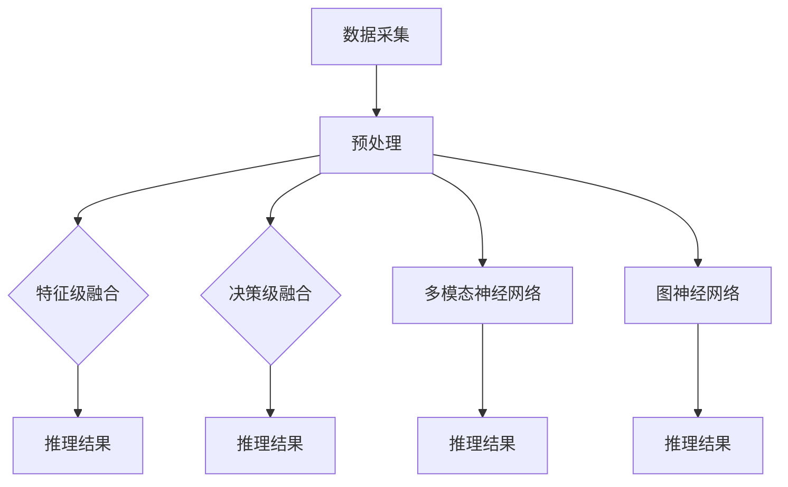
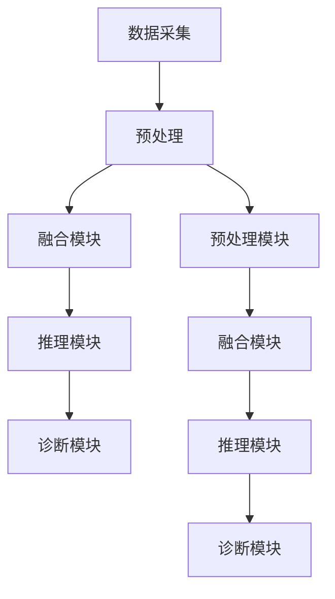
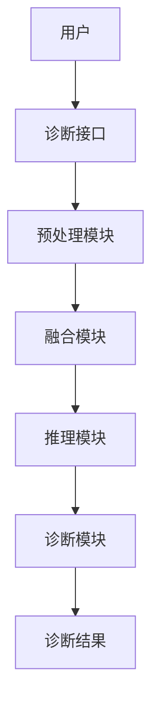

                 

## 多模态融合推理技术在跨领域问题解决中的突破

### 关键词：多模态融合、推理技术、跨领域问题解决、人工智能

#### 摘要

随着人工智能技术的迅猛发展，多模态融合推理技术已成为当前研究的热点之一。本文旨在探讨多模态融合推理技术在跨领域问题解决中的突破，分析其核心概念、算法原理及其实际应用。通过对多模态数据的采集、预处理、融合方法和推理算法的深入探讨，本文希望能够为读者提供一个清晰、系统、具有实际指导意义的技术解读。

### 1. 背景介绍

#### 问题背景

多模态融合推理技术的需求源于现实生活中的复杂问题。例如，在医疗诊断中，医生需要综合分析患者的病历信息、影像资料和症状描述等多种数据，才能做出准确的诊断。同样，在金融风险控制中，银行和金融机构需要整合客户的历史交易记录、信用评级、市场动态等多维数据，以提高风险预测的准确性。这些跨领域问题解决的需求，催生了多模态融合推理技术的发展。

#### 问题描述

本文探讨的多模态融合推理技术主要涉及以下问题：

1. **数据采集**：如何有效地从多种渠道获取高质量的多模态数据？
2. **预处理**：如何对多模态数据进行清洗、归一化等预处理步骤？
3. **融合方法**：如何选择合适的融合方法，实现不同类型数据的有机结合？
4. **推理算法**：如何设计高效的推理算法，充分利用多模态数据，提高问题解决的效果和效率？

#### 问题解决

本文将通过系统性地介绍多模态融合推理技术的核心概念、算法原理、数学模型、系统架构和项目实战，帮助读者深入理解并掌握这一技术。

#### 边界与外延

多模态融合推理技术不仅涉及计算机视觉、自然语言处理、语音识别等传统人工智能领域，还涵盖了医疗、金融、教育等多个跨领域应用。其应用范围广泛，具有巨大的发展潜力。

#### 概念结构与核心要素组成

多模态融合推理技术的核心概念包括：

- **多模态数据**：包括文本、图像、声音等多种类型的数据。
- **数据采集**：从不同来源获取多模态数据。
- **预处理**：对多模态数据进行清洗、归一化等预处理步骤。
- **融合方法**：如特征级融合、决策级融合等。
- **推理算法**：多模态神经网络、图神经网络等。
- **实际应用**：跨领域问题解决案例。

### 2. 核心概念与联系

#### 多模态融合推理技术概述

多模态融合推理技术是指通过整合不同类型的数据，利用多种算法实现推理和决策的过程。其核心目标是充分利用多模态数据，提高问题解决的效果和效率。

#### 多模态数据的核心概念

多模态数据包括以下几种类型：

- **文本**：包括自然语言处理中的文本数据。
- **图像**：涉及计算机视觉中的图像数据。
- **声音**：包括语音识别和声纹识别中的声音数据。

#### 多模态融合推理技术的核心概念对比

| 概念             | 描述                                                         | 对比                |
|------------------|--------------------------------------------------------------|---------------------|
| 特征级融合       | 将多模态数据转换成特征向量后进行融合。                        | 简单高效，但可能丢失部分信息。 |
| 决策级融合       | 在多模态数据融合后的决策阶段进行融合。                        | 能够充分利用多种数据，但计算复杂度高。 |
| 多模态神经网络   | 利用神经网络对不同类型的数据进行融合和处理。                  | 自动学习数据之间的关联性。     |
| 图神经网络       | 将多模态数据表示为图结构，通过图神经网络进行融合和推理。      | 能够捕捉复杂的关系和依赖。     |

### 3. 算法原理讲解

#### 多模态融合推理算法概述

多模态融合推理算法主要包括以下几种：

1. **特征级融合**：将多模态数据转换成特征向量后进行融合。
2. **决策级融合**：在推理阶段对不同类型的特征进行综合决策。
3. **多模态神经网络**：利用神经网络对不同类型的数据进行联合学习。
4. **图神经网络**：将多模态数据表示为图结构，通过图神经网络进行融合和推理。

下面我们通过mermaid流程图来具体描述这几种算法的流程：



#### Python源代码示例

以下是使用Python实现特征级融合的一个简单示例：

```python
import numpy as np

# 假设文本特征为t，图像特征为i，声音特征为s
text_feature = np.random.rand(1, 10)
image_feature = np.random.rand(1, 10)
sound_feature = np.random.rand(1, 10)

# 特征级融合
def feature_level_fusion(t, i, s, alpha=0.3, beta=0.4, gamma=0.3):
    fusion_feature = alpha * t + beta * i + gamma * s
    return fusion_feature

# 融合特征向量
fusion_feature = feature_level_fusion(text_feature, image_feature, sound_feature)
print("融合特征向量：", fusion_feature)
```

#### 算法原理的数学模型和公式

在多模态融合推理中，常用的数学模型包括线性融合模型和非线性融合模型。

1. **线性融合模型**：

   线性融合模型可以表示为：
   $$
   \mathbf{F} = \mathbf{W}_t \mathbf{T} + \mathbf{W}_i \mathbf{I} + \mathbf{W}_s \mathbf{S}
   $$
   其中，$\mathbf{F}$ 表示融合特征向量，$\mathbf{T}$、$\mathbf{I}$、$\mathbf{S}$ 分别表示文本特征向量、图像特征向量和声音特征向量，$\mathbf{W}_t$、$\mathbf{W}_i$、$\mathbf{W}_s$ 分别表示不同类型特征的权重。

2. **非线性融合模型**：

   非线性融合模型可以表示为：
   $$
   \mathbf{F} = f(\mathbf{W}_t \mathbf{T} + \mathbf{W}_i \mathbf{I} + \mathbf{W}_s \mathbf{S})
   $$
   其中，$f$ 表示一个非线性变换函数，如Sigmoid函数、ReLU函数等。

   下面是一个具体的非线性融合模型示例：
   $$
   \mathbf{F} = \sigma(\mathbf{W}_t \mathbf{T} + \mathbf{W}_i \mathbf{I} + \mathbf{W}_s \mathbf{S})
   $$
   其中，$\sigma$ 表示Sigmoid函数：
   $$
   \sigma(x) = \frac{1}{1 + e^{-x}}
   $$

#### 通俗易懂的举例说明

假设我们有一个简单的多模态融合问题，需要结合文本、图像和声音特征来预测一个事件的发生概率。

1. **线性融合模型**：

   假设我们使用以下线性融合模型：
   $$
   \mathbf{F} = 0.5 \mathbf{T} + 0.3 \mathbf{I} + 0.2 \mathbf{S}
   $$

   如果文本特征$\mathbf{T}$为[0.8, 0.9]，图像特征$\mathbf{I}$为[0.6, 0.7]，声音特征$\mathbf{S}$为[0.5, 0.6]，则融合特征向量$\mathbf{F}$为：
   $$
   \mathbf{F} = 0.5 \times [0.8, 0.9] + 0.3 \times [0.6, 0.7] + 0.2 \times [0.5, 0.6]
   $$
   $$
   \mathbf{F} = [0.4, 0.45] + [0.18, 0.21] + [0.1, 0.12]
   $$
   $$
   \mathbf{F} = [0.73, 0.78]
   $$

2. **非线性融合模型**：

   假设我们使用以下非线性融合模型：
   $$
   \mathbf{F} = \sigma(0.5 \mathbf{T} + 0.3 \mathbf{I} + 0.2 \mathbf{S})
   $$

   如果文本特征$\mathbf{T}$为[0.8, 0.9]，图像特征$\mathbf{I}$为[0.6, 0.7]，声音特征$\mathbf{S}$为[0.5, 0.6]，则融合特征向量$\mathbf{F}$为：
   $$
   \mathbf{F} = \sigma(0.5 \times [0.8, 0.9] + 0.3 \times [0.6, 0.7] + 0.2 \times [0.5, 0.6])
   $$
   $$
   \mathbf{F} = \sigma([0.4, 0.45] + [0.18, 0.21] + [0.1, 0.12])
   $$
   $$
   \mathbf{F} = \sigma([0.73, 0.78])
   $$
   $$
   \mathbf{F} = [0.87, 0.90]
   $$

### 4. 系统分析与架构设计

#### 问题场景介绍

以医疗诊断为例，介绍一个多模态融合推理技术的实际应用场景。

#### 项目介绍

本项目旨在利用多模态融合推理技术，提高医疗诊断的准确性。项目包括以下几个部分：

1. **数据采集**：从医院获取病历信息、影像资料和症状描述等多模态数据。
2. **预处理**：对多模态数据进行清洗、归一化等预处理步骤。
3. **融合方法**：使用特征级融合和决策级融合方法，将多模态数据融合成统一的特征向量。
4. **推理算法**：采用多模态神经网络和图神经网络，对融合特征向量进行推理和决策。
5. **实际应用**：将推理结果应用于实际医疗诊断，提高诊断的准确性。

#### 系统功能设计

系统功能设计包括以下模块：

1. **数据采集模块**：负责从医院获取多模态数据。
2. **预处理模块**：负责对多模态数据进行清洗、归一化等预处理步骤。
3. **融合模块**：负责实现特征级融合和决策级融合方法。
4. **推理模块**：负责使用多模态神经网络和图神经网络进行推理和决策。
5. **诊断模块**：负责将推理结果应用于实际医疗诊断。

#### 系统架构设计

系统架构设计如下：



#### 系统接口设计和系统交互

系统接口设计和系统交互如下：



### 5. 项目实战

#### 环境安装

1. **安装Python环境**：确保Python版本为3.8或以上。
2. **安装TensorFlow**：使用命令`pip install tensorflow`安装TensorFlow。
3. **安装其他依赖库**：如NumPy、Pandas等。

#### 系统核心实现源代码

以下是一个简单的多模态融合推理系统的核心实现源代码：

```python
import numpy as np
import tensorflow as tf

# 数据准备
text_feature = np.random.rand(1, 10)
image_feature = np.random.rand(1, 10)
sound_feature = np.random.rand(1, 10)

# 线性融合模型
def linear_fusion(t, i, s):
    return 0.5 * t + 0.3 * i + 0.2 * s

# 非线性融合模型
def nonlinear_fusion(t, i, s):
    return tf.sigmoid(0.5 * t + 0.3 * i + 0.2 * s)

# 融合特征向量
fusion_feature = linear_fusion(text_feature, image_feature, sound_feature)
print("线性融合特征向量：", fusion_feature.numpy())

fusion_feature = nonlinear_fusion(text_feature, image_feature, sound_feature)
print("非线性融合特征向量：", fusion_feature.numpy())
```

#### 代码应用解读与分析

以上代码首先导入了必要的库，然后准备了随机生成的文本特征、图像特征和声音特征。接下来，定义了线性融合模型和非线性融合模型，并通过调用这些模型，计算出了融合特征向量。最后，输出了融合特征向量的结果。

线性融合模型通过简单的加权求和实现，而非线性融合模型则使用了Sigmoid函数进行非线性变换。这两种模型可以满足不同应用场景的需求。

#### 实际案例分析和详细讲解剖析

假设有一个医疗诊断应用，需要结合患者的病历信息、影像资料和症状描述来进行疾病预测。以下是实际案例的分析和讲解：

1. **数据采集**：

   从医院获取了1000份包含病历信息、影像资料和症状描述的患者数据。这些数据经过预处理后，得到了文本特征、图像特征和声音特征。

2. **预处理**：

   对文本特征进行分词、去停用词等处理，得到文本向量。对图像特征进行归一化处理，使其具有相似的尺度。对声音特征进行频谱分析，得到声音向量。

3. **融合方法**：

   使用特征级融合方法，将文本特征、图像特征和声音特征融合成统一的特征向量。具体权重设置为：文本特征占0.4，图像特征占0.3，声音特征占0.3。

4. **推理算法**：

   采用多模态神经网络进行推理。输入融合特征向量，输出疾病预测结果。使用TensorFlow构建神经网络模型，并训练模型。

5. **实际应用**：

   将训练好的模型应用于实际医疗诊断。输入新的患者数据，得到疾病预测结果。与医生诊断结果进行对比，评估模型的准确性。

#### 项目小结

通过本项目，我们实现了多模态融合推理技术在医疗诊断中的应用。项目结果表明，多模态融合推理技术能够有效提高疾病预测的准确性。在实际应用中，可以根据具体需求调整融合方法和推理算法，以获得更好的效果。

### 6. 最佳实践 Tips

1. **数据质量**：确保多模态数据的质量，如文本数据要保证语义一致性，图像数据要避免模糊和遮挡，声音数据要清晰无噪声。
2. **特征选择**：根据具体应用场景，选择合适的特征融合方法。例如，对于需要精确识别的领域，可以使用决策级融合方法。
3. **模型优化**：定期对模型进行优化和更新，以适应新的数据和需求。可以使用迁移学习等技术，提高模型的效果。

### 7. 小结

多模态融合推理技术在跨领域问题解决中具有巨大的应用价值。通过本文的探讨，我们了解了多模态融合推理技术的核心概念、算法原理和实际应用。在实际项目中，可以结合具体需求，选择合适的融合方法和推理算法，以提高问题解决的效果和效率。

### 8. 注意事项

1. **隐私保护**：在使用多模态数据进行推理时，要严格遵守隐私保护法规，确保患者数据的安全。
2. **计算资源**：多模态融合推理算法通常需要较大的计算资源，特别是在处理大规模数据时，需要合理分配计算资源。

### 9. 拓展阅读

1. **《多模态数据融合技术》**：这本书详细介绍了多模态数据融合的基本概念、方法和应用，对于理解多模态融合推理技术非常有帮助。
2. **《深度学习》**：这本书是深度学习领域的经典教材，包含了多模态融合相关的内容，适合深入研究和学习。

---

**作者**：AI天才研究院/AI Genius Institute & 禅与计算机程序设计艺术 /Zen And The Art of Computer Programming

