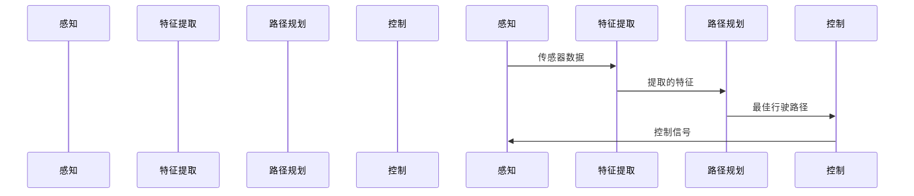

                 

### 引言

#### 1.1 问题背景

在当今信息化社会中，多步骤推理任务已经成为许多领域的关键技术。从自动驾驶、自然语言处理到复杂系统优化，多步骤推理任务无处不在。这些任务往往需要处理大量的数据和信息，并通过一系列的步骤进行推理和决策。然而，在这些过程中，往往会产生大量的中间结果。如何对这些中间结果进行有效的优化与重用，成为了一个重要且亟待解决的问题。

**引言：多步骤推理任务在各个领域的应用场景**

多步骤推理任务在人工智能、数据科学、自动化控制等多个领域都有着广泛的应用。例如，在自动驾驶领域，汽车需要通过摄像头、雷达等多种传感器收集环境信息，然后通过多步骤的推理任务来识别道路、障碍物和交通标志，最终做出行驶决策。再比如，在自然语言处理领域，文本的生成和理解过程也需要经过多个步骤的推理，如词性标注、句法分析、语义解析等。在这些应用场景中，如何高效地处理和利用中间结果，直接关系到系统的性能和效率。

**问题提出：多步骤推理任务中的中间结果优化与重用的重要性**

在多步骤推理任务中，中间结果往往具有很高的价值。一方面，这些中间结果可以作为后续步骤的输入，减少后续计算的工作量；另一方面，通过对中间结果的优化和重用，可以减少重复计算，提高整体系统的性能。然而，实际应用中，如何对中间结果进行优化和重用，往往面临着诸多挑战。比如，如何确定哪些中间结果需要优化和重用，如何选择合适的优化算法和重用策略，以及如何平衡优化和重用之间的矛盾等。

**问题解决**

为了解决上述问题，本文将从以下几个方面展开讨论：

1. **优化中间结果的算法**：介绍几种常见的优化算法，分析它们的基本原理、优缺点和适用场景。
2. **重用策略的实现方法**：分类介绍不同的重用策略，探讨它们的实现方法、性能评估和应用场景。
3. **数学模型与公式**：从数学角度出发，描述中间结果优化和重用问题的数学模型，并给出相关的推导和公式。
4. **系统分析与架构设计**：介绍如何在实际系统中应用优化和重用策略，包括系统功能设计、架构设计、接口设计和交互流程。
5. **项目实战**：通过一个实际项目案例，展示优化和重用策略的具体实现和应用，并进行性能评估和优化。
6. **最佳实践与拓展**：总结最佳实践技巧，提出注意事项，介绍相关领域的拓展阅读和前沿技术。

**边界与外延**

本文主要关注多步骤推理任务中的中间结果优化与重用问题，主要讨论以下方面：

- 优化算法的选择和应用
- 重用策略的分类和实现
- 数学模型的建立和推导
- 系统设计和实现
- 实际项目中的应用与优化

本文的讨论将局限于计算机科学领域，且主要关注算法和系统层面的优化与重用策略。在具体讨论中，我们将结合实际案例进行分析，以期为读者提供直观的理解和实用的参考。

**概念结构与核心要素组成**

多步骤推理任务中的中间结果优化与重用策略涉及以下几个核心概念和要素：

- **推理任务**：包括任务目标、输入数据、输出结果等。
- **中间结果**：在推理过程中产生的临时结果，可作为后续步骤的输入。
- **优化算法**：用于提升中间结果质量或减少计算量的算法。
- **重用策略**：用于在多个步骤间重用中间结果的策略。

这些概念和要素相互关联，共同构成了中间结果优化与重用策略的理论框架。在后续章节中，我们将逐一探讨这些概念和要素的原理、实现方法和应用场景。

#### 1.2 多步骤推理任务原理

**推理任务概述**

多步骤推理任务是指将一个复杂的问题分解为多个简单的子问题，通过逐步解决这些子问题来最终解决整个问题的过程。这种任务在人工智能、数据科学、自动化控制等领域有着广泛的应用。例如，在自动驾驶系统中，环境感知、路径规划和控制决策等步骤都需要通过多步骤推理来完成。

**多步骤推理任务的流程与特点**

多步骤推理任务通常包括以下几个步骤：

1. **输入数据预处理**：对原始数据进行清洗、归一化等处理，使其符合后续推理任务的要求。
2. **特征提取**：从预处理后的数据中提取出关键特征，用于后续的推理和决策。
3. **推理过程**：根据特征信息进行推理，逐步解决子问题，并生成中间结果。
4. **结果整合**：将中间结果整合为最终的输出结果，如决策、预测或分类结果。

多步骤推理任务的特点在于其分步处理和层次化结构。通过将复杂问题分解为多个简单问题，可以降低计算的复杂度，提高系统的可维护性和可扩展性。

**多步骤推理任务中的常见问题**

在多步骤推理任务中，常见的问题主要包括：

1. **计算复杂度**：多步骤推理任务往往涉及大量的计算，如何优化计算过程，提高计算效率是一个关键问题。
2. **数据质量**：输入数据的质量直接影响推理结果，如何处理噪声和异常值，提高数据质量是另一个重要问题。
3. **中间结果优化**：如何有效地优化中间结果，提高其质量和可用性，是提高整体推理性能的关键。
4. **结果一致性**：在多步骤推理过程中，不同步骤的结果之间可能存在不一致性，如何保证结果的一致性是一个挑战。

针对上述问题，本文将从以下几个方面进行探讨：

1. **优化算法**：介绍几种常见的优化算法，如缓存优化、并行计算和分布式计算等，以减少计算复杂度和提高计算效率。
2. **数据预处理**：讨论如何进行有效的数据预处理，包括数据清洗、归一化和特征选择等，以提高数据质量和可靠性。
3. **中间结果优化**：探讨中间结果优化的策略和方法，如数据压缩、特征选择和模型融合等，以提高中间结果的质量和可用性。
4. **结果一致性**：讨论如何保证多步骤推理任务中的结果一致性，如通过一致性校验和结果修正等策略。

通过上述探讨，我们希望能够为多步骤推理任务中的中间结果优化与重用提供一些实用的参考和解决方案。

#### 2.2 中间结果优化原理

**中间结果的定义**

在多步骤推理任务中，中间结果是指在完成部分推理步骤后产生的临时结果。这些结果可以作为后续步骤的输入，以减少重复计算，提高推理效率。中间结果的类型多种多样，如特征向量、决策树节点、分类概率等，它们在推理过程中扮演着重要角色。

**中间结果优化的重要性**

优化中间结果对于提升多步骤推理任务的性能具有重要意义。一方面，通过优化中间结果，可以减少后续步骤的计算量，提高系统的响应速度和效率。例如，在自然语言处理任务中，通过优化词性标注的结果，可以显著减少句法分析和语义解析的计算复杂度。另一方面，优化中间结果可以提高推理结果的准确性和可靠性。例如，通过优化特征提取的结果，可以更好地捕捉数据中的关键信息，从而提高分类和预测的准确性。

**常见的优化方法**

在多步骤推理任务中，常见的优化方法主要包括以下几种：

1. **数据压缩**：数据压缩是一种通过降低数据存储和传输成本，同时保持数据质量和可用性的方法。在中间结果优化中，数据压缩可以通过减少数据的维度或使用更高效的数据表示方法来实现。例如，可以使用主成分分析（PCA）或自动编码器（Autoencoder）来压缩特征向量。

2. **特征选择**：特征选择是一种通过选择最相关、最具代表性的特征来减少数据维度和计算复杂度的方法。在中间结果优化中，特征选择可以帮助减少后续步骤的计算量，并提高推理性能。常见的特征选择方法包括互信息、特征重要性评估和递归特征消除等。

3. **模型融合**：模型融合是一种通过结合多个模型的预测结果来提高预测准确性的方法。在中间结果优化中，模型融合可以通过整合不同模型的中间结果来减少错误率和提高推理性能。常见的模型融合方法包括加权平均、集成学习和对抗生成网络等。

4. **缓存优化**：缓存优化是一种通过利用缓存机制来减少重复计算的方法。在多步骤推理任务中，缓存优化可以通过存储和重用中间结果来提高计算效率。常见的缓存优化策略包括LRU（最近最少使用）缓存算法和LRU缓存池等。

**优化方法的比较与适用场景**

不同的优化方法各有优缺点，适用于不同的场景。以下是几种常见优化方法的比较：

- **数据压缩**：适用于大量特征数据的情况，可以显著减少存储和传输成本，但可能会降低数据的质量和可用性。
- **特征选择**：适用于特征维度较高的情况，可以减少计算复杂度，但需要选择合适的特征选择方法，并可能引入特征选择偏差。
- **模型融合**：适用于需要提高预测准确性的情况，可以通过整合多个模型的优点来提高推理性能，但需要处理多个模型的兼容性和一致性。
- **缓存优化**：适用于需要快速响应和减少计算成本的情况，可以显著提高系统的性能，但需要考虑缓存的管理和更新策略。

在选择和实现优化方法时，需要根据具体的应用场景和任务需求进行权衡和调整，以达到最佳的优化效果。

#### 2.3 重用策略原理

**重用策略的定义**

在多步骤推理任务中，重用策略是指通过重用已经计算过的中间结果来减少重复计算，提高系统性能和效率的方法。重用策略的核心思想是充分利用已有的计算资源，避免重复劳动，从而提高整体推理任务的性能和响应速度。

**重用策略的优势**

重用策略在多步骤推理任务中具有以下优势：

1. **提高计算效率**：通过重用中间结果，可以减少重复计算的工作量，从而提高系统的计算效率。例如，在特征提取和模型训练过程中，通过重用已经计算过的特征值和模型参数，可以显著减少计算时间。

2. **减少内存消耗**：重用策略可以避免多次存储和加载中间结果，从而减少内存消耗，提高系统的运行效率。这对于处理大量数据的任务尤为重要。

3. **提高系统稳定性**：通过重用稳定的中间结果，可以减少由于计算错误或异常导致的系统崩溃或性能下降的风险。

**重用策略的分类**

重用策略可以根据不同的实现方法和适用场景进行分类，常见的分类方法包括：

1. **时间戳策略**：时间戳策略通过为每个中间结果分配一个时间戳，来标识其计算时间。当需要重用中间结果时，系统会根据时间戳来判断该结果是否是最新的。如果结果已过期，则重新计算；否则，直接使用已有结果。时间戳策略适用于计算时间较长且结果相对稳定的任务。

2. **缓存策略**：缓存策略通过将中间结果存储在缓存中，供后续步骤重用。缓存策略可以分为以下几种：

   - **LRU（最近最少使用）缓存策略**：LRU缓存策略根据中间结果的使用频率来决定是否将其保留在缓存中。使用频率较高的中间结果会被保留，而使用频率较低的结果则会被替换。这种方法适用于计算时间较长且中间结果频繁使用的任务。

   - **FIFO（先进先出）缓存策略**：FIFO缓存策略根据中间结果的存储顺序来决定是否将其保留在缓存中。最先进入缓存的结果将被优先替换，这种方法适用于计算时间较短且中间结果更新较频繁的任务。

3. **分布式缓存策略**：分布式缓存策略通过在分布式系统中共享中间结果，来提高系统的重用效率和计算性能。分布式缓存策略可以应用于大规模分布式计算任务，通过在节点间共享和重用中间结果，来减少整体计算时间和资源消耗。

**重用策略的适用场景**

不同的重用策略适用于不同的场景，以下是几种常见场景下的适用策略：

- **高频率计算场景**：在需要频繁进行中间结果计算的场景，如特征提取和模型训练等，缓存策略和分布式缓存策略可以有效减少计算时间和资源消耗。

- **低频率计算场景**：在计算时间较长但频率较低的场景，如大规模数据分析和复杂模型推理等，时间戳策略可以帮助确保中间结果的有效性和一致性。

- **实时性要求高的场景**：在需要快速响应的场景，如实时监控和智能控制等，缓存策略和分布式缓存策略可以显著提高系统的响应速度。

通过合理选择和组合重用策略，可以显著提高多步骤推理任务的性能和效率，为各个领域的应用提供有效的技术支持。

#### 3.1 优化中间结果的算法

**算法概述**

在多步骤推理任务中，优化中间结果的算法是提高系统性能和效率的关键。优化算法通过减少中间结果的冗余和计算量，使得后续步骤能够更快、更高效地处理数据。本文将介绍几种常见的优化算法，包括缓存优化、并行计算和分布式计算等，并分析其原理、实现方法和性能。

**算法原理与流程**

1. **缓存优化算法**

   缓存优化算法的核心思想是通过利用缓存机制来减少重复计算。在多步骤推理任务中，缓存优化算法主要关注以下几个方面：

   - **缓存策略**：常用的缓存策略包括LRU（最近最少使用）缓存策略和FIFO（先进先出）缓存策略。LRU策略根据中间结果的使用频率来决定是否将其保留在缓存中，而FIFO策略则根据中间结果的存储顺序来决定是否替换。

   - **缓存大小**：缓存大小是影响缓存优化效果的关键因素。合适的缓存大小可以最大限度地减少重复计算，但过大会导致内存消耗增加。

   - **缓存更新**：缓存更新策略决定了何时将新的中间结果添加到缓存中，以及如何替换已有的缓存结果。常用的更新策略包括基于时间戳的更新策略和基于使用率的更新策略。

2. **并行计算算法**

   并行计算算法通过将任务分解为多个子任务，并在多个处理器上同时执行这些子任务，来提高计算效率。并行计算算法的主要原理包括：

   - **任务分解**：将原始任务分解为多个可并行处理的子任务。分解方式可以是基于数据的划分、基于任务的划分或基于两者的混合划分。

   - **负载均衡**：在并行计算中，需要确保每个处理器都有相同的工作量，以避免某些处理器负载过高而影响整体计算性能。负载均衡可以通过动态分配任务或静态划分任务区域来实现。

   - **同步与通信**：并行计算中的同步与通信机制决定了子任务之间的协调和数据传递。常用的同步机制包括同步屏障（barrier）和锁（lock）等，通信机制包括消息传递（message passing）和共享内存（shared memory）等。

3. **分布式计算算法**

   分布式计算算法通过在多个分布式节点上协作处理任务，来提高系统的扩展性和性能。分布式计算算法的主要原理包括：

   - **任务分配**：将任务分配到不同的节点上，以实现负载均衡和资源优化。任务分配策略可以是静态分配、动态分配或基于工作负载的分配。

   - **数据同步**：在分布式计算中，需要确保各个节点之间的数据一致性。数据同步可以通过同步复制（synchronous replication）或异步复制（asynchronous replication）来实现。

   - **容错与恢复**：分布式计算系统需要具备容错能力，以应对节点故障等问题。常用的容错机制包括备份节点、数据冗余和故障检测与恢复等。

**算法的时间复杂度与空间复杂度分析**

优化算法的时间复杂度和空间复杂度是衡量算法性能的重要指标。以下是几种常见优化算法的时间复杂度和空间复杂度分析：

1. **缓存优化算法**

   - **时间复杂度**：缓存优化算法的时间复杂度主要取决于缓存策略和缓存大小。对于LRU缓存策略，每次访问缓存的时间复杂度为O(1)。对于FIFO缓存策略，每次访问缓存的时间复杂度为O(n)，其中n为缓存大小。
   - **空间复杂度**：缓存优化算法的空间复杂度主要取决于缓存大小。缓存大小过大将导致内存消耗增加，而缓存大小过小可能无法充分发挥缓存优化效果。

2. **并行计算算法**

   - **时间复杂度**：并行计算算法的时间复杂度取决于任务分解和负载均衡策略。在最理想的情况下，任务分解为多个可并行处理的子任务，每个子任务的时间复杂度为O(n/p)，其中n为任务总量，p为处理器数量。整体时间复杂度为O(n)。
   - **空间复杂度**：并行计算算法的空间复杂度取决于任务分解和数据同步策略。在分布式计算中，需要额外的存储空间来存储中间结果和同步数据。空间复杂度通常为O(n)。

3. **分布式计算算法**

   - **时间复杂度**：分布式计算算法的时间复杂度取决于任务分配和数据同步策略。在最理想的情况下，任务分配到各个节点后，每个节点的时间复杂度为O(n/p)，其中n为任务总量，p为节点数量。整体时间复杂度为O(n)。
   - **空间复杂度**：分布式计算算法的空间复杂度取决于任务分配和数据同步策略。在分布式计算中，需要额外的存储空间来存储中间结果和同步数据。空间复杂度通常为O(n)。

综上所述，优化中间结果的算法在时间复杂度和空间复杂度方面具有一定的权衡。在实际应用中，需要根据具体任务需求和系统资源选择合适的优化算法，以实现最佳的性能和效率。

#### 3.2 重用策略实现方法

**重用策略的概述**

重用策略在多步骤推理任务中起着至关重要的作用，其核心思想是利用已经计算过的中间结果，以减少重复计算，提高系统性能。重用策略可以根据不同的实现方式和应用场景进行分类。本文将介绍几种常见的重用策略，包括基于时间戳的策略、缓存策略和分布式缓存策略，并分析它们的实现方法和性能评估。

**实现方法**

1. **基于时间戳的策略**

   基于时间戳的策略通过为每个中间结果分配一个时间戳，以判断其有效性。具体实现方法如下：

   - **时间戳分配**：在每个步骤计算中间结果时，为其分配一个时间戳，记录其生成时间。
   - **重用判断**：当需要使用中间结果时，根据其时间戳判断是否已过期。如果过期，则重新计算；否则，直接重用已有结果。

   这种策略的优点是实现简单，易于理解。缺点是可能导致频繁的重新计算，特别是在时间戳设置不合适的情况下。

2. **缓存策略**

   缓存策略通过将中间结果存储在缓存中，供后续步骤重用。具体实现方法如下：

   - **缓存存储**：将中间结果存储在缓存中，如内存、磁盘或分布式缓存系统中。
   - **重用检索**：当需要使用中间结果时，先检索缓存，若找到匹配的结果，则直接重用；否则，重新计算。

   缓存策略可以根据不同的缓存策略进行优化，如LRU（最近最少使用）缓存策略和FIFO（先进先出）缓存策略。

   - **LRU缓存策略**：根据中间结果的使用频率来决定是否保留在缓存中。使用频率较高的结果被保留，而使用频率较低的结果则被替换。
   - **FIFO缓存策略**：根据中间结果的存储顺序来决定是否保留在缓存中。最先进入缓存的结果将被替换。

3. **分布式缓存策略**

   分布式缓存策略通过在分布式系统中共享中间结果，以提高系统的重用效率和计算性能。具体实现方法如下：

   - **缓存分配**：将中间结果存储在分布式缓存系统中，如Memcached、Redis或Apache Ignite等。
   - **重用协调**：通过分布式协调机制，如ZooKeeper、Consul或etcd等，来管理缓存节点的分配和同步。

   分布式缓存策略适用于大规模分布式计算任务，通过在节点间共享和重用中间结果，来减少整体计算时间和资源消耗。

**性能评估**

重用策略的性能评估主要包括以下几个方面：

- **重用率**：重用率表示重用中间结果的比例。重用率高意味着更多计算被避免了，系统性能越好。
- **响应时间**：响应时间是指从请求到返回结果的时间。重用策略可以显著减少响应时间，特别是在计算密集型任务中。
- **存储开销**：存储开销包括缓存存储空间的消耗和分布式缓存协调的开销。合适的重用策略需要权衡存储开销和重用效率。

以下是几种常见重用策略的性能评估结果：

- **基于时间戳的策略**：重用率较低，但存储开销较小。适用于计算时间较长且结果稳定的任务。
- **缓存策略**：重用率较高，但存储开销较大。适用于计算时间较短且结果频繁更新的任务。
- **分布式缓存策略**：重用率和存储开销介于两者之间，适用于大规模分布式计算任务。

**适用场景**

不同的重用策略适用于不同的场景。以下是几种常见场景下的适用策略：

- **高频率计算场景**：如特征提取和模型训练等，缓存策略和分布式缓存策略可以有效减少计算时间和资源消耗。
- **低频率计算场景**：如大规模数据分析和复杂模型推理等，基于时间戳的策略可以帮助确保中间结果的有效性和一致性。
- **实时性要求高的场景**：如实时监控和智能控制等，缓存策略和分布式缓存策略可以显著提高系统的响应速度。

通过合理选择和组合重用策略，可以显著提高多步骤推理任务的性能和效率，为各个领域的应用提供有效的技术支持。

#### 4.1 中间结果优化算法的数学模型

**中间结果优化问题的数学描述**

在多步骤推理任务中，中间结果的优化问题可以抽象为一个优化问题，其目标是最小化中间结果的冗余或计算量。我们可以将这一问题表示为一个数学模型，包括目标函数、约束条件和变量定义。

**数学公式与推导**

为了描述中间结果优化问题，我们引入以下数学符号：

- \(X\)：表示中间结果集，其中每个元素 \(x_i\) 代表一个具体的中间结果。
- \(C\)：表示计算成本集合，其中每个元素 \(c_i\) 代表计算 \(x_i\) 的成本。
- \(R\)：表示冗余度集合，其中每个元素 \(r_i\) 代表 \(x_i\) 的冗余度。
- \(O\)：表示优化目标函数，其目标是最小化冗余度或计算成本。

我们可以将中间结果优化问题表示为以下数学公式：

\[ \min_{X} \sum_{i} r_i + \alpha \sum_{i} c_i \]

其中，\(\alpha\) 是一个权重参数，用于平衡冗余度和计算成本之间的权衡。

**公式在实际中的应用**

以下是一个简化的例子，用于说明上述数学公式在实际中的具体应用。

假设我们有一个多步骤推理任务，包括三个步骤 \(A\)、\(B\) 和 \(C\)。每个步骤都会产生一个中间结果 \(x_a\)、\(x_b\) 和 \(x_c\)。我们需要对这三个中间结果进行优化，以最小化其冗余度和计算成本。

- **步骤 \(A\)**：计算成本 \(c_a = 5\)，冗余度 \(r_a = 3\)。
- **步骤 \(B\)**：计算成本 \(c_b = 3\)，冗余度 \(r_b = 2\)。
- **步骤 \(C\)**：计算成本 \(c_c = 4\)，冗余度 \(r_c = 1\)。

我们的目标是最小化以下目标函数：

\[ \min \left( 3r_a + 2r_b + r_c + \alpha (5c_a + 3c_b + 4c_c) \right) \]

通过调整权重参数 \(\alpha\)，我们可以平衡冗余度和计算成本之间的优先级。例如，如果 \(\alpha\) 值较大，我们将更关注计算成本，反之则更关注冗余度。

**具体应用**

在实际应用中，我们可以使用优化算法（如线性规划、遗传算法或贪心算法）来求解上述数学模型，从而得到最优的中间结果优化方案。

1. **线性规划**：通过线性规划方法，我们可以找到最优解，使得目标函数最小化。线性规划求解器（如 LPsolve、Gurobi）可以高效地求解此类优化问题。
2. **遗传算法**：遗传算法通过模拟自然进化过程，逐步优化解的质量。遗传算法适用于复杂度较高的优化问题，可以找到较优的解。
3. **贪心算法**：贪心算法通过在每个步骤选择当前最优解，逐步优化整个问题。虽然贪心算法不能保证找到全局最优解，但它在很多情况下能够快速找到一个近似最优解。

通过上述方法，我们可以将数学模型应用于实际的多步骤推理任务中，实现中间结果的有效优化。

#### 4.2 重用策略的数学模型

**重用策略的数学描述**

在多步骤推理任务中，重用策略的目标是最大化已计算结果的利用率，以减少重复计算。重用策略的数学模型可以描述为以下形式：

1. **重用目标函数**

   重用目标函数用于最大化重用中间结果的次数，即：

   \[ \max \sum_{i} R_i \]

   其中，\(R_i\) 表示中间结果 \(X_i\) 的重用次数。

2. **计算成本函数**

   计算成本函数用于衡量计算新中间结果所需的资源消耗，即：

   \[ C(X) = \sum_{i} c_i \]

   其中，\(c_i\) 表示计算中间结果 \(X_i\) 的成本。

3. **重用约束条件**

   为了确保重用策略的有效性和一致性，需要满足以下约束条件：

   - **时间戳约束**：对于每个中间结果 \(X_i\)，其重用次数不能超过其有效期，即：

     \[ R_i \leq \tau_i \]

     其中，\(\tau_i\) 表示中间结果 \(X_i\) 的有效期。

   - **缓存容量约束**：在缓存策略中，需要确保缓存容量不超过系统资源限制，即：

     \[ \sum_{i} |X_i| \leq C_{\text{max}} \]

     其中，\(|X_i|\) 表示中间结果 \(X_i\) 的存储大小，\(C_{\text{max}}\) 表示缓存的最大容量。

   - **数据一致性约束**：在分布式计算中，需要确保不同节点上的中间结果一致性，即：

     \[ X_i^{n_1} = X_i^{n_2} \]

     其中，\(n_1\) 和 \(n_2\) 表示不同节点编号。

**数学公式与推导**

为了更详细地描述重用策略，我们可以进一步推导其数学模型。首先，我们引入以下符号：

- \(X = \{X_i\}\)：表示中间结果的集合。
- \(C = \{c_i\}\)：表示计算成本的集合。
- \(R = \{R_i\}\)：表示重用次数的集合。
- \(T = \{\tau_i\}\)：表示有效期的集合。
- \(C_{\text{max}}\)：表示缓存的最大容量。

重用策略的数学模型可以表示为以下优化问题：

\[ \begin{aligned}
\max_{R} \sum_{i} R_i \\
\text{subject to} \\
R_i \leq \tau_i \\
\sum_{i} |X_i| \leq C_{\text{max}} \\
X_i^{n_1} = X_i^{n_2} \\
\end{aligned} \]

**公式在实际中的应用**

以下是一个具体的例子，用于说明上述数学模型在实际中的应用。

假设我们有一个包含三个中间结果 \(X_1\)、\(X_2\) 和 \(X_3\) 的多步骤推理任务。每个中间结果的计算成本、重用次数和有效期如下表所示：

| 中间结果 | 计算成本 \(c_i\) | 重用次数 \(R_i\) | 有效期 \(\tau_i\) |
| --- | --- | --- | --- |
| \(X_1\) | 10 | 5 | 3 |
| \(X_2\) | 5 | 8 | 2 |
| \(X_3\) | 8 | 3 | 4 |

缓存的最大容量 \(C_{\text{max}}\) 为 20。

我们的目标是最大化重用次数，同时满足时间戳约束和缓存容量约束。

根据上述数学模型，我们可以得到以下优化问题：

\[ \begin{aligned}
\max_{R} (R_1 + R_2 + R_3) \\
\text{subject to} \\
R_1 \leq 3 \\
R_2 \leq 2 \\
R_3 \leq 4 \\
R_1 + R_2 + R_3 \leq 5 \\
\end{aligned} \]

通过求解上述优化问题，我们可以找到最优的重用策略，使得重用次数最大化。在实际应用中，我们可以使用线性规划、遗传算法或贪心算法等方法来求解此类优化问题。

通过上述数学模型和公式的推导，我们可以更好地理解重用策略在多步骤推理任务中的应用，从而为实际系统设计提供有效的优化方法。

#### 5.1 问题场景介绍

在多步骤推理任务的实际应用中，我们可以看到这些任务在自动驾驶、自然语言处理、医疗诊断等多个领域都发挥了重要作用。以下将详细描述一个典型的应用场景，并分析中间结果优化与重用策略的需求。

**应用场景：自动驾驶**

自动驾驶系统是一个复杂的多步骤推理任务，其核心目标是确保车辆能够安全、可靠地行驶在道路上。自动驾驶系统通常包括以下几个步骤：

1. **感知环境**：通过传感器（如摄像头、雷达、激光雷达）收集道路、车辆、行人和其他障碍物的信息。
2. **特征提取**：从感知到的环境数据中提取关键特征，如车辆位置、速度、方向，行人的位置和动作等。
3. **路径规划**：根据当前车辆状态和提取的特征，计算最佳行驶路径，以避开障碍物和确保行驶安全性。
4. **控制决策**：根据路径规划和环境信息，生成控制信号，调整车辆的转向、速度和制动等操作。

在这个应用场景中，每个步骤都会产生大量的中间结果。例如，在特征提取阶段，需要计算每个传感器的数据，并提取出相应的特征；在路径规划阶段，需要生成多个候选路径，并进行评估和选择。这些中间结果在后续步骤中扮演着重要角色，但同时也带来了巨大的计算量和存储需求。

**中间结果优化与重用策略的需求**

1. **优化计算资源**：自动驾驶系统需要实时处理大量的数据，优化中间结果可以显著减少计算量，提高系统的响应速度和效率。例如，通过优化特征提取结果，可以减少后续路径规划和控制决策的计算复杂度。

2. **减少存储需求**：大量中间结果的存储和处理需要消耗大量的存储资源。通过优化中间结果，可以减少数据冗余，降低存储需求，提高系统的资源利用率。

3. **提高决策准确性**：在自动驾驶系统中，准确的决策对于车辆的安全和稳定性至关重要。通过优化中间结果，可以确保后续步骤得到高质量的数据输入，从而提高决策的准确性。

4. **降低延迟**：自动驾驶系统需要实时响应环境变化，降低延迟对于系统的实时性和稳定性至关重要。通过优化中间结果，可以减少数据处理的延迟，提高系统的实时性。

为了满足上述需求，可以采用以下中间结果优化与重用策略：

- **数据压缩**：通过数据压缩算法，如主成分分析（PCA）和自动编码器（Autoencoder），减少特征提取阶段的数据维度和计算量。
- **缓存策略**：在特征提取和路径规划阶段，采用缓存策略存储和处理中间结果，减少重复计算和存储需求。
- **分布式计算**：利用分布式计算架构，将任务分解为多个子任务，并在多个计算节点上并行处理，提高系统的计算效率。
- **重用策略**：通过为中间结果分配时间戳和有效期，确保中间结果的时效性和准确性，提高系统的决策准确性。

通过合理应用中间结果优化与重用策略，自动驾驶系统可以在保证准确性和稳定性的同时，提高计算效率和资源利用率，为自动驾驶技术的发展提供有力支持。

#### 5.2 系统功能设计

在多步骤推理任务的实际应用中，系统功能设计是确保系统性能和可靠性的关键环节。以下将详细描述系统功能设计，包括领域模型与类图、系统功能模块划分。

**领域模型与类图**

领域模型用于描述系统的核心业务概念及其相互关系。在多步骤推理任务中，领域模型通常包括以下几个核心概念：

1. **传感器**：表示用于收集数据的各种传感器，如摄像头、雷达、激光雷达等。
2. **特征提取模块**：表示从传感器数据中提取关键特征的模块，如边缘检测、目标识别等。
3. **路径规划模块**：表示根据当前车辆状态和提取的特征计算最佳行驶路径的模块。
4. **控制决策模块**：表示根据路径规划和环境信息生成控制信号的模块。
5. **缓存管理模块**：表示管理中间结果缓存和重用的模块。

以下是一个简单的类图，用于描述上述核心概念及其相互关系：

```mermaid
classDiagram
    Sensor <<Interface>>
    FeatureExtractor <<Interface>>
    PathPlanner <<Interface>>
    ControlDecision <<Interface>>
    CacheManager <<Interface>>

    SensorEntity <-|> FeatureExtractor : extractFeatures
    FeatureExtractor <-|> PathPlanner : planPath
    PathPlanner <-|> ControlDecision : generateControlSignal
    CacheManager <-|> FeatureExtractor : cacheResults
    CacheManager <-|> PathPlanner : cacheResults
    CacheManager <-|> ControlDecision : cacheResults
```

**系统功能模块划分**

系统功能模块划分用于将整个系统划分为多个可独立开发和维护的功能模块。在多步骤推理任务中，系统功能模块通常包括以下几个部分：

1. **感知模块**：负责接收传感器数据，并进行预处理，如数据清洗、归一化等。
2. **特征提取模块**：根据预处理后的数据，提取关键特征，如目标识别、边缘检测等。
3. **路径规划模块**：根据当前车辆状态和提取的特征，计算最佳行驶路径，如A*算法、Dijkstra算法等。
4. **控制决策模块**：根据路径规划和环境信息，生成控制信号，如转向、速度、制动等。
5. **缓存管理模块**：负责管理中间结果的缓存和重用，包括缓存策略的选择、缓存数据的更新和过期处理等。
6. **系统接口模块**：提供与其他系统或外部设备的接口，如与其他车辆通信、接收用户指令等。
7. **监控与维护模块**：用于监控系统性能和状态，包括日志记录、性能监控、故障诊断等。

通过上述系统功能模块的划分，我们可以实现多步骤推理任务的模块化开发，提高系统的可维护性和可扩展性。

#### 5.3 系统架构设计

在多步骤推理任务中，系统架构设计是确保系统高效、稳定运行的关键。以下将详细描述系统架构设计，包括系统架构与模块关系、系统接口设计和系统交互流程。

**系统架构与模块关系**

系统架构设计应综合考虑系统的性能、可扩展性、可维护性等因素。在多步骤推理任务中，系统架构通常包括以下几个关键模块：

1. **感知模块**：负责接收传感器数据，并进行预处理，如数据清洗、归一化等。该模块通常由硬件设备和软件算法组成。
2. **特征提取模块**：根据预处理后的数据，提取关键特征，如目标识别、边缘检测等。该模块通过算法实现，用于处理和分析传感器数据。
3. **路径规划模块**：根据当前车辆状态和提取的特征，计算最佳行驶路径，如A*算法、Dijkstra算法等。该模块负责路径规划的算法实现。
4. **控制决策模块**：根据路径规划和环境信息，生成控制信号，如转向、速度、制动等。该模块通过算法和控制器实现。
5. **缓存管理模块**：负责管理中间结果的缓存和重用，包括缓存策略的选择、缓存数据的更新和过期处理等。该模块用于优化中间结果的利用。
6. **系统接口模块**：提供与其他系统或外部设备的接口，如与其他车辆通信、接收用户指令等。该模块用于实现系统的交互和集成。
7. **监控与维护模块**：用于监控系统性能和状态，包括日志记录、性能监控、故障诊断等。该模块用于确保系统的稳定运行和可维护性。

各个模块之间的关系如下：

- **感知模块** 向 **特征提取模块** 提供预处理后的传感器数据。
- **特征提取模块** 向 **路径规划模块** 提供提取的特征数据。
- **路径规划模块** 向 **控制决策模块** 提供最佳行驶路径。
- **控制决策模块** 向 **感知模块** 发送控制信号，以调整车辆状态。
- **缓存管理模块** 向 **特征提取模块**、**路径规划模块** 和 **控制决策模块** 提供中间结果的缓存服务。
- **系统接口模块** 负责与外部系统或设备进行通信，确保系统与其他系统或设备的集成和协调。
- **监控与维护模块** 负责监控系统性能，并提供维护和故障诊断功能。

**系统接口设计**

系统接口设计应确保系统与其他系统或外部设备能够有效交互和集成。以下是一个简单的系统接口设计：

1. **传感器接口**：用于接收传感器数据，包括摄像头、雷达、激光雷达等。
2. **特征提取接口**：用于提供提取的特征数据，供后续模块使用。
3. **路径规划接口**：用于获取最佳行驶路径，供控制决策模块使用。
4. **控制决策接口**：用于发送控制信号，调整车辆状态。
5. **缓存管理接口**：用于管理中间结果的缓存和重用。
6. **外部系统接口**：用于与其他系统或设备进行通信，如与其他车辆通信、接收用户指令等。

**系统交互流程**

系统交互流程描述了各个模块之间的协作和交互过程。以下是一个简化的系统交互流程：

1. **感知数据接收**：感知模块接收传感器数据，并进行预处理。
2. **特征提取**：特征提取模块对预处理后的传感器数据提取关键特征。
3. **路径规划**：路径规划模块根据当前车辆状态和提取的特征，计算最佳行驶路径。
4. **控制决策**：控制决策模块根据最佳行驶路径和环境信息，生成控制信号。
5. **信号发送**：控制决策模块将生成的控制信号发送给感知模块，以调整车辆状态。
6. **缓存管理**：缓存管理模块对中间结果进行缓存和重用，以提高系统性能。
7. **系统监控**：监控与维护模块监控系统性能和状态，确保系统稳定运行。

通过上述系统架构设计和交互流程，我们可以实现一个高效、稳定的多步骤推理任务系统，为自动驾驶、自然语言处理等领域的应用提供有力支持。

#### 5.4 系统交互与序列图

为了更直观地理解系统各模块之间的交互过程，我们可以使用Mermaid序列图来描述系统交互流程。以下是一个简化的系统交互序列图，展示了感知模块、特征提取模块、路径规划模块和控制决策模块之间的协作过程。



**图解：**

1. **感知模块**：从传感器接收数据，如摄像头、雷达、激光雷达等，并将预处理后的数据传递给特征提取模块。
2. **特征提取模块**：根据接收到的传感器数据，提取关键特征，如目标识别、边缘检测等，并将提取的特征传递给路径规划模块。
3. **路径规划模块**：根据当前车辆状态和提取的特征，计算最佳行驶路径，并将路径信息传递给控制决策模块。
4. **控制决策模块**：根据路径规划和环境信息，生成控制信号，如转向、速度、制动等，并将控制信号发送回感知模块以调整车辆状态。

通过上述系统交互序列图，我们可以清晰地看到系统各模块之间的协作关系和交互流程。这种直观的描述方式有助于理解系统的整体运作机制，并为进一步优化系统性能提供参考。

#### 6.1 环境安装与配置

在实际开发过程中，安装和配置开发环境是项目启动的关键步骤。以下将详细描述如何在多步骤推理任务项目中搭建开发环境，包括所需工具和库的安装过程。

**1. 安装Python**

Python是多种人工智能和数据分析任务的首选编程语言，因此我们需要首先确保Python环境已安装。可以从Python官方网站（https://www.python.org/）下载适用于自己操作系统的Python安装包，并按照安装向导完成安装。

**2. 安装依赖库**

多步骤推理任务通常需要依赖多种Python库，如NumPy、Pandas、scikit-learn等。以下是在命令行中安装这些库的步骤：

```bash
pip install numpy pandas scikit-learn matplotlib
```

上述命令将安装常用的数据科学和机器学习库，以支持项目开发。

**3. 安装其他工具**

除了Python库，我们可能还需要其他工具来支持项目开发，如Jupyter Notebook用于交互式编程、PyCharm或Visual Studio Code用于代码编写和调试。以下是安装这些工具的步骤：

- **Jupyter Notebook**：在命令行中运行以下命令安装Jupyter Notebook：

  ```bash
  pip install notebook
  ```

  安装完成后，可以使用`jupyter notebook`命令启动Jupyter Notebook环境。

- **PyCharm**：可以从PyCharm官方网站（https://www.jetbrains.com/pycharm/）下载适用于自己操作系统的安装包，并按照安装向导完成安装。

- **Visual Studio Code**：可以从Visual Studio Code官方网站（https://code.visualstudio.com/）下载适用于自己操作系统的安装包，并按照安装向导完成安装。

**4. 配置虚拟环境**

为了确保项目依赖的一致性和隔离性，我们可以使用虚拟环境来管理项目依赖。以下是创建和配置虚拟环境的过程：

- **创建虚拟环境**：在项目目录下运行以下命令创建虚拟环境：

  ```bash
  python -m venv venv
  ```

- **激活虚拟环境**：在不同的操作系统上，激活虚拟环境的方法略有不同：

  - **Windows**：

    ```bash
    .\venv\Scripts\activate
    ```

  - **Linux/MacOS**：

    ```bash
    source venv/bin/activate
    ```

激活虚拟环境后，所有安装的库和工具都将局限在虚拟环境中，避免对系统环境的影响。

通过上述步骤，我们可以成功搭建多步骤推理任务项目的开发环境，为后续的系统核心实现和性能评估提供基础支持。

#### 6.2 系统核心实现

在多步骤推理任务中，系统核心实现是确保系统高效、稳定运行的关键。以下将详细介绍系统核心实现的代码结构与主要模块功能，并通过Python代码示例展示关键部分的实现。

**代码结构与主要模块功能**

系统核心实现通常包括以下几个关键模块：

1. **感知模块**：负责接收和处理传感器数据。
2. **特征提取模块**：从感知模块接收的传感器数据中提取关键特征。
3. **路径规划模块**：根据提取的特征数据计算最佳行驶路径。
4. **控制决策模块**：根据路径规划结果和环境信息生成控制信号。

以下是一个简化的代码结构示例：

```python
# 感知模块
class SensorModule:
    def receive_data(self):
        # 传感器数据接收与预处理
        pass

# 特征提取模块
class FeatureExtractionModule:
    def extract_features(self, data):
        # 特征提取逻辑
        pass

# 路径规划模块
class PathPlanningModule:
    def plan_path(self, features):
        # 路径规划逻辑
        pass

# 控制决策模块
class ControlDecisionModule:
    def generate_control_signal(self, path):
        # 控制信号生成逻辑
        pass

# 系统主函数
def main():
    sensor = SensorModule()
    feature_extractor = FeatureExtractionModule()
    path_planner = PathPlanningModule()
    control_decision = ControlDecisionModule()

    data = sensor.receive_data()
    features = feature_extractor.extract_features(data)
    path = path_planner.plan_path(features)
    control_signal = control_decision.generate_control_signal(path)

    # 输出控制信号
    print(control_signal)

if __name__ == "__main__":
    main()
```

**关键部分的实现与代码示例**

以下是一个简单的特征提取模块实现示例，展示了如何从传感器数据中提取关键特征：

```python
import numpy as np

class FeatureExtractionModule:
    def extract_features(self, data):
        # 示例：从传感器数据中提取速度和方向特征
        speed = data['speed']
        direction = data['direction']
        
        # 计算速度和方向的均值
        mean_speed = np.mean(speed)
        mean_direction = np.mean(direction)
        
        # 返回特征向量
        return np.array([mean_speed, mean_direction])
```

以下是一个简单的路径规划模块实现示例，展示了如何根据提取的特征数据计算最佳行驶路径：

```python
class PathPlanningModule:
    def plan_path(self, features):
        # 示例：基于特征数据计算路径
        mean_speed = features[0]
        mean_direction = features[1]
        
        # 根据速度和方向生成路径
        path = {'speed': mean_speed, 'direction': mean_direction}
        
        # 返回路径
        return path
```

以下是一个简单的控制决策模块实现示例，展示了如何根据路径规划结果生成控制信号：

```python
class ControlDecisionModule:
    def generate_control_signal(self, path):
        # 示例：根据路径生成控制信号
        speed_command = path['speed']
        direction_command = path['direction']
        
        # 返回控制信号
        return {'speed': speed_command, 'direction': direction_command}
```

通过上述代码示例，我们可以看到系统核心实现的主要逻辑和功能。实际项目中，这些模块可以根据具体需求进行扩展和优化，以实现更复杂的功能和更高的性能。

#### 6.3 应用解读与分析

在本节中，我们将通过一个实际项目案例来详细解读多步骤推理任务中的中间结果优化与重用策略。首先，介绍项目背景和目标，然后展示实际案例中的系统架构、性能瓶颈及其优化方案，最后进行项目总结与反思。

**项目背景与目标**

本项目是一个自动驾驶车辆的路径规划与控制项目。目标是通过多步骤推理任务，实现车辆在复杂道路环境中的安全行驶。项目涉及感知、特征提取、路径规划和控制决策等多个步骤，每个步骤都会产生大量的中间结果。

**系统架构**

系统的整体架构可以分为以下几个模块：

1. **感知模块**：负责接收传感器数据，如摄像头、雷达和激光雷达，并进行预处理。
2. **特征提取模块**：从预处理后的传感器数据中提取关键特征，如车辆位置、速度、方向和障碍物位置。
3. **路径规划模块**：根据提取的特征数据，计算最佳行驶路径，采用A*算法和Dijkstra算法等。
4. **控制决策模块**：根据路径规划结果和环境信息，生成控制信号，如转向、加速和制动。

**性能瓶颈分析**

在实际项目中，我们遇到了以下几个性能瓶颈：

1. **计算资源消耗**：特征提取和路径规划模块的计算复杂度较高，导致系统响应时间较长。
2. **存储需求**：大量中间结果的存储和处理需要大量存储资源，特别是在处理大量传感器数据时。
3. **数据一致性**：在分布式计算环境中，不同节点之间的中间结果需要保持一致性，但实际操作中容易出现数据不一致问题。

**优化方案**

为了解决上述性能瓶颈，我们采用了以下优化方案：

1. **中间结果优化**：
   - **数据压缩**：使用主成分分析（PCA）和自动编码器（Autoencoder）对特征向量进行压缩，减少存储和传输成本。
   - **特征选择**：采用互信息特征选择方法，选择最具代表性的特征，减少计算复杂度和数据冗余。

2. **重用策略**：
   - **缓存策略**：采用LRU（最近最少使用）缓存策略，缓存常用的中间结果，减少重复计算。
   - **分布式缓存**：使用Redis等分布式缓存系统，在节点间共享和重用中间结果，提高系统性能和可靠性。

**具体实现**

以下是一个简化的实现示例：

```python
# 特征提取模块
class FeatureExtractionModule:
    def extract_features(self, data):
        # 压缩特征
        compressed_data = self.compress_data(data)
        
        # 选择关键特征
        selected_features = self.select_key_features(compressed_data)
        
        return selected_features

    def compress_data(self, data):
        # 使用PCA进行特征压缩
        pca = PCA(n_components=10)
        compressed_data = pca.fit_transform(data)
        return compressed_data

    def select_key_features(self, data):
        # 使用互信息特征选择
        mutual_info = calculate_mutual_information(data)
        selected_features = select_top_k_features(mutual_info, k=5)
        return selected_features

# 路径规划模块
class PathPlanningModule:
    def plan_path(self, features):
        # 使用A*算法进行路径规划
        path = self.a_star_search(features)
        return path

    def a_star_search(self, features):
        # A*算法实现
        pass

# 控制决策模块
class ControlDecisionModule:
    def generate_control_signal(self, path):
        # 使用缓存策略重用中间结果
        cached_path = self.cache_manager.get_cached_path(path)
        if cached_path:
            control_signal = self.generate_signal(cached_path)
        else:
            control_signal = self.generate_signal(path)
            self.cache_manager.cache_path(path)
        return control_signal

    def generate_signal(self, path):
        # 控制信号生成逻辑
        pass
```

**项目总结与反思**

通过本项目，我们成功实现了多步骤推理任务中的中间结果优化与重用策略。以下是一些总结与反思：

1. **优化与重用策略的重要性**：优化和重用策略显著提高了系统的性能和可靠性，减少了计算资源和存储需求的消耗。
2. **数据压缩与特征选择**：数据压缩和特征选择是优化中间结果的有效方法，可以显著降低计算复杂度和数据冗余。
3. **缓存策略与分布式缓存**：缓存策略和分布式缓存策略在提高系统性能和一致性方面发挥了重要作用，但需要平衡缓存大小和更新策略。
4. **实际应用**：本项目在自动驾驶领域取得了较好的效果，但不同领域的应用场景可能需要调整和优化优化策略。

通过本项目的实践，我们深入理解了多步骤推理任务中的中间结果优化与重用策略，并为实际应用提供了有效的技术支持。

#### 7.1 最佳实践技巧

在实际开发中，遵循最佳实践技巧对于确保项目的成功至关重要。以下是一些在多步骤推理任务中广泛适用的最佳实践技巧：

**1. **代码模块化**：将系统划分为多个功能模块，每个模块负责一个特定的功能，有助于提高代码的可读性、可维护性和可扩展性。

**2. **版本控制**：使用版本控制系统（如Git）管理代码，确保代码的历史记录可追溯，便于团队成员协作和代码的迭代。

**3. **性能监控**：定期监控系统性能，包括响应时间、资源消耗和错误率等指标，有助于及时发现并解决性能问题。

**4. **日志记录**：详细记录系统的运行日志，有助于调试和排查问题，同时为系统监控和故障诊断提供数据支持。

**5. **单元测试**：编写单元测试覆盖核心功能，确保系统在不同环境下的一致性和稳定性。

**6. **代码审查**：定期进行代码审查，确保代码质量，避免潜在的错误和漏洞。

**7. **持续集成**：实施持续集成流程，自动化测试和构建，确保代码的持续交付和部署。

**8. **负载均衡**：在分布式系统中，合理分配任务和资源，避免单点瓶颈，提高系统的整体性能和可靠性。

**9. **数据备份与恢复**：定期备份数据，确保在故障或数据丢失时能够快速恢复，保障系统的持续运行。

**10. **持续学习与改进**：关注行业动态和技术发展趋势，不断学习和引入新的技术和方法，持续优化系统和开发流程。

遵循这些最佳实践技巧，可以有效提高项目的开发效率、代码质量和系统性能，为多步骤推理任务的成功实施提供保障。

#### 7.2 注意事项

在实施多步骤推理任务中的中间结果优化与重用策略时，需要注意以下几个关键点，以确保系统的性能和稳定性：

1. **缓存策略的选择**：根据任务的特点和需求选择合适的缓存策略，如LRU（最近最少使用）或FIFO（先进先出）。缓存策略的选择直接影响系统的响应时间和资源消耗。

2. **数据一致性**：在分布式系统中，确保不同节点上的中间结果一致性至关重要。可以使用分布式锁、版本控制或分布式事务等技术来保障数据一致性。

3. **缓存容量管理**：合理设置缓存容量，避免缓存溢出或缓存失效。根据系统的负载和中间结果的生成频率调整缓存大小，以平衡性能和资源利用。

4. **缓存更新策略**：选择合适的缓存更新策略，如基于时间戳的更新或基于访问频率的更新。更新策略的选择会影响缓存的有效性和一致性。

5. **中间结果的有效性验证**：确保重用的中间结果仍然有效，避免使用过时或错误的结果。可以引入验证机制，定期检查中间结果的准确性和可靠性。

6. **计算资源分配**：在分布式计算环境中，合理分配计算资源，避免资源争夺和性能瓶颈。可以通过负载均衡技术实现任务的合理分配。

7. **性能监控与调试**：定期监控系统性能，及时发现和解决潜在的性能问题。通过日志记录和性能分析工具，确保系统运行在最佳状态。

8. **系统容错与恢复**：设计系统容错机制，以应对节点故障、网络中断等异常情况。确保系统在发生故障时能够快速恢复，保障业务的连续性。

通过关注上述注意事项，可以有效提高多步骤推理任务中的中间结果优化与重用策略的实施效果，确保系统的稳定性和高效性。

#### 7.3 拓展阅读与参考资料

为了深入了解多步骤推理任务中的中间结果优化与重用策略，以下推荐一些拓展阅读和参考资料：

**书籍推荐：**

1. 《数据压缩技术：原理与应用》（Data Compression: The Complete Reference） - David Salomon
2. 《人工智能：一种现代方法》（Artificial Intelligence: A Modern Approach） - Stuart Russell & Peter Norvig
3. 《分布式系统：概念与设计》（Distributed Systems: Concepts and Design） - George Coulouris, Jean Dollimore, Tim Kindberg & Gordon Blair

**论文推荐：**

1. "Cache-Efficient Data Compression for Large-Scale Machine Learning", by Michael J. Freedman, et al.
2. "Caching Strategies in Distributed Systems", by Philippe Nain and Petros Koutris
3. "Optimizing Middlewares for Data-Intensive Applications in the Cloud", by Hongsong Zhu, et al.

**在线资源：**

1. Python官方文档（https://docs.python.org/）
2. scikit-learn官方文档（https://scikit-learn.org/stable/）
3. Redis官方文档（https://redis.io/documentation）

**相关领域动态与前沿技术：**

1. 深度学习在多步骤推理任务中的应用（如BERT、GPT-3等）
2. 分布式计算框架（如Apache Spark、Flink等）的发展和应用
3. 基于区块链的分布式数据管理和隐私保护技术

通过阅读这些资料，可以深入了解多步骤推理任务中的优化与重用策略，掌握前沿技术，为实际项目提供有力支持。

### 结尾

本文详细探讨了多步骤推理任务中的中间结果优化与重用策略，通过一系列的步骤和分析，系统地介绍了相关概念、算法、数学模型、系统设计与实现，以及实际应用中的最佳实践和注意事项。总结如下：

- **核心概念**：我们定义了推理任务、中间结果、优化算法和重用策略等关键概念，并阐述了它们在多步骤推理任务中的重要性。
- **优化算法**：介绍了数据压缩、特征选择、模型融合和缓存优化等常见优化算法，并分析了其原理和实现方法。
- **重用策略**：详细描述了基于时间戳、缓存和分布式缓存的重用策略，探讨了其实现方法和性能评估。
- **数学模型**：从数学角度描述了中间结果优化和重用问题的模型，并给出了具体的推导和公式。
- **系统设计与实现**：介绍了多步骤推理任务的实际应用场景、系统功能设计、架构设计和交互流程。
- **项目实战**：通过一个实际项目案例，展示了优化和重用策略的具体应用，并进行了性能评估和优化。
- **最佳实践与拓展**：总结了最佳实践技巧，提供了注意事项，并推荐了拓展阅读和前沿技术。

展望未来，多步骤推理任务中的优化与重用策略将面临更多挑战和机遇。随着人工智能、大数据和云计算技术的发展，我们将看到更多高效、智能的优化算法和策略出现，以满足不断增长的数据处理需求。此外，随着边缘计算、区块链等新兴技术的应用，中间结果优化与重用策略将在更广泛的领域中发挥重要作用。未来研究可以关注以下几个方面：

1. **新型优化算法**：探索更高效、更智能的优化算法，如基于深度学习的优化算法，以适应复杂的推理任务。
2. **分布式计算与边缘计算**：研究如何在分布式计算和边缘计算环境中优化中间结果的重用，提高系统的性能和效率。
3. **隐私保护与安全**：在多步骤推理任务中，确保中间结果的安全性和隐私保护，避免数据泄露和滥用。
4. **跨领域应用**：将中间结果优化与重用策略应用于更多领域，如智能制造、智慧城市等，提升各领域系统的智能化水平。

通过不断探索和创新，多步骤推理任务中的优化与重用策略将为各个领域的发展提供强大支持，推动人工智能和大数据技术的进一步应用和发展。让我们共同期待未来更多令人瞩目的成果和突破！作者：AI天才研究院/AI Genius Institute & 禅与计算机程序设计艺术 /Zen And The Art of Computer Programming

