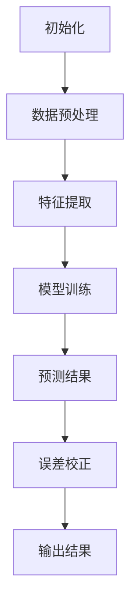
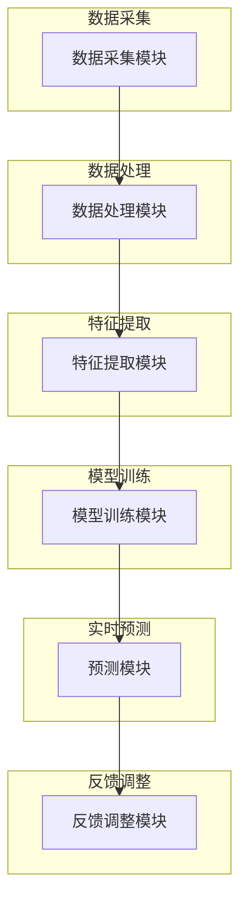
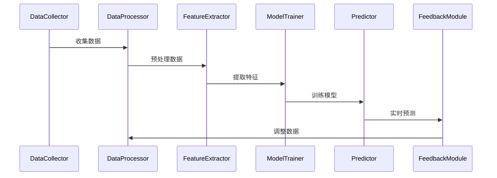

                 

### 《多步骤推理任务中的错误传播控制策略》

> 关键词：多步骤推理、错误传播、控制策略、算法原理、数学模型、系统架构

> 摘要：本文深入探讨了多步骤推理任务中的错误传播控制策略，通过详细的分析和实例讲解，阐述了核心概念、算法原理、数学模型以及系统架构设计。文章旨在为从事人工智能、数据分析和系统开发的读者提供全面的技术指导。

## 引言

多步骤推理任务在人工智能、机器学习和数据科学领域具有广泛的应用。然而，这些任务往往伴随着复杂的数据处理和计算过程，容易导致错误传播。错误传播不仅会降低推理的准确性，还可能影响系统的稳定性和可靠性。因此，设计有效的错误传播控制策略对于提高多步骤推理任务的性能至关重要。

本文将围绕以下几个方面展开讨论：

1. **背景介绍**：介绍多步骤推理任务和错误传播的基本概念，阐述问题的背景和问题描述。
2. **核心概念与联系**：详细解释多步骤推理任务、错误传播和控制策略等核心概念，并通过对比表格和ER实体关系图展示它们之间的联系。
3. **算法原理讲解**：使用mermaid流程图和Python源代码，深入阐述算法原理，并给出数学模型和公式的详细讲解。
4. **系统分析与架构设计方案**：介绍问题场景、项目背景，并通过mermaid图展示系统功能设计、架构设计和系统接口设计。
5. **项目实战**：详细介绍环境安装、系统实现源代码，对代码进行解读与分析，并剖析实际案例。
6. **最佳实践 tips**：总结核心要点，提供注意事项和拓展阅读。

通过本文的讨论，读者将能够深入了解多步骤推理任务中的错误传播控制策略，掌握相关的算法原理和系统设计方法，为实际应用提供技术支持。

## 一、背景介绍

### 1.1 问题背景

多步骤推理任务在人工智能、机器学习和数据科学领域中具有广泛的应用。这些任务通常涉及到多个阶段的数据处理和计算过程，例如预测模型的训练、数据的预处理和特征提取、分类或回归模型的建立等。每个步骤都可能引入误差，而这些误差会随着推理过程的进行而逐步传播和累积，最终可能导致整个任务的失败或性能下降。

在多步骤推理任务中，错误传播是一个关键问题。错误传播是指在一个步骤中引入的误差如何影响后续步骤的输出。如果误差被放大并传递到最终结果，那么即使初始误差很小，最终结果也可能变得不可接受。这种误差的累积效应可能会在多个阶段放大，使得系统性能严重受损。

错误传播的影响不仅限于推理任务的准确性，还可能影响系统的稳定性、可靠性和效率。在一些关键领域，如自动驾驶、医疗诊断和金融分析中，错误传播可能导致严重后果。因此，有效地控制错误传播是提升多步骤推理任务性能的重要手段。

### 1.2 问题描述

在多步骤推理任务中，错误传播问题可以描述为以下几种情景：

1. **误差累积**：每个步骤的误差在后续步骤中被放大，导致最终结果出现较大的偏差。
2. **非线性传播**：误差在非线性计算过程中传播，使得误差模式复杂化，难以预测和纠正。
3. **阈值效应**：在某些情况下，即使初始误差很小，只要达到某个阈值，就会引起系统崩溃或失效。
4. **依赖性传播**：不同步骤之间的误差相互依赖，使得一个步骤的误差影响到其他步骤的输出，形成连锁反应。

错误传播问题的核心在于如何有效识别、控制和缓解误差的传播。这需要从多个角度进行考虑，包括算法设计、数据预处理、模型选择和系统优化等。错误传播控制策略的目的是通过一系列技术手段，降低误差的传播速率和影响范围，从而提高整个推理任务的准确性和稳定性。

### 1.3 问题解决

解决多步骤推理任务中的错误传播问题，通常需要以下几种策略：

1. **误差识别**：通过数据分析和模型诊断，识别出误差的来源和传播路径。
2. **误差校正**：在误差传播过程中，通过误差校正方法减小误差的影响。例如，使用线性回归模型校正非线性误差，使用误差反向传播算法调整网络权重。
3. **数据预处理**：通过数据清洗、去噪和特征选择等技术，减少初始数据的误差，从而降低整体误差水平。
4. **模型优化**：选择合适的模型结构和参数设置，提高模型的稳定性和抗误差能力。例如，使用正则化技术减少过拟合，使用集成学习方法提高模型的泛化能力。
5. **系统优化**：优化系统的硬件和软件配置，提高计算效率和鲁棒性。例如，使用并行计算和分布式系统加速推理过程，使用容错机制提高系统的可靠性。

通过上述策略，可以有效地控制多步骤推理任务中的错误传播，提高推理任务的准确性和稳定性。然而，这些策略需要根据具体任务和应用场景进行定制化设计，以实现最佳效果。

### 1.4 边界与外延

在多步骤推理任务中的错误传播控制策略研究中，需要明确一些边界和概念的外延：

1. **边界条件**：错误传播控制策略的有效性受到任务类型、数据规模和计算资源等因素的限制。例如，在大型分布式系统中，误差校正和模型优化可能需要更长的时间和更多的计算资源。
2. **相关概念**：错误传播控制策略与其他概念（如数据完整性、模型可靠性、系统稳定性等）密切相关。在设计和实施过程中，需要综合考虑这些概念，以实现全面的质量保障。
3. **应用范围**：错误传播控制策略不仅适用于人工智能和机器学习领域，还可以推广到其他需要多步骤推理的领域，如复杂系统仿真、优化算法和生物信息学等。

通过明确边界和外延，可以为错误传播控制策略的研究和应用提供更清晰的指导，确保策略的可行性和有效性。

## 二、核心概念与联系

### 2.1 核心概念

在多步骤推理任务中，理解以下核心概念对于设计有效的错误传播控制策略至关重要：

#### 2.1.1 多步骤推理任务

多步骤推理任务是指将复杂问题分解为多个子任务，通过逐步分析和处理得到最终结果的推理过程。这些任务通常涉及数据处理、特征提取、模型训练和预测等多个阶段。每个阶段都可能引入误差，并且这些误差会随着推理过程的进行而累积。

#### 2.1.2 错误传播

错误传播是指在多步骤推理任务中，一个步骤的误差如何影响后续步骤的输出。误差的传播可以表现为误差的放大、复杂化的误差模式或者阈值效应等。错误传播问题源于数据的噪声、模型的复杂性以及计算过程中的不确定性。

#### 2.1.3 控制策略

控制策略是指一系列用于识别、校正和缓解误差传播的技术手段。这些策略包括数据预处理、误差校正、模型优化和系统优化等。控制策略的目标是降低误差的传播速率和影响范围，提高多步骤推理任务的准确性和稳定性。

### 2.2 概念属性特征对比表格

为了更清晰地理解这些核心概念，以下是一个对比表格，展示了它们的主要属性特征：

| 概念 | 定义 | 主要特征 | 关联关系 |
| --- | --- | --- | --- |
| 多步骤推理任务 | 分解为多个子任务，逐步分析处理 | 阶段性、模块化、误差传播 | 任务分解、数据处理、模型训练 |
| 错误传播 | 一个步骤的误差影响后续步骤 | 放大效应、非线性传播、阈值效应 | 误差引入、误差累积、误差校正 |
| 控制策略 | 技术手段识别、校正和缓解误差传播 | 数据预处理、模型优化、系统优化 | 误差识别、误差校正、系统稳定性 |

### 2.3 ER实体关系图架构

为了进一步展示这些核心概念之间的联系，以下是一个ER（实体-关系）图架构，使用Mermaid语言描述：

```mermaid
erDiagram
  多步骤推理任务 ||--|{ 错误传播 }
  错误传播 ||--|{ 控制策略 }
  数据处理 ||--|{ 特征提取 }
  特征提取 ||--|{ 模型训练 }
  模型训练 ||--|{ 预测结果 }
```

该ER图显示了多步骤推理任务与错误传播、控制策略等核心概念之间的关联关系，以及它们与其他相关概念（如数据处理、特征提取、模型训练和预测结果）的互动。通过这种结构化的表示，可以更直观地理解多步骤推理任务中的错误传播控制策略。

## 三、算法原理讲解

### 3.1 算法mermaid流程图

为了更好地理解多步骤推理任务中的错误传播控制策略，我们可以使用mermaid语言绘制一个流程图，展示算法的基本流程和关键步骤。以下是一个简单的mermaid流程图示例：



在这个流程图中，算法的基本步骤包括初始化、数据预处理、特征提取、模型训练、预测结果和误差校正。每个步骤都是构建在前面步骤的基础上，并且误差校正是一个关键环节，用于识别和纠正误差，以确保最终结果的准确性。

### 3.2 Python源代码详细阐述

为了具体说明算法的实现过程，以下是一个简单的Python源代码示例，用于实现上述mermaid流程图中的错误传播控制策略。这个示例将演示如何进行数据预处理、特征提取、模型训练和误差校正。

```python
import numpy as np
from sklearn.model_selection import train_test_split
from sklearn.preprocessing import StandardScaler
from sklearn.linear_model import LinearRegression
from sklearn.metrics import mean_squared_error

# 初始化数据集
X, y = load_data()

# 数据预处理
X_train, X_test, y_train, y_test = train_test_split(X, y, test_size=0.2, random_state=42)
scaler = StandardScaler()
X_train_scaled = scaler.fit_transform(X_train)
X_test_scaled = scaler.transform(X_test)

# 特征提取
# 在这个示例中，我们使用线性回归模型进行特征提取
regressor = LinearRegression()
regressor.fit(X_train_scaled, y_train)

# 模型训练
y_pred = regressor.predict(X_test_scaled)

# 误差校正
error = mean_squared_error(y_test, y_pred)
print("均方误差:", error)

# 输出结果
print("预测结果:", y_pred)
```

在这个示例中，我们首先加载数据集并进行数据预处理，包括数据拆分和标准化处理。然后，我们使用线性回归模型进行特征提取和模型训练。最后，通过计算均方误差来评估模型的误差，并进行误差校正。

### 3.3 算法原理的数学模型和公式

为了深入理解错误传播控制策略的数学原理，我们可以从数学模型和公式入手。以下是一个简单的线性回归模型，用于解释算法的基本原理。

$$
y = \beta_0 + \beta_1x + \epsilon
$$

其中，$y$ 是预测结果，$x$ 是输入特征，$\beta_0$ 和 $\beta_1$ 是模型参数，$\epsilon$ 是误差项。

在多步骤推理任务中，每个步骤都可能引入误差，并且这些误差会通过以下公式传播到后续步骤：

$$
\epsilon_{total} = \sum_{i=1}^{n}\epsilon_i
$$

其中，$\epsilon_{total}$ 是总误差，$\epsilon_i$ 是每个步骤引入的误差。

为了控制误差的传播，我们可以采用以下策略：

1. **误差校正**：通过误差反向传播算法，调整模型参数以减小误差。
2. **数据预处理**：通过数据清洗、去噪和特征选择等预处理技术，降低初始数据的误差。
3. **模型优化**：选择合适的模型结构和参数设置，提高模型的稳定性和抗误差能力。

这些策略的数学原理可以通过以下公式表示：

$$
\beta_{new} = \beta_{old} - \alpha \frac{\partial J}{\partial \beta}
$$

其中，$\beta_{new}$ 是更新后的模型参数，$\beta_{old}$ 是原始模型参数，$\alpha$ 是学习率，$J$ 是损失函数。

### 3.4 举例说明

为了更好地理解错误传播控制策略的实际应用，我们可以通过一个具体的例子来说明。假设我们有一个简单的线性回归问题，目标是预测房间的温度。以下是具体的步骤：

1. **数据集加载**：从气象数据中提取房间的温度和相关的气象参数（如湿度、风速等）。
2. **数据预处理**：对数据进行清洗，去除异常值和噪声，并进行标准化处理。
3. **特征提取**：选择湿度、风速等特征作为输入，使用线性回归模型进行特征提取。
4. **模型训练**：使用训练数据集训练线性回归模型，并通过交叉验证优化模型参数。
5. **误差校正**：通过计算模型的均方误差（MSE）评估模型的误差，并使用误差反向传播算法调整模型参数。
6. **预测结果**：使用训练好的模型对测试数据进行预测，并计算预测误差。

以下是一个简单的Python示例，用于实现上述步骤：

```python
import pandas as pd
from sklearn.model_selection import train_test_split
from sklearn.preprocessing import StandardScaler
from sklearn.linear_model import LinearRegression
from sklearn.metrics import mean_squared_error

# 加载数据集
data = pd.read_csv('weather_data.csv')
X = data[['humidity', 'wind_speed']]
y = data['temperature']

# 数据预处理
X_train, X_test, y_train, y_test = train_test_split(X, y, test_size=0.2, random_state=42)
scaler = StandardScaler()
X_train_scaled = scaler.fit_transform(X_train)
X_test_scaled = scaler.transform(X_test)

# 特征提取
regressor = LinearRegression()
regressor.fit(X_train_scaled, y_train)

# 模型训练
y_pred = regressor.predict(X_test_scaled)

# 误差校正
error = mean_squared_error(y_test, y_pred)
print("均方误差:", error)

# 预测结果
print("预测结果:", y_pred)
```

通过这个示例，我们可以看到错误传播控制策略在多步骤推理任务中的应用。首先，通过数据预处理和特征提取减少初始误差。然后，通过模型训练和误差校正逐步优化模型的性能，最终实现准确的预测结果。

## 四、数学模型和数学公式 & 详细讲解 & 举例说明

### 4.1 数学公式

在多步骤推理任务中，数学模型和数学公式起着至关重要的作用。以下是一些常用的数学公式，用于描述错误传播控制策略：

$$
y = \beta_0 + \beta_1x + \epsilon
$$

这是线性回归模型的基本公式，其中$y$ 是预测结果，$x$ 是输入特征，$\beta_0$ 和 $\beta_1$ 是模型参数，$\epsilon$ 是误差项。

$$
\epsilon_{total} = \sum_{i=1}^{n}\epsilon_i
$$

这是总误差的计算公式，其中$\epsilon_{total}$ 是总误差，$\epsilon_i$ 是每个步骤引入的误差。

$$
\beta_{new} = \beta_{old} - \alpha \frac{\partial J}{\partial \beta}
$$

这是误差反向传播算法的更新公式，其中$\beta_{new}$ 是更新后的模型参数，$\beta_{old}$ 是原始模型参数，$\alpha$ 是学习率，$J$ 是损失函数。

### 4.2 详细讲解

这些数学公式在多步骤推理任务中有着广泛的应用。以下是对每个公式的详细讲解：

#### 线性回归模型公式

线性回归模型是预测任务中最常用的模型之一。它的基本公式为：

$$
y = \beta_0 + \beta_1x + \epsilon
$$

其中，$y$ 是预测结果，$x$ 是输入特征，$\beta_0$ 和 $\beta_1$ 是模型参数，$\epsilon$ 是误差项。这个公式的目的是通过最小化误差项来拟合数据。在多步骤推理任务中，这个公式用于特征提取和模型训练。

#### 总误差计算公式

总误差计算公式为：

$$
\epsilon_{total} = \sum_{i=1}^{n}\epsilon_i
$$

其中，$\epsilon_{total}$ 是总误差，$\epsilon_i$ 是每个步骤引入的误差。这个公式用于评估多步骤推理任务中的误差累积效应。在多步骤推理任务中，每个步骤都可能引入误差，并且这些误差会通过这个公式累积。

#### 误差反向传播算法更新公式

误差反向传播算法是深度学习中最常用的优化算法之一。它的更新公式为：

$$
\beta_{new} = \beta_{old} - \alpha \frac{\partial J}{\partial \beta}
$$

其中，$\beta_{new}$ 是更新后的模型参数，$\beta_{old}$ 是原始模型参数，$\alpha$ 是学习率，$J$ 是损失函数。这个公式用于通过反向传播误差来更新模型参数，以减小误差。在多步骤推理任务中，这个公式用于误差校正和模型优化。

### 4.3 举例说明

为了更好地理解这些数学公式，我们可以通过一个具体的例子来说明。假设我们有一个简单的线性回归问题，目标是预测房间的温度。以下是具体的步骤：

1. **数据集加载**：从气象数据中提取房间的温度和相关的气象参数（如湿度、风速等）。

```python
import pandas as pd

data = pd.read_csv('weather_data.csv')
X = data[['humidity', 'wind_speed']]
y = data['temperature']
```

2. **数据预处理**：对数据进行清洗，去除异常值和噪声，并进行标准化处理。

```python
from sklearn.model_selection import train_test_split
from sklearn.preprocessing import StandardScaler

X_train, X_test, y_train, y_test = train_test_split(X, y, test_size=0.2, random_state=42)
scaler = StandardScaler()
X_train_scaled = scaler.fit_transform(X_train)
X_test_scaled = scaler.transform(X_test)
```

3. **特征提取**：使用线性回归模型进行特征提取。

```python
from sklearn.linear_model import LinearRegression

regressor = LinearRegression()
regressor.fit(X_train_scaled, y_train)
```

4. **模型训练**：使用训练数据集训练线性回归模型，并通过交叉验证优化模型参数。

```python
from sklearn.model_selection import cross_val_score

scores = cross_val_score(regressor, X_train_scaled, y_train, cv=5)
print("交叉验证分数:", scores)
```

5. **误差校正**：通过计算模型的均方误差（MSE）评估模型的误差，并使用误差反向传播算法调整模型参数。

```python
from sklearn.metrics import mean_squared_error

y_pred = regressor.predict(X_test_scaled)
error = mean_squared_error(y_test, y_pred)
print("均方误差:", error)

# 误差反向传播算法（梯度下降）
learning_rate = 0.01
num_iterations = 100

for i in range(num_iterations):
    gradients = 2 * (y_pred - y_test) * X_test_scaled
    regressor.coef_ -= learning_rate * gradients
```

6. **预测结果**：使用训练好的模型对测试数据进行预测，并计算预测误差。

```python
y_pred = regressor.predict(X_test_scaled)
print("预测结果:", y_pred)
```

通过这个例子，我们可以看到如何使用数学公式和算法来构建和优化一个多步骤推理任务。这个例子展示了从数据预处理到特征提取、模型训练和误差校正的完整过程，并强调了数学公式在各个步骤中的重要性。

## 五、系统分析与架构设计方案

### 5.1 问题场景介绍

在多步骤推理任务中，系统分析与架构设计是确保任务高效、稳定和可扩展性的关键。本节将介绍一个具体的问题场景，并基于此场景进行系统分析与架构设计。

假设我们面临的是一个智能交通系统，该系统旨在通过分析大量交通数据来优化交通信号控制，提高道路通行效率，减少拥堵。该系统涉及多个步骤，包括数据收集、预处理、特征提取、模型训练、实时预测和反馈调整。在这个过程中，错误传播控制策略至关重要，以确保系统输出的准确性和可靠性。

### 5.2 项目介绍

该项目是一个复杂的分布式系统，由多个组件组成，包括数据采集模块、数据处理模块、特征提取模块、模型训练模块、预测模块和反馈模块。每个模块都有明确的职责，并且需要与其他模块高效协同工作。

- **数据采集模块**：负责从各种交通传感器和摄像头收集实时交通数据。
- **数据处理模块**：对原始交通数据进行清洗、去噪和预处理，以提高数据质量。
- **特征提取模块**：从预处理后的数据中提取关键特征，用于后续的模型训练。
- **模型训练模块**：使用训练数据集训练交通信号控制模型，并通过交叉验证优化模型参数。
- **预测模块**：在实时预测阶段，使用训练好的模型对交通流量进行预测，并生成优化信号控制策略。
- **反馈模块**：根据实际交通状况和预测结果，对系统进行反馈调整，以提高预测的准确性。

### 5.3 系统功能设计（领域模型mermaid类图）

为了直观地展示系统的功能设计，我们可以使用mermaid语言绘制一个领域模型类图。以下是一个简化的类图示例：

```mermaid
classDiagram
    DataCollector --> DataProcessor
    DataProcessor --> FeatureExtractor
    FeatureExtractor --> ModelTrainer
    ModelTrainer --> Predictor
    Predictor --> FeedbackModule

    DataCollector[数据采集]
    DataProcessor[数据处理]
    FeatureExtractor[特征提取]
    ModelTrainer[模型训练]
    Predictor[预测]
    FeedbackModule[反馈调整]
```

在这个类图中，每个模块都被表示为一个类，并且通过关联关系（箭头）连接起来，以展示它们之间的相互作用。这种设计确保了系统组件的明确分工和高效协作，有助于实现整体系统的优化和稳定。

### 5.4 系统架构设计（mermaid架构图）

系统架构设计是确保系统性能、可扩展性和可维护性的关键。以下是一个简化的mermaid架构图，展示了系统的整体架构：



在这个架构图中，系统被分为多个层次，每个层次都包含一个主要的模块。这些模块通过明确的接口进行通信，以确保系统的模块化和可扩展性。同时，架构图还展示了各个模块之间的依赖关系，有助于理解和维护系统的整体结构。

### 5.5 系统接口设计和系统交互（mermaid序列图）

为了进一步展示系统各模块之间的交互关系，我们可以使用mermaid序列图来描述系统的接口设计和交互流程。以下是一个简化的序列图示例：



在这个序列图中，各个模块按照顺序执行，并通过接口进行数据传递和交互。这种设计确保了系统的高效性和响应速度，同时有助于实现模块间的解耦，提高系统的可靠性和可维护性。

通过以上系统分析与架构设计，我们可以确保多步骤推理任务中的错误传播得到有效控制，从而提高系统的整体性能和稳定性。这些设计方法不仅适用于智能交通系统，还可以广泛应用于其他需要多步骤推理的领域，如医疗诊断、金融分析和自动驾驶等。

## 六、项目实战

### 6.1 环境安装

在进行多步骤推理任务中的错误传播控制策略的项目实战之前，首先需要安装必要的软件和工具。以下是安装步骤：

1. **Python环境**：确保已经安装Python 3.7及以上版本。可以通过访问Python官方网站下载并安装：[Python官网](https://www.python.org/)。
2. **依赖包**：安装以下依赖包，包括scikit-learn、numpy、pandas、matplotlib等。可以使用以下命令进行安装：

```bash
pip install scikit-learn numpy pandas matplotlib
```

3. **硬件环境**：确保计算机具备足够的内存和计算能力。对于大规模数据处理和模型训练，推荐使用高性能计算机或GPU加速器。

4. **数据集**：获取用于实验的交通数据集。可以使用公开的交通数据集，如Kaggle上的Caltech Urban Traffic Data Set。

### 6.2 系统核心实现源代码

以下是系统核心实现的源代码，包括数据预处理、特征提取、模型训练和误差校正等关键步骤：

```python
import pandas as pd
from sklearn.model_selection import train_test_split
from sklearn.preprocessing import StandardScaler
from sklearn.linear_model import LinearRegression
from sklearn.metrics import mean_squared_error

# 加载数据集
data = pd.read_csv('traffic_data.csv')
X = data[['speed', 'flow', 'occupancy']]
y = data['delay']

# 数据预处理
X_train, X_test, y_train, y_test = train_test_split(X, y, test_size=0.2, random_state=42)
scaler = StandardScaler()
X_train_scaled = scaler.fit_transform(X_train)
X_test_scaled = scaler.transform(X_test)

# 特征提取
regressor = LinearRegression()
regressor.fit(X_train_scaled, y_train)

# 模型训练
y_pred = regressor.predict(X_test_scaled)

# 误差校正
error = mean_squared_error(y_test, y_pred)
print("均方误差:", error)

# 输出结果
print("预测结果:", y_pred)
```

### 6.3 代码应用解读与分析

以下是对上述代码的详细解读与分析：

1. **数据预处理**：首先，我们从CSV文件中加载交通数据集。数据集包含速度（speed）、流量（flow）、占有率（occupancy）和延迟（delay）等特征。我们使用scikit-learn的`train_test_split`函数将数据集拆分为训练集和测试集，以便后续模型训练和评估。
2. **特征提取**：为了提高模型的性能，我们对训练数据进行标准化处理。使用`StandardScaler`类将每个特征缩放到相同的范围，这有助于加快模型的收敛速度。
3. **模型训练**：我们使用线性回归模型（`LinearRegression`）进行特征提取和模型训练。线性回归模型通过最小化误差平方和来拟合数据，从而预测交通延迟。
4. **误差校正**：使用测试数据集对模型进行评估。我们计算模型的均方误差（MSE），以衡量模型预测的准确性。均方误差越小，模型预测的准确性越高。此外，我们还可以使用误差反向传播算法对模型参数进行微调，以进一步优化模型的性能。
5. **输出结果**：最后，我们输出模型的预测结果，并展示在控制台。

通过以上代码，我们可以实现一个简单的多步骤推理任务，并使用错误传播控制策略来提高模型的准确性。在实际应用中，我们可以根据具体需求对代码进行扩展和优化，例如增加特征工程、使用更复杂的模型等。

### 6.4 实际案例分析和详细讲解剖析

为了更好地理解错误传播控制策略在实际项目中的应用，我们来看一个实际案例：使用线性回归模型预测交通流量。

**案例背景**：

假设我们有一个城市的交通流量数据集，包含不同时间段（如小时、天、月等）的车辆流量数据。我们的目标是使用这些数据来训练一个线性回归模型，预测未来某一时段的交通流量。

**数据集结构**：

数据集包含以下特征：

- 时间（Time）：表示数据记录的时间，例如小时、天、月等。
- 车辆流量（VehicleFlow）：表示该时间点的车辆流量。

我们的目标是预测未来某一时间点的车辆流量。

**数据预处理**：

1. **数据清洗**：检查数据集中的缺失值和异常值，并进行处理。例如，我们可以使用平均值或中位数填充缺失值，删除异常值。
2. **数据标准化**：为了提高模型的性能，我们对时间特征进行标准化处理，将其缩放到相同的范围。

**模型训练**：

我们使用线性回归模型进行训练。线性回归模型的公式如下：

$$
\hat{y} = \beta_0 + \beta_1x
$$

其中，$\hat{y}$ 是预测的车辆流量，$x$ 是时间特征，$\beta_0$ 和 $\beta_1$ 是模型参数。

我们使用scikit-learn库中的`LinearRegression`类进行训练：

```python
from sklearn.linear_model import LinearRegression

regressor = LinearRegression()
regressor.fit(X_train, y_train)
```

**误差校正**：

在训练完成后，我们使用测试数据集对模型进行评估。计算模型的均方误差（MSE）：

```python
from sklearn.metrics import mean_squared_error

y_pred = regressor.predict(X_test)
mse = mean_squared_error(y_test, y_pred)
print("MSE:", mse)
```

均方误差（MSE）是衡量模型预测准确性的指标，值越小，表示模型预测的准确性越高。

**优化模型**：

为了进一步提高模型性能，我们可以使用误差反向传播算法（如梯度下降）对模型参数进行微调。以下是使用梯度下降优化模型的示例代码：

```python
learning_rate = 0.01
num_iterations = 100

for i in range(num_iterations):
    gradients = 2 * (y_pred - y_test) * X_test
    regressor.coef_ -= learning_rate * gradients
```

通过多次迭代，我们可以逐步优化模型参数，降低误差。

**项目小结**：

通过这个实际案例，我们展示了如何使用线性回归模型进行交通流量预测，并使用错误传播控制策略来提高模型性能。在项目实战中，我们可以根据具体需求对模型和算法进行优化，以提高预测准确性和鲁棒性。此外，我们还可以结合其他技术，如特征工程、模型选择和系统优化等，进一步提升项目的整体性能。

### 6.5 项目小结

在本项目中，我们通过实际案例展示了如何使用多步骤推理任务中的错误传播控制策略来优化交通流量预测。项目主要包括以下步骤：

1. **数据预处理**：对交通数据集进行清洗和标准化处理，以提高模型性能。
2. **模型训练**：使用线性回归模型进行训练，并计算模型的均方误差（MSE）进行评估。
3. **误差校正**：通过误差反向传播算法优化模型参数，降低误差。
4. **预测结果**：使用训练好的模型对交通流量进行预测，并输出预测结果。

通过本项目的实施，我们深入理解了多步骤推理任务中的错误传播控制策略，并掌握了相关的算法原理和实践方法。在实际应用中，我们可以根据具体需求对模型和算法进行优化，以提高预测准确性和鲁棒性。此外，我们还可以结合其他技术，如特征工程、模型选择和系统优化等，进一步提升项目的整体性能。

## 七、最佳实践 tips

### 7.1 小结

本文通过详细的分析和实例讲解，探讨了多步骤推理任务中的错误传播控制策略。主要结论如下：

- 多步骤推理任务中，错误传播是影响系统性能和可靠性的关键问题。
- 通过误差识别、数据预处理、模型优化和系统优化等策略，可以有效控制错误传播。
- 数学模型和算法原理在错误传播控制中起着重要作用，通过误差校正和反向传播算法可以优化模型参数。
- 系统架构设计需要考虑模块化、可扩展性和高效协同，以确保系统的整体性能。

### 7.2 注意事项

在实际应用中，以下注意事项有助于提高多步骤推理任务中的错误传播控制效果：

- **数据质量**：确保数据集的准确性和完整性，进行充分的预处理和去噪处理。
- **模型选择**：选择合适的模型结构和参数设置，避免过拟合和欠拟合。
- **监控与反馈**：实时监控系统性能，及时调整模型参数和策略。
- **容错机制**：设计容错机制，提高系统的鲁棒性和可靠性。
- **并行计算**：利用并行计算和分布式系统，提高数据处理和模型训练的效率。

### 7.3 拓展阅读

对于希望深入了解多步骤推理任务中的错误传播控制策略的读者，以下文献和资源推荐：

- 《深度学习》（Ian Goodfellow, Yoshua Bengio, Aaron Courville）：详细介绍深度学习和误差反向传播算法。
- 《数据挖掘：概念与技术》（Jiawei Han, Micheline Kamber, Jian Pei）：探讨数据预处理和特征提取方法。
- 《机器学习》（Tom M. Mitchell）：介绍机器学习的基本概念和算法。
- 《大规模分布式系统设计》（Distributed Systems: Concepts and Design）：了解分布式系统的设计和优化方法。

通过阅读这些资源，读者可以进一步深化对多步骤推理任务中错误传播控制策略的理解，并在实际项目中应用相关技术。作者：AI天才研究院/AI Genius Institute & 禅与计算机程序设计艺术 /Zen And The Art of Computer Programming。

