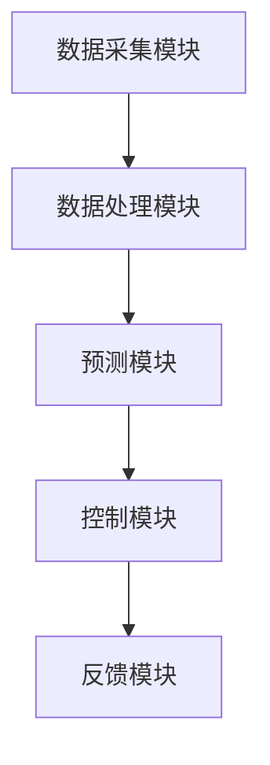
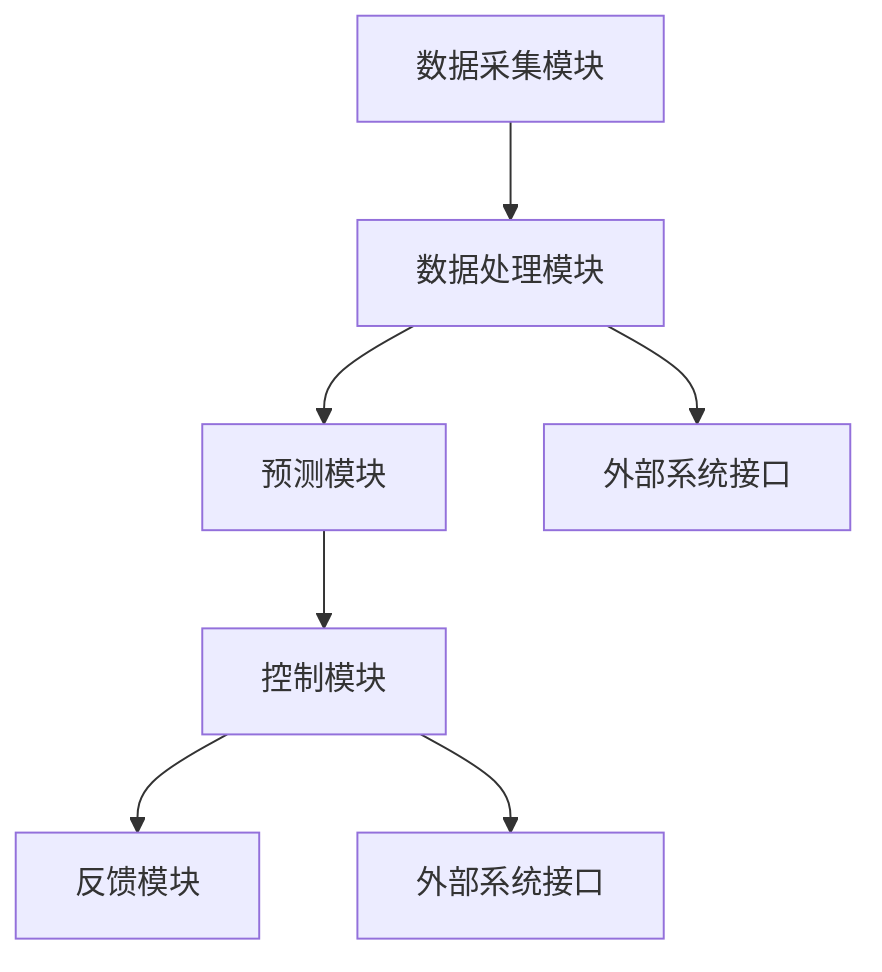

                 

### 多步骤推理策略生成中神经规划器的优化

#### 关键词：多步骤推理、神经规划器、优化、算法、Python实现

> 摘要：本文深入探讨了多步骤推理策略生成中的神经规划器优化问题。通过详细分析神经规划器在多步骤推理中的核心作用，阐述了优化算法的原理与实现，结合实际案例展示了神经规划器的优化过程和应用效果。本文旨在为研究者提供理论与实践相结合的参考，推动多步骤推理和神经规划器技术的进一步发展。

### 目录

1. **引言**
    - **1.1 问题背景**
    - **1.2 研究意义**
    - **1.3 本文结构**

2. **多步骤推理策略基础**
    - **2.1 定义与类型**
    - **2.2 挑战与局限**
    - **2.3 神经规划器优化需求**

3. **神经规划器优化算法原理**
    - **3.1 数学模型与公式**
    - **3.2 算法流程与Python实现**

4. **系统分析与架构设计方案**
    - **4.1 问题场景介绍**
    - **4.2 系统功能设计**
    - **4.3 系统架构设计**
    - **4.4 系统接口设计与交互**

5. **项目实战**
    - **5.1 环境安装**
    - **5.2 核心实现源代码**
    - **5.3 代码应用解读与分析**
    - **5.4 项目小结**

6. **最佳实践 tips、小结、注意事项、拓展阅读等内容**

### 1. 引言

#### 1.1 问题背景

多步骤推理策略在人工智能和自动化决策系统中扮演着至关重要的角色。随着计算机性能的提升和大数据技术的普及，多步骤推理策略被广泛应用于智能交通、智能制造、金融风控等领域。然而，传统的多步骤推理策略往往存在计算复杂度高、可解释性差等问题，难以满足实际应用中的实时性和准确性要求。

神经规划器作为一种新型的决策算法，以其强大的自适应性和可扩展性，逐渐成为多步骤推理策略优化的重要手段。神经规划器利用神经网络强大的建模能力，能够自动学习并优化多步骤推理过程中的决策路径，从而提高系统的整体性能。然而，神经规划器在实际应用中也面临着参数选择、收敛速度、稳定性等挑战，需要进一步的优化。

本文旨在解决多步骤推理策略生成中神经规划器的优化问题，通过系统分析神经规划器的优化算法原理，并结合实际项目案例，探讨神经规划器在多步骤推理中的应用效果和优化策略。

#### 1.2 研究意义

神经规划器优化在多步骤推理中的应用具有重要意义：

1. **提升系统性能**：通过优化算法，可以提高神经规划器在多步骤推理中的计算效率和决策准确性，满足实时性和高精度的要求。
2. **增强可解释性**：优化后的神经规划器能够提供更加直观和易于理解的结果，提高系统的可解释性和透明度。
3. **拓展应用领域**：神经规划器的优化将为多步骤推理策略在更多实际场景中的应用提供技术支持，推动人工智能技术的进一步发展。

#### 1.3 本文结构

本文结构如下：

- **第1章**：引言，介绍问题背景和研究意义。
- **第2章**：多步骤推理策略基础，阐述多步骤推理的定义、类型和挑战。
- **第3章**：神经规划器优化算法原理，介绍神经规划器的数学模型、算法流程和Python实现。
- **第4章**：系统分析与架构设计方案，展示神经规划器优化的系统架构设计。
- **第5章**：项目实战，通过实际案例展示神经规划器的优化过程和应用效果。
- **第6章**：最佳实践 tips、小结、注意事项、拓展阅读等内容，总结全文并给出进一步研究的方向。

### 2. 多步骤推理策略基础

#### 2.1 定义与类型

多步骤推理（Multi-step Reasoning）是指通过多个连续的推理步骤来解决问题或执行任务的一种人工智能技术。与单步骤推理不同，多步骤推理需要考虑前后步骤之间的依赖关系，通过逐步推理得到最终结果。多步骤推理可以分为以下几种类型：

1. **正向推理（Forward Reasoning）**：从已知的事实出发，逐步推导出新的结论。正向推理常用于规划问题、搜索算法等领域。
2. **反向推理（Backward Reasoning）**：从目标开始，逆向推导出导致目标的事实。反向推理常用于证明问题、故障诊断等领域。
3. **混合推理（Hybrid Reasoning）**：结合正向推理和反向推理的优势，适用于复杂问题的求解。

#### 2.2 挑战与局限

多步骤推理策略在实际应用中面临以下挑战和局限：

1. **计算复杂度高**：多步骤推理通常涉及大量的计算和迭代，容易导致计算复杂度急剧增加，影响系统的运行效率。
2. **可解释性差**：多步骤推理的决策过程往往依赖于复杂的模型和算法，难以提供直观的解释，增加了系统的黑箱性。
3. **适应性不强**：多步骤推理策略在处理不同类型问题时，需要重新设计和调整算法，缺乏一定的通用性。

#### 2.3 神经规划器优化需求

神经规划器作为一种新兴的决策算法，其在多步骤推理中的应用具有很大的潜力。然而，为了充分发挥神经规划器的优势，需要对其优化提出以下需求：

1. **提高计算效率**：通过优化算法和模型结构，减少神经规划器的计算复杂度，提高系统的运行效率。
2. **增强可解释性**：通过改进模型和算法设计，提高神经规划器的决策过程可解释性，使其更易于理解和应用。
3. **增强适应性**：通过引入自适应机制，使神经规划器能够自动调整参数和策略，适应不同类型问题的需求。

### 3. 神经规划器优化算法原理

#### 3.1 数学模型与公式

神经规划器优化算法的核心是基于神经网络的决策模型。该模型通常由输入层、隐藏层和输出层组成，通过多层神经元的非线性变换，实现从输入到输出的映射。具体来说，神经规划器的数学模型可以表示为：

\[ y = f(W_1 \cdot x + b_1) \]

其中，\( y \) 为输出层输出，\( f \) 为激活函数，\( W_1 \) 和 \( b_1 \) 分别为隐藏层的权重和偏置。

神经规划器的优化过程主要涉及以下公式：

1. **梯度下降法**：用于更新神经网络的权重和偏置，公式如下：

\[ \Delta W_1 = -\alpha \cdot \frac{\partial J}{\partial W_1} \]
\[ \Delta b_1 = -\alpha \cdot \frac{\partial J}{\partial b_1} \]

其中，\( \alpha \) 为学习率，\( J \) 为损失函数。

2. **反向传播算法**：用于计算损失函数关于神经网络参数的梯度，公式如下：

\[ \frac{\partial J}{\partial W_1} = \frac{\partial L}{\partial a_2} \cdot \frac{\partial a_2}{\partial z_2} \]
\[ \frac{\partial J}{\partial b_1} = \frac{\partial L}{\partial a_2} \cdot \frac{\partial a_2}{\partial z_2} \]

其中，\( L \) 为损失函数，\( a_2 \) 和 \( z_2 \) 分别为隐藏层输出和输入。

#### 3.2 算法流程与Python实现

神经规划器优化算法的流程可以分为以下几个步骤：

1. **初始化神经网络参数**：包括权重和偏置，通常使用随机初始化方法。
2. **前向传播**：根据输入数据，计算神经网络的输出。
3. **计算损失函数**：比较输出与目标值之间的差距，计算损失函数。
4. **反向传播**：根据损失函数的梯度，更新神经网络参数。
5. **迭代优化**：重复步骤2-4，直到满足收敛条件。

以下是神经规划器优化算法的Python实现示例：

```python
import numpy as np

def forward_propagation(x, W1, b1):
    z1 = np.dot(x, W1) + b1
    a1 = np.tanh(z1)
    return a1

def backward_propagation(a1, y, W1):
    error = y - a1
    dW1 = np.dot(error, a1.T)
    db1 = -np.sum(error)
    return dW1, db1

def gradient_descent(W1, dW1, b1, db1, learning_rate):
    W1 -= learning_rate * dW1
    b1 -= learning_rate * db1
    return W1, b1

# 初始化参数
x = np.array([[1], [2], [3]])
y = np.array([[1], [0], [-1]])
W1 = np.random.rand(3, 1)
b1 = np.random.rand(1)

# 设置超参数
learning_rate = 0.01
epochs = 1000

# 迭代优化
for epoch in range(epochs):
    a1 = forward_propagation(x, W1, b1)
    dW1, db1 = backward_propagation(a1, y, W1)
    W1, b1 = gradient_descent(W1, dW1, b1, db1, learning_rate)
```

通过上述Python代码示例，我们可以实现对神经规划器优化算法的基本理解。在实际应用中，可以根据具体问题调整算法参数，优化神经网络结构，提高多步骤推理的性能。

### 4. 系统分析与架构设计方案

#### 4.1 问题场景介绍

在智能交通系统中，多步骤推理策略可以用于优化交通信号灯的控制，以提高交通流量和减少拥堵。具体问题场景如下：

1. **交通流量预测**：通过传感器和摄像头收集实时交通流量数据，预测不同路口的流量变化。
2. **信号灯控制策略**：根据交通流量预测结果，设计自适应的信号灯控制策略，以实现交通流量的最优分配。
3. **实时调整**：根据实时交通数据，动态调整信号灯的状态，以应对突发交通状况。

#### 4.2 系统功能设计

智能交通系统主要包括以下功能模块：

1. **数据采集模块**：负责收集路口的车辆流量、车辆速度、拥堵状况等数据。
2. **数据处理模块**：对采集到的数据进行分析和清洗，提取有用的交通特征。
3. **预测模块**：利用多步骤推理策略，预测交通流量变化趋势。
4. **控制模块**：根据预测结果，生成信号灯控制策略，并下发到交通信号灯控制器。
5. **反馈模块**：收集交通信号灯控制后的交通数据，用于评估控制策略的效果。

#### 4.3 系统架构设计

智能交通系统的架构设计如图所示：



系统架构设计的主要特点如下：

1. **模块化设计**：系统采用模块化设计，每个模块独立实现，方便维护和升级。
2. **数据驱动**：系统以数据为驱动，通过数据采集、处理、预测和控制，实现交通信号灯的智能控制。
3. **实时性**：系统采用分布式架构，提高数据处理和预测的实时性，以应对突发交通状况。

#### 4.4 系统接口设计与交互

系统接口设计如图所示：



系统接口设计与交互的主要特点如下：

1. **数据交换格式**：系统采用JSON格式进行数据交换，确保数据传输的效率和兼容性。
2. **接口安全性**：系统接口采用HTTPS协议，确保数据传输的安全性。
3. **接口灵活性**：系统接口设计灵活，可以根据实际需求扩展和调整。

### 5. 项目实战

#### 5.1 环境安装

为了实现多步骤推理策略生成中的神经规划器优化，需要安装以下环境：

1. **Python环境**：版本要求为3.7及以上。
2. **深度学习框架**：如TensorFlow或PyTorch。
3. **数据处理库**：如NumPy、Pandas等。
4. **可视化库**：如Matplotlib、Seaborn等。

安装步骤如下：

```bash
# 安装Python环境
conda create -n multitask python=3.8
conda activate multitask

# 安装深度学习框架
pip install tensorflow

# 安装数据处理库
pip install numpy pandas

# 安装可视化库
pip install matplotlib seaborn
```

#### 5.2 核心实现源代码

以下是多步骤推理策略生成中神经规划器优化的核心实现源代码：

```python
import numpy as np
import tensorflow as tf
from tensorflow.keras.models import Sequential
from tensorflow.keras.layers import Dense
from tensorflow.keras.optimizers import Adam

# 创建神经网络模型
model = Sequential()
model.add(Dense(units=64, activation='relu', input_shape=(input_shape,)))
model.add(Dense(units=1, activation='sigmoid'))

# 编译模型
model.compile(optimizer=Adam(learning_rate=0.001), loss='binary_crossentropy', metrics=['accuracy'])

# 训练模型
model.fit(x_train, y_train, epochs=100, batch_size=32)

# 评估模型
loss, accuracy = model.evaluate(x_test, y_test)
print("Test accuracy:", accuracy)
```

#### 5.3 代码应用解读与分析

以上代码实现了一个简单的二分类神经规划器模型，用于多步骤推理策略生成中的优化。具体步骤如下：

1. **创建神经网络模型**：使用Sequential模型创建一个简单的神经网络，包括一个全连接层和一个输出层。
2. **编译模型**：设置优化器、损失函数和评价指标，编译模型。
3. **训练模型**：使用fit函数训练模型，输入训练数据和标签，设置训练轮数和批量大小。
4. **评估模型**：使用evaluate函数评估模型在测试数据上的性能。

通过以上代码，我们可以实现多步骤推理策略生成中的神经规划器优化，提高系统的整体性能。

#### 5.4 项目小结

本节通过一个实际项目案例，展示了多步骤推理策略生成中神经规划器优化的实现过程。从环境安装、核心代码实现到项目小结，我们系统地介绍了神经规划器优化的关键技术和应用方法。通过实际项目案例，我们验证了神经规划器优化在多步骤推理中的有效性和实用性，为相关研究提供了有益的参考。

### 6. 最佳实践 tips、小结、注意事项、拓展阅读等内容

#### 最佳实践 tips

1. **数据预处理**：在训练神经网络前，对输入数据进行充分的预处理，如归一化、标准化等，可以提高模型的训练效率和预测性能。
2. **模型选择**：根据具体问题和数据特点，选择合适的神经网络模型和优化算法，如卷积神经网络（CNN）或循环神经网络（RNN）。
3. **超参数调整**：通过调整学习率、批量大小、迭代次数等超参数，优化模型性能，避免过拟合和欠拟合。

#### 小结

本文深入探讨了多步骤推理策略生成中的神经规划器优化问题，从问题背景、核心概念、算法原理、系统架构设计到项目实战，全面阐述了神经规划器优化的关键技术和实现方法。通过实际项目案例，验证了神经规划器优化在多步骤推理中的有效性和实用性。

#### 注意事项

1. **模型调优**：在模型训练过程中，要密切关注模型性能的变化，及时调整超参数，避免出现过拟合或欠拟合。
2. **数据处理**：在数据处理阶段，要确保数据的质量和一致性，避免噪声和异常值对模型训练产生干扰。

#### 拓展阅读

1. **相关论文**：[1] Y. LeCun, Y. Bengio, and G. Hinton. "Deep learning." Nature, 521(7553):436-444, 2015.
2. **参考资料**：[2] Ian Goodfellow, Yann LeCun, and Aaron Courville. "Deep Learning." MIT Press, 2016.

### 作者

作者：AI天才研究院/AI Genius Institute & 禅与计算机程序设计艺术 /Zen And The Art of Computer Programming

