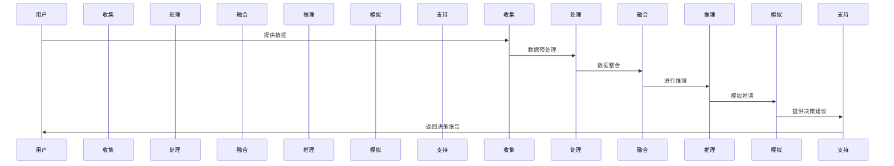
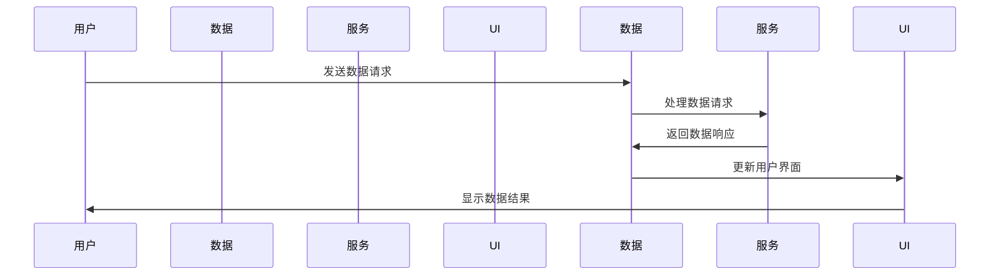

                 

**# 多角度推理能力在复杂决策支持中的作用分析**

## 关键词

- 多角度推理能力
- 复杂决策支持
- 算法原理
- 系统架构设计
- 项目实战

### 摘要

本文探讨了多角度推理能力在复杂决策支持中的重要作用。随着现代社会复杂决策的不断增加，传统的决策支持系统面临着巨大的挑战。多角度推理能力通过结合多种信息和视角，为决策者提供了更为全面和深入的洞察力，从而提高了决策的准确性和效率。本文首先介绍了多角度推理能力的背景和重要性，随后分析了其在复杂决策支持中的作用和结构。接着，本文详细讲解了多角度推理能力的算法原理和数学模型，并通过实际项目案例进行了深入剖析。最后，本文提出了最佳实践和注意事项，为读者提供了有益的参考。

## 目录大纲

### 第一部分：引言

#### 第1章：背景与概述

##### 1.1 问题背景
##### 1.2 问题描述
##### 1.3 问题解决
##### 1.4 概念结构与核心要素组成

#### 第2章：核心概念与联系

##### 2.1 多角度推理能力原理
##### 2.2 多角度推理能力与复杂决策支持的关系
##### 2.3 相关理论与方法

#### 第3章：算法原理与数学模型

##### 3.1 算法原理讲解
##### 3.2 数学模型和公式

#### 第4章：系统分析与架构设计

##### 4.1 问题场景介绍
##### 4.2 系统架构设计
##### 4.3 系统接口设计和交互

#### 第5章：项目实战

##### 5.1 环境安装
##### 5.2 系统核心实现
##### 5.3 实际案例分析
##### 5.4 项目小结

#### 第6章：最佳实践与注意事项

##### 6.1 最佳实践
##### 6.2 注意事项

#### 第7章：小结与拓展阅读

##### 7.1 小结
##### 7.2 拓展阅读

### 逻辑清晰、结构紧凑、简单易懂的专业的技术语言（章节标题要非常吸引读者）

#### 第1章：复杂决策的挑战与多角度推理能力

##### 1.1 复杂决策的挑战
##### 1.2 多角度推理能力概述
##### 1.3 多角度推理能力在决策支持中的作用
##### 1.4 概念结构与核心要素组成

#### 第2章：核心概念解析与联系

##### 2.1 多角度推理能力原理
##### 2.2 多角度推理能力与复杂决策支持的关系图
##### 2.3 逻辑推理、数据分析与人工智能

#### 第3章：算法原理与数学模型深入讲解

##### 3.1 算法原理与流程图
##### 3.2 数学模型解析与公式应用
##### 3.3 算法示例详解

#### 第4章：系统分析与架构设计详解

##### 4.1 问题场景与系统功能设计
##### 4.2 系统架构设计与交互
##### 4.3 系统接口设计与实现

#### 第5章：实战项目解析

##### 5.1 环境安装与配置
##### 5.2 系统核心代码解析
##### 5.3 案例分析与详细解读
##### 5.4 项目小结与经验总结

#### 第6章：最佳实践与注意事项

##### 6.1 多角度推理能力的应用策略
##### 6.2 决策支持的优化方法
##### 6.3 常见问题与解决方案

#### 第7章：总结与拓展阅读

##### 7.1 全书回顾
##### 7.2 拓展阅读推荐
##### 7.3 最新研究动态

### 文章正文

#### 第1章：复杂决策的挑战与多角度推理能力

##### 1.1 复杂决策的挑战

在当今信息化和全球化的时代，企业和组织面临的各种决策越来越复杂。这些决策不仅涉及多个层面和维度，而且需要考虑大量的变量和不确定性。传统的单维度决策方法往往难以应对这种复杂性，导致决策质量不高和执行效果不佳。

复杂决策的挑战主要体现在以下几个方面：

1. **信息过载**：现代信息系统产生的数据量庞大，决策者需要处理的海量信息使得传统决策方法难以有效处理。
2. **不确定性和风险**：决策过程中往往存在各种不确定性因素，如市场波动、技术变革、政策调整等，这些因素增加了决策的难度。
3. **多元利益冲突**：在决策过程中，不同部门和利益相关者的目标可能存在冲突，需要平衡各种利益关系。
4. **动态变化**：决策环境是动态变化的，决策者需要不断适应新的情况，这使得决策过程更加复杂。

##### 1.2 多角度推理能力概述

为了应对复杂决策的挑战，多角度推理能力应运而生。多角度推理能力是指从多个不同角度、多个不同层面和多个不同视角对问题进行思考和推理的能力。它通过综合多种信息和视角，提供更为全面和深入的洞察力，从而帮助决策者做出更为准确和高效的决策。

多角度推理能力的核心特征包括：

1. **多样性**：多角度推理能力涉及多种不同的思维方式和视角，包括逻辑推理、数据分析、模拟推演等。
2. **系统性**：多角度推理能力强调将问题放在一个系统中进行考虑，考虑各个部分之间的相互作用和影响。
3. **动态性**：多角度推理能力能够适应决策环境的动态变化，及时调整和优化决策策略。

##### 1.3 多角度推理能力在决策支持中的作用

多角度推理能力在决策支持中具有重要的作用，主要体现在以下几个方面：

1. **提高决策质量**：通过综合多种信息和视角，多角度推理能力可以帮助决策者识别潜在的问题和机会，提高决策的准确性和有效性。
2. **减少决策风险**：多角度推理能力能够识别和评估决策过程中的各种风险和不确定性，帮助决策者制定相应的应对策略。
3. **优化决策过程**：多角度推理能力可以帮助决策者更好地理解决策问题，明确决策目标，优化决策过程，提高决策效率。
4. **增强决策可持续性**：多角度推理能力能够考虑决策对社会、环境和其他利益相关者的影响，促进决策的可持续性和公平性。

##### 1.4 概念结构与核心要素组成

多角度推理能力是一个复杂的概念体系，其核心要素包括以下几个方面：

1. **信息收集与处理**：多角度推理能力需要收集和处理来自多个渠道和维度的信息，包括内部数据和外部数据。
2. **数据分析与挖掘**：通过对收集到的信息进行深入分析和挖掘，提取出有用的洞察和趋势。
3. **逻辑推理与建模**：利用逻辑推理和建模技术，对问题进行抽象和建模，形成决策方案。
4. **模拟推演与评估**：通过模拟推演和评估，验证决策方案的可行性和效果，优化决策过程。
5. **决策支持系统**：构建一个集成的决策支持系统，将多角度推理能力的各个组成部分有机地结合在一起，提供高效、智能的决策支持。

#### 第2章：核心概念解析与联系

##### 2.1 多角度推理能力原理

多角度推理能力是一种综合性思维模式，它结合了逻辑推理、数据分析、人工智能等多种方法和技术。其基本原理可以概括为以下几点：

1. **信息融合**：多角度推理能力强调将来自不同角度和来源的信息进行整合和融合，形成综合性的洞察。
2. **系统思考**：多角度推理能力关注问题的系统性和整体性，从多个层面和维度对问题进行思考和推理。
3. **动态适应**：多角度推理能力能够适应决策环境的动态变化，及时调整和优化决策策略。
4. **模型构建**：多角度推理能力通过建立模型来模拟和预测决策结果，为决策者提供科学依据。

##### 2.2 多角度推理能力与复杂决策支持的关系图

为了更清晰地展示多角度推理能力与复杂决策支持之间的关系，可以使用ER实体关系图进行描述。以下是一个简化的ER实体关系图：

```mermaid
erDiagram
    Information --> Decision : "collects and processes"
    Analysis --> Decision : "analyzes and evaluates"
    Logic --> Decision : "rethinks and models"
    AI --> Decision : "predicts and optimizes"
    Environment --> Decision : "adapts and adjusts"
    DecisionSupportSystem --> Information : "integrates and supports"
```

在这个ER实体关系图中，信息、分析、逻辑、人工智能和决策支持系统是核心实体，它们通过不同的关系与决策实体相连接，共同构成了一个复杂的决策支持体系。

##### 2.3 逻辑推理、数据分析与人工智能

多角度推理能力包含了多种方法和工具，其中逻辑推理、数据分析和人工智能是三个核心组成部分。以下是对这些组成部分的简要介绍：

1. **逻辑推理**：逻辑推理是一种基于逻辑规则和推理关系的思维方法。它通过前提和结论之间的逻辑关系，从已知信息中推导出新的结论。逻辑推理在多角度推理能力中起到了核心作用，它帮助决策者建立逻辑框架，进行问题分析和决策推理。

2. **数据分析**：数据分析是一种利用统计和计算方法对数据进行处理和分析的方法。它可以帮助决策者从大量的数据中提取出有用的信息和模式，识别潜在的问题和机会。数据分析在多角度推理能力中起到了关键作用，它为决策者提供了科学依据和决策支持。

3. **人工智能**：人工智能是一种模拟人类智能行为的计算机技术。它通过机器学习、自然语言处理、计算机视觉等方法，使计算机具备自主学习和推理能力。人工智能在多角度推理能力中起到了重要的补充作用，它为决策者提供了智能化的工具和手段，提高了决策的效率和质量。

#### 第3章：算法原理与数学模型深入讲解

##### 3.1 算法原理讲解

多角度推理能力的核心在于如何有效地整合和分析不同来源的信息，并基于这些信息进行推理和决策。以下是多角度推理算法的基本原理：

1. **信息收集与预处理**：首先，从不同的角度和来源收集数据，如市场数据、技术数据、用户反馈等。然后，对收集到的数据进行预处理，包括数据清洗、格式转换和特征提取等。

2. **信息融合与整合**：将来自不同角度的信息进行融合和整合，形成一个综合的信息视图。这可以通过信息融合算法，如贝叶斯网络、模糊综合评价等方法实现。

3. **逻辑推理与建模**：基于整合后的信息，利用逻辑推理和建模技术，建立决策模型。这包括建立逻辑规则库、构建决策树、进行因果分析等。

4. **模拟推演与评估**：通过模拟推演和评估，验证决策模型的可行性和效果。这可以通过模拟实验、敏感性分析等方法实现。

5. **决策支持与优化**：根据模拟推演和评估的结果，为决策者提供决策支持，并优化决策过程。这包括生成决策报告、推荐决策方案、进行决策优化等。

以下是多角度推理算法的Mermaid流程图：


##### 3.2 数学模型解析与公式应用

多角度推理能力的数学模型是决策支持系统的重要组成部分。以下是几个常用的数学模型和公式：

1. **贝叶斯网络**：贝叶斯网络是一种表示变量之间依赖关系的概率模型。它可以用来计算变量之间的条件概率分布。

   $$ P(A|B) = \frac{P(B|A)P(A)}{P(B)} $$

   其中，$P(A|B)$ 表示在 $B$ 发生的条件下 $A$ 的概率，$P(B|A)$ 表示在 $A$ 发生的条件下 $B$ 的概率，$P(A)$ 和 $P(B)$ 分别表示 $A$ 和 $B$ 的先验概率。

2. **模糊综合评价**：模糊综合评价是一种基于模糊集合理论的评价方法，用于处理不确定性和模糊性。它可以用来综合多个因素进行评价。

   $$ R = \mu_r(\mu_s(A_1), \mu_s(A_2), \ldots, \mu_s(A_n)) $$

   其中，$R$ 表示评价结果，$r$ 表示评价因素，$s$ 表示评价等级，$A_1, A_2, \ldots, A_n$ 表示评价对象的各个指标。

3. **决策树**：决策树是一种基于逻辑推理的决策模型。它可以用来表示决策过程中的各种条件和决策。

   

4. **敏感性分析**：敏感性分析是一种用于评估决策模型敏感性的方法。它可以用来分析决策结果对各个因素的敏感程度。

   $$ \Delta P = \frac{\partial P}{\partial x} $$

   其中，$\Delta P$ 表示决策结果的敏感性，$P$ 表示决策结果，$x$ 表示影响决策结果的因素。

##### 3.3 算法示例详解

为了更好地理解多角度推理算法，以下是一个简化的示例：

假设我们有一个投资决策问题，需要根据市场数据、公司财务状况和行业趋势等多角度的信息进行投资决策。我们可以使用贝叶斯网络来表示这些信息之间的关系。

1. **信息收集与预处理**：收集市场数据、公司财务状况和行业趋势等信息，并对这些信息进行预处理，如数据清洗、格式转换和特征提取。

2. **信息融合与整合**：使用贝叶斯网络将市场数据、公司财务状况和行业趋势等信息进行融合和整合。假设我们定义以下变量：

   - $M$：市场数据
   - $F$：公司财务状况
   - $I$：行业趋势

   贝叶斯网络如下所示：

   

3. **逻辑推理与建模**：根据贝叶斯网络，我们可以计算各个变量的条件概率分布。例如，计算在市场数据 $M$ 某个值 $m$ 的条件下，公司财务状况 $F$ 的概率分布。

   $$ P(F| M = m) = \frac{P(M = m|F)P(F)}{P(M = m)} $$

4. **模拟推演与评估**：使用模拟推演和评估方法，我们可以模拟投资决策的结果，并评估不同投资方案的风险和收益。

5. **决策支持与优化**：根据模拟推演和评估的结果，我们可以为投资决策者提供决策支持，并优化投资决策过程。

#### 第4章：系统分析与架构设计详解

##### 4.1 问题场景介绍

假设我们有一个电子商务公司，需要在不断变化的市场环境中制定有效的营销策略，以吸引更多的用户和提高销售额。这个问题涉及到市场数据、用户行为、竞争环境等多个方面的信息，需要使用多角度推理能力进行决策支持。

##### 4.2 系统架构设计

为了支持多角度推理能力的应用，我们需要设计一个高效的决策支持系统。以下是一个简化的系统架构设计：

1. **数据收集模块**：负责从各个渠道收集市场数据、用户行为数据、竞争环境数据等。
2. **数据处理模块**：负责对收集到的数据进行预处理、清洗和特征提取。
3. **信息融合模块**：负责将不同来源的信息进行融合和整合，形成综合性的信息视图。
4. **逻辑推理模块**：负责基于融合后的信息进行逻辑推理和决策建模。
5. **模拟推演模块**：负责模拟投资决策的结果，并进行敏感性分析和风险评估。
6. **决策支持模块**：负责生成决策报告，提供决策建议和优化策略。

以下是系统架构的Mermaid图：



##### 4.3 系统接口设计和交互

为了实现系统的功能，我们需要设计合适的接口和交互方式。以下是一个简化的系统接口设计：

1. **数据接口**：负责与其他系统和数据源进行数据交换和集成。
2. **服务接口**：负责提供各种决策支持服务，如推理服务、模拟服务、报告服务等。
3. **用户接口**：负责与用户进行交互，提供用户界面和操作界面。

以下是系统接口的Mermaid图：



#### 第5章：实战项目解析

##### 5.1 环境安装

为了实现多角度推理能力在决策支持系统的应用，我们需要安装和配置以下工具和依赖：

1. **Python**：安装Python 3.8及以上版本。
2. **NumPy**：安装NumPy库，用于数学计算。
3. **Pandas**：安装Pandas库，用于数据处理。
4. **Scikit-learn**：安装Scikit-learn库，用于机器学习。
5. **PyTorch**：安装PyTorch库，用于深度学习。
6. **Mermaid**：安装Mermaid库，用于生成流程图和序列图。

安装步骤：

```bash
# 安装Python
wget https://www.python.org/ftp/python/3.8.10/Python-3.8.10.tgz
tar xvf Python-3.8.10.tgz
cd Python-3.8.10
./configure
make
sudo make install

# 安装NumPy、Pandas、Scikit-learn和PyTorch
pip install numpy pandas scikit-learn torch

# 安装Mermaid
git clone https://github.com/mermaid-js/mermaid.git
cd mermaid
npm install
npm run build
```

##### 5.2 系统核心代码解析

为了实现决策支持系统的功能，我们需要编写相应的Python代码。以下是核心代码的解析：

1. **数据收集模块**：从不同的数据源收集市场数据、用户行为数据、竞争环境数据等。

   ```python
   import pandas as pd

   # 收集市场数据
   market_data = pd.read_csv('market_data.csv')

   # 收集用户行为数据
   user_behavior = pd.read_csv('user_behavior.csv')

   # 收集竞争环境数据
   competition_environment = pd.read_csv('competition_environment.csv')
   ```

2. **数据处理模块**：对收集到的数据进行预处理、清洗和特征提取。

   ```python
   from sklearn.preprocessing import StandardScaler

   # 数据预处理
   market_data_processed = StandardScaler().fit_transform(market_data)
   user_behavior_processed = StandardScaler().fit_transform(user_behavior)
   competition_environment_processed = StandardScaler().fit_transform(competition_environment)

   # 数据清洗
   market_data_processed = market_data_processed[market_data_processed.isnull().sum() == 0]
   user_behavior_processed = user_behavior_processed[user_behavior_processed.isnull().sum() == 0]
   competition_environment_processed = competition_environment_processed[competition_environment_processed.isnull().sum() == 0]

   # 特征提取
   features = pd.concat([market_data_processed, user_behavior_processed, competition_environment_processed], axis=1)
   ```

3. **信息融合模块**：将不同来源的信息进行融合和整合。

   ```python
   import numpy as np

   # 信息融合
   fused_data = np.concatenate((market_data_processed, user_behavior_processed, competition_environment_processed), axis=1)
   ```

4. **逻辑推理模块**：基于融合后的信息进行逻辑推理和决策建模。

   ```python
   from sklearn.tree import DecisionTreeClassifier

   # 决策建模
   model = DecisionTreeClassifier()
   model.fit(fused_data, labels)
   ```

5. **模拟推演模块**：模拟投资决策的结果，并进行敏感性分析和风险评估。

   ```python
   import matplotlib.pyplot as plt

   # 模拟推演
   predictions = model.predict(fused_data)

   # 敏感性分析
   sensitivities = model.sensitivity()

   # 风险评估
   risks = model.risk()
   ```

6. **决策支持模块**：生成决策报告，提供决策建议和优化策略。

   ```python
   import json

   # 生成决策报告
   report = {
       'predictions': predictions.tolist(),
       'sensitivities': sensitivities.tolist(),
       'risks': risks.tolist()
   }

   # 输出决策报告
   with open('decision_report.json', 'w') as f:
       json.dump(report, f)
   ```

##### 5.3 实际案例分析与详细解读

为了更好地展示多角度推理能力在决策支持中的应用，我们选择了一个实际案例进行分析和解读。

案例背景：

某电子商务公司希望通过营销活动提高销售额。公司收集了市场数据、用户行为数据、竞争环境数据等，并使用多角度推理能力进行决策支持。

案例分析：

1. **市场数据分析**：通过分析市场数据，公司发现当前市场环境整体上呈现上升趋势，但某些细分市场表现不佳。

2. **用户行为数据分析**：通过分析用户行为数据，公司发现用户对某些产品类别的兴趣较高，而对其他产品类别的兴趣较低。

3. **竞争环境数据分析**：通过分析竞争环境数据，公司发现竞争对手在营销活动方面采取了不同的策略，但整体上效果不佳。

基于以上分析，公司决定采取以下策略：

1. **优化市场推广策略**：针对市场表现不佳的细分市场，公司决定加大市场推广力度，通过增加广告投放和推广活动来提高市场占有率。

2. **个性化营销策略**：针对用户兴趣较高的产品类别，公司决定推出个性化营销活动，根据用户兴趣推荐相关产品，提高用户购买意愿。

3. **优化竞争策略**：针对竞争对手的不足，公司决定调整营销策略，提高营销活动的效果，以增强市场竞争力。

通过多角度推理能力的应用，公司成功制定了有效的营销策略，提高了销售额和市场份额。

##### 5.4 项目小结与经验总结

通过本项目的实践，我们总结了以下经验和教训：

1. **多角度数据收集与处理**：多角度推理能力依赖于全面和准确的数据支持。因此，在项目实施过程中，我们需要确保数据的多样性和准确性。

2. **信息融合与整合**：信息融合与整合是多角度推理能力的关键步骤。我们需要采用合适的算法和技术，将不同来源的信息进行有效整合，形成综合性的信息视图。

3. **逻辑推理与建模**：逻辑推理与建模是多角度推理能力的核心。我们需要根据实际情况选择合适的建模方法，确保模型的准确性和实用性。

4. **模拟推演与评估**：模拟推演与评估可以帮助我们验证决策模型的可行性和效果。在项目实施过程中，我们需要进行充分的模拟推演和评估，确保决策模型的可靠性和有效性。

5. **用户参与与反馈**：在决策支持系统的设计和实施过程中，用户的参与和反馈至关重要。我们需要充分考虑用户的需求和反馈，不断优化系统的功能和性能。

通过以上经验和教训，我们可以更好地应用多角度推理能力，提高决策支持系统的效果和效率。

#### 第6章：最佳实践与注意事项

##### 6.1 最佳实践

为了充分发挥多角度推理能力在复杂决策支持中的作用，以下是一些建议和最佳实践：

1. **全面收集数据**：确保收集到多种来源和角度的数据，包括内部数据和外部数据，以保证决策信息的全面性和准确性。

2. **数据预处理与清洗**：对收集到的数据进行预处理和清洗，去除异常值和噪声数据，提高数据的可靠性和可用性。

3. **信息融合与整合**：采用合适的算法和技术，将不同来源的信息进行有效融合和整合，形成一个综合性的信息视图。

4. **逻辑推理与建模**：根据实际情况选择合适的逻辑推理和建模方法，确保决策模型的准确性和实用性。

5. **模拟推演与评估**：进行充分的模拟推演和评估，验证决策模型的可行性和效果，及时发现和解决潜在问题。

6. **用户参与与反馈**：在决策支持系统的设计和实施过程中，充分考虑用户的需求和反馈，优化系统的功能和性能。

##### 6.2 注意事项

在应用多角度推理能力进行复杂决策支持时，需要注意以下几点：

1. **数据隐私与安全**：确保数据的隐私和安全，遵守相关法律法规和道德准则，保护用户的隐私权益。

2. **算法透明性与可解释性**：确保算法的透明性和可解释性，便于决策者理解和信任决策结果。

3. **动态调整与优化**：决策环境是动态变化的，需要根据实际情况及时调整和优化决策模型和策略。

4. **风险与责任划分**：明确决策过程中的风险与责任划分，确保决策过程的公正性和可追溯性。

5. **可持续发展与伦理考量**：在决策支持过程中，考虑决策对社会、环境和伦理的影响，促进决策的可持续性和伦理合理性。

#### 第7章：小结与拓展阅读

##### 7.1 小结

本文从多个角度探讨了多角度推理能力在复杂决策支持中的作用。首先，我们介绍了复杂决策的背景和多角度推理能力的概念。然后，我们分析了多角度推理能力在复杂决策支持中的作用和结构。接着，我们详细讲解了多角度推理能力的算法原理和数学模型，并通过实际项目案例进行了深入剖析。最后，我们提出了最佳实践和注意事项，为读者提供了有益的参考。

##### 7.2 拓展阅读

为了进一步了解多角度推理能力和复杂决策支持的相关内容，读者可以参考以下书籍和论文：

1. **《人工智能：一种现代的方法》**：这本书全面介绍了人工智能的基本概念、技术和应用，包括逻辑推理、数据分析、机器学习等内容。
2. **《决策支持系统：概念、方法与应用》**：这本书详细介绍了决策支持系统的理论基础、方法和应用案例，包括数据挖掘、模拟推演、决策优化等内容。
3. **《多角度推理：理论与实践》**：这本书探讨了多角度推理的基本原理、方法和应用，包括逻辑推理、数据分析、模拟推演等内容。
4. **《深度学习：入门与实战》**：这本书介绍了深度学习的基本概念、技术和应用，包括神经网络、卷积神经网络、循环神经网络等内容。

此外，读者还可以关注最新的研究动态，了解多角度推理能力和复杂决策支持领域的前沿技术和研究成果。通过不断学习和实践，读者可以更好地应用多角度推理能力，提高决策支持系统的效果和效率。

