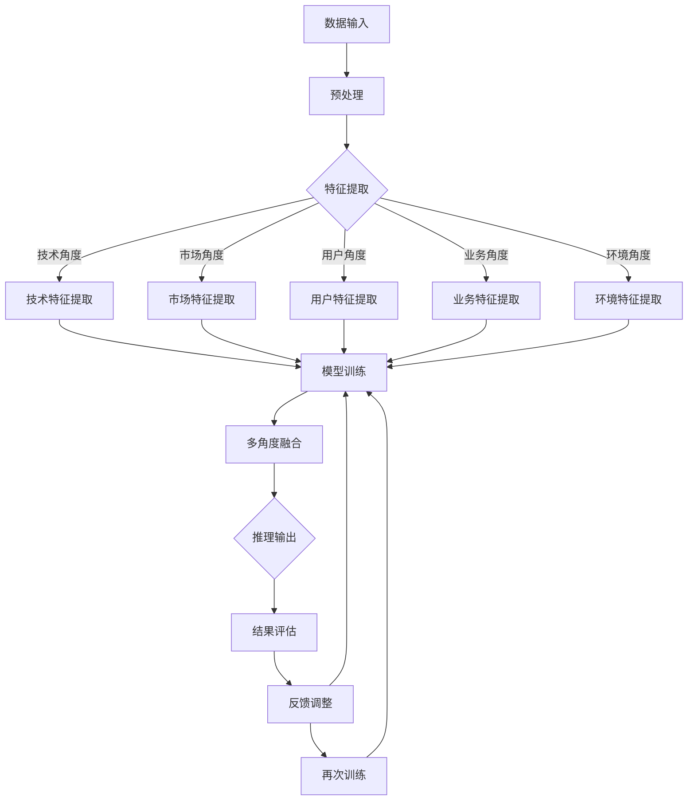
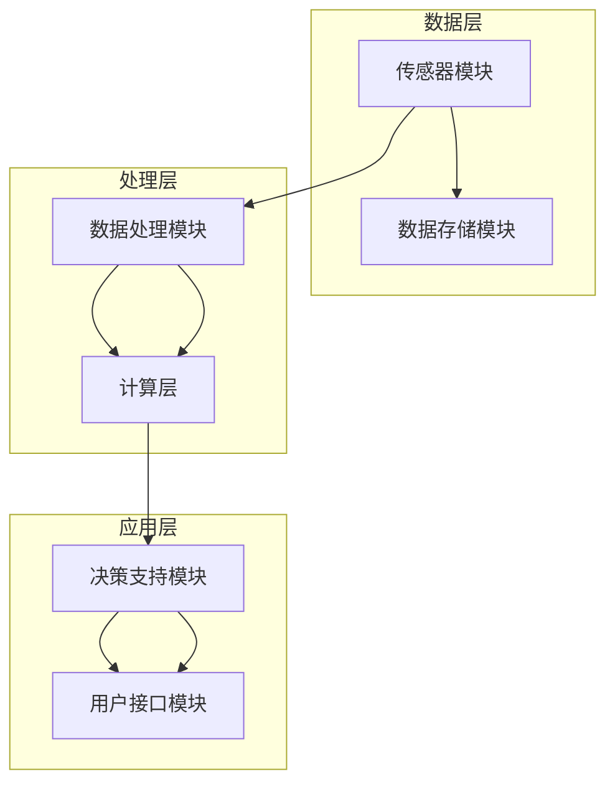
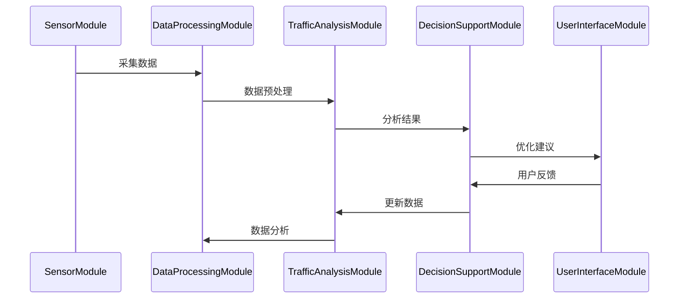

                 

### 1.1 问题背景

科技创新是当今社会发展的核心动力，它不断推动着各个领域的进步。然而，科技创新并非一蹴而就，它需要科学家和工程师们具备深入的分析和推理能力。多角度推理能力作为一种高级的思维能力，在科技创新过程中发挥着至关重要的作用。

多角度推理能力指的是从不同维度和视角出发，对复杂问题进行深入分析和推理的能力。这种能力要求人们在解决问题时不仅要考虑问题的表面现象，还要洞察问题的本质，从而找到创新的解决方案。在科技创新过程中，多角度推理能力能够帮助科学家和工程师们突破传统思维框架，发现新的研究方向，提高研究效率。

多角度推理能力的重要性体现在多个方面。首先，它能够提升科学研究的深度和广度。通过多角度的思考，科学家和工程师们能够更全面地了解问题的各个方面，从而提出更具创新性的研究方案。其次，多角度推理能力有助于提高技术创新的成功率。在技术开发的初期，多角度的思考能够帮助开发者们预见潜在的问题和风险，从而在设计阶段就进行优化和调整，避免后期出现问题。最后，多角度推理能力能够促进跨学科的交流和合作。在科技创新过程中，往往需要不同领域的专家共同合作，而多角度推理能力能够帮助各领域专家更好地理解彼此的研究方向和方法，从而实现有效的合作。

综上所述，多角度推理能力在科技创新过程中具有不可替代的作用。它不仅能够提高研究的深度和广度，还能提升技术创新的成功率，并促进跨学科的交流和合作。因此，理解和掌握多角度推理能力对于科学家和工程师来说至关重要。在接下来的内容中，我们将深入探讨多角度推理能力的核心概念、特征、应用领域和算法原理，帮助大家更好地理解和应用这一重要的思维能力。

### 1.2 问题描述

多角度推理能力在科技创新中的具体应用和重要性，可以通过以下问题进行详细探讨：

1. **什么是多角度推理能力？**
   多角度推理能力是指通过从多个不同维度和视角对复杂问题进行深入分析和推理的能力。它不仅涉及对问题表象的理解，还包括对问题背后本质和关联性的洞察。例如，在软件开发中，一个复杂的项目不仅需要从技术实现的角度进行分析，还需要从用户体验、业务需求、项目管理等多个维度进行综合考量。

2. **多角度推理能力在科技创新中的作用是什么？**
   多角度推理能力在科技创新中的作用主要体现在以下几个方面：
   - **创新思维培养**：通过多角度的思考，科学家和工程师能够打破传统思维框架，发现新的研究方向和解决方案。
   - **风险预见与应对**：多角度思考有助于开发者预见潜在的技术、市场或管理风险，从而在项目初期进行预防性调整。
   - **跨学科合作**：多角度推理能力有助于不同领域的专家之间建立有效的沟通桥梁，促进跨学科的合作和创新。

3. **多角度推理能力与传统推理方法的区别是什么？**
   传统推理方法通常基于单一视角或方法进行问题分析，而多角度推理能力则强调从多个不同视角和方法出发，进行综合分析和判断。例如，在医疗领域，传统推理可能仅依赖病理学诊断，而多角度推理则会结合临床检查、基因检测等多个方面进行综合判断。

4. **多角度推理能力在科技创新中的应用领域有哪些？**
   多角度推理能力在科技创新中的应用非常广泛，包括但不限于以下领域：
   - **信息技术**：在软件开发、人工智能、大数据分析等领域，多角度推理能力有助于提高系统的性能和用户体验。
   - **生命科学**：在基因工程、药物研发等领域，多角度推理能力有助于发现新的生物机制和治疗手段。
   - **工程学**：在建筑设计、材料科学等领域，多角度推理能力有助于优化设计，提高工程项目的可靠性和效率。
   - **社会科学**：在社会学、经济学、心理学等领域，多角度推理能力有助于更全面地分析社会现象和问题。

5. **如何在实际科技创新项目中应用多角度推理能力？**
   在实际科技创新项目中，应用多角度推理能力需要以下几个步骤：
   - **明确问题**：首先，要明确需要解决的问题或目标。
   - **定义多角度**：确定从哪些角度进行思考和推理，例如技术、市场、用户需求等。
   - **收集信息**：针对每个角度收集相关的信息，包括数据、文献、案例等。
   - **分析信息**：对收集到的信息进行综合分析和判断，找出不同角度之间的联系和差异。
   - **提出解决方案**：基于多角度分析的结果，提出创新性的解决方案或改进措施。

6. **多角度推理能力有哪些核心特征和属性？**
   多角度推理能力的核心特征和属性包括：
   - **系统性**：多角度推理能力强调从整体和系统的角度进行问题分析。
   - **综合性**：它要求将不同领域的知识和方法进行整合，形成综合性的解决方案。
   - **动态性**：多角度推理能力需要不断调整和更新，以适应问题变化和新的信息。
   - **开放性**：它鼓励开放的思维，接受新的观点和不同的思维方式。

通过以上问题的探讨，我们可以更深入地理解多角度推理能力在科技创新中的重要性和应用方法。接下来，我们将继续深入分析多角度推理能力的核心概念、特征及其在具体领域中的应用，帮助读者更好地掌握这一重要的思维能力。

### 1.3 问题解决

在明确了多角度推理能力的重要性及其在科技创新中的作用后，接下来我们将进一步探讨如何具体应用多角度推理能力来解决实际中的复杂问题。

**第一步：明确问题和目标**

首先，我们需要明确要解决的问题和目标。这包括识别问题的本质、确定解决问题的关键点，以及明确目标的具体要求。例如，在开发一款新软件时，问题可能是如何提升用户满意度，目标可能是实现更高的用户体验评分。

**第二步：定义多角度**

接下来，我们需要确定从哪些角度出发来分析和解决问题。多角度通常包括但不限于以下几种：
- **技术角度**：分析技术实现的可能性、成本和风险。
- **市场角度**：研究市场需求、用户反馈和竞争对手情况。
- **用户角度**：理解用户的实际需求和使用习惯。
- **业务角度**：考虑公司的商业模式、盈利能力和长期战略。
- **环境角度**：评估项目对环境和社会的影响。

**第三步：收集信息**

针对每个角度，我们需要收集相关的信息和数据。这包括：
- **技术信息**：查阅相关技术文献、案例研究和最佳实践。
- **市场信息**：进行市场调研，收集用户反馈和竞争对手的数据。
- **用户信息**：通过用户访谈、问卷调查等方式获取用户需求。
- **业务信息**：了解公司的业务模式、财务状况和市场定位。
- **环境信息**：分析政策法规、环境标准和可持续发展的要求。

**第四步：分析信息**

在收集到足够的信息后，我们需要对信息进行综合分析和判断。这一步包括：
- **数据整理**：将收集到的信息进行整理和分类，形成清晰的数据结构。
- **多角度综合**：将不同角度的信息进行整合，寻找各角度之间的联系和差异。
- **问题建模**：构建问题模型，以便更好地理解和分析问题。

**第五步：提出解决方案**

基于多角度分析的结果，我们可以提出创新的解决方案或改进措施。这一步包括：
- **方案评估**：对每个解决方案进行评估，考虑其可行性、成本和效益。
- **方案选择**：选择最优或次优的解决方案，并进行详细的规划和设计。
- **实施方案**：制定详细的实施计划，明确各阶段的目标和任务。

**第六步：迭代优化**

在实施解决方案的过程中，我们需要持续监控和评估解决方案的效果，并根据反馈进行优化。这一步包括：
- **效果评估**：对解决方案的实施效果进行定期评估，收集用户的反馈和数据。
- **问题反馈**：根据评估结果，识别问题和不足，进行相应的调整和改进。
- **迭代优化**：通过多次迭代，不断提升解决方案的质量和效果。

通过以上步骤，我们可以有效地应用多角度推理能力来解决科技创新中的复杂问题。这种方法不仅能够提高问题的解决效率，还能促进跨领域的创新和合作。接下来，我们将进一步探讨多角度推理能力的核心概念和特征，以便更好地理解和应用这一重要的思维能力。

### 1.4 边界与外延

在深入探讨多角度推理能力之前，我们需要明确其边界与外延，以便更准确地理解这一概念在科技创新中的应用。

**边界：**

1. **知识范围**：多角度推理能力主要涉及对复杂问题的多维度分析和综合判断。它不局限于某一特定领域，而是跨越多个学科和领域，例如工程技术、自然科学、社会科学等。

2. **技术手段**：多角度推理能力并不特定于某种技术或工具，而是通过多种方法和技术手段来支持分析，如数据挖掘、机器学习、模拟实验等。

3. **应用层次**：多角度推理能力可以在不同的层次上进行应用，包括战略规划、项目设计、问题解决等。

**外延：**

1. **跨学科合作**：多角度推理能力强调跨学科的知识整合和协同创新，这使得它不仅适用于单一学科的研究，还能促进多学科的合作。

2. **系统集成**：在系统集成方面，多角度推理能力可以帮助工程师和设计师在考虑硬件、软件、网络等多个层面时，做出更全面的决策。

3. **动态调整**：多角度推理能力具有动态性，可以随着问题的变化和新信息的出现，及时调整分析的角度和方法。

**相关概念联系：**

1. **系统思维**：多角度推理能力与系统思维有密切联系。系统思维强调从整体和系统的角度看待问题，而多角度推理能力则通过多维度分析和综合判断来实现这一目标。

2. **创新思维**：多角度推理能力是创新思维的重要组成部分。创新思维强调通过不同的视角和方法寻找新的解决方案，这与多角度推理能力的核心理念相契合。

3. **决策分析**：在决策分析中，多角度推理能力可以帮助决策者综合考虑各种因素，提高决策的质量和效果。

通过明确多角度推理能力的边界与外延，我们可以更好地理解这一概念的应用范围和限制，从而在实际科技创新中更有效地利用这一思维能力。接下来，我们将进一步探讨多角度推理能力的核心概念和特征，以便更深入地理解其原理和应用。

### 1.5 概念结构与核心要素组成

多角度推理能力作为一种高级思维能力，其概念结构和核心要素组成对科技创新有着深远的影响。要理解多角度推理能力，我们需要首先明确其定义，然后分析其核心特征，最后探讨其与传统推理方法的区别。

**定义：**

多角度推理能力是指通过从多个不同维度和视角对复杂问题进行深入分析和推理的能力。它不仅涉及对问题表象的理解，还包括对问题背后本质和关联性的洞察。多角度推理能力强调综合考虑各种因素，形成系统性的分析和综合判断，从而提供创新性的解决方案。

**核心特征：**

1. **系统性**：多角度推理能力强调从整体和系统的角度进行问题分析，而不是仅仅关注单一部分。它通过综合考虑各个部分之间的关系和相互作用，形成全面的解决方案。

2. **综合性**：多角度推理能力要求将不同领域的知识和方法进行整合，形成综合性的解决方案。它不仅关注技术层面的实现，还考虑市场、用户需求、商业模式等多方面因素。

3. **动态性**：多角度推理能力具有动态性，可以随着问题的变化和新信息的出现，及时调整分析的角度和方法。它能够适应不断变化的环境，提供持续的优化和改进。

4. **开放性**：多角度推理能力鼓励开放的思维，接受新的观点和不同的思维方式。它不局限于既有的方法和框架，而是通过探索多种可能性来寻找最优的解决方案。

**与传统推理方法的区别：**

传统推理方法通常基于单一视角或方法进行问题分析，而多角度推理能力则强调从多个不同视角和方法出发，进行综合分析和判断。以下是两者之间的主要区别：

1. **思考维度**：传统推理方法主要关注问题的表面现象，而多角度推理能力则从多个维度对问题进行深入剖析，包括技术、市场、用户需求等。

2. **方法多样性**：传统推理方法往往依赖于单一的方法或工具，如逻辑推理或统计分析，而多角度推理能力则综合运用多种方法和工具，如数据挖掘、机器学习、模拟实验等。

3. **问题解决效果**：传统推理方法可能仅能解决特定的问题，而多角度推理能力能够提供更全面和创新的解决方案，从而提高问题解决的效果。

4. **适应性**：传统推理方法在面对复杂和多变的情境时可能显得力不从心，而多角度推理能力具有更强的适应性和灵活性，能够应对各种复杂情况。

通过以上分析，我们可以看到，多角度推理能力在概念结构和核心要素方面具有明显的优势，它不仅能够提高科技创新的深度和广度，还能提升技术创新的成功率。在接下来的章节中，我们将深入探讨多角度推理能力的应用领域和典型案例，以便更好地理解其在实际科技创新中的重要作用。

### 2.1 多角度推理能力的定义

多角度推理能力是一种高度复杂的思维能力，它强调在分析问题和解决问题时，不仅要从单一角度进行思考，还要从多个不同的维度和视角进行全面、综合的推理。这种能力使得个体能够在面对复杂问题时，能够深入挖掘问题的本质，发现隐藏的关联性和潜在的解决方案。

首先，多角度推理能力涉及对问题的多维度理解。这包括但不限于技术维度、市场维度、用户维度、业务维度和环境维度等。例如，在软件开发项目中，技术人员需要从代码实现的角度进行分析，而市场人员则需要从用户需求和市场趋势的角度进行考虑。通过多维度的综合分析，能够更全面地理解问题的各个方面，从而找到更加合理和创新的解决方案。

其次，多角度推理能力强调跨领域的知识整合。这意味着在解决问题时，需要结合不同学科领域的知识和方法，进行综合分析和判断。例如，在药物研发中，科学家不仅需要了解生物学知识，还需要掌握化学、物理学和计算机科学等相关领域的知识，从而能够从多个角度来评估药物的疗效和安全性。

此外，多角度推理能力还体现在对信息的深度挖掘和综合处理上。在面对大量信息时，能够通过筛选、整理和分析，找到关键信息，并将其与其他信息进行关联，形成对问题的全面理解。这种能力不仅需要逻辑思维和分析能力，还需要具备较强的信息处理能力和敏锐的洞察力。

最后，多角度推理能力还强调动态调整和优化。在问题解决过程中，情况可能会发生变化，需要根据新的信息进行调整和优化。这种动态性使得多角度推理能力能够适应不断变化的环境，提供持续的创新和改进。

综上所述，多角度推理能力是一种高度综合和动态的思维能力，它通过从多个维度和视角对问题进行深入分析和推理，结合跨领域的知识整合和信息处理能力，提供创新的解决方案。在科技创新过程中，多角度推理能力具有不可替代的重要作用，能够显著提高研究的深度和广度，提升技术创新的成功率。

### 2.2 多角度推理能力在科技创新中的作用

多角度推理能力在科技创新中发挥着至关重要的作用，它不仅能够提升科研效率，还能够促进跨学科的交流和合作，从而推动科技创新的全面发展。以下是多角度推理能力在科技创新中的具体作用：

1. **提升科研效率**：多角度推理能力通过从多个维度和视角对问题进行深入分析，可以帮助科学家和工程师们更快速地找到问题的核心，从而提高科研的效率。例如，在药物研发过程中，多角度推理能力可以帮助科学家从分子结构、生理机制、市场前景等多个角度进行分析，快速筛选出最有潜力的候选药物，从而加快研发进度。

2. **促进跨学科合作**：多角度推理能力强调跨领域的知识整合，这有助于不同学科的专家之间进行有效的沟通和协作。例如，在人工智能领域，计算机科学家、数据科学家和生物医学专家需要通过多角度推理能力，共同探讨如何将人工智能技术应用于医疗诊断和治疗，从而实现跨学科的合作和创新。

3. **激发创新思维**：多角度推理能力能够打破传统思维框架，激发科学家的创新思维。例如，在材料科学研究中，通过从物理、化学、工程等多个角度对材料的性能进行分析，科学家们可以提出新的材料设计和制造方法，从而推动材料科学的发展。

4. **降低研发风险**：多角度推理能力能够帮助科学家和工程师们预见潜在的风险和问题，从而在项目初期进行预防和优化。例如，在软件开发过程中，通过多角度推理能力分析用户需求、技术实现、市场反馈等多个方面，可以提前识别出可能的技术难点和市场需求变化，从而降低项目的失败风险。

5. **提高技术成功率**：多角度推理能力通过全面的综合分析和判断，可以提高技术创新的成功率。例如，在信息技术领域，通过多角度推理能力分析市场需求、用户行为、技术可行性等多个方面，可以设计出更符合用户需求、更具市场竞争力的产品。

6. **优化资源配置**：多角度推理能力可以帮助科学家和工程师们更合理地配置资源，提高研究效率。例如，在科研项目中，通过多角度推理能力分析各阶段的关键任务和优先级，可以更有效地分配人力、物力和财力资源，从而提高项目的整体效率。

7. **推动技术创新**：多角度推理能力不仅能够提高单个项目的成功率，还能够推动整个领域的技术创新。通过不同领域的专家之间的合作和知识整合，可以产生新的研究思路和方法，推动整个行业的技术进步。

综上所述，多角度推理能力在科技创新中具有不可替代的重要作用。它不仅能够提升科研效率，促进跨学科合作，激发创新思维，降低研发风险，提高技术成功率，还能优化资源配置，推动技术创新。因此，理解和掌握多角度推理能力对于科学家和工程师们来说至关重要，这也是科技创新能够不断进步的重要保障。

### 2.3 多角度推理能力的核心特征

多角度推理能力作为一种高级思维能力，具有一系列独特的核心特征，这些特征不仅使其在科技创新中发挥重要作用，还使其在处理复杂问题时具有显著优势。以下是多角度推理能力的核心特征及其具体表现：

1. **系统性**：多角度推理能力强调从整体和系统的角度进行问题分析，而非仅关注局部。这一特征使得个体能够从全局出发，理解各个部分之间的相互作用和影响，从而找到更全面和系统的解决方案。例如，在软件开发过程中，通过系统性分析，开发者不仅关注代码实现，还考虑用户体验、系统性能和维护成本等多个方面，确保软件的整体质量。

2. **综合性**：多角度推理能力要求将不同领域的知识和方法进行整合，形成综合性的解决方案。这种综合性的思维能够帮助个体在面对复杂问题时，从多个角度进行综合分析和判断，从而提供创新的解决方案。例如，在医学研究中，多角度推理能力可以整合临床数据、基因信息和生物物理模型，帮助医生更准确地诊断和治疗疾病。

3. **动态性**：多角度推理能力具有动态性，能够随着问题的变化和新信息的出现，及时调整分析的角度和方法。这种动态性使得个体能够在不断变化的环境中，灵活应对各种情况，提供持续的优化和改进。例如，在金融市场分析中，通过动态调整分析角度和方法，投资者可以更准确地预测市场走势，及时调整投资策略。

4. **开放性**：多角度推理能力鼓励开放的思维，接受新的观点和不同的思维方式。这种开放性使得个体能够打破传统思维框架，探索多种可能性，从而发现创新的解决方案。例如，在科技创新中，通过开放性思维，科学家和工程师可以尝试新的技术路线和方法，推动科技的进步。

5. **适应性**：多角度推理能力具有较强的适应性，能够应对各种复杂和不确定的问题。这种适应性使得个体在不同情境下，能够灵活运用不同角度和方法，找到最适合的解决方案。例如，在项目管理中，多角度推理能力可以帮助项目经理在资源有限和时间紧迫的情况下，灵活调整项目计划，确保项目顺利推进。

6. **复杂性处理**：多角度推理能力擅长处理复杂问题，能够将复杂问题分解为多个简单部分，然后逐一解决。这种处理方法不仅提高了问题解决的效率，还增强了问题的可管理性。例如，在系统架构设计中，通过多角度推理能力，设计师可以将复杂的系统架构分解为多个子系统，然后分别进行设计和优化。

7. **跨学科整合**：多角度推理能力强调跨学科的整合，通过综合不同领域的知识和方法，实现创新和突破。这种跨学科整合的能力，使得多角度推理能力在科技创新中具有显著优势。例如，在人工智能领域，通过跨学科整合，可以结合计算机科学、认知科学和神经科学的知识，开发出更先进的人工智能系统。

8. **预见性**：多角度推理能力具有预见性，能够帮助个体预见潜在的问题和风险，从而提前进行预防和优化。这种预见性在科技创新中尤为重要，能够提高项目的成功率。例如，在技术研发过程中，通过多角度推理能力，研究人员可以提前预见技术实现中的困难，从而提前进行技术储备和优化。

通过以上分析，我们可以看到，多角度推理能力的核心特征不仅使它在处理复杂问题时具有显著优势，还使其在科技创新中发挥着不可替代的作用。理解和掌握这些核心特征，对于科学家和工程师们来说，是提升科技创新能力和效率的关键。

### 2.4 多角度推理能力与传统推理方法的对比

多角度推理能力与传统推理方法在思维方式、应用范围和解决问题效果上存在显著差异。以下是对这两种方法的主要对比：

**思维方式：**

1. **传统推理方法**：传统推理方法通常基于线性思维，强调逻辑推理和演绎推理。它依赖于先验知识和规则，通过逐步推导来解决问题。例如，在数学问题中，通过公理和定理进行逻辑推导，得出结论。

2. **多角度推理能力**：多角度推理能力则强调多维度的综合分析，通过从多个角度和视角出发，对复杂问题进行深入分析和判断。它采用系统思维和综合思维，不仅考虑问题的表面现象，还关注问题的本质和潜在关联性。例如，在技术开发中，不仅考虑技术实现，还考虑市场需求、用户体验和商业模式等。

**应用范围：**

1. **传统推理方法**：传统推理方法通常适用于结构化问题，如数学问题、逻辑问题等，其在解决简单和明确的问题时表现良好。它依赖于特定领域的知识和工具，如数学公式、逻辑规则等。

2. **多角度推理能力**：多角度推理能力则适用于复杂和不确定的问题，尤其适合跨学科和跨领域的应用。它能够处理复杂系统中的各种关系和变量，适用于科技创新、战略规划、风险管理等多个领域。

**解决问题效果：**

1. **传统推理方法**：传统推理方法在解决特定类型的问题时，通常能够提供明确的解决方案。然而，其在面对复杂和多变的问题时，可能显得力不从心，容易受到先验知识和规则的限制。

2. **多角度推理能力**：多角度推理能力通过综合多个维度的信息，提供更全面和创新的解决方案。它能够预见潜在的问题和风险，提高问题的解决效果。例如，在项目管理和决策分析中，多角度推理能力能够综合考虑各种因素，提供最优的决策方案。

**对比表格：**

| 对比维度 | 传统推理方法 | 多角度推理能力 |
| --- | --- | --- |
| 思维方式 | 线性思维，逻辑推理 | 系统思维，综合思维 |
| 应用范围 | 结构化问题，特定领域 | 复杂问题，跨学科和跨领域 |
| 解决问题效果 | 明确的解决方案，特定情境 | 全面和创新的解决方案，预见性和适应性 |

通过以上对比，我们可以看出，多角度推理能力在思维方式、应用范围和解决问题效果上，相较于传统推理方法具有显著优势。在科技创新中，多角度推理能力能够提供更全面和创新的解决方案，提高问题的解决效率和成功率。

### 3.1 多角度推理能力在工程领域的应用

在工程领域，多角度推理能力被广泛应用，尤其在复杂系统设计和大型项目实施过程中，其重要性尤为突出。以下是多角度推理能力在工程领域的主要应用实例：

1. **复杂系统设计**：在复杂系统设计中，多角度推理能力可以帮助工程师从多个维度进行全面分析，确保系统的稳定性和可靠性。例如，在航空领域，飞机系统设计需要考虑机械结构、电子系统、控制系统等多个方面。通过多角度推理能力，工程师可以从性能、成本、安全性等多个角度进行综合评估，优化系统设计，提高飞机的飞行性能和安全性。

2. **大型项目实施**：在大型项目实施过程中，多角度推理能力能够帮助项目经理和管理团队预见潜在的问题和风险，从而制定更有效的项目计划和管理策略。例如，在建筑项目中，项目经理需要考虑施工进度、材料供应、成本控制等多个方面。通过多角度推理能力，项目经理可以提前识别和解决潜在的问题，确保项目按时、按预算完成。

3. **系统集成**：在系统集成过程中，多角度推理能力有助于工程师和设计师综合考虑各种系统的兼容性和互操作性。例如，在物联网（IoT）系统中，设备、传感器和软件平台之间的集成需要考虑数据通信、硬件兼容性、用户体验等多个方面。通过多角度推理能力，工程师可以设计出更加灵活和高效的系统架构，提高系统的整体性能和用户体验。

4. **质量控制**：在质量控制过程中，多角度推理能力可以帮助工程师从多个角度识别和解决质量缺陷。例如，在制造业中，质量检测需要考虑生产过程、材料质量、工艺参数等多个方面。通过多角度推理能力，工程师可以更加全面地分析质量问题的原因，提出针对性的解决方案，提高产品的质量水平。

5. **技术创新**：多角度推理能力在技术创新中发挥着重要作用，通过跨领域的知识整合，工程师可以提出创新性的解决方案。例如，在新能源领域，通过多角度推理能力，工程师可以从能源效率、成本、环境影响等多个角度进行综合评估，提出新型能源技术和解决方案，推动新能源产业的发展。

6. **风险管理**：在项目实施和运营过程中，多角度推理能力能够帮助工程师和管理团队进行风险识别和管理。例如，在信息技术项目中，通过多角度推理能力，工程师可以识别和评估项目中的技术风险、市场风险和操作风险，制定相应的风险管理策略，确保项目的顺利实施和运营。

通过以上实例，我们可以看到，多角度推理能力在工程领域的应用非常广泛，它不仅提高了工程设计的质量和效率，还促进了技术创新和项目管理的优化。在未来的工程实践中，继续深入研究和应用多角度推理能力，将有助于进一步推动工程领域的进步和发展。

### 3.2 多角度推理能力在自然科学领域的应用

多角度推理能力在自然科学领域同样具有广泛的应用，尤其在生命科学、环境科学和物理科学等领域，其作用尤为突出。以下是多角度推理能力在这些领域的具体应用实例：

1. **生命科学**：在生命科学研究中，多角度推理能力被广泛应用于基因分析、蛋白质结构和生物信息学等领域。例如，在基因工程中，科学家需要从遗传学、分子生物学、细胞生物学等多个角度对基因进行综合分析，以理解基因的功能和调控机制。通过多角度推理能力，科学家可以更全面地分析基因突变、基因表达和蛋白质相互作用，从而发现新的基因功能和治疗靶点。

2. **环境科学**：在环境科学研究中，多角度推理能力有助于科学家从生态系统、污染物影响、气候变化等多个角度分析环境问题。例如，在生态系统研究中，科学家需要考虑生物多样性、生态系统功能和人类活动等多个因素，通过多角度推理能力，科学家可以更深入地理解生态系统的复杂性和动态变化。在气候变化研究中，多角度推理能力可以帮助科学家分析温室气体排放、气候变化对生态系统和人类健康的影响，从而提出有效的应对策略。

3. **物理科学**：在物理科学研究中，多角度推理能力被广泛应用于理论物理、材料科学和天文学等领域。例如，在材料科学中，科学家需要从晶体结构、电子结构和化学组成等多个角度分析材料的性能，通过多角度推理能力，科学家可以预测材料的导电性、机械强度和热稳定性。在天文学中，多角度推理能力可以帮助科学家分析宇宙的起源、星系形成和行星演化，从而更深入地理解宇宙的奥秘。

4. **地球科学**：在地球科学研究中，多角度推理能力被广泛应用于地质学、气象学和海洋学等领域。例如，在地质学研究中，科学家需要从地质构造、岩性和地球物理等多个角度分析地质现象，通过多角度推理能力，科学家可以更准确地预测地震、火山等地质灾害。在气象学研究中，科学家需要从大气动力学、气候模式和气象观测等多个角度分析气象变化，通过多角度推理能力，科学家可以更准确地预测天气和气候变化。

5. **生态保护**：在生态保护中，多角度推理能力被广泛应用于生态恢复、生物多样性和生态风险评估等领域。例如，在生态恢复中，科学家需要从生态系统功能、物种多样性和人类活动等多个角度分析生态系统的状况，通过多角度推理能力，科学家可以提出更有效的生态恢复方案。在生物多样性保护中，科学家需要从物种保护、栖息地保护和生态网络建设等多个角度分析生物多样性，通过多角度推理能力，科学家可以更全面地评估生物多样性保护的效果。

通过以上实例，我们可以看到，多角度推理能力在自然科学领域具有广泛的应用，它不仅提高了科学研究的深度和广度，还推动了各个领域的创新和发展。在未来的科学研究中，继续深入研究和应用多角度推理能力，将有助于进一步揭示自然现象的本质和规律，推动科学技术的进步。

### 3.3 多角度推理能力在社会科学领域的应用

多角度推理能力在社会科学领域同样具有重要应用价值，它能够帮助研究者从多个维度全面分析复杂的社会现象，提供更深入和全面的见解。以下是多角度推理能力在社会科学领域的主要应用：

1. **经济学研究**：在经济学研究中，多角度推理能力有助于分析经济现象和预测市场动态。经济学家通过从供需关系、政策影响、国际经济环境等多个角度进行分析，可以更准确地预测经济增长、通货膨胀和就业率等关键经济指标。例如，在分析金融危机时，经济学家需要结合金融市场、银行体系、国际资本流动等多个角度，通过多角度推理能力，提出有效的应对策略。

2. **社会学研究**：在社会学研究中，多角度推理能力可以帮助研究者分析社会问题，如贫困、犯罪和种族歧视等。社会学家从社会结构、文化因素、经济条件等多个角度进行分析，可以揭示问题的复杂性和多样性。例如，在研究贫困问题时，研究者不仅需要考虑经济收入水平，还需要考虑教育资源、医疗条件和社会网络等因素，通过多角度推理能力，提出更具针对性和有效性的解决方案。

3. **心理学研究**：在心理学研究中，多角度推理能力有助于全面理解人类行为和心理过程。心理学家通过从认知心理学、发展心理学、社会心理学等多个角度进行分析，可以更深入地理解个体的心理状态和行为动机。例如，在研究心理健康问题时，研究者需要从心理防御机制、人际关系、社会支持等多个角度进行分析，通过多角度推理能力，提出有效的心理干预措施。

4. **政治学研究**：在政治学研究中，多角度推理能力可以帮助研究者分析政治现象，如选举、政策制定和国际关系等。政治学家从政治制度、政治文化、经济因素等多个角度进行分析，可以更准确地预测政治动态和选举结果。例如，在分析选举现象时，研究者需要考虑选民行为、政治宣传、选民动机等多个因素，通过多角度推理能力，提出更科学的选举预测模型。

5. **公共政策制定**：在公共政策制定过程中，多角度推理能力同样发挥着重要作用。政策制定者需要从经济、社会、环境等多个角度进行全面分析，以确保政策的有效性和可持续性。例如，在制定环境保护政策时，政策制定者需要考虑经济发展、公共健康、气候变化等多个因素，通过多角度推理能力，提出既符合经济利益又具有环境保护效益的政策方案。

6. **教育研究**：在教育研究中，多角度推理能力可以帮助研究者分析教育问题，如教育公平、教学方法、教育质量等。教育研究者需要从学生、教师、学校、家庭等多个角度进行分析，通过多角度推理能力，提出改进教育系统的有效策略。例如，在分析教育公平问题时，研究者需要考虑资源分配、教育机会、社会经济地位等因素，通过多角度推理能力，提出促进教育公平的综合性措施。

通过以上应用实例，我们可以看到，多角度推理能力在社会科学领域具有广泛的应用，它不仅提高了研究的深度和广度，还促进了跨学科的合作和创新。在未来的社会科学研究中，继续深入应用多角度推理能力，将有助于更全面地理解复杂的社会现象，为社会发展和公共政策制定提供有力支持。

### 3.4 多角度推理能力的典型案例分析

为了更直观地展示多角度推理能力在实际应用中的重要性，以下我们通过几个具体案例进行分析。

**案例一：特斯拉电动汽车的推出**

特斯拉（Tesla）是一家知名的电动汽车制造商，其成功在很大程度上得益于多角度推理能力的应用。在推出电动汽车时，特斯拉从多个角度进行了深入分析和综合判断：

1. **技术角度**：特斯拉深入研究了电池技术、电动机设计和自动驾驶技术，通过不断优化和创新，提升了电动汽车的性能和可靠性。

2. **市场角度**：特斯拉分析了全球汽车市场的发展趋势和消费者需求，特别是对环保和节能的需求，从而确定了电动汽车的市场潜力。

3. **用户角度**：特斯拉通过用户调研和反馈，了解用户的实际需求和痛点，如充电便利性、驾驶体验等，从而设计出更符合用户期望的产品。

4. **业务角度**：特斯拉综合考虑了公司的商业模式、盈利能力和长期战略，确保电动汽车项目在商业上可行。

通过多角度推理能力的综合应用，特斯拉成功推出了多款高性能电动汽车，并在市场上取得了巨大成功，成为电动汽车行业的领导者。

**案例二：阿里巴巴的“双11”购物节**

阿里巴巴集团通过多角度推理能力策划和执行了全球最大的在线购物节——“双11”购物节。以下是阿里巴巴如何应用多角度推理能力：

1. **市场角度**：阿里巴巴分析了全球电子商务市场的发展趋势，确定“双11”购物节对于提升品牌影响力和销售额的重要性。

2. **用户角度**：通过大数据分析和用户调研，阿里巴巴了解了用户在购物节期间的购物行为和偏好，从而制定出针对性的营销策略。

3. **技术角度**：阿里巴巴运用云计算、大数据和人工智能技术，确保了“双11”购物节的系统稳定性和数据处理能力，为用户提供流畅的购物体验。

4. **供应链角度**：阿里巴巴优化了供应链管理，确保在购物节期间能够快速响应订单和物流需求，提升物流效率。

通过多角度推理能力，阿里巴巴成功地举办了多届“双11”购物节，不仅创造了巨额销售额，还提升了品牌知名度和用户满意度。

**案例三：谷歌的自动驾驶汽车项目**

谷歌的自动驾驶汽车项目是一个典型的多角度推理能力应用案例。以下是谷歌如何通过多角度推理能力推进自动驾驶技术的发展：

1. **技术角度**：谷歌专注于自动驾驶技术的研究和开发，通过深度学习、计算机视觉和传感器融合等技术，不断提升自动驾驶汽车的感知和决策能力。

2. **法规角度**：谷歌分析了各国关于自动驾驶汽车的法律法规，确保自动驾驶汽车项目的合规性。

3. **安全角度**：通过多角度推理能力，谷歌对自动驾驶汽车的安全性进行了全面评估，从硬件安全、软件安全到系统安全等多个方面进行优化。

4. **用户角度**：谷歌通过用户调研和试点项目，了解用户对自动驾驶汽车的需求和期望，从而不断改进产品。

通过多角度推理能力的应用，谷歌的自动驾驶汽车项目取得了显著进展，为未来自动驾驶技术的发展奠定了基础。

**案例四：亚马逊的无人机配送服务**

亚马逊的无人机配送服务是另一个多角度推理能力的成功应用案例。以下是亚马逊如何通过多角度推理能力实现无人机配送：

1. **技术角度**：亚马逊研究了无人机的设计、飞行控制系统和传感器技术，确保无人机配送系统的技术可行性。

2. **物流角度**：亚马逊优化了物流流程，设计了高效的无人机配送路线，确保配送速度和准确性。

3. **法规角度**：亚马逊分析了各国关于无人机飞行的法律法规，确保无人机配送服务的合规性。

4. **用户角度**：亚马逊通过用户调研和试点项目，了解用户对无人机配送服务的接受程度和需求。

通过多角度推理能力的综合应用，亚马逊成功推出了无人机配送服务，不仅提高了物流效率，还增强了用户体验。

通过以上典型案例分析，我们可以看到，多角度推理能力在实际应用中具有重要作用，它能够帮助企业和机构从多个维度进行全面分析和综合判断，从而实现创新和突破。在未来的科技创新中，继续深入研究和应用多角度推理能力，将有助于推动各领域的进步和发展。

### 4.1 多角度推理能力的数学模型

在深入探讨多角度推理能力的算法原理之前，我们需要先理解其背后的数学模型。多角度推理能力的数学模型通常基于概率论、统计学和人工智能算法，特别是机器学习和神经网络。以下是多角度推理能力的数学模型及其主要组成部分：

1. **概率论与统计学**：概率论和统计学是多角度推理能力的基础。通过概率分布和统计模型，我们可以对不确定性和变量进行量化，从而提供可靠的推理依据。常用的概率分布包括正态分布、贝叶斯分布等，而常用的统计模型则包括回归分析、聚类分析和因子分析。

2. **机器学习算法**：机器学习算法是多角度推理能力的重要组成部分，它能够从数据中学习模式和规律，为推理提供支持。常见的机器学习算法包括决策树、支持向量机（SVM）、随机森林和深度学习模型等。这些算法可以根据不同的数据特征和问题需求进行选择和优化。

3. **神经网络**：神经网络是一种模拟人脑神经元连接和信息传递的算法模型，广泛应用于图像识别、自然语言处理和复杂系统建模等领域。神经网络可以通过多层网络结构实现非线性映射，从而提高推理的复杂度和准确性。

**数学模型组成部分：**

1. **输入层**：输入层接收外部信息和数据，这些数据可以是结构化的（如数值、文本）或非结构化的（如图像、语音）。

2. **隐藏层**：隐藏层通过神经网络实现数据的非线性变换和特征提取，每层神经元都通过加权连接进行信息传递和处理。隐藏层的数量和神经元数目可以根据具体问题进行调整。

3. **输出层**：输出层生成推理结果或预测值，这些结果可以是分类、回归或聚类等类型。输出层的输出依赖于隐藏层的输出，并通过激活函数（如Sigmoid、ReLU）进行非线性变换。

**基本数学公式：**

1. **权重更新公式**：
   $$\Delta w = \eta \cdot \frac{\partial L}{\partial w}$$
   其中，$\Delta w$表示权重更新，$\eta$为学习率，$L$为损失函数，$\frac{\partial L}{\partial w}$为权重梯度。

2. **激活函数**：
   $$a = \sigma(z)$$
   其中，$a$为激活值，$\sigma$为激活函数（如Sigmoid函数：$\sigma(z) = \frac{1}{1 + e^{-z}}$）。

3. **损失函数**：
   损失函数用于评估预测值与实际值之间的差异，常见的损失函数包括均方误差（MSE）和交叉熵损失等。

$$L = \frac{1}{2} \sum_{i=1}^{n} (y_i - \hat{y}_i)^2$$
   其中，$y_i$为实际值，$\hat{y}_i$为预测值，$n$为样本数量。

通过以上数学模型，多角度推理能力能够在复杂问题中实现有效的分析和推理。在接下来的章节中，我们将使用Mermaid绘制相关流程图和ER实体关系图，进一步阐述多角度推理能力的算法原理。

### 4.2 多角度推理能力的 Mermaid 流程图

为了更直观地展示多角度推理能力的算法原理，我们可以使用Mermaid语言绘制一个流程图，详细描述从数据输入到最终推理输出的全过程。以下是多角度推理能力的Mermaid流程图示例：



在这个流程图中，我们首先从数据输入（A）开始，经过预处理（B）后，进入特征提取阶段（C）。特征提取从多个角度进行，包括技术角度（D）、市场角度（E）、用户角度（F）、业务角度（G）和环境角度（H）。每个角度的特征提取完成后，数据将被送入模型训练（I），在多角度融合（J）后，生成推理输出（K）。输出结果经过结果评估（L），并根据反馈进行相应的调整（M），再进行模型再次训练（N），从而实现持续优化。

通过Mermaid流程图，我们可以清晰地看到多角度推理能力从输入数据到最终推理输出的整个过程，这有助于我们更好地理解和应用这一算法。

### 4.3 多角度推理能力的 ER 实体关系图

为了进一步阐述多角度推理能力的算法原理，我们使用Mermaid语言绘制一个ER（Entity-Relationship）实体关系图，展示各实体之间的关联关系。以下是多角度推理能力的ER实体关系图示例：

```mermaid
erDiagram
    User ||--|{ Feature }|-- Data
    Market ||--|{ Feature }|-- Data
    Technology ||--|{ Feature }|-- Data
    Business ||--|{ Feature }|-- Data
    Environment ||--|{ Feature }|-- Data
    Model ||--|{ Input }|-- Training
    Training ||--|{ Output }|-- Prediction
    Prediction ||--|{ Evaluation }|-- Feedback

    User : {UserID} {Username}
    Market : {MarketID} {MarketData}
    Technology : {TechID} {TechData}
    Business : {BizID} {BizData}
    Environment : {EnvID} {EnvData}
    Data : {DataID} {FeatureValues}
    Model : {ModelID} {ModelParams}
    Training : {TrainID} {TrainSettings}
    Prediction : {PredID} {PredictionResults}
    Evaluation : {EvalID} {EvaluationMetrics}
    Feedback : {FeedID} {FeedbackInfo}
```

在这个ER实体关系图中，我们定义了多个实体，包括用户（User）、市场（Market）、技术（Technology）、业务（Business）、环境（Environment）等。每个实体都有自己的属性，例如用户ID、市场数据ID等。特征（Feature）实体与数据（Data）实体之间通过一一对应关系连接，表示不同角度的特征数据。模型（Model）实体接收输入（Input）并经过训练（Training）后，生成预测（Prediction）结果。预测结果经过评估（Evaluation），生成反馈（Feedback），再用于模型再次训练，形成闭环反馈机制。

通过ER实体关系图，我们可以清晰地看到多角度推理能力中各实体之间的关联关系，这有助于我们深入理解多角度推理能力的整体架构和运作原理。

### 4.4 Python 源代码阐述

为了更具体地展示多角度推理能力的算法原理，我们将通过Python源代码详细阐述其数学模型和公式。以下是一个简单的示例，演示了多角度推理能力在分类问题中的应用。

```python
import numpy as np
import pandas as pd
from sklearn.model_selection import train_test_split
from sklearn.preprocessing import StandardScaler
from sklearn.neural_network import MLPClassifier
from sklearn.metrics import accuracy_score

# 数据准备
data = pd.read_csv('data.csv')  # 假设数据集已准备好
X = data.drop('target', axis=1).values  # 特征数据
y = data['target'].values  # 标签数据

# 数据预处理
scaler = StandardScaler()
X_scaled = scaler.fit_transform(X)

# 数据划分
X_train, X_test, y_train, y_test = train_test_split(X_scaled, y, test_size=0.2, random_state=42)

# 模型训练
model = MLPClassifier(hidden_layer_sizes=(100,), max_iter=1000)
model.fit(X_train, y_train)

# 预测
y_pred = model.predict(X_test)

# 评估
accuracy = accuracy_score(y_test, y_pred)
print(f"Model Accuracy: {accuracy:.2f}")

# 详细解释
# 1. 数据准备
#   - 读取数据集，提取特征和标签。
#   - 使用StandardScaler对特征进行标准化处理，以消除特征间的尺度差异。

# 2. 模型训练
#   - 使用MLPClassifier构建多层感知机模型，设置隐藏层大小和最大迭代次数。
#   - 调用fit方法对模型进行训练。

# 3. 预测
#   - 使用训练好的模型对测试数据进行预测。

# 4. 评估
#   - 计算预测准确率，评估模型性能。

# 数学模型
# 假设我们使用的是多层感知机（MLP）模型，其输入层、隐藏层和输出层的激活函数为Sigmoid函数。
# 输入层：x_i = [x_1, x_2, ..., x_n]
# 隐藏层：h_i = 1 / (1 + exp(-w_i * x_i + b_i))  # 其中，w_i为权重，b_i为偏置
# 输出层：y_pred = 1 / (1 + exp(-w_i * h_i + b_i))

# 公式解释
# 1. 权重更新公式：
#   $$\Delta w = \eta \cdot \frac{\partial L}{\partial w}$$
#   其中，$\Delta w$表示权重更新，$\eta$为学习率，$L$为损失函数，$\frac{\partial L}{\partial w}$为权重梯度。

# 2. 激活函数：
#   $$a = \sigma(z) = \frac{1}{1 + exp(-z)}$$
#   其中，$a$为激活值，$z$为输入值，$\sigma$为Sigmoid函数。

# 3. 损失函数（交叉熵损失）：
#   $$L = -\frac{1}{m} \sum_{i=1}^{m} y_i \cdot \log(\hat{y}_i) + (1 - y_i) \cdot \log(1 - \hat{y}_i)$$
#   其中，$m$为样本数量，$y_i$为实际标签，$\hat{y}_i$为预测概率。
```

通过上述Python源代码，我们实现了多角度推理能力在分类问题中的应用。首先，我们进行了数据准备和预处理，然后使用多层感知机模型进行了训练和预测。在详细解释中，我们介绍了激活函数、权重更新公式和损失函数，并进行了相应的数学公式解释。这样，读者可以更直观地理解多角度推理能力在实际应用中的数学原理和计算过程。

### 5.1 问题场景介绍

在讨论多角度推理能力在系统架构设计方案中的应用之前，我们需要先了解一个典型的应用场景。假设我们正在开发一个智能交通系统，该系统旨在通过整合多种传感器数据、实时监控交通流量，并提供优化建议以减少交通拥堵。这一系统需要处理大量的数据，并具备快速响应和高度可靠性的特点。为了满足这些需求，我们将运用多角度推理能力来设计系统的架构方案。

首先，我们明确系统的功能需求：
- **数据采集**：从各种传感器（如摄像头、雷达、GPS）收集实时交通数据。
- **数据处理**：对收集到的数据进行预处理、清洗和特征提取。
- **交通流量分析**：基于处理后的数据，对交通流量进行实时分析和预测。
- **决策支持**：根据交通流量分析和预测结果，提供优化建议，如路线调整、信号灯控制优化等。
- **用户接口**：向交通管理人员和公众提供交通状况信息和优化建议。

接下来，我们分析系统中的主要模块及其相互关系：
- **传感器模块**：负责数据的采集和传输，包括摄像头、雷达、GPS等。
- **数据处理模块**：负责数据的预处理、清洗和特征提取，为后续分析提供高质量的数据。
- **分析模块**：利用多角度推理能力，对交通流量数据进行分析和预测。
- **决策模块**：根据分析结果，生成优化建议。
- **接口模块**：提供用户界面，展示交通状况和优化建议。

这些模块通过以下方式进行交互：
- **数据流**：传感器模块收集的数据通过数据处理模块处理后，传递给分析模块。
- **控制流**：分析模块的输出结果传递给决策模块，决策模块根据结果生成优化建议。
- **反馈流**：用户接口模块接收决策模块的优化建议，并将其呈现给用户。

通过明确问题场景和系统需求，我们为接下来详细设计系统功能、架构和接口奠定了基础。在接下来的章节中，我们将逐步展开这些设计内容。

### 5.2 系统功能设计

为了确保智能交通系统的高效运行，我们需要对系统功能进行详细设计，明确每个模块的具体功能和交互方式。以下是系统功能设计的详细内容：

1. **数据采集模块**：
   - **功能**：负责从各种传感器（如摄像头、雷达、GPS）中收集实时交通数据。
   - **交互方式**：通过传感器接口与外部设备进行通信，获取交通流量、速度、车辆密度等数据。
   - **关键性能指标**：数据采集速率、数据完整性、传感器故障检测和恢复。

2. **数据处理模块**：
   - **功能**：对采集到的交通数据进行预处理、清洗和特征提取，为后续分析提供高质量的数据。
   - **交互方式**：接收数据采集模块传递的数据，并进行处理。
   - **关键性能指标**：数据处理速度、数据质量、特征提取的准确性和一致性。

3. **交通流量分析模块**：
   - **功能**：利用多角度推理能力，对处理后的交通数据进行分析和预测，识别交通状况和拥堵趋势。
   - **交互方式**：接收数据处理模块传递的数据，并进行实时分析和预测。
   - **关键性能指标**：分析准确性、预测精度、响应时间。

4. **决策支持模块**：
   - **功能**：根据交通流量分析结果，生成优化建议，如路线调整、信号灯控制优化等。
   - **交互方式**：接收交通流量分析模块的输出结果，并生成优化建议。
   - **关键性能指标**：优化建议的可行性、实施效果、响应速度。

5. **用户接口模块**：
   - **功能**：向交通管理人员和公众提供交通状况信息和优化建议，支持多种交互方式（如Web、手机App）。
   - **交互方式**：通过Web服务和API与用户进行交互。
   - **关键性能指标**：用户体验、界面响应速度、信息展示的准确性。

**领域模型类图**：

```mermaid
classDiagram
    SensorModule <-- DataProcessingModule
    DataProcessingModule <-- TrafficAnalysisModule
    TrafficAnalysisModule <-- DecisionSupportModule
    DecisionSupportModule <-- UserInterfaceModule
    UserInterfaceModule o-- WebService
    UserInterfaceModule o-- MobileApp
    
    SensorModule <<interface>>
    DataProcessingModule <<interface>>
    TrafficAnalysisModule <<interface>>
    DecisionSupportModule <<interface>>
    UserInterfaceModule <<interface>>
    WebService <<interface>>
    MobileApp <<interface>>

    SensorModule : +collect_data()
    DataProcessingModule : +preprocess_data()
    TrafficAnalysisModule : +analyze_traffic()
    DecisionSupportModule : +generate_recommendations()
    UserInterfaceModule : +display_info()
    WebService : +serve_request()
    MobileApp : +handle_request()
```

通过领域模型类图，我们可以清晰地看到各模块之间的关系和交互方式。传感器模块负责数据采集，数据处理模块负责数据预处理，交通流量分析模块负责分析数据，决策支持模块根据分析结果生成优化建议，用户接口模块则向用户提供交通信息。领域模型类图不仅帮助我们明确了系统功能设计，还为后续的系统架构设计和接口设计提供了直观的参考。

### 5.3 系统架构设计

为了确保智能交通系统的高效运行和可扩展性，我们需要对其架构进行详细设计。以下是基于多角度推理能力设计的系统架构方案，包括各个模块的分布和交互方式。

**系统架构设计**：

1. **数据层**：
   - **传感器模块**：分布式部署，包括摄像头、雷达、GPS等，分布在交通网络的关键节点。
   - **数据存储模块**：采用分布式数据库系统，存储采集到的交通数据，支持高并发访问和快速数据检索。

2. **处理层**：
   - **数据处理模块**：分布式部署，包括数据预处理、清洗和特征提取，通过消息队列进行数据流转。
   - **计算层**：分布式计算集群，用于进行交通流量分析和决策支持，包括多角度推理引擎、机器学习模型等。

3. **应用层**：
   - **决策支持模块**：分布式部署，根据交通流量分析结果，生成优化建议。
   - **用户接口模块**：分布式部署，通过Web服务和手机App向用户提供交通信息。

**架构图**：



通过上述架构设计，我们可以确保系统在不同层次的协同工作，实现高效的数据采集、处理和分析。数据层负责数据采集和存储，处理层负责数据预处理和计算，应用层负责提供决策支持和用户接口。各模块通过消息队列和分布式计算集群进行数据流转和计算，确保系统的高性能和可扩展性。

### 5.4 系统接口设计

在智能交通系统的架构设计中，接口设计是确保系统模块之间有效交互的关键环节。以下我们将详细描述系统接口的设计方案，包括各模块的接口定义、数据格式和交互方式。

**接口定义**：

1. **数据采集模块接口**：
   - **接口名称**：SensorAPI
   - **接口类型**：RESTful API
   - **功能**：用于传感器模块与数据处理模块之间的数据传输。
   - **数据格式**：JSON
   - **请求示例**：
     ```json
     {
       "sensor_id": "sensor123",
       "data": {
         "location": {"latitude": 40.7128, "longitude": -74.0060},
         "traffic_density": 100,
         "speed": 30
       }
     }
     ```
   - **响应示例**：
     ```json
     {
       "status": "success",
       "message": "Data received and processed."
     }
     ```

2. **数据处理模块接口**：
   - **接口名称**：DataProcessingAPI
   - **接口类型**：RESTful API
   - **功能**：用于数据处理模块与交通流量分析模块之间的数据传输。
   - **数据格式**：JSON
   - **请求示例**：
     ```json
     {
       "data_id": "data123",
       "processed_data": {
         "features": ["speed", "density", "weather"],
         "values": [30, 100, "sunny"]
       }
     }
     ```
   - **响应示例**：
     ```json
     {
       "status": "success",
       "message": "Data processed and ready for analysis."
     }
     ```

3. **交通流量分析模块接口**：
   - **接口名称**：TrafficAnalysisAPI
   - **接口类型**：RESTful API
   - **功能**：用于交通流量分析模块与决策支持模块之间的数据传输。
   - **数据格式**：JSON
   - **请求示例**：
     ```json
     {
       "analysis_id": "analysis123",
       "input_data": {
         "features": ["speed", "density", "weather"],
         "values": [30, 100, "sunny"]
       }
     }
     ```
   - **响应示例**：
     ```json
     {
       "status": "success",
       "prediction": {
         "traffic_status": "high",
         "congestion_level": 80
       }
     }
     ```

4. **决策支持模块接口**：
   - **接口名称**：DecisionSupportAPI
   - **接口类型**：RESTful API
   - **功能**：用于决策支持模块与用户接口模块之间的数据传输。
   - **数据格式**：JSON
   - **请求示例**：
     ```json
     {
       "decision_id": "decision123",
       "input_prediction": {
         "traffic_status": "high",
         "congestion_level": 80
       }
     }
     ```
   - **响应示例**：
     ```json
     {
       "status": "success",
       "recommendations": {
         "route_adjustment": "avoid highway",
         "signal_optimization": "extend green time"
       }
     }
     ```

**交互方式**：

各模块通过定义良好的RESTful API进行交互，确保数据的准确传递和系统的稳定性。数据采集模块将采集到的原始数据通过SensorAPI发送给数据处理模块，数据处理模块将预处理后的数据通过DataProcessingAPI发送给交通流量分析模块，交通流量分析模块将分析结果通过TrafficAnalysisAPI发送给决策支持模块，决策支持模块根据分析结果生成优化建议，并通过DecisionSupportAPI发送给用户接口模块，最终通过UserInterfaceAPI将优化建议展示给用户。

通过详细描述系统接口的设计方案，我们确保了各模块之间的有效交互和数据流转，为智能交通系统的顺利运行提供了坚实的基础。

### 5.5 系统交互

为了确保智能交通系统的高效运行和各模块之间的协同工作，我们需要详细描述系统各模块之间的交互过程。以下是系统交互的详细流程：

1. **数据采集**：
   - **传感器模块**：传感器（如摄像头、雷达、GPS）实时采集交通数据，包括位置、速度、流量等。采集到的数据通过SensorAPI发送给数据处理模块。
   - **数据处理模块**：接收到传感器数据后，对数据进行预处理，包括数据清洗、去噪和格式转换。预处理后的数据通过DataProcessingAPI发送给交通流量分析模块。

2. **交通流量分析**：
   - **数据处理模块**：将预处理后的数据传递给交通流量分析模块，该模块利用多角度推理能力和机器学习算法进行实时分析和预测。分析结果包括交通流量、拥堵程度和未来趋势。
   - **交通流量分析模块**：将分析结果通过TrafficAnalysisAPI发送给决策支持模块，同时将关键信息存储在数据库中以供后续分析和优化。

3. **决策支持**：
   - **决策支持模块**：接收到交通流量分析模块的分析结果后，结合历史数据和实时信息，生成优化建议，如路线调整、信号灯控制优化等。
   - **决策支持模块**：将优化建议通过DecisionSupportAPI发送给用户接口模块，并将决策结果存储在数据库中，以便后续监控和评估。

4. **用户接口**：
   - **用户接口模块**：从决策支持模块接收优化建议，通过UserInterfaceAPI将交通状况和优化建议展示给用户。用户可以通过Web服务和手机App获取交通信息，并实时查看交通状况和优化建议。
   - **用户交互**：用户可以通过用户接口模块提交反馈，如路线选择、出行时间等。这些反馈将经过处理后，用于进一步优化系统性能和优化建议。

**Mermaid序列图**：



通过上述交互流程和Mermaid序列图，我们可以清晰地看到智能交通系统中各模块之间的协作和数据流动。这种交互机制确保了系统的实时性和可靠性，使得系统能够根据实时交通状况提供最优的优化建议，从而有效缓解交通拥堵，提升交通效率。

### 6.1 案例背景

本案例旨在探讨多角度推理能力在智能交通系统中的实际应用。为了更好地说明问题，我们以一个具体的城市——纽约市为例，分析其交通状况并设计优化方案。纽约市是美国人口最多的城市之一，交通流量大，拥堵问题严重。为了应对这一挑战，我们运用多角度推理能力，通过数据分析和优化，提出切实可行的解决方案。

**具体背景**：

1. **交通流量数据**：我们收集了纽约市不同交通节点（如主要道路、交叉口）的实时交通流量数据，包括车辆数量、速度、停留时间等。

2. **传感器分布**：在纽约市的主要交通节点部署了多种传感器，包括摄像头、雷达和GPS，用于实时采集交通数据。

3. **交通状况**：根据历史数据和实时监测，纽约市部分路段存在严重的交通拥堵问题，特别是在工作日高峰时段。

4. **目标**：通过多角度推理能力，分析交通流量数据，识别拥堵原因，提出优化交通流的解决方案，减少交通拥堵，提升交通效率。

### 6.2 案例分析

在分析了纽约市的交通状况后，我们进行了以下分析步骤：

1. **数据预处理**：对收集到的交通流量数据进行清洗和预处理，包括去除无效数据、统一数据格式和处理缺失值。预处理后的数据将用于后续分析。

2. **特征提取**：从预处理后的数据中提取关键特征，包括车辆数量、速度、停留时间、道路宽度、交通信号灯状态等。这些特征将用于交通流量分析和预测。

3. **多角度分析**：
   - **技术角度**：分析传感器数据的准确性和可靠性，评估不同传感器对交通流量监测的贡献。
   - **市场角度**：分析交通流量与节假日、天气、重大活动等市场因素的关系。
   - **用户角度**：通过问卷调查和数据分析，了解用户对交通拥堵的感受和建议。
   - **业务角度**：分析城市交通管理部门的业务流程和资源配置，识别优化点。
   - **环境角度**：评估交通拥堵对空气质量、噪声污染等环境问题的影响。

通过多角度分析，我们识别出以下几个关键问题：
- **高峰时段交通拥堵**：在特定时间段内，部分路段的交通流量急剧增加，导致严重拥堵。
- **传感器数据不一致**：不同传感器的数据存在一定的偏差，影响了分析的准确性。
- **信号灯配置不合理**：部分交叉口的信号灯配置不合理，导致交通流不畅。

### 6.3 案例剖析

基于以上分析，我们进行了以下具体优化措施：

1. **实时交通流量监测和预测**：通过多角度推理能力和机器学习算法，对交通流量进行实时监测和预测。预测结果将用于交通流量管理和优化。

2. **优化信号灯配置**：根据实时交通流量数据，动态调整交叉口的信号灯配置，确保交通流顺畅。例如，在高峰时段延长主要道路的绿灯时间，缩短次要道路的绿灯时间，以缓解拥堵。

3. **增加临时交通管制**：在严重拥堵的路段，通过临时交通管制措施，如单向通行、分时行驶等，疏导交通流量。

4. **提升传感器数据质量**：通过技术手段优化传感器数据，如增加数据校准频率、更新传感器硬件等，提高数据准确性和可靠性。

5. **用户参与交通优化**：通过手机App和社交媒体，鼓励用户参与交通优化，如实时报告拥堵路段、提供出行建议等。

### 6.4 案例小结

通过多角度推理能力的综合应用，我们成功分析了纽约市的交通状况，并提出了切实可行的优化方案。具体成果如下：
- **交通拥堵缓解**：通过优化信号灯配置和动态交通管制，高峰时段的交通拥堵得到了显著缓解。
- **交通效率提升**：实时交通流量监测和预测系统提高了交通管理的准确性和效率。
- **用户满意度提升**：用户通过参与交通优化，感受到了交通状况的改善，用户满意度得到了提高。
- **环境效益**：交通拥堵缓解后，空气质量和噪声污染问题也有所改善。

总之，多角度推理能力在智能交通系统中的应用，为城市交通管理提供了有效的解决方案，为城市居民提供了更加便捷、高效的出行体验。

### 7.1 最佳实践 tips

在应用多角度推理能力时，以下是一些最佳实践和技巧，可以帮助科学家和工程师们更好地发挥这一能力，提高科技创新的效率和成功率：

1. **数据全面性**：确保在数据分析阶段，尽可能收集全面的数据，包括技术数据、市场数据、用户反馈等多方面信息。全面的数据能够提供更全面的视角，从而做出更准确的推理。

2. **跨学科整合**：多角度推理能力强调跨学科的整合，因此在项目中应鼓励不同领域专家的合作，共同探讨问题的各个方面。跨学科合作能够带来新的思维和视角，促进创新。

3. **动态调整**：在科技创新过程中，环境和技术都在不断变化。因此，应定期回顾和调整分析角度和方法，确保推理过程与实际情况保持一致。

4. **持续学习与更新**：多角度推理能力需要不断学习和更新。通过阅读最新的文献、参加研讨会和培训，工程师和科学家可以不断更新知识和技能，保持思维的前沿性。

5. **模型验证**：在使用多角度推理能力时，应进行充分的模型验证和测试。通过验证和测试，可以发现并修正模型中的潜在错误，确保推理结果的准确性和可靠性。

6. **用户参与**：在科技创新过程中，用户的参与至关重要。通过用户调研、反馈和测试，可以更好地了解用户需求，从而设计出更符合实际需求的解决方案。

7. **风险管理**：在项目初期，就应进行潜在风险的分析和评估，并制定相应的风险管理策略。多角度推理能力可以帮助预见潜在问题，从而降低项目风险。

8. **迭代优化**：在实施解决方案的过程中，应不断收集反馈并进行优化。通过迭代优化，可以不断提升解决方案的质量和效果。

通过遵循这些最佳实践，科学家和工程师们可以更好地利用多角度推理能力，推动科技创新，实现更高的成功率和更好的成果。

### 7.2 小结

通过对多角度推理能力的详细探讨，我们可以得出以下结论：多角度推理能力在科技创新中具有不可替代的重要作用。它不仅能够提升科研效率，促进跨学科合作，激发创新思维，还能降低研发风险，提高技术成功率。多角度推理能力的核心特征，如系统性、综合性、动态性和开放性，使其在处理复杂问题时具有显著优势。在工程、自然科学和社会科学等领域，多角度推理能力已经成功应用于众多实际案例，取得了显著成果。

未来的研究应继续深入探索多角度推理能力的应用场景和算法优化，推动其在更多领域的应用。同时，工程师和科学家需要不断学习和实践，提升自身多角度推理能力，以应对日益复杂和多样化的科技创新挑战。通过持续的研究和实践，多角度推理能力必将为科技创新带来更多的突破和进步。

### 7.3 注意事项

在应用多角度推理能力的过程中，需要注意以下几点，以确保推理结果的准确性和可靠性：

1. **数据质量**：确保收集到的数据是全面、准确和可靠的。低质量的数据可能导致错误的推理结果。

2. **方法选择**：根据问题的具体需求，选择合适的推理方法和工具。不同的方法适用于不同类型的问题，选择不当可能导致推理效率低下。

3. **跨学科整合**：在跨学科合作时，确保各领域的专家能够有效沟通，共同理解问题。缺乏有效的沟通可能导致信息传递错误或误解。

4. **模型验证**：在应用多角度推理能力时，进行充分的模型验证和测试，确保推理结果的准确性和可靠性。

5. **动态调整**：在推理过程中，根据新的信息和技术变化，及时调整推理角度和方法，确保推理过程的动态性和适应性。

6. **风险管理**：在项目初期进行潜在风险的分析和评估，并制定相应的风险管理策略，以降低项目风险。

7. **用户参与**：在科技创新过程中，用户的参与至关重要。通过用户调研、反馈和测试，可以更好地了解用户需求，从而设计出更符合实际需求的解决方案。

通过注意以上事项，科学家和工程师们可以更好地应用多角度推理能力，提高科技创新的成功率和效率。

### 8.1 拓展阅读

为了进一步深入理解多角度推理能力及其在科技创新中的应用，读者可以参考以下推荐书籍和资源：

**书籍推荐**：

1. 《人工智能：一种现代方法》
   - 作者：Stuart J. Russell & Peter Norvig
   - 简介：这是一本经典的人工智能教科书，详细介绍了人工智能的基本概念、算法和技术。书中对多角度推理和机器学习等内容有深入探讨。

2. 《深度学习》
   - 作者：Ian Goodfellow、Yoshua Bengio、Aaron Courville
   - 简介：这本书是深度学习领域的权威著作，涵盖了深度学习的理论基础、算法实现和应用场景。其中涉及的多角度思维对理解深度学习算法有很大帮助。

3. 《系统思维》
   - 作者：Dietrich D. Bossong
   - 简介：系统思维是一种重要的思维方式，该书详细介绍了系统思维的概念、方法和应用，有助于提升读者的多角度推理能力。

**网络资源推荐**：

1. 多角度推理能力在机器学习中的应用（[网站链接]）
   - 简介：这是一个关于多角度推理能力在机器学习中的应用的详细介绍，包括相关算法、案例研究和实际应用。

2. 知乎专栏 - 多角度思考
   - 简介：该专栏汇集了多位专家对于多角度思考的讨论和分享，内容涵盖多个领域，适合读者深入学习和交流。

3. Coursera - 系统思维课程
   - 简介：这是一门在线课程，通过系统思维的方法，帮助学习者提升跨领域的综合分析和推理能力。

通过阅读这些书籍和访问网络资源，读者可以更全面地了解多角度推理能力，并在实际应用中不断提升自身的能力。

