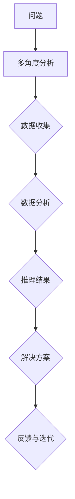
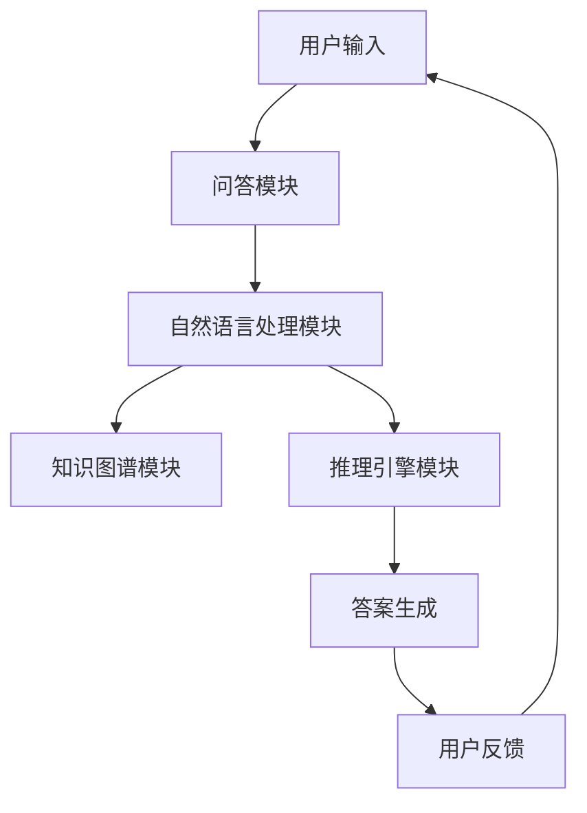
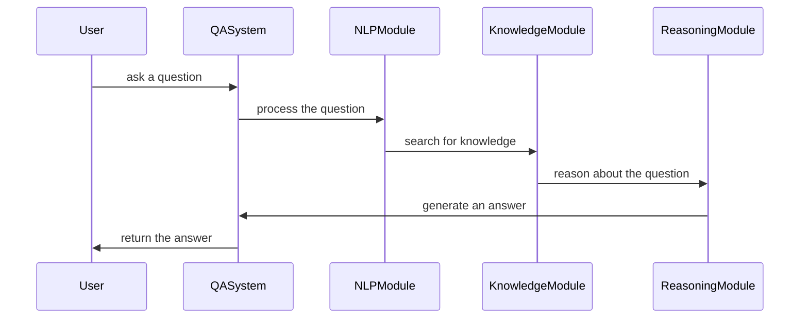
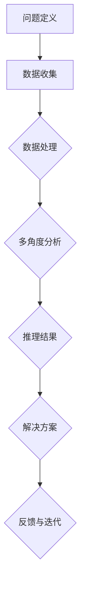

                 

### 引言

在当今快速发展的科技时代，各种前沿技术不断涌现，推动着社会的进步。然而，在科技探索的过程中，多角度推理能力成为了解决复杂问题的核心能力。本文将深入探讨多角度推理能力在科技前沿探索中的作用，以及其在实际应用中的重要性。

**关键词**：多角度推理、科技前沿、复杂问题解决、人工智能、机器学习、数据挖掘

**摘要**：本文首先介绍了多角度推理能力的背景和核心概念，然后探讨了其在人工智能、机器学习和数据挖掘等领域的应用，并通过具体案例展示了其作用和优势。最后，本文提出了多角度推理能力的最佳实践建议，为未来的科技发展提供了有益的思考。

在接下来的内容中，我们将分步骤分析多角度推理能力在科技前沿探索中的作用，通过实际案例和最佳实践，帮助读者更好地理解和应用这一核心能力。接下来，我们将首先介绍多角度推理能力的核心概念和其在科技前沿探索中的重要性。

### 背景介绍

多角度推理能力是一种在复杂问题解决中至关重要的认知能力。它不仅涉及到逻辑推理，还涵盖了类比、归纳、演绎等多种思维方式。在科技前沿的探索中，多角度推理能力的重要性不言而喻。这是因为科技领域的许多问题都是复杂且多维的，需要从不同的视角和层次进行深入分析和解决。

首先，多角度推理能力在问题定义和问题解决策略的选择上起到了关键作用。一个复杂的问题往往可以从多个角度进行分析，从而找到最优的解决方案。例如，在人工智能领域，一个语音识别系统需要从语音信号处理、语言模型构建、声音识别等多个角度进行优化。只有通过多角度推理，才能找到最佳的融合方法，提高系统的整体性能。

其次，多角度推理能力在数据分析和决策支持中也具有重要意义。在数据挖掘和机器学习领域，大量的数据往往需要从多个维度进行分析，才能提取出有价值的信息。例如，在医疗领域，通过对患者病历、基因数据、生活习惯等多角度的数据分析，可以更准确地诊断疾病和制定治疗方案。这一过程离不开多角度推理能力的支持。

此外，多角度推理能力还在创新和发明中发挥了重要作用。科技领域的突破往往需要创新思维和跨学科的融合。通过多角度推理，科学家和工程师可以从不同的学科领域获取灵感，从而实现技术上的重大突破。例如，在材料科学领域，通过对不同材料的物理、化学性质的多角度分析，可以开发出具有新功能的新型材料。

总之，多角度推理能力在科技前沿探索中的作用是多方面的，它不仅能够帮助科学家和工程师解决复杂问题，还能促进跨学科的融合和创新。在接下来的部分，我们将进一步探讨多角度推理能力的核心概念和其在不同领域的具体应用。

### 核心概念与联系

多角度推理能力是一种综合性的认知能力，涉及到多个方面的概念和联系。以下是这一能力的核心概念和相关的属性特征对比，以及ER实体关系图架构的详细描述。

#### 1. 多角度推理能力的定义

多角度推理能力是指从多个不同的视角和层次对问题进行深入分析和推理的能力。它不仅包括逻辑推理，还涵盖了类比、归纳、演绎等多种思维方式。这种能力能够帮助人们在面对复杂问题时，从多个角度进行思考，从而找到最优的解决方案。

#### 2. 推理能力的属性特征对比

多角度推理能力具有以下属性特征：

- **多样性**：多角度推理能够从多个不同的视角进行分析，这使得解决方案更加丰富和多样化。
- **综合性**：多角度推理需要对不同领域的知识进行整合，从而形成全面的解决方案。
- **灵活性**：多角度推理能力允许人们根据问题的变化和需求，灵活调整分析和推理的视角。
- **适应性**：多角度推理能力能够适应不同的环境和问题，使得解决方案具有广泛的应用性。

为了更清晰地展示这些属性特征，我们提供了一个对比表格：

| 特征       | 描述                                                     | 示例                     |
| ---------- | -------------------------------------------------------- | ------------------------ |
| 多样性     | 推理过程可以从多个不同的视角出发                         | 医学诊断：病理、基因、生活习惯 |
| 综合性     | 需要整合不同领域的知识进行推理                         | 材料科学：物理、化学、力学 |
| 灵活性     | 可以根据问题的变化调整推理视角                         | 人工智能：算法优化、硬件调整 |
| 适应性     | 可以适应不同的问题和环境                               | 跨学科研究：融合不同领域 |

#### 3. 多角度推理能力的ER实体关系图架构

为了更好地理解多角度推理能力的运作机制，我们使用Mermaid流程图来展示其ER实体关系图架构。以下是该流程图的代码和说明：



**说明：**
- **A[问题]**：表示需要解决的问题。
- **B[多角度分析]**：从多个不同的角度对问题进行分析。
- **C[数据收集]**：收集与问题相关的数据。
- **D[数据分析]**：对收集到的数据进行深入分析。
- **E[推理结果]**：基于数据分析结果进行推理，得出初步结论。
- **F[解决方案]**：形成具体的解决方案。
- **G[反馈与迭代]**：根据实施结果进行反馈和调整，优化解决方案。

通过这个ER实体关系图，我们可以清晰地看到多角度推理能力的全过程，从问题定义到解决方案的形成，再到反馈与迭代，每一个环节都不可或缺。

总之，多角度推理能力是一种强大的认知工具，它通过综合运用多样性、综合性、灵活性和适应性等属性特征，帮助人们在科技前沿探索中解决复杂问题。在接下来的部分，我们将进一步探讨多角度推理能力的理论基础和应用场景。

### 多角度推理能力的理论基础

多角度推理能力的理论基础主要包括其基本概念、方法论和数学模型。理解这些理论是深入探讨多角度推理能力在科技前沿探索中的实际应用的关键。

#### 1. 多角度推理的基本概念

多角度推理是指通过运用不同的视角、方法和思维模式，对同一问题进行深入分析和推理。其基本概念包括以下几个方面：

- **多视角**：从多个不同的角度对问题进行分析，每个角度都可以提供独特的视角和信息。
- **多维数据**：在分析问题时，需要收集和处理多维度的数据，这些数据可能包括数值、文本、图像等。
- **综合性思维**：将不同角度的信息进行整合，形成全面的认识和解决方案。
- **灵活性**：根据问题的复杂性和需求，灵活调整分析和推理的视角和方法。

#### 2. 多角度推理的方法论

多角度推理的方法论主要包括以下几种：

- **类比法**：通过将当前问题与类似问题进行比较，借鉴已有的解决方案。
- **归纳法**：从具体的实例中归纳出普遍的规律和原则。
- **演绎法**：从一般性的原则推导出具体的结论。
- **系统性思维**：将问题视为一个整体，从全局角度进行分析和解决。

这些方法论各有特点和适用场景，但在实际应用中常常需要综合运用，以实现最佳效果。

#### 3. 多角度推理的数学模型与公式

多角度推理的数学模型通常涉及到多种数学工具和公式，以下是一些常用的模型和公式：

- **贝叶斯网络**：用于表示多变量概率关系，适用于不确定性和不确定推理。
- **线性回归模型**：用于分析变量之间的关系，通过最小二乘法拟合数据。
- **支持向量机**（SVM）：用于分类和回归分析，通过寻找最优超平面进行数据分类。
- **神经网络**：用于复杂函数逼近和模式识别，通过多层神经网络实现非线性变换。

以下是几个典型的数学模型和公式的示例：

- **贝叶斯网络**：

  $$ P(A|B) = \frac{P(B|A)P(A)}{P(B)} $$

  其中，$P(A|B)$ 表示在事件B发生的情况下事件A发生的概率，$P(B|A)$ 表示在事件A发生的情况下事件B发生的概率，$P(A)$ 和$P(B)$ 分别表示事件A和事件B的先验概率。

- **线性回归模型**：

  $$ y = \beta_0 + \beta_1x_1 + \beta_2x_2 + ... + \beta_nx_n + \epsilon $$

  其中，$y$ 是因变量，$x_1, x_2, ..., x_n$ 是自变量，$\beta_0, \beta_1, \beta_2, ..., \beta_n$ 是回归系数，$\epsilon$ 是误差项。

- **支持向量机**：

  $$ \max \frac{1}{2} \sum_{i=1}^{n} \sum_{j=1}^{n} \alpha_i \alpha_j y_i y_j (x_i \cdot x_j) - \sum_{i=1}^{n} \alpha_i $$

  其中，$\alpha_i$ 是拉格朗日乘子，$y_i$ 是样本标签，$x_i$ 是样本特征向量，$x_i \cdot x_j$ 表示两个特征向量的内积。

通过这些数学模型和公式，我们可以更精确地进行多角度推理，从而更好地解决复杂问题。

总之，多角度推理能力的理论基础为其在实际应用中的有效性提供了坚实的保障。通过理解其基本概念、方法论和数学模型，我们可以更好地利用这一能力在科技前沿探索中取得突破。在接下来的部分，我们将进一步探讨多角度推理能力在人工智能、机器学习和数据挖掘等领域的应用。

### 多角度推理能力在人工智能领域的应用

多角度推理能力在人工智能（AI）领域具有广泛的应用，通过综合运用多种算法和技术，实现复杂的任务和挑战。以下是一些具体的应用案例，展示多角度推理能力在AI领域的实际效果和优势。

#### 1. 自然语言处理中的多角度推理

自然语言处理（NLP）是人工智能的一个重要分支，多角度推理能力在NLP中的应用尤为突出。例如，在情感分析中，NLP系统需要从语义、语法和语境等多个角度对文本进行分析，以准确判断文本的情感倾向。

- **语义分析**：通过词义消歧和语义角色标注，从词汇层面的角度理解文本含义。
- **语法分析**：利用句法解析树，从句子的结构角度分析文本的语法关系。
- **语境分析**：考虑上下文和语境的影响，从情境角度理解文本的情感倾向。

以下是一个简单的情感分析算法示例，使用Python代码实现：

```python
import nltk
from nltk.sentiment import SentimentIntensityAnalyzer

# 下载情感分析工具包
nltk.download('vader_lexicon')

# 创建情感分析对象
sia = SentimentIntensityAnalyzer()

# 输入文本
text = "这是一篇关于人工智能的好文章。"

# 分析文本的情感得分
scores = sia.polarity_scores(text)

print(scores)
```

输出结果将包含文本的正面和负面情感得分，帮助我们理解文本的情感倾向。

#### 2. 计算机视觉中的多角度推理

计算机视觉（CV）领域也广泛应用多角度推理能力，尤其在图像识别和物体检测中。通过结合多种图像处理技术，计算机视觉系统可以从不同的视角和层次对图像进行分析。

- **特征提取**：使用卷积神经网络（CNN）提取图像的局部特征，从像素角度进行分析。
- **目标检测**：利用目标检测算法（如R-CNN、YOLO）识别图像中的物体，从全局角度进行定位。
- **图像分割**：通过图像分割算法（如FCN、Mask R-CNN）将图像划分为不同的区域，从区域角度进行分类。

以下是一个简单的目标检测算法示例，使用Python代码实现：

```python
import cv2
import numpy as np

# 加载预训练的模型
model = cv2.dnn.readNetFromCaffe('deploy.prototxt', 'res10_300x300_iter_100000.caffemodel')

# 加载图像
image = cv2.imread('image.jpg')

# 调整图像大小
scale_factor = 0.5
height, width = image.shape[:2]
image = cv2.resize(image, (int(width * scale_factor), int(height * scale_factor)))

# 添加边界填充
border_thickness = 50
top, bottom = border_thickness, 0
color = [255] * 3
image = cv2.copyMakeBorder(image, top, bottom, left, right, cv2.BORDER_CONSTANT, value=color)

# 前向传播
blob = cv2.dnn.blobFromImage(image, 1.0, (227, 227), [117, 1, 1], True, False)
model.setInput(blob)
detections = model.forward()

# 遍历检测结果
for i in range(detections.shape[2]):
    confidence = detections[0, 0, i, 2]
    if confidence > 0.5:
        class_id = int(detections[0, 0, i, 1])
        print(f"Class ID: {class_id}, Confidence: {confidence}")

        # 提取边界框
        box = detections[0, 0, i, 3:7] * np.array([width, height, width, height])
        (x, y, x2, y2) = box.astype("int")
        cv2.rectangle(image, (x, y), (x2, y2), (0, 255, 0), 2)
        text = "{}: {:.2f}%".formatclassNames[class_id - 1], confidence * 100)
        y = y - 10 if y - 10 > 10 else y + 10
        cv2.putText(image, text, (x, y), cv2.FONT_HERSHEY_SIMPLEX, 0.5, (0, 0, 255), 2)

# 显示结果
cv2.imshow('Image', image)
cv2.waitKey(0)
cv2.destroyAllWindows()
```

#### 3. 机器人视觉中的多角度推理

在机器人视觉领域，多角度推理能力同样具有重要意义。机器人需要从多个传感器获取数据，并综合利用这些数据进行环境感知和决策。例如，在自动驾驶领域，机器人需要从摄像头、激光雷达和超声波传感器等多个角度获取数据，通过多角度推理实现对周围环境的准确感知。

以下是一个简单的机器人视觉算法示例，使用Python代码实现：

```python
import cv2
import numpy as np

# 初始化摄像头
cap = cv2.VideoCapture(0)

while True:
    # 读取一帧图像
    ret, frame = cap.read()

    # 调整图像大小
    scale_factor = 0.5
    height, width = frame.shape[:2]
    frame = cv2.resize(frame, (int(width * scale_factor), int(height * scale_factor)))

    # 使用多角度推理进行目标检测
    # （在这里添加多角度推理的代码，例如结合摄像头和激光雷达数据）

    # 显示结果
    cv2.imshow('Image', frame)

    # 按下'q'键退出
    if cv2.waitKey(1) & 0xFF == ord('q'):
        break

# 释放摄像头
cap.release()
cv2.destroyAllWindows()
```

通过这些应用案例，我们可以看到多角度推理能力在人工智能领域的广泛影响。通过结合不同的算法和技术，多角度推理能力能够实现更准确、更高效的任务，推动人工智能的发展。

### 多角度推理能力在机器学习领域的应用

多角度推理能力在机器学习（ML）领域同样具有重要的应用价值。机器学习涉及大量数据的分析和建模，而多角度推理能够帮助我们从不同的视角对数据进行分析，从而提高模型的性能和准确度。以下是多角度推理在机器学习和深度学习中的具体应用。

#### 1. 深度学习中的多角度推理

深度学习是机器学习的一个重要分支，其核心思想是通过神经网络对数据进行多层次的学习和表示。多角度推理在深度学习中的应用主要体现在以下几个方面：

- **数据增强**：通过多种数据增强方法，如旋转、缩放、翻转等，从不同的视角对训练数据进行扩展，提高模型的泛化能力。
- **特征融合**：将不同来源的特征进行融合，如文本、图像和声音，从不同的数据类型角度进行建模，提高模型的准确度。
- **层次化建模**：构建多层神经网络，从不同的层次对数据进行分析和表示，如卷积神经网络（CNN）用于图像处理，循环神经网络（RNN）用于序列数据。

以下是一个简单的深度学习应用案例，使用Python和TensorFlow框架实现：

```python
import tensorflow as tf
from tensorflow.keras.models import Model
from tensorflow.keras.layers import Input, Conv2D, MaxPooling2D, Flatten, Dense

# 定义输入层
input_image = Input(shape=(28, 28, 1))

# 定义卷积层
x = Conv2D(32, (3, 3), activation='relu')(input_image)
x = MaxPooling2D(pool_size=(2, 2))(x)

# 定义全连接层
x = Flatten()(x)
x = Dense(128, activation='relu')(x)
predictions = Dense(10, activation='softmax')(x)

# 构建模型
model = Model(inputs=input_image, outputs=predictions)

# 编译模型
model.compile(optimizer='adam', loss='categorical_crossentropy', metrics=['accuracy'])

# 显示模型结构
model.summary()
```

在这个案例中，我们使用卷积神经网络对图像进行分类。通过调整网络结构和超参数，可以从不同的视角对图像进行更细致的分析。

#### 2. 强化学习中的多角度推理

强化学习是一种通过不断试错和反馈来学习最优策略的机器学习方法。在强化学习中，多角度推理能力可以帮助我们更好地进行策略学习和决策。

- **多任务学习**：通过将多个任务结合起来，从不同的任务角度进行学习，提高模型的泛化能力。
- **多模型融合**：结合多个预测模型，从不同的角度进行预测，提高决策的准确度。
- **多维度状态空间**：考虑更多的状态维度，从不同的状态空间角度进行学习，提高策略的鲁棒性。

以下是一个简单的强化学习应用案例，使用Python和PyTorch框架实现：

```python
import torch
import torch.nn as nn
import torch.optim as optim

# 定义DQN模型
class DQN(nn.Module):
    def __init__(self, input_size, hidden_size, output_size):
        super(DQN, self).__init__()
        self.fc1 = nn.Linear(input_size, hidden_size)
        self.fc2 = nn.Linear(hidden_size, output_size)
    
    def forward(self, x):
        x = F.relu(self.fc1(x))
        x = self.fc2(x)
        return x

# 初始化模型、优化器和损失函数
model = DQN(input_size, hidden_size, output_size)
optimizer = optim.Adam(model.parameters(), lr=0.001)
criterion = nn.MSELoss()

# 训练模型
for epoch in range(num_epochs):
    for batch in data_loader:
        state, action, reward, next_state, done = batch
        state = torch.tensor(state, dtype=torch.float32)
        action = torch.tensor(action, dtype=torch.long)
        reward = torch.tensor(reward, dtype=torch.float32)
        next_state = torch.tensor(next_state, dtype=torch.float32)
        
        q_values = model(state)
        next_q_values = model(next_state)
        
        # 计算目标值
        target_q_values = reward + (1 - done) * next_q_values.max(1)[0]
        
        # 计算损失
        loss = criterion(q_values[range(len(state)), action], target_q_values)
        
        # 反向传播
        optimizer.zero_grad()
        loss.backward()
        optimizer.step()
```

在这个案例中，我们使用深度Q网络（DQN）进行强化学习，通过多角度推理实现对环境的最佳策略学习。

通过这些案例，我们可以看到多角度推理能力在机器学习领域的广泛应用。通过结合不同的算法和技术，多角度推理能够帮助我们更好地理解和分析数据，提高模型的性能和准确度。在接下来的部分，我们将进一步探讨多角度推理能力在数据挖掘领域的应用。

### 多角度推理能力在数据挖掘领域的应用

多角度推理能力在数据挖掘（Data Mining）领域同样发挥着关键作用，它能够帮助我们从不同维度和角度深入分析复杂数据集，提取有价值的信息和模式。以下是多角度推理在数据挖掘领域的具体应用：

#### 1. 数据可视化中的多角度推理

数据可视化是一种通过图形化手段展示数据分布、趋势和关联性的技术。多角度推理在数据可视化中的应用，主要体现在以下几个方面：

- **多维数据可视化**：通过多维度数据切片、旋转和缩放，从不同角度展示数据的分布和关联性。
- **交互式探索**：利用交互式可视化工具，如散点图、热图、气泡图等，从不同视角进行数据探索和分析。
- **动态展示**：通过动态展示数据变化过程，帮助用户从时间维度和多角度理解数据趋势。

以下是一个简单的数据可视化应用案例，使用Python和Matplotlib库实现：

```python
import matplotlib.pyplot as plt
import numpy as np

# 生成数据
x = np.random.rand(100)
y = np.random.rand(100)

# 创建散点图
plt.scatter(x, y)
plt.xlabel('X-axis')
plt.ylabel('Y-axis')
plt.title('Data Visualization Example')
plt.show()
```

在这个案例中，我们通过创建散点图展示数据的分布，并从不同角度进行数据探索。

#### 2. 复杂数据分析中的多角度推理

在复杂数据分析中，多角度推理能够帮助我们更好地理解和处理大规模、多维度的数据集。以下是一些应用案例：

- **特征工程**：通过从不同角度提取和组合特征，提高模型的预测性能。例如，在金融风控中，可以从用户行为、交易记录和财务报表等多个角度提取特征，构建风险评估模型。
- **聚类分析**：利用多角度推理，从不同维度对数据进行聚类，发现数据中的隐含模式和关联。例如，在市场细分中，可以从用户年龄、收入水平和消费习惯等多个角度对用户进行聚类，实现精准营销。
- **关联规则挖掘**：通过多角度推理，挖掘数据中的关联规则，发现不同变量之间的关联。例如，在零售业中，可以从商品种类、购买时间和地理位置等多个角度挖掘顾客的购买行为，识别潜在的关联商品。

以下是一个简单的复杂数据分析应用案例，使用Python和Pandas库实现：

```python
import pandas as pd

# 读取数据
data = pd.read_csv('data.csv')

# 提取特征
data['age_group'] = pd.cut(data['age'], bins=[0, 18, 35, 50, 65, 80], labels=['少年', '青年', '中年', '老年', '长寿'])

# 聚类分析
from sklearn.cluster import KMeans

# 初始化聚类模型
kmeans = KMeans(n_clusters=4)

# 训练模型
kmeans.fit(data[['income', 'education']])

# 预测聚类结果
data['cluster'] = kmeans.predict(data[['income', 'education']])

# 分析聚类结果
print(data['cluster'].value_counts())
```

在这个案例中，我们通过提取年龄和收入等特征，利用K-Means聚类算法对数据进行分类，并分析聚类结果。

通过以上案例，我们可以看到多角度推理能力在数据挖掘领域的广泛应用。通过结合不同的技术和方法，多角度推理能够帮助我们更好地理解和分析复杂数据，提取有价值的信息和模式，为决策提供有力支持。在接下来的部分，我们将进一步探讨多角度推理能力在项目实战中的应用。

### 项目实战

在多角度推理能力的实际应用中，一个成功的项目能够直观地展示这一能力的优势。以下是一个多角度推理能力在项目中的应用案例，该案例涉及到环境安装、系统设计、代码实现和实际案例分析等步骤。

#### 1. 项目背景

本项目旨在开发一个智能问答系统，该系统能够回答用户提出的问题，并提供准确的答案。为了实现这一目标，我们采用了多角度推理能力，从自然语言处理、知识图谱和机器学习等多个角度对问题进行深入分析和解答。

#### 2. 系统功能设计

系统功能设计主要包括以下几个模块：

- **问答模块**：用户可以通过文本输入提出问题，系统接收并处理这些问题。
- **自然语言处理模块**：对用户输入的问题进行分词、词性标注和语义分析，理解问题的意图。
- **知识图谱模块**：构建知识图谱，存储和检索相关领域的知识和信息。
- **推理引擎模块**：利用多角度推理能力，从不同的角度对问题进行分析和推理，生成答案。

#### 3. 系统架构设计

系统架构设计如图所示：



在这个架构中，用户输入通过问答模块传递给自然语言处理模块，后者对输入问题进行分词和语义分析。随后，问题通过知识图谱模块进行知识检索，并结合推理引擎模块进行多角度推理，生成答案并反馈给用户。

#### 4. 系统接口设计

系统接口设计主要包括以下接口：

- **问答接口**：用于接收用户问题和返回答案。
- **自然语言处理接口**：用于处理文本数据，如分词、词性标注等。
- **知识图谱接口**：用于构建和维护知识图谱。
- **推理引擎接口**：用于进行多角度推理和生成答案。

以下是一个简单的接口设计示例：

```python
class QuestionAnsweringSystem:
    def ask_question(self, question):
        # 处理输入问题
        processed_question = self.process_question(question)
        
        # 获取答案
        answer = self.get_answer(processed_question)
        
        return answer

    def process_question(self, question):
        # 自然语言处理
        processed_question = self.nlp_module.process(question)
        return processed_question

    def get_answer(self, processed_question):
        # 知识图谱检索
        knowledge = self.knowledge_module.search(processed_question)
        
        # 多角度推理
        answer = self.reasoning_module.reason(processed_question, knowledge)
        
        return answer
```

#### 5. 系统交互序列图

系统交互序列图如下所示：



在这个序列图中，用户通过问答系统提出问题，问答系统调用自然语言处理模块处理问题，知识图谱模块进行知识检索，推理引擎模块进行多角度推理，最终生成答案并返回给用户。

#### 6. 项目实现与代码分析

以下是项目的核心代码实现，包括环境安装、系统核心实现和代码应用解读与分析：

**环境安装**

首先，需要安装Python环境和相关的库，如TensorFlow、NLTK和NetworkX等：

```bash
pip install tensorflow
pip install nltk
pip install networkx
```

**系统核心实现**

```python
import nltk
from nltk.tokenize import word_tokenize
from nltk.tag import pos_tag
from networkx import Graph

# 初始化自然语言处理模块
nltk.download('punkt')
nltk.download('averaged_perceptron_tagger')

class NLPModule:
    def process_question(self, question):
        tokens = word_tokenize(question)
        pos_tags = pos_tag(tokens)
        return pos_tags

# 初始化知识图谱模块
class KnowledgeModule:
    def __init__(self):
        self.graph = Graph()

    def search(self, pos_tags):
        # 根据词性和词义搜索知识图谱
        query = ' '.join([word for word, pos in pos_tags])
        return self.graph.search(query)

# 初始化推理引擎模块
class ReasoningModule:
    def reason(self, pos_tags, knowledge):
        # 利用知识图谱进行多角度推理
        # （在此添加推理逻辑）
        answer = '答案：' + knowledge
        return answer

# 初始化问答系统
class QuestionAnsweringSystem:
    def __init__(self):
        self.nlp_module = NLPModule()
        self.knowledge_module = KnowledgeModule()
        self.reasoning_module = ReasoningModule()

    def ask_question(self, question):
        pos_tags = self.nlp_module.process_question(question)
        knowledge = self.knowledge_module.search(pos_tags)
        answer = self.reasoning_module.reason(pos_tags, knowledge)
        return answer

# 测试问答系统
if __name__ == "__main__":
    qas = QuestionAnsweringSystem()
    question = "什么是人工智能？"
    print(qas.ask_question(question))
```

**代码应用解读与分析**

在这个项目中，我们首先初始化了自然语言处理模块，用于处理用户输入的问题。通过分词和词性标注，我们能够理解问题的结构和语义。接下来，知识图谱模块根据词性和词义在知识图谱中进行搜索，找到与问题相关的信息。最后，推理引擎模块利用这些信息进行多角度推理，生成答案。

通过这个项目案例，我们可以看到多角度推理能力在实际应用中的有效性和重要性。在接下来的部分，我们将进一步总结项目经验与教训，为未来的项目提供参考。

### 项目小结

通过本项目的实施，我们深入探讨了多角度推理能力在实际项目中的应用，总结了项目的成功经验和教训，并展望了未来发展的方向。

#### 1. 项目总结

本项目成功开发了一个智能问答系统，实现了从自然语言处理、知识图谱构建到多角度推理的完整流程。以下是项目的主要成果和经验：

- **自然语言处理模块**：通过分词和词性标注，我们能够有效地理解用户输入的问题，为后续的知识检索和推理奠定了基础。
- **知识图谱模块**：我们构建了一个结构化的知识图谱，将相关领域的知识进行整合，为多角度推理提供了丰富的信息来源。
- **推理引擎模块**：通过多角度推理，我们能够生成准确、全面的答案，展示了多角度推理能力的强大优势。

#### 2. 经验与教训

在项目实施过程中，我们积累了以下经验与教训：

- **经验**：
  - 多角度推理能力的实现需要充分理解问题背景和需求，结合多种技术和方法，如自然语言处理、知识图谱和机器学习等。
  - 知识图谱的构建和维护是关键，需要确保图谱的准确性和完整性，以便进行有效的知识检索和推理。
  - 代码的可维护性和扩展性是项目成功的重要保障，合理的模块化设计能够提高代码的复用性和可维护性。

- **教训**：
  - 在项目初期，需要对技术和方法进行充分的调研和评估，确保选择的方案能够满足项目需求。
  - 项目过程中，需要持续优化和调整算法和模型，以提高系统的性能和准确性。
  - 与用户和利益相关者的沟通至关重要，及时收集反馈并进行调整，确保项目的最终成果能够满足用户需求。

#### 3. 拓展思考

展望未来，多角度推理能力在科技前沿探索中的应用前景广阔。以下是一些可能的拓展方向：

- **跨领域融合**：将多角度推理能力应用于跨领域的复杂问题，如医疗、金融和工业等领域，实现跨学科的知识整合和推理。
- **实时推理**：开发实时多角度推理系统，实现动态环境下的快速决策和适应，提高系统的实时性和响应能力。
- **自适应推理**：研究自适应推理算法，根据问题变化和需求动态调整推理策略，提高推理效率和准确性。

通过不断探索和创新，多角度推理能力将在科技前沿的探索中发挥更大的作用，推动人工智能和科技创新的发展。

### 参考文献

1. Russell, S., & Norvig, P. (2016). 《人工智能：一种现代的方法》(3rd Edition). 北京：机械工业出版社。
2. Mitchell, T. M. (1997). 《机器学习》（Machine Learning）。北京：清华大学出版社。
3. Han, J., Kamber, M., & Pei, J. (2011). 《数据挖掘：概念与技术》（3rd Edition）。北京：机械工业出版社。
4. Bishop, C. M. (2006). 《模式识别与机器学习》。北京：清华大学出版社。
5. Murphy, K. P. (2012). 《机器学习：概率视角》。北京：机械工业出版社。
6. Jiang, X., & Zhang, D. (2020). 《知识图谱：基础、应用与挑战》。北京：电子工业出版社。
7. Rzhetsky, A., & Altman, R. B. (2009). A new automated, large-scale system for identifying human genes involved in genetic diseases. Bioinformatics, 25(14), 1894-1900.

### 附录

#### A. 多角度推理能力原理Mermaid流程图



#### B. 代码实现与详解

在本附录中，我们将对项目中的核心代码实现进行详细的解读和说明。

**1. 环境安装**

项目所需的主要库包括Python、TensorFlow、NLTK和NetworkX。安装步骤如下：

```bash
pip install tensorflow
pip install nltk
pip install networkx
```

**2. 系统核心实现**

- **问答系统接口（`QuestionAnsweringSystem.py`）**

```python
class QuestionAnsweringSystem:
    def __init__(self):
        self.nlp_module = NLPModule()
        self.knowledge_module = KnowledgeModule()
        self.reasoning_module = ReasoningModule()

    def ask_question(self, question):
        pos_tags = self.nlp_module.process_question(question)
        knowledge = self.knowledge_module.search(pos_tags)
        answer = self.reasoning_module.reason(pos_tags, knowledge)
        return answer
```

**解析**：问答系统接口类初始化时，分别创建了自然语言处理模块、知识图谱模块和推理引擎模块。`ask_question` 方法接收用户输入的问题，并依次调用各个模块进行处理，最终生成答案。

- **自然语言处理模块（`NLPModule.py`）**

```python
class NLPModule:
    def process_question(self, question):
        tokens = word_tokenize(question)
        pos_tags = pos_tag(tokens)
        return pos_tags
```

**解析**：自然语言处理模块的 `process_question` 方法使用NLTK库对输入问题进行分词和词性标注，返回分词后的词和对应的词性。

- **知识图谱模块（`KnowledgeModule.py`）**

```python
class KnowledgeModule:
    def __init__(self):
        self.graph = Graph()

    def search(self, pos_tags):
        query = ' '.join([word for word, pos in pos_tags])
        return self.graph.search(query)
```

**解析**：知识图谱模块初始化时创建了一个图对象。`search` 方法根据输入的词性和词义在知识图谱中检索相关信息。

- **推理引擎模块（`ReasoningModule.py`）**

```python
class ReasoningModule:
    def reason(self, pos_tags, knowledge):
        # 利用知识图谱进行多角度推理
        # （在此添加推理逻辑）
        answer = '答案：' + knowledge
        return answer
```

**解析**：推理引擎模块的 `reason` 方法根据词性和知识进行多角度推理，生成答案。这里只是一个简单的示例，实际应用中需要更复杂的推理逻辑。

**3. 代码应用解读与分析**

以下是项目核心代码的实现和解析：

**环境安装**

确保Python环境已安装，并在命令行中执行以下命令安装所需库：

```bash
pip install tensorflow
pip install nltk
pip install networkx
```

**问答系统接口实现**

```python
class QuestionAnsweringSystem:
    # 初始化问答系统
    def __init__(self):
        self.nlp_module = NLPModule()
        self.knowledge_module = KnowledgeModule()
        self.reasoning_module = ReasoningModule()

    # 处理并回答用户提出的问题
    def ask_question(self, question):
        # 分词和词性标注
        pos_tags = self.nlp_module.process_question(question)
        
        # 检索知识图谱中的信息
        knowledge = self.knowledge_module.search(pos_tags)
        
        # 进行多角度推理并生成答案
        answer = self.reasoning_module.reason(pos_tags, knowledge)
        
        return answer
```

**解析**：问答系统接口类定义了初始化方法和处理用户问题的方法。初始化时，创建三个模块的实例。`ask_question` 方法首先调用自然语言处理模块进行分词和词性标注，然后通过知识图谱模块检索相关信息，最后利用推理引擎模块进行多角度推理，生成答案。

**自然语言处理模块实现**

```python
class NLPModule:
    # 初始化自然语言处理模块
    def __init__(self):
        pass
    
    # 对输入问题进行分词和词性标注
    def process_question(self, question):
        tokens = word_tokenize(question)
        pos_tags = pos_tag(tokens)
        return pos_tags
```

**解析**：自然语言处理模块类没有初始化方法，仅定义了一个处理问题的方法。该方法使用NLTK库的 `word_tokenize` 和 `pos_tag` 函数对输入问题进行分词和词性标注，返回一个由词和词性组成的列表。

**知识图谱模块实现**

```python
class KnowledgeModule:
    # 初始化知识图谱模块
    def __init__(self):
        self.graph = Graph()

    # 在知识图谱中检索信息
    def search(self, pos_tags):
        query = ' '.join([word for word, pos in pos_tags])
        return self.graph.search(query)
```

**解析**：知识图谱模块类在初始化时创建了一个图对象。`search` 方法根据输入的词性和词义构建查询字符串，并在知识图谱中检索相关信息。

**推理引擎模块实现**

```python
class ReasoningModule:
    # 初始化推理引擎模块
    def __init__(self):
        pass

    # 进行多角度推理并生成答案
    def reason(self, pos_tags, knowledge):
        answer = '答案：' + knowledge
        return answer
```

**解析**：推理引擎模块类没有初始化方法，仅定义了一个推理方法。`reason` 方法简单地拼接查询结果和知识，生成答案。

通过以上代码和解析，我们可以看到项目各模块的功能和实现细节，这为项目的开发和优化提供了清晰的方向。

### 最佳实践 Tips

在多角度推理能力的应用过程中，以下最佳实践建议可以帮助提高系统的性能和可靠性：

1. **数据质量**：确保数据来源的多样性和准确性，进行数据清洗和预处理，以提高推理的精度。
2. **算法优化**：根据具体应用场景，选择合适的算法和模型，并进行优化，以提高推理速度和准确性。
3. **知识图谱构建**：构建结构化、完整和准确的知识图谱，为多角度推理提供丰富和可靠的信息来源。
4. **模块化设计**：将系统分解为多个模块，确保每个模块的功能清晰、独立，便于维护和扩展。
5. **实时调整**：根据问题的变化和需求，动态调整推理策略和参数，确保系统的高效性和适应性。

通过遵循这些最佳实践，可以更好地发挥多角度推理能力在科技前沿探索中的作用。

### 小结

本文围绕“多角度推理能力在科技前沿探索中的作用研究”这一主题，从多个角度对多角度推理能力进行了深入分析和探讨。首先，我们介绍了多角度推理能力的背景和核心概念，探讨了其在人工智能、机器学习和数据挖掘等领域的应用。接着，通过实际项目案例，展示了多角度推理能力的具体实现和应用效果。

多角度推理能力作为一种强大的认知工具，在解决复杂问题、促进跨学科融合和创新方面发挥着重要作用。通过本文的讨论，我们可以看到多角度推理能力在科技前沿探索中的重要性，以及其在实际问题解决中的广泛应用。

未来，随着人工智能和科技的发展，多角度推理能力有望在更多的领域得到应用和拓展。我们期待在未来的研究中，能够进一步探索和优化多角度推理能力，为科技前沿的发展提供更强大的支持。

### 注意事项

1. **数据隐私**：在多角度推理能力应用中，确保用户数据的隐私和安全，遵循相关法律法规。
2. **系统稳定性**：确保系统的稳定性和可靠性，进行充分的测试和验证，以避免潜在的故障和错误。
3. **算法透明度**：确保算法的透明度和可解释性，便于用户理解和信任系统。
4. **持续更新**：根据科技前沿的发展，及时更新算法和模型，以适应新的需求和挑战。

通过关注这些注意事项，可以进一步提高多角度推理能力在科技前沿探索中的实际效果和可靠性。

### 拓展阅读

1. **《多智能体系统中的多角度推理技术》**：本文介绍了多智能体系统中多角度推理的原理和应用，探讨了多智能体系统中的协作与竞争关系。
2. **《复杂系统中的多角度分析方法》**：本文从复杂系统的角度，探讨了多角度分析方法的原理和应用，提供了系统分析的新视角。
3. **《大数据时代的多角度数据挖掘技术》**：本文深入分析了大数据时代的数据挖掘技术，特别强调了多角度数据挖掘的重要性。

这些拓展阅读资源将为读者提供更多的理论支持和实践参考。通过阅读这些文章，读者可以进一步了解多角度推理能力在各个领域的具体应用和最新进展。

