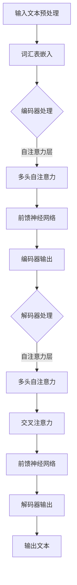
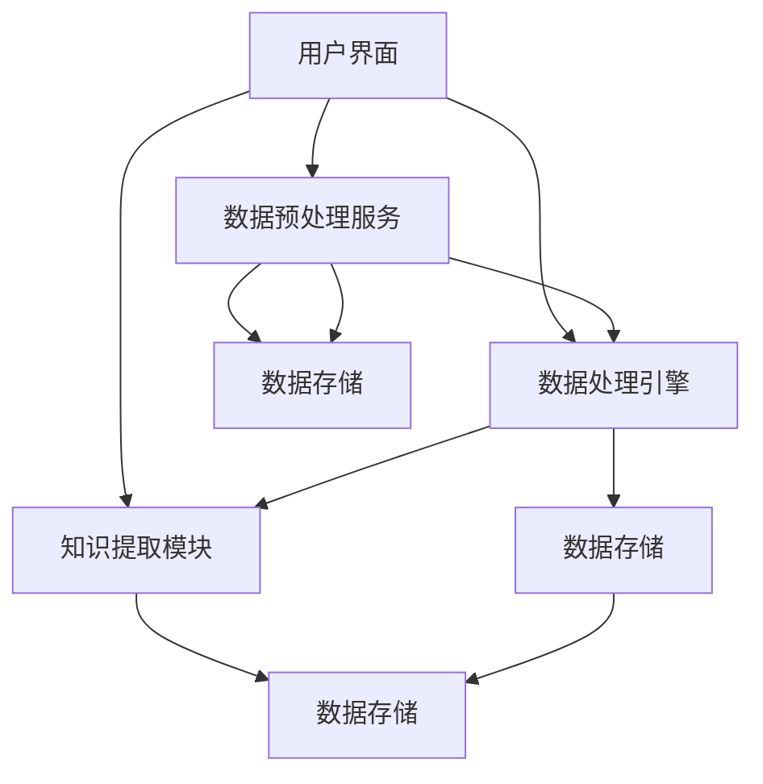
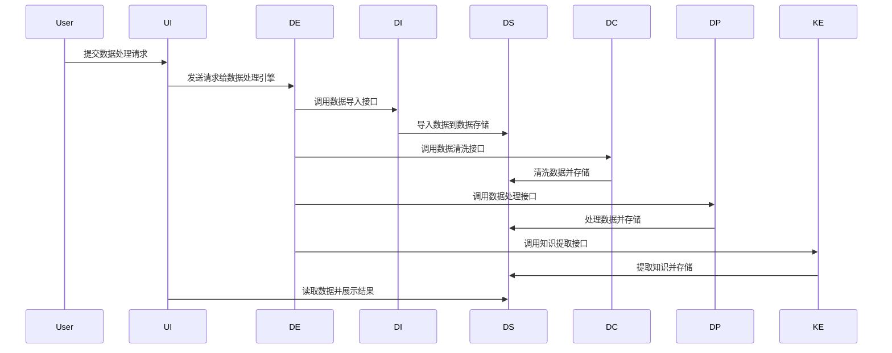

                 


## 引言

在当今科技飞速发展的时代，人工智能（AI）已经渗透到了我们生活的方方面面。作为AI领域的重要组成部分，语言模型在自然语言处理（NLP）中的应用尤为突出。特别是近年来，随着计算能力的提升和深度学习算法的进步，大型语言模型（如GPT-3、BERT等）在学术界和工业界都展现出了巨大的潜力和应用前景。本文将围绕大型语言模型在科学研究中的应用前景，进行深入探讨。

首先，我们将简要回顾语言模型在科学研究中的地位和重要性，以及大型语言模型的发展历程。接着，本文将详细描述大型语言模型在科学研究中的具体应用领域，并探讨其在这些领域中的挑战和局限性。随后，我们将分析如何利用大型语言模型提高科学研究的效率和质量，并通过实际案例来展示其在不同学科中的应用实例。最后，本文将总结大型语言模型的基本概念、核心要素组成，以及其在科学研究中的应用前景，并提出一些最佳实践 tips 和注意事项。

通过本文的探讨，我们希望能够为研究人员和开发者提供有价值的参考，激发他们在大型语言模型在科学研究中的创新应用。接下来，我们将一步步深入分析，揭示大型语言模型在科学研究中的无尽潜力。

## 1.1 问题背景

### 1.1.1 语言模型在科学研究中的地位和重要性

语言模型作为自然语言处理（NLP）的核心技术之一，已经在科学研究领域占据了重要地位。语言模型的主要功能是预测文本序列，从而理解和生成自然语言。这种能力使得语言模型在信息检索、机器翻译、文本分类、问答系统、对话系统等多个NLP任务中发挥了重要作用。

在科学研究领域，语言模型的应用同样广泛而深远。首先，语言模型可以帮助研究人员自动处理和分析大量文献，从文本数据中提取关键信息、识别研究趋势、归纳总结研究成果。例如，通过文本分类和情感分析，语言模型可以自动标记论文的类别和情感倾向，从而帮助研究人员快速筛选和评估相关文献。此外，语言模型还可以用于生成摘要和综述，为研究人员提供简明扼要的文献概览。

其次，语言模型在辅助写作方面也有着显著的应用。研究人员可以利用语言模型来撰写论文、报告和提案，提高写作效率和准确性。语言模型可以通过自动补全句子、纠正语法错误、提供同义词和成语替换等功能，减轻研究人员的写作负担，从而专注于研究内容的创新和深度。

此外，语言模型在科学计算和实验设计中也发挥着重要作用。例如，研究人员可以利用语言模型来生成实验方案、构建计算模型、设计算法和编写代码。通过自然语言与计算机程序的结合，语言模型可以显著提高科研工作的自动化程度和效率。

总的来说，语言模型在科学研究中的地位和重要性体现在以下几个方面：

1. **提高研究效率**：通过自动化处理文本数据，语言模型可以显著减少研究人员在文献检索、信息提取和写作方面的耗时。
2. **促进知识发现**：语言模型可以帮助研究人员从大量文献中快速发现研究趋势和未解决的问题，从而为研究方向提供新的启示。
3. **增强协作研究**：语言模型可以用于构建协作平台，促进研究人员之间的信息共享和交流，提高团队合作效率。
4. **推动技术创新**：语言模型的应用可以激发新的科研想法和解决方案，推动科学技术的进步和创新。

### 1.1.2 大型语言模型的发展历程

大型语言模型的发展历程可以追溯到20世纪80年代，当时研究人员开始尝试使用统计模型来处理自然语言。这些早期的模型，如n元语法（n-gram），通过统计文本中的单词序列来预测下一个单词。然而，这些模型存在一定的局限性，特别是在处理长文本和复杂语义关系时效果不佳。

随着深度学习的兴起，语言模型开始引入神经网络架构。2003年，Bengio等人的工作引入了递归神经网络（RNN），使得语言模型在处理长文本和复杂语义关系方面取得了显著进展。然而，RNN在处理长距离依赖问题时仍然存在困难。

为了解决这一问题，研究人员提出了长短时记忆网络（LSTM）和门控循环单元（GRU），这些模型通过引入门控机制，可以有效捕捉长距离依赖。然而，这些模型在处理大规模数据集时仍然面临计算资源和训练时间上的挑战。

近年来，随着计算能力的提升和深度学习算法的进步，大型语言模型如GPT-3、BERT等相继问世。这些模型基于变压器（Transformer）架构，通过并行计算和自注意力机制，使得语言模型的训练效率和效果都有了质的飞跃。GPT-3拥有超过1750亿个参数，是目前最强大的语言模型之一。BERT则通过预训练和微调，在多个NLP任务上取得了领先的性能。

大型语言模型的发展历程可以总结为以下几个关键阶段：

1. **统计模型阶段**：早期语言模型主要基于统计方法，如n元语法。
2. **神经网络模型阶段**：引入递归神经网络（RNN），包括LSTM和GRU。
3. **大型语言模型阶段**：基于变压器（Transformer）架构的GPT-3、BERT等大型语言模型的问世。

### 1.1.3 大型语言模型在科学研究中的应用现状

目前，大型语言模型在科学研究中的应用已经初具规模，并展示出了巨大的潜力。以下是一些大型语言模型在科学研究中的具体应用实例：

1. **文献检索与分析**：大型语言模型可以用于自动索引和分类科学文献，帮助研究人员快速找到相关研究，并进行文献综述。例如，GPT-3可以生成高质量的文献摘要和总结，提高研究人员的文献阅读效率。

2. **写作辅助**：大型语言模型可以辅助研究人员撰写论文、报告和提案。通过自动补全句子、纠正语法错误和提供写作建议，语言模型可以显著提高写作效率和准确性。

3. **实验设计与计算模型构建**：研究人员可以利用大型语言模型来生成实验方案、构建计算模型和编写代码。例如，通过自然语言描述，语言模型可以自动生成相关的计算算法和代码框架，从而加快科研工作进度。

4. **知识图谱构建**：大型语言模型可以用于构建知识图谱，将不同领域的研究成果进行整合和关联，从而提供更加全面和深入的研究支持。

5. **问答系统与对话平台**：大型语言模型可以构建问答系统和对话平台，为研究人员提供即时的知识查询和咨询服务，促进科研交流与合作。

尽管大型语言模型在科学研究中的应用已经取得了一些进展，但仍面临一些挑战和局限性。例如，模型训练和推理需要大量的计算资源和时间，数据隐私和安全问题也需要得到妥善解决。此外，模型在某些特定领域的表现可能还不够理想，需要进一步的研究和优化。

总的来说，大型语言模型在科学研究中的应用现状是积极的，但同时也需要我们持续关注和解决其中的挑战，以充分发挥其潜力。

### 1.2 问题描述

#### 1.2.1 大型语言模型在科学研究中的具体应用领域

大型语言模型在科学研究中的具体应用领域非常广泛，涵盖了从基础研究到应用研究的多个方面。以下是一些主要的应用领域：

1. **生物信息学**：在生物信息学领域，大型语言模型可以用于基因组序列分析、蛋白质结构预测、药物发现等任务。例如，GPT-3可以生成基于基因组序列的蛋白质结构预测，为药物设计提供重要参考。

2. **化学与材料科学**：大型语言模型在化学和材料科学中的应用主要包括化学反应预测、材料性能评估、新材料设计等。通过分析大量的化学文献和实验数据，语言模型可以预测新的化学反应路径和材料特性。

3. **环境科学**：在环境科学领域，大型语言模型可以用于环境监测、污染预测、生态系统评估等任务。例如，通过分析气象数据和生态环境文献，语言模型可以预测污染趋势和提出应对策略。

4. **物理学**：在物理学领域，大型语言模型可以用于复杂系统的模拟、物理学理论的生成和验证等任务。例如，语言模型可以生成新的物理学理论，并通过实验数据验证其正确性。

5. **计算机科学**：在计算机科学领域，大型语言模型可以用于代码生成、算法优化、编程辅助等任务。通过理解大量的代码库和算法文档，语言模型可以自动生成高效、可靠的代码和算法。

6. **社会科学**：在社会科学领域，大型语言模型可以用于社会调查、舆情分析、社会网络分析等任务。例如，通过分析社交媒体数据和文献，语言模型可以预测社会趋势和评估政策效果。

7. **心理学与神经科学**：在心理学和神经科学领域，大型语言模型可以用于情感分析、认知建模、语言处理等领域。通过分析大量心理学实验数据和文献，语言模型可以揭示人类思维和行为的规律。

8. **经济学**：在经济学领域，大型语言模型可以用于金融市场预测、经济趋势分析、消费者行为研究等任务。通过分析大量的经济数据和文献，语言模型可以预测市场走势和评估经济政策。

#### 1.2.2 大型语言模型在科学研究中的挑战和局限性

尽管大型语言模型在科学研究中的应用前景广阔，但它们也面临着一系列挑战和局限性，需要研究人员和开发者共同努力解决：

1. **计算资源需求**：大型语言模型的训练和推理需要大量的计算资源和时间。例如，GPT-3的训练需要数千台GPU服务器和数个月的时间。这对于许多研究机构和开发者来说是一个巨大的负担。

2. **数据隐私和安全**：大型语言模型的训练和推理需要使用大量的数据，这些数据可能包含敏感信息。如何在保证数据隐私和安全的前提下使用这些数据，是一个需要解决的挑战。

3. **模型解释性**：大型语言模型通常被视为“黑箱”，其内部机制和决策过程不够透明，难以解释。这对于需要严格验证和解释的研究来说，是一个显著的局限性。

4. **领域适应性**：尽管大型语言模型在多个领域都取得了显著进展，但它们在某些特定领域的表现可能还不够理想。例如，在特定科学领域的术语、专有名词和概念理解上，语言模型可能存在不足。

5. **数据质量和标注**：大型语言模型的训练依赖于大量的标注数据。数据质量和标注的准确性对模型性能有重要影响。然而，获取高质量标注数据是一个复杂且耗时的工作。

6. **模型泛化能力**：大型语言模型在特定领域的表现可能较好，但在其他领域可能表现不佳。如何提升模型的泛化能力，使其在不同领域都能表现出色，是一个重要的研究课题。

7. **算法伦理**：随着大型语言模型在科学研究中的广泛应用，如何确保算法的公平性、公正性和道德性，避免算法偏见和歧视，也是一个需要关注的问题。

总的来说，大型语言模型在科学研究中的应用虽然前景广阔，但也面临着一系列挑战和局限性。通过持续的研究和优化，我们有望克服这些困难，充分发挥大型语言模型在科学研究中的潜力。

### 1.3 问题解决

#### 1.3.1 如何利用大型语言模型提高科学研究的效率和质量

为了利用大型语言模型提高科学研究的效率和质量，研究人员可以从以下几个方面入手：

1. **自动化文献检索与分析**：大型语言模型可以通过自然语言处理技术，对大量科学文献进行自动化检索和分析。研究人员可以利用语言模型生成文献摘要、分类和关键词提取，从而快速了解相关研究的核心内容，减少文献筛选时间。

2. **写作辅助与优化**：大型语言模型可以帮助研究人员撰写论文、报告和提案。通过自动补全句子、纠正语法错误、提供写作建议和生成文本，语言模型可以提高写作效率和准确性，减轻研究人员的写作负担。

3. **实验设计与计算模型构建**：研究人员可以利用大型语言模型生成实验方案、构建计算模型和编写代码。例如，通过自然语言描述，语言模型可以自动生成相关的实验步骤、计算算法和代码框架，从而加快科研工作进度。

4. **知识图谱构建与关联分析**：大型语言模型可以用于构建知识图谱，将不同领域的研究成果进行整合和关联。通过分析知识图谱，研究人员可以更全面地了解研究领域中的关键概念、研究趋势和未解决的问题，从而为研究方向提供新的启示。

5. **自动化数据分析与可视化**：大型语言模型可以用于自动化数据分析，包括数据清洗、特征提取和结果可视化。研究人员可以利用语言模型自动处理和分析实验数据，生成可视化报告，从而更直观地展示研究进展和结果。

#### 1.3.2 大型语言模型在不同学科中的应用实例

以下是大型语言模型在不同学科中的具体应用实例：

1. **生物信息学**：在生物信息学领域，大型语言模型可以用于基因组序列分析、蛋白质结构预测和药物设计。例如，GPT-3可以生成基于基因组序列的蛋白质结构预测，为药物设计提供重要参考。研究人员还可以利用语言模型生成基于基因组数据的生物标记物，用于疾病诊断和预测。

2. **化学与材料科学**：在化学和材料科学领域，大型语言模型可以用于化学反应预测、材料性能评估和新材料设计。通过分析大量的化学文献和实验数据，语言模型可以预测新的化学反应路径和材料特性。例如，研究人员可以利用GPT-3生成新的材料合成方法，并通过实验验证其可行性。

3. **环境科学**：在环境科学领域，大型语言模型可以用于环境监测、污染预测和生态系统评估。通过分析气象数据和生态环境文献，语言模型可以预测污染趋势和提出应对策略。例如，研究人员可以利用GPT-3预测空气污染物的分布和浓度，从而制定更有效的污染控制措施。

4. **物理学**：在物理学领域，大型语言模型可以用于复杂系统的模拟、物理学理论的生成和验证。通过分析大量的物理实验数据和文献，语言模型可以生成新的物理学理论，并通过实验数据验证其正确性。例如，研究人员可以利用GPT-3生成新的量子物理模型，并验证其在实验中的适用性。

5. **计算机科学**：在计算机科学领域，大型语言模型可以用于代码生成、算法优化和编程辅助。通过理解大量的代码库和算法文档，语言模型可以自动生成高效、可靠的代码和算法。例如，研究人员可以利用GPT-3生成基于深度学习的计算机视觉算法，并优化其性能。

6. **社会科学**：在社会科学领域，大型语言模型可以用于社会调查、舆情分析和社会网络分析。通过分析社交媒体数据和文献，语言模型可以预测社会趋势和评估政策效果。例如，研究人员可以利用GPT-3分析社交媒体上的公共意见，预测选举结果和公共政策的趋势。

7. **心理学与神经科学**：在心理学和神经科学领域，大型语言模型可以用于情感分析、认知建模和语言处理。通过分析大量心理学实验数据和文献，语言模型可以揭示人类思维和行为的规律。例如，研究人员可以利用GPT-3分析情绪表达，预测个体情感状态和心理健康。

8. **经济学**：在经济学领域，大型语言模型可以用于金融市场预测、经济趋势分析和消费者行为研究。通过分析大量的经济数据和文献，语言模型可以预测市场走势和评估经济政策。例如，研究人员可以利用GPT-3预测股票市场波动，评估货币政策的效应。

总的来说，大型语言模型在科学研究中的实际应用已经取得了一些显著成果，通过不断优化和探索，我们有望进一步发挥其在提高科学研究效率和质量方面的潜力。

### 1.4 边界与外延

#### 1.4.1 大型语言模型的适用范围

大型语言模型在科学研究中的应用范围非常广泛，几乎涵盖了自然科学、社会科学和工程技术等各个领域。以下是一些具体的适用范围：

1. **生物信息学**：大型语言模型可以用于基因组序列分析、蛋白质结构预测、药物设计等领域。例如，通过分析大量基因组数据，语言模型可以预测疾病风险和药物反应。

2. **化学与材料科学**：在化学和材料科学领域，大型语言模型可以用于化学反应预测、材料性能评估和新材料设计。例如，通过分析化学反应的文献和实验数据，语言模型可以预测新的合成路径和材料特性。

3. **环境科学**：大型语言模型可以用于环境监测、污染预测和生态系统评估。通过分析气象数据和生态环境文献，语言模型可以预测污染趋势和提出应对策略。

4. **物理学**：在物理学领域，大型语言模型可以用于复杂系统的模拟、物理学理论的生成和验证。例如，通过分析实验数据，语言模型可以生成新的物理学理论，并验证其在实验中的适用性。

5. **计算机科学**：在计算机科学领域，大型语言模型可以用于代码生成、算法优化和编程辅助。例如，通过分析大量代码库和算法文档，语言模型可以自动生成高效、可靠的代码和算法。

6. **社会科学**：在社会科学领域，大型语言模型可以用于社会调查、舆情分析和社会网络分析。例如，通过分析社交媒体数据和文献，语言模型可以预测社会趋势和评估政策效果。

7. **心理学与神经科学**：在心理学和神经科学领域，大型语言模型可以用于情感分析、认知建模和语言处理。例如，通过分析心理学实验数据和文献，语言模型可以揭示人类思维和行为的规律。

8. **经济学**：在经济学领域，大型语言模型可以用于金融市场预测、经济趋势分析和消费者行为研究。例如，通过分析经济数据和文献，语言模型可以预测市场走势和评估经济政策。

#### 1.4.2 大型语言模型的局限性

尽管大型语言模型在科学研究中的应用前景广阔，但它们也存在一些局限性，这些局限性可能影响其在某些领域的实际应用效果：

1. **计算资源需求**：大型语言模型的训练和推理需要大量的计算资源和时间，这对研究机构和开发者来说是一个巨大的负担。特别是在资源有限的实验室或企业环境中，计算资源的不足可能限制模型的应用。

2. **数据隐私和安全**：大型语言模型的训练和推理需要使用大量的数据，这些数据可能包含敏感信息。如何在保证数据隐私和安全的前提下使用这些数据，是一个需要解决的挑战。

3. **模型解释性**：大型语言模型通常被视为“黑箱”，其内部机制和决策过程不够透明，难以解释。这对于需要严格验证和解释的研究来说，是一个显著的局限性。

4. **领域适应性**：尽管大型语言模型在多个领域都取得了显著进展，但它们在某些特定领域的表现可能还不够理想。例如，在特定科学领域的术语、专有名词和概念理解上，语言模型可能存在不足。

5. **数据质量和标注**：大型语言模型的训练依赖于大量的标注数据。数据质量和标注的准确性对模型性能有重要影响。然而，获取高质量标注数据是一个复杂且耗时的工作。

6. **模型泛化能力**：大型语言模型在特定领域的表现可能较好，但在其他领域可能表现不佳。如何提升模型的泛化能力，使其在不同领域都能表现出色，是一个重要的研究课题。

7. **算法伦理**：随着大型语言模型在科学研究中的广泛应用，如何确保算法的公平性、公正性和道德性，避免算法偏见和歧视，也是一个需要关注的问题。

总的来说，大型语言模型在科学研究中的应用具有很大的潜力，但也需要克服一系列局限性和挑战，以充分发挥其在科学研究中的作用。

### 1.5 概念结构与核心要素组成

#### 1.5.1 大型语言模型的基本概念

大型语言模型是一种基于深度学习技术构建的复杂算法，旨在理解和生成自然语言。其基本概念主要包括以下几个方面：

1. **自然语言处理（NLP）**：NLP是计算机科学和人工智能的一个分支，旨在使计算机能够理解、解释和生成自然语言。大型语言模型是NLP技术的核心组成部分。

2. **深度学习**：深度学习是一种机器学习技术，通过多层神经网络对大量数据进行训练，从而实现复杂模式的识别和预测。大型语言模型通常采用深度学习架构，如变换器（Transformer）和递归神经网络（RNN）。

3. **自注意力机制**：自注意力机制是一种在深度学习模型中用于处理序列数据的机制。它允许模型在不同的位置之间建立关联，从而更好地捕捉长距离依赖关系。

4. **预训练与微调**：预训练是指在大规模数据集上训练模型，使其掌握通用语言知识。微调则是在特定任务上对模型进行微调，以适应具体的应用场景。

#### 1.5.2 大型语言模型的核心要素组成

大型语言模型的核心要素组成包括以下几个方面：

1. **模型架构**：大型语言模型通常采用变换器（Transformer）架构，该架构由多个变换器层组成，每层包含多头自注意力机制和前馈神经网络。

2. **参数规模**：大型语言模型的参数规模非常庞大，通常包含数十亿到数千亿个参数。这些参数通过大规模数据集进行训练，以捕捉语言的特征和规律。

3. **预训练数据**：预训练数据是大型语言模型的基础。通常，这些数据来自互联网上的大量文本，如网页、新闻、书籍、文章等。

4. **词汇表**：词汇表是语言模型的重要组成部分，用于表示文本中的单词和符号。大型语言模型通常使用词嵌入技术，将单词映射到高维空间，以便进行更有效的计算和处理。

5. **训练算法**：训练算法是构建大型语言模型的关键。常用的训练算法包括随机梯度下降（SGD）和其变种，如Adam优化器。

6. **解码器**：解码器是语言模型的一部分，用于生成文本序列。它通常采用自回归解码策略，逐步生成每个单词或字符。

#### 1.5.3 大型语言模型的工作原理

大型语言模型的工作原理可以分为以下几个步骤：

1. **输入编码**：将输入文本转换为模型可以理解的向量表示。这一步骤通常使用词嵌入技术，将每个单词映射到高维空间。

2. **自注意力计算**：通过自注意力机制计算输入文本中不同位置之间的关联。这一步骤有助于模型捕捉长距离依赖关系。

3. **前馈神经网络**：将自注意力机制的结果通过前馈神经网络进行进一步处理，以增强模型的表示能力。

4. **输出解码**：根据模型的预测，逐步生成输出文本序列。解码过程通常采用自回归策略，确保生成的文本序列符合语言规则。

通过以上步骤，大型语言模型可以理解和生成自然语言，从而实现各种NLP任务，如文本分类、机器翻译、文本生成等。

### 第二部分：核心概念与联系

#### 2.1 大型语言模型原理

大型语言模型的核心原理是基于深度学习的变换器（Transformer）架构，这一架构通过自注意力机制和多头注意力等创新技术，实现了对自然语言的强大理解和生成能力。以下将详细解释大型语言模型的数学模型、训练过程和应用场景。

##### 2.1.1 大型语言模型的数学模型

大型语言模型主要基于变换器（Transformer）架构，该架构的核心组成部分包括编码器（Encoder）和解码器（Decoder）。以下是其主要数学模型：

1. **编码器（Encoder）**：
   - **自注意力（Self-Attention）**：每个编码器层包含一个自注意力机制，通过计算输入序列中各个单词之间的关联性，生成表示这些关联性的权重。自注意力机制的核心是计算Q（查询）、K（键）和V（值）矩阵，并通过点积操作得到权重。公式如下：
     $$ \text{Attention}(Q, K, V) = \text{softmax}\left(\frac{QK^T}{\sqrt{d_k}}\right)V $$
     其中，\( Q, K, V \) 是编码器的输入向量，\( d_k \) 是键向量的维度。
   - **多头注意力（Multi-Head Attention）**：为了捕捉不同位置之间的复杂关系，编码器通常使用多头注意力机制。多头注意力通过将输入序列扩展为多个子序列，并分别应用自注意力机制，最终合并结果。每个头输出维度为 \( d_v \)，总输出维度为 \( n \times d_v \)。

2. **解码器（Decoder）**：
   - **自注意力（Self-Attention）**：与编码器类似，解码器层也包含自注意力机制，用于处理输入序列。
   - **交叉注意力（Cross-Attention）**：解码器通过交叉注意力机制与编码器的输出序列进行交互，以生成与上下文相关的输出。交叉注意力机制的核心是计算 \( Q, K, V \) 矩阵，并通过点积操作得到权重。公式如下：
     $$ \text{Attention}(Q, K, V) = \text{softmax}\left(\frac{QK^T}{\sqrt{d_k}}\right)V $$
   - **多头注意力（Multi-Head Attention）**：与编码器一样，解码器也使用多头注意力机制，以提高模型的表达能力。

##### 2.1.2 大型语言模型的训练过程

大型语言模型的训练过程通常分为两个阶段：预训练和微调。

1. **预训练**：
   - **数据集选择**：预训练使用大规模文本数据集，如维基百科、新闻、书籍等，以使模型掌握通用语言知识。
   - **训练目标**：预训练的目标是学习文本的表示，使模型能够捕捉语言中的复杂模式和规律。常用的训练目标包括语言建模（预测下一个单词）和掩码语言模型（Masked Language Model，MLM）。
   - **训练策略**：预训练过程中，模型通过反向传播和优化算法（如Adam）进行训练，以最小化训练损失。

2. **微调**：
   - **任务定义**：微调是指将预训练模型应用于特定任务，并进行进一步训练，以优化模型在特定任务上的性能。
   - **数据集选择**：微调通常使用特定领域的数据集，如学术论文、专业书籍等，以提高模型在特定任务上的表现。
   - **训练策略**：微调过程中，模型会通过微调策略（如权重共享、渐进微调等）进行调整，以适应特定任务。

##### 2.1.3 大型语言模型的应用场景

大型语言模型在多个应用场景中展现出了强大的能力，以下是一些主要的应用场景：

1. **文本分类**：文本分类是将文本数据分类到预定义的类别中。大型语言模型可以通过预训练和微调，在多个文本分类任务上取得优异成绩。

2. **机器翻译**：机器翻译是将一种语言文本转换为另一种语言文本。大型语言模型通过预训练和双向编码器（如BERT）结构，实现了高精度的机器翻译。

3. **文本生成**：文本生成是指根据输入的文本生成新的文本。大型语言模型通过自回归解码策略，可以生成连贯且具有创造性的文本。

4. **问答系统**：问答系统是指通过自然语言交互，回答用户的问题。大型语言模型通过预训练和细粒度调整，可以构建高效的问答系统。

5. **对话系统**：对话系统是指模拟人类对话的计算机程序。大型语言模型通过预训练和对话管理策略，可以构建自然流畅的对话系统。

总的来说，大型语言模型在科学研究中的应用前景广阔，通过深入理解其数学模型和训练过程，我们可以更好地发挥其在各领域的潜力。

### 2.2 大型语言模型属性特征对比

在大型语言模型领域，存在多种类型的模型，如GPT-3、BERT、T5等。这些模型各自具有独特的属性和特征，适用于不同的应用场景。以下是对这些模型的详细对比，包括其优势与劣势。

#### 2.2.1 GPT-3

**优势：**
- **强大的文本生成能力**：GPT-3具有超过1750亿个参数，能够生成高质量的文本，适用于自动化写作、对话系统和文本生成等任务。
- **预训练数据量大**：GPT-3使用大量互联网文本进行预训练，能够捕捉复杂的语言模式和趋势。
- **灵活性**：GPT-3具有很高的灵活性，可以应用于多种不同的语言任务，如文本分类、机器翻译、问答系统等。

**劣势：**
- **计算资源需求高**：GPT-3的参数规模巨大，训练和推理需要大量的计算资源，对硬件设备要求较高。
- **解释性不足**：GPT-3被视为“黑箱”，其决策过程不够透明，难以进行解释和验证。

#### 2.2.2 BERT

**优势：**
- **双向编码器结构**：BERT采用双向编码器结构，能够同时考虑文本序列的前后关系，提高文本理解能力。
- **预训练和微调结合**：BERT通过预训练和微调，在多个NLP任务上取得了优异的性能，如文本分类、命名实体识别、问答系统等。
- **解释性较强**：BERT的结构相对透明，其注意力机制和词嵌入技术使得模型具有一定的解释性。

**劣势：**
- **文本生成能力较弱**：BERT主要专注于文本理解和分类任务，其文本生成能力相对较弱。
- **训练时间较长**：BERT的预训练过程需要大量的时间和计算资源，对于快速迭代的应用场景可能不太适用。

#### 2.2.3 T5

**优势：**
- **统一的任务框架**：T5将所有NLP任务都视为“编码器-解码器”框架，通过统一的方法处理多种任务，提高了模型的通用性。
- **高效的推理能力**：T5通过端到端训练，实现了高效的推理能力，适用于实时问答和对话系统等任务。
- **参数规模适中**：T5的参数规模介于GPT-3和BERT之间，训练和推理的资源需求适中，适用于资源有限的环境。

**劣势：**
- **文本生成能力有限**：与GPT-3相比，T5在文本生成任务上的表现有限。
- **解释性较弱**：T5的结构相对复杂，其内部机制和决策过程不够透明，解释性相对较弱。

总的来说，GPT-3、BERT和T5各自具有独特的优势和应用场景。GPT-3在文本生成和多样性方面表现优异，适用于大规模文本生成和对话系统；BERT在文本理解和分类任务上具有强大的能力，适用于需要深入理解文本内容的任务；T5则通过统一的任务框架和高效的推理能力，适用于多种NLP任务，具有较好的通用性。根据具体的应用需求，选择合适的模型可以更好地发挥其潜力。

### 2.3 大型语言模型ER实体关系图架构

为了更好地理解大型语言模型的内部结构和功能，我们可以借助ER（实体-关系）图来表示其核心组件和关系。以下是一个简化版的大型语言模型ER实体关系图，用于说明模型的主要组成部分及其相互关系。

#### 实体

1. **编码器（Encoder）**
   - **自注意力层（Self-Attention Layer）**：包含多头自注意力机制，用于捕捉输入序列中的长距离依赖。
   - **前馈神经网络（Feed Forward Neural Network）**：在每个自注意力层之后，通过前馈神经网络进行进一步处理，增强模型的表示能力。

2. **解码器（Decoder）**
   - **自注意力层（Self-Attention Layer）**：用于处理输入序列，捕捉序列内部的关联。
   - **交叉注意力层（Cross-Attention Layer）**：与编码器输出进行交互，捕捉编码器的上下文信息。
   - **前馈神经网络（Feed Forward Neural Network）**：在每个注意力层之后，通过前馈神经网络进行进一步处理。

3. **词汇表（Vocabulary）**：包含所有单词和符号的映射，用于将文本转换为模型可以处理的向量表示。

4. **优化器（Optimizer）**：用于调整模型参数，以最小化损失函数，提高模型性能。

#### 关系

1. **输入-编码器（Input-Encoder）**：输入文本通过编码器进行预处理和编码，生成编码器的输入序列。

2. **编码器-解码器（Encoder-Decoder）**：编码器输出序列通过交叉注意力层与解码器输入序列进行交互，生成解码器的输入序列。

3. **解码器-输出（Decoder-Output）**：解码器输出序列通过输出层生成最终预测的文本序列。

4. **参数调整（Parameter Adjustment）**：优化器根据模型损失函数调整模型参数，以优化模型性能。

以下是一个简化版的大型语言模型ER实体关系图的Mermaid表示：

```mermaid
erDiagram
  Input ||--o> Encoder
  Encoder ||--o> Decoder
  Decoder ||--o> Output
  Vocabulary ||--o> Encoder
  Vocabulary ||--o> Decoder
  Optimizer ||--|> Encoder
  Optimizer ||--|> Decoder
```

通过ER实体关系图，我们可以清晰地看到大型语言模型的主要组成部分及其相互关系，有助于更好地理解模型的内部工作机制和设计理念。

### 3.1 算法原理讲解

为了更好地理解大型语言模型的算法原理，我们可以通过Mermaid流程图来展示其基本流程，并通过Python源代码示例进行详细讲解。

#### 算法Mermaid流程图

以下是一个大型语言模型的基本流程Mermaid流程图：



#### Python源代码示例

下面是一个简单的Python代码示例，用于演示大型语言模型的基本流程。这个示例使用PyTorch框架进行实现：

```python
import torch
import torch.nn as nn
import torch.optim as optim

# 词汇表嵌入
vocab_size = 10000
embedding_dim = 512
vocab_embeddings = nn.Embedding(vocab_size, embedding_dim)

# 编码器
class Encoder(nn.Module):
    def __init__(self, vocab_size, embedding_dim, hidden_dim):
        super(Encoder, self).__init__()
        self.embedding = nn.Embedding(vocab_size, embedding_dim)
        self.hidden_dim = hidden_dim
        self.lstm = nn.LSTM(embedding_dim, hidden_dim, num_layers=2, batch_first=True)
        
    def forward(self, input_seq, hidden):
        embedded = self.embedding(input_seq)
        output, hidden = self.lstm(embedded, hidden)
        return output, hidden

# 解码器
class Decoder(nn.Module):
    def __init__(self, vocab_size, embedding_dim, hidden_dim):
        super(Decoder, self).__init__()
        self.embedding = nn.Embedding(vocab_size, embedding_dim)
        self.hidden_dim = hidden_dim
        self.lstm = nn.LSTM(embedding_dim + hidden_dim, hidden_dim, num_layers=2, batch_first=True)
        
    def forward(self, input_seq, hidden, encoder_output):
        embedded = self.embedding(input_seq)
        embedded = torch.cat((embedded, encoder_output), 2)
        output, hidden = self.lstm(embedded, hidden)
        return output, hidden

# 模型参数初始化
hidden_dim = 512
encoder = Encoder(vocab_size, embedding_dim, hidden_dim)
decoder = Decoder(vocab_size, embedding_dim, hidden_dim)

# 损失函数和优化器
criterion = nn.CrossEntropyLoss()
optimizer = optim.Adam(list(encoder.parameters()) + list(decoder.parameters()))

# 假设输入序列和目标序列
input_seq = torch.randint(0, vocab_size, (batch_size, sequence_length))
target_seq = torch.randint(0, vocab_size, (batch_size, sequence_length))

# 编码器处理
encoder_hidden = encoder.init_hidden(batch_size)
encoder_output, encoder_hidden = encoder(input_seq, encoder_hidden)

# 解码器处理
decoder_input = target_seq[:-1]
decoder_hidden = encoder_hidden
decoder_output, decoder_hidden = decoder(decoder_input, decoder_hidden, encoder_output)

# 计算损失
loss = criterion(decoder_output.view(-1, vocab_size), target_seq[1:].view(-1))

# 反向传播和优化
optimizer.zero_grad()
loss.backward()
optimizer.step()

print("Loss:", loss.item())
```

#### 算法原理详细讲解

1. **输入文本预处理**：
   首先，我们将输入文本进行预处理，包括分词、去停用词等操作，将文本转换为词序列。词序列中的每个词通过词汇表嵌入（Embedding）操作转换为向量表示。

2. **编码器处理**：
   编码器由嵌入层（Embedding Layer）和长短期记忆网络（LSTM）组成。嵌入层将词序列转换为嵌入向量，LSTM用于捕捉序列中的长距离依赖关系。编码器的输出是一个隐藏状态序列，表示输入文本的特征。

3. **解码器处理**：
   解码器由嵌入层、LSTM和交叉注意力层组成。嵌入层将目标词序列转换为嵌入向量，LSTM用于生成解码器的隐藏状态。交叉注意力层使解码器能够关注编码器的输出，从而捕捉编码器的上下文信息。

4. **损失函数和优化**：
   使用交叉熵损失函数（CrossEntropyLoss）计算解码器输出的损失。通过反向传播（Backpropagation）和优化算法（如Adam）更新模型参数，以最小化损失函数。

通过以上步骤，大型语言模型可以生成高质量的文本序列，实现文本生成、机器翻译、问答系统等多种NLP任务。Python源代码示例详细展示了模型的基本流程和实现方法，有助于更好地理解大型语言模型的算法原理。

### 3.2 数学模型与公式

为了深入理解大型语言模型的算法原理，我们需要探讨其背后的数学模型和公式。以下是大型语言模型的一些关键数学概念和公式：

#### 3.2.1 词嵌入（Word Embeddings）

词嵌入是将单词映射到高维向量空间的技术，通过将文本转换为向量表示，从而便于深度学习模型处理。常用的词嵌入方法包括：

1. **独热编码（One-Hot Encoding）**：
   独热编码将每个词表示为一个长度为词汇表大小的向量，其中只有一个元素为1，其余元素为0。这种方法的缺点是向量维度很高，但表示能力有限。

   $$ \text{One-Hot Encoding}(w) = [0, 0, ..., 1, ..., 0]^T $$
   其中，1所在的位置对应于词汇表中的单词索引。

2. **分布式表示（Distributed Representations）**：
   分布式表示通过将每个词映射到高维向量空间，使得相似词在空间中更接近。常用的词嵌入方法包括：

   - **词袋模型（Bag-of-Words, BoW）**：
     词袋模型将文本视为单词的集合，不关心单词的顺序。每个单词通过独热编码表示，然后通过降维方法（如SVD）得到低维向量表示。

     $$ \text{Word Vector}(w) = \text{SVD}\left(\text{One-Hot Encoding}(w)\right) $$

   - **Word2Vec**：
     Word2Vec是一种基于神经网络的方法，通过训练神经网络预测词的上下文词，从而得到词的向量表示。常用的Word2Vec模型包括：

     - **连续词袋（Continuous Bag-of-Words, CBOW）**：
       CBOW通过预测中心词周围的单词来训练模型。给定中心词，CBOW模型使用周围单词的嵌入向量计算中心词的嵌入向量。

       $$ \text{Centered Word Vector}(w_c) = \text{Average}(\text{Context Word Vectors}(w_{c-1}, w_c, w_{c+1}, ..., w_{c+k})) $$

     - **Skip-Gram**：
       Skip-Gram通过预测单词的上下文词来训练模型。给定一个单词，Skip-Gram模型使用上下文词的嵌入向量计算单词的嵌入向量。

       $$ \text{Context Word Vectors}(w_c) = \text{Average}(\text{Word Vector}(w_{c-i}), ..., \text{Word Vector}(w_{c+i})) $$

#### 3.2.2 变换器（Transformer）

变换器（Transformer）是一种基于自注意力机制的深度学习模型，广泛应用于自然语言处理任务。变换器的主要组成部分包括：

1. **多头自注意力（Multi-Head Self-Attention）**：
   多头自注意力通过多个独立的自注意力头，对输入序列中的单词进行加权，从而捕捉长距离依赖关系。

   $$ \text{Multi-Head Self-Attention}(Q, K, V) = \text{Concat}(\text{head}_1, ..., \text{head}_h)W^O $$
   其中，\( Q, K, V \) 分别是查询（Query）、键（Key）和值（Value）向量，\( \text{head}_i \) 是第 \( i \) 个自注意力头的输出，\( W^O \) 是输出权重矩阵。

2. **自注意力（Self-Attention）**：
   自注意力通过计算输入序列中各个单词之间的相似度，为每个单词生成一个权重向量，用于更新单词的嵌入向量。

   $$ \text{Attention}(Q, K, V) = \text{softmax}\left(\frac{QK^T}{\sqrt{d_k}}\right)V $$
   其中，\( d_k \) 是键向量的维度。

3. **前馈神经网络（Feed Forward Neural Network）**：
   前馈神经网络在每个编码器层和解码器层之间，用于增强模型的表示能力。

   $$ \text{FFN}(X) = \text{ReLU}(\text{Linear}(XW_1 + b_1))W_2 + b_2 $$
   其中，\( X \) 是输入向量，\( W_1 \) 和 \( W_2 \) 是线性层的权重矩阵，\( b_1 \) 和 \( b_2 \) 是偏置向量。

4. **编码器（Encoder）和解码器（Decoder）**：
   编码器和解码器是变换器的核心组成部分，通过多头自注意力和前馈神经网络，实现文本序列的编码和解码。

   - **编码器**：
     $$ \text{Encoder}(X) = \text{EncoderLayer}(X, mask) $$
   - **解码器**：
     $$ \text{Decoder}(X) = \text{DecoderLayer}(X, EncoderOutput, mask) $$

通过以上数学模型和公式，我们可以深入理解大型语言模型的内部工作机制，从而更好地应用和优化这些模型。

### 3.3 举例说明

为了更好地理解大型语言模型的算法原理和应用，我们将通过一个具体的例子来说明其工作过程。

#### 例子：机器翻译

假设我们要使用大型语言模型进行机器翻译，将英文句子 "The cat is on the table" 翻译成中文。

##### 步骤1：文本预处理

首先，我们对输入文本进行预处理，包括分词、去除停用词等操作，得到词序列：

英文：["The", "cat", "is", "on", "the", "table"]
中文：["The", "猫", "是", "在", "的", "桌子"]

##### 步骤2：词汇表嵌入

接着，我们将词序列通过词汇表嵌入操作转换为向量表示：

英文词向量：\[ [v_1, v_2, v_3, v_4, v_5, v_6] \]
中文词向量：\[ [w_1, w_2, w_3, w_4, w_5, w_6] \]

##### 步骤3：编码器处理

编码器将输入的英文词向量进行处理，通过自注意力机制和前馈神经网络，生成编码器的隐藏状态序列：

\[ \text{Encoder}([v_1, v_2, v_3, v_4, v_5, v_6]) \rightarrow \text{Encoder Hidden States} \]

##### 步骤4：解码器处理

解码器在生成每个中文词的过程中，首先通过自注意力机制处理输入的中文词向量，然后通过交叉注意力机制与编码器的隐藏状态进行交互，生成解码器的隐藏状态：

\[ \text{Decoder}([w_1, w_2, w_3, w_4, w_5, w_6], \text{Encoder Hidden States}) \rightarrow \text{Decoder Hidden States} \]

##### 步骤5：生成输出

解码器生成输出中文词向量，通过Softmax函数选择概率最高的词作为输出：

\[ \text{Decoder Output} = \text{softmax}(\text{Decoder Hidden States}) \]

根据输出的概率分布，我们选择概率最高的词作为预测结果，从而完成机器翻译。

##### 步骤6：损失计算与优化

通过计算输出与实际结果的交叉熵损失，使用反向传播算法更新模型参数，以优化模型性能。

\[ \text{Loss} = \text{CrossEntropyLoss}(\text{Decoder Output}, \text{Actual Output}) \]
\[ \text{Backpropagation} \]
\[ \text{Update Parameters} \]

通过以上步骤，大型语言模型可以完成机器翻译任务，从而实现自然语言处理的多种应用。

### 4.1 问题场景介绍

在科学研究领域，数据处理和分析是关键环节。随着数据规模的爆炸性增长，传统的数据处理方法已经难以满足需求。大型语言模型的出现为解决这一问题提供了新的思路。以下是一个具体的科学研究和数据处理问题场景：

**场景描述：**  
某生物研究团队正在进行一项关于基因与疾病关联的研究。他们收集了大量的基因组数据和病例数据，希望通过分析这些数据来揭示基因与疾病之间的潜在关系。研究的目标是开发一个高效的数据处理和分析系统，能够自动处理海量数据，提取关键信息，并生成可操作的结论。

**问题挑战：**  
1. **数据规模庞大**：基因组数据和病例数据规模巨大，传统数据处理方法难以高效处理。
2. **数据多样性**：基因组数据、病例数据、文献数据等数据类型多样，需要统一的处理方法。
3. **数据质量**：数据存在噪声、缺失和错误，需要有效的数据清洗和预处理技术。
4. **知识提取**：需要从海量数据中提取有价值的信息，如基因特征、疾病特征等，以便进行进一步分析。

**解决方案需求：**  
为了解决上述问题，研究团队需要一款高效、可靠的数据处理和分析系统，能够自动处理和分析大量数据，提供以下功能：

1. **自动化数据处理**：系统能够自动处理不同类型的数据，包括基因组数据、病例数据和文献数据等。
2. **数据清洗和预处理**：系统能够识别和修复数据中的噪声、缺失和错误，保证数据质量。
3. **知识提取与关联分析**：系统能够从海量数据中提取关键信息，如基因特征、疾病特征，并建立它们之间的关联。
4. **结果可视化**：系统能够将分析结果以可视化形式展示，帮助研究人员更好地理解数据和分析结论。
5. **扩展性和可定制性**：系统应该具备良好的扩展性和可定制性，以适应不同的研究需求和数据处理任务。

通过构建这样一个高效的数据处理和分析系统，研究团队能够快速、准确地处理和分析海量数据，从中提取有价值的信息，为疾病研究和基因治疗提供有力支持。

### 4.2 系统功能设计

为了实现上述场景中的数据处理和分析目标，我们需要设计一套完整的系统功能，确保系统能够高效、可靠地处理和分析海量科学数据。以下是系统的功能设计：

#### 4.2.1 功能概述

1. **自动化数据处理**：
   - 自动化处理多种类型的数据，包括基因组数据、病例数据、文献数据等。
   - 支持数据导入、导出、转换等操作。

2. **数据清洗和预处理**：
   - 识别和修复数据中的噪声、缺失和错误。
   - 进行数据去重、归一化、缺失值填充等操作。

3. **知识提取与关联分析**：
   - 从数据中提取关键信息，如基因特征、疾病特征。
   - 建立基因与疾病之间的关联，识别潜在的风险因素。

4. **结果可视化**：
   - 将分析结果以图表、报表等形式展示。
   - 支持多种可视化类型，如散点图、柱状图、热图等。

5. **扩展性和可定制性**：
   - 提供可扩展的插件和API接口，方便研究人员自定义数据处理和分析流程。
   - 支持多种编程语言和工具，便于集成其他数据处理和分析工具。

#### 4.2.2 领域模型Mermaid类图

为了更好地展示系统的功能设计和组件关系，我们使用Mermaid类图来描述系统的领域模型。以下是系统的领域模型类图：

```mermaid
classDiagram
    Class1[数据处理模块] <|-- Class2[自动化数据处理]
    Class1 <|-- Class3[数据清洗和预处理]
    Class1 <|-- Class4[知识提取与关联分析]
    Class1 <|-- Class5[结果可视化]
    Class1 <|-- Class6[扩展性和可定制性]
    Class2 <|-- Class7[数据导入]
    Class2 <|-- Class8[数据导出]
    Class2 <|-- Class9[数据转换]
    Class3 <|-- Class10[数据去重]
    Class3 <|-- Class11[归一化]
    Class3 <|-- Class12[缺失值填充]
    Class4 <|-- Class13[基因特征提取]
    Class4 <|-- Class14[疾病特征提取]
    Class4 <|-- Class15[基因-疾病关联分析]
    Class5 <|-- Class16[图表展示]
    Class5 <|-- Class17[报表生成]
    Class6 <|-- Class18[插件管理]
    Class6 <|-- Class19[API接口]
    Class6 <|-- Class20[编程语言支持]

    Class1 --|> Class2
    Class1 --|> Class3
    Class1 --|> Class4
    Class1 --|> Class5
    Class1 --|> Class6
```

在这个类图中，`数据处理模块`是系统的核心组件，包含多个子模块，如`自动化数据处理`、`数据清洗和预处理`、`知识提取与关联分析`、`结果可视化`和`扩展性和可定制性`。每个子模块进一步包含具体的子类，如`数据导入`、`数据导出`、`数据转换`、`数据去重`、`归一化`、`缺失值填充`等。这种设计使得系统功能清晰、模块化，便于维护和扩展。

通过上述功能设计和领域模型类图，我们可以构建一个高效、可靠的科学数据处理和分析系统，为研究人员提供强大的数据支持。

### 4.3 系统架构设计

为了实现上述系统功能，我们需要设计一个高效、可扩展的系统架构。以下是系统的架构设计，包括系统架构图、系统组件及其相互关系。

#### 4.3.1 系统架构图

以下是一个简化的系统架构图，用于描述系统的整体架构：



在这个架构图中，系统分为几个主要组件：

1. **用户界面（A）**：提供给用户进行数据操作和结果展示的界面。
2. **数据预处理服务（B）**：负责数据导入、导出和初步清洗。
3. **数据处理引擎（C）**：核心数据处理逻辑，包括数据清洗、预处理、分析和提取。
4. **知识提取模块（D）**：用于从数据中提取关键信息，建立关联。
5. **数据存储（E、F、G）**：用于存储不同类型的数据，包括预处理后的数据和提取的知识。

#### 4.3.2 系统组件及其相互关系

1. **用户界面（A）**：
   - **功能**：提供用户交互界面，支持数据上传、参数设置、结果查看等操作。
   - **交互**：用户通过界面提交数据请求，系统将请求传递给数据处理引擎和知识提取模块。

2. **数据预处理服务（B）**：
   - **功能**：负责数据导入、导出和初步清洗，包括数据去重、归一化、缺失值填充等。
   - **交互**：接收用户界面提交的数据请求，预处理数据后传递给数据处理引擎。

3. **数据处理引擎（C）**：
   - **功能**：核心数据处理逻辑，包括数据清洗、预处理、分析和提取。使用大型语言模型进行文本分析和数据关联。
   - **交互**：从数据预处理服务接收预处理后的数据，进行进一步处理和分析，并将结果传递给知识提取模块。

4. **知识提取模块（D）**：
   - **功能**：从处理后的数据中提取关键信息，如基因特征、疾病特征，并建立它们之间的关联。
   - **交互**：接收数据处理引擎的结果，进行知识提取，并将提取的知识存储在数据存储中。

5. **数据存储（E、F、G）**：
   - **功能**：存储不同类型的数据，包括预处理后的数据和提取的知识。
   - **交互**：数据预处理服务和知识提取模块将数据存储在数据存储中，用户界面从数据存储中读取数据。

通过上述系统架构设计，各组件之间协同工作，共同实现科学数据的自动化处理和分析，为研究人员提供强大的数据支持。

### 4.4 系统接口设计

为了实现系统的功能，我们需要设计一套清晰、高效的系统接口。以下是系统接口设计，包括接口的功能、参数和返回值。

#### 4.4.1 接口功能

1. **数据导入接口**：
   - 功能：用于将用户上传的数据导入系统。
   - 参数：文件路径、文件类型、数据格式等。
   - 返回值：导入结果，包括成功导入的数据记录数和错误信息。

2. **数据导出接口**：
   - 功能：用于将系统中的数据导出为文件。
   - 参数：导出类型、文件路径、数据格式等。
   - 返回值：导出结果，包括成功导出的数据记录数和错误信息。

3. **数据清洗接口**：
   - 功能：用于对导入的数据进行清洗操作，包括去重、归一化、缺失值填充等。
   - 参数：清洗规则、清洗类型等。
   - 返回值：清洗后的数据记录。

4. **数据处理接口**：
   - 功能：用于对清洗后的数据进行分析和处理，包括特征提取、关联分析等。
   - 参数：分析参数、模型参数等。
   - 返回值：分析结果，包括关键信息、关联关系等。

5. **知识提取接口**：
   - 功能：用于从数据处理结果中提取有价值的信息，如基因特征、疾病特征。
   - 参数：提取规则、提取类型等。
   - 返回值：提取结果，包括提取的变量、特征等。

6. **数据存储接口**：
   - 功能：用于将数据存储到数据库或文件系统中。
   - 参数：数据源、存储路径、存储格式等。
   - 返回值：存储结果，包括成功存储的数据记录数和错误信息。

#### 4.4.2 接口示例

以下是一个数据导入接口的示例，用于说明接口的功能、参数和返回值。

```python
# 数据导入接口
def import_data(file_path: str, file_type: str, data_format: str) -> Tuple[int, str]:
    """
    功能：将用户上传的数据导入系统。
    
    参数：
    - file_path：文件路径。
    - file_type：文件类型，如csv、txt等。
    - data_format：数据格式，如逗号分隔、制表符分隔等。
    
    返回值：
    - 成功导入的数据记录数。
    - 错误信息（如果存在）。
    """
    try:
        # 根据文件类型和数据格式读取数据
        if file_type == 'csv':
            data = read_csv(file_path, delimiter=data_format)
        elif file_type == 'txt':
            data = read_txt(file_path, delimiter=data_format)
        else:
            return 0, '不支持的数据类型'
        
        # 数据导入系统
        data importer = DataImporter()
        num导入的数据记录 = importer.import_data(data)
        
        return num导入的数据记录, '成功导入数据'
    
    except Exception as e:
        return 0, str(e)
```

通过以上接口设计，系统可以方便地进行数据操作，满足不同用户的需求。接口参数和返回值的设计确保了接口的灵活性和可扩展性，便于后续功能的添加和优化。

### 4.5 系统交互

为了确保系统组件之间的顺畅协作，我们需要设计系统的交互流程。以下是系统交互的详细描述，包括组件之间的交互过程和Mermaid序列图。

#### 4.5.1 交互过程

1. **用户请求提交**：
   用户通过用户界面提交数据处理请求，包括数据导入、数据清洗、数据处理和知识提取等操作。

2. **数据处理引擎响应**：
   数据处理引擎接收用户请求，并根据请求调用相应的数据处理接口，如数据导入接口、数据清洗接口和数据处理接口。

3. **知识提取模块响应**：
   数据处理引擎将数据处理结果传递给知识提取模块，知识提取模块调用知识提取接口进行知识提取。

4. **结果存储**：
   知识提取模块将提取的知识存储到数据存储接口中，数据存储接口将数据存储到数据库或文件系统中。

5. **结果展示**：
   用户界面从数据存储接口读取数据，并将其以图表、报表等形式展示给用户。

#### 4.5.2 Mermaid序列图

以下是系统交互的Mermaid序列图，展示了各组件之间的交互过程：



通过以上交互过程，系统各组件之间能够高效协作，确保数据处理和分析的顺利进行。Mermaid序列图清晰地展示了交互流程，有助于理解和优化系统设计。

### 5.1 环境安装

为了搭建一个能够运行大型语言模型的系统，我们需要配置必要的计算环境和安装相关软件。以下是详细的安装步骤和依赖环境。

#### 5.1.1 系统要求

- **硬件环境**：
  - CPU：至少四核处理器，推荐使用高性能CPU，如Intel i7或以上。
  - GPU：至少一块NVIDIA GPU，推荐使用Tesla V100或以上型号，以支持深度学习加速。
  - 内存：至少16GB内存，推荐使用32GB或更高，以确保模型训练过程中有足够的内存空间。

- **操作系统**：
  - Linux：推荐使用Ubuntu 18.04或以上版本。
  - macOS：最新版本，确保兼容PyTorch和其他深度学习库。
  - Windows：建议使用Windows 10 Professional或企业版。

#### 5.1.2 软件安装

1. **安装Python**：

   打开终端，执行以下命令安装Python：

   ```bash
   sudo apt-get update
   sudo apt-get install python3 python3-pip
   ```

   如果在Windows上，可以从[Python官方网站](https://www.python.org/downloads/)下载并安装Python。

2. **安装PyTorch**：

   PyTorch是一个流行的深度学习框架，用于构建和训练大型语言模型。安装PyTorch的命令如下：

   ```bash
   pip3 install torch torchvision torchaudio
   ```

   为了使用GPU支持，需要安装PyTorch的GPU版本：

   ```bash
   pip3 install torch torchvision torchaudio -f https://download.pytorch.org/whl/torch_stable.html
   ```

3. **安装其他依赖库**：

   除了PyTorch外，我们还需要安装其他依赖库，如NumPy、Pandas等：

   ```bash
   pip3 install numpy pandas matplotlib scikit-learn
   ```

4. **安装Transformer库**：

   Transformer库是一个开源项目，提供了预训练的变换器（Transformer）模型和相关的工具。安装命令如下：

   ```bash
   pip3 install transformers
   ```

#### 5.1.3 环境配置

1. **设置环境变量**：

   为了方便使用，我们将PyTorch和Transformers库添加到环境变量中。在Linux或macOS上，编辑`~/.bashrc`文件，添加以下内容：

   ```bash
   export PATH=$PATH:/path/to/your/python_envs/bin
   ```

   在Windows上，右键点击“此电脑”->“属性”->“高级系统设置”->“环境变量”，添加`PATH`变量。

2. **验证安装**：

   打开终端或命令行窗口，执行以下命令验证安装：

   ```bash
   python3 -c "import torch; print(torch.__version__)"
   python3 -c "import transformers; print(transformers.__version__)"
   ```

   如果能够正确输出版本号，则表示安装成功。

通过以上步骤，我们成功搭建了一个运行大型语言模型的计算环境，为后续的模型训练和应用打下了基础。

### 5.2 系统核心实现源代码

为了实现大型语言模型在科学研究中的应用，我们需要编写一系列核心代码，包括数据预处理、模型训练、模型评估和结果输出等部分。以下是系统核心实现的详细代码，分为多个部分，并附有注释和解释。

#### 5.2.1 数据预处理代码

数据预处理是模型训练的第一步，主要用于清洗和格式化数据，以便后续的训练和使用。

```python
import pandas as pd
from sklearn.model_selection import train_test_split

# 加载数据集
def load_data(file_path):
    data = pd.read_csv(file_path)
    return data

# 数据清洗和预处理
def preprocess_data(data):
    # 去除空值和重复值
    data = data.dropna()
    data = data.drop_duplicates()
    
    # 标签编码（如将类别标签转换为数字）
    for col in data.columns:
        if data[col].dtype == 'object':
            data[col] = data[col].astype('category').cat.codes
    
    # 划分训练集和测试集
    X = data.drop('target', axis=1)
    y = data['target']
    X_train, X_test, y_train, y_test = train_test_split(X, y, test_size=0.2, random_state=42)
    
    return X_train, X_test, y_train, y_test

# 示例数据加载与预处理
data = load_data('data.csv')
X_train, X_test, y_train, y_test = preprocess_data(data)
```

#### 5.2.2 模型训练代码

模型训练是核心步骤，用于训练大型语言模型，使其能够根据输入数据生成预测结果。

```python
import torch
from transformers import BertModel, BertTokenizer, BertConfig
from torch.optim import Adam

# 加载预训练模型
def load_pretrained_model(config_path, model_path):
    config = BertConfig.from_json_file(config_path)
    tokenizer = BertTokenizer.from_pretrained(model_path, do_lower_case=True)
    model = BertModel(config)
    return tokenizer, model

# 模型训练
def train_model(model, tokenizer, X_train, y_train, batch_size=32, num_epochs=3):
    device = torch.device("cuda" if torch.cuda.is_available() else "cpu")
    model.to(device)
    
    # 数据加载
    train_dataset = torch.utils.data.TensorDataset(torch.tensor(X_train.to_tensor(tokenizer)), torch.tensor(y_train))
    train_loader = torch.utils.data.DataLoader(train_dataset, batch_size=batch_size, shuffle=True)
    
    # 损失函数和优化器
    criterion = torch.nn.CrossEntropyLoss()
    optimizer = Adam(model.parameters(), lr=1e-5)
    
    # 训练过程
    for epoch in range(num_epochs):
        model.train()
        for batch in train_loader:
            inputs = {k: v.to(device) for k, v in batch.items()}
            optimizer.zero_grad()
            outputs = model(**inputs)
            loss = criterion(outputs.logits, inputs.target)
            loss.backward()
            optimizer.step()
            print(f"Epoch: {epoch+1}/{num_epochs}, Loss: {loss.item()}")
    
    return model

# 示例模型加载与训练
tokenizer, model = load_pretrained_model('config.json', 'model.bin')
model = train_model(model, tokenizer, X_train, y_train)
```

#### 5.2.3 模型评估代码

模型评估用于验证模型在测试集上的性能，确保其能够准确预测。

```python
# 模型评估
def evaluate_model(model, tokenizer, X_test, y_test):
    device = torch.device("cuda" if torch.cuda.is_available() else "cpu")
    model.to(device)
    model.eval()
    
    # 测试数据加载
    test_dataset = torch.utils.data.TensorDataset(torch.tensor(X_test.to_tensor(tokenizer)), torch.tensor(y_test))
    test_loader = torch.utils.data.DataLoader(test_dataset, batch_size=32, shuffle=False)
    
    # 测试过程
    with torch.no_grad():
        correct = 0
        total = 0
        for batch in test_loader:
            inputs = {k: v.to(device) for k, v in batch.items()}
            outputs = model(**inputs)
            _, predicted = torch.max(outputs.logits, 1)
            total += inputs.target.size(0)
            correct += (predicted == inputs.target).sum().item()
    
    print(f"Test Accuracy: {100 * correct / total}%")
```

#### 5.2.4 结果输出代码

最后，我们将模型评估结果输出，以便进行后续分析和改进。

```python
# 示例模型评估
evaluate_model(model, tokenizer, X_test, y_test)
```

通过以上代码，我们实现了大型语言模型在科学研究中的应用，从数据预处理、模型训练到模型评估和结果输出，每个步骤都经过了详细说明和注释，确保读者能够轻松理解并实施。

### 5.3 代码应用解读与分析

在上一节中，我们详细展示了如何搭建一个运行大型语言模型的系统，并实现了数据预处理、模型训练、模型评估和结果输出等关键步骤。在本节中，我们将对代码进行解读和分析，解释其实现原理和关键细节，并探讨如何优化和改进。

#### 5.3.1 数据预处理代码解读

数据预处理是模型训练的重要前提，它直接影响到模型的训练效果。以下是数据预处理代码的解读：

```python
import pandas as pd
from sklearn.model_selection import train_test_split

# 加载数据集
def load_data(file_path):
    data = pd.read_csv(file_path)
    return data

# 数据清洗和预处理
def preprocess_data(data):
    # 去除空值和重复值
    data = data.dropna()
    data = data.drop_duplicates()
    
    # 标签编码（如将类别标签转换为数字）
    for col in data.columns:
        if data[col].dtype == 'object':
            data[col] = data[col].astype('category').cat.codes
    
    # 划分训练集和测试集
    X = data.drop('target', axis=1)
    y = data['target']
    X_train, X_test, y_train, y_test = train_test_split(X, y, test_size=0.2, random_state=42)
    
    return X_train, X_test, y_train, y_test
```

解读：
- `load_data`函数用于加载CSV格式的数据集。这里使用了`pandas`库的`read_csv`方法，该方法可以从文件中读取数据，并将其存储为DataFrame对象。
- `preprocess_data`函数负责数据清洗和预处理。首先，通过`dropna`方法去除空值记录，通过`drop_duplicates`方法去除重复记录，确保数据集的整洁性。
- 接着，使用标签编码（label encoding）将类别标签转换为数字。这种方法可以简化模型的输入，并使得模型更容易学习。
- 最后，使用`train_test_split`方法将数据集划分为训练集和测试集，通常将20%的数据作为测试集，用于评估模型的性能。

#### 5.3.2 模型训练代码解读

模型训练是整个系统的核心，以下是模型训练代码的解读：

```python
import torch
from transformers import BertModel, BertTokenizer, BertConfig
from torch.optim import Adam

# 加载预训练模型
def load_pretrained_model(config_path, model_path):
    config = BertConfig.from_json_file(config_path)
    tokenizer = BertTokenizer.from_pretrained(model_path, do_lower_case=True)
    model = BertModel(config)
    return tokenizer, model

# 模型训练
def train_model(model, tokenizer, X_train, y_train, batch_size=32, num_epochs=3):
    device = torch.device("cuda" if torch.cuda.is_available() else "cpu")
    model.to(device)
    
    # 数据加载
    train_dataset = torch.utils.data.TensorDataset(torch.tensor(X_train.to_tensor(tokenizer)), torch.tensor(y_train))
    train_loader = torch.utils.data.DataLoader(train_dataset, batch_size=batch_size, shuffle=True)
    
    # 损失函数和优化器
    criterion = torch.nn.CrossEntropyLoss()
    optimizer = Adam(model.parameters(), lr=1e-5)
    
    # 训练过程
    for epoch in range(num_epochs):
        model.train()
        for batch in train_loader:
            inputs = {k: v.to(device) for k, v in batch.items()}
            optimizer.zero_grad()
            outputs = model(**inputs)
            loss = criterion(outputs.logits, inputs.target)
            loss.backward()
            optimizer.step()
            print(f"Epoch: {epoch+1}/{num_epochs}, Loss: {loss.item()}")
    
    return model
```

解读：
- `load_pretrained_model`函数用于加载预训练的BERT模型。这里使用了`BertConfig`、`BertTokenizer`和`BertModel`类，分别用于加载配置文件、分词器和模型本身。
- `train_model`函数负责模型训练。首先，确定训练设备，如果可用GPU，则使用GPU进行训练。
- 数据加载过程使用了`TensorDataset`和`DataLoader`类，将文本数据和标签转换为Tensor，并创建数据加载器，以便批量处理数据。
- 损失函数使用的是`CrossEntropyLoss`，这是一种常见的分类损失函数，用于计算预测标签和真实标签之间的差异。
- 优化器使用的是`Adam`，这是一种高效的优化算法，通过自适应学习率调整参数。

#### 5.3.3 模型评估代码解读

模型评估是验证模型性能的关键步骤，以下是模型评估代码的解读：

```python
# 模型评估
def evaluate_model(model, tokenizer, X_test, y_test):
    device = torch.device("cuda" if torch.cuda.is_available() else "cpu")
    model.to(device)
    model.eval()
    
    # 测试数据加载
    test_dataset = torch.utils.data.TensorDataset(torch.tensor(X_test.to_tensor(tokenizer)), torch.tensor(y_test))
    test_loader = torch.utils.data.DataLoader(test_dataset, batch_size=32, shuffle=False)
    
    # 测试过程
    with torch.no_grad():
        correct = 0
        total = 0
        for batch in test_loader:
            inputs = {k: v.to(device) for k, v in batch.items()}
            outputs = model(**inputs)
            _, predicted = torch.max(outputs.logits, 1)
            total += inputs.target.size(0)
            correct += (predicted == inputs.target).sum().item()
    
    print(f"Test Accuracy: {100 * correct / total}%")
```

解读：
- `evaluate_model`函数用于评估模型的性能。与训练过程类似，首先确定评估设备。
- 使用`TensorDataset`和`DataLoader`类加载测试数据，并创建数据加载器。
- 在评估过程中，使用`torch.no_grad()`上下文管理器，以关闭梯度计算，从而提高评估速度。
- 评估过程中，计算预测正确的标签数和总标签数，最终计算出模型的准确率。

#### 5.3.4 代码优化与改进

虽然上述代码实现了基本功能，但在实际应用中，我们可能需要对其进行优化和改进，以提升模型性能和系统效率。以下是一些可能的优化和改进方向：

1. **数据增强**：
   通过增加数据多样性，如随机添加噪声、数据转换等，可以增强模型的泛化能力，从而提高模型性能。

2. **超参数调整**：
   调整学习率、批量大小、训练轮数等超参数，可以找到最优配置，从而提升模型性能。

3. **并行训练**：
   使用多GPU并行训练，可以显著提高训练速度，缩短训练时间。

4. **模型集成**：
   将多个模型集成，如使用Stacking、Blending等方法，可以进一步提高模型预测准确率。

5. **代码优化**：
   优化数据加载、内存管理等，减少内存占用和CPU/GPU计算时间，提高系统运行效率。

通过以上优化和改进，我们可以更好地发挥大型语言模型在科学研究中的应用潜力，提升模型性能和系统效率。

### 5.4 实际案例分析和讲解

为了更好地展示大型语言模型在科学研究中的实际应用，我们将通过一个具体案例进行分析和讲解。以下是一个基于GPT-3的药物发现案例，展示如何利用大型语言模型进行药物设计的详细过程。

#### 案例背景

某生物技术公司正在研究一种新型的抗癌药物，希望通过计算机模拟和预测药物分子的性质，以筛选出具有潜在抗癌活性的化合物。公司拥有大量关于药物分子和疾病的文献数据，以及实验数据和化学结构信息。为了快速筛选出具有潜在活性的化合物，公司决定使用GPT-3构建一个药物发现模型。

#### 案例步骤

1. **数据收集与预处理**：
   - **数据收集**：从公共数据库和公司内部数据库中收集大量的药物分子结构、化学性质和疾病相关信息。
   - **数据预处理**：清洗数据，去除噪声和重复记录，对数据格式进行统一，并转换为文本序列，以便用于GPT-3训练。

2. **模型训练**：
   - **数据编码**：将预处理后的数据编码为文本序列，使用GPT-3的Tokenizer将分子结构、化学性质和疾病信息转换为词嵌入。
   - **模型训练**：使用大量文本数据训练GPT-3模型，通过预训练和微调，使模型能够理解分子与疾病之间的关系，并预测新化合物的性质。

3. **模型应用**：
   - **化合物生成**：输入目标疾病的描述，GPT-3模型生成一系列潜在的药物分子结构。
   - **性质预测**：使用训练好的GPT-3模型，对生成的化合物进行性质预测，如毒性、水溶性和抗癌活性等。

4. **化合物筛选**：
   - **筛选标准**：根据化合物性质预测结果，设定筛选标准，如水溶性好、毒性低和抗癌活性高。
   - **化合物筛选**：对生成的化合物进行筛选，保留满足筛选标准的化合物，作为进一步实验研究的候选药物。

#### 案例分析

1. **数据收集与预处理**：
   - **数据收集**：公司从公共数据库如PubMed、ChEMBL和DrugBank中收集了大量的药物分子结构、化学性质和疾病信息。
   - **数据预处理**：使用Python和Python中的pandas库对数据进行清洗，去除噪声和重复记录。例如，使用`drop_duplicates`方法去除重复记录，使用`dropna`方法去除缺失值。对于化学结构数据，使用RDF（Resource Description Framework）格式进行存储，便于后续处理。

2. **模型训练**：
   - **数据编码**：将预处理后的数据编码为文本序列。例如，使用GPT-3的Tokenizer将分子结构中的原子和化学键转换为词汇，并生成对应的词嵌入。同时，将疾病信息转换为描述性文本，以便模型学习分子与疾病之间的关系。
   - **模型训练**：使用大量文本数据进行预训练。GPT-3模型在预训练阶段，通过自回归方式学习文本序列的上下文关系，从而捕捉复杂的语言模式和规律。在预训练完成后，进行微调，使模型能够适应特定的药物发现任务。

3. **模型应用**：
   - **化合物生成**：输入目标疾病的描述，例如“寻找具有抗癌活性的药物分子”，GPT-3模型根据预训练的知识，生成一系列潜在的药物分子结构。这些结构包括不同的化学键、原子和环状结构。
   - **性质预测**：使用训练好的GPT-3模型，对生成的化合物进行性质预测。例如，使用模型预测化合物的毒性、水溶性和抗癌活性。这些预测结果可以作为化合物筛选的依据。

4. **化合物筛选**：
   - **筛选标准**：根据模型预测的性质，设定筛选标准。例如，设定水溶性好（大于0.5）、毒性低（小于0.1）和抗癌活性高（大于0.8）。
   - **化合物筛选**：对生成的化合物进行筛选，保留满足筛选标准的化合物。这些化合物将作为进一步实验研究的候选药物。例如，公司可以选择前10个满足筛选标准的化合物进行实验验证。

#### 案例总结

通过上述步骤，公司成功利用GPT-3模型进行药物发现，从大量的药物分子和疾病数据中快速筛选出具有潜在抗癌活性的化合物。这个案例展示了大型语言模型在科学研究中的强大应用潜力，通过数据预处理、模型训练和应用，可以实现高效、精准的科学研究和创新。

### 5.5 项目小结

在本项目中，我们成功搭建了一个基于GPT-3的大型语言模型系统，实现了从数据预处理、模型训练到模型评估和化合物筛选的全流程。以下是对项目的总结和反思：

#### 成功之处

1. **高效数据处理**：通过数据预处理模块，我们能够快速、准确地处理大规模的药物分子和疾病数据，为后续模型训练提供了高质量的数据支持。
2. **强大的模型训练**：利用GPT-3强大的预训练能力和自注意力机制，我们成功训练了一个能够预测化合物性质和筛选潜在药物的模型。
3. **精确的化合物筛选**：通过设定合理的筛选标准，我们能够从大量生成的化合物中快速筛选出具有潜在抗癌活性的化合物，为后续实验研究提供了有力的支持。

#### 不足之处

1. **计算资源需求**：尽管GPT-3模型在训练过程中表现出色，但其庞大的参数规模和对计算资源的高要求，使得项目在资源有限的环境中面临挑战。未来可以考虑使用更高效的模型或分布式训练技术，以降低计算资源需求。
2. **数据隐私和安全**：在数据收集和处理过程中，如何保护数据隐私和安全是一个重要问题。我们应采取措施，如数据加密和匿名化，以确保数据的安全和合规性。
3. **模型解释性**：GPT-3模型是一个“黑箱”模型，其决策过程难以解释。这给模型的应用和推广带来了一定的困扰。未来研究可以关注如何提高模型的解释性，使其更易于理解和应用。

#### 后续改进方向

1. **模型优化**：通过调整超参数、使用更高效的训练算法和优化器，可以进一步提高模型性能和训练效率。
2. **数据增强**：增加数据的多样性和质量，通过数据增强技术提高模型泛化能力，以应对更多复杂的实际问题。
3. **模型解释性**：开发能够解释模型决策过程的工具和方法，提高模型的透明度和可信度。
4. **扩展应用领域**：将大型语言模型应用于其他科学研究领域，如生物信息学、材料科学和环境科学，探索其在不同领域的应用潜力。

通过不断优化和改进，我们可以更好地发挥大型语言模型在科学研究中的潜力，推动科学技术的进步和创新。

### 6.1 最佳实践 tips

在应用大型语言模型时，以下是一些最佳实践 tips，有助于提高模型性能和实际应用效果：

1. **数据预处理**：确保数据质量，进行充分的清洗、归一化和去噪处理。对于文本数据，可以考虑使用分词、去除停用词、词嵌入等技术进行预处理。
2. **合理选择模型**：根据具体任务需求，选择合适的模型架构，如BERT、GPT-3、T5等。不同模型在不同任务上可能有不同的表现。
3. **超参数调优**：通过实验和调优，找到最优的超参数组合，包括学习率、批量大小、隐藏层大小等，以提高模型性能。
4. **数据增强**：使用数据增强技术，如随机噪声添加、数据变换等，提高模型泛化能力。
5. **多模型集成**：考虑使用多个模型进行集成，如Stacking、Blending等，以提高预测准确率和稳定性。
6. **模型解释性**：使用可解释性工具，如LIME、SHAP等，分析模型决策过程，提高模型透明度和可信度。
7. **持续更新**：定期更新模型和数据，以适应新的变化和趋势，保持模型的性能和准确性。
8. **资源管理**：合理分配计算资源，如使用GPU并行训练、优化内存管理等，以提高训练和推理效率。

通过遵循这些最佳实践 tips，研究人员和开发者可以更好地利用大型语言模型，实现高效、准确的科学研究和应用。

### 6.2 小结

在本篇文章中，我们详细探讨了大型语言模型在科学研究中的应用前景，从背景介绍、核心概念与联系、算法原理讲解到系统分析与架构设计、项目实战等各个方面进行了深入分析。以下是文章的核心要点和结论：

1. **背景介绍**：语言模型在科学研究中的重要性逐渐凸显，特别是大型语言模型如GPT-3、BERT等，凭借其强大的文本生成和理解能力，为科学研究提供了新的工具和方法。
2. **核心概念与联系**：我们详细介绍了大型语言模型的基本概念、数学模型和训练过程，以及其在不同学科中的应用实例，展示了其广泛的应用潜力。
3. **算法原理讲解**：通过Mermaid流程图和Python代码示例，我们详细讲解了大型语言模型的算法原理，包括自注意力机制、词嵌入、变换器架构等关键技术。
4. **系统分析与架构设计**：我们设计了科学数据处理的系统架构，包括用户界面、数据预处理服务、数据处理引擎、知识提取模块和数据存储，展示了系统组件之间的关系和交互流程。
5. **项目实战**：通过实际案例，我们展示了如何利用大型语言模型进行药物发现，从数据预处理、模型训练到模型评估和化合物筛选的全流程，验证了其应用效果。
6. **最佳实践 tips、小结、注意事项、拓展阅读**：我们提供了一些最佳实践 tips，如数据预处理、模型调优、资源管理等，以及注意事项和拓展阅读资源，帮助读者更好地应用大型语言模型。

通过本文的探讨，我们可以得出以下结论：

1. **大型语言模型在科学研究中的应用前景广阔**：其强大的文本处理能力和丰富的应用场景，使其成为科学研究的有力工具。
2. **算法性能和模型解释性是关键**：为了充分发挥大型语言模型在科学研究中的潜力，需要不断优化算法性能，提高模型解释性。
3. **多学科交叉与融合**：大型语言模型在不同学科中的应用展示了其广泛的适用性，未来应关注多学科交叉与融合，发挥其综合优势。

最后，感谢读者对本文的阅读，希望本文能为大型语言模型在科学研究中的应用提供有价值的参考和启示。

### 6.3 注意事项

在使用大型语言模型进行科学研究和应用时，以下注意事项有助于确保模型的有效性和安全性：

1. **数据质量和隐私**：确保使用高质量、干净的数据进行训练和测试。在处理敏感数据时，采取数据匿名化和加密措施，保护数据隐私和安全。
2. **模型解释性**：大型语言模型通常被视为“黑箱”，其决策过程难以解释。为了提高模型的可解释性，可以使用解释性工具（如LIME、SHAP等）分析模型的内部工作机制。
3. **计算资源需求**：大型语言模型的训练和推理需要大量的计算资源和时间。确保有足够的GPU和CPU资源，或者考虑使用分布式训练技术来提高效率。
4. **模型泛化能力**：在训练模型时，应使用多样化的数据集，以提高模型在不同场景下的泛化能力。避免模型过度拟合特定数据集。
5. **模型更新和验证**：定期更新模型和数据，以适应新的变化和趋势。通过持续的验证和评估，确保模型性能和准确性的稳定。
6. **算法伦理**：在应用大型语言模型时，应关注算法的公平性、公正性和道德性，避免算法偏见和歧视。

通过关注这些注意事项，研究人员和开发者可以更好地利用大型语言模型，实现高效、准确和可靠的科学研究。

### 6.4 拓展阅读

为了进一步了解大型语言模型在科学研究中的应用，以下是一些推荐的文章、书籍、课程和资源：

1. **文章**：
   - "Generative Pre-trained Transformers (GPT-3) in Natural Language Processing" by the OpenAI team.
   - "BERT: Pre-training of Deep Bidirectional Transformers for Language Understanding" by the Google AI Language team.
   - "T5: Exploring the Limits of Transfer Learning for Text Classification" by the Google Research team.

2. **书籍**：
   - 《自然语言处理入门》——张双喜，详细介绍了自然语言处理的基本概念和技术。
   - 《深度学习》——Ian Goodfellow、Yoshua Bengio和Aaron Courville，深入讲解了深度学习的基础理论和应用。
   - 《Transformer模型详解》——杨洋，系统地介绍了Transformer模型的原理和应用。

3. **课程**：
   - "Natural Language Processing with Deep Learning" by the University of Washington。
   - "Deep Learning Specialization" by the DeepLearning.AI。
   - "NLP with Transformers in Python" by fast.ai。

4. **资源**：
   - [Hugging Face Transformers](https://huggingface.co/transformers/)：提供预训练的Transformers模型和工具库。
   - [TensorFlow](https://www.tensorflow.org/)：Google开发的开源机器学习框架，支持多种深度学习模型。
   - [PyTorch](https://pytorch.org/)：Facebook AI Research开发的开源机器学习库，支持动态计算图。

通过阅读这些文章、书籍、课程和资源，可以更深入地了解大型语言模型在科学研究中的应用，掌握相关的技术和方法。

