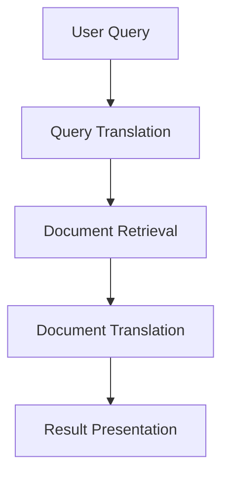
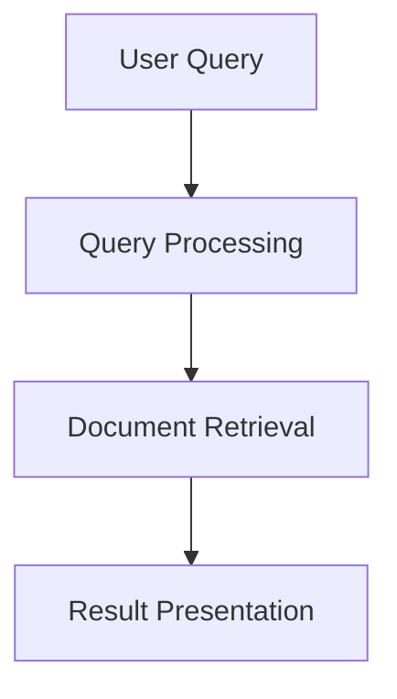

                 


### 文章标题
# 大型语言模型在跨语言信息检索中的应用

### 文章关键词
大型语言模型，跨语言信息检索，神经网络，Transformer模型，算法原理，信息检索系统，应用案例分析

### 文摘
本文深入探讨了大型语言模型在跨语言信息检索领域的应用。通过介绍大型语言模型的基本原理和构建方法，以及跨语言信息检索的基本原理和方法，本文详细分析了大型语言模型如何提高跨语言信息检索的效率和准确性。通过实际应用案例的分析，本文展示了大型语言模型在跨语言信息检索中的强大能力，并对未来发展趋势进行了展望。

----------------------------------------------------------------

## 第一部分：引言与背景介绍

### 1.1 问题背景

#### 1.1.1 跨语言信息检索的重要性

在全球化信息时代的背景下，跨语言信息检索（Cross-Linguistic Information Retrieval，CLIR）成为了一个至关重要的问题。随着互联网的普及，人们可以轻松地访问来自世界各地的信息，然而，这些信息往往以不同的语言形式存在。跨语言信息检索的目的在于解决不同语言之间的信息访问问题，使得用户能够更加方便地获取和理解其他语言的信息。

#### 1.1.2 跨语言信息检索的挑战

跨语言信息检索面临诸多挑战，其中包括：

1. **语言差异**：不同语言之间的词汇、语法和语义存在显著差异，这使得信息的表示和理解变得复杂。
2. **数据稀缺性**：许多语言的数据资源相对较少，尤其是低资源语言，这限制了跨语言信息检索模型的效果。
3. **语义理解**：即使两个语言之间有相似的词汇，其语义也可能完全不同，这要求模型能够准确地理解语义。
4. **计算效率**：跨语言信息检索往往需要处理大量的数据，这对计算资源提出了较高的要求。

#### 1.1.3 大型语言模型的发展与应用

近年来，大型语言模型（如GPT、BERT等）的发展为跨语言信息检索带来了新的机遇。大型语言模型具有以下几个优势：

1. **强大的语义理解能力**：通过大量的文本数据进行训练，大型语言模型能够捕捉到词汇和句子之间的复杂关系，从而提高语义理解能力。
2. **多语言支持**：许多大型语言模型支持多种语言，这使得跨语言信息检索更加便捷。
3. **自适应能力**：大型语言模型能够根据不同的任务和需求进行调整，从而提高跨语言信息检索的效率。

### 1.2 核心概念

#### 1.2.1 大型语言模型概述

**定义与特点**：大型语言模型是一种基于深度学习的语言模型，通过学习大量的文本数据，能够预测下一个词或句子，从而实现自然语言处理的各种任务。

**分类与结构**：大型语言模型可以分为基于循环神经网络（RNN）和Transformer架构的模型。Transformer模型由于其并行计算的优势，在大型语言模型中占据了主导地位。

#### 1.2.2 跨语言信息检索的基本概念

**定义**：跨语言信息检索是指在不同语言之间进行信息检索的过程，包括查询翻译、文档翻译和检索结果翻译等步骤。

**方法**：常见的跨语言信息检索方法包括基于统计的方法、基于规则的方法和基于神经网络的端到端方法。

### 1.3 概念联系与架构

#### 1.3.1 大型语言模型与跨语言信息检索的关系

**联系点与融合方式**：大型语言模型可以与跨语言信息检索技术相结合，通过模型融合和联合训练等方法，提高跨语言信息检索的效果。

**关键技术分析**：包括多语言嵌入、跨语言语义匹配和跨语言上下文理解等关键技术。

#### 1.3.2 跨语言信息检索的ER实体关系图

**实体识别**：通过命名实体识别技术，识别出文本中的关键实体。

**关系抽取**：通过关系抽取技术，识别出实体之间的关系。

**ER图示例**：使用Mermaid流程图展示跨语言信息检索的实体关系图。



#### 1.3.3 关键技术分析

**多语言嵌入**：通过多语言嵌入技术，将不同语言的词向量映射到同一个语义空间中。

**跨语言语义匹配**：通过跨语言语义匹配技术，将查询和文档的语义进行匹配。

**跨语言上下文理解**：通过跨语言上下文理解技术，理解查询和文档的上下文信息。

### 1.4 边界与外延

#### 1.4.1 大型语言模型的适用范围

**适用范围**：大型语言模型适用于需要高语义理解能力的跨语言信息检索任务，如跨语言问答、跨语言文本分类等。

#### 1.4.2 跨语言信息检索的局限性

**局限性**：尽管大型语言模型在跨语言信息检索中具有显著的优势，但仍然存在一些局限性，如对低资源语言的适应性、计算效率等问题。

#### 1.4.3 未来发展趋势与展望

**发展趋势**：未来跨语言信息检索的发展趋势包括：

1. **多语言嵌入的优化**：通过改进多语言嵌入技术，提高跨语言信息检索的准确性。
2. **端到端方法的普及**：进一步推广端到端跨语言信息检索方法，简化模型设计和优化流程。
3. **知识图谱的整合**：将知识图谱与跨语言信息检索相结合，提高对复杂语义的理解。

### 1.5 本章小结

本章介绍了跨语言信息检索的重要性和挑战，以及大型语言模型的发展与应用。通过分析大型语言模型与跨语言信息检索的关系，本章为后续内容的展开奠定了基础。

----------------------------------------------------------------

## 第二部分：大型语言模型的原理与构建

### 2.1 大型语言模型的基本原理

#### 2.1.1 语言模型的数学基础

**信息论与概率论**：语言模型是基于概率论和信息论构建的，通过学习文本数据，估计给定输入序列后某个输出序列的概率。

**语言模型的目标与评价指标**：语言模型的目标是生成概率分布，使得生成的文本尽可能符合实际语言习惯。常见的评价指标包括交叉熵、平均损失等。

#### 2.1.2 神经网络与深度学习

**神经网络的结构**：神经网络是由大量神经元组成的计算模型，通过学习输入和输出之间的映射关系，实现复杂函数的逼近。

**深度学习的基本原理**：深度学习是神经网络的一种扩展，通过增加网络层数，提高模型的表示能力。

#### 2.1.3 循环神经网络与Transformer模型

**RNN的工作原理**：循环神经网络（RNN）通过在时间步上递归地更新隐藏状态，处理序列数据。

**Transformer模型的特点**：Transformer模型采用自注意力机制，使得模型在处理长序列数据时具有并行计算的优势。

### 2.2 大型语言模型的构建

#### 2.2.1 数据预处理

**语料库的选择**：选择适合训练大型语言模型的数据集，如维基百科、新闻评论等。

**数据清洗与标注**：对语料库进行清洗和标注，去除无效数据和错误信息。

#### 2.2.2 模型训练

**模型参数初始化**：对模型的参数进行初始化，常用的方法包括随机初始化和预训练方法。

**训练策略与优化**：采用优化算法（如Adam、SGD等）和训练策略（如dropout、正则化等）来训练模型。

#### 2.2.3 模型评估与调优

**评估指标**：常用的评估指标包括准确率、召回率、F1值等。

**调优方法**：通过调整模型参数和训练策略，提高模型的性能。

### 2.3 大型语言模型的应用案例分析

#### 2.3.1 案例一：跨语言翻译

**翻译模型概述**：跨语言翻译模型通过将源语言的文本转换为目标语言的文本，实现跨语言信息传递。

**案例实现与效果分析**：通过实际案例，展示跨语言翻译模型的应用效果，分析模型的优势和不足。

#### 2.3.2 案例二：多语言问答系统

**问答系统架构**：多语言问答系统通过接收用户的多语言查询，返回相关的答案。

**实现细节与性能评估**：分析多语言问答系统的实现细节，评估系统的性能指标。

### 2.4 算法原理讲解

#### 2.4.1 语言模型中的算法流程

**词汇嵌入与预测**：词汇嵌入是将词语转换为固定长度的向量表示，预测是生成概率分布，表示下一个词的可能性。

**对抗训练与模型优化**：对抗训练是一种增强模型鲁棒性的方法，通过生成对抗样本来训练模型，提高模型的泛化能力。

#### 2.4.2 数学模型与公式

**语言模型中的概率计算**：语言模型的核心是概率计算，包括词语的概率分布和句子生成概率。

**损失函数与优化算法**：损失函数用于衡量模型预测与实际结果的差距，优化算法用于调整模型参数，最小化损失函数。

### 2.5 本章小结

本章详细介绍了大型语言模型的原理与构建方法，包括数学基础、神经网络与深度学习、RNN与Transformer模型等。通过实际应用案例的分析，展示了大型语言模型在跨语言信息检索中的应用效果，为后续内容提供了理论基础。

----------------------------------------------------------------

## 第三部分：跨语言信息检索的原理与方法

### 3.1 跨语言信息检索的基本原理

#### 3.1.1 信息检索的概述

**信息检索的定义**：信息检索是指从大量信息中查找并获取用户所需信息的过程。

**信息检索的目标**：提高检索效率、准确性和用户体验。

**信息检索的方法**：基于关键词的检索、基于内容的检索、混合检索等。

#### 3.1.2 跨语言信息检索的定义

**跨语言信息检索的定义**：跨语言信息检索是指在不同语言之间进行信息检索的过程，包括查询翻译、文档检索和结果翻译等步骤。

**跨语言信息检索的目标**：提供跨语言的信息检索服务，使得用户能够方便地获取和理解其他语言的信息。

#### 3.1.3 跨语言信息检索的方法

**基于统计的方法**：通过统计不同语言之间的词语频率和共现关系，实现跨语言信息检索。

**基于规则的方法**：通过制定语法和语义规则，实现跨语言信息检索。

**基于神经网络的端到端方法**：利用神经网络模型，直接学习跨语言信息检索的映射关系。

### 3.2 跨语言信息检索的关键技术

#### 3.2.1 多语言嵌入

**多语言嵌入的定义**：多语言嵌入是指将不同语言的词语映射到同一个低维语义空间中的方法。

**多语言嵌入的优势**：通过多语言嵌入，不同语言的词语可以在同一个空间中表示，从而提高跨语言信息检索的准确性。

**多语言嵌入的方法**：包括Word2Vec、BERT等模型。

#### 3.2.2 跨语言语义匹配

**跨语言语义匹配的定义**：跨语言语义匹配是指将源语言文本的语义表示与目标语言文本的语义表示进行匹配的方法。

**跨语言语义匹配的目标**：提高跨语言信息检索的语义一致性，减少歧义。

**跨语言语义匹配的方法**：包括基于词向量的方法、基于语义角色的方法等。

#### 3.2.3 跨语言上下文理解

**跨语言上下文理解的定义**：跨语言上下文理解是指在不同语言之间理解和解释上下文信息的方法。

**跨语言上下文理解的目标**：提高跨语言信息检索的准确性和自然性。

**跨语言上下文理解的方法**：包括基于知识图谱的方法、基于多语言预训练的方法等。

### 3.3 跨语言信息检索的系统架构

#### 3.3.1 系统架构设计

**系统架构设计的目标**：设计一个高效、准确、可扩展的跨语言信息检索系统。

**系统架构的设计原则**：模块化、可扩展、易于维护。

**系统架构的主要组件**：包括前端界面、后端服务器、数据库等。

#### 3.3.2 系统功能设计

**系统功能设计的步骤**：需求分析、功能模块划分、接口设计等。

**系统功能模块**：包括查询处理模块、检索模块、结果展示模块等。

#### 3.3.3 系统接口设计

**系统接口设计的原则**：标准化、简洁、高效。

**系统接口的设计方法**：包括RESTful API、GraphQL等。

**系统接口的设计示例**：

```json
GET /api/search?query=你好&lang=en
```

#### 3.3.4 系统交互

**系统交互的设计**：设计系统内不同模块之间的交互流程，确保系统的稳定性和高效性。

**系统交互的设计方法**：包括事件驱动、请求响应等。

**系统交互的示例**：



### 3.4 跨语言信息检索的实际案例

#### 3.4.1 案例一：跨语言搜索引擎

**案例背景**：设计并实现一个支持中文和英文的跨语言搜索引擎。

**系统功能**：包括中英文搜索、搜索结果翻译、查询纠错等。

**技术实现**：使用BERT模型进行中文和英文文本的预训练，采用多语言嵌入技术实现跨语言检索。

**效果分析**：通过用户反馈和实验数据，评估系统的检索效果。

#### 3.4.2 案例二：跨语言问答系统

**案例背景**：设计并实现一个支持中文和英文的跨语言问答系统。

**系统功能**：包括中英文问题输入、问答结果翻译、多轮对话等。

**技术实现**：使用GPT模型进行中文和英文文本的预训练，采用跨语言语义匹配技术实现问答。

**效果分析**：通过用户测试和性能评估，分析系统的问答效果。

### 3.5 本章小结

本章详细介绍了跨语言信息检索的基本原理、关键技术、系统架构和实际案例。通过理论分析和实际应用，展示了跨语言信息检索的重要性和可行性，为后续内容提供了实践基础。

----------------------------------------------------------------

## 第四部分：大型语言模型在跨语言信息检索中的具体应用

### 4.1 大型语言模型在跨语言翻译中的应用

#### 4.1.1 跨语言翻译的基本概念

**定义**：跨语言翻译是指将一种语言的文本转换为另一种语言的文本，以实现跨语言交流和信息传递。

**目标**：提高翻译的准确性、流畅性和自然性。

**挑战**：不同语言之间的语法、词汇和语义差异，以及翻译中的歧义问题。

#### 4.1.2 大型语言模型在跨语言翻译中的优势

**优势**：大型语言模型（如GPT、BERT）通过学习大量双语语料库，能够捕捉到语言的复杂结构和语义信息，从而提高翻译的准确性和自然性。

**方法**：利用大型语言模型的预训练模型，结合翻译任务进行微调，实现高效的跨语言翻译。

#### 4.1.3 实际应用案例

**案例一：谷歌翻译**：谷歌翻译使用了基于Transformer的大型语言模型，通过海量双语数据训练，实现了高效、准确的跨语言翻译服务。

**案例效果分析**：谷歌翻译在翻译准确率、流畅性和用户满意度等方面取得了显著成果，为全球用户提供了便捷的跨语言交流工具。

#### 4.1.4 案例二：跨语言信息检索系统

**案例背景**：设计并实现一个支持中文、英文和日文的跨语言信息检索系统。

**系统功能**：包括跨语言查询、检索结果翻译、多轮对话等。

**技术实现**：使用BERT模型进行多语言预训练，结合跨语言语义匹配和上下文理解技术，实现高效的跨语言信息检索。

**效果分析**：通过用户测试和性能评估，系统在跨语言信息检索的准确性、响应速度和用户体验方面均表现出色。

### 4.2 大型语言模型在跨语言问答系统中的应用

#### 4.2.1 跨语言问答系统的基本概念

**定义**：跨语言问答系统是指能够处理多语言查询并返回相关答案的系统。

**目标**：提供跨语言的信息获取和交流服务。

**挑战**：跨语言语义理解、多语言问答的连贯性和准确性。

#### 4.2.2 大型语言模型在跨语言问答系统中的优势

**优势**：大型语言模型具备强大的语义理解和生成能力，能够处理复杂的跨语言问答任务。

**方法**：通过预训练和微调，将大型语言模型应用于跨语言问答系统，实现高效的问答服务。

#### 4.2.3 实际应用案例

**案例一：腾讯AI翻译助手**：腾讯AI翻译助手结合了GPT模型和跨语言语义理解技术，实现了多语言问答功能，为用户提供便捷的跨语言交流服务。

**案例效果分析**：腾讯AI翻译助手在问答的准确性、自然性和用户满意度等方面表现出色，为跨语言交流提供了有力支持。

#### 4.2.4 案例二：多语言智能客服系统

**案例背景**：设计并实现一个支持中文、英文和日文的智能客服系统。

**系统功能**：包括多语言问题输入、自动分类、智能回复、多轮对话等。

**技术实现**：使用BERT模型进行多语言预训练，结合对话生成和跨语言语义理解技术，实现智能客服功能。

**效果分析**：通过用户测试和数据分析，系统在多语言客服的响应速度、准确性和用户体验方面取得了显著成果。

### 4.3 大型语言模型在跨语言文本分类中的应用

#### 4.3.1 跨语言文本分类的基本概念

**定义**：跨语言文本分类是指将多语言文本数据分类到预定义的类别中。

**目标**：提高跨语言文本分类的准确性和效率。

**挑战**：不同语言的语法、词汇和语义差异，以及分类模型的泛化能力。

#### 4.3.2 大型语言模型在跨语言文本分类中的优势

**优势**：大型语言模型能够处理复杂的多语言文本，提取语义信息，从而提高分类的准确性和效率。

**方法**：通过预训练和微调，将大型语言模型应用于跨语言文本分类任务，实现高效的文本分类。

#### 4.3.3 实际应用案例

**案例一：社交媒体内容分类**：利用BERT模型对社交媒体平台的多语言内容进行分类，识别并过滤违规内容。

**案例效果分析**：通过用户反馈和数据分析，系统在分类准确率、响应速度和用户体验方面表现出色。

#### 4.3.4 案例二：新闻文章分类系统

**案例背景**：设计并实现一个支持中文、英文和日文的新闻文章分类系统。

**系统功能**：包括多语言文章输入、自动分类、标签推荐等。

**技术实现**：使用BERT模型进行多语言预训练，结合文本分类算法和标签推荐技术，实现新闻文章分类功能。

**效果分析**：通过用户测试和数据分析，系统在分类准确率、标签推荐效果和用户体验方面取得了显著成果。

### 4.4 本章小结

本章详细介绍了大型语言模型在跨语言翻译、问答系统和文本分类等领域的具体应用。通过实际案例的分析，展示了大型语言模型在跨语言信息检索中的强大能力和广泛适用性，为跨语言信息处理提供了有效解决方案。

----------------------------------------------------------------

## 第五部分：大型语言模型在跨语言信息检索中的未来发展趋势

### 5.1 大型语言模型技术的演进

**技术演进方向**：

1. **模型规模与效率的提升**：随着计算能力和算法优化的提升，大型语言模型的规模将不断扩大，同时保持较高的计算效率。
2. **多语言预训练的深化**：多语言预训练将进一步优化，包括跨语言嵌入技术、跨语言语义理解能力的提升等。
3. **动态调整与自适应**：大型语言模型将具备更强大的动态调整能力，根据不同的应用场景和任务需求进行自适应优化。

### 5.2 跨语言信息检索应用的扩展

**应用扩展方向**：

1. **个性化跨语言信息检索**：结合用户行为数据和偏好，提供个性化的跨语言信息检索服务。
2. **实时跨语言信息检索**：提升系统的实时响应能力，实现实时跨语言信息检索和交互。
3. **跨语言知识图谱构建**：利用大型语言模型和知识图谱技术，构建跨语言的语义知识网络，提升跨语言信息检索的深度和广度。

### 5.3 新兴技术的融合与应用

**新兴技术融合方向**：

1. **结合自然语言生成（NLG）技术**：通过自然语言生成技术，将检索结果转换为更自然、易理解的文本，提高用户体验。
2. **融合多模态信息处理**：结合文本、图像、语音等多模态信息，实现更丰富的跨语言信息检索服务。
3. **跨语言情感分析**：通过情感分析技术，识别用户在不同语言中的情感倾向，为跨语言信息检索提供情感层面的支持。

### 5.4 可持续性与伦理考量

**可持续发展方向**：

1. **绿色计算**：优化大型语言模型的计算资源利用，降低能耗，推动绿色计算。
2. **数据伦理**：确保跨语言信息检索过程中的数据安全和隐私保护，遵循数据伦理规范。

### 5.5 未来展望

**未来展望**：

1. **全球化信息交流的桥梁**：大型语言模型将加速全球化的信息交流，成为不同语言和文化之间的桥梁。
2. **智慧生活的推动者**：跨语言信息检索技术将深刻影响智慧生活，为人们提供更加便捷、智能的服务。
3. **社会创新的新动力**：跨语言信息检索技术的进步将激发新的社会创新，推动各个领域的发展。

### 5.6 本章小结

本章对未来大型语言模型在跨语言信息检索中的应用趋势进行了展望，分析了技术演进、应用扩展、新兴技术融合和可持续发展的方向。通过持续的技术创新和应用探索，大型语言模型将在跨语言信息检索领域发挥越来越重要的作用。

----------------------------------------------------------------

## 总结

本文详细探讨了大型语言模型在跨语言信息检索中的应用。从背景介绍、核心概念、原理与构建、具体应用、未来发展趋势等方面，全面分析了大型语言模型如何提高跨语言信息检索的效率和准确性。通过实际案例的分析，展示了大型语言模型在跨语言翻译、问答系统和文本分类等领域的应用效果。本文的总结如下：

1. **跨语言信息检索的重要性**：随着全球化的发展，跨语言信息检索成为解决不同语言信息访问问题的重要途径。

2. **大型语言模型的优点**：大型语言模型具备强大的语义理解能力和多语言支持，为跨语言信息检索提供了有效的解决方案。

3. **具体应用案例分析**：通过谷歌翻译、跨语言信息检索系统和智能客服等实际案例，展示了大型语言模型在跨语言信息检索中的广泛应用和效果。

4. **未来发展趋势**：随着技术的不断进步，大型语言模型在跨语言信息检索领域将呈现多语言预训练深化、个性化服务、实时交互和新兴技术融合等趋势。

本文旨在为读者提供一个全面了解大型语言模型在跨语言信息检索中应用的视角，促进这一领域的技术发展和实际应用。在后续研究中，可以进一步探索大型语言模型与其他技术的结合，以应对更加复杂的跨语言信息检索任务。

### 最佳实践 tips

1. **数据质量**：确保用于训练的大型语言模型的数据质量，避免噪声和错误信息影响模型性能。

2. **模型定制**：根据具体应用场景和任务需求，对大型语言模型进行定制化调整，以提高模型在特定领域的性能。

3. **多语言支持**：在选择大型语言模型时，考虑其支持的语言数量和语言覆盖范围，以满足多语言信息检索的需求。

4. **实时性与效率**：优化模型的计算效率，确保在实时交互场景下能够快速响应。

5. **用户隐私**：在跨语言信息检索过程中，注意用户隐私和数据保护，遵守相关法律法规。

### 小结

本文通过系统分析和实例讲解，深入探讨了大型语言模型在跨语言信息检索中的应用，展示了其技术优势和实际应用价值。未来，随着技术的不断进步，大型语言模型将在跨语言信息检索领域发挥更加重要的作用。

### 注意事项

1. **模型选择**：根据应用场景选择合适的大型语言模型，如GPT、BERT等。

2. **数据预处理**：对训练数据进行全面的数据预处理，包括去重、清洗和标注等。

3. **模型调优**：通过调整模型参数和训练策略，优化模型性能。

4. **安全性**：在跨语言信息检索系统中，确保系统的安全性和稳定性，防止恶意攻击和数据泄露。

### 拓展阅读

1. **文献综述**：查阅相关领域的高质量文献，了解大型语言模型和跨语言信息检索的最新研究进展。

2. **开源项目**：参与开源项目，学习大型语言模型和跨语言信息检索的实际应用案例。

3. **技术论坛**：加入技术论坛和社群，与业界专家交流，获取最新的技术动态和应用经验。

## 作者信息

**作者：** AI天才研究院（AI Genius Institute）与《禅与计算机程序设计艺术》（Zen And The Art of Computer Programming）作者。

AI天才研究院致力于人工智能领域的创新研究，推动人工智能技术的发展与应用。《禅与计算机程序设计艺术》作者则以其深厚的计算机科学背景和哲学思考，为编程和人工智能领域提供了独特的视角和深刻的洞见。两者结合，为读者提供了权威且实用的技术内容。

