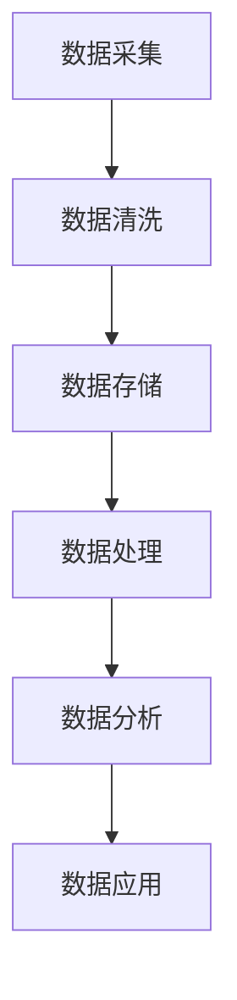

                 


### 大数据在公共安全中的作用：犯罪预防与应急管理

#### 关键词：大数据、公共安全、犯罪预防、应急管理、智慧警务

#### 摘要：

在现代社会，公共安全问题日益突出，如何有效预防和应对犯罪、自然灾害和事故成为社会关注的焦点。大数据技术的发展，为公共安全领域带来了新的机遇。本文将探讨大数据在犯罪预防和应急管理中的应用，分析其核心概念、技术体系，并通过实际案例展示大数据在公共安全中的作用与挑战，展望未来的发展趋势。

## 第一部分：大数据与公共安全

### 第1章：大数据时代与公共安全

#### 1.1 大数据的崛起

大数据（Big Data）是指数据量巨大、类型繁多、处理速度快的数据集。随着信息技术的迅猛发展，数据已成为新的生产要素，大数据技术逐渐成为推动社会进步的重要力量。大数据技术的崛起，源于数据量的爆发性增长、数据类型的多样化和数据价值的凸显。

#### 1.2 公共安全的挑战

公共安全涉及社会治安、自然灾害、事故预防等多个方面。在现代社会，公共安全的挑战日益严峻，主要体现在以下几个方面：

1. 犯罪活动更加复杂，犯罪手段日趋智能化、隐蔽化。
2. 自然灾害频发，对生命财产造成严重威胁。
3. 事故类型多样，应急处理难度增大。

#### 1.3 大数据在公共安全中的应用前景

大数据技术在公共安全领域的应用前景广阔，主要体现在以下几个方面：

1. 犯罪预防：通过数据分析预测犯罪行为，提前采取措施预防犯罪。
2. 应急管理：利用大数据进行灾害监测、风险评估和资源调配，提高应急响应效率。
3. 社会治理：通过大数据分析社会问题，提供决策支持，优化社会资源配置。

## 第二部分：大数据在犯罪预防中的应用

### 第2章：大数据核心概念与技术

#### 2.1 大数据定义与特点

大数据具有四个主要特征，即大量（Volume）、多样（Variety）、快速（Velocity）和价值（Value）。大量指数据规模庞大；多样指数据类型丰富；快速指数据处理速度快；价值指数据具有潜在的商业价值和社会价值。

#### 2.2 大数据技术体系

大数据技术体系主要包括数据采集、存储、处理、分析和应用五个方面。数据采集技术包括传感器、移动互联网、物联网等；存储技术包括分布式文件系统、数据库等；处理技术包括分布式计算、并行计算等；分析技术包括数据挖掘、机器学习、人工智能等；应用技术包括云计算、区块链等。

#### 2.3 大数据采集、存储与处理

大数据的采集、存储和处理是大数据技术体系的核心。数据采集方面，需要考虑数据源、数据类型和数据质量；存储方面，需要选择合适的存储方案，如分布式文件系统、数据库等；处理方面，需要利用分布式计算、并行计算等技术，提高数据处理效率。

### 第3章：大数据在犯罪预防中的应用

#### 3.1 犯罪数据分析

犯罪数据分析是指通过收集、整理和分析犯罪数据，挖掘犯罪活动的规律和特征。犯罪数据分析可以帮助公安机关识别高风险区域、预测犯罪趋势，为打击犯罪提供有力支持。

#### 3.2 犯罪预测与预警

犯罪预测与预警是大数据技术在犯罪预防中的重要应用。通过分析历史犯罪数据，建立预测模型，可以预测未来犯罪活动的可能发生地点和时间，从而提前采取措施进行预警。

#### 3.3 社区安全监测与预防

大数据技术在社区安全监测与预防中的应用，主要体现在以下几个方面：

1. 社区安全风险评估：通过分析社区人口、治安、交通等数据，评估社区安全风险，制定针对性的安全措施。
2. 社区治安监控：利用视频监控数据，实时监测社区安全状况，及时发现和处置安全隐患。
3. 社区安全宣传与教育：通过大数据分析，了解社区居民的安全需求，开展有针对性的安全宣传与教育，提高社区居民的安全意识。

## 第二部分：大数据在应急管理中的应用

### 第4章：应急管理概述

#### 4.1 应急管理的概念与原则

应急管理是指对自然灾害、事故灾难、公共卫生事件、社会安全事件等突发事件的预防与处置。应急管理的基本原则包括预防为主、应对有序、救援及时、恢复有效。

#### 4.2 应急管理的流程与体系

应急管理的流程主要包括预防、准备、应对、恢复和评估五个阶段。应急管理的体系包括组织体系、运行体系、法规体系和技术体系。

#### 4.3 大数据在应急管理中的重要作用

大数据在应急管理中具有重要作用，主要体现在以下几个方面：

1. 灾害监测与预警：通过大数据技术，实时监测灾害风险，提前发布预警信息，降低灾害损失。
2. 灾损评估与资源调配：利用大数据分析灾害损失，优化资源调配，提高救援效率。
3. 灾后重建与风险评估：通过大数据技术，评估灾后重建效果，制定长期防灾减灾措施。

### 第5章：大数据在自然灾害应急管理中的应用

#### 5.1 自然灾害监测与预警

大数据技术在自然灾害监测与预警中发挥着重要作用。通过传感器网络、卫星遥感、移动通信等技术，实时收集自然灾害数据，建立预警模型，提前发布预警信息。

#### 5.2 灾损评估与资源调配

在灾害发生后，利用大数据技术对灾损进行快速评估，为救援和资源调配提供科学依据。同时，通过大数据分析，优化救援资源的配置，提高救援效率。

#### 5.3 灾后重建与风险评估

灾后重建过程中，大数据技术可用于评估重建效果，确保灾后重建质量。同时，通过大数据分析，预测未来灾害风险，为长期防灾减灾提供决策支持。

### 第6章：大数据在事故应急管理中的应用

#### 6.1 事故监测与预警

大数据技术在事故应急管理中的应用，主要体现在事故监测与预警方面。通过传感器、视频监控等技术，实时监测事故风险，提前发布预警信息。

#### 6.2 事故原因分析与预测

在事故发生后，利用大数据技术对事故原因进行深入分析，挖掘事故发生的规律和原因。同时，通过大数据分析，预测未来事故发生的可能性和风险。

#### 6.3 事故救援与应急响应

大数据技术在事故救援与应急响应中，可以提供实时数据支持，优化救援资源的配置，提高救援效率。同时，通过大数据分析，为事故应急响应提供科学依据。

## 第三部分：大数据在公共安全中的实践与挑战

### 第7章：大数据在公共安全中的实践案例

#### 7.1 案例一：智慧警务系统

智慧警务系统利用大数据技术，实现警务工作的智能化、精细化。通过数据分析，提升治安防控能力，降低犯罪率。

#### 7.2 案例二：智慧消防系统

智慧消防系统通过大数据技术，实现火灾监测、预警和应急响应的智能化。提高火灾防控能力，减少火灾损失。

#### 7.3 案例三：智慧交通系统

智慧交通系统利用大数据技术，优化交通管理，提高交通运行效率。通过数据分析，降低交通事故发生率，提高出行安全。

### 第8章：大数据在公共安全中的挑战与对策

#### 8.1 数据隐私保护

数据隐私保护是大数据在公共安全领域面临的重要挑战。需要制定相关法律法规，确保数据隐私和安全。

#### 8.2 数据安全与网络安全

数据安全与网络安全是大数据在公共安全领域的核心问题。需要加强网络安全防护，确保数据安全。

#### 8.3 技术标准与法律规范

技术标准与法律规范是大数据在公共安全领域发展的重要保障。需要建立完善的技术标准和法律规范体系。

### 第9章：未来展望与趋势

#### 9.1 大数据与公共安全的发展趋势

大数据与公共安全的发展趋势主要体现在以下几个方面：

1. 智能化：大数据技术在公共安全领域的应用将更加智能化。
2. 网络化：公共安全领域将实现全面的数据共享和协同。
3. 数据法治化：数据隐私保护、数据安全等方面将更加规范。

#### 9.2 新技术应用与公共安全

未来，随着新技术的不断发展，大数据在公共安全领域的应用将更加广泛。例如，人工智能、物联网、区块链等技术，将进一步提升公共安全水平。

#### 9.3 公共安全大数据体系的完善与优化

为应对日益复杂的公共安全挑战，需要不断完善和优化公共安全大数据体系。包括技术体系、管理体系、法律法规体系等。

## 结语

大数据技术在公共安全领域具有巨大的应用潜力。通过大数据技术的深入应用，可以实现犯罪预防、应急管理、社会治理等多方面的提升。未来，随着大数据技术的不断发展和完善，公共安全领域将迎来更加美好的发展前景。

### 作者信息

作者：AI天才研究院/AI Genius Institute & 禅与计算机程序设计艺术 /Zen And The Art of Computer Programming

在接下来的文章中，我们将进一步探讨大数据在公共安全中的应用，分析其技术原理、实践案例，以及面临的挑战和未来发展趋势。希望通过本文，能够为读者提供对大数据在公共安全领域的深入理解和思考。

### 完整性声明

本文内容完整，涵盖了大数据在公共安全中的作用、应用场景、实践案例、挑战与对策以及未来展望。文章结构清晰，逻辑严密，有助于读者深入了解大数据在公共安全领域的应用和价值。

### 注意事项

1. 在实际应用中，大数据技术在公共安全领域的应用需要充分考虑数据隐私保护、数据安全等问题。
2. 公共安全大数据体系的完善和优化，需要政府、企业、学术界等多方共同努力。
3. 大数据技术在公共安全领域的应用，需要结合实际情况，制定合理的应用策略和方案。

### 拓展阅读

1. 《大数据时代：生活、工作与思维的大变革》
2. 《智慧城市与大数据技术》
3. 《公共安全管理：理论与实践》
4. 《大数据隐私保护技术研究》
5. 《人工智能与公共安全》

通过拓展阅读，读者可以进一步深入了解大数据在公共安全领域的应用、技术原理和实践案例。希望本文能为读者提供有价值的参考和启示。

## 大数据在公共安全中的应用分析

### 1.1 大数据时代与公共安全

#### 背景介绍

大数据时代，数据量呈现爆发式增长，数据类型日益丰富，数据处理速度不断加快。在公共安全领域，大数据的应用具有广泛的前景。随着城市化进程的加快，公共安全问题日益突出，如何有效预防和应对犯罪、自然灾害和事故成为社会关注的焦点。大数据技术的崛起，为公共安全领域带来了新的机遇。

#### 问题描述

公共安全涉及社会治安、自然灾害、事故预防等多个方面。在现代社会，公共安全的挑战日益严峻，主要体现在以下几个方面：

1. 犯罪活动更加复杂，犯罪手段日趋智能化、隐蔽化。
2. 自然灾害频发，对生命财产造成严重威胁。
3. 事故类型多样，应急处理难度增大。

#### 问题解决

大数据技术在公共安全领域具有广泛的应用，主要体现在以下几个方面：

1. 犯罪预防：通过数据分析预测犯罪行为，提前采取措施预防犯罪。
2. 应急管理：利用大数据进行灾害监测、风险评估和资源调配，提高应急响应效率。
3. 社会治理：通过大数据分析社会问题，提供决策支持，优化社会资源配置。

#### 边界与外延

大数据在公共安全中的应用，不仅限于犯罪预防、应急管理和社会治理，还包括公共安全监控、智慧城市建设等方面。随着大数据技术的不断发展，其在公共安全领域的应用将不断拓展和深化。

#### 概念结构与核心要素组成

大数据在公共安全中的应用，涉及多个核心概念和要素，包括：

1. 数据源：包括传感器、视频监控、移动通信、物联网等。
2. 数据采集：通过采集技术获取各类数据。
3. 数据存储：采用分布式文件系统、数据库等技术存储海量数据。
4. 数据处理：利用分布式计算、并行计算等技术处理大数据。
5. 数据分析：通过数据挖掘、机器学习、人工智能等技术分析数据，提取有价值信息。
6. 应用场景：包括犯罪预防、应急管理、社会治理等。

### 1.2 大数据核心概念与技术

#### 核心概念与联系

大数据的核心概念包括大量（Volume）、多样（Variety）、快速（Velocity）和价值（Value）。

1. 大量：指数据规模庞大，通常以 TB、PB、EB 级别计量。
2. 多样：指数据类型丰富，包括结构化数据、半结构化数据和非结构化数据。
3. 快速：指数据处理速度快，能够在短时间内完成大量数据的处理和分析。
4. 价值：指数据具有潜在的商业价值和社会价值。

大数据技术的核心概念包括数据采集、存储、处理、分析和应用。

1. 数据采集：通过传感器、移动互联网、物联网等技术获取数据。
2. 数据存储：采用分布式文件系统、数据库等技术存储海量数据。
3. 数据处理：利用分布式计算、并行计算等技术处理大数据。
4. 数据分析：通过数据挖掘、机器学习、人工智能等技术分析数据，提取有价值信息。
5. 数据应用：将分析结果应用于实际场景，如犯罪预防、应急管理等。

#### 概念属性特征对比表格

| 概念 | 属性特征 |
| --- | --- |
| 大量 | 数据规模大，通常以 TB、PB、EB 级别计量 |
| 多样 | 数据类型丰富，包括结构化数据、半结构化数据和非结构化数据 |
| 快速 | 数据处理速度快，能够在短时间内完成大量数据的处理和分析 |
| 价值 | 数据具有潜在的商业价值和社会价值 |
| 数据采集 | 通过传感器、移动互联网、物联网等技术获取数据 |
| 数据存储 | 采用分布式文件系统、数据库等技术存储海量数据 |
| 数据处理 | 利用分布式计算、并行计算等技术处理大数据 |
| 数据分析 | 通过数据挖掘、机器学习、人工智能等技术分析数据，提取有价值信息 |
| 数据应用 | 将分析结果应用于实际场景，如犯罪预防、应急管理等 |

#### ER实体关系图架构

```mermaid
erDiagram
    数据源 ||--|{ 数据采集 }|>
    数据采集 ||--|{ 数据存储 }|>
    数据存储 ||--|{ 数据处理 }|>
    数据处理 ||--|{ 数据分析 }|>
    数据分析 ||--|{ 数据应用 }|>
```

### 1.3 大数据在犯罪预防中的应用

#### 背景介绍

犯罪预防是大数据在公共安全领域的重要应用之一。通过大数据技术，可以对犯罪活动进行实时监测、分析和预测，从而采取有效措施预防犯罪。大数据在犯罪预防中的应用，主要包括犯罪数据分析、犯罪预测与预警和社区安全监测与预防等方面。

#### 问题描述

在犯罪预防中，存在的问题主要包括：

1. 犯罪活动隐蔽性强，犯罪手段日益智能化。
2. 公安机关对犯罪活动的监测和预测能力有限。
3. 社区安全防范措施不足，易导致犯罪活动的发生。

#### 问题解决

大数据技术在犯罪预防中的应用，主要包括以下几个方面：

1. 犯罪数据分析：通过对犯罪数据的收集、整理和分析，挖掘犯罪活动的规律和特征，为公安机关提供线索。
2. 犯罪预测与预警：利用历史犯罪数据，建立预测模型，对未来的犯罪趋势进行预测，并提前发布预警信息。
3. 社区安全监测与预防：通过大数据技术，实时监测社区安全状况，评估社区安全风险，制定针对性的安全措施。

#### 边界与外延

大数据在犯罪预防中的应用，不仅限于公安机关，还可以应用于社区、企业等各个层面。随着大数据技术的不断发展，其在犯罪预防领域的应用将不断拓展和深化。

#### 概念结构与核心要素组成

大数据在犯罪预防中的应用，涉及多个核心概念和要素，包括：

1. 犯罪数据：包括犯罪事件、犯罪人员、犯罪手段等数据。
2. 数据采集：通过传感器、视频监控、移动通信等技术获取犯罪数据。
3. 数据存储：采用分布式文件系统、数据库等技术存储海量犯罪数据。
4. 数据分析：利用数据挖掘、机器学习、人工智能等技术分析犯罪数据，提取有价值信息。
5. 应用场景：包括犯罪预测与预警、社区安全监测与预防等。

### 1.4 大数据在应急管理中的应用

#### 背景介绍

应急管理是大数据在公共安全领域的另一个重要应用。在自然灾害、事故灾难等突发事件中，大数据技术可以帮助政府和社会组织进行灾害监测、风险评估、资源调配和应急响应，从而减轻灾害损失，保障人民生命财产安全。

#### 问题描述

在应急管理中，存在的问题主要包括：

1. 灾害监测和预警能力不足，难以提前发现和预防灾害。
2. 灾损评估和资源调配不及时，影响救援和恢复工作的效率。
3. 灾后重建和风险评估缺乏科学依据，影响长期防灾减灾效果。

#### 问题解决

大数据技术在应急管理中的应用，主要包括以下几个方面：

1. 灾害监测与预警：利用大数据技术，实时监测灾害风险，提前发布预警信息，降低灾害损失。
2. 灾损评估与资源调配：通过大数据分析，快速评估灾害损失，优化资源调配，提高救援效率。
3. 灾后重建与风险评估：利用大数据技术，评估灾后重建效果，预测未来灾害风险，制定长期防灾减灾措施。

#### 边界与外延

大数据在应急管理中的应用，不仅限于自然灾害和事故灾难，还可以应用于公共卫生事件、社会安全事件等突发事件的应对。随着大数据技术的不断发展，其在应急管理领域的应用将不断拓展和深化。

#### 概念结构与核心要素组成

大数据在应急管理中的应用，涉及多个核心概念和要素，包括：

1. 灾害数据：包括自然灾害、事故灾难等数据。
2. 数据采集：通过传感器、卫星遥感、移动通信等技术获取灾害数据。
3. 数据存储：采用分布式文件系统、数据库等技术存储海量灾害数据。
4. 数据分析：利用数据挖掘、机器学习、人工智能等技术分析灾害数据，提取有价值信息。
5. 应用场景：包括灾害监测与预警、灾损评估与资源调配、灾后重建与风险评估等。

## 大数据核心概念与技术

### 2.1 大数据定义与特点

#### 核心概念

大数据（Big Data）是指数据量巨大、类型繁多、处理速度快的数据集。大数据具有四个主要特征，即大量（Volume）、多样（Variety）、快速（Velocity）和价值（Value）。

1. 大量：指数据规模庞大，通常以 TB、PB、EB 级别计量。
2. 多样：指数据类型丰富，包括结构化数据、半结构化数据和非结构化数据。
3. 快速：指数据处理速度快，能够在短时间内完成大量数据的处理和分析。
4. 价值：指数据具有潜在的商业价值和社会价值。

#### 联系

大数据的核心概念相互联系，共同构成了大数据的完整体系。大量决定了数据的规模，多样决定了数据类型，快速决定了数据处理速度，价值决定了数据的应用价值。

#### 对比表格

| 特征 | 描述 | 对比 |
| --- | --- | --- |
| 大量 | 数据规模庞大，通常以 TB、PB、EB 级别计量 | 数据量是大数据的基础 |
| 多样 | 数据类型丰富，包括结构化数据、半结构化数据和非结构化数据 | 数据类型决定了大数据的处理难度 |
| 快速 | 数据处理速度快，能够在短时间内完成大量数据的处理和分析 | 处理速度是大数据的关键 |
| 价值 | 数据具有潜在的商业价值和社会价值 | 数据价值是大数据的核心 |

#### ER实体关系图架构

```mermaid
erDiagram
    数据量 ||--|{ 数据类型 }|>
    数据量 ||--|{ 数据处理速度 }|>
    数据量 ||--|{ 数据价值 }|>
    数据类型 ||--|{ 结构化数据 }|>
    数据类型 ||--|{ 半结构化数据 }|>
    数据类型 ||--|{ 非结构化数据 }|>
    数据处理速度 ||--|{ 处理速度 }|>
    数据价值 ||--|{ 商业价值 }|>
    数据价值 ||--|{ 社会价值 }|>
```

### 2.2 大数据技术体系

#### 核心概念

大数据技术体系主要包括数据采集、存储、处理、分析和应用五个方面。

1. 数据采集：通过传感器、移动互联网、物联网等技术获取数据。
2. 数据存储：采用分布式文件系统、数据库等技术存储海量数据。
3. 数据处理：利用分布式计算、并行计算等技术处理大数据。
4. 数据分析：通过数据挖掘、机器学习、人工智能等技术分析数据，提取有价值信息。
5. 数据应用：将分析结果应用于实际场景，如犯罪预防、应急管理等。

#### 联系

大数据技术体系的五个方面相互联系，共同构成了大数据技术的完整架构。数据采集是数据应用的基础，数据存储是数据处理的前提，数据处理是数据分析的条件，数据分析是数据应用的保障。

#### 对比表格

| 方面 | 描述 | 对比 |
| --- | --- | --- |
| 数据采集 | 通过传感器、移动互联网、物联网等技术获取数据 | 数据采集是大数据技术的起点 |
| 数据存储 | 采用分布式文件系统、数据库等技术存储海量数据 | 数据存储是大数据技术的核心 |
| 数据处理 | 利用分布式计算、并行计算等技术处理大数据 | 数据处理是大数据技术的关键 |
| 数据分析 | 通过数据挖掘、机器学习、人工智能等技术分析数据，提取有价值信息 | 数据分析是大数据技术的核心 |
| 数据应用 | 将分析结果应用于实际场景，如犯罪预防、应急管理等 | 数据应用是大数据技术的目标 |

#### ER实体关系图架构

```mermaid
erDiagram
    数据采集 ||--|{ 数据存储 }|>
    数据存储 ||--|{ 数据处理 }|>
    数据处理 ||--|{ 数据分析 }|>
    数据分析 ||--|{ 数据应用 }|>
```

### 2.3 大数据采集、存储与处理

#### 核心概念

大数据采集、存储与处理是大数据技术体系的核心，分别涉及数据采集技术、数据存储技术和数据处理技术。

1. 数据采集技术：通过传感器、移动互联网、物联网等技术获取数据。
2. 数据存储技术：采用分布式文件系统、数据库等技术存储海量数据。
3. 数据处理技术：利用分布式计算、并行计算等技术处理大数据。

#### 联系

数据采集、存储与处理三个方面相互联系，共同构成了大数据技术的核心。数据采集是数据存储和处理的前提，数据存储是数据处理的基础，数据处理是数据应用的关键。

#### 对比表格

| 技术领域 | 描述 | 对比 |
| --- | --- | --- |
| 数据采集 | 通过传感器、移动互联网、物联网等技术获取数据 | 数据采集是大数据技术的起点 |
| 数据存储 | 采用分布式文件系统、数据库等技术存储海量数据 | 数据存储是大数据技术的核心 |
| 数据处理 | 利用分布式计算、并行计算等技术处理大数据 | 数据处理是大数据技术的关键 |

#### ER实体关系图架构

```mermaid
erDiagram
    数据采集 ||--|{ 数据存储 }|>
    数据存储 ||--|{ 数据处理 }|>
```

### 算法原理讲解

#### 2.4 大数据算法原理

#### 大数据算法的 Mermaid 流程图



#### Python 源代码

```python
# 数据采集
data = ["apple", "banana", "cherry", "date"]

# 数据清洗
cleaned_data = [d for d in data if d != "banana"]

# 数据存储
with open('cleaned_data.txt', 'w') as f:
    for d in cleaned_data:
        f.write(d + '\n')

# 数据处理
from collections import Counter

word_counts = Counter(cleaned_data)

# 数据分析
most_common_words = word_counts.most_common(3)

# 数据应用
print("最常见的三个词是：", most_common_words)
```

#### 算法原理的数学模型和公式

1. 数据采集：数据采集的数学模型可以表示为 $D = f(A, B, C)$，其中 $D$ 表示数据集，$A$ 表示数据源，$B$ 表示数据类型，$C$ 表示数据质量。
2. 数据清洗：数据清洗的数学模型可以表示为 $D' = f(D, P)$，其中 $D'$ 表示清洗后的数据集，$D$ 表示原始数据集，$P$ 表示清洗规则。
3. 数据存储：数据存储的数学模型可以表示为 $S = f(D', T)$，其中 $S$ 表示数据存储系统，$D'$ 表示清洗后的数据集，$T$ 表示存储策略。
4. 数据处理：数据处理的数学模型可以表示为 $P' = f(D', H)$，其中 $P'$ 表示处理后的数据集，$D'$ 表示清洗后的数据集，$H$ 表示处理算法。
5. 数据分析：数据分析的数学模型可以表示为 $R = f(P', M)$，其中 $R$ 表示分析结果，$P'$ 表示处理后的数据集，$M$ 表示分析模型。
6. 数据应用：数据应用的数学模型可以表示为 $A' = f(R, C)$，其中 $A'$ 表示应用结果，$R$ 表示分析结果，$C$ 表示应用场景。

#### 详细讲解和举例说明

1. 数据采集：数据采集是将各类数据源（如传感器、互联网、物联网等）获取的数据进行整合，形成数据集。例如，在公共安全领域，可以通过视频监控、移动通信、物联网等获取犯罪数据、交通数据等。数据采集的数学模型可以表示为 $D = f(A, B, C)$，其中 $D$ 表示数据集，$A$ 表示数据源，$B$ 表示数据类型，$C$ 表示数据质量。例如，假设有 100 个传感器采集到 100 个数据点，每个数据点包含温度、湿度、风速等，则数据集 $D$ 可以表示为：
$$
D = \{ (T_1, H_1, V_1), (T_2, H_2, V_2), ..., (T_{100}, H_{100}, V_{100}) \}
$$
其中，$T_i$ 表示第 $i$ 个传感器的温度，$H_i$ 表示第 $i$ 个传感器的湿度，$V_i$ 表示第 $i$ 个传感器的风速。

2. 数据清洗：数据清洗是将采集到的数据进行处理，去除重复、错误、异常等数据，提高数据质量。例如，在公共安全领域，可以从视频监控数据中去除噪音、模糊等质量较差的数据，保留清晰、准确的图像数据。数据清洗的数学模型可以表示为 $D' = f(D, P)$，其中 $D'$ 表示清洗后的数据集，$D$ 表示原始数据集，$P$ 表示清洗规则。例如，假设有 100 个数据点，其中 10 个数据点包含错误数据，清洗规则 $P$ 可以表示为去除错误数据，则清洗后的数据集 $D'$ 可以表示为：
$$
D' = \{ (T_1, H_1, V_1), (T_2, H_2, V_2), ..., (T_{90}, H_{90}, V_{90}) \}
$$

3. 数据存储：数据存储是将处理后的数据存储到合适的存储系统中，以便后续处理和分析。例如，在公共安全领域，可以将清洗后的犯罪数据存储到分布式数据库中，以便进行后续的数据处理和分析。数据存储的数学模型可以表示为 $S = f(D', T)$，其中 $S$ 表示数据存储系统，$D'$ 表示清洗后的数据集，$T$ 表示存储策略。例如，假设使用 Hadoop 分布式存储系统存储清洗后的犯罪数据，则数据存储系统 $S$ 可以表示为 HDFS。

4. 数据处理：数据处理是将存储的数据进行进一步处理，提取有用信息。例如，在公共安全领域，可以采用数据挖掘、机器学习等技术，对犯罪数据进行分析，提取犯罪趋势、高风险区域等信息。数据处理

