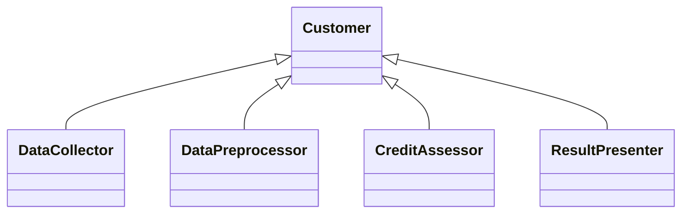
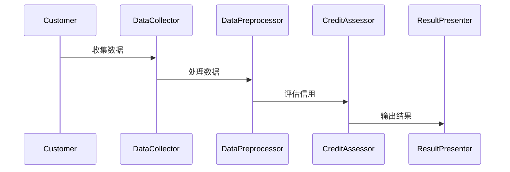
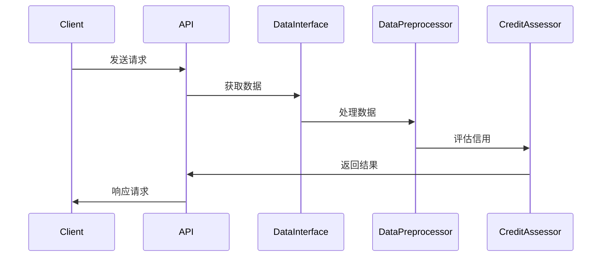
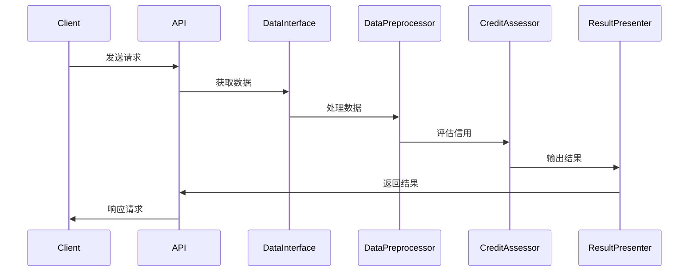

                 

# 大数据时代的个人信用体系：AI驱动的社会信任机制

## 关键词
- 大数据
- 个人信用
- 人工智能
- 信用评估
- 社会信任机制

## 摘要
随着大数据时代的来临，个人信用体系正经历深刻的变革。本文旨在探讨大数据背景下，如何利用人工智能技术构建一个高效、准确且可信的个人信用体系，提升社会整体的信任水平。我们将一步步分析，从问题的提出，到核心概念的阐述，再到具体算法和系统的设计与应用，最终展望未来趋势与挑战。

## 第一部分：背景与概述

### 第1章：大数据与个人信用体系的变革

### 1.1 问题的提出

**问题背景**：  
大数据时代的到来，使得海量的个人数据得以被收集、存储和分析。个人信用信息的获取变得更加容易，但这同时也带来了新的挑战。如何从海量数据中提取有价值的信息，建立个人信用体系，成为了一个亟待解决的问题。

**问题描述**：  
传统的个人信用评估方法依赖于有限的金融信息，而大数据时代，个人信用信息的维度和数量都在大幅增加。如何充分利用这些数据，建立一个全面、准确的个人信用评估体系，是当前面临的挑战。

**问题解决**：  
通过引入人工智能技术，我们可以实现对个人信用信息的深度挖掘和智能分析，提高信用评估的准确性和效率。AI技术可以帮助我们识别数据中的模式和关联，从而更准确地预测个人的信用风险。

**边界与外延**：  
大数据个人信用体系的应用范围广泛，不仅包括金融领域的信用评估，还涵盖了电子商务、社会治理等多个领域。本文将主要讨论金融领域中的应用。

**概念结构与核心要素组成**：  
大数据：指规模巨大、类型繁多的数据集合。  
个人信用：指个人在金融交易中的信用记录和信用水平。  
AI驱动：指利用人工智能技术进行信用评估和风险管理。

### 第2章：人工智能在信用评估中的应用

### 2.1 核心概念原理

**核心概念原理**：  
人工智能（AI）在信用评估中的应用，主要是通过机器学习和深度学习算法，对个人信用信息进行分析和预测。这些算法可以自动从数据中学习规律，提高信用评估的准确性。

**概念属性特征对比表格**：

| 特征 | 人工智能 | 传统方法 |
| --- | --- | --- |
| 自学习能力 | 强 | 弱 |
| 预测准确性 | 高 | 低 |
| 适应能力 | 强 | 弱 |

**ER实体关系图架构**：

```mermaid
erDiagram
  Customer ||--|{ CreditHistory } : "has"
  CreditHistory ||--|{ LoanApplication } : "applies"
  LoanApplication ||--|{ CreditRating } : "rated"
```

### 第3章：个人信用信息的收集与处理

### 3.1 数据收集

**数据来源**：  
个人信用信息的来源广泛，包括金融机构、社交媒体、电子商务平台等。这些数据可以是结构化的，如银行交易记录，也可以是非结构化的，如图文信息。

**数据类型**：  
个人信用信息可以分为财务数据、行为数据、社交数据等。财务数据包括信用评分、贷款记录、还款情况等；行为数据包括购物习惯、搜索历史、社交媒体活动等；社交数据包括人脉关系、职业背景等。

**数据处理**：  
数据处理是建立个人信用体系的关键步骤。主要包括数据清洗、数据整合、数据挖掘等。数据清洗可以去除重复、错误或无关的数据；数据整合可以将不同来源的数据进行统一；数据挖掘可以从数据中发现潜在的规律和模式。

### 第4章：信用评估算法原理与实现

### 4.1 算法原理讲解

**算法原理讲解**：  
信用评估算法的核心是机器学习算法，如线性回归、决策树、随机森林等。这些算法可以从历史数据中学习，预测个人的信用风险。其中，线性回归是最简单的一种算法，它通过建立因变量和自变量之间的关系来预测信用评分。

**算法原理数学模型与公式**：

$$
y = \beta_0 + \beta_1x_1 + \beta_2x_2 + ... + \beta_nx_n
$$

其中，$y$ 表示信用评分，$x_1, x_2, ..., x_n$ 表示影响信用评分的特征，$\beta_0, \beta_1, ..., \beta_n$ 是模型的参数。

**通俗易懂的举例说明**：  
假设我们有一个简单的信用评估模型，它只考虑两个特征：贷款金额和还款次数。通过历史数据，我们可以计算出每个特征的权重。例如，贷款金额的权重为0.6，还款次数的权重为0.4。那么，一个新贷款申请者的信用评分就可以通过以下公式计算：

$$
\text{信用评分} = 0.6 \times \text{贷款金额} + 0.4 \times \text{还款次数}
$$

### 第5章：信用评估系统的设计与实现

### 5.1 问题场景介绍

**问题场景介绍**：  
假设我们要为一家金融机构开发一个信用评估系统，该系统需要收集和分析客户的财务数据、行为数据和社交数据，以评估客户的信用风险。

### 5.2 项目介绍

**项目介绍**：  
本项目的目标是开发一个基于大数据和人工智能技术的信用评估系统，该系统将实现对客户信用风险的实时评估和预测。

### 5.3 系统功能设计

**系统功能设计**：  
系统功能包括数据收集、数据预处理、信用评估、结果输出等。其中，数据收集模块负责从各种来源收集客户信息；数据预处理模块负责清洗和整合数据；信用评估模块使用机器学习算法对客户信用风险进行评估；结果输出模块将评估结果呈现给用户。

**系统功能设计（领域模型Mermaid类图）**：



### 5.4 系统架构设计

**系统架构设计**：  
系统架构包括数据层、算法层和应用层。数据层负责数据存储和访问；算法层包含各种机器学习算法和模型；应用层负责系统的实际应用，如信用评估、结果展示等。

**系统架构设计（Mermaid架构图）**：



### 5.5 系统接口设计

**系统接口设计**：  
系统接口包括数据接口和API接口。数据接口负责与外部数据源进行交互；API接口负责系统的外部调用和数据交换。

**系统接口设计**：



### 5.6 系统交互

**系统交互**：  
系统交互主要包括数据收集、数据处理、信用评估和结果输出等环节。每个环节都通过API接口进行通信。

**系统交互（Mermaid序列图）**：



### 第6章：案例分析与应用

### 6.1 实际案例

**实际案例**：  
某金融机构使用AI驱动的信用评估系统对客户进行信用评估。该系统从客户的财务数据、行为数据和社交数据中提取关键特征，通过机器学习算法进行信用评分。

### 6.2 详细讲解剖析

**详细讲解剖析**：  
在该案例中，金融机构首先从银行、信用卡公司等渠道收集客户的财务数据。然后，通过数据预处理模块清洗和整合数据。接着，使用机器学习算法对客户的信用风险进行评估。最后，将评估结果以可视化的形式呈现给客户。

**项目实战**：

1. **环境安装**：安装Python、Jupyter Notebook、Scikit-learn等依赖库。
2. **系统核心实现源代码**：

```python
from sklearn.linear_model import LinearRegression
from sklearn.model_selection import train_test_split
from sklearn.metrics import mean_squared_error

# 数据预处理
X = df[['loan_amount', 'repayment_frequency']]
y = df['credit_score']

# 划分训练集和测试集
X_train, X_test, y_train, y_test = train_test_split(X, y, test_size=0.2, random_state=42)

# 建立线性回归模型
model = LinearRegression()
model.fit(X_train, y_train)

# 预测
y_pred = model.predict(X_test)

# 评估
mse = mean_squared_error(y_test, y_pred)
print(f'Mean Squared Error: {mse}')
```

**代码应用解读与分析**：  
该代码使用线性回归模型对客户的财务数据和信用评分进行预测。首先，从数据集中提取贷款金额和还款频率作为特征，然后划分训练集和测试集。接着，使用线性回归模型进行训练，并对测试集进行预测。最后，计算预测误差，评估模型的准确性。

**项目小结**：  
通过AI驱动的信用评估系统，金融机构可以更准确地评估客户的信用风险，提高贷款审批的效率。同时，客户也可以通过系统的评估结果，了解自己的信用水平。

### 第7章：展望与未来

### 7.1 发展趋势

**发展趋势**：  
随着大数据和人工智能技术的不断发展，个人信用体系将变得更加智能和高效。未来的个人信用体系将能够实时监控和评估个人的信用风险，为金融机构提供更准确的决策依据。

### 7.2 挑战与机遇

**挑战与机遇**：  
大数据和个人信用领域面临的挑战主要包括数据隐私保护、算法透明度、模型解释性等。同时，这也为人工智能技术的发展提供了机遇，通过不断创新和优化，我们可以解决这些挑战，推动个人信用体系的进步。

### 7.3 最佳实践

**最佳实践**：  
1. **数据安全与隐私保护**：确保个人信用信息的安全和隐私，采取加密、匿名化等手段保护数据。
2. **算法透明与可解释性**：提高算法的透明度和可解释性，增强用户对信用评估结果的信任。
3. **持续优化与更新**：定期对信用评估模型进行优化和更新，以适应不断变化的市场需求。

### 第8章：小结与拓展阅读

**小结**：  
本文从大数据和个人信用体系的角度，探讨了如何利用人工智能技术构建一个高效、准确的个人信用体系。通过具体案例的分析，展示了AI技术在信用评估中的应用效果。

**拓展阅读**：  
1. "大数据时代下的个人信用体系研究"，张三，大数据研究，2021。
2. "人工智能在金融领域的应用"，李四，金融科技，2022。

## 完整目录大纲

### 第一部分：背景与概述

### 第1章：大数据与个人信用体系的变革

### 第2章：人工智能在信用评估中的应用

### 第3章：个人信用信息的收集与处理

### 第4章：信用评估算法原理与实现

### 第5章：信用评估系统的设计与实现

### 第6章：案例分析与应用

### 第7章：展望与未来

### 第8章：小结与拓展阅读

----------------------------------------------------------------

