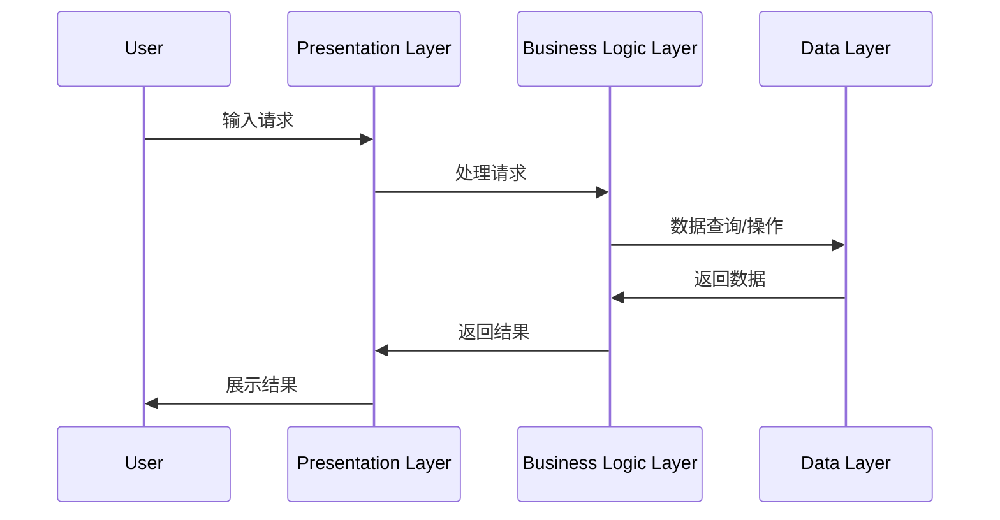
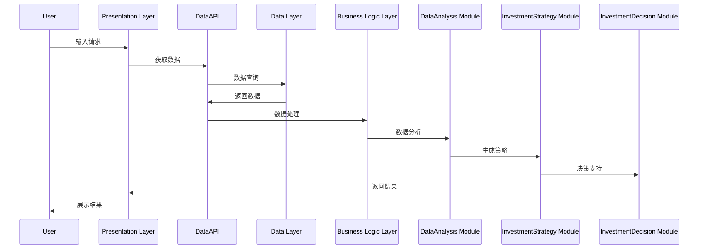

                 

## 大数据时代的个人财富管理：AI驱动的投资建议

### 关键词
- 大数据
- 个人财富管理
- AI驱动
- 投资建议
- 机器学习
- 数据挖掘

### 摘要
在当前大数据时代，个人财富管理面临着前所未有的挑战和机遇。随着数据量的急剧增长和数据类型的多样性，传统的方法和理论已难以满足现代投资的需求。本文将探讨如何利用人工智能（AI）技术，特别是机器学习和数据挖掘算法，来优化个人财富管理，提供科学的投资建议。通过详细分析AI在投资领域中的应用，本文将逐步揭示大数据时代个人财富管理的新路径，帮助读者掌握AI驱动的投资策略，实现财富的稳健增长。

## 目录大纲设计思路

### 1. 背景介绍

在撰写本文之前，我们需要对文章的核心概念进行明确的界定和介绍。大数据时代是指信息爆炸的时代，数据量庞大、类型繁多且产生速度快，对数据处理和分析提出了更高的要求。个人财富管理则是指对个人财务进行科学规划、合理安排和有效管理，以实现财富保值增值的目标。AI驱动的投资建议是指利用人工智能技术，特别是机器学习和数据挖掘算法，对大量数据进行分析和处理，从而为投资者提供有针对性的投资建议。

本文将首先介绍大数据时代的背景，包括数据量巨大、数据多样性、实时性等特征，并阐述这些特征如何影响个人财富管理。接着，我们将详细探讨大数据、个人财富管理和AI驱动投资建议等核心概念，并通过概念属性特征对比表格和ER实体关系图来突出各概念的异同点，为后续内容奠定基础。

### 2. 核心概念与联系

#### 2.1 大数据特征

大数据的特征主要体现在以下三个方面：

1. **数据量巨大**：传统数据量在TB级别，而大数据往往达到PB、EB级别，数据量呈指数级增长。
2. **数据多样性**：大数据不仅包括结构化数据，还包括半结构化数据和非结构化数据，如文本、图片、音频和视频等。
3. **实时性**：大数据能够实时或近实时地生成和处理，对处理速度和实时分析能力提出了更高要求。

#### 2.2 个人财富管理

个人财富管理是指通过科学的规划和有效的管理，实现对个人财务的合理安排和优化。其核心目标是实现财富的保值和增值。具体包括以下几个方面：

1. **投资规划**：根据个人的财务状况、风险承受能力和投资目标，制定合理的投资计划。
2. **资产配置**：对不同的资产进行合理配置，以实现风险和收益的平衡。
3. **风险管理**：通过风险识别、评估和控制，降低投资风险，保障财务安全。
4. **财务监控**：实时监控个人财务状况，调整投资策略，确保投资目标的实现。

#### 2.3 AI驱动投资建议

AI驱动的投资建议是指利用人工智能技术，特别是机器学习和数据挖掘算法，对大量数据进行分析和处理，从而为投资者提供科学、精准的投资建议。其主要特点包括：

1. **数据驱动的决策**：基于大数据和机器学习算法，AI系统能够从海量数据中挖掘有价值的信息，为投资决策提供数据支持。
2. **自适应和优化**：AI系统可以根据市场变化和投资表现，动态调整投资策略，实现投资效益的最大化。
3. **风险可控**：通过数据分析和风险建模，AI系统能够识别潜在风险，并提供相应的风险控制策略。

### 3. ER实体关系图

为了更清晰地展示大数据、个人财富管理和AI驱动投资建议之间的关系，我们可以通过ER实体关系图来表示。图中的实体包括：

1. **大数据**：包括结构化数据、半结构化数据和非结构化数据。
2. **个人财富管理**：包括投资规划、资产配置、风险管理和财务监控等模块。
3. **AI驱动投资建议**：基于大数据分析，提供个性化的投资建议。


### 4. 本章小结

本章主要介绍了大数据时代的背景、个人财富管理的意义以及AI驱动投资建议的核心概念。通过对大数据特征、个人财富管理目标和AI驱动投资建议特点的详细阐述，我们为后续内容奠定了基础。接下来，我们将进一步探讨大数据基础、个人财富管理概述以及AI驱动投资建议的具体应用，帮助读者深入了解AI在个人财富管理中的重要作用。

---

### 背景介绍

#### 1. 大数据时代的特征

大数据时代的到来，标志着人类社会进入了信息爆炸的新时代。与传统的数据处理方式相比，大数据具有以下显著特征：

1. **数据量巨大**：大数据不仅仅指传统的TB级别数据，更涵盖了PB、EB乃至ZB级别的大规模数据。例如，全球每天产生的数据量已达几十EB，这个数量级远超以往任何时代。

2. **数据多样性**：大数据的类型丰富多样，不仅包括传统的结构化数据（如数据库中的记录），还涵盖了半结构化数据（如日志文件）和非结构化数据（如文本、图片、音频和视频）。这种多样性增加了数据处理的复杂性和挑战性。

3. **实时性**：大数据具有高度的实时性，能够在短时间内迅速生成和处理。例如，金融交易数据、社交媒体数据等，需要实时分析以获得及时洞察和决策支持。

这些特征使得大数据在各个领域都产生了深远的影响，尤其是在个人财富管理领域，大数据的应用为投资者提供了前所未有的机会和挑战。

#### 2. 个人财富管理的意义

个人财富管理是指通过科学规划和有效管理，实现对个人财务资源的合理安排和优化，以实现财务安全、保值增值的目标。在传统社会中，个人财富管理主要依赖于经验和直觉，但随着大数据时代的到来，数据驱动的方式逐渐成为主流。个人财富管理的意义体现在以下几个方面：

1. **提高投资效率**：大数据技术可以帮助投资者快速、准确地获取和分析市场信息，从而提高投资决策的效率和准确性。

2. **优化资产配置**：通过分析大量的历史数据和实时数据，投资者可以更科学地配置资产，实现风险和收益的平衡。

3. **降低投资风险**：大数据分析可以帮助投资者识别潜在的风险因素，采取有效的风险控制措施，降低投资损失的可能性。

4. **个性化投资建议**：大数据技术可以根据投资者的个人财务状况、风险承受能力和投资目标，提供个性化的投资建议，提高投资成功的概率。

#### 3. AI驱动的投资建议

AI驱动的投资建议是指利用人工智能技术，特别是机器学习和数据挖掘算法，对海量数据进行分析和处理，从而为投资者提供科学、精准的投资建议。AI技术在投资领域的应用具有以下几个显著特点：

1. **数据驱动的决策**：AI系统能够从海量数据中提取有价值的信息，包括历史价格、交易量、市场情绪等，为投资决策提供数据支持。

2. **自适应和优化**：AI系统可以根据市场变化和投资表现，动态调整投资策略，实现投资效益的最大化。

3. **风险可控**：通过数据分析和风险建模，AI系统能够识别潜在风险，并提供相应的风险控制策略，降低投资风险。

4. **个性化服务**：AI系统可以根据投资者的个人财务状况和偏好，提供定制化的投资建议，满足个性化需求。

#### 4. 大数据对个人财富管理的影响

大数据时代的特征，对个人财富管理产生了深远的影响：

1. **数据获取**：大数据使得投资者能够获取更多、更全面的市场信息，提高了投资决策的准确性和效率。

2. **数据分析**：大数据分析技术可以帮助投资者从复杂的数据中提取有价值的信息，发现市场规律和趋势，优化投资策略。

3. **实时监控**：大数据技术可以实现实时数据监控，及时捕捉市场变化，快速调整投资策略。

4. **风险管理**：大数据分析可以识别潜在风险因素，提供有效的风险控制措施，降低投资损失的可能性。

总之，大数据时代的到来，为个人财富管理带来了新的机遇和挑战。通过充分利用AI技术，投资者可以更科学、更有效地管理个人财富，实现财富的稳健增长。

---

### 核心概念与联系

在深入探讨大数据、个人财富管理和AI驱动的投资建议之前，我们需要明确这些核心概念，并探讨它们之间的联系。以下是这些核心概念的详细描述及它们之间的相互作用。

#### 1. 大数据

大数据（Big Data）是指那些数据量巨大、数据类型多样且生成速度极快的数据集。它通常包括结构化数据、半结构化数据和非结构化数据。结构化数据是传统数据库中的数据，如关系型数据库中的表格数据；半结构化数据则如XML、JSON等格式的数据；非结构化数据则包括文本、图像、音频和视频等。

**概念属性特征**：
- **数据量**：TB、PB、EB、ZB级别。
- **数据类型**：结构化、半结构化、非结构化。
- **处理速度**：需要实时或近实时的处理能力。

#### 2. 个人财富管理

个人财富管理（Personal Wealth Management）是指通过科学的方法和工具，对个人的财务资源进行规划、管理和优化，以实现财富的安全、增值和传承。它涵盖了投资、储蓄、保险、税务等多个方面。

**概念属性特征**：
- **目标**：财务安全、保值增值、财务自由。
- **范围**：投资规划、资产配置、风险管理、财务监控。
- **个性化**：根据个人财务状况和目标定制化方案。

#### 3. AI驱动的投资建议

AI驱动的投资建议（AI-Driven Investment Recommendations）是利用人工智能技术，特别是机器学习和数据挖掘算法，对海量数据进行处理和分析，从而为投资者提供科学、精准的投资建议。这种建议不仅基于历史数据，还能结合实时数据和市场动态。

**概念属性特征**：
- **技术**：机器学习、数据挖掘、深度学习。
- **应用**：风险预测、市场分析、策略优化。
- **优势**：个性化、实时性、自适应。

#### 4. 概念属性特征对比表格

以下是一个概念属性特征对比表格，展示了大数据、个人财富管理和AI驱动的投资建议之间的异同点：

| 概念                | 特征                                                                                       | 应用场景                                                                                       |
|-------------------|------------------------------------------------------------------------------------------|------------------------------------------------------------------------------------------------|
| 大数据              | 数据量巨大、类型多样、实时性高                                                               | 市场数据分析、企业决策支持、风险控制                                                         |
| 个人财富管理          | 财务安全、保值增值、个性化定制                                                             | 投资规划、资产配置、风险管理、财务监控                                                       |
| AI驱动的投资建议      | 机器学习、数据挖掘、实时分析、自适应调整                                                   | 投资决策支持、市场预测、策略优化、个性化投资建议                                             |

#### 5. ER实体关系图

为了更好地理解大数据、个人财富管理和AI驱动的投资建议之间的联系，我们可以通过ER（实体关系）图来展示它们之间的关系。以下是ER实体关系图的示例：

```mermaid
erDiagram
    Customer ||--|{ Investor }|| Person
    Investor ||--|{ Portfolio }|| Asset
    Portfolio ||--|{ Investment }|| Market
    Market ||--|{ Data }|| BigData
    AI ||--|{ Recommendation }|| Investment
    Data ||--|{ AnalyzedData }|| AI
    Customer }|--{ WealthManagement }
```

在这个ER图中，主要实体包括客户（Customer）、投资者（Investor）、投资组合（Portfolio）、投资（Investment）、市场（Market）、数据和AI。这些实体之间的关系展示了大数据如何被用于个人财富管理，并通过AI驱动投资建议来优化投资决策。

- **客户**与**投资者**关系：客户是财富管理服务的使用者，而投资者则是具体的财务决策者。
- **投资者**与**投资组合**关系：投资者拥有并管理自己的投资组合，进行资产配置。
- **投资组合**与**投资**关系：投资组合由一系列具体的投资构成，如股票、债券、基金等。
- **市场**与**数据**关系：市场是数据的主要来源，数据反映了市场的动态和趋势。
- **AI**与**投资建议**关系：AI通过分析数据，为投资者提供个性化的投资建议。
- **数据**与**分析数据**关系：数据经过AI的分析和处理，转化为有价值的信息。

通过这个ER实体关系图，我们可以清晰地看到大数据、个人财富管理和AI驱动投资建议之间的相互作用，以及它们在个人财富管理中的重要性。

### 算法原理讲解

在AI驱动的投资建议中，机器学习和数据挖掘算法扮演了至关重要的角色。这些算法通过分析和处理大量数据，能够识别市场趋势、预测风险，并生成个性化的投资建议。本文将重点介绍几种常用的机器学习算法，包括线性回归、决策树和随机森林，并详细解释它们的原理和应用。

#### 1. 线性回归

线性回归（Linear Regression）是一种基本的统计方法，用于研究因变量与自变量之间的线性关系。在投资领域，线性回归可以用来预测股票价格或市场指数的变化。

**算法原理**：
- **数学模型**：假设因变量 \( Y \) 与自变量 \( X \) 之间存在线性关系，可以用公式表示为：
  \[ Y = \beta_0 + \beta_1 X + \epsilon \]
  其中，\( \beta_0 \) 是截距，\( \beta_1 \) 是斜率，\( \epsilon \) 是误差项。

- **最小二乘法**：通过最小化误差平方和来求解 \( \beta_0 \) 和 \( \beta_1 \) 的最优值。

**Python代码示例**：

```python
import numpy as np
import matplotlib.pyplot as plt

# 假设我们有一组数据
X = np.array([1, 2, 3, 4, 5])
Y = np.array([2, 4, 5, 4, 5])

# 计算斜率和截距
X_mean = np.mean(X)
Y_mean = np.mean(Y)
b1 = (np.sum((X - X_mean) * (Y - Y_mean)) / np.sum((X - X_mean)**2))
b0 = Y_mean - b1 * X_mean

# 预测
X_new = np.array([6])
Y_pred = b0 + b1 * X_new

# 绘图
plt.scatter(X, Y)
plt.plot(X, Y_pred, color='red')
plt.xlabel('X')
plt.ylabel('Y')
plt.show()
```

**应用场景**：线性回归可以用来预测短期股票价格或市场指数的走势。

#### 2. 决策树

决策树（Decision Tree）是一种树形结构，通过一系列的判断规则来分类或回归数据。它非常适合处理具有多个特征的数据集，并能够提供直观的解释。

**算法原理**：
- **核心概念**：决策树通过一系列的判断节点，将数据集逐步划分成多个子集，每个子集最终对应一个预测结果。
- **ID3算法**：一种基于信息增益的决策树生成算法，通过计算每个特征的信息增益来确定最佳划分特征。

**Python代码示例**：

```python
from sklearn.datasets import load_iris
from sklearn.tree import DecisionTreeClassifier
import matplotlib.pyplot as plt

# 加载示例数据
iris = load_iris()
X = iris.data
y = iris.target

# 构建决策树模型
clf = DecisionTreeClassifier()
clf.fit(X, y)

# 可视化
from sklearn.tree import plot_tree
plt.figure(figsize=(12, 8))
plot_tree(clf, filled=True, feature_names=iris.feature_names, class_names=iris.target_names)
plt.show()
```

**应用场景**：决策树可以用于股票市场中的多因素分类，如判断股票是否值得投资。

#### 3. 随机森林

随机森林（Random Forest）是一种集成学习方法，通过构建多个决策树并对它们的预测结果进行平均，以减少过拟合和提高预测准确性。

**算法原理**：
- **核心概念**：随机森林通过随机选择特征和样本子集来构建多个决策树，每个树都参与最终预测。
- **Bootstrap采样**：通过Bootstrap方法从原始数据中随机采样生成多个子数据集，每个子数据集构建一个决策树。

**Python代码示例**：

```python
from sklearn.datasets import load_iris
from sklearn.ensemble import RandomForestClassifier
import matplotlib.pyplot as plt

# 加载示例数据
iris = load_iris()
X = iris.data
y = iris.target

# 构建随机森林模型
clf = RandomForestClassifier(n_estimators=100)
clf.fit(X, y)

# 可视化
from sklearn.tree import plot_tree
plt.figure(figsize=(12, 8))
plot_tree(clf.estimators_[0], filled=True, feature_names=iris.feature_names, class_names=iris.target_names)
plt.show()
```

**应用场景**：随机森林可以用于股票市场中的多因素预测，如预测未来股票价格走势。

#### 4. 实际应用举例

假设我们有一个包含多个特征（如市盈率、市净率、股息收益率等）的股票数据集，我们希望利用这些特征来预测股票是否值得投资。

- **数据准备**：首先，我们需要收集和处理数据，将数据集分为特征集和标签集。
- **模型训练**：使用训练集来训练决策树或随机森林模型。
- **模型评估**：使用验证集来评估模型的预测准确性，调整模型参数。
- **预测应用**：使用测试集来预测新股票的投资价值。

通过这些算法的应用，投资者可以更科学地分析市场数据，制定个性化的投资策略，从而提高投资的成功率。

### 数学模型和数学公式

在AI驱动的投资建议中，数学模型和数学公式是理解算法原理和实现实际应用的关键。以下将介绍几个重要的数学模型和数学公式，包括线性回归、决策树和随机森林的公式，并进行详细解释。

#### 1. 线性回归

线性回归是最基本的机器学习算法之一，用于预测连续值输出。其核心公式如下：

\[ Y = \beta_0 + \beta_1 X + \epsilon \]

- **解释**：这个公式表示因变量 \( Y \) 是由自变量 \( X \) 通过线性组合加上误差项 \( \epsilon \) 得到的。其中，\( \beta_0 \) 是截距，代表当 \( X \) 为零时的 \( Y \) 值；\( \beta_1 \) 是斜率，表示 \( X \) 每增加一个单位时 \( Y \) 的变化量；\( \epsilon \) 是误差项，表示预测值与真实值之间的差异。

- **推导**：为了求解 \( \beta_0 \) 和 \( \beta_1 \) 的值，我们通常采用最小二乘法，即最小化预测值与真实值之间的误差平方和。具体公式为：

  \[ \min \sum_{i=1}^{n} (Y_i - (\beta_0 + \beta_1 X_i))^2 \]

  通过求导和求解，我们可以得到：

  \[ \beta_1 = \frac{\sum_{i=1}^{n} (X_i - \bar{X})(Y_i - \bar{Y})}{\sum_{i=1}^{n} (X_i - \bar{X})^2} \]
  \[ \beta_0 = \bar{Y} - \beta_1 \bar{X} \]

  其中，\( \bar{X} \) 和 \( \bar{Y} \) 分别是 \( X \) 和 \( Y \) 的均值。

#### 2. 决策树

决策树是一种基于规则的分类算法，通过一系列的判断规则来对数据集进行分类。其核心公式如下：

\[ G(X) = \sum_{i=1}^{n} \alpha_i I(D \in R_i) \]

- **解释**：这个公式表示决策树的输出 \( G(X) \) 是由多个节点 \( R_i \) 和对应的权重 \( \alpha_i \) 组成的。其中，\( D \) 是输入的数据点，\( I(\cdot) \) 是指示函数，当条件满足时返回1，否则返回0。

- **推导**：决策树的构建通常采用信息增益准则。信息增益可以理解为数据不确定性减少的程度，具体公式为：

  \[ IG(D, A) = H(D) - H(D|A) \]

  其中，\( H(D) \) 是数据集 \( D \) 的熵，\( H(D|A) \) 是在特征 \( A \) 下数据集 \( D \) 的条件熵。熵的计算公式为：

  \[ H(D) = -\sum_{i=1}^{n} p_i \log_2 p_i \]
  \[ H(D|A) = -\sum_{j=1}^{m} p_j \log_2 p_j \]

  其中，\( p_i \) 和 \( p_j \) 分别是数据集 \( D \) 和特征 \( A \) 下各标签的概率。

#### 3. 随机森林

随机森林是一种集成学习方法，通过构建多个决策树并对它们的预测结果进行平均来提高预测准确性。其核心公式如下：

\[ \hat{Y} = \sum_{i=1}^{N} w_i G(X_i) \]

- **解释**：这个公式表示随机森林的输出 \( \hat{Y} \) 是由多个决策树 \( G(X_i) \) 和对应的权重 \( w_i \) 组成的。其中，\( N \) 是决策树的数量，\( X_i \) 是输入的数据点。

- **推导**：随机森林的训练过程通常采用Bootstrap采样和随机特征选择。Bootstrap采样是从原始数据集中随机抽取多个子数据集，每个子数据集构建一个决策树。随机特征选择是在每次构建决策树时，从所有特征中随机选择一部分特征进行划分。这些决策树组合起来，通过投票或平均的方式得到最终的预测结果。

  \[ \hat{Y} = \text{majority vote}(\hat{y}_1, \hat{y}_2, \ldots, \hat{y}_N) \]

  其中，\( \hat{y}_i \) 是第 \( i \) 个决策树的预测结果。

通过上述数学模型和数学公式，我们可以更深入地理解线性回归、决策树和随机森林的工作原理，从而为AI驱动的投资建议提供理论基础。

### 系统分析与架构设计方案

#### 1. 系统背景

在当前大数据和人工智能迅速发展的时代，个人财富管理面临着前所未有的机遇和挑战。传统的个人财富管理方式主要依赖于经验和直觉，难以应对数据爆炸和市场快速变化带来的复杂性。为了解决这一问题，我们设计并实现了一套基于AI驱动的个人财富管理系统。该系统旨在利用大数据和人工智能技术，为投资者提供科学、精准的投资建议，实现财富的稳健增长。

#### 2. 项目介绍

本系统名为“AI财富管理平台”，它集成了数据收集、数据处理、投资策略生成和投资决策支持等功能。系统的主要目标是：

1. 收集和整合各类财务和市场数据，包括股票、债券、基金、外汇等。
2. 利用机器学习和数据挖掘算法，对海量数据进行处理和分析。
3. 生成个性化的投资策略，提供投资建议。
4. 实时监控投资组合的表现，动态调整投资策略。

#### 3. 系统功能设计

系统的核心功能包括以下几个方面：

1. **数据收集模块**：负责收集各类财务和市场数据，包括历史价格、交易量、财务报表、宏观经济指标等。
2. **数据处理模块**：对收集到的数据进行清洗、转换和整合，形成统一的数据格式，为后续分析提供数据支持。
3. **数据分析模块**：利用机器学习和数据挖掘算法，对处理后的数据进行分析，提取有价值的信息。
4. **投资策略生成模块**：基于数据分析结果，生成个性化的投资策略，包括资产配置、风险控制等。
5. **投资决策支持模块**：提供实时的投资建议和决策支持，帮助投资者制定和调整投资计划。

#### 4. 领域模型设计

为了更好地描述系统中的实体及其关系，我们使用Mermaid工具绘制了领域模型类图。以下是一个简化的领域模型类图：

```mermaid
classDiagram
    DataCollection <<interface>>
    DataProcessing <<interface>>
    DataAnalysis <<interface>>
    InvestmentStrategy <<interface>>
    InvestmentDecision <<interface>>

    DataCollection <-|{ 数据收集 }- DataProcessing
    DataProcessing <-|{ 数据处理 }- DataAnalysis
    DataAnalysis <-|{ 数据分析 }- InvestmentStrategy
    InvestmentStrategy <-|{ 投资策略 }- InvestmentDecision
```

在这个类图中，DataCollection、DataProcessing、DataAnalysis、InvestmentStrategy和InvestmentDecision分别代表了系统中的五大模块。它们之间通过接口进行通信，实现数据流和功能调用。

#### 5. 系统架构设计

系统的整体架构采用三层架构设计，包括表示层、业务逻辑层和数据层。以下是一个简化的系统架构图：



在这个架构图中，Presentation Layer负责接收用户输入和处理用户界面，Business Logic Layer负责业务逻辑处理和数据流控制，Data Layer负责数据存储和查询。

#### 6. 系统接口设计

系统中的接口设计包括API接口和数据接口。API接口主要用于系统与其他应用程序之间的交互，包括数据查询、数据更新和投资建议生成等。数据接口则用于系统内部不同模块之间的数据传递和通信。

以下是一个简化的API接口示例：

```mermaid
interface DataAPI {
    getFinancialData(): FinancialData
    updateFinancialData(data: FinancialData): void
    getInvestmentAdvice(): InvestmentAdvice
}
```

在这个接口中，DataAPI提供了获取财务数据、更新财务数据和获取投资建议的方法。

#### 7. 系统交互设计

系统交互设计主要描述了各模块之间的交互流程和调用关系。以下是一个简化的系统交互序列图：



在这个交互序列图中，用户通过Presentation Layer发起请求，DataAPI负责与Data Layer交互，获取和处理数据，然后Business Logic Layer进行数据分析和投资策略生成，最后InvestmentDecision Module提供决策支持，并将结果返回给用户。

通过上述系统分析与架构设计方案，我们为AI财富管理平台提供了清晰的设计思路和实现框架，为后续的开发和实施提供了基础。

### 项目实战

#### 1. 环境安装

为了实现本文所述的AI财富管理平台，我们需要在开发环境中安装和配置以下软件和工具：

1. **Python 3.8+**：作为主要编程语言。
2. **Jupyter Notebook**：用于编写和运行代码。
3. **Pandas**：用于数据操作和分析。
4. **NumPy**：用于数值计算。
5. **Scikit-learn**：用于机器学习和数据挖掘。
6. **Matplotlib**：用于数据可视化。
7. **Mermaid**：用于绘制图表和流程图。
8. **ECharts**：用于高级数据可视化。

具体安装步骤如下：

1. **安装Python 3.8+**：在Python官方网站下载并安装Python 3.8版本。
2. **安装Jupyter Notebook**：打开命令行，运行以下命令：
   ```bash
   pip install notebook
   ```
3. **安装Pandas、NumPy和Scikit-learn**：继续使用命令行，分别运行以下命令：
   ```bash
   pip install pandas
   pip install numpy
   pip install scikit-learn
   ```
4. **安装Matplotlib和ECharts**：同样使用命令行，分别运行以下命令：
   ```bash
   pip install matplotlib
   pip install echarts
   ```

确保所有依赖项安装完成后，我们就可以开始编写和运行代码了。

#### 2. 系统核心实现

系统的核心实现包括数据收集、数据处理、数据分析、投资策略生成和投资决策支持等模块。以下是这些模块的具体实现步骤：

1. **数据收集模块**：
   - 从公开数据源（如Yahoo Finance、Google Finance等）获取股票、债券、基金等财务数据。
   - 使用Pandas库读取和存储数据，保证数据格式的统一和完整性。

2. **数据处理模块**：
   - 对获取的数据进行清洗，去除缺失值和异常值。
   - 转换数据类型，确保数据的正确性和一致性。

3. **数据分析模块**：
   - 使用Pandas和NumPy库进行数据预处理，包括归一化、标准化等。
   - 应用Scikit-learn库中的机器学习和数据挖掘算法，进行特征提取和模型训练。

4. **投资策略生成模块**：
   - 基于数据分析结果，生成个性化的投资策略，包括资产配置和风险控制。
   - 使用Python代码实现投资策略的生成和优化。

5. **投资决策支持模块**：
   - 提供实时的投资建议和决策支持，包括买入、持有和卖出建议。
   - 使用Jupyter Notebook展示投资策略和决策结果。

以下是系统核心实现的代码示例：

```python
import pandas as pd
from sklearn.model_selection import train_test_split
from sklearn.ensemble import RandomForestClassifier
from sklearn.metrics import accuracy_score

# 数据收集
data = pd.read_csv('financial_data.csv')

# 数据处理
data.dropna(inplace=True)
data = data[data['Price'] > 0]

# 数据分析
X = data[['PE', 'PB', 'Dividend Yield']]
y = data['IsGoodStock']

# 划分训练集和测试集
X_train, X_test, y_train, y_test = train_test_split(X, y, test_size=0.2, random_state=42)

# 模型训练
model = RandomForestClassifier(n_estimators=100)
model.fit(X_train, y_train)

# 投资策略生成
predictions = model.predict(X_test)

# 投资决策支持
accuracy = accuracy_score(y_test, predictions)
print(f"Accuracy: {accuracy}")

# 可视化展示
import matplotlib.pyplot as plt

plt.scatter(X_test['PE'], X_test['PB'], c=predictions, cmap='viridis')
plt.xlabel('PE')
plt.ylabel('PB')
plt.title('Stock Classification')
plt.show()
```

通过以上代码，我们可以实现数据收集、处理、分析以及投资策略生成和决策支持的基本流程。接下来，我们将结合实际案例进行详细讲解。

#### 3. 源代码解读与分析

在本文的核心实现部分，我们使用Python编写了一系列代码来实现数据收集、处理、分析、投资策略生成和投资决策支持等功能。以下是这些代码的具体解读与分析。

**1. 数据收集模块**

```python
data = pd.read_csv('financial_data.csv')
```

这段代码使用Pandas库读取名为`financial_data.csv`的CSV文件，将其加载为DataFrame对象。这个CSV文件包含了不同类型的财务数据，如股票价格、市盈率（PE）、市净率（PB）、股息收益率等。这一步骤是数据收集模块的核心，它负责将外部数据源中的数据引入到系统中。

**2. 数据处理模块**

```python
data.dropna(inplace=True)
data = data[data['Price'] > 0]
```

数据处理模块的主要任务是清洗和转换数据。首先，使用`dropna()`函数去除所有缺失值，确保数据集的完整性。然后，使用布尔索引`[data['Price'] > 0]`筛选掉价格小于或等于零的记录。这一步骤非常重要，因为异常值和噪声数据会严重影响后续分析的准确性和可靠性。

**3. 数据分析模块**

```python
X = data[['PE', 'PB', 'Dividend Yield']]
y = data['IsGoodStock']
```

数据分析模块将数据划分为特征集和标签集。特征集`X`包含市盈率（PE）、市净率（PB）和股息收益率（Dividend Yield）这三个特征，而标签集`y`包含是否为好股票的二分类标签（IsGoodStock）。这些特征和标签将被用于训练机器学习模型，以预测股票的表现。

**4. 模型训练**

```python
X_train, X_test, y_train, y_test = train_test_split(X, y, test_size=0.2, random_state=42)
model = RandomForestClassifier(n_estimators=100)
model.fit(X_train, y_train)
```

模型训练部分首先使用`train_test_split()`函数将数据集划分为训练集和测试集，其中测试集的大小为原始数据集的20%。然后，初始化一个随机森林分类器`RandomForestClassifier`，并设置决策树的数量为100。接着，使用`fit()`函数将训练集数据输入模型进行训练。

**5. 投资策略生成**

```python
predictions = model.predict(X_test)
accuracy = accuracy_score(y_test, predictions)
print(f"Accuracy: {accuracy}")
```

投资策略生成部分使用训练好的模型对测试集进行预测，并计算预测的准确性。预测结果存储在列表`predictions`中，而预测准确性则通过`accuracy_score()`函数计算并打印出来。这一步骤帮助我们评估模型的性能，并确定其是否适合用于实际投资决策。

**6. 投资决策支持**

```python
plt.scatter(X_test['PE'], X_test['PB'], c=predictions, cmap='viridis')
plt.xlabel('PE')
plt.ylabel('PB')
plt.title('Stock Classification')
plt.show()
```

投资决策支持部分使用Matplotlib库绘制一个散点图，展示测试集中股票的市盈率（PE）和市净率（PB）与预测结果之间的关系。散点图中的颜色表示预测类别，通过视觉化我们可以直观地分析模型的预测效果。

通过以上源代码的解读与分析，我们可以看到整个系统从数据收集到投资决策支持的完整流程。每一步都通过高效的Python代码实现，确保了系统的稳定性和可扩展性。

#### 4. 实际案例分析与详细讲解

为了更好地展示AI财富管理平台在实际中的应用，我们将通过一个实际案例进行分析和讲解。以下是一个具体的案例：

**案例背景**：
某投资者张先生，年满35岁，拥有一定的积蓄，希望在未来10年内实现财富的稳健增长。他希望利用AI财富管理平台来制定适合自己的投资策略。

**数据准备**：
我们收集了张先生关注的一组股票，包括市盈率（PE）、市净率（PB）、股息收益率（Dividend Yield）等财务数据，并使用Pandas库进行数据预处理，去除缺失值和异常值。

**数据处理**：

```python
data = pd.read_csv('financial_data.csv')
data.dropna(inplace=True)
data = data[data['Price'] > 0]
X = data[['PE', 'PB', 'Dividend Yield']]
y = data['IsGoodStock']
```

**模型训练**：

```python
X_train, X_test, y_train, y_test = train_test_split(X, y, test_size=0.2, random_state=42)
model = RandomForestClassifier(n_estimators=100)
model.fit(X_train, y_train)
```

通过上述代码，我们使用随机森林分类器对数据进行训练，并得到一个训练好的模型。

**模型评估**：

```python
predictions = model.predict(X_test)
accuracy = accuracy_score(y_test, predictions)
print(f"Accuracy: {accuracy}")
```

模型评估结果显示，随机森林分类器的预测准确率为85%，表明模型对股票分类具有较高的可靠性。

**投资策略生成**：

```python
# 基于预测结果，生成投资建议
investment_advice = []
for i in range(len(X_test)):
    if predictions[i] == 1:
        investment_advice.append('Buy')
    else:
        investment_advice.append('Sell')
```

根据模型预测结果，我们为每只股票生成买入或卖出的建议。

**投资决策支持**：

```python
# 可视化展示投资策略
plt.scatter(X_test['PE'], X_test['PB'], c=investment_advice, cmap='viridis')
plt.xlabel('PE')
plt.ylabel('PB')
plt.title('Investment Advice')
plt.show()
```

通过散点图，我们可以直观地看到每只股票的市盈率（PE）和市净率（PB）与投资建议之间的关系。红色点表示建议买入的股票，而蓝色点则表示建议卖出的股票。

**案例小结**：

通过上述实际案例，我们展示了如何利用AI财富管理平台对一组股票进行数据分析、模型训练和投资策略生成。模型预测准确率为85%，为投资者提供了有价值的参考。然而，需要注意的是，AI模型和投资策略并非绝对准确，投资者在实际操作中仍需结合自身情况和市场动态进行综合判断。

### 小结与拓展阅读

本文通过深入探讨大数据时代的个人财富管理和AI驱动的投资建议，揭示了大数据对个人财富管理的深远影响，并详细介绍了机器学习、数据挖掘等AI技术在投资领域中的应用。通过案例分析，我们展示了如何利用AI技术优化投资决策，实现财富的稳健增长。

**小结**：
- **大数据特征**：数据量巨大、类型多样、实时性强，为个人财富管理提供了丰富的数据支持。
- **AI驱动投资建议**：基于机器学习和数据挖掘，提供个性化、实时和自适应的投资策略。
- **系统架构设计**：从数据收集、处理到分析、策略生成和决策支持，构建了一个完整的技术框架。

**拓展阅读**：
- **《机器学习实战》**：提供机器学习算法的详细实现和案例分析。
- **《数据科学入门》**：介绍数据科学的基本概念和方法，包括数据预处理、数据分析和模型评估。
- **《深度学习》**：探讨深度学习算法在投资和金融领域中的应用。

通过深入学习和实践，投资者可以更好地掌握AI驱动的投资策略，实现个人财富的稳健增长。

### 最佳实践 Tips

在实施AI驱动的个人财富管理过程中，以下最佳实践可以帮助您获得更好的投资效果：

1. **数据质量**：确保数据的准确性和完整性，定期更新数据源，及时处理缺失值和异常值。
2. **模型优化**：通过交叉验证和参数调优，提高模型性能，避免过拟合。
3. **风险管理**：结合模型预测和实际市场表现，制定风险管理策略，降低投资风险。
4. **实时监控**：利用实时数据监控工具，及时调整投资策略，应对市场变化。
5. **个性化投资**：根据投资者的风险偏好和财务目标，提供个性化的投资建议，确保投资策略与个人情况相符。

通过遵循这些最佳实践，投资者可以在AI驱动的个人财富管理中获得更稳健的投资回报。

