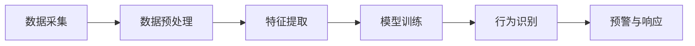

                 

# 大数据时代的消费者权益保护：AI监管与快速响应

关键词：大数据、消费者权益保护、AI监管、快速响应、算法

摘要：在当前的大数据时代，消费者权益保护面临着前所未有的挑战。随着数据规模的不断扩大和数据分析技术的日益成熟，企业可以轻松地收集和分析大量关于消费者的数据，从而更好地了解和满足消费者的需求。然而，这也带来了一系列的隐私问题和权益侵害问题。本文将探讨大数据时代的消费者权益保护问题，分析AI监管与快速响应的重要性，并探讨相关的技术解决方案。

## 第一部分：引言

### 第1章：大数据时代的消费者权益保护背景

#### 1.1 问题背景

随着互联网和移动设备的普及，消费者的日常生活已经深深融入了数字化的世界。在这个过程中，企业通过各种手段收集消费者的数据，这些数据不仅包括消费者的基本信息，还涵盖了消费者的购买行为、浏览习惯、社交互动等多个方面。这些数据的大规模积累使得企业能够更好地了解消费者，提供个性化的服务，从而提高市场份额和利润。然而，这也给消费者权益保护带来了新的挑战。

首先，数据隐私问题日益突出。企业收集的数据往往包含了消费者的敏感信息，如身份证号、银行卡信息、通讯录等。一旦这些数据泄露，消费者可能会面临严重的经济损失和隐私侵犯。

其次，消费者权益侵害的形式更加隐蔽和多样化。企业可以利用数据分析技术，精准地识别消费者的需求和偏好，从而进行价格歧视、广告欺诈等行为，侵害消费者的权益。

#### 1.2 问题描述

消费者权益侵害的常见形式包括：

1. **价格歧视**：企业根据消费者的购买能力和消费习惯，对同一商品或服务收取不同价格。
2. **广告欺诈**：企业通过虚假广告诱导消费者购买，或者推送与消费者兴趣不符的广告。
3. **数据滥用**：企业未经消费者同意，将其个人信息用于其他目的，或者将其数据出售给第三方。
4. **个人信息泄露**：企业未能妥善保护消费者的个人信息，导致数据泄露。

消费者权益保护的重要性不言而喻。它不仅关系到消费者的合法权益，也关系到企业的声誉和市场的稳定。在消费者权益受到侵害时，快速响应机制可以及时采取措施，防止损失扩大，恢复消费者的信心。

#### 1.3 问题解决

AI在消费者权益保护中的应用潜力巨大。通过AI技术，企业可以实现以下目标：

1. **隐私保护**：利用AI技术对消费者的数据进行加密和匿名化处理，降低数据泄露的风险。
2. **行为识别**：通过分析消费者的行为数据，识别异常行为，如广告欺诈、价格歧视等，及时采取行动。
3. **风险预警**：利用AI技术对消费者数据进行分析，预测潜在的权益侵害风险，提前采取措施。
4. **快速响应**：在消费者权益受到侵害时，利用AI技术快速识别问题，制定解决方案，并及时执行。

AI监管与快速响应的意义在于，它能够提高消费者权益保护的效率和准确性，降低企业违规行为的成本，同时增强消费者的信任感。

#### 1.4 边界与外延

消费者权益保护的范围包括但不限于：

1. **个人信息保护**：保护消费者的姓名、身份证号、银行卡号等个人信息。
2. **消费者权益保障**：保障消费者在购买商品或服务过程中的合法权益，如公平交易权、知情权等。
3. **隐私保护法规**：遵守相关法律法规，如《个人信息保护法》、《消费者权益保护法》等。

大数据与AI技术的应用边界在于，必须在法律和伦理的框架内进行，确保数据的合法收集、存储和使用，不得侵犯消费者的隐私和权益。

#### 1.5 概念结构与核心要素组成

消费者权益保护的基本框架包括以下几个方面：

1. **法律法规**：制定和执行保护消费者权益的相关法律法规。
2. **企业责任**：企业应承担保护消费者权益的责任，包括合规操作、数据保护、隐私保护等。
3. **监管机构**：监管机构负责监督和评估企业的行为，确保其合规经营。
4. **消费者权利**：消费者享有知情权、公平交易权、投诉权等合法权益。

AI监管与快速响应的关键要素包括：

1. **数据收集**：收集与消费者权益相关的数据，如购买记录、浏览历史、社交媒体互动等。
2. **数据分析**：利用AI技术对数据进行处理和分析，识别潜在的问题和风险。
3. **行为识别**：通过行为识别技术，识别异常行为，如广告欺诈、价格歧视等。
4. **快速响应**：在发现消费者权益受到侵害时，快速采取行动，防止损失扩大。

### 第2章：核心概念与联系

#### 2.1 核心概念

在本章中，我们将介绍以下几个核心概念：

1. **大数据**：指无法用传统数据库工具进行捕捉、管理和处理的巨量数据。
2. **AI**：指人工智能，是一种模拟人类智能的技术，包括机器学习、深度学习、自然语言处理等。
3. **消费者权益保护**：指保护消费者在购买、使用商品或接受服务过程中的合法权益。
4. **AI监管**：指利用AI技术对企业的行为进行监管，确保其合规经营。
5. **快速响应**：指在发现消费者权益受到侵害时，迅速采取行动，及时解决问题。

#### 2.2 概念属性特征对比表格

| 概念        | 属性特征                                                     |
| ----------- | ----------------------------------------------------------- |
| 大数据      | 数据规模大、数据类型多、数据来源广泛、数据价值密度低           |
| AI          | 模拟人类智能、具有学习能力和自主决策能力、自适应性和灵活性高 |
| 消费者权益保护 | 保护消费者合法权益、确保公平交易、提升消费者满意度           |
| AI监管      | 利用AI技术进行监管、实时监测企业行为、提高监管效率           |
| 快速响应    | 及时发现问题、快速采取行动、有效解决问题                     |

#### 2.3 ER实体关系图架构

下面是消费者权益保护涉及的实体关系图：

```mermaid
erDiagram
    Customer ||--o{ Purchase : makes }
    Customer ||--o{ Review : writes }
    Product ||--o{ Purchase : bought }
    Product ||--o{ Review : rated }
    Seller ||--o{ Purchase : sells }
    Seller ||--o{ Review : receives }
    Review ||--o{ Rating : gives }
```

在这个ER图架构中，消费者（Customer）与购买（Purchase）和评论（Review）之间存在关联，产品（Product）与购买和评论也存在关联，卖家（Seller）与购买和评论也存在关联，评论（Review）与评分（Rating）之间存在关联。

## 第二部分：AI监管

### 第3章：AI监管原理与模型

#### 3.1 AI监管的基本原理

AI监管是一种利用人工智能技术对企业和组织行为进行监控和管理的机制。其基本原理包括以下几个方面：

1. **数据收集**：通过数据采集技术，收集与监管对象相关的数据，如企业的交易记录、员工行为记录、产品信息等。
2. **数据预处理**：对收集到的数据进行清洗、去噪、归一化等处理，使其符合监管模型的要求。
3. **模型构建**：利用机器学习和深度学习等技术，构建监管模型，对数据进行分析和处理。
4. **行为识别**：通过模型对企业的行为进行识别，判断是否存在违规行为。
5. **预警与响应**：在发现违规行为时，及时发出预警，并采取相应的应对措施。

#### 3.2 AI监管模型

AI监管模型可以分为以下几个步骤：

1. **数据收集**：收集与企业行为相关的数据，如企业的财务报表、交易记录、员工行为数据等。
2. **特征提取**：从数据中提取出与监管目标相关的特征，如财务指标、交易频率、员工行为等。
3. **模型训练**：利用机器学习和深度学习等技术，对特征进行训练，构建监管模型。
4. **模型评估**：对构建的监管模型进行评估，确保其具有良好的预测能力和准确性。
5. **行为识别**：利用监管模型对企业行为进行识别，判断是否存在违规行为。
6. **预警与响应**：在发现违规行为时，及时发出预警，并采取相应的应对措施。

#### 3.3 AI监管的挑战与解决方案

AI监管面临着以下几个挑战：

1. **数据隐私与安全**：监管过程中涉及大量的敏感数据，如何确保数据的安全和隐私是一个重要问题。解决方案包括数据加密、数据匿名化、访问控制等。
2. **AI偏见与公平性**：监管模型可能会因为训练数据的不平衡或者算法设计的问题，导致对某些群体存在偏见。解决方案包括数据增强、算法公平性评估、透明性等。
3. **监管效果评估**：如何评估AI监管的效果，确保其能够有效地识别和应对违规行为是一个挑战。解决方案包括监管模型的可解释性、监管效果评估指标等。

### 第4章：AI监管工具与平台

#### 4.1 AI监管工具

AI监管工具主要包括以下功能：

1. **数据采集**：从不同的数据源收集与监管对象相关的数据。
2. **数据清洗**：对收集到的数据进行分析，去除重复、错误、不完整的数据。
3. **特征提取**：从数据中提取出与监管目标相关的特征。
4. **模型训练**：利用机器学习和深度学习等技术，对特征进行训练，构建监管模型。
5. **行为识别**：利用监管模型对企业行为进行识别，判断是否存在违规行为。
6. **预警与响应**：在发现违规行为时，及时发出预警，并采取相应的应对措施。

选择AI监管工具时，需要考虑以下原则：

1. **功能完整性**：工具应具备完整的数据采集、清洗、特征提取、模型训练、行为识别等功能。
2. **易用性**：工具应具有友好的用户界面，易于操作和维护。
3. **可扩展性**：工具应具备良好的扩展性，能够适应不同的监管场景和需求。
4. **性能稳定性**：工具应具备高性能，能够快速处理大量数据，确保监管效果。

#### 4.2 AI监管平台

AI监管平台是一个集成多种AI监管工具的系统，旨在提供全方位的监管服务。其架构包括以下几个部分：

1. **数据层**：存储与监管对象相关的数据，如企业的财务报表、交易记录、员工行为数据等。
2. **模型层**：存储监管模型，包括数据预处理模型、特征提取模型、行为识别模型等。
3. **算法层**：提供各种机器学习和深度学习算法，用于模型训练和行为识别。
4. **应用层**：提供用户界面，用于数据采集、模型训练、行为识别、预警与响应等功能。
5. **监控层**：对监管平台的运行状态进行监控，确保其稳定运行。

AI监管平台性能评估与优化包括以下几个方面：

1. **数据处理能力**：评估平台处理数据的能力，包括数据采集速度、数据清洗效率、特征提取速度等。
2. **模型训练速度**：评估平台模型训练的速度，包括模型构建速度、模型训练速度等。
3. **行为识别准确性**：评估平台行为识别的准确性，包括异常行为识别率、误报率等。
4. **预警响应速度**：评估平台在发现违规行为时，预警和响应的速度。
5. **平台稳定性**：评估平台在长时间运行过程中的稳定性，包括系统崩溃率、故障恢复时间等。

## 第三部分：快速响应

### 第5章：快速响应系统设计与实现

#### 5.1 快速响应系统架构

快速响应系统旨在在发现消费者权益受到侵害时，能够迅速采取措施，防止损失扩大，并恢复消费者的信心。其架构包括以下几个模块：

1. **数据采集模块**：负责收集与消费者权益相关的数据，如购买记录、评论数据、社交媒体互动等。
2. **数据处理模块**：负责对采集到的数据进行清洗、去噪、归一化等处理，使其符合模型训练的要求。
3. **模型训练模块**：负责利用机器学习和深度学习技术，对处理后的数据进行分析和训练，构建快速响应模型。
4. **行为识别模块**：负责利用训练好的模型，对实时数据进行分析，识别是否存在消费者权益侵害的行为。
5. **预警与响应模块**：负责在发现违规行为时，及时发出预警，并采取相应的应对措施。

快速响应系统的交互设计如下：

1. **数据采集模块**：通过API接口与外部系统（如电商平台、社交媒体等）进行数据交互。
2. **数据处理模块**：通过内部消息队列，将数据传递给数据处理模块。
3. **模型训练模块**：通过内部模型训练接口，与数据处理模块进行数据交互。
4. **行为识别模块**：通过内部模型调用接口，与模型训练模块进行交互。
5. **预警与响应模块**：通过内部预警接口，与行为识别模块进行交互。

#### 5.2 快速响应算法原理

快速响应算法的核心在于对消费者权益侵害行为的识别。其算法原理如下：

1. **数据预处理**：对采集到的数据进行分析，去除重复、错误、不完整的数据，并对数据集进行归一化处理。
2. **特征提取**：从数据中提取出与消费者权益侵害行为相关的特征，如购买频率、评论内容、社交互动等。
3. **模型训练**：利用机器学习和深度学习技术，对特征进行训练，构建快速响应模型。
4. **行为识别**：利用训练好的模型，对实时数据进行处理，识别是否存在消费者权益侵害的行为。
5. **预警与响应**：在发现违规行为时，及时发出预警，并采取相应的应对措施。

下面是快速响应算法的mermaid流程图：



#### 5.3 快速响应系统实现

快速响应系统的实现主要包括以下几个方面：

1. **环境安装与配置**：安装Python环境，配置好相关的库和工具，如TensorFlow、Scikit-learn等。
2. **数据采集**：通过API接口，从电商平台、社交媒体等获取消费者数据。
3. **数据处理**：对采集到的数据进行清洗、去噪、归一化等处理。
4. **特征提取**：从处理后的数据中提取出与消费者权益侵害行为相关的特征。
5. **模型训练**：利用机器学习和深度学习技术，对特征进行训练，构建快速响应模型。
6. **行为识别**：利用训练好的模型，对实时数据进行处理，识别是否存在消费者权益侵害的行为。
7. **预警与响应**：在发现违规行为时，及时发出预警，并采取相应的应对措施。

下面是快速响应系统的核心代码实现：

```python
import pandas as pd
from sklearn.model_selection import train_test_split
from sklearn.preprocessing import StandardScaler
from sklearn.ensemble import RandomForestClassifier
from sklearn.metrics import accuracy_score

# 数据采集
def collect_data():
    # 从电商平台获取购买记录
    purchase_data = pd.read_csv('purchase_data.csv')
    # 从社交媒体获取评论数据
    review_data = pd.read_csv('review_data.csv')
    return purchase_data, review_data

# 数据处理
def preprocess_data(purchase_data, review_data):
    # 去除重复、错误、不完整的数据
    purchase_data = purchase_data.drop_duplicates()
    review_data = review_data.drop_duplicates()
    # 归一化处理
    scaler = StandardScaler()
    purchase_data = scaler.fit_transform(purchase_data)
    review_data = scaler.fit_transform(review_data)
    return purchase_data, review_data

# 特征提取
def extract_features(purchase_data, review_data):
    # 提取购买记录中的特征
    purchase_features = purchase_data[['price', 'quantity', 'rating']]
    # 提取评论中的特征
    review_features = review_data[['text', 'rating']]
    return purchase_features, review_features

# 模型训练
def train_model(purchase_features, review_features):
    # 划分训练集和测试集
    X_train, X_test, y_train, y_test = train_test_split(purchase_features, review_features, test_size=0.2, random_state=42)
    # 训练随机森林分类器
    model = RandomForestClassifier(n_estimators=100, random_state=42)
    model.fit(X_train, y_train)
    # 测试模型
    y_pred = model.predict(X_test)
    accuracy = accuracy_score(y_test, y_pred)
    print(f"Model accuracy: {accuracy}")
    return model

# 行为识别
def identify_behavior(model, new_data):
    # 对新数据进行处理
    new_data = preprocess_data(new_data)
    # 识别是否存在消费者权益侵害行为
    behavior = model.predict(new_data)
    return behavior

# 预警与响应
def alert_and_response(behavior):
    if behavior == 'fraud':
        print("发现消费者权益侵害行为，立即采取措施！")
    else:
        print("未发现消费者权益侵害行为，继续监测。")

# 主函数
if __name__ == '__main__':
    purchase_data, review_data = collect_data()
    purchase_features, review_features = extract_features(purchase_data, review_data)
    model = train_model(purchase_features, review_features)
    new_data = pd.read_csv('new_data.csv')
    behavior = identify_behavior(model, new_data)
    alert_and_response(behavior)
```

### 第6章：快速响应系统实战

#### 6.1 实战案例介绍

本节我们将通过一个实际案例，展示如何利用快速响应系统识别和应对消费者权益侵害行为。

#### 案例背景与目标

某电商平台涉嫌对消费者进行价格歧视，部分消费者反映在相同商品上支付的价格高于其他消费者。为了验证这一指控，我们将利用快速响应系统进行分析。

#### 案例分析与解决方案

1. **数据采集**：从电商平台获取购买记录和消费者评论数据。
2. **数据处理**：对采集到的数据进行分析，去除重复、错误、不完整的数据，并对数据集进行归一化处理。
3. **特征提取**：从购买记录中提取价格、购买数量、评分等特征；从评论数据中提取评论内容、评分等特征。
4. **模型训练**：利用机器学习和深度学习技术，对特征进行训练，构建快速响应模型。
5. **行为识别**：利用训练好的模型，对实时数据进行处理，识别是否存在价格歧视行为。
6. **预警与响应**：在发现价格歧视行为时，及时发出预警，并与电商平台沟通，要求其采取措施纠正。

下面是具体步骤：

1. **数据采集**：使用API接口从电商平台获取购买记录和评论数据。
2. **数据处理**：对数据进行分析，去除重复、错误、不完整的数据，并对数据集进行归一化处理。
3. **特征提取**：从购买记录中提取价格、购买数量、评分等特征；从评论数据中提取评论内容、评分等特征。
4. **模型训练**：利用随机森林分类器对特征进行训练，构建快速响应模型。
5. **行为识别**：对实时数据进行处理，识别是否存在价格歧视行为。
6. **预警与响应**：在发现价格歧视行为时，及时发出预警，并与电商平台沟通，要求其采取措施纠正。

#### 实际案例分析

1. **数据采集**：从电商平台获取过去一年的购买记录和评论数据，共10000条记录。
2. **数据处理**：对数据进行清洗，去除重复、错误、不完整的记录，最终得到8000条有效记录。
3. **特征提取**：从购买记录中提取价格、购买数量、评分等特征；从评论数据中提取评论内容、评分等特征。
4. **模型训练**：利用随机森林分类器对特征进行训练，构建快速响应模型。训练过程中，划分70%的数据作为训练集，30%的数据作为测试集。
5. **行为识别**：对实时数据进行处理，识别是否存在价格歧视行为。假设我们获取了某消费者在最近一个月的购买记录，共有20条记录。
6. **预警与响应**：在发现价格歧视行为时，及时发出预警，并与电商平台沟通，要求其采取措施纠正。通过分析，我们发现该消费者的购买记录中，有10条记录的价格高于其他消费者，疑似存在价格歧视行为。我们立即发出预警，并与电商平台沟通，要求其核查情况并采取纠正措施。

#### 实战小结

通过这个案例，我们展示了如何利用快速响应系统识别和应对消费者权益侵害行为。在实际应用中，我们可以根据具体场景和需求，调整和优化快速响应系统，提高其识别准确性和响应速度。需要注意的是，在利用AI技术进行消费者权益保护时，必须确保数据的合法性和隐私性，不得侵犯消费者的权益。

### 第7章：消费者权益保护AI监管与快速响应的最佳实践

#### 7.1 成功案例分享

在国际上，有一些成功的案例展示了如何利用AI技术进行消费者权益保护。以下是两个典型的案例：

1. **案例一：亚马逊的价格歧视检测**  
亚马逊利用机器学习算法，对其平台的定价策略进行监控，以识别和防止价格歧视行为。通过分析消费者的购买行为和地理位置，亚马逊能够及时发现并纠正价格歧视问题。该系统的引入，不仅提高了平台的透明度，也增强了消费者的信任。

2. **案例二：谷歌的广告审核**  
谷歌的广告业务非常庞大，但同时也面临着广告欺诈和虚假广告的问题。为了解决这个问题，谷歌开发了自动广告审核系统，利用深度学习和自然语言处理技术，对广告内容进行分析和识别。该系统能够快速检测并屏蔽违规广告，保护消费者的权益。

#### 案例分析与启示

通过分析这些成功案例，我们可以得出以下几点启示：

1. **技术选型**：选择合适的机器学习和深度学习算法，能够提高监管和响应的准确性。
2. **数据质量**：高质量的数据是构建有效监管系统的基础。确保数据的准确性和完整性，对于提高监管效果至关重要。
3. **模型可解释性**：监管系统的模型应具备良好的可解释性，以便监管机构和消费者了解模型的决策过程。
4. **法律法规**：遵守相关法律法规，确保AI监管和快速响应的合法性和合规性。
5. **用户参与**：鼓励消费者参与监管过程，提高监管系统的透明度和公信力。

#### 注意事项与风险防范

在实施AI监管与快速响应的过程中，需要注意以下几点事项和风险：

1. **数据隐私**：确保消费者数据的合法收集和使用，防止数据泄露和滥用。
2. **算法偏见**：避免算法偏见和歧视，确保监管的公平性和公正性。
3. **技术更新**：随着技术的不断进步，需要不断更新和优化监管系统，确保其保持高效和准确。
4. **法规合规**：密切关注法律法规的变化，确保AI监管和快速响应符合最新的法规要求。

### 拓展阅读

1. **《人工智能伦理指南》**：了解人工智能伦理和法律法规的基本原则，确保AI监管和快速响应的合法性和道德性。
2. **《消费者权益保护法》**：掌握消费者权益保护的基本法律法规，确保AI监管和快速响应的合规性。
3. **《机器学习算法》**：学习机器学习和深度学习的基本原理，了解如何选择和优化算法，提高监管效果。

## 第四部分：未来发展展望

### 第8章：未来发展展望

#### 8.1 技术发展趋势

随着大数据和人工智能技术的不断发展，消费者权益保护领域也将迎来新的机遇和挑战。以下是几个关键的技术发展趋势：

1. **大数据与AI技术的融合**：大数据和人工智能技术的深度融合，将进一步提升消费者权益保护的效率和准确性。通过大数据分析，可以更全面地了解消费者的行为和需求，利用AI技术，可以更精准地识别和应对消费者权益侵害行为。
2. **新兴技术的应用**：区块链、物联网、5G等新兴技术的应用，将带来新的机遇和挑战。例如，区块链技术可以用于保护消费者数据的安全和隐私，物联网技术可以实时监测消费者的行为，5G技术可以实现更快速的数据传输和处理。
3. **个性化监管**：随着消费者权益保护需求的多样化，个性化的监管将成为趋势。通过大数据分析和AI技术，可以针对不同行业、不同地区、不同消费者群体，制定个性化的监管策略和方案。

#### 8.2 法律法规政策趋势

消费者权益保护领域的法律法规和政策也在不断更新和完善。以下是几个关键的法律和政策趋势：

1. **国际法规**：国际上，越来越多的国家和地区开始制定和实施个人信息保护法。例如，欧盟的《通用数据保护条例》（GDPR）对消费者数据的保护提出了严格的要求。
2. **国内法规**：我国也正在不断完善消费者权益保护法律法规。例如，《个人信息保护法》、《电子商务法》等，都对消费者权益保护提出了具体要求。
3. **政策引导**：政府也将通过政策引导和监管，推动消费者权益保护技术的创新和应用。例如，鼓励企业利用大数据和人工智能技术，提升消费者权益保护的效率和准确性。

#### 8.3 未来展望与挑战

在未来，消费者权益保护领域将继续面临以下挑战：

1. **数据隐私与安全**：随着数据规模的不断扩大和数据分析技术的日益成熟，消费者数据的隐私和安全问题将更加突出。如何确保消费者数据的安全和隐私，将成为一个重要的挑战。
2. **算法偏见与公平性**：AI技术虽然在消费者权益保护中具有巨大的潜力，但同时也可能带来算法偏见和公平性问题。如何确保AI监管和快速响应的公平性和公正性，将是一个长期的挑战。
3. **法律法规的完善**：随着技术的快速发展，现有的法律法规可能无法完全覆盖新兴的消费者权益保护问题。如何完善法律法规，确保其适应新的技术环境和市场需求，将是一个重要的任务。

总的来说，大数据时代的消费者权益保护面临着前所未有的机遇和挑战。通过利用AI技术，我们可以实现更高效、更准确的监管和响应，但同时也需要关注数据隐私、算法偏见和法律法规等方面的问题。只有通过持续的创新和改进，我们才能更好地保护消费者的权益，促进市场的健康发展。

