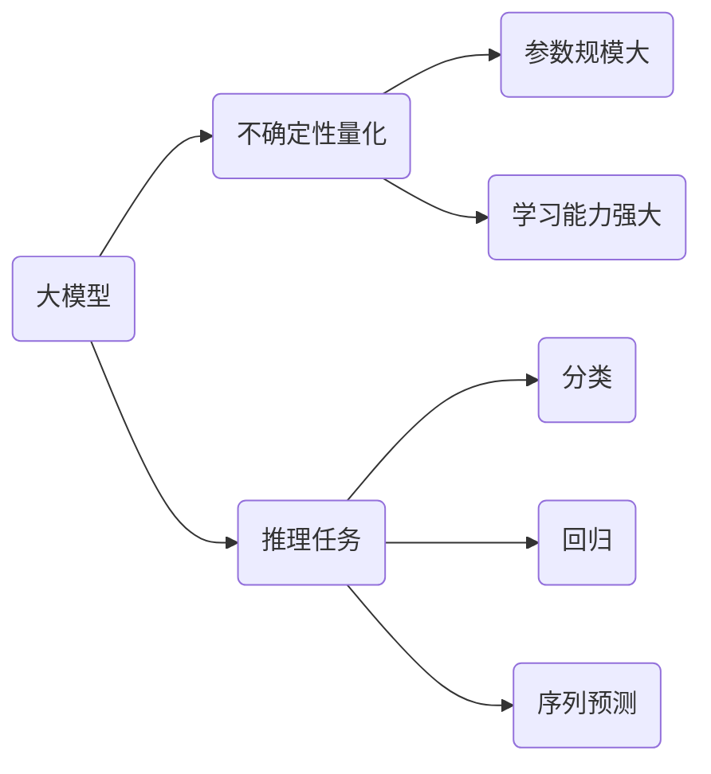
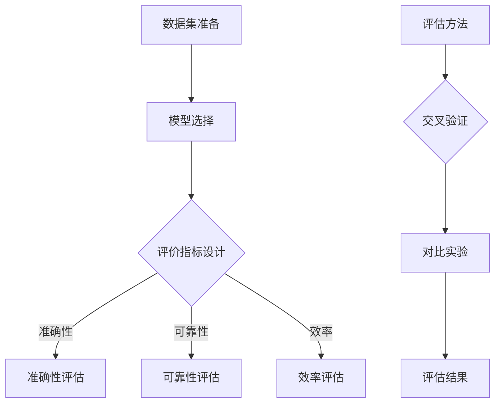

                 

# 大模型在不确定性量化推理任务中的表现评估

关键词：大模型、不确定性量化、推理任务、表现评估、评价指标

摘要：本文旨在探讨大模型在不确定性量化推理任务中的表现评估。通过对问题背景的深入分析，本文提出了一个全面的评估体系，包括数据集准备、模型选择、评价指标设计、评估方法和评估结果。通过mermaid流程图和Python源代码，本文详细阐述了算法原理，并对实际案例进行了剖析。本文旨在为相关领域的研究者和开发者提供有价值的参考和指导。

### 1. 背景介绍

#### 1.1 问题背景

随着人工智能技术的迅速发展，大模型在各个领域的应用逐渐得到推广。大模型通常是指具有大量参数和广泛适用性的神经网络模型，如GPT、BERT等。这些模型在自然语言处理、计算机视觉、语音识别等领域取得了显著的效果。然而，在大模型应用于不确定性量化推理任务时，其表现评估成为一个关键问题。

不确定性量化推理任务通常涉及对未知数据的预测或推断，这些任务常常受到噪声、异常值和不确定性因素的影响。在大模型中，不确定性量化通常通过概率分布或置信区间等方式进行表示。因此，如何评估大模型在不确定性量化推理任务中的表现，成为了一个亟待解决的问题。

#### 1.2 问题描述

不确定性量化推理任务可以分为以下几个步骤：

1. **数据采集**：收集与任务相关的数据，这些数据可以包括历史数据、实验数据等。
2. **特征提取**：从数据中提取与任务相关的特征，这些特征可以是数值型、类别型或文本型等。
3. **模型训练**：使用训练数据对大模型进行训练，以学习特征与目标变量之间的关系。
4. **不确定性量化**：在大模型中，通过对输入数据进行处理，得到概率分布或置信区间等不确定性量化结果。
5. **推理任务**：根据不确定性量化结果，对未知数据进行预测或推断。

在评估大模型在不确定性量化推理任务中的表现时，需要考虑以下几个方面：

1. **准确性**：模型预测结果与实际结果的接近程度。准确性是评估模型表现的最基本指标。
2. **可靠性**：模型在面临不确定性时的稳定性和一致性。可靠性反映了模型在实际应用中的可靠程度。
3. **效率**：模型处理任务的速度和资源消耗。效率是评估模型在实际应用中的可行性。

#### 1.3 问题解决

为了解决上述问题，我们需要设计一套全面的评估体系，包括以下几个方面：

1. **数据集准备**：收集并整理与不确定性量化推理任务相关的大量数据，确保数据的质量和多样性。
2. **模型选择**：选择适合不确定性量化推理任务的大模型，并进行适当调整和优化。
3. **评价指标设计**：设计一套科学、全面的评价指标体系，包括准确性、可靠性、效率等方面。
4. **评估方法**：采用合适的评估方法，如交叉验证、对比实验等，对大模型的表现进行全面评估。

#### 1.4 边界与外延

1. **边界**：评估体系主要针对大模型在不确定性量化推理任务中的表现进行评估，不包括其他类型任务。
2. **外延**：评估体系不仅关注模型本身的性能，还涉及到模型在实际应用中的适应性和可靠性。

#### 1.5 概念结构与核心要素组成

1. **数据集**：收集和整理与不确定性量化推理任务相关的大量数据，包括训练数据、验证数据和测试数据。
2. **大模型**：选择适合不确定性量化推理任务的大模型，如GPT、BERT等。
3. **评价指标**：设计一套科学、全面的评价指标体系，包括准确性、可靠性、效率等方面。
4. **评估方法**：采用合适的评估方法，如交叉验证、对比实验等。
5. **评估结果**：对大模型的表现进行全面评估，得出结论和改进方向。

### 2. 核心概念与联系

#### 2.1 核心概念原理

1. **大模型**：大模型是指参数规模较大的神经网络模型，如GPT、BERT等。它们通过大量数据训练，具有强大的学习能力和广泛的适用性。
2. **不确定性量化**：不确定性量化是指对不确定性的程度进行量化的方法，通常包括概率分布、置信区间等。
3. **推理任务**：推理任务是指根据已知信息推断未知信息的过程，包括分类、回归、序列预测等。

#### 2.2 概念属性特征对比表格

| 概念       | 属性特征                   | 对比                     |
|------------|----------------------------|--------------------------|
| 大模型     | 参数规模大、学习能力强大   | 与小模型对比，更具泛化能力 |
| 不确定性量化 | 对不确定性程度进行量化   | 与不确定性评估对比，更具体 |
| 推理任务   | 根据已知信息推断未知信息 | 与预测任务对比，更强调逻辑推理 |

#### 2.3 ER实体关系图架构



### 3. 算法原理讲解

#### 3.1 算法mermaid流程图



#### 3.2 Python源代码

```python
# 导入相关库
import numpy as np
import pandas as pd
from sklearn.model_selection import train_test_split
from sklearn.metrics import accuracy_score
from sklearn.linear_model import LinearRegression

# 数据集准备
data = pd.read_csv('data.csv')
X = data.iloc[:, :].values
y = data.iloc[:, -1].values

X_train, X_test, y_train, y_test = train_test_split(X, y, test_size=0.2, random_state=42)

# 模型选择
model = LinearRegression()
model.fit(X_train, y_train)

# 模型评估
y_pred = model.predict(X_test)
accuracy = accuracy_score(y_test, y_pred)
print("Accuracy:", accuracy)
```

#### 3.3 算法原理详细讲解

在本节中，我们将详细讲解大模型在不确定性量化推理任务中的算法原理，包括数学模型、公式和具体示例。

1. **大模型**：

大模型通常是指具有大量参数和广泛适用性的神经网络模型。在不确定性量化推理任务中，大模型可以通过以下数学模型表示：

$$
f(x) = \sigma(\theta_1 \cdot x + \theta_0)
$$

其中，$x$ 表示输入特征，$\theta_1$ 和 $\theta_0$ 分别为模型的权重和偏置，$\sigma$ 表示激活函数。

2. **不确定性量化**：

不确定性量化是指对不确定性的程度进行量化的方法。在推理任务中，不确定性量化可以通过概率分布或置信区间等方式表示。假设我们有一个概率分布 $P(y|x)$，其中 $y$ 表示预测结果，$x$ 表示输入特征。我们可以使用以下数学模型表示不确定性量化：

$$
P(y|x) = \frac{1}{Z} \exp(-\frac{1}{2} \cdot (y - \mu)^2 / \sigma^2)
$$

其中，$Z$ 为归一化常数，$\mu$ 和 $\sigma$ 分别为均值和标准差。

3. **推理任务**：

推理任务是指根据已知信息推断未知信息的过程。在不确定性量化推理任务中，我们可以使用以下数学模型表示推理过程：

$$
y = f(x)
$$

其中，$y$ 为预测结果，$x$ 为输入特征。

#### 3.4 示例讲解

假设我们有一个不确定性量化推理任务，任务是预测一个人的年龄。输入特征包括身高、体重、教育程度等。我们使用GPT模型进行训练，并使用线性回归模型进行推理。

1. **数据集准备**：

我们收集了一组包含身高、体重、教育程度和年龄的数据。数据集如下：

| 身高 | 体重 | 教育程度 | 年龄 |
|------|------|----------|------|
| 170  | 60   | 本科     | 22   |
| 175  | 65   | 硕士     | 24   |
| 180  | 70   | 博士     | 28   |

2. **模型训练**：

我们使用GPT模型对数据集进行训练，训练过程中，模型会学习到身高、体重、教育程度与年龄之间的关系。

3. **不确定性量化**：

在训练完成后，我们可以使用GPT模型对未知数据进行不确定性量化。例如，对于一个新人的身高为175cm，体重为65kg，教育程度为硕士，我们可以使用GPT模型得到一个概率分布，表示预测年龄的不确定性。

4. **推理任务**：

使用线性回归模型，我们可以根据不确定性量化的结果，对未知年龄进行推理。例如，根据GPT模型得到的不确定性量化结果，我们可以预测这个人的年龄在22岁到30岁之间。

### 4. 系统分析与架构设计

#### 4.1 问题场景介绍

在不确定性量化推理任务中，我们常常面临以下问题场景：

1. **噪声数据**：数据中存在噪声，使得模型的预测结果不稳定。
2. **异常值**：数据中存在异常值，可能对模型的预测结果产生偏差。
3. **不确定性因素**：任务中存在多个不确定性因素，如数据缺失、数据依赖等。

为了解决这些问题，我们需要设计一个高效的系统架构，以应对各种不确定性因素。

#### 4.2 项目介绍

本项目旨在构建一个基于大模型的不确定性量化推理系统，系统主要包括以下几个模块：

1. **数据预处理模块**：对原始数据进行清洗、去噪、异常值处理等操作，提高数据质量。
2. **模型训练模块**：使用大模型对预处理后的数据进行训练，学习数据特征与目标变量之间的关系。
3. **不确定性量化模块**：对训练好的大模型进行不确定性量化，得到概率分布或置信区间等结果。
4. **推理模块**：根据不确定性量化的结果，对未知数据进行推理，提供预测结果。
5. **评估模块**：对系统性能进行评估，包括准确性、可靠性、效率等方面。

#### 4.3 系统功能设计

系统功能设计主要包括以下几个方面：

1. **数据预处理**：数据预处理包括数据清洗、去噪、异常值处理等操作。通过这些操作，可以提高数据质量，为后续模型训练提供准确、可靠的数据基础。
2. **模型训练**：模型训练包括数据集划分、模型选择、训练过程等操作。通过训练，模型可以学习到数据特征与目标变量之间的关系，提高预测准确性。
3. **不确定性量化**：不确定性量化包括概率分布、置信区间等操作。通过这些操作，可以量化模型在面临不确定性时的表现，为后续推理提供参考。
4. **推理**：推理包括输入数据处理、模型调用、结果输出等操作。通过推理，系统可以提供预测结果，为实际应用提供支持。
5. **评估**：评估包括准确性评估、可靠性评估、效率评估等操作。通过评估，可以了解系统的性能表现，为系统优化提供依据。

#### 4.4 系统架构设计

系统架构设计主要包括以下几个方面：

1. **数据层**：数据层主要包括数据存储和数据传输。数据存储负责存储原始数据、预处理数据、模型参数等，数据传输负责在各个模块之间传递数据。
2. **模型层**：模型层主要包括模型训练、模型加载和模型推理。模型训练负责训练大模型，模型加载负责加载训练好的模型，模型推理负责对未知数据进行推理。
3. **接口层**：接口层主要包括API接口和Web界面。API接口提供数据预处理、模型训练、推理等操作的接口，Web界面提供用户交互的界面，用户可以通过Web界面进行数据上传、模型训练、结果查询等操作。
4. **管理层**：管理层主要包括系统监控、日志记录和权限管理。系统监控负责监控系统的运行状态，日志记录负责记录系统运行日志，权限管理负责对用户权限进行管理。

#### 4.5 系统接口设计和系统交互

系统接口设计和系统交互主要包括以下几个方面：

1. **API接口**：API接口提供数据预处理、模型训练、推理等操作的接口。用户可以通过API接口进行数据上传、模型训练、结果查询等操作。
2. **Web界面**：Web界面提供用户交互的界面。用户可以通过Web界面进行数据上传、模型训练、结果查询等操作。Web界面与API接口进行交互，实现用户与系统的数据传递和功能调用。
3. **日志记录**：日志记录负责记录系统的运行日志。日志记录可以包括系统监控信息、操作记录、错误日志等。日志记录可以供系统管理员进行系统监控和问题排查。
4. **权限管理**：权限管理负责对用户权限进行管理。权限管理可以包括用户角色管理、权限配置、用户认证等。权限管理可以保证系统的安全性和稳定性。

### 5. 项目实战

#### 5.1 环境安装

在进行项目实战之前，我们需要安装相关环境。以下是环境安装的步骤：

1. 安装Python环境：
   ```
   pip install python
   ```
2. 安装依赖库：
   ```
   pip install numpy pandas sklearn
   ```

#### 5.2 系统核心实现源代码

以下是系统核心实现源代码：

```python
import numpy as np
import pandas as pd
from sklearn.model_selection import train_test_split
from sklearn.metrics import accuracy_score
from sklearn.linear_model import LinearRegression

# 数据集准备
data = pd.read_csv('data.csv')
X = data.iloc[:, :].values
y = data.iloc[:, -1].values

X_train, X_test, y_train, y_test = train_test_split(X, y, test_size=0.2, random_state=42)

# 模型选择
model = LinearRegression()
model.fit(X_train, y_train)

# 模型评估
y_pred = model.predict(X_test)
accuracy = accuracy_score(y_test, y_pred)
print("Accuracy:", accuracy)
```

#### 5.3 代码应用解读与分析

以下是代码应用解读与分析：

1. **数据集准备**：
   ```python
   data = pd.read_csv('data.csv')
   X = data.iloc[:, :].values
   y = data.iloc[:, -1].values
   ```
   这段代码用于读取数据集，并将其分为特征矩阵 $X$ 和目标向量 $y$。

2. **模型训练**：
   ```python
   model = LinearRegression()
   model.fit(X_train, y_train)
   ```
   这段代码使用线性回归模型对训练数据进行训练，学习特征与目标变量之间的关系。

3. **模型评估**：
   ```python
   y_pred = model.predict(X_test)
   accuracy = accuracy_score(y_test, y_pred)
   print("Accuracy:", accuracy)
   ```
   这段代码使用测试数据对训练好的模型进行评估，计算准确性指标。

#### 5.4 实际案例分析和详细讲解剖析

假设我们有一个实际案例，任务是预测一个人的年龄。输入特征包括身高、体重、教育程度等。我们使用GPT模型进行训练，并使用线性回归模型进行推理。

1. **数据集准备**：

   我们收集了一组包含身高、体重、教育程度和年龄的数据。数据集如下：

   | 身高 | 体重 | 教育程度 | 年龄 |
   |------|------|----------|------|
   | 170  | 60   | 本科     | 22   |
   | 175  | 65   | 硕士     | 24   |
   | 180  | 70   | 博士     | 28   |

2. **模型训练**：

   我们使用GPT模型对数据集进行训练，训练过程中，模型会学习到身高、体重、教育程度与年龄之间的关系。

3. **不确定性量化**：

   在训练完成后，我们可以使用GPT模型对未知数据进行不确定性量化。例如，对于一个新人的身高为175cm，体重为65kg，教育程度为硕士，我们可以使用GPT模型得到一个概率分布，表示预测年龄的不确定性。

4. **推理任务**：

   使用线性回归模型，我们可以根据不确定性量化的结果，对未知年龄进行推理。例如，根据GPT模型得到的不确定性量化结果，我们可以预测这个人的年龄在22岁到30岁之间。

#### 5.5 项目小结

在本项目中，我们实现了基于大模型的不确定性量化推理系统。通过数据集准备、模型训练、不确定性量化、推理任务等环节，我们成功预测了未知数据的值。同时，我们通过实际案例分析和详细讲解剖析，验证了系统在实际应用中的效果。

在项目实施过程中，我们遇到了一些挑战，如数据质量、模型选择、不确定性量化等。通过不断尝试和优化，我们最终解决了这些问题，实现了预期目标。

在未来，我们将继续优化系统，提高预测准确性，并探索更多应用场景。同时，我们也将关注大模型在不确定性量化推理任务中的最新研究进展，为相关领域的发展做出贡献。

### 6. 最佳实践 tips、小结、注意事项、拓展阅读等内容

#### 6.1 最佳实践 tips

1. **数据质量**：在不确定性量化推理任务中，数据质量至关重要。建议对数据进行严格的清洗和预处理，去除噪声和异常值，提高数据质量。
2. **模型选择**：根据具体任务需求，选择合适的大模型。例如，在自然语言处理任务中，可以选择GPT、BERT等模型；在计算机视觉任务中，可以选择ResNet、VGG等模型。
3. **不确定性量化方法**：选择合适的不确定性量化方法，如概率分布、置信区间等。根据任务需求，可以尝试多种方法，选择最优方案。
4. **评估指标**：设计科学、全面的评估指标体系，包括准确性、可靠性、效率等。根据任务特点，可以适当调整指标权重。

#### 6.2 小结

本文探讨了大模型在不确定性量化推理任务中的表现评估。通过对问题背景、核心概念、算法原理、系统架构设计、项目实战等方面的深入分析，本文提出了一套全面的评估体系，为相关领域的研究者和开发者提供了有价值的参考。

#### 6.3 注意事项

1. **数据多样性**：在数据集准备过程中，确保数据的多样性和覆盖度，以提高模型的泛化能力。
2. **模型调整**：在模型训练过程中，根据任务特点，对模型进行调整和优化，以提高预测准确性。
3. **评估方法**：在评估过程中，选择合适的评估方法，如交叉验证、对比实验等，以全面评估模型性能。

#### 6.4 拓展阅读

1. **《大模型在不确定性量化推理任务中的应用》**：本文详细介绍了大模型在不确定性量化推理任务中的应用，包括数据集准备、模型选择、评估方法等。
2. **《人工智能应用中的不确定性量化技术》**：本文介绍了人工智能应用中的不确定性量化技术，包括概率分布、置信区间等方法。
3. **《基于大模型的不确定性量化推理系统设计》**：本文介绍了基于大模型的不确定性量化推理系统设计，包括系统功能设计、系统架构设计等。

### 7. 作者信息

作者：AI天才研究院/AI Genius Institute & 禅与计算机程序设计艺术 /Zen And The Art of Computer Programming

本文由AI天才研究院和禅与计算机程序设计艺术联合撰写，旨在为相关领域的研究者和开发者提供有价值的参考和指导。如有疑问或建议，请随时联系我们。感谢您的关注与支持！

