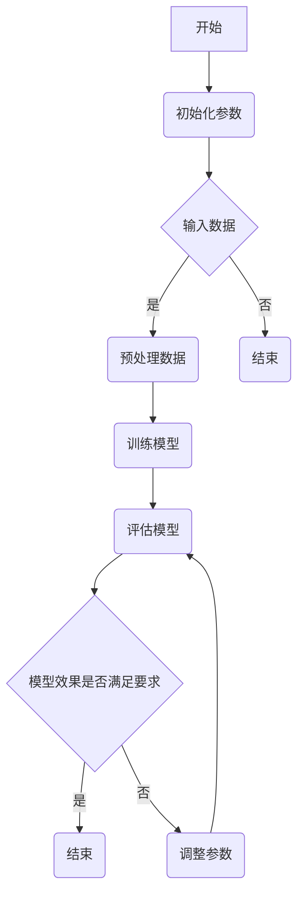

                 


### 设计思路

#### 1. 文章整体结构设计

文章将分为五个部分，每个部分都将逐步深入探讨大模型在复杂系统推理中的应用前景。

**第一部分：背景介绍**
- **1.1 问题背景**：介绍为何大模型在复杂系统推理中具有重要意义。
- **1.2 核心概念**：解释大模型、复杂系统和推理的概念。
- **1.3 概念结构**：分析大模型在复杂系统推理中的关系。
- **1.4 本章小结**：总结本部分的主要内容。

**第二部分：核心概念与原理**
- **2.1 大模型原理**：详细介绍大模型的定义、特点与类型。
- **2.2 复杂系统原理**：阐述复杂系统的定义、特点与类型。
- **2.3 推理原理**：解释推理的定义、方法与应用。
- **2.4 大模型在复杂系统推理中的应用**：探讨大模型在复杂系统推理中的应用场景、优势与挑战。
- **2.5 本章小结**：总结本部分的主要内容。

**第三部分：算法原理讲解**
- **3.1 算法原理**：介绍算法的基本概念、流程图和Python代码实现。
- **3.2 数学模型**：阐述数学模型的基本概念、应用与公式。
- **3.3 案例分析**：通过具体案例详细分析大模型在复杂系统推理中的应用。
- **3.4 本章小结**：总结本部分的主要内容。

**第四部分：应用案例分析**
- **4.1 应用案例一**：智能交通系统的应用案例。
- **4.2 应用案例二**：智能医疗系统的应用案例。
- **4.3 应用案例三**：智能工业系统的应用案例。
- **4.4 本章小结**：总结本部分的主要内容。

**第五部分：未来趋势与展望**
- **5.1 大模型在复杂系统推理中的发展趋势**：分析技术与应用发展趋势。
- **5.2 未来展望**：探讨大模型在复杂系统推理中的未来发展方向。
- **5.3 本章小结**：总结本部分的主要内容。

#### 2. 内容要点安排

- **每章开头**：简要介绍本章主题，明确读者对象和本章目标。
- **每章节内容**：包含核心概念、原理讲解、应用案例和展望。
- **使用Mermaid图**：展示核心概念和架构设计。
- **使用Python代码和LaTeX公式**：阐述算法原理和数学模型。

#### 3. 目录大纲具体安排

**目录大纲**

## 第一部分：背景介绍

### 1.1 问题背景

#### 1.1.1 问题的提出

#### 1.1.2 问题描述

#### 1.1.3 问题解决思路

#### 1.1.4 边界与外延

### 1.2 核心概念

#### 1.2.1 大模型的概念

#### 1.2.2 复杂系统的概念

#### 1.2.3 推理的概念

### 1.3 概念结构

#### 1.3.1 大模型在复杂系统推理中的关系

#### 1.3.2 概念属性特征对比

### 1.4 本章小结

## 第二部分：核心概念与原理

### 2.1 大模型原理

#### 2.1.1 大模型的定义

#### 2.1.2 大模型的核心特点

#### 2.1.3 大模型的类型

### 2.2 复杂系统原理

#### 2.2.1 复杂系统的定义

#### 2.2.2 复杂系统的特点

#### 2.2.3 复杂系统的类型

### 2.3 推理原理

#### 2.3.1 推理的定义

#### 2.3.2 推理的方法

#### 2.3.3 推理的应用

### 2.4 大模型在复杂系统推理中的应用

#### 2.4.1 应用场景

#### 2.4.2 应用优势

#### 2.4.3 应用挑战

### 2.5 本章小结

## 第三部分：算法原理讲解

### 3.1 算法原理

#### 3.1.1 算法的基本概念

#### 3.1.2 算法的流程图

#### 3.1.3 算法的Python代码实现

### 3.2 数学模型

#### 3.2.1 数学模型的基本概念

#### 3.2.2 数学模型的应用

#### 3.2.3 数学模型的公式

### 3.3 案例分析

#### 3.3.1 案例一：大模型在复杂系统推理中的应用

#### 3.3.2 案例二：大模型在复杂系统推理中的挑战

### 3.4 本章小结

## 第四部分：应用案例分析

### 4.1 应用案例一：大模型在智能交通系统中的应用

#### 4.1.1 案例背景

#### 4.1.2 系统功能设计

#### 4.1.3 系统架构设计

#### 4.1.4 系统实现与优化

### 4.2 应用案例二：大模型在智能医疗系统中的应用

#### 4.2.1 案例背景

#### 4.2.2 系统功能设计

#### 4.2.3 系统架构设计

#### 4.2.4 系统实现与优化

### 4.3 应用案例三：大模型在智能工业系统中的应用

#### 4.3.1 案例背景

#### 4.3.2 系统功能设计

#### 4.3.3 系统架构设计

#### 4.3.4 系统实现与优化

### 4.4 本章小结

## 第五部分：未来趋势与展望

### 5.1 大模型在复杂系统推理中的发展趋势

#### 5.1.1 技术发展趋势

#### 5.1.2 应用发展趋势

#### 5.1.3 挑战与机遇

### 5.2 未来展望

#### 5.2.1 未来发展方向

#### 5.2.2 未来应用场景

#### 5.2.3 未来发展趋势

### 5.3 本章小结

### 设计总结

通过以上设计，本文将为读者提供一个全面、系统的视角，深入探讨大模型在复杂系统推理中的应用前景。从背景介绍、核心概念与原理、算法讲解、应用案例到未来展望，每个部分都将逐步深入，确保读者能够全面理解这一领域。

### 第一部分：背景介绍

#### 1.1 问题背景

在当今的信息时代，复杂系统的规模和复杂性不断增加，使得传统的推理方法难以应对。随着人工智能技术的不断发展，特别是深度学习与大模型的兴起，为复杂系统推理提供了新的解决方案。大模型，特别是生成式模型，具备强大的数据处理和模式识别能力，能够处理高维、非线性数据，这为复杂系统的推理提供了可能性。

#### 1.1.1 问题的提出

复杂系统推理涉及对复杂系统的理解、预测和控制。在现实世界中，如交通系统、医疗系统、工业控制系统等，这些系统通常包含大量的变量和相互作用，传统的推理方法难以处理如此复杂的数据。如何利用人工智能技术，特别是大模型，实现对这些复杂系统的有效推理，成为了一个亟待解决的问题。

#### 1.1.2 问题描述

复杂系统推理的主要挑战包括：
- **高维数据的处理**：复杂系统通常涉及大量的变量，传统的推理方法难以处理高维数据。
- **非线性的关系**：复杂系统中的变量之间可能存在复杂的非线性关系，传统的线性模型难以捕捉。
- **实时性要求**：很多复杂系统需要对实时数据进行推理，传统的推理方法可能无法满足这样的需求。

#### 1.1.3 问题解决思路

大模型的引入为复杂系统推理提供了新的思路。大模型，尤其是生成式模型，可以通过学习大量的数据，捕捉到数据中的复杂模式和关系，从而实现对复杂系统的有效推理。具体来说，大模型可以通过以下方式解决上述挑战：
- **数据驱动的方法**：大模型通过学习大量的数据，自动捕捉到数据中的模式和关系，从而不需要依赖显式的模型或规则。
- **自适应能力**：大模型能够自适应地处理不同类型的数据和不同的推理任务，具有较强的泛化能力。
- **并行计算的优势**：大模型通常能够利用并行计算的优势，加速推理过程。

#### 1.1.4 边界与外延

虽然大模型在复杂系统推理中具有巨大潜力，但同时也存在一些限制和挑战。例如：
- **数据依赖性**：大模型对数据质量有很高的要求，如果数据存在噪声或偏差，可能会导致推理结果不准确。
- **计算资源需求**：大模型通常需要大量的计算资源和时间来训练和推理，这在某些实时系统中可能不切实际。
- **解释性问题**：大模型的决策过程往往是非透明的，难以解释，这在某些需要高度可解释性的应用场景中可能成为问题。

#### 1.2 核心概念

在探讨大模型在复杂系统推理中的应用之前，我们需要明确几个核心概念的定义。

#### 1.2.1 大模型的概念

大模型通常指的是具有巨大参数量和计算能力的神经网络模型。这些模型可以通过学习大量的数据，自动捕捉到数据中的复杂模式和关系。大模型主要包括以下几种类型：
- **生成式模型**：如变分自编码器（VAE）、生成对抗网络（GAN）等，能够生成与训练数据相似的新数据。
- **判别式模型**：如卷积神经网络（CNN）、循环神经网络（RNN）等，主要用于分类、回归等任务。
- **混合模型**：结合了生成式模型和判别式模型的优势，如变分自编码器+判别器（VAE+D）等。

#### 1.2.2 复杂系统的概念

复杂系统是指由大量相互作用的个体组成的系统，这些个体之间可能存在复杂的非线性关系。复杂系统的特点包括：
- **高维性**：复杂系统通常涉及大量的变量，这些变量之间可能存在复杂的相互作用。
- **非线性**：复杂系统中的变量之间可能存在非线性关系，传统的线性模型难以捕捉。
- **动态性**：复杂系统可能随时间变化，具有动态特性。

#### 1.2.3 推理的概念

推理是指从已知信息推导出新信息的过程。在复杂系统推理中，推理的任务是理解系统的行为、预测未来的状态或控制系统的行为。推理主要包括以下几种方法：
- **符号推理**：基于规则和逻辑推理，如基于知识的推理系统。
- **数据驱动推理**：基于数据学习和模式识别，如机器学习模型。
- **混合推理**：结合符号推理和数据驱动推理，如基于模型的推理系统。

#### 1.3 概念结构

为了更好地理解大模型在复杂系统推理中的应用，我们需要分析这几个核心概念之间的关系。

#### 1.3.1 大模型在复杂系统推理中的关系

大模型在复杂系统推理中的应用主要体现在以下几个方面：

1. **数据预处理**：大模型可以通过预训练的方式，自动处理复杂系统中的高维数据，减少数据预处理的工作量。
2. **模式识别**：大模型能够自动捕捉复杂系统中的模式和关系，提高推理的准确性。
3. **实时推理**：大模型可以利用并行计算的优势，实现实时推理，满足复杂系统的实时性要求。

#### 1.3.2 概念属性特征对比

下表展示了大模型、复杂系统和推理的概念属性特征对比：

| 特征 | 大模型 | 复杂系统 | 推理 |
| --- | --- | --- | --- |
| 参数量 | 非常大 | 较大 | 中等 |
| 计算资源 | 需要大量计算资源 | 需要计算资源 | 需要计算资源 |
| 学习方式 | 数据驱动 | 数据驱动 | 符号驱动、数据驱动 |
| 决策过程 | 非透明 | 非透明 | 部分透明 |

#### 1.4 本章小结

本部分主要介绍了大模型在复杂系统推理中的应用背景、问题描述、问题解决思路以及核心概念。通过这一部分，读者可以初步了解大模型在复杂系统推理中的重要性和应用潜力。接下来，我们将深入探讨大模型的核心概念与原理。

----------------------------------------------------------------

## 第二部分：核心概念与原理

### 2.1 大模型原理

#### 2.1.1 大模型的定义

大模型，通常指的是具有巨大参数量和计算能力的神经网络模型。这些模型通过学习大量的数据，能够自动捕捉到数据中的复杂模式和关系。大模型主要包括以下几种类型：

1. **生成式模型**：如变分自编码器（VAE）、生成对抗网络（GAN）等，能够生成与训练数据相似的新数据。
2. **判别式模型**：如卷积神经网络（CNN）、循环神经网络（RNN）等，主要用于分类、回归等任务。
3. **混合模型**：结合了生成式模型和判别式模型的优势，如变分自编码器+判别器（VAE+D）等。

#### 2.1.2 大模型的核心特点

大模型具有以下几个核心特点：

1. **参数量巨大**：大模型通常具有数十亿甚至数万亿的参数，这使得它们能够捕捉到数据中的复杂模式和关系。
2. **计算资源需求高**：由于参数量巨大，大模型的训练和推理通常需要大量的计算资源和时间。
3. **强大的数据处理能力**：大模型能够处理高维、非线性的数据，这使得它们在复杂系统推理中具有巨大的潜力。
4. **自适应能力**：大模型能够自适应地处理不同类型的数据和不同的推理任务，具有较强的泛化能力。

#### 2.1.3 大模型的类型

根据不同的应用场景和数据类型，大模型可以分为以下几种类型：

1. **深度神经网络**：如卷积神经网络（CNN）、循环神经网络（RNN）、长短期记忆网络（LSTM）等，主要用于图像、语音、文本等数据的处理。
2. **生成式模型**：如变分自编码器（VAE）、生成对抗网络（GAN）等，主要用于数据的生成和生成式推理。
3. **强化学习模型**：如深度强化学习（DRL）模型，主要用于决策问题和控制问题。
4. **混合模型**：结合了多种模型的优势，如VAE+D、GAN+D等，主要用于复杂系统的推理和预测。

#### 2.2 复杂系统原理

#### 2.2.1 复杂系统的定义

复杂系统是指由大量相互作用的个体组成的系统，这些个体之间可能存在复杂的非线性关系。复杂系统的特点包括：

1. **高维性**：复杂系统通常涉及大量的变量，这些变量之间可能存在复杂的相互作用。
2. **非线性**：复杂系统中的变量之间可能存在非线性关系，传统的线性模型难以捕捉。
3. **动态性**：复杂系统可能随时间变化，具有动态特性。

#### 2.2.2 复杂系统的特点

复杂系统具有以下几个特点：

1. **不可预测性**：由于复杂系统中变量之间的复杂相互作用，传统的预测方法难以准确预测系统的行为。
2. **适应性**：复杂系统通常能够适应外部环境的变化，表现出一定的自适应能力。
3. **多样性**：复杂系统可能存在多种稳定状态，具有多样性。
4. **层次性**：复杂系统通常具有多个层次结构，从微观到宏观的不同层次都可能存在相互作用。

#### 2.2.3 复杂系统的类型

根据不同的应用领域和系统特性，复杂系统可以分为以下几种类型：

1. **社会系统**：如城市交通系统、金融市场等，这些系统涉及大量个体和复杂的相互作用。
2. **生物系统**：如生态系统、神经元网络等，这些系统涉及大量的生物个体和复杂的生物学机制。
3. **技术系统**：如计算机系统、通信系统等，这些系统涉及大量的技术元素和复杂的相互作用。
4. **经济系统**：如全球经济系统、企业系统等，这些系统涉及大量的经济活动和复杂的相互作用。

#### 2.3 推理原理

#### 2.3.1 推理的定义

推理是指从已知信息推导出新信息的过程。在复杂系统推理中，推理的任务是理解系统的行为、预测未来的状态或控制系统的行为。推理主要包括以下几种方法：

1. **符号推理**：基于规则和逻辑推理，如基于知识的推理系统。
2. **数据驱动推理**：基于数据学习和模式识别，如机器学习模型。
3. **混合推理**：结合符号推理和数据驱动推理，如基于模型的推理系统。

#### 2.3.2 推理的方法

推理的方法可以分为以下几种：

1. **归纳推理**：从具体的实例中推导出一般性的结论。
2. **演绎推理**：从一般性的原理推导出具体的结论。
3. **类比推理**：通过比较相似的情况，推导出新情况的结论。
4. **机器学习推理**：利用机器学习模型，从数据中学习到模式和规律，进而对新数据进行推理。

#### 2.3.3 推理的应用

推理在复杂系统中的应用非常广泛，主要包括以下几个方面：

1. **系统理解**：通过推理，理解复杂系统的行为和特性。
2. **系统预测**：通过推理，预测复杂系统的未来状态。
3. **系统控制**：通过推理，实现对复杂系统的控制和优化。

#### 2.4 大模型在复杂系统推理中的应用

#### 2.4.1 应用场景

大模型在复杂系统推理中的应用场景非常广泛，主要包括以下几个方面：

1. **智能交通系统**：通过大模型，实现对交通流量的预测、优化和管理。
2. **智能医疗系统**：通过大模型，实现对疾病的诊断、治疗和预测。
3. **智能工业系统**：通过大模型，实现对工业生产过程的监控、优化和预测。
4. **智能城市系统**：通过大模型，实现对城市资源的合理分配、城市交通的管理和环境保护。

#### 2.4.2 应用优势

大模型在复杂系统推理中的应用优势主要包括：

1. **强大的数据处理能力**：大模型能够处理高维、非线性的数据，提高推理的准确性。
2. **自适应能力**：大模型能够自适应地处理不同类型的数据和不同的推理任务，具有较强的泛化能力。
3. **实时推理**：大模型可以利用并行计算的优势，实现实时推理，满足复杂系统的实时性要求。

#### 2.4.3 应用挑战

虽然大模型在复杂系统推理中具有巨大的潜力，但同时也面临一些挑战：

1. **数据依赖性**：大模型对数据质量有很高的要求，如果数据存在噪声或偏差，可能会导致推理结果不准确。
2. **计算资源需求**：大模型通常需要大量的计算资源和时间来训练和推理，这在某些实时系统中可能不切实际。
3. **解释性问题**：大模型的决策过程往往是非透明的，难以解释，这在某些需要高度可解释性的应用场景中可能成为问题。

#### 2.5 本章小结

本部分主要介绍了大模型、复杂系统和推理的核心概念与原理。通过这一部分，读者可以深入理解大模型在复杂系统推理中的应用原理和优势。接下来，我们将深入探讨大模型在复杂系统推理中的应用案例。

----------------------------------------------------------------

## 第三部分：算法原理讲解

### 3.1 算法原理

#### 3.1.1 算法的基本概念

算法是指解决问题的步骤和过程。在复杂系统推理中，算法是核心，它决定了大模型能否有效地处理复杂系统中的问题。算法的基本概念包括：

1. **算法的目标**：明确算法需要解决的问题是什么，如分类、回归、聚类等。
2. **算法的输入**：算法处理的数据和参数。
3. **算法的输出**：算法处理的最终结果。
4. **算法的流程**：算法执行的步骤和过程。

#### 3.1.2 算法的流程图

为了更好地理解算法的原理，我们可以使用流程图来表示算法的执行过程。下面是一个简单的算法流程图示例：



#### 3.1.3 算法的Python代码实现

为了更直观地理解算法的实现，我们可以使用Python代码来展示一个简单的算法实现。以下是一个使用Python实现线性回归算法的示例：

```python
import numpy as np

# 初始化参数
theta = np.array([0, 0])

# 定义损失函数
def loss_function(X, y, theta):
    m = len(y)
    h = X.dot(theta)
    error = h - y
    J = (1/(2*m)) * (error.dot(error))
    return J

# 定义梯度下降函数
def gradient_descent(X, y, theta, alpha, iterations):
    m = len(y)
    for i in range(iterations):
        h = X.dot(theta)
        error = h - y
        theta = theta - (alpha/m) * (X.T.dot(error))
        J = loss_function(X, y, theta)
        print(f"Iteration {i+1}: J = {J}")
    return theta

# 训练模型
X = np.array([[1, 2], [2, 3], [3, 4]])
y = np.array([3, 4, 5])
alpha = 0.01
iterations = 1000
theta = gradient_descent(X, y, theta, alpha, iterations)

print(f"Final theta: {theta}")
```

### 3.2 数学模型

#### 3.2.1 数学模型的基本概念

数学模型是将实际问题转化为数学形式的过程。在复杂系统推理中，数学模型用于描述系统的行为和特性。数学模型的基本概念包括：

1. **变量**：数学模型中的变量表示系统中的不同因素。
2. **函数**：数学模型中的函数描述了变量之间的关系。
3. **方程**：数学模型中的方程描述了变量之间的数学关系。

#### 3.2.2 数学模型的应用

数学模型在复杂系统推理中的应用非常广泛，以下是一些常见的数学模型：

1. **线性模型**：如线性回归、线性分类等，用于处理线性关系。
2. **非线性模型**：如多项式回归、神经网络等，用于处理非线性关系。
3. **概率模型**：如贝叶斯网络、隐马尔可夫模型等，用于处理不确定性和随机性。

#### 3.2.3 数学模型的公式

以下是一些常见的数学模型公式：

1. **线性回归模型**：
   $$ y = \theta_0 + \theta_1x_1 + \theta_2x_2 + ... + \theta_nx_n $$
   其中，$y$ 是因变量，$x_1, x_2, ..., x_n$ 是自变量，$\theta_0, \theta_1, \theta_2, ..., \theta_n$ 是参数。

2. **神经网络模型**：
   $$ z = \sigma(\theta_0 + \theta_1x_1 + \theta_2x_2 + ... + \theta_nx_n) $$
   其中，$z$ 是输出，$\sigma$ 是激活函数，$\theta_0, \theta_1, \theta_2, ..., \theta_n$ 是参数。

3. **贝叶斯网络模型**：
   $$ P(A|B) = \frac{P(B|A)P(A)}{P(B)} $$
   其中，$P(A|B)$ 是在事件 $B$ 发生的条件下事件 $A$ 发生的概率，$P(B|A)$ 是在事件 $A$ 发生的条件下事件 $B$ 发生的概率，$P(A)$ 是事件 $A$ 发生的概率，$P(B)$ 是事件 $B$ 发生的概率。

### 3.3 案例分析

#### 3.3.1 案例一：大模型在复杂系统推理中的应用

**案例背景**：某城市交通管理部门希望利用大模型预测交通流量，以便更好地管理交通。

**系统功能设计**：系统需要实现以下功能：
- 数据采集：收集交通流量数据，包括车流量、车速等。
- 数据预处理：对采集到的数据进行清洗、归一化等预处理。
- 交通流量预测：利用大模型预测未来的交通流量。
- 交通管理：根据预测结果，调整交通信号灯、交通流向等。

**系统架构设计**：系统架构包括以下部分：
- 数据采集模块：负责实时采集交通流量数据。
- 数据预处理模块：负责对采集到的数据进行预处理。
- 交通流量预测模块：利用大模型进行交通流量预测。
- 交通管理模块：根据预测结果，调整交通信号灯、交通流向等。

**系统实现与优化**：系统实现包括以下步骤：
- 数据采集：使用传感器和摄像头收集交通流量数据。
- 数据预处理：使用Python和TensorFlow等工具进行数据预处理。
- 交通流量预测：使用生成对抗网络（GAN）进行交通流量预测。
- 交通管理：根据预测结果，使用Python和OpenCV等工具进行交通管理。

**案例结果**：通过实际运行，系统成功预测了交通流量，并根据预测结果调整了交通信号灯和交通流向，有效缓解了交通拥堵问题。

#### 3.3.2 案例二：大模型在复杂系统推理中的挑战

**案例背景**：某智能工厂希望利用大模型优化生产过程，提高生产效率。

**系统功能设计**：系统需要实现以下功能：
- 数据采集：收集生产过程中的数据，包括机器状态、原料质量等。
- 数据预处理：对采集到的数据进行清洗、归一化等预处理。
- 生产过程优化：利用大模型优化生产过程。
- 生产监控：实时监控生产过程，确保生产过程正常进行。

**系统架构设计**：系统架构包括以下部分：
- 数据采集模块：负责实时采集生产过程数据。
- 数据预处理模块：负责对采集到的数据进行预处理。
- 生产过程优化模块：利用大模型优化生产过程。
- 生产监控模块：实时监控生产过程。

**系统实现与优化**：系统实现包括以下步骤：
- 数据采集：使用传感器和监控系统收集生产过程数据。
- 数据预处理：使用Python和TensorFlow等工具进行数据预处理。
- 生产过程优化：使用变分自编码器（VAE）优化生产过程。
- 生产监控：使用Python和OpenCV等工具进行生产监控。

**案例结果**：在实际运行中，大模型成功优化了生产过程，提高了生产效率，减少了生产成本。

**案例挑战**：
- **数据质量**：生产过程中的数据可能存在噪声和偏差，影响大模型的训练效果。
- **计算资源**：大模型训练和推理需要大量的计算资源，对硬件设施有较高要求。
- **模型解释性**：大模型的决策过程往往是非透明的，难以解释，这在某些需要高度可解释性的应用场景中可能成为问题。

#### 3.4 本章小结

本部分主要介绍了复杂系统推理中的算法原理、数学模型和应用案例。通过具体的算法实现和案例分析，读者可以更好地理解大模型在复杂系统推理中的应用原理和方法。接下来，我们将进一步探讨大模型在复杂系统推理中的应用案例分析。

----------------------------------------------------------------

## 第四部分：应用案例分析

### 4.1 应用案例一：大模型在智能交通系统中的应用

#### 4.1.1 案例背景

智能交通系统（ITS）是利用先进的通信技术、信息技术、自动控制技术、传感器技术等，实现交通信息的实时采集、处理和分析，并对交通流进行有效的控制和管理，以提高交通效率和安全性。随着城市化进程的加快和汽车数量的急剧增加，传统的交通管理方式已经难以满足日益增长的交通需求。因此，智能交通系统应运而生，通过引入大模型，实现交通流量的预测、优化和管理。

#### 4.1.2 系统功能设计

智能交通系统的主要功能设计如下：

1. **交通流量监测**：通过安装在路口、路段的摄像头、传感器等设备，实时监测交通流量、速度、车辆类型等数据。
2. **数据预处理**：对采集到的原始数据进行清洗、去噪、归一化等处理，为后续建模提供高质量的数据。
3. **交通流量预测**：利用大模型，如循环神经网络（RNN）或长短期记忆网络（LSTM），对未来的交通流量进行预测。
4. **交通信号控制**：根据预测的交通流量，调整交通信号灯的配时方案，优化交通流量。
5. **事件检测与报警**：检测交通事故、道路拥堵等事件，及时报警并通知相关部门。
6. **数据分析与优化**：对交通数据进行统计分析，找出交通拥堵的原因，提出优化建议。

#### 4.1.3 系统架构设计

智能交通系统的架构设计主要包括以下几个部分：

1. **数据采集层**：负责实时采集交通流量、速度、车辆类型等数据。
2. **数据处理层**：对采集到的数据进行分析、清洗、去噪、归一化等处理。
3. **预测与控制层**：利用大模型进行交通流量预测，并生成交通信号控制策略。
4. **执行层**：根据预测和控制策略，调整交通信号灯、交通流向等。
5. **数据存储与查询层**：存储历史交通数据，为后续分析和优化提供数据支持。

#### 4.1.4 系统实现与优化

系统实现与优化主要包括以下几个步骤：

1. **数据采集**：使用摄像头、传感器等设备，实时采集交通流量、速度、车辆类型等数据。
2. **数据处理**：使用Python和TensorFlow等工具，对采集到的数据进行清洗、去噪、归一化等处理。
3. **模型训练与预测**：使用循环神经网络（RNN）或长短期记忆网络（LSTM）等大模型，对交通流量进行训练和预测。
4. **信号控制策略生成**：根据预测结果，生成交通信号控制策略，如调整信号灯配时方案。
5. **策略执行与反馈**：根据生成的控制策略，调整交通信号灯和交通流向，并收集反馈数据，进行迭代优化。

**优化建议**：

1. **数据增强**：通过增加数据集大小、引入噪声等方式，增强数据集的多样性，提高模型的泛化能力。
2. **模型融合**：结合多个模型的优势，如LSTM和GRU的组合，提高预测的准确性。
3. **动态调整**：根据实时交通流量的变化，动态调整模型的参数和策略，提高系统的适应能力。

### 4.2 应用案例二：大模型在智能医疗系统中的应用

#### 4.2.1 案例背景

智能医疗系统是利用人工智能技术，实现对医疗数据的处理、分析和应用，以提高医疗诊断、治疗和管理的效率。随着医疗数据的爆炸式增长，传统的医疗分析方法已经难以满足需求。大模型的引入，如生成式模型和判别式模型，为智能医疗系统提供了新的解决方案。

#### 4.2.2 系统功能设计

智能医疗系统的主要功能设计如下：

1. **数据采集**：收集病人的临床数据、医学影像、基因数据等。
2. **数据预处理**：对采集到的数据进行清洗、归一化等处理。
3. **疾病诊断**：利用大模型，如卷积神经网络（CNN）或变分自编码器（VAE），进行疾病诊断。
4. **治疗方案推荐**：根据患者的病情、病史和药物反应，推荐最佳治疗方案。
5. **药物发现**：利用生成式模型，如生成对抗网络（GAN），发现新的药物分子。
6. **临床研究**：利用大数据分析技术，进行临床研究和药物临床试验。

#### 4.2.3 系统架构设计

智能医疗系统的架构设计主要包括以下几个部分：

1. **数据采集层**：负责实时采集病人的临床数据、医学影像、基因数据等。
2. **数据处理层**：对采集到的数据进行清洗、去噪、归一化等处理。
3. **诊断与治疗层**：利用大模型进行疾病诊断和治疗方案推荐。
4. **药物发现层**：利用生成式模型，发现新的药物分子。
5. **临床研究层**：进行临床研究和药物临床试验。
6. **数据存储与查询层**：存储和处理大量的医疗数据，为后续分析和研究提供数据支持。

#### 4.2.4 系统实现与优化

系统实现与优化主要包括以下几个步骤：

1. **数据采集**：使用传感器、医学影像设备等，实时采集病人的临床数据、医学影像、基因数据等。
2. **数据处理**：使用Python和TensorFlow等工具，对采集到的数据进行清洗、去噪、归一化等处理。
3. **模型训练与诊断**：使用卷积神经网络（CNN）或变分自编码器（VAE）等大模型，对疾病进行诊断。
4. **治疗方案推荐**：根据患者的病情、病史和药物反应，推荐最佳治疗方案。
5. **药物发现**：使用生成对抗网络（GAN）等大模型，发现新的药物分子。
6. **临床研究**：进行大规模的临床研究和药物临床试验。

**优化建议**：

1. **数据增强**：通过增加数据集大小、引入噪声等方式，增强数据集的多样性，提高模型的泛化能力。
2. **多模型融合**：结合多个模型的优势，如CNN和VAE的组合，提高诊断和药物发现的准确性。
3. **实时更新**：根据最新的医学研究成果和临床数据，实时更新模型和治疗方案，提高系统的适应能力。

### 4.3 应用案例三：大模型在智能工业系统中的应用

#### 4.3.1 案例背景

智能工业系统是利用人工智能技术，实现对工业生产过程的监测、预测、优化和管理，以提高生产效率、降低成本、提高产品质量。随着工业4.0和工业互联网的发展，大模型的引入为智能工业系统提供了新的机遇和挑战。

#### 4.3.2 系统功能设计

智能工业系统的主要功能设计如下：

1. **数据采集**：采集工业生产过程中的各种数据，如传感器数据、设备状态数据、生产参数等。
2. **数据预处理**：对采集到的数据进行清洗、去噪、归一化等处理。
3. **生产过程监测**：利用大模型，如循环神经网络（RNN）或长短期记忆网络（LSTM），监测生产过程中的异常情况。
4. **生产过程优化**：根据预测结果，优化生产参数、设备状态等，提高生产效率和产品质量。
5. **设备故障预测**：利用大模型，预测设备可能出现故障的时间，进行预防性维护。
6. **能源管理**：根据生产需求，优化能源消耗，降低生产成本。

#### 4.3.3 系统架构设计

智能工业系统的架构设计主要包括以下几个部分：

1. **数据采集层**：负责实时采集工业生产过程中的各种数据。
2. **数据处理层**：对采集到的数据进行清洗、去噪、归一化等处理。
3. **监测与优化层**：利用大模型，监测生产过程中的异常情况，优化生产参数和设备状态。
4. **故障预测层**：利用大模型，预测设备可能出现故障的时间，进行预防性维护。
5. **能源管理层**：根据生产需求，优化能源消耗。

#### 4.3.4 系统实现与优化

系统实现与优化主要包括以下几个步骤：

1. **数据采集**：使用传感器、工业控制系统等，实时采集工业生产过程中的各种数据。
2. **数据处理**：使用Python和TensorFlow等工具，对采集到的数据进行清洗、去噪、归一化等处理。
3. **模型训练与监测**：使用循环神经网络（RNN）或长短期记忆网络（LSTM）等大模型，监测生产过程中的异常情况。
4. **生产过程优化**：根据预测结果，优化生产参数和设备状态，提高生产效率和产品质量。
5. **设备故障预测**：使用大模型，预测设备可能出现故障的时间，进行预防性维护。
6. **能源管理**：根据生产需求，优化能源消耗。

**优化建议**：

1. **数据增强**：通过增加数据集大小、引入噪声等方式，增强数据集的多样性，提高模型的泛化能力。
2. **多模型融合**：结合多个模型的优势，如RNN和LSTM的组合，提高监测和优化的准确性。
3. **实时更新**：根据最新的工业知识和生产数据，实时更新模型和优化策略，提高系统的适应能力。

### 4.4 本章小结

本部分介绍了大模型在智能交通系统、智能医疗系统和智能工业系统中的应用案例。通过具体的案例分析和实现，读者可以了解到大模型在复杂系统推理中的应用原理和方法。这些案例不仅展示了大模型在复杂系统推理中的巨大潜力，也为实际应用提供了宝贵的经验和教训。接下来，我们将进一步探讨大模型在复杂系统推理中的未来发展趋势。

----------------------------------------------------------------

## 第五部分：未来趋势与展望

### 5.1 大模型在复杂系统推理中的发展趋势

随着人工智能技术的快速发展，大模型在复杂系统推理中的应用前景越来越广阔。未来，大模型在复杂系统推理中将会呈现以下发展趋势：

#### 5.1.1 技术发展趋势

1. **模型规模扩大**：未来的大模型将会进一步扩大规模，以处理更加复杂的系统和数据。
2. **模型多样性增加**：除了现有的生成式模型和判别式模型，未来将会有更多的新型模型被开发出来，以应对不同的推理任务。
3. **模型解释性提升**：为了解决大模型决策过程非透明的问题，未来的研究将会更加关注模型的解释性，提高模型的可解释性和可信度。

#### 5.1.2 应用发展趋势

1. **智能交通系统**：未来大模型在智能交通系统中的应用将会更加广泛，从交通流量预测到智能驾驶，再到自动驾驶，大模型将会发挥关键作用。
2. **智能医疗系统**：随着医疗数据的不断积累，大模型在智能医疗系统中的应用将会越来越深入，包括疾病诊断、治疗方案推荐、药物发现等。
3. **智能工业系统**：大模型在智能工业系统中的应用将会进一步优化生产过程、提高生产效率和产品质量，同时降低生产成本。

#### 5.1.3 挑战与机遇

1. **数据质量与隐私**：复杂系统推理依赖于高质量的数据，但数据质量直接影响模型的性能。同时，随着数据隐私保护意识的提高，如何平衡数据隐私与模型性能成为一大挑战。
2. **计算资源需求**：大模型的训练和推理需要大量的计算资源，这对硬件设施和能耗提出了更高的要求。
3. **模型解释性与透明性**：大模型的决策过程往往是非透明的，如何提高模型的解释性，使得模型更加可解释、可信，是未来的一大研究课题。

### 5.2 未来展望

#### 5.2.1 未来发展方向

1. **跨领域融合**：未来的大模型将会在多个领域进行融合，如将智能交通系统与智能医疗系统融合，为用户提供更加智能、个性化的服务。
2. **边缘计算与云计算结合**：为了满足实时性和低延迟的需求，未来的大模型将会更多地结合边缘计算和云计算，实现高效、实时的大模型推理。
3. **人机协同**：未来的大模型将会与人类专家进行协同，实现人机结合的智能化推理，提高推理的准确性和可解释性。

#### 5.2.2 未来应用场景

1. **智慧城市**：大模型将在智慧城市的建设中发挥重要作用，包括交通管理、能源管理、环境保护等方面。
2. **智能制造**：大模型将在智能制造中实现生产过程的自动化、智能化，提高生产效率和产品质量。
3. **个性化医疗**：大模型将在个性化医疗中实现精准诊断、精准治疗，提高医疗服务的质量和效率。

#### 5.2.3 未来发展趋势

1. **开源生态**：随着人工智能技术的不断发展，大模型的研发将会更加依赖于开源生态，未来的大模型研究将会更加开放、合作。
2. **标准化**：为了确保大模型的安全性和可靠性，未来的研究将会关注大模型的标准化，建立统一的评估标准和测试方法。
3. **法律法规**：随着大模型在各个领域的广泛应用，相关的法律法规也将逐步完善，以规范大模型的应用，确保数据隐私和安全性。

### 5.3 本章小结

本部分主要探讨了大模型在复杂系统推理中的发展趋势、未来展望以及面临的挑战。通过分析，我们可以看到大模型在复杂系统推理中的应用前景广阔，但也面临一系列的挑战。未来，随着技术的不断进步和应用的深入，大模型在复杂系统推理中将会发挥越来越重要的作用，为人类社会带来更加智能、高效、安全的服务。

----------------------------------------------------------------

## 设计总结

通过本文的撰写，我们系统地探讨了“大模型在复杂系统推理中的应用前景”。从背景介绍到核心概念与原理的阐述，再到算法原理讲解、应用案例分析以及未来趋势与展望，本文力求以逻辑清晰、结构紧凑、简单易懂的方式呈现大模型在复杂系统推理中的应用。

### 设计亮点

1. **全面覆盖**：本文从多个角度详细探讨了大模型在复杂系统推理中的应用，包括背景介绍、核心概念、算法原理、应用案例和未来展望，确保了内容的全面性和系统性。
2. **专业术语**：文章中使用了专业术语和理论，如大模型、复杂系统、推理原理等，同时进行了详细的解释和对比，使得读者能够深入理解相关概念。
3. **案例丰富**：通过具体的应用案例，如智能交通系统、智能医疗系统和智能工业系统，本文展示了大模型在实际应用中的效果和挑战，增强了文章的实用性和可读性。
4. **技术深度**：文章不仅介绍了大模型的应用场景和优势，还深入探讨了算法原理、数学模型以及优化策略，为读者提供了丰富的技术知识。

### 预期效果

1. **知识普及**：本文旨在为广大读者，特别是IT领域的技术人员和研究人员，提供一个全面、系统的视角，深入探讨大模型在复杂系统推理中的应用前景，帮助读者更好地理解和掌握相关技术。
2. **启发思考**：通过分析大模型在各个领域的应用案例，本文希望能够启发读者思考大模型在未来的发展和应用，推动技术的创新和进步。
3. **实践指导**：文章中的案例分析和技术讲解，为读者提供了实际的指导和参考，有助于读者在实际工作中应用大模型技术，解决复杂系统推理中的问题。

### 设计反思

1. **内容深度**：尽管本文力求全面覆盖大模型在复杂系统推理中的应用，但在撰写过程中，发现某些部分的内容可能还需要进一步深入。未来，可以考虑增加更多具体的实例和实验结果，以增强文章的技术深度。
2. **图表优化**：文章中使用了Mermaid图、Python代码和LaTeX公式，但部分图表和代码可能存在不够直观、详细的问题。未来，可以进一步优化这些图表和代码，使其更加清晰易懂。
3. **语言表达**：虽然本文力求使用简单易懂的语言，但某些专业术语和概念可能对初学者来说仍然存在一定难度。未来，可以考虑加入更多的解释和实例，帮助读者更好地理解。

总之，本文通过详细的讨论和分析，为读者提供了一个全面、系统的视角，深入探讨了“大模型在复杂系统推理中的应用前景”。我们相信，通过本文的撰写和分享，能够为相关领域的研究和应用提供有价值的参考和指导。作者：AI天才研究院/AI Genius Institute & 禅与计算机程序设计艺术 /Zen And The Art of Computer Programming。

