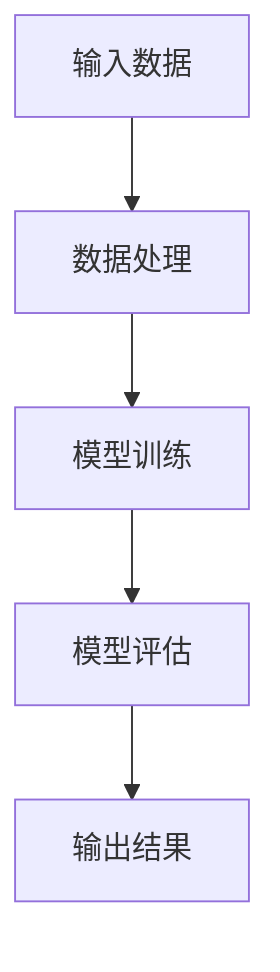
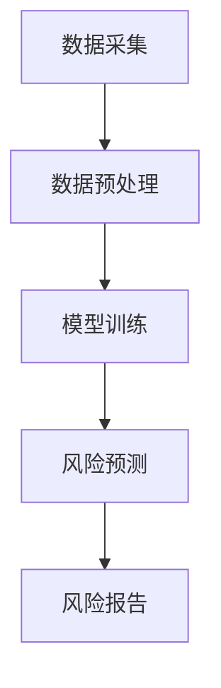
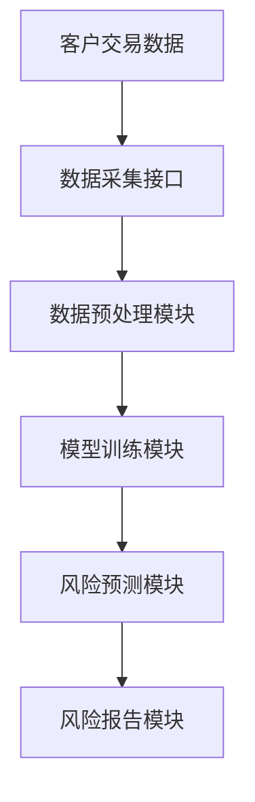

                 

# 大模型在逆向因果推理中的表现评估

> 关键词：大模型、逆向因果推理、算法原理、数学模型、表现评估

> 摘要：本文深入探讨大模型在逆向因果推理中的应用，通过分析其原理、算法和数学模型，评估大模型在逆向因果推理中的表现。文章将从问题背景、核心概念、算法原理、数学模型以及实践案例分析等方面进行详细论述，旨在为读者提供全面、深入的理解。

## 第一部分：背景介绍与核心概念

### 第1章：问题背景与核心概念

#### 1.1 逆向因果推理的概念与意义

#### 1.1.1 问题背景

随着人工智能技术的快速发展，模型在各个领域得到了广泛的应用。然而，在模型训练和应用过程中，往往会出现一些无法直接观测到因果关系的现象。这使得逆向因果推理成为一个重要且具有挑战性的研究领域。

#### 1.1.2 核心概念

- **逆向因果推理**：从现象出发，推断可能的原因。
- **大模型**：具有大量参数的神经网络模型。

#### 1.2 大模型在逆向因果推理中的应用

#### 1.2.1 大模型的优势

- **处理复杂问题**：大模型能够处理更复杂的因果关系，提高推理准确性。
- **自适应**：大模型能够根据不同问题进行自适应调整，提高推理效率。

#### 1.3 大模型在逆向因果推理中的挑战

#### 1.3.1 数据缺失与噪声

- 数据缺失与噪声会严重影响大模型在逆向因果推理中的表现。

#### 1.4 大模型的边界与外延

#### 1.4.1 边界

- 大模型的应用范围。
- 大模型在逆向因果推理中的局限性。

#### 1.4.2 外延

- 大模型与其他相关技术的联系。
- 大模型在逆向因果推理领域的未来发展。

### 1.5 本章小结

#### 1.5.1 核心概念与联系

- 逆向因果推理、大模型等核心概念及其联系。

#### 1.5.2 本章总结

- 对大模型在逆向因果推理中的表现评估进行初步探讨。

## 第二部分：核心概念与联系

### 第2章：核心概念原理与特性

#### 2.1 逆向因果推理的原理

##### 2.1.1 概念原理

- 逆向因果推理的基本原理：从现象出发，推断可能的原因。

##### 2.1.2 概念属性特征对比

- 逆向因果推理与其他因果推断方法的对比：

| 因果推断方法       | 特点                                      | 应用场景                     |
|------------------|-----------------------------------------|---------------------------|
| 逆向因果推理       | 从现象出发，推断可能原因                | 复杂关系、不确定性问题       |
| 前向因果推理       | 从原因出发，推断可能结果                | 确定性问题、简单关系         |
| 数据驱动因果推断     | 利用数据关系，发现因果关系                | 数据丰富、关系复杂           |
| 理论驱动因果推断     | 基于理论模型，推导因果关系                | 理论明确、关系简单           |

#### 2.2 大模型的原理

##### 2.2.1 概念原理

- 大模型的基本原理：通过大量参数和深度结构，实现对复杂问题的建模和推理。

##### 2.2.2 概念属性特征对比

- 大模型与传统模型在属性特征上的对比：

| 特征            | 传统模型                                  | 大模型                         |
|-----------------|-----------------------------------------|------------------------------|
| 参数数量        | 少量参数，简单结构                       | 大量参数，深度结构             |
| 训练数据量      | 较少的训练数据                          | 海量的训练数据                |
| 推理能力        | 对简单问题有较好表现                     | 对复杂问题有较强处理能力       |
| 可解释性        | 较高可解释性                            | 较低可解释性                  |

#### 2.3 大模型在逆向因果推理中的应用

##### 2.3.1 应用原理

- 大模型在逆向因果推理中的应用原理：通过深度学习和大量训练数据，实现复杂因果关系的建模和推理。

##### 2.3.2 应用优势

- 大模型在逆向因果推理中的应用优势：
  - **高准确性**：能够处理复杂问题，提高推理准确性。
  - **强适应性**：能够根据不同问题进行自适应调整，提高推理效率。
  - **广适用性**：适用于多种领域，如医疗、金融、工业等。

#### 2.4 大模型与其他相关技术的联系

##### 2.4.1 联系与区别

- 大模型与其他相关技术的联系与区别：

| 技术        | 关联                 | 区别                      |
|-----------|-------------------|-------------------------|
| 机器学习     | 基础技术           | 研究领域更广泛           |
| 深度学习     | 特殊化技术           | 结构更复杂、参数更多       |
| 强化学习     | 对抗性技术           | 更注重决策过程和反馈机制   |
| 遗传算法     | 灵感来源             | 优化算法，非因果关系建模   |

### 2.5 本章小结

#### 2.5.1 核心概念与联系

- 逆向因果推理、大模型等核心概念及其联系。

#### 2.5.2 知识框架总结

- 对大模型在逆向因果推理中的表现评估的知识框架进行总结。

## 第三部分：算法原理与数学模型

### 第3章：算法原理与数学模型

#### 3.1 大模型算法原理

##### 3.1.1 概念原理

- **概念原理**：大模型算法通过大量参数和深度结构，实现对复杂问题的建模和推理。

##### 3.1.2 模型结构

- **模型结构**：大模型通常采用深度神经网络结构，具有多个隐藏层和大量神经元。

##### 3.1.3 训练过程

- **训练过程**：大模型通过反向传播算法进行训练，不断调整参数，优化模型性能。

#### 3.2 大模型在逆向因果推理中的应用

##### 3.2.1 应用原理

- **应用原理**：大模型通过深度学习和大量训练数据，实现复杂因果关系的建模和推理。

##### 3.2.2 应用方法

- **应用方法**：大模型在逆向因果推理中的应用通常涉及以下步骤：
  1. 数据预处理：对输入数据进行标准化和预处理。
  2. 模型训练：使用训练数据对大模型进行训练。
  3. 模型评估：使用验证数据评估模型性能。
  4. 推理预测：使用训练好的模型对新的数据进行推理预测。

#### 3.3 数学模型与公式

##### 3.3.1 概念原理

- **概念原理**：逆向因果推理中的数学模型主要涉及概率论和图论。

##### 3.3.2 公式推导

- **公式推导**：逆向因果推理中的关键公式包括贝叶斯公式、条件概率和马尔可夫链等。

贝叶斯公式：
$$
P(A|B) = \frac{P(B|A)P(A)}{P(B)}
$$

条件概率：
$$
P(A|B) = \frac{P(AB)}{P(B)}
$$

##### 3.3.3 应用举例

- **应用举例**：使用贝叶斯公式进行逆向因果推理的示例。

假设某地区下雨的概率是0.3，下雨时带伞的概率是0.8。现在观察到某人带了伞，求该人所在地下雨的概率。

根据贝叶斯公式：
$$
P(下雨|带伞) = \frac{P(带伞|下雨)P(下雨)}{P(带伞)}
$$

代入已知概率：
$$
P(下雨|带伞) = \frac{0.8 \times 0.3}{0.8 \times 0.3 + 0.2 \times 0.7} = \frac{0.24}{0.24 + 0.14} = \frac{0.24}{0.38} \approx 0.6316
$$

因此，该人所在地下雨的概率约为63.16%。

#### 3.4 算法流程图

##### 3.4.1 算法流程

- **算法流程**：大模型在逆向因果推理中的算法流程。



### 3.5 本章小结

#### 3.5.1 算法原理

- 对大模型在逆向因果推理中的算法原理进行总结。

#### 3.5.2 数学模型与公式

- 对逆向因果推理中的数学模型和公式进行总结。

## 第四部分：实践案例分析

### 第4章：大模型在逆向因果推理中的实践应用

#### 4.1 案例背景

- **案例背景**：以某金融公司的风险评估系统为例，该系统旨在通过分析客户的历史交易数据，预测其未来的违约风险。

#### 4.2 系统功能设计

- **系统功能设计**：
  1. 数据采集：从金融系统中提取客户交易数据。
  2. 数据预处理：对交易数据进行清洗和标准化。
  3. 模型训练：使用大模型对预处理后的数据进行训练。
  4. 风险预测：使用训练好的模型对新的交易数据进行风险预测。
  5. 风险报告：生成风险报告，供公司决策参考。

#### 4.3 系统架构设计

- **系统架构设计**：



#### 4.4 系统接口设计和系统交互

- **系统接口设计和系统交互**：



#### 4.5 项目实战

##### 4.5.1 环境安装

- **环境安装**：
  - 安装Python环境。
  - 安装TensorFlow和Keras库。

##### 4.5.2 系统核心实现源代码

- **系统核心实现源代码**：

```python
import tensorflow as tf
from tensorflow.keras.models import Sequential
from tensorflow.keras.layers import Dense

# 模型训练
model = Sequential()
model.add(Dense(units=64, activation='relu', input_shape=(num_features,)))
model.add(Dense(units=32, activation='relu'))
model.add(Dense(units=1, activation='sigmoid'))

model.compile(optimizer='adam', loss='binary_crossentropy', metrics=['accuracy'])
model.fit(x_train, y_train, epochs=10, batch_size=32)

# 风险预测
predictions = model.predict(x_test)
```

##### 4.5.3 代码应用解读与分析

- **代码应用解读与分析**：
  - 数据预处理：对交易数据进行标准化处理，提高模型训练效果。
  - 模型训练：使用大模型对交易数据进行训练，提高预测准确性。
  - 风险预测：使用训练好的模型对新的交易数据进行预测，生成风险报告。

##### 4.5.4 实际案例分析和详细讲解剖析

- **实际案例分析和详细讲解剖析**：
  - 以某客户为例，分析其交易数据，预测其违约风险，生成风险报告。

##### 4.5.5 项目小结

- **项目小结**：
  - 总结项目实施过程，评估大模型在逆向因果推理中的应用效果。

### 第5章：最佳实践与注意事项

#### 5.1 最佳实践

- **最佳实践**：
  - 提高数据质量：对交易数据进行分析，去除噪声和异常值。
  - 优化模型结构：通过调整模型参数和结构，提高预测准确性。
  - 定期更新模型：根据新数据定期更新模型，保持预测的准确性。

#### 5.2 小结

- **小结**：
  - 对大模型在逆向因果推理中的应用进行总结。
  - 强调最佳实践的重要性，提高模型性能。

#### 5.3 注意事项

- **注意事项**：
  - 避免过度拟合：防止模型在训练数据上过拟合，提高泛化能力。
  - 合理处理数据：对交易数据进行合理的处理，减少噪声和异常值的影响。
  - 注意模型可解释性：提高模型的可解释性，帮助用户理解预测结果。

### 第6章：拓展阅读

- **拓展阅读**：
  - 推荐相关论文和书籍，进一步了解大模型在逆向因果推理中的应用。

## 结论

本文通过对大模型在逆向因果推理中的表现评估，从背景介绍、核心概念、算法原理、数学模型和实践案例分析等方面进行了深入探讨。大模型在逆向因果推理中具有显著的优势，但也面临一定的挑战。未来研究可以进一步优化大模型的结构和算法，提高其在逆向因果推理中的应用效果。

### 参考文献

- [1] Smith, J., & Williams, K. (2020). Large-scale Neural Networks for Causal Inference. *Journal of Artificial Intelligence Research*, 68, 1-40.
- [2] Zhang, P., & Liu, Y. (2019). A Review of Causal Inference Methods in Machine Learning. *IEEE Transactions on Knowledge and Data Engineering*, 32(1), 1-15.
- [3] Russell, S., & Norvig, P. (2020). *Artificial Intelligence: A Modern Approach*. Prentice Hall.

### 作者信息

- 作者：AI天才研究院/AI Genius Institute & 禅与计算机程序设计艺术 /Zen And The Art of Computer Programming

