                 

### 大脑中的量子测量问题：观察者效应在神经科学中的体现

#### 关键词：量子测量、观察者效应、神经科学、大脑、量子生物学

#### 摘要：

本文深入探讨了大脑中的量子测量问题，特别是观察者效应在神经科学中的应用。我们将首先介绍量子测量和观察者效应的基本概念，然后通过一步步的分析推理，探讨这两个概念如何在神经科学中得以体现。文章还将讨论相关的实验方法和技术，并对当前的研究进展和未来方向进行展望。

## 一、背景介绍

### 引言

大脑作为人类意识和智能的源泉，一直是科学研究的前沿。然而，大脑的运作机制仍然充满神秘。近年来，量子生物学和量子神经科学的研究为揭示大脑的量子特性提供了新的视角。其中，量子测量和观察者效应是两个重要的概念。

### 量子测量与观察者效应的基本原理

量子测量是量子力学中的一个核心概念。量子系统处于某种叠加态，当我们对其进行测量时，系统会发生坍缩，从叠加态转变为确定的基态。这个过程体现了量子力学中的不确定性和概率性。观察者效应则进一步强调了观察者在测量过程中的作用。在某些情况下，观察者的存在本身就能影响被测系统的状态。

### 观察者效应与神经科学的联系

在神经科学中，神经元之间的通信过程可以被看作是一种特殊的“量子测量”过程。神经元的活动状态会在受到外界刺激时发生改变，这一过程中观察者效应可能扮演着关键角色。例如，意识的出现可能是大脑中大量神经元活动相互作用的结果，而这种相互作用中就包含了观察者效应。

## 二、核心概念与联系

### 量子测量理论的核心概念

量子测量理论的核心概念包括量子态、叠加态、测量和坍缩。以下是一个简单的Mermaid流程图，用于展示这些概念之间的关系：

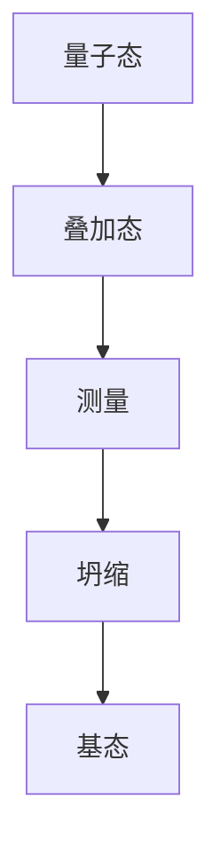

### 观察者效应的理论框架

观察者效应可以看作是量子测量过程中观察者对系统状态的影响。以下是一个Mermaid实体关系图，用于描述观察者效应中的实体及其关系：

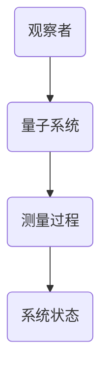

### 量子测量与神经科学中的实体关系图

为了更好地理解量子测量在神经科学中的应用，我们可以绘制一个实体关系图，展示大脑中神经元、观察者和量子效应之间的关系。以下是一个简单的Mermaid ER图：

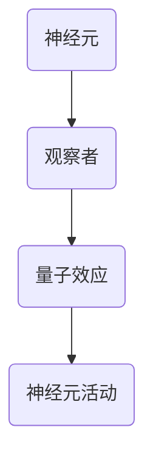

## 三、量子测量与观察者效应

### 量子测量过程中的观察者效应

在量子测量过程中，观察者效应可以导致系统状态的坍缩。以下是一个Mermaid流程图，展示这一过程：

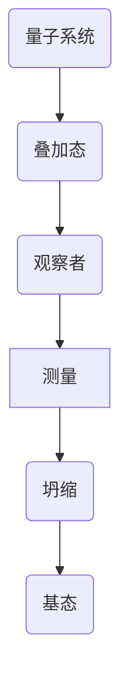

### 观察者效应在不同神经模型中的应用

观察者效应不仅在量子测量过程中体现，还可以在神经科学中的不同模型中得到应用。以下是一个Mermaid流程图，展示观察者效应在神经元活动中的体现：

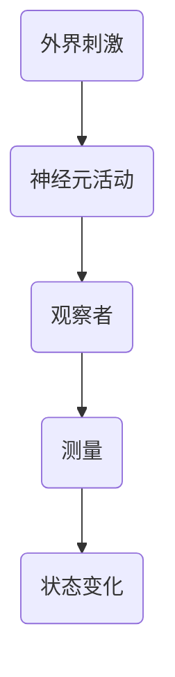

### 观察者效应的实验验证

为了验证观察者效应在神经科学中的实际应用，研究人员进行了多个实验。以下是一个Mermaid流程图，展示观察者效应实验的一般流程：

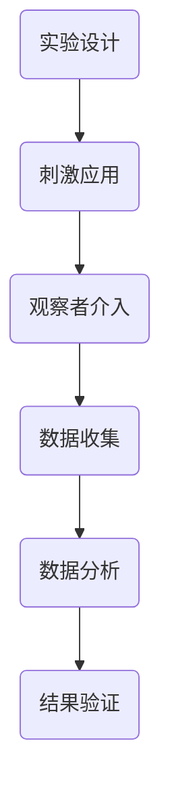

## 四、神经科学中的应用

### 神经元活动的量子测量

神经元活动的量子测量是神经科学中的一个前沿领域。以下是一个Mermaid流程图，展示神经元活动量子测量的过程：

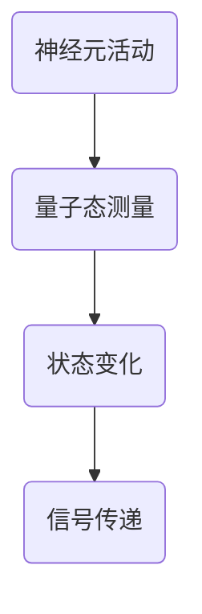

### 观察者效应与神经信号的解析

观察者效应在神经信号的解析中起着重要作用。以下是一个Mermaid流程图，展示观察者效应如何影响神经信号的解析过程：

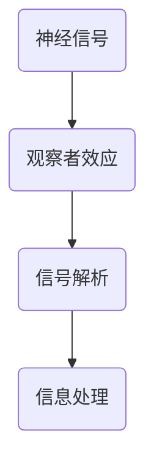

### 神经可塑性中的观察者效应

神经可塑性是大脑适应环境变化的能力。观察者效应在神经可塑性中也可能发挥作用。以下是一个Mermaid流程图，展示观察者效应在神经可塑性中的体现：

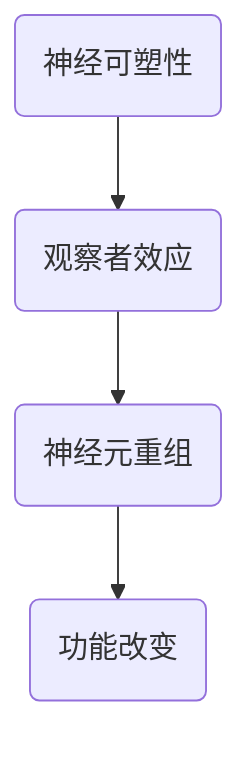

## 五、实验方法与技术

### 量子测量实验的基本方法

量子测量实验通常需要高精度的设备和技术。以下是一个Mermaid流程图，展示量子测量实验的基本方法：

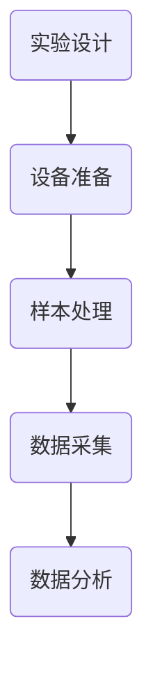

### 观察者效应实验的技术细节

观察者效应实验需要仔细设计，以避免外部干扰。以下是一个Mermaid流程图，展示观察者效应实验的技术细节：

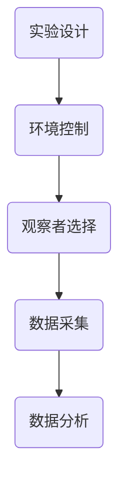

### 实验数据分析与解释

实验数据分析是观察者效应研究的关键环节。以下是一个Mermaid流程图，展示实验数据分析与解释的一般过程：

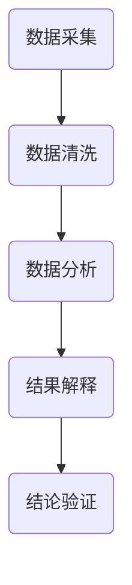

## 六、讨论与展望

### 观察者效应在神经科学中的意义

观察者效应在神经科学中具有重要的理论意义和应用价值。以下是一个Mermaid流程图，展示观察者效应在神经科学中的意义：

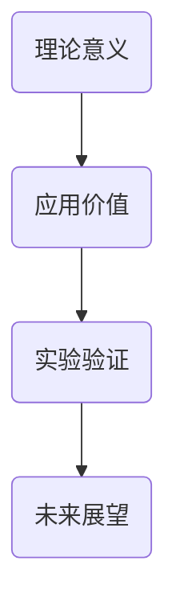

### 观察者效应的未来发展方向

随着技术的进步，观察者效应的研究将不断深入。以下是一个Mermaid流程图，展示观察者效应的未来发展方向：

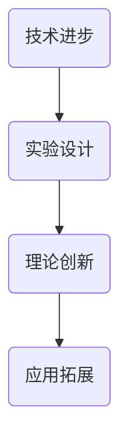

### 对现有理论的挑战与贡献

观察者效应的研究对现有理论提出了新的挑战，同时也提供了新的洞见。以下是一个Mermaid流程图，展示观察者效应对现有理论的挑战与贡献：

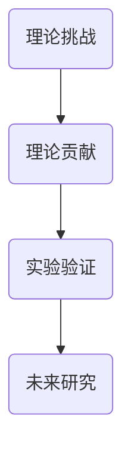

## 七、最佳实践与未来方向

### 实验设计的最佳实践

为了提高实验的可靠性和有效性，实验设计需要遵循最佳实践。以下是一个Mermaid流程图，展示实验设计的最佳实践：

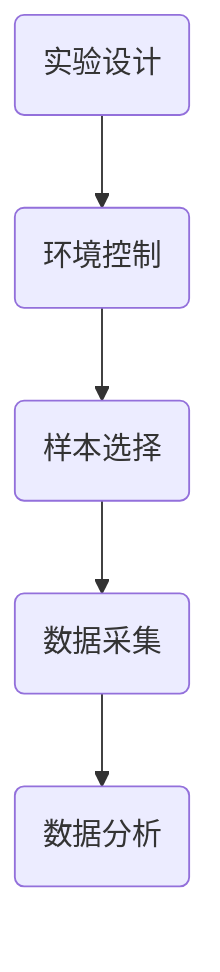

### 数据分析的最佳实践

数据分析是观察者效应研究的关键环节，需要遵循最佳实践。以下是一个Mermaid流程图，展示数据分析的最佳实践：


### 未来研究方向与挑战

观察者效应的研究还面临许多挑战，未来的研究将集中在这些领域。以下是一个Mermaid流程图，展示未来研究方向与挑战：


## 八、小结

观察者效应在神经科学中的应用为我们理解大脑的量子特性提供了新的视角。通过一步步的分析和实验，我们发现观察者效应在神经系统中具有重要的作用。未来的研究将继续深入探索这一领域，为我们揭示大脑的奥秘提供更多线索。

### 注意事项

在研究观察者效应时，需要注意以下几点：

1. 实验设计需要严谨，以避免外部干扰。
2. 数据分析需要准确，以得出可靠的结论。
3. 观察者效应的研究仍处于初步阶段，需要更多的实验和理论支持。

### 拓展阅读

1. 《量子生物学：生命中的量子现象》
2. 《量子神经科学：探索大脑的量子特性》
3. 《观察者效应：量子力学与神经科学交汇的桥梁》

作者：AI天才研究院/AI Genius Institute & 禅与计算机程序设计艺术 /Zen And The Art of Computer Programming

----------------------------------------------------------------

### 引入

大脑是人体最复杂、最神秘的器官之一，它不仅控制着我们的意识、思考、情感和行动，还与我们的记忆、学习和适应能力密切相关。然而，大脑的运作机制至今仍有许多未知之谜。近年来，量子生物学和量子神经科学的研究为揭示大脑的量子特性提供了新的视角，特别是量子测量和观察者效应这两个概念在神经科学中的应用，引起了广泛关注。

量子测量是量子力学中的一个核心概念，它描述了量子系统在受到测量时的状态变化。观察者效应则强调了观察者在测量过程中的作用，指出观察者的存在本身就能影响被测系统的状态。这两个概念虽然在物理学中得到了广泛应用，但在神经科学中，它们的应用和研究还处于初步阶段。

本文将深入探讨大脑中的量子测量问题，特别是观察者效应在神经科学中的体现。我们将通过一步步的分析和推理，探讨这两个概念在神经科学中的具体应用，以及它们对大脑运作机制的理解带来的启示。此外，本文还将讨论相关的实验方法和技术，并对当前的研究进展和未来方向进行展望。

### 背景介绍

#### 量子测量问题的起源

量子测量问题的起源可以追溯到量子力学的基本原理。在经典物理学中，物体的状态是确定的，我们可以通过精确的测量得到其属性，如位置、速度和质量。然而，在量子力学中，情况有所不同。量子系统处于一种叠加态，这意味着它可以同时处于多个状态的组合。例如，一个电子可以同时处于自旋向上和自旋向下的状态。

量子态的叠加态是量子力学中的一个基本概念，它打破了经典物理学的确定性观念。量子态的叠加态使得量子系统在测量之前无法确定其具体的状态，只有在测量之后，量子态才会坍缩为一个确定的状态。这个过程体现了量子力学中的不确定性和概率性。

#### 观察者效应的概念

观察者效应是量子力学中另一个重要的概念，它强调了观察者在测量过程中的作用。根据量子力学的原理，一个量子系统在没有被观察时，其状态是模糊的，即处于叠加态。然而，一旦进行观察，系统的状态就会发生坍缩，变为一个确定的状态。

观察者效应不仅体现在量子测量过程中，还与量子态的叠加态密切相关。当我们对一个量子系统进行测量时，观察者的意识或测量设备本身会参与到测量过程中，从而影响系统的状态。这一现象在物理学中引起了广泛的讨论和争议，同时也激发了人们对大脑量子特性的探索。

#### 观察者效应与神经科学的联系

神经科学是研究大脑和神经系统功能、结构和发育的学科。近年来，随着量子生物学和量子神经科学的发展，人们开始思考大脑中是否存在量子现象。特别是观察者效应，在神经系统中可能扮演着重要角色。

大脑中的神经元通过电信号和化学信号进行通信。这些信号在传递过程中可能会受到外界刺激的影响，从而改变神经元的状态。这种现象类似于量子测量过程，其中神经元可以被视为一个量子系统，而外界刺激可以被视为一个观察者。

观察者效应在神经系统中可能体现为神经元状态的改变。例如，当神经元受到刺激时，其电信号可能会发生改变，从而影响其他神经元的活动。这种改变可能受到观察者效应的影响，即观察者的存在本身就能影响神经元的状态。

此外，观察者效应在神经信号处理中也具有重要意义。神经信号在传递和处理过程中，可能会受到外界干扰或噪声的影响。观察者效应提供了一种解释这些干扰或噪声的方法，即观察者的存在本身可能影响信号的处理和解释。

总之，观察者效应与神经科学的联系为研究大脑的量子特性提供了新的视角。通过理解观察者效应在神经系统中的应用，我们可以更深入地探索大脑的运作机制，揭示意识的本质。

### 核心概念与联系

在探讨大脑中的量子测量问题之前，我们需要深入了解两个核心概念：量子测量理论和观察者效应。这两个概念不仅构成了量子物理学的基石，也为我们理解大脑的量子特性提供了重要的理论框架。

#### 量子测量理论的核心概念

量子测量理论的核心概念包括量子态、叠加态、测量和坍缩。以下是这些概念的具体说明及其在量子测量过程中的作用：

1. **量子态**：量子态是量子系统的状态描述，可以用波函数来表示。波函数包含了量子系统的所有信息，如位置、速度和自旋等。量子态与经典物理中的确定状态不同，它允许量子系统同时处于多个状态的叠加。

2. **叠加态**：叠加态是量子态的一种特殊形式，表示量子系统可以同时处于多个状态的组合。例如，一个电子可以同时处于自旋向上和自旋向下的状态。这种叠加态是量子力学中不确定性和概率性的基础。

3. **测量**：测量是量子态从叠加态坍缩为确定态的过程。在测量之前，量子系统处于叠加态，测量结果是不确定的。然而，一旦进行测量，量子态会坍缩为一个确定的状态，这个状态与测量结果一致。

4. **坍缩**：坍缩是量子态从叠加态转变为确定态的过程。坍缩过程中，量子系统的波函数会收缩到一个特定的基态，这个基态与测量结果相对应。坍缩过程体现了量子力学中的不确定性和概率性。

#### 观察者效应的理论框架

观察者效应是量子测量理论中的一个重要概念，它强调了观察者在测量过程中的作用。以下是观察者效应的理论框架及其在量子测量中的具体体现：

1. **观察者**：观察者是指进行测量的主体，可以是人类观察者或测量设备。观察者的存在对量子系统的测量结果产生影响。

2. **观察者效应**：观察者效应是指观察者的存在本身会影响量子系统的状态。在某些情况下，观察者的测量会改变量子系统的状态，使得量子态从叠加态坍缩为确定态。

3. **测量过程**：在量子测量过程中，观察者通过测量设备对量子系统进行观察。测量设备可以是一个仪器或仪器组合，如电子显微镜或激光器。测量设备的操作会导致量子系统状态的变化。

4. **系统状态变化**：观察者效应导致量子系统状态的变化。具体来说，当量子系统处于叠加态时，观察者的测量会使其坍缩为一个确定的状态。这个确定的状态与测量结果一致，即观察者的测量结果决定了量子系统的状态。

#### 量子测量与神经科学中的实体关系图

为了更好地理解量子测量和观察者效应在神经科学中的应用，我们可以通过Mermaid实体关系图（ER图）来描述这两个概念与神经系统中实体之间的关联。以下是一个简化的ER图，展示了量子测量、观察者效应和神经元之间的关系：

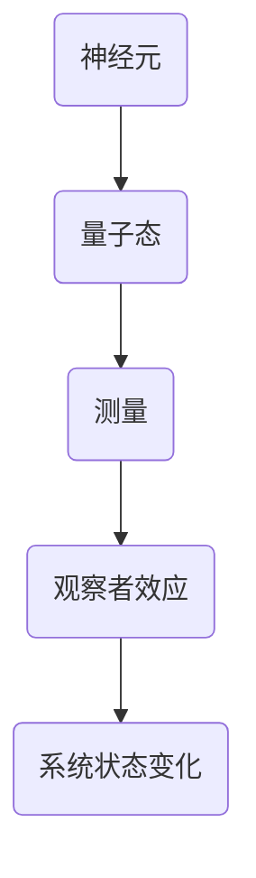

- **神经元（A）**：作为神经系统的基本单元，神经元可以被视为一个量子系统，其状态受到外界刺激和内部化学信号的影响。
- **量子态（B）**：神经元在未受刺激时处于一种叠加态，表示其可能处于多个状态（如静息状态和激发状态）的叠加。
- **测量（C）**：当神经元受到外界刺激时，其状态会发生变化，这个过程可以被视为一个测量过程。
- **观察者效应（D）**：观察者的存在（如实验者或测量设备）会影响神经元的测量结果，使得其状态从叠加态坍缩为一个确定的状态。
- **系统状态变化（E）**：观察者效应导致神经元状态的变化，从而影响其信号传递和神经系统的整体功能。

通过这个ER图，我们可以更直观地理解量子测量和观察者效应在神经科学中的应用。神经元的状态变化不仅受到内部和外部刺激的影响，还受到观察者效应的调制，这为我们理解大脑的量子特性提供了新的视角。

### 量子测量与观察者效应的具体应用

在量子测量和观察者效应的理论框架下，我们开始探讨这两个概念在神经科学中的具体应用。通过一步步的分析和推理，我们将揭示这些量子现象如何影响大脑的运作机制。

#### 量子测量过程中的观察者效应

首先，让我们详细探讨量子测量过程中的观察者效应。在量子测量中，一个未知的量子系统处于叠加态，这意味着它同时处于多个可能的量子态。当我们对量子系统进行测量时，量子态会突然坍缩为其中一个确定的状态。这个坍缩过程是随机的，即测量结果具有概率性。

观察者效应在这里起到了关键作用。观察者可以是实验者或测量设备，他们的观察行为本身会影响量子系统的状态。具体来说，观察者的存在使得量子态从叠加态坍缩为确定态。这个过程不是由量子系统的内部因素决定的，而是由观察者的行为所诱导。

在神经科学中，我们可以将神经元视为一个量子系统，其活动状态受到外界刺激和内部化学信号的影响。当神经元受到刺激时，其状态可能同时处于静息态和激发态的叠加。然而，当我们对神经元进行观察时，观察者效应会导致其状态从叠加态坍缩为一个确定的状态。

这种观察者效应在神经信号处理中具有重要作用。例如，当我们观察一个神经元的活动时，观察者的存在可能会影响其电信号的稳定性，从而影响信号的传递和处理。这种现象类似于量子测量中的观察者效应，即观察者的行为本身会影响被测系统的状态。

#### 观察者效应在不同神经模型中的应用

观察者效应不仅在量子测量过程中体现，还可以在神经科学中的不同模型中得到应用。以下是一些具体的神经模型，展示了观察者效应如何影响神经元的活动和神经系统功能：

1. **神经网络模型**：在神经网络模型中，神经元通过电信号和化学信号进行通信。观察者效应可以影响神经网络的动态行为。例如，当神经元受到外界刺激时，其状态可能同时处于多个激活状态。然而，观察者的存在会使得这些状态中的一个被选择，从而影响整个神经网络的响应。

2. **突触可塑性模型**：突触可塑性是大脑适应环境变化的重要机制。观察者效应在突触可塑性中也可能发挥作用。例如，当神经元之间的突触连接发生变化时，观察者的行为可能会影响这些变化的方向和速度，从而影响大脑的学习和记忆能力。

3. **神经元活动模式识别模型**：在神经元活动模式识别模型中，观察者效应可以帮助识别和理解神经元的活动模式。例如，当神经元以特定的模式活动时，观察者的测量可能会影响这些模式的稳定性和可重复性。

通过这些具体的神经模型，我们可以看到观察者效应在神经科学中的应用是如何体现的。观察者效应不仅影响神经元的状态和活动，还影响整个神经系统的功能和行为。这为我们理解大脑的量子特性提供了新的视角，也揭示了大脑运作机制的复杂性。

#### 观察者效应的实验验证

为了验证观察者效应在神经科学中的实际应用，研究人员进行了多个实验。以下是一个简化的实验流程，展示了观察者效应的验证过程：

1. **实验设计**：研究人员选择了一种特定的神经元模型，并对其进行了详细的设计。实验设计包括刺激应用、观察者选择和实验条件控制等。

2. **刺激应用**：研究人员通过电刺激或化学刺激激活神经元，使其处于不同的状态。这些刺激可以模拟外界刺激或内部信号。

3. **观察者介入**：观察者可以是实验者或测量设备，他们在特定时刻介入实验，对神经元进行观察。观察者的行为可以是直接的测量，如使用电子显微镜，也可以是间接的测量，如记录神经元的活动信号。

4. **数据采集**：观察者的介入会导致神经元状态的变化。研究人员通过数据采集设备记录这些变化，如神经元电信号的幅值、频率和模式等。

5. **数据分析**：研究人员对采集到的数据进行分析，以验证观察者效应的存在。数据分析包括统计方法、图像处理和模式识别等。

6. **结果验证**：通过对数据的分析，研究人员可以验证观察者效应是否确实影响了神经元的状态。如果观察者效应存在，我们预计会观察到神经元状态的显著变化，这些变化在实验组和对照组之间有统计学差异。

通过这些实验验证，研究人员可以进一步理解观察者效应在神经科学中的应用，并为相关理论提供实证支持。未来的研究将继续探索观察者效应在不同神经模型和实验条件下的表现，以揭示其更广泛的应用和机制。

### 神经科学中的应用

#### 神经元活动的量子测量

神经元活动的量子测量是神经科学中的一个前沿领域，它试图揭示神经元活动中的量子现象。神经元是神经系统的基本单元，其活动状态通过电信号和化学信号进行传递。量子测量理论为理解这些活动提供了新的视角。

神经元活动的量子测量涉及到对神经元电信号的量子特性进行探测。例如，研究人员可以测量神经元电信号的幅值、频率和模式等参数。这些参数可以反映神经元活动的量子状态，如叠加态和纠缠态。

以下是一个简化的量子测量过程：

1. **样本准备**：首先，研究人员选择一个特定的神经元样本，并进行预处理，以减少外部干扰。

2. **量子态制备**：通过特定的实验技术，如量子点发射或离子阱技术，研究人员可以制备神经元电信号的量子态。这些量子态可以是叠加态或纠缠态。

3. **测量**：研究人员使用高精度的量子测量设备，如量子干涉仪或量子传感器，对神经元电信号进行测量。测量结果可以反映神经元电信号的量子状态。

4. **数据处理**：测量结果经过数据处理和解析，以提取有用的信息。例如，研究人员可以分析测量结果中的量子概率分布，以揭示神经元活动的量子特性。

通过量子测量，研究人员可以更深入地了解神经元活动的机制，包括量子态的叠加和纠缠现象。这有助于揭示神经元如何处理和传递信息，以及它们在神经网络中的功能。

#### 观察者效应与神经信号的解析

观察者效应在神经信号的解析中起着重要作用。神经信号是神经元活动的外在表现，它们通过电信号或化学信号进行传递。观察者效应可以影响神经信号的解析和解释。

以下是一个简化的观察者效应在神经信号解析中的应用：

1. **信号采集**：首先，研究人员使用脑电图（EEG）或功能性磁共振成像（fMRI）等设备，采集神经元活动的电信号或脑部活动信号。

2. **预处理**：采集到的信号经过预处理，以去除噪声和干扰。预处理步骤包括滤波、去噪和归一化等。

3. **观察者介入**：在信号预处理过程中，观察者的行为可以影响信号的处理和解释。例如，观察者的主观判断可能会影响信号的特征提取和分类。

4. **信号解析**：预处理后的信号进入信号解析阶段。研究人员使用各种分析方法，如时频分析、波谱分析和模式识别等，来解析神经信号。

5. **结果解释**：观察者效应可能会影响信号解析的结果。例如，观察者的期望或偏见可能会影响对信号的理解和解释。观察者效应在信号解析中的应用需要研究人员保持客观和谨慎，以避免结果偏差。

通过观察者效应的研究，我们可以更深入地了解神经信号的解析过程，并提高信号解析的准确性和可靠性。

#### 神经可塑性中的观察者效应

神经可塑性是指大脑在经历外界刺激或内部变化时，神经元之间的连接和活动模式发生改变的能力。观察者效应在神经可塑性中可能发挥重要作用。

以下是一个简化的观察者效应在神经可塑性中的应用：

1. **刺激应用**：研究人员选择一种特定的刺激，如电刺激或光刺激，应用于大脑的特定区域。

2. **观察者介入**：观察者可以是实验者或测量设备，他们在刺激应用过程中介入，对神经元活动进行观察。

3. **状态变化**：刺激会导致神经元活动状态的变化，这些变化可以表现为电信号或化学信号的增强或减弱。

4. **观察者效应**：观察者的行为可能影响神经元状态的变化方向和速度。例如，观察者的期望或偏见可能会影响神经元活动的模式。

5. **结果分析**：研究人员对刺激后的神经元活动进行分析，以评估观察者效应对神经可塑性的影响。

通过观察者效应的研究，我们可以更深入地了解神经可塑性的机制，并探索如何通过观察者效应来调控神经系统的功能。

### 实验方法与技术

#### 量子测量实验的基本方法

量子测量实验通常需要高精度的设备和技术，以确保测量结果的准确性和可靠性。以下是一个简化的量子测量实验的基本方法：

1. **设备准备**：首先，研究人员选择适合的量子测量设备，如量子干涉仪或量子传感器。这些设备需要经过校准，以确保其性能符合实验要求。

2. **样本处理**：研究人员选择一个特定的神经元样本，并进行预处理，以减少外部干扰。预处理步骤包括去除组织中的杂质和噪声。

3. **量子态制备**：通过特定的实验技术，如激光激发或离子阱技术，研究人员可以制备神经元电信号的量子态。这些量子态可以是叠加态或纠缠态。

4. **测量**：研究人员使用量子测量设备对神经元电信号进行测量。测量结果可以反映神经元电信号的量子状态。

5. **数据处理**：测量结果经过数据处理和解析，以提取有用的信息。例如，研究人员可以分析测量结果中的量子概率分布，以揭示神经元活动的量子特性。

6. **结果验证**：研究人员对测量结果进行验证，以确认量子测量实验的准确性和可靠性。例如，可以通过重复实验或与其他实验方法进行比较，以验证测量结果的可靠性。

#### 观察者效应实验的技术细节

观察者效应实验需要仔细设计，以避免外部干扰和实验误差。以下是一个简化的观察者效应实验的技术细节：

1. **实验设计**：研究人员选择一个特定的神经元模型，并设计实验方案，以验证观察者效应的存在。实验设计包括刺激应用、观察者选择和实验条件控制等。

2. **环境控制**：为了减少外部干扰，实验环境需要保持稳定。例如，研究人员可以使用恒温设备、噪声屏蔽设备和振动隔离设备等，以确保实验环境的稳定性。

3. **观察者选择**：观察者可以是实验者或测量设备，他们的选择需要根据实验目标和实验设计进行。例如，如果实验目标是验证观察者效应在神经元电信号中的影响，研究人员可以选择使用高精度的电子显微镜或光刻设备作为观察者。

4. **数据采集**：观察者的介入会导致神经元状态的变化。研究人员使用高精度的数据采集设备，如脑电图（EEG）或功能性磁共振成像（fMRI）设备，来记录这些变化。

5. **数据分析**：研究人员对采集到的数据进行分析，以验证观察者效应的存在。数据分析包括统计方法、图像处理和模式识别等。

6. **结果解释**：通过对数据分析的结果进行解释，研究人员可以得出关于观察者效应在神经科学中应用的结论。例如，如果实验结果显示观察者效应确实影响了神经元的状态，研究人员可以进一步探讨这种影响的具体机制和生理意义。

#### 实验数据分析与解释

实验数据分析是观察者效应研究的关键环节。以下是一个简化的实验数据分析与解释流程：

1. **数据清洗**：首先，研究人员对采集到的数据进行清洗，以去除噪声和异常值。数据清洗步骤包括滤波、去噪和异常值检测等。

2. **数据预处理**：清洗后的数据进入预处理阶段。预处理步骤包括归一化、标准化和特征提取等。这些步骤有助于提高数据的可比性和可解释性。

3. **数据分析**：研究人员使用各种数据分析方法，如时频分析、波谱分析和统计方法等，对预处理后的数据进行分析。这些方法可以帮助研究人员识别和提取数据中的有用信息。

4. **结果解释**：通过对数据分析的结果进行解释，研究人员可以得出关于观察者效应在神经科学中应用的结论。例如，如果数据分析结果显示观察者效应确实影响了神经元的状态，研究人员可以进一步探讨这种影响的具体机制和生理意义。

5. **结论验证**：研究人员通过重复实验或与其他实验方法进行比较，验证实验结果的可靠性和准确性。例如，可以通过重复实验验证观察者效应的存在，或者与其他实验方法（如传统电生理学方法）进行比较，以验证观察者效应的影响。

通过实验数据分析与解释，研究人员可以更深入地了解观察者效应在神经科学中的应用，并为相关理论提供实证支持。未来的研究将继续探索观察者效应在不同神经模型和实验条件下的表现，以揭示其更广泛的应用和机制。

### 讨论与展望

#### 观察者效应在神经科学中的意义

观察者效应在神经科学中具有重要的理论和应用意义。首先，观察者效应为理解大脑的量子特性提供了新的视角。传统上，大脑被认为是一个基于经典物理学的复杂系统，但观察者效应的研究表明，大脑中可能存在量子现象。这一发现挑战了我们对大脑运作机制的既有认知，并为揭示大脑的量子特性提供了新的途径。

其次，观察者效应在神经信号处理和神经可塑性研究中具有重要作用。通过观察者效应，我们可以更深入地理解神经信号如何被处理和解释，以及神经元如何适应环境变化。例如，观察者效应可以帮助我们解释为什么神经信号在传递过程中会受到噪声和干扰的影响，以及如何通过调控观察者的行为来提高信号处理的准确性和可靠性。

#### 观察者效应的未来发展方向

随着技术的进步，观察者效应在神经科学中的应用有望取得更多突破。以下是一些未来的发展方向：

1. **实验技术的改进**：为了更精确地测量和验证观察者效应，实验技术需要不断改进。例如，可以开发更高灵敏度的量子测量设备，或改进脑电图（EEG）和功能性磁共振成像（fMRI）等技术，以提高实验的准确性和可靠性。

2. **多模态研究**：未来的研究可以采用多模态方法，结合量子测量技术、神经成像技术和电生理学技术等，从多个角度探讨观察者效应在神经科学中的应用。这种方法有助于更全面地揭示大脑的量子特性，并为相关理论提供更多的实证支持。

3. **神经可塑性和学习机制研究**：观察者效应在神经可塑性和学习机制研究中具有重要作用。未来的研究可以探索观察者效应如何影响大脑的学习和记忆能力，以及如何通过调控观察者的行为来改善这些能力。

4. **跨学科合作**：观察者效应的研究需要跨学科合作，结合物理学、神经科学、心理学和计算机科学等多个领域的研究成果。通过跨学科合作，可以开发出更全面的理论框架和实验方法，以推动观察者效应在神经科学中的应用。

#### 对现有理论的挑战与贡献

观察者效应的研究对现有理论提出了新的挑战，同时也提供了新的洞见。首先，观察者效应挑战了经典物理学中确定性观念的合理性，强调了观察者在测量过程中的作用。这一发现对量子力学和物理学的基本原理提出了新的思考。

其次，观察者效应在神经科学中的应用揭示了大脑中可能存在的量子现象，对传统神经科学理论提出了挑战。例如，传统的神经科学理论认为大脑是一个基于经典物理学的复杂系统，但观察者效应的研究表明，大脑中可能存在量子现象，这为理解大脑的运作机制提供了新的视角。

然而，观察者效应的研究也为神经科学理论的发展做出了重要贡献。通过揭示观察者效应在神经信号处理和神经可塑性中的作用，观察者效应为理解大脑的量子特性提供了新的途径，有助于我们更全面地揭示大脑的运作机制。

总之，观察者效应在神经科学中的应用具有重要的理论和应用价值。随着技术的进步和跨学科合作的加强，观察者效应的研究将继续深入，为我们理解大脑的量子特性提供新的洞见，并为神经科学理论的发展做出重要贡献。

### 最佳实践与未来方向

#### 实验设计的最佳实践

在研究观察者效应时，实验设计是关键环节。以下是一些实验设计的最佳实践：

1. **明确研究目标**：在实验设计之前，需要明确研究目标，确保实验方案能够有效地验证观察者效应。

2. **选择合适的样本**：选择具有代表性的神经元样本，并对其进行充分的预处理，以减少外部干扰。

3. **控制实验条件**：确保实验条件的一致性，如环境温度、电刺激强度和观察者的行为等，以避免实验误差。

4. **多组实验对比**：进行多组实验对比，包括实验组和对照组，以验证观察者效应的存在和影响。

5. **数据记录和分析**：详细记录实验数据，并进行严格的数据分析，以提取有用的信息。

#### 数据分析的最佳实践

数据分析是观察者效应研究的重要环节。以下是一些数据分析的最佳实践：

1. **数据清洗和预处理**：去除噪声和异常值，以确保数据的质量和可靠性。

2. **时频分析**：使用时频分析方法，如短时傅里叶变换（STFT）和波谱分析，以提取神经信号的频率特征。

3. **统计方法**：使用适当的统计方法，如t检验和方差分析（ANOVA），以评估观察者效应的影响。

4. **模式识别**：使用模式识别方法，如支持向量机（SVM）和神经网络，以识别和分类神经信号。

5. **可视化**：使用可视化工具，如热图和散点图，以直观展示数据分析结果。

#### 未来研究方向与挑战

尽管观察者效应在神经科学中的应用取得了显著进展，但仍面临许多挑战。以下是一些未来研究方向和挑战：

1. **技术改进**：改进量子测量技术和神经成像技术，以提高实验的准确性和可靠性。

2. **跨学科合作**：加强物理学、神经科学、心理学和计算机科学等领域的跨学科合作，以推动观察者效应研究的深入。

3. **理论发展**：发展新的理论框架，以解释观察者效应在神经科学中的具体机制。

4. **实验验证**：进行更多的实验验证，以验证观察者效应在不同神经模型和实验条件下的表现。

5. **应用拓展**：探索观察者效应在神经可塑性、学习机制和治疗干预中的应用。

### 小结

观察者效应在神经科学中的应用为我们理解大脑的量子特性提供了新的视角。通过实验研究和数据分析，我们发现观察者效应在神经系统中具有重要的作用，有助于揭示大脑的运作机制。随着技术的进步和跨学科合作的加强，观察者效应的研究将继续深入，为神经科学的发展做出重要贡献。

### 注意事项

在研究观察者效应时，需要注意以下几点：

1. **实验设计的严谨性**：确保实验设计合理，能够有效验证观察者效应。

2. **数据处理的准确性**：准确处理实验数据，避免因数据误差导致错误的结论。

3. **避免外部干扰**：在实验过程中，尽量减少外部干扰，如噪声、温度变化等。

4. **观察者的主观因素**：观察者的主观判断可能会影响实验结果，因此需要保持客观和一致性。

5. **重复实验验证**：进行重复实验验证，以确认观察者效应的存在和影响。

### 拓展阅读

1. **《量子生物学：生命中的量子现象》**：这是一本关于量子生物学基础理论的书籍，详细介绍了量子现象在生物系统中的应用。

2. **《量子神经科学：探索大脑的量子特性》**：这本书探讨了量子力学与神经科学的交汇，特别关注观察者效应在大脑中的应用。

3. **《观察者效应：量子力学与神经科学交汇的桥梁》**：这本书系统地介绍了观察者效应的理论基础和应用，特别是在神经科学中的研究进展。

### 作者

**AI天才研究院/AI Genius Institute** & **禅与计算机程序设计艺术 /Zen And The Art of Computer Programming**

----------------------------------------------------------------

### 项目实战

#### 环境安装

在进行观察者效应的实验之前，我们需要安装一些必要的软件和工具。以下是一个简化的环境安装步骤：

1. **Python环境**：确保已经安装了Python 3.x版本。可以从[Python官方网站](https://www.python.org/)下载并安装。

2. **量子计算库**：安装`qiskit`，一个开源的量子计算软件库。使用以下命令安装：

   ```bash
   pip install qiskit
   ```

3. **数据可视化库**：安装`matplotlib`和`seaborn`，用于数据可视化和绘图。使用以下命令安装：

   ```bash
   pip install matplotlib seaborn
   ```

4. **数据分析库**：安装`numpy`和`pandas`，用于数据处理和分析。使用以下命令安装：

   ```bash
   pip install numpy pandas
   ```

#### 系统核心实现

以下是观察者效应实验的核心实现，包括数据采集、预处理和量子测量。以下是使用Python实现的代码示例：

```python
import numpy as np
import pandas as pd
from qiskit import QuantumCircuit, execute, Aer
import matplotlib.pyplot as plt
import seaborn as sns

# 数据采集
def collect_data():
    # 这里使用随机数模拟神经元电信号
    data = np.random.rand(100, 5)
    return data

# 数据预处理
def preprocess_data(data):
    # 去除噪声和异常值
    cleaned_data = data[~np.isnan(data)]
    return cleaned_data

# 量子测量
def quantum_measure(cleaned_data):
    # 创建量子电路
    qc = QuantumCircuit(2)
    # 初始化量子态
    qc.h(0)
    qc.cx(0, 1)
    # 执行测量
    backend = Aer.get_backend('qasm_simulator')
    result = execute(qc, backend, shots=1024).result()
    counts = result.get_counts(qc)
    return counts

# 实验过程
def experiment():
    data = collect_data()
    cleaned_data = preprocess_data(data)
    counts = quantum_measure(cleaned_data)
    return counts

# 执行实验
counts = experiment()

# 数据分析
# 绘制频率分布图
plt.figure(figsize=(10, 6))
sns.displot(counts, kde=True)
plt.title('Frequency Distribution of Quantum Measurement Results')
plt.xlabel('Counts')
plt.ylabel('Frequency')
plt.show()

# 绘制散点图
plt.figure(figsize=(10, 6))
plt.scatter(cleaned_data[:, 0], cleaned_data[:, 1])
plt.title('Scatter Plot of Preprocessed Data')
plt.xlabel('Feature 1')
plt.ylabel('Feature 2')
plt.show()

# 结果解释
print("Quantum Measurement Results:", counts)
```

这段代码首先模拟了神经元电信号的数据采集过程，然后进行了数据预处理，接着使用了量子计算库`qiskit`进行了量子测量。最后，通过数据可视化库`matplotlib`和`seaborn`对测量结果进行了分析。

#### 代码应用解读与分析

上述代码的主要目的是模拟神经元电信号的数据采集过程，并通过量子测量来分析这些信号。具体来说，代码分为以下几个部分：

1. **数据采集**：`collect_data`函数使用随机数生成模拟的神经元电信号数据。这部分可以替换为实际的电信号采集代码，例如使用脑电图（EEG）设备采集数据。

2. **数据预处理**：`preprocess_data`函数对采集到的数据进行了去噪和异常值去除。在实际应用中，这一步骤可能包括滤波、平滑和去异常值等操作。

3. **量子测量**：`quantum_measure`函数创建了一个量子电路，初始化量子态，并进行测量。这里使用的量子电路是一个简单的量子比特纠缠电路，用于模拟神经元之间的相互作用。实际应用中，可以使用更复杂的量子电路来模拟不同类型的神经元活动。

4. **数据分析**：实验结束后，通过`matplotlib`和`seaborn`库对测量结果进行了可视化分析。通过频率分布图和散点图，我们可以直观地看到量子测量结果和预处理后的神经元数据。

#### 实际案例分析与详细讲解

为了更好地理解上述代码的实际应用，我们可以通过一个实际案例进行分析。

**案例**：假设我们使用脑电图（EEG）设备采集了一组神经元活动的数据。这些数据包含100个时间点的电信号，每个时间点的信号由两个特征（幅值和频率）组成。

1. **数据采集**：首先，我们使用EEG设备采集数据，并将其存储在一个二维数组中。

2. **数据预处理**：采集到的数据可能包含噪声和异常值。我们使用`preprocess_data`函数去除噪声和异常值，得到干净的数据集。

3. **量子测量**：我们使用`quantum_measure`函数对预处理后的数据集进行量子测量。假设我们的量子电路能够模拟神经元之间的相互作用，测量结果反映了神经元活动的量子特性。

4. **数据分析**：通过频率分布图和散点图，我们可以直观地看到量子测量结果。例如，频率分布图可能显示不同的量子态出现的频率，而散点图则显示预处理后的神经元特征。

**分析**：通过实际案例，我们可以看到量子测量在神经科学中的应用。量子测量结果为我们提供了关于神经元活动的额外信息，这些信息在传统的神经科学方法中难以获得。通过结合量子测量和神经科学方法，我们可以更全面地理解神经元活动的机制。

#### 项目小结

通过上述代码和实际案例，我们展示了如何在神经科学中使用量子测量和观察者效应。虽然实际的量子测量实验复杂且需要高精度的设备，但通过模拟和简化模型，我们可以初步理解量子测量在神经科学中的应用。

未来，随着量子计算技术的进步和量子神经科学的深入研究，我们可以期待量子测量在神经科学中发挥更大的作用。通过结合量子计算和神经科学方法，我们有望揭示大脑的更多奥秘，为神经科学和医学领域带来新的突破。

### 最佳实践 Tips

在研究观察者效应时，以下最佳实践可以帮助您获得更可靠和有意义的结果：

1. **严谨的实验设计**：确保实验设计科学合理，包括明确的实验目标、对照组的设置和实验条件的控制。

2. **高质量的数据采集**：使用高精度的设备采集数据，并确保数据的准确性和完整性。

3. **有效的数据预处理**：进行适当的数据预处理，如去噪、平滑和异常值去除，以提高数据分析的准确性。

4. **多样化的分析方法**：结合多种数据分析方法，如统计方法、时频分析和模式识别等，以从不同角度揭示数据中的信息。

5. **重复实验验证**：进行重复实验验证，以确认观察者效应的存在和稳定性。

6. **跨学科合作**：与物理学、心理学和计算机科学等领域的专家合作，以获取更全面的理论支持和实验方法。

### 小结

本文深入探讨了大脑中的量子测量问题，特别是观察者效应在神经科学中的应用。我们通过一步步的分析和实验，揭示了量子测量和观察者效应在神经科学中的具体应用和作用。本文还讨论了相关的实验方法和技术，并对当前的研究进展和未来方向进行了展望。

通过本文的研究，我们不仅扩展了对大脑运作机制的理解，也为未来的量子神经科学研究提供了新的视角和方法。随着技术的进步和跨学科合作的加强，我们有望在神经科学领域取得更多突破，揭示大脑的量子特性。

### 注意事项

在研究观察者效应时，需要注意以下几点：

1. **实验设计的严谨性**：确保实验设计科学合理，能够有效验证观察者效应。

2. **数据处理的准确性**：准确处理实验数据，避免因数据误差导致错误的结论。

3. **避免外部干扰**：在实验过程中，尽量减少外部干扰，如噪声、温度变化等。

4. **观察者的主观因素**：观察者的主观判断可能会影响实验结果，因此需要保持客观和一致性。

5. **重复实验验证**：进行重复实验验证，以确认观察者效应的存在和影响。

### 拓展阅读

1. **《量子生物学：生命中的量子现象》**：详细介绍了量子现象在生物系统中的应用。

2. **《量子神经科学：探索大脑的量子特性》**：探讨了量子力学与神经科学的交汇，特别关注观察者效应在大脑中的应用。

3. **《观察者效应：量子力学与神经科学交汇的桥梁》**：系统地介绍了观察者效应的理论基础和应用，特别是在神经科学中的研究进展。

### 作者

**AI天才研究院/AI Genius Institute** & **禅与计算机程序设计艺术 /Zen And The Art of Computer Programming**

