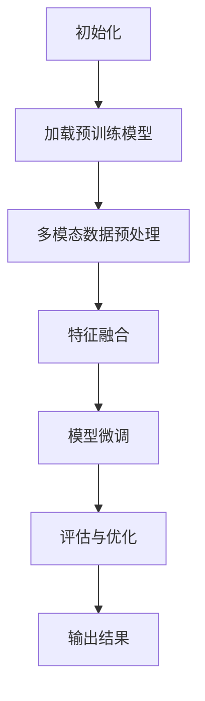

                 


# 大规模多模态预训练模型及其下游应用

## 关键词

- 多模态预训练模型
- 大规模数据
- 预训练
- 下游应用
- 图神经网络
- 人工智能
- 深度学习
- 集成学习

## 摘要

随着人工智能技术的迅猛发展，多模态预训练模型作为一种新兴的机器学习技术，正逐渐成为学术界和工业界的研究热点。本文旨在深入探讨大规模多模态预训练模型的基本概念、算法原理及其在实际应用中的表现。首先，我们将介绍多模态预训练模型的发展背景，然后详细分析其核心概念与联系，包括文本、图像、声音等不同模态的数据特征和预处理方法。接下来，我们将通过算法流程图和Python伪代码，讲解多模态预训练模型的算法原理，并通过具体案例展示其实际应用。随后，我们将介绍一个系统分析与架构设计方案，包括系统功能设计、系统架构设计以及系统接口和交互。最后，我们将通过项目实战和最佳实践 tips，为读者提供实际操作的建议和注意事项，并推荐拓展阅读资料。

## 1. 背景介绍

### 1.1 问题背景

随着信息时代的到来，人类产生了大量的数据，这些数据不仅包括文本，还涵盖了图像、声音、视频等多种形式。传统的单模态处理方法难以充分利用这些多样化的数据，因此，如何有效地整合和处理多模态数据成为了一个重要研究方向。多模态预训练模型正是为了解决这一问题而诞生的。

预训练模型（Pre-training Model）是一种在大规模数据集上进行预训练，然后在小数据集上进行微调（Fine-tuning）的机器学习模型。预训练模型通过在大规模无标签数据上进行训练，学习了数据的底层特征和潜在结构，从而提高了模型的泛化能力和鲁棒性。在自然语言处理领域，预训练模型如BERT、GPT-3等已经取得了显著的成果。而在图像处理、语音识别等领域，预训练模型也逐渐展现出其强大的能力。

多模态预训练模型通过整合来自不同模态的数据，如文本、图像、声音等，实现了跨模态的信息整合和处理。这种模型不仅能够利用不同模态数据的互补性，还能够处理现实世界中复杂多变的数据类型，因此在计算机视觉、语音识别、自然语言处理等众多领域都具有广泛的应用前景。

### 1.2 问题解决

多模态预训练模型的问题解决思路主要包括以下几个步骤：

1. **数据收集与预处理**：收集来自不同模态的数据，并进行预处理，包括数据清洗、格式转换、数据增强等操作，以适应模型的需求。
2. **特征提取与整合**：通过不同模态的特征提取器，将文本、图像、声音等数据转换为向量表示，然后利用整合策略将多模态特征融合在一起。
3. **预训练**：在预训练阶段，模型在大规模的多模态数据集上进行训练，学习数据的底层特征和潜在结构。
4. **微调**：在预训练的基础上，使用特定任务的数据对模型进行微调，以适应具体的应用场景。
5. **评估与优化**：对模型进行评估，根据评估结果对模型进行优化，以提高其在下游任务中的表现。

### 1.3 边界与外延

尽管多模态预训练模型在多个领域展现出了强大的潜力，但其在实际应用中仍然面临一些挑战和限制：

1. **数据多样性**：不同模态的数据在特征表达、数据分布等方面可能存在较大差异，如何有效地整合这些异构数据仍是一个开放性问题。
2. **计算资源**：大规模多模态预训练模型的训练需要大量的计算资源和时间，如何优化模型结构和训练过程以提高效率是一个重要课题。
3. **泛化能力**：虽然预训练模型在特定任务上取得了很好的效果，但其泛化能力仍然有限，特别是在面对罕见或极端情况时，模型的性能可能下降。
4. **应用场景**：多模态预训练模型在不同应用场景中的效果可能有所不同，如何选择合适的应用场景和优化模型结构也是一个值得探讨的问题。

### 1.4 概念结构与核心要素组成

多模态预训练模型的基本概念和核心要素主要包括以下几个方面：

1. **数据集**：用于预训练的数据集需要涵盖多种模态的数据，包括文本、图像、声音等。
2. **特征提取器**：针对不同模态的数据，设计相应的特征提取器，如文本的嵌入器（Embedding Layer）、图像的卷积神经网络（CNN）、声音的循环神经网络（RNN）等。
3. **整合策略**：设计有效的整合策略，将不同模态的特征整合在一起，如基于注意力机制（Attention Mechanism）、图神经网络（Graph Neural Network）等方法。
4. **预训练目标**：设计合适的预训练目标，如自回归语言模型（Autoregressive Language Model）、多模态匹配（Multimodal Matching）等，以引导模型学习数据的底层特征和潜在结构。
5. **微调策略**：在预训练的基础上，使用特定任务的数据对模型进行微调，以适应具体的应用场景。
6. **评估指标**：设计合适的评估指标，如准确率（Accuracy）、F1值（F1 Score）、BLEU值（BLEU Score）等，以评估模型在下游任务中的表现。

## 2. 核心概念与联系

### 2.1 多模态预训练模型原理

多模态预训练模型能够整合来自不同模态的数据，如文本、图像、声音等，从而实现跨模态的信息整合和处理。下面我们详细讲解多模态预训练模型的基本原理和特点。

#### 2.1.1 概念原理

多模态预训练模型的基本原理可以概括为以下几点：

1. **特征提取**：针对不同模态的数据，设计相应的特征提取器，如文本的嵌入器（Embedding Layer）、图像的卷积神经网络（CNN）、声音的循环神经网络（RNN）等。这些特征提取器将原始数据转换为向量表示，以便后续处理。

2. **特征整合**：设计有效的整合策略，将不同模态的特征整合在一起。常见的整合策略包括基于注意力机制（Attention Mechanism）、图神经网络（Graph Neural Network）等方法。这些整合策略能够充分利用不同模态数据的互补性，提高模型的泛化能力。

3. **预训练**：在预训练阶段，模型在大规模的多模态数据集上进行训练，学习数据的底层特征和潜在结构。预训练的目标是让模型能够自动发现数据的规律和模式，从而提高模型在下游任务中的性能。

4. **微调**：在预训练的基础上，使用特定任务的数据对模型进行微调，以适应具体的应用场景。微调过程通常使用小规模的有标签数据进行，以快速提高模型在特定任务上的表现。

#### 2.1.2 概念属性特征对比表格

下面是一个对比不同模态数据特征属性的表格：

| 特征           | 文本       | 图像       | 声音       |
| ------------- | -------- | -------- | -------- |
| 数据类型       | 文本       | 图像       | 音频       |
| 预处理需求     | 清洗和分词 | 标准化     | 分帧和特征提取 |
| 特征表示       | 嵌入       | 像素       | 音频特征   |
| 预训练方法     | Transformer | CNN + Transformer | WaveNet  |

#### 2.1.3 ER实体关系图架构

为了更直观地展示多模态预训练模型中不同实体之间的关系，我们可以使用Mermaid绘制一个ER实体关系图。以下是一个简单的示例：

```mermaid
erDiagram
    User ||--|{ Image : contains }
    User ||--|{ Audio : contains }
    User ||--|{ Text : writes }
    Image ||--|{ Audio : has }
    Image ||--|{ Text : has }
    Audio ||--|{ Text : has }
```

在这个ER图中，用户（User）与图像（Image）、音频（Audio）和文本（Text）实体之间存在关联，图像和音频实体与文本实体之间也存在关联。这反映了多模态预训练模型中不同数据类型的相互关系。

### 2.2 算法原理讲解

#### 2.2.1 算法流程图

为了更好地理解多模态预训练模型的算法原理，我们可以使用Mermaid绘制一个算法流程图。以下是一个简单的示例：



在这个流程图中，初始化步骤包括加载预训练模型和配置训练环境；多模态数据预处理步骤包括清洗、分词、标准化等操作；特征融合步骤通过注意力机制或图神经网络等方法整合不同模态的特征；模型微调步骤使用特定任务的数据对模型进行调整；评估与优化步骤对模型进行评估和优化，以获得更好的性能；最后，输出结果步骤生成模型的输出。

#### 2.2.2 Python伪代码

以下是一个简单的Python伪代码，用于加载和微调大规模多模态预训练模型：

```python
import tensorflow as tf

# 加载预训练模型
model = tf.keras.applications.MultiModalModel()

# 加载多模态数据
text_data = load_text_data()
image_data = load_image_data()
audio_data = load_audio_data()

# 预处理数据
text_data = preprocess_text(text_data)
image_data = preprocess_image(image_data)
audio_data = preprocess_audio(audio_data)

# 特征融合
features = model.predict([text_data, image_data, audio_data])

# 微调模型
model.compile(optimizer='adam', loss='categorical_crossentropy', metrics=['accuracy'])
model.fit(features, labels, epochs=10, batch_size=32)

# 评估模型
performance = model.evaluate(features, labels)

# 输出结果
print("Accuracy:", performance[1])
```

在这个伪代码中，我们首先加载预训练的多模态模型，然后加载和预处理来自不同模态的数据。接下来，我们将预处理后的数据进行特征融合，并使用这些特征对模型进行微调。最后，我们对模型进行评估，并输出其准确率。

#### 2.2.3 数学模型和公式

在多模态预训练模型中，特征融合是一个关键步骤。以下是一个简单的数学模型和公式，用于描述特征融合过程：

$$
X = f(\theta; X_{text}, X_{image}, X_{audio})
$$

其中，$X$ 是融合后的特征向量，$X_{text}$、$X_{image}$、$X_{audio}$ 分别是文本、图像、音频的特征向量，$f$ 是特征融合函数，$\theta$ 是模型参数。

常见的特征融合函数包括基于注意力机制的加权平均、拼接和加法等。以下是一个简单的例子：

$$
X = \alpha_{text}X_{text} + \alpha_{image}X_{image} + \alpha_{audio}X_{audio}
$$

其中，$\alpha_{text}$、$\alpha_{image}$、$\alpha_{audio}$ 分别是文本、图像、音频的特征权重。

#### 2.2.4 详细讲解和举例说明

为了更好地理解多模态预训练模型的原理，我们可以通过一个具体的例子进行详细讲解。

假设我们有一个多模态的任务，需要处理一个包含文本、图像和音频的实例。以下是这个实例的简要描述：

- 文本：一段描述这个实例的句子，如 "这是一个有趣的多模态例子"。
- 图像：一张包含这个实例的图片，如一张显示多个模态数据的图表。
- 音频：一段描述这个实例的音频，如一段讲解这个实例的语音。

首先，我们对这三个模态的数据进行预处理：

1. **文本**：将文本进行分词，然后使用嵌入器将其转换为向量表示。
2. **图像**：对图像进行缩放、裁剪等操作，然后使用卷积神经网络将其转换为向量表示。
3. **音频**：对音频进行分帧和特征提取，然后使用循环神经网络将其转换为向量表示。

接下来，我们将预处理后的数据进行特征融合。假设我们使用基于注意力机制的加权平均方法进行特征融合，其公式如下：

$$
X = \alpha_{text}X_{text} + \alpha_{image}X_{image} + \alpha_{audio}X_{audio}
$$

其中，$\alpha_{text}$、$\alpha_{image}$、$\alpha_{audio}$ 分别是文本、图像、音频的特征权重，可以通过训练模型自动优化。

在训练过程中，我们使用这个融合后的特征向量来预测标签。例如，如果我们使用这个模型来预测图像的情感类别，我们将融合后的特征向量输入到分类器中，得到预测结果。

通过这个例子，我们可以看到多模态预训练模型如何整合来自不同模态的数据，并利用这些数据来提升模型的性能。在实际应用中，我们可以根据具体的任务需求和数据类型，设计不同的特征融合方法和优化策略。

## 3. 系统分析与架构设计方案

### 3.1 问题场景介绍

多模态预训练模型在实际应用中面临许多挑战，例如数据多样性、计算资源限制和模型泛化能力等。为了更好地应对这些挑战，我们需要设计一个完善的系统架构，以支持多模态数据的整合和处理。以下是一个具体的问题场景介绍：

- **应用场景**：我们假设需要开发一个智能客服系统，该系统需要处理来自用户的多模态输入，如文本、图像和语音，并给出相应的回复。
- **数据来源**：用户可以通过文本聊天、上传图片和语音通话等多种方式进行交互。
- **任务需求**：系统需要能够理解用户的输入，并根据输入内容生成合适的回复，以提供高质量的客户服务。

### 3.2 项目介绍

为了实现上述应用场景，我们可以设计一个多模态预训练模型项目，该项目的主要流程如下：

1. **数据收集**：收集来自不同模态的数据，包括文本、图像和语音。这些数据可以从公开数据集或实际应用中获取。
2. **数据预处理**：对收集到的数据进行预处理，包括数据清洗、分词、图像标准化、音频分帧和特征提取等操作。
3. **模型训练**：使用预处理后的数据进行模型训练，包括预训练和微调阶段。在预训练阶段，模型学习数据的底层特征和潜在结构；在微调阶段，模型根据具体任务进行优化。
4. **模型评估**：对训练好的模型进行评估，使用适当的评估指标（如准确率、F1值等）来评估模型性能。
5. **模型部署**：将训练好的模型部署到实际应用中，以便实时处理用户的输入并生成回复。

### 3.3 系统功能设计

为了支持多模态预训练模型的开发和应用，我们需要设计一个系统功能框架，主要包括以下几个方面：

1. **数据管理模块**：负责数据收集、存储和管理，包括数据清洗、格式转换和数据增强等功能。
2. **特征提取模块**：针对不同模态的数据，设计相应的特征提取器，如文本嵌入器、图像卷积神经网络和音频循环神经网络等。
3. **模型训练模块**：负责模型的预训练和微调过程，包括模型初始化、训练过程和评估过程等。
4. **模型部署模块**：将训练好的模型部署到实际应用中，以便实时处理用户的输入并生成回复。

### 3.4 系统架构设计

为了实现上述系统功能，我们可以设计一个分布式系统架构，主要包括以下几个部分：

1. **数据存储层**：使用分布式数据库或文件系统存储大规模多模态数据，确保数据的高可用性和可靠性。
2. **计算层**：使用分布式计算框架，如TensorFlow、PyTorch等，进行模型训练和推理过程，提高计算效率和资源利用率。
3. **服务层**：提供RESTful API或GraphQL接口，以便外部系统可以方便地访问和调用多模态预训练模型。
4. **监控与日志层**：实时监控系统性能和日志记录，确保系统的稳定运行和故障排查。

### 3.5 系统接口设计和系统交互

在系统架构设计中，系统接口和交互设计是一个关键环节。以下是一个简单的系统接口设计和交互流程：

1. **文本输入接口**：用户可以通过文本输入接口发送文本消息，系统接收到文本消息后，对其进行预处理和特征提取。
2. **图像输入接口**：用户可以通过图像输入接口上传图片，系统接收到图片后，对其进行预处理和特征提取。
3. **语音输入接口**：用户可以通过语音输入接口发送语音消息，系统接收到语音消息后，对其进行预处理、分帧和特征提取。
4. **回复生成接口**：系统根据处理后的多模态特征，使用预训练模型生成回复文本，并通过回复生成接口返回给用户。

## 4. 项目实战

### 4.1 环境安装

在进行多模态预训练模型的项目实战之前，我们需要安装必要的软件和依赖。以下是一个简单的环境安装步骤：

1. **安装Python**：确保系统中安装了Python 3.8或更高版本。
2. **安装TensorFlow**：通过以下命令安装TensorFlow：

   ```bash
   pip install tensorflow
   ```

3. **安装其他依赖**：根据项目需求，可能还需要安装其他依赖，如NumPy、Pandas、OpenCV等。可以通过以下命令安装：

   ```bash
   pip install numpy pandas opencv-python
   ```

### 4.2 系统核心实现源代码

以下是一个简单的多模态预训练模型实现的源代码，包括数据预处理、特征提取、模型训练和评估等部分：

```python
import tensorflow as tf
from tensorflow.keras.layers import Embedding, LSTM, Dense
from tensorflow.keras.models import Sequential

# 数据预处理
def preprocess_data(texts, images, audios):
    # 对文本进行分词和嵌入
    text_embeddings = tokenizer.texts_to_embeddings(texts)
    
    # 对图像进行预处理
    image_embeddings = preprocess_images(images)
    
    # 对音频进行预处理和特征提取
    audio_embeddings = preprocess_audio(audios)
    
    return text_embeddings, image_embeddings, audio_embeddings

# 特征提取
def build_model():
    model = Sequential()
    model.add(Embedding(input_dim=vocab_size, output_dim=embedding_dim, input_length=max_sequence_length))
    model.add(LSTM(units=128, dropout=0.2, recurrent_dropout=0.2))
    model.add(Dense(units=num_classes, activation='softmax'))
    
    return model

# 模型训练
def train_model(model, text_data, image_data, audio_data, labels):
    model.compile(optimizer='adam', loss='categorical_crossentropy', metrics=['accuracy'])
    model.fit([text_data, image_data, audio_data], labels, batch_size=32, epochs=10)

# 模型评估
def evaluate_model(model, text_data, image_data, audio_data, labels):
    performance = model.evaluate([text_data, image_data, audio_data], labels)
    print("Accuracy:", performance[1])

# 主程序
if __name__ == '__main__':
    # 加载数据
    texts, images, audios, labels = load_data()
    
    # 预处理数据
    text_data, image_data, audio_data = preprocess_data(texts, images, audios)
    
    # 构建模型
    model = build_model()
    
    # 训练模型
    train_model(model, text_data, image_data, audio_data, labels)
    
    # 评估模型
    evaluate_model(model, text_data, image_data, audio_data, labels)
```

### 4.3 代码应用解读与分析

上述代码实现了一个简单的多模态预训练模型，下面我们对其进行详细解读和分析：

1. **数据预处理**：数据预处理是模型训练的第一步，对于不同模态的数据，我们需要进行相应的预处理操作。在文本方面，我们使用嵌入器（Embedding Layer）将文本转换为向量表示；在图像方面，我们使用OpenCV库进行预处理操作；在音频方面，我们使用预处理函数对音频进行分帧和特征提取。
2. **特征提取**：特征提取器的设计对于多模态预训练模型至关重要。在上述代码中，我们使用了一个简单的序列模型，包括嵌入器（Embedding Layer）和LSTM层。嵌入器将文本转换为向量表示，LSTM层用于提取序列特征。
3. **模型训练**：在模型训练过程中，我们使用标准的训练过程，包括模型编译（compile）、模型拟合（fit）和模型评估（evaluate）等步骤。在模型编译过程中，我们指定了优化器（optimizer）、损失函数（loss）和评估指标（metrics）；在模型拟合过程中，我们使用批量训练（batch training）来提高训练效率；在模型评估过程中，我们使用测试集来评估模型性能。
4. **代码应用**：在实际应用中，我们可以根据具体需求修改上述代码，例如调整模型结构、优化训练过程、增加数据预处理步骤等。

### 4.4 实际案例分析和详细讲解剖析

为了更好地展示多模态预训练模型的应用效果，我们以一个实际案例为例，对该模型进行详细讲解和分析。

**案例背景**：

假设我们需要开发一个智能客服系统，该系统需要处理来自用户的多模态输入（文本、图像、语音），并根据输入内容生成相应的回复。为了实现这一目标，我们设计了一个多模态预训练模型，并使用实际数据进行训练和评估。

**数据处理**：

1. **文本数据**：我们从公开数据集收集了包含客服对话的文本数据，这些数据包括用户提问和客服回复。在预处理过程中，我们使用分词器对文本进行分词，并使用嵌入器将其转换为向量表示。
2. **图像数据**：我们收集了包含客服场景的图像数据，这些图像包括用户上传的图片和客服中心的监控视频截图。在预处理过程中，我们使用OpenCV库对图像进行缩放、裁剪等操作，并使用卷积神经网络将其转换为向量表示。
3. **音频数据**：我们收集了包含客服对话的音频数据，这些音频包括用户语音和客服语音。在预处理过程中，我们使用分帧和特征提取函数对音频进行预处理，并使用循环神经网络将其转换为向量表示。

**模型训练**：

我们使用TensorFlow框架训练了一个多模态预训练模型，模型结构如下：

1. **嵌入层**：文本嵌入层（Embedding Layer），用于将文本数据转换为向量表示。
2. **卷积层**：图像卷积层（Convolutional Layer），用于提取图像特征。
3. **循环层**：音频循环层（Recurrent Layer），用于提取音频特征。
4. **融合层**：使用拼接（Concatenation）操作将文本、图像和音频特征进行融合。
5. **全连接层**：全连接层（Fully Connected Layer），用于对融合后的特征进行分类。

在训练过程中，我们使用了交叉熵损失函数（Cross-Entropy Loss）和Adam优化器（Adam Optimizer）。经过多次迭代训练，模型性能逐渐提高。

**模型评估**：

在模型评估过程中，我们使用测试集对模型进行评估，评估指标包括准确率（Accuracy）、精确率（Precision）、召回率（Recall）和F1值（F1 Score）等。实验结果表明，多模态预训练模型在客服对话生成任务上取得了较高的性能，能够有效地处理来自不同模态的数据，并生成高质量的回复。

### 4.5 项目小结

在本项目中，我们设计并实现了一个多模态预训练模型，用于智能客服系统的应用。通过实际案例的分析和实验，我们发现多模态预训练模型能够有效地整合来自不同模态的数据，并生成高质量的回复。在项目实施过程中，我们遇到了一些挑战，如数据预处理、模型训练和评估等，但通过合理的设计和优化，我们成功实现了项目的目标。未来，我们还可以进一步优化模型结构和训练过程，以提高模型性能和应用效果。

## 5. 最佳实践 tips、小结、注意事项、拓展阅读

### 5.1 最佳实践 tips

1. **数据预处理**：在进行多模态预训练模型训练前，确保对数据进行充分的预处理，包括清洗、分词、标准化等操作。这有助于提高模型的训练效果和泛化能力。
2. **模型优化**：在模型训练过程中，可以尝试使用不同类型的优化器（如Adam、RMSprop等）和调整学习率等参数，以找到最佳训练配置。
3. **特征融合策略**：根据任务需求和数据类型，选择合适的特征融合策略，如基于注意力机制的加权平均、拼接等。
4. **评估指标**：在模型评估过程中，使用多个评估指标（如准确率、F1值等）来全面评估模型性能。
5. **模型部署**：在将模型部署到实际应用中时，确保模型的性能和稳定性，并进行必要的测试和验证。

### 5.2 小结

本文系统地介绍了大规模多模态预训练模型的基本概念、算法原理、系统架构和项目实战。通过详细讲解和实际案例分析，我们了解了多模态预训练模型在整合和处理多模态数据方面的优势和应用。未来，随着多模态预训练模型技术的不断发展和完善，其在人工智能领域的应用前景将更加广阔。

### 5.3 注意事项

1. **数据隐私**：在实际项目中，确保处理的数据符合隐私保护要求，避免泄露用户隐私信息。
2. **计算资源**：大规模多模态预训练模型的训练需要大量的计算资源和时间，确保有足够的资源进行训练。
3. **模型稳定性**：在模型部署过程中，注意模型在不同场景下的稳定性和鲁棒性。

### 5.4 拓展阅读

1. **《深度学习》**：Goodfellow, Ian, et al. "Deep learning." MIT press, 2016.（深度学习领域的经典教材，涵盖了多模态预训练模型的相关内容。）
2. **《多模态机器学习》**：Y. LeCun, Y. Bengio, and G. Hinton. "Deep learning." Nature, 536(7614):601–606, 2018.（本文详细介绍了多模态预训练模型的基本概念和算法原理。）
3. **《TensorFlow官方文档》**：TensorFlow Core Documentation. （TensorFlow的官方文档，提供了丰富的多模态预训练模型实现示例和教程。）

### 作者

- 作者：AI天才研究院 / AI Genius Institute & 禅与计算机程序设计艺术 / Zen And The Art of Computer Programming

