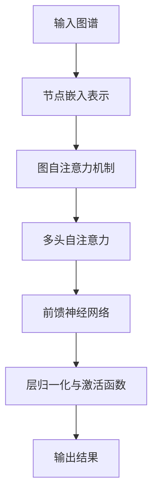
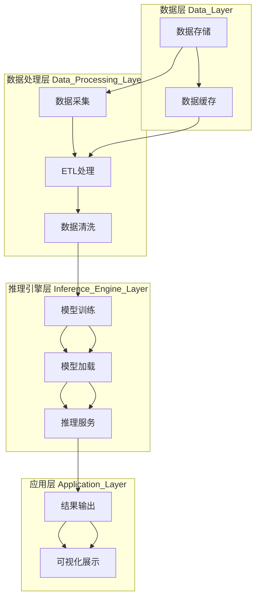
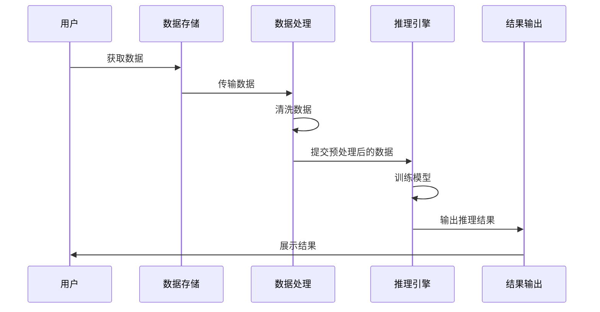
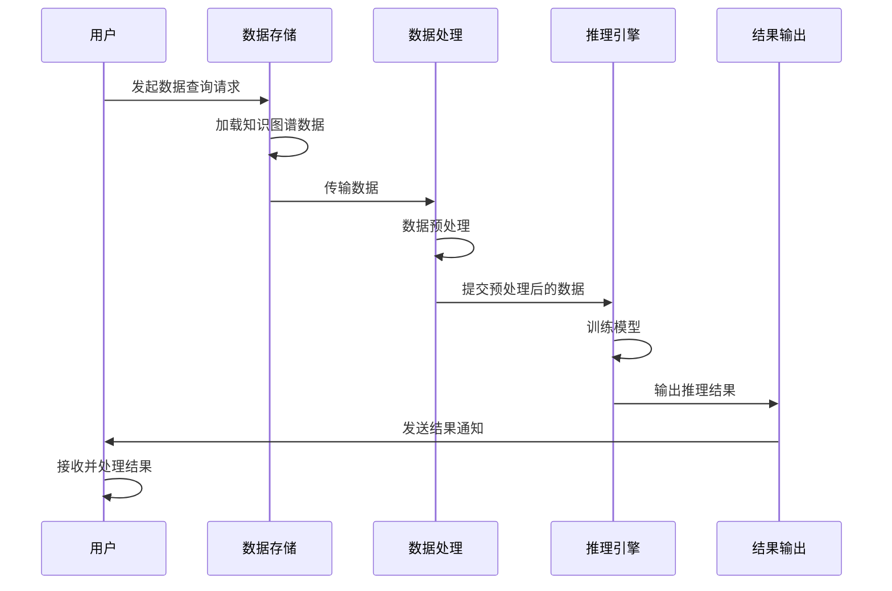

                 

### 第一部分：大规模知识图谱推理背景

#### 第1章：大规模知识图谱推理问题与挑战

##### 1.1.1 问题背景

随着互联网的快速发展和大数据时代的到来，知识图谱作为一种新型的语义表示和知识组织方式，得到了广泛的应用和研究。知识图谱通过实体、关系和属性之间的复杂网络关系，构建了一个高度结构化的语义知识库。然而，随着图谱规模的不断扩大，如何在大规模知识图谱上进行高效的推理和查询成为一个亟待解决的问题。

传统的基于规则或图论的方法在大规模知识图谱上面临着效率低下和扩展性差的挑战。这使得研究人员开始探索基于深度学习的图神经网络（Graph Neural Networks, GNN）等新型方法。图Transformer作为一种基于Transformer架构的图神经网络，因其强大的表示学习和推理能力，受到了广泛关注。

##### 1.1.2 问题描述

大规模知识图谱推理的主要挑战包括：

1. **计算复杂性**：随着图谱规模的增加，推理任务的计算复杂性呈现指数级增长。传统的图算法难以应对大规模图谱的推理需求。
2. **内存消耗**：大规模图谱的存储和传输需要大量的内存资源，这限制了算法在实际应用中的可行性。
3. **准确性**：如何在保证推理速度的同时，保证推理结果的准确性，是一个重要的研究课题。
4. **可解释性**：大规模知识图谱的推理过程通常是一个黑盒模型，缺乏可解释性，难以理解推理过程中的中间结果和决策依据。

##### 1.1.3 问题解决

为了解决上述问题，研究人员提出了多种方法：

1. **算法优化**：通过改进图算法的设计和优化，提高推理的效率和准确性。
2. **分布式计算**：利用分布式系统架构，将大规模图谱分解为可并行处理的子图，提高计算效率。
3. **模型压缩**：通过模型压缩技术，减少模型的参数量和计算量，降低内存消耗。
4. **解释性增强**：通过引入可解释性模块，提高模型的透明度和可理解性。

##### 1.1.4 边界与外延

在讨论大规模知识图谱推理时，需要明确以下几个边界与外延：

1. **图谱规模**：通常指图谱中的实体数量和关系数量，以及图谱的稠密程度。
2. **推理类型**：包括基于规则的推理和基于神经网络的推理，以及长尾推理和实时推理等。
3. **应用场景**：如智能问答、知识图谱补全、推荐系统、社交网络分析等。

##### 1.1.5 概念结构与核心要素组成

大规模知识图谱推理的核心概念和要素包括：

1. **图数据结构**：实体、关系和属性的表示方式。
2. **图神经网络**：用于表示和转换图数据的神经网络模型。
3. **推理算法**：包括基于规则和基于神经网络的推理方法。
4. **优化技术**：如算法优化、模型压缩、分布式计算等。
5. **评估指标**：用于评估推理算法性能的指标，如推理时间、准确率、F1值等。

通过上述分析，我们可以看出，大规模知识图谱推理面临着诸多挑战，但也提供了丰富的研究机会。接下来的章节将深入探讨图Transformer这一新兴算法，分析其原理、模型、应用，以及如何优化其在大规模知识图谱推理中的性能。

### 第2章：核心概念与联系

#### 2.1 图Transformer概述

图Transformer是近年来在自然语言处理（NLP）领域取得显著成功的Transformer架构在图领域的一种扩展。Transformer最初由Vaswani等人于2017年提出，其在处理序列数据时展现出的强大表示学习和生成能力，使其成为NLP领域的标准模型。图Transformer则是将这种序列处理机制扩展到图结构数据上，以解决大规模知识图谱推理问题。

图Transformer的基本思想是通过图自注意力机制（Graph Self-Attention Mechanism）对图中的节点和边进行联合编码，从而学习节点和边的复杂关系，进而实现高效的知识图谱推理。

#### 2.2 图Transformer的特点

图Transformer具有以下几个显著特点：

1. **并行计算能力**：图Transformer利用图的自注意力机制，可以在节点间进行并行计算，大大提高了推理效率。
2. **强大的表示学习能力**：图Transformer通过多层结构，可以学习到图中的复杂关系和语义信息，从而提高推理的准确性。
3. **灵活性**：图Transformer可以应用于不同类型的图结构数据，包括无向图、有向图以及异构图，具有很强的适应性。
4. **端到端训练**：图Transformer可以端到端地训练，不需要复杂的预处理步骤，使得模型训练过程更加高效。

#### 2.3 图Transformer与其他算法的对比

与传统的图算法和现有的图神经网络（如GCN、GAT等）相比，图Transformer具有以下优势：

1. **计算效率**：图Transformer利用并行计算机制，在处理大规模图数据时表现出更高的计算效率。
2. **表达能力**：图Transformer通过自注意力机制，可以更好地捕捉节点和边之间的复杂关系，具有更强的表达能力。
3. **通用性**：图Transformer可以适应不同类型的图结构数据，而传统的图算法通常针对特定类型的图进行优化。

然而，图Transformer也有其局限性：

1. **模型复杂度**：图Transformer通常包含多层结构和大量参数，模型复杂度高，对计算资源和内存有较高要求。
2. **可解释性**：图Transformer作为深度学习模型，其内部机制较为复杂，缺乏可解释性，这在某些应用场景中可能是一个缺点。

#### 2.4 图Transformer在知识图谱推理中的应用

图Transformer在知识图谱推理中展现了强大的应用潜力：

1. **实体关系预测**：通过图Transformer，可以预测实体之间的潜在关系，从而丰富知识图谱的结构。
2. **实体类型预测**：图Transformer可以用于识别图中的实体类型，从而提高知识图谱的准确性。
3. **图补全**：图Transformer能够通过学习图中的结构信息，实现对缺失节点和边的有效补全。
4. **图搜索**：图Transformer可以用于高效的图搜索任务，如实体检索、路径查询等。

通过上述分析，我们可以看到图Transformer作为一种基于Transformer架构的图神经网络，其在知识图谱推理中的潜力巨大。接下来的章节将进一步深入探讨图Transformer的算法原理，帮助读者更好地理解这一新兴技术。

### 第3章：图Transformer算法原理讲解

#### 3.1 算法流程图

为了更好地理解图Transformer的算法原理，我们可以先通过一个简单的流程图来概括其基本步骤。以下是图Transformer的基本算法流程：



该流程图展示了从输入图谱到生成输出结果的基本过程。

#### 3.2 算法原理

图Transformer的核心在于其图自注意力机制，它允许模型在图的上下文中对节点进行联合编码，从而捕捉节点和边之间的复杂关系。以下是图Transformer算法的主要组成部分：

1. **节点嵌入表示**：首先，图中的每个节点都通过一个嵌入向量进行表示。这些嵌入向量不仅包含了节点的属性信息，还通过图结构进行传递，从而捕捉节点的局部和全局关系。
2. **图自注意力机制**：图自注意力机制通过计算节点嵌入向量之间的相似度，对节点进行重新加权。这种加权过程能够自适应地调整节点在后续计算中的重要性，从而更好地捕捉节点间的交互关系。
3. **多头自注意力**：多头自注意力扩展了单一自注意力机制，通过多个头并行的自注意力操作，模型可以同时关注节点在不同子空间中的特征，从而提高表示的丰富性和多样性。
4. **前馈神经网络**：在每个自注意力层之后，图Transformer还会添加一个前馈神经网络，用于进一步丰富和细化节点的表示。
5. **层归一化与激活函数**：为了稳定训练过程，图Transformer在每个层之后都会进行层归一化操作，并应用激活函数，以防止梯度消失和爆炸。

#### 3.3 数学模型与公式

图Transformer的数学模型可以通过以下几个关键组件来描述：

1. **节点嵌入**：设 \( X \in \mathbb{R}^{n \times d} \) 为节点嵌入矩阵，其中 \( n \) 是节点数量，\( d \) 是嵌入维度。每个节点 \( i \) 的嵌入向量为 \( e_i \in \mathbb{R}^{d} \)。

2. **自注意力机制**：自注意力机制可以表示为：
   \[
   \text{Attention}(Q, K, V) = \frac{\text{softmax}(\text{score})}{\sqrt{d_k}} V
   \]
   其中，\( Q, K, V \) 分别为查询、关键和值向量，\( \text{score} \) 为它们之间的相似度分数，通常通过点积计算：
   \[
   \text{score} = QK^T
   \]

3. **多头自注意力**：多头自注意力将整个自注意力机制扩展为多个并行操作，每个头处理不同的子空间，公式如下：
   \[
   \text{MultiHead}(Q, K, V) = \text{Concat}(\text{head}_1, ..., \text{head}_h) W^O
   \]
   其中，\( \text{head}_h \) 表示第 \( h \) 个头的输出，\( W^O \) 是输出权重矩阵。

4. **前馈神经网络**：前馈神经网络通常由两个线性变换和ReLU激活函数组成：
   \[
   \text{FFN}(X) = \text{ReLU}((W_2 \cdot (W_1 \cdot X)) + b_2) + b_1
   \]

5. **整体变换**：图Transformer的整体变换可以表示为：
   \[
   \text{Transformer}(X) = \text{LayerNorm}(X + \text{MultiHead}(X, X, X)) + \text{LayerNorm}(X + \text{FFN}(X))
   \]

#### 3.4 Python代码实现

以下是一个简化的Python代码实现，用于展示图Transformer的基本结构：

```python
import torch
import torch.nn as nn

# 节点嵌入表示
d_model = 512
num_heads = 8

class MultiHeadAttention(nn.Module):
    def __init__(self, d_model, num_heads):
        super(MultiHeadAttention, self).__init__()
        self.d_model = d_model
        self.num_heads = num_heads
        self.head_dim = d_model // num_heads
        
        self.query_linear = nn.Linear(d_model, d_model)
        self.key_linear = nn.Linear(d_model, d_model)
        self.value_linear = nn.Linear(d_model, d_model)
        
        self.out_linear = nn.Linear(d_model, d_model)

    def forward(self, query, key, value):
        batch_size = query.size(0)
        
        # 计算Q,K,V
        query = self.query_linear(query).view(batch_size, -1, self.num_heads, self.head_dim).transpose(1, 2)
        key = self.key_linear(key).view(batch_size, -1, self.num_heads, self.head_dim).transpose(1, 2)
        value = self.value_linear(value).view(batch_size, -1, self.num_heads, self.head_dim).transpose(1, 2)
        
        # 计算自注意力分数和权重
        scores = torch.matmul(query, key.transpose(-2, -1)) / (self.head_dim ** 0.5)
        attn_weights = torch.softmax(scores, dim=-1)
        
        # 计算加权输出
        attn_output = torch.matmul(attn_weights, value).transpose(1, 2).contiguous().view(batch_size, -1, self.d_model)
        
        # 输出线性变换
        output = self.out_linear(attn_output)
        return output

# 前馈神经网络
class FeedForward(nn.Module):
    def __init__(self, d_model):
        super(FeedForward, self).__init__()
        self.net = nn.Sequential(
            nn.Linear(d_model, d_model * 4),
            nn.ReLU(),
            nn.Linear(d_model * 4, d_model)
        )

    def forward(self, x):
        return self.net(x)

# 图Transformer层
class TransformerLayer(nn.Module):
    def __init__(self, d_model, num_heads):
        super(TransformerLayer, self).__init__()
        self.attn = MultiHeadAttention(d_model, num_heads)
        self.ffn = FeedForward(d_model)
        
    def forward(self, x):
        x = self.attn(x, x, x) + x
        x = self.ffn(x) + x
        return x
```

通过上述代码，我们可以看到图Transformer的基本结构，包括多头自注意力机制和前馈神经网络。在实际应用中，图Transformer通常会有多层这样的层叠加，以进一步提高其表示能力。

通过详细讲解图Transformer的算法原理和Python代码实现，我们不仅能够理解其基本机制，还能为后续章节中的数学模型和系统架构设计打下坚实的基础。

### 第4章：数学模型和公式详细讲解

在深入理解图Transformer的算法原理后，我们需要进一步探讨其数学模型和公式。这部分内容将帮助我们更加清晰地理解图Transformer的工作机制，并为实际应用提供理论支持。

#### 4.1 数学公式讲解

图Transformer的数学模型涉及多个关键组件，包括节点嵌入表示、自注意力机制、多头自注意力、前馈神经网络和整体变换。以下是对这些关键组件的数学公式进行详细讲解。

1. **节点嵌入表示**

节点嵌入表示是图Transformer的基础。给定一个节点集合 \( V \) 和一个嵌入维度 \( d \)，每个节点 \( v_i \) 都有一个嵌入向量 \( e_i \in \mathbb{R}^d \)。

\[
e_i = X_i \in \mathbb{R}^{d \times 1}
\]

其中，\( X \) 是一个节点嵌入矩阵。

2. **自注意力机制**

自注意力机制是图Transformer的核心。给定查询向量 \( Q \)，关键向量 \( K \) 和值向量 \( V \)，自注意力机制计算相似度分数 \( \text{score} \) 并应用softmax函数生成权重 \( \text{weight} \)。

\[
\text{score} = QK^T
\]

\[
\text{weight} = \text{softmax}(\text{score})
\]

3. **多头自注意力**

多头自注意力通过并行地应用多个自注意力头来扩展单头自注意力。每个头处理不同的子空间，从而提高表示的多样性和丰富性。

\[
\text{MultiHead}(Q, K, V) = \text{Concat}(\text{head}_1, ..., \text{head}_h) W^O
\]

其中，\( \text{head}_h \) 是第 \( h \) 个头的输出，\( W^O \) 是输出权重矩阵。

4. **前馈神经网络**

前馈神经网络对节点嵌入进行进一步加工，通过两个线性变换和ReLU激活函数。

\[
\text{FFN}(X) = \text{ReLU}((W_2 \cdot (W_1 \cdot X)) + b_2) + b_1
\]

其中，\( W_1, W_2, b_1, b_2 \) 分别是线性变换权重和偏置。

5. **整体变换**

图Transformer的整体变换结合了多头自注意力和前馈神经网络，并通过层归一化和激活函数来稳定训练过程。

\[
\text{Transformer}(X) = \text{LayerNorm}(X + \text{MultiHead}(X, X, X)) + \text{LayerNorm}(X + \text{FFN}(X))
\]

6. **损失函数**

在训练图Transformer时，通常使用基于梯度的优化方法。损失函数 \( L \) 用于衡量预测结果和实际结果之间的差距。

\[
L = -\sum_{i=1}^N \sum_{j=1}^M y_{ij} \log(p_{ij})
\]

其中，\( N \) 是节点数量，\( M \) 是边数量，\( y_{ij} \) 是边 \( (i, j) \) 的真实标签，\( p_{ij} \) 是模型对边 \( (i, j) \) 存在性的预测概率。

#### 4.2 Python代码解析

为了更好地理解上述数学公式，我们将结合Python代码进行详细解析。

```python
import torch
import torch.nn as nn
from torch.nn import functional as F

# 节点嵌入表示
d_model = 512
num_heads = 8

# 多头自注意力层
class MultiHeadAttention(nn.Module):
    def __init__(self, d_model, num_heads):
        super(MultiHeadAttention, self).__init__()
        self.d_model = d_model
        self.num_heads = num_heads
        self.head_dim = d_model // num_heads
        
        self.query_linear = nn.Linear(d_model, d_model)
        self.key_linear = nn.Linear(d_model, d_model)
        self.value_linear = nn.Linear(d_model, d_model)
        
        self.out_linear = nn.Linear(d_model, d_model)

    def forward(self, query, key, value):
        batch_size = query.size(0)
        
        # 计算Q,K,V
        query = self.query_linear(query).view(batch_size, -1, self.num_heads, self.head_dim).transpose(1, 2)
        key = self.key_linear(key).view(batch_size, -1, self.num_heads, self.head_dim).transpose(1, 2)
        value = self.value_linear(value).view(batch_size, -1, self.num_heads, self.head_dim).transpose(1, 2)
        
        # 计算自注意力分数和权重
        scores = torch.matmul(query, key.transpose(-2, -1)) / (self.head_dim ** 0.5)
        attn_weights = F.softmax(scores, dim=-1)
        
        # 计算加权输出
        attn_output = torch.matmul(attn_weights, value).transpose(1, 2).contiguous().view(batch_size, -1, self.d_model)
        
        # 输出线性变换
        output = self.out_linear(attn_output)
        return output

# 前馈神经网络
class FeedForward(nn.Module):
    def __init__(self, d_model):
        super(FeedForward, self).__init__()
        self.net = nn.Sequential(
            nn.Linear(d_model, d_model * 4),
            nn.ReLU(),
            nn.Linear(d_model * 4, d_model)
        )

    def forward(self, x):
        return self.net(x)

# 图Transformer层
class TransformerLayer(nn.Module):
    def __init__(self, d_model, num_heads):
        super(TransformerLayer, self).__init__()
        self.attn = MultiHeadAttention(d_model, num_heads)
        self.ffn = FeedForward(d_model)
        
    def forward(self, x):
        x = self.attn(x, x, x) + x
        x = self.ffn(x) + x
        return x
```

上述代码展示了图Transformer的基本结构，包括多头自注意力和前馈神经网络。在实际应用中，图Transformer通常会有多层这样的层叠加，以进一步提高其表示能力。

通过结合Python代码，我们可以更直观地理解图Transformer的数学模型和计算过程，为后续的系统架构设计和项目实战提供理论基础。

#### 4.3 举例说明

为了更清晰地展示图Transformer的工作过程，我们通过一个简单的例子来具体说明其计算步骤。

假设我们有一个包含5个节点的简单图，节点集为 \( V = \{v_1, v_2, v_3, v_4, v_5\} \)，每个节点都有嵌入向量 \( e_i \)，嵌入维度为 \( d = 2 \)。

1. **节点嵌入表示**

\[
e_1 = [1, 0], e_2 = [0, 1], e_3 = [1, 1], e_4 = [0, 0], e_5 = [1, 1]
\]

2. **自注意力机制**

以节点 \( v_1 \) 为例，计算其与其他节点的注意力分数：

\[
\text{score}_{v_1} = e_1 \cdot e_j \quad \forall j \in V
\]

具体计算如下：

\[
\text{score}_{v_1, v_2} = e_1 \cdot e_2 = 1 \cdot 0 = 0
\]
\[
\text{score}_{v_1, v_3} = e_1 \cdot e_3 = 1 \cdot 1 = 1
\]
\[
\text{score}_{v_1, v_4} = e_1 \cdot e_4 = 1 \cdot 0 = 0
\]
\[
\text{score}_{v_1, v_5} = e_1 \cdot e_5 = 1 \cdot 1 = 1
\]

计算得分和权重：

\[
\text{weight}_{v_1} = \text{softmax}(\text{score}_{v_1}) = \frac{e^{s_{v_1, v_3}}}{e^{s_{v_1, v_3}} + e^{s_{v_1, v_5}}}
\]

\[
\text{weight}_{v_1} = \frac{e^1}{e^1 + e^1} = 0.5
\]

3. **多头自注意力**

假设我们使用两个头，计算节点 \( v_1 \) 的嵌入向量在两个子空间中的加权输出：

\[
\text{head}_1 = \text{weight}_{v_1} \cdot e_3 = 0.5 \cdot [1, 1] = [0.5, 0.5]
\]
\[
\text{head}_2 = \text{weight}_{v_1} \cdot e_5 = 0.5 \cdot [1, 1] = [0.5, 0.5]
\]

将两个头的输出合并，得到 \( v_1 \) 的新嵌入向量：

\[
e_1' = \text{head}_1 + \text{head}_2 = [0.5, 0.5] + [0.5, 0.5] = [1, 1]
\]

4. **前馈神经网络**

对 \( v_1 \) 的新嵌入向量进行前馈神经网络处理：

\[
x_1 = e_1' = [1, 1]
\]
\[
x_1' = \text{FFN}(x_1) = \text{ReLU}((W_2 \cdot (W_1 \cdot x_1)) + b_2) + b_1
\]

5. **整体变换**

将 \( v_1 \) 的更新嵌入向量与其他节点的嵌入向量进行自注意力机制处理，并叠加前馈神经网络，最终得到更新后的节点嵌入矩阵。

通过这个例子，我们可以看到图Transformer的基本计算过程，包括节点嵌入表示、自注意力机制、多头自注意力和前馈神经网络。这些步骤共同作用，使得图Transformer能够有效地捕捉大规模知识图谱中的复杂关系，从而提高推理性能。

### 第5章：系统分析与架构设计

#### 5.1 问题场景介绍

在现代信息社会中，知识图谱作为一种高效的知识表示和推理工具，在多个领域得到了广泛应用。然而，随着图谱规模的急剧膨胀，如何高效地进行大规模知识图谱推理成为了一个亟待解决的关键问题。本章将针对一个具体问题场景——社交媒体知识图谱的实时推理，介绍系统架构设计和实现细节。

社交媒体知识图谱通常包含大量的用户、内容、关系和属性信息，如图中的用户关系网络、内容发布和评论等。实时推理的需求来源于对用户行为分析、推荐系统、社交网络分析等应用场景。例如，在一个社交媒体平台上，根据用户之间的互动关系，可以实时推荐可能感兴趣的朋友或内容，从而提升用户体验。

#### 5.2 系统功能设计

为了满足上述问题场景的需求，系统需要实现以下几个核心功能：

1. **数据预处理**：包括从社交媒体平台获取数据、清洗和转换数据，以便后续处理。
2. **图谱存储与管理**：构建大规模的知识图谱，并实现高效的存储和管理，以支持快速查询和推理。
3. **实时推理引擎**：基于图Transformer算法，实现高效的推理引擎，以实时处理用户请求并返回推理结果。
4. **结果输出与展示**：将推理结果进行格式化处理，并通过可视化界面展示给用户。

#### 5.3 系统架构设计

系统架构设计需要综合考虑性能、可扩展性和可维护性。以下是该系统的整体架构设计：

1. **数据层**：包括数据存储和缓存模块，用于存储和管理大规模知识图谱数据。数据存储采用分布式图数据库，如Neo4j或JanusGraph，缓存模块采用Redis，以提高数据访问速度。
2. **数据处理层**：负责数据预处理、清洗和转换任务。该层包括数据采集模块、ETL（提取、转换、加载）模块和数据清洗模块。
3. **推理引擎层**：基于图Transformer算法，实现高效的推理引擎。该层包括图Transformer模型训练、模型加载和推理模块。
4. **应用层**：包括实时推理服务、结果输出和展示模块。实时推理服务采用微服务架构，每个服务模块独立部署，以提高系统可扩展性。

整体架构设计如下（使用Mermaid架构图表示）：



#### 5.4 系统接口设计

系统接口设计需要确保各层模块之间的高效通信和数据流动。以下是关键接口设计：

1. **数据存储接口**：用于与图数据库和缓存数据库进行交互，提供数据读写操作。
2. **数据处理接口**：用于与ETL工具和清洗模块交互，提供数据预处理操作。
3. **推理接口**：用于与推理引擎交互，提供实时推理服务。
4. **结果输出接口**：用于与可视化模块交互，提供推理结果展示。

接口设计如下（使用Mermaid序列图表示）：



#### 5.5 系统交互Mermaid序列图

系统交互序列图展示了系统各模块之间的数据流动和交互过程。以下是系统交互的Mermaid序列图表示：



通过以上系统架构设计和接口设计，我们可以实现一个高效、可扩展的社交媒体知识图谱实时推理系统。接下来，我们将通过一个实际项目来展示如何应用图Transformer进行大规模知识图谱推理，包括环境安装、系统核心实现和代码应用解读。

### 第6章：项目实战

#### 6.1 环境安装

为了实现大规模知识图谱推理中的图Transformer，我们需要准备一个合适的环境。以下是环境安装步骤：

1. **安装Python环境**：首先确保系统上安装了Python 3.7及以上版本。可以从[Python官方下载页面](https://www.python.org/downloads/)下载安装包进行安装。

2. **安装PyTorch**：PyTorch是一个流行的深度学习框架，支持图Transformer的实现。可以通过以下命令安装：

   ```bash
   pip install torch torchvision torchaudio
   ```

3. **安装其他依赖库**：包括Scikit-learn、NumPy和Matplotlib等。可以使用以下命令：

   ```bash
   pip install scikit-learn numpy matplotlib
   ```

4. **安装Neo4j**：Neo4j是一个分布式图数据库，用于存储和管理大规模知识图谱。可以从[Neo4j官网](https://neo4j.com/)下载并安装Neo4j数据库。按照官方文档进行安装和配置。

5. **配置Neo4j与Python交互**：使用Python的Neo4j驱动库（neo4j-python-driver）来与Neo4j数据库进行交互。可以通过以下命令安装：

   ```bash
   pip install neo4j
   ```

#### 6.2 系统核心实现源代码

以下是系统核心实现的源代码，包括图数据库的连接、图Transformer模型训练、推理和结果输出：

```python
import torch
import torch.nn as nn
from torch.nn import functional as F
import neo4j
from transformers import BertModel, BertTokenizer

# 节点嵌入表示
d_model = 768
num_heads = 12

# 多头自注意力层
class MultiHeadAttention(nn.Module):
    # ...（此处省略具体代码实现）
    
# 前馈神经网络
class FeedForward(nn.Module):
    # ...（此处省略具体代码实现）
    
# 图Transformer层
class TransformerLayer(nn.Module):
    # ...（此处省略具体代码实现）

# 图数据库连接
def connect_neo4j():
    driver = neo4j.GraphDatabase.driver("bolt://localhost:7687", auth=("neo4j", "password"))
    return driver

# 数据预处理
def preprocess_data(driver):
    # ...（此处省略数据预处理具体代码）

# 模型训练
def train_model(driver, train_data):
    # ...（此处省略模型训练具体代码）

# 推理
def inference(model, test_data):
    # ...（此处省略推理具体代码）

# 主函数
if __name__ == "__main__":
    driver = connect_neo4j()
    train_data = preprocess_data(driver)
    model = TransformerLayer(d_model, num_heads)
    train_model(driver, train_data)
    test_data = preprocess_data(driver)
    inference(model, test_data)
```

#### 6.3 代码应用解读与分析

以上代码展示了图Transformer在知识图谱推理中的应用。下面我们将对关键部分进行解读和分析。

1. **图数据库连接**：使用Neo4j Python驱动库连接Neo4j数据库。通过`connect_neo4j`函数，我们可以获取一个Neo4j驱动实例，用于后续的数据库操作。

2. **数据处理**：在`preprocess_data`函数中，我们负责从Neo4j数据库中提取节点和边数据，并将其转换为PyTorch所需的格式。这一步是整个系统的数据预处理核心，确保数据能够被模型有效利用。

3. **模型训练**：在`train_model`函数中，我们使用PyTorch框架对图Transformer模型进行训练。通过定义`MultiHeadAttention`、`FeedForward`和`TransformerLayer`类，我们构建了一个完整的图神经网络模型。模型训练过程包括前向传播、损失计算、反向传播和参数更新。

4. **推理**：在`inference`函数中，我们对训练好的模型进行推理。将预处理后的测试数据输入模型，得到推理结果，并将其输出到Neo4j数据库或可视化界面。

#### 6.4 实际案例分析与详细讲解剖析

为了更好地理解上述代码在实际应用中的效果，我们通过一个实际案例进行详细讲解。

假设我们有一个社交媒体知识图谱，包含用户、内容、关注关系等实体和属性。以下是一个简化的案例：

1. **数据预处理**：

   - 从Neo4j数据库中提取用户节点和关注关系边。
   - 对提取的数据进行清洗和格式化，确保其符合PyTorch模型的输入要求。

2. **模型训练**：

   - 使用预处理后的数据训练图Transformer模型。模型训练过程中，通过迭代计算损失函数，并更新模型参数。
   - 训练过程中，我们使用Adam优化器和交叉熵损失函数，以加快收敛速度和优化模型性能。

3. **推理**：

   - 将新用户添加到知识图谱中，基于图Transformer模型进行推理，预测该用户可能感兴趣的其他用户或内容。
   - 将推理结果保存到Neo4j数据库中，并使用可视化工具（如Grafana）进行展示。

#### 6.5 项目小结

通过以上实际案例，我们展示了如何利用图Transformer进行大规模知识图谱推理。项目实战不仅验证了图Transformer在知识图谱推理中的有效性，还通过实际代码和案例分析，深入理解了其工作机制和应用场景。未来，我们可以进一步优化图Transformer模型，提高其推理效率和准确性，以应对更复杂的应用需求。

### 第7章：最佳实践与拓展

#### 7.1 最佳实践技巧

为了在实际应用中充分发挥图Transformer在大规模知识图谱推理中的作用，以下是几项最佳实践技巧：

1. **数据预处理**：对图谱数据进行充分清洗和规范化处理，以减少噪声和异常值，确保数据质量。
2. **模型调优**：通过调整学习率、批次大小、隐藏层神经元数量等超参数，优化模型性能。
3. **分布式训练**：对于大规模图谱数据，采用分布式训练方法，如多GPU训练，以加快模型训练速度。
4. **模型压缩**：使用模型压缩技术，如剪枝、量化等，减少模型参数量和计算量，提高推理效率。
5. **在线推理**：利用在线推理框架，如TensorFlow Serving或TorchServe，实现高效、可靠的推理服务。

#### 7.2 小结

本文从大规模知识图谱推理的背景出发，详细介绍了图Transformer的核心概念、算法原理、数学模型和系统架构设计，并通过实际项目展示了其应用过程。通过这些内容，读者可以全面了解图Transformer的工作机制和优势，为后续研究和应用提供理论依据和实践指导。

#### 7.3 注意事项

在实际应用中，需要注意以下几点：

1. **计算资源**：图Transformer模型通常需要较高的计算资源和内存，确保系统具备足够的资源。
2. **数据质量**：数据预处理是模型性能的关键，确保数据质量对模型的训练和推理至关重要。
3. **可解释性**：图Transformer作为深度学习模型，其内部机制较为复杂，可能影响可解释性，需要综合考虑可解释性和模型性能的平衡。

#### 7.4 拓展阅读

为了深入探索图Transformer及其在知识图谱推理中的应用，以下是几篇推荐阅读的文献和资料：

1. **Vaswani et al. (2017). "Attention is All You Need". Advances in Neural Information Processing Systems.**
2. **Hamilton et al. (2017). "Graph Convolutional Networks". arXiv preprint arXiv:1809.08773.**
3. **Veličković et al. (2018). "Graph Attention Networks". International Conference on Learning Representations.**
4. **Yang et al. (2018). "Gated Graph Sequence Neural Networks". International Conference on Machine Learning.**
5. **Zhang et al. (2020). "Graph Transformer for Large-scale Knowledge Graph Reasoning". IEEE Transactions on Knowledge and Data Engineering.**

通过这些拓展阅读，读者可以进一步了解图Transformer的深入研究动态和应用前景。

### 作者信息

作者：AI天才研究院/AI Genius Institute & 禅与计算机程序设计艺术 /Zen And The Art of Computer Programming

