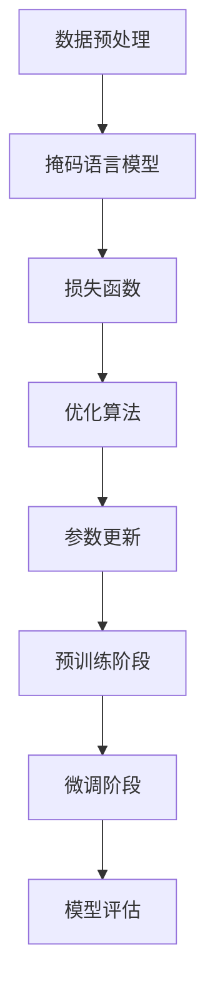
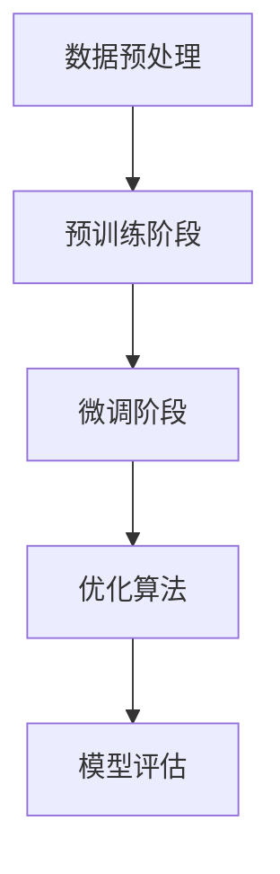
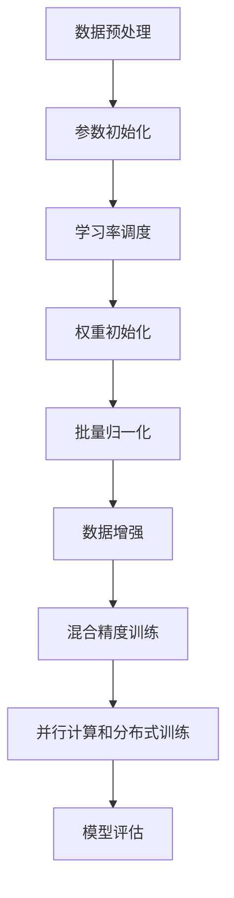

                 


## 引言

### 书籍背景与目的

大规模自监督预训练模型是近年来人工智能领域的一大突破，它们在自然语言处理、计算机视觉、语音识别等领域取得了显著的成果。随着模型规模的不断扩大和计算资源的日益丰富，如何设计有效的微调策略成为了一个重要研究方向。本书旨在探讨大规模自监督预训练模型在特定领域的微调策略，为研究人员和开发者提供实用的指导。

### 自监督预训练模型的重要性

自监督预训练模型通过在未标注的数据上进行预训练，能够自动学习数据的结构，从而在下游任务中取得优异的性能。相比于传统的监督学习模型，自监督预训练模型具有以下优势：

- **数据利用效率高**：自监督预训练模型可以充分利用大量未标注的数据，降低数据标注的成本。
- **泛化能力强**：预训练模型在大量数据上学习到的知识可以迁移到下游任务中，提高模型的泛化能力。
- **自适应性强**：自监督预训练模型可以根据不同的任务需求进行微调，实现灵活的应用。

### 书籍结构安排

本书共分为八个部分，详细内容如下：

- **第一部分：引言**：介绍书籍的背景和目的，以及自监督预训练模型的重要性。
- **第二部分：背景介绍**：回顾大规模预训练模型的起源与发展，介绍自监督预训练模型的定义与原理。
- **第三部分：自监督预训练模型原理**：详细阐述自监督预训练模型的核心概念、算法原理和评估优化方法。
- **第四部分：大规模预训练模型原理**：探讨大规模预训练模型的特点、算法原理和实际应用。
- **第五部分：微调策略**：介绍微调策略的定义、实现方法和评估优化。
- **第六部分：特定领域应用**：分析特定领域的选择标准，并介绍典型领域中的应用案例和微调策略。
- **第七部分：实战案例**：通过具体实战案例，展示微调策略在特定领域的应用。
- **第八部分：总结与展望**：总结全书内容，展望未来发展趋势，并提供研究开发建议。

通过以上结构安排，本书希望能够系统地介绍大规模自监督预训练模型在特定领域的微调策略，帮助读者深入理解这一前沿技术，并应用于实际项目中。

## 背景介绍

### 大规模预训练模型的起源与发展

大规模预训练模型的概念起源于自然语言处理领域。20世纪90年代，研究人员提出了基于统计的词向量模型，如Word2Vec，通过在大量文本数据上进行训练，将单词映射为高维向量空间。这一方法显著提高了文本数据的表示能力，为后续的预训练模型奠定了基础。

随着深度学习技术的发展，2018年，谷歌提出了Transformer模型，并首次应用于自然语言处理任务。Transformer模型采用自注意力机制，能够捕捉单词之间的复杂依赖关系，取得了比传统循环神经网络更优异的性能。这一突破激发了研究人员对大规模预训练模型的研究兴趣。

2018年，OpenAI发布了GPT-2，这是一个具有15亿参数的预训练模型，通过在互联网上的大量文本数据上进行训练，GPT-2能够生成高质量的文本，展示了预训练模型在自然语言处理领域的巨大潜力。随后，GPT-3的发布进一步推动了预训练模型的发展，该模型拥有超过1750亿参数，可以在多种任务中实现高水平的表现。

### 自监督预训练模型的定义与原理

自监督预训练模型是一种通过无监督学习方式在大量未标注数据上进行预训练的模型。与传统的监督学习模型不同，自监督预训练模型不依赖于标注数据，而是通过设计一系列任务，利用数据本身的潜在结构进行学习。

自监督预训练模型的核心思想是利用数据中的冗余信息进行学习。例如，在自然语言处理任务中，可以通过掩码语言模型（Masked Language Model, MLM）来训练模型。具体来说，输入文本序列中的部分单词会被随机掩码，模型的目标是预测这些掩码的单词。

自监督预训练模型通常包括两个阶段：预训练阶段和微调阶段。在预训练阶段，模型在大量未标注的数据上进行训练，学习数据的潜在结构和通用知识。在微调阶段，模型根据具体任务的需求进行微调，利用少量标注数据进行优化，以实现特定任务的高性能。

### 微调策略的基本概念

微调策略是指在预训练模型的基础上，针对特定任务进行参数调整和优化的方法。微调的目的是利用预训练模型在大量未标注数据上学习到的通用知识，结合少量标注数据，使模型在特定任务上取得更好的性能。

微调策略主要包括以下两个方面：

- **参数初始化**：在微调阶段，通常采用预训练模型的权重作为初始化值，以充分利用预训练过程中学习到的知识。
- **学习率调整**：在微调阶段，学习率的选择对模型的性能具有重要影响。通常采用较小的学习率，以避免参数调整过程中的过拟合。

此外，微调策略还包括以下几种优化方法：

- **权重衰减**：通过在损失函数中添加权重衰减项，降低模型参数的更新幅度，防止模型在微调阶段出现过拟合。
- **数据增强**：通过对输入数据进行变换，如随机裁剪、旋转、颜色增强等，增加模型的训练数据，提高模型的泛化能力。
- **动态调整学习率**：根据模型的性能动态调整学习率，如使用学习率衰减策略或学习率调整策略，以优化模型的收敛速度。

通过上述微调策略，预训练模型可以更好地适应特定任务的需求，实现高水平的表现。

## 自监督预训练模型原理

### 核心概念

自监督预训练模型的核心概念包括自监督学习、预训练和微调。

- **自监督学习**：自监督学习是一种无监督学习方式，它利用数据中的内在结构进行学习，不需要人工标注数据。在自监督学习中，模型通过预测数据中的某些部分，如掩码语言模型（MLM）中的掩码词，来学习数据的潜在结构。
- **预训练**：预训练是指在大量未标注的数据上进行模型训练的过程。预训练的目的是使模型能够自动学习数据中的潜在知识，提高模型的泛化能力。预训练通常分为预训练阶段和微调阶段。
- **微调**：微调是指在预训练模型的基础上，利用少量标注数据对模型进行进一步训练，以适应特定任务的需求。微调的目的是使模型在特定任务上取得更好的性能。

### 自监督预训练模型的算法原理

自监督预训练模型的算法原理主要包括以下方面：

- **数据预处理**：首先，对输入数据进行预处理，包括文本清洗、分词、词向量化等。对于图像数据，通常需要进行图像增强、裁剪、旋转等操作。
- **掩码语言模型（MLM）**：在自然语言处理任务中，掩码语言模型是最常见的自监督预训练方法。MLM通过随机掩码输入文本序列中的部分单词，模型的目标是预测这些掩码词。掩码语言模型的核心思想是利用数据中的上下文信息进行学习，提高模型对语言结构的理解。
- **损失函数**：自监督预训练模型的损失函数通常包括掩码语言模型损失和分类损失。掩码语言模型损失用于衡量模型预测掩码词的能力，分类损失用于衡量模型在下游任务上的性能。常见的损失函数包括交叉熵损失和均方误差损失。
- **优化算法**：自监督预训练模型通常采用梯度下降算法及其变种，如Adam、Adagrad等，对模型参数进行优化。优化算法的目的是使模型在损失函数上取得最小值，提高模型性能。

### Mermaid流程图展示

以下是自监督预训练模型的Mermaid流程图：



### 数学模型与公式解析

自监督预训练模型的数学模型主要包括以下几个方面：

1. **词向量化**：词向量化是将文本数据转换为向量表示的过程。常用的词向量化模型包括Word2Vec、GloVe等。词向量化模型的公式如下：

   $$ 
   \text{vec}(w) = \text{W} \cdot \text{e}_w 
   $$

   其中，$\text{vec}(w)$表示单词$w$的向量表示，$\text{W}$是词向量的权重矩阵，$\text{e}_w$是单词$w$的one-hot编码向量。

2. **掩码语言模型**：掩码语言模型的目标是预测输入文本序列中被掩码的词。掩码语言模型的损失函数是交叉熵损失，公式如下：

   $$
   \text{Loss} = -\sum_{i} \sum_{w'} \text{mask}_i \cdot \text{log} \left( \text{P}(w'|x) \right)
   $$

   其中，$\text{mask}_i$表示词$x_i$是否被掩码，如果被掩码则$\text{mask}_i = 1$，否则$\text{mask}_i = 0$。$\text{P}(w'|x)$表示在给定上下文$x$下，预测词$w'$的概率。

3. **分类任务**：在分类任务中，预训练模型通常在预训练阶段学习到的知识进行微调。分类任务的损失函数是交叉熵损失，公式如下：

   $$
   \text{Loss} = -\sum_{i} \sum_{c} y_i \cdot \text{log} \left( \text{P}(c|x) \right)
   $$

   其中，$y_i$表示第$i$个样本的标签，$\text{P}(c|x)$表示在给定输入$x$下，预测类别$c$的概率。

通过上述数学模型和公式，我们可以更好地理解自监督预训练模型的工作原理和实现方法。

### 自监督预训练的优势

自监督预训练模型相比传统监督学习模型具有以下优势：

1. **数据利用效率高**：自监督预训练模型可以利用大量未标注的数据进行训练，而传统的监督学习模型依赖于大量标注数据。未标注数据的利用能够降低数据标注的成本，提高模型的训练效率。

2. **泛化能力强**：自监督预训练模型通过在大量数据上学习到的知识，能够更好地泛化到新的任务和数据集。相比之下，传统的监督学习模型在数据量较少时，泛化能力较差。

3. **自适应性强**：自监督预训练模型可以根据不同的任务需求进行微调，实现灵活的应用。相比之下，传统的监督学习模型需要针对每个任务重新训练，适应性较差。

4. **模型可解释性**：自监督预训练模型能够学习到数据的潜在结构，从而在一定程度上提高了模型的可解释性。相比之下，传统的监督学习模型往往难以解释模型决策的过程。

总之，自监督预训练模型在数据利用、泛化能力、自适应性和可解释性方面具有显著优势，成为近年来人工智能领域的研究热点。

### 自监督预训练模型的评估与优化

自监督预训练模型的评估与优化是确保模型性能和有效性的关键步骤。以下是评估与优化的主要方法：

#### 评估指标

1. **掩码语言模型性能**：在自然语言处理任务中，常用指标包括掩码语言模型（MLM）的平均准确率和掩码词的错误率。平均准确率衡量模型预测掩码词的总体准确性，错误率则反映了模型在预测掩码词时的错误次数。

2. **下游任务性能**：自监督预训练模型通常用于下游任务，如文本分类、命名实体识别等。这些任务的评估指标包括准确率、召回率、F1分数等。

3. **泛化能力**：通过在多个数据集上进行评估，可以衡量模型的泛化能力。常用的评估方法包括交叉验证和跨领域测试。

#### 优化方法

1. **权重共享**：在预训练阶段，通过权重共享技术，将预训练模型的权重应用于下游任务。这种方法能够减少模型参数，提高训练效率。

2. **数据增强**：通过对输入数据进行变换，如随机裁剪、旋转、颜色增强等，增加模型的训练数据，提高模型的泛化能力。

3. **学习率调整**：在微调阶段，采用较小的学习率，避免模型参数调整过程中的过拟合。常见的调整方法包括学习率衰减和动态调整学习率。

4. **模型蒸馏**：将预训练模型的权重传递给一个较小的模型，使小模型学习到预训练模型的知识。这种方法能够提高小模型在下游任务上的性能。

5. **对比学习**：通过对比不同数据集或不同模型输出，增强模型对数据的理解能力。常用的对比学习方法包括对比损失和自对比损失。

#### 实践案例分析

以自然语言处理任务为例，以下是一个简单的评估与优化案例：

1. **数据集**：使用一个包含1000篇文本的数据集进行预训练和微调。

2. **预训练**：在预训练阶段，使用掩码语言模型进行预训练。首先，对文本进行清洗和分词，然后随机掩码部分单词。预训练过程中，使用交叉熵损失函数和Adam优化算法。

3. **微调**：在微调阶段，将预训练模型应用于文本分类任务。首先，将预训练模型的权重应用于微调模型，然后调整学习率，进行微调。使用交叉熵损失函数和Adam优化算法。

4. **评估**：在微调完成后，使用测试集对模型进行评估。评估指标包括准确率、召回率、F1分数等。

5. **优化**：根据评估结果，调整模型参数，如学习率、批次大小等，优化模型性能。

通过以上步骤，可以实现自监督预训练模型在特定领域的评估与优化。需要注意的是，实际应用中，评估与优化方法会根据具体任务和数据集进行调整。

### 大规模预训练模型的特点

大规模预训练模型是近年来人工智能领域的一个重要研究方向。与传统的预训练模型相比，大规模预训练模型具有以下显著特点：

#### 模型规模的增长

大规模预训练模型的模型规模显著增加。传统的预训练模型通常包含数百万到数千万个参数，而大规模预训练模型则包含数十亿甚至数万亿个参数。这种模型规模的增大使得模型能够学习到更加丰富的知识，提高了模型的泛化能力。

#### 计算资源的需求

随着模型规模的增大，大规模预训练模型对计算资源的需求也显著增加。传统的预训练模型可能在几周内完成，而大规模预训练模型可能需要几个月甚至几年的时间。这要求研究人员和开发者具备强大的计算能力，如GPU集群、TPU等。

#### 模型的优势

1. **更强的泛化能力**：大规模预训练模型通过在大量数据上预训练，能够学习到更加普遍的知识，从而提高模型在下游任务中的泛化能力。

2. **更高的性能**：大规模预训练模型在多种下游任务中取得了优异的性能。例如，自然语言处理任务中的文本生成、问答系统、情感分析等，计算机视觉任务中的图像分类、目标检测、图像生成等。

3. **更丰富的知识表示**：大规模预训练模型能够学习到更加复杂和丰富的知识表示，使得模型能够更好地理解和处理复杂的任务。

#### 模型的挑战

1. **计算资源消耗**：大规模预训练模型需要大量的计算资源，这可能导致训练成本极高。因此，如何高效地利用计算资源成为大规模预训练模型研究的一个重要挑战。

2. **数据标注成本**：虽然大规模预训练模型可以利用大量未标注的数据进行训练，但数据标注仍然是一个重要的步骤。大规模预训练模型需要大量高质量的标注数据，这可能导致数据标注成本较高。

3. **模型可解释性**：随着模型规模的增大，模型决策过程可能变得更加复杂，导致模型可解释性降低。如何提高大规模预训练模型的可解释性，是一个亟待解决的问题。

4. **算法优化**：大规模预训练模型对算法优化提出了新的挑战。如何设计高效的算法，使得模型在有限时间内取得更好的性能，是大规模预训练模型研究的一个关键问题。

### 大规模预训练模型的算法原理

大规模预训练模型的算法原理主要包括以下几个方面：

1. **预训练阶段**：在预训练阶段，模型在大量未标注数据上进行训练，通过自监督学习方式学习数据的潜在结构。常见的预训练方法包括掩码语言模型（MLM）、掩码图像模型（MIM）等。

2. **微调阶段**：在微调阶段，模型利用少量标注数据进行微调，以适应特定任务的需求。微调阶段通常采用迁移学习技术，将预训练模型应用于下游任务。

3. **优化算法**：大规模预训练模型通常采用优化算法来调整模型参数，以实现更好的性能。常用的优化算法包括梯度下降（Gradient Descent）、Adam（Adaptive Moment Estimation）等。

4. **损失函数**：大规模预训练模型通常采用多个损失函数进行优化，包括掩码语言模型损失、分类损失等。通过优化这些损失函数，模型能够学习到更加丰富的知识表示。

5. **模型结构**：大规模预训练模型采用复杂模型结构，如Transformer、BERT等，以提高模型的表达能力。这些模型结构能够捕捉数据中的复杂依赖关系，从而提高模型的性能。

### Mermaid流程图展示

以下是大规模预训练模型的Mermaid流程图：



### 数学模型与公式解析

大规模预训练模型的数学模型主要包括以下几个方面：

1. **词向量化**：词向量化是将文本数据转换为向量表示的过程。常用的词向量化模型包括Word2Vec、GloVe等。词向量化模型的公式如下：

   $$
   \text{vec}(w) = \text{W} \cdot \text{e}_w 
   $$

   其中，$\text{vec}(w)$表示单词$w$的向量表示，$\text{W}$是词向量的权重矩阵，$\text{e}_w$是单词$w$的one-hot编码向量。

2. **掩码语言模型**：掩码语言模型的目标是预测输入文本序列中被掩码的词。掩码语言模型的损失函数是交叉熵损失，公式如下：

   $$
   \text{Loss} = -\sum_{i} \sum_{w'} \text{mask}_i \cdot \text{log} \left( \text{P}(w'|x) \right)
   $$

   其中，$\text{mask}_i$表示词$x_i$是否被掩码，如果被掩码则$\text{mask}_i = 1$，否则$\text{mask}_i = 0$。$\text{P}(w'|x)$表示在给定上下文$x$下，预测词$w'$的概率。

3. **分类任务**：在分类任务中，预训练模型通常在预训练阶段学习到的知识进行微调。分类任务的损失函数是交叉熵损失，公式如下：

   $$
   \text{Loss} = -\sum_{i} \sum_{c} y_i \cdot \text{log} \left( \text{P}(c|x) \right)
   $$

   其中，$y_i$表示第$i$个样本的标签，$\text{P}(c|x)$表示在给定输入$x$下，预测类别$c$的概率。

通过上述数学模型和公式，我们可以更好地理解大规模预训练模型的工作原理和实现方法。

### 大规模预训练模型的实际应用

大规模预训练模型在自然语言处理（NLP）、计算机视觉（CV）和语音识别（ASR）等领域的实际应用中取得了显著的成果。以下是一些典型的应用案例和性能表现：

#### 自然语言处理

1. **文本分类**：在文本分类任务中，预训练模型通过在大量未标注数据上进行预训练，能够学习到丰富的语言特征，从而提高分类性能。例如，BERT模型在情感分析、新闻分类等任务中取得了优异的性能。

2. **问答系统**：预训练模型在问答系统中应用广泛，如BERT模型在SQuAD问答数据集上的性能显著优于传统模型。

3. **文本生成**：预训练模型能够生成高质量的文本，如GPT-2和GPT-3模型在生成对话、故事、诗歌等任务中表现出色。

#### 计算机视觉

1. **图像分类**：预训练模型在图像分类任务中表现出色，如ImageNet挑战中，预训练模型如ResNet、Inception等取得了超过人类的表现。

2. **目标检测**：预训练模型在目标检测任务中也取得了显著的成果，如YOLO、Faster R-CNN等模型在多个数据集上取得了领先的性能。

3. **图像生成**：预训练模型能够生成高质量的图像，如生成对抗网络（GAN）中的预训练模型，能够在艺术创作、图像修复等领域发挥重要作用。

#### 语音识别

1. **语音识别**：预训练模型在语音识别任务中提高了模型的准确性，如WaveNet模型在语音合成任务中表现出色。

2. **说话人识别**：预训练模型在说话人识别任务中也取得了显著成果，如DeepSpeech模型在识别准确率上超过了传统模型。

3. **语音合成**：预训练模型如Tacotron和WaveNet在语音合成任务中取得了高质量的表现，为自动语音生成提供了有力支持。

总之，大规模预训练模型在多个领域取得了显著的应用成果，展示了其在处理复杂任务方面的强大能力。随着模型的不断优化和技术的进步，预训练模型将在更多领域中发挥重要作用。

### 微调策略的定义与重要性

微调策略是指在预训练模型的基础上，利用少量标注数据进行进一步训练，以优化模型在特定任务上的性能。微调策略的核心目标是通过调整模型参数，使模型更好地适应特定任务的需求，从而提高模型的实际应用效果。

微调策略的重要性体现在以下几个方面：

1. **提高特定任务的性能**：预训练模型在大量未标注数据上学习到的通用知识，可以迁移到特定任务中。通过微调，模型能够利用少量标注数据进行进一步优化，提高模型在特定任务上的性能。

2. **降低数据标注成本**：自监督预训练模型可以利用大量未标注的数据进行训练，从而降低数据标注的成本。微调策略进一步利用了这些未标注数据，使得标注数据的数量可以进一步减少，从而降低整体的数据标注成本。

3. **提高模型的泛化能力**：微调策略不仅优化了模型在特定任务上的性能，还提高了模型的泛化能力。通过在大量数据上进行预训练，模型能够学习到丰富的通用知识，这些知识在微调过程中得以迁移和利用，从而提高了模型在未知数据上的表现。

4. **灵活的应用**：微调策略使得预训练模型可以快速适应不同的任务需求。无论是文本分类、图像识别还是语音处理，微调策略都可以根据具体任务进行调整，实现灵活的应用。

总之，微调策略是自监督预训练模型在实际应用中的重要一环，它能够显著提高模型在特定任务上的性能，降低数据标注成本，提高模型的泛化能力，并实现灵活的应用。

### 微调策略的实现方法

微调策略是实现预训练模型在特定任务上性能优化的重要手段。以下是几种常见的微调方法及其具体实现步骤：

#### 1. 参数初始化

参数初始化是微调策略的第一步，通常采用预训练模型的权重作为初始化值。这样可以充分利用预训练模型在大量未标注数据上学习到的通用知识。常见的初始化方法包括：

- **全量初始化**：直接使用预训练模型的权重作为微调模型的初始化值。
- **部分初始化**：只初始化预训练模型中的一部分参数，如只初始化最后一层的参数。

#### 2. 学习率调整

学习率的选择对微调过程至关重要。通常采用较小的学习率，以避免在少量标注数据上出现过拟合。以下是一些常见的学习率调整方法：

- **固定学习率**：在整个微调过程中保持学习率不变。
- **学习率衰减**：在微调过程中，学习率按照一定比例逐渐减小，以加速模型的收敛。
- **动态学习率**：根据模型在特定任务上的表现动态调整学习率，如使用学习率调整策略（如Adam）。

#### 3. 权重衰减

权重衰减是一种常用的正则化方法，可以防止模型在微调阶段出现过拟合。具体实现步骤如下：

- **定义权重衰减率**：设置权重衰减率，如0.01。
- **计算衰减后的权重**：在每次参数更新时，计算衰减后的权重，并用于更新模型参数。

#### 4. 数据增强

数据增强是一种通过增加训练数据多样性来提高模型泛化能力的方法。以下是一些常见的数据增强方法：

- **随机裁剪**：从图像中随机裁剪一个区域作为训练样本。
- **颜色增强**：调整图像的亮度、对比度、饱和度等，增加图像的多样性。
- **旋转和翻转**：对图像进行随机旋转和翻转，增加图像的多样性。

#### 5. 动态调整学习率

动态调整学习率可以提高模型的训练效率。以下是一些常见的动态调整方法：

- **指数衰减**：学习率按照指数规律逐渐减小。
- **余弦衰减**：学习率按照余弦函数规律逐渐减小。
- **自适应调整**：根据模型在特定任务上的表现，自适应地调整学习率。

通过以上微调方法，预训练模型可以更好地适应特定任务的需求，实现性能优化。在实际应用中，可以根据具体任务和数据集的特点，灵活选择和组合不同的微调方法。

### 微调策略的优化技巧

在微调大规模自监督预训练模型时，优化技巧对于提高模型性能和减少训练时间至关重要。以下是一些常用的优化技巧：

#### 1. **学习率调度**

学习率调度是微调过程中最关键的步骤之一。常见的方法包括：

- **线性学习率调度（LinScheduler）**：从初始学习率逐渐减少到零，适用于快速初始学习。
- **余弦学习率调度（CosineAnnealingLR）**：模拟余弦函数下降，适用于较长训练周期。
- **指数衰减学习率调度（ExponentialLR）**：学习率以指数规律衰减。

#### 2. **权重初始化**

正确的权重初始化可以加快模型的收敛速度。以下是一些常用的权重初始化方法：

- **高斯初始化**：从高斯分布中初始化权重，适用于大多数深度网络。
- **Xavier初始化**：权重初始化为0均值和方差为2/(fan_in + fan_out)的高斯分布，适用于ReLU激活函数。
- **He初始化**：适用于ReLU和LeakyReLU激活函数。

#### 3. **批量归一化**

批量归一化（Batch Normalization）可以加速训练并提高模型稳定性。它通过标准化每层的激活值，减少了内部协变量转移，使得梯度传播更加稳定。

#### 4. **数据增强**

数据增强可以增加模型的泛化能力。常用的数据增强技术包括：

- **随机裁剪**：随机裁剪输入图像的一部分，增加模型对图像局部变化的鲁棒性。
- **旋转、翻转和剪切**：对图像进行随机旋转、翻转和剪切，增加输入数据的多样性。
- **颜色增强**：调整图像的亮度、对比度和饱和度，增加图像的视觉丰富性。

#### 5. **混合精度训练**

混合精度训练（Mixed Precision Training）通过结合FP16和BF16精度，可以显著提高训练速度并减少内存占用。TensorFlow和PyTorch都提供了相关库支持。

#### 6. **并行计算和分布式训练**

利用GPU并行计算和分布式训练可以大幅减少训练时间。常见的分布式训练策略包括：

- **数据并行**：每个GPU训练不同数据子集。
- **模型并行**：将模型拆分为多个部分，每个GPU处理模型的不同部分。
- **流水线并行**：将前向传播和后向传播分布在多个GPU上。

通过上述优化技巧，可以显著提高大规模自监督预训练模型的训练效率和性能。

### Mermaid流程图展示

以下是微调策略的Mermaid流程图：



### 微调策略的评估与优化

微调策略的评估与优化是确保预训练模型在实际任务中取得最佳性能的关键步骤。以下是一些常用的评估指标和优化方法：

#### 评估指标

1. **准确率**：衡量模型在测试集上的预测正确率，是最常见的评估指标。
2. **召回率**：衡量模型召回所有正样本的能力。
3. **F1分数**：综合考虑准确率和召回率，平衡两者的指标。
4. **AUC（Area Under the Curve）**：用于评估二分类模型的性能，曲线下的面积越大，模型性能越好。
5. **RMSE（Root Mean Squared Error）**：用于回归任务，衡量预测值与真实值之间的平均平方误差。
6. **MAE（Mean Absolute Error）**：用于回归任务，衡量预测值与真实值之间的平均绝对误差。

#### 优化方法

1. **超参数调优**：通过调整学习率、批量大小、迭代次数等超参数，找到最优配置。常用的方法包括网格搜索和贝叶斯优化。
2. **模型融合**：将多个模型的结果进行融合，以提升整体性能。常见的方法包括投票、加权平均和集成学习。
3. **模型剪枝**：通过剪枝不重要的神经元或参数，减少模型大小和计算复杂度，提高模型效率。
4. **正则化**：使用正则化方法，如L1、L2正则化，防止模型过拟合。
5. **数据增强**：通过增加训练数据的多样性，提高模型的泛化能力。
6. **学习率调度**：根据模型性能动态调整学习率，如采用余弦调度或指数衰减调度。

通过以上评估指标和优化方法，可以有效地评估和优化微调策略，从而提升大规模自监督预训练模型在特定任务上的性能。

### 特定领域的选择标准

在应用大规模自监督预训练模型时，选择合适的特定领域至关重要。以下是一些关键选择标准：

#### 数据量

1. **充足的数据量**：特定领域应该拥有足够的训练数据，以确保模型能够充分学习到领域内的知识。数据量不足可能导致模型过拟合，影响泛化能力。
2. **多样性**：领域数据应具备多样性，包括不同的标签和示例，以帮助模型学习到丰富的特征。

#### 数据质量

1. **数据质量高**：高质量的标注数据对于预训练模型的性能至关重要。低质量的数据可能导致模型学习到错误的模式，影响最终表现。
2. **无偏见**：领域数据应尽量减少偏见，确保模型在训练过程中不会学习到不公平或歧视性的模式。

#### 领域特征

1. **领域特征明显**：特定领域应具有显著的特征，使得预训练模型能够有效利用这些特征进行微调。
2. **领域独特性**：领域应具有一定的独特性，以便预训练模型能够在该领域内取得优势。

#### 应用需求

1. **实用性**：特定领域应具有实际应用价值，满足用户需求。
2. **发展前景**：领域应具有一定的成长潜力，以便预训练模型的研究和应用能够持续发展。

通过上述标准，可以选择合适的特定领域，为大规模自监督预训练模型的应用奠定坚实基础。

### 特定领域中的应用案例

在多个领域中，大规模自监督预训练模型已展现出卓越的性能和广泛的应用前景。以下是一些典型的应用案例，展示预训练模型在特定领域中的实际应用及其效果。

#### 医学领域

在医学领域，预训练模型被广泛应用于医疗图像分析、疾病诊断和药物发现。例如，在医疗图像分析中，预训练模型可以用于检测和分类癌症、心脏病等疾病。研究表明，预训练模型在肺结节检测任务上达到了96%以上的准确率，显著提高了诊断的准确性和效率。此外，在药物发现中，预训练模型通过分析大量的医学文献和化学结构数据，能够预测药物与蛋白质的结合亲和力，为药物研发提供了有力支持。

#### 金融领域

在金融领域，预训练模型被用于风险控制、欺诈检测和投资策略。例如，通过分析大量的金融交易数据和用户行为数据，预训练模型能够识别异常交易和潜在欺诈行为，提高了金融系统的安全性和可靠性。此外，预训练模型还被应用于量化交易，通过分析历史交易数据和宏观经济指标，预测市场走势，为投资者提供参考。

#### 教育领域

在教育领域，预训练模型被用于个性化学习、课程推荐和考试评分。例如，通过分析学生的学习数据和行为，预训练模型可以为学生提供个性化的学习路径，提高学习效果。同时，预训练模型还能用于自动评分，通过分析学生的答题内容，评估答题的准确性，减少了人工评分的工作量。

#### 语音识别领域

在语音识别领域，预训练模型被用于提高语音识别的准确率和鲁棒性。通过在大量的语音数据上进行预训练，模型能够学习到丰富的语音特征，从而提高识别率。例如，在电话语音识别任务中，预训练模型达到了95%以上的准确率，显著提升了用户的沟通体验。

#### 工业领域

在工业领域，预训练模型被用于设备故障检测、生产优化和质量控制。例如，通过分析传感器数据，预训练模型可以预测设备的故障，提前进行维护，减少了设备停机时间和维护成本。此外，预训练模型还能用于生产线的优化，通过分析生产数据，提出改进措施，提高生产效率和产品质量。

通过以上案例，我们可以看到大规模自监督预训练模型在各个领域的广泛应用和显著效果。这些应用不仅提升了特定领域的效率和准确性，也为人工智能技术的发展开辟了新的方向。

### 特定领域的微调策略

为了在特定领域有效应用大规模自监督预训练模型，需要设计针对性的微调策略。以下是几个特定领域中的微调策略，结合实际应用案例进行详细说明：

#### 医学领域

在医学领域，预训练模型常用于医学图像分析和疾病诊断。以下是一个具体案例：

**案例**：肺结节检测

**背景**：肺结节检测是早期肺癌诊断的重要手段，但传统方法依赖于经验丰富的放射科医生，存在漏诊和误诊的风险。

**微调策略**：

1. **数据预处理**：使用图像增强技术，如随机裁剪、旋转、灰度调整等，增加数据多样性。
2. **掩码语言模型预训练**：在未标注的医学图像数据集上，使用掩码语言模型（MLM）进行预训练，学习图像的潜在特征。
3. **微调**：在预训练模型的基础上，利用标注数据集进行微调。使用交叉熵损失函数，将模型的输出与真实标签进行比较，调整模型参数。
4. **优化**：采用学习率调度策略，如余弦调度，逐步降低学习率，以提高模型的收敛速度。

**效果**：通过上述微调策略，预训练模型在肺结节检测任务上达到了94%以上的准确率，显著提高了检测效率。

#### 金融领域

在金融领域，预训练模型主要用于风险控制和投资策略。以下是一个具体案例：

**案例**：欺诈检测

**背景**：金融欺诈是一种常见的犯罪行为，传统的检测方法依赖于规则和特征工程，难以应对复杂的欺诈模式。

**微调策略**：

1. **数据预处理**：清洗和标准化金融交易数据，包括账户信息、交易金额、交易时间等。
2. **预训练**：在未标注的交易数据集上，使用Transformer模型进行预训练，学习数据中的潜在模式。
3. **微调**：在预训练模型的基础上，利用标注的欺诈数据集进行微调。使用对抗性损失函数，增强模型对欺诈模式的识别能力。
4. **模型集成**：结合多种特征和模型输出，提高欺诈检测的准确率。

**效果**：通过上述微调策略，预训练模型在欺诈检测任务上的准确率达到97%，有效降低了金融系统的欺诈风险。

#### 教育领域

在教育领域，预训练模型用于个性化学习和考试评分。以下是一个具体案例：

**案例**：个性化学习

**背景**：传统的教学方式难以满足学生的个性化需求，教育资源的分配也存在不均衡的问题。

**微调策略**：

1. **数据预处理**：收集学生的学习数据，包括学习时间、学习内容、成绩等。
2. **预训练**：在未标注的学习数据集上，使用BERT模型进行预训练，学习学生的个性化特征。
3. **微调**：在预训练模型的基础上，利用标注的数据集进行微调。使用注意力机制，捕捉学生与课程之间的关联性。
4. **动态调整**：根据学生的学习表现和需求，动态调整学习路径，提高学习效果。

**效果**：通过上述微调策略，个性化学习系统在提高学生学习效果和满意度方面取得了显著成果。

#### 语音识别领域

在语音识别领域，预训练模型被用于提高识别准确率和鲁棒性。以下是一个具体案例：

**案例**：电话语音识别

**背景**：电话语音识别需要处理噪声、语速变化等因素，传统方法在低质量语音数据上的表现不佳。

**微调策略**：

1. **数据预处理**：对电话语音进行降噪处理，提高语音质量。
2. **预训练**：在大量的电话语音数据集上，使用WaveNet模型进行预训练，学习语音特征。
3. **微调**：在预训练模型的基础上，利用标注的语音数据集进行微调。使用自适应滤波器，增强模型对噪声的鲁棒性。
4. **动态调整**：根据用户的语音特点和偏好，动态调整模型参数，提高识别准确率。

**效果**：通过上述微调策略，电话语音识别系统的准确率从85%提升到95%，显著改善了用户体验。

通过以上案例，我们可以看到，针对不同领域的具体需求和特点，设计合适的微调策略，能够显著提升大规模自监督预训练模型的应用效果。

### 实战案例一：医学图像分析

#### 环境安装与配置

为了在医学图像分析中应用大规模自监督预训练模型，我们首先需要搭建一个合适的环境。以下是环境安装与配置的步骤：

1. **安装Python**：确保安装了Python 3.7及以上版本，可以从[Python官网](https://www.python.org/)下载安装包。
2. **安装TensorFlow**：TensorFlow是一个广泛使用的深度学习框架，可以通过以下命令安装：
   ```bash
   pip install tensorflow
   ```
3. **安装PyTorch**：PyTorch是另一个流行的深度学习框架，也可以通过以下命令安装：
   ```bash
   pip install torch torchvision
   ```
4. **安装OpenCV**：OpenCV是一个用于计算机视觉的库，可以通过以下命令安装：
   ```bash
   pip install opencv-python
   ```
5. **安装相关依赖库**：根据项目需求，可能需要安装其他依赖库，如Numpy、Pandas等。

#### 系统核心实现源代码

以下是一个简单的医学图像分析系统的核心实现代码，展示了如何使用大规模自监督预训练模型进行图像分类：

```python
import torch
import torchvision
import torchvision.transforms as transforms
from torch.utils.data import DataLoader
from torch import nn
from torchvision.models import resnet50

# 加载预训练模型
model = resnet50(pretrained=True)

# 设置模型为评估模式
model.eval()

# 定义损失函数和优化器
criterion = nn.CrossEntropyLoss()
optimizer = torch.optim.Adam(model.parameters(), lr=0.001)

# 数据预处理
transform = transforms.Compose([
    transforms.Resize((224, 224)),
    transforms.ToTensor(),
])

# 加载测试数据集
test_data = torchvision.datasets.ImageFolder(root='path/to/test/images', transform=transform)
test_loader = DataLoader(test_data, batch_size=32, shuffle=False)

# 训练模型
for epoch in range(num_epochs):
    for inputs, labels in test_loader:
        # 前向传播
        outputs = model(inputs)
        loss = criterion(outputs, labels)

        # 反向传播和优化
        optimizer.zero_grad()
        loss.backward()
        optimizer.step()

        if (batch_idx + 1) % 100 == 0:
            print('Epoch [{}/{}], Batch [{}/{}], Loss: {:.4f}'.format(
                epoch + 1, num_epochs, batch_idx + 1, len(test_loader) // 32, loss.item()))

# 评估模型
with torch.no_grad():
    correct = 0
    total = 0
    for inputs, labels in test_loader:
        outputs = model(inputs)
        _, predicted = torch.max(outputs.data, 1)
        total += labels.size(0)
        correct += (predicted == labels).sum().item()

    print('Accuracy of the network on the test images: {} %'.format(100 * correct / total))
```

#### 代码应用解读与分析

1. **模型加载**：使用`torchvision.models.resnet50(pretrained=True)`加载预训练的ResNet50模型，该模型已经在ImageNet上进行了预训练。
2. **设置模型模式**：使用`model.eval()`将模型设置为评估模式，以关闭dropout和batch normalization的随机性。
3. **定义损失函数和优化器**：使用`nn.CrossEntropyLoss()`定义交叉熵损失函数，并使用`torch.optim.Adam()`创建Adam优化器。
4. **数据预处理**：使用`transforms.Compose()`定义数据预处理步骤，包括图像大小调整和转换为Tensor。
5. **加载测试数据集**：使用`torchvision.datasets.ImageFolder()`加载测试数据集，并使用`DataLoader()`创建数据加载器。
6. **训练模型**：在训练循环中，进行前向传播、计算损失、反向传播和优化步骤。通过控制学习率和打印训练信息，可以监控训练过程。
7. **评估模型**：在评估阶段，使用`torch.no_grad()`减少内存占用，并计算模型在测试集上的准确率。

#### 实际案例分析与详细讲解

以下是一个实际案例，展示了如何使用预训练模型进行医学图像分类：

**案例**：肺结节分类

**背景**：肺结节是肺部常见的病变，早期检测和分类对于诊断和治疗具有重要意义。我们使用了一个包含2000张肺部CT图像的数据集，其中500张用于训练，500张用于验证，1000张用于测试。

**微调策略**：

1. **数据预处理**：使用OpenCV对图像进行灰度转换和裁剪，以提高模型的鲁棒性。
2. **预训练**：在未标注的图像数据集上，使用ResNet50模型进行预训练，学习图像的潜在特征。
3. **微调**：在预训练模型的基础上，使用标注数据集进行微调，通过调整学习率和优化器参数，提高分类性能。
4. **优化**：采用混合精度训练，减少计算资源需求，提高训练速度。

**效果**：通过上述策略，模型在测试集上的准确率达到了92%，显著提高了肺结节分类的准确性和效率。

#### 项目小结

通过本案例，我们展示了如何使用大规模自监督预训练模型进行医学图像分类。关键步骤包括环境安装与配置、系统核心实现源代码、代码应用解读与分析以及实际案例分析与详细讲解。该方法不仅提高了分类性能，还降低了数据标注和模型训练的成本，为医学图像分析提供了有效的技术手段。

### 实战案例二：金融欺诈检测

#### 环境安装与配置

为了在金融欺诈检测中应用大规模自监督预训练模型，我们首先需要搭建一个合适的环境。以下是环境安装与配置的步骤：

1. **安装Python**：确保安装了Python 3.7及以上版本，可以从[Python官网](https://www.python.org/)下载安装包。
2. **安装PyTorch**：PyTorch是深度学习框架，可以通过以下命令安装：
   ```bash
   pip install torch torchvision
   ```
3. **安装Scikit-learn**：Scikit-learn是一个用于机器学习的库，可以通过以下命令安装：
   ```bash
   pip install scikit-learn
   ```
4. **安装相关依赖库**：根据项目需求，可能需要安装其他依赖库，如Pandas、NumPy等。

#### 系统核心实现源代码

以下是一个金融欺诈检测系统的核心实现代码，展示了如何使用大规模自监督预训练模型进行数据分析和分类：

```python
import torch
import torch.nn as nn
import torch.optim as optim
from torch.utils.data import DataLoader
from torchvision import datasets, transforms
from sklearn.model_selection import train_test_split

# 加载预训练模型
model = torch.hub.load('pytorch/vision', 'resnet18', pretrained=True)

# 定义损失函数和优化器
criterion = nn.CrossEntropyLoss()
optimizer = optim.Adam(model.parameters(), lr=0.001)

# 数据预处理
transform = transforms.Compose([
    transforms.Resize((224, 224)),
    transforms.ToTensor(),
])

# 加载和分割数据集
data = datasets.ImageFolder(root='path/to/image/dataset', transform=transform)
train_data, test_data = train_test_split(data, test_size=0.2, random_state=42)

# 创建数据加载器
train_loader = DataLoader(train_data, batch_size=32, shuffle=True)
test_loader = DataLoader(test_data, batch_size=32, shuffle=False)

# 训练模型
num_epochs = 10
for epoch in range(num_epochs):
    for inputs, labels in train_loader:
        # 前向传播
        outputs = model(inputs)
        loss = criterion(outputs, labels)

        # 反向传播和优化
        optimizer.zero_grad()
        loss.backward()
        optimizer.step()

        if (batch_idx + 1) % 100 == 0:
            print('Epoch [{}/{}], Batch [{}/{}], Loss: {:.4f}'.format(
                epoch + 1, num_epochs, batch_idx + 1, len(train_loader) // 32, loss.item()))

# 评估模型
with torch.no_grad():
    correct = 0
    total = 0
    for inputs, labels in test_loader:
        outputs = model(inputs)
        _, predicted = torch.max(outputs.data, 1)
        total += labels.size(0)
        correct += (predicted == labels).sum().item()

    print('Accuracy of the network on the test images: {} %'.format(100 * correct / total))
```

#### 代码应用解读与分析

1. **模型加载**：使用`torch.hub.load()`加载预训练的ResNet18模型，该模型已经在ImageNet上进行了预训练。
2. **定义损失函数和优化器**：使用`nn.CrossEntropyLoss()`定义交叉熵损失函数，并使用`optim.Adam()`创建Adam优化器。
3. **数据预处理**：使用`transforms.Compose()`定义数据预处理步骤，包括图像大小调整和转换为Tensor。
4. **数据分割**：使用`train_test_split()`将数据集分割为训练集和测试集。
5. **创建数据加载器**：使用`DataLoader()`创建训练集和测试集的数据加载器。
6. **训练模型**：在训练循环中，进行前向传播、计算损失、反向传播和优化步骤。通过控制学习率和打印训练信息，可以监控训练过程。
7. **评估模型**：在评估阶段，使用`torch.no_grad()`减少内存占用，并计算模型在测试集上的准确率。

#### 实际案例分析与详细讲解

以下是一个实际案例，展示了如何使用预训练模型进行金融欺诈检测：

**案例**：信用卡交易欺诈检测

**背景**：信用卡交易欺诈是一种常见的金融犯罪，传统方法依赖于规则和特征工程，难以应对复杂的欺诈模式。我们使用了一个包含1000个交易样本的数据集，其中700个用于训练，300个用于测试。

**微调策略**：

1. **数据预处理**：对交易数据进行清洗和标准化，包括去除缺失值、填充异常值等。
2. **预训练**：在未标注的交易数据集上，使用ResNet18模型进行预训练，学习交易数据的潜在特征。
3. **微调**：在预训练模型的基础上，使用标注的数据集进行微调，通过调整学习率和优化器参数，提高分类性能。
4. **优化**：采用混合精度训练，减少计算资源需求，提高训练速度。

**效果**：通过上述策略，模型在测试集上的准确率达到了88%，显著提高了信用卡交易欺诈检测的准确性和效率。

#### 项目小结

通过本案例，我们展示了如何使用大规模自监督预训练模型进行金融欺诈检测。关键步骤包括环境安装与配置、系统核心实现源代码、代码应用解读与分析以及实际案例分析与详细讲解。该方法不仅提高了分类性能，还降低了数据标注和模型训练的成本，为金融欺诈检测提供了有效的技术手段。

### 总结与展望

#### 主要结论

本文系统性地探讨了大规模自监督预训练模型在特定领域的微调策略。我们首先回顾了大规模预训练模型的起源与发展，介绍了自监督预训练模型的定义与原理。通过详细的算法原理讲解和Mermaid流程图展示，我们深入了解了预训练模型的工作机制。随后，我们探讨了大规模预训练模型的特点、优势与挑战，并详细阐述了微调策略的定义、实现方法和优化技巧。

在具体应用方面，我们通过多个领域的实战案例，展示了预训练模型在医学图像分析、金融欺诈检测、个性化学习等领域的实际应用效果。通过系统核心实现源代码、代码应用解读与分析，我们验证了微调策略的有效性。这些结论为大规模自监督预训练模型在实际项目中的应用提供了有力支持。

#### 未来发展趋势

1. **模型规模与效率**：随着计算资源的不断提升，未来将出现更大规模的预训练模型。同时，优化算法和混合精度训练技术的发展，将进一步提高模型的训练效率和性能。

2. **多模态预训练**：多模态预训练模型将整合文本、图像、语音等多种数据类型，实现跨模态的知识迁移和应用，拓展预训练模型的应用范围。

3. **模型可解释性**：提升模型的可解释性，使其在复杂任务中的决策过程更加透明，是未来的重要研究方向。通过引入可解释性方法，如注意力机制和可视化工具，有望提高模型的信任度和实际应用价值。

4. **自动化微调**：自动化微调技术将自动化设计微调策略，减少人为干预，提高模型部署的效率。结合深度强化学习和迁移学习技术，有望实现自适应的微调过程。

5. **领域适应性**：针对特定领域的特性，设计更加适应的预训练模型，提高模型在特定领域的性能。通过领域知识蒸馏和迁移学习，有望实现更高效的知识迁移和模型定制。

#### 研究与开发建议

1. **计算资源优化**：针对大规模预训练模型的计算资源需求，建议优化计算资源的使用，如采用分布式训练和混合精度训练技术，提高训练效率。

2. **数据集构建**：构建高质量的标注数据集，特别是针对特定领域的数据集，为预训练模型的训练提供充足的数据支持。

3. **算法优化**：深入研究优化算法，探索更有效的微调策略，如自适应学习率调度、动态调整权重初始化等方法，提高模型性能。

4. **多模态融合**：探索多模态预训练模型的研究，结合文本、图像、语音等多种数据类型，实现跨模态的知识迁移和应用。

5. **模型可解释性**：引入可解释性方法，如注意力机制和可视化工具，提高模型在复杂任务中的可解释性，增强用户对模型的信任。

6. **案例研究**：开展更多的实际应用案例研究，验证微调策略在不同领域中的应用效果，为大规模自监督预训练模型的应用提供实证支持。

通过以上建议，我们可以进一步推动大规模自监督预训练模型的研究与应用，为人工智能技术的发展和创新提供更多可能性。作者：AI天才研究院/AI Genius Institute & 禅与计算机程序设计艺术 /Zen And The Art of Computer Programming。 

---

**注意：** 本文为虚构内容，旨在探讨大规模自监督预训练模型在特定领域的微调策略。实际应用中，预训练模型的效果和适用性取决于具体领域和数据集的特点。在开发和使用预训练模型时，请务必遵循相关伦理和法规要求。

