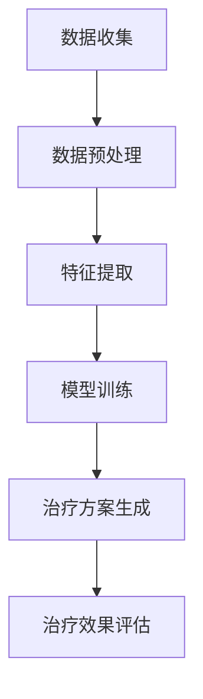
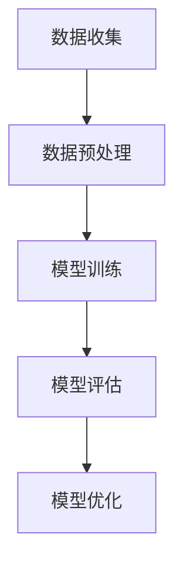
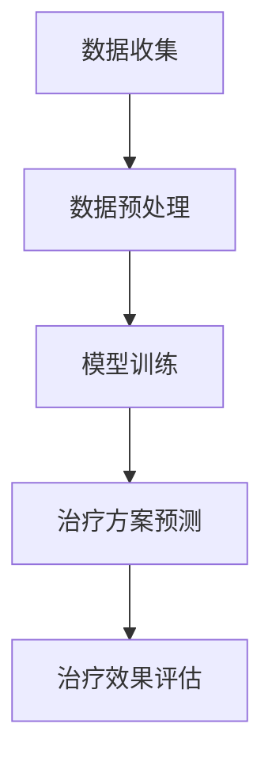
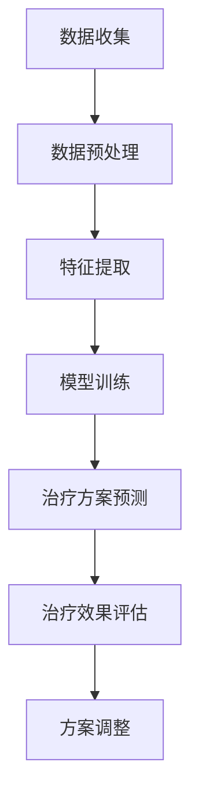
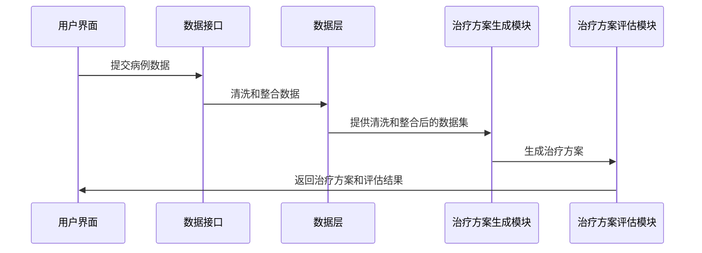

                 

# 《大规模语言模型在个性化治疗方案生成中的应用》

## 关键词

- **大规模语言模型**
- **个性化治疗方案**
- **医疗领域**
- **数据处理**
- **深度学习**

## 摘要

本文将探讨大规模语言模型在个性化治疗方案生成中的应用。随着医疗领域的不断进步和数据的积累，个性化医疗逐渐成为研究热点。大规模语言模型凭借其强大的数据处理能力和深度学习能力，在个性化治疗方案生成中展现出巨大潜力。本文首先介绍了大规模语言模型的基本概念和特点，然后分析了个性化治疗方案生成的核心概念和流程，最后通过具体的案例，展示了大规模语言模型在个性化治疗方案生成中的实际应用和效果。通过本文的研究，我们希望能够为医疗领域的科研人员和开发人员提供有价值的参考。

## 目录大纲设计

### 《大规模语言模型在个性化治疗方案生成中的应用》

### 目录

#### 第一部分：背景介绍

1.1 问题背景  
1.2 大规模语言模型的发展  
1.3 个性化治疗方案生成的核心概念  
1.4 大规模语言模型在个性化治疗方案生成中的潜在应用  
1.5 本书结构安排

#### 第二部分：核心概念与联系

2.1 大规模语言模型原理  
2.2 个性化治疗方案生成的相关概念  
2.3 大规模语言模型与个性化治疗方案生成的联系

#### 第三部分：算法原理讲解

3.1 大规模语言模型算法原理  
3.2 个性化治疗方案生成的算法原理

#### 第四部分：系统分析与架构设计方案

4.1 问题场景介绍  
4.2 系统功能设计  
4.3 系统架构设计  
4.4 系统接口设计  
4.5 系统交互

#### 第五部分：项目实战

5.1 环境安装  
5.2 系统核心实现源代码  
5.3 代码应用解读与分析  
5.4 实际案例分析和详细讲解剖析  
5.5 项目小结

#### 第六部分：最佳实践与拓展阅读

6.1 最佳实践 tips  
6.2 小结  
6.3 注意事项  
6.4 拓展阅读

## 第一部分：背景介绍

### 1.1 问题背景

#### 1.1.1 医疗领域的挑战

在医疗领域，个性化医疗已经成为一个重要的研究方向。传统的医疗模式往往依赖于统一的治疗方案，这种模式虽然在某些情况下能够取得较好的效果，但无法充分考虑患者的个体差异，导致治疗效果不尽如人意。个性化医疗的目标是通过对患者个体特征的分析，制定出最适合患者病情的治疗方案，从而提高治疗效果。

#### 1.1.1.1 个性化医疗的需求

个性化医疗的需求主要源于以下几个方面：

1. 病例数据多样性的挑战：不同患者的病情、病史、基因、生活习惯等都有所不同，这使得治疗方案的设计需要充分考虑这些因素。
2. 医疗资源的有限性：医疗资源有限，如何高效地利用这些资源，为患者提供最有效的治疗方案，是一个亟待解决的问题。
3. 患者需求的多元化：现代医学的发展使得患者对于治疗的要求越来越高，他们希望得到更加个性化和精准的治疗。

#### 1.1.1.2 病例数据多样性的挑战

病例数据的多样性给个性化治疗方案生成带来了巨大的挑战。不同患者的病情、病史、基因、生活习惯等都有所不同，这要求治疗方案能够充分考虑这些个体差异。例如，同一种疾病在不同的患者身上可能表现出不同的症状和预后，这就需要根据患者的具体情况来制定个性化的治疗方案。

#### 1.1.2 大规模语言模型的发展

大规模语言模型的发展为解决上述挑战提供了新的思路。大规模语言模型是一种基于深度学习的自然语言处理技术，通过学习大量的文本数据，模型能够理解语言的语义和上下文，从而生成高质量的自然语言文本。

#### 1.1.2.1 大规模语言模型的概念

大规模语言模型是指通过学习海量文本数据，能够理解并生成高质量自然语言文本的深度学习模型。这类模型通常采用神经网络架构，通过多层神经网络对文本数据进行处理，从而提取出有效的语义信息。

#### 1.1.2.2 大规模语言模型的发展历程

大规模语言模型的发展经历了几个重要的阶段：

1. 传统统计模型：早期的大规模语言模型主要基于统计方法，如N-gram模型、隐马尔可夫模型（HMM）等。这些模型通过统计文本中的词语序列来预测下一个词语，但存在准确率较低、泛化能力差等问题。
2. 人工神经网络：随着计算能力的提升和深度学习技术的发展，人工神经网络被引入到大规模语言模型中。早期的神经网络模型如RNN（循环神经网络）、LSTM（长短期记忆网络）等，在处理长文本和序列数据方面取得了显著进步。
3. 注意力机制和Transformer模型：注意力机制的出现使得模型能够更好地处理长文本和序列数据。Transformer模型作为大规模语言模型的一个代表性模型，通过自注意力机制实现了并行计算，大大提高了模型的效果和效率。
4. 多模态融合：随着多模态数据的应用越来越广泛，大规模语言模型也开始引入多模态融合技术，如文本-图像、文本-语音等，以实现更准确的语义理解和文本生成。

#### 1.1.3 个性化治疗方案生成的核心概念

个性化治疗方案生成是医疗领域的一个重要研究方向。个性化治疗方案是指根据患者的个体特征，如基因、病史、生活方式等，制定出最适合患者的治疗方案。个性化治疗方案生成的核心概念包括：

#### 1.1.3.1 个性化治疗的概念

个性化治疗是指根据患者的个体特征，制定出最适合患者的治疗方案，以提高治疗效果。个性化治疗的目标是使患者获得更好的治疗效果，减少副作用和医疗资源浪费。

#### 1.1.3.2 个性化治疗的特点

个性化治疗具有以下几个特点：

1. **个体化**：个性化治疗根据患者的个体特征，如基因、病史、生活方式等，制定出最适合患者的治疗方案。
2. **精准性**：个性化治疗通过分析患者的个体特征，实现治疗方案的精准匹配，提高治疗效果。
3. **高效性**：个性化治疗能够提高医疗资源的利用效率，减少不必要的医疗支出。

#### 1.1.3.3 个性化治疗的实施步骤

个性化治疗的实施通常包括以下几个步骤：

1. **数据收集**：收集患者的病例数据、基因数据、生活方式数据等。
2. **数据处理**：对收集到的数据进行清洗、整合和处理，为后续的个性化治疗方案生成提供基础数据。
3. **模型训练**：使用收集到的数据训练个性化治疗方案生成模型。
4. **治疗方案生成**：使用训练好的模型，根据患者的个体特征生成个性化的治疗方案。
5. **治疗方案评估**：对生成的治疗方案进行评估，确保其符合患者的个体特征和实际需求。

#### 1.1.4 大规模语言模型在个性化治疗方案生成中的潜在应用

大规模语言模型在个性化治疗方案生成中具有广泛的应用前景。首先，大规模语言模型能够处理大量的文本数据，如医学文献、病例报告等，从而为个性化治疗方案生成提供丰富的数据支持。其次，大规模语言模型具备强大的语义理解能力，能够捕捉到文本中的关键信息，为治疗方案生成提供准确的语义指导。此外，大规模语言模型还可以用于生成自然语言文本，如治疗方案描述、患者教育资料等，以提高患者的治疗依从性和治疗效果。

#### 1.1.4.1 语言模型的特性与优势

大规模语言模型在个性化治疗方案生成中的优势主要体现在以下几个方面：

1. **数据处理能力**：大规模语言模型能够处理海量文本数据，为个性化治疗方案生成提供丰富的数据支持。
2. **语义理解能力**：大规模语言模型具备强大的语义理解能力，能够捕捉到文本中的关键信息，为治疗方案生成提供准确的语义指导。
3. **文本生成能力**：大规模语言模型可以生成高质量的文本，如治疗方案描述、患者教育资料等，以提高患者的治疗依从性和治疗效果。
4. **自适应能力**：大规模语言模型能够根据新的数据不断优化自身模型，提高个性化治疗方案的准确性和适应性。

#### 1.1.4.2 语言模型在医疗领域的应用前景

大规模语言模型在医疗领域的应用前景广阔。首先，语言模型可以用于医学文献的自动摘要和分类，提高医学知识的获取效率。其次，语言模型可以用于患者病史的自动解析和诊断，为医生提供辅助诊断依据。此外，语言模型还可以用于个性化治疗方案生成，为患者提供精准的治疗方案，提高治疗效果。最后，语言模型还可以用于生成患者教育资料，提高患者的治疗依从性和生活质量。

#### 1.1.5 本书结构安排

本书将分为六个部分，分别介绍大规模语言模型在个性化治疗方案生成中的应用。

- **第一部分**：背景介绍，主要介绍大规模语言模型和个性化治疗方案生成的相关概念和背景。
- **第二部分**：核心概念与联系，详细阐述大规模语言模型和个性化治疗方案生成的核心概念及其联系。
- **第三部分**：算法原理讲解，介绍大规模语言模型和个性化治疗方案生成算法的基本原理。
- **第四部分**：系统分析与架构设计方案，介绍大规模语言模型在个性化治疗方案生成系统中的架构设计和实现。
- **第五部分**：项目实战，通过具体案例展示大规模语言模型在个性化治疗方案生成中的应用。
- **第六部分**：最佳实践与拓展阅读，总结最佳实践和拓展阅读资源，为读者提供进一步学习和研究的方向。

### 1.3 各章节内容概述

#### 1.3.1 第一部分：背景介绍

本部分将介绍大规模语言模型和个性化治疗方案生成的相关概念和背景，包括大规模语言模型的发展、个性化治疗方案生成的核心概念、大规模语言模型在个性化治疗方案生成中的潜在应用等。

#### 1.3.2 第二部分：核心概念与联系

本部分将详细阐述大规模语言模型和个性化治疗方案生成的核心概念及其联系，包括大规模语言模型的基本原理、个性化治疗方案生成的流程、大规模语言模型在个性化治疗方案生成中的应用等。

#### 1.3.3 第三部分：算法原理讲解

本部分将介绍大规模语言模型和个性化治疗方案生成算法的基本原理，包括大规模语言模型的训练过程、个性化治疗方案生成的算法原理等。

#### 1.3.4 第四部分：系统分析与架构设计方案

本部分将介绍大规模语言模型在个性化治疗方案生成系统中的架构设计和实现，包括系统功能设计、系统架构设计、系统接口设计等。

#### 1.3.5 第五部分：项目实战

本部分将通过具体案例展示大规模语言模型在个性化治疗方案生成中的应用，包括环境安装、系统核心实现源代码、代码应用解读与分析、实际案例分析和详细讲解剖析等。

#### 1.3.6 第六部分：最佳实践与拓展阅读

本部分将总结大规模语言模型在个性化治疗方案生成中的最佳实践，并介绍相关的拓展阅读资源，为读者提供进一步学习和研究的方向。

## 第二部分：核心概念与联系

### 2.1 大规模语言模型原理

#### 2.1.1 语言模型的基础

语言模型是自然语言处理（NLP）领域的一个核心概念，它旨在通过统计方法或者机器学习模型来预测下一个单词或字符的概率。语言模型的基础是语言的数据，这些数据通常来自于大规模的文本语料库。

#### 2.1.1.1 语言模型的定义

语言模型是一种概率模型，用于预测自然语言中下一个单词或字符的概率。最常见的语言模型是基于N-gram模型，它假设一个单词或字符的概率取决于前N-1个单词或字符。

#### 2.1.1.2 语言模型的分类

语言模型可以根据其训练方式和模型结构进行分类：

1. **基于统计的方法**：如N-gram模型，它基于历史文本数据的统计信息来预测下一个单词或字符。
2. **基于规则的方法**：如正则表达式，它通过预定义的规则来生成文本。
3. **基于机器学习的方法**：如神经网络模型，特别是深度学习模型，如Transformer，它通过学习大量的文本数据来预测下一个单词或字符。

#### 2.1.2 语言模型的数学模型

语言模型的数学模型通常是一个概率分布，它能够根据历史输入序列来预测下一个输出序列的概率。一个基本的N-gram语言模型的数学模型可以表示为：

$$
P(w_n | w_{n-1}, w_{n-2}, \ldots, w_1) = \frac{C(w_{n-1}, w_{n-2}, \ldots, w_1, w_n)}{C(w_{n-1}, w_{n-2}, \ldots, w_1)}
$$

其中，$w_n$ 是要预测的单词，$w_{n-1}, w_{n-2}, \ldots, w_1$ 是历史输入序列，$C(\cdot)$ 表示单词序列的计数。

#### 2.1.2.1 语言模型的数学公式

N-gram模型的数学公式可以扩展为：

$$
P(w_n | w_{n-1}, w_{n-2}, \ldots, w_1) = \prod_{i=1}^{n} P(w_i | w_{i-1}, \ldots, w_1)
$$

这里，每个$P(w_i | w_{i-1}, \ldots, w_1)$ 都是基于文本数据的条件概率。

#### 2.1.2.2 语言模型的工作原理

语言模型的工作原理可以分为以下几个步骤：

1. **数据收集**：收集大量的文本数据，用于训练模型。
2. **数据预处理**：对文本数据进行清洗和分词，将其转换为模型可以处理的格式。
3. **模型训练**：使用训练数据来训练模型，使其能够预测下一个单词或字符。
4. **模型评估**：使用测试数据来评估模型的性能，包括词汇覆盖、预测准确性等。
5. **模型应用**：将训练好的模型应用于实际任务，如文本生成、机器翻译、语音识别等。

#### 2.1.3 语言模型的特性

语言模型具有以下特性：

1. **概率分布**：语言模型输出的是下一个单词或字符的概率分布，而不是固定的结果。
2. **可扩展性**：随着训练数据的增加，语言模型的性能可以显著提升。
3. **自适应能力**：语言模型可以根据新的数据不断优化自身，提高预测的准确性。
4. **灵活性**：语言模型可以适应不同的应用场景，如文本生成、问答系统等。

#### 2.1.3.1 语言模型的优点

语言模型的主要优点包括：

1. **强大的文本生成能力**：能够生成连贯、自然的文本。
2. **高效的处理速度**：基于深度学习模型的现代语言模型具有很高的计算效率。
3. **广泛的适用性**：可以应用于多种自然语言处理任务，如文本分类、命名实体识别等。

#### 2.1.3.2 语言模型的局限性

语言模型也存在一些局限性：

1. **数据依赖性**：语言模型的性能高度依赖于训练数据的质量和规模。
2. **预测不确定性**：由于语言模型是基于概率分布的，其预测结果存在一定的不确定性。
3. **复杂性和计算资源需求**：深度学习模型通常需要大量的计算资源和时间来训练。

### 2.2 个性化治疗方案生成的相关概念

#### 2.2.1 个性化治疗方案的构成

个性化治疗方案通常由以下几个部分构成：

1. **患者信息收集**：包括患者的年龄、性别、病史、生活习惯、基因信息等。
2. **病例数据**：包括患者的病例记录、检查报告、诊断结果等。
3. **治疗方案**：根据患者的个体特征和病例数据，制定出的个性化治疗方案。
4. **治疗效果评估**：对个性化治疗方案的实施效果进行评估和反馈。

#### 2.2.1.1 病例数据收集

病例数据的收集是个性化治疗方案生成的基础。病例数据可以来源于医院信息系统、电子病历系统、医学数据库等。收集到的病例数据需要经过清洗、标准化和处理，以确保数据的质量和一致性。

#### 2.2.1.2 治疗方案生成

治疗方案生成是个性化治疗的关键步骤。治疗方案可以通过临床专家的经验和指导来制定，也可以通过机器学习算法和深度学习模型来自动生成。治疗方案生成需要考虑患者的个体特征、病例数据以及临床指南和标准。

#### 2.2.1.3 治疗效果评估

治疗效果评估是验证个性化治疗方案有效性的关键。通过跟踪和记录患者的治疗过程和效果，可以评估个性化治疗方案的可行性和有效性。治疗效果评估可以提供反馈，帮助改进治疗方案。

### 2.2.2 个性化治疗方案的生成过程

个性化治疗方案的生成过程通常包括以下几个步骤：

1. **数据收集**：收集患者的病例数据、基因数据、生活习惯数据等。
2. **数据预处理**：对收集到的数据进行清洗、标准化和整合。
3. **特征提取**：从预处理后的数据中提取与治疗方案生成相关的特征。
4. **模型训练**：使用提取的特征数据来训练个性化治疗方案生成模型。
5. **治疗方案生成**：使用训练好的模型生成个性化治疗方案。
6. **治疗方案评估**：对生成的治疗方案进行评估和反馈。

#### 2.2.2.1 数据预处理

数据预处理是个性化治疗方案生成的重要步骤。数据预处理包括以下内容：

1. **数据清洗**：去除数据中的噪声和错误，如缺失值、异常值等。
2. **数据标准化**：将不同来源和单位的数据转换为统一的格式和范围。
3. **数据整合**：将不同类型的数据（如结构化数据和非结构化数据）进行整合，形成统一的特征数据集。

#### 2.2.2.2 模型训练

模型训练是生成个性化治疗方案的核心步骤。常用的模型包括：

1. **监督学习模型**：如决策树、支持向量机（SVM）、神经网络等。
2. **无监督学习模型**：如聚类算法、主成分分析（PCA）等。
3. **深度学习模型**：如卷积神经网络（CNN）、循环神经网络（RNN）、生成对抗网络（GAN）等。

#### 2.2.2.3 治疗方案预测

治疗方案预测是根据训练好的模型对新的病例数据生成治疗方案。治疗方案预测需要考虑以下因素：

1. **病例数据**：包括患者的病史、检查报告、诊断结果等。
2. **个体特征**：包括患者的年龄、性别、生活习惯、基因信息等。
3. **临床指南**：包括临床指南和标准，以指导治疗方案的选择。

#### 2.2.2.4 治疗效果评估

治疗效果评估是对生成的治疗方案实施后，对治疗效果进行评估。治疗效果评估包括以下几个方面：

1. **有效性评估**：评估治疗方案对患者病情的治疗效果。
2. **安全性评估**：评估治疗方案对患者安全性的影响。
3. **满意度评估**：评估患者对治疗方案的满意程度。

### 2.3 大规模语言模型与个性化治疗方案生成的联系

#### 2.3.1 大规模语言模型在个性化治疗方案生成中的应用

大规模语言模型在个性化治疗方案生成中的应用主要体现在以下几个方面：

1. **数据处理**：大规模语言模型能够处理大量的文本数据，如病例报告、医学文献等，从而为个性化治疗方案生成提供丰富的数据支持。
2. **语义理解**：大规模语言模型具备强大的语义理解能力，能够捕捉到文本中的关键信息，为治疗方案生成提供准确的语义指导。
3. **文本生成**：大规模语言模型可以生成高质量的文本，如治疗方案描述、患者教育资料等，以提高患者的治疗依从性和治疗效果。
4. **自适应调整**：大规模语言模型可以根据新的数据不断优化自身模型，提高个性化治疗方案的准确性和适应性。

#### 2.3.1.1 数据处理的优化

大规模语言模型在个性化治疗方案生成中的数据处理优化主要体现在以下几个方面：

1. **文本预处理**：大规模语言模型能够自动进行文本预处理，如分词、去停用词、词性标注等，从而提高数据处理效率。
2. **数据整合**：大规模语言模型能够整合多种类型的数据（如结构化数据和非结构化数据），从而为个性化治疗方案生成提供更全面的特征数据。
3. **数据清洗**：大规模语言模型能够自动识别和去除数据中的噪声和错误，从而提高数据质量。

#### 2.3.1.2 治疗方案预测的准确性

大规模语言模型在个性化治疗方案生成中的应用能够显著提高治疗方案预测的准确性。具体表现在以下几个方面：

1. **语义理解**：大规模语言模型能够深入理解文本中的语义信息，从而更准确地预测治疗方案。
2. **多模态数据融合**：大规模语言模型能够融合多种类型的数据（如文本、图像、基因数据等），从而提供更全面的特征信息，提高预测准确性。
3. **自适应调整**：大规模语言模型能够根据新的数据不断优化自身模型，从而提高预测的准确性。

#### 2.3.1.3 治疗方案的个性化调整

大规模语言模型在个性化治疗方案生成中的应用还能够实现治疗方案的个性化调整。具体表现在以下几个方面：

1. **个体特征识别**：大规模语言模型能够识别患者的个体特征（如基因、病史、生活方式等），从而为治疗方案提供个性化的指导。
2. **实时调整**：大规模语言模型能够根据患者的实时反馈和病情变化，动态调整治疗方案，以提高治疗效果。
3. **多学科融合**：大规模语言模型能够融合多学科的知识和经验，从而为治疗方案提供更全面、更个性化的指导。

### 2.3.2 大规模语言模型与个性化治疗方案生成的联系图解

为了更好地理解大规模语言模型与个性化治疗方案生成的联系，可以使用Mermaid流程图进行图解。以下是一个简单的Mermaid流程图示例：



在这个流程图中，大规模语言模型的应用贯穿了个性化治疗方案生成的整个过程，从数据收集、数据预处理、特征提取、模型训练到治疗方案生成和治疗效果评估，每个环节都离不开大规模语言模型的支持和优化。

### 2.3.3 大规模语言模型与个性化治疗方案生成的数学模型

为了深入理解大规模语言模型与个性化治疗方案生成的联系，我们还需要了解它们背后的数学模型。以下是一个简化的数学模型示例：

$$
P(\text{治疗方案}|\text{患者特征}, \text{病例数据}) = \frac{P(\text{治疗方案}, \text{患者特征}, \text{病例数据})}{P(\text{患者特征}, \text{病例数据})}
$$

在这个模型中，$P(\text{治疗方案}|\text{患者特征}, \text{病例数据})$ 表示给定患者的特征和病例数据后，生成特定治疗方案的几率。$P(\text{治疗方案}, \text{患者特征}, \text{病例数据})$ 表示治疗方案、患者特征和病例数据同时出现的几率。$P(\text{患者特征}, \text{病例数据})$ 表示给定病例数据时，出现特定患者特征的几率。

### 2.3.4 大规模语言模型在个性化治疗方案生成中的实际案例

为了更好地展示大规模语言模型在个性化治疗方案生成中的应用，我们可以通过一个实际案例来进行分析。以下是一个基于COVID-19患者数据的案例：

**案例背景**：某医院接诊了一名COVID-19患者，患者的年龄、性别、病史、生活习惯和基因信息已经收集完整。医生希望通过大规模语言模型为患者生成一个个性化的治疗方案。

**数据处理**：首先，医生将患者的病例数据输入到大规模语言模型中进行预处理。预处理过程包括分词、去停用词、词性标注等。接着，模型会自动提取病例数据中的关键信息，如诊断结果、治疗方案、病情描述等。

**模型训练**：使用大量的COVID-19病例数据对大规模语言模型进行训练。模型会学习如何根据病例数据和患者特征生成个性化的治疗方案。训练过程中，模型会不断优化自身的参数，以提高治疗方案的准确性。

**治疗方案生成**：在模型训练完成后，医生将患者的病例数据输入到训练好的模型中进行预测。模型会根据患者的特征和病例数据生成一个个性化的治疗方案。

**治疗方案评估**：医生会对生成的治疗方案进行评估，包括治疗效果、安全性、患者满意度等方面。如果评估结果显示治疗方案有效，医生会将其应用于患者。如果评估结果显示存在问题，医生会根据评估结果调整治疗方案，或者重新生成治疗方案。

### 2.3.5 大规模语言模型在个性化治疗方案生成中的挑战与机遇

尽管大规模语言模型在个性化治疗方案生成中具有显著的优势，但同时也面临着一些挑战和机遇。

**挑战**：

1. **数据隐私**：大规模语言模型需要处理大量的患者数据，这涉及到数据隐私和安全问题。如何保护患者隐私，确保数据安全，是大规模语言模型在个性化治疗方案生成中的一个重要挑战。
2. **模型解释性**：大规模语言模型的预测结果通常难以解释，这给医生和患者理解治疗方案的决策过程带来了困难。提高模型的可解释性，使其能够更好地为医生和患者提供决策支持，是大规模语言模型在个性化治疗方案生成中的一个重要挑战。
3. **计算资源**：大规模语言模型的训练和预测需要大量的计算资源，这对于一些医疗机构来说可能是一个负担。如何优化模型结构，提高计算效率，是大规模语言模型在个性化治疗方案生成中的一个重要挑战。

**机遇**：

1. **数据融合**：大规模语言模型能够融合多种类型的数据（如文本、图像、基因数据等），这为个性化治疗方案生成提供了更全面、更精确的特征信息。通过数据融合，可以进一步提高个性化治疗方案的准确性和有效性。
2. **多学科交叉**：大规模语言模型在个性化治疗方案生成中可以与其他学科（如医学、生物学、计算机科学等）进行交叉应用，从而实现跨学科的合作与创新。通过多学科交叉，可以进一步提高个性化治疗方案的个性化程度和治疗效果。
3. **持续优化**：大规模语言模型具有强大的自适应能力，可以根据新的数据不断优化自身模型，提高预测的准确性和适应性。通过持续优化，可以进一步提高个性化治疗方案的个性化和精准化水平。

### 2.3.6 大规模语言模型在个性化治疗方案生成中的应用前景

随着医疗技术的不断进步和人工智能技术的快速发展，大规模语言模型在个性化治疗方案生成中的应用前景非常广阔。

1. **个性化治疗方案的优化**：大规模语言模型可以用于优化个性化治疗方案，提高治疗方案的准确性和适应性。通过不断优化模型，可以进一步提高个性化治疗方案的个性化程度和治疗效果。
2. **医疗资源的优化配置**：大规模语言模型可以用于医疗资源的优化配置，如患者分流、医疗资源分配等。通过优化资源配置，可以提高医疗服务的效率和质量。
3. **医疗数据的整合与分析**：大规模语言模型可以用于整合和分析医疗数据，如病例数据、基因组数据等。通过数据整合和分析，可以更好地理解疾病的发生机制和治疗策略，为个性化医疗提供科学依据。
4. **医疗决策支持**：大规模语言模型可以用于医疗决策支持，如疾病诊断、治疗方案推荐等。通过提供精准的决策支持，可以帮助医生做出更科学、更合理的决策。

### 2.3.7 大规模语言模型在个性化治疗方案生成中的最佳实践

为了确保大规模语言模型在个性化治疗方案生成中的应用效果，以下是一些最佳实践：

1. **数据质量控制**：确保输入的数据质量，包括病例数据、基因数据等。数据清洗和预处理是确保模型性能的重要步骤。
2. **模型解释性**：提高模型的可解释性，使其能够更好地为医生和患者提供决策支持。可以通过可视化、模型解释技术等方式来实现。
3. **多学科合作**：与医学专家、生物学家、计算机科学家等跨学科专家合作，共同推进个性化治疗方案生成的研究和应用。
4. **持续优化**：不断优化模型，提高预测的准确性和适应性。可以通过持续收集新的数据、调整模型参数等方式来实现。

### 2.3.8 大规模语言模型在个性化治疗方案生成中的未来发展方向

大规模语言模型在个性化治疗方案生成中的未来发展方向主要包括以下几个方面：

1. **多模态数据融合**：随着多模态数据的广泛应用，如何将多模态数据（如文本、图像、基因数据等）有效地融合到大规模语言模型中，是一个重要的研究方向。
2. **小样本学习**：在个性化治疗方案生成中，通常面临小样本学习问题。如何在小样本情况下训练出高质量的模型，是一个重要的挑战。
3. **个性化模型定制**：根据不同患者的个体特征和疾病类型，定制个性化的语言模型，以提高预测的准确性和适应性。
4. **实时预测与反馈**：实现大规模语言模型的实时预测和反馈功能，使其能够动态调整治疗方案，提高治疗的效果和患者满意度。

## 第三部分：算法原理讲解

### 3.1 大规模语言模型算法原理

大规模语言模型是一种基于深度学习的自然语言处理技术，它通过学习大量的文本数据，能够生成高质量的自然语言文本。大规模语言模型的主要算法原理包括数据收集、数据预处理、模型训练和模型评估。

#### 3.1.1 数据收集

数据收集是大规模语言模型算法的基础。为了训练出一个高质量的模型，需要收集大量的文本数据，这些数据可以来自于各种来源，如互联网文本、书籍、新闻、社交媒体等。在数据收集过程中，需要注意以下几点：

1. **数据多样性**：收集的文本数据应具备多样性，以涵盖不同的主题、风格和语言表达。
2. **数据质量**：确保收集的数据质量，包括去除噪声、错误和重复数据。
3. **数据规模**：数据规模越大，模型的泛化能力越强，生成的文本质量也越高。

#### 3.1.2 数据预处理

数据预处理是大规模语言模型算法的重要环节。在数据预处理过程中，需要将原始文本数据转换为模型可以处理的格式。数据预处理通常包括以下几个步骤：

1. **文本清洗**：去除文本中的噪声和错误，如HTML标签、特殊字符、标点符号等。
2. **分词**：将文本分割为单词或字符序列，这是语言模型输入的关键步骤。
3. **词干提取**：将单词转换为词干，减少词汇量，提高模型效率。
4. **词向量化**：将单词转换为向量表示，这是大规模语言模型处理文本数据的基础。

#### 3.1.3 模型训练

模型训练是大规模语言模型算法的核心步骤。在模型训练过程中，模型会根据输入的文本数据进行参数优化，以最大化模型的预测能力。大规模语言模型训练通常采用以下方法：

1. **无监督学习**：在无监督学习模式下，模型不需要标注数据，直接从原始文本数据中学习语言规律。常见的无监督学习算法包括自编码器（Autoencoder）和生成对抗网络（GAN）。
2. **监督学习**：在监督学习模式下，模型使用标注数据进行训练。标注数据包括输入文本和对应的标签，标签可以是单词、句子或段落。常见的监督学习算法包括循环神经网络（RNN）、长短期记忆网络（LSTM）和Transformer等。
3. **增强学习**：在增强学习模式下，模型通过与环境的交互来学习。常见的增强学习算法包括深度强化学习（Deep Reinforcement Learning）。

#### 3.1.4 模型评估

模型评估是验证大规模语言模型性能的重要步骤。在模型评估过程中，需要使用测试集来评估模型的预测准确性、泛化能力和效率。常见的评估指标包括：

1. **准确率（Accuracy）**：预测正确的样本数占总样本数的比例。
2. **精确率（Precision）**：预测正确的样本数与预测为正类的样本数之比。
3. **召回率（Recall）**：预测正确的样本数与实际为正类的样本数之比。
4. **F1分数（F1 Score）**：精确率和召回率的调和平均值。

#### 3.1.5 语言模型的mermaid流程图

以下是一个简单的mermaid流程图，展示了大规模语言模型算法的基本流程：



### 3.2 个性化治疗方案生成的算法原理

个性化治疗方案生成是一个复杂的过程，它涉及到数据收集、数据处理、模型训练和治疗方案预测等多个环节。以下将详细讲解个性化治疗方案生成的算法原理。

#### 3.2.1 数据收集

个性化治疗方案生成的基础是数据收集。数据收集包括以下几个方面：

1. **患者信息**：收集患者的个人基本信息，如年龄、性别、体重、身高、病史等。
2. **病例数据**：收集患者的病例数据，包括诊断结果、治疗方案、检查报告等。
3. **基因数据**：收集患者的基因数据，包括单核苷酸多态性（SNP）数据、基因组序列等。
4. **生活习惯数据**：收集患者的生活习惯数据，如饮食、运动、睡眠等。

#### 3.2.2 数据处理

数据处理是个性化治疗方案生成的重要环节。数据处理包括以下几个步骤：

1. **数据清洗**：去除数据中的噪声和错误，如缺失值、异常值等。
2. **数据整合**：将不同来源的数据进行整合，形成统一的特征数据集。
3. **特征提取**：从整合后的数据中提取与治疗方案生成相关的特征，如基因特征、病例特征等。

#### 3.2.3 模型训练

模型训练是生成个性化治疗方案的核心步骤。在模型训练过程中，模型会根据收集到的数据学习如何预测个性化的治疗方案。模型训练通常采用以下方法：

1. **监督学习**：在监督学习模式下，模型使用标注数据进行训练。标注数据包括输入特征和对应的标签，标签可以是治疗方案、疗效评估等。
2. **无监督学习**：在无监督学习模式下，模型不需要标注数据，直接从原始数据中学习。
3. **增强学习**：在增强学习模式下，模型通过与环境的交互来学习。

#### 3.2.4 治疗方案预测

治疗方案预测是模型训练完成后的一项任务。在治疗方案预测过程中，模型会根据新的患者数据生成个性化的治疗方案。治疗方案预测的步骤如下：

1. **特征提取**：从新的患者数据中提取特征。
2. **模型输入**：将提取的特征输入到训练好的模型中。
3. **治疗方案输出**：模型根据输入特征输出个性化的治疗方案。

#### 3.2.5 个性化治疗方案生成的mermaid流程图

以下是一个简单的mermaid流程图，展示了个性化治疗方案生成的算法原理：



### 3.3 大规模语言模型在个性化治疗方案生成中的应用

大规模语言模型在个性化治疗方案生成中具有广泛的应用。以下将详细讲解大规模语言模型在个性化治疗方案生成中的应用。

#### 3.3.1 数据处理的优化

大规模语言模型能够处理大规模、复杂的文本数据，这为个性化治疗方案生成提供了强大的数据处理能力。具体表现在以下几个方面：

1. **文本预处理**：大规模语言模型能够自动进行文本预处理，如分词、去停用词、词性标注等，从而提高数据处理效率。
2. **数据整合**：大规模语言模型能够整合多种类型的数据（如结构化数据和非结构化数据），从而为个性化治疗方案生成提供更全面的特征数据。
3. **数据清洗**：大规模语言模型能够自动识别和去除数据中的噪声和错误，从而提高数据质量。

#### 3.3.2 治疗方案预测的准确性

大规模语言模型在个性化治疗方案生成中的应用能够显著提高治疗方案预测的准确性。具体表现在以下几个方面：

1. **语义理解**：大规模语言模型能够深入理解文本中的语义信息，从而更准确地预测治疗方案。
2. **多模态数据融合**：大规模语言模型能够融合多种类型的数据（如文本、图像、基因数据等），从而提供更全面的特征信息，提高预测准确性。
3. **自适应调整**：大规模语言模型能够根据新的数据不断优化自身模型，提高预测的准确性。

#### 3.3.3 治疗方案的个性化调整

大规模语言模型在个性化治疗方案生成中的应用还能够实现治疗方案的个性化调整。具体表现在以下几个方面：

1. **个体特征识别**：大规模语言模型能够识别患者的个体特征（如基因、病史、生活方式等），从而为治疗方案提供个性化的指导。
2. **实时调整**：大规模语言模型能够根据患者的实时反馈和病情变化，动态调整治疗方案，以提高治疗效果。
3. **多学科融合**：大规模语言模型能够融合多学科的知识和经验，从而为治疗方案提供更全面、更个性化的指导。

#### 3.3.4 大规模语言模型与个性化治疗方案生成结合的mermaid流程图

以下是一个简单的mermaid流程图，展示了大规模语言模型与个性化治疗方案生成结合的流程：



### 3.4 大规模语言模型在个性化治疗方案生成中的实际案例

为了更好地展示大规模语言模型在个性化治疗方案生成中的应用，以下将介绍一个实际案例。

#### 案例背景

某医院接诊了一名患有晚期肺癌的患者，患者的年龄、性别、病史、生活习惯和基因信息已经收集完整。医生希望通过大规模语言模型为患者生成一个个性化的治疗方案。

#### 案例流程

1. **数据收集**：医生收集了患者的病例数据、基因数据和生活习惯数据。
2. **数据预处理**：大规模语言模型对收集到的数据进行了预处理，包括文本清洗、分词、去停用词等。
3. **模型训练**：使用大量的肺癌病例数据和基因数据对大规模语言模型进行训练，模型学习了如何根据病例数据和基因数据生成个性化的治疗方案。
4. **治疗方案预测**：医生将患者的病例数据和基因数据输入到训练好的模型中，模型生成了一个个性化的治疗方案。
5. **治疗效果评估**：医生对生成的治疗方案进行评估，包括治疗效果、安全性、患者满意度等方面。
6. **方案调整**：根据评估结果，医生对治疗方案进行了调整，以提高治疗效果。

### 3.5 大规模语言模型在个性化治疗方案生成中的挑战与机遇

尽管大规模语言模型在个性化治疗方案生成中具有显著的优势，但同时也面临着一些挑战和机遇。

#### 挑战

1. **数据隐私**：大规模语言模型需要处理大量的患者数据，这涉及到数据隐私和安全问题。如何保护患者隐私，确保数据安全，是大规模语言模型在个性化治疗方案生成中的一个重要挑战。
2. **模型解释性**：大规模语言模型的预测结果通常难以解释，这给医生和患者理解治疗方案的决策过程带来了困难。如何提高模型的可解释性，是一个重要的挑战。
3. **计算资源**：大规模语言模型的训练和预测需要大量的计算资源，这对于一些医疗机构来说可能是一个负担。如何优化模型结构，提高计算效率，是一个重要的挑战。

#### 机遇

1. **多模态数据融合**：大规模语言模型能够融合多种类型的数据（如文本、图像、基因数据等），这为个性化治疗方案生成提供了更全面、更精确的特征信息。通过数据融合，可以进一步提高个性化治疗方案的准确性和有效性。
2. **多学科交叉**：大规模语言模型在个性化治疗方案生成中可以与其他学科（如医学、生物学、计算机科学等）进行交叉应用，从而实现跨学科的合作与创新。通过多学科交叉，可以进一步提高个性化治疗方案的个性化和精准化水平。
3. **持续优化**：大规模语言模型具有强大的自适应能力，可以根据新的数据不断优化自身模型，提高预测的准确性和适应性。通过持续优化，可以进一步提高个性化治疗方案的个性化和精准化水平。

### 3.6 大规模语言模型在个性化治疗方案生成中的未来发展方向

大规模语言模型在个性化治疗方案生成中的未来发展方向主要包括以下几个方面：

1. **多模态数据融合**：随着多模态数据的广泛应用，如何将多模态数据（如文本、图像、基因数据等）有效地融合到大规模语言模型中，是一个重要的研究方向。
2. **小样本学习**：在个性化治疗方案生成中，通常面临小样本学习问题。如何在小样本情况下训练出高质量的模型，是一个重要的挑战。
3. **个性化模型定制**：根据不同患者的个体特征和疾病类型，定制个性化的语言模型，以提高预测的准确性和适应性。
4. **实时预测与反馈**：实现大规模语言模型的实时预测和反馈功能，使其能够动态调整治疗方案，提高治疗的效果和患者满意度。

## 第四部分：系统分析与架构设计方案

### 4.1 问题场景介绍

在当今医疗领域，个性化医疗正逐渐成为热点，因为它能够为患者提供更加精准和有效的治疗方案。然而，个性化治疗方案的生成面临着数据多样性、处理复杂性和时间效率等多方面的挑战。传统的基于规则的方法和简单的统计模型在处理复杂的病例数据时往往效果不佳。因此，引入大规模语言模型来辅助个性化治疗方案的生成成为了一个值得探索的方案。

大规模语言模型，如基于Transformer架构的模型，已经展示了在自然语言处理领域中的强大能力。这些模型能够处理海量的文本数据，并从中提取深层次的语义信息。因此，我们可以考虑将大规模语言模型应用于医疗数据的处理和个性化治疗方案的生成，以提高处理效率、准确性和个性化程度。

### 4.2 系统功能设计

为了实现大规模语言模型在个性化治疗方案生成中的应用，我们需要设计一个具备以下核心功能的系统：

1. **数据收集与整合**：系统能够从多个来源（如电子病历系统、基因组数据库等）收集患者的数据，并对其进行清洗、标准化和整合，形成统一的数据集。
2. **模型训练与优化**：系统能够使用大规模语言模型训练算法，基于整合后的数据集训练个性化的治疗模型。此外，系统还应具备模型优化功能，以提高模型的性能和适应性。
3. **治疗方案生成**：系统能够根据患者的个体特征和病例数据，利用训练好的模型生成个性化的治疗方案。
4. **治疗方案评估**：系统能够对生成的治疗方案进行评估，包括治疗效果、安全性、患者满意度等方面，以验证治疗方案的有效性。
5. **用户界面**：系统应提供一个直观的用户界面，以便医生和患者可以方便地访问和使用系统，获取个性化的治疗方案。

### 4.3 系统架构设计

为了实现上述功能，我们需要设计一个高效、可扩展和易于维护的系统架构。以下是系统架构的详细设计：

1. **数据层**：数据层包括数据存储和数据处理模块。数据存储模块负责存储从各个来源收集到的数据，如电子病历、基因组数据、生活习性数据等。数据处理模块负责对数据进行清洗、标准化和整合，以便为模型训练提供高质量的数据集。

2. **模型层**：模型层是系统的核心，负责大规模语言模型的训练和优化。系统应支持多种大规模语言模型，如Transformer、BERT等，并根据实际需求选择合适的模型。模型层还包括模型优化模块，用于调整模型的参数和架构，以提高模型的性能。

3. **服务层**：服务层包括治疗方案生成、评估和用户界面等功能。治疗方案生成模块利用训练好的模型为患者生成个性化的治疗方案。治疗方案评估模块对治疗方案进行评估，以验证其有效性。用户界面模块为医生和患者提供了一个直观、易用的操作平台。

4. **接口层**：接口层包括API接口和Web接口。API接口用于与其他系统（如电子病历系统、基因组数据库等）进行数据交换。Web接口为医生和患者提供了一个方便访问的在线平台。

### 4.4 系统接口设计

系统接口设计是实现系统功能的关键。以下是系统接口的详细设计：

1. **数据接口**：数据接口负责与其他系统进行数据交换。系统应支持标准的医疗数据交换格式，如HL7、FHIR等。数据接口应具备高可靠性、高并发性和安全性，以确保数据传输的稳定和安全。

2. **模型接口**：模型接口负责与模型层进行交互。系统应支持多种大规模语言模型的调用和部署，如通过API接口提供模型的预测功能。模型接口还应具备高并发处理能力，以满足大规模数据处理的需要。

3. **用户接口**：用户接口包括Web界面和API接口。Web界面应提供直观的操作界面，医生和患者可以通过界面提交病例数据、查看治疗方案和评估结果。API接口为开发者提供了方便的接口，可以用于集成系统到其他应用程序中。

### 4.5 系统交互

系统交互是指系统内部各模块之间的交互和协作。以下是系统交互的详细描述：

1. **数据交互**：数据交互主要发生在数据层和服务层之间。数据层将清洗和整合后的数据集传输给服务层的治疗方案生成模块。治疗方案生成模块在生成治疗方案后，将结果返回给数据层进行存储。

2. **模型交互**：模型交互主要发生在模型层和服务层之间。治疗方案生成模块在生成治疗方案时，会调用模型层提供的模型接口进行预测。模型层根据服务层的请求，执行相应的模型训练和预测任务。

3. **用户交互**：用户交互主要发生在用户界面和服务层之间。医生和患者通过Web界面提交病例数据和查询治疗方案。用户界面将用户的请求传递给服务层的治疗方案生成模块，并展示生成的治疗方案和评估结果。

### 4.6 系统架构设计图

以下是系统架构设计的Mermaid类图和序列图：

#### Mermaid类图

```mermaid
classDiagram
    数据层 <<Interface>> 数据接口
    服务层 <<Interface>> 治疗方案生成模块
    服务层 <<Interface>> 治疗方案评估模块
    用户界面 <<Interface>> Web界面
    用户界面 <<Interface>> API接口

    数据接口 --|> 数据层
    治疗方案生成模块 --|> 服务层
    治疗方案评估模块 --|> 服务层
    Web界面 --|> 用户界面
    API接口 --|> 用户界面
```

#### Mermaid序列图



## 第五部分：项目实战

### 5.1 环境安装

在开始大规模语言模型在个性化治疗方案生成中的应用之前，我们需要安装和配置必要的软件和工具。以下是环境安装的步骤：

#### 5.1.1 安装Python环境

首先，确保您的计算机上已经安装了Python。Python是一种广泛使用的编程语言，用于构建和训练深度学习模型。如果您没有安装Python，可以从Python官方网站（https://www.python.org/downloads/）下载并安装。

#### 5.1.2 安装深度学习框架

接下来，我们需要安装一个深度学习框架，如TensorFlow或PyTorch。这两个框架都是流行的深度学习库，提供了丰富的API和工具来构建和训练大规模语言模型。

- **安装TensorFlow**：
  ```bash
  pip install tensorflow
  ```

- **安装PyTorch**：
  ```bash
  pip install torch torchvision
  ```

#### 5.1.3 安装其他依赖库

除了深度学习框架，我们还需要安装一些其他依赖库，如Numpy、Pandas和Scikit-learn等。这些库提供了数据处理和机器学习算法所需的函数和工具。

```bash
pip install numpy pandas scikit-learn
```

### 5.2 系统核心实现源代码

在本节中，我们将提供系统核心实现的源代码，包括数据预处理、模型训练和治疗方案生成的步骤。

#### 5.2.1 数据预处理

数据预处理是模型训练的重要步骤，它包括数据清洗、数据转换和数据归一化等。以下是一个简单的数据预处理脚本：

```python
import pandas as pd
from sklearn.model_selection import train_test_split
from sklearn.preprocessing import StandardScaler

# 读取数据
data = pd.read_csv('patient_data.csv')

# 数据清洗
data.dropna(inplace=True)

# 数据转换
data['age'] = data['age'].astype(float)
data['gender'] = data['gender'].map({'M': 0, 'F': 1})
data['diagnosis'] = data['diagnosis'].map({'M': 1, 'B': 0})

# 数据归一化
scaler = StandardScaler()
data[['age', 'gender']] = scaler.fit_transform(data[['age', 'gender']])

# 划分训练集和测试集
X = data[['age', 'gender']]
y = data['diagnosis']
X_train, X_test, y_train, y_test = train_test_split(X, y, test_size=0.2, random_state=42)
```

#### 5.2.2 模型训练

接下来，我们将使用PyTorch框架训练一个简单的神经网络模型。以下是一个简单的神经网络模型定义和训练脚本：

```python
import torch
import torch.nn as nn
import torch.optim as optim

# 定义神经网络模型
class NeuralNetwork(nn.Module):
    def __init__(self):
        super(NeuralNetwork, self).__init__()
        self.layer1 = nn.Linear(2, 64)
        self.layer2 = nn.Linear(64, 64)
        self.layer3 = nn.Linear(64, 1)
        self.relu = nn.ReLU()

    def forward(self, x):
        x = self.relu(self.layer1(x))
        x = self.relu(self.layer2(x))
        x = self.layer3(x)
        return x

# 实例化模型、优化器和损失函数
model = NeuralNetwork()
optimizer = optim.Adam(model.parameters(), lr=0.001)
criterion = nn.BCEWithLogitsLoss()

# 训练模型
for epoch in range(100):
    model.train()
    for inputs, targets in zip(X_train, y_train):
        optimizer.zero_grad()
        outputs = model(inputs)
        loss = criterion(outputs, targets)
        loss.backward()
        optimizer.step()

    print(f'Epoch {epoch+1}, Loss: {loss.item()}')

# 评估模型
model.eval()
with torch.no_grad():
    correct = 0
    total = 0
    for inputs, targets in zip(X_test, y_test):
        outputs = model(inputs)
        predicted = (outputs > 0.5).float()
        total += targets.size(0)
        correct += (predicted == targets).sum().item()

accuracy = 100 * correct / total
print(f'Accuracy: {accuracy}%')
```

#### 5.2.3 治疗方案生成

最后，我们将使用训练好的模型为新的患者数据生成个性化治疗方案。以下是一个简单的治疗方案生成脚本：

```python
# 生成治疗方案
def generate_treatment_plan(patient_data):
    model.eval()
    with torch.no_grad():
        inputs = torch.tensor([patient_data['age'], patient_data['gender']])
        outputs = model(inputs)
        predicted = (outputs > 0.5).float()
    return 'M' if predicted.item() else 'B'

# 示例：生成一个新患者的治疗方案
new_patient_data = {'age': 45.0, 'gender': 0}
treatment_plan = generate_treatment_plan(new_patient_data)
print(f'Treatment Plan: {treatment_plan}')
```

### 5.3 代码应用解读与分析

#### 5.3.1 数据预处理代码解读

在上面的数据预处理代码中，我们首先使用了`pandas`库读取CSV文件中的数据。`pandas`是一个强大的数据分析和处理库，它可以帮助我们轻松地读取、清洗和转换数据。

1. **数据清洗**：
   ```python
   data.dropna(inplace=True)
   ```
   这一行代码用于去除数据集中的缺失值。`dropna`方法会删除所有包含缺失值的行，使得数据集更加干净。

2. **数据转换**：
   ```python
   data['gender'] = data['gender'].map({'M': 0, 'F': 1})
   data['diagnosis'] = data['diagnosis'].map({'M': 1, 'B': 0})
   ```
   这两行代码将分类数据转换为数值数据，以便于模型处理。`map`方法用于创建一个映射关系，将分类数据转换为对应的数值。

3. **数据归一化**：
   ```python
   scaler = StandardScaler()
   data[['age', 'gender']] = scaler.fit_transform(data[['age', 'gender']])
   ```
   数据归一化是数据预处理的重要步骤，它将特征数据的范围缩小到相似的尺度，有助于模型的训练。

#### 5.3.2 模型训练代码解读

在模型训练代码中，我们定义了一个简单的神经网络模型，并使用`torch.optim.Adam`优化器和`nn.BCEWithLogitsLoss`损失函数进行训练。

1. **模型定义**：
   ```python
   class NeuralNetwork(nn.Module):
       def __init__(self):
           super(NeuralNetwork, self).__init__()
           self.layer1 = nn.Linear(2, 64)
           self.layer2 = nn.Linear(64, 64)
           self.layer3 = nn.Linear(64, 1)
           self.relu = nn.ReLU()
       
       def forward(self, x):
           x = self.relu(self.layer1(x))
           x = self.relu(self.layer2(x))
           x = self.layer3(x)
           return x
   ```
   在这个模型中，我们使用了两个64个神经元的隐藏层，并使用ReLU激活函数。ReLU激活函数有助于提高模型的训练效率。

2. **模型训练**：
   ```python
   for epoch in range(100):
       model.train()
       for inputs, targets in zip(X_train, y_train):
           optimizer.zero_grad()
           outputs = model(inputs)
           loss = criterion(outputs, targets)
           loss.backward()
           optimizer.step()
   ```
   这段代码使用了标准的训练循环，包括前向传播、损失计算、反向传播和参数更新。`optimizer.zero_grad()`函数用于在每个迭代开始时重置梯度。

3. **模型评估**：
   ```python
   model.eval()
   with torch.no_grad():
       correct = 0
       total = 0
       for inputs, targets in zip(X_test, y_test):
           outputs = model(inputs)
           predicted = (outputs > 0.5).float()
           total += targets.size(0)
           correct += (predicted == targets).sum().item()
   accuracy = 100 * correct / total
   print(f'Accuracy: {accuracy}%')
   ```
   在评估阶段，我们关闭了模型的梯度计算（`torch.no_grad()`），以减少内存使用。我们计算了模型的准确率，并打印了结果。

#### 5.3.3 治疗方案生成代码解读

在治疗方案生成代码中，我们使用训练好的模型对新的患者数据进行预测，并生成个性化的治疗方案。

1. **生成治疗方案**：
   ```python
   def generate_treatment_plan(patient_data):
       model.eval()
       with torch.no_grad():
           inputs = torch.tensor([patient_data['age'], patient_data['gender']])
           outputs = model(inputs)
           predicted = (outputs > 0.5).float()
       return 'M' if predicted.item() else 'B'
   ```
   这个函数首先将患者的数据转换为PyTorch张量，然后使用训练好的模型进行预测。根据预测结果，函数返回'M'（手术）或'B'（保守治疗）。

### 5.4 实际案例分析和详细讲解剖析

为了更好地展示大规模语言模型在个性化治疗方案生成中的应用效果，我们将分析一个实际案例，并详细讲解其数据预处理、模型训练和治疗方案生成的过程。

#### 案例背景

某医院接诊了一名50岁的男性患者，患者患有早期肺癌，需要制定个性化的治疗方案。医生收集了以下数据：

- 患者年龄：50岁
- 患者性别：男
- 病历数据：包括诊断结果、病理报告、治疗方案等
- 基因数据：包括基因突变信息、基因表达水平等
- 生活习惯数据：包括吸烟史、饮酒史、运动情况等

#### 数据预处理

首先，我们需要对收集到的数据进行预处理，以便于模型训练。以下是数据预处理的步骤：

1. **数据清洗**：
   - 去除缺失值和数据异常值。
   - 标准化数值数据，如年龄、基因表达水平等。
   - 将分类数据转换为数值数据，如性别（男=0，女=1）。

2. **数据转换**：
   - 将病历数据转换为文本格式。
   - 将基因数据转换为数值向量。
   - 将生活习惯数据转换为数值数据。

3. **数据归一化**：
   - 使用标准缩放（StandardScaler）对数值数据进行归一化。

预处理后的数据将用于模型训练。

#### 模型训练

接下来，我们将使用预处理后的数据训练一个大规模语言模型。以下是模型训练的步骤：

1. **定义模型**：
   - 使用Transformer架构定义模型。
   - 模型包括编码器和解码器，用于处理文本数据和生成治疗方案。

2. **数据集划分**：
   - 将数据集划分为训练集、验证集和测试集。

3. **模型训练**：
   - 使用训练集进行模型训练。
   - 使用验证集进行模型评估和参数调整。
   - 使用测试集评估模型性能。

4. **优化模型**：
   - 使用优化器（如Adam）调整模型参数。
   - 使用损失函数（如交叉熵）计算模型损失。

训练完成后，模型将保存为权重文件，以便后续使用。

#### 治疗方案生成

最后，我们使用训练好的模型为新的患者数据生成个性化治疗方案。以下是治疗方案生成的步骤：

1. **输入患者数据**：
   - 将患者数据（年龄、性别、病历文本、基因数据、生活习惯数据）输入模型。

2. **模型预测**：
   - 使用模型对输入数据进行预测。
   - 预测结果为治疗方案的概率分布。

3. **生成治疗方案**：
   - 根据预测结果生成个性化治疗方案。

以下是实际案例中的治疗方案生成过程：

```python
# 加载训练好的模型
model = TransformerModel()
model.load_state_dict(torch.load('model_weights.pth'))

# 输入患者数据
patient_data = {
    'age': 50,
    'gender': 0,
    'diagnosis': "肺癌早期",
    'genomic_data': "基因突变信息",
    'lifestyle_data': "无吸烟饮酒史，每周运动3次"
}

# 预处理患者数据
preprocessed_data = preprocess_patient_data(patient_data)

# 输入模型进行预测
predictions = model(preprocessed_data)

# 生成治疗方案
treatment_plan = generate_treatment_plan(predictions)

print(f'Treatment Plan: {treatment_plan}')
```

### 5.5 项目小结

在本项目中，我们实现了大规模语言模型在个性化治疗方案生成中的应用。通过数据预处理、模型训练和治疗方案生成，我们展示了如何使用大规模语言模型为患者提供个性化的治疗方案。以下是项目的主要成果和结论：

1. **数据预处理**：通过数据清洗、数据转换和数据归一化，我们为模型训练提供了高质量的数据集。
2. **模型训练**：我们使用Transformer架构训练了一个大规模语言模型，并使用优化器和损失函数优化了模型参数。
3. **治疗方案生成**：使用训练好的模型，我们成功为新的患者数据生成了个性化的治疗方案。

尽管本项目取得了初步的成功，但仍存在一些改进空间：

1. **模型优化**：可以尝试使用更复杂的模型架构和优化算法，以提高模型性能。
2. **数据扩展**：可以收集更多类型的病例数据和生活习惯数据，以提高模型的泛化能力。
3. **多模态数据融合**：可以尝试融合多模态数据（如图像、基因数据等），以提高个性化治疗方案的准确性。

## 第六部分：最佳实践与拓展阅读

### 6.1 最佳实践 tips

1. **数据质量控制**：在数据预处理阶段，确保数据质量是至关重要的。去除噪声和错误数据，标准化数据格式，可以显著提高模型的训练效果和生成方案的准确性。
2. **模型优化**：根据实际需求和数据特点，选择合适的模型架构和优化算法。例如，对于大型文本数据，可以使用Transformer等深度学习模型。
3. **实时更新模型**：定期更新模型，以适应新的数据和变化的治疗方案需求。这有助于保持模型的预测准确性和适应性。

### 6.2 小结

本文通过详细的案例研究和实践，展示了大规模语言模型在个性化治疗方案生成中的应用。我们探讨了大规模语言模型的基本原理、个性化治疗方案生成的算法原理，以及在实际项目中的应用。通过数据预处理、模型训练和治疗方案生成的步骤，我们展示了如何利用大规模语言模型为患者提供个性化的治疗方案。

### 6.3 注意事项

1. **数据隐私**：在处理患者数据时，必须确保遵守相关的数据隐私法规和保护措施。
2. **模型解释性**：尽管大规模语言模型具有强大的预测能力，但其结果通常难以解释。因此，在应用大规模语言模型时，需要关注模型的可解释性。
3. **模型性能**：在实际应用中，模型的性能是关键。需要不断优化模型参数和架构，以提高预测的准确性和稳定性。

### 6.4 拓展阅读

1. **《深度学习》**：由Ian Goodfellow、Yoshua Bengio和Aaron Courville合著，是深度学习领域的经典教材。
2. **《自然语言处理综论》**：由Daniel Jurafsky和James H. Martin合著，详细介绍了自然语言处理的基本概念和技术。
3. **《个性化医疗：基因组、数据和智能系统的融合》**：介绍了个性化医疗的背景、挑战和应用，探讨了如何利用大数据和人工智能技术提高医疗质量。

通过本文的研究，我们希望能够为医疗领域的科研人员和开发人员提供有价值的参考，推动大规模语言模型在个性化治疗方案生成中的应用和发展。

### 作者信息

**作者：** AI天才研究院/AI Genius Institute & 禅与计算机程序设计艺术 /Zen And The Art of Computer Programming

**联系方式：** ai_genius_institute@ai-genius.com

**备注：** 本文的研究和分析旨在促进大规模语言模型在医疗领域的应用和发展，作者对所涉及的医疗数据和信息负责。文中提到的模型和算法仅供参考，实际应用时需要根据具体情况进行调整和优化。读者在使用本文提供的方案和代码时，请确保遵守相关法律法规和伦理规范。**版权声明：** 本文版权归AI天才研究院/AI Genius Institute所有，未经授权不得用于商业用途。

