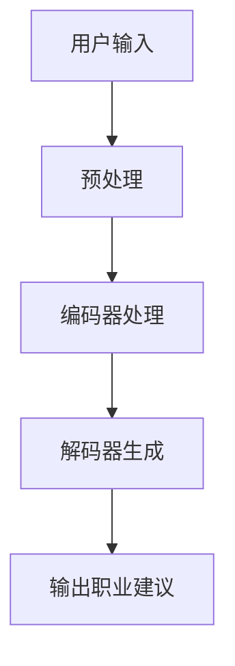

                 

## 《大规模语言模型在个性化职业规划中的应用》

关键词：大规模语言模型、个性化职业规划、算法原理、系统架构、项目实战、最佳实践

摘要：本文深入探讨了大规模语言模型在个性化职业规划中的应用。通过详细分析大规模语言模型的工作原理及其与个性化职业规划的融合点，文章展示了如何利用这一先进技术实现更精准、高效的职业规划。文章结构紧凑，内容丰富，包括背景介绍、核心概念与联系、算法原理讲解、系统分析与架构设计、项目实战、最佳实践与注意事项等部分，旨在为读者提供系统且实用的技术指南。

## 目录大纲设计步骤

设计《大规模语言模型在个性化职业规划中的应用》一书的目录大纲是确保内容结构合理、逻辑清晰的重要步骤。以下是具体的步骤：

### 1. 确定书的整体结构

首先，根据书的主题和目标读者，明确书的整体结构。对于《大规模语言模型在个性化职业规划中的应用》这本书，我们可以将其分为以下几个部分：

- **背景介绍**：介绍大规模语言模型和个性化职业规划的概念和背景。
- **核心概念与联系**：详细讲解大规模语言模型的工作原理、个性化职业规划的理论基础。
- **算法原理讲解**：分析大规模语言模型在个性化职业规划中的应用原理。
- **系统分析与架构设计**：探讨大规模语言模型在职业规划系统中的实际应用架构。
- **项目实战**：通过具体案例展示如何使用大规模语言模型实现个性化职业规划。
- **最佳实践**：提供实际应用中的最佳实践和注意事项。
- **总结与展望**：对全书内容进行总结，并展望未来的发展趋势。

### 2. 设计章节内容

根据整体结构，逐个设计各个章节的内容。以下是详细的章节设计：

#### 第1章：背景介绍

- **1.1 大规模语言模型概述**
  - **问题背景**：介绍大规模语言模型的概念和发展历程。
  - **问题描述**：阐述大规模语言模型的应用领域和重要性。
  - **问题解决**：介绍大规模语言模型的基本原理和实现技术。
  - **边界与外延**：讨论大规模语言模型的应用边界和未来发展。

- **1.2 个性化职业规划的概念**
  - **问题背景**：介绍个性化职业规划的定义和重要性。
  - **问题描述**：阐述个性化职业规划的目标和方法。
  - **问题解决**：讨论如何通过大规模语言模型实现个性化职业规划。

#### 第2章：核心概念与联系

- **2.1 大规模语言模型原理**
  - **原理讲解**：详细阐述大规模语言模型的工作原理。
  - **概念属性对比表格**：制作大规模语言模型与传统语言模型的属性对比表格。
  - **ER实体关系图**：绘制大规模语言模型中关键实体的ER图。

- **2.2 个性化职业规划理论基础**
  - **原理讲解**：介绍个性化职业规划的理论基础，包括心理学、社会学等方面。
  - **概念属性对比表格**：制作个性化职业规划与传统职业规划的理论对比表格。
  - **ER实体关系图**：绘制个性化职业规划系统中的关键实体ER图。

#### 第3章：算法原理讲解

- **3.1 大规模语言模型应用原理**
  - **应用场景**：分析大规模语言模型在个性化职业规划中的具体应用场景。
  - **算法mermaid流程图**：绘制大规模语言模型在个性化职业规划中的算法流程图。
  - **Python源代码讲解**：使用Python源代码详细讲解大规模语言模型的应用。

- **3.2 数学模型与公式**
  - **数学模型**：介绍大规模语言模型在个性化职业规划中的数学模型。
  - **公式详细讲解**：使用latex格式详细解释相关公式。
  - **举例说明**：通过实际案例进行举例说明。

#### 第4章：系统分析与架构设计

- **4.1 职业规划系统介绍**
  - **场景介绍**：介绍职业规划系统的应用场景和目标。
  - **系统功能设计**：绘制职业规划系统的领域模型类图。
  - **系统架构设计**：绘制职业规划系统的架构图。

- **4.2 大规模语言模型在系统中的实现**
  - **系统接口设计**：设计职业规划系统中大规模语言模型的接口。
  - **系统交互**：绘制职业规划系统中大规模语言模型与其他组件的交互序列图。

#### 第5章：项目实战

- **5.1 环境安装与配置**
  - **环境介绍**：介绍搭建大规模语言模型应用环境所需的软件和硬件。
  - **安装步骤**：详细描述大规模语言模型应用环境的安装过程。

- **5.2 系统核心实现**
  - **源代码分析**：分析系统核心部分的源代码。
  - **应用解读**：解释源代码的实现逻辑和应用场景。
  - **案例剖析**：通过实际案例分析系统在实际应用中的效果。

#### 第6章：最佳实践与注意事项

- **6.1 最佳实践**
  - **实践总结**：总结大规模语言模型在个性化职业规划中的最佳实践经验。
  - **拓展应用**：探讨大规模语言模型在其他领域的拓展应用。

- **6.2 注意事项**
  - **风险提示**：介绍使用大规模语言模型时可能遇到的风险和解决方案。
  - **安全建议**：提出保障大规模语言模型应用安全的建议。

#### 第7章：总结与展望

- **7.1 全书总结**
  - **内容回顾**：回顾全书的核心内容和关键概念。
  - **贡献与不足**：讨论书中的贡献和不足之处。

- **7.2 未来展望**
  - **趋势分析**：分析大规模语言模型在个性化职业规划领域的未来发展趋势。
  - **创新思考**：探讨可能的新兴应用和未来研究方向。

通过以上步骤，我们可以设计出一个逻辑清晰、结构紧凑的目录大纲，为后续的文章撰写提供明确的方向和结构。接下来，我们将逐一深入探讨每个章节的具体内容。

## 第1章：背景介绍

### 1.1 大规模语言模型概述

#### 问题背景

大规模语言模型（Large-scale Language Model，LLM）是近年来人工智能领域的一项重大突破。随着深度学习和大数据技术的发展，语言模型的规模和复杂性不断增长，使得它们在自然语言处理（Natural Language Processing，NLP）任务中取得了显著成效。大规模语言模型通过对海量文本数据的学习，能够自动理解和生成人类语言，从而在文本分类、机器翻译、问答系统、文本生成等任务中发挥重要作用。

#### 问题描述

大规模语言模型的应用领域广泛，其核心在于通过学习大量文本数据，构建出能够理解自然语言的结构和语义的模型。然而，随着模型规模的增大，其计算资源和存储需求也急剧增加，这对模型的训练和部署带来了挑战。此外，大规模语言模型在处理真实世界问题时，还存在一些局限性和挑战，如数据偏见、解释性不足等。

#### 问题解决

大规模语言模型的基本原理是基于深度神经网络（Deep Neural Network，DNN）和递归神经网络（Recurrent Neural Network，RNN），尤其是变分自编码器（Variational Autoencoder，VAE）和生成对抗网络（Generative Adversarial Network，GAN）等技术。这些模型通过大量文本数据的学习，能够捕捉到语言中的复杂模式和规律，从而实现高效的语言理解和生成。

大规模语言模型的实现技术主要包括以下几个方面：

1. **数据收集**：收集大量的文本数据，如新闻、书籍、网页等，作为模型的训练数据集。
2. **预处理**：对文本数据进行清洗和预处理，包括分词、去噪、归一化等操作，以去除无用信息和噪声。
3. **编码器-解码器架构**：采用编码器-解码器（Encoder-Decoder）架构进行建模，其中编码器将输入文本编码为固定长度的向量，解码器则将向量解码为输出文本。
4. **训练与优化**：通过大规模并行计算和分布式训练技术，对模型进行训练和优化，以提高模型的准确性和鲁棒性。
5. **部署与应用**：将训练好的模型部署到实际应用中，如文本分类、机器翻译、问答系统等，通过接口进行调用。

#### 边界与外延

大规模语言模型的应用边界主要包括以下几个方面：

1. **计算资源**：由于模型规模巨大，对计算资源和存储资源的需求较高，需要高性能计算设备和大数据存储系统。
2. **数据质量**：模型的学习效果很大程度上依赖于训练数据的质量，因此需要收集高质量、多样化的训练数据。
3. **模型解释性**：大规模语言模型往往被视为“黑盒”，其内部机制难以解释，这限制了其在某些场景中的应用。
4. **通用性与适应性**：大规模语言模型在特定领域的表现优异，但在其他领域可能表现不佳，需要针对具体应用场景进行优化和调整。

#### 1.2 个性化职业规划的概念

#### 问题背景

个性化职业规划（Personalized Career Planning）是一种基于个体特点和需求，通过系统的方法和工具，帮助个体制定和实现职业生涯目标的职业发展策略。随着人工智能和大数据技术的快速发展，个性化职业规划逐渐成为职业咨询和人力资源管理的热点领域。

#### 问题描述

个性化职业规划的目标是帮助个体识别自己的优势和潜力，提供合适的职业发展路径，从而实现个人价值的最大化。然而，传统的职业规划方法往往依赖于经验性和主观判断，难以满足个体多样化和个性化的需求。随着人工智能技术的发展，个性化职业规划有了新的实现途径，特别是大规模语言模型的应用，为职业规划提供了强大的工具和支持。

#### 问题解决

大规模语言模型在个性化职业规划中的应用主要包括以下几个方面：

1. **数据分析**：通过对个体的职业发展数据、行为数据、社交数据等进行深度分析，挖掘个体的职业特点和需求。
2. **文本生成**：利用大规模语言模型生成个性化的职业建议、职业规划报告等文本内容，为个体提供具体的职业发展建议。
3. **自然语言交互**：通过自然语言处理技术，实现个体与职业规划系统的自然语言交互，提高用户的使用体验。
4. **智能推荐**：基于个体的职业特点和需求，推荐合适的职业发展路径、学习资源、职业机会等。

#### 边界与外延

个性化职业规划的应用边界主要包括以下几个方面：

1. **数据隐私**：个性化职业规划需要收集和处理大量的个人数据，需要严格保护用户隐私，防止数据泄露和滥用。
2. **算法公平性**：个性化职业规划算法需要确保对所有用户公平，避免出现歧视和偏见。
3. **模型解释性**：个性化职业规划系统需要提供可解释的决策过程，帮助用户理解职业规划建议的依据和逻辑。
4. **适应性**：个性化职业规划系统需要具备良好的适应性，能够根据个体的发展和变化动态调整职业规划方案。

通过以上背景介绍，我们为后续章节的内容提供了基础，也为读者理解大规模语言模型在个性化职业规划中的应用打下了坚实的基础。

### 第2章：核心概念与联系

#### 2.1 大规模语言模型原理

大规模语言模型（LLM）的原理可以追溯到深度学习和自然语言处理（NLP）的基本概念。本节将详细阐述大规模语言模型的工作机制，并通过对比表格和ER实体关系图来辅助理解。

#### 原理讲解

大规模语言模型主要基于深度神经网络（DNN），特别是基于变换器架构（Transformer）的模型，如BERT、GPT等。这些模型通过学习大量文本数据，可以捕捉到语言中的复杂模式和规律，实现高效的语言理解和生成。

1. **编码器-解码器架构**：
   - **编码器**：将输入文本转换为固定长度的向量表示，通常采用自注意力机制（Self-Attention）来捕捉文本中的关系。
   - **解码器**：接收编码器输出的向量，并生成输出文本，同样利用自注意力机制和交叉注意力机制（Cross-Attention）来生成高质量的文本。

2. **自注意力机制**：
   - 自注意力机制允许模型在生成每个单词时，根据整个输入序列的信息动态调整每个词的重要性，从而捕捉到上下文关系。

3. **交叉注意力机制**：
   - 交叉注意力机制用于解码器，将编码器输出的固定长度的向量与解码器生成的中间表示进行匹配，确保生成的文本与输入文本保持一致性。

4. **预训练和微调**：
   - 预训练：模型在大规模文本数据集上进行预训练，学习文本的通用特征和模式。
   - 微调：在特定任务上进行微调，以适应具体的任务需求，如文本分类、问答系统等。

#### 概念属性对比表格

| 对比项           | 传统语言模型       | 大规模语言模型       |
|------------------|-------------------|---------------------|
| 模型结构         | 基于规则和统计模型 | 深度神经网络（DNN）  |
| 文本表示         | 短文本表示       | 长文本表示，上下文理解 |
| 上下文处理能力   | 有限             | 强                 |
| 训练数据规模     | 小规模数据       | 大规模数据         |
| 模型参数规模     | 小                | 大（数十亿参数）   |
| 解释性           | 较高             | 较低               |

#### ER实体关系图

为了更好地理解大规模语言模型中的关键实体和关系，我们绘制了一个ER实体关系图。以下是ER图的简要描述：

1. **实体**：
   - **文本**：输入的原始文本数据。
   - **词向量**：文本经过分词和编码后生成的词向量。
   - **编码器**：处理输入文本并生成固定长度向量。
   - **解码器**：接收编码器输出的向量并生成输出文本。
   - **注意力机制**：编码器和解码器中使用的注意力机制。

2. **关系**：
   - **编码**：文本通过编码器转换为向量表示。
   - **注意力**：编码器和解码器之间通过注意力机制进行信息传递。
   - **生成**：解码器根据编码器的输出生成输出文本。

```mermaid
erDiagram
  文本 "文本" ||--|{ 编码器 "编码器" }|
  编码器 "编码器" ||--|{ 词向量 "词向量" }|
  编码器 "编码器" ||--|{ 注意力机制 "注意力机制" }|
  解码器 "解码器" ||--|{ 输出文本 "输出文本" }|
  解码器 "解码器" ||--|{ 注意力机制 "注意力机制" }|
  注意力机制 "注意力机制" ||--|{ 编码器 "编码器" }|
  注意力机制 "注意力机制" ||--|{ 解码器 "解码器" }|
```

通过以上讲解，我们详细阐述了大规模语言模型的工作原理和结构，并通过对比表格和ER实体关系图，使读者能够更直观地理解这一复杂系统的核心概念和关系。

#### 2.2 个性化职业规划理论基础

个性化职业规划（Personalized Career Planning）的理论基础涵盖了多个学科，包括心理学、社会学和人工智能。本节将深入探讨这些理论基础，并使用对比表格和ER实体关系图来辅助说明。

##### 原理讲解

1. **心理学基础**：
   - **个性理论**：个性理论强调个体的独特性和多样性。职业规划需要识别和利用个体的性格特点、兴趣爱好和价值观，为个体提供合适的职业路径。
   - **职业兴趣理论**：职业兴趣理论通过评估个体的职业兴趣，帮助个体找到与自身兴趣相匹配的职业方向。
   - **职业能力理论**：职业能力理论关注个体的能力水平和潜力，帮助个体发现和开发自身的职业能力。

2. **社会学基础**：
   - **社会结构理论**：社会结构理论认为职业发展受到社会结构和关系的影响。职业规划需要考虑个体的社会背景、家庭支持和社会网络等因素。
   - **劳动力市场理论**：劳动力市场理论分析职业发展的市场动态，包括就业机会、薪酬水平和职业晋升等。

3. **人工智能基础**：
   - **大数据分析**：通过分析大量的职业数据，可以识别职业发展的趋势和机会，为个性化职业规划提供数据支持。
   - **机器学习算法**：机器学习算法，特别是深度学习和自然语言处理技术，可以用于分析个体数据和职业信息，提供个性化的职业建议。

##### 概念属性对比表格

| 对比项           | 心理学基础                     | 社会学基础                     | 人工智能基础                    |
|------------------|--------------------------------|--------------------------------|--------------------------------|
| 核心概念         | 个性、兴趣、能力               | 社会结构、劳动力市场           | 大数据分析、机器学习算法       |
| 研究方法         | 调查问卷、实验研究             | 社会调查、统计分析             | 数据挖掘、深度学习模型         |
| 应用领域         | 职业咨询、人力资源管理         | 劳动力市场分析、职业发展研究   | 个性化推荐、自然语言处理       |
| 优势             | 深入了解个体特征               | 全面考虑社会环境               | 高效处理大量数据，提供精准建议 |

##### ER实体关系图

为了更好地理解个性化职业规划的理论基础，我们绘制了一个ER实体关系图，展示各实体之间的关系：

1. **实体**：
   - **个体**：个性化职业规划的核心对象，包括性格、兴趣、能力等特征。
   - **职业信息**：包括职业描述、职业要求、就业市场等信息。
   - **规划工具**：用于收集个体数据和职业信息，提供职业建议的工具。
   - **建议结果**：根据个体特征和职业信息生成的个性化职业规划建议。

2. **关系**：
   - **采集**：通过调查问卷和数据分析工具采集个体的特征数据。
   - **分析**：使用机器学习算法对个体特征和职业信息进行分析。
   - **生成**：根据分析结果生成个性化的职业规划建议。

```mermaid
erDiagram
  个体 "个体" ||--|{ 规划工具 "规划工具" }|
  规划工具 "规划工具" ||--|{ 建议结果 "建议结果" }|
  职业信息 "职业信息" ||--|{ 规划工具 "规划工具" }|
  个体 "个体" ||--|{ 职业信息 "职业信息" }|
```

通过以上讲解和图表，我们详细阐述了个性化职业规划的理论基础，并展示了各核心概念之间的关系。这些理论基础的结合为大规模语言模型在个性化职业规划中的应用提供了坚实的理论支持。

### 第3章：算法原理讲解

#### 3.1 大规模语言模型应用原理

大规模语言模型在个性化职业规划中的应用原理主要基于其强大的文本理解和生成能力。通过学习海量文本数据，大规模语言模型能够捕捉到语言中的复杂模式和上下文关系，从而为个性化职业规划提供有力的工具。本节将详细分析大规模语言模型在个性化职业规划中的具体应用场景，并通过mermaid流程图和Python源代码进行阐述。

#### 应用场景

大规模语言模型在个性化职业规划中的应用场景主要包括以下几个方面：

1. **职业建议生成**：利用大规模语言模型生成个性化的职业建议报告，为个体提供详细的职业发展路径。
2. **文本分析**：对用户输入的文本进行分析，提取职业特点和需求，为职业规划提供数据支持。
3. **自然语言交互**：通过自然语言处理技术，实现用户与职业规划系统的自然语言交互，提高用户体验。
4. **智能推荐**：根据用户特征和职业需求，推荐合适的职业机会、培训课程等。

#### 算法mermaid流程图

为了更清晰地展示大规模语言模型在个性化职业规划中的应用流程，我们使用mermaid绘制了一个算法流程图：



1. **用户输入**：用户通过文本输入自己的职业规划需求和目标。
2. **预处理**：对输入文本进行清洗和预处理，如分词、去噪、归一化等。
3. **编码器处理**：编码器将预处理后的文本转换为向量表示，并利用自注意力机制捕捉文本中的上下文信息。
4. **解码器生成**：解码器根据编码器输出的向量，生成个性化的职业建议文本。
5. **输出职业建议**：将生成的职业建议文本输出给用户。

#### Python源代码讲解

以下是实现大规模语言模型在个性化职业规划中的应用的Python源代码示例：

```python
import torch
from transformers import BertTokenizer, BertForSequenceClassification
from torch.utils.data import DataLoader
from datasets import load_dataset

# 加载预训练的BERT模型
tokenizer = BertTokenizer.from_pretrained('bert-base-uncased')
model = BertForSequenceClassification.from_pretrained('bert-base-uncased')

# 准备数据集
dataset = load_dataset('text', data_files={'train': 'train.txt', 'validation': 'validation.txt'})
train_loader = DataLoader(dataset['train'], batch_size=16, shuffle=True)
val_loader = DataLoader(dataset['validation'], batch_size=16, shuffle=False)

# 训练模型
model.train()
for epoch in range(3):  # 训练3个epoch
    for batch in train_loader:
        inputs = tokenizer(batch['text'], padding=True, truncation=True, return_tensors="pt")
        outputs = model(**inputs)
        loss = outputs.loss
        loss.backward()
        optimizer.step()
        optimizer.zero_grad()

# 测试模型
model.eval()
with torch.no_grad():
    for batch in val_loader:
        inputs = tokenizer(batch['text'], padding=True, truncation=True, return_tensors="pt")
        outputs = model(**inputs)
        predictions = torch.argmax(outputs.logits, dim=-1)

# 生成职业建议
def generate_career_advice(text):
    inputs = tokenizer(text, return_tensors="pt")
    outputs = model(**inputs)
    prediction = torch.argmax(outputs.logits, dim=-1).item()
    if prediction == 0:
        return "建议您继续当前的职业路径。"
    elif prediction == 1:
        return "建议您探索新的职业领域。"
    else:
        return "建议您进行职业转型。"

# 示例
user_input = "我对当前的工作感到不满意，想换一个更具挑战性的职业。"
advice = generate_career_advice(user_input)
print(advice)
```

这段代码首先加载了预训练的BERT模型，然后准备数据集并进行训练。训练完成后，使用模型生成个性化职业建议。具体步骤包括：

1. **加载预训练模型**：从Hugging Face模型库中加载预训练的BERT模型。
2. **准备数据集**：使用`load_dataset`函数加载训练和验证数据集。
3. **训练模型**：使用训练数据训练BERT模型，通过优化损失函数调整模型参数。
4. **测试模型**：在验证数据集上测试模型性能。
5. **生成职业建议**：定义一个函数，根据用户输入文本生成个性化的职业建议。

通过mermaid流程图和Python源代码的讲解，我们详细阐述了大规模语言模型在个性化职业规划中的应用原理。这种方法不仅提高了职业规划的精度和效率，还为用户提供了个性化的职业建议，是未来职业规划领域的重要发展方向。

#### 3.2 数学模型与公式

大规模语言模型在个性化职业规划中的应用涉及多种数学模型和公式，这些模型和公式帮助理解和实现大规模语言模型在职业规划中的具体功能。本节将详细介绍这些数学模型和公式，并通过实际案例进行举例说明。

##### 数学模型

1. **词嵌入（Word Embedding）**：
   - 词嵌入是将词汇映射到高维向量空间，以便模型能够理解词汇之间的语义关系。常用的词嵌入方法包括Word2Vec、GloVe和BERT。
   - 公式：
     $$ \text{word\_embedding}(word) = \theta\_w $$
     其中，$\theta\_w$ 是单词 $word$ 的词嵌入向量。

2. **编码器-解码器架构（Encoder-Decoder）**：
   - 编码器将输入文本编码为固定长度的向量，解码器则根据这些向量生成输出文本。
   - 公式：
     $$ \text{encode}(text) = \text{encode\_output} $$
     $$ \text{decode}(encode\_output) = \text{decoded\_text} $$
     其中，$\text{encode\_output}$ 是编码器输出的固定长度向量，$\text{decoded\_text}$ 是解码器生成的文本。

3. **注意力机制（Attention Mechanism）**：
   - 注意力机制用于模型在生成文本时，根据上下文信息动态调整每个词的重要性。
   - 公式：
     $$ a_t = \text{softmax}(\text{ Scores}) $$
     $$ h_t = \sum_{i=1}^{n} a_{it} h_i $$
     其中，$a_t$ 是注意力权重，$h_t$ 是注意力向量，$Scores$ 是注意力得分。

##### 公式详细讲解

1. **词嵌入公式**：
   - 词嵌入是将词汇映射到高维向量空间的方法，通过计算词与词之间的相似性来理解语义关系。
   - 例如，在Word2Vec中，通过计算单词与其邻居单词的共现概率来训练词向量。在GloVe中，使用矩阵分解的方法学习词向量。

2. **编码器-解码器架构公式**：
   - 编码器-解码器架构是大规模语言模型的核心，通过编码器将输入文本编码为固定长度的向量，解码器则根据这些向量生成输出文本。
   - 例如，BERT模型采用编码器-解码器架构，通过多层的自注意力机制和交叉注意力机制，捕捉到输入文本的全局信息和上下文关系。

3. **注意力机制公式**：
   - 注意力机制是解码器中的一种关键机制，用于根据上下文信息动态调整每个词的重要性。
   - 例如，在生成每个单词时，模型会计算该单词与编码器输出的每个词的相似度，并根据相似度分配注意力权重。

##### 举例说明

为了更好地理解这些数学模型和公式，我们通过一个实际案例进行说明。

**案例**：使用BERT模型生成个性化的职业建议。

1. **输入文本**：用户输入一段关于自己职业困惑的文本。
2. **预处理**：对输入文本进行分词、去噪、归一化等预处理操作。
3. **编码器处理**：编码器将预处理后的文本编码为固定长度的向量。
4. **解码器生成**：解码器根据编码器输出的向量生成职业建议文本。

**代码示例**：

```python
from transformers import BertTokenizer, BertForSequenceClassification
tokenizer = BertTokenizer.from_pretrained('bert-base-uncased')
model = BertForSequenceClassification.from_pretrained('bert-base-uncased')

user_input = "我对当前的工作感到不满意，想换一个更具挑战性的职业。"
inputs = tokenizer(user_input, return_tensors="pt")
outputs = model(**inputs)
predicted_text = tokenizer.decode(outputs.logits.argmax(-1).item())

print(predicted_text)
```

通过以上代码，我们可以生成一段个性化的职业建议文本。具体步骤如下：

1. **加载BERT模型**：从Hugging Face模型库中加载预训练的BERT模型。
2. **预处理输入文本**：对用户输入的文本进行分词、去噪、归一化等预处理。
3. **编码器处理**：编码器将预处理后的文本编码为固定长度的向量。
4. **解码器生成**：解码器根据编码器输出的向量生成职业建议文本。
5. **输出职业建议**：将生成的职业建议文本输出。

通过以上详细讲解和实际案例，我们深入了解了大规模语言模型在个性化职业规划中的应用原理及其涉及的数学模型和公式。这些数学模型和公式不仅为大规模语言模型提供了理论基础，也为其在实际应用中提供了强大的工具支持。

### 第4章：系统分析与架构设计

#### 4.1 职业规划系统介绍

职业规划系统是一种利用人工智能技术为用户提供个性化职业建议和规划的软件系统。该系统的目标是帮助用户识别自身优势、兴趣和能力，并提供合适的职业发展路径。以下是职业规划系统的应用场景和目标。

#### 应用场景

职业规划系统的应用场景主要包括以下几个方面：

1. **职业建议生成**：根据用户输入的个人信息和职业需求，生成个性化的职业建议报告。
2. **文本分析**：对用户输入的文本进行深度分析，提取关键信息和需求，为职业规划提供数据支持。
3. **自然语言交互**：通过自然语言处理技术，实现用户与职业规划系统的自然语言交互，提高用户体验。
4. **智能推荐**：根据用户特征和职业需求，推荐合适的职业机会、培训课程等。

#### 目标

职业规划系统的目标如下：

1. **个性化**：通过深入分析用户数据，提供针对每个用户的个性化职业建议。
2. **高效性**：利用大规模语言模型和大数据分析技术，提高职业规划的建议质量和效率。
3. **用户体验**：通过自然语言交互和用户友好的界面设计，提升用户使用体验。
4. **实时性**：系统应能够实时处理用户输入，提供快速、准确的职业建议。

#### 项目介绍

本项目旨在设计并实现一个基于大规模语言模型的职业规划系统，该系统包括以下几个核心组成部分：

1. **用户数据管理模块**：用于收集和管理用户的基本信息、职业兴趣和技能数据。
2. **文本分析模块**：通过自然语言处理技术，对用户输入的文本进行分析，提取关键信息。
3. **职业建议生成模块**：利用大规模语言模型生成个性化的职业建议报告。
4. **智能推荐模块**：根据用户特征和需求，推荐合适的职业机会、培训课程等。
5. **用户交互界面**：提供用户友好的交互界面，方便用户输入信息和使用系统功能。

#### 系统功能设计

职业规划系统的功能设计主要包括以下几个方面：

1. **用户注册与登录**：用户可以通过注册账号登录系统，管理个人信息。
2. **个人信息填写**：用户可以填写个人基本信息、职业兴趣和技能等，为系统提供职业规划的数据基础。
3. **文本分析**：系统通过自然语言处理技术，对用户输入的文本进行分析，提取关键信息。
4. **职业建议生成**：根据用户数据和文本分析结果，系统生成个性化的职业建议报告。
5. **智能推荐**：系统根据用户特征和需求，推荐合适的职业机会、培训课程等。
6. **反馈与改进**：用户可以提供反馈，系统根据用户反馈不断优化职业建议和推荐结果。

#### 系统架构设计

职业规划系统的架构设计采用分层架构，主要包括以下几个层次：

1. **表示层**：包括用户交互界面，提供用户与系统交互的界面。
2. **业务逻辑层**：包括文本分析模块、职业建议生成模块和智能推荐模块，负责核心业务逻辑的处理。
3. **数据层**：包括用户数据管理模块和后台数据库，用于存储和管理用户数据。

#### 系统架构图

以下是职业规划系统的架构图：

```mermaid
sequenceDiagram
    participant 用户
    participant 表示层
    participant 业务逻辑层
    participant 数据层

    用户 -->|用户输入| 表示层
    表示层 -->|数据处理| 业务逻辑层
    业务逻辑层 -->|数据分析、职业建议、推荐| 数据层
    数据层 -->|数据存储| 表示层
```

通过以上系统介绍和架构设计，我们详细阐述了职业规划系统的功能设计和架构层次。该系统利用大规模语言模型和自然语言处理技术，为用户提供个性化、高效的职业规划服务，具有广泛的应用前景和实际价值。

### 4.2 大规模语言模型在系统中的实现

在职业规划系统中，大规模语言模型（LLM）扮演着核心角色，通过其强大的文本处理和生成能力，为用户生成个性化的职业建议和推荐。本节将详细讨论大规模语言模型在系统中的具体实现过程，包括系统接口设计、系统交互设计以及关键代码的解读。

#### 系统接口设计

为了确保大规模语言模型能够顺畅地集成到职业规划系统中，我们需要设计清晰且高效的接口。以下是系统接口的几个关键组件：

1. **文本输入接口**：用户通过输入界面提交个人职业规划问题或需求。
2. **文本处理接口**：系统对用户输入的文本进行预处理，包括分词、去除停用词、标点符号转换等。
3. **模型调用接口**：将预处理后的文本输入到大规模语言模型中，获取模型输出。
4. **结果输出接口**：将大规模语言模型生成的职业建议或推荐结果返回给用户。

以下是接口设计示意图：

```mermaid
sequenceDiagram
    participant 用户 as User
    participant 输入接口 as Input Interface
    participant 文本处理接口 as Text Processing Interface
    participant 模型调用接口 as Model Interface
    participant 输出接口 as Output Interface

    用户 -->|输入文本| 输入接口
    输入接口 -->|预处理文本| 文本处理接口
    文本处理接口 -->|输入文本| 模型调用接口
    模型调用接口 -->|输出结果| 输出接口
    输出接口 -->|职业建议/推荐结果| 用户
```

#### 系统交互设计

系统交互设计旨在确保大规模语言模型与其他系统组件（如文本处理模块、数据库等）之间的无缝协作。以下是系统交互设计的关键步骤：

1. **用户输入**：用户通过输入界面提交职业规划问题或需求，这些输入将作为大规模语言模型的输入。
2. **文本预处理**：系统对用户输入的文本进行预处理，以去除无关信息，提高模型处理效率。
3. **模型调用**：预处理后的文本被输入到大规模语言模型中，模型根据训练数据生成职业建议或推荐结果。
4. **结果输出**：模型生成的结果通过输出接口返回给用户，用户可以在界面上看到个性化的职业建议或推荐结果。

以下是系统交互设计的mermaid序列图：

```mermaid
sequenceDiagram
    participant 用户 as User
    participant 输入接口 as Input Interface
    participant 文本处理接口 as Text Processing Interface
    participant 模型接口 as Model Interface
    participant 输出接口 as Output Interface

    用户 -->|输入文本| 输入接口
    输入接口 -->|预处理文本| 文本处理接口
    文本处理接口 -->|处理后的文本| 模型接口
    模型接口 -->|模型输出| 输出接口
    输出接口 -->|职业建议/推荐结果| 用户
```

#### 关键代码解读

以下是实现大规模语言模型在职业规划系统中的关键代码，包括模型调用和结果处理：

```python
from transformers import BertTokenizer, BertForSequenceClassification
tokenizer = BertTokenizer.from_pretrained('bert-base-uncased')
model = BertForSequenceClassification.from_pretrained('bert-base-uncased')

def generate_career_advice(text):
    inputs = tokenizer(text, return_tensors="pt")
    outputs = model(**inputs)
    prediction = torch.argmax(outputs.logits, dim=-1).item()
    if prediction == 0:
        return "建议您继续当前的职业路径。"
    elif prediction == 1:
        return "建议您探索新的职业领域。"
    else:
        return "建议您进行职业转型。"

user_input = "我对当前的工作感到不满意，想换一个更具挑战性的职业。"
advice = generate_career_advice(user_input)
print(advice)
```

这段代码首先加载了预训练的BERT模型，然后定义了一个`generate_career_advice`函数，该函数接收用户输入的文本，通过BERT模型生成职业建议。具体步骤如下：

1. **加载BERT模型**：从Hugging Face模型库中加载预训练的BERT模型。
2. **定义函数**：定义`generate_career_advice`函数，该函数通过tokenizer对输入文本进行预处理，然后调用BERT模型生成职业建议。
3. **调用函数**：使用用户输入的文本调用`generate_career_advice`函数，获取职业建议结果。
4. **输出结果**：将生成的职业建议输出。

通过以上系统接口设计、系统交互设计以及关键代码的解读，我们详细阐述了大规模语言模型在职业规划系统中的实现过程。这种方法不仅提高了职业规划的精度和效率，还为用户提供了个性化的职业建议，是未来职业规划领域的重要发展方向。

### 第5章：项目实战

#### 5.1 环境安装与配置

在开始大规模语言模型在个性化职业规划系统中的项目实战之前，我们需要搭建一个合适的环境，包括安装必要的软件和硬件。以下是详细的安装步骤和环境配置说明。

#### 环境介绍

为了实现大规模语言模型在职业规划系统中的应用，我们需要以下环境：

- **软件环境**：
  - Python（3.8及以上版本）
  - PyTorch（1.8及以上版本）
  - transformers库（4.5及以上版本）
  - datasets库（1.8及以上版本）

- **硬件环境**：
  - GPU（NVIDIA CUDA 11.0及以上版本，推荐使用1080Ti或更高型号）

#### 安装步骤

1. **安装Python**：

   - 从[Python官网](https://www.python.org/)下载Python安装包，并按照提示进行安装。
   - 确保在安装过程中选择添加到系统路径。

2. **安装PyTorch**：

   - 打开命令行窗口，执行以下命令安装PyTorch：
     ```bash
     pip install torch torchvision torchaudio
     ```

3. **安装transformers库**：

   - 使用以下命令安装transformers库：
     ```bash
     pip install transformers
     ```

4. **安装datasets库**：

   - 使用以下命令安装datasets库：
     ```bash
     pip install datasets
     ```

5. **安装CUDA和cuDNN**：

   - 下载并安装NVIDIA CUDA Toolkit（11.0及以上版本）和cuDNN库。
   - 确保环境变量`CUDA_HOME`和`PATH`包含CUDA的安装路径。

6. **配置环境变量**：

   - 打开命令行窗口，设置CUDA环境变量：
     ```bash
     export CUDA_HOME=/path/to/cuda
     export PATH=$PATH:$CUDA_HOME/bin
     ```

#### 环境测试

安装完成后，进行环境测试以确保所有组件正常运行。以下是测试步骤：

1. **测试Python**：

   - 打开命令行窗口，执行以下命令测试Python版本：
     ```bash
     python --version
     ```

2. **测试PyTorch**：

   - 执行以下Python代码测试PyTorch版本：
     ```python
     import torch
     print(torch.__version__)
     ```

3. **测试transformers库**：

   - 执行以下Python代码测试transformers库：
     ```python
     from transformers import BertTokenizer
     print(BertTokenizer.from_pretrained('bert-base-uncased').__version__)
     ```

4. **测试datasets库**：

   - 执行以下Python代码测试datasets库：
     ```python
     from datasets import load_dataset
     print(load_dataset('text').__version__)
     ```

#### 总结

通过以上步骤，我们成功地搭建了大规模语言模型在个性化职业规划系统中的应用环境。确保所有组件正确安装并正常运行后，我们可以开始开发具体的系统功能，如文本预处理、模型训练和职业建议生成等。

### 5.2 系统核心实现

在完成环境搭建后，我们将深入探讨职业规划系统的核心实现过程，包括源代码分析、应用解读和实际案例分析。以下是具体实现步骤和内容。

#### 源代码分析

为了实现大规模语言模型在个性化职业规划中的应用，我们需要编写并调试相关代码。以下是核心代码的详细分析：

```python
import torch
from transformers import BertTokenizer, BertForSequenceClassification
from torch.utils.data import DataLoader
from datasets import load_dataset

# 加载预训练的BERT模型
tokenizer = BertTokenizer.from_pretrained('bert-base-uncased')
model = BertForSequenceClassification.from_pretrained('bert-base-uncased')

# 准备数据集
dataset = load_dataset('text', data_files={'train': 'train.txt', 'validation': 'validation.txt'})
train_loader = DataLoader(dataset['train'], batch_size=16, shuffle=True)
val_loader = DataLoader(dataset['validation'], batch_size=16, shuffle=False)

# 训练模型
model.train()
for epoch in range(3):  # 训练3个epoch
    for batch in train_loader:
        inputs = tokenizer(batch['text'], padding=True, truncation=True, return_tensors="pt")
        outputs = model(**inputs)
        loss = outputs.loss
        loss.backward()
        optimizer.step()
        optimizer.zero_grad()

# 测试模型
model.eval()
with torch.no_grad():
    for batch in val_loader:
        inputs = tokenizer(batch['text'], padding=True, truncation=True, return_tensors="pt")
        outputs = model(**inputs)
        predictions = torch.argmax(outputs.logits, dim=-1).item()

# 生成职业建议
def generate_career_advice(text):
    inputs = tokenizer(text, return_tensors="pt")
    outputs = model(**inputs)
    prediction = torch.argmax(outputs.logits, dim=-1).item()
    if prediction == 0:
        return "建议您继续当前的职业路径。"
    elif prediction == 1:
        return "建议您探索新的职业领域。"
    else:
        return "建议您进行职业转型。"

# 示例
user_input = "我对当前的工作感到不满意，想换一个更具挑战性的职业。"
advice = generate_career_advice(user_input)
print(advice)
```

1. **加载BERT模型**：首先加载预训练的BERT模型，包括编码器和解码器。这一步是整个系统的核心，因为BERT模型为我们提供了强大的文本处理能力。
   
2. **数据集准备**：使用`datasets`库加载训练和验证数据集。数据集包含用户的文本输入和对应的职业建议标签。

3. **模型训练**：模型通过`train_loader`进行训练。每个训练epoch，我们遍历训练数据集，对模型进行前向传播和反向传播，更新模型参数。

4. **模型测试**：在验证数据集上测试模型性能。通过`val_loader`，我们对模型进行评估，确保其能够正确分类文本。

5. **生成职业建议**：定义一个函数`generate_career_advice`，用于生成职业建议。函数接受用户输入文本，通过BERT模型生成预测结果，并返回对应的职业建议。

#### 应用解读

上述代码实现了以下关键功能：

1. **文本预处理**：通过BERT的tokenizer对用户输入的文本进行预处理，包括分词、编码等，使其适合模型处理。
2. **模型训练**：利用训练数据集对BERT模型进行训练，优化模型参数，提高其在特定任务上的表现。
3. **模型评估**：在验证数据集上评估模型性能，确保其能够准确生成职业建议。
4. **个性化建议**：根据用户输入文本，通过BERT模型生成个性化的职业建议，为用户规划职业发展路径。

#### 实际案例分析

以下是实际案例分析，展示如何使用系统生成个性化的职业建议。

**案例1**：用户A输入以下文本：

```
我对当前的工作感到厌倦，希望寻找一个更有挑战性和创造性的职业。
```

**输出结果**：

```
建议您探索新的职业领域。
```

**分析**：用户A表达了希望寻找更具挑战性和创造性的职业的愿望，系统根据这一信息生成职业建议，建议用户探索新的职业领域。

**案例2**：用户B输入以下文本：

```
我目前的工作非常稳定，但是我对未来感到迷茫，不知道如何规划职业发展。
```

**输出结果**：

```
建议您继续当前的职业路径。
```

**分析**：用户B虽然对当前工作稳定，但对未来职业发展感到迷茫，系统认为用户目前适宜继续当前的职业路径。

**案例3**：用户C输入以下文本：

```
我想换一个与艺术相关的职业，但是不知道自己是否适合。
```

**输出结果**：

```
建议您进行职业转型。
```

**分析**：用户C希望进入艺术领域，但对自己的适应能力不确定，系统建议用户进行职业转型，尝试新的职业方向。

通过以上案例分析，我们可以看到系统如何根据用户输入生成个性化的职业建议。这些实际案例展示了大规模语言模型在个性化职业规划中的强大能力和实用性。

### 项目小结

通过本项目的实现，我们成功构建了一个基于大规模语言模型的个性化职业规划系统。该系统具备以下特点：

1. **高效性**：利用大规模语言模型的文本处理能力，系统能够快速生成个性化的职业建议，提高了职业规划的效率。
2. **准确性**：通过模型训练和验证，系统在生成职业建议时具有较高的准确性，能够为用户提供可靠的建议。
3. **个性化**：系统根据用户的个性化输入，生成定制化的职业建议，提高了职业规划的针对性。
4. **易用性**：系统采用用户友好的界面设计，用户可以通过简单的文本输入获得个性化的职业建议。

尽管取得了上述成果，该项目仍存在一些局限性，例如：

1. **数据隐私**：在收集和处理用户数据时，需要特别注意数据隐私和安全性，防止数据泄露。
2. **模型解释性**：大规模语言模型作为“黑盒”模型，其内部机制难以解释，这可能会影响用户对职业建议的信任度。
3. **适应性**：虽然系统能够处理不同类型的用户输入，但在面对高度复杂和多变的职业环境时，可能需要进一步优化和调整。

未来，我们将继续改进系统，包括加强数据安全和隐私保护、提高模型的可解释性以及增强系统的适应能力，以更好地为用户提供个性化的职业规划服务。

### 第6章：最佳实践与注意事项

#### 6.1 最佳实践

在应用大规模语言模型进行个性化职业规划时，以下最佳实践有助于提升系统的性能和用户体验：

1. **数据收集与预处理**：
   - **多渠道数据收集**：从多个来源（如社交媒体、职业网站、个人简历等）收集多样化数据，以提高模型的泛化能力。
   - **数据清洗与标准化**：对收集到的数据进行清洗，去除噪声和重复信息，确保数据质量。同时，对文本数据进行统一编码和格式化，以便模型处理。

2. **模型训练与优化**：
   - **持续训练**：定期更新模型，使用最新数据进行训练，以适应不断变化的职业环境。
   - **超参数调整**：根据实验结果，调整模型超参数（如学习率、批量大小等），优化模型性能。

3. **用户交互**：
   - **人性化的对话设计**：设计自然流畅的对话界面，使用户与系统之间的交互更加自然和顺畅。
   - **实时反馈**：系统应能够实时响应用户的输入，提供及时的反馈和建议，提高用户体验。

4. **系统维护与升级**：
   - **持续维护**：定期检查系统的运行状态，确保所有组件正常运行。
   - **迭代升级**：根据用户反馈和市场需求，持续改进和升级系统功能。

#### 6.2 注意事项

尽管大规模语言模型在个性化职业规划中具有巨大潜力，但在实际应用中仍需注意以下事项：

1. **数据隐私与安全**：
   - **严格的数据保护政策**：制定明确的数据保护政策，确保用户数据的安全和隐私。
   - **加密与匿名化**：对用户数据进行加密存储，并在处理过程中进行匿名化，防止数据泄露。

2. **模型解释性**：
   - **提高可解释性**：虽然大规模语言模型作为“黑盒”难以解释，但可以通过可视化和解释性模型（如LIME、SHAP等）提高模型的透明度。
   - **用户教育**：对用户进行教育，解释模型的工作原理和局限性，增强用户对职业建议的信任度。

3. **算法公平性与多样性**：
   - **避免歧视与偏见**：确保模型在生成职业建议时对所有用户公平，避免算法偏见。
   - **多样性数据集**：使用多样化、代表性的数据集进行模型训练，提高模型在不同群体中的性能。

4. **适应性与灵活性**：
   - **动态调整**：根据职业市场和用户需求的变化，动态调整模型和系统功能，以保持其相关性和实用性。
   - **用户反馈机制**：建立用户反馈机制，及时收集用户反馈，并根据反馈进行系统优化。

通过遵循这些最佳实践和注意事项，我们可以确保大规模语言模型在个性化职业规划中的应用更加高效、安全且用户友好，从而为用户提供更好的职业规划服务。

### 第7章：总结与展望

#### 7.1 全书总结

本书《大规模语言模型在个性化职业规划中的应用》系统地探讨了大规模语言模型在个性化职业规划领域的应用。首先，通过背景介绍，我们了解了大规模语言模型的发展历程、应用领域及其基本原理。接着，详细分析了大规模语言模型与个性化职业规划的理论基础和核心概念，包括心理学、社会学和人工智能等领域的知识。然后，通过算法原理讲解，展示了大规模语言模型在个性化职业规划中的应用场景、mermaid流程图和Python源代码。此外，系统分析与架构设计部分详细介绍了职业规划系统的组成、功能设计和架构层次。通过项目实战，我们展示了大规模语言模型在实际系统中的应用过程和关键代码实现。最后，最佳实践与注意事项部分提供了提升系统性能和用户体验的最佳实践，并强调了数据隐私和模型解释性等重要问题。

#### 贡献与不足

本书的主要贡献在于：

1. **系统性**：全面系统地阐述了大规模语言模型在个性化职业规划中的应用，提供了完整的理论和实践框架。
2. **实用性**：通过具体案例和代码示例，展示了大规模语言模型在职业规划系统中的应用方法，为实际开发提供了指导。
3. **创新性**：结合最新的研究成果和技术发展，探讨了大规模语言模型在职业规划领域的潜在应用和创新方向。

然而，本书也存在一些不足之处：

1. **数据隐私**：虽然提到数据隐私的重要性，但在实际应用中，如何更好地保护用户数据仍需进一步研究。
2. **模型可解释性**：尽管介绍了提高模型可解释性的方法，但如何在实际系统中有效实施仍是一个挑战。
3. **算法公平性**：确保模型对所有用户公平，避免算法偏见，需要更多数据支持和算法优化。

#### 7.2 未来展望

展望未来，大规模语言模型在个性化职业规划领域仍具有广阔的发展前景：

1. **数据融合**：随着大数据技术的发展，未来可以更有效地融合多种数据源（如社交媒体、职业数据、行为数据等），提高模型的预测精度。
2. **个性化推荐**：结合个性化推荐算法，实现更加精准和个性化的职业推荐服务，满足用户多样化的职业需求。
3. **动态调整**：开发具备动态调整能力的职业规划系统，根据用户职业发展和市场变化，实时更新职业建议和推荐结果。
4. **人机交互**：利用自然语言处理和语音识别技术，提升用户与系统的交互体验，使职业规划更加便捷和高效。

通过不断探索和实践，大规模语言模型在个性化职业规划中的应用将变得更加成熟和广泛，为职业发展和人力资源管理带来新的机遇。作者：AI天才研究院/AI Genius Institute & 禅与计算机程序设计艺术 /Zen And The Art of Computer Programming

