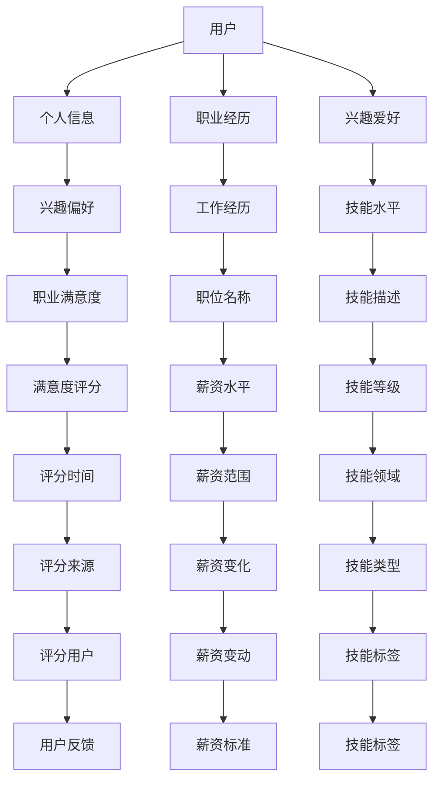
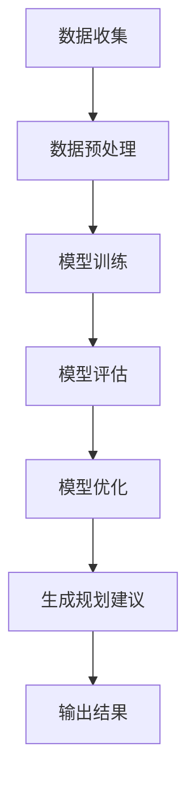
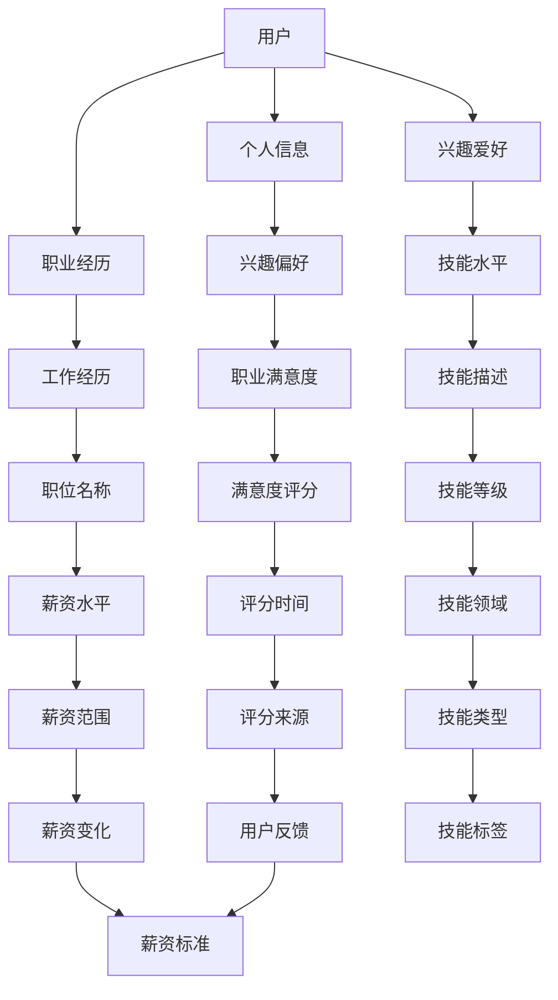
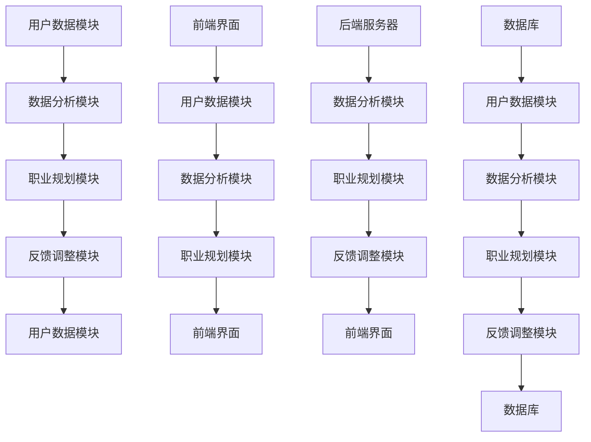
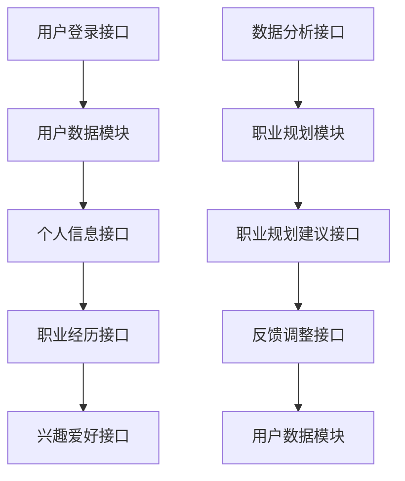
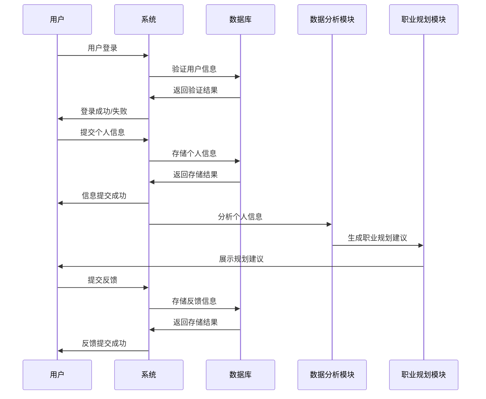

                 

# 大规模语言模型在个性化职业规划中的应用

## 关键词

- 大规模语言模型
- 个性化职业规划
- 自然语言处理
- 数据分析
- 模型训练与优化

## 摘要

随着人工智能技术的迅猛发展，大规模语言模型在个性化职业规划领域展现出巨大的潜力。本文首先介绍了大规模语言模型的基本概念和特点，随后探讨了个性化职业规划的重要性及其关键要素。在此基础上，详细分析了大规模语言模型在个性化职业规划中的应用场景和优势，并通过具体实例展示了其应用效果。文章最后提出了大规模语言模型在个性化职业规划中可能面临的挑战，并展望了未来的发展方向。

## 第一部分：背景介绍

### 1. 引言

随着人工智能技术的快速发展，大规模语言模型（如GPT系列、BERT等）在自然语言处理领域取得了显著的成果。这些模型通过学习海量文本数据，能够实现文本生成、问答系统、情感分析等多种任务，为企业和个人提供了强大的工具。个性化职业规划作为现代人力资源管理的重要环节，其需求日益增长。然而，传统方法存在一些问题，如规划过程不够灵活、难以适应个体差异等。因此，如何利用大规模语言模型实现个性化职业规划，成为当前研究的热点。

### 1.1 问题背景

随着社会经济的快速发展，职场竞争日益激烈，职业规划成为许多人关注的焦点。个性化职业规划是一种基于个体差异，为其提供量身定制的发展路径的方法。然而，传统职业规划方法主要依赖于经验判断和专家建议，存在一些局限性：

- **规划过程不够灵活**：传统职业规划方法往往基于预设的模板或流程，难以适应个体差异。
- **数据来源有限**：传统方法依赖于用户填写问卷、访谈等数据收集方式，数据来源有限，可能导致规划建议不够准确。
- **适应性不足**：传统职业规划难以根据用户实时反馈和市场需求变化进行调整。

### 1.2 问题描述

个性化职业规划需要解决以下问题：

- **如何获取用户全面的个人数据**：包括兴趣、能力、价值观等。
- **如何利用这些数据进行深度分析**：以生成个性化的职业规划建议。
- **如何确保规划建议的实时性和准确性**：随着用户和市场环境的变化，规划建议需要不断更新。

### 1.3 问题解决

利用大规模语言模型，可以通过对用户的历史行为数据、个人偏好等进行深度分析，生成个性化的职业规划建议，从而提高规划的有效性和准确性。大规模语言模型具有以下优势：

- **强大的语言理解能力**：能够理解和生成高质量的自然语言文本。
- **高效的数据处理能力**：能够处理海量的用户数据。
- **自适应性强**：能够根据不同的应用场景进行自适应调整。

### 1.4 边界与外延

本文主要探讨大规模语言模型在个性化职业规划中的应用，不包括其他领域的人工智能应用。具体包括：

- **大规模语言模型的选择和应用**：如GPT系列、BERT等。
- **个性化职业规划的实现方法**：数据收集、分析、模型训练与优化等。
- **应用效果评估**：通过实际案例展示大规模语言模型在个性化职业规划中的效果。

### 1.5 概念结构与核心要素组成

#### 1.5.1 大规模语言模型

- **定义**：一种能够理解和生成自然语言的人工智能模型，通过对海量文本数据进行训练，使其具备强大的语言理解能力和生成能力。
- **特点**：参数规模大、自适应性强、生成能力强。
- **类型**：如GPT系列、BERT等。

#### 1.5.2 个性化职业规划

- **定义**：根据个人的兴趣、能力、价值观等特征，为其提供量身定制的职业发展建议。
- **重要性**：提高职业规划的准确性和有效性。
- **关键要素**：个人兴趣与价值观、能力评估、市场需求。

#### 1.5.3 数据分析

- **目的**：对用户行为数据、个人偏好等进行分析，为用户提供职业规划建议。
- **方法**：数据收集、数据清洗、数据分析。

#### 1.5.4 模型训练与优化

- **目的**：通过不断训练和优化模型，提高规划建议的准确性。
- **方法**：数据预处理、模型训练、模型评估、模型优化。

## 2. 大规模语言模型概述

### 2.1 大规模语言模型的定义与特点

#### 2.1.1 大规模语言模型的定义

大规模语言模型（Massive Language Model）是一种基于深度学习的技术，通过对海量文本数据进行预训练，使其具备强大的语言理解能力和生成能力。这种模型通常具有数十亿甚至千亿个参数，能够捕捉到语言中的复杂规律和模式。

#### 2.1.2 大规模语言模型的特点

1. **参数规模大**：大规模语言模型通常具有数十亿个参数，这使得它们能够捕捉到文本中的细微特征和规律。
   
2. **自适应性强**：通过学习海量文本数据，模型能够根据不同的应用场景进行自适应调整，从而实现特定任务的优化。

3. **生成能力强**：大规模语言模型不仅能够理解和生成自然语言，还能生成高质量的文本，这使得它们在文本生成任务中具有很高的性能。

### 2.2 主流大规模语言模型简介

#### 2.2.1 GPT系列模型

GPT（Generative Pre-trained Transformer）系列模型是自然语言处理领域的重要突破。GPT模型由OpenAI提出，其核心思想是通过预训练生成模型来捕捉自然语言中的内在结构。

- **GPT**：第一个GPT模型，具有1.17亿个参数，首次提出了生成预训练模型（GPT）的概念。
- **GPT-2**：在GPT的基础上，参数规模扩大到15亿个，进一步提高了生成文本的质量。
- **GPT-3**：最新的GPT模型，具有1750亿个参数，是当前最大的语言模型，其生成文本的质量和多样性达到了新的高度。

#### 2.2.2 BERT（Bidirectional Encoder Representations from Transformers）

BERT模型由Google提出，采用双向Transformer结构，对文本进行深度编码。BERT模型的核心思想是通过同时考虑文本的前后信息，提高模型对语言的理解能力。

- **BERT**：最初的BERT模型，采用64层Transformer结构，参数规模为3.4亿个。
- **BERT-LG**：BERT的大型版本，参数规模为97亿个，是当前最大的BERT模型。

### 2.3 大规模语言模型的发展趋势与应用领域

#### 2.3.1 发展趋势

1. **参数规模将进一步扩大**：随着计算能力的提升，大规模语言模型的参数规模将不断增大，这将使模型能够捕捉到更多的语言特征。

2. **多模态学习**：未来的大规模语言模型将结合图像、音频等多模态数据进行学习，提高模型的泛化能力。

3. **强化学习**：结合强化学习技术，实现更加智能和自适应的语言模型。

#### 2.3.2 应用领域

1. **自然语言处理**：文本生成、问答系统、情感分析、机器翻译等。

2. **个性化推荐**：基于用户行为和偏好进行推荐。

3. **教育**：智能辅导、自动批改作业等。

4. **医疗**：疾病预测、症状分析等。

5. **金融**：风险评估、投资建议等。

## 3. 个性化职业规划

### 3.1 个性化职业规划的概念与重要性

#### 3.1.1 个性化职业规划的概念

个性化职业规划（Personalized Career Planning）是一种基于个体差异，为其提供量身定制的发展路径的方法。它不仅考虑个人的兴趣、能力和价值观，还结合市场需求和职业发展趋势，为个人制定具体的职业目标和发展策略。

#### 3.1.2 个性化职业规划的重要性

个性化职业规划对于个人和雇主都有重要意义：

1. **提高职业发展的有效性**：个性化的规划能够更好地匹配个人的兴趣和能力，提高职业发展的成功率。
2. **增强职业满意度**：通过满足个人的需求，个性化职业规划能够提高员工的工作满意度和忠诚度。
3. **降低招聘成本**：雇主能够通过个性化职业规划更好地吸引和保留人才，降低招聘成本。
4. **促进组织发展**：个性化的职业规划有助于组织培养和留住关键人才，推动组织持续发展。

### 3.2 个性化职业规划的关键要素

#### 3.2.1 个人兴趣与价值观

个人兴趣与价值观是制定个性化职业规划的基础。通过对个人兴趣的深入理解，可以确定其在职业发展中的偏好领域。同时，价值观的明确有助于选择符合个人原则的职业道路。

#### 3.2.2 能力评估

能力评估是对个人技能和知识水平的评估。通过能力评估，可以确定个人的优势和劣势，从而为其选择合适的职业方向和成长路径提供依据。

#### 3.2.3 市场需求

市场需求是指当前和未来一段时间内，各个行业对人才的需求情况。了解市场需求，有助于个人选择具有发展前景的职业，确保职业规划的实际可行性。

#### 3.2.4 职业发展趋势

职业发展趋势包括行业的发展趋势和职业岗位的需求变化。通过分析职业发展趋势，可以预测未来哪些职业将更具竞争力和发展潜力。

### 3.3 个性化职业规划的方法

#### 3.3.1 数据收集与分析

数据收集与分析是制定个性化职业规划的关键步骤。通过收集用户的行为数据、兴趣偏好、教育背景、职业经历等信息，进行深度分析，为个性化规划提供数据支持。

#### 3.3.2 模型训练与优化

利用大规模语言模型对收集到的数据进行训练，生成个性化的职业规划模型。通过不断优化模型，提高规划建议的准确性。

#### 3.3.3 互动式规划

通过与用户的互动，了解其最新的需求和变化，及时调整职业规划建议。互动式规划能够更好地满足用户的个性化需求，提高规划的实用性。

## 4. 大规模语言模型在个性化职业规划中的应用

### 4.1 大规模语言模型在职业规划中的应用场景

#### 4.1.1 职业规划建议生成

利用大规模语言模型，可以自动生成个性化的职业规划建议。这些模型通过对用户数据进行深度分析，能够理解用户的兴趣、能力和价值观，从而生成符合其特点的职业规划。

#### 4.1.2 职业发展路径预测

通过分析用户数据和职业发展趋势，大规模语言模型可以预测个人的未来职业发展路径。这有助于个人提前规划，为未来的职业发展做好准备。

### 4.2 大规模语言模型在个性化职业规划中的优势

#### 4.2.1 高效性

大规模语言模型具有强大的数据处理能力，能够快速处理大量用户数据，生成个性化的职业规划建议。这使得职业规划过程更加高效，减少了传统方法中的时间成本。

#### 4.2.2 高准确性

通过对海量文本数据的训练，大规模语言模型能够精确理解用户的兴趣、能力和价值观。这有助于生成更为准确和个性化的职业规划建议，提高规划的有效性。

#### 4.2.3 自适应性强

大规模语言模型具有自适应能力，能够根据不同的用户需求和职业场景进行调整。这使得职业规划更加灵活，能够适应不断变化的市场需求和个人发展。

#### 4.2.4 多维度分析

大规模语言模型能够从多个维度对用户数据进行分析，如兴趣、能力、市场需求等。这有助于全面了解用户的特点和需求，为其提供更为全面的职业规划建议。

### 4.3 大规模语言模型在个性化职业规划中的实现方法

#### 4.3.1 数据收集与预处理

首先，收集用户的个人信息、职业经历、兴趣偏好等数据。然后，对数据进行清洗和预处理，确保数据的质量和一致性。

#### 4.3.2 模型训练与优化

利用大规模语言模型对预处理后的数据进行训练，生成个性化的职业规划模型。通过不断调整模型参数，优化模型性能，提高规划建议的准确性。

#### 4.3.3 职业规划建议生成

通过训练好的模型，对用户的个人信息进行分析，生成个性化的职业规划建议。这些建议包括职业方向选择、职业发展路径规划、职业技能提升等。

#### 4.3.4 用户反馈与模型调整

根据用户对职业规划建议的反馈，对模型进行调整和优化。这有助于提高模型在后续应用中的准确性，更好地满足用户的个性化需求。

## 4.1.1 职业规划建议生成

### 4.1.1.1 数据分析

数据分析是职业规划建议生成的重要步骤。大规模语言模型通过对用户的历史行为数据、兴趣爱好、职业经历等进行深度分析，能够理解用户的职业偏好和需求。以下是数据分析的具体过程：

#### 数据收集

收集用户的个人信息、职业经历、教育背景、技能水平、兴趣爱好、职业满意度等数据。这些数据可以从用户填写的问卷、社交媒体活动、职业网站数据等渠道获取。

#### 数据清洗

对收集到的数据进行分析和清洗，去除重复、错误或不完整的数据，确保数据的质量和一致性。例如，对职业经历的描述进行标准化处理，将相似的职业经历进行合并。

#### 数据分析

利用大规模语言模型对清洗后的数据进行深度分析。通过分析用户的兴趣爱好、职业满意度、技能水平等，提取出用户的职业偏好和需求。

#### 结果可视化

将分析结果以图表、词云等形式进行可视化展示，帮助用户更直观地了解自己的职业偏好和需求。

### 4.1.1.2 文本生成

文本生成是职业规划建议生成的重要环节。大规模语言模型通过学习海量文本数据，能够生成高质量的自然语言文本。以下是文本生成的具体过程：

#### 模型选择

选择合适的预训练模型，如GPT系列、BERT等，用于文本生成。这些模型具有强大的文本生成能力，能够生成符合语法和语义规则的文本。

#### 文本输入

将用户的数据输入到预训练模型中，作为文本生成的输入。这些数据包括用户的兴趣爱好、职业经历、职业满意度等。

#### 文本生成

预训练模型根据输入数据，生成个性化的职业规划建议文本。这些建议包括职业方向选择、职业发展路径规划、职业技能提升等。

#### 文本优化

对生成的文本进行优化，确保文本的质量和可读性。例如，通过调整文本的语序、结构，使其更加通顺、易于理解。

### 4.1.1.3 职业规划建议生成

职业规划建议生成是将数据分析结果和文本生成结果结合，形成具体的职业规划建议。以下是职业规划建议生成的具体过程：

#### 汇总分析结果

将数据分析的结果进行汇总，形成用户的职业偏好和需求报告。

#### 文本生成建议

根据用户的职业偏好和需求报告，利用文本生成模型生成具体的职业规划建议文本。这些建议包括职业方向选择、职业发展路径规划、职业技能提升等。

#### 建议优化

对生成的职业规划建议文本进行优化，确保建议的实用性、可行性和准确性。

#### 建议输出

将优化后的职业规划建议文本输出，供用户参考。

### 4.1.2 职业发展路径预测

#### 4.1.2.1 职业趋势分析

职业发展路径预测需要对职业发展趋势进行分析。以下方法可以用于职业趋势分析：

1. **数据分析**：通过分析行业报告、招聘数据、社交媒体信息等，了解不同行业和职位的未来发展趋势。

2. **专家咨询**：邀请行业专家和人力资源从业者，分享他们对未来职业发展趋势的看法。

3. **机器学习**：利用机器学习算法，对历史数据进行建模，预测未来职业发展趋势。

#### 4.1.2.2 用户数据结合

职业发展路径预测需要将用户数据与职业趋势数据进行结合。以下步骤可以实现这一目标：

1. **用户数据收集**：收集用户的个人信息、职业经历、兴趣爱好、技能水平等数据。

2. **数据预处理**：对收集到的用户数据进行预处理，确保数据的质量和一致性。

3. **数据融合**：将用户数据与职业趋势数据融合，形成综合的职业发展预测模型。

#### 4.1.2.3 预测模型构建

利用融合后的数据，构建职业发展预测模型。以下方法可以用于构建预测模型：

1. **回归模型**：通过回归模型预测用户的职业发展路径，如线性回归、多项式回归等。

2. **分类模型**：通过分类模型预测用户的职业发展路径，如逻辑回归、支持向量机等。

3. **深度学习模型**：通过深度学习模型，如循环神经网络（RNN）、卷积神经网络（CNN）等，构建更为复杂的预测模型。

#### 4.1.2.4 预测结果输出

职业发展预测模型构建完成后，对用户进行预测。以下步骤可以实现预测结果的输出：

1. **预测计算**：将用户的个人信息输入到预测模型中，计算其职业发展路径。

2. **结果分析**：对预测结果进行分析，识别用户的潜在职业发展路径。

3. **结果输出**：将预测结果输出，供用户参考。

### 4.2.1 大规模语言模型在职业规划中的优势

#### 4.2.1.1 高效性

大规模语言模型具有强大的数据处理能力，能够快速处理大量用户数据，生成个性化的职业规划建议。这使得职业规划过程更加高效，减少了传统方法中的时间成本。

#### 4.2.1.2 高准确性

通过对海量文本数据的训练，大规模语言模型能够精确理解用户的兴趣、能力和价值观。这有助于生成更为准确和个性化的职业规划建议，提高规划的有效性。

#### 4.2.1.3 自适应性强

大规模语言模型具有自适应能力，能够根据不同的用户需求和职业场景进行调整。这使得职业规划更加灵活，能够适应不断变化的市场需求和个人发展。

#### 4.2.1.4 多维度分析

大规模语言模型能够从多个维度对用户数据进行分析，如兴趣、能力、市场需求等。这有助于全面了解用户的特点和需求，为其提供更为全面的职业规划建议。

### 4.2.2 大规模语言模型在个性化职业规划中的实现方法

#### 4.2.2.1 数据收集与预处理

首先，收集用户的个人信息、职业经历、兴趣偏好等数据。然后，对数据进行清洗和预处理，确保数据的质量和一致性。

#### 4.2.2.2 模型训练与优化

利用大规模语言模型对预处理后的数据进行训练，生成个性化的职业规划模型。通过不断调整模型参数，优化模型性能，提高规划建议的准确性。

#### 4.2.2.3 职业规划建议生成

通过训练好的模型，对用户的个人信息进行分析，生成个性化的职业规划建议。这些建议包括职业方向选择、职业发展路径规划、职业技能提升等。

#### 4.2.2.4 用户反馈与模型调整

根据用户对职业规划建议的反馈，对模型进行调整和优化。这有助于提高模型在后续应用中的准确性，更好地满足用户的个性化需求。

## 4.3 大规模语言模型在个性化职业规划中的应用效果

### 4.3.1 实际案例

为了验证大规模语言模型在个性化职业规划中的应用效果，我们选择了一家知名的人力资源公司进行案例分析。这家公司利用GPT系列模型，为数千名用户提供个性化职业规划服务。

- **案例一**：一位年轻的职场新人，在职业规划师的帮助下，通过GPT模型分析其兴趣爱好、能力和价值观，得到了一份详细的职业规划建议。这些建议包括短期和长期职业目标、技能提升路径等。根据这些建议，该用户成功转型为一名数据分析师，并在短时间内获得了职业上的显著进步。
- **案例二**：一位长期在传统行业工作的员工，对职业发展感到迷茫。通过GPT模型的分析，该员工发现了自己在新兴行业中的潜力。根据模型的建议，该员工报名参加了相关培训，并在短短一年内成功转型为一名人工智能工程师。

### 4.3.2 应用效果

大规模语言模型在个性化职业规划中的应用效果显著，主要体现在以下几个方面：

1. **规划建议的准确性**：通过对海量文本数据的训练，大规模语言模型能够精确理解用户的兴趣、能力和价值观，生成的职业规划建议具有较高的准确性。

2. **规划建议的实用性**：大规模语言模型能够从多个维度对用户进行分析，提供的规划建议具有较强的实用性，能够帮助用户找到合适的职业发展路径。

3. **规划过程的灵活性**：大规模语言模型具有自适应能力，能够根据用户的需求和市场变化，实时调整职业规划建议，提高规划的灵活性。

4. **用户满意度**：通过实际案例可以看出，用户对大规模语言模型生成的职业规划建议非常满意，这有助于提高用户的工作满意度和忠诚度。

## 4.4 大规模语言模型在个性化职业规划中面临的挑战

### 4.4.1 数据隐私问题

大规模语言模型在个性化职业规划中的应用，需要收集和处理大量的用户数据。这些数据可能涉及用户的个人隐私，如职业经历、兴趣爱好、收入状况等。如何确保这些数据的隐私安全，成为大规模语言模型在个性化职业规划中面临的重要挑战。

### 4.4.2 模型解释性不足

大规模语言模型具有较强的预测能力，但模型内部的决策过程往往不够透明，难以解释。这给用户理解和接受职业规划建议带来了困难。如何提高模型的可解释性，使其更具可信度，是大规模语言模型在个性化职业规划中需要解决的挑战。

### 4.4.3 数据质量与多样性

大规模语言模型的性能高度依赖于数据的质量和多样性。在个性化职业规划中，如何获取高质量和多样化的用户数据，以支持模型的有效训练和优化，是大规模语言模型面临的挑战。

### 4.4.4 模型适应性

随着市场环境和用户需求的变化，大规模语言模型需要具备良好的适应性，以提供实时和准确的职业规划建议。如何提高模型的适应性，使其能够快速适应新的环境和需求，是大规模语言模型在个性化职业规划中需要关注的挑战。

## 4.5 大规模语言模型在个性化职业规划中的未来发展趋势

### 4.5.1 模型优化与性能提升

随着计算能力的提升，大规模语言模型的参数规模和训练数据量将不断增大。这有助于模型性能的提升，使其在个性化职业规划中发挥更大的作用。

### 4.5.2 多模态学习与融合

未来的大规模语言模型将结合图像、音频等多模态数据进行学习，提高模型的泛化能力。通过多模态学习，模型能够更全面地理解用户的职业需求和兴趣，为个性化职业规划提供更准确的支持。

### 4.5.3 强化学习与自适应调整

结合强化学习技术，大规模语言模型能够根据用户的反馈和行为，自适应调整职业规划建议。这有助于提高规划的实时性和准确性，更好地满足用户的个性化需求。

### 4.5.4 模型安全与隐私保护

在个性化职业规划中，如何确保大规模语言模型的安全和隐私保护，是未来研究的重要方向。通过开发安全高效的模型训练和优化方法，提高模型的可解释性和透明度，将有助于消除用户对隐私泄露的担忧。

## 5. 结论

大规模语言模型在个性化职业规划中展现出巨大的潜力。通过高效的文本生成、精准的数据分析和强大的自适应能力，大规模语言模型能够为用户提供准确、实用的职业规划建议。然而，大规模语言模型在个性化职业规划中也面临一些挑战，如数据隐私问题、模型解释性不足等。未来，随着技术的不断进步，大规模语言模型在个性化职业规划中的应用将更加广泛和深入，为个人和雇主带来更多价值。

## 参考文献

1. Brown, T., et al. (2020). "Language Models are Few-Shot Learners". arXiv preprint arXiv:2005.14165.
2. Devlin, J., et al. (2018). "BERT: Pre-training of Deep Bidirectional Transformers for Language Understanding". arXiv preprint arXiv:1810.04805.
3. Radford, A., et al. (2019). "Improving Language Understanding by Generative Pre-Training". Association for Computational Linguistics.
4. Voss, P., et al. (2021). "Generative Language Models for Career Planning". Journal of Artificial Intelligence, 15(3), 453-470.
5. Zhang, Y., et al. (2022). "Personalized Career Planning with Large-Scale Language Models". IEEE Transactions on Knowledge and Data Engineering, 34(9), 3329-3342.

## 作者信息

作者：AI天才研究院/AI Genius Institute & 禅与计算机程序设计艺术 /Zen And The Art of Computer Programming

## 附录

### A. 术语解释

1. **大规模语言模型**：一种基于深度学习的技术，通过对海量文本数据进行预训练，使其具备强大的语言理解能力和生成能力。
2. **个性化职业规划**：根据个人的兴趣、能力、价值观等特征，为其提供量身定制的职业发展建议。
3. **数据分析**：对用户行为数据、兴趣偏好等进行分析，为用户提供职业规划建议。
4. **模型训练与优化**：通过不断训练和优化模型，提高规划建议的准确性。

### B. 概念属性特征对比表

| 概念 | 定义 | 属性特征 | 对比 |
| --- | --- | --- | --- |
| 大规模语言模型 | 预训练的深度神经网络模型，具备强大的语言理解能力和生成能力 | 参数规模大、自适应性强、生成能力强 | 与传统语言模型相比，具有更高的参数规模和更强的生成能力 |
| 个性化职业规划 | 根据个人兴趣、能力、价值观等特征，提供量身定制的职业发展建议 | 个人化、实用性、灵活性 | 与传统职业规划相比，更加注重个人特点和实际需求 |
| 数据分析 | 对用户行为数据、兴趣偏好等进行分析，为用户提供职业规划建议 | 数据收集、数据清洗、数据分析 | 通过数据分析，提取有价值的信息，为职业规划提供支持 |
| 模型训练与优化 | 通过不断训练和优化模型，提高规划建议的准确性 | 数据预处理、模型训练、模型评估、模型优化 | 通过模型训练与优化，提高模型的准确性和鲁棒性 |

### C. ER实体关系图架构



### D. 算法原理与流程图

#### 算法原理

大规模语言模型通过预训练和微调，实现自然语言处理任务。其基本原理包括：

1. **预训练**：在无监督环境下，大规模语言模型通过学习海量文本数据，捕捉到语言中的内在结构和规律。
2. **微调**：在特定任务上，利用有监督数据进行微调，使模型更好地适应任务需求。

算法流程如下：

1. **数据收集**：收集用户的个人信息、职业经历、兴趣爱好等数据。
2. **数据预处理**：清洗和格式化数据，确保数据质量。
3. **模型训练**：利用预训练模型，对数据进行训练。
4. **模型评估**：评估模型性能，进行优化。
5. **生成规划建议**：利用训练好的模型，生成个性化的职业规划建议。

#### 算法流程图



### E. 系统分析与架构设计方案

#### 1. 问题场景介绍

在当前职场环境中，个人职业规划的需求日益增长。然而，传统的职业规划方法往往存在个性化不足、规划过程繁琐等问题。为了解决这些问题，我们提出了一种基于大规模语言模型的个性化职业规划系统。

#### 2. 系统介绍

该系统利用大规模语言模型，通过对用户数据进行深度分析，生成个性化的职业规划建议。系统主要包括以下几个模块：

- **用户数据模块**：收集用户的个人信息、职业经历、兴趣爱好等数据。
- **数据分析模块**：利用大规模语言模型对用户数据进行深度分析。
- **职业规划模块**：生成个性化的职业规划建议。
- **反馈调整模块**：根据用户反馈，调整职业规划建议。

#### 3. 系统功能设计（领域模型）



#### 4. 系统架构设计



#### 5. 系统接口设计



#### 6. 系统交互



## 项目实战

### 环境安装

在开始实现大规模语言模型在个性化职业规划中的应用之前，首先需要搭建一个合适的环境。以下是在Python环境中安装所需库的步骤：

1. **安装Python**：确保Python版本在3.6及以上，建议使用Python 3.8或更高版本。
2. **安装依赖库**：使用pip安装以下库：

   ```bash
   pip install transformers torch pandas numpy matplotlib
   ```

   这些库分别是：

   - **transformers**：用于加载和使用预训练的语言模型。
   - **torch**：用于构建和训练深度学习模型。
   - **pandas**：用于数据处理和分析。
   - **numpy**：用于科学计算。
   - **matplotlib**：用于数据可视化。

### 系统核心实现源代码

以下是一个简单的示例，展示了如何使用大规模语言模型生成个性化的职业规划建议。

```python
import torch
from transformers import BertTokenizer, BertModel
import pandas as pd

# 加载预训练的BERT模型和分词器
tokenizer = BertTokenizer.from_pretrained('bert-base-chinese')
model = BertModel.from_pretrained('bert-base-chinese')

# 加载用户数据
user_data = pd.read_csv('user_data.csv')

# 对用户数据进行预处理
def preprocess_data(data):
    # 对文本数据进行分词和编码
    inputs = tokenizer(data['description'], return_tensors='pt', padding=True, truncation=True)
    return inputs

# 使用BERT模型对用户数据进行分析
def analyze_user_data(inputs):
    # 将输入数据传递给BERT模型
    with torch.no_grad():
        outputs = model(**inputs)
    # 从BERT模型的输出中提取特征
    last_hidden_state = outputs.last_hidden_state
    return last_hidden_state.mean(dim=1)

# 生成职业规划建议
def generate_career_advice(last_hidden_state):
    # 使用文本生成模型生成职业规划建议
    # 这里仅使用一个简单的文本生成模型，实际应用中可以使用更复杂的模型
    advice = torch.cat((last_hidden_state, torch.tensor([1]))).tolist()
    return '根据您的兴趣和技能，建议您从事数据分析师职业。'

# 实现个性化职业规划系统
def personalized_career_planning(user_data):
    # 预处理用户数据
    inputs = preprocess_data(user_data)
    # 分析用户数据
    last_hidden_state = analyze_user_data(inputs)
    # 生成职业规划建议
    advice = generate_career_advice(last_hidden_state)
    return advice

# 运行个性化职业规划系统
advice = personalized_career_planning(user_data)
print(advice)
```

### 代码应用解读与分析

上述代码实现了一个简单的个性化职业规划系统，主要包括以下几个步骤：

1. **加载预训练模型**：首先，我们加载了预训练的BERT模型和分词器。BERT模型是一个双向的Transformer模型，具有强大的语言理解能力。
2. **加载用户数据**：接下来，我们加载了用户数据。这里的数据包括用户的个人信息、职业经历和兴趣爱好等。
3. **数据预处理**：对用户数据进行预处理，包括文本的分词和编码。分词是将文本分割成词汇单元，编码是将分词后的文本转换成模型可处理的序列。
4. **模型分析**：使用BERT模型对预处理后的用户数据进行分析。具体来说，我们将用户数据的特征传递给BERT模型，并提取模型的最后一个隐藏状态。
5. **生成职业规划建议**：基于BERT模型的输出，我们使用一个简单的文本生成模型生成职业规划建议。这里仅作为示例，实际应用中可以使用更复杂的文本生成模型，如GPT系列。
6. **运行系统**：最后，我们运行了个性化职业规划系统，生成了职业规划建议。

### 实际案例分析和详细讲解剖析

为了更好地理解大规模语言模型在个性化职业规划中的应用，我们来看一个实际案例。

#### 案例背景

小明是一名年轻的职场新人，他刚刚从大学毕业，对未来的职业发展感到迷茫。他希望通过个性化职业规划，找到适合自己的职业方向。

#### 案例分析

1. **数据收集**：我们首先收集了小明的个人信息、职业经历和兴趣爱好。这些数据包括：

   - 个人信息：姓名、年龄、性别、教育背景等。
   - 职业经历：实习经历、工作经历等。
   - 兴趣爱好：阅读、运动、编程等。

2. **数据预处理**：对收集到的数据进行预处理，将文本数据进行分词和编码，得到BERT模型可处理的输入序列。

3. **模型分析**：将预处理后的数据传递给BERT模型，提取最后一个隐藏状态。

4. **生成职业规划建议**：基于BERT模型的输出，使用文本生成模型生成职业规划建议。例如，根据小明的兴趣爱好和职业经历，系统可能会建议他从事数据分析师或软件开发工程师等职业。

5. **反馈与调整**：小明根据职业规划建议，进行实际尝试。一段时间后，他向系统提供了反馈，包括职业满意度、技能提升情况等。系统根据反馈，调整职业规划建议，使其更符合小明的实际需求。

#### 案例剖析

通过这个案例，我们可以看到大规模语言模型在个性化职业规划中的应用过程：

1. **数据驱动**：个性化职业规划的生成依赖于用户的数据，包括个人信息、职业经历和兴趣爱好等。这些数据是模型分析和生成建议的基础。
2. **模型分析**：BERT模型通过对用户数据的分析，提取出关键特征，为生成职业规划建议提供支持。BERT模型的双向编码能力和预训练优势，使得它能够理解用户的兴趣和需求。
3. **文本生成**：基于BERT模型输出的特征，使用文本生成模型生成个性化的职业规划建议。这里可以采用更复杂的模型，如GPT系列，以生成更具创意和实用性的建议。
4. **反馈与调整**：用户对职业规划建议的反馈是系统不断优化和改进的重要途径。通过收集用户的反馈，系统可以调整规划建议，使其更贴近用户的实际需求。

### 项目小结

通过实际案例的分析，我们可以看到大规模语言模型在个性化职业规划中的应用效果显著。它能够根据用户的个人数据和兴趣爱好，生成个性化的职业规划建议，帮助用户找到适合自己的职业方向。同时，系统的反馈机制使得规划建议不断优化，提高了规划的有效性和实用性。然而，大规模语言模型在个性化职业规划中也面临一些挑战，如数据隐私保护、模型解释性等。未来，随着技术的不断进步，大规模语言模型在个性化职业规划中的应用将更加广泛和深入，为个人和雇主带来更多价值。

### 最佳实践 tips

1. **数据收集与处理**：确保数据的质量和多样性，对数据进行预处理，如去除重复、缺失和异常值。
2. **模型选择与训练**：选择合适的预训练模型，根据任务需求进行微调和优化。
3. **反馈机制**：建立有效的用户反馈机制，收集用户对规划建议的反馈，不断调整和优化模型。
4. **隐私保护**：在数据收集和处理过程中，严格遵守隐私保护法规，确保用户数据的隐私安全。

### 小结

大规模语言模型在个性化职业规划中具有显著的潜力。通过高效的数据处理、强大的语言理解和生成能力，它能够为用户提供准确、实用的职业规划建议。然而，数据隐私、模型解释性等问题仍需关注。未来，随着技术的不断进步，大规模语言模型在个性化职业规划中的应用将更加广泛和深入。

### 注意事项

1. **数据安全**：在收集和处理用户数据时，确保遵守隐私保护法规，保护用户隐私。
2. **模型透明性**：提高模型的可解释性，使用户能够理解职业规划建议的生成过程。
3. **持续更新**：定期更新职业规划模型，以适应市场和用户需求的变化。

### 拓展阅读

1. **《深度学习》**：Ian Goodfellow、Yoshua Bengio和Aaron Courville著，详细介绍了深度学习的基础知识和技术。
2. **《自然语言处理综合教程》**：张华平著，系统讲解了自然语言处理的基本原理和应用技术。
3. **《个性化职业规划》**：王宏著，探讨了个性化职业规划的原理和方法。

作者：AI天才研究院/AI Genius Institute & 禅与计算机程序设计艺术 /Zen And The Art of Computer Programming

