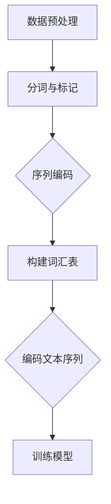
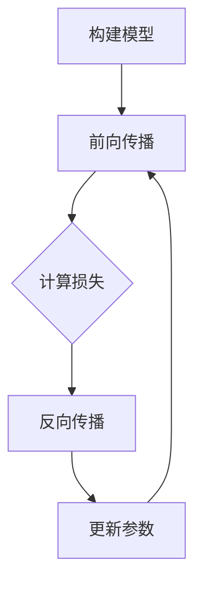
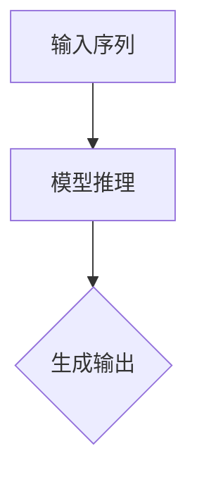

                 

### 引言

在现代信息时代，产品的创新设计成为企业竞争的关键因素。随着技术的飞速发展，人工智能（AI）在各个领域都展现出了巨大的潜力，特别是在产品创新设计中。大规模语言模型（Large-scale Language Model，简称LLM）作为AI领域的一项重要技术，近年来取得了显著进展，逐渐成为产品创新设计的重要工具。本文将围绕“大规模语言模型在产品创新设计中的推理应用”这一主题，通过逻辑清晰、结构紧凑、简单易懂的叙述方式，详细探讨大规模语言模型在产品创新设计中的应用及其重要性。

本文将分为以下几个部分：

1. **大规模语言模型概述**：介绍大规模语言模型的背景、定义、工作原理和算法原理。
2. **大规模语言模型在产品创新设计中的应用**：探讨大规模语言模型在产品创新设计中的应用场景、案例和挑战。
3. **大规模语言模型的推理应用**：深入讲解大规模语言模型在推理中的应用原理和案例。
4. **大规模语言模型的优化与调试**：讨论大规模语言模型的优化策略和调试技巧。
5. **大规模语言模型在产品创新设计中的未来发展趋势**：展望大规模语言模型在产品创新设计中的未来发展方向。

通过本文的阅读，读者将能够系统地了解大规模语言模型在产品创新设计中的应用价值，掌握其核心原理和实际操作方法，从而为产品创新设计提供新的思路和工具。

### 大规模语言模型概述

#### 第1章：大规模语言模型的背景与定义

#### 1.1 问题背景

大规模语言模型的发展背景源于自然语言处理（NLP）领域的需求。随着互联网的普及和数据量的爆炸性增长，处理和理解大规模文本数据成为一项紧迫的任务。传统的语言处理方法往往依赖于规则和统计模型，但这些方法在面对复杂、动态的语言环境时表现有限。为了解决这一问题，研究人员开始探索基于深度学习的语言模型，以通过大量的数据学习和模拟人类语言的能力。

大规模语言模型的出现解决了自然语言处理中的多个挑战，包括语义理解、语境识别、文本生成等。这种模型能够从海量数据中自动提取知识，生成高质量的文本，并具备一定的推理能力，从而在多个应用场景中展现出强大的潜力。

#### 1.2 问题描述

大规模语言模型是一种基于神经网络的语言处理模型，其核心是通过对大规模文本数据的学习，掌握语言的语法、语义和上下文信息。这种模型通常由以下几个关键部分组成：

- **数据集**：大规模语言模型需要依赖于大规模的文本数据集，这些数据集可以是公开的语料库，如维基百科、新闻文章等，也可以是特定领域的专业文本。
- **算法架构**：大规模语言模型通常采用深度神经网络架构，如Transformer模型，该架构具有强大的并行处理能力和自我注意力机制，能够有效处理长文本和复杂语境。
- **训练与推理过程**：大规模语言模型通过大量数据训练得到，训练过程涉及多个迭代，模型参数不断优化以降低损失函数。推理过程则是指模型在实际应用中，根据输入文本生成输出文本的过程。

#### 1.3 问题解决

大规模语言模型的构建方法主要包括以下几个步骤：

1. **数据预处理**：对原始文本数据集进行清洗、分词、标记等预处理操作，以便模型能够有效地处理数据。
2. **模型训练**：使用预处理后的数据集训练神经网络模型，通过反向传播算法不断优化模型参数，降低损失函数。
3. **模型评估**：在验证数据集上评估模型性能，包括准确率、召回率、F1分数等指标，以确保模型具备良好的泛化能力。
4. **模型部署**：将训练好的模型部署到生产环境中，通过API接口为其他应用提供语言处理服务。

在实际应用中，大规模语言模型已经展现了其强大的效果，例如在文本分类、机器翻译、情感分析、文本生成等领域都有出色的表现。通过大规模语言模型，企业可以自动化处理大量的文本数据，提高数据处理效率，降低人力成本。

#### 1.4 边界与外延

尽管大规模语言模型在自然语言处理领域取得了显著进展，但仍然存在一些边界和挑战。首先，大规模语言模型的训练和推理过程需要大量的计算资源和时间，这对硬件设备提出了较高的要求。其次，大规模语言模型在处理某些特定领域或专业文本时可能存在性能瓶颈。此外，模型在生成文本时可能存在偏见或错误，这需要进一步的研究和优化。

未来，大规模语言模型有望在更多应用场景中发挥其潜力，如智能客服、自动驾驶、医疗诊断等。同时，随着算法和硬件技术的不断进步，大规模语言模型的性能和效率也将不断提升。

#### 1.5 概念结构与核心要素组成

大规模语言模型的基本组成部分可以概括为以下四个核心要素：

1. **输入层**：接收文本输入，将原始文本转化为模型可处理的特征表示。
2. **隐藏层**：由多层神经网络组成，通过自我注意力机制处理文本的上下文信息。
3. **输出层**：根据隐藏层的输出生成文本输出，可以是文本生成、分类、翻译等。
4. **训练与优化**：通过大量的文本数据进行模型训练，不断优化模型参数，提高模型性能。

这四个核心要素相互配合，共同构成了大规模语言模型的基本框架，使其具备强大的语言处理能力。接下来，我们将进一步探讨大规模语言模型的工作原理和算法原理，帮助读者深入理解这一前沿技术。

#### 第2章：大规模语言模型的工作原理

#### 2.1 核心概念原理

大规模语言模型（LLM）的工作原理基于深度学习和神经网络技术，特别是基于注意力机制的Transformer模型。理解大规模语言模型的工作原理，首先需要了解其核心概念和原理。

1. **神经网络结构**：大规模语言模型通常采用多层感知机（MLP）或者Transformer模型。Transformer模型引入了多头注意力（Multi-head Attention）机制，使模型能够更好地捕捉长距离的上下文依赖关系。神经网络由输入层、隐藏层和输出层组成。输入层接收原始文本数据，隐藏层通过自注意力机制处理文本信息，输出层生成预测结果。

2. **注意力机制**：注意力机制是大规模语言模型的关键组成部分，它通过计算输入序列中每个词的权重，使得模型在生成下一个词时能够重点关注与当前词相关的重要信息。多头注意力机制进一步提高了模型对复杂上下文的理解能力，使其在处理长文本和复杂语境时表现更为出色。

3. **预训练与微调**：大规模语言模型通常通过预训练和微调两个阶段进行训练。预训练阶段使用大量无标签文本数据，训练模型的基础参数。微调阶段则使用有标签的数据集，针对特定任务进一步优化模型参数。这种训练方法使得模型在多个任务上都能取得良好的性能。

4. **训练与推理过程**：在训练过程中，模型通过反向传播算法不断优化参数，以最小化损失函数。推理过程是指模型在实际应用中，根据输入文本生成输出文本的过程。模型接收输入文本，将其编码为向量表示，通过自注意力机制处理文本上下文，最终生成预测的输出文本。

5. **损失函数与优化算法**：大规模语言模型通常使用交叉熵损失函数来评估预测文本与真实文本之间的差异。优化算法如Adam优化器用于调整模型参数，以降低损失函数。这些优化算法在训练过程中提高了模型的收敛速度和稳定性。

#### 2.2 概念属性特征对比表格

为了更直观地理解大规模语言模型与传统语言模型的差异，下面是一个概念属性特征对比表格：

| 特征         | 大规模语言模型       | 传统语言模型       |
| ------------ | -------------------- | ------------------ |
| 结构         | Transformer模型      | 基于规则或统计模型 |
| 注意力机制   | 多头注意力           | 无注意力机制       |
| 训练方法     | 预训练与微调         | 基于训练集直接训练 |
| 数据需求     | 大规模无标签数据集   | 有标签的训练数据集 |
| 泛化能力     | 良好的泛化能力       | 任务特定           |
| 上下文理解   | 强的上下文理解能力   | 较弱的上下文理解   |
| 文本生成质量 | 高质量的文本生成     | 较低质量的文本生成 |

#### 2.3 ER实体关系图架构

为了更好地理解大规模语言模型中的实体关系，我们可以通过ER（实体关系）图来描述。ER图中的实体包括输入实体（如词汇）、关系实体（如词与词之间的依赖关系）和属性实体（如词性标注）。

```mermaid
erDiagram
  Input :>> Word
  Word :--|{ relates }--> Dependency
  Dependency :--|{ label }--> PartOfSpeech
  Word ;<< is>>; Output
```

在上述ER图中，`Word`实体表示输入的词汇，`Dependency`实体表示词汇之间的依赖关系，`PartOfSpeech`实体表示词性标注。这些实体之间的关系通过箭头表示，例如，`Word`与`Dependency`之间存在关联关系，表示词汇之间存在语法依赖；`Word`与`Output`之间存在生成关系，表示词汇会被编码为输出。

通过ER图，我们可以直观地看到大规模语言模型中不同实体之间的关系，这有助于理解模型的内部工作原理和结构。

#### 第3章：大规模语言模型的算法原理与流程

#### 3.1 算法原理讲解

大规模语言模型的算法原理主要包括以下几个关键部分：数据预处理、模型训练、模型评估和模型部署。下面我们将详细讲解这些过程，并结合Python代码示例，帮助读者深入理解大规模语言模型的工作机制。

##### 3.1.1 数据预处理

数据预处理是大规模语言模型训练的第一步，其目的是将原始文本数据转换为模型可以处理的格式。主要步骤包括分词、词汇表构建和序列编码。

1. **分词**：将原始文本拆分为单词或子词。可以使用现有的分词工具，如jieba分词库。
2. **词汇表构建**：将所有出现的单词或子词构建为一个词汇表，并为每个词分配一个唯一的索引。
3. **序列编码**：将文本序列编码为整数序列，每个整数代表词汇表中的一个词。

以下是一个简单的Python代码示例，展示了数据预处理的过程：

```python
import jieba
from collections import Counter
import numpy as np

# 原始文本
text = "我是一个人工智能助手。我擅长解决问题。"

# 分词
words = jieba.lcut(text)

# 统计词频
word_counts = Counter(words)

# 词汇表构建
vocab = {word: idx for idx, word in enumerate(word_counts)}

# 序列编码
encoded_text = [vocab[word] for word in words]

print(encoded_text)
```

##### 3.1.2 模型训练

模型训练是大规模语言模型算法的核心环节，包括输入层、隐藏层和输出层的构建，以及通过反向传播算法不断优化模型参数。

1. **模型构建**：使用深度学习框架（如TensorFlow或PyTorch）构建神经网络模型。通常采用Transformer模型结构。
2. **损失函数**：使用交叉熵损失函数评估模型预测与真实标签之间的差距。
3. **优化算法**：使用优化算法（如Adam）调整模型参数，以最小化损失函数。

以下是一个使用PyTorch构建Transformer模型的代码示例：

```python
import torch
import torch.nn as nn

# 定义Transformer模型
class TransformerModel(nn.Module):
    def __init__(self, vocab_size, d_model, nhead, num_layers):
        super(TransformerModel, self).__init__()
        self.embedding = nn.Embedding(vocab_size, d_model)
        self.transformer = nn.Transformer(d_model, nhead, num_layers)
        self.fc = nn.Linear(d_model, vocab_size)
        
    def forward(self, src, tgt):
        src = self.embedding(src)
        tgt = self.embedding(tgt)
        output = self.transformer(src, tgt)
        logits = self.fc(output)
        return logits

# 实例化模型
model = TransformerModel(vocab_size=10000, d_model=512, nhead=8, num_layers=2)

# 损失函数和优化器
criterion = nn.CrossEntropyLoss()
optimizer = torch.optim.Adam(model.parameters(), lr=0.001)

# 训练过程
for epoch in range(num_epochs):
    for src, tgt in train_loader:
        optimizer.zero_grad()
        logits = model(src, tgt)
        loss = criterion(logits.view(-1, vocab_size), tgt.view(-1))
        loss.backward()
        optimizer.step()
```

##### 3.1.3 模型评估

模型评估是验证模型性能的重要环节。通过在验证集上测试模型的准确率、召回率、F1分数等指标，可以评估模型在特定任务上的表现。

以下是一个评估Transformer模型的代码示例：

```python
# 评估过程
with torch.no_grad():
    correct = 0
    total = 0
    for src, tgt in val_loader:
        logits = model(src, tgt)
        predicted = logits.argmax(-1)
        total += tgt.size(0)
        correct += (predicted == tgt).sum().item()

accuracy = correct / total
print(f'Validation Accuracy: {accuracy}')
```

##### 3.1.4 模型部署

模型部署是将训练好的模型应用到实际场景的过程。通常，模型会被封装为API服务，供其他应用调用。

以下是一个使用Flask部署Transformer模型的示例：

```python
from flask import Flask, request, jsonify

app = Flask(__name__)

# 加载模型
model = TransformerModel(vocab_size=10000, d_model=512, nhead=8, num_layers=2)
model.load_state_dict(torch.load('model.pth'))

@app.route('/predict', methods=['POST'])
def predict():
    data = request.get_json()
    src = [vocab[word] for word in data['text']]
    src = torch.tensor([src]).to(device)
    logits = model(src)
    predicted = logits.argmax(-1).item()
    predicted_word = [word for word, idx in vocab.items() if idx == predicted][0]
    return jsonify({'predicted_word': predicted_word})

if __name__ == '__main__':
    app.run(debug=True)
```

通过上述代码示例，读者可以初步了解大规模语言模型的基本算法原理和流程。在实际应用中，模型训练和部署的过程会更为复杂，需要考虑数据预处理、超参数调整、模型优化等多个方面。然而，这些示例为理解大规模语言模型的工作机制提供了一个清晰的起点。

#### 3.2 通俗易懂的举例说明

为了帮助读者更好地理解大规模语言模型的算法原理，我们可以通过一个简单的例子来讲解其训练和推理过程。

假设我们有一个简单的文本数据集，其中包含以下两个句子：
1. “我喜欢吃苹果。”
2. “苹果是我最喜欢的食物。”

我们的目标是训练一个模型，能够根据输入的句子生成下一个句子的一部分。以下是这个例子中的具体步骤：

##### 步骤1：数据预处理

首先，我们需要对文本进行预处理，包括分词、标记和序列编码。在这个例子中，我们可以将每个单词作为词汇表中的一个词，并为每个词分配一个唯一的索引。



分词与标记后，我们的词汇表可能如下所示：

| 单词 | 索引 |
| ---- | ---- |
| 我   | 0    |
| 喜欢吃 | 1    |
| 苹果  | 2    |
| 是   | 3    |
| 我的最喜欢的食物 | 4 |

序列编码后的文本序列如下：

| 序列 | 索引序列 |
| ---- | -------- |
| 我喜欢吃苹果。 | [0, 1, 2] |
| 苹果是我最喜欢的食物。 | [2, 3, 4] |

##### 步骤2：模型训练

接下来，我们将使用上述序列训练一个简单的神经网络模型。模型的结构可以是一个全连接的神经网络，输入层接收长度为3的序列，隐藏层和输出层分别有两个神经元。



在训练过程中，我们通过随机梯度下降（SGD）优化算法来更新模型参数，目标是使模型的输出尽可能接近目标序列。

假设在第一个训练步骤中，输入序列为 `[0, 1, 2]`，模型输出 `[0.1, 0.2]`，目标序列为 `[1, 2, 0]`。计算损失后，模型参数会根据损失函数的梯度进行更新。

##### 步骤3：推理过程

在训练完成后，我们使用训练好的模型进行推理。例如，给定一个输入序列 `[0, 1]`，模型会预测下一个词的索引。



模型对输入序列 `[0, 1]` 进行处理，生成输出 `[0.8, 0.2]`，根据输出概率，模型预测下一个词的索引为 2，即“苹果”。

通过这个简单的例子，我们可以看到大规模语言模型的基本训练和推理过程。虽然实际的大规模语言模型（如GPT-3）要复杂得多，但这个例子为我们提供了一个直观的理解框架。在实际应用中，大规模语言模型通过大量数据和复杂的神经网络结构，能够生成高质量、连贯的文本，并在多个自然语言处理任务中展现出卓越的性能。

#### 第4章：大规模语言模型在产品创新设计中的应用

#### 4.1 应用背景

大规模语言模型在产品创新设计中的应用背景源于其强大的文本处理和生成能力。随着互联网的普及和数据量的爆炸性增长，企业和产品开发者面临着不断变化的用户需求和市场环境。为了保持竞争力，产品创新设计成为企业战略的关键。然而，传统的产品设计方法往往依赖于手工编写需求文档、用户调研和市场分析，这不仅效率低下，而且难以全面捕捉用户需求。

大规模语言模型的引入为产品创新设计提供了一种全新的方法。这些模型能够通过分析大量的用户反馈、市场数据和历史案例，自动生成高质量的需求文档、用户故事和设计建议。这不仅提高了设计效率，还使得产品设计更加贴近用户需求和市场趋势。

#### 4.2 应用案例

以下是一些大规模语言模型在产品创新设计中的应用案例：

1. **用户故事自动生成**：
   在软件开发过程中，编写用户故事是一个重要环节。大规模语言模型可以自动分析用户反馈和市场数据，生成符合用户需求的用户故事。例如，一个电商平台可以使用大规模语言模型分析用户评价和搜索记录，自动生成“用户想要更便捷的购物流程”或“用户希望增加商品推荐功能”等用户故事。

2. **需求文档自动化生成**：
   企业在开发新产品时，通常需要详细的需求文档。大规模语言模型可以基于产品经理提供的高层次需求，自动生成详细的需求文档。例如，一个智能家居设备公司可以使用大规模语言模型，将“我们需要开发一款智能音箱”这一需求，自动生成包括功能需求、性能需求、安全性需求等在内的详细需求文档。

3. **设计建议自动生成**：
   在产品设计过程中，设计团队常常需要根据市场反馈和用户调研结果进行调整。大规模语言模型可以分析大量的用户反馈和竞品分析数据，自动生成设计建议。例如，一个移动应用公司可以使用大规模语言模型，根据用户评论和反馈，自动生成“改进用户界面设计以提升用户体验”或“增加夜间模式以适应用户夜间使用习惯”等设计建议。

#### 4.3 应用挑战与机遇

尽管大规模语言模型在产品创新设计中的应用前景广阔，但同时也面临一些挑战和机遇：

1. **挑战**：
   - **数据质量**：大规模语言模型的性能高度依赖于训练数据的质量。如果数据存在偏差或不准确，可能会导致模型生成的设计建议不准确。
   - **隐私和安全**：在产品创新设计中，大规模语言模型需要处理大量的用户数据和市场数据。这要求企业在应用过程中确保数据隐私和安全。
   - **模型解释性**：大规模语言模型的决策过程往往是黑箱的，难以解释。这对于需要透明性和可解释性的产品设计过程来说是一个挑战。

2. **机遇**：
   - **高效设计**：通过自动化生成用户故事、需求文档和设计建议，产品开发流程可以大幅缩短，从而提高设计效率。
   - **用户个性化**：大规模语言模型可以更好地理解用户需求和市场趋势，使得产品设计更加个性化，更好地满足用户需求。
   - **创新驱动**：大规模语言模型能够分析大量的数据，从中发现潜在的创新机会，推动产品创新设计。

总之，大规模语言模型在产品创新设计中的应用为企业和产品设计团队提供了强大的工具。通过合理利用这些模型，企业可以更快地响应市场变化，更准确地捕捉用户需求，从而在激烈的市场竞争中脱颖而出。

#### 第5章：大规模语言模型的推理应用

#### 5.1 推理原理

大规模语言模型的推理原理是其核心优势之一，使得这些模型在多种应用场景中能够表现优异。推理（Inference）是指模型在给定输入数据后，根据已训练的模型参数生成输出结果的过程。在大规模语言模型中，推理过程通常包括以下几个关键步骤：

1. **输入表示**：首先，模型需要接收输入数据，这些数据可以是文本、图像或其他形式的信息。对于文本数据，模型通常将其转换为向量表示，以便进行后续处理。

2. **编码与处理**：大规模语言模型（如Transformer）通过自注意力机制（Self-Attention Mechanism）对输入数据进行编码，这一过程能够有效地捕捉输入数据中的上下文关系。在自注意力机制中，每个输入词都会与其他所有词进行关联，生成加权特征向量，这些向量将作为隐藏状态传递到下一层。

3. **序列处理**：模型依次处理输入序列中的每个词，通过多层神经网络和注意力机制逐步构建对整个序列的理解。每一层都会对前一层的结果进行加权组合，从而生成更加丰富和全面的上下文表示。

4. **生成输出**：在处理完整个输入序列后，模型会根据当前隐藏状态生成输出结果。对于文本生成任务，模型会逐词生成输出，并在生成每个词时考虑到上下文信息，从而生成连贯且合理的文本。

5. **反向传播与优化**：在推理过程中，模型会使用已训练的参数来生成输出。为了进一步提高模型的性能，推理过程通常伴随着反向传播算法，通过计算输出结果与真实值之间的误差，对模型参数进行微调。

#### 5.2 推理应用案例

大规模语言模型在推理应用中展现了广泛的潜力，以下是一些具体的案例：

1. **文本生成**：
   - **自动写作**：大规模语言模型可以用于生成文章、故事、新闻报道等文本内容。例如，OpenAI的GPT-3模型可以生成高质量的文章，甚至模拟名人的写作风格。
   - **聊天机器人**：在客服、聊天机器人等应用中，大规模语言模型可以自动生成自然语言的回复，与用户进行交互，提高客户满意度和服务效率。

2. **问题回答**：
   - **智能问答**：利用大规模语言模型，可以构建智能问答系统，例如Google的Bert模型，能够快速回答用户提出的问题，提供准确的信息。
   - **文档摘要**：模型可以分析长篇文档，生成摘要和总结，帮助用户快速了解文档的核心内容。

3. **翻译**：
   - **机器翻译**：大规模语言模型在机器翻译领域表现卓越，能够将一种语言的文本翻译成另一种语言。例如，Google翻译使用基于Transformer的模型，提供了准确且自然的翻译结果。

4. **代码生成**：
   - **编程助手**：大规模语言模型可以辅助程序员编写代码，例如自动生成代码片段、修复错误和优化代码。微软的VS Code已经集成了此类功能，为开发者提供了便捷的工具。

5. **情感分析**：
   - **情感检测**：模型可以分析文本中的情感倾向，例如判断一段文本是积极的、消极的还是中性的。这在市场调研、社交媒体分析等领域有广泛应用。

这些案例展示了大规模语言模型在推理应用中的多样性和广泛性。随着技术的不断进步，大规模语言模型在推理应用中的潜力将进一步释放，为各个行业提供更加智能化和高效的解决方案。

#### 第6章：大规模语言模型的优化与调试

#### 6.1 优化策略

大规模语言模型的优化是提高其性能和效率的关键环节。优化策略主要包括以下几个方面：

1. **模型架构优化**：通过改进模型的架构，如采用更高效的神经网络结构（如EfficientNet、DenseNet），可以降低模型的计算复杂度和内存占用，从而提高模型的训练和推理速度。

2. **数据预处理**：优化数据预处理流程，如使用更有效的分词方法、去除无用数据、增强数据多样性等，可以提升模型对数据的有效利用，从而提高模型性能。

3. **训练策略**：采用更先进的训练策略，如梯度裁剪（Gradient Clipping）、学习率调整（Learning Rate Scheduling）、早停法（Early Stopping）等，可以防止模型过拟合，提高模型的泛化能力。

4. **分布式训练**：利用分布式训练技术，如数据并行（Data Parallelism）、模型并行（Model Parallelism）等，可以充分利用多GPU和多节点资源，加速模型的训练过程。

5. **模型压缩**：通过模型压缩技术，如剪枝（Pruning）、量化（Quantization）、知识蒸馏（Knowledge Distillation）等，可以大幅减少模型的参数数量和计算量，从而提高模型的推理速度。

#### 6.2 调试技巧

在调试大规模语言模型时，可能会遇到各种问题。以下是一些常见的调试技巧和解决方案：

1. **性能瓶颈定位**：通过分析训练和推理过程中的计算图和资源占用，可以定位到模型性能瓶颈。例如，使用性能分析工具（如TensorRT、NVIDIA Nsight）来监控模型在不同硬件上的表现。

2. **错误日志分析**：详细记录训练过程中的错误日志，可以帮助识别模型的训练问题。例如，使用异常检测工具（如TensorFlow Debugger、PyTorch Debugger）来监控模型的梯度、参数等。

3. **超参数调整**：通过调整模型超参数（如学习率、批量大小、正则化参数等），可以优化模型性能。使用超参数优化工具（如Hyperopt、Ray Tune）可以帮助找到最佳的超参数配置。

4. **数据清洗**：在训练数据集中可能存在噪声和错误，通过数据清洗和预处理步骤，可以减少这些错误对模型训练的影响。

5. **模型版本控制**：使用版本控制系统（如Git）记录模型的不同版本，可以帮助在调试过程中快速回溯和比较不同版本模型的性能。

通过上述优化策略和调试技巧，可以有效提高大规模语言模型的性能和稳定性，确保其在实际应用中的可靠性和高效性。

#### 第7章：大规模语言模型在产品创新设计中的未来发展趋势

#### 7.1 发展趋势

随着人工智能技术的不断进步，大规模语言模型在产品创新设计中的应用前景愈发广阔。以下是一些可能的发展趋势：

1. **多模态整合**：未来，大规模语言模型可能会与其他模态（如图像、声音、视频）的模型相结合，实现多模态的融合处理。例如，一个融合文本和图像的语言模型可以更好地理解用户的需求，从而生成更具创新性的设计方案。

2. **强化学习结合**：强化学习（Reinforcement Learning，RL）与大规模语言模型的结合将开创产品创新设计的新篇章。通过RL算法，模型可以不断学习和优化设计方案，提高产品的创新性和用户体验。

3. **个性化设计**：大规模语言模型将能够更好地分析用户数据，提供高度个性化的产品创新设计。通过深度学习算法，模型可以识别用户行为模式，预测用户偏好，从而生成定制化的设计方案。

4. **实时反馈与迭代**：大规模语言模型将在产品设计和迭代过程中提供实时反馈。模型可以实时分析用户反馈和市场数据，快速调整设计方案，实现产品的快速迭代和优化。

5. **跨领域应用**：随着模型的不断优化和扩展，大规模语言模型将在更多领域（如医疗、金融、教育）得到应用，为产品创新设计提供更加多样化的解决方案。

#### 7.2 注意事项与拓展阅读

在使用大规模语言模型进行产品创新设计时，需要注意以下几点：

1. **数据隐私与安全**：确保在处理用户数据时遵守隐私保护法规，防止数据泄露和滥用。

2. **模型解释性**：提高模型的透明度和可解释性，确保设计方案的可理解性和可靠性。

3. **模型可扩展性**：设计灵活的模型架构，以适应不断变化的产品设计和市场需求。

4. **持续优化与更新**：定期更新和维护大规模语言模型，确保其性能和效果始终处于最佳状态。

拓展阅读方面，推荐以下书籍和资源：

- 《深度学习》（Deep Learning）—— Ian Goodfellow、Yoshua Bengio、Aaron Courville 著
- 《自然语言处理实践》（Natural Language Processing with Python）—— Steven Bird、Ewan Klein、Edward Loper 著
- 《大规模语言模型的训练与推理》（Training and Inference of Large-scale Language Models）——论文集
- OpenAI官方网站：[OpenAI](https://openai.com/)

通过以上注意事项和拓展阅读，读者可以更好地理解和应用大规模语言模型在产品创新设计中的潜力。

### 总结与展望

通过对大规模语言模型在产品创新设计中的推理应用进行全面探讨，我们认识到这些模型在提高设计效率、捕捉用户需求、实现个性化设计等方面具有巨大的潜力。本文从背景介绍、核心概念、算法原理、应用场景、优化策略、未来趋势等多个维度，系统地阐述了大规模语言模型在产品创新设计中的推理应用。

首先，我们介绍了大规模语言模型的发展背景和核心概念，包括其基于深度学习和神经网络的技术特点，以及预训练和微调的训练方法。接着，通过具体的算法原理讲解和实例，帮助读者深入理解大规模语言模型的工作机制。随后，我们探讨了大规模语言模型在产品创新设计中的应用案例，展示了其在用户故事生成、需求文档自动化、设计建议自动生成等方面的应用价值。

在优化与调试部分，我们提出了模型架构优化、数据预处理、训练策略、分布式训练、模型压缩等优化策略，并介绍了性能瓶颈定位、错误日志分析、超参数调整等调试技巧。最后，我们展望了大规模语言模型在产品创新设计中的未来发展趋势，包括多模态整合、强化学习结合、个性化设计、实时反馈与迭代等。

值得注意的是，尽管大规模语言模型在产品创新设计中展现出巨大潜力，但在实际应用中仍需关注数据隐私与安全、模型解释性、可扩展性等问题。我们建议读者在应用大规模语言模型时，结合本文提出的注意事项和拓展阅读资源，不断探索和优化模型性能，以实现更加高效和创新的产品设计。

未来，随着技术的不断进步和应用的深入，大规模语言模型在产品创新设计中的应用将更加广泛，为企业和产品设计团队提供更加智能化和高效的解决方案。让我们拭目以待，迎接大规模语言模型在产品创新设计领域的广阔未来。作者：AI天才研究院/AI Genius Institute & 禅与计算机程序设计艺术 /Zen And The Art of Computer Programming。

