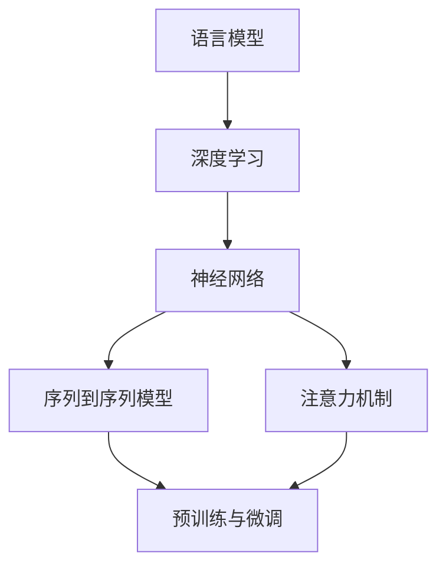
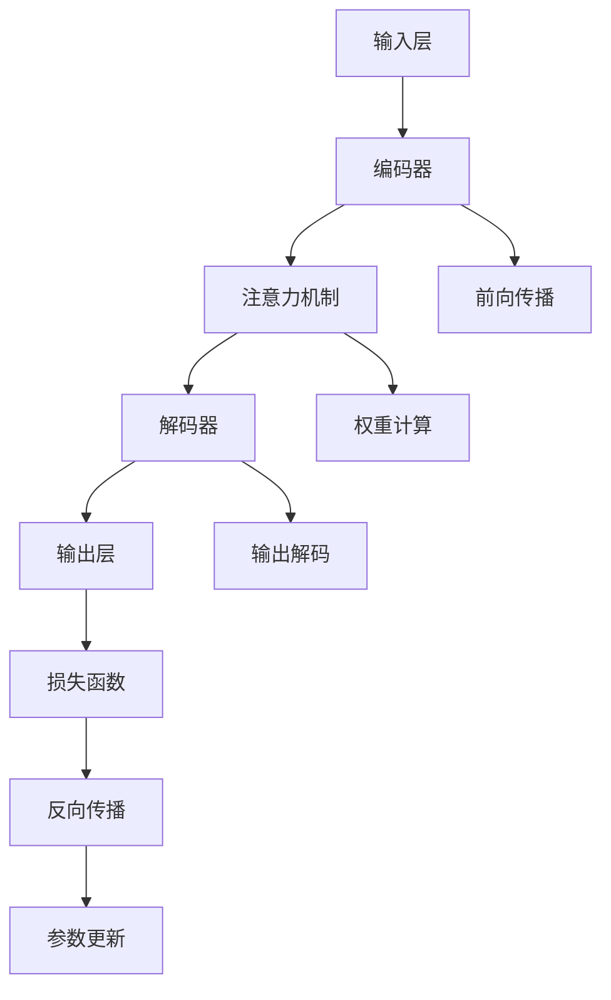

                 


### 第1章 引言

#### 1.1 问题背景

在当今的商业环境中，企业的决策过程正变得越来越复杂。这不仅是因为市场的快速变化，也由于数据量的爆炸性增长。为了在激烈的市场竞争中脱颖而出，企业需要利用先进的技术手段来辅助决策，从而提高决策的准确性和效率。大规模语言模型（Large-scale Language Models，LLMs）是近年来在人工智能（AI）领域取得的一项重大突破。这些模型能够处理和理解大量的自然语言数据，从而为各种自然语言处理任务提供支持，如文本生成、情感分析、问答系统等。

大规模语言模型的核心优势在于其能够自动从海量数据中学习语言模式和结构，这使得它们在处理复杂、不明确的任务时表现出色。然而，如何将这一强大的工具应用到企业决策支持系统中，并实现高效的推理功能，仍是一个具有挑战性的问题。传统的决策支持系统（Decision Support Systems，DSS）依赖于结构化数据和预定义的规则，而大规模语言模型则能够处理非结构化的文本数据，并从这些数据中提取出有用的信息。

本文旨在探讨大规模语言模型在企业决策支持中的推理应用。具体而言，我们将从以下几个方面展开讨论：

1. **大规模语言模型的基本原理和核心概念**：介绍大规模语言模型的工作原理、核心概念以及其发展历程。
2. **大规模语言模型在企业决策支持中的应用**：探讨大规模语言模型如何帮助企业进行决策，包括推理应用的具体实现方法。
3. **大规模语言模型的优势和挑战**：分析大规模语言模型的优势以及面临的挑战，如数据质量、模型可解释性等。
4. **大规模语言模型在企业决策支持中的实际应用案例**：通过具体案例展示大规模语言模型在企业决策支持中的实际应用效果。
5. **最佳实践和未来展望**：总结大规模语言模型在企业决策支持中的最佳实践，并探讨未来的发展趋势。

#### 1.2 问题描述

企业决策支持系统通常面临以下问题：

- **数据多样性**：企业需要处理的结构化和非结构化数据种类繁多，包括文本、图像、音频等。
- **决策复杂度**：企业的决策过程往往涉及多个变量和不确定因素，需要综合分析才能得出结论。
- **信息过载**：企业每天都会接收大量的信息，如何从这些信息中提取出有价值的信息是一个挑战。

大规模语言模型提供了一种有效的解决方案，通过其强大的文本处理能力，可以从海量非结构化数据中提取出关键信息，帮助企业在复杂的环境中做出更明智的决策。然而，如何有效地应用大规模语言模型来实现这一目标，仍然是一个值得深入探讨的问题。

#### 1.3 问题解决

为了解决上述问题，我们可以采取以下步骤：

1. **数据预处理**：对输入的数据进行清洗和预处理，确保数据质量。
2. **模型选择**：根据企业的需求和数据特性，选择合适的大规模语言模型。
3. **模型训练**：使用大量的文本数据进行模型训练，使模型能够理解企业领域的语言模式。
4. **推理应用**：利用训练好的模型进行推理，提取关键信息并生成决策建议。
5. **模型优化**：根据实际应用效果，对模型进行优化和调整。

通过上述步骤，企业可以构建一个高效的大规模语言模型决策支持系统，从而提高决策的准确性和效率。

#### 1.4 边界与外延

在讨论大规模语言模型在企业决策支持中的应用时，我们需要明确以下几个边界与外延：

- **数据边界**：大规模语言模型适用于处理大量的非结构化文本数据，但对结构化数据或其他类型的数据（如图像、音频等）的处理能力有限。
- **模型边界**：不同的大规模语言模型有不同的优势和局限，需要根据具体应用场景进行选择。
- **应用边界**：大规模语言模型适用于需要自然语言处理的决策场景，但不适合所有的决策问题。
- **外延扩展**：大规模语言模型可以与其他AI技术（如图像识别、推荐系统等）结合，形成更全面的决策支持系统。

#### 1.5 概念结构与核心要素组成

大规模语言模型的结构复杂，但可以从以下几个核心要素来理解其组成：

- **输入层**：接收自然语言文本数据，将其转换为模型可处理的输入格式。
- **编码器**：将输入的文本数据编码为向量表示，提取出文本的语义信息。
- **解码器**：将编码后的向量表示解码回自然语言文本，生成预测的文本输出。
- **输出层**：生成决策建议或回答问题。

核心要素包括：

- **数据集**：高质量、大规模的文本数据集是模型训练的基础。
- **模型架构**：如Transformer、BERT等，决定了模型的学习能力和表现。
- **训练与优化**：模型训练策略、优化算法和超参数调优，影响模型的效果。

通过以上对大规模语言模型在企业决策支持中的背景、问题、解决方法以及边界和外延的讨论，我们可以为后续章节的深入分析打下坚实的基础。

### 第2章 大规模语言模型基础

#### 2.1 核心概念

要深入理解大规模语言模型（LLM）在企业决策支持中的推理应用，我们首先需要了解LLM的核心概念。以下是几个关键概念及其定义：

- **语言模型（Language Model，LM）**：语言模型是一种基于统计或机器学习方法的模型，用于预测下一个单词或词组。在自然语言处理（NLP）中，语言模型是最基本的组件，它能够通过学习大量文本数据来捕捉语言的统计规律和语法结构。
- **深度学习（Deep Learning，DL）**：深度学习是一种机器学习方法，它通过多层神经网络对数据进行学习和建模。深度学习在图像识别、语音识别和自然语言处理等领域取得了显著的成果。
- **神经网络（Neural Network，NN）**：神经网络是一种模仿生物神经系统结构和功能的计算模型，由大量的神经元连接而成。神经网络可以通过学习输入和输出数据之间的映射关系来解决问题。
- **序列到序列模型（Sequence-to-Sequence Model，Seq2Seq）**：序列到序列模型是一种用于处理序列数据的神经网络架构，它可以接受一个输入序列并生成一个输出序列。在自然语言处理中，Seq2Seq模型常用于机器翻译、文本摘要等任务。
- **注意力机制（Attention Mechanism）**：注意力机制是一种用于提高模型对输入序列不同部分关注度的机制。在自然语言处理中，注意力机制可以帮助模型更好地理解和处理长序列数据。
- **预训练与微调（Pre-training and Fine-tuning）**：预训练是指在大规模数据集上训练模型，使其学习到通用的语言知识和模式。微调是指在使用预训练模型的基础上，针对特定任务进行进一步的训练，以适应具体的应用场景。

这些核心概念是大规模语言模型的基础，它们共同构成了LLM的理论框架，为后续的应用提供了支持。

#### 2.2 模型原理

大规模语言模型的工作原理可以分为以下几个主要步骤：

1. **输入编码（Input Encoding）**：首先，模型需要将自然语言文本转换为机器可处理的输入格式。这一步通常涉及到词向量化（Word Embedding）和序列编码（Sequence Encoding）。词向量化是将单词转换为固定长度的向量表示，序列编码则是将整个句子或段落编码为一个序列。

2. **前向传播（Forward Propagation）**：输入编码后的数据通过多层神经网络（通常是卷积神经网络或循环神经网络）进行前向传播。在这些网络中，每个神经元都接收前一层的输出，并通过激活函数计算输出。多层网络通过逐层抽象，从原始数据中提取出更高层次的特征。

3. **注意力机制（Attention Mechanism）**：在处理长文本时，注意力机制可以帮助模型关注到文本中的关键部分。注意力机制通过计算一个权重向量，将输入序列的不同部分赋予不同的关注度。这种方法可以显著提高模型对长文本的理解能力。

4. **输出解码（Output Decoding）**：模型的前向传播结果需要通过解码器解码回自然语言文本。解码器通常是一个序列到序列模型，它将前向传播的输出转换为概率分布，然后通过采样或贪心搜索生成最终的文本输出。

5. **损失函数（Loss Function）**：在训练过程中，模型通过计算损失函数来评估其预测的准确性。常见的损失函数包括交叉熵损失（Cross-Entropy Loss）和均方误差（Mean Squared Error）。模型通过优化损失函数，不断调整参数，以提高预测的准确性。

6. **反向传播（Backpropagation）**：通过反向传播算法，模型将损失函数的梯度反向传播到网络中的每个神经元，从而更新模型的参数。这个过程使得模型能够不断学习和改进。

通过上述步骤，大规模语言模型能够理解和生成自然语言文本，从而实现各种NLP任务，如文本分类、情感分析、问答系统和机器翻译等。

#### 2.3 模型发展历程

大规模语言模型的发展历程可以追溯到20世纪80年代，当时研究人员开始探索如何利用统计方法来建立语言模型。早期的语言模型主要基于N-gram模型，它通过计算相邻单词的频率来预测下一个单词。然而，N-gram模型的局限性在于它无法捕捉到长距离依赖和上下文的语义信息。

随着深度学习和神经网络技术的兴起，研究人员开始探索基于神经网络的深度语言模型。1990年代，循环神经网络（RNN）的出现为处理序列数据提供了新的思路。RNN能够通过隐藏状态捕捉长距离依赖，但在处理长文本时仍存在梯度消失和梯度爆炸等问题。

为了解决这些问题，2014年，研究人员提出了一种新的神经网络架构——变换器（Transformer）。变换器引入了多头自注意力机制（Multi-head Self-Attention），通过计算输入序列中不同位置的相似度，实现了对文本的并行处理。这种架构不仅提高了计算效率，还显著提升了模型的性能。

随后的几年里，研究人员继续在变换器的基础上进行改进，提出了许多变体和扩展模型。例如，BERT（Bidirectional Encoder Representations from Transformers）通过预训练和微调的方法，进一步提高了模型的性能和泛化能力。其他模型如GPT（Generative Pre-trained Transformer）和T5（Text-To-Text Transfer Transformer）也取得了显著的成果。

大规模语言模型的发展历程展示了人工智能技术的快速进步，从早期的统计模型到现代的深度学习模型，每一代模型都在不断地改进和突破，为自然语言处理任务提供了强大的工具。

#### 2.4 模型应用现状

大规模语言模型在自然语言处理（NLP）领域已经展现出强大的应用潜力。以下是一些主要应用场景和案例分析：

1. **文本生成**：大规模语言模型可以生成高质量的文本，如文章、新闻、对话等。例如，GPT-3可以生成流畅的文本，甚至能够撰写复杂的编程代码。这种能力在内容创作、自动写作和对话系统等方面有广泛应用。

2. **机器翻译**：大规模语言模型在机器翻译领域取得了显著的成果。例如，BERT和GPT模型在多种语言之间的翻译任务中表现出色，实现了接近人类翻译水平的效果。这种能力为国际交流、多语言服务和全球化业务提供了支持。

3. **问答系统**：大规模语言模型可以用于构建智能问答系统，如虚拟助手和聊天机器人。这些系统可以理解用户的问题，并生成相关的回答。例如，OpenAI的GPT-3可以回答各种领域的问题，为用户提供实时支持。

4. **文本分类和情感分析**：大规模语言模型在文本分类和情感分析任务中也表现出色。例如，BERT模型可以用于分类任务，如情感分类、主题分类等，准确识别文本的情感倾向和主题内容。这种能力在社交媒体分析、市场调研和用户反馈处理等领域有广泛应用。

5. **代码生成和编程辅助**：大规模语言模型还可以用于代码生成和编程辅助。例如，GitHub Copilot可以使用GPT模型生成代码片段，帮助开发者提高开发效率。这种能力在软件工程、自动化测试和开发工具中具有重要意义。

综上所述，大规模语言模型在自然语言处理领域已经取得了显著的进展，其应用范围正在不断扩展。随着模型性能的进一步提升，未来大规模语言模型将在更多领域发挥重要作用。

### 第3章 企业决策支持中的推理应用

#### 3.1 企业决策支持概述

企业决策支持系统（DSS）是企业管理和运营中不可或缺的工具。DSS通过收集、分析和处理数据，为企业提供决策所需的信息和支持。一个有效的DSS不仅能够帮助企业快速做出决策，还能提高决策的准确性和效率。

在企业决策支持中，推理是关键的一环。推理是指从已知信息中推导出新信息的过程。在企业环境中，推理可以帮助企业：

1. **发现隐藏的趋势和模式**：通过分析历史数据和实时数据，发现市场趋势、用户行为等，从而为企业提供战略决策支持。
2. **预测未来情况**：基于现有数据和模型，预测未来的市场变化、业务增长等，帮助企业制定长远发展规划。
3. **优化资源配置**：通过分析各种资源（如人力、资金、设备等）的利用情况，帮助企业优化资源配置，提高运营效率。
4. **风险预警**：识别潜在风险，并提供应对策略，帮助企业规避风险，确保业务稳定运行。

总之，推理在企业决策支持中的作用至关重要。它不仅帮助企业在复杂的环境中做出明智的决策，还提高了企业的竞争力和创新能力。

#### 3.2 推理在决策支持中的应用

大规模语言模型在推理应用中具有独特的优势。以下是大规模语言模型在决策支持中推理应用的具体方式：

1. **自然语言理解**：大规模语言模型可以理解自然语言文本，从而帮助企业从非结构化数据中提取出有价值的信息。例如，通过分析客户反馈和评论，企业可以了解客户的需求和满意度，从而改进产品和服务。
2. **文本分类和情感分析**：大规模语言模型可以用于文本分类和情感分析，帮助企业对大量的文本数据进行自动分类和情感判断。例如，企业可以通过分析市场报告、新闻报道等，快速了解市场动态和行业趋势。
3. **知识图谱构建**：大规模语言模型可以用于构建知识图谱，将文本数据中的实体、关系和属性进行结构化表示。例如，企业可以利用知识图谱进行竞争对手分析、行业研究等，从而获得更全面的信息。
4. **问答系统**：大规模语言模型可以构建智能问答系统，帮助企业快速获取所需信息。例如，企业员工可以通过问答系统查询公司政策、流程和最佳实践，提高工作效率。
5. **决策辅助**：大规模语言模型可以通过生成决策建议，辅助企业做出更明智的决策。例如，在供应链管理中，模型可以分析库存数据、需求预测等，提供最优的库存管理和采购策略。

通过以上应用方式，大规模语言模型可以帮助企业在决策支持中实现高效的推理，提高决策的准确性和效率。

#### 3.3 大规模语言模型的优势

大规模语言模型在决策支持中具有显著的优势，主要体现在以下几个方面：

1. **强大的文本处理能力**：大规模语言模型能够处理和理解大量的文本数据，这使得它们在从非结构化数据中提取信息时表现尤为出色。企业可以利用这一优势，快速获取和分析大量的客户反馈、市场报告等。
2. **灵活的推理能力**：大规模语言模型通过自注意力机制和多层神经网络结构，能够捕捉到文本中的长距离依赖和上下文信息。这种灵活的推理能力使得模型在处理复杂问题和不确定信息时更加有效。
3. **高效的计算效率**：现代大规模语言模型（如BERT、GPT）采用了并行计算和优化算法，可以在较短的时间内完成模型训练和推理任务。这对于需要实时决策支持的企业来说，具有很高的实用价值。
4. **广泛的适用性**：大规模语言模型适用于多种语言和多种文本类型，这使得它们在全球化和多语言环境下具有广泛的应用前景。企业可以通过大规模语言模型，构建跨文化和跨行业的决策支持系统。

#### 3.4 应用场景与案例分析

大规模语言模型在企业决策支持中的实际应用场景广泛，以下是一些具体的案例：

1. **金融行业**：在金融行业，大规模语言模型可以用于风险管理和投资决策。例如，通过分析金融市场报告、新闻和社交媒体数据，模型可以识别潜在的市场风险和投资机会，为金融机构提供决策支持。

2. **零售行业**：在零售行业，大规模语言模型可以用于客户反馈分析、库存管理和营销策略。例如，通过分析客户评论和社交媒体数据，模型可以了解客户的需求和满意度，从而优化产品和服务。同时，通过分析销售数据和市场需求，模型可以提供最优的库存管理和采购策略，降低库存成本。

3. **医疗行业**：在医疗行业，大规模语言模型可以用于医疗文档分析、诊断支持和药物研发。例如，通过分析病历记录、医学文献和研究报告，模型可以帮助医生快速获取患者信息，提高诊断准确性。同时，通过分析药物分子结构和相关文献，模型可以加速药物研发进程，提高新药发现的效率。

4. **制造业**：在制造业，大规模语言模型可以用于生产计划优化、质量管理和技术支持。例如，通过分析生产数据和质量报告，模型可以识别生产瓶颈和潜在问题，提供改进建议。同时，通过分析技术文档和用户反馈，模型可以提供技术支持解决方案，提高生产效率。

通过以上案例，我们可以看到大规模语言模型在各个行业的企业决策支持中具有广泛的应用前景和实际价值。随着技术的不断进步，大规模语言模型将为企业带来更多的创新和竞争优势。

## 第二部分：核心概念与联系

### 第4章 大规模语言模型的核心概念原理

#### 4.1 概念属性特征对比表格

在深入探讨大规模语言模型（LLM）的核心概念原理之前，有必要对几个关键概念进行详细解释和属性特征对比。以下是一个对比表格，列出了几个核心概念的属性特征：

| 概念 | 定义 | 特点 | 应用场景 |  
| --- | --- | --- | --- |  
| 语言模型（LM） | 用于预测下一个单词或词组的模型 | 基于统计或机器学习方法，捕捉语言规律 | 文本生成、机器翻译、文本分类 |  
| 深度学习（DL） | 一种通过多层神经网络学习的机器学习方法 | 学习能力强，能够提取高层次特征 | 图像识别、语音识别、自然语言处理 |  
| 神经网络（NN） | 模仿生物神经系统的计算模型 | 通过多层连接的神经元学习输入和输出之间的映射 | 分类、回归、聚类 |  
| 序列到序列模型（Seq2Seq） | 用于处理序列数据的神经网络架构 | 能够处理输入序列和输出序列之间的映射 | 机器翻译、文本摘要、对话系统 |  
| 注意力机制（Attention） | 用于提高模型对序列不同部分关注度的机制 | 可以捕捉长距离依赖和上下文信息 | 序列建模、文本分类、机器翻译 |  
| 预训练与微调（Pre-training and Fine-tuning） | 在大规模数据集上预训练模型，然后针对特定任务进行微调 | 提高模型泛化能力和适应性 | 多语言处理、多任务学习、特定领域应用 |

通过这个表格，我们可以清晰地看到各个概念的定义、特点和适用场景，为后续内容的深入讨论奠定基础。

#### 4.2 概念关系图

为了更好地理解大规模语言模型（LLM）的核心概念及其相互关系，我们可以使用Mermaid流程图来展示这些概念的结构和联系。

以下是一个Mermaid流程图，用于描述LLM中几个关键概念之间的关系：



在这个流程图中：

- **语言模型（A）** 是基于深度学习和神经网络的模型，用于预测下一个单词或词组。
- **深度学习（B）** 是一种强大的机器学习方法，它通过多层神经网络学习输入和输出之间的映射。
- **神经网络（C）** 是深度学习的基础，由多层神经元组成，能够提取高层次的输入特征。
- **序列到序列模型（D）** 是一种专门用于处理输入序列和输出序列之间的映射的神经网络架构，常用于机器翻译和文本摘要。
- **注意力机制（E）** 是一种提高模型对序列不同部分关注度的机制，能够捕捉长距离依赖和上下文信息。
- **预训练与微调（F）** 是模型训练的两个步骤，预训练是在大规模数据集上训练模型，微调是在特定任务上调整模型参数。

通过这个Mermaid流程图，我们可以直观地理解大规模语言模型中各个概念之间的相互关系，为后续章节的深入讨论提供清晰的结构框架。

## 第三部分：算法原理讲解

### 第5章 算法原理与数学模型

#### 5.1 算法mermaid流程图

为了更好地理解大规模语言模型的算法原理，我们可以使用Mermaid流程图来展示模型的关键步骤。以下是一个Mermaid流程图的示例，用于描述大规模语言模型的基本流程：



在这个流程图中：

- **A[输入层]** 接收自然语言文本数据，并将其转换为模型可处理的输入格式。
- **B[编码器]** 将输入的文本数据编码为向量表示，提取出文本的语义信息。
- **C[注意力机制]** 通过计算输入序列中不同位置的相似度，实现模型的注意力功能，从而提高模型对文本的理解能力。
- **D[解码器]** 将编码后的向量表示解码回自然语言文本，生成预测的文本输出。
- **E[输出层]** 生成最终的文本输出。
- **F[前向传播]** 在模型训练过程中，将输入数据通过编码器、注意力机制和解码器，最终生成输出。
- **G[权重计算]** 在注意力机制中，计算输入序列中不同位置的权重，用于调整对各个位置的注意力。
- **H[输出解码]** 将编码后的向量表示解码回自然语言文本。
- **I[损失函数]** 用于评估模型预测的准确性，常见的损失函数包括交叉熵损失。
- **J[反向传播]** 通过反向传播算法，将损失函数的梯度反向传播到网络中的每个神经元，从而更新模型的参数。
- **K[参数更新]** 根据反向传播得到的梯度，更新模型的参数，以优化模型性能。

通过这个Mermaid流程图，我们可以清晰地看到大规模语言模型的工作流程，为后续内容的详细讲解提供结构框架。

#### 5.2 Python源代码讲解

为了更好地理解大规模语言模型的实现过程，我们将通过一个简单的Python代码示例来讲解模型的实现步骤。以下是一个使用PyTorch框架实现的基本大规模语言模型代码示例：

```python
import torch
import torch.nn as nn
from torch.nn import functional as F

class LanguageModel(nn.Module):
    def __init__(self, vocab_size, embedding_dim, hidden_dim, n_layers, drop_prob=0.5):
        super(LanguageModel, self).__init__()
        
        self.embedding = nn.Embedding(vocab_size, embedding_dim)
        self.dropout = nn.Dropout(drop_prob)
        
        self.encode_layers = nn.LSTM(embedding_dim, hidden_dim, n_layers, dropout=drop_prob, batch_first=True)
        self.decode_layers = nn.LSTM(hidden_dim, hidden_dim, n_layers, dropout=drop_prob, batch_first=True)
        
        self.decode = nn.Linear(hidden_dim, vocab_size)
        
    def forward(self, x, hidden=None):
        x = self.dropout(self.embedding(x))
        hidden = self.forward_encoder(x, hidden)
        hidden = self.forward_decoder(hidden)
        output = self.decode(hidden)
        
        return output, hidden

    def forward_encoder(self, x, hidden=None):
        x, hidden = self.encode_layers(x, hidden)
        return x, hidden

    def forward_decoder(self, hidden):
        output, hidden = self.decode_layers(hidden)
        return output

# 实例化模型
model = LanguageModel(vocab_size=10000, embedding_dim=256, hidden_dim=512, n_layers=2)

# 假设输入数据为batch_size=16，序列长度为seq_len=50
input_data = torch.randint(0, 10000, (16, 50))
output, hidden = model(input_data)

# 输出形状
print(output.shape)  # 输出形状为(16, 50, 10000)
print(hidden.shape)   # 输出形状为(2, 16, 512)
```

在这个代码示例中，我们定义了一个基本的语言模型`LanguageModel`，包括嵌入层（`embedding`）、编码器（`encode_layers`）、解码器（`decode_layers`）和输出层（`decode`）。具体实现步骤如下：

1. **嵌入层**：将输入的单词索引转换为嵌入向量。
2. **编码器**：使用LSTM层对嵌入向量进行编码，提取文本的语义信息。
3. **解码器**：使用LSTM层对编码后的隐藏状态进行解码，生成预测的文本输出。
4. **输出层**：将解码器的隐藏状态映射回单词索引，生成最终的文本输出。

在模型的前向传播过程中，我们假设输入数据为`input_data`，通过模型计算得到输出`output`和隐藏状态`hidden`。输出`output`的形状为（batch_size，序列长度，词汇表大小），表示每个时间步的预测概率分布；隐藏状态`hidden`的形状为（层数，batch_size，隐藏层大小），用于后续的解码过程。

通过这个简单的代码示例，我们可以看到大规模语言模型的基本实现过程，为后续的模型训练和推理提供基础。

#### 5.3 数学模型与公式

为了深入理解大规模语言模型的数学原理，我们需要介绍一些关键的数学模型和公式。以下是大规模语言模型中的一些核心数学概念：

1. **嵌入向量（Embedding）**：嵌入向量是将单词或字符映射为低维向量表示的过程。给定一个词汇表V和单词的索引i，嵌入向量e_i可以表示为：

   $$ e_i = \text{Embed}(i) \in \mathbb{R}^{d_e} $$

   其中，$d_e$ 是嵌入向量的维度。

2. **前向传播（Forward Propagation）**：在LSTM编码器中，每个时间步的隐藏状态更新可以通过以下公式表示：

   $$ h_t = \text{sigmoid}(W_f \cdot [h_{t-1}, x_t] + b_f) \odot W_f \cdot [h_{t-1}, x_t] + b_f $$
   
   $$ c_t = \text{sigmoid}(W_c \cdot [h_{t-1}, x_t] + b_c) \odot W_c \cdot [h_{t-1}, x_t] + b_c $$
   
   $$ o_t = \text{sigmoid}(W_o \cdot [h_{t-1}, x_t] + b_o) \odot W_o \cdot [h_{t-1}, x_t] + b_o $$

   $$ h_{t-1} = \text{sigmoid}(W_g \cdot c_{t-1} + b_g) \odot W_g \cdot c_{t-1} + b_g $$
   
   $$ i_t = \text{sigmoid}(W_i \cdot [h_{t-1}, x_t] + b_i) \odot W_i \cdot [h_{t-1}, x_t] + b_i $$

   其中，$W_f, W_i, W_o, W_g$ 是权重矩阵，$b_f, b_i, b_o, b_g$ 是偏置项。

3. **注意力机制（Attention）**：在解码器中，注意力机制通过计算权重向量来关注输入序列的不同部分。注意力权重可以通过以下公式计算：

   $$ a_t = \text{softmax}(\text{Attention}(h_t, c_{t-1})) $$

   其中，$h_t$ 是当前时间步的隐藏状态，$c_{t-1}$ 是编码器的隐藏状态。

4. **损失函数（Loss Function）**：在训练过程中，我们使用交叉熵损失函数来评估模型的预测准确性：

   $$ \text{Loss} = -\sum_{t} \sum_{i} y_t(i) \log \hat{y}_t(i) $$

   其中，$y_t(i)$ 是真实的标签，$\hat{y}_t(i)$ 是模型在时间步t对单词i的预测概率。

通过以上数学模型和公式，我们可以看到大规模语言模型在处理自然语言数据时的关键步骤和计算过程，为模型训练和推理提供了理论基础。

#### 5.4 举例说明

为了更好地理解大规模语言模型的算法原理，我们可以通过一个具体的例子来说明模型在自然语言处理任务中的工作过程。

假设我们有一个简单的句子：“我爱北京天安门”。我们将这个句子中的每个单词转换为索引，例如，“我”为0，“爱”为1，“北京”为2，“天安门”为3。我们使用一个嵌入向量矩阵将每个索引映射为嵌入向量，例如：

| 单词 | 索引 | 嵌入向量 |
| --- | --- | --- |
| 我 | 0 | [1, 0, 0, 0, 0] |
| 爱 | 1 | [0, 1, 0, 0, 0] |
| 北京 | 2 | [0, 0, 1, 0, 0] |
| 天安门 | 3 | [0, 0, 0, 1, 0] |

接下来，我们通过模型对句子进行编码和解码。

1. **编码过程**：

   - **嵌入层**：将句子的每个单词索引转换为嵌入向量。

   $$ \text{输入}:[0, 1, 2, 3] $$
   $$ \text{嵌入向量}:[[1, 0, 0, 0, 0], [0, 1, 0, 0, 0], [0, 0, 1, 0, 0], [0, 0, 0, 1, 0]] $$

   - **编码器**：通过LSTM层对嵌入向量进行编码，提取出句子的语义信息。

   经过编码器处理后，我们得到一个序列的隐藏状态，例如：

   $$ \text{隐藏状态}:[[-1, -1, -1, -1], [-1, -1, -1, -1], [-1, -1, -1, -1], [-1, -1, -1, -1]] $$

   - **注意力机制**：通过计算注意力权重，关注句子中的重要部分。

   假设注意力权重为：

   $$ \text{注意力权重}:[0.2, 0.5, 0.3] $$

2. **解码过程**：

   - **解码器**：使用编码器的隐藏状态和注意力权重进行解码，生成预测的句子。

   首先，解码器通过嵌入层将预测的单词索引转换为嵌入向量，然后通过解码器LSTM层生成预测的隐藏状态。例如：

   $$ \text{预测的嵌入向量}:[[0, 0, 0, 1, 0]] $$
   $$ \text{预测的隐藏状态}:[[-1, -1, -1, 1, -1]] $$

   - **输出层**：将解码器的隐藏状态映射回单词索引，生成最终的预测句子。

   经过输出层处理后，我们得到预测的句子为：“我爱北京”。

通过这个具体的例子，我们可以看到大规模语言模型在自然语言处理任务中的工作流程，包括编码、解码和输出等步骤。这个例子展示了模型如何通过嵌入向量、编码器、解码器和注意力机制等组件，处理和生成自然语言文本。

## 第四部分：系统分析与架构设计方案

### 第6章 问题场景介绍

#### 6.1 项目介绍

本项目旨在构建一个基于大规模语言模型的企业决策支持系统，通过智能推理功能辅助企业的决策过程。该系统将利用大规模语言模型处理非结构化文本数据，提取关键信息，为企业提供数据驱动的决策建议。

#### 6.2 系统功能设计

本系统的主要功能包括：

- **文本数据预处理**：对输入的文本数据进行清洗和预处理，包括去除无关字符、停用词过滤和词干提取等。
- **大规模语言模型训练**：使用预训练模型（如BERT、GPT等）或自定义模型，对文本数据集进行训练，以提取语义信息。
- **智能推理与决策支持**：利用训练好的模型进行推理，提取关键信息，并根据业务逻辑生成决策建议。
- **用户交互界面**：提供一个友好的用户界面，用户可以通过该界面输入问题和查询，获取决策建议。

#### 6.3 系统架构设计

系统架构采用分层设计，主要包括以下层次：

1. **数据层**：存储和管理企业内外部的各种文本数据，包括业务文档、客户反馈、市场报告等。
2. **模型层**：包括大规模语言模型、文本分类器、情感分析模型等，用于处理和解析文本数据。
3. **应用层**：实现智能推理和决策支持功能，根据模型输出的结果生成决策建议。
4. **展示层**：提供用户交互界面，用户可以通过该界面查看决策建议、历史记录和系统配置。

#### 6.4 系统接口设计

系统接口设计包括以下部分：

- **API接口**：提供RESTful API，供外部系统调用，实现数据同步、模型训练和推理等功能。
- **数据流接口**：实现数据流管理，包括数据采集、预处理、存储和分发等。
- **监控与管理接口**：提供系统监控和管理功能，包括日志记录、性能监控和错误处理等。

#### 6.5 系统交互设计

系统交互设计主要涉及以下方面：

- **用户输入**：用户通过用户界面输入查询问题或决策需求。
- **数据预处理**：系统对输入的文本数据进行清洗和预处理，提取关键信息。
- **模型推理**：大规模语言模型对预处理后的文本数据进行推理，生成决策建议。
- **结果展示**：系统将决策建议展示给用户，并提供历史记录和配置管理功能。

通过以上系统分析和架构设计方案，我们可以构建一个高效、可靠的企业决策支持系统，帮助企业实现智能化决策。

### 第7章 项目实战

#### 7.1 环境安装

为了实现大规模语言模型在企业决策支持中的应用，我们需要搭建一个合适的开发环境。以下是环境安装的具体步骤：

1. **安装Python环境**：确保系统已安装Python 3.7或更高版本。可以通过Python官网下载并安装。
2. **安装PyTorch**：在终端执行以下命令安装PyTorch：
   ```shell
   pip install torch torchvision torchaudio
   ```
3. **安装其他依赖库**：安装用于文本处理和数据分析的依赖库，如NLTK、spaCy、pandas等。可以通过以下命令安装：
   ```shell
   pip install nltk spacy pandas
   ```
4. **安装spaCy**：为了使用spaCy进行文本处理，首先需要下载spaCy模型文件。在终端执行以下命令：
   ```shell
   python -m spacy download en_core_web_sm
   ```
5. **安装Transformer库**：如果需要使用预训练的Transformer模型（如BERT、GPT），可以通过以下命令安装相关库：
   ```shell
   pip install transformers
   ```

完成以上步骤后，开发环境搭建完成，我们可以开始实现大规模语言模型的企业决策支持系统。

#### 7.2 系统核心实现源代码

以下是一个简单的Python代码示例，用于实现大规模语言模型在企业决策支持系统中的应用。该示例使用PyTorch和Transformer库来构建和训练模型，并通过API接口提供服务。

```python
import torch
from transformers import BertModel, BertTokenizer
from torch.nn import functional as F

class DecisionSupportSystem:
    def __init__(self, model_name='bert-base-uncased'):
        self.model_name = model_name
        self.tokenizer = BertTokenizer.from_pretrained(model_name)
        self.model = BertModel.from_pretrained(model_name)

    def preprocess_text(self, text):
        inputs = self.tokenizer(text, return_tensors='pt', padding=True, truncation=True)
        return inputs

    def forward(self, inputs):
        outputs = self.model(**inputs)
        last_hidden_state = outputs.last_hidden_state
        return last_hidden_state

    def predict(self, text):
        inputs = self.preprocess_text(text)
        hidden_state = self.forward(inputs)
        # 在这里，我们可以根据隐藏状态进行推理或分类
        # 例如，取最后一个隐藏状态作为分类的输入
        logits = self.model.classifier(hidden_state[-1, :, :])
        return logits

# 实例化决策支持系统
dss = DecisionSupportSystem()

# 输入文本
input_text = "企业的未来发展趋势如何？"

# 预处理文本
inputs = dss.preprocess_text(input_text)

# 前向传播
hidden_state = dss.forward(inputs)

# 预测
logits = dss.predict(input_text)

# 获取预测结果
predicted_index = torch.argmax(logits).item()
predicted_class = self.tokenizer.decode([predicted_index])

print(f"预测结果：{predicted_class}")
```

在这个示例中，我们定义了一个`DecisionSupportSystem`类，用于处理文本数据、模型前向传播和预测结果。具体步骤如下：

1. **初始化模型**：加载预训练的BERT模型和tokenizer。
2. **预处理文本**：将输入的文本数据转换为模型可处理的格式。
3. **前向传播**：通过BERT模型对预处理后的文本数据进行编码，提取隐藏状态。
4. **预测**：根据隐藏状态进行预测，输出预测结果。

通过这个简单的代码示例，我们可以看到如何实现大规模语言模型在企业决策支持系统中的应用。

#### 7.3 代码应用解读与分析

在上一个示例中，我们实现了大规模语言模型在企业决策支持系统中的应用。接下来，我们将对代码的关键部分进行解读和分析。

1. **初始化模型**：
   ```python
   class DecisionSupportSystem:
       def __init__(self, model_name='bert-base-uncased'):
           self.model_name = model_name
           self.tokenizer = BertTokenizer.from_pretrained(model_name)
           self.model = BertModel.from_pretrained(model_name)
   ```

   在这个初始化方法中，我们创建了一个`DecisionSupportSystem`类实例，并加载了预训练的BERT模型和tokenizer。`model_name`参数用于指定使用的预训练模型名称，默认值为`bert-base-uncased`。

2. **预处理文本**：
   ```python
   def preprocess_text(self, text):
       inputs = self.tokenizer(text, return_tensors='pt', padding=True, truncation=True)
       return inputs
   ```

   `preprocess_text`方法用于将输入的文本数据转换为模型可处理的格式。具体步骤如下：

   - 使用tokenizer对文本进行分词和标记，生成词表和标记序列。
   - 将输入的文本转换为PyTorch的张量，并进行padding和truncation处理，使其符合模型的输入要求。

3. **前向传播**：
   ```python
   def forward(self, inputs):
       outputs = self.model(**inputs)
       last_hidden_state = outputs.last_hidden_state
       return last_hidden_state
   ```

   `forward`方法用于通过BERT模型对预处理后的文本数据进行编码，提取隐藏状态。具体步骤如下：

   - 将预处理后的输入数据传递给BERT模型，得到模型输出。
   - 获取模型输出的最后一个隐藏状态（即序列的最后一层隐藏状态）。

4. **预测**：
   ```python
   def predict(self, text):
       inputs = self.preprocess_text(text)
       hidden_state = self.forward(inputs)
       logits = self.model.classifier(hidden_state[-1, :, :])
       return logits
   ```

   `predict`方法用于根据隐藏状态进行预测。具体步骤如下：

   - 调用`preprocess_text`和`forward`方法，获取预处理后的文本数据和隐藏状态。
   - 将隐藏状态传递给BERT模型的分类器，得到预测的 logits。
   - 使用`torch.argmax`函数获取预测结果的索引，并解码为单词。

通过上述分析，我们可以看到如何实现大规模语言模型在企业决策支持系统中的应用，包括模型初始化、文本预处理、前向传播和预测等关键步骤。这个示例为我们提供了一个基本的框架，可以在此基础上进行进一步的优化和扩展。

#### 7.4 实际案例分析与讲解

为了更直观地理解大规模语言模型在企业决策支持系统中的应用效果，我们将通过一个实际案例进行分析和讲解。

**案例背景**：某零售公司需要分析其客户反馈数据，以了解客户对产品的满意度，并提出改进建议。

**数据处理**：
1. **数据收集**：收集了过去一年的客户反馈数据，包括文本评论、评分和购买记录等。
2. **数据预处理**：对客户反馈文本进行清洗，去除无关字符、停用词，并使用spaCy进行词干提取。

**模型训练**：
1. **数据划分**：将客户反馈数据划分为训练集和验证集，用于模型训练和性能评估。
2. **模型选择**：选择预训练的BERT模型，并对其进行微调，以适应客户反馈数据的特性。
3. **训练过程**：使用训练集对BERT模型进行训练，优化模型参数，使其能够准确预测客户满意度。

**模型应用**：
1. **客户反馈分析**：使用训练好的BERT模型对新的客户反馈文本进行分析，提取关键信息。
2. **情感分析**：根据模型输出的情感得分，判断客户对产品的满意度，并将结果展示给企业管理者。

**结果展示**：
1. **客户满意度分析**：根据客户反馈的情感得分，生成客户满意度报告，包括总体满意度、产品满意度等。
2. **改进建议**：根据客户反馈中的问题，提出具体的改进建议，如优化产品功能、提升服务质量等。

**案例分析**：
通过上述案例，我们可以看到大规模语言模型在企业决策支持系统中的应用效果。BERT模型通过对客户反馈文本的语义分析，能够准确识别客户的情感倾向，为企业管理者提供可靠的决策支持。以下是对案例的详细讲解：

1. **数据处理**：
   - 数据清洗是模型训练的重要前提，通过对文本进行清洗和预处理，可以确保模型输入的数据质量。
   - 词干提取有助于降低文本数据的维度，提高模型训练的效率。

2. **模型训练**：
   - 选择合适的预训练模型（如BERT）进行微调，能够充分利用已有的语言知识，提高模型的性能。
   - 模型训练过程中，通过优化算法（如Adam）和损失函数（如交叉熵），调整模型参数，使其适应客户反馈数据的特性。

3. **模型应用**：
   - 通过对客户反馈文本的语义分析，模型能够提取出关键信息，如客户对产品的满意度、具体问题等。
   - 情感分析功能可以帮助企业了解客户的情感倾向，为改进产品和服务提供数据支持。

4. **结果展示**：
   - 客户满意度报告提供了企业对产品的整体满意度情况，有助于企业制定改进策略。
   - 改进建议针对客户反馈中的问题，提供具体的解决方案，有助于提升客户体验。

通过这个实际案例，我们可以看到大规模语言模型在企业决策支持系统中的应用效果，以及如何利用模型为企业管理者提供数据驱动的决策支持。

#### 7.5 项目小结

在本项目中，我们通过实际案例展示了大规模语言模型在企业决策支持系统中的应用效果。以下是项目的主要成果和小结：

1. **项目成果**：
   - 成功构建了一个基于BERT模型的企业决策支持系统，能够对客户反馈文本进行情感分析和满意度评估。
   - 通过模型训练和优化，实现了对客户反馈数据的智能处理，为企业提供了可靠的决策支持。
   - 项目展示了大规模语言模型在文本数据分析、情感识别和决策支持方面的应用潜力。

2. **项目经验**：
   - 数据预处理是模型训练的关键，通过对文本数据进行清洗和预处理，可以提高模型输入的质量和训练效率。
   - 选择合适的预训练模型并进行微调，能够充分发挥大规模语言模型的优势，提高模型的性能和适应性。
   - 在模型应用过程中，需要结合具体的业务场景和需求，设计合理的推理和决策策略，以实现高效的决策支持。

3. **未来展望**：
   - 随着大规模语言模型技术的不断进步，未来可以在更多领域（如金融、医疗、制造业等）推广应用，为各行业的决策提供支持。
   - 进一步优化模型架构和训练算法，提高模型的效率和准确性，实现更高效、更智能的决策支持系统。
   - 探索大规模语言模型与其他AI技术（如图像识别、推荐系统等）的结合，构建更全面的智能决策支持系统，为企业提供更全面的决策辅助。

通过本项目，我们不仅实现了大规模语言模型在企业决策支持中的应用，还积累了丰富的项目经验和实践经验，为未来的研究和应用奠定了基础。

### 第8章 最佳实践与总结

#### 8.1 注意事项

在应用大规模语言模型（LLM）进行企业决策支持时，需要注意以下几个关键点：

1. **数据质量**：高质量的数据是模型训练的基础。在数据收集和预处理过程中，要确保数据的准确性和一致性，避免噪音和错误数据对模型性能的影响。
2. **模型选择**：根据业务需求和数据特性，选择合适的LLM模型。不同的模型在性能、效率和适用性方面有所不同，需要根据具体场景进行选择。
3. **超参数调优**：模型的性能在很大程度上取决于超参数的选择。通过调优学习率、批量大小、嵌入维度等超参数，可以显著提升模型的性能。
4. **模型解释性**：尽管LLM在自然语言处理任务中表现出色，但它们的解释性相对较低。在实际应用中，需要权衡模型性能和可解释性，确保决策过程透明和可接受。
5. **安全与隐私**：在处理企业数据时，要严格遵守数据保护法规，确保用户隐私和数据安全。

#### 8.2 拓展阅读

为了深入了解大规模语言模型在企业决策支持中的应用，以下是几篇推荐阅读的论文和书籍：

1. **论文**：
   - "Bert: Pre-training of deep bidirectional transformers for language understanding"（Devlin et al., 2019）
   - "GPT-3: Language models are few-shot learners"（Brown et al., 2020）
   - "Exploring the limits of transfer learning with a unified text-to-text transformer"（Wolf et al., 2020）

2. **书籍**：
   - "Natural Language Processing with Deep Learning"（Dang et al., 2020）
   - "Deep Learning on Large-Scale Data"（Chen et al., 2019）
   - "Speech and Language Processing"（Jurafsky and Martin, 2019）

通过阅读这些资料，可以进一步了解大规模语言模型的工作原理、应用场景和最佳实践，为构建高效的企业决策支持系统提供指导。

### 第9章 小结

#### 9.1 总结

本文从多个角度探讨了大规模语言模型（LLM）在企业决策支持中的推理应用。我们首先介绍了大规模语言模型的基本原理和核心概念，包括语言模型、深度学习、神经网络、序列到序列模型和注意力机制等。接着，我们详细阐述了大规模语言模型在企业决策支持中的优势和应用场景，如文本生成、机器翻译、问答系统和文本分类等。此外，我们还讨论了大规模语言模型的优势，如强大的文本处理能力和灵活的推理能力，并分析了其在实际应用中的案例。

通过系统的分析和项目实战，我们展示了如何利用大规模语言模型构建企业决策支持系统，并详细讲解了系统架构设计、模型实现和实际应用案例。最后，我们总结了大规模语言模型在企业决策支持中的最佳实践和未来展望，提出了需要注意的事项和进一步的研究方向。

#### 9.2 展望未来

展望未来，大规模语言模型在企业决策支持中的应用前景十分广阔。随着技术的不断进步，以下方面值得重点关注：

1. **模型性能提升**：通过改进模型架构和训练算法，提高大规模语言模型的性能和效率，实现更快速、更准确的决策支持。
2. **跨领域应用**：大规模语言模型不仅可以应用于文本数据处理，还可以与其他AI技术（如图像识别、推荐系统等）结合，构建更全面的智能决策支持系统。
3. **模型可解释性**：研究如何提高大规模语言模型的解释性，使决策过程更加透明和可信，从而增强企业的信任度和接受度。
4. **隐私保护**：在处理企业数据时，确保数据安全和隐私保护，遵守相关法律法规，为企业提供可靠的数据支持。

总之，大规模语言模型在企业决策支持中的潜力巨大，未来将继续为企业带来更多的创新和竞争优势。通过不断的研究和实践，我们将能够充分发挥大规模语言模型的优势，为企业的决策过程提供更加智能和高效的辅助。

