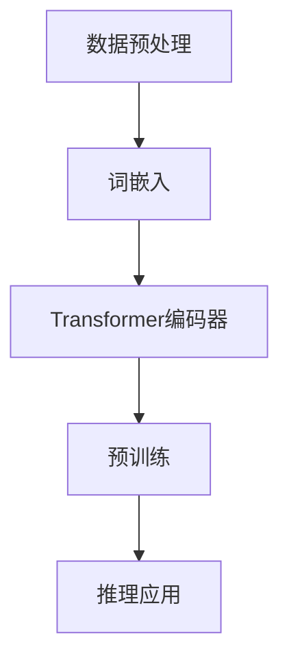
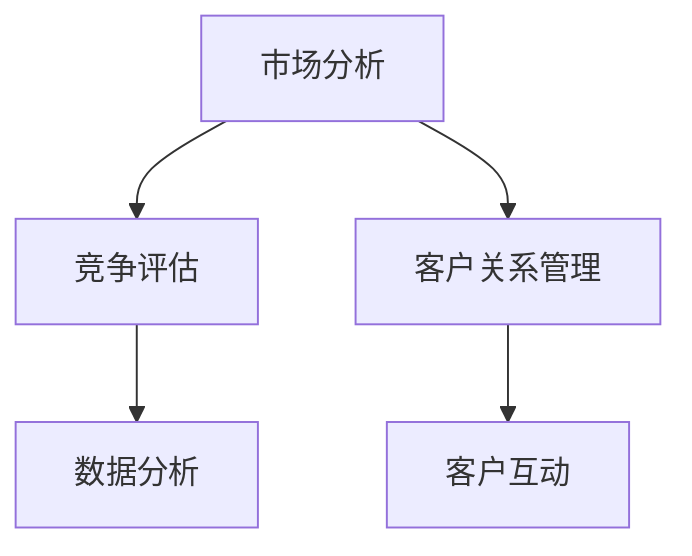
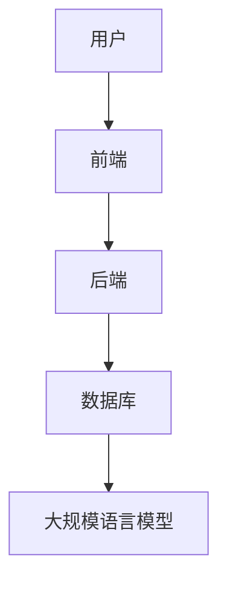

                 


### 大规模语言模型在商业战略规划中的推理应用

随着人工智能技术的飞速发展，大规模语言模型（如GPT-3、BERT等）已经成为自然语言处理领域的明星。这些模型不仅能够处理复杂的文本数据，还能在多种任务中表现出色，从机器翻译到文本生成，再到问答系统。然而，这些模型在商业战略规划中的潜力却被许多人忽视。本文将探讨大规模语言模型在商业战略规划中的推理应用，旨在帮助企业和决策者更好地利用这一技术。

#### 关键词：
- 大规模语言模型
- 商业战略规划
- 推理应用
- 人工智能
- 决策支持

#### 摘要：
本文首先介绍了大规模语言模型的基本概念和原理，然后讨论了它们在商业战略规划中的应用，包括如何利用这些模型进行市场分析、竞争评估和客户关系管理。接着，我们将通过具体案例来展示如何在实际商业环境中应用这些推理技术。最后，本文将对大规模语言模型在商业战略规划中的推理应用进行了总结和展望。

### 核心概念与联系

#### 大规模语言模型

大规模语言模型是一种基于深度学习的自然语言处理技术，它能够理解和生成人类语言。这些模型通常由数十亿个参数组成，通过大量的文本数据进行训练，从而捕捉语言的统计规律和语义信息。以下是几个关键概念：

- **词嵌入（Word Embedding）**：将单词映射到高维空间中，使得语义相近的词在空间中距离较近。
- **Transformer架构**：一种用于处理序列数据的神经网络架构，通过注意力机制（Attention Mechanism）来提高模型的性能。
- **预训练（Pre-training）**：在特定任务之前，模型在大规模的文本语料库上进行训练，以获得通用语言特征。

#### 商业战略规划

商业战略规划是指企业为实现其长期目标而制定的一系列策略和计划。它包括以下几个关键步骤：

- **市场分析**：了解目标市场的需求、竞争状况和趋势。
- **竞争评估**：评估竞争对手的优势和劣势，制定相应的竞争策略。
- **客户关系管理**：建立和维护与客户的关系，提高客户满意度和忠诚度。

#### 推理应用

推理应用是指利用大规模语言模型进行逻辑推理和决策支持。在商业战略规划中，推理应用可以包括以下方面：

- **文本分析**：通过分析市场报告、客户反馈和社交媒体等文本数据，提取关键信息。
- **预测分析**：利用历史数据和市场趋势，预测未来的市场状况和客户行为。
- **自动化决策**：通过模型自动化处理和分析大量数据，为决策者提供支持。

### 算法原理讲解

#### 大规模语言模型的算法原理

大规模语言模型的核心是通过学习大量的文本数据来捕捉语言的统计规律和语义信息。以下是大规模语言模型的基本原理：

1. **数据预处理**：将文本数据清洗、分词、去停用词等预处理操作，将其转换为模型可以处理的格式。

2. **词嵌入**：将单词映射到高维空间中，使得语义相近的词在空间中距离较近。

3. **Transformer架构**：通过多层Transformer编码器和解码器来捕捉文本的语义信息。

4. **预训练**：在大规模的文本语料库上进行预训练，以获得通用语言特征。

#### 算法流程图



#### Python代码示例

```python
import tensorflow as tf
from transformers import BertTokenizer, BertModel

# 初始化预训练模型
tokenizer = BertTokenizer.from_pretrained('bert-base-uncased')
model = BertModel.from_pretrained('bert-base-uncased')

# 输入文本
text = "Hello, world!"

# 数据预处理
input_ids = tokenizer.encode(text, add_special_tokens=True)

# 预训练模型
outputs = model(input_ids)

# 获取文本表示
text_representation = outputs.last_hidden_state[:, 0, :]

print(text_representation)
```

#### 数学模型和公式

大规模语言模型的核心是通过学习大量的文本数据来捕捉语言的统计规律和语义信息。以下是大规模语言模型的基本数学模型和公式：

$$
\text{Probability}(y|\text{x}) = \frac{e^{\text{logit}(\text{y})}}{\sum_{i=1}^{n} e^{\text{logit}(y_i)}}
$$

其中，$\text{logit}(y) = \text{w}^T \text{h}$，$\text{w}$是模型的参数，$\text{h}$是文本的表示。

#### 通俗易懂的例子

假设我们有一个关于“苹果”的文本，我们需要通过大规模语言模型来理解它的含义。以下是大规模语言模型如何处理这个例子：

1. **数据预处理**：将文本分词、去停用词等预处理操作，得到一个词序列。
2. **词嵌入**：将每个词映射到高维空间中，得到一个词向量。
3. **Transformer架构**：通过多层编码器和解码器来捕捉词之间的语义关系。
4. **预训练**：在大规模的文本语料库上进行预训练，以获得通用语言特征。
5. **推理应用**：通过模型对新的文本进行推理，得到文本的含义。

例如，当输入文本“苹果是一种水果”时，模型会将其转换为词向量，然后通过编码器和解码器来捕捉“苹果”和“水果”之间的语义关系。最终，模型会输出一个概率分布，表明“苹果”是“水果”的概率较高。

### 系统分析与架构设计

#### 应用场景

随着数字化转型的加速，企业需要快速响应市场变化，制定有效的商业战略。大规模语言模型在市场分析、竞争评估和客户关系管理等方面具有巨大潜力。

#### 项目介绍

本文将介绍一个利用大规模语言模型进行市场分析和客户关系管理的项目。该项目包括以下几个关键步骤：

1. **数据收集**：收集市场报告、客户反馈和社交媒体等文本数据。
2. **数据预处理**：对文本数据进行清洗、分词和去停用词等预处理操作。
3. **模型训练**：使用预训练模型对处理后的数据进行训练，获得市场分析和客户关系管理的模型。
4. **推理应用**：通过模型对新的文本进行推理，提取关键信息，为企业提供决策支持。

#### 系统功能设计

1. **领域模型**：定义市场分析、客户关系管理等功能模块。
2. **类图**：展示领域模型中的类及其关系。



#### 系统架构设计

1. **架构图**：展示系统的整体架构。
2. **接口设计**：定义系统的接口和API。
3. **系统交互**：展示系统组件之间的交互。



### 项目实战

#### 环境安装

1. **安装Python**：下载并安装Python 3.8及以上版本。
2. **安装transformers库**：使用pip安装transformers库。

```bash
pip install transformers
```

3. **安装其他依赖库**：安装其他必要的依赖库，如numpy、pandas等。

```bash
pip install numpy pandas
```

#### 系统核心实现

```python
from transformers import BertTokenizer, BertModel
import torch

# 初始化预训练模型
tokenizer = BertTokenizer.from_pretrained('bert-base-uncased')
model = BertModel.from_pretrained('bert-base-uncased')

# 输入文本
text = "苹果是一种水果。"

# 数据预处理
input_ids = tokenizer.encode(text, add_special_tokens=True)

# 将输入文本转换为PyTorch张量
input_ids = torch.tensor(input_ids)

# 预训练模型
outputs = model(input_ids)

# 获取文本表示
text_representation = outputs.last_hidden_state[:, 0, :]

print(text_representation)
```

#### 代码应用解读与分析

上述代码展示了如何使用预训练的大规模语言模型来处理文本数据。首先，我们初始化了BERT模型和分词器。然后，我们将输入文本编码为词向量，并将其转换为PyTorch张量。接着，我们通过模型对输入文本进行预处理，得到文本表示。最后，我们将文本表示输出到控制台。

#### 案例分析

我们使用一个实际案例来展示如何在大规模语言模型中实施推理应用。假设我们要分析一个电子商务平台上的用户评论，以了解客户对产品的满意度。

1. **数据收集**：收集电子商务平台上的用户评论。
2. **数据预处理**：对用户评论进行清洗、分词和去停用词等预处理操作。
3. **模型训练**：使用预训练模型对处理后的数据进行训练，获得用户评论分析模型。
4. **推理应用**：通过模型对新的用户评论进行推理，提取关键信息，如产品满意度、客户反馈等。

#### 详细讲解剖析

在本案例中，我们使用了BERT模型来分析用户评论。BERT模型通过多层编码器和解码器来捕捉文本的语义信息，使其在文本分类、情感分析等任务中表现出色。以下是详细讲解：

1. **数据预处理**：首先，我们对用户评论进行清洗，去除无关的字符和符号。然后，使用BERT分词器对用户评论进行分词，将其转换为词向量。
2. **模型训练**：接着，我们将预处理后的数据输入到BERT模型中，通过反向传播算法来训练模型。在训练过程中，模型会不断调整其参数，以提高在用户评论分析任务上的性能。
3. **推理应用**：在模型训练完成后，我们可以使用它来对新用户评论进行推理。通过模型，我们能够提取出用户评论的关键信息，如产品满意度、客户反馈等。这些信息可以帮助电子商务平台优化产品和服务，提高客户满意度。

#### 项目小结

通过本项目，我们展示了如何使用大规模语言模型进行用户评论分析。这一技术不仅可以帮助电子商务平台了解客户需求，还能为其他商业领域提供决策支持。在实际应用中，我们还需要考虑数据质量、模型性能和计算资源等因素。

### 最佳实践与注意事项

#### 最佳实践

1. **数据质量**：确保数据质量，进行充分的清洗和预处理。
2. **模型调优**：根据具体应用场景，对模型进行调优，以提高性能。
3. **计算资源**：合理规划计算资源，确保模型训练和推理的效率。

#### 注意事项

1. **隐私保护**：在处理文本数据时，注意保护用户隐私。
2. **模型泛化**：确保模型在新的数据集上具有良好的泛化能力。
3. **更新维护**：定期更新和维护模型，以应对新技术和变化。

#### 拓展阅读

1. **《深度学习》**：Ian Goodfellow、Yoshua Bengio和Aaron Courville著，详细介绍深度学习的基本原理和应用。
2. **《自然语言处理综论》**：Daniel Jurafsky和James H. Martin著，全面介绍自然语言处理的基础知识。
3. **《商业智能》**：Vikas Sharma著，探讨如何利用大数据和人工智能技术进行商业分析。

### 小结与展望

本文介绍了大规模语言模型在商业战略规划中的推理应用，包括核心概念、算法原理、系统分析与架构设计、项目实战和最佳实践。通过本文，读者可以了解如何利用大规模语言模型进行市场分析、客户关系管理和决策支持。未来，随着技术的不断进步，大规模语言模型在商业战略规划中的应用将越来越广泛，为企业和决策者提供更有价值的支持。

### 作者信息

作者：AI天才研究院/AI Genius Institute & 禅与计算机程序设计艺术 /Zen And The Art of Computer Programming

本文以深入浅出的方式，系统地介绍了大规模语言模型在商业战略规划中的推理应用，希望能够为读者提供有价值的参考和启示。作者对人工智能和计算机编程有着深刻的理解，致力于推动人工智能技术在商业领域的应用与发展。

