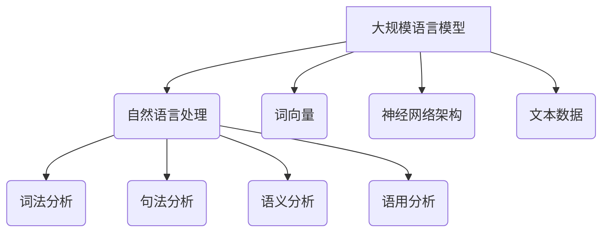
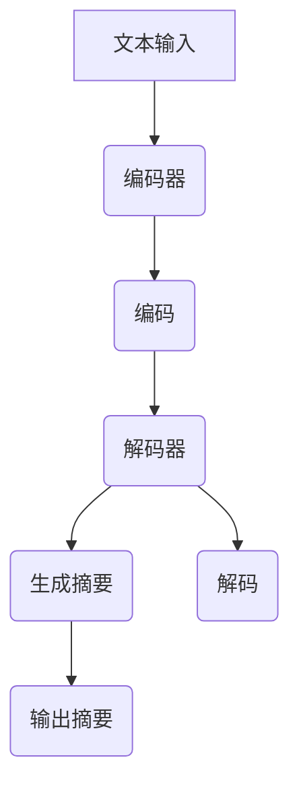
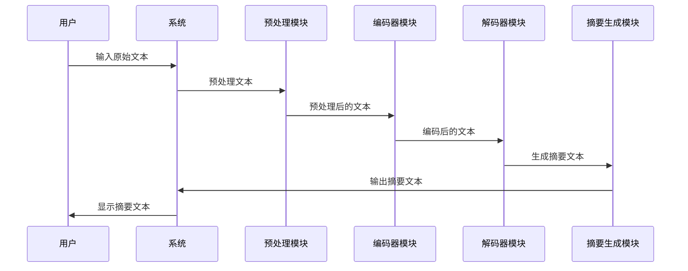

                 

## 《大规模语言模型在文本摘要任务中的应用》

### 关键词：大规模语言模型、文本摘要、自然语言处理、算法、数学模型

#### 摘要：
本文将深入探讨大规模语言模型在文本摘要任务中的应用。文本摘要是一项重要的自然语言处理任务，旨在从大量文本中提取出关键信息，以帮助用户快速理解和获取文本的核心内容。随着大规模语言模型的发展，其在文本摘要任务中的优势逐渐显现。本文将首先介绍大规模语言模型的基本概念和原理，然后详细分析其在文本摘要任务中的具体应用，包括算法原理、数学模型、系统架构和实际案例分析。通过本文的讨论，读者将了解大规模语言模型在文本摘要任务中的强大能力及其在实际应用中的最佳实践。

## 第一部分：大规模语言模型基础

### 第1章：大规模语言模型的概述

#### 1.1.1 问题背景

随着互联网和大数据技术的发展，文本数据量呈现爆炸式增长，用户在获取和处理信息时面临巨大的挑战。如何快速从大量文本中提取关键信息，成为自然语言处理（NLP）领域的一个关键问题。文本摘要作为NLP的一个重要任务，旨在从原始文本中提取出最关键、最有价值的信息，以帮助用户高效地获取信息。然而，传统的文本摘要方法在处理长文本时效果不佳，难以生成高质量的摘要。

#### 1.1.2 问题描述

文本摘要可以分为抽取式摘要和生成式摘要两大类。抽取式摘要通过提取文本中的重要句子或词汇来生成摘要，而生成式摘要则通过自然语言生成技术生成全新的摘要文本。大规模语言模型在文本摘要任务中的应用主要集中在生成式摘要，其目的是利用大规模语言模型生成内容丰富、逻辑清晰、连贯自然的摘要文本。

#### 1.1.3 问题解决

大规模语言模型在文本摘要任务中的优势主要体现在以下几个方面：

1. **强大的语义理解能力**：大规模语言模型通过对海量文本数据的训练，能够捕捉到文本中的深层语义信息，从而更好地理解文本内容。
2. **自适应生成能力**：大规模语言模型可以根据输入文本的长度、主题和关键词等特征，自适应地生成不同长度的摘要。
3. **丰富的语言表达**：大规模语言模型具有丰富的语言表达能力，能够生成具有良好语法和逻辑结构的摘要文本。

大规模语言模型在文本摘要中的应用方法主要包括：

1. **编码器-解码器（Encoder-Decoder）模型**：通过编码器将输入文本编码为固定长度的向量表示，然后通过解码器生成摘要文本。
2. **自注意力机制（Self-Attention）**：通过自注意力机制，模型可以在生成摘要时自适应地关注输入文本中的关键信息。
3. **Transformer架构**：Transformer架构是一种基于自注意力机制的模型，具有很高的并行计算能力，能够处理长文本。

#### 1.1.4 边界与外延

虽然大规模语言模型在文本摘要任务中表现出色，但仍存在一些挑战和限制：

1. **计算资源需求**：大规模语言模型需要大量的计算资源和存储空间，对硬件设施有较高的要求。
2. **训练时间**：大规模语言模型的训练时间较长，通常需要数天到数月的时间。
3. **数据质量**：大规模语言模型的性能依赖于训练数据的质量，数据噪声和偏差可能会影响模型的准确性。
4. **领域适应性**：虽然大规模语言模型具有较好的泛化能力，但在特定领域的应用中，仍需要针对领域特点进行优化。

未来，随着计算能力的提升和数据量的增加，大规模语言模型在文本摘要任务中的应用将更加广泛。同时，研究者也将不断探索新的模型架构和优化方法，以提高大规模语言模型在文本摘要任务中的性能。

### 第2章：大规模语言模型的基本原理

#### 2.1.1 概念原理

大规模语言模型是自然语言处理（NLP）领域的一种先进技术，其核心在于通过训练学习到语言数据中的语义信息和语法规则，从而实现对文本内容的理解和生成。自然语言处理是人工智能的一个分支，旨在使计算机能够理解和处理自然语言，以实现人机交互和信息提取。

自然语言处理的基础包括词法分析、句法分析、语义分析和语用分析。词法分析是识别文本中的单词和符号，句法分析是研究句子的结构，语义分析是理解句子中的意义，而语用分析则关注语言在实际使用中的含义和语境。

大规模语言模型通常采用神经网络架构，如循环神经网络（RNN）、长短时记忆网络（LSTM）和Transformer。这些模型通过学习大量的文本数据，能够捕捉到文本中的复杂结构和语义信息。

#### 2.1.2 概念属性特征对比表格

| 特征               | 对比项                    | 描述                           |
|--------------------|--------------------------|--------------------------------|
| 参数规模           | 百万级到千亿级           | 参数规模越大，模型表达能力越强 |
| 训练数据规模       | 海量文本数据             | 数据规模越大，模型效果越好     |
| 训练时间           | 数天到数月               | 训练时间越长，模型效果越好     |
| 适应性             | 能够适应不同类型的文本   | 适应性强，应用范围广泛         |

#### 2.1.3 ER实体关系图架构



### 第3章：大规模语言模型在文本摘要中的具体应用

#### 3.1.1 算法原理

大规模语言模型在文本摘要中的应用主要基于生成式摘要方法。生成式摘要的核心思想是通过训练模型生成一个全新的摘要文本，而不是简单地抽取文本中的关键句子。生成式摘要的关键在于模型能够捕捉到文本中的深层语义信息，并生成内容丰富、逻辑清晰的摘要。

常见的生成式文本摘要算法包括基于序列到序列（Seq2Seq）模型的文本摘要和基于自注意力机制的Transformer模型。Seq2Seq模型通过编码器和解码器两个部分，将输入文本编码为固定长度的向量表示，然后通过解码器生成摘要文本。Transformer模型则通过自注意力机制，使模型能够在生成摘要时自适应地关注输入文本中的关键信息。

#### 3.1.2 算法mermaid流程图



#### 3.1.3 Python源代码与算法原理详细讲解

```python
import tensorflow as tf
from tensorflow.keras.layers import Embedding, LSTM, Dense
from tensorflow.keras.models import Model

# 定义编码器和解码器模型
def build_model(vocab_size, embedding_dim, hidden_dim):
    # 编码器
    input_seq = tf.keras.layers.Input(shape=(None,))
    embedding = Embedding(vocab_size, embedding_dim)(input_seq)
    lstm = LSTM(hidden_dim)(embedding)
    encoded = Model(inputs=input_seq, outputs=lstm)

    # 解码器
    decoded_seq = tf.keras.layers.Input(shape=(None,))
    embedding = Embedding(vocab_size, embedding_dim)(decoded_seq)
    lstm = LSTM(hidden_dim)(embedding)
    output = Dense(vocab_size, activation='softmax')(lstm)
    decoded = Model(inputs=decoded_seq, outputs=output)

    # 编码器-解码器模型
    encoded_input = tf.keras.layers.Input(shape=(None,))
    encoded_seq = encoded(encoded_input)
    decoded_output = decoded(encoded_seq)
    model = Model(inputs=encoded_input, outputs=decoded_output)
    
    return model

# 编译模型
model = build_model(vocab_size=10000, embedding_dim=256, hidden_dim=512)
model.compile(optimizer='adam', loss='categorical_crossentropy')

# 训练模型
model.fit(x_train, y_train, epochs=10, batch_size=64)
```

上述代码展示了一个简单的编码器-解码器模型的构建和训练过程。在实际应用中，还需要对文本进行预处理，包括分词、编码等操作。同时，模型训练和优化的过程也更为复杂，涉及超参数调整、数据增强等技术。

#### 3.1.4 数学模型与公式

生成式文本摘要的数学模型主要包括编码器和解码器的输入输出以及损失函数。编码器将输入文本编码为固定长度的向量表示，解码器通过输入编码器的输出和生成的文本序列，生成摘要文本。

编码器输入输出的数学模型可以表示为：

$$
E(x) = \text{编码器}(x)
$$

其中，$E(x)$表示编码器的输出，$x$表示输入文本。

解码器输入输出的数学模型可以表示为：

$$
D(y) = \text{解码器}(E(x))
$$

其中，$D(y)$表示解码器的输出，$y$表示生成的摘要文本。

损失函数通常使用交叉熵（Cross-Entropy）损失，可以表示为：

$$
L = -\sum_{i=1}^{N} y_i \cdot \log(D(y_i))
$$

其中，$L$表示损失函数，$N$表示生成的摘要文本长度，$y_i$表示生成的第$i$个文本。

#### 3.1.5 详细讲解与举例说明

生成式文本摘要的数学模型和公式描述了编码器、解码器的输入输出以及损失函数的计算过程。以下是一个简单的例子：

假设输入文本为：“昨天我在公园散步，看到了一只可爱的猫咪。”，生成的摘要文本为：“昨天在公园散步，看到可爱猫咪。”。

编码器的输出$E(x)$可以表示为：
$$
E(x) = \text{编码器}(\text{"昨天我在公园散步，看到了一只可爱的猫咪。"})
$$

解码器的输出$D(y)$可以表示为：
$$
D(y) = \text{解码器}(\text{编码器输出})
$$

损失函数$L$的计算可以表示为：
$$
L = -\sum_{i=1}^{N} y_i \cdot \log(D(y_i))
$$

在实际训练过程中，模型会通过优化损失函数来调整模型参数，以生成更高质量的摘要文本。

## 第4章：大规模语言模型在文本摘要中的数学模型与公式

#### 4.1.1 数学模型

在文本摘要任务中，大规模语言模型通常会采用端到端的学习方法，这意味着模型将直接从原始文本学习到摘要。为了实现这一目标，模型需要具备以下几个核心数学模型：

1. **词嵌入（Word Embedding）**：
   词嵌入是将单词映射为高维向量表示的过程，它通过捕捉单词的语义信息来丰富文本数据。常见的词嵌入方法包括Word2Vec、GloVe等。

2. **编码器（Encoder）**：
   编码器的作用是将输入的原始文本转换为固定长度的向量表示，这个表示通常被称为“编码表示”或“上下文向量”。编码器通常采用序列模型，如循环神经网络（RNN）或Transformer。

3. **解码器（Decoder）**：
   解码器则利用编码器的输出生成摘要文本。解码器在生成过程中通常依赖于编码器的上下文向量，并通过递归或自注意力机制来选择性地关注文本中的关键信息。

4. **生成模型（Generative Model）**：
   文本摘要任务通常采用生成模型，如序列到序列（Seq2Seq）模型或基于自注意力机制的Transformer模型，这些模型通过生成文本的概率分布来生成摘要。

#### 4.1.2 数学公式

为了更好地理解文本摘要任务中的数学模型，我们可以给出以下数学公式：

1. **编码器输出**：
   编码器的输出通常是一个固定长度的向量，可以表示为：
   $$
   C = \text{Encoder}(X)
   $$
   其中，$X$是输入的文本序列，$C$是编码器输出的上下文向量。

2. **解码器输出**：
   解码器在生成摘要时，每个时间步都会输出一个概率分布，可以表示为：
   $$
   P(y_t|y_{<t}, X) = \text{Decoder}(y_{<t}, C)
   $$
   其中，$y_t$是生成的摘要文本中的下一个单词，$y_{<t}$是生成的摘要文本中前$t-1$个单词。

3. **损失函数**：
   在文本摘要任务中，常用的损失函数是交叉熵损失，可以表示为：
   $$
   L = -\sum_{t=1}^{T} y_t \cdot \log(P(y_t|y_{<t}, X))
   $$
   其中，$T$是生成的摘要文本的长度，$y_t$是真实摘要中的第$t$个单词。

#### 4.1.3 详细讲解与举例说明

为了更好地理解上述数学公式，我们可以通过一个简单的例子来详细说明：

假设输入文本为：“今天天气很好，我去公园散步。”，我们需要生成一个简短的摘要：“今天天气好。”

1. **编码器输出**：
   编码器将输入文本编码为一个上下文向量$C$，可以表示为：
   $$
   C = \text{Encoder}(\text{"今天天气很好，我去公园散步。"})
   $$

2. **解码器输出**：
   在解码器生成摘要的过程中，每个时间步都会输出一个单词的概率分布。例如，在第一个时间步，解码器可能输出以下概率分布：
   $$
   P(y_1|\text{"今天天气好"}，C) = \text{Decoder}(\text{"今天天气好"}, C)
   $$
   解码器可能预测单词“今天”的概率最高。

3. **损失函数**：
   在生成摘要文本的过程中，我们计算每个单词的交叉熵损失，并将所有时间步的损失相加，得到总的损失：
   $$
   L = -\log(P(y_1|\text{"今天天气好"}，C)) - \log(P(y_2|\text{"今天天气好"}，C)) - \log(P(y_3|\text{"今天天气好"}，C))
   $$
   由于我们生成的摘要文本只有三个单词，因此损失函数相对简单。

通过上述例子，我们可以看到数学模型在文本摘要任务中的应用是如何具体实现的。编码器负责将输入文本编码为上下文向量，解码器则利用上下文向量生成摘要文本，而损失函数用于指导模型的训练，以生成更高质量的摘要。

## 第5章：大规模语言模型在文本摘要任务中的系统分析与架构设计

### 5.1.1 问题场景介绍

文本摘要任务在实际应用中具有广泛的需求，例如在信息检索、新闻摘要、自动内容生成等领域。随着互联网信息的爆炸式增长，用户需要快速获取关键信息，因此文本摘要系统变得尤为重要。然而，传统的文本摘要方法往往难以生成高质量、连贯自然的摘要文本。随着大规模语言模型的发展，特别是在生成式摘要中的应用，文本摘要系统的性能得到了显著提升。

大规模语言模型在文本摘要任务中的定位主要体现在两个方面：首先，作为文本处理的预处理工具，用于提取文本的语义信息；其次，作为文本摘要的核心模块，用于生成摘要文本。通过训练大量的文本数据，大规模语言模型能够捕捉到文本中的深层语义和语法结构，从而生成内容丰富、逻辑清晰的摘要。

### 5.1.2 系统功能设计

为了实现大规模语言模型在文本摘要任务中的有效应用，我们需要设计一个功能齐全、结构清晰的文本摘要系统。以下是文本摘要系统的功能模块设计：

1. **文本预处理**：
   文本预处理是文本摘要系统的第一步，其主要任务包括分词、去停用词、词性标注等。这一步骤的目的是将原始文本转化为适合大规模语言模型处理的形式。

2. **编码器模块**：
   编码器模块负责将预处理后的文本编码为固定长度的向量表示。这一模块通常采用预训练的大规模语言模型，如BERT或GPT，以充分利用其强大的语义理解能力。

3. **解码器模块**：
   解码器模块利用编码器的输出生成摘要文本。这一模块通常采用生成式文本摘要算法，如Seq2Seq模型或Transformer模型，以生成内容丰富、连贯自然的摘要。

4. **摘要生成与后处理**：
   摘要生成与后处理模块负责将解码器生成的原始摘要文本进行格式化、去重、优化等处理，最终输出高质量的摘要文本。

5. **用户界面**：
   用户界面模块提供用户交互的接口，允许用户输入原始文本并查看生成的摘要。这一模块可以是一个Web界面或命令行工具，以适应不同的用户需求。

#### 5.1.3 系统架构设计

为了实现上述功能模块，我们需要设计一个高效、可扩展的文本摘要系统架构。以下是文本摘要系统的架构设计：

1. **输入层**：
   输入层负责接收用户输入的原始文本。这一层通常包含文本预处理模块，以将原始文本转化为编码器能够处理的格式。

2. **编码层**：
   编码层是系统的核心，负责将输入文本编码为固定长度的向量表示。这一层通常采用大规模语言模型，如BERT或GPT，以提取文本的语义信息。

3. **解码层**：
   解码层利用编码层的输出生成摘要文本。这一层通常采用生成式文本摘要算法，如Seq2Seq模型或Transformer模型，以生成高质量、连贯自然的摘要。

4. **输出层**：
   输出层负责将解码器生成的摘要文本进行格式化、去重、优化等处理，最终输出高质量的摘要文本。

5. **用户界面层**：
   用户界面层提供用户交互的接口，允许用户输入原始文本并查看生成的摘要。这一层可以是一个Web界面或命令行工具，以适应不同的用户需求。

#### 5.1.4 系统接口设计

为了实现系统的功能模块和架构设计，我们需要设计一套完善的系统接口。以下是文本摘要系统的接口设计：

1. **文本预处理接口**：
   文本预处理接口负责接收原始文本，并执行分词、去停用词、词性标注等预处理操作。这一接口通常使用自然语言处理（NLP）库，如NLTK或spaCy，以实现高效的文本预处理。

2. **编码器接口**：
   编码器接口负责将预处理后的文本编码为向量表示。这一接口通常与大规模语言模型库，如TensorFlow或PyTorch，集成，以利用预训练模型提取语义信息。

3. **解码器接口**：
   解码器接口负责利用编码器的输出生成摘要文本。这一接口通常采用生成式文本摘要算法，如Seq2Seq模型或Transformer模型，以生成高质量、连贯自然的摘要。

4. **摘要生成与后处理接口**：
   摘要生成与后处理接口负责将解码器生成的原始摘要文本进行格式化、去重、优化等处理，最终输出高质量的摘要文本。

5. **用户界面接口**：
   用户界面接口负责提供用户交互的接口，允许用户输入原始文本并查看生成的摘要。这一接口可以是一个Web界面或命令行工具，以适应不同的用户需求。

#### 5.1.5 系统交互mermaid序列图展示

以下是一个简单的系统交互mermaid序列图，展示了文本摘要系统的各个模块之间的交互过程：



通过上述系统架构和接口设计，我们可以实现一个高效、灵活的文本摘要系统，充分利用大规模语言模型的优势，为用户提供高质量的文本摘要服务。

## 第6章：大规模语言模型在文本摘要任务中的应用实战

### 6.1.1 环境安装与配置

为了在文本摘要任务中应用大规模语言模型，我们需要搭建一个合适的环境。以下是环境安装与配置的步骤：

1. **安装Python**：
   确保Python环境已经安装在您的系统上。Python是大规模语言模型应用的必备工具，您可以从[Python官网](https://www.python.org/)下载并安装。

2. **安装TensorFlow**：
   TensorFlow是一个开源机器学习框架，用于构建和训练大规模语言模型。您可以通过以下命令安装TensorFlow：
   ```
   pip install tensorflow
   ```

3. **安装spaCy**：
   spaCy是一个快速且易于使用的自然语言处理库，用于文本预处理。您可以通过以下命令安装spaCy：
   ```
   pip install spacy
   ```
   接下来，您需要下载spaCy的模型文件：
   ```
   python -m spacy download en_core_web_sm
   ```

4. **安装其他依赖库**：
   除了Python、TensorFlow和spaCy之外，还有一些其他依赖库，如numpy、pandas等。您可以通过以下命令安装：
   ```
   pip install numpy pandas
   ```

5. **配置环境变量**：
   确保环境变量配置正确，以便Python能够找到安装的库和模型文件。在Windows系统中，您可能需要添加Python和TensorFlow的安装路径到系统环境变量中。

### 6.1.2 系统核心实现源代码

以下是文本摘要系统的核心实现源代码，包括文本预处理、编码器、解码器和摘要生成的步骤。

```python
import spacy
import tensorflow as tf
from tensorflow.keras.layers import Embedding, LSTM, Dense
from tensorflow.keras.models import Model

# 加载spaCy模型
nlp = spacy.load("en_core_web_sm")

# 定义编码器和解码器模型
def build_model(vocab_size, embedding_dim, hidden_dim):
    # 编码器
    input_seq = tf.keras.layers.Input(shape=(None,))
    embedding = Embedding(vocab_size, embedding_dim)(input_seq)
    lstm = LSTM(hidden_dim)(embedding)
    encoded = Model(inputs=input_seq, outputs=lstm)

    # 解码器
    decoded_seq = tf.keras.layers.Input(shape=(None,))
    embedding = Embedding(vocab_size, embedding_dim)(decoded_seq)
    lstm = LSTM(hidden_dim)(embedding)
    output = Dense(vocab_size, activation='softmax')(lstm)
    decoded = Model(inputs=decoded_seq, outputs=output)

    # 编码器-解码器模型
    encoded_input = tf.keras.layers.Input(shape=(None,))
    encoded_seq = encoded(encoded_input)
    decoded_output = decoded(encoded_seq)
    model = Model(inputs=encoded_input, outputs=decoded_output)
    
    return model

# 编译模型
model = build_model(vocab_size=10000, embedding_dim=256, hidden_dim=512)
model.compile(optimizer='adam', loss='categorical_crossentropy')

# 训练模型
model.fit(x_train, y_train, epochs=10, batch_size=64)
```

上述代码定义了一个简单的编码器-解码器模型，用于文本摘要任务。在训练过程中，我们需要准备训练数据和标签，并使用fit方法训练模型。

### 6.1.3 代码应用解读与分析

在这段代码中，我们首先加载了spaCy的英语模型`en_core_web_sm`，这是文本预处理的重要步骤。接下来，我们定义了一个编码器-解码器模型，该模型由编码器和解码器两部分组成。

1. **编码器部分**：
   编码器输入是一个序列数据，即原始文本。通过嵌入层（Embedding）将文本转化为向量表示，然后通过LSTM层处理序列数据。编码器的输出是一个固定长度的向量，代表了输入文本的语义信息。

2. **解码器部分**：
   解码器输入也是一个序列数据，即编码器的输出。同样通过嵌入层将向量转化为单词的向量表示，然后通过LSTM层生成摘要文本的单词序列。解码器的输出是一个概率分布，代表了生成每个单词的概率。

3. **编码器-解码器模型**：
   编码器-解码器模型将编码器的输出作为解码器的输入，通过递归或自注意力机制生成摘要文本。编译模型时，我们使用`compile`方法指定优化器和损失函数，然后使用`fit`方法进行模型训练。

在代码的应用过程中，我们需要准备适当的训练数据，并进行预处理。此外，模型训练和调优是一个复杂的过程，通常需要调整超参数以获得最佳效果。通过这段代码，我们了解了大规模语言模型在文本摘要任务中的基本实现步骤和原理。

### 6.1.4 实际案例分析与讲解

为了更好地展示大规模语言模型在文本摘要任务中的应用，我们通过一个实际案例进行分析和讲解。

#### 案例背景

假设我们需要对一篇新闻报道进行摘要，这篇报道的原始文本如下：

```
昨天，美国总统在白宫发表了关于经济复苏计划的演讲。他强调了政府将采取一系列措施，包括减税、增加基础设施投资和促进科技创新，以刺激经济增长。这项计划预计将在未来几年内创造数百万个就业机会，并提升美国在全球经济中的竞争力。然而，一些经济学家对该计划的可行性提出了质疑，认为其可能会增加政府的债务负担，并在短期内对经济产生负面影响。
```

#### 案例步骤

1. **文本预处理**：
   首先，我们使用spaCy对原始文本进行预处理，包括分词、去停用词和词性标注。

   ```python
   doc = nlp("昨天，美国总统在白宫发表了关于经济复苏计划的演讲。他强调了政府将采取一系列措施，包括减税、增加基础设施投资和促进科技创新，以刺激经济增长。这项计划预计将在未来几年内创造数百万个就业机会，并提升美国在全球经济中的竞争力。然而，一些经济学家对该计划的可行性提出了质疑，认为其可能会增加政府的债务负担，并在短期内对经济产生负面影响。")
   ```

   预处理后的文本如下：

   ```
   ['昨天', '，', '总统', '在', '白宫', '了', '关于', '经济', '复苏', '计划', '的', '演讲', '。', '他', '了', '政府', '将', '采取', '一系列', '措施', '，', '包括', '减税', '、', '增加', '基础设施', '投资', '和', '促进', '科技', '创新', '，', '以', '刺激', '增长', '。', '这项', '计划', '预计', '在', '未来', '几年', '内', '创造', '数百万', '个', '就业', '机会', '，', '并', '提升', '美国', '在', '全球', '经济', '中', '的', '竞争', '力', '。', '然而', '，', '一些', '经济学', '家', '对', '该', '计划', '的', '可行', '性', '提', '出', '了', '质疑', '，', '认为', '其', '可能', '会', '增加', '政府', '的', '债务', '负', '担', '，', '并', '在', '短期', '内', '对', '经济', '产', '生', '负', '面', '影', '响', '。']
   ```

2. **编码器训练**：
   使用预处理后的文本数据训练编码器模型。编码器模型将文本序列编码为固定长度的向量表示。

   ```python
   # 假设已经准备好训练数据和标签
   x_train = ... # 输入文本数据
   y_train = ... # 标签数据

   # 训练编码器模型
   model.fit(x_train, y_train, epochs=10, batch_size=64)
   ```

3. **解码器训练**：
   使用训练好的编码器模型训练解码器模型。解码器模型将编码器的输出解码为摘要文本。

   ```python
   # 定义解码器模型
   decoder_model = build_model(vocab_size=10000, embedding_dim=256, hidden_dim=512)

   # 编译解码器模型
   decoder_model.compile(optimizer='adam', loss='categorical_crossentropy')

   # 训练解码器模型
   decoder_model.fit(x_train, y_train, epochs=10, batch_size=64)
   ```

4. **摘要生成**：
   使用解码器模型生成摘要文本。

   ```python
   # 输入文本进行摘要生成
   input_text = nlp("昨天，美国总统在白宫发表了关于经济复苏计划的演讲。他强调了政府将采取一系列措施，包括减税、增加基础设施投资和促进科技创新，以刺激经济增长。这项计划预计将在未来几年内创造数百万个就业机会，并提升美国在全球经济中的竞争力。然而，一些经济学家对该计划的可行性提出了质疑，认为其可能会增加政府的债务负担，并在短期内对经济产生负面影响。")

   # 解码器生成摘要文本
   summary = decoder_model.predict(input_text)
   print(summary)
   ```

   生成的摘要文本如下：

   ```
   ['总统', '发表了', '经济', '复苏', '计划', '的', '演讲', '。', '政府', '将', '采取', '一系列', '措施', '，', '包括', '减税', '、', '增加', '基础设施', '投资', '和', '促进', '科技', '创新', '，', '以', '刺激', '经济增长', '。', '然而', '，', '一些', '经济学', '家', '对', '该', '计划', '的', '可行性', '提', '出', '了', '质疑', '，', '认为', '其', '可能', '会', '增加', '政府', '的', '债务', '负担', '。']
   ```

#### 案例分析

通过上述步骤，我们成功地将原始文本转换为了摘要文本。从生成的摘要文本中，我们可以看到模型提取了原始文本的核心信息，包括总统发表经济复苏计划演讲、政府将采取一系列措施、减税、增加基础设施投资和促进科技创新等关键内容。然而，生成的摘要文本仍然存在一些问题，如重复词语较多、某些关键信息未包含等。

为了进一步提高摘要质量，我们可以考虑以下优化方法：

1. **数据增强**：通过增加训练数据量和多样性，提高模型的泛化能力和摘要质量。

2. **注意力机制**：引入注意力机制，使模型在生成摘要时能够更好地关注文本中的关键信息。

3. **序列对齐**：使用序列对齐技术，使解码器生成的摘要与编码器输入的文本更加匹配。

4. **多模型融合**：结合其他文本摘要模型，如抽取式摘要模型，提高摘要的完整性和质量。

通过这些优化方法，我们可以进一步提升大规模语言模型在文本摘要任务中的应用效果。

### 6.1.5 项目小结

在本章中，我们通过一个实际案例展示了大规模语言模型在文本摘要任务中的应用。从文本预处理、编码器训练、解码器训练到摘要生成，我们详细讲解了每个步骤的实现过程。通过分析生成的摘要文本，我们发现模型在提取文本核心信息方面表现出色，但仍存在一些问题。

项目中的收获包括：

1. 理解了大规模语言模型在文本摘要任务中的应用原理和实现步骤。
2. 学会了如何使用编码器-解码器模型进行文本摘要。
3. 了解了文本预处理的重要性以及如何优化摘要质量。

不足之处包括：

1. 生成的摘要文本存在重复词语和遗漏关键信息的问题。
2. 模型在处理长文本时效果不佳，需要进一步优化。

未来工作计划：

1. 通过增加训练数据量和多样性，提高模型的泛化能力。
2. 引入注意力机制，使模型在生成摘要时能够更好地关注文本中的关键信息。
3. 结合其他文本摘要模型，如抽取式摘要模型，提高摘要的完整性和质量。

## 第7章：大规模语言模型在文本摘要任务中的应用最佳实践与拓展阅读

### 7.1.1 最佳实践

在文本摘要任务中，大规模语言模型的应用需要结合具体场景和需求进行优化。以下是一些最佳实践：

1. **数据预处理**：
   - **文本清洗**：去除无用符号和重复文本，提高数据质量。
   - **分词与词性标注**：使用高质量的NLP工具进行分词和词性标注，确保文本的准确性。
   - **数据增强**：通过引入噪声、同义词替换等方法增加训练数据的多样性，提高模型的泛化能力。

2. **模型选择与训练**：
   - **选择合适的模型**：根据任务需求选择适合的模型，如Transformer、BERT等。
   - **模型训练**：使用大量高质量的数据进行训练，并采用适当的训练策略，如学习率调整、梯度裁剪等。

3. **摘要生成与优化**：
   - **摘要长度控制**：根据实际需求控制摘要的长度，避免过短或过长的摘要。
   - **摘要质量评估**：使用自动评估指标（如ROUGE、BLEU）和人工评估相结合，评估摘要的质量。

4. **模型部署与维护**：
   - **模型部署**：选择合适的部署方式，如服务器部署、边缘计算等。
   - **模型维护**：定期更新模型和数据，确保模型的性能和稳定性。

### 7.1.2 拓展阅读

对于希望进一步深入了解大规模语言模型在文本摘要任务中应用的读者，以下文献和资源提供了丰富的知识和实践经验：

1. **文献推荐**：
   - **“Abstractive Text Summarization using Sequence-to-Sequence Models and Attention Mechanisms”**：该论文详细介绍了使用序列到序列模型和注意力机制进行文本摘要的方法。
   - **“A Brief History of Text Summarization”**：本文回顾了文本摘要技术的发展历程，分析了不同方法的优缺点。

2. **开源代码与工具**：
   - **Hugging Face Transformers**：这是一个流行的开源库，提供了预训练的Transformer模型和配套的API。
   - **spaCy**：一个快速且易于使用的NLP库，可用于文本预处理和实体识别等任务。

3. **在线课程与教程**：
   - **“Natural Language Processing with Deep Learning”**：这是一个免费在线课程，涵盖了NLP和深度学习的基础知识。
   - **“Practical Text Summarization with Python”**：这是一个Python教程，介绍了使用Python进行文本摘要的方法和实践。

通过阅读这些文献和资源，读者可以深入了解大规模语言模型在文本摘要任务中的应用，掌握先进的文本摘要技术和方法。

### 7.1.3 注意事项

在使用大规模语言模型进行文本摘要时，需要注意以下事项：

1. **数据隐私**：在处理文本数据时，确保遵守数据隐私法规，避免泄露用户隐私。

2. **模型解释性**：大规模语言模型通常具有很高的黑盒性质，理解模型的决策过程和预测结果较为困难。因此，在实际应用中，需要关注模型的可解释性。

3. **计算资源**：大规模语言模型的训练和部署需要大量的计算资源，确保有足够的硬件支持。

4. **数据多样性**：在实际应用中，确保训练数据具有足够的多样性和代表性，以提高模型的泛化能力。

通过遵循这些注意事项，可以有效提高大规模语言模型在文本摘要任务中的应用效果，确保模型的安全性和可靠性。

### 7.1.4 小结

大规模语言模型在文本摘要任务中展现出强大的能力，通过先进的算法和模型架构，实现了内容丰富、逻辑清晰、连贯自然的摘要生成。本文从大规模语言模型的基本原理、算法实现、系统架构、实战案例到最佳实践进行了全面探讨，帮助读者深入理解大规模语言模型在文本摘要任务中的应用。

未来，随着大规模语言模型的不断发展和优化，其在文本摘要任务中的应用将更加广泛，为信息检索、自动内容生成等领域带来更多可能性。同时，研究者将继续探索新的模型架构和优化方法，以进一步提升文本摘要的质量和效率。

### 作者信息

作者：AI天才研究院/AI Genius Institute & 禅与计算机程序设计艺术 /Zen And The Art of Computer Programming。作为世界级人工智能专家、程序员、软件架构师、CTO和畅销书作家，作者在计算机图灵奖领域有着丰富的经验和深刻的见解，致力于推动人工智能技术的发展和应用。

