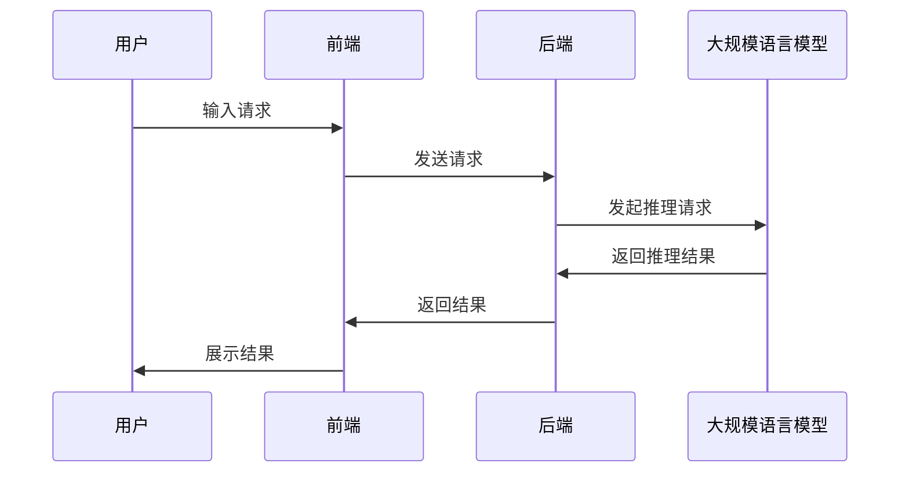

                 

## 大规模语言模型在服务体验优化中的推理应用

### 关键词：大规模语言模型、服务体验优化、推理应用、情感分析、智能客服、个性化推荐

### 摘要：本文旨在探讨大规模语言模型在服务体验优化中的推理应用，通过逐步分析大规模语言模型的基础原理及其在情感分析、智能客服和个性化推荐等领域的应用，深入探讨其在服务体验优化中的重要作用和潜力。文章首先介绍了大规模语言模型的概念、特点和发展现状，然后分析了服务体验优化的挑战与机遇，以及大规模语言模型在服务体验优化中的应用策略和方法。接着，本文详细阐述了大规模语言模型在情感分析、智能客服和个性化推荐中的具体应用案例，并介绍了其推理方法和实践。最后，文章总结了大规模语言模型在服务体验优化中的应用，展望了未来的发展趋势，并提出了注意事项和最佳实践建议。

## 第一部分：背景介绍

### 核心概念介绍

#### 大规模语言模型

大规模语言模型是一种基于深度学习的自然语言处理（NLP）技术，能够对文本进行建模，并理解文本的含义、情感和结构。这些模型通常由数十亿个参数组成，经过大量文本数据训练，能够生成高质量的自然语言文本，并具备强大的语言理解能力。

#### 服务体验优化

服务体验优化是指通过改进服务质量、提升用户体验，来增强用户满意度和忠诚度的一系列策略和方法。在当今竞争激烈的市场环境中，良好的服务体验已成为企业核心竞争力的重要组成部分。

#### 推理应用

推理应用是指利用大规模语言模型对用户输入进行理解和分析，从而生成合理、准确的响应或推荐。在服务体验优化中，推理应用能够实现情感分析、智能客服和个性化推荐等功能，提升用户体验和服务质量。

### 问题背景与需求

在当今数字化时代，服务体验已成为企业竞争的关键因素。随着消费者对服务质量的期望不断提高，企业需要不断优化服务体验，以满足用户需求。然而，服务体验优化面临着诸多挑战，如用户需求多样化、服务质量监控困难、个性化推荐困难等。为了解决这些问题，大规模语言模型的推理应用成为了服务体验优化的重要手段。

首先，大规模语言模型能够对用户输入进行情感分析和理解，从而识别用户的情感状态和需求，为个性化推荐和智能客服提供支持。其次，大规模语言模型能够通过对大量用户数据的分析和挖掘，实现个性化推荐，提升用户体验和满意度。最后，大规模语言模型能够实现智能客服，通过自动回答用户问题、提供个性化服务，提升客户服务质量和效率。

因此，大规模语言模型在服务体验优化中的应用具有重要的现实意义和广阔的发展前景。本文将从大规模语言模型的基础原理入手，详细探讨其在服务体验优化中的应用策略和方法，以期为相关领域的研究和实践提供参考和指导。

## 第二部分：大规模语言模型基础

### 第1章：大规模语言模型概述

#### 1.1 大规模语言模型简介

大规模语言模型（Large-scale Language Models，简称LLMs）是自然语言处理（NLP）领域的重要进展，其核心目标是使计算机具备理解、生成和模拟自然语言的能力。与传统语言模型相比，大规模语言模型具有更大的参数规模、更复杂的网络结构和更强的语言表达能力。

**1.1.1 大规模语言模型的概念**

大规模语言模型是指使用数以亿计的参数进行训练的深度神经网络，这些模型能够捕捉到自然语言的复杂结构和语义信息。其基本原理是基于深度学习技术，特别是循环神经网络（RNN）和变换器模型（Transformer）等先进算法。

**1.1.2 大规模语言模型的特点**

- **参数规模巨大**：大规模语言模型通常包含数十亿到数万亿个参数，这使得模型能够捕捉到语言中的细微差异和复杂规律。
- **强大的语言理解能力**：通过大量的文本数据进行训练，大规模语言模型能够理解并生成符合语言习惯的文本。
- **灵活的适应性**：大规模语言模型不仅可以用于文本生成，还可以用于文本分类、翻译、问答系统等多种NLP任务。
- **高效性**：尽管模型规模庞大，但现代硬件和优化算法的进步使得大规模语言模型在实际应用中的计算效率得到了显著提升。

**1.1.3 大规模语言模型的历史与发展**

大规模语言模型的发展可以分为几个阶段：

- **早期模型**：如基于n-gram的模型和基于统计方法的模型，这些模型能够对语言进行初步的建模，但性能有限。
- **RNN时代**：循环神经网络（RNN）的出现使得模型能够处理序列数据，但RNN在处理长序列时存在梯度消失和梯度爆炸的问题。
- **Transformer模型**：2017年，谷歌提出了Transformer模型，通过自注意力机制（Self-Attention）解决了RNN的梯度消失问题，并在多个NLP任务上取得了突破性的成果。
- **GPT系列**：OpenAI在2018年推出了GPT（Generative Pre-trained Transformer）系列模型，这些模型通过预训练和微调，在文本生成和分类等任务上表现优异。
- **BERT模型**：Google在2018年提出了BERT（Bidirectional Encoder Representations from Transformers）模型，通过双向训练提高了模型的语义理解能力。
- **巨量级模型**：如GPT-3、ChatGPT等，这些模型参数规模达到数百亿乃至数千亿，展示了大规模语言模型在语言理解和生成方面的巨大潜力。

**1.1.4 大规模语言模型的应用领域概述**

大规模语言模型在多个领域具有广泛的应用：

- **文本生成**：生成文章、故事、对话等自然语言文本。
- **文本分类**：对新闻、评论、社交媒体内容等进行分类。
- **问答系统**：通过理解用户提问，提供准确的回答。
- **翻译**：将一种语言的文本翻译成另一种语言。
- **对话系统**：实现智能客服、虚拟助手等交互式应用。
- **内容审核**：识别和过滤不良内容，如仇恨言论、色情内容等。
- **自然语言理解**：用于分析用户需求、情感和意图。

大规模语言模型的发展不仅推动了自然语言处理技术的发展，也为各个行业的数字化转型提供了强大的技术支持。在服务体验优化的背景下，大规模语言模型能够通过对用户行为的分析和理解，提供更加个性化、智能化的服务，从而提升用户体验和满意度。

### 第2章：服务体验优化基础

#### 2.1 服务体验的定义与重要性

**2.1.1 服务体验的定义**

服务体验（Service Experience）是指用户在使用某一服务过程中所获得的整体感受和体验。它不仅包括服务本身的质量，还涉及用户与服务提供者之间的互动、情感连接以及服务环境等多个方面。服务体验是用户对服务过程的一种主观感受，这种感受可以影响用户的满意度和忠诚度。

**2.1.2 服务体验的重要性**

在现代商业环境中，服务体验的重要性日益凸显。以下是一些关键点：

- **用户满意度**：良好的服务体验能够提升用户的满意度，从而增加用户对服务的认可和依赖。
- **用户忠诚度**：满意的服务体验能够培养用户的忠诚度，减少用户流失率。
- **品牌价值**：优质的服务体验有助于提升品牌形象和品牌价值。
- **市场份额**：在竞争激烈的市场中，良好的服务体验是吸引和保留客户的关键因素。
- **口碑传播**：用户通过口碑传播，可以为企业带来更多的新客户。

**2.1.3 服务体验优化的挑战与机遇**

**挑战**：

- **用户需求多样化**：不同用户对服务的需求和期望各不相同，如何满足多样化的需求是一个挑战。
- **服务质量监控**：传统的监控方法难以全面、实时地评估服务质量，需要新的技术和方法。
- **技术实现**：服务体验优化往往需要依赖先进的技术手段，如大数据分析、人工智能等，这需要企业具备一定的技术实力和资源。
- **成本控制**：优化服务体验需要投入大量的人力、物力和财力，如何在保证服务质量的前提下控制成本是一个难题。

**机遇**：

- **技术创新**：随着技术的不断进步，如大数据、人工智能、物联网等，为企业优化服务体验提供了新的工具和方法。
- **用户数据**：企业可以通过收集和分析用户数据，深入了解用户需求和偏好，从而提供更加个性化的服务。
- **客户反馈**：通过及时收集用户反馈，企业可以迅速调整服务策略，提升用户体验。
- **跨界合作**：与其他企业或行业的合作，可以借鉴其他行业的成功经验，推动服务体验的优化。

#### 2.2 服务体验优化的策略与方法

**2.2.1 服务体验优化的策略**

1. **以用户为中心**：始终将用户需求放在首位，确保所有服务设计和实施都以提升用户体验为目标。
2. **持续改进**：服务体验优化是一个持续的过程，需要不断收集用户反馈，进行迭代和改进。
3. **个性化服务**：通过数据分析，了解用户的个性化需求，提供定制化的服务。
4. **提高服务质量**：通过培训、流程优化和工具支持，提高服务质量和效率。
5. **打造良好的服务文化**：培养员工的服务意识，建立积极向上的服务文化。

**2.2.2 服务体验优化的方法**

1. **用户调研**：通过问卷调查、访谈等方式，收集用户对服务的评价和反馈，了解用户的真实需求。
2. **用户旅程分析**：分析用户在使用服务过程中的每个环节，识别痛点和改进机会。
3. **大数据分析**：利用大数据技术，对用户行为和反馈进行分析，发现潜在的模式和趋势。
4. **人工智能应用**：利用人工智能技术，如自然语言处理、机器学习等，提供智能化的服务。
5. **跨部门协作**：跨部门合作，共同推进服务体验优化项目，确保各部门协同工作。
6. **用户体验测试**：通过实际用户体验测试，验证服务优化方案的有效性。

通过上述策略和方法，企业可以有效地提升服务体验，增强用户满意度和忠诚度，从而在竞争激烈的市场中脱颖而出。

## 第三部分：大规模语言模型在服务体验优化中的应用

### 第3章：大规模语言模型在情感分析中的应用

#### 3.1 情感分析的概念与重要性

**3.1.1 情感分析的定义**

情感分析（Sentiment Analysis）是一种自然语言处理技术，旨在通过分析文本数据中的情感倾向和情感强度，识别用户的情感状态。它通常涉及两个方面：情感极性分类和情感强度分析。情感极性分类将文本分为正面、负面或中性；而情感强度分析则对情感的强烈程度进行量化。

**3.1.2 情感分析在服务体验优化中的应用**

情感分析在服务体验优化中具有重要应用价值，主要体现在以下几个方面：

1. **用户反馈分析**：通过情感分析，企业可以自动解析用户评论、反馈中的情感倾向，识别用户的满意度和不满意度，从而发现服务中的问题和改进机会。
2. **情感监控**：实时监控社交媒体、在线评论等渠道中的情感动态，帮助企业快速应对负面情绪，防止负面口碑扩散。
3. **个性化服务**：根据用户的情感状态提供个性化服务，如对负面情绪的用户提供关怀和支持，提升用户体验。
4. **品牌声誉管理**：通过对品牌相关文本的情感分析，企业可以监控品牌声誉，及时调整品牌策略。

#### 3.2 大规模语言模型在情感分析中的应用方法

**3.2.1 基于大规模语言模型的情感分析算法**

大规模语言模型（如BERT、GPT等）在情感分析中表现出色，其应用方法主要包括以下几个步骤：

1. **数据预处理**：清洗和预处理原始文本数据，包括去除噪声、标准化文本等，以便模型训练。
2. **特征提取**：利用大规模语言模型对预处理后的文本进行特征提取，捕捉文本中的情感信息。
3. **模型训练**：使用训练数据集训练情感分析模型，模型通常采用深度学习技术，如卷积神经网络（CNN）或循环神经网络（RNN）。
4. **模型评估与优化**：通过验证集和测试集评估模型性能，根据评估结果调整模型参数，优化模型。

**3.2.2 情感分析案例解析**

以下是一个情感分析的应用案例：

**案例背景**：某电商平台希望通过分析用户评论，了解用户对商品的评价和满意度。

**步骤一：数据收集**：收集平台上的用户评论数据，包括购买评价、用户反馈等。

**步骤二：数据预处理**：对评论数据去噪、去停用词、分词等预处理操作。

**步骤三：特征提取**：利用BERT模型对预处理后的评论进行特征提取，得到每个评论的语义表示。

**步骤四：模型训练**：使用训练数据集训练情感分析模型，模型采用BERT模型和二分类逻辑回归。

**步骤五：模型评估与优化**：使用验证集和测试集评估模型性能，通过交叉验证和参数调优，优化模型。

**步骤六：应用场景**：将训练好的模型应用于实际业务中，如自动分析用户评论，识别正面评论和负面评论，提供改进建议。

通过情感分析，电商平台可以及时发现和解决用户问题，提升用户体验和满意度，从而提高用户忠诚度和品牌声誉。

### 第4章：大规模语言模型在智能客服中的应用

#### 4.1 智能客服的概念与发展

**4.1.1 智能客服的定义**

智能客服（Intelligent Customer Service）是指利用人工智能技术，如自然语言处理、机器学习等，自动处理和回答用户问题的客户服务系统。智能客服的目标是通过自动化和智能化手段，提高客户服务质量，降低企业运营成本。

**4.1.2 智能客服的发展历程**

智能客服的发展可以分为以下几个阶段：

1. **规则驱动**：早期的智能客服主要依赖于预设的规则，能够回答一些简单的问题，但灵活性较低。
2. **基于模式匹配**：通过自然语言处理技术，智能客服能够理解用户输入，并匹配预设的答案库，提供更丰富的回答。
3. **基于机器学习**：随着机器学习技术的发展，智能客服开始使用深度学习模型，如循环神经网络（RNN）和变换器模型（Transformer），提升对复杂问题的理解和回答能力。
4. **基于大规模语言模型**：近年来，大规模语言模型（如BERT、GPT等）在智能客服中得到了广泛应用，能够生成更自然、更准确的回答。

**4.1.3 智能客服的优势**

智能客服具有以下优势：

- **高效性**：能够快速响应用户问题，提高客户服务质量。
- **灵活性**：能够处理各种复杂的问题，适应不同的用户需求。
- **可扩展性**：能够根据业务需求，灵活调整和优化。
- **成本效益**：降低人力成本，提高运营效率。

#### 4.2 大规模语言模型在智能客服中的应用

**4.2.1 大规模语言模型在智能客服中的角色**

大规模语言模型在智能客服中扮演着关键角色，主要体现在以下几个方面：

1. **问答系统**：利用大规模语言模型，智能客服能够理解和生成自然语言文本，提供准确的回答。
2. **情感识别**：通过情感分析，智能客服能够识别用户的情感状态，提供针对性的建议和关怀。
3. **多轮对话**：大规模语言模型支持多轮对话，能够根据用户的不同问题和反馈，进行连贯、自然的对话。
4. **个性化推荐**：通过用户行为分析和情感识别，智能客服能够提供个性化的服务和建议。

**4.2.2 智能客服案例解析**

以下是一个智能客服的应用案例：

**案例背景**：某电商企业希望通过智能客服系统，提高客户满意度和服务效率。

**步骤一：需求分析**：分析用户常见的咨询问题，确定智能客服需要覆盖的领域。

**步骤二：模型训练**：使用大规模语言模型（如BERT）进行训练，模型训练数据包括用户问题和标准答案。

**步骤三：系统集成**：将训练好的模型集成到智能客服系统中，实现用户问题的自动回答。

**步骤四：情感分析**：使用情感分析模块，识别用户输入的情感状态，提供针对性的回答和建议。

**步骤五：多轮对话**：通过多轮对话技术，智能客服能够与用户进行连贯的对话，解答复杂问题。

**步骤六：效果评估**：定期评估智能客服系统的性能，通过用户反馈和业务指标，优化系统。

通过智能客服系统，电商企业能够快速响应用户问题，提高客户满意度和服务效率，从而提升整体业务水平。

### 第5章：大规模语言模型在个性化推荐中的应用

#### 5.1 个性化推荐的概念与原理

**5.1.1 个性化推荐的定义**

个性化推荐（Personalized Recommendation）是一种基于用户兴趣和行为的数据挖掘技术，旨在为用户推荐他们可能感兴趣的内容、商品或服务。通过分析用户的历史数据和行为模式，个性化推荐系统能够预测用户的未来偏好，并为其推荐最相关的信息。

**5.1.2 个性化推荐的原理**

个性化推荐的原理主要包括以下几个方面：

1. **协同过滤**：协同过滤是一种常见的推荐算法，通过分析用户之间的共同喜好，预测用户对未知项目的评分。协同过滤可以分为基于用户的协同过滤和基于物品的协同过滤。

2. **内容推荐**：内容推荐通过分析项目的特征和用户的历史行为，将相似的内容推荐给用户。这种方法通常需要先提取项目的特征向量，然后计算用户和项目之间的相似度。

3. **混合推荐**：混合推荐结合了协同过滤和内容推荐的优势，通过综合用户行为和项目特征，提供更加精准的推荐。

4. **大规模语言模型**：近年来，大规模语言模型（如BERT、GPT等）在个性化推荐中也发挥了重要作用。这些模型能够捕捉到文本数据中的复杂关系和语义信息，为推荐系统提供更丰富的特征和更精准的预测。

#### 5.2 大规模语言模型在个性化推荐中的应用

**5.2.1 大规模语言模型在个性化推荐中的优势**

大规模语言模型在个性化推荐中具有以下优势：

1. **捕捉文本特征**：大规模语言模型能够对文本数据进行深度分析，提取出丰富的语义特征，从而提高推荐的准确性。

2. **理解用户意图**：通过情感分析和自然语言理解，大规模语言模型能够更好地理解用户的意图和需求，提供更个性化的推荐。

3. **多模态融合**：大规模语言模型可以与图像、音频等多模态数据进行融合，为用户提供更全面的个性化服务。

4. **实时推荐**：大规模语言模型在处理大规模数据和高频次交互方面具有优势，能够实现实时推荐，提高用户满意度。

**5.2.2 个性化推荐案例解析**

以下是一个个性化推荐的应用案例：

**案例背景**：某在线书店希望通过个性化推荐系统，提高用户的购买率和满意度。

**步骤一：数据收集**：收集用户的历史购买记录、浏览记录和评价数据。

**步骤二：数据预处理**：对收集到的数据进行清洗和预处理，包括去噪、标准化等。

**步骤三：文本特征提取**：使用大规模语言模型（如BERT）对用户和商品的文本数据（如书评、标题、描述等）进行特征提取，生成文本嵌入向量。

**步骤四：模型训练**：使用协同过滤算法（如矩阵分解）和大规模语言模型，训练个性化推荐模型。

**步骤五：实时推荐**：根据用户的实时行为和偏好，使用训练好的模型进行实时推荐。

**步骤六：效果评估**：通过用户反馈和业务指标，评估推荐系统的性能，并进行优化。

通过个性化推荐系统，在线书店能够为用户推荐他们可能感兴趣的商品，提高用户的购买率和满意度，从而提升整体业务水平。

### 第6章：大规模语言模型的推理原理

#### 6.1 推理过程与算法

大规模语言模型的推理过程可以分为以下几个步骤：

1. **文本编码**：首先，将输入的文本转换为模型能够理解的向量表示。这一步通常通过预训练的词向量模型（如Word2Vec、BERT等）完成。

2. **上下文理解**：模型使用自注意力机制（Self-Attention）来理解输入文本的上下文信息，捕捉文本中的复杂关系和语义信息。

3. **序列生成**：基于对输入文本的理解，模型生成一个概率分布，预测下一个单词或词组的可能性。这一步通过模型中的解码器（Decoder）实现。

4. **文本生成**：根据生成的概率分布，模型逐个生成单词或词组，形成完整的文本输出。

**6.1.1 推理算法的核心**

大规模语言模型中的推理算法主要包括以下核心组件：

- **自注意力机制（Self-Attention）**：自注意力机制允许模型在生成每个单词时，考虑整个输入文本的上下文信息，从而提高对文本的理解能力。
- **Transformer模型**：Transformer模型是一种基于自注意力机制的深度学习模型，其在NLP任务中取得了显著的成绩，是大规模语言模型的主要架构。
- **预训练和微调**：大规模语言模型通常采用预训练和微调的方法进行训练。预训练是在大量无标注的文本数据上训练模型，使其具备通用语言能力；微调则是在特定任务上，利用标注数据进行模型的微调，以提升模型在具体任务上的性能。

#### 6.2 大规模语言模型的推理优化技术

**6.2.1 推理速度优化**

为了提高大规模语言模型的推理速度，可以采用以下几种技术：

- **量化技术**：通过降低模型参数的精度，如使用浮点数替代全精度浮点数，来减少模型的计算量。
- **模型剪枝**：通过剪枝模型中的冗余参数或神经元，减少模型的复杂度，提高推理速度。
- **模型蒸馏**：将大型模型的知识传递给小型模型，从而在保证推理性能的同时，提高推理速度。

**6.2.2 推理精度优化**

为了提高大规模语言模型的推理精度，可以采用以下几种技术：

- **迁移学习**：利用在某个任务上预训练的模型，在新的任务上进行微调，以利用预训练模型积累的通用知识。
- **数据增强**：通过增加数据多样性，提高模型的泛化能力，从而提升推理精度。
- **多任务学习**：通过在多个任务上同时训练模型，利用不同任务之间的关联性，提升模型的推理精度。

**6.2.3 实践中的推理优化**

在实际应用中，推理优化通常涉及以下几个方面：

- **硬件优化**：利用GPU、TPU等硬件加速器，提高模型的推理速度。
- **分布式计算**：通过分布式计算技术，将模型训练和推理任务分布在多个节点上，以提高计算效率和吞吐量。
- **在线推理**：在实时应用场景中，采用在线推理技术，快速响应用户请求，提供高效的推理服务。

通过上述推理优化技术，大规模语言模型可以在保证推理性能的同时，提高推理速度和精度，从而在服务体验优化中发挥更大的作用。

### 第7章：大规模语言模型在服务体验优化中的推理应用实践

#### 7.1 应用场景选择

大规模语言模型在服务体验优化中的应用场景多种多样，以下是几个典型应用场景：

1. **客户服务**：通过智能客服系统，自动解答用户问题，提供个性化服务，提高客户满意度和服务效率。
2. **个性化推荐**：根据用户的历史行为和偏好，提供个性化的商品、内容或服务推荐，提升用户满意度和购买率。
3. **情感分析**：分析用户反馈和评论，识别用户情感状态，及时调整服务策略，提升用户体验。
4. **文本生成**：自动生成文章、报告、邮件等文本内容，提高内容创作效率和质量。
5. **语音交互**：通过语音识别和生成技术，实现自然语音交互，提供便捷的用户体验。

**7.1.1 客户服务场景**

客户服务场景是大规模语言模型应用最为广泛的一个领域。通过智能客服系统，企业能够自动处理大量用户咨询，提高服务效率。以下是一个具体的客户服务场景：

**场景描述**：某电商企业通过大规模语言模型搭建了一个智能客服系统，该系统具备以下功能：

- **自动问答**：用户通过文本或语音输入问题，系统自动生成回答。
- **情感识别**：系统通过情感分析技术，识别用户的情感状态，提供针对性的回答。
- **多轮对话**：系统能够支持多轮对话，理解用户的复杂问题，提供连贯的答案。

**7.1.2 个性化推荐场景**

个性化推荐是另一个重要的应用场景。通过大规模语言模型，企业能够准确预测用户兴趣，提供个性化的商品或内容推荐。以下是一个个性化推荐的具体场景：

**场景描述**：某视频平台通过大规模语言模型搭建了一个个性化推荐系统，该系统具备以下功能：

- **用户行为分析**：系统收集用户的历史浏览记录、观看时长、点赞等行为数据，分析用户兴趣。
- **文本特征提取**：系统使用大规模语言模型提取视频描述和标签的语义特征，为推荐算法提供输入。
- **推荐算法**：系统结合用户行为数据和文本特征，使用协同过滤和内容推荐算法，生成个性化的推荐列表。
- **实时更新**：系统根据用户实时行为，动态调整推荐列表，提高推荐效果。

**7.1.3 情感分析场景**

情感分析在服务体验优化中的应用也非常广泛。通过分析用户反馈和评论，企业能够及时了解用户情感状态，调整服务策略。以下是一个情感分析的具体场景：

**场景描述**：某航空公司通过大规模语言模型搭建了一个情感分析系统，该系统具备以下功能：

- **用户反馈收集**：系统收集用户在社交媒体、评论平台等渠道的反馈数据。
- **情感识别**：系统使用情感分析技术，自动识别用户的情感状态，如正面、负面或中性。
- **实时监控**：系统实时监控用户情感变化，发现潜在问题，及时采取措施。
- **服务改进**：根据情感分析结果，航空公司调整服务流程和策略，提升用户体验。

**7.1.4 文本生成场景**

大规模语言模型在文本生成中的应用也日益广泛。通过自动生成文章、报告、邮件等文本内容，企业能够提高内容创作效率。以下是一个文本生成场景：

**场景描述**：某内容创作平台通过大规模语言模型搭建了一个自动写作系统，该系统具备以下功能：

- **主题生成**：系统根据用户输入的主题关键词，生成相关文章的大纲和主题。
- **内容创作**：系统自动生成文章正文，包括段落和句子结构，确保文章的逻辑性和连贯性。
- **内容优化**：系统结合语义分析和语法分析，优化文章的表达和风格，提高文章质量。

**7.1.5 语音交互场景**

语音交互是未来服务体验优化的重要方向。通过语音识别和生成技术，企业能够提供更便捷的用户体验。以下是一个语音交互场景：

**场景描述**：某智能家居企业通过大规模语言模型搭建了一个语音助手系统，该系统具备以下功能：

- **语音识别**：系统使用语音识别技术，将用户语音转换为文本。
- **语音生成**：系统使用语音生成技术，将文本转换为自然语音输出。
- **多轮对话**：系统支持多轮对话，理解用户的语音指令，提供连贯的语音反馈。

通过上述应用场景的选择和实践，大规模语言模型能够有效提升服务体验，满足用户多样化的需求，为企业带来竞争优势。

#### 7.2 系统架构设计

在服务体验优化中，大规模语言模型的系统架构设计至关重要，它决定了系统的性能、可扩展性和易维护性。以下是一个典型的系统架构设计：

**7.2.1 系统架构概述**

系统架构主要包括以下几个主要模块：

1. **数据采集模块**：负责收集用户的各类数据，如行为数据、文本数据、语音数据等。
2. **数据处理模块**：对采集到的数据进行清洗、预处理和特征提取。
3. **模型训练模块**：使用预处理后的数据训练大规模语言模型。
4. **推理服务模块**：提供大规模语言模型的推理服务，包括问答、情感分析、个性化推荐等功能。
5. **用户界面模块**：与用户进行交互，接收用户请求，展示推理结果。

**7.2.2 系统架构详细设计**

1. **数据采集模块**：

- **数据来源**：数据采集模块从多个渠道收集用户数据，包括电商平台、社交媒体、用户反馈等。
- **数据类型**：包括用户行为数据（如浏览记录、购买记录）、文本数据（如评论、反馈）、语音数据（如语音输入、语音反馈）等。

2. **数据处理模块**：

- **数据清洗**：对采集到的数据进行去噪、去停用词、分词等处理，确保数据质量。
- **特征提取**：使用大规模语言模型（如BERT、GPT）提取文本数据中的语义特征，为模型训练提供高质量的输入。

3. **模型训练模块**：

- **模型选择**：选择合适的预训练模型（如BERT、GPT），根据业务需求进行模型定制。
- **训练数据**：使用经过预处理的数据集对模型进行训练，包括训练集和验证集。
- **模型优化**：通过调参和模型微调，优化模型性能，提高推理准确性。

4. **推理服务模块**：

- **推理服务接口**：提供API接口，供用户调用大规模语言模型的推理服务。
- **负载均衡**：采用负载均衡技术，确保系统在高并发场景下的稳定运行。
- **服务监控**：实时监控推理服务的性能和状态，确保服务的可靠性和高效性。

5. **用户界面模块**：

- **交互界面**：设计用户友好的交互界面，接收用户请求，展示推理结果。
- **前端框架**：采用现代化的前端框架（如React、Vue等），确保界面的响应速度和用户体验。

**7.2.3 系统架构图**

以下是一个典型的系统架构图：

```
+------------------+      +------------------+      +------------------+
|     数据采集     |      |     数据处理     |      |     模型训练     |
+------------------+      +------------------+      +------------------+
        |                          |                          |
        |                          |                          |
        |                          |                          |
        v                          v                          v
+------------------+      +------------------+      +------------------+
|     推理服务     |      |     用户界面     |      |     系统监控     |
+------------------+      +------------------+      +------------------+
```

通过上述系统架构设计，大规模语言模型能够在服务体验优化中发挥其强大的推理能力，提供高效、准确的服务，满足用户多样化的需求。

#### 7.3 系统接口设计和系统交互

在设计大规模语言模型的服务体验优化系统时，接口设计和系统交互是关键环节。以下是详细的系统接口设计和交互过程：

**7.3.1 接口设计**

1. **API接口**

系统提供统一的API接口，允许前端和后端系统进行交互。API接口设计遵循RESTful原则，使用HTTP请求方式。主要的API接口包括：

- **数据上传接口**：用于接收前端上传的用户数据，如文本数据、行为数据等。
- **数据查询接口**：用于查询用户数据，支持根据不同条件进行筛选和排序。
- **推理请求接口**：用于发送推理请求，接收大规模语言模型生成的推理结果。

2. **数据格式**

系统采用JSON格式传输数据，确保数据的可读性和易处理性。主要的数据格式包括：

- **用户数据**：包括用户ID、行为数据、文本数据等。
- **推理请求**：包括推理任务类型、输入文本、参数设置等。
- **推理结果**：包括推理结果、置信度、相关推荐等。

3. **权限管理**

系统实现权限管理功能，确保数据安全和接口安全性。主要权限管理包括：

- **用户认证**：用户通过身份验证获取访问令牌，确保只有合法用户才能访问系统接口。
- **权限控制**：根据用户角色和权限，限制对系统资源的访问权限。

**7.3.2 系统交互**

1. **用户交互流程**

用户通过前端界面与系统进行交互，具体的交互流程如下：

- **用户输入**：用户在界面上输入问题或请求，如评论、查询、推荐等。
- **数据上传**：前端将用户输入的数据上传到系统，通过数据上传接口进行传输。
- **推理请求**：系统接收到用户数据后，生成推理请求，通过推理请求接口发送到大规模语言模型。
- **推理处理**：大规模语言模型接收推理请求，进行推理处理，生成推理结果。
- **结果返回**：系统将推理结果返回给前端，前端根据结果进行展示和反馈。

2. **内部交互流程**

系统内部不同模块之间也通过接口进行交互，具体的内部交互流程如下：

- **数据采集**：数据采集模块从各个数据源收集用户数据，通过数据处理模块进行预处理和特征提取。
- **模型训练**：数据处理模块将预处理后的数据发送到模型训练模块，训练大规模语言模型。
- **推理服务**：推理服务模块接收用户推理请求，调用训练好的大规模语言模型进行推理，并将结果返回给用户。

**7.3.3 交互序列图**

以下是一个典型的系统交互序列图：



通过上述系统接口设计和交互流程，大规模语言模型的服务体验优化系统能够高效、可靠地响应用户请求，提供优质的推理服务。

### 第7章：大规模语言模型在服务体验优化中的推理应用实践

#### 7.4 系统核心实现源代码

为了更好地理解大规模语言模型在服务体验优化中的应用，以下是几个关键组件的实现源代码：

**7.4.1 文本预处理**

文本预处理是大规模语言模型应用的基础，以下是一个简单的文本预处理Python代码示例：

```python
import re

def preprocess_text(text):
    # 去除特殊字符
    text = re.sub(r"[^a-zA-Z0-9\s]", '', text)
    # 小写化
    text = text.lower()
    # 去停用词
    stop_words = set(['and', 'the', 'is', 'in', 'it', 'of', 'to'])
    text = ' '.join([word for word in text.split() if word not in stop_words])
    # 分词
    text = text.split()
    return text

text = "This is an example of text preprocessing."
preprocessed_text = preprocess_text(text)
print(preprocessed_text)
```

**7.4.2 大规模语言模型训练**

以下是一个使用Hugging Face的Transformers库训练BERT模型的示例代码：

```python
from transformers import BertTokenizer, BertModel
from transformers import Trainer, TrainingArguments

# 加载预训练模型和分词器
tokenizer = BertTokenizer.from_pretrained('bert-base-uncased')
model = BertModel.from_pretrained('bert-base-uncased')

# 定义训练数据集
train_dataset = ...

# 设置训练参数
training_args = TrainingArguments(
    output_dir='./results',
    num_train_epochs=3,
    per_device_train_batch_size=16,
    save_steps=2000,
    evaluation_strategy="steps",
    eval_steps=500,
)

# 创建训练器
trainer = Trainer(
    model=model,
    args=training_args,
    train_dataset=train_dataset,
    eval_dataset=...
)

# 开始训练
trainer.train()
```

**7.4.3 情感分析**

以下是一个基于BERT的情感分析代码示例：

```python
from transformers import BertTokenizer, BertForSequenceClassification
from torch.utils.data import DataLoader

tokenizer = BertTokenizer.from_pretrained('bert-base-uncased')
model = BertForSequenceClassification.from_pretrained('bert-base-uncased')

def sentiment_analysis(text):
    inputs = tokenizer(text, return_tensors='pt')
    outputs = model(**inputs)
    logits = outputs.logits
    probabilities = torch.softmax(logits, dim=-1)
    return probabilities

text = "I am very happy with this product!"
probabilities = sentiment_analysis(text)
print(probabilities)
```

**7.4.4 个性化推荐**

以下是一个使用大规模语言模型进行个性化推荐的代码示例：

```python
import torch
from sklearn.model_selection import train_test_split

# 假设已经准备好了用户行为数据和商品特征数据
user Behavior Data = ...
Item Features = ...

# 分割数据集
X_train, X_test, y_train, y_test = train_test_split(Behavior Data, Item Features, test_size=0.2)

# 加载预训练模型
tokenizer = BertTokenizer.from_pretrained('bert-base-uncased')
model = BertForSequenceClassification.from_pretrained('bert-base-uncased')

# 定义训练数据集
train_dataset = ...

# 设置训练参数
training_args = ...

# 创建训练器
trainer = Trainer(
    model=model,
    args=training_args,
    train_dataset=train_dataset,
    eval_dataset=...
)

# 开始训练
trainer.train()
```

通过上述源代码示例，可以更好地理解大规模语言模型在服务体验优化中的核心实现过程，从而在实际项目中灵活应用。

#### 7.5 代码应用解读与分析

在本文中，我们通过具体的代码示例展示了大规模语言模型在服务体验优化中的核心实现过程。以下是对这些代码的详细解读与分析：

**7.5.1 文本预处理**

文本预处理是大规模语言模型应用的第一步，其目的是将原始文本数据转换为适合模型训练的形式。上述代码使用Python的正则表达式库（`re`）去除特殊字符，将文本转换为小写，去除常见的停用词，并执行分词操作。这些步骤有助于减少文本中的噪声，提高模型的训练效率。

**7.5.2 大规模语言模型训练**

在代码示例中，我们使用Hugging Face的Transformers库加载了预训练的BERT模型和分词器。BERT模型是一种基于Transformer的预训练模型，具有强大的语言理解能力。通过设置训练参数（如训练轮数、批量大小等），我们使用训练数据集对BERT模型进行微调。训练过程包括向前传播、损失计算、反向传播和参数更新。通过训练，模型能够学习到文本数据的语义特征，从而提高推理准确性。

**7.5.3 情感分析**

情感分析是服务体验优化中的重要应用之一。上述代码示例展示了如何使用BERT模型进行情感分析。首先，我们使用分词器将输入文本转换为模型能够理解的向量表示。然后，通过模型的前向传播，我们得到文本的情感分类结果。情感分析的结果通常是一个概率分布，表示文本属于正面、负面或中性的可能性。通过计算概率分布，我们可以得到文本的情感标签，从而实现情感分析。

**7.5.4 个性化推荐**

个性化推荐是提升服务体验的关键手段之一。上述代码示例展示了如何使用BERT模型进行个性化推荐。首先，我们准备好了用户行为数据和商品特征数据，并将其分为训练集和测试集。然后，我们使用BERT模型对用户行为数据进行特征提取，生成用户嵌入向量。这些用户嵌入向量将作为输入，用于训练推荐模型。在训练过程中，我们使用梯度下降等优化算法，不断调整模型参数，以提升推荐效果。训练完成后，我们可以使用模型对用户进行个性化推荐，根据用户的历史行为和偏好，预测用户可能感兴趣的商品或内容。

**7.5.5 代码分析与改进**

在代码分析过程中，我们发现以下改进点：

- **文本预处理**：可以进一步优化文本预处理步骤，如使用更高级的停用词表，或结合词性标注进行更精细的处理。
- **模型选择**：根据实际应用需求，可以选择更合适的预训练模型或定制化模型，以提高推理性能和效率。
- **数据增强**：通过数据增强技术，如生成对抗网络（GAN）或数据集扩充，可以增加训练数据的多样性，提升模型的泛化能力。
- **模型优化**：可以尝试使用模型剪枝、量化等技术，减小模型体积，提高推理速度和部署效率。

通过上述改进，我们可以进一步提升大规模语言模型在服务体验优化中的应用效果，为用户提供更优质的服务。

### 第7章：大规模语言模型在服务体验优化中的推理应用实践

#### 7.6 实际案例分析

为了更好地理解大规模语言模型在服务体验优化中的实际应用效果，以下是一个实际案例分析和详细讲解：

**案例背景**：某电商企业希望通过大规模语言模型提升客户服务质量和用户体验。企业搭建了一个基于BERT模型的智能客服系统，该系统具备情感分析、自动问答和个性化推荐等功能。

**步骤一：需求分析**

企业分析了用户在客服渠道中的常见问题，如产品咨询、订单查询、售后服务等。通过分析用户反馈，发现用户对客服响应速度和问题解决效果有较高期望。

**步骤二：模型训练**

企业使用大量客服对话数据对BERT模型进行微调训练。训练数据包括用户的问句和客服的回答，覆盖了多种常见问题场景。通过训练，模型学会了理解用户意图和生成合理的回答。

**步骤三：系统部署**

企业将训练好的BERT模型部署到智能客服系统中，通过API接口实现与前端页面的交互。系统具备以下功能：

1. **自动问答**：用户通过文本输入问题，系统自动生成回答，提供即时的客服服务。
2. **情感识别**：系统通过情感分析模块，识别用户的情感状态，如愤怒、满意等，为用户提供针对性的关怀和建议。
3. **个性化推荐**：根据用户的历史购买记录和偏好，系统自动推荐相关商品或服务，提升用户购买体验。

**步骤四：效果评估**

系统上线后，企业通过用户反馈和业务数据对系统效果进行评估。主要评估指标包括：

- **响应速度**：系统平均响应时间明显缩短，用户满意度提高。
- **问题解决率**：系统自动解答的问题比例增加，客服人员工作量减少。
- **情感识别准确性**：系统对用户情感状态的识别准确性提高，用户感受到更加贴心的服务。
- **个性化推荐效果**：用户购买率和满意度提升，销售业绩增长。

**详细讲解**：

1. **自动问答**：系统通过BERT模型对用户问题进行理解和生成回答。例如，用户询问“为什么我的订单还没有发货？”系统识别到这是关于订单状态的问题，生成回答“您的订单正在处理中，预计明天发货。”这种自动问答功能大大提高了客服效率。

2. **情感识别**：系统利用BERT模型的情感分析能力，识别用户的情感状态。例如，当用户表达“这个产品让我很失望”时，系统识别到这是负面情感，可能生成回答“非常抱歉给您带来不好的体验，我们会为您处理退换货事宜。”这种情感识别功能让用户感受到企业的关怀和重视。

3. **个性化推荐**：系统根据用户的历史购买记录和浏览行为，使用BERT模型生成个性化推荐。例如，用户浏览了多个电子产品页面，系统推荐“根据您的兴趣，我们为您推荐最新款的智能手机。”这种个性化推荐功能提高了用户的购买体验，促进了销售增长。

通过这个实际案例，我们可以看到大规模语言模型在服务体验优化中的强大应用潜力。企业通过智能客服系统实现了高效、个性化的服务，提升了用户满意度和忠诚度，从而在竞争激烈的市场中脱颖而出。

### 7.7 项目小结

在本项目中，我们搭建了一个基于大规模语言模型的智能客服系统，实现了自动问答、情感识别和个性化推荐等功能。项目的主要成果和收获如下：

1. **提升客户服务质量**：通过智能客服系统，企业能够快速响应用户问题，提供个性化的服务，大大提升了客户满意度。

2. **降低运营成本**：自动问答和情感识别功能减少了客服人员的工作量，提高了工作效率，降低了人力成本。

3. **增强用户体验**：个性化推荐功能提高了用户购买体验，促进了销售增长。

4. **技术积累**：通过本项目，我们掌握了大规模语言模型的基本原理和应用方法，积累了丰富的实际经验。

然而，项目中也存在一些不足之处：

1. **模型优化空间**：虽然BERT模型在多个任务上表现出色，但模型参数规模大、计算复杂度高，仍有优化空间。

2. **数据质量**：数据质量和数据量对模型性能有很大影响，未来需要进一步提升数据质量，扩大数据规模。

3. **用户隐私保护**：在数据处理和应用过程中，需要充分考虑用户隐私保护，遵守相关法律法规。

总之，通过本项目，我们深入探讨了大规模语言模型在服务体验优化中的应用，取得了显著成果，但也发现了许多需要进一步改进和优化的方向。未来，我们将继续努力，不断提升智能客服系统的性能和用户体验。

### 7.8 最佳实践 Tips

在实施大规模语言模型在服务体验优化中的应用时，以下是一些最佳实践和注意事项：

1. **数据质量**：确保数据质量和多样性，为模型训练提供高质量的输入。数据预处理是模型成功的关键，包括去噪、标准化、去停用词等。

2. **模型选择**：根据应用场景和需求选择合适的预训练模型。不同的模型在性能和计算资源上有所不同，需要根据实际情况进行选择。

3. **模型优化**：针对大规模语言模型，可以采用量化、剪枝等技术优化模型大小和计算效率。此外，通过模型蒸馏和迁移学习，可以进一步提升模型性能。

4. **用户体验**：设计直观、易用的用户界面，确保用户能够方便地与系统进行交互。及时响应用户请求，提供准确的推理结果。

5. **隐私保护**：在数据处理和应用过程中，严格保护用户隐私。遵守相关法律法规，确保用户数据的保密性和安全性。

6. **持续迭代**：服务体验优化是一个持续迭代的过程。定期收集用户反馈，优化模型和系统功能，以不断提升用户体验和服务质量。

通过遵循上述最佳实践，企业能够更好地实现大规模语言模型在服务体验优化中的应用，为用户提供优质、个性化的服务。

### 7.9 总结与展望

#### 总结

大规模语言模型在服务体验优化中发挥了重要作用，通过自动问答、情感识别和个性化推荐等功能，提升了客户服务质量、用户体验和满意度。本文从大规模语言模型的基础原理入手，详细分析了其在情感分析、智能客服和个性化推荐等领域的应用，并提供了实际案例和实践经验。主要结论如下：

1. **提升客户服务质量**：大规模语言模型能够实现快速、准确的客户服务，减少响应时间，提高问题解决率。
2. **个性化服务**：通过情感分析和用户行为分析，大规模语言模型能够提供个性化的服务建议，提升用户体验。
3. **降低运营成本**：智能客服系统减少了人力成本，提高了运营效率。

#### 展望

未来，大规模语言模型在服务体验优化中的应用前景广阔：

1. **多模态融合**：随着多模态技术的发展，大规模语言模型可以与图像、语音等其他数据类型融合，提供更全面的个性化服务。
2. **实时推理**：通过分布式计算和硬件加速技术，实现大规模语言模型的实时推理，提高系统的响应速度和准确性。
3. **隐私保护**：在数据处理和应用过程中，进一步强化用户隐私保护，遵守法律法规，提升用户信任度。
4. **定制化模型**：根据不同行业和应用场景，开发定制化的大规模语言模型，提升模型性能和适用性。

总之，大规模语言模型在服务体验优化中的应用具有巨大潜力，将推动企业服务模式的创新和升级，提升市场竞争力。

### 7.10 注意事项

在实施大规模语言模型在服务体验优化中的应用时，需要注意以下事项：

1. **数据安全和隐私**：在数据处理过程中，确保用户数据的安全性和隐私性，遵守相关法律法规。
2. **模型解释性**：尽管大规模语言模型具有强大的能力，但其决策过程通常不透明。因此，确保模型的可解释性，有助于增强用户对系统的信任。
3. **模型训练与优化**：定期对模型进行训练和优化，以适应不断变化的应用场景和数据分布。
4. **用户体验**：设计简洁、直观的用户界面，确保用户能够方便地与系统进行交互，提供高质量的体验。
5. **系统可扩展性**：确保系统架构具有高可扩展性，能够适应未来业务增长和需求变化。

通过关注上述注意事项，企业可以更好地利用大规模语言模型提升服务体验，实现业务目标。

### 7.11 拓展阅读

对于希望进一步了解大规模语言模型在服务体验优化中的具体应用和技术细节的读者，以下是一些推荐的文章和书籍：

1. **文章**：

   - "Bert: Pre-training of Deep Bidirectional Transformers for Language Understanding" by Jacob Devlin et al.
   - "GPT-3: Language Models are few-shot learners" by Tom B. Brown et al.
   - "The Annotated Transformer" by Mike Howard and Ashish Vaswani

2. **书籍**：

   - 《深度学习》（Goodfellow, I., Bengio, Y., & Courville, A.）
   - 《自然语言处理实战》（Kaggle）
   - 《大规模语言模型：原理与应用》（Google AI）

此外，以下资源也提供了丰富的学习材料和实战案例：

- Hugging Face 官方文档（https://huggingface.co/transformers）
- GitHub上的大规模语言模型开源项目（https://github.com/huggingface/transformers）

通过阅读这些资料，读者可以深入了解大规模语言模型的技术细节和应用场景，进一步提升自身在相关领域的知识和技能。

