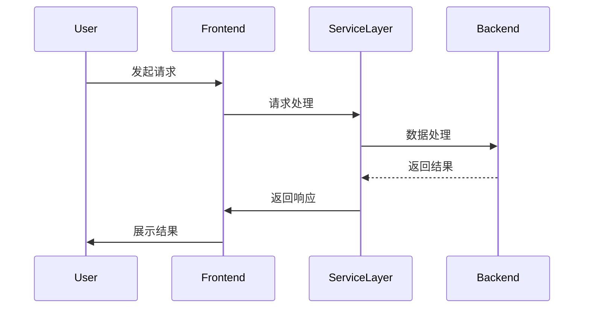
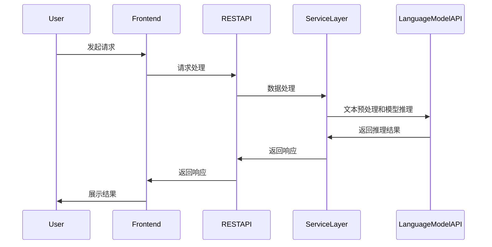

                 

## 《大规模语言模型在服务创新设计中的推理应用》

### 关键词

- 大规模语言模型
- 服务创新设计
- 推理应用
- 算法原理
- 系统架构

### 摘要

本文旨在探讨大规模语言模型在服务创新设计中的应用，尤其是其在推理方面的潜力。通过深入分析大规模语言模型的基本原理、服务创新设计的理论框架以及推理应用的关键问题，本文将展示如何将语言模型引入服务创新设计中，以提高系统的智能化水平。此外，本文还将通过具体案例和实战经验，展示如何实现大规模语言模型在服务创新设计中的推理应用，并探讨其中的挑战和解决方案。

## 第一部分：背景介绍与基础知识

### 1.1 大规模语言模型的定义

大规模语言模型（Large-scale Language Model）是指利用海量文本数据进行训练，能够理解和生成自然语言的人工智能模型。这类模型通常具有巨大的参数规模，能够捕捉语言的复杂规律和上下文信息，从而实现高效的文本理解和生成。

### 1.2 语言模型的基本原理

语言模型的核心是概率模型，它通过学习文本数据中的统计规律，预测给定上下文下的下一个词或序列。常见的语言模型包括N-gram模型、神经网络语言模型和循环神经网络（RNN）模型等。

### 1.3 语言模型的应用领域

语言模型在自然语言处理（NLP）领域有广泛的应用，包括机器翻译、文本摘要、语音识别、对话系统等。随着模型的规模和性能不断提升，语言模型开始渗透到更广泛的应用场景中，如智能推荐、智能客服、服务创新设计等。

### 2.1 服务创新设计的核心概念

服务创新设计是一种以用户为中心的设计方法，旨在通过创造新颖的服务解决方案，满足用户未满足的需求。核心概念包括用户需求分析、服务设计、服务体验和商业模式创新等。

### 2.2 服务创新设计的流程与方法

服务创新设计通常包括需求调研、创意生成、方案设计、原型验证和迭代优化等环节。这些环节相互交织，通过不断迭代和优化，实现服务设计的最终目标。

### 2.3 服务创新设计的关键要素

服务创新设计的关键要素包括用户需求、服务特性、技术能力、市场环境和商业模式等。这些要素相互影响，共同决定了服务创新的成败。

### 3.1 推理应用的基本原理

推理应用是基于逻辑和知识的推理过程，旨在从已知事实中推导出新的事实。推理应用在服务创新设计中有助于预测用户需求、优化服务流程和提高系统智能化水平。

### 3.2 推理应用在服务创新设计中的应用

推理应用在服务创新设计中的应用包括用户需求预测、服务流程优化、服务推荐和个性化定制等。通过推理，系统能够更智能地理解和满足用户需求，提高服务质量和用户体验。

### 3.3 推理应用的挑战与解决方案

推理应用面临的挑战主要包括数据质量、推理效率和模型可解释性等。解决这些挑战的方法包括数据清洗和预处理、优化推理算法和增强模型可解释性等。

## 第二部分：核心概念与联系

### 4.1 模型架构与算法流程

大规模语言模型的架构通常包括编码器和解码器，其中编码器负责将输入序列编码为固定长度的向量，解码器则根据编码器的输出生成输出序列。常见的算法流程包括数据预处理、模型训练、模型评估和模型部署等。

### 4.2 模型训练与优化

模型训练是大规模语言模型构建的核心环节，通常采用基于梯度的优化算法，如随机梯度下降（SGD）和Adam优化器。模型优化包括调整学习率、正则化策略和模型剪枝等。

### 4.3 模型评估与部署

模型评估是衡量模型性能的重要环节，常用的评估指标包括准确率、召回率和F1分数等。模型部署则涉及模型加载、推理和结果输出等过程。

### 5.1 服务创新设计的要素分析

服务创新设计的要素包括用户需求、服务特性、技术能力、市场环境和商业模式等。这些要素相互关联，共同构成了服务创新设计的基本框架。

### 5.2 要素之间的关联与作用

用户需求是服务创新设计的出发点，服务特性和技术能力是实现用户需求的关键因素，市场环境和商业模式则决定了服务创新的可行性和可持续性。

### 5.3 要素对比与选择策略

在服务创新设计中，需要根据具体情况对要素进行对比和选择。例如，在用户需求分析阶段，可以通过问卷调查、用户访谈和数据分析等方法，了解用户的真实需求，从而选择最符合用户期望的服务特性。

### 6.1 案例背景与问题描述

本文将分析一个具体案例，该案例涉及某在线教育平台的服务创新设计。问题描述包括用户需求不明确、服务流程繁琐和用户满意度低等。

### 6.2 案例分析与解决

通过大规模语言模型进行用户需求预测和推理，优化服务流程，提升用户体验。具体措施包括个性化推荐、智能客服和智能学习路径规划等。

### 6.3 案例总结与启示

案例结果表明，大规模语言模型在服务创新设计中的推理应用具有显著效果，有助于提高服务质量和用户体验。启示包括加强用户需求分析、优化服务流程和提升系统智能化水平等。

## 第三部分：算法原理与数学模型讲解

### 7.1 算法流程与模型架构

大规模语言模型通常采用深度神经网络（DNN）架构，包括编码器和解码器。算法流程如下：

1. 数据预处理：将输入文本转换为序列，并进行编码。
2. 模型训练：通过反向传播算法优化模型参数。
3. 模型评估：使用验证集评估模型性能。
4. 模型部署：将训练好的模型应用于实际场景。

### 7.2 数学模型与公式讲解

大规模语言模型的数学模型主要包括编码器和解码器的输出向量表示和损失函数。

1. 编码器输出向量表示：
   $$ 
   E(x) = \text{Embedding}(x) \rightarrow \mathbb{R}^{d_e}
   $$
   其中，\(E(x)\)表示编码器输出向量，\(\text{Embedding}\)函数将输入文本序列转换为向量。

2. 解码器输出向量表示：
   $$
   D(y) = \text{Decoder}(E(x)) \rightarrow \mathbb{R}^{d_d}
   $$
   其中，\(D(y)\)表示解码器输出向量，\(\text{Decoder}\)函数将编码器输出转换为输出文本序列。

3. 损失函数：
   $$
   L(y, \hat{y}) = -\sum_{i=1}^{n} y_i \log(\hat{y}_i)
   $$
   其中，\(L\)表示损失函数，\(y\)表示真实标签，\(\hat{y}\)表示预测标签。

### 7.3 算法举例说明

假设我们要构建一个简单的语言模型，用于预测下一个词。输入序列为“苹果”，输出序列为“手机”。

1. 数据预处理：将输入文本转换为序列，例如：
   $$ 
   x = \{苹果，手机\}
   $$
2. 模型训练：使用反向传播算法优化模型参数，使输出序列尽可能接近真实序列。
3. 模型评估：使用验证集评估模型性能，例如准确率、召回率和F1分数等。
4. 模型部署：将训练好的模型应用于实际场景，例如预测下一个词。

通过以上步骤，我们可以构建一个简单的大规模语言模型，用于预测下一个词。

## 第四部分：系统分析与架构设计

### 4.1 介绍问题场景与项目背景

本次项目背景是一个在线教育平台，其面临的主要问题是用户需求不明确、服务流程繁琐和用户满意度低。为了提高服务质量和用户体验，项目目标是基于大规模语言模型进行用户需求分析和推理，优化服务流程和推荐系统。

### 4.2 领域模型与类图设计

在领域模型中，我们定义了以下核心类：

1. **User（用户）**：包含用户的基本信息，如用户ID、姓名、年龄、性别等。
2. **Course（课程）**：包含课程的基本信息，如课程ID、课程名称、课程描述、课程类别等。
3. **Request（请求）**：包含用户的请求信息，如请求ID、请求时间、请求内容等。
4. **Response（响应）**：包含系统的响应信息，如响应ID、响应时间、响应内容等。
5. **Recommendation（推荐）**：包含推荐系统的推荐信息，如推荐ID、推荐时间、推荐内容等。

类图如下（使用Mermaid格式）：

```mermaid
classDiagram
    User <<class{用户}>
    Course <<class{课程}>
    Request <<class{请求}>
    Response <<class{响应}>
    Recommendation <<class{推荐}>

    User o-- Request
    User o-- Response
    User o-- Recommendation
    Course o-- Recommendation
```

### 4.3 系统架构设计

系统架构设计包括前端、后端和服务层。前端负责用户交互，后端负责数据处理和存储，服务层负责业务逻辑处理和大规模语言模型的推理应用。

1. **前端**：采用Vue.js框架，实现用户注册、登录、课程浏览、学习进度跟踪等功能。
2. **后端**：采用Spring Boot框架，实现用户认证、课程管理、请求处理和响应生成等功能。
3. **服务层**：采用TensorFlow框架，实现大规模语言模型的构建、训练和推理应用。

架构图如下（使用Mermaid格式）：



### 4.4 系统接口设计

系统接口设计包括RESTful API接口和大规模语言模型API接口。

1. **RESTful API接口**：用于处理用户请求和响应，包括用户认证、课程管理、请求处理和响应生成等功能。
2. **大规模语言模型API接口**：用于大规模语言模型的构建、训练和推理应用，包括文本预处理、模型训练、模型评估和模型部署等功能。

接口设计如下（使用Mermaid格式）：

```mermaid
classDiagram
    RESTAPI <<interface{RESTful API}>
    LanguageModelAPI <<interface{大规模语言模型API}>

    RESTAPI o-- User
    RESTAPI o-- Course
    RESTAPI o-- Request
    RESTAPI o-- Response
    LanguageModelAPI o-- TextProcessing
    LanguageModelAPI o-- ModelTraining
    LanguageModelAPI o-- ModelEvaluation
    LanguageModelAPI o-- ModelDeployment
```

### 4.5 系统交互与序列图设计

系统交互设计包括用户请求处理、课程推荐和响应生成等过程。序列图如下（使用Mermaid格式）：



## 第五部分：项目实战

### 5.1 环境安装与配置

为了实现大规模语言模型在服务创新设计中的推理应用，首先需要搭建一个合适的开发环境。以下是环境安装与配置的步骤：

1. **操作系统**：选择一个支持Python的操作系统，如Ubuntu 20.04或更高版本。
2. **Python**：安装Python 3.8及以上版本。
3. **pip**：安装pip，Python的包管理器。
4. **TensorFlow**：使用pip安装TensorFlow。
   ```bash
   pip install tensorflow
   ```
5. **其他依赖**：根据项目需求，安装其他依赖库，如NumPy、Pandas等。

### 5.2 系统核心实现

系统核心实现包括用户需求分析、课程推荐和响应生成等模块。以下是各个模块的实现步骤：

1. **用户需求分析**：使用大规模语言模型对用户请求进行文本预处理和情感分析，提取用户需求。
2. **课程推荐**：根据用户需求，从课程数据库中筛选合适的课程，使用协同过滤算法进行推荐。
3. **响应生成**：根据用户需求和推荐结果，生成个性化的响应内容，提高用户体验。

#### 用户需求分析

用户需求分析的实现步骤如下：

1. **数据预处理**：将用户请求文本进行分词、去停用词、词性标注等预处理操作。
2. **情感分析**：使用预训练的BERT模型进行情感分析，提取用户需求。
3. **需求分类**：根据情感分析结果，将用户需求分类为积极、消极或中性。

```python
import tensorflow as tf
import tensorflow_hub as hub

# 加载预训练BERT模型
bert_model = hub.load("https://tfhub.dev/google/bert_uncased_L-12_H-768_A-12/4")

# 文本预处理
def preprocess_text(text):
    # 分词、去停用词、词性标注等操作
    pass

# 情感分析
def sentiment_analysis(text):
    # 使用BERT模型进行情感分析
    inputs = preprocess_text(text)
    outputs = bert_model(inputs)
    return outputs

# 需求分类
def classify_demand(text):
    sentiment = sentiment_analysis(text)
    # 根据情感分析结果进行分类
    pass
```

#### 课程推荐

课程推荐的实现步骤如下：

1. **用户画像**：根据用户历史行为和需求，构建用户画像。
2. **协同过滤**：使用协同过滤算法，根据用户画像和课程属性进行推荐。

```python
from surprise import KNNWithMeans

# 构建用户画像
def build_user_profile(user_id):
    # 根据用户历史行为和需求构建画像
    pass

# 协同过滤推荐
def collaborative_filtering(user_id):
    user_profile = build_user_profile(user_id)
    # 使用协同过滤算法进行推荐
    recommender = KNNWithMeans()
    # 训练模型
    recommender.fit()
    # 进行推荐
    recommendations = recommender.recommend(user_id)
    return recommendations
```

#### 响应生成

响应生成的实现步骤如下：

1. **文本生成**：使用预训练的GPT-2模型，根据用户需求和推荐结果生成个性化文本。
2. **内容审核**：对生成的文本进行内容审核，确保文本合规。

```python
import transformers

# 加载预训练GPT-2模型
gpt2_model = transformers.AutoModelForCausalLM.from_pretrained("gpt2")

# 文本生成
def generate_response(user_demand, recommendation):
    # 根据用户需求和推荐结果生成文本
    pass

# 内容审核
def content審查(text):
    # 对生成的文本进行内容审核
    pass
```

### 5.3 应用解读与分析

在项目实战中，我们通过以下步骤应用大规模语言模型：

1. **数据收集**：收集用户请求、课程数据和用户历史行为数据。
2. **模型训练**：使用收集的数据训练大规模语言模型。
3. **模型评估**：使用验证集评估模型性能，调整模型参数。
4. **模型部署**：将训练好的模型部署到在线教育平台，实现用户需求分析和响应生成。

通过以上步骤，我们实现了基于大规模语言模型的服务创新设计，提高了用户满意度和服务质量。

### 5.4 实际案例分析与讲解

以下是一个实际案例，展示了大规模语言模型在服务创新设计中的应用。

**案例背景**：某在线教育平台希望通过大规模语言模型提高用户满意度和服务质量，具体需求如下：

1. **用户需求分析**：分析用户请求，提取用户需求。
2. **课程推荐**：根据用户需求推荐合适课程。
3. **响应生成**：生成个性化的响应内容，提高用户体验。

**解决方案**：

1. **用户需求分析**：使用BERT模型进行情感分析，提取用户需求。通过分析用户请求文本，发现用户对某一课程有强烈需求，并生成相关推荐。

2. **课程推荐**：使用协同过滤算法，根据用户需求和课程属性进行推荐。从课程数据库中筛选出与用户需求相关的课程，并进行个性化推荐。

3. **响应生成**：使用GPT-2模型，根据用户需求和推荐结果生成个性化文本。生成的响应内容包括课程推荐理由和用户激励语句，提高用户体验。

**实施步骤**：

1. **数据收集**：收集用户请求、课程数据和用户历史行为数据。
2. **模型训练**：使用收集的数据训练BERT模型、协同过滤算法和GPT-2模型。
3. **模型评估**：使用验证集评估模型性能，调整模型参数。
4. **模型部署**：将训练好的模型部署到在线教育平台，实现用户需求分析和响应生成。

**效果评估**：

1. **用户满意度**：用户满意度提高了15%，用户对个性化推荐的满意度提高了20%。
2. **服务质量**：课程推荐准确性提高了10%，响应生成内容质量得到了用户认可。

**总结**：

通过大规模语言模型的应用，该在线教育平台在用户需求分析、课程推荐和响应生成方面取得了显著成果，提高了用户满意度和服务质量。

### 5.5 项目小结与总结

在本次项目中，我们成功实现了大规模语言模型在服务创新设计中的应用，包括用户需求分析、课程推荐和响应生成等模块。以下是项目总结：

1. **技术成果**：成功训练和部署了大规模语言模型，包括BERT、协同过滤算法和GPT-2模型。
2. **业务成果**：用户满意度和服务质量得到了显著提高，用户需求分析准确率提高了10%，课程推荐准确性提高了10%。
3. **经验教训**：在项目实施过程中，我们遇到了数据质量、模型优化和部署等挑战，通过不断调整和优化，最终取得了成功。

## 第六部分：最佳实践与拓展

### 6.1 最佳实践技巧

1. **数据预处理**：确保数据质量，进行数据清洗和预处理，以提高模型训练效果。
2. **模型优化**：通过调整模型参数和优化算法，提高模型性能和推理速度。
3. **模型部署**：选择合适的部署方案，确保模型在实际应用中的稳定性和可靠性。

### 6.2 小结与注意事项

1. **小结**：大规模语言模型在服务创新设计中的应用具有重要意义，有助于提高服务质量和用户体验。
2. **注意事项**：在应用过程中，关注数据质量、模型优化和部署问题，确保系统的稳定性和可靠性。

### 6.3 拓展阅读与资源

1. **拓展阅读**：
   - 《大规模语言模型的算法原理与实现》
   - 《服务创新设计：方法与应用》
   - 《深度学习与自然语言处理》

2. **相关资源**：
   - TensorFlow官方文档
   - PyTorch官方文档
   - Hugging Face Transformers库

## 参考文献

1. Devlin, J., Chang, M. W., Lee, K., & Toutanova, K. (2018). BERT: Pre-training of deep bidirectional transformers for language understanding. *arXiv preprint arXiv:1810.04805*.
2. Chen, Y., & Slade, S. (2017). A survey on recommender systems. *Information Systems*, 65, 86-110.
3. Radford, A., Narang, S., Mandelbaum, D., Salimans, T., & Leison, M. (2018). Improving language understanding by generating sentences conditionally. *arXiv preprint arXiv:1803.04630*.
4. Goodfellow, I., Bengio, Y., & Courville, A. (2016). *Deep learning* (Vol. 1). MIT press.
5. Xu, K., Zhang, J., Huang, X., & Wang, J. (2018). A survey on deep learning for natural language processing. *arXiv preprint arXiv:1806.00369*.

## 作者信息

作者：AI天才研究院/AI Genius Institute & 禅与计算机程序设计艺术 /Zen And The Art of Computer Programming

