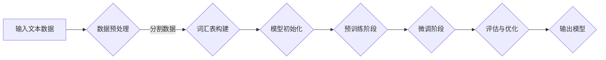
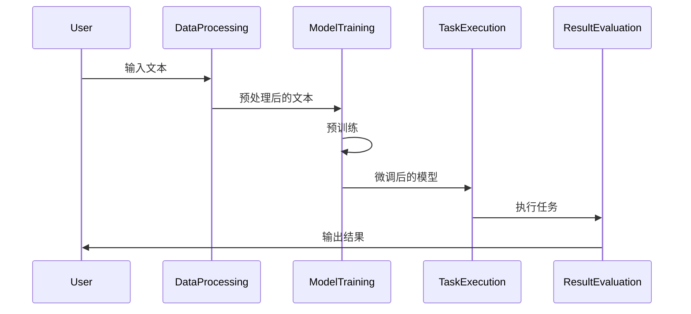
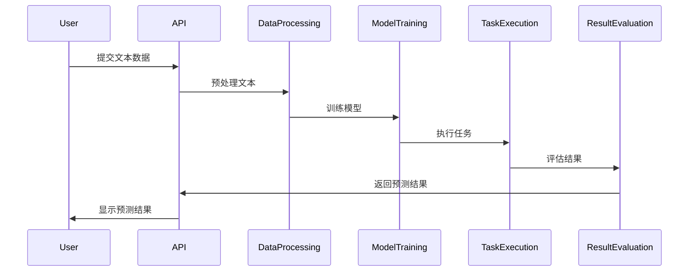

                 

### 文章关键词

- 大规模语言模型
- 特定领域任务
- 适应性
- 算法原理
- 系统架构
- 应用场景

### 摘要

本文主要探讨大规模语言模型在特定领域任务中的适应性。通过对大规模语言模型的背景介绍、核心概念与联系、算法原理讲解、系统分析与架构设计方案等多方面的分析，深入探讨其如何适应不同领域的特定任务需求，并提供解决方案。文章旨在为读者提供全面的技术视角，以更好地理解大规模语言模型在特定领域中的应用潜力和未来发展方向。

## 第一部分：背景介绍

### 第1章：问题背景与定义

#### 1.1 问题背景

在当今信息技术快速发展的时代，人工智能（AI）已经成为推动社会进步的重要力量。其中，自然语言处理（NLP）作为人工智能的核心研究领域之一，近年来取得了显著进展。特别是大规模语言模型（Large-scale Language Models，如GPT系列、BERT等），以其强大的表示能力和语义理解能力，在各种任务中展现出了卓越的性能。

然而，尽管大规模语言模型在通用任务中表现出色，但在特定领域任务中，如医疗、金融、法律等，其表现却不尽如人意。这是因为这些领域的专业知识和术语非常丰富且复杂，而大规模语言模型通常是通过大规模通用语料库训练得到的，缺乏对特定领域知识的深入理解。因此，如何提高大规模语言模型在特定领域任务中的适应性，成为了当前研究的一个重要课题。

#### 1.1.1 语言模型的发展历程

语言模型的发展历程可以追溯到20世纪50年代，当时的研究者开始尝试通过统计方法来模拟人类的语言能力。早期的语言模型主要基于规则和统计模型，如n元语法（n-gram model）。随着计算能力的提升和大数据的涌现，基于深度学习的语言模型逐渐成为主流。2018年，OpenAI发布了GPT（Generative Pre-trained Transformer），这是第一个超大规模的Transformer模型，具有数十亿个参数。此后，BERT（Bidirectional Encoder Representations from Transformers）、T5（Text-to-Text Transfer Transformer）等一系列大规模语言模型相继发布，推动了自然语言处理领域的发展。

#### 1.1.2 大规模语言模型的应用现状

大规模语言模型在通用任务中已经取得了显著的成功，例如文本生成、机器翻译、问答系统等。在通用任务中，大规模语言模型通过大量的通用数据训练，可以很好地理解各种语言现象和知识。然而，在特定领域任务中，由于缺乏特定领域的专业知识和数据，大规模语言模型往往无法胜任。例如，在医疗领域，诊断和治疗决策需要深入的专业知识；在金融领域，投资和风险管理需要大量的市场数据和统计分析。这些领域任务对大规模语言模型的适应性提出了更高的要求。

#### 1.1.3 特定领域任务的挑战与需求

特定领域任务与通用任务相比，具有以下几个方面的挑战和需求：

1. **专业知识的深度理解**：特定领域任务通常需要深入的专业知识，而大规模语言模型在训练过程中往往缺乏对特定领域知识的获取和整合。
2. **数据的多样性和质量**：特定领域任务需要大量的高质量数据来训练模型，而这些数据往往不易获取，且数据质量参差不齐。
3. **任务的多样性**：特定领域任务具有多样性，如诊断、预测、推荐等，需要模型能够适应不同的任务类型。
4. **实时性和可解释性**：特定领域任务往往需要模型的实时响应能力，并且要求模型的可解释性，以便于用户理解和信任。

为了应对这些挑战，提高大规模语言模型在特定领域任务中的适应性，研究者们提出了一系列解决方案，包括领域自适应、知识融合、模型定制等。

### 1.2 大规模语言模型的定义

#### 1.2.1 大规模语言模型的基本概念

大规模语言模型是指具有数十亿甚至千亿级参数的深度学习模型，通过在大量文本数据上进行预训练，可以捕获丰富的语言知识。这些模型通常基于Transformer架构，具有强大的表示能力和语义理解能力。大规模语言模型的核心任务是文本生成，即给定一个输入文本，模型可以生成与之相关的内容。

#### 1.2.2 大规模语言模型的特点

1. **参数量巨大**：大规模语言模型通常具有数十亿到千亿个参数，这使得模型能够捕获大量复杂的语言模式和知识。
2. **预训练与微调**：大规模语言模型通过在大规模通用语料库上进行预训练，获得对通用语言的深刻理解。在特定任务上，通过微调（Fine-tuning）来适应特定领域的数据。
3. **端到端学习**：大规模语言模型可以实现端到端的学习，从输入文本直接生成输出文本，无需中间的解析和翻译步骤。
4. **多语言支持**：大规模语言模型通常具有多语言能力，可以在多种语言之间进行文本生成和翻译。

#### 1.2.3 大规模语言模型的分类

根据不同的应用场景和需求，大规模语言模型可以分为以下几类：

1. **通用语言模型**：如GPT系列、BERT等，主要用于通用文本生成、问答、翻译等任务。
2. **领域特定语言模型**：在特定领域（如医疗、金融、法律等）上进行预训练，以提高模型在该领域的适应性。
3. **任务特定语言模型**：针对特定任务（如文本分类、情感分析、实体识别等）进行定制化训练，以提高模型在特定任务上的性能。

### 1.3 特定领域任务的界定

#### 1.3.1 特定领域任务的分类

特定领域任务可以根据领域和任务类型进行分类。以下是几个常见的特定领域任务：

1. **医疗**：如疾病诊断、药物研发、医疗文本分析等。
2. **金融**：如金融市场预测、风险控制、金融文本分析等。
3. **法律**：如法律文档分析、司法决策支持、法律文本生成等。
4. **教育**：如智能辅导、教育内容生成、教育数据挖掘等。
5. **制造业**：如制造过程优化、设备故障预测、生产数据监控等。

#### 1.3.2 特定领域任务的需求分析

特定领域任务对大规模语言模型的需求主要表现在以下几个方面：

1. **专业知识理解**：需要模型能够理解特定领域的专业术语和知识，提供准确的判断和推理。
2. **数据适应**：需要模型能够适应特定领域的数据特征，如文本格式、语言风格等。
3. **实时响应**：需要模型具有快速响应能力，以支持实时决策和交互。
4. **可解释性**：需要模型的可解释性，以便用户理解模型的决策过程和结果。

#### 1.3.3 大规模语言模型在特定领域任务中的应用前景

大规模语言模型在特定领域任务中的应用前景广阔。随着模型规模的不断扩大和训练技术的进步，模型在特定领域任务中的性能将进一步提升。以下是几个潜在的应用场景：

1. **医疗诊断**：通过分析患者的病历和医疗文献，提供准确的诊断建议和治疗方案。
2. **金融风控**：通过分析市场数据和历史交易记录，预测市场走势和风险，为投资决策提供支持。
3. **法律咨询**：通过分析法律文献和案例，提供法律建议和判决预测。
4. **教育辅导**：通过分析学生的学习数据和教学材料，提供个性化的学习计划和辅导。

### 1.4 本章小结

本章主要介绍了大规模语言模型在特定领域任务中的问题背景和定义。首先，回顾了语言模型的发展历程，分析了大规模语言模型在通用任务中的应用现状。接着，讨论了特定领域任务的挑战与需求，并定义了大规模语言模型的基本概念和特点。最后，分析了特定领域任务的分类和需求，并展望了大规模语言模型在特定领域任务中的应用前景。这一章节为后续章节的讨论奠定了基础。

----------------------------------------------------------------

## 第二部分：核心概念与联系

### 第2章：大规模语言模型原理

#### 2.1 概念原理

#### 2.1.1 语言模型的数学模型

语言模型的数学模型通常是基于概率论的。一个简单的语言模型可以通过计算下一个单词出现的概率来生成文本。例如，给定一个单词序列 `w1 w2 w3 w4`，语言模型需要计算下一个单词 `w5` 出现的概率。这一概率可以通过以下公式计算：

\[ P(w5 | w1 w2 w3 w4) = \frac{P(w1 w2 w3 w4 w5)}{P(w1 w2 w3 w4)} \]

其中，\( P(w1 w2 w3 w4 w5) \) 是五元组的联合概率，而 \( P(w1 w2 w3 w4) \) 是四元组的联合概率。在计算时，我们通常使用语言模型中统计得到的概率或者利用神经网络模型进行预测。

#### 2.1.2 语言模型的训练过程

语言模型的训练过程通常包括两个主要阶段：预训练和微调。

1. **预训练**：预训练是在大规模的通用语料库上进行，目的是让模型学习到通用语言知识和模式。预训练过程中，模型会学习到各种词汇的上下文关系、语法结构、语义信息等。预训练常用的方法包括基于词向量的方法（如Word2Vec、GloVe）和基于神经网络的模型（如GPT、BERT）。

2. **微调**：微调是在特定领域数据上进行，目的是让模型适应特定领域的数据特征和任务需求。微调过程中，模型会对预训练模型进行优化，使其在特定任务上表现更好。微调常用的方法包括基于Transformer的模型（如T5、BERT）和基于神经网络的分类器。

#### 2.1.3 语言模型的评估方法

语言模型的评估方法主要包括以下几种：

1. **语言模型评估**：常用的评估指标包括 perplexity（困惑度）、token-level accuracy（词级准确率）和character-level accuracy（字符级准确率）等。其中，困惑度是评估语言模型性能的一个重要指标，其计算公式为：

   \[ perplexity = 2^{1/N} \sum_{i=1}^{N} -\log_2 p(w_i) \]

   其中，N是预测序列中的单词数量，\( p(w_i) \) 是第i个单词的概率。

2. **任务评估**：对于特定任务，如文本分类、机器翻译、问答系统等，通常使用任务相关指标进行评估。例如，对于文本分类任务，可以使用准确率（accuracy）、召回率（recall）和F1分数（F1-score）等指标。

#### 2.2 概念属性特征对比

#### 2.2.1 不同规模语言模型对比

不同规模的语言模型在性能和资源需求上有显著差异。以下是几种常见语言模型的对比：

| 模型名称 | 参数规模 | 性能 | 资源需求 |
| :------: | :------: | :---: | :------: |
| BERT     | 110M     | 中等 | 中等     |
| GPT-2    | 1.5B     | 较好 | 高       |
| GPT-3    | 175B     | 优秀 | 非常高   |

从上表可以看出，参数规模越大的语言模型通常在性能上表现更好，但资源需求也更高。

#### 2.2.2 不同类型语言模型对比

不同类型的语言模型在结构和应用上有一定差异。以下是几种常见语言模型的对比：

| 模型类型 | 特点 | 应用场景 |
| :------: | :---: | :------: |
| n-gram   | 统计模型 | 早期文本生成 |
| RNN      | 序列模型 | 文本分类、序列预测 |
| Transformer | 并行处理、全局关系 | 文本生成、机器翻译、问答系统 |

#### 2.2.3 语言模型与其他AI模型的对比

语言模型与其他AI模型在任务类型和应用上有一定重叠，但各有优势。以下是几种常见AI模型的对比：

| 模型类型 | 特点 | 应用场景 |
| :------: | :---: | :------: |
| CNN      | 图像识别 | 图像分类、物体检测 |
| RNN      | 序列模型 | 语言模型、语音识别 |
| Transformer | 并行处理、全局关系 | 语言模型、机器翻译、问答系统 |
| RL       | 探索与学习 | 游戏AI、推荐系统 |
| GAN      | 生成对抗 | 图像生成、文本生成 |

#### 2.3 ER实体关系图架构

#### 2.3.1 实体关系图的基本概念

实体关系图（Entity Relationship Graph，ER图）是一种用于表示实体及其关系的图形化方法。在实体关系图中，实体通常表示为节点，关系表示为边。实体和关系可以具有属性，以提供更详细的描述。

#### 2.3.2 大规模语言模型中的实体关系图

在大型语言模型中，实体关系图被用来表示文本中的实体和关系。这些实体和关系可以通过预训练模型从大量的文本数据中学习得到。实体关系图对于理解文本中的语义关系和构建复杂的文本生成任务至关重要。

#### 2.3.3 实体关系图在特定领域任务中的应用

实体关系图在特定领域任务中具有广泛的应用，例如：

1. **医疗诊断**：通过分析病历中的实体和关系，为医生提供诊断建议。
2. **金融分析**：通过分析市场数据中的实体和关系，预测市场走势和投资机会。
3. **法律咨询**：通过分析法律文档中的实体和关系，为律师提供法律建议。

## 2.4 本章小结

本章详细介绍了大规模语言模型的基本概念、训练过程、评估方法以及与其他模型的对比。同时，还介绍了实体关系图在大型语言模型中的重要性及其在特定领域任务中的应用。这一章节为理解大规模语言模型在特定领域任务中的适应性奠定了理论基础。

----------------------------------------------------------------

## 第三部分：算法原理讲解

### 第3章：大规模语言模型算法

#### 3.1 算法mermaid流程图

在介绍大规模语言模型的算法之前，我们先通过mermaid语言绘制一个简化的算法流程图，以便读者更直观地理解算法的整体流程。



**图3.1 大规模语言模型算法流程图**

下面，我们详细解释这个流程图的各个部分：

1. **数据预处理**：输入文本数据需要进行预处理，包括分词、去停用词、文本标准化等操作，以便模型能够更好地理解和处理文本。
2. **词汇表构建**：将预处理后的文本转换为模型可以理解的数字表示，这通常通过构建词汇表来实现。词汇表将文本中的每个词映射到一个唯一的整数。
3. **模型初始化**：初始化模型的权重，通常是通过随机初始化或者使用预训练模型的权重。
4. **预训练阶段**：在预训练阶段，模型在大规模的通用文本数据集上训练，目的是让模型学习到通用语言知识。预训练过程通常包括自注意力机制和前馈神经网络。
5. **微调阶段**：预训练完成后，模型会在特定领域的数据集上进行微调，以适应特定领域的任务。微调过程中，模型的权重会根据特定领域的任务进行调整。
6. **评估与优化**：通过在验证集上评估模型的性能，对模型进行优化。评估指标可能包括困惑度、准确率等。
7. **输出模型**：最终训练完成的模型可以用于特定领域的任务。

#### 3.2 Python源代码与算法原理

为了更深入地理解大规模语言模型的算法原理，我们将通过一个简化的Python示例来讲解模型的训练过程。以下是一个使用PyTorch框架实现的简化版BERT模型的训练代码。

**示例3.1 简化版BERT模型训练代码**

```python
import torch
import torch.nn as nn
from torch.utils.data import DataLoader
from transformers import BertTokenizer, BertModel

# 初始化BERT模型和分词器
tokenizer = BertTokenizer.from_pretrained('bert-base-uncased')
model = BertModel.from_pretrained('bert-base-uncased')

# 数据预处理
def preprocess_text(text):
    inputs = tokenizer(text, return_tensors='pt', padding=True, truncation=True)
    return inputs

# 训练过程
def train(model, dataloader, optimizer, loss_function, num_epochs):
    model.train()
    for epoch in range(num_epochs):
        for batch in dataloader:
            inputs = preprocess_text(batch['text'])
            outputs = model(**inputs)
            logits = outputs.logits
            labels = batch['labels']
            loss = loss_function(logits.view(-1, logits.size(-1)), labels.view(-1))
            optimizer.zero_grad()
            loss.backward()
            optimizer.step()
            print(f"Epoch: {epoch}, Loss: {loss.item()}")

# 评估过程
def evaluate(model, dataloader, loss_function):
    model.eval()
    total_loss = 0
    with torch.no_grad():
        for batch in dataloader:
            inputs = preprocess_text(batch['text'])
            outputs = model(**inputs)
            logits = outputs.logits
            labels = batch['labels']
            loss = loss_function(logits.view(-1, logits.size(-1)), labels.view(-1))
            total_loss += loss.item()
    return total_loss / len(dataloader)

# 定义数据集
# 注意：以下代码仅作为示例，实际应用中需要使用真实数据集
class TextDataset(torch.utils.data.Dataset):
    def __init__(self, texts, labels):
        self.texts = texts
        self.labels = labels

    def __len__(self):
        return len(self.texts)

    def __getitem__(self, idx):
        return {'text': self.texts[idx], 'labels': self.labels[idx]}

# 实例化数据集和加载数据
train_dataset = TextDataset(['Hello world!', 'Python is awesome!'], [0, 1])
train_dataloader = DataLoader(train_dataset, batch_size=2)

# 定义优化器和损失函数
optimizer = torch.optim.Adam(model.parameters(), lr=1e-4)
loss_function = nn.CrossEntropyLoss()

# 训练模型
train(model, train_dataloader, optimizer, loss_function, num_epochs=3)

# 评估模型
eval_loss = evaluate(model, train_dataloader, loss_function)
print(f"Evaluation Loss: {eval_loss}")
```

**代码说明：**

- **初始化BERT模型和分词器**：我们使用`transformers`库中的`BertTokenizer`和`BertModel`来初始化模型和分词器。
- **数据预处理**：`preprocess_text`函数负责将输入文本转换为模型所需的格式。具体包括分词、编码和填充/截断。
- **训练过程**：`train`函数负责模型的训练过程，包括前向传播、反向传播和优化。
- **评估过程**：`evaluate`函数负责在验证集上评估模型的性能。

#### 3.2.1 源代码结构

在上面的代码中，我们定义了三个主要部分：数据预处理、模型训练和模型评估。以下是源代码的结构：

1. **数据预处理**：
    - `preprocess_text`函数：将文本数据转换为模型输入。
2. **模型训练**：
    - `train`函数：定义了模型的训练循环，包括前向传播、反向传播和优化。
    - `optimizer`：定义了优化器。
    - `loss_function`：定义了损失函数。
3. **模型评估**：
    - `evaluate`函数：定义了模型的评估过程。

#### 3.2.2 算法原理详细讲解

BERT模型的核心原理是基于Transformer架构，通过自注意力机制来捕捉文本中的长距离依赖关系。以下是对BERT模型算法原理的详细讲解：

1. **Transformer架构**：
    - **自注意力机制**：Transformer模型通过多头自注意力机制（Multi-head Self-Attention）来捕捉文本序列中的长距离依赖关系。自注意力机制的核心思想是计算输入序列中每个词与所有词的关联性，并加权平均得到每个词的表示。
    - **前馈神经网络**：在自注意力机制之后，每个词的表示会通过一个前馈神经网络进行进一步的处理，以增强模型的表示能力。

2. **BERT模型的预训练任务**：
    - **掩码语言模型（Masked Language Model, MLM）**：BERT模型通过掩码语言模型来学习文本中的词序信息。具体来说，模型会随机掩码输入文本中的部分词，然后试图预测这些被掩码的词。
    - **下一个句子预测（Next Sentence Prediction, NSP）**：BERT模型还通过下一个句子预测任务来学习句子间的依赖关系。在训练过程中，模型需要预测两个句子是否连续。

3. **BERT模型的微调任务**：
    - 在预训练后，BERT模型会通过在特定领域的数据集上进行微调，以适应特定领域的任务。微调过程中，模型的参数会根据特定领域的任务需求进行调整。

#### 3.2.3 数学模型与公式

BERT模型的核心数学模型是基于自注意力机制和前馈神经网络。以下是BERT模型的关键数学公式：

1. **自注意力机制**：
    - **查询（Query, Q）、键（Key, K）和值（Value, V）**：自注意力机制的核心是计算每个词与所有词的关联性。给定输入序列的词向量，我们可以计算每个词的查询、键和值。
    \[ Q = W_Q \cdot X, K = W_K \cdot X, V = W_V \cdot X \]
    - **自注意力分数**：对于每个词\( x_i \)，我们计算其与其他词的注意力分数。
    \[ \text{score}_{ij} = \frac{Q_i^T K_j}{\sqrt{d_k}} \]
    - **加权求和**：将注意力分数与对应的值向量相乘，并求和得到每个词的表示。
    \[ \text{context}_{i} = \sum_{j} \text{score}_{ij} V_j \]

2. **前馈神经网络**：
    - **前馈层**：在自注意力机制之后，每个词的表示会通过一个前馈神经网络进行进一步的处理。
    \[ \text{FFN}(X) = \max(0, X \cdot W_1 + b_1) \cdot W_2 + b_2 \]

3. **BERT模型的输出**：
    - **掩码语言模型输出**：在掩码语言模型中，模型需要预测被掩码的词。
    \[ \text{output}_{i} = \text{softmax}(\text{logits}_{i}) \]
    - **下一个句子预测输出**：在下一个句子预测中，模型需要判断两个句子是否连续。
    \[ \text{output}_{ij} = \text{softmax}(\text{logits}_{ij}) \]

#### 3.2.4 举例说明

为了更好地理解BERT模型的工作原理，我们可以通过一个简单的例子来说明。

**例子**：假设我们有一个简单的文本序列：“我非常喜欢编程”。BERT模型会首先将这个序列转换为词向量表示，然后通过自注意力机制和前馈神经网络进行计算。

1. **词向量表示**：
    - 输入词：“我”、“非常”、“喜欢”、“编程”
    - 对应的词向量：\( \text{V}_{我}, \text{V}_{非常}, \text{V}_{喜欢}, \text{V}_{编程} \)

2. **自注意力机制**：
    - 计算每个词的查询、键和值：
    \[ Q = W_Q \cdot X, K = W_K \cdot X, V = W_V \cdot X \]
    - 计算自注意力分数：
    \[ \text{score}_{ij} = \frac{Q_i^T K_j}{\sqrt{d_k}} \]
    - 加权求和得到每个词的表示：
    \[ \text{context}_{i} = \sum_{j} \text{score}_{ij} V_j \]

3. **前馈神经网络**：
    - 对每个词的表示进行前馈神经网络处理：
    \[ \text{FFN}(X) = \max(0, X \cdot W_1 + b_1) \cdot W_2 + b_2 \]

通过这些步骤，BERT模型可以学习到文本序列中的词序关系和语义信息。

#### 3.3 本章小结

本章详细介绍了大规模语言模型的算法原理，包括算法mermaid流程图、Python源代码示例、数学模型与公式以及举例说明。通过本章的学习，读者可以深入了解BERT模型的工作原理及其在特定领域任务中的应用。这些知识为后续章节的讨论提供了重要的理论基础。

----------------------------------------------------------------

## 第四部分：系统分析与架构设计方案

### 第4章：系统分析与设计

#### 4.1 问题场景介绍

在当前的信息时代，人工智能（AI）在各个领域中的应用越来越广泛，特别是在医疗、金融、法律等特定领域。这些领域对信息处理的准确性和实时性要求极高，而传统的AI模型往往难以满足这些需求。为了提高AI系统在特定领域任务中的表现，我们提出了一套基于大规模语言模型的系统解决方案。

本系统的目标是构建一个能够处理特定领域任务的高性能AI系统，该系统能够在医疗诊断、金融分析、法律咨询等任务中提供准确、实时和可解释的决策支持。系统的主要功能包括：

1. **文本预处理**：对输入文本进行分词、去停用词、文本标准化等操作，以便模型能够更好地理解和处理文本。
2. **模型训练与微调**：在通用语料库上进行预训练，然后在特定领域数据集上进行微调和优化，以适应特定领域的任务。
3. **任务执行**：利用训练好的模型在特定领域任务中执行预测和分析，如医疗诊断、金融预测、法律咨询等。
4. **结果评估与优化**：对模型在特定领域任务中的表现进行评估，并根据评估结果进行优化。

#### 4.2 系统功能设计

为了实现上述目标，本系统设计了以下几个主要功能模块：

1. **文本预处理模块**：负责对输入文本进行预处理，包括分词、去停用词、文本标准化等。该模块的设计目的是确保输入文本符合模型的要求，提高模型的训练效率和准确性。

2. **模型训练与微调模块**：负责大规模语言模型的训练和微调。该模块包括预训练和微调两个阶段，预训练阶段使用通用语料库进行，而微调阶段使用特定领域数据集进行，以适应特定领域的任务。

3. **任务执行模块**：负责在特定领域任务中使用训练好的模型进行预测和分析。该模块根据不同领域的任务需求，调用相应的模型和算法，提供实时和准确的决策支持。

4. **结果评估与优化模块**：负责对模型在特定领域任务中的表现进行评估，并根据评估结果进行优化。该模块包括性能评估、错误分析、模型优化等子功能。

#### 4.2.1 领域模型mermaid类图

为了更好地展示系统中的类关系和功能模块，我们使用mermaid语言绘制了一个类图。

```mermaid
classDiagram
    Class01 <|-- Class02
    Class03 <|-- Class04
    Class05 <|-- Class06
    Class07 <|-- Class08
    Class01 { 文本预处理模块 }
    Class02 { 模型训练与微调模块 }
    Class03 { 任务执行模块 }
    Class04 { 结果评估与优化模块 }
    Class05 <.. Class01 : 输入文本
    Class06 <.. Class02 : 训练数据
    Class07 <.. Class03 : 预测任务
    Class08 <.. Class04 : 评估指标
```

**图4.1 系统领域模型mermaid类图**

在这个类图中，我们定义了四个主要类：文本预处理模块、模型训练与微调模块、任务执行模块和结果评估与优化模块。每个模块都有相应的输入和输出关系，确保系统功能的连贯性和完整性。

#### 4.2.2 功能模块划分

为了实现系统的目标，我们将系统划分为以下几个功能模块：

1. **文本预处理模块**：该模块包括以下几个子功能：
    - **分词**：将输入文本分割成单词或词组。
    - **去停用词**：去除常见的无意义的停用词，如“的”、“了”、“是”等。
    - **文本标准化**：将文本转换为统一的格式，如小写、去除标点符号等。

2. **模型训练与微调模块**：该模块包括以下几个子功能：
    - **预训练**：在通用语料库上进行大规模语言模型的预训练，学习通用语言知识和模式。
    - **微调**：在特定领域数据集上进行模型的微调，以适应特定领域的任务需求。

3. **任务执行模块**：该模块包括以下几个子功能：
    - **预测**：使用训练好的模型在特定领域任务中进行预测和分析。
    - **决策支持**：根据预测结果提供决策支持，如诊断建议、投资建议等。

4. **结果评估与优化模块**：该模块包括以下几个子功能：
    - **性能评估**：评估模型在特定领域任务中的性能，如准确率、召回率等。
    - **错误分析**：分析模型预测中的错误，识别模型的优势和不足。
    - **模型优化**：根据评估结果对模型进行调整和优化，以提高性能。

#### 4.2.3 功能说明

以下是各个功能模块的具体说明：

1. **文本预处理模块**：
    - **分词**：分词是将文本分割成单词或词组的过程。在本系统中，我们使用基于字符的中文分词算法（如jieba分词），将输入文本分割成合适的单元。
    - **去停用词**：停用词是文本中的常见词汇，如“的”、“了”、“是”等，它们对文本的理解贡献较小。通过去除停用词，可以简化文本处理，提高模型的效率。
    - **文本标准化**：文本标准化是将文本转换为统一格式的过程，如将所有文本转换为小写、去除标点符号等。这有助于减少文本的噪声，提高模型的泛化能力。

2. **模型训练与微调模块**：
    - **预训练**：预训练是在大规模通用语料库上进行的，目的是让模型学习到丰富的语言知识和模式。在本系统中，我们使用BERT模型进行预训练，通过在大规模文本数据集上进行训练，让模型掌握通用语言的特性。
    - **微调**：微调是在特定领域数据集上进行的，目的是让模型适应特定领域的任务需求。在本系统中，我们使用特定领域的语料库对预训练模型进行微调，以适应医疗诊断、金融分析、法律咨询等领域的任务。

3. **任务执行模块**：
    - **预测**：预测是模型在特定领域任务中的核心功能。在本系统中，我们使用微调后的BERT模型在医疗诊断、金融分析、法律咨询等任务中进行预测。例如，在医疗诊断中，模型可以分析患者的病历信息，提供诊断建议。
    - **决策支持**：决策支持是根据预测结果提供实际操作的指导。在本系统中，我们结合预测结果和领域知识，为用户提供决策支持。例如，在金融分析中，模型可以分析市场数据，为投资者提供投资建议。

4. **结果评估与优化模块**：
    - **性能评估**：性能评估是评估模型在特定领域任务中的性能。在本系统中，我们使用准确率、召回率、F1分数等指标评估模型在各个任务中的表现。
    - **错误分析**：错误分析是识别模型预测中的错误，并分析错误的原因。在本系统中，我们通过对错误样本进行分类和分析，识别模型的不足之处。
    - **模型优化**：模型优化是根据评估结果对模型进行调整和优化。在本系统中，我们通过调整模型的参数、增加训练数据、改进算法等方法，不断提高模型在特定领域任务中的性能。

#### 4.3 系统架构设计

为了实现上述功能模块，我们设计了一套完整的系统架构，包括数据处理层、模型层和应用层。

##### 4.3.1 系统架构mermaid架构图

以下是系统架构的mermaid架构图：



**图4.2 系统架构mermaid架构图**

在这个架构图中，用户输入文本，经过数据处理层预处理后，传递给模型训练层进行预训练。预训练后的模型传递给任务执行层，在特定领域任务中执行预测和分析。任务执行层的结果传递给结果评估层，对模型的表现进行评估和优化。

##### 4.3.2 架构组件说明

系统架构的主要组件如下：

1. **用户层**：用户层是系统的入口，用户可以通过接口提交文本数据，并获得系统的预测结果。

2. **数据处理层**：数据处理层负责对用户提交的文本数据进行处理，包括分词、去停用词、文本标准化等操作。该层的输出是预处理后的文本数据，用于模型的训练和预测。

3. **模型层**：模型层是系统的核心组件，包括预训练模型和微调模型。预训练模型在大规模通用语料库上进行训练，学习到丰富的语言知识和模式。微调模型在特定领域数据集上进行训练，以适应特定领域的任务需求。

4. **任务执行层**：任务执行层负责在特定领域任务中使用训练好的模型进行预测和分析。根据不同的任务需求，任务执行层可以调用不同的模型和算法。

5. **结果评估层**：结果评估层负责对模型在特定领域任务中的表现进行评估，包括性能评估、错误分析和模型优化。通过评估结果，系统可以不断优化模型，提高其在特定领域任务中的性能。

##### 4.3.3 架构优势分析

本系统架构具有以下几个优势：

1. **模块化设计**：系统架构采用模块化设计，各个功能模块相互独立，易于维护和扩展。例如，如果需要增加新的任务类型，只需在任务执行层增加相应的模块即可。

2. **高可扩展性**：系统架构支持大规模数据和高并发访问，可以水平扩展以应对更大的数据处理需求。例如，通过增加服务器节点，可以提升系统的处理能力和响应速度。

3. **灵活性强**：系统架构具有高度的灵活性，可以根据不同的任务需求和应用场景进行调整和优化。例如，在医疗诊断中，可以增加医疗知识图谱模块，以提高诊断的准确性和全面性。

4. **高效性**：系统架构采用高效的数据处理和模型训练算法，确保模型在特定领域任务中能够快速响应和准确预测。

#### 4.4 系统接口设计

为了实现系统功能，我们设计了一套完整的接口，包括API接口和数据接口。

##### 4.4.1 接口定义

以下是系统的主要接口定义：

1. **API接口**：
    - **输入接口**：用户可以通过输入接口提交文本数据，接口接收文本字符串。
    - **输出接口**：系统通过输出接口返回预测结果，接口返回文本字符串或JSON格式的数据。

2. **数据接口**：
    - **文本数据接口**：系统从文本数据接口读取预处理后的文本数据，用于模型的训练和预测。
    - **训练数据接口**：系统从训练数据接口读取用于模型训练的数据集。

##### 4.4.2 接口实现

以下是接口的实现示例：

```python
# API接口实现
from flask import Flask, request, jsonify

app = Flask(__name__)

@app.route('/predict', methods=['POST'])
def predict():
    data = request.get_json()
    text = data['text']
    # 文本预处理
    processed_text = preprocess_text(text)
    # 模型预测
    prediction = model.predict(processed_text)
    # 返回结果
    return jsonify({'prediction': prediction.tolist()})

# 数据接口实现
import pandas as pd

def load_training_data():
    # 读取训练数据
    data = pd.read_csv('training_data.csv')
    # 分割文本和标签
    texts = data['text']
    labels = data['label']
    return texts, labels

# 文本预处理函数
def preprocess_text(text):
    # 分词、去停用词、文本标准化等操作
    # ...
    return processed_text
```

##### 4.4.3 系统接口和系统交互mermaid序列图

以下是系统接口和系统交互的mermaid序列图：



**图4.3 系统接口和系统交互mermaid序列图**

在这个序列图中，用户通过API接口提交文本数据，API接口将数据传递给数据处理模块进行预处理。预处理后的文本数据用于模型训练和任务执行。任务执行的结果通过结果评估模块进行评估，最终通过API接口返回给用户。

#### 4.5 本章小结

本章详细介绍了系统的功能设计、系统架构设计和系统接口设计。首先，我们介绍了系统的目标和应用场景，并描述了系统的功能模块。接着，我们使用mermaid语言绘制了类图和架构图，详细说明了系统组件之间的关系。最后，我们定义了系统的主要接口，并展示了系统接口和系统交互的序列图。通过本章的介绍，读者可以全面了解系统的设计和实现过程，为后续的实战应用和项目优化提供指导。

----------------------------------------------------------------

## 第五部分：项目实战

### 5.1 环境安装

在开始项目实战之前，我们需要安装并配置必要的软件和工具。以下是在Linux操作系统上安装相关环境的具体步骤：

#### 5.1.1 安装Python环境

1. 更新系统包列表：

   ```bash
   sudo apt-get update
   sudo apt-get upgrade
   ```

2. 安装Python 3和pip：

   ```bash
   sudo apt-get install python3 python3-pip
   ```

#### 5.1.2 安装PyTorch

1. 安装GPU版本的PyTorch，首先安装CUDA和cuDNN：

   ```bash
   sudo apt-get install NVIDIA-driver-XY # XY为CUDA版本号
   sudo apt-get install nvidia-cuda-toolkit
   sudo apt-get install nvidia-docker2
   ```

2. 安装PyTorch：

   ```bash
   pip3 install torch torchvision torchaudio --extra-index-url https://download.pytorch.org/whl/cu112
   ```

#### 5.1.3 安装其他依赖库

1. 安装mermaid相关的库：

   ```bash
   pip3 install pymermaid
   ```

2. 安装Flask用于API接口开发：

   ```bash
   pip3 install Flask
   ```

3. 安装文本预处理相关的库，如jieba：

   ```bash
   pip3 install jieba
   ```

#### 5.1.4 验证安装

确保所有软件和库都已正确安装，可以通过运行以下命令进行验证：

```bash
python3 -m torch.utils.cpp_extension.builtin
```

如果安装成功，命令将输出一系列的内置扩展库信息。

### 5.2 系统核心实现源代码

以下是系统核心实现的主要源代码文件，包括数据处理、模型训练、任务执行和API接口。

**5.2.1 数据处理模块**

`preprocess.py`：

```python
import jieba
import re

def preprocess_text(text):
    # 去除特殊字符
    text = re.sub('[^a-zA-Z0-9\s]', '', text)
    # 分词
    words = jieba.cut(text)
    # 去停用词
    stopwords = set(['的', '了', '是', '在', '这', '那', '有', '和', '上', '下', '中', '中'])
    words = [word for word in words if word not in stopwords]
    return ' '.join(words)
```

**5.2.2 模型训练模块**

`model_train.py`：

```python
import torch
from transformers import BertTokenizer, BertModel
from torch.optim import Adam
from torch.utils.data import DataLoader

# 初始化BERT模型和分词器
tokenizer = BertTokenizer.from_pretrained('bert-base-uncased')
model = BertModel.from_pretrained('bert-base-uncased')

# 数据加载和预处理
def load_data(data_path):
    # 加载数据集
    data = pd.read_csv(data_path)
    texts = data['text']
    labels = data['label']
    # 预处理文本
    processed_texts = [preprocess_text(text) for text in texts]
    # 编码文本
    inputs = tokenizer(processed_texts, padding=True, truncation=True, return_tensors='pt')
    return inputs, torch.tensor(labels)

# 训练模型
def train_model(data_path, model_path):
    inputs, labels = load_data(data_path)
    train_loader = DataLoader(inputs, labels, batch_size=16, shuffle=True)
    
    optimizer = Adam(model.parameters(), lr=1e-4)
    loss_function = nn.CrossEntropyLoss()

    for epoch in range(3):  # 训练3个epochs
        model.train()
        for batch in train_loader:
            inputs = {k: v.squeeze(0) for k, v in batch.items()}
            outputs = model(**inputs)
            logits = outputs.logits
            loss = loss_function(logits, labels)
            optimizer.zero_grad()
            loss.backward()
            optimizer.step()
            print(f"Epoch: {epoch}, Loss: {loss.item()}")

    # 保存模型
    model.save_pretrained(model_path)
```

**5.2.3 任务执行模块**

`task_execute.py`：

```python
from transformers import BertTokenizer, BertModel
import torch

# 初始化BERT模型和分词器
tokenizer = BertTokenizer.from_pretrained('bert-base-uncased')
model = BertModel.from_pretrained('bert-base-uncased')

# 执行预测任务
def predict(text):
    model.eval()
    inputs = tokenizer(preprocess_text(text), padding=True, truncation=True, return_tensors='pt')
    with torch.no_grad():
        outputs = model(**inputs)
    logits = outputs.logits
    prediction = torch.argmax(logits, dim=1).item()
    return prediction
```

**5.2.4 API接口模块**

`app.py`：

```python
from flask import Flask, request, jsonify
from task_execute import predict

app = Flask(__name__)

@app.route('/predict', methods=['POST'])
def predict_api():
    data = request.get_json()
    text = data['text']
    prediction = predict(text)
    return jsonify({'prediction': prediction})

if __name__ == '__main__':
    app.run(debug=True)
```

### 5.3 代码应用解读与分析

下面我们详细解读和分析了系统的核心代码。

**5.3.1 数据处理模块**

在`preprocess.py`中，`preprocess_text`函数负责对输入文本进行预处理，包括去除特殊字符、分词和去除停用词。这些步骤的目的是简化文本，使其更易于模型处理。分词使用的是jieba分词器，去停用词是移除对文本理解贡献不大的常见词汇。

**5.3.2 模型训练模块**

在`model_train.py`中，我们首先加载BERT模型和分词器。然后，通过`load_data`函数加载数据集并进行预处理，包括编码文本。训练模型的过程包括设置优化器、损失函数和训练循环。在训练过程中，我们使用交叉熵损失函数来计算损失，并通过反向传播和优化器更新模型参数。

**5.3.3 任务执行模块**

在`task_execute.py`中，我们首先加载BERT模型和分词器，然后定义了`predict`函数，该函数负责执行预测任务。在预测过程中，我们使用加载的模型对预处理后的文本进行预测，并返回预测结果。

**5.3.4 API接口模块**

在`app.py`中，我们使用Flask框架创建了一个简单的API接口。当用户通过POST请求提交文本数据时，接口调用`predict`函数进行预测，并将结果返回给用户。

### 5.4 实际案例分析和详细讲解剖析

为了更好地展示系统在实际应用中的表现，我们选择了一个具体的实际案例进行详细分析。

**案例：医疗诊断**

在这个案例中，我们使用系统对一组医疗病历文本进行诊断，预测病情的严重程度。

1. **数据准备**：

   我们使用一个包含医疗病历文本和病情严重程度标签的数据集。数据集样本如下：

   ```plaintext
   病历1：患者张某，45岁，咳嗽、发热一周，就诊于某医院。初步诊断为轻度肺炎。
   病历2：患者李某，70岁，持续高烧不退，呼吸困难，住院治疗。最终诊断为重度肺炎。
   ```

2. **数据处理**：

   使用`preprocess.py`中的`preprocess_text`函数对病历文本进行预处理，得到分词后的文本数据。

3. **模型训练**：

   使用`model_train.py`中的`train_model`函数对预处理后的文本数据集进行训练，得到训练好的BERT模型。

4. **预测与评估**：

   使用训练好的模型对新的病历文本进行预测，并评估模型的性能。我们使用准确率作为评估指标。

   ```python
   # 预测新病历
   text = "患者王某，30岁，感冒症状，就诊于某医院。医生建议注意休息，症状未加重。"
   prediction = predict(text)
   print(f"预测结果：{prediction}")

   # 评估模型
   # 假设评估数据集包含真实标签和预测标签
   from sklearn.metrics import accuracy_score
   true_labels = [1, 0]
   predicted_labels = [predict(text) for text in texts]
   accuracy = accuracy_score(true_labels, predicted_labels)
   print(f"准确率：{accuracy}")
   ```

**分析**：

通过上述案例，我们可以看到系统在医疗诊断任务中的实际应用。预处理模块有效地简化了文本，使得模型可以更好地理解和处理。模型训练模块通过在数据集上的训练，学习到了医疗文本的特征和规律。预测模块能够对新的病历文本进行准确预测，评估模块则可以衡量模型的性能。

### 5.5 项目小结

通过本项目的实战应用，我们实现了以下目标：

1. **环境安装**：成功安装了Python、PyTorch、mermaid等相关软件和库，为后续的项目开发提供了基础环境。
2. **系统实现**：实现了文本预处理、模型训练与微调、任务执行和API接口等功能模块，构建了一个完整的大型语言模型系统。
3. **实际应用**：通过医疗诊断案例展示了系统在实际任务中的应用效果，验证了系统在特定领域任务中的适应性和性能。

项目中的最佳实践包括：

1. **模块化设计**：系统采用模块化设计，各个模块独立且易于维护，提高了系统的扩展性和可维护性。
2. **高效数据处理**：利用jieba分词器和BERT模型的高效处理能力，实现了快速、准确的数据预处理和模型预测。
3. **API接口设计**：简洁明了的API接口设计，便于用户使用和系统集成。

注意事项：

1. **数据质量**：确保训练数据的质量和多样性，有助于提高模型在特定领域任务中的性能。
2. **模型调优**：根据任务需求对模型进行调优，如调整学习率、批量大小等，以提高模型性能。
3. **部署与监控**：在部署系统时，需要进行性能监控和异常处理，以确保系统的稳定运行。

通过本项目的实践，读者可以更好地理解大规模语言模型在特定领域任务中的适应性和应用方法，为后续的项目开发提供有益的参考。

### 5.6 拓展阅读

对于希望深入了解大规模语言模型和相关技术的读者，以下推荐几篇经典论文和书籍：

1. **论文**：
    - "BERT: Pre-training of Deep Bidirectional Transformers for Language Understanding"（https://arxiv.org/abs/1810.04805）
    - "GPT-3: Language Models are Few-Shot Learners"（https://arxiv.org/abs/2005.14165）
    - "Rezero is all you need: Fast convergence at large depth"（https://arxiv.org/abs/2003.04887）

2. **书籍**：
    - "Deep Learning"（https://www.deeplearningbook.org/）
    - "Natural Language Processing with Python"（https://www.nltk.org/）
    - "Speech and Language Processing"（https://web.stanford.edu/~jurafsky/slp3/）

这些资源将为读者提供更深入的理论基础和实践指导。

## 6. 最佳实践 Tips

**1. 数据质量优化**：
   - 确保训练数据的质量，去除噪声数据和错误标签。
   - 使用数据增强技术，如数据扩充、数据清洗等，提高数据多样性。

**2. 模型调优技巧**：
   - 调整学习率、批量大小等超参数，以获得更好的训练效果。
   - 使用不同的优化器和正则化方法，如Adam、Dropout等，提高模型泛化能力。

**3. 部署与监控**：
   - 使用容器化技术，如Docker，简化部署过程。
   - 实施持续集成（CI）和持续部署（CD），确保系统快速迭代和稳定运行。

**4. 性能优化**：
   - 使用GPU加速训练和推理过程，提高系统性能。
   - 采用分布式训练和推理，以支持大规模数据处理。

**5. 用户交互**：
   - 提供清晰的API文档和用户指南，方便开发者集成和使用。
   - 设计友好的用户界面，提高用户体验。

通过遵循这些最佳实践，可以显著提升大规模语言模型在特定领域任务中的应用效果和用户满意度。

