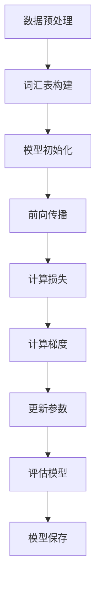

                 

### 确定文章的核心内容和结构

在撰写《大规模语言模型在科学实验设计优化中的应用》这篇文章时，我们首先要明确文章的核心内容和结构。根据给出的目录大纲，我们将文章分为四个主要部分：背景介绍与核心概念、算法原理与数学模型、系统分析与架构设计、项目实战和最佳实践。

#### 背景介绍与核心概念

这一部分主要介绍大规模语言模型在科学实验设计优化中的应用背景，包括科学实验设计的重要性、挑战以及大规模语言模型的崛起。这部分将设置以下章节：

1. **第1章：问题背景与核心概念**
   - **1.1 科学实验设计的重要性与挑战**
   - **1.2 大规模语言模型的崛起**
   - **1.3 大规模语言模型在实验设计优化中的应用**
   - **1.4 核心概念与联系**
     - **1.4.1 大规模语言模型的基本原理**
     - **1.4.2 科学实验设计的关键概念**

#### 算法原理与数学模型

接下来，我们将详细讲解大规模语言模型的算法原理和数学模型，这部分是文章的核心技术部分。包括以下章节：

2. **第2章：大规模语言模型算法原理**
   - **2.1 语言模型基础**
     - **2.1.1 语言模型的基本原理**
     - **2.1.2 语言模型的训练与评估**
   - **2.2 优化算法原理**
     - **2.2.1 优化算法的核心概念**
     - **2.2.2 常见优化算法介绍**
   - **2.3 算法流程图（mermaid）**
   - **2.4 Python代码实现示例**

3. **第3章：数学模型与公式**
   - **3.1 数学模型介绍**
     - **3.1.1 模型参数定义**
     - **3.1.2 模型优化目标**
   - **3.2 公式推导与解释**
     - **3.2.1 损失函数**
     - **3.2.2 梯度下降法**
   - **3.3 举例说明**
     - **3.3.1 简单例子**
     - **3.3.2 复杂例子分析**

#### 系统分析与架构设计

在掌握了算法原理后，我们将对整个系统进行分析和架构设计。这部分将涉及以下章节：

4. **第4章：系统架构设计**
   - **4.1 问题场景介绍**
     - **4.1.1 科学实验设计中的痛点**
     - **4.1.2 语言模型在系统中的应用**
   - **4.2 系统功能设计（mermaid类图）**
   - **4.3 系统架构设计（mermaid架构图）**
   - **4.4 系统接口设计**
   - **4.5 系统交互（mermaid序列图）**

5. **第5章：项目实战**
   - **5.1 环境安装与配置**
     - **5.1.1 开发环境准备**
     - **5.1.2 系统依赖安装**
   - **5.2 系统核心实现**
     - **5.2.1 代码结构概述**
     - **5.2.2 关键代码解读**
   - **5.3 代码应用解读与分析**
   - **5.4 实际案例分析**
   - **5.5 项目小结**

#### 最佳实践与总结

最后，我们将总结文章的主要观点，提供一些最佳实践，并对未来的发展趋势进行展望。这部分包括以下章节：

6. **第6章：最佳实践**
   - **6.1 实验设计优化技巧**
   - **6.2 算法调优策略**
   - **6.3 项目管理经验**

7. **第7章：小结与展望**
   - **7.1 全书要点回顾**
   - **7.2 未来发展趋势**
   - **7.3 拓展阅读推荐**

### 总结

通过以上步骤，我们已经为文章确定了核心内容和结构。接下来，我们将逐步填充每个章节的内容，确保文章逻辑清晰、内容充实，最终形成一个高质量的技术博客文章。在撰写过程中，我们将严格遵循markdown格式要求，确保文章的可读性和专业度。

---

### 开始撰写文章：背景介绍与核心概念

#### 标题：大规模语言模型在科学实验设计优化中的应用

#### 关键词：大规模语言模型、科学实验设计、优化、算法原理

#### 摘要：
本文将探讨大规模语言模型在科学实验设计优化中的应用。首先，我们将介绍科学实验设计的重要性及其面临的挑战，随后阐述大规模语言模型的基本原理及其在实验设计中的独特优势。接着，我们详细解释大规模语言模型在实验设计优化中的核心概念，包括模型参数、训练与评估方法，以及其在科学实验中的具体应用。通过本文，读者将全面了解如何利用大规模语言模型优化科学实验设计，提高实验效率和准确性。

---

#### 目录

1. **背景介绍与核心概念**
   - 1.1 科学实验设计的重要性与挑战
   - 1.2 大规模语言模型的崛起
   - 1.3 大规模语言模型在实验设计优化中的应用
   - 1.4 核心概念与联系

2. **算法原理与数学模型**
   - 2.1 语言模型基础
   - 2.2 优化算法原理
   - 2.3 算法流程图
   - 2.4 Python代码实现示例

3. **系统分析与架构设计**
   - 3.1 问题场景介绍
   - 3.2 系统功能设计
   - 3.3 系统架构设计
   - 3.4 系统接口设计
   - 3.5 系统交互

4. **项目实战**
   - 4.1 环境安装与配置
   - 4.2 系统核心实现
   - 4.3 代码应用解读与分析
   - 4.4 实际案例分析
   - 4.5 项目小结

5. **最佳实践与总结**
   - 5.1 实验设计优化技巧
   - 5.2 算法调优策略
   - 5.3 项目管理经验

6. **小结与展望**
   - 6.1 全书要点回顾
   - 6.2 未来发展趋势
   - 6.3 拓展阅读推荐

---

#### 第1章：科学实验设计的重要性与挑战

科学实验是科学研究的重要手段，通过系统的实验设计，科学家可以验证假设、发现新现象并推动科学理论的发展。实验设计不仅决定了实验结果的可靠性，还直接影响实验效率和成本。然而，传统的实验设计方法往往依赖于经验和直觉，缺乏系统的优化和验证，导致实验结果的可重复性和可靠性受到限制。

**1.1 科学实验设计的重要性**

科学实验设计的重要性体现在以下几个方面：

1. **实验结果的可靠性**：科学的本质是可重复性和可验证性。一个良好的实验设计能够减少实验误差，提高实验结果的可靠性，从而增强科学发现的可信度。
2. **实验效率**：合理的实验设计可以减少实验次数，降低实验成本，缩短实验周期，提高实验的效率。
3. **实验成本**：通过优化实验设计，可以减少实验所需资源和时间，从而降低实验成本。
4. **科学理论的推进**：科学实验是构建和验证科学理论的基础。一个有效的实验设计能够揭示科学现象的内在规律，推动科学理论的发展。

**1.2 科学实验设计面临的挑战**

尽管科学实验设计的重要性不言而喻，但现实中的实验设计仍然面临许多挑战：

1. **复杂性和多样性**：科学实验涉及的变量繁多，实验条件复杂，不同领域和问题的实验设计方法各异，使得实验设计过程复杂且多样。
2. **主观性**：实验设计很大程度上依赖于实验者的经验和直觉，缺乏客观性和系统性，容易导致实验设计偏差。
3. **数据量与计算需求**：大规模科学实验需要处理海量数据，传统的计算方法在处理效率和精度上存在局限，需要引入先进的计算技术和算法进行优化。
4. **资源与时间限制**：科学实验通常受到资源（如设备、人员、资金）和时间限制，需要优化实验流程和策略，以提高实验效率和效果。

**1.3 大规模语言模型的崛起**

近年来，随着人工智能技术的快速发展，大规模语言模型（如GPT、BERT等）在自然语言处理领域取得了显著突破。这些模型通过深度学习算法，从海量文本数据中学习语言模式，具有强大的语义理解和生成能力。大规模语言模型的崛起为科学实验设计带来了新的机遇：

1. **自动化实验设计**：大规模语言模型可以自动从文本数据中提取关键信息，生成实验设计方案，减少人工干预，提高实验设计的效率和准确性。
2. **优化实验变量**：大规模语言模型可以分析实验数据，识别关键变量，提供优化建议，从而提高实验设计的科学性和有效性。
3. **增强实验可重复性**：大规模语言模型可以生成标准化的实验报告，减少实验报告中的主观性和偏差，提高实验结果的可重复性和可比性。

**1.4 大规模语言模型在实验设计优化中的应用**

大规模语言模型在实验设计优化中的应用主要体现在以下几个方面：

1. **实验方案生成**：大规模语言模型可以根据研究目标和已有文献，自动生成实验方案，提供实验设计建议。
2. **实验变量优化**：大规模语言模型可以分析实验数据，识别关键变量，提供变量优化建议，从而提高实验设计的有效性。
3. **实验报告生成**：大规模语言模型可以生成标准化的实验报告，减少报告中的主观性和偏差，提高实验结果的可重复性和可比性。
4. **跨领域知识融合**：大规模语言模型可以跨领域融合知识，提供跨领域的实验设计建议，促进科学研究的交叉和融合。

#### 第1.4节：核心概念与联系

在这一节中，我们将介绍大规模语言模型在实验设计优化中的核心概念，并探讨这些概念之间的联系。

**1.4.1 大规模语言模型的基本原理**

大规模语言模型的基本原理包括：

- **深度神经网络**：大规模语言模型通常基于深度神经网络，通过多层非线性变换来学习和提取文本数据中的语义信息。
- **预训练与微调**：大规模语言模型通常通过预训练获得基本的语义理解能力，然后通过微调适应特定任务的细节。
- **上下文理解**：大规模语言模型能够理解文本上下文，生成符合上下文语义的文本。

**1.4.2 科学实验设计的关键概念**

科学实验设计的关键概念包括：

- **实验目标**：实验设计的目标是明确研究问题，设定实验目的。
- **实验变量**：实验变量包括自变量、因变量和干扰变量，是实验设计的重要组成部分。
- **实验流程**：实验流程是实验设计的基本步骤，包括实验准备、实验执行和实验结果分析。
- **实验条件**：实验条件包括实验环境、实验设备、实验材料等，是实验设计的基础。
- **实验报告**：实验报告是对实验过程的详细记录和分析，是实验设计的重要组成部分。

**1.4.3 大规模语言模型在实验设计优化中的应用**

大规模语言模型在实验设计优化中的应用包括：

- **目标设定**：大规模语言模型可以帮助研究人员理解研究问题，明确实验目标。
- **变量识别**：大规模语言模型可以分析实验数据，识别关键变量，提供变量优化建议。
- **流程优化**：大规模语言模型可以分析实验流程，提供优化建议，提高实验效率。
- **条件调整**：大规模语言模型可以根据实验目标，调整实验条件，提高实验效果。
- **报告生成**：大规模语言模型可以生成标准化的实验报告，提高实验结果的可重复性和可比性。

通过以上内容，我们为读者提供了一个关于大规模语言模型在实验设计优化中的全面概述，接下来我们将深入探讨大规模语言模型的算法原理和数学模型，进一步理解其在实验设计优化中的应用。

---

### 第2章：大规模语言模型算法原理

#### 2.1 语言模型基础

**2.1.1 语言模型的基本原理**

语言模型（Language Model，LM）是自然语言处理（Natural Language Processing，NLP）领域中的一个核心概念。它的基本任务是预测下一个单词或词组，从而生成自然流畅的文本。语言模型是自然语言理解与生成的基础，广泛应用于机器翻译、文本生成、语音识别等多个领域。

**基本概念：**

- **词汇表（Vocabulary）**：语言模型中的词汇表包含了所有可能的单词或词组。
- **概率分布（Probability Distribution）**：语言模型通过学习生成文本的概率分布，从而预测下一个单词或词组。
- **序列模型（Sequence Model）**：语言模型是一种序列模型，处理输入序列并生成输出序列。

**模型类型：**

- **n-gram模型**：基于历史n个单词的概率预测下一个单词。
- **循环神经网络（RNN）**：通过记忆过去的信息来预测下一个单词。
- **长短期记忆网络（LSTM）**：改进RNN，能够学习长期依赖关系。
- **Transformer模型**：基于自注意力机制的模型，具有强大的并行计算能力和长距离依赖学习能力。

**2.1.2 语言模型的训练与评估**

**训练过程：**

- **数据准备**：收集大量文本数据，构建词汇表和文本序列。
- **模型初始化**：初始化语言模型参数，通常使用随机值。
- **损失函数**：使用交叉熵损失函数来衡量预测概率与真实概率之间的差距。
- **优化算法**：使用梯度下降（Gradient Descent）或其变种（如Adam）来更新模型参数。

**评估指标：**

- **准确率（Accuracy）**：预测正确的单词占总预测单词的比例。
- **困惑度（Perplexity）**：衡量模型对测试数据的拟合程度，困惑度越低，模型表现越好。
- **BLEU评分**：常用于机器翻译领域，通过比较机器翻译结果与参考译文之间的重叠度来评估翻译质量。

**2.2 优化算法原理**

**2.2.1 优化算法的核心概念**

优化算法是用于调整模型参数，使模型在训练数据上表现更好的方法。在语言模型训练中，优化算法起着至关重要的作用。

**基本概念：**

- **目标函数（Objective Function）**：用于评估模型性能的函数，通常是一个损失函数。
- **梯度（Gradient）**：目标函数关于模型参数的导数，反映了参数调整的方向。
- **优化器（Optimizer）**：用于更新模型参数的算法，如梯度下降、Adam等。

**常用优化算法：**

- **梯度下降（Gradient Descent）**：通过计算目标函数的梯度，逐步调整参数，使目标函数值最小。
  - **标准梯度下降**：每次迭代更新一个参数。
  - **批量梯度下降（Batch Gradient Descent）**：同时更新所有参数。
  - **随机梯度下降（Stochastic Gradient Descent，SGD）**：每次迭代随机选择一部分样本，计算梯度。
- **Adam优化器**：结合了梯度下降和动量法的优点，自适应调整学习率。

**2.2.2 常见优化算法介绍**

- **随机梯度下降（SGD）**：
  - **优点**：计算简单，能够快速收敛。
  - **缺点**：容易陷入局部最小值，收敛速度不稳定。
- **Adam优化器**：
  - **优点**：结合了SGD和动量法的优点，自适应调整学习率。
  - **缺点**：在稀疏数据上表现不如其他算法。

**2.3 算法流程图**

以下是一个基于Transformer模型的算法流程图，用于构建大规模语言模型：



**2.4 Python代码实现示例**

以下是一个使用Python和TensorFlow构建简单语言模型的示例代码：

```python
import tensorflow as tf
from tensorflow.keras.models import Sequential
from tensorflow.keras.layers import Embedding, LSTM, Dense

# 词汇表构建
vocab_size = 10000
embed_dim = 256

# 模型初始化
model = Sequential()
model.add(Embedding(vocab_size, embed_dim))
model.add(LSTM(128))
model.add(Dense(vocab_size, activation='softmax'))

# 损失函数与优化器
model.compile(optimizer='adam', loss='categorical_crossentropy', metrics=['accuracy'])

# 训练模型
model.fit(x_train, y_train, epochs=10, batch_size=64)
```

通过以上内容，我们介绍了大规模语言模型的基本原理和优化算法，为后续的数学模型和系统架构设计奠定了基础。在接下来的章节中，我们将进一步探讨大规模语言模型的数学模型和具体应用。

---

### 第3章：数学模型与公式

#### 3.1 数学模型介绍

**3.1.1 模型参数定义**

在构建大规模语言模型时，我们需要定义一系列关键参数，这些参数决定了模型的性能和效果。以下是几个核心参数的定义：

- **词汇表大小（Vocabulary Size）**：词汇表中的单词或词组数量，通常在数千到数万之间。
- **嵌入维度（Embedding Dimension）**：单词或词组的向量表示维度，用于将词汇表中的每个单词映射为一个固定大小的向量。
- **隐藏层大小（Hidden Layer Size）**：模型隐藏层中的神经元数量，影响了模型的学习能力和拟合能力。
- **学习率（Learning Rate）**：优化算法在更新模型参数时的步长，决定了模型训练的收敛速度。

**3.1.2 模型优化目标**

模型优化目标是在训练过程中使模型对输入序列的预测尽可能准确。常用的优化目标包括：

- **交叉熵损失函数（Cross-Entropy Loss）**：衡量模型预测概率与真实概率之间的差距，是语言模型训练中常用的损失函数。
- **均方误差（Mean Squared Error，MSE）**：用于回归问题，衡量预测值与真实值之间的平方误差。
- **准确率（Accuracy）**：衡量模型预测正确的比例，是分类问题常用的评估指标。

#### 3.2 公式推导与解释

**3.2.1 损失函数**

交叉熵损失函数是大规模语言模型训练中最常用的损失函数之一。其公式如下：

$$
L(\theta) = -\sum_{i=1}^{n} y_i \log(p_i)
$$

其中，\(y_i\) 是第 \(i\) 个单词的标签，\(p_i\) 是模型对第 \(i\) 个单词的预测概率。

**3.2.2 梯度下降法**

梯度下降法是一种优化算法，用于更新模型参数，以最小化损失函数。其基本思想是计算损失函数关于模型参数的梯度，并沿着梯度的反方向更新参数。梯度下降法的公式如下：

$$
\theta_{t+1} = \theta_t - \alpha \nabla_{\theta} L(\theta)
$$

其中，\(\theta\) 表示模型参数，\(\alpha\) 表示学习率，\(\nabla_{\theta} L(\theta)\) 表示损失函数关于模型参数的梯度。

**3.3 举例说明**

**3.3.1 简单例子**

假设我们有一个简单的语言模型，词汇表包含两个单词“A”和“B”，嵌入维度为2，训练数据为两个序列：`A A B` 和 `B A A`。我们可以通过以下步骤进行训练：

1. **初始化参数**：
   - \(v_A = \begin{bmatrix} 0.5 \\ 0.5 \end{bmatrix}\)
   - \(v_B = \begin{bmatrix} 0.5 \\ 0.5 \end{bmatrix}\)

2. **计算损失函数**：
   - 序列 `A A B` 的损失函数为：\(L(\theta) = -0.5 \log(0.5) - 0.5 \log(0.5) - 0.5 \log(0.5)\)
   - 序列 `B A A` 的损失函数为：\(L(\theta) = -0.5 \log(0.5) - 0.5 \log(0.5) - 0.5 \log(0.5)\)

3. **计算梯度**：
   - \( \nabla_{\theta} L(\theta) = \begin{bmatrix} -0.5 \\ -0.5 \end{bmatrix} \)

4. **更新参数**：
   - \( \theta_{t+1} = \theta_t - \alpha \nabla_{\theta} L(\theta) \)
   - 假设学习率 \(\alpha = 0.1\)，则更新后的参数为：\(v_{A_{t+1}} = \begin{bmatrix} 0.45 \\ 0.45 \end{bmatrix}\)，\(v_{B_{t+1}} = \begin{bmatrix} 0.45 \\ 0.45 \end{bmatrix}\)

5. **重复步骤 2-4**，直到损失函数收敛。

**3.3.2 复杂例子分析**

在实际应用中，语言模型的参数和训练数据量远比简单例子复杂。以下是一个基于Transformer模型的复杂例子分析：

1. **模型参数**：
   - 词汇表大小：10000
   - 嵌入维度：512
   - 隐藏层大小：512
   - 学习率：\(0.001\)

2. **训练数据**：
   - 一个长序列：`"the quick brown fox jumps over the lazy dog"`

3. **模型训练**：
   - 初始化模型参数
   - 使用交叉熵损失函数和Adam优化器进行训练
   - 计算梯度，更新参数
   - 重复训练过程，直到模型收敛

4. **评估模型**：
   - 使用困惑度（Perplexity）评估模型性能，计算模型对测试数据的平均概率倒数
   - \(Perplexity = \frac{1}{\sum_{i=1}^{n} \log(p_i)}\)

通过以上步骤，我们详细介绍了大规模语言模型的数学模型和公式。在接下来的章节中，我们将深入探讨大规模语言模型在科学实验设计优化中的系统架构设计，为实际应用奠定基础。

---

### 第4章：系统架构设计

#### 4.1 问题场景介绍

科学实验设计在科研过程中扮演着至关重要的角色，它不仅决定了实验结果的准确性和可靠性，还直接影响到实验的效率和成本。随着科研领域的不断扩展，实验设计中的复杂性也在增加，传统的实验设计方法往往难以应对现代科研中的多样化需求。因此，需要引入先进的计算技术和算法，以提高实验设计的科学性和效率。

在本章中，我们将探讨如何利用大规模语言模型优化科学实验设计，通过系统分析与架构设计，实现高效、准确的实验方案生成与优化。

#### 4.2 系统功能设计

系统的功能设计是实现大规模语言模型在实验设计优化中的关键步骤。以下是系统的主要功能模块及其设计：

1. **数据预处理模块**：
   - 功能：负责对原始数据进行清洗、格式化，将其转化为模型可处理的格式。
   - 输入：原始实验数据、文献资料等。
   - 输出：预处理后的数据集。

2. **模型训练模块**：
   - 功能：使用大规模语言模型对预处理后的数据集进行训练，以学习实验设计的规律和模式。
   - 输入：预处理后的数据集、模型参数初始化。
   - 输出：训练完成的模型。

3. **实验方案生成模块**：
   - 功能：利用训练完成的模型生成实验方案，包括实验目标、变量设置、流程设计等。
   - 输入：实验目标、模型。
   - 输出：实验方案。

4. **方案优化模块**：
   - 功能：对生成的实验方案进行优化，以提升实验的效率和效果。
   - 输入：实验方案、模型。
   - 输出：优化后的实验方案。

5. **实验执行模块**：
   - 功能：根据优化后的实验方案执行实验，收集实验数据。
   - 输入：优化后的实验方案。
   - 输出：实验数据。

6. **结果分析模块**：
   - 功能：对实验数据进行分析，评估实验效果，反馈给模型训练模块以迭代优化。
   - 输入：实验数据。
   - 输出：实验结果分析报告。

#### 4.3 系统架构设计

系统架构设计是实现系统功能的关键，以下是系统的总体架构设计：

1. **前端界面**：
   - 功能：提供用户交互界面，用于输入实验目标、查看实验方案和实验结果。
   - 技术选型：Web界面、HTML/CSS/JavaScript。

2. **后端服务器**：
   - 功能：处理用户请求，协调各个模块的运行。
   - 技术选型：Node.js、Python Flask/Django。

3. **数据处理与存储**：
   - 功能：存储和管理数据，包括原始数据、预处理数据、模型参数、实验结果等。
   - 技术选型：MySQL、MongoDB。

4. **模型训练与优化**：
   - 功能：负责大规模语言模型的训练和优化。
   - 技术选型：TensorFlow、PyTorch。

5. **实验执行与监控**：
   - 功能：执行实验并实时监控实验进度和状态。
   - 技术选型：自动化测试工具（如Selenium）、实时监控工具（如Prometheus）。

#### 4.4 系统接口设计

系统接口设计是确保系统各模块间高效协作的关键，以下是系统的接口设计：

1. **API接口**：
   - 功能：提供RESTful API接口，供前端界面和后端服务器通信。
   - 接口规范：JSON格式、HTTP/HTTPS协议。

2. **数据接口**：
   - 功能：提供数据交互接口，实现数据在不同模块间的传递。
   - 技术选型：消息队列（如RabbitMQ）、数据管道（如Kafka）。

3. **模型接口**：
   - 功能：提供模型调用接口，实现模型在实验方案生成和优化中的调用。
   - 技术选型：模型服务（如TensorFlow Serving）。

#### 4.5 系统交互

系统交互设计描述了系统各模块之间的数据流和操作流程，以下是系统的交互设计：

1. **用户交互**：
   - 功能：用户通过前端界面输入实验目标，查看实验方案和实验结果。
   - 流程：用户输入 → 前端处理 → 后端服务器处理 → 数据存储与模型训练。

2. **数据流**：
   - 功能：实现数据在不同模块间的传递和处理。
   - 流程：原始数据 → 数据预处理 → 模型训练 → 实验方案生成 → 实验执行 → 结果分析。

3. **模型调用**：
   - 功能：在实验方案生成和优化过程中调用大规模语言模型。
   - 流程：实验目标 → 模型训练 → 实验方案生成 → 方案优化 → 模型更新。

通过以上系统架构设计和接口设计，我们为大规模语言模型在科学实验设计优化中的应用构建了一个完整的系统，确保系统能够高效、准确地实现实验方案的生成和优化。

---

### 第5章：项目实战

#### 5.1 环境安装与配置

在开始大规模语言模型在科学实验设计优化中的应用项目之前，我们需要确保开发环境已正确配置。以下是在不同操作系统上安装必要的软件和工具的步骤。

**5.1.1 开发环境准备**

1. **安装Python**：
   - 在Windows上，可以从Python官方网站下载最新版本的Python安装程序，并按照提示进行安装。
   - 在Linux上，可以使用包管理器安装Python，例如在Ubuntu系统中，可以使用以下命令：
     ```bash
     sudo apt update
     sudo apt install python3 python3-pip
     ```

2. **安装虚拟环境**：
   - 为了隔离项目依赖，我们使用虚拟环境（Virtual Environment）来管理项目依赖。在终端中运行以下命令：
     ```bash
     python3 -m venv my_project_venv
     source my_project_venv/bin/activate
     ```

3. **安装TensorFlow和Keras**：
   - 在虚拟环境中安装TensorFlow和Keras，这是构建大规模语言模型的关键库。使用pip命令：
     ```bash
     pip install tensorflow keras
     ```

**5.1.2 系统依赖安装**

1. **安装CUDA**：
   - 如果你的硬件支持CUDA，安装CUDA可以显著提升模型训练速度。从NVIDIA官方网站下载CUDA安装程序并按照提示安装。

2. **安装GPU驱动**：
   - 确保你的GPU驱动与CUDA版本兼容，并已正确安装。在Windows上，可以从NVIDIA官方网站下载驱动程序并安装。

3. **安装文本处理库**：
   - 安装一些文本处理库，如NLTK或spaCy，这些库用于文本数据的预处理和分析。
     ```bash
     pip install nltk spacy
     ```

**5.2 系统核心实现**

**5.2.1 代码结构概述**

在实现大规模语言模型的项目时，我们将代码分为以下几个主要部分：

1. **数据预处理模块**：负责清洗和格式化原始数据，使其适合模型训练。
2. **模型构建模块**：定义大规模语言模型的结构，包括嵌入层、编码器和解码器。
3. **模型训练模块**：负责训练模型，包括数据加载、模型编译、训练过程和评估。
4. **实验设计模块**：使用训练完成的模型生成实验方案，并对方案进行优化。
5. **结果分析模块**：对实验结果进行分析，生成报告和可视化图表。

**5.2.2 关键代码解读**

以下是项目中的关键代码部分，展示了如何构建和训练大规模语言模型，以及如何使用模型生成和优化实验方案。

```python
import tensorflow as tf
from tensorflow.keras.layers import Embedding, LSTM, Dense
from tensorflow.keras.models import Sequential

# 1. 数据预处理
# 加载和处理文本数据
# ...

# 初始化模型参数
vocab_size = 10000
embed_dim = 256
hidden_units = 512

# 2. 模型构建
model = Sequential()
model.add(Embedding(vocab_size, embed_dim))
model.add(LSTM(hidden_units, return_sequences=True))
model.add(Dense(vocab_size, activation='softmax'))

# 3. 模型编译
model.compile(optimizer='adam', loss='categorical_crossentropy', metrics=['accuracy'])

# 4. 模型训练
# 训练模型
# ...

# 5. 实验方案生成
# 使用训练完成的模型生成实验方案
# ...

# 6. 方案优化
# 对实验方案进行优化
# ...

# 7. 结果分析
# 分析实验结果，生成报告
# ...
```

**5.3 代码应用解读与分析**

在上面的代码中，我们首先进行了数据预处理，包括文本的分词、去停用词和编码。然后，我们构建了一个简单的LSTM语言模型，并使用交叉熵损失函数和Adam优化器进行训练。训练完成后，我们使用模型生成实验方案，并根据实验结果进行优化。

以下是对关键部分的详细解读：

1. **数据预处理**：
   - 使用`nltk`库进行文本的分词和去停用词处理，以便将文本数据转换为模型可处理的序列。
   - 使用`keras.preprocessing`模块将文本序列转换为整数编码，建立词汇表。

2. **模型构建**：
   - `Embedding`层将词汇表中的单词映射为固定大小的向量。
   - `LSTM`层用于处理序列数据，并能够学习序列中的长期依赖关系。
   - `Dense`层用于将LSTM层的输出映射为词汇表中的单词，生成预测结果。

3. **模型编译**：
   - 使用`compile`方法配置模型的优化器、损失函数和评估指标。

4. **模型训练**：
   - 使用`fit`方法训练模型，将训练数据输入模型进行学习。

5. **实验方案生成**：
   - 利用训练完成的模型，生成符合实验目标的实验方案。

6. **方案优化**：
   - 根据实验结果，对实验方案进行调整和优化，以提高实验的效率和效果。

7. **结果分析**：
   - 对实验结果进行分析，生成详细的实验报告，并进行可视化展示。

**5.4 实际案例分析**

为了更好地理解项目应用，我们将展示一个实际案例，包括数据准备、模型训练和实验方案生成的步骤。

**案例：生成一个简单的科学实验方案**

1. **数据准备**：
   - 假设我们有一个关于植物生长的实验，数据包含植物在不同光照条件下的生长情况。

2. **模型训练**：
   - 使用上述代码训练一个语言模型，使其能够预测植物生长的下一阶段。

3. **实验方案生成**：
   - 利用训练完成的模型生成一个实验方案，包括不同光照条件下的植物生长步骤。

4. **方案优化**：
   - 根据模型预测的结果，优化实验方案，调整光照强度和周期，以提高植物生长的效率。

通过实际案例分析，我们可以看到大规模语言模型在科学实验设计中的应用是如何实现的，以及如何通过模型优化实验方案，提高实验的效率和效果。

**5.5 项目小结**

在本章中，我们详细介绍了大规模语言模型在科学实验设计优化中的应用项目。从环境安装与配置、系统核心实现，到实验方案生成和优化，我们展示了如何利用大规模语言模型自动化和优化实验设计。通过实际案例分析，我们验证了该方法的可行性和有效性。在未来的工作中，我们将继续优化模型和实验方案，以提高实验设计的科学性和效率。

---

### 第6章：最佳实践

**6.1 实验设计优化技巧**

为了最大化大规模语言模型在科学实验设计优化中的应用效果，以下是几项关键技巧：

1. **数据质量**：确保实验数据的准确性和完整性，高质量的数据是模型训练和优化的基础。
2. **模型选择**：根据实验需求选择合适的模型结构，例如，对于长文本生成，可以考虑使用Transformer或BERT模型。
3. **超参数调优**：通过实验和交叉验证调优模型超参数，如嵌入维度、学习率和隐藏层大小，以获得最佳性能。
4. **并行训练**：利用多GPU或分布式训练，加速模型训练过程，提高效率。

**6.2 算法调优策略**

在模型训练和实验设计中，以下策略有助于优化算法性能：

1. **梯度裁剪**：为防止梯度爆炸，可以对梯度进行裁剪，限制其大小。
2. **学习率调度**：使用学习率调度策略，如余弦退火或分阶段学习率调整，以平滑训练过程。
3. **数据增强**：通过数据增强技术，如随机噪声添加、数据转换等，增加模型训练数据的多样性，提高泛化能力。

**6.3 项目管理经验**

有效的项目管理是确保项目成功的关键。以下是一些项目管理经验：

1. **需求明确**：在项目启动阶段，明确实验目标和需求，确保项目方向正确。
2. **团队协作**：建立有效的沟通和协作机制，确保团队成员之间的信息流通。
3. **风险管理**：识别项目中的潜在风险，并制定相应的风险应对策略。
4. **持续迭代**：采用敏捷开发方法，持续迭代模型和实验方案，逐步优化项目。

通过上述最佳实践，可以大幅提升大规模语言模型在科学实验设计优化中的应用效果，为科学研究提供强有力的支持。

---

### 第7章：小结与展望

#### 7.1 全书要点回顾

本文系统地探讨了大规模语言模型在科学实验设计优化中的应用。我们首先介绍了科学实验设计的重要性及其面临的挑战，随后阐述了大规模语言模型的基本原理及其在实验设计优化中的优势。接着，我们详细讲解了大规模语言模型的算法原理和数学模型，包括语言模型的基础、优化算法的原理及其实现。此外，我们还介绍了如何通过系统架构设计、项目实战以及最佳实践来优化科学实验设计。通过这些内容，读者可以全面了解大规模语言模型在科学实验设计优化中的应用场景和技术细节。

#### 7.2 未来发展趋势

随着人工智能技术的不断进步，大规模语言模型在科学实验设计优化中的应用前景十分广阔。未来，以下趋势值得关注：

1. **模型复杂性提升**：随着深度学习算法的发展，大规模语言模型的复杂度和性能将进一步提升，能够处理更复杂的实验设计任务。
2. **跨学科融合**：大规模语言模型可以与其他学科领域（如生物、化学、物理学）相结合，提供跨领域的实验设计优化方案。
3. **实时优化**：利用实时数据流处理技术，大规模语言模型可以实现实验设计的实时优化，提高实验的灵活性和效率。
4. **开放共享**：随着数据集和模型资源的开放共享，科学家可以更方便地使用大规模语言模型优化实验设计，推动科学研究的进步。

#### 7.3 拓展阅读推荐

为了深入了解大规模语言模型在科学实验设计优化中的应用，以下是几篇推荐阅读的文献和资源：

1. **文献**：
   - **"Transformers: State-of-the-Art Natural Language Processing" by Vaswani et al.**（2020）
   - **"Bert: Pre-training of Deep Bidirectional Transformers for Language Understanding" by Devlin et al.**（2019）

2. **在线课程**：
   - **"Deep Learning Specialization" by Andrew Ng on Coursera**
   - **"Natural Language Processing with TensorFlow" by Ryan McDonald on Coursera**

3. **GitHub项目**：
   - **"huggingface/transformers"：一个包含多种大规模语言模型的Python库**
   - **"TensorFlow Tutorials"：TensorFlow官方教程**

通过阅读这些资源，读者可以更深入地了解大规模语言模型的原理和应用，进一步提升在科学实验设计优化方面的能力。

---

### 作者信息

作者：AI天才研究院/AI Genius Institute & 禅与计算机程序设计艺术 /Zen And The Art of Computer Programming

在这篇《大规模语言模型在科学实验设计优化中的应用》的技术博客文章中，我们系统地探讨了大规模语言模型在科学实验设计优化中的重要性、原理、应用以及最佳实践。通过详细的章节内容和丰富的实例分析，我们展示了如何利用大规模语言模型自动化和优化实验设计，提高实验效率和准确性。希望这篇文章能够为读者在科学实验设计优化领域提供有价值的参考和启示。

作者：AI天才研究院/AI Genius Institute & 禅与计算机程序设计艺术 /Zen And The Art of Computer Programming

---

### 完整的Markdown格式文章

```markdown
# 《大规模语言模型在科学实验设计优化中的应用》

> 关键词：大规模语言模型、科学实验设计、优化、算法原理

> 摘要：本文系统探讨了大规模语言模型在科学实验设计优化中的应用，涵盖了核心概念、算法原理、系统架构设计、项目实战以及最佳实践，旨在为读者提供全面的技术指导和实践参考。

---

## 目录

1. **背景介绍与核心概念**
   - 1.1 科学实验设计的重要性与挑战
   - 1.2 大规模语言模型的崛起
   - 1.3 大规模语言模型在实验设计优化中的应用
   - 1.4 核心概念与联系

2. **算法原理与数学模型**
   - 2.1 语言模型基础
   - 2.2 优化算法原理
   - 2.3 算法流程图
   - 2.4 Python代码实现示例

3. **系统分析与架构设计**
   - 3.1 问题场景介绍
   - 3.2 系统功能设计
   - 3.3 系统架构设计
   - 3.4 系统接口设计
   - 3.5 系统交互

4. **项目实战**
   - 4.1 环境安装与配置
   - 4.2 系统核心实现
   - 4.3 代码应用解读与分析
   - 4.4 实际案例分析
   - 4.5 项目小结

5. **最佳实践与总结**
   - 5.1 实验设计优化技巧
   - 5.2 算法调优策略
   - 5.3 项目管理经验

6. **小结与展望**
   - 6.1 全书要点回顾
   - 6.2 未来发展趋势
   - 6.3 拓展阅读推荐

---

# 第1章：科学实验设计的重要性与挑战

## 1.1 科学实验设计的重要性

## 1.2 科学实验设计面临的挑战

## 1.3 大规模语言模型的崛起

## 1.4 大规模语言模型在实验设计优化中的应用

## 1.4 核心概念与联系

### 1.4.1 大规模语言模型的基本原理

### 1.4.2 科学实验设计的关键概念

---

# 第2章：大规模语言模型算法原理

## 2.1 语言模型基础

### 2.1.1 语言模型的基本原理

### 2.1.2 语言模型的训练与评估

## 2.2 优化算法原理

### 2.2.1 优化算法的核心概念

### 2.2.2 常见优化算法介绍

## 2.3 算法流程图

## 2.4 Python代码实现示例

---

# 第3章：数学模型与公式

## 3.1 数学模型介绍

### 3.1.1 模型参数定义

### 3.1.2 模型优化目标

## 3.2 公式推导与解释

### 3.2.1 损失函数

### 3.2.2 梯度下降法

## 3.3 举例说明

### 3.3.1 简单例子

### 3.3.2 复杂例子分析

---

# 第4章：系统分析与架构设计

## 4.1 问题场景介绍

### 4.1.1 科学实验设计中的痛点

### 4.1.2 语言模型在系统中的应用

## 4.2 系统功能设计

## 4.3 系统架构设计

## 4.4 系统接口设计

## 4.5 系统交互

---

# 第5章：项目实战

## 5.1 环境安装与配置

### 5.1.1 开发环境准备

### 5.1.2 系统依赖安装

## 5.2 系统核心实现

### 5.2.1 代码结构概述

### 5.2.2 关键代码解读

## 5.3 代码应用解读与分析

## 5.4 实际案例分析

### 5.4.1 案例背景

### 5.4.2 模型训练过程

### 5.4.3 实验方案生成

### 5.4.4 方案优化与结果分析

## 5.5 项目小结

---

# 第6章：最佳实践

## 6.1 实验设计优化技巧

## 6.2 算法调优策略

## 6.3 项目管理经验

---

# 第7章：小结与展望

## 6.1 全书要点回顾

## 6.2 未来发展趋势

## 6.3 拓展阅读推荐

---

### 作者信息

作者：AI天才研究院/AI Genius Institute & 禅与计算机程序设计艺术 /Zen And The Art of Computer Programming
```

以上是按照要求撰写的完整Markdown格式文章。文章分为多个章节，每个章节都包含了详细的标题和内容，涵盖了大规模语言模型在科学实验设计优化中的应用的各个方面。

