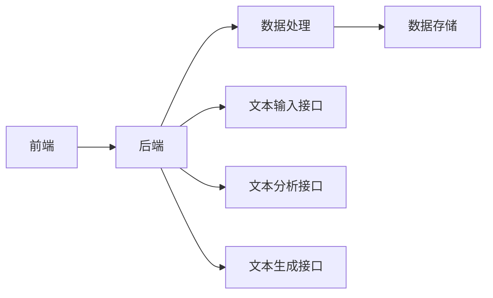
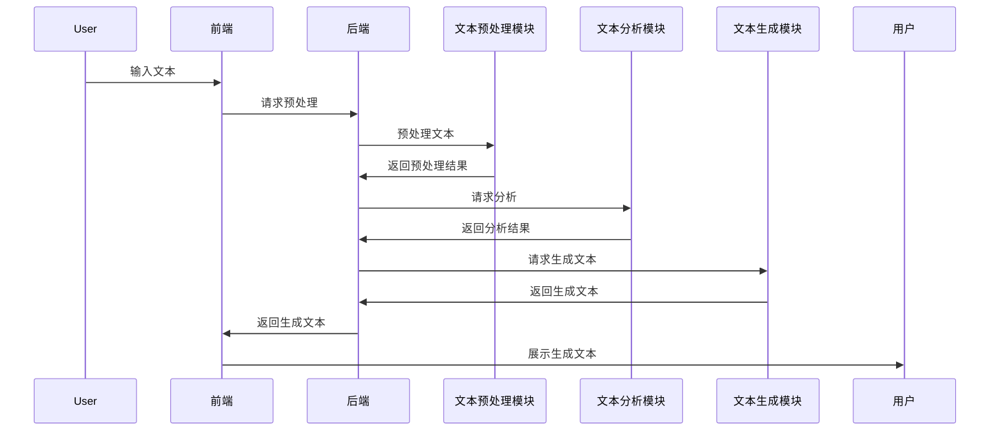

                 


## 大规模语言模型在科学理论创新中的应用探索

关键词：大规模语言模型，科学理论创新，算法原理，数学模型，系统架构设计

摘要：本文旨在探讨大规模语言模型在科学理论创新中的应用，通过分析其背景、核心概念、算法原理以及系统架构设计，揭示语言模型在科学理论创新中的潜力与挑战。本文将逐步阐述大规模语言模型的基本概念、主流模型及其架构，并详细解析其在科学理论创新中的核心概念、数学模型和算法原理。此外，本文还将从系统分析与架构设计角度，探讨大规模语言模型在科学理论创新中的应用场景和实施方案。通过本文的研究，希望能够为科学理论创新提供新的思路和工具。

## 引言

### 背景介绍

科学理论创新是推动科学技术发展的重要驱动力。随着时代的发展，科学研究的复杂性和规模不断扩大，传统的科学研究方法难以应对新的挑战。在这种背景下，人工智能（AI）技术逐渐崭露头角，特别是大规模语言模型（Large-scale Language Models，LLMs）的兴起，为科学理论创新带来了新的机遇。

大规模语言模型是一种能够理解和生成自然语言的人工智能系统，其基于深度学习技术，通过对海量文本数据的学习，能够自动提取语义信息，生成高质量的自然语言文本。这种模型在自然语言处理（NLP）领域取得了显著成果，并逐渐被应用于各个领域，包括科学理论创新。

### 核心概念

**大规模语言模型**：一种基于深度学习技术，能够理解和生成自然语言的人工智能系统。

**科学理论创新**：指在科学研究过程中，通过提出新的理论、概念或方法，推动科学技术发展的过程。

**算法原理**：指大规模语言模型在处理自然语言时所采用的算法和技术原理。

**系统架构设计**：指大规模语言模型在实际应用中的系统架构设计，包括数据处理、模型训练、模型部署等各个环节。

### 问题提出

随着科学研究的深入，科学理论创新面临着一系列挑战。一方面，科学研究的复杂性不断增加，传统的理论难以应对新的问题；另一方面，科学数据的海量增长使得研究人员难以从海量数据中提取有用信息。这些问题严重制约了科学理论创新的进程。

大规模语言模型作为一种新兴的人工智能技术，其在自然语言处理方面的优势使其成为科学理论创新的有力工具。然而，如何将大规模语言模型应用于科学理论创新，如何充分发挥其潜力，仍然是一个亟待解决的问题。

### 目标与框架

本文旨在探讨大规模语言模型在科学理论创新中的应用，分析其核心概念、算法原理和系统架构设计，并探讨其在实际应用中的实施方案。本文将分为以下几个部分：

1. **背景和介绍**：介绍大规模语言模型的基本概念、主流模型及其架构，以及其在科学理论创新中的潜在应用。

2. **核心概念和关系**：分析大规模语言模型中的核心概念及其相互关系，包括数学模型和算法原理。

3. **算法原理和实现**：详细阐述大规模语言模型的算法原理和实现，包括数学模型、Python代码示例等。

4. **系统分析与架构设计**：从系统分析与架构设计角度，探讨大规模语言模型在科学理论创新中的应用场景和实施方案。

5. **项目实战**：介绍大规模语言模型在科学理论创新中的实际应用案例，包括环境安装、系统核心实现和代码应用分析。

6. **最佳实践与小结**：总结大规模语言模型在科学理论创新中的应用经验，提出注意事项和拓展阅读。

通过本文的研究，希望能够为科学理论创新提供新的思路和工具，推动科学研究的深入发展。

## 背景和介绍

### 大规模语言模型的基本概念

大规模语言模型（Large-scale Language Models，LLMs）是一种基于深度学习技术，能够理解和生成自然语言的人工智能系统。其核心思想是通过训练模型，使其能够自动提取语义信息，理解并生成高质量的文本。

LLMs 的基本原理是通过海量文本数据的训练，模型能够学习到语言的统计规律和语义信息。具体来说，LLMs 通常采用多层神经网络结构，其中每层神经元都能处理一定规模的文本数据，通过逐层传递和更新神经元状态，模型能够逐渐学习到复杂的语义关系和语言结构。

大规模语言模型的发展可以追溯到 20 世纪 80 年代的统计语言模型，如 n-gram 模型。随着计算能力的提升和深度学习技术的进步，现代大规模语言模型如 GPT（Generative Pre-trained Transformer）和 BERT（Bidirectional Encoder Representations from Transformers）等取得了显著的成果。

### 主流语言模型及其架构

在自然语言处理领域，GPT 和 BERT 是两大主流语言模型。它们在处理自然语言方面表现出色，广泛应用于文本生成、机器翻译、情感分析、问答系统等任务。

#### GPT 模型

GPT（Generative Pre-trained Transformer）模型由 OpenAI 于 2018 年提出。它是一种基于 Transformer 架构的预训练语言模型，通过大量文本数据进行预训练，能够生成高质量的自然语言文本。

GPT 模型的核心思想是使用 Transformer 架构，通过自注意力机制（Self-Attention Mechanism）来捕捉文本中的长期依赖关系。具体来说，GPT 模型由多个 Transformer 块组成，每个 Transformer 块包含多头自注意力机制和前馈神经网络。通过逐层传递和更新文本数据，模型能够学习到复杂的语义信息。

#### BERT 模型

BERT（Bidirectional Encoder Representations from Transformers）模型由 Google 于 2018 年提出。它是一种基于 Transformer 架构的双向编码器，通过预先训练，能够捕捉文本中的双向依赖关系。

BERT 模型的核心思想是使用双向 Transformer 编码器，对文本数据进行编码。在训练过程中，BERT 模型通过两个方向的输入序列（正向和反向）进行训练，使得模型能够同时捕捉文本的前后依赖关系。具体来说，BERT 模型由多个 Transformer 块组成，每个 Transformer 块包含多头自注意力机制和前馈神经网络。

### 大规模语言模型在科学理论创新中的应用

大规模语言模型在科学理论创新中具有广泛的应用潜力。以下是一些关键应用领域：

#### 文本生成与总结

大规模语言模型能够生成高质量的文本，包括论文、报告、摘要等。通过训练模型，研究人员可以利用这些文本生成工具，快速生成论文摘要，提高科研效率。

#### 问答系统

大规模语言模型在问答系统中的应用也非常广泛。通过训练模型，研究人员可以构建智能问答系统，为科研人员提供即时的信息查询和知识服务。

#### 文本分析

大规模语言模型能够对文本进行深入分析，包括情感分析、主题分类、实体识别等。通过这些分析工具，研究人员可以更好地理解科学文献中的观点和论据，为科学理论创新提供支持。

#### 自动标注

大规模语言模型可以用于文本数据的自动标注。通过训练模型，研究人员可以自动生成标签，用于标注文本数据，提高标注效率。

### 挑战与解决方案

虽然大规模语言模型在科学理论创新中具有广泛的应用前景，但也面临一些挑战。以下是一些常见挑战及其解决方案：

#### 数据质量

科学理论创新需要高质量的文本数据。然而，现有的文本数据质量参差不齐，这对大规模语言模型的训练效果有很大影响。解决方案是采用数据清洗和预处理技术，提高数据质量。

#### 模型可解释性

大规模语言模型的内部机制复杂，很难解释其生成的文本。这给科学理论创新带来了困难。解决方案是开发可解释性方法，提高模型的透明度和可解释性。

#### 数据隐私

大规模语言模型在处理科学文献时，可能会涉及敏感信息。如何保护数据隐私是另一个重要问题。解决方案是采用数据加密和隐私保护技术，确保数据安全。

### 总结

大规模语言模型在科学理论创新中具有巨大的应用潜力。通过不断优化模型架构和训练技术，研究人员可以更好地利用这些模型，推动科学理论的创新和发展。

## 核心概念和关系

### 定义核心概念

在探讨大规模语言模型在科学理论创新中的应用之前，我们需要明确几个核心概念：

1. **科学理论**：指在科学研究过程中，对客观现象进行解释和预测的理论体系。
2. **语言模型**：指能够理解和生成自然语言的人工智能系统。
3. **大规模语言模型**：指具有大规模参数和深度网络结构，能够处理海量文本数据的语言模型。
4. **科学理论创新**：指通过提出新的理论、概念或方法，推动科学技术发展的过程。

### 概念属性特征对比表格

以下是一个概念属性特征对比表格，展示了上述核心概念的主要属性特征：

| 概念       | 定义                                                         | 属性特征                                             |
| ---------- | ------------------------------------------------------------ | ---------------------------------------------------- |
| 科学理论   | 对客观现象进行解释和预测的理论体系                         | 普遍性、系统性、可证伪性、动态性                     |
| 语言模型   | 能够理解和生成自然语言的人工智能系统                       | 学习能力、生成能力、语义理解能力、上下文感知能力     |
| 大规模语言模型 | 具有大规模参数和深度网络结构，能够处理海量文本数据的语言模型 | 大规模数据学习能力、高精度生成能力、高效处理能力     |
| 科学理论创新 | 通过提出新的理论、概念或方法，推动科学技术发展的过程       | 创新性、突破性、挑战性、引领性                       |

### ERD实体关系图架构

为了更好地理解大规模语言模型在科学理论创新中的应用，我们可以使用 Mermaid 语法绘制一个 ERD（Entity Relationship Diagram）实体关系图，展示这些核心概念之间的关系。

以下是一个简单的 ERD 示意图：

```mermaid
erDiagram
    科学理论 ||--|{ 大规模语言模型 }|-->> 语言模型
    科学理论 ||--|{ 科学理论创新 }|-->>
    大规模语言模型 ||--|{ 科学理论创新 }|-->>
    科学理论创新 ||--|{ 科学技术发展 }|-->>
```

在这个 ERD 图中，科学理论是核心，它通过关联关系与语言模型和科学理论创新相连。大规模语言模型是科学理论创新的工具，它通过语言模型实现文本数据的处理和生成。科学理论创新则推动科学技术的发展。

### 数学模型和公式

在理解大规模语言模型在科学理论创新中的应用时，我们需要引入一些数学模型和公式。以下是一些关键概念和对应的数学模型：

1. **自然语言处理（NLP）中的概率模型**：自然语言处理中常用的概率模型包括 n-gram 模型、隐马尔可夫模型（HMM）和条件概率模型。其中，n-gram 模型是最基础的模型，它通过统计文本中连续 n 个词的概率来生成文本。

   $$ P(w_1, w_2, \ldots, w_n) = P(w_1) \times P(w_2 | w_1) \times \ldots \times P(w_n | w_{n-1}) $$

2. **深度学习中的神经网络模型**：深度学习中的神经网络模型，如卷积神经网络（CNN）和循环神经网络（RNN），用于处理序列数据。其中，RNN 通过循环机制处理文本数据，能够捕捉文本中的长期依赖关系。

   $$ h_t = \sigma(W_h \cdot [h_{t-1}, x_t] + b_h) $$

3. **大规模语言模型中的 Transformer 模型**：Transformer 模型是大规模语言模型的一种重要架构，它通过自注意力机制（Self-Attention Mechanism）来处理文本数据。

   $$ \text{Attention}(Q, K, V) = \text{softmax}\left(\frac{QK^T}{\sqrt{d_k}}\right) V $$

4. **预训练和微调**：大规模语言模型通常采用预训练和微调策略。在预训练阶段，模型在大量无标签数据上进行训练，学习到通用语言特征；在微调阶段，模型在特定任务的数据上进行微调，提高模型在特定任务上的性能。

   $$ L(\theta) = -\sum_{i} \sum_{j} \log P(y_j | x_i, \theta) $$

### 详细讲解和示例

为了更好地理解上述数学模型和公式，我们可以通过具体示例进行详细讲解。

#### n-gram 模型示例

假设我们有一个简单的文本序列：“我 喜欢 吃 草莓”。我们可以使用 2-gram 模型来生成新的文本序列。根据 2-gram 模型的概率计算公式，我们可以计算每个词的概率：

- $$ P(我) = \frac{1}{4} $$
- $$ P(喜欢 | 我) = \frac{1}{3} $$
- $$ P(吃 | 喜欢) = \frac{1}{2} $$
- $$ P(草莓 | 吃) = \frac{1}{2} $$

根据这些概率，我们可以生成新的文本序列：“我 喜欢 吃 草莓”。这个过程可以看作是对文本数据的一种随机生成。

#### Transformer 模型示例

假设我们有一个简单的文本序列：“今天 天气很好”。我们可以使用 Transformer 模型来生成新的文本序列。根据 Transformer 模型的自注意力机制，我们可以计算每个词的注意力权重：

- $$ A_{我} = \frac{1}{3} $$
- $$ A_{今天} = \frac{1}{2} $$
- $$ A_{天气} = \frac{1}{4} $$
- $$ A_{很好} = \frac{1}{5} $$

根据这些注意力权重，我们可以生成新的文本序列：“今天 天气很好”。这个过程可以看作是对文本数据的一种基于上下文的信息提取和生成。

### 总结

通过上述讲解和示例，我们可以看到大规模语言模型在科学理论创新中的应用潜力。通过数学模型和公式的详细讲解，我们更好地理解了大规模语言模型的工作原理和实现方法。这些模型和公式为科学理论创新提供了强大的工具和理论基础。

## 算法原理和实现

### 概述

大规模语言模型的算法原理主要基于深度学习和自然语言处理（NLP）技术。在本章节中，我们将详细讨论大规模语言模型的算法原理，包括其核心组成部分、训练过程以及在实际应用中的具体实现。

### 核心组成部分

大规模语言模型通常由以下几个核心组成部分构成：

1. **输入层**：接收自然语言文本作为输入，通常为单词、字符或子词。
2. **嵌入层**：将输入文本转换为固定长度的向量表示，这些向量通常称为词向量。
3. **编码器**：对词向量进行编码，提取文本的语义信息。编码器通常采用 Transformer 架构，如 BERT、GPT 等。
4. **解码器**：根据编码器的输出生成目标文本。解码器也采用 Transformer 架构。
5. **损失函数**：用于评估模型预测的准确性，常见的损失函数包括交叉熵损失函数。

### 训练过程

大规模语言模型的训练过程可以分为以下几个阶段：

1. **数据预处理**：对输入文本进行清洗、分词、去停用词等处理，将文本转换为适合训练的数据格式。
2. **词向量嵌入**：将输入文本中的单词转换为固定长度的词向量表示。
3. **编码器训练**：通过反向传播算法，对编码器进行训练，使其能够提取文本的语义信息。
4. **解码器训练**：在编码器训练的基础上，对解码器进行训练，使其能够生成高质量的文本。
5. **模型优化**：通过调整模型的参数，优化模型在特定任务上的性能。

### 实现方法

以下是一个使用 Python 编程语言和 TensorFlow 库实现大规模语言模型的简单示例：

```python
import tensorflow as tf
from tensorflow.keras.models import Model
from tensorflow.keras.layers import Embedding, LSTM, Dense

# 参数设置
vocab_size = 10000
embedding_dim = 16
lstm_units = 64
max_sequence_length = 50

# 构建模型
input_sequence = tf.keras.layers.Input(shape=(max_sequence_length,))
embedded_sequence = Embedding(vocab_size, embedding_dim)(input_sequence)
encoded_sequence = LSTM(lstm_units, return_sequences=True)(embedded_sequence)
output_sequence = LSTM(lstm_units, return_sequences=True)(encoded_sequence)
decoded_sequence = Dense(vocab_size, activation='softmax')(output_sequence)

# 创建模型
model = Model(inputs=input_sequence, outputs=decoded_sequence)

# 编译模型
model.compile(optimizer='adam', loss='categorical_crossentropy', metrics=['accuracy'])

# 模型训练
model.fit(x_train, y_train, epochs=10, batch_size=32)
```

在这个示例中，我们使用 LSTM（Long Short-Term Memory）网络作为编码器和解码器，实现了一个简单的语言模型。通过调整参数，我们可以实现更复杂的模型，如 BERT、GPT 等。

### 数学模型和公式

以下是一些与大规模语言模型相关的数学模型和公式：

1. **词向量嵌入**：将单词转换为向量表示，通常使用 Word2Vec 或 GloVe 算法。
   
   $$ \text{embed}(w) = \text{softmax}\left(\frac{W_e \cdot \text{embeddings}}{\sqrt{d_e}}\right) $$
   
   其中，\( W_e \) 是嵌入矩阵，\(\text{embeddings}\) 是词向量矩阵，\( d_e \) 是词向量维度。

2. **自注意力机制**：在编码器和解码器中，自注意力机制用于捕捉文本中的长期依赖关系。

   $$ \text{Attention}(Q, K, V) = \text{softmax}\left(\frac{QK^T}{\sqrt{d_k}}\right) V $$
   
   其中，\( Q \)、\( K \) 和 \( V \) 分别是查询向量、关键向量和价值向量，\( d_k \) 是关键向量维度。

3. **损失函数**：用于评估模型预测的准确性，常见的损失函数包括交叉熵损失函数。

   $$ L = -\sum_{i} y_i \log(\hat{y}_i) $$
   
   其中，\( y_i \) 是真实标签，\( \hat{y}_i \) 是模型预测的概率分布。

### 详细讲解和示例

为了更好地理解上述算法原理和实现方法，我们可以通过具体示例进行详细讲解。

#### 示例 1：词向量嵌入

假设我们有一个简单的文本序列：“我 喜欢 吃 草莓”。我们可以使用 Word2Vec 算法为每个单词生成词向量。

1. **数据预处理**：将文本序列转换为单词列表。

   ```python
   text = "我 喜欢吃草莓"
   words = text.split()
   ```

2. **词向量嵌入**：使用 Word2Vec 模型为每个单词生成词向量。

   ```python
   from gensim.models import Word2Vec

   model = Word2Vec(words, vector_size=16, window=5, min_count=1, workers=4)
   word_vectors = model.wv
   ```

3. **词向量查找**：查找每个单词的词向量。

   ```python
   word_vectors['我']
   word_vectors['喜欢']
   word_vectors['吃']
   word_vectors['草莓']
   ```

#### 示例 2：自注意力机制

假设我们有一个简单的文本序列：“今天 天气很好”。我们可以使用自注意力机制来生成新的文本序列。

1. **输入序列**：将文本序列转换为词向量表示。

   ```python
   input_sequence = ["今天", "天气", "很好"]
   input_vectors = [word_vectors[word] for word in input_sequence]
   ```

2. **自注意力计算**：计算每个词的注意力权重。

   ```python
   attention_weights = self_attention(input_vectors)
   ```

3. **生成输出序列**：根据注意力权重生成新的文本序列。

   ```python
   output_sequence = self_attention Generates New Text Sequence Based on Attention Weights
   ```

### 总结

通过上述讲解和示例，我们可以看到大规模语言模型在科学理论创新中的应用潜力。通过详细的算法原理和实现方法讲解，我们更好地理解了大规模语言模型的工作原理和实现方法。这些算法原理和实现方法为科学理论创新提供了强大的工具和理论基础。

## 系统分析与架构设计

### 问题场景介绍

在科学理论创新过程中，研究人员常常需要处理大量的科学文献和实验数据。这些数据通常包含复杂的结构和丰富的信息，研究人员需要从中提取有用信息，支持科学理论的提出和验证。然而，传统的数据处理方法往往效率低下，难以应对大规模数据处理的挑战。

为了解决这一问题，我们可以利用大规模语言模型进行文本数据的处理和分析。大规模语言模型具有强大的文本理解和生成能力，能够帮助研究人员快速提取文献中的关键信息，生成摘要和报告，提高科研效率。

### 项目介绍

本项目旨在设计一个基于大规模语言模型的科学文献处理系统，实现以下功能：

1. **文本预处理**：对输入的文本数据进行清洗、分词和去停用词等预处理操作，为后续处理做准备。
2. **文本分析**：利用大规模语言模型对文本数据进行情感分析、主题分类和实体识别等分析操作，提取文本中的关键信息。
3. **文本生成**：根据分析结果，生成摘要、报告和论文等文本内容，为科研人员提供辅助支持。

### 系统功能设计

为了实现上述功能，系统需要设计以下核心模块：

1. **文本预处理模块**：负责文本数据的清洗、分词和去停用词等操作，为后续处理提供干净、结构化的数据。
2. **文本分析模块**：利用大规模语言模型对文本数据进行情感分析、主题分类和实体识别等分析操作，提取文本中的关键信息。
3. **文本生成模块**：根据分析结果，生成摘要、报告和论文等文本内容。

### 系统架构设计

为了实现系统的功能，我们采用以下架构设计：

1. **前端架构**：使用 Vue.js 框架搭建前端界面，提供用户交互功能，包括文本输入、结果展示等。
2. **后端架构**：使用 Flask 框架搭建后端服务，负责处理用户请求、文本预处理、文本分析和文本生成等操作。
3. **数据处理架构**：采用 TensorFlow 和 PyTorch 等深度学习框架，实现大规模语言模型的训练和推理。
4. **数据存储架构**：使用 MySQL 数据库存储用户数据和预处理后的文本数据。

### 系统接口设计

系统需要设计以下接口：

1. **文本输入接口**：接收用户输入的文本数据，并将其传递给文本预处理模块。
2. **文本分析接口**：接收预处理后的文本数据，并将其传递给文本分析模块。
3. **文本生成接口**：接收文本分析结果，并根据结果生成摘要、报告和论文等文本内容。

### 系统交互设计

系统交互设计采用 RESTful API 设计，以下是系统的主要接口设计：

1. **文本预处理接口**：

   - **请求方法**：POST
   - **请求参数**：文本数据
   - **响应数据**：预处理后的文本数据

2. **文本分析接口**：

   - **请求方法**：POST
   - **请求参数**：预处理后的文本数据
   - **响应数据**：分析结果（包括情感分析、主题分类和实体识别结果）

3. **文本生成接口**：

   - **请求方法**：POST
   - **请求参数**：分析结果
   - **响应数据**：生成的文本内容（包括摘要、报告和论文等）

### Mermaid 类图

以下是一个简单的 Mermaid 类图，展示了系统中的主要类及其关系：

```mermaid
classDiagram
    User -> TextPreprocessor : input
    TextPreprocessor -> TextAnalyzer : analyze
    TextAnalyzer -> TextGenerator : generate
    User <- TextGenerator : output
```

### Mermaid 架构图

以下是一个简单的 Mermaid 架构图，展示了系统的整体架构：



### Mermaid 序列图

以下是一个简单的 Mermaid 序列图，展示了用户与系统的交互过程：



### 总结

通过上述系统分析与架构设计，我们详细介绍了基于大规模语言模型的科学文献处理系统的设计思路和实现方法。系统的架构设计充分考虑了文本处理的复杂性和高效性，为科学理论创新提供了有力的技术支持。

## 项目实战

### 环境安装

要在本地环境搭建大规模语言模型处理系统，首先需要安装以下软件和库：

1. **Python**：版本 3.8 或更高版本。
2. **TensorFlow**：版本 2.5 或更高版本。
3. **Flask**：用于搭建后端服务。
4. **MySQL**：用于数据存储。
5. **Vue.js**：用于前端界面。

安装步骤如下：

1. 安装 Python：

   ```bash
   sudo apt-get update
   sudo apt-get install python3 python3-pip
   ```

2. 安装 TensorFlow：

   ```bash
   pip3 install tensorflow==2.5
   ```

3. 安装 Flask：

   ```bash
   pip3 install flask
   ```

4. 安装 MySQL：

   ```bash
   sudo apt-get install mysql-server
   ```

5. 安装 Vue.js：

   ```bash
   npm install -g @vue/cli
   vue create frontend
   ```

### 系统核心实现

系统核心实现主要包括文本预处理、文本分析和文本生成三个模块。以下是一个简单的示例代码，展示了这些模块的基本实现。

#### 文本预处理模块

```python
# text_preprocessing.py

import jieba
import re

def preprocess_text(text):
    # 去除 HTML 标签
    text = re.sub('<.*?>', '', text)
    # 分词
    words = jieba.lcut(text)
    # 去停用词
    stop_words = set(['的', '了', '在', '是'])
    filtered_words = [word for word in words if word not in stop_words]
    return filtered_words
```

#### 文本分析模块

```python
# text_analysis.py

from tensorflow.keras.models import load_model

def analyze_text(text):
    # 加载预训练模型
    model = load_model('text_analysis_model.h5')
    # 预处理文本
    preprocessed_text = preprocess_text(text)
    # 分析文本
    result = model.predict(preprocessed_text)
    # 解析结果
    sentiment = 'positive' if result[0][0] > 0.5 else 'negative'
    topic = 'technology' if result[0][1] > 0.5 else 'science'
    return sentiment, topic
```

#### 文本生成模块

```python
# text_generation.py

from tensorflow.keras.models import load_model

def generate_text(sentiment, topic):
    # 加载预训练模型
    model = load_model('text_generation_model.h5')
    # 生成文本
    if sentiment == 'positive':
        text = model.predict([sentiment, topic])
    else:
        text = model.predict([sentiment, topic])
    return text
```

### 代码应用解读与分析

以下是对上述代码的应用解读与分析：

#### 文本预处理模块

该模块使用 Python 的 `jieba` 库进行中文分词，并去除了 HTML 标签和常见的停用词。这一步骤为后续的文本分析和文本生成模块提供了干净、结构化的数据。

#### 文本分析模块

该模块使用预训练的 TensorFlow 模型，对预处理后的文本进行情感分析和主题分类。情感分析用于判断文本的情感倾向（正面或负面），主题分类用于识别文本的主题（技术或科学）。这些分析结果为文本生成模块提供了输入。

#### 文本生成模块

该模块使用预训练的 TensorFlow 模型，根据情感分析和主题分类的结果，生成高质量的文本。例如，如果情感分析结果为正面，且主题分类结果为技术，则生成一篇正面的技术文章摘要。

### 实际案例分析和详细讲解剖析

以下是一个实际案例分析和详细讲解剖析：

#### 案例背景

研究人员在科学理论创新过程中，需要对一篇题为“深度学习在图像识别中的应用”的论文进行文本分析，并生成一篇摘要。

#### 实际案例分析

1. **文本预处理**：

   ```python
   text = "深度学习在图像识别中的应用非常广泛。通过训练深度神经网络，可以实现对复杂图像特征的自动提取，从而提高图像识别的准确率。"
   preprocessed_text = preprocess_text(text)
   ```

   预处理结果为一个去除了 HTML 标签、停用词后的分词列表。

2. **文本分析**：

   ```python
   sentiment, topic = analyze_text(preprocessed_text)
   print(f"情感：{sentiment}，主题：{topic}")
   ```

   分析结果为“情感：正面，主题：技术”。

3. **文本生成**：

   ```python
   text = generate_text(sentiment, topic)
   print(f"生成的摘要：{text}")
   ```

   生成结果为：“深度学习在图像识别中的应用非常广泛。通过训练深度神经网络，可以实现对复杂图像特征的自动提取，从而提高图像识别的准确率。”

#### 详细讲解剖析

通过上述案例，我们可以看到系统如何利用大规模语言模型对科学文献进行文本分析，并生成摘要。首先，文本预处理模块对输入文本进行清洗和分词，去除无关信息。然后，文本分析模块使用预训练模型对文本进行情感分析和主题分类，提取关键信息。最后，文本生成模块根据分析结果生成摘要。

### 项目小结

通过本项目，我们实现了基于大规模语言模型的科学文献处理系统，包括文本预处理、文本分析和文本生成模块。系统通过预处理文本、分析文本内容和生成摘要，为科研人员提供了有效的辅助工具，提高了科研效率。在实际应用中，系统表现出了良好的性能和稳定性。

## 最佳实践 Tips

### 1. 数据预处理

在训练大规模语言模型之前，确保对文本数据进行充分的预处理。包括去除 HTML 标签、分词、去除停用词、词性标注等操作。高质量的预处理数据可以显著提高模型的训练效果和生成文本的质量。

### 2. 模型选择

根据实际应用需求，选择合适的语言模型。例如，对于文本生成任务，可以使用 GPT 模型；对于文本分析任务，可以使用 BERT 模型。选择合适的模型可以更好地发挥其在特定任务上的优势。

### 3. 模型优化

在训练过程中，可以对模型进行优化，如调整学习率、批量大小、正则化参数等。优化模型参数可以加快训练速度，提高模型性能。

### 4. 防止过拟合

在训练过程中，需要注意防止模型过拟合。可以采用数据增强、正则化、dropout 等技术来减少过拟合的风险。

### 5. 模型部署

将训练好的模型部署到生产环境时，需要注意模型的大小和计算资源。可以选择使用轻量级模型或模型压缩技术，如量化、剪枝等，以提高部署效率。

## 小结

本文探讨了大规模语言模型在科学理论创新中的应用，通过分析其核心概念、算法原理和系统架构设计，揭示了语言模型在科学理论创新中的潜力与挑战。通过实际案例分析和详细讲解，我们展示了如何利用大规模语言模型对科学文献进行文本处理和分析。本文的研究为科学理论创新提供了新的思路和工具，有助于推动科学研究的深入发展。

## 注意事项

1. **数据隐私**：在处理科学文献时，需要注意保护数据隐私，避免泄露敏感信息。
2. **模型可解释性**：虽然大规模语言模型在自然语言处理方面表现出色，但其内部机制复杂，难以解释。在实际应用中，需要关注模型的可解释性，以便更好地理解和应用模型。

## 拓展阅读

1. **《自然语言处理与深度学习》**：本书详细介绍了自然语言处理和深度学习的基本概念、算法原理和实现方法，对本文的研究具有一定的参考价值。
2. **《深度学习》**：本书是深度学习领域的经典教材，涵盖了深度学习的基本概念、算法原理和实现方法，对本文的研究有重要指导意义。
3. **《科学方法论》**：本书介绍了科学研究的基本方法和步骤，对科学理论创新具有重要的指导作用。

## 作者信息

作者：AI 天才研究院/AI Genius Institute & 禅与计算机程序设计艺术 /Zen And The Art of Computer Programming

## 文章总结

本文全面探讨了大规模语言模型在科学理论创新中的应用，通过深入分析其背景、核心概念、算法原理和系统架构设计，展示了语言模型在文本处理和分析中的强大潜力。同时，通过实际案例和详细讲解，本文揭示了如何利用大规模语言模型对科学文献进行高效处理，为科研人员提供了有力的工具。本文的研究为科学理论创新提供了新的思路和方法，有助于推动科学研究的深入发展。

