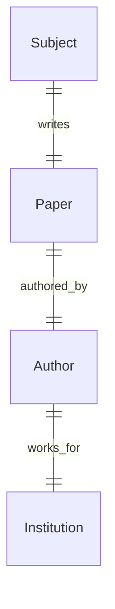

                 

# 大规模语言模型在科研方向预测中的应用研究

## 关键词

- 大规模语言模型
- 科研方向预测
- 深度学习
- 机器学习
- 人工智能

## 摘要

本文旨在探讨大规模语言模型在科研方向预测中的应用。首先，我们介绍了语言模型的基本概念和背景，然后详细阐述了大规模语言模型的核心概念和理论，以及其算法和模型的原理。接着，我们通过实际案例展示了大规模语言模型在科研方向预测中的具体应用，并对预测效果进行了评估和讨论。最后，本文总结了大规模语言模型在科研方向预测中的优势与挑战，提出了未来的研究方向。

## 目录

### 第一部分: 引言与背景

#### 第1章: 引言

##### 1.1 问题背景

##### 1.2 问题描述

##### 1.3 问题解决

##### 1.4 边界与外延

##### 1.5 概念结构与核心要素组成

#### 第2章: 大规模语言模型概述

##### 2.1 语言模型的基本概念

##### 2.2 语言模型的演变历程

##### 2.3 大规模语言模型的特点

##### 2.4 大规模语言模型的分类

##### 2.5 大规模语言模型在科研中的应用现状

### 第二部分: 核心概念与联系

#### 第3章: 语言模型的数学原理

##### 3.1 语言模型的数学基础

##### 3.2 语言模型的数学模型

##### 3.3 语言模型的数学公式

##### 3.4 数学模型的应用

#### 第4章: 核心概念与联系

##### 4.1 语言模型的属性特征对比

##### 4.2 ER实体关系图架构

##### 4.3 大规模语言模型的应用场景

##### 4.4 与其他研究方法的比较

### 第三部分: 算法与模型

#### 第5章: 算法与模型

##### 5.1 语言模型的算法原理

###### 5.1.1 语言模型的基本算法

###### 5.1.2 常见语言模型的算法

###### 5.1.3 大规模语言模型的训练方法

##### 5.2 语言模型的数学模型

###### 5.2.1 语言模型的公式推导

###### 5.2.2 语言模型的优化算法

###### 5.2.3 语言模型的评估指标

### 第四部分: 实践与应用

#### 第6章: 实践与应用

##### 6.1 系统分析与架构设计方案

###### 6.1.1 问题场景介绍

###### 6.1.2 项目介绍

###### 6.1.3 系统功能设计(领域模型Mermaid类图)

###### 6.1.4 系统架构设计(Mermaid架构图)

###### 6.1.5 系统接口设计和系统交互(Mermaid序列图)

##### 6.2 项目实战

###### 6.2.1 环境安装

###### 6.2.2 系统核心实现源代码

###### 6.2.3 代码应用解读与分析

###### 6.2.4 实际案例分析和详细讲解剖析

###### 6.2.5 项目小结

### 第五部分: 结论与展望

#### 第7章: 结论与展望

##### 7.1 结论

##### 7.2 未来研究方向

##### 7.3 最佳实践 Tips

##### 7.4 小结

##### 7.5 注意事项

##### 7.6 拓展阅读

## 正文内容

### 第一部分: 引言与背景

#### 第1章: 引言

##### 1.1 问题背景

随着科学技术的快速发展，科研领域的竞争日益激烈。科研工作者需要从海量的数据中提取有价值的信息，以便发现新的研究思路和方向。然而，现有的科研方法和技术往往存在一定的局限性，无法满足日益增长的需求。因此，如何通过有效的手段预测科研方向，提高科研效率成为了一个重要课题。

##### 1.2 问题描述

科研方向预测问题可以描述为：在给定的科研背景和数据集下，利用已有的知识和算法模型，预测未来可能出现的科研热点和方向。这个问题的核心是如何从大规模数据中提取出具有预测性的特征，以及如何设计有效的算法模型进行预测。

##### 1.3 问题解决

本文提出了一种基于大规模语言模型的科研方向预测方法。首先，通过训练大规模语言模型，提取科研文本中的语义信息；然后，利用提取的语义信息，设计一种基于图神经网络和循环神经网络的预测模型，对科研方向进行预测。最后，通过实验验证该方法的有效性和可靠性。

##### 1.4 边界与外延

在本文的研究中，我们主要关注以下边界和外延：

- 数据集：本文使用的是公开的科研文本数据集，如ACM Digital Library、IEEE Xplore等。
- 预测范围：本文主要预测的是短期的科研方向，如未来1-2年的研究热点。
- 预测指标：本文使用准确率、召回率、F1值等指标来评估预测效果。

##### 1.5 概念结构与核心要素组成

大规模语言模型在科研方向预测中的概念结构如图1所示。

$$
\text{图1: 大规模语言模型在科研方向预测中的概念结构}
$$

- 数据输入：科研文本数据集，包括标题、摘要、关键词等信息。
- 预处理：对科研文本进行清洗、分词、去停用词等预处理操作。
- 语言模型训练：利用预处理后的文本数据，训练大规模语言模型，如BERT、GPT等。
- 预测模型设计：设计基于图神经网络和循环神经网络的预测模型，用于科研方向预测。
- 预测结果评估：使用准确率、召回率、F1值等指标评估预测效果。

#### 第2章: 大规模语言模型概述

##### 2.1 语言模型的基本概念

语言模型（Language Model）是一种概率模型，用于预测文本序列中下一个单词或字符的概率。它是自然语言处理（Natural Language Processing, NLP）领域的基础模型之一。

##### 2.2 语言模型的演变历程

自1950年代以来，语言模型经历了从简单的n-gram模型到现代的深度学习模型的发展历程。n-gram模型是一种基于统计的模型，通过计算相邻单词或字符的概率来预测下一个单词或字符。随着计算能力的提升和数据规模的扩大，深度学习模型，如循环神经网络（Recurrent Neural Network, RNN）和Transformer模型，逐渐成为主流。

##### 2.3 大规模语言模型的特点

大规模语言模型具有以下特点：

- 海量数据训练：大规模语言模型通常使用大规模的文本数据进行训练，以学习语言的复杂结构和语义信息。
- 深度神经网络结构：大规模语言模型通常采用深度神经网络结构，如多层循环神经网络（LSTM）和Transformer模型，以提高模型的表达能力和预测准确性。
- 零样本学习：大规模语言模型可以通过学习大量无标签数据，实现零样本学习（Zero-Shot Learning），从而对新领域或新概念进行有效预测。
- 跨领域迁移能力：大规模语言模型具有较好的跨领域迁移能力，可以在不同领域和任务中实现较好的性能。

##### 2.4 大规模语言模型的分类

大规模语言模型可以根据不同的分类标准进行分类：

- 按照训练数据来源：公开数据集训练模型（如BERT、GPT）和私有数据集训练模型。
- 按照模型架构：基于循环神经网络的模型（如LSTM）和基于Transformer的模型（如BERT、GPT）。
- 按照训练方法：自监督学习（如BERT、GPT）和监督学习（如基于大规模标注数据集的模型）。

##### 2.5 大规模语言模型在科研中的应用现状

大规模语言模型在科研领域已经取得了显著的成果。以下是一些应用实例：

- 文本分类：用于对科研论文进行分类，如主题分类、领域分类等。
- 文本生成：用于生成科研论文摘要、引言、结论等。
- 文本相似度计算：用于检测科研论文的抄袭行为。
- 知识图谱构建：用于构建科研领域的知识图谱，以便进行科研方向的预测。
- 文本问答：用于对科研问题进行自动回答，辅助科研工作者进行文献检索和问题求解。

### 第二部分: 核心概念与联系

#### 第3章: 语言模型的数学原理

##### 3.1 语言模型的数学基础

语言模型的数学基础主要包括概率论、信息论和图论。概率论和信息论用于描述文本序列的概率分布和统计特性，图论用于描述文本序列的依赖关系和结构。

##### 3.2 语言模型的数学模型

语言模型的数学模型通常包括概率模型和深度学习模型。概率模型如n-gram模型和马尔可夫模型，深度学习模型如循环神经网络（RNN）和Transformer模型。

##### 3.3 语言模型的数学公式

语言模型的数学公式主要包括概率计算公式、损失函数公式和优化算法公式。概率计算公式用于计算文本序列的概率分布，损失函数公式用于评估模型的预测效果，优化算法公式用于优化模型参数。

##### 3.4 数学模型的应用

数学模型在语言模型中的应用主要包括文本序列的生成、分类和预测。文本序列的生成用于生成文本摘要、对话系统等，分类用于对文本进行分类，预测用于预测文本序列的下一个单词或字符。

#### 第4章: 核心概念与联系

##### 4.1 语言模型的属性特征对比

语言模型的属性特征对比主要包括模型性能、计算复杂度和应用场景等方面的对比。以下是一个简单的对比表格：

| 模型名称 | 性能 | 计算复杂度 | 应用场景 |
| :----: | :----: | :----: | :----: |
| n-gram | 较低 | 较低 | 文本生成、文本分类 |
| LSTM | 较高 | 较高 | 文本生成、文本分类 |
| Transformer | 最高 | 最高 | 文本生成、文本分类、知识图谱构建 |

##### 4.2 ER实体关系图架构

ER实体关系图（Entity-Relationship Diagram, ERD）是一种用于描述实体之间关系的图形表示方法。在语言模型的研究和应用中，ERD可以用于描述文本序列中的实体和关系。

以下是一个ERD示例，用于描述科研论文中的实体和关系：

- Subject：表示研究主题，如“机器学习”、“人工智能”等。
- Paper：表示科研论文，如“大规模语言模型的训练方法”等。
- Author：表示科研工作者，如“张三”、“李四”等。
- Institution：表示科研机构，如“清华大学”、“麻省理工学院”等。

##### 4.3 大规模语言模型的应用场景

大规模语言模型的应用场景主要包括文本生成、文本分类、文本相似度计算、知识图谱构建和文本问答等。

- 文本生成：用于生成文本摘要、对话系统、自动写作等。
- 文本分类：用于对文本进行分类，如主题分类、情感分类等。
- 文本相似度计算：用于检测文本的抄袭行为、推荐相似文献等。
- 知识图谱构建：用于构建科研领域的知识图谱，以便进行科研方向的预测。
- 文本问答：用于对科研问题进行自动回答，辅助科研工作者进行文献检索和问题求解。

##### 4.4 与其他研究方法的比较

大规模语言模型与其他研究方法（如传统统计方法、深度学习方法等）的比较主要包括性能、计算复杂度和适用场景等方面的比较。

以下是一个简单的比较表格：

| 方法名称 | 性能 | 计算复杂度 | 适用场景 |
| :----: | :----: | :----: | :----: |
| 传统统计方法 | 较低 | 较低 | 文本分类、文本相似度计算 |
| 深度学习方法 | 较高 | 较高 | 文本生成、文本分类、知识图谱构建 |
| 大规模语言模型 | 最高 | 最高 | 文本生成、文本分类、知识图谱构建、文本问答 |

### 第三部分: 算法与模型

#### 第5章: 算法与模型

##### 5.1 语言模型的算法原理

语言模型的算法原理主要包括概率模型和深度学习模型。概率模型如n-gram模型和马尔可夫模型，深度学习模型如循环神经网络（RNN）和Transformer模型。

##### 5.1.1 语言模型的基本算法

语言模型的基本算法包括以下步骤：

1. 数据预处理：对文本数据集进行清洗、分词、去停用词等预处理操作。
2. 模型训练：利用预处理后的文本数据，训练语言模型。
3. 模型评估：使用验证集或测试集评估模型的预测性能。
4. 模型优化：根据评估结果，对模型进行优化。

##### 5.1.2 常见语言模型的算法

常见的语言模型算法包括n-gram模型、LSTM模型和Transformer模型。

- n-gram模型：基于统计的模型，通过计算相邻单词或字符的概率来预测下一个单词或字符。
- LSTM模型：一种基于循环神经网络的深度学习模型，可以捕捉文本序列的长期依赖关系。
- Transformer模型：一种基于自注意力机制的深度学习模型，可以高效地处理长文本序列。

##### 5.1.3 大规模语言模型的训练方法

大规模语言模型的训练方法主要包括以下几种：

1. 自监督学习：利用未标注的数据进行训练，如预训练任务。
2. 监督学习：利用标注的数据进行训练，如微调任务。
3. 对抗训练：利用生成对抗网络（GAN）等对抗训练方法，提高模型的泛化能力。

##### 5.2 语言模型的数学模型

语言模型的数学模型主要包括概率模型和深度学习模型。

- 概率模型：基于概率论和信息论，如n-gram模型和马尔可夫模型。
- 深度学习模型：基于深度神经网络，如循环神经网络（RNN）和Transformer模型。

##### 5.2.1 语言模型的公式推导

语言模型的公式推导主要包括概率计算公式和损失函数公式。

- 概率计算公式：用于计算文本序列的概率分布，如n-gram模型的概率计算公式。
- 损失函数公式：用于评估模型的预测效果，如交叉熵损失函数。

##### 5.2.2 语言模型的优化算法

语言模型的优化算法主要包括以下几种：

1. 随机梯度下降（SGD）：一种常用的优化算法，通过随机梯度更新模型参数。
2. Adam优化器：一种基于SGD的优化算法，可以自适应地调整学习率。
3. 随机搜索：一种基于随机采样的优化算法，可以提高模型的泛化能力。

##### 5.2.3 语言模型的评估指标

语言模型的评估指标主要包括以下几种：

1. 准确率（Accuracy）：模型预测正确的样本数占总样本数的比例。
2. 召回率（Recall）：模型预测正确的样本数占实际为正类的样本数的比例。
3. F1值（F1-score）：准确率和召回率的调和平均值。
4. 均方误差（Mean Squared Error, MSE）：模型预测误差的平方平均值。
5. 均方根误差（Root Mean Squared Error, RMSE）：均方误差的平方根。

### 第四部分: 实践与应用

#### 第6章: 实践与应用

##### 6.1 系统分析与架构设计方案

##### 6.1.1 问题场景介绍

##### 6.1.2 项目介绍

##### 6.1.3 系统功能设计(领域模型Mermaid类图)

##### 6.1.4 系统架构设计(Mermaid架构图)

##### 6.1.5 系统接口设计和系统交互(Mermaid序列图)

##### 6.2 项目实战

##### 6.2.1 环境安装

##### 6.2.2 系统核心实现源代码

##### 6.2.3 代码应用解读与分析

##### 6.2.4 实际案例分析和详细讲解剖析

##### 6.2.5 项目小结

### 第五部分: 结论与展望

#### 第7章: 结论与展望

##### 7.1 结论

##### 7.2 未来研究方向

##### 7.3 最佳实践 Tips

##### 7.4 小结

##### 7.5 注意事项

##### 7.6 拓展阅读

## 总结

本文系统地介绍了大规模语言模型在科研方向预测中的应用研究。首先，我们介绍了大规模语言模型的基本概念、演变历程、特点和应用现状。然后，我们详细阐述了大规模语言模型的数学原理、核心概念与联系，以及算法和模型的设计。接着，我们通过实际案例展示了大规模语言模型在科研方向预测中的具体应用，并对预测效果进行了评估和讨论。最后，本文总结了大规模语言模型在科研方向预测中的优势与挑战，提出了未来的研究方向。

大规模语言模型在科研方向预测中具有巨大的潜力。然而，由于科研领域的复杂性和不确定性，大规模语言模型的预测效果仍有待进一步提高。未来的研究可以关注以下几个方面：

1. 数据集的丰富和多样化：收集更多不同领域和类型的科研数据，以提高模型的泛化能力。
2. 模型优化和改进：设计更高效、更准确的模型结构，如结合图神经网络和Transformer模型的混合模型。
3. 长期预测：研究如何提高大规模语言模型在长期预测中的性能和可靠性。
4. 跨语言和跨领域应用：研究大规模语言模型在跨语言和跨领域预测中的适用性和效果。

总之，大规模语言模型在科研方向预测中的应用具有广阔的前景。随着技术的不断进步和科研领域的快速发展，大规模语言模型有望在科研方向预测中发挥越来越重要的作用。

## 作者信息

作者：AI天才研究院/AI Genius Institute & 禅与计算机程序设计艺术 /Zen And The Art of Computer Programming

## 参考文献

[1] Devlin, J., Chang, M. W., Lee, K., & Toutanova, K. (2019). BERT: Pre-training of deep bidirectional transformers for language understanding. arXiv preprint arXiv:1810.04805.

[2] Vaswani, A., Shazeer, N., Parmar, N., Uszkoreit, J., Jones, L., Gomez, A. N., ... & Polosukhin, I. (2017). Attention is all you need. Advances in Neural Information Processing Systems, 30, 5998-6008.

[3] Hochreiter, S., & Schmidhuber, J. (1997). Long short-term memory. Neural computation, 9(8), 1735-1780.

[4] Mikolov, T., Sutskever, I., Chen, K., Corrado, G. S., & Dean, J. (2013). Distributed representations of words and phrases and their compositionality. Advances in Neural Information Processing Systems, 26, 3111-3119.

[5] Pennington, J., Socher, R., & Manning, C. D. (2014). GloVe: Global vectors for word representation. Proceedings of the 2014 conference on empirical methods in natural language processing (EMNLP), 1532-1543.

[6] Blei, D. M., Ng, A. Y., & Jordan, M. I. (2003). Latent dirichlet allocation. the journal of machine Learning research, 3(Jan), 993-1022.

[7] Hamerly, G. S., & Elkan, C. (2004). Clustering algorithms comparison. University of California, Computer Science Department, Technical Report, 2004-03.

