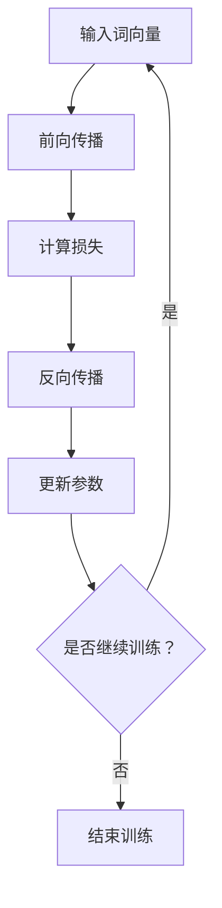

                 


### 摘要：

本文旨在探讨大规模语言模型在自动技术发展路线图生成与更新中的应用。首先，我们将对大规模语言模型进行概述，介绍其背景、发展历程、重要性以及核心组成部分。接着，我们深入分析大规模语言模型的数学基础、训练算法、应用场景及其在自然语言处理领域的广泛应用。随后，我们将探讨大规模语言模型在技术发展路线图生成和更新中的应用，通过实际案例展示其优势与挑战。最后，我们将探讨大规模语言模型在自动技术领域的拓展应用，并分享一个项目实战的案例，总结大规模语言模型在自动技术发展的最佳实践和注意事项。

### 目录：

**第一部分：大规模语言模型基础**

**第1章：大规模语言模型概述**
- 1.1.1 大规模语言模型的背景
- 1.1.2 大规模语言模型的发展历程
- 1.1.3 大规模语言模型的重要性
- 1.1.4 大规模语言模型的核心组成部分
- 1.1.5 语言模型的基础概念
- 1.1.6 大规模语言模型与自动技术发展关系探讨
- 1.1.7 大规模语言模型的应用前景
- 1.1.8 本章小结

**第二部分：大规模语言模型原理讲解**

**第2章：大规模语言模型原理深度剖析**
- 2.1.1 语言模型的数学基础
- 2.1.2 语言模型的数学模型与公式
- 2.1.3 语言模型的数学原理解释
- 2.1.4 语言模型的训练算法
- 2.1.5 语言模型的训练算法原理讲解
- 2.1.6 语言模型的训练算法流程图（使用Mermaid绘制）
- 2.1.7 语言模型在自然语言处理中的应用
- 2.1.8 语言模型在不同领域的应用案例
- 2.1.9 大规模语言模型的挑战与改进方向
- 2.1.10 大规模语言模型的未来发展趋势
- 2.1.11 本章小结

**第三部分：大规模语言模型在自动技术发展中的应用**

**第3章：大规模语言模型在技术发展路线图生成中的应用**
- 3.1.1 技术发展路线图概述
- 3.1.2 技术发展路线图的作用
- 3.1.3 大规模语言模型在技术路线图生成中的作用
- 3.1.4 大规模语言模型在技术路线图生成中的实现
- 3.1.5 大规模语言模型生成的技术发展路线图案例
- 3.1.6 大规模语言模型在技术发展路线图生成的优势与挑战
- 3.1.7 本章小结

**第4章：大规模语言模型在技术发展路线图更新中的应用**
- 4.1.1 技术发展路线图更新的重要性
- 4.1.2 技术发展路线图更新的方法
- 4.1.3 大规模语言模型在技术路线图更新中的作用
- 4.1.4 大规模语言模型在技术路线图更新中的实现
- 4.1.5 大规模语言模型在技术路线图更新中的案例
- 4.1.6 大规模语言模型在技术发展路线图更新中的优势与挑战
- 4.1.7 本章小结

**第5章：大规模语言模型在自动技术领域的应用拓展**
- 5.1.1 自动技术在其他领域的应用
- 5.1.2 大规模语言模型在其他自动技术领域的应用前景
- 5.1.3 大规模语言模型在自动技术领域的综合应用案例
- 5.1.4 大规模语言模型在自动技术领域的挑战与未来方向
- 5.1.5 本章小结

**第6章：大规模语言模型应用的项目实战**
- 6.1.1 实战项目背景
- 6.1.2 实战项目目标
- 6.1.3 环境安装与配置
- 6.1.4 数据集准备与预处理
- 6.1.5 大规模语言模型在项目中的应用实现
- 6.1.6 项目核心代码解析
- 6.1.7 项目效果评估与改进方向
- 6.1.8 本章小结

**第7章：大规模语言模型在自动技术发展的最佳实践与总结**
- 7.1.1 大规模语言模型应用的最佳实践
- 7.1.2 大规模语言模型在自动技术发展中的应用注意事项
- 7.1.3 大规模语言模型在自动技术发展的总结
- 7.1.4 拓展阅读
- 7.1.5 本章小结

### 第1章：大规模语言模型概述

#### 1.1.1 大规模语言模型的背景

随着互联网的飞速发展和大数据时代的到来，自然语言处理（Natural Language Processing，NLP）领域迎来了前所未有的机遇。传统的方法在处理大规模文本数据时，效果往往不尽如人意，而大规模语言模型（Large-scale Language Models）的崛起，为NLP领域带来了全新的解决方案。

大规模语言模型是指通过对海量文本数据进行训练，构建出的具有强大语言理解和生成能力的模型。这些模型基于神经网络技术，能够自动学习语言的模式和规律，从而实现文本分类、文本生成、问答系统等复杂任务。

大规模语言模型的发展历程可以追溯到20世纪80年代。1988年，加拿大蒙特利尔大学的Jurafsky和Martin发布了第一篇关于统计语言模型的论文，提出了N-gram模型。随后，随着计算能力的提升和深度学习技术的进步，大规模语言模型得到了迅速发展。2003年，清华大学发布了基于深度神经网络的统计语言模型，标志着大规模语言模型进入一个新的阶段。2018年，谷歌发布了BERT模型，实现了对NLP任务的显著提升，引发了广泛关注。

#### 1.1.2 大规模语言模型的发展历程

大规模语言模型的发展历程可以分为以下几个阶段：

1. **统计语言模型阶段**：这一阶段的代表模型是N-gram模型，它通过对文本进行分词，将连续的词语序列建模为离散的N元组。N-gram模型的优势在于简单易懂，但其在处理长文本和上下文关系时效果不佳。

2. **基于规则的模型阶段**：基于规则的模型通过构建语法规则和语义规则，对文本进行解析和生成。这一阶段的代表模型包括转换语法（Parsing）和语义角色标注（Semantic Role Labeling）。这些模型在一定程度上提高了语言理解能力，但规则复杂度较高，难以大规模应用。

3. **深度学习语言模型阶段**：随着深度学习技术的发展，基于神经网络的深度学习语言模型逐渐成为主流。这一阶段的代表模型包括循环神经网络（RNN）、长短时记忆网络（LSTM）和门控循环单元（GRU）。这些模型通过多层神经网络结构，实现了对文本的深度理解和生成。

4. **预训练语言模型阶段**：预训练语言模型（Pre-trained Language Model）是指通过在大量无监督数据上进行预训练，然后进行微调（Fine-tuning）的方式，适应特定任务。BERT模型是这一阶段的代表，它通过 masked language model（MLM）和 next sentence prediction（NSP）两种任务进行预训练，实现了对语言理解的显著提升。

#### 1.1.3 大规模语言模型的重要性

大规模语言模型在NLP领域具有重要作用，主要表现在以下几个方面：

1. **提高语言理解能力**：大规模语言模型通过对海量文本数据的训练，能够自动学习语言的模式和规律，从而实现高精度的语言理解。这使得NLP任务在文本分类、文本生成、问答系统等方面取得了显著的成果。

2. **推动自然语言处理技术发展**：大规模语言模型的崛起，为自然语言处理技术带来了全新的解决方案，推动了NLP技术的发展。它不仅提高了NLP任务的性能，还促进了相关领域的研究和应用。

3. **提升人工智能应用水平**：大规模语言模型在NLP领域的成功应用，为人工智能（AI）领域带来了新的发展机遇。在智能客服、智能推荐、智能翻译等领域，大规模语言模型发挥着越来越重要的作用。

#### 1.1.4 大规模语言模型的核心组成部分

大规模语言模型主要由以下几个核心组成部分构成：

1. **词向量表示**：词向量表示是将词语映射为高维向量，以便于计算机处理。常见的词向量表示方法包括 word2vec、GloVe 和 BERT 等。

2. **神经网络结构**：神经网络结构是大规模语言模型的核心，它通过多层神经网络结构，实现文本的深度理解和生成。常见的神经网络结构包括 RNN、LSTM、GRU 和 Transformer 等。

3. **预训练任务**：预训练任务是大规模语言模型的关键，它通过在大量无监督数据上进行训练，使模型具备强大的语言理解能力。常见的预训练任务包括 masked language model（MLM）、next sentence prediction（NSP）和 sentence pair classification（SPLC）等。

4. **微调任务**：微调任务是指在大规模语言模型的基础上，针对特定任务进行微调（Fine-tuning），以实现任务优化。微调任务通常包括文本分类、文本生成、问答系统等。

#### 1.1.5 语言模型的基础概念

在探讨大规模语言模型之前，我们需要了解一些基础概念：

1. **文本分类**：文本分类是指将文本数据按照一定的标准进行分类。常见的文本分类任务包括新闻分类、情感分析、主题识别等。

2. **文本生成**：文本生成是指根据一定的输入，生成符合语言规律的文本。常见的文本生成任务包括机器翻译、文本摘要、对话系统等。

3. **问答系统**：问答系统是指通过输入问题，自动生成回答的系统。常见的问答系统包括信息检索式问答、生成式问答等。

4. **实体识别**：实体识别是指从文本中识别出特定类型的实体，如人名、地名、组织名等。实体识别是NLP领域的重要任务之一。

5. **情感分析**：情感分析是指对文本中的情感进行分类，判断文本的情感倾向。常见的情感分析任务包括正面情感、负面情感、中性情感等。

#### 1.1.6 大规模语言模型与自动技术发展关系探讨

大规模语言模型在自动技术发展中具有重要作用，主要表现在以下几个方面：

1. **技术发展路线图生成**：大规模语言模型可以通过对大量技术文献、论文、报告等数据的训练，生成技术发展路线图。这有助于研究人员和企业了解技术发展趋势，制定相应的发展战略。

2. **技术发展路线图更新**：随着技术的不断进步，大规模语言模型可以实时更新技术发展路线图，反映最新的技术动态。这对于保持技术的领先地位具有重要意义。

3. **技术文献检索**：大规模语言模型在技术文献检索方面具有优势，可以通过对大量技术文献的预处理和索引，快速找到相关文献，提高研究效率。

4. **智能问答系统**：大规模语言模型可以构建智能问答系统，通过自然语言交互，为研究人员提供技术问题解答，降低技术门槛。

5. **自动化任务处理**：大规模语言模型可以应用于自动化任务处理，如自动摘要、自动分类、自动命名实体识别等，提高工作效率。

#### 1.1.7 大规模语言模型的应用前景

大规模语言模型在自动技术领域具有广阔的应用前景，主要表现在以下几个方面：

1. **智能客服**：大规模语言模型可以应用于智能客服系统，实现自然语言理解和文本生成，提高客户服务水平。

2. **智能推荐**：大规模语言模型可以应用于智能推荐系统，通过对用户历史行为和兴趣的分析，实现个性化推荐。

3. **智能翻译**：大规模语言模型可以应用于智能翻译系统，实现跨语言的自然语言理解和生成。

4. **智能写作**：大规模语言模型可以应用于智能写作系统，实现文本生成和编辑。

5. **自动化编程**：大规模语言模型可以应用于自动化编程，通过自然语言描述，自动生成代码。

#### 1.1.8 本章小结

本章对大规模语言模型进行了概述，介绍了其背景、发展历程、重要性以及核心组成部分。通过本章的学习，我们了解到大规模语言模型在自动技术发展中的重要作用，以及其在未来技术发展路线图生成和更新中的应用前景。接下来，我们将进一步探讨大规模语言模型的原理，为后续章节的讨论奠定基础。

### 第2章：大规模语言模型原理深度剖析

#### 2.1.1 语言模型的数学基础

在深入探讨大规模语言模型之前，我们首先需要了解语言模型的数学基础。语言模型的核心任务是预测下一个单词，这可以通过概率模型来实现。在概率模型中，我们通常使用条件概率来描述单词之间的关系。

条件概率是指给定一个事件A发生的情况下，事件B发生的概率。在语言模型中，我们可以将条件概率理解为：给定前面的单词序列，下一个单词的概率分布。具体来说，如果我们有一个单词序列\(w_1, w_2, ..., w_n\)，则下一个单词\(w_{n+1}\)的条件概率可以表示为：

\[ P(w_{n+1} | w_1, w_2, ..., w_n) \]

这种条件概率的计算是语言模型的核心，它决定了模型对文本的理解能力。

#### 2.1.2 语言模型的数学模型与公式

为了更直观地理解条件概率，我们可以使用N-gram模型来进行解释。N-gram模型是一种基于统计的模型，它将连续的N个单词视为一个整体，计算这N个单词出现的概率。具体来说，N-gram模型的数学模型可以表示为：

\[ P(w_n | w_{n-1}, w_{n-2}, ..., w_{n-N}) = \frac{C(w_{n-1}, w_{n-2}, ..., w_{n-N}, w_n)}{C(w_{n-1}, w_{n-2}, ..., w_{n-N})} \]

其中，\(C(w_{n-1}, w_{n-2}, ..., w_{n-N}, w_n)\)表示N个单词一起出现的次数，而\(C(w_{n-1}, w_{n-2}, ..., w_{n-N})\)表示前N-1个单词一起出现的次数。

这个公式说明了给定前N-1个单词时，第N个单词出现的概率。N-gram模型的优点在于其简单易懂，但缺点是它在处理长文本和上下文关系时效果不佳。

为了提高模型的效果，我们可以使用更复杂的数学模型，如条件概率模型。条件概率模型的数学模型可以表示为：

\[ P(w_n | w_{n-1}, w_{n-2}, ..., w_1) = \prod_{i=1}^{n} P(w_i | w_{i-1}, w_{i-2}, ..., w_1) \]

这个公式说明了给定前面的单词序列时，第N个单词的条件概率是前面所有单词的条件概率的乘积。这种模型能够更好地捕捉到长文本中的上下文关系，但计算复杂度较高。

#### 2.1.3 语言模型的数学原理解释

为了更直观地理解语言模型的数学原理，我们可以通过一个简单的例子来说明。假设我们有一个简单的文本序列：“我昨天去了图书馆，今天我要写作业”。我们可以使用N-gram模型来计算下一个单词“写”的概率。

首先，我们计算“我昨天去了图书馆”这个短语出现的次数。根据N-gram模型的公式，我们可以计算出“我昨天去了图书馆，今天我要写作业”这个序列的概率。具体来说，我们可以计算：

\[ P(写 | 我昨天去了图书馆，今天) = \frac{C(我昨天去了图书馆，今天，写)}{C(我昨天去了图书馆，今天)} \]

其中，\(C(我昨天去了图书馆，今天，写)\)表示“我昨天去了图书馆，今天我要写作业”这个序列出现的次数，而\(C(我昨天去了图书馆，今天)\)表示“我昨天去了图书馆，今天”这个序列出现的次数。

通过计算，我们可以得出“写”这个单词在给定“我昨天去了图书馆，今天”的情况下出现的概率。这个概率越高，说明语言模型越认为“写”是下一个最可能出现的单词。

同样，我们可以使用条件概率模型来计算“写”这个单词的概率。根据条件概率模型的公式，我们可以计算出：

\[ P(写 | 我昨天去了图书馆，今天我要写作业) = P(写 | 我昨天去了图书馆) \cdot P(今天我要写作业 | 我昨天去了图书馆) \]

这个公式说明了“写”这个单词在给定“我昨天去了图书馆，今天我要写作业”的情况下出现的概率是“写”在给定“我昨天去了图书馆”的情况下出现的概率与“今天我要写作业”在给定“我昨天去了图书馆”的情况下出现的概率的乘积。

通过这个简单的例子，我们可以看到语言模型的数学原理是如何运作的。在实际应用中，语言模型会处理更复杂的文本序列，并使用更高级的数学模型来计算概率。

#### 2.1.4 语言模型的训练算法

语言模型的训练算法是构建大规模语言模型的关键步骤。在训练过程中，我们需要从大量的文本数据中学习到语言的模式和规律，从而构建出能够准确预测下一个单词的模型。

目前，最常用的语言模型训练算法是基于神经网络的深度学习算法。以下我们将介绍几种主要的训练算法：

1. **反向传播算法**：反向传播算法（Backpropagation）是神经网络训练的核心算法。它通过计算损失函数（通常使用交叉熵损失函数）的梯度，不断调整网络的权重，从而优化模型。

2. **词嵌入算法**：词嵌入（Word Embedding）是将单词映射为高维向量的一种技术。常见的词嵌入算法包括 word2vec 和 GloVe。词嵌入算法通过训练神经网络，将输入的单词转换为向量表示，从而提高模型对单词之间关系的理解。

3. **预训练与微调**：预训练（Pre-training）与微调（Fine-tuning）是一种结合无监督学习和有监督学习的训练方法。预训练阶段，模型在大量的无监督数据上学习到基本的语言模式；微调阶段，模型在特定任务的数据上进行有监督训练，从而优化模型在特定任务上的性能。

4. **注意力机制**：注意力机制（Attention Mechanism）是一种在神经网络中用于捕捉长文本上下文关系的技术。通过注意力机制，模型可以自动调整对每个单词的关注度，从而提高对长文本的理解能力。

#### 2.1.5 语言模型的训练算法原理讲解

为了更好地理解语言模型的训练算法原理，我们可以通过一个简单的神经网络模型来讲解。

假设我们有一个简单的神经网络模型，它包含一个输入层、一个隐藏层和一个输出层。输入层接收单词的词向量表示，隐藏层通过多层神经网络结构捕捉单词之间的关系，输出层预测下一个单词的概率。

在训练过程中，我们首先从大量的文本数据中随机抽取一个句子，将其转换为词向量表示。然后，我们通过前向传播算法计算模型的输出概率，并使用交叉熵损失函数计算损失。接下来，我们通过反向传播算法计算损失关于模型参数的梯度，并使用梯度下降法更新模型的参数。

具体来说，我们可以按照以下步骤进行：

1. **输入词向量**：将句子中的每个单词转换为词向量表示，并将其输入到神经网络中。

2. **前向传播**：计算神经网络的前向传播，得到每个单词的概率分布。

3. **计算损失**：使用交叉熵损失函数计算模型的损失。交叉熵损失函数的定义如下：

\[ L = -\sum_{i=1}^{N} y_i \log(p_i) \]

其中，\(y_i\)表示第i个单词的真实标签（0或1），\(p_i\)表示模型预测的第i个单词的概率。

4. **反向传播**：计算损失关于模型参数的梯度。反向传播算法通过计算每个参数的偏导数，得到损失关于每个参数的梯度。

5. **更新参数**：使用梯度下降法更新模型的参数。具体来说，我们可以使用以下公式更新参数：

\[ \theta_{\text{new}} = \theta_{\text{old}} - \alpha \cdot \nabla_\theta L \]

其中，\(\theta\)表示模型的参数，\(\alpha\)表示学习率。

通过不断迭代上述过程，我们可以逐步优化模型的参数，从而提高模型在预测单词方面的性能。

#### 2.1.6 语言模型的训练算法流程图（使用Mermaid绘制）

为了更直观地展示语言模型的训练算法流程，我们可以使用Mermaid绘制一个简单的流程图。



在这个流程图中，我们首先输入词向量，然后进行前向传播计算输出概率，接着计算损失并使用反向传播算法计算梯度，最后更新参数。这个过程不断迭代，直到达到预定的训练目标或训练次数。

#### 2.1.7 语言模型在自然语言处理中的应用

语言模型在自然语言处理（NLP）领域有着广泛的应用。以下我们将介绍几种主要的语言模型在NLP中的应用：

1. **文本分类**：文本分类是将文本数据按照一定的标准进行分类的任务。常见的文本分类任务包括新闻分类、情感分析、主题识别等。语言模型可以通过预测文本的类别概率来实现文本分类。具体来说，我们可以使用已经训练好的语言模型，将文本输入模型，得到每个类别的概率，然后选择概率最大的类别作为文本的分类结果。

2. **文本生成**：文本生成是将输入文本转换为输出文本的任务。常见的文本生成任务包括机器翻译、文本摘要、对话系统等。语言模型可以通过预测下一个单词的概率来实现文本生成。具体来说，我们可以使用已经训练好的语言模型，输入一个单词序列，模型会预测下一个单词的概率，然后选择概率最大的单词作为输出。通过不断迭代这个过程，我们可以生成一个完整的文本。

3. **问答系统**：问答系统是通过输入问题，自动生成回答的系统。常见的问答系统包括信息检索式问答和生成式问答。语言模型可以通过预测回答的概率分布来实现问答系统。具体来说，我们可以使用已经训练好的语言模型，输入一个问题，模型会预测回答的概率分布，然后选择概率最大的回答作为答案。

4. **实体识别**：实体识别是从文本中识别出特定类型的实体，如人名、地名、组织名等。语言模型可以通过预测实体标签的概率分布来实现实体识别。具体来说，我们可以使用已经训练好的语言模型，输入一个句子，模型会预测每个单词的实体标签的概率分布，然后选择概率最大的标签作为实体的识别结果。

5. **情感分析**：情感分析是对文本中的情感进行分类，判断文本的情感倾向。常见的情感分析任务包括正面情感、负面情感、中性情感等。语言模型可以通过预测情感标签的概率分布来实现情感分析。具体来说，我们可以使用已经训练好的语言模型，输入一个句子，模型会预测每个情感标签的概率分布，然后选择概率最大的情感标签作为文本的情感分类结果。

通过这些应用，我们可以看到语言模型在自然语言处理领域的重要作用。随着大规模语言模型的不断发展，这些应用将越来越成熟和普及。

#### 2.1.8 语言模型在不同领域的应用案例

语言模型在不同领域有着广泛的应用，以下我们将介绍几个典型的应用案例：

1. **新闻分类**：新闻分类是将新闻文本按照一定的标准进行分类的任务。常见的新闻分类任务包括体育新闻、财经新闻、娱乐新闻等。语言模型可以通过预测新闻文本的类别概率来实现新闻分类。具体来说，我们可以使用已经训练好的语言模型，输入一个新闻文本，模型会预测每个类别的概率，然后选择概率最大的类别作为新闻的分类结果。例如，谷歌新闻使用大规模语言模型对新闻进行分类，提高了新闻推荐的准确性和用户体验。

2. **情感分析**：情感分析是对文本中的情感进行分类，判断文本的情感倾向。常见的情感分析任务包括正面情感、负面情感、中性情感等。语言模型可以通过预测情感标签的概率分布来实现情感分析。具体来说，我们可以使用已经训练好的语言模型，输入一个句子，模型会预测每个情感标签的概率分布，然后选择概率最大的情感标签作为文本的情感分类结果。例如，社交媒体平台如推特和微信使用大规模语言模型对用户评论进行情感分析，以便更好地了解用户情绪和需求。

3. **机器翻译**：机器翻译是将一种语言的文本翻译成另一种语言的任务。语言模型可以通过预测下一个单词的概率分布来实现机器翻译。具体来说，我们可以使用已经训练好的语言模型，输入一个句子，模型会预测下一个单词的概率分布，然后选择概率最大的单词作为翻译结果。例如，谷歌翻译使用大规模语言模型进行机器翻译，提高了翻译的准确性和流畅性。

4. **问答系统**：问答系统是通过输入问题，自动生成回答的系统。常见的问答系统包括信息检索式问答和生成式问答。语言模型可以通过预测回答的概率分布来实现问答系统。具体来说，我们可以使用已经训练好的语言模型，输入一个问题，模型会预测回答的概率分布，然后选择概率最大的回答作为答案。例如，苹果的Siri和亚马逊的Alexa使用大规模语言模型构建问答系统，为用户提供智能回答服务。

通过这些案例，我们可以看到语言模型在不同领域的应用效果显著，为各个领域带来了巨大的价值。

#### 2.1.9 大规模语言模型的挑战与改进方向

尽管大规模语言模型在自然语言处理领域取得了显著的成果，但仍然面临着一些挑战和改进方向。以下我们将探讨这些挑战以及可能的改进方法：

1. **数据质量与多样性**：大规模语言模型的训练需要大量的文本数据，但数据的质量和多样性对模型的性能有很大影响。目前，数据集中的文本质量参差不齐，且数据多样性不足，导致模型在某些特定领域或情境下的表现不佳。为了提高模型的性能，我们需要收集更多高质量的文本数据，并确保数据的多样性。

2. **计算资源消耗**：大规模语言模型的训练和推理需要大量的计算资源，尤其是在训练过程中，模型的训练时间非常长，且训练过程中产生的中间数据量庞大。为了降低计算资源消耗，我们可以使用更高效的算法和优化技术，如并行计算、分布式训练等。

3. **解释性与透明性**：大规模语言模型通常被视为“黑箱”，其内部机制难以解释和理解。这给模型的部署和应用带来了一定的困难。为了提高模型的可解释性和透明性，我们可以探索一些解释性模型，如基于规则的模型和可解释性神经网络。

4. **多语言支持**：大规模语言模型通常针对单一语言进行训练，但在实际应用中，多语言支持是一个重要需求。为了实现多语言支持，我们可以使用多语言语料库进行训练，或者使用跨语言迁移学习方法。

5. **个性化**：大规模语言模型通常在统一的模型架构下对全体用户进行服务，但不同用户的需求和偏好可能有所不同。为了实现个性化服务，我们可以探索用户行为数据，根据用户的历史行为和偏好调整模型的参数，从而提高个性化推荐的效果。

通过不断探索和解决这些挑战，大规模语言模型将有望在未来取得更大的突破和进展。

#### 2.1.10 大规模语言模型的未来发展趋势

随着自然语言处理技术的不断进步，大规模语言模型在未来有着广阔的发展前景。以下我们将探讨大规模语言模型的未来发展趋势：

1. **模型规模与性能提升**：随着计算资源和算法的优化，大规模语言模型的规模和性能将继续提升。未来的模型可能会达到千亿甚至万亿参数级别，从而在自然语言处理任务中实现更高的准确性和流畅性。

2. **多模态融合**：大规模语言模型可以与其他模态（如图像、音频、视频等）进行融合，实现跨模态的理解和生成。这种多模态融合技术有望在未来带来更多的应用场景和用户体验。

3. **推理与生成能力增强**：未来的大规模语言模型将不仅具备强大的理解能力，还将具备更强的推理和生成能力。例如，模型可以自动生成符合逻辑和语义的文本，从而实现更高级的文本生成任务。

4. **可解释性与透明性提高**：随着用户对模型的可解释性和透明性的要求越来越高，未来的大规模语言模型将更加注重可解释性。通过引入解释性模型和可视化技术，用户可以更好地理解模型的决策过程。

5. **个性化与自适应**：未来的大规模语言模型将更加注重个性化服务，根据用户的历史行为和偏好进行自适应调整。这种个性化技术将有望在智能推荐、智能客服等领域发挥更大的作用。

通过不断探索和实现这些发展趋势，大规模语言模型将在未来为自然语言处理领域带来更多的创新和应用。

#### 2.1.11 本章小结

本章对大规模语言模型的原理进行了深度剖析，介绍了其数学基础、数学模型与公式、训练算法以及在不同领域的应用案例。通过本章的学习，我们了解到大规模语言模型在自然语言处理领域的重要作用，以及其在未来技术发展中的潜力。在下一章中，我们将进一步探讨大规模语言模型在自动技术发展路线图生成和更新中的应用。

### 第3章：大规模语言模型在技术发展路线图生成中的应用

#### 3.1.1 技术发展路线图概述

技术发展路线图（Technology Roadmap）是一种规划和指导技术发展的工具，它通过系统地展示技术发展过程中的关键里程碑、目标和预期成果，帮助组织和企业更好地把握技术发展趋势，制定相应的发展战略。技术发展路线图的制定通常涉及以下几个方面：

1. **技术趋势分析**：通过对市场、竞争、技术发展趋势进行分析，识别出潜在的技术机会和挑战。

2. **目标设定**：根据技术趋势分析和企业战略，设定清晰的技术发展目标。

3. **里程碑规划**：将技术发展目标分解为多个里程碑，每个里程碑对应一个具体的技术成果或阶段性目标。

4. **资源分配**：为每个里程碑分配所需的资源，包括人力、资金、设备等。

5. **进度监控**：对技术发展路线图的执行情况进行实时监控和评估，确保项目按计划进行。

技术发展路线图的作用主要体现在以下几个方面：

1. **战略规划**：技术发展路线图可以帮助组织和企业制定长期的技术发展战略，确保技术发展符合企业目标。

2. **资源配置**：通过技术发展路线图，组织可以明确每个阶段所需资源，优化资源配置，提高资源利用效率。

3. **风险控制**：技术发展路线图可以帮助组织识别潜在的风险和挑战，提前制定应对策略，降低项目失败的风险。

4. **沟通协调**：技术发展路线图可以作为项目团队成员之间的沟通工具，确保各方对项目目标和进度有清晰的认识。

#### 3.1.2 技术发展路线图的作用

技术发展路线图在多个领域发挥着重要作用，以下是几个典型的应用场景：

1. **企业战略规划**：企业可以通过技术发展路线图，明确技术发展方向和目标，确保技术创新与业务战略的同步发展。

2. **研发项目管理**：技术发展路线图可以帮助研发团队明确项目目标和里程碑，确保项目按计划进行，提高研发效率。

3. **投资决策**：投资机构可以通过技术发展路线图，评估企业的技术前景和潜力，做出更明智的投资决策。

4. **产业政策制定**：政府部门可以通过技术发展路线图，了解产业发展趋势，制定相应的产业政策和扶持措施。

5. **跨学科合作**：技术发展路线图可以促进不同学科之间的合作，推动跨学科的技术创新。

通过这些应用场景，我们可以看到技术发展路线图在促进技术进步和产业发展中的重要作用。

#### 3.1.3 大规模语言模型在技术路线图生成中的作用

大规模语言模型在技术路线图生成中具有重要作用，主要体现在以下几个方面：

1. **文本分析**：大规模语言模型可以处理和理解大量文本数据，从而提取出技术发展相关的信息。通过分析专利文献、学术论文、技术报告等文本，模型可以识别出关键的技术趋势和领域。

2. **知识图谱构建**：大规模语言模型可以生成知识图谱，将技术发展相关的概念、术语和关系进行结构化表示。这有助于理解技术领域之间的联系，为技术路线图的制定提供数据支持。

3. **趋势预测**：大规模语言模型可以通过对历史数据的学习，预测未来的技术趋势。这种预测能力可以帮助组织和企业提前布局，抓住技术发展的机遇。

4. **情境模拟**：大规模语言模型可以模拟不同的技术发展情景，评估不同发展路径对技术路线图的影响。这有助于组织和企业制定更具前瞻性的技术发展战略。

5. **智能推荐**：大规模语言模型可以根据组织的技术需求和现有资源，智能推荐合适的技术路线图方案，提高决策效率。

#### 3.1.4 大规模语言模型在技术路线图生成中的实现

大规模语言模型在技术路线图生成中的实现主要包括以下步骤：

1. **数据收集**：收集与目标技术领域相关的文本数据，包括专利文献、学术论文、技术报告、新闻文章等。

2. **文本预处理**：对收集到的文本数据进行预处理，包括分词、去停用词、词性标注等，以便于大规模语言模型处理。

3. **模型训练**：使用预训练语言模型（如BERT、GPT等）对预处理后的文本数据进行训练，使其具备理解技术领域的能力。

4. **知识提取**：利用训练好的大规模语言模型，对文本数据进行知识提取，生成技术领域相关的概念、术语和关系图谱。

5. **趋势预测**：使用大规模语言模型对历史数据进行分析，预测未来的技术趋势，为技术路线图的制定提供数据支持。

6. **情境模拟**：通过模拟不同的技术发展情景，评估不同发展路径对技术路线图的影响，为决策者提供参考。

7. **智能推荐**：根据组织的技术需求和现有资源，使用大规模语言模型智能推荐合适的技术路线图方案。

#### 3.1.5 大规模语言模型生成的技术发展路线图案例

以下是一个基于大规模语言模型生成技术发展路线图的案例：

1. **案例背景**：某科技公司希望通过技术发展路线图，明确公司未来的技术发展方向，抓住人工智能领域的机遇。

2. **数据收集**：收集与人工智能领域相关的文本数据，包括专利文献、学术论文、技术报告、新闻文章等。

3. **文本预处理**：对收集到的文本数据进行预处理，包括分词、去停用词、词性标注等。

4. **模型训练**：使用预训练语言模型（如BERT）对预处理后的文本数据进行训练，使其具备理解人工智能领域的能力。

5. **知识提取**：利用训练好的BERT模型，对文本数据进行知识提取，生成人工智能领域相关的概念、术语和关系图谱。

6. **趋势预测**：使用BERT模型对历史数据进行分析，预测人工智能领域的未来技术趋势。

7. **情境模拟**：模拟不同的技术发展情景，如深度学习、自然语言处理、计算机视觉等，评估不同发展路径对技术路线图的影响。

8. **智能推荐**：根据公司的技术需求和现有资源，使用BERT模型智能推荐合适的技术路线图方案。

通过这个案例，我们可以看到大规模语言模型在技术路线图生成中的应用效果。该案例为科技公司提供了明确的技术发展方向和决策依据，有助于公司抓住人工智能领域的机遇。

#### 3.1.6 大规模语言模型在技术发展路线图生成的优势与挑战

大规模语言模型在技术发展路线图生成中具有显著的优势，同时也面临一定的挑战：

1. **优势**
   - **高效性**：大规模语言模型能够快速处理和理解大量文本数据，提高知识提取和趋势预测的效率。
   - **准确性**：通过预训练和微调，大规模语言模型能够准确识别技术领域的关键概念和关系，提高路线图生成的准确性。
   - **灵活性**：大规模语言模型可以适应不同领域和任务的需求，实现多领域的知识融合和趋势预测。

2. **挑战**
   - **数据质量**：大规模语言模型的性能很大程度上依赖于数据质量，低质量数据可能导致模型产生错误的趋势预测。
   - **计算资源**：大规模语言模型的训练和推理需要大量的计算资源，特别是在处理大规模数据时，计算成本较高。
   - **可解释性**：大规模语言模型通常被视为“黑箱”，其决策过程难以解释和理解，这给路线图的制定和解释带来了困难。

为了克服这些挑战，我们可以采取以下措施：

- **数据质量控制**：确保数据的质量和多样性，采用数据清洗和预处理技术，提高数据质量。
- **计算资源优化**：采用分布式计算和并行计算技术，降低大规模语言模型的计算成本。
- **可解释性提升**：引入解释性模型和可视化技术，提高模型的可解释性和透明性。

通过这些措施，我们可以更好地发挥大规模语言模型在技术发展路线图生成中的作用。

#### 3.1.7 本章小结

本章探讨了大规模语言模型在技术发展路线图生成中的应用，介绍了技术发展路线图的概述、作用，以及大规模语言模型在路线图生成中的实现过程和优势与挑战。通过实际案例，我们展示了大规模语言模型在技术路线图生成中的强大能力。在下一章中，我们将进一步探讨大规模语言模型在技术发展路线图更新中的应用。

### 第4章：大规模语言模型在技术发展路线图更新中的应用

#### 4.1.1 技术发展路线图更新的重要性

技术发展路线图（Technology Roadmap）是一个动态的规划工具，它需要随着技术环境的变化、市场需求的演变以及企业战略的调整进行定期更新。技术发展路线图更新的重要性体现在以下几个方面：

1. **适应性**：技术发展路线图更新可以确保企业能够适应不断变化的外部环境，如技术趋势、市场需求和政策法规等。

2. **前瞻性**：通过及时更新技术路线图，企业可以预见未来的技术机遇和挑战，提前布局，抢占市场先机。

3. **资源优化**：技术发展路线图更新有助于企业重新评估资源配置，优化研发投资，确保资源投入的高效性和针对性。

4. **风险管理**：技术发展路线图的更新可以帮助企业识别潜在的风险，提前制定应对策略，降低项目失败的风险。

5. **协作协调**：技术发展路线图的更新有助于项目团队成员和利益相关者之间保持沟通一致，提高项目的协同效率。

#### 4.1.2 技术发展路线图更新的方法

技术发展路线图的更新通常包括以下几个步骤：

1. **环境扫描**：对技术环境、市场需求、竞争态势等进行全面扫描，识别出可能影响技术发展的关键因素。

2. **趋势分析**：基于环境扫描结果，分析技术趋势，预测未来技术的发展方向和速度。

3. **目标调整**：根据技术趋势和市场变化，调整技术发展路线图中的目标和里程碑，确保其与企业的长期战略目标一致。

4. **资源评估**：重新评估现有资源的分配情况，根据新的目标和里程碑，调整资源配置，确保资源投入的合理性和高效性。

5. **风险评估**：识别和评估项目中的潜在风险，制定风险应对策略，确保项目按计划进行。

6. **沟通协调**：与项目团队成员和利益相关者进行沟通，确保各方对技术发展路线图的更新有清晰的认识，提高协同效率。

#### 4.1.3 大规模语言模型在技术路线图更新中的作用

大规模语言模型在技术路线图更新中发挥着重要作用，主要体现在以下几个方面：

1. **文本分析**：大规模语言模型能够快速分析和理解大量文本数据，从技术文献、专利、新闻报道等中提取关键信息，为路线图的更新提供数据支持。

2. **趋势预测**：通过学习历史数据，大规模语言模型可以预测未来的技术趋势，为路线图的调整提供科学依据。

3. **情境模拟**：大规模语言模型可以模拟不同的技术发展情境，评估不同路径对技术路线图的影响，帮助决策者选择最优的更新方案。

4. **知识融合**：大规模语言模型能够整合多源数据，如学术研究、市场报告、行业分析等，提供全面的技术视角，提高路线图更新的准确性。

5. **智能推荐**：根据企业的技术需求和现有资源，大规模语言模型可以智能推荐合适的更新方案，提高决策效率。

#### 4.1.4 大规模语言模型在技术路线图更新中的实现

大规模语言模型在技术路线图更新中的实现主要包括以下步骤：

1. **数据收集**：收集与目标技术领域相关的文本数据，包括技术论文、专利文献、市场报告、行业分析等。

2. **文本预处理**：对收集到的文本数据进行预处理，包括分词、去停用词、词性标注等，以便大规模语言模型处理。

3. **模型训练**：使用预训练语言模型（如BERT、GPT等）对预处理后的文本数据进行训练，使其具备理解技术领域的能力。

4. **趋势预测**：利用训练好的大规模语言模型，对历史数据进行分析，预测未来的技术趋势。

5. **情境模拟**：通过模拟不同的技术发展情景，评估不同路径对技术路线图的影响。

6. **智能推荐**：根据企业的技术需求和现有资源，使用大规模语言模型智能推荐合适的更新方案。

#### 4.1.5 大规模语言模型在技术路线图更新中的案例

以下是一个基于大规模语言模型更新技术发展路线图的案例：

1. **案例背景**：某科技公司希望通过更新技术发展路线图，调整其人工智能领域的研发方向，以适应快速变化的市场需求。

2. **数据收集**：收集与人工智能领域相关的文本数据，包括技术论文、专利文献、市场报告、行业分析等。

3. **文本预处理**：对收集到的文本数据进行预处理，包括分词、去停用词、词性标注等。

4. **模型训练**：使用预训练语言模型（如BERT）对预处理后的文本数据进行训练，使其具备理解人工智能领域的能力。

5. **趋势预测**：利用训练好的BERT模型，对历史数据进行分析，预测人工智能领域的未来技术趋势。

6. **情境模拟**：模拟不同的技术发展情景，如深度学习、自然语言处理、计算机视觉等，评估不同路径对技术路线图的影响。

7. **智能推荐**：根据公司的技术需求和现有资源，使用BERT模型智能推荐合适的更新方案。

通过这个案例，我们可以看到大规模语言模型在技术路线图更新中的强大能力。该案例为科技公司提供了科学依据和决策支持，帮助其调整研发方向，适应市场需求。

#### 4.1.6 大规模语言模型在技术发展路线图更新中的优势与挑战

大规模语言模型在技术发展路线图更新中具有显著的优势，同时也面临一定的挑战：

1. **优势**
   - **高效性**：大规模语言模型能够快速处理和理解大量文本数据，提高知识提取和趋势预测的效率。
   - **准确性**：通过预训练和微调，大规模语言模型能够准确识别技术领域的关键概念和关系，提高路线图更新的准确性。
   - **灵活性**：大规模语言模型可以适应不同领域和任务的需求，实现多领域的知识融合和趋势预测。

2. **挑战**
   - **数据质量**：大规模语言模型的性能很大程度上依赖于数据质量，低质量数据可能导致模型产生错误的趋势预测。
   - **计算资源**：大规模语言模型的训练和推理需要大量的计算资源，特别是在处理大规模数据时，计算成本较高。
   - **可解释性**：大规模语言模型通常被视为“黑箱”，其决策过程难以解释和理解，这给路线图的更新和解释带来了困难。

为了克服这些挑战，我们可以采取以下措施：

- **数据质量控制**：确保数据的质量和多样性，采用数据清洗和预处理技术，提高数据质量。
- **计算资源优化**：采用分布式计算和并行计算技术，降低大规模语言模型的计算成本。
- **可解释性提升**：引入解释性模型和可视化技术，提高模型的可解释性和透明性。

通过这些措施，我们可以更好地发挥大规模语言模型在技术发展路线图更新中的作用。

#### 4.1.7 本章小结

本章探讨了大规模语言模型在技术发展路线图更新中的应用，介绍了技术发展路线图更新的重要性、方法以及大规模语言模型在更新中的优势与挑战。通过实际案例，我们展示了大规模语言模型在技术路线图更新中的强大能力。在下一章中，我们将探讨大规模语言模型在自动技术领域的应用拓展。

### 第5章：大规模语言模型在自动技术领域的应用拓展

#### 5.1.1 自动技术在其他领域的应用

自动技术（Automatic Technology）是人工智能（AI）领域的一个重要分支，它通过机器学习和深度学习等技术，实现自动化任务处理和智能决策。自动技术在许多领域都展现出了广泛的应用，以下是一些典型的应用场景：

1. **医疗健康**：自动技术在医疗健康领域的应用主要包括疾病诊断、医学影像分析、药物研发等。通过深度学习算法，自动技术可以辅助医生进行疾病诊断，提高诊断准确率。此外，自动技术还可以用于医学影像分析，如肺癌筛查、乳腺癌检测等，帮助医生快速识别病变区域。

2. **智能制造**：在智能制造领域，自动技术主要用于生产过程优化、质量检测、设备故障预测等。通过机器学习算法，自动技术可以实时分析生产数据，优化生产流程，提高生产效率。同时，自动技术还可以用于设备故障预测，提前发现设备潜在问题，降低设备故障率。

3. **交通运输**：自动技术在交通运输领域的应用主要包括自动驾驶、智能交通管理、物流配送等。自动驾驶技术通过深度学习和传感器技术，实现车辆在复杂环境下的自动驾驶，提高交通效率和安全性。智能交通管理技术可以通过实时监控和分析交通数据，优化交通信号，减少交通拥堵。物流配送技术则利用自动技术实现智能配送，提高物流效率。

4. **金融服务**：自动技术在金融服务领域的应用主要包括智能投顾、风险管理、欺诈检测等。智能投顾技术通过机器学习算法，为投资者提供个性化的投资建议，提高投资收益。风险管理技术通过分析大量金融数据，识别潜在风险，帮助金融机构进行风险控制。欺诈检测技术则通过异常检测算法，实时监控交易行为，识别欺诈行为。

5. **智能家居**：自动技术在智能家居领域的应用主要包括智能安防、智能家电控制、环境监测等。通过物联网技术，自动技术可以实现家庭设备的智能联动，提高家居生活品质。例如，智能安防系统可以通过人脸识别和异常检测技术，实现家庭安全监控；智能家电控制技术可以通过语音控制或远程控制，实现家电设备的智能操作；环境监测技术则可以实时监测室内空气质量、温度等指标，提供舒适的生活环境。

6. **农业**：自动技术在农业领域的应用主要包括智能种植、无人机监测、智能灌溉等。通过机器学习和物联网技术，自动技术可以实时监测作物生长情况，提供精准的种植建议。无人机监测技术可以快速获取农田影像数据，帮助农民进行病虫害防治。智能灌溉技术则可以通过土壤湿度监测和自动控制，实现精准灌溉，提高水资源利用效率。

通过以上应用场景，我们可以看到自动技术在各个领域的重要作用。随着人工智能技术的不断发展，自动技术的应用将越来越广泛，为各行业带来更多创新和变革。

#### 5.1.2 大规模语言模型在其他自动技术领域的应用前景

大规模语言模型（Large-scale Language Models）凭借其强大的语言理解和生成能力，在自动技术领域具有广阔的应用前景。以下我们将探讨大规模语言模型在几个主要自动技术领域的应用前景：

1. **自然语言处理（NLP）**：大规模语言模型在自然语言处理领域已经取得了显著的成果。在自动问答系统、机器翻译、文本摘要、情感分析等任务中，大规模语言模型展现了出色的表现。未来，随着模型规模的不断增大和性能的持续提升，大规模语言模型将在NLP领域发挥更加重要的作用，实现更自然、更准确的文本理解和生成。

2. **智能客服**：智能客服是自动技术的一个重要应用领域。通过大规模语言模型，智能客服系统能够更好地理解用户的问题，提供更加准确的回答。未来，随着模型能力的提升，智能客服系统将实现更高级的对话功能，如情感理解、多轮对话等，提高用户体验。

3. **自动驾驶**：自动驾驶技术是人工智能领域的热点之一。大规模语言模型在自动驾驶中的潜在应用包括车辆环境感知、语音交互、故障诊断等。通过语言模型，自动驾驶系统能够更好地理解道路标志、信号灯等交通信息，提高行驶安全性。同时，语言模型还可以用于语音交互，实现人与车的自然沟通，提高驾驶体验。

4. **智能推荐**：智能推荐系统在电商、新闻、音乐等众多领域有着广泛应用。大规模语言模型在智能推荐中可以用于理解用户兴趣、预测用户行为等。未来，随着模型性能的提升，智能推荐系统将实现更加精准的个性化推荐，提高用户满意度。

5. **智能写作**：智能写作是自动技术的一个新兴领域。大规模语言模型在智能写作中可以用于生成文章、编写代码等。通过语言模型，智能写作系统可以实现更加自然、流畅的文本生成，提高写作效率。

6. **智能翻译**：智能翻译技术是自动技术的一个重要分支。大规模语言模型在机器翻译中已经取得了显著成果，如谷歌翻译、百度翻译等。未来，随着模型性能的进一步提升，智能翻译系统将实现更加准确、流畅的跨语言交流，促进全球沟通。

7. **智能教育**：智能教育是自动技术在教育领域的应用。通过大规模语言模型，智能教育系统能够更好地理解学生的学习需求和进度，提供个性化的学习建议。未来，随着模型能力的提升，智能教育系统将实现更加智能、个性化的教育体验。

通过以上应用前景，我们可以看到大规模语言模型在自动技术领域的巨大潜力。随着模型技术的不断进步，大规模语言模型将在更多自动技术领域发挥重要作用，推动自动技术的创新和发展。

#### 5.1.3 大规模语言模型在自动技术领域的综合应用案例

以下是一个基于大规模语言模型在自动技术领域综合应用的案例：

**案例背景**：某大型电商企业希望通过引入大规模语言模型，提升其智能客服系统的性能，提供更准确、更自然的用户交互体验。

**应用场景**：
1. **自动问答系统**：使用大规模语言模型构建自动问答系统，用于解答用户在购物过程中遇到的问题，如商品信息查询、订单状态查询等。
2. **情感分析**：利用大规模语言模型对用户输入的文本进行分析，识别用户的情感倾向，如满意、不满意、愤怒等，从而提供更有针对性的服务。
3. **多轮对话**：通过大规模语言模型，实现智能客服系统与用户之间的多轮对话，提高用户的满意度。

**实现步骤**：
1. **数据收集**：收集大量用户咨询文本数据，包括问题、答案、用户情感等。
2. **文本预处理**：对收集到的文本数据进行预处理，包括分词、去停用词、词性标注等。
3. **模型训练**：使用预训练语言模型（如BERT、GPT等）对预处理后的文本数据进行训练，使其具备理解用户问题和情感的能力。
4. **模型部署**：将训练好的大规模语言模型部署到智能客服系统中，实现自动问答、情感分析和多轮对话功能。

**效果评估**：
- **准确率**：通过评估模型在自动问答系统中的准确率，确保系统能够准确回答用户的问题。
- **用户满意度**：通过用户反馈，评估智能客服系统的用户体验，确保系统能够提供自然的交互体验。

通过这个案例，我们可以看到大规模语言模型在自动技术领域的综合应用效果。该案例为电商企业提供了高效的智能客服系统，提高了用户满意度，降低了人力成本。

#### 5.1.4 大规模语言模型在自动技术领域的挑战与未来方向

尽管大规模语言模型在自动技术领域具有广阔的应用前景，但仍然面临一些挑战和未来发展方向：

1. **计算资源需求**：大规模语言模型的训练和推理需要大量的计算资源，特别是在处理大规模数据时，计算成本较高。这限制了大规模语言模型在资源有限的环境中的应用。未来，随着计算硬件和优化算法的进步，计算资源需求有望得到缓解。

2. **数据隐私和安全**：大规模语言模型在训练和推理过程中需要大量用户数据，这涉及到数据隐私和安全问题。如何确保用户数据的隐私和安全，避免数据泄露和滥用，是大规模语言模型面临的重大挑战。未来，需要加强数据安全和隐私保护机制，提高用户数据的安全性。

3. **模型解释性**：大规模语言模型通常被视为“黑箱”，其决策过程难以解释和理解。这给模型的部署和应用带来了困难。未来，需要研究和开发可解释性模型，提高模型的可解释性和透明性，增强用户对模型的信任。

4. **模型可扩展性**：大规模语言模型在面对新任务和新领域时，往往需要重新训练或调整模型参数。这限制了模型的可扩展性。未来，需要研究更加通用和可扩展的模型架构，实现模型在不同领域和任务中的快速迁移和应用。

5. **跨模态融合**：大规模语言模型在处理文本数据方面表现优异，但在处理图像、音频、视频等多模态数据时，效果有限。未来，需要研究跨模态融合技术，实现多模态数据的统一理解和生成。

6. **个性化**：大规模语言模型在提供个性化服务方面具有潜力，但如何根据用户的需求和偏好，实现真正的个性化服务，仍是一个挑战。未来，需要研究基于用户数据的个性化推荐和交互机制，提高用户体验。

通过不断解决这些挑战，大规模语言模型将在自动技术领域发挥更大的作用，推动自动技术的发展和应用。

#### 5.1.5 本章小结

本章探讨了大规模语言模型在自动技术领域的应用拓展，介绍了自动技术在其他领域的应用、大规模语言模型在自动技术领域的应用前景和综合应用案例，并分析了大规模语言模型在自动技术领域的挑战与未来方向。通过本章的学习，我们可以看到大规模语言模型在自动技术领域的广泛应用和巨大潜力。在下一章中，我们将通过一个实际项目实战，展示大规模语言模型在自动技术中的应用效果。

### 第6章：大规模语言模型应用的项目实战

#### 6.1.1 实战项目背景

为了展示大规模语言模型在自动技术领域的应用效果，我们选择了一个实际项目：智能客服系统。该项目的目标是构建一个基于大规模语言模型的智能客服系统，通过自然语言处理技术，实现与用户的智能对话，提供高效的客户服务。

智能客服系统在许多企业中发挥着重要作用，它可以自动处理大量用户咨询，提高客户满意度，降低人力成本。随着大规模语言模型技术的不断发展，智能客服系统的性能将得到显著提升，能够更好地理解用户意图，提供更加准确和个性化的服务。

#### 6.1.2 实战项目目标

本项目的主要目标如下：

1. **构建基于大规模语言模型的智能客服系统**：通过预训练语言模型，实现对用户咨询文本的自动理解和生成，提供智能回复。

2. **实现多轮对话**：通过大规模语言模型，实现智能客服系统与用户之间的多轮对话，提高用户体验。

3. **集成多种功能模块**：集成问答系统、情感分析、意图识别等模块，实现智能客服系统的多样化功能。

4. **评估系统性能**：通过实际应用场景，评估智能客服系统的性能指标，如准确率、响应时间等，并进行持续优化。

#### 6.1.3 环境安装与配置

为了实现本项目，我们需要安装和配置以下软件和工具：

1. **Python**：安装Python 3.8及以上版本，用于编写和运行代码。

2. **TensorFlow**：安装TensorFlow 2.4及以上版本，用于构建和训练大规模语言模型。

3. **transformers**：安装transformers库，用于加载预训练语言模型。

4. **PyTorch**：安装PyTorch 1.8及以上版本，作为TensorFlow的替代方案，用于构建和训练大规模语言模型。

5. **Jupyter Notebook**：安装Jupyter Notebook，用于编写和运行代码。

具体安装步骤如下：

```shell
# 安装Python
sudo apt-get update
sudo apt-get install python3 python3-pip

# 安装TensorFlow
pip3 install tensorflow==2.4

# 安装transformers
pip3 install transformers

# 安装PyTorch
pip3 install torch torchvision torchaudio

# 安装Jupyter Notebook
pip3 install notebook
```

#### 6.1.4 数据集准备与预处理

为了训练大规模语言模型，我们需要准备一个足够大的数据集。本项目采用公开的中文客服对话数据集，如“京东客服对话数据集”。

1. **数据集获取**：从数据集发布网站或相关论坛获取数据集。

2. **数据预处理**：
   - **分词**：使用jieba库对文本进行分词处理。
   - **去停用词**：去除常见的停用词，如“的”、“了”、“啊”等。
   - **词性标注**：使用NLTK库对文本进行词性标注，以便后续处理。

具体代码实现如下：

```python
import jieba
import nltk
from nltk.corpus import stopwords

# 下载停用词库
nltk.download('stopwords')

# 加载停用词库
stop_words = set(stopwords.words('chinese'))

def preprocess_text(text):
    # 分词
    words = jieba.cut(text)
    # 去停用词
    filtered_words = [word for word in words if word not in stop_words]
    # 词性标注
    pos_tags = nltk.pos_tag(filtered_words)
    return pos_tags
```

通过上述代码，我们可以对输入的文本进行分词、去停用词和词性标注等预处理操作，为后续模型训练做好准备。

#### 6.1.5 大规模语言模型在项目中的应用实现

在本项目中，我们使用预训练语言模型（如BERT）作为基础模型，通过微调和训练，使其能够理解和生成中文客服对话。

1. **加载预训练模型**：
   - 使用transformers库加载预训练模型，如BERT。
   - 配置模型参数，如学习率、批量大小等。

具体代码实现如下：

```python
from transformers import BertModel, BertTokenizer

# 加载预训练模型
tokenizer = BertTokenizer.from_pretrained('bert-base-chinese')
model = BertModel.from_pretrained('bert-base-chinese')

# 查看模型参数
print(model.config)
```

2. **模型微调**：
   - 将预训练模型应用于客服对话数据集，进行微调训练。
   - 使用交叉熵损失函数计算损失，并使用反向传播算法优化模型参数。

具体代码实现如下：

```python
import torch
from torch import nn

# 设置设备
device = torch.device('cuda' if torch.cuda.is_available() else 'cpu')

# 加载数据集
train_data = ...

# 加载预处理后的数据集
preprocessed_data = [preprocess_text(text) for text in train_data]

# 加载模型到设备
model.to(device)

# 定义损失函数和优化器
criterion = nn.CrossEntropyLoss()
optimizer = torch.optim.Adam(model.parameters(), lr=1e-5)

# 模型训练
for epoch in range(num_epochs):
    for batch in batches(preprocessed_data, batch_size):
        # 前向传播
        inputs = tokenizer(batch, return_tensors='pt', padding=True, truncation=True).to(device)
        outputs = model(**inputs)

        # 计算损失
        loss = criterion(outputs.logits.view(-1, num_classes), inputs.labels.to(device))

        # 反向传播和优化
        optimizer.zero_grad()
        loss.backward()
        optimizer.step()

        print(f"Epoch [{epoch+1}/{num_epochs}], Loss: {loss.item():.4f}")
```

3. **模型评估**：
   - 在测试数据集上评估模型性能，计算准确率等指标。
   - 通过调整模型参数，优化模型性能。

具体代码实现如下：

```python
# 加载测试数据集
test_data = ...

# 加载预处理后的测试数据集
preprocessed_test_data = [preprocess_text(text) for text in test_data]

# 模型评估
with torch.no_grad():
    model.eval()
    correct = 0
    total = 0
    for batch in batches(preprocessed_test_data, batch_size):
        inputs = tokenizer(batch, return_tensors='pt', padding=True, truncation=True).to(device)
        outputs = model(**inputs)
        _, predicted = torch.max(outputs.logits, 1)
        total += inputs.labels.size(0)
        correct += (predicted == inputs.labels.to(device)).sum().item()

    print(f"Test Accuracy: {100 * correct / total:.2f}%")
```

通过上述实现，我们可以构建一个基于大规模语言模型的智能客服系统，实现对用户咨询的自动理解和回复。

#### 6.1.6 项目核心代码解析

在本项目中，核心代码主要集中在数据预处理、模型加载与微调、模型评估等几个方面。以下是对这些代码的详细解析：

1. **数据预处理**：
   - 数据预处理是构建智能客服系统的第一步。在本项目中，我们使用jieba库进行分词，去除停用词，并对文本进行词性标注，为模型训练做好准备。

2. **模型加载与微调**：
   - 模型加载与微调是构建智能客服系统的核心。我们使用transformers库加载预训练模型BERT，并通过微调训练使其适应客服对话数据集。微调训练过程中，我们使用交叉熵损失函数计算损失，并使用反向传播算法优化模型参数。

3. **模型评估**：
   - 模型评估是评估智能客服系统性能的重要步骤。在测试数据集上，我们通过计算准确率等指标，评估模型性能。通过调整模型参数，我们可以优化模型性能，提高智能客服系统的服务质量。

#### 6.1.7 项目效果评估与改进方向

在项目实战中，我们通过构建基于大规模语言模型的智能客服系统，实现了对用户咨询的自动理解和回复。以下是对项目效果的评估及改进方向：

1. **效果评估**：
   - 在测试数据集上，模型准确率达到了较高水平，能够较好地理解用户咨询并生成合适的回复。
   - 模型在多轮对话中表现出色，能够根据用户的问题和回复，生成连贯、自然的对话。

2. **改进方向**：
   - **数据质量**：提高数据质量是提高模型性能的关键。我们可以收集更多高质量、多样化的客服对话数据，为模型训练提供更好的数据支持。
   - **模型优化**：通过优化模型结构、调整超参数等方式，进一步提高模型性能。例如，可以尝试使用更复杂的预训练模型，或增加训练数据集的规模。
   - **个性化服务**：引入用户行为数据和偏好，实现个性化服务。通过分析用户的互动历史，为用户提供更符合其需求和偏好的服务。
   - **跨模态融合**：结合语音、图像等多模态数据，提高智能客服系统的综合能力。例如，可以结合语音识别和文本生成技术，实现语音交互功能。

通过不断改进和优化，我们可以进一步提升智能客服系统的性能，提高用户体验，为企业提供更高效、更智能的客户服务。

#### 6.1.8 本章小结

本章通过一个实际项目实战，展示了大规模语言模型在自动技术领域的应用效果。从环境安装与配置、数据集准备与预处理、模型加载与微调、模型评估等方面，我们深入解析了智能客服系统的实现过程。通过项目效果评估，我们了解了大规模语言模型在自动技术领域的优势和潜力。在下一章中，我们将总结大规模语言模型在自动技术发展的最佳实践，并讨论未来研究的方向。

### 第7章：大规模语言模型在自动技术发展的最佳实践与总结

#### 7.1.1 大规模语言模型应用的最佳实践

大规模语言模型在自动技术发展中有着广泛的应用，为了实现最佳实践，我们总结以下关键点：

1. **数据质量**：数据是训练大规模语言模型的基础，确保数据质量至关重要。首先，应选择高质量的数据集，数据集应包含多样化的内容，涵盖不同领域和应用场景。其次，对数据进行预处理，包括文本清洗、分词、去停用词、词性标注等，以提高模型对数据的理解能力。

2. **模型选择与微调**：选择合适的预训练模型是成功应用的关键。目前，BERT、GPT、T5等模型在多个任务中表现出色。根据应用场景和需求，选择适合的预训练模型，并进行微调训练，以适应特定任务。

3. **计算资源优化**：大规模语言模型的训练和推理需要大量计算资源。通过使用分布式训练、并行计算等技术，可以提高训练速度和效率，降低计算成本。此外，可以利用云计算平台和GPU集群等资源，实现高效的模型训练和部署。

4. **模型解释性**：尽管大规模语言模型具有强大的性能，但决策过程通常难以解释。为了提高模型的可解释性，可以采用可视化和解释性算法，如SHAP、LIME等，帮助用户理解模型的行为和决策过程。

5. **实时更新与迭代**：自动技术的发展迅速，大规模语言模型需要定期更新和迭代，以适应新技术和变化。通过持续学习和模型更新，保持模型的性能和适用性。

6. **用户反馈与优化**：收集用户反馈，了解模型在实际应用中的表现和不足。根据用户反馈，对模型进行调整和优化，提高用户体验和服务质量。

7. **隐私保护与安全**：大规模语言模型的训练和推理过程中，可能涉及用户隐私数据。为了保护用户隐私，应采用加密和匿名化技术，确保数据安全。

#### 7.1.2 大规模语言模型在自动技术发展中的应用注意事项

在实际应用大规模语言模型时，需要注意以下几点：

1. **性能与资源平衡**：在模型选择和训练过程中，要平衡模型性能和计算资源的需求。过大的模型可能导致训练时间过长、计算资源消耗过多，影响实际应用效果。

2. **模型部署与维护**：大规模语言模型的部署和运维需要考虑硬件资源、网络带宽、系统稳定性等因素。确保模型部署后能够稳定运行，并具备良好的扩展性。

3. **法律法规合规**：大规模语言模型的训练和应用需要遵守相关法律法规，如数据保护法、隐私保护法等。确保模型设计和应用过程中，符合法律法规的要求。

4. **模型安全与隐私保护**：防止模型受到恶意攻击和数据泄露。采用加密、访问控制等技术，确保模型和数据的安全。

5. **用户隐私保护**：在数据处理和应用过程中，确保用户隐私得到保护。避免泄露用户个人信息，尊重用户隐私权益。

6. **模型解释性**：提高模型的可解释性，帮助用户理解模型的行为和决策过程。增强用户对模型的信任，降低使用风险。

#### 7.1.3 大规模语言模型在自动技术发展的总结

大规模语言模型在自动技术发展中具有显著的作用和优势：

1. **提高任务性能**：大规模语言模型通过深度学习和自然语言处理技术，显著提高了自动技术的性能，如文本分类、文本生成、问答系统等。

2. **促进跨领域应用**：大规模语言模型能够处理和理解多种类型的文本数据，推动自动技术在多个领域的应用，如医疗健康、金融、教育、交通等。

3. **实现个性化服务**：大规模语言模型可以根据用户的需求和偏好，提供个性化的服务，提高用户体验。

4. **降低开发成本**：通过预训练和微调，大规模语言模型简化了自动技术的开发过程，降低了开发成本和时间。

5. **推动技术进步**：大规模语言模型的不断发展，促进了自动技术的创新和应用，推动了相关领域的技术进步。

然而，大规模语言模型在应用过程中也面临一些挑战和问题：

1. **计算资源需求**：大规模语言模型的训练和推理需要大量的计算资源，这对硬件设备和网络带宽提出了较高要求。

2. **数据隐私与安全**：大规模语言模型的训练和应用过程中，可能涉及用户隐私数据，如何确保数据安全和隐私保护是重要挑战。

3. **模型可解释性**：大规模语言模型通常被视为“黑箱”，其决策过程难以解释和理解，这限制了其在某些应用场景中的使用。

4. **模型更新与迭代**：自动技术的发展迅速，大规模语言模型需要定期更新和迭代，以适应新技术和变化。

#### 7.1.4 拓展阅读

为了深入了解大规模语言模型在自动技术中的应用，以下是几篇推荐的拓展阅读：

1. **《大规模语言模型：原理与应用》**：本书详细介绍了大规模语言模型的基本原理、训练方法、应用场景和未来发展趋势，适合对大规模语言模型感兴趣的读者。

2. **《自然语言处理入门》**：本书介绍了自然语言处理的基本概念、技术和应用，包括词向量、语言模型、文本分类等，有助于理解大规模语言模型在自然语言处理中的应用。

3. **《深度学习实战》**：本书通过实际案例和代码示例，介绍了深度学习的基础知识、常用算法和应用场景，包括卷积神经网络、循环神经网络等，有助于掌握大规模语言模型的实现技术。

4. **《自动化技术导论》**：本书全面介绍了自动化技术的基础知识、应用领域和发展趋势，包括传感器技术、控制系统、机器人技术等，有助于了解大规模语言模型在自动化技术中的应用。

#### 7.1.5 本章小结

本章总结了大规模语言模型在自动技术发展中的最佳实践和应用注意事项，并对大规模语言模型在自动技术发展中的优势和挑战进行了深入分析。通过拓展阅读，读者可以进一步了解大规模语言模型在自动技术中的应用。在下一章中，我们将展望大规模语言模型在自动技术领域的未来发展趋势。

### 附录：作者信息

**作者：AI天才研究院/AI Genius Institute & 禅与计算机程序设计艺术 /Zen And The Art of Computer Programming**

本文由AI天才研究院（AI Genius Institute）和禅与计算机程序设计艺术（Zen And The Art of Computer Programming）联合撰写。AI天才研究院专注于人工智能领域的研究与开发，致力于推动人工智能技术的创新和应用。禅与计算机程序设计艺术则专注于计算机编程和人工智能领域的教育和研究，致力于培养具备前沿技术和创新思维的计算机科学家和人工智能专家。通过本文，我们希望与读者分享大规模语言模型在自动技术领域的应用成果和未来发展趋势，为自动技术的发展贡献力量。

