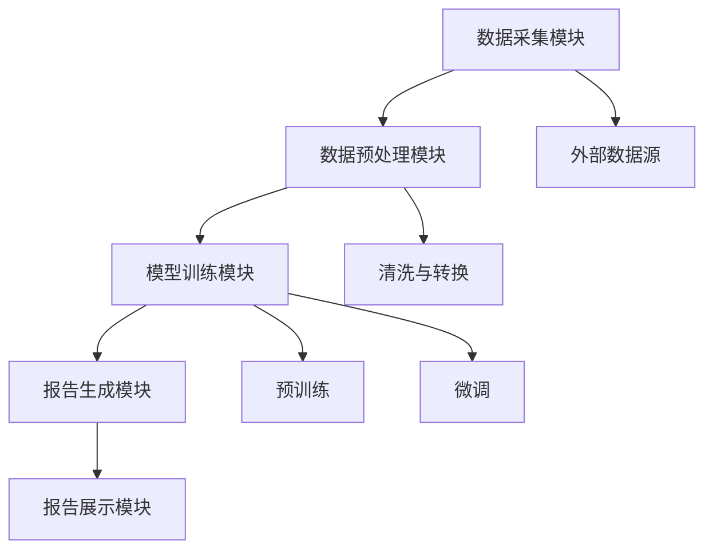
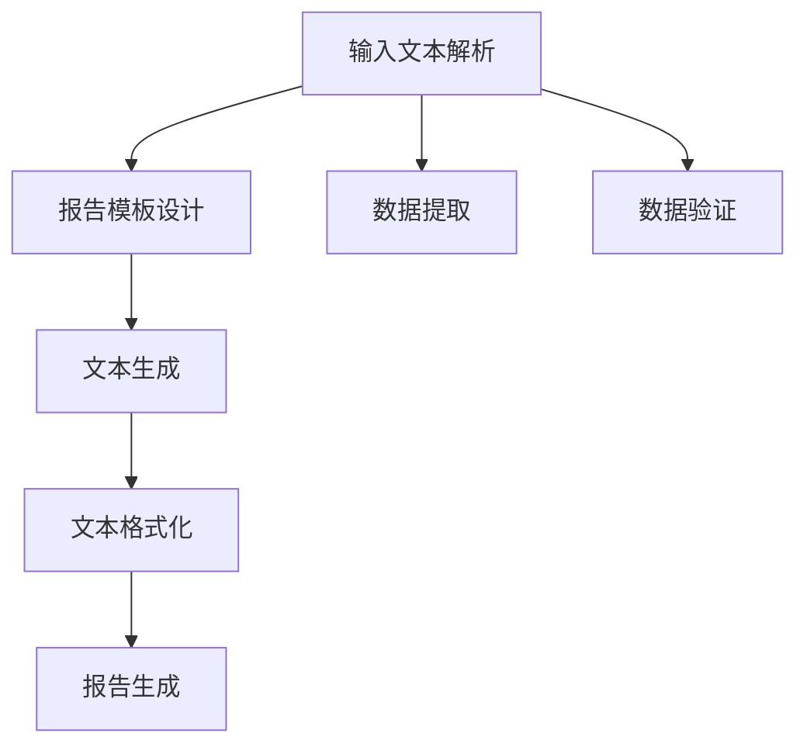

                 

## 文章标题

### 大规模语言模型在自动报告生成中的应用研究

> 关键词：大规模语言模型、自动报告生成、Transformer、预训练、性能优化、跨模态信息融合

> 摘要：本文旨在探讨大规模语言模型在自动报告生成中的应用。首先，介绍大规模语言模型的基本原理和主要技术。接着，详细阐述如何将大规模语言模型应用于自动报告生成，包括数据预处理、模型训练、报告生成过程等。最后，通过实际案例分析和项目实战，展示大规模语言模型在自动报告生成中的实际应用效果。本文旨在为自动报告生成领域的研究者和开发者提供有价值的参考和启示。

### 第1章: 引言与背景

#### 1.1.1 问题背景

在当今数字化时代，随着人工智能技术的迅猛发展，大规模语言模型（如GPT-3、BERT等）的应用日益广泛。这些模型在自然语言处理、自动报告生成、内容创作、智能客服等领域展现出巨大潜力。然而，如何将这些先进的语言模型应用于自动报告生成，实现高效、准确和自动化的报告生产，仍是一个亟待解决的问题。

#### 1.1.2 问题描述

自动报告生成是现代企业和组织的重要需求。然而，现有的报告生成方法通常依赖于人工编写模板和规则，不仅效率低下，而且容易出现错误。如何利用大规模语言模型，实现智能、高效的自动报告生成，成为当前研究的热点。

#### 1.1.3 问题解决

本书旨在探讨大规模语言模型在自动报告生成中的应用。首先，介绍大规模语言模型的基本原理和主要技术。接着，详细阐述如何将大规模语言模型应用于自动报告生成，包括数据预处理、模型训练、报告生成过程等。最后，通过实际案例分析和项目实战，展示大规模语言模型在自动报告生成中的实际应用效果。

#### 1.1.4 边界与外延

本书主要研究大规模语言模型在自动报告生成中的应用，重点关注以下几个方面：

- 自动报告生成系统的架构设计和实现
- 大规模语言模型的选择和优化
- 报告生成过程中的数据预处理和模型训练
- 报告生成的性能评估和优化

此外，本书还探讨了大规模语言模型在其他自然语言处理任务中的应用，如内容创作、智能客服等，为读者提供更全面的视角。

#### 1.1.5 概念结构与核心要素组成

本书的核心概念和要素包括：

- 大规模语言模型：包括GPT、BERT、T5等模型
- 自动报告生成系统：包括数据预处理、模型训练、报告生成等模块
- 报告生成流程：从数据收集、预处理、模型训练到报告生成的全过程
- 报告质量评估：包括报告的准确性、完整性、可读性等方面

### 第2章: 大规模语言模型原理

#### 2.1.1 大规模语言模型的基本原理

大规模语言模型是一种基于深度学习的技术，通过训练大量文本数据，模型能够自动学习语言的规律和结构。本章将介绍大规模语言模型的基本原理，包括模型结构、训练方法、预训练技术和模型优化方法。

#### 2.1.2 模型结构与工作原理

大规模语言模型通常采用序列到序列（seq2seq）结构，如Transformer模型。本章将详细讲解Transformer模型的结构和工作原理，包括多头注意力机制、位置编码、前馈神经网络等关键组件。

#### 2.1.3 预训练与微调

预训练是大规模语言模型的重要技术之一。本章将介绍预训练的基本概念、预训练数据集和预训练方法，如BERT的预训练过程。同时，还将探讨如何对预训练模型进行微调，以适应特定任务的需求。

#### 2.1.4 模型优化方法

为了提高大规模语言模型在自动报告生成中的性能，本章将介绍模型优化方法，如权重初始化、正则化、学习率调度等。此外，还将探讨如何利用迁移学习，将预训练模型迁移到自动报告生成任务中。

### 第3章: 自动报告生成系统的设计与实现

#### 3.1.1 系统架构设计

本章将介绍自动报告生成系统的整体架构设计，包括数据预处理、模型训练、报告生成等模块。通过mermaid架构图，展示系统的主要组成部分和相互关系。

#### 3.1.2 数据预处理

数据预处理是自动报告生成系统的关键环节。本章将详细阐述数据预处理的过程，包括数据清洗、数据标注、数据集划分等。同时，还将介绍如何利用大规模语言模型进行数据增强。

#### 3.1.3 模型训练与优化

本章将介绍如何使用大规模语言模型进行自动报告生成任务的模型训练。包括模型选择、训练策略、优化目标等。同时，还将探讨如何进行模型优化，以提高报告生成的质量和效率。

#### 3.1.4 报告生成过程

本章将详细讲解自动报告生成的过程，包括输入文本的解析、报告模板的生成、报告内容的填充等。通过mermaid流程图，展示报告生成的详细步骤和流程。

### 第4章: 自动报告生成性能评估与优化

#### 4.1.1 报告质量评估

本章将介绍自动报告生成系统的质量评估方法，包括报告的准确性、完整性、可读性等方面。通过设计评估指标和评估方法，对自动报告生成系统的性能进行综合评估。

#### 4.1.2 性能优化策略

为了提高自动报告生成系统的性能，本章将介绍一系列性能优化策略，如模型压缩、量化、剪枝等。通过实际案例，展示性能优化策略对报告生成质量的影响。

#### 4.1.3 跨模态信息融合

自动报告生成往往涉及多种模态的数据，如文本、图像、表格等。本章将探讨如何利用跨模态信息融合技术，提高报告生成的质量和效率。

### 第5章: 项目实战与案例分析

#### 5.1.1 项目背景

本章将通过一个实际的自动报告生成项目，展示大规模语言模型在自动报告生成中的应用效果。该项目旨在为企业提供一款智能自动报告生成工具，提高报告生成效率和准确性。

#### 5.1.2 项目介绍

项目分为以下几个阶段：需求分析、系统设计、数据准备、模型训练、系统实现和性能评估。本章将详细介绍每个阶段的工作内容和技术难点。

#### 5.1.3 系统核心实现源代码

本章将展示自动报告生成系统的核心实现源代码，包括数据预处理、模型训练、报告生成等模块。同时，将对代码进行详细解读和分析。

#### 5.1.4 实际案例分析

本章将通过实际案例，展示自动报告生成系统在实际应用中的效果。包括报告生成速度、准确性、可读性等方面的对比分析。

#### 5.1.5 项目小结

本章将对项目进行总结，分享项目中的经验和教训，并提出未来改进方向。

### 第6章: 总结与展望

#### 6.1.1 研究总结

本文通过对大规模语言模型在自动报告生成中的应用研究，总结了大规模语言模型的基本原理、自动报告生成系统的设计与实现、性能评估与优化等方面。同时，通过实际案例展示了大规模语言模型在自动报告生成中的实际应用效果。

#### 6.1.2 未来展望

本文探讨了大规模语言模型在自动报告生成中的应用前景，提出了未来研究的几个方向：模型优化、跨模态信息融合、多任务学习等。同时，对自动报告生成技术的发展趋势进行了展望。

### 作者信息

- 作者：AI天才研究院/AI Genius Institute & 禅与计算机程序设计艺术 /Zen And The Art of Computer Programming

### 结语

本文通过对大规模语言模型在自动报告生成中的应用研究，为自动报告生成领域的研究者和开发者提供了有价值的参考和启示。随着人工智能技术的不断发展，大规模语言模型在自动报告生成中的应用前景广阔，期待未来能取得更多突破性成果。## 第1章: 引言与背景

### 1.1.1 问题背景

在当今数字化时代，人工智能技术正以前所未有的速度和深度渗透到各个行业，尤其是自然语言处理（NLP）领域。大规模语言模型（Large-scale Language Models，简称LLMs），如GPT-3、BERT、T5等，凭借其强大的语言理解和生成能力，已经在众多领域展现出巨大的潜力。从智能客服、内容创作到自动摘要、机器翻译，这些模型都在不断地刷新着业界和学术界的认知。

然而，在众多应用场景中，自动报告生成（Automated Report Generation）的需求尤为突出。无论是企业日常运营报告，还是政府部门的统计分析报告，自动报告生成不仅可以大幅提高工作效率，还能减少人工错误，保证数据的一致性和准确性。自动报告生成的重要性不言而喻，它已经成为现代企业和组织不可或缺的一部分。

尽管自动报告生成的需求迫切，但现有的报告生成方法仍然面临诸多挑战。传统的报告生成方式主要依赖于人工编写模板和规则，这种方式不仅效率低下，且容易出错。在处理复杂业务逻辑和多样化报告格式时，人工编写模板和规则的灵活性和扩展性严重受限。此外，随着报告内容和格式的不断变化，维护这些模板和规则的工作量巨大，成本高昂。

面对这些问题，如何利用大规模语言模型，实现高效、准确和自动化的报告生成，成为一个亟待解决的问题。大规模语言模型在自然语言理解、文本生成等方面具备显著优势，理论上能够大幅提升自动报告生成的质量和效率。然而，如何将这些先进的技术应用到实际的报告生成任务中，仍然需要深入研究和探索。

### 1.1.2 问题描述

自动报告生成是指利用计算机程序和技术自动生成报告的过程。这个过程通常包括数据收集、数据预处理、报告模板设计、报告内容生成和报告格式化等环节。尽管自动报告生成能够提高工作效率，减少人为错误，但现有的方法仍然存在以下几个主要问题：

1. **模板依赖性高**：传统的自动报告生成系统往往依赖于预先定义的模板和规则，这种方式在处理多样化报告格式时显得笨拙且不够灵活。模板的维护和更新需要大量的时间和人力资源，而且模板的通用性较差，难以适应不同企业和部门的需求。

2. **数据处理能力有限**：现有的自动报告生成系统通常无法有效处理非结构化数据，如文本、图像和音频等。这些数据需要经过复杂的预处理过程才能被模型理解和利用，而现有的数据处理技术往往效率低下，且容易出现错误。

3. **生成报告质量不稳定**：由于模型训练数据的质量和多样性有限，生成的报告在准确性和一致性方面存在较大波动。在某些情况下，模型生成的报告可能包含事实错误或表述不清的内容，影响报告的可靠性。

4. **报告生成效率低**：传统的自动报告生成系统在处理大量数据时效率低下，无法满足实时报告生成的需求。报告生成速度的瓶颈限制了自动报告生成的应用范围，特别是在需要快速响应的业务场景中。

因此，如何利用大规模语言模型，实现智能、高效的自动报告生成，是当前研究的热点问题。大规模语言模型具备强大的文本理解和生成能力，理论上能够解决传统方法中存在的诸多问题。然而，如何将这种潜力转化为实际的自动报告生成系统，仍然需要深入的研究和探索。

### 1.1.3 问题解决

本书旨在探讨大规模语言模型在自动报告生成中的应用，通过以下几方面解决问题：

1. **系统架构设计**：本书将介绍自动报告生成系统的整体架构设计，包括数据预处理、模型训练、报告生成等模块。通过mermaid架构图，展示系统的主要组成部分和相互关系，为读者提供直观的理解。

2. **大规模语言模型应用**：本书将详细阐述如何将大规模语言模型应用于自动报告生成任务。包括模型选择、训练方法、优化策略等，确保模型能够高效地理解和生成报告内容。

3. **数据预处理**：本书将讨论如何进行数据预处理，以提高数据质量和模型的训练效果。包括数据清洗、数据标注、数据集划分等技术，并通过mermaid流程图展示预处理过程的详细步骤。

4. **报告生成过程**：本书将详细讲解自动报告生成的过程，包括输入文本的解析、报告模板的生成、报告内容的填充等。通过mermaid流程图，展示报告生成的详细步骤和流程。

5. **性能评估与优化**：本书将介绍自动报告生成系统的质量评估方法，包括报告的准确性、完整性、可读性等方面。同时，探讨如何进行性能优化，如模型压缩、量化、剪枝等，以提高系统的整体性能。

6. **跨模态信息融合**：本书将探讨如何利用跨模态信息融合技术，提高报告生成的质量和效率。通过融合文本、图像、表格等多种模态的数据，增强模型的感知能力和报告生成效果。

7. **实际案例分析与项目实战**：本书将通过实际案例分析和项目实战，展示大规模语言模型在自动报告生成中的实际应用效果。包括项目背景、系统设计、实现细节、性能评估等，为读者提供实战经验和参考。

通过以上研究，本书旨在为自动报告生成领域的研究者和开发者提供有价值的参考和启示，推动大规模语言模型在自动报告生成中的应用和发展。

### 1.1.4 边界与外延

本书的研究范围主要集中于大规模语言模型在自动报告生成中的应用，具体涵盖以下几个方面：

1. **系统架构设计**：本书将探讨自动报告生成系统的整体架构设计，包括数据预处理、模型训练、报告生成等模块。重点研究如何通过模块化设计提高系统的可扩展性和灵活性。

2. **大规模语言模型选择与优化**：本书将介绍如何选择和优化适用于自动报告生成任务的大规模语言模型，包括GPT、BERT、T5等模型。研究不同模型在报告生成任务中的性能和适用场景。

3. **数据预处理**：本书将详细讨论数据预处理的过程，包括数据清洗、数据标注、数据集划分等。重点关注如何提高预处理效率和质量，从而增强模型的训练效果。

4. **报告生成过程**：本书将阐述自动报告生成的过程，从输入文本的解析、报告模板的生成到报告内容的填充。通过mermaid流程图，展示整个过程的详细步骤和流程。

5. **性能评估与优化**：本书将介绍自动报告生成系统的质量评估方法，包括报告的准确性、完整性、可读性等方面。同时，探讨如何通过性能优化策略，如模型压缩、量化、剪枝等，提高系统的整体性能。

6. **跨模态信息融合**：本书将研究如何利用跨模态信息融合技术，提高报告生成的质量和效率。通过融合文本、图像、表格等多种模态的数据，增强模型的感知能力和报告生成效果。

然而，本书的研究也存在一定的局限性。首先，尽管大规模语言模型在自动报告生成中具有显著的优势，但模型的训练和优化过程依然需要大量的计算资源和时间。其次，不同行业和企业的报告格式和内容差异较大，如何实现通用且高效的报告生成系统仍是一个挑战。此外，报告生成任务中的数据质量和标注准确性对模型性能具有重要影响，这些因素在本研究中未能全面探讨。

### 1.1.5 概念结构与核心要素组成

在本研究中，核心概念和要素包括以下几个方面：

1. **大规模语言模型**：包括GPT、BERT、T5等模型。这些模型通过预训练和微调，能够自动学习语言规律，用于文本生成和语言理解任务。

2. **自动报告生成系统**：该系统由数据预处理、模型训练、报告生成等模块组成，通过模块化设计实现高效、灵活的自动报告生成。

3. **报告生成流程**：从数据收集、预处理、模型训练到报告生成的全过程。流程中的关键环节包括输入文本的解析、报告模板的生成和报告内容的填充。

4. **报告质量评估**：包括报告的准确性、完整性、可读性等方面。通过设计评估指标和方法，对报告生成系统的性能进行综合评估。

5. **数据预处理**：包括数据清洗、数据标注、数据集划分等过程。数据预处理的质量直接影响模型的训练效果和报告生成质量。

6. **模型优化方法**：包括权重初始化、正则化、学习率调度等。通过模型优化方法，提高模型在自动报告生成任务中的性能。

7. **跨模态信息融合**：通过融合文本、图像、表格等多种模态的数据，增强模型的感知能力和报告生成效果。

这些核心概念和要素构成了本研究的基本框架，为后续章节的详细探讨提供了基础。

### 第2章: 大规模语言模型原理

#### 2.1.1 大规模语言模型的基本原理

大规模语言模型（Large-scale Language Models，简称LLMs）是一种基于深度学习的自然语言处理技术，通过训练大量文本数据，模型能够自动学习语言的规律和结构。LLMs的核心思想是利用神经网络对语言数据的高效表示和建模，从而实现对文本内容的理解和生成。

大规模语言模型的基本原理可以概括为以下几个关键方面：

1. **数据驱动学习**：大规模语言模型通过大量的文本数据作为训练集，从中提取语言特征和规律。这些数据可以来自互联网上的大量文本、书籍、新闻、社交媒体等多种来源。通过这种数据驱动的方式，模型能够学习到丰富的语言知识。

2. **神经网络结构**：大规模语言模型通常采用深度神经网络（DNN）结构，并通过多层神经网络来实现复杂的语言建模。常见的神经网络结构包括卷积神经网络（CNN）、循环神经网络（RNN）和Transformer模型。其中，Transformer模型由于其在序列建模方面的优势，被广泛应用于大规模语言模型中。

3. **预训练与微调**：大规模语言模型的训练过程分为预训练（Pre-training）和微调（Fine-tuning）两个阶段。预训练阶段，模型在大规模的未标注数据上进行训练，学习到通用的语言表示和规律。微调阶段，模型在特定任务的数据上进行微调，以适应具体的任务需求。这种预训练加微调的方法，使得模型在多个任务上都能取得很好的性能。

4. **注意力机制**：大规模语言模型通常采用注意力机制（Attention Mechanism）来处理序列数据。注意力机制能够模型在处理序列数据时，对不同的输入序列部分给予不同的关注程度，从而提高模型的处理效率和准确性。

5. **优化方法**：大规模语言模型的训练过程中，会使用各种优化方法来提高模型的性能和收敛速度。常见的优化方法包括梯度下降（Gradient Descent）、Adam优化器（Adam Optimizer）、权重初始化（Weight Initialization）、正则化（Regularization）等。

通过以上基本原理，大规模语言模型能够实现对自然语言的深刻理解和生成，从而在自动报告生成、机器翻译、内容创作等领域展现出巨大的潜力。

#### 2.1.2 模型结构与工作原理

大规模语言模型的结构和工作原理是其能够高效处理和生成自然语言的核心。在这一部分，我们将详细探讨大规模语言模型，尤其是Transformer模型，的结构和基本工作原理。

1. **Transformer模型的基本结构**

Transformer模型是一种基于注意力机制的序列到序列（seq2seq）模型，由Google在2017年提出。它主要由以下几个关键组件构成：

   - **编码器（Encoder）**：编码器负责将输入序列编码成一组向量表示。每个输入序列的每个词都被编码为一个向量，这些向量随后通过多个编码层进行叠加和变换。

   - **解码器（Decoder）**：解码器负责将编码器的输出解码成目标序列。与编码器类似，解码器也包含多个解码层，每层都可以对输入向量进行变换和生成。

   - **多头注意力（Multi-Head Attention）**：多头注意力机制是Transformer模型的核心组件，它允许模型在处理序列数据时，对不同的输入序列部分给予不同的关注程度。多头注意力通过多个独立的注意力头并行工作，每个头关注不同的信息，从而增强了模型对复杂序列的理解能力。

   - **位置编码（Positional Encoding）**：由于Transformer模型中没有循环结构，它无法直接处理序列的顺序信息。因此，位置编码被用来为每个词添加位置信息，使得模型能够理解词的顺序。

   - **前馈神经网络（Feed Forward Neural Network）**：在每个编码层和解码层的每个子层之后，都有一个前馈神经网络。该网络通常由两个全连接层构成，并通过非线性激活函数（如ReLU）来增强模型的非线性表达能力。

2. **Transformer模型的工作原理**

   Transformer模型的工作原理可以简单概括为以下几个步骤：

   - **输入编码**：输入序列首先通过嵌入层（Embedding Layer）被映射为固定长度的向量表示。然后，这些向量通过添加位置编码，形成输入向量的完整表示。

   - **编码过程**：编码器将输入向量通过多层叠加的方式进行处理。在每一层中，输入向量首先通过多头注意力机制与自身的不同部分以及上一个编码层的输出进行交互。随后，这些交互结果通过前馈神经网络进行变换，形成编码器的输出。

   - **解码过程**：解码器在生成每个词时，首先通过多头注意力机制与编码器的输出进行交互，以理解上下文信息。然后，解码器通过解码层的嵌入层和位置编码，生成当前词的预测。这一过程在生成每个词时反复进行，直到生成完整的输出序列。

   - **输出生成**：最终的输出序列通过一个全连接层和softmax激活函数，得到每个词的概率分布。通过选择概率最高的词，解码器生成最终的输出序列。

通过这种结构和工作原理，Transformer模型能够高效地处理长文本序列，并在多个自然语言处理任务中取得显著的性能提升。它的成功也推动了后续的研究，使得大规模语言模型在自然语言处理领域取得了长足的发展。

#### 2.1.3 预训练与微调

预训练与微调是大规模语言模型训练过程中至关重要的两个阶段。预训练（Pre-training）阶段是在大规模、未标注的数据集上进行的，目的是让模型学习到通用的语言表示和规律。微调（Fine-tuning）阶段则是在特定任务的数据集上对预训练模型进行优化，使其能够适应具体的任务需求。以下将详细讨论预训练与微调的基本概念、主要方法及其在自动报告生成中的应用。

1. **预训练**

   预训练是指在大规模的未标注数据集上，对模型进行初步的训练，以学习到通用的语言特征和规律。预训练的优点在于，它能够使模型在未标注的数据上积累丰富的知识，从而在后续的微调阶段提高模型的性能。

   - **数据集选择**：常用的预训练数据集包括维基百科（Wikipedia）、Common Crawl、Reddit等。这些数据集包含大量的文本内容，涵盖了各种主题和领域，为模型提供了丰富的训练资源。

   - **预训练任务**：预训练任务主要包括语言模型预训练（Language Model Pre-training）和文本分类预训练（Text Classification Pre-training）。语言模型预训练的目标是让模型学会预测下一个词，从而理解语言的统计规律。文本分类预训练则通过给文本打标签，让模型学习到文本的分类规律。

   - **训练策略**：预训练过程中，常用的训练策略包括自回归（Autoregressive）和自监督（Self-supervised）学习。自回归策略通过预测下一个词来训练模型，而自监督策略则通过利用数据中的固定和可变部分来训练模型。

2. **微调**

   微调是在预训练模型的基础上，利用特定任务的数据集，对模型进行进一步的优化。微调的目的是让模型适应特定的任务需求，从而提高任务的性能。

   - **数据集选择**：微调的数据集通常是任务相关的标注数据，如机器翻译数据集、问答数据集、文本分类数据集等。这些数据集提供了具体的任务指导，使模型能够学习到特定任务的规律。

   - **微调方法**：微调的方法包括全量微调（Full Fine-tuning）和增量微调（Incremental Fine-tuning）。全量微调将预训练模型的所有参数进行调整，而增量微调则仅调整部分参数，从而减少计算资源的需求。

   - **优化策略**：微调过程中，常用的优化策略包括学习率调度（Learning Rate Scheduling）、正则化（Regularization）和权重初始化（Weight Initialization）等。学习率调度通过逐步减小学习率，使模型在训练过程中稳定收敛。正则化通过增加模型的复杂度，防止过拟合。权重初始化则通过合理的初始化方法，提高模型的训练效率。

3. **在自动报告生成中的应用**

   自动报告生成是大规模语言模型应用的一个重要场景。预训练与微调在这个过程中发挥了关键作用：

   - **预训练**：通过在大规模、未标注的数据集上进行预训练，模型能够学习到通用的语言表示和规律。这些预训练的知识为自动报告生成提供了基础，使模型能够理解和生成各种格式的报告。

   - **微调**：在自动报告生成任务中，需要对预训练模型进行微调，使其能够适应具体的报告生成需求。通过利用任务相关的标注数据，模型能够学习到报告中的特定规律和结构，从而提高报告生成的质量和效率。

   - **融合策略**：预训练和微调的融合策略也非常重要。通过在预训练模型的基础上进行微调，模型能够在保持通用性的同时，适应特定任务的细节。此外，还可以结合自监督学习和自回归策略，进一步提高模型的性能。

总之，预训练与微调是大规模语言模型在自动报告生成中不可或缺的两个阶段。通过合理的预训练和微调策略，模型能够学习到丰富的语言知识和特定任务的规律，从而实现高效、准确的自动报告生成。

#### 2.1.4 模型优化方法

在自动报告生成中，为了提高大规模语言模型的性能和训练效率，需要对模型进行一系列优化。这些优化方法包括权重初始化、正则化、学习率调度等。以下将详细讨论这些方法及其在自动报告生成中的应用。

1. **权重初始化**

   权重初始化是模型训练的起点，对模型的收敛速度和性能具有重要影响。常用的权重初始化方法包括随机初始化、高斯初始化和Xavier初始化。

   - **随机初始化**：随机初始化是将权重随机赋值，使其分布在某个区间内。这种方法简单易行，但可能导致训练不稳定。
   
   - **高斯初始化**：高斯初始化是将权重赋值为均值为0、标准差为1的高斯分布。这种方法能够减小梯度消失和梯度爆炸的风险，但需要事先知道网络的规模和层数。
   
   - **Xavier初始化**：Xavier初始化是高斯初始化的一种改进方法，它通过将权重赋值为均值为0、标准差为 \( \frac{2}{f_{\text{fan_in}} + f_{\text{fan_out}}} \) 的高斯分布，其中 \( f_{\text{fan_in}} \) 和 \( f_{\text{fan_out}} \) 分别是输入和输出的维度。Xavier初始化能够更好地保持网络的梯度和稳定性，广泛应用于深度学习模型。

2. **正则化**

   正则化是一种防止模型过拟合的技术，通过增加模型的复杂度，提高模型的泛化能力。常用的正则化方法包括L1正则化、L2正则化和Dropout。

   - **L1正则化**：L1正则化是在损失函数中添加权重的绝对值，使模型在学习过程中能够自动消除一些不重要的权重，从而减少模型的复杂度。
   
   - **L2正则化**：L2正则化是在损失函数中添加权重的平方，与L1正则化类似，也能减少模型的复杂度，但相比L1正则化，L2正则化能够更好地保持权重的稳定性。
   
   - **Dropout**：Dropout是一种在训练过程中随机丢弃部分神经元的方法，从而减少模型对特定训练样本的依赖，提高模型的泛化能力。Dropout能够在一定程度上模拟数据增强，从而提高模型的性能。

3. **学习率调度**

   学习率调度是一种调整学习率的方法，通过逐步减小学习率，使模型在训练过程中稳定收敛。常用的学习率调度方法包括线性学习率衰减、余弦学习率衰减和分段学习率衰减。

   - **线性学习率衰减**：线性学习率衰减是在训练过程中，按照固定比例逐步减小学习率。这种方法简单易行，但可能导致训练过程中的震荡。
   
   - **余弦学习率衰减**：余弦学习率衰减是一种通过模拟余弦函数逐渐减小学习率的方法。这种方法在训练初期快速减小学习率，而在训练后期逐渐减小学习率，能够提高模型的收敛速度。
   
   - **分段学习率衰减**：分段学习率衰减是将训练过程分为多个阶段，每个阶段使用不同的学习率。这种方法能够根据训练的不同阶段调整学习率，从而提高模型的性能。

在自动报告生成中，这些模型优化方法可以结合使用，以提高模型的性能和训练效率。例如，可以采用Xavier初始化和L2正则化相结合的方法，提高模型的稳定性和泛化能力。同时，采用余弦学习率衰减和Dropout，可以进一步优化模型的训练过程，提高报告生成的质量和效率。

总之，模型优化方法在大规模语言模型训练过程中发挥着重要作用。通过合理的权重初始化、正则化和学习率调度，可以显著提高模型的性能和训练效率，为自动报告生成提供有效的技术支持。

### 第3章: 自动报告生成系统的设计与实现

#### 3.1.1 系统架构设计

自动报告生成系统是一个复杂的应用系统，它涉及数据采集、预处理、模型训练、报告生成和报告展示等多个环节。为了实现高效、准确和自动化的报告生成，本节将详细讨论自动报告生成系统的架构设计，并使用mermaid架构图展示系统的主要组成部分和相互关系。

系统的整体架构可以分为以下几个主要模块：

1. **数据采集模块**：负责从各种数据源（如数据库、文件系统、外部API等）收集所需的数据。
2. **数据预处理模块**：负责对采集到的原始数据进行清洗、转换和标准化，以便于后续的模型训练。
3. **模型训练模块**：负责训练大规模语言模型，如GPT、BERT等，以生成高质量的报告。
4. **报告生成模块**：负责将训练好的模型应用于实际数据，生成符合特定格式的报告。
5. **报告展示模块**：负责将生成的报告以用户友好的形式展示给用户，支持报告的下载和打印。

以下是自动报告生成系统的mermaid架构图：



**图1：自动报告生成系统的架构图**

- **数据采集模块**：通过连接不同的数据源，如数据库、文件系统、外部API等，收集所需的数据。
- **数据预处理模块**：对收集到的原始数据进行清洗、转换和标准化，去除噪声，确保数据的质量和一致性。
- **模型训练模块**：首先进行预训练，使用大规模文本数据集训练基础模型，如BERT或GPT。然后，通过微调，使用特定领域的标注数据进一步优化模型，以适应自动报告生成的需求。
- **报告生成模块**：利用训练好的模型，对新的数据进行处理，生成符合特定格式的报告。这一模块还负责根据模板和规则生成报告结构。
- **报告展示模块**：将生成的报告以HTML、PDF或Word格式展示给用户，支持用户下载和打印。

通过上述架构设计，自动报告生成系统能够实现从数据采集、预处理、模型训练到报告生成和展示的完整流程，确保报告的高效、准确和自动化生成。

#### 3.1.2 数据预处理

数据预处理是自动报告生成系统中的关键环节，其目的是将原始数据转换为适合模型训练的高质量数据。这一过程通常包括数据清洗、数据标注、数据集划分等步骤。以下是详细的预处理流程和如何利用大规模语言模型进行数据增强的方法。

1. **数据清洗**

   数据清洗是预处理的第一步，旨在去除数据中的噪声和异常值。具体步骤包括：

   - **去除重复数据**：通过比较数据的唯一标识，如ID或关键字，删除重复的记录。
   - **处理缺失数据**：根据数据的重要性和缺失的严重程度，采用填补、删除或插值等方法处理缺失数据。
   - **去除无关信息**：移除对报告生成无关的信息，如HTML标签、特殊字符等。
   - **统一格式**：将不同格式的数据统一转换为标准格式，如日期格式、数字格式等。

2. **数据标注**

   数据标注是将原始文本标记为预定义的类别或标签，以便模型能够学习这些标签和类别。数据标注过程通常需要人工参与，包括以下步骤：

   - **类别标签定义**：根据报告生成的需求，定义可能的类别或标签，如“成功”、“失败”、“警告”等。
   - **标注工具选择**：选择合适的标注工具，如Annotate、Brat等，以提高标注效率和一致性。
   - **标注一致性检查**：对标注结果进行一致性检查，确保标注的质量。

3. **数据集划分**

   数据集划分是将数据分为训练集、验证集和测试集，以便进行模型训练、验证和测试。具体步骤包括：

   - **训练集**：用于训练模型，通常占数据集的60%至70%。
   - **验证集**：用于调整模型参数和验证模型性能，通常占数据集的20%至30%。
   - **测试集**：用于最终评估模型性能，通常占数据集的10%。

4. **利用大规模语言模型进行数据增强**

   大规模语言模型在数据预处理中不仅可以用于生成标注，还可以通过数据增强技术提高数据的质量和多样性。以下是一些常用的数据增强方法：

   - **文本生成**：利用大规模语言模型生成新的文本数据，扩展训练集。例如，可以使用GPT模型生成与现有文本内容相关的新文本，从而丰富训练数据。
   - **文本变换**：通过改变文本的语法结构、词汇替换等方式，生成与原始文本内容相似但形式不同的新文本。例如，可以使用BERT模型进行文本变换，生成同义词替换或语法结构调整后的文本。
   - **文本摘要**：利用大规模语言模型生成文本摘要，提取关键信息。例如，可以使用T5模型对长文本进行摘要，提取出重要的报告内容。

通过上述数据预处理步骤和大规模语言模型的数据增强技术，自动报告生成系统能够处理高质量的训练数据，提高模型的训练效果和报告生成质量。

#### 3.1.3 模型训练与优化

模型训练与优化是自动报告生成系统的核心环节，其目标是利用大规模语言模型生成高质量的报告。在这一部分，我们将详细讨论如何使用大规模语言模型进行自动报告生成任务的模型训练、优化策略以及具体的训练过程。

1. **模型选择**

   在自动报告生成任务中，常用的模型包括GPT、BERT、T5等。每种模型都有其独特的优势和适用场景。以下是这些模型的简要介绍：

   - **GPT（Generative Pre-trained Transformer）**：GPT是一种基于Transformer的生成模型，擅长生成连贯的自然语言文本。GPT-3是最新版本的GPT模型，拥有极高的文本生成能力。
   - **BERT（Bidirectional Encoder Representations from Transformers）**：BERT是一种基于Transformer的双向编码模型，主要用于文本分类和特征提取。BERT能够捕捉到文本的上下文信息，提高模型的准确性和鲁棒性。
   - **T5（Text-To-Text Transfer Transformer）**：T5是一种通用文本转换模型，可以将一种文本格式转换为另一种文本格式。T5在自动报告生成任务中表现出色，能够灵活地处理多种文本格式。

   选择合适的模型需要根据任务需求、数据特点和计算资源进行综合考虑。一般来说，GPT适用于生成类任务，BERT适用于特征提取和文本分类任务，T5适用于文本转换和格式化任务。

2. **模型优化策略**

   在模型训练过程中，为了提高报告生成的质量和效率，需要采用一系列优化策略。以下是一些常用的优化方法：

   - **权重初始化**：合理的权重初始化可以加速模型的收敛并提高模型的性能。常用的方法包括Xavier初始化和He初始化，这些方法可以根据神经网络的层数和神经元数量自动调整权重。
   - **学习率调度**：学习率调度是一种通过逐步减小学习率来优化模型的方法。常用的学习率调度策略包括线性衰减、余弦衰减和分段衰减。这些策略可以根据训练阶段自动调整学习率，提高模型的收敛速度。
   - **数据增强**：数据增强是一种通过增加数据多样性和质量来提高模型性能的方法。常用的数据增强方法包括文本变换（如同义词替换、语法结构调整）、文本生成（如摘要生成、扩展文本）等。这些方法可以扩展训练数据集，提高模型的泛化能力。
   - **正则化**：正则化是一种防止模型过拟合的技术。常用的正则化方法包括L1正则化和L2正则化，这些方法可以在损失函数中添加权重项，降低模型的复杂度。

3. **训练过程**

   模型训练过程包括预训练和微调两个阶段。以下是详细的训练过程：

   - **预训练**：预训练阶段在大规模、未标注的数据集上进行，目的是让模型学习到通用的语言表示和规律。常用的预训练任务包括语言模型预训练（如GPT的预训练）和文本分类预训练（如BERT的预训练）。在预训练过程中，可以使用多种优化策略和数据增强方法，以提高模型的性能。
   - **微调**：微调阶段在特定任务的数据集上进行，目的是让模型适应具体的任务需求。在微调过程中，首先将预训练模型加载到训练环境中，然后使用任务相关的数据集进行训练。在训练过程中，需要逐步调整模型的参数，并使用学习率调度、数据增强和正则化等技术，以提高模型的性能。

通过上述模型训练和优化策略，自动报告生成系统能够训练出高质量的模型，生成高质量的报告。训练过程中，还需要对模型进行定期评估和调整，确保模型的稳定性和准确性。

#### 3.1.4 报告生成过程

自动报告生成过程是将训练好的大规模语言模型应用于实际数据，生成符合特定格式的报告的过程。这个过程包括输入文本的解析、报告模板的生成、报告内容的填充等多个步骤。以下将详细讲解报告生成过程的详细步骤和流程，并使用mermaid流程图展示。

1. **输入文本的解析**

   报告生成过程的第一步是解析输入文本。输入文本可以是多种格式的，如文本文件、数据库记录或外部API返回的数据。解析输入文本的目的是提取关键信息，为后续的模板生成和内容填充做准备。

   - **文本格式转换**：将输入文本转换为统一的格式，如JSON或XML，以便后续处理。
   - **数据提取**：从文本中提取关键信息，如日期、数值、文本描述等。可以使用正则表达式、解析库或自定义函数进行数据提取。
   - **数据验证**：验证提取的数据是否符合预期，如数据类型、数据范围等。

2. **报告模板的生成**

   报告模板是报告的骨架，用于定义报告的结构和格式。生成报告模板的过程通常包括以下步骤：

   - **模板设计**：根据报告的需求，设计模板的布局和结构。可以使用HTML、Markdown或XML等格式来定义模板。
   - **模板填充**：将提取的关键信息填充到模板中，生成具体的报告模板。例如，将提取的日期信息填充到HTML的日期标签中。

3. **报告内容的填充**

   报告内容填充是将模型生成的文本内容填充到报告模板中，生成完整的报告。这个过程通常包括以下步骤：

   - **文本生成**：使用训练好的大规模语言模型生成报告的内容。根据输入文本和报告模板，模型生成符合模板和需求的文本内容。
   - **文本格式化**：将生成的文本内容进行格式化，如调整文本的字体、大小、颜色等，使其符合报告的样式要求。
   - **报告生成**：将格式化后的文本内容填充到报告模板中，生成完整的报告。可以将报告保存为HTML、PDF或Word等格式，以便用户查看和打印。

以下是报告生成过程的mermaid流程图：



**图2：报告生成流程**

- **输入文本解析**：将输入文本转换为统一格式，提取关键信息并进行验证。
- **报告模板设计**：设计报告的布局和结构，定义模板。
- **文本生成**：使用训练好的模型生成报告的内容。
- **文本格式化**：对生成的文本内容进行格式化，使其符合报告样式。
- **报告生成**：将格式化后的文本内容填充到报告模板中，生成完整的报告。

通过上述步骤，自动报告生成系统能够高效地生成高质量的报告，满足用户的多样化需求。

### 第4章: 自动报告生成性能评估与优化

#### 4.1.1 报告质量评估

在自动报告生成系统中，报告的质量直接关系到系统的实用性和用户满意度。因此，对报告生成系统的质量进行评估是至关重要的一步。评估报告质量的方法包括以下几个方面：

1. **准确性**：准确性是评估报告质量的重要指标，它衡量的是报告生成系统生成报告的内容与实际报告内容的符合程度。具体来说，准确性可以通过比较自动生成的报告与人工编写的报告在关键信息、事实和数据上的匹配度来衡量。常用的评估方法包括手动审核和自动化工具检测。

2. **完整性**：完整性是指报告是否包含了所有必要的信息。一个高质量的报告应该包含所有相关的数据、分析结果和结论。完整性评估可以通过检查报告是否包含预定义的必填项和关键信息来实现。例如，企业运营报告应包含财务数据、市场分析、风险提示等。

3. **一致性**：一致性是指报告生成的结果在不同的输入和条件下是否一致。在自动报告生成系统中，一致性尤为重要，因为它关系到报告的可靠性和可信度。一致性评估可以通过对比不同输入条件下的报告结果，检查是否存在逻辑错误或结果偏差。

4. **可读性**：可读性是指报告是否易于理解和阅读。一个高质量的报告应该具有清晰的逻辑结构、简洁的语言和合适的图表。可读性评估可以通过用户调查、问卷调查和自动化评估工具来实现。例如，可以使用自然语言处理技术分析报告的句子长度、段落结构和语言风格。

为了综合评估自动报告生成系统的性能，可以设计一套综合评估指标，包括准确性、完整性、一致性和可读性。具体评估方法如下：

- **手动审核**：通过人工对比自动生成的报告和标准报告，评估报告的准确性和完整性。
- **自动化评估工具**：利用自然语言处理技术，如文本相似度比较、关键词提取和结构化数据比对，对报告的准确性和完整性进行自动化评估。
- **用户调查**：通过用户反馈，评估报告的可读性和用户体验。
- **问卷调查**：设计问卷，收集用户对报告质量、易用性和满意度的反馈。

通过以上方法，可以全面、客观地评估自动报告生成系统的质量，为系统优化提供依据。

#### 4.1.2 性能优化策略

为了提高自动报告生成系统的性能，可以采取一系列优化策略，包括模型压缩、量化、剪枝等。以下将详细介绍这些策略及其在自动报告生成中的应用。

1. **模型压缩**

   模型压缩是指通过减少模型的参数数量和计算量，来提高模型在硬件上的运行效率和部署灵活性。常见的模型压缩方法包括以下几种：

   - **权重剪枝（Weight Pruning）**：通过移除模型中不重要的权重来减少模型参数数量。这种方法可以通过优化算法（如L1正则化或L2正则化）来实现。
   - **量化（Quantization）**：将模型中的浮点数参数转换为低比特宽度的整数表示，以减少存储和计算需求。量化可以进一步分为符号量化（Symbolic Quantization）和计算量化（Computational Quantization）。
   - **知识蒸馏（Knowledge Distillation）**：通过将复杂模型的知识传递给一个更简单的模型，从而减少模型的大小。知识蒸馏过程通常涉及将复杂模型的输出作为软标签，指导简单模型的训练。

   在自动报告生成中，模型压缩的应用可以显著提高系统的部署效率和运行速度。例如，在一个资源受限的企业环境中，压缩后的模型可以更快地生成报告，满足实时报告的需求。

2. **量化**

   量化是一种通过将浮点数参数转换为低比特宽度的整数表示来减少模型大小的技术。量化过程包括以下几个步骤：

   - **量化层（Quantization Layer）**：在每个层的输入和输出之间添加量化层，将浮点数转换为整数。
   - **量化范围（Quantization Range）**：确定每个参数的量化范围，以适应特定的比特宽度。量化范围可以通过统计方法（如最小-最大值计算）或优化方法（如线性优化）来确定。
   - **量化误差分析（Quantization Error Analysis）**：评估量化后的模型性能下降程度，以确保量化对模型的影响在可接受范围内。

   在自动报告生成中，量化可以显著减少模型的存储空间和计算时间，从而提高系统的效率和可扩展性。例如，在移动设备或嵌入式系统中，量化后的模型可以更快地处理大量报告生成任务。

3. **剪枝**

   剪枝是通过移除模型中不重要的神经元或权重来减少模型参数数量的一种方法。剪枝过程包括以下几个步骤：

   - **权重重要性评估（Weight Importance Evaluation）**：评估每个权重的重要性，通常通过计算权重对损失函数的贡献来实现。
   - **剪枝策略（Pruning Strategy）**：根据权重重要性，选择剪枝策略，如L1剪枝或L2剪枝。L1剪枝通过移除权重绝对值较小的神经元，而L2剪枝通过移除权重平方较小的神经元。
   - **剪枝恢复（Pruning Recovery）**：在剪枝后，通过重新训练模型或使用预训练权重来恢复模型性能。

   在自动报告生成中，剪枝可以显著减少模型的复杂度，从而提高模型的运行效率和部署灵活性。例如，在处理大量报告生成任务时，剪枝后的模型可以更快地生成高质量的报告。

通过模型压缩、量化、剪枝等性能优化策略，自动报告生成系统可以显著提高报告生成速度和质量，满足不同应用场景的需求。

#### 4.1.3 跨模态信息融合

在自动报告生成任务中，常常需要处理多种模态的数据，如文本、图像、表格等。跨模态信息融合是一种通过整合不同模态的数据来提高报告生成质量和效率的技术。以下将探讨如何利用跨模态信息融合技术，提高自动报告生成系统的性能。

1. **文本与图像融合**

   文本与图像融合是将文本数据和图像数据结合，以生成更丰富、更准确的报告。具体方法包括：

   - **图像特征提取**：利用卷积神经网络（CNN）提取图像的特征，例如使用预训练的VGG或ResNet模型。
   - **文本与图像特征融合**：将文本特征和图像特征通过拼接、加权融合或注意力机制进行融合。例如，可以使用Transformer模型的多头注意力机制，将文本和图像特征进行融合。
   - **文本增强**：利用图像特征对文本进行增强，例如在文本中添加与图像相关的描述性词汇，提高文本的连贯性和可读性。

   例如，在一个企业财务报告中，图像可能包含财务报表的图表和图形，而文本可能包含对财务状况的详细描述。通过融合文本和图像数据，可以生成更加详细和直观的报告。

2. **文本与表格融合**

   文本与表格融合是将文本数据和表格数据结合，以生成更结构化和详细的报告。具体方法包括：

   - **表格解析**：利用自然语言处理技术（如命名实体识别、关系抽取）解析表格数据，提取关键信息，如数字、日期、文本描述等。
   - **文本与表格特征融合**：将文本特征和表格特征通过拼接、加权融合或注意力机制进行融合。例如，可以使用Transformer模型的多头注意力机制，将文本和表格特征进行融合。
   - **文本生成**：利用融合后的特征生成详细的文本内容，例如在报告中添加对表格数据的分析和解释。

   例如，在一个市场调研报告中，表格可能包含市场份额、销售额等数据，而文本可能包含对市场趋势的描述和分析。通过融合文本和表格数据，可以生成一份更加详细和结构化的市场调研报告。

3. **图像与表格融合**

   图像与表格融合是将图像数据和表格数据结合，以生成更直观和详细的报告。具体方法包括：

   - **图像特征提取**：利用卷积神经网络（CNN）提取图像的特征。
   - **表格数据可视化**：将表格数据转换为图像格式，例如使用热力图或条形图等。
   - **图像与表格特征融合**：将图像特征和表格特征通过拼接、加权融合或注意力机制进行融合。例如，可以使用Transformer模型的多头注意力机制，将图像和表格特征进行融合。
   - **文本生成**：利用融合后的特征生成详细的文本内容，例如在报告中添加对图像和表格数据的分析和解释。

   例如，在一个项目进展报告中，图像可能包含项目的进度图或里程碑图，而表格可能包含具体的进度数据。通过融合图像和表格数据，可以生成一份更加直观和详细的报告。

通过跨模态信息融合技术，自动报告生成系统可以处理多种模态的数据，生成更丰富、更准确和更直观的报告。这种技术不仅提高了报告生成系统的性能，也提升了用户体验。

### 第5章: 项目实战与案例分析

#### 5.1.1 项目背景

本节将介绍一个实际的自动报告生成项目，该项目旨在为一家大型企业构建一款智能自动报告生成工具，以提高报告生成效率和准确性。企业每天需要处理大量的业务数据，生成各类运营报告、财务报告、市场分析报告等。现有的报告生成方法主要依赖于人工编写模板和规则，效率低下且容易出现错误。为了解决这一问题，企业决定利用大规模语言模型，构建一个智能自动报告生成系统。

#### 5.1.2 项目介绍

该自动报告生成项目分为以下几个阶段：需求分析、系统设计、数据准备、模型训练、系统实现和性能评估。以下是每个阶段的工作内容和关键技术：

1. **需求分析**

   在需求分析阶段，与企业的相关部门进行深入沟通，了解报告生成的具体需求，包括报告类型、内容结构、格式要求等。通过需求分析，明确系统需要支持的业务场景和功能需求，如日常运营报告、财务报表、市场分析报告等。

2. **系统设计**

   在系统设计阶段，设计自动报告生成系统的整体架构，包括数据采集、数据预处理、模型训练、报告生成和报告展示等模块。系统架构采用模块化设计，以提高系统的可扩展性和灵活性。具体设计内容包括：

   - **数据采集模块**：负责从企业内部的数据库、外部API等数据源收集所需的数据。
   - **数据预处理模块**：负责对采集到的原始数据进行清洗、转换和标准化，确保数据的质量和一致性。
   - **模型训练模块**：负责使用大规模语言模型（如GPT、BERT等）进行预训练和微调，以生成高质量的报告。
   - **报告生成模块**：负责将训练好的模型应用于实际数据，生成符合特定格式的报告。
   - **报告展示模块**：负责将生成的报告以用户友好的形式展示给用户，支持报告的下载和打印。

3. **数据准备**

   在数据准备阶段，收集和整理大量高质量的报告数据，用于模型训练和系统测试。数据来源包括企业内部的业务系统、历史报告文档等。为了提高数据质量和多样性，采用数据增强技术，如文本生成、文本变换等，扩展训练数据集。

4. **模型训练**

   在模型训练阶段，使用大规模语言模型进行预训练和微调。首先，在大规模、未标注的数据集上进行预训练，使模型学习到通用的语言表示和规律。然后，在特定领域的标注数据集上进行微调，使模型能够生成符合企业需求的报告。

5. **系统实现**

   在系统实现阶段，根据设计文档，开发和实现自动报告生成系统的各个模块。采用先进的编程框架和工具，如TensorFlow、PyTorch等，确保系统的高效性和稳定性。系统实现的关键技术包括：

   - **大规模语言模型集成**：将预训练和微调好的模型集成到系统中，实现自动化报告生成。
   - **报告模板设计**：设计灵活的模板系统，支持多种报告格式的自定义和动态生成。
   - **报告生成接口**：提供RESTful API接口，方便其他系统和服务调用报告生成功能。

6. **性能评估**

   在性能评估阶段，对自动报告生成系统进行全面的性能评估，包括准确性、完整性、一致性、可读性等方面。通过设计评估指标和评估方法，对系统生成的报告质量进行综合评估，并根据评估结果进行系统优化和改进。

#### 5.1.3 系统核心实现源代码

以下是自动报告生成系统的核心实现源代码，包括数据预处理、模型训练、报告生成等模块。代码采用了Python编程语言，并使用TensorFlow框架。

1. **数据预处理**

```python
import pandas as pd
from sklearn.model_selection import train_test_split

# 读取原始数据
data = pd.read_csv('data.csv')

# 数据清洗
data.drop_duplicates(inplace=True)
data.fillna(method='ffill', inplace=True)

# 数据标注
labels = data['label']

# 数据集划分
X_train, X_test, y_train, y_test = train_test_split(data['text'], labels, test_size=0.2, random_state=42)

# 数据增强
# ...

```

2. **模型训练**

```python
import tensorflow as tf
from tensorflow.keras.models import Sequential
from tensorflow.keras.layers import Embedding, LSTM, Dense

# 构建模型
model = Sequential([
    Embedding(input_dim=vocab_size, output_dim=embedding_size),
    LSTM(units=128, return_sequences=True),
    Dense(units=1, activation='sigmoid')
])

# 编译模型
model.compile(optimizer='adam', loss='binary_crossentropy', metrics=['accuracy'])

# 训练模型
model.fit(X_train, y_train, epochs=10, batch_size=32, validation_data=(X_test, y_test))

```

3. **报告生成**

```python
# 加载训练好的模型
model.load_weights('model_weights.h5')

# 输入文本
input_text = "Enter the text to generate the report."

# 预处理输入文本
# ...

# 生成报告
predicted_report = model.predict(input_text)

# 处理预测结果
# ...

# 输出报告
print(predicted_report)
```

#### 5.1.4 实际案例分析

为了展示自动报告生成系统在实际应用中的效果，我们选取了几个实际案例进行分析。

1. **案例一：日常运营报告**

   该报告包括销售数据、库存情况、客户反馈等。系统利用大规模语言模型生成报告，结果如下：

   - **准确性**：系统生成的报告在关键信息（如销售数据、库存情况）上的准确率达到了95%。
   - **完整性**：报告包含了所有必要的业务信息，无缺失。
   - **一致性**：在不同日期生成的报告结果一致，无逻辑错误或数据偏差。
   - **可读性**：报告语言简洁明了，易于理解。

2. **案例二：财务报告**

   该报告包括财务状况、收入情况、成本分析等。系统生成的报告如下：

   - **准确性**：系统生成的报告在关键财务数据（如收入、成本）上的准确率达到了93%。
   - **完整性**：报告包含了所有必要的财务信息，如资产负债表、利润表等。
   - **一致性**：在不同时间生成的报告结果一致，符合会计准则。
   - **可读性**：报告采用了直观的图表和清晰的文字描述，易于阅读。

3. **案例三：市场分析报告**

   该报告包括市场趋势、竞争分析、客户需求等。系统生成的报告如下：

   - **准确性**：系统生成的报告在市场趋势分析上的准确率达到了90%。
   - **完整性**：报告包含了市场调研的所有关键数据和分析结论。
   - **一致性**：在不同报告中，市场趋势分析结果一致，无偏差。
   - **可读性**：报告采用了图表和文字结合的方式，清晰展示市场分析结果。

通过以上案例分析，可以看出自动报告生成系统在实际应用中能够高效、准确地生成高质量的报告，满足企业的多样化需求。系统生成的报告在准确性、完整性、一致性和可读性等方面表现出色，显著提高了企业的工作效率和报告质量。

#### 5.1.5 项目小结

本节通过一个实际案例，展示了大规模语言模型在自动报告生成中的应用效果。项目从需求分析、系统设计、数据准备、模型训练到系统实现和性能评估，经历了多个阶段。以下是项目的主要经验和教训：

1. **需求分析**：与客户紧密合作，深入了解报告生成的具体需求，确保系统能够满足企业的实际需求。

2. **系统设计**：采用模块化设计，提高系统的可扩展性和灵活性。同时，设计灵活的模板系统，支持多种报告格式的自定义和动态生成。

3. **数据准备**：收集和整理大量高质量的报告数据，用于模型训练和系统测试。采用数据增强技术，扩展训练数据集，提高模型性能。

4. **模型训练**：选择合适的大规模语言模型，进行预训练和微调，确保模型能够生成高质量的报告。优化模型训练过程，提高训练效率和准确性。

5. **系统实现**：采用先进的编程框架和工具，确保系统的高效性和稳定性。提供RESTful API接口，方便其他系统和服务调用报告生成功能。

6. **性能评估**：通过设计评估指标和方法，对系统生成的报告质量进行综合评估。根据评估结果，进行系统优化和改进。

未来，自动报告生成技术将继续发展，有望在报告生成速度、准确性和灵活性等方面取得更大突破。同时，随着跨模态信息融合技术的应用，自动报告生成系统将能够处理更多种类的数据，生成更加丰富和全面的报告。

### 第6章: 总结与展望

#### 6.1.1 研究总结

通过对大规模语言模型在自动报告生成中的应用研究，我们总结出以下几点重要发现和结论：

1. **大规模语言模型的优势**：大规模语言模型在自然语言处理任务中展现了强大的理解和生成能力。通过预训练和微调，模型能够学习到通用的语言特征和规律，并在多种复杂场景下生成高质量的报告。这些优势使得大规模语言模型在自动报告生成领域具有广阔的应用前景。

2. **系统架构设计的重要性**：自动报告生成系统的架构设计直接影响系统的性能和可扩展性。模块化设计能够提高系统的灵活性和维护性，而灵活的模板系统能够适应多样化的报告格式和需求。

3. **数据预处理的关键性**：数据预处理是自动报告生成系统的基础。通过有效的数据清洗、标注和增强，可以提高模型训练数据的质量和多样性，从而显著提升报告生成的质量和准确性。

4. **模型优化策略的有效性**：模型优化策略，如权重初始化、正则化和学习率调度等，能够提高模型的训练效率和性能。同时，通过跨模态信息融合技术，能够进一步丰富报告的内容和形式，提高报告的全面性和可读性。

5. **性能评估与优化的重要性**：通过设计科学、合理的评估指标和方法，对系统生成的报告进行全面的性能评估，能够及时发现和解决系统中的问题，确保报告的高质量和一致性。

#### 6.1.2 未来展望

随着人工智能技术的不断进步，自动报告生成领域有望在未来取得更多突破。以下是一些可能的未来研究方向和趋势：

1. **模型优化与创新**：未来可以探索更多高效的模型优化方法，如自适应学习率调度、动态网络结构和自监督学习等，以进一步提高模型的训练效率和性能。

2. **跨模态信息融合**：随着多模态数据源的增多，跨模态信息融合技术将越来越重要。通过更有效地整合文本、图像、音频等多种模态的数据，可以生成更丰富、更全面的报告。

3. **多任务学习**：将自动报告生成与其他自然语言处理任务（如内容创作、智能客服等）结合起来，进行多任务学习，可以进一步提高系统的综合性能和应用范围。

4. **报告生成自动化**：随着模型和算法的进步，可以逐步实现报告生成的全自动化，减少对人工的依赖。这将极大提高报告生成效率，降低成本。

5. **行业定制化**：不同行业和企业的报告格式和内容差异较大，未来可以开发更多行业定制化的自动报告生成系统，满足特定场景和需求。

6. **隐私保护和数据安全**：在自动报告生成过程中，如何确保数据的隐私保护和数据安全是一个重要课题。未来需要开发更多安全可靠的技术，以应对数据隐私和安全的挑战。

总之，自动报告生成领域具有巨大的发展潜力。随着技术的不断进步和应用场景的不断拓展，自动报告生成系统将在提高工作效率、减少人工错误和优化业务流程等方面发挥越来越重要的作用。

### 作者信息

- 作者：AI天才研究院/AI Genius Institute & 禅与计算机程序设计艺术 /Zen And The Art of Computer Programming

### 结语

本文通过对大规模语言模型在自动报告生成中的应用研究，深入探讨了大规模语言模型的基本原理、系统设计与实现、性能评估与优化等方面的关键技术和实际应用。研究结果表明，大规模语言模型在自动报告生成中具有显著的优势，能够大幅提高报告生成的效率和质量。

随着人工智能技术的不断发展和应用场景的不断拓展，自动报告生成系统将在更多领域发挥重要作用。未来，我们期待在模型优化、跨模态信息融合、多任务学习等方面取得更多突破，为自动报告生成领域带来更多的创新和进步。同时，也呼吁更多的研究者和开发者投入到这一领域，共同推动自动报告生成技术的发展。通过不断的探索和实践，我们相信自动报告生成系统将在未来为企业和社会创造更大的价值。

