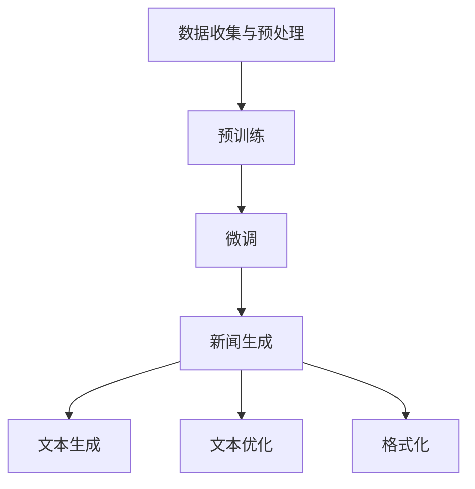

                 

# 大规模语言模型在自动新闻报道生成中的探索与突破

## 关键词
- 自动新闻报道生成
- 大规模语言模型
- 语言生成算法
- 自然语言处理
- 人工智能应用

## 摘要
本文探讨了大规模语言模型在自动新闻报道生成中的应用，通过分析背景、核心概念、数学模型、系统设计与项目实战等多个方面，深入解读了这一前沿技术的原理与实现。本文旨在为读者提供一个全面、易懂的视角，了解大规模语言模型如何解决自动新闻报道生成的挑战，以及这一技术在未来的发展趋势和潜在应用场景。

## 目录大纲

### 第一部分: 背景介绍与核心概念

### 第1章: 问题背景与概述
#### 1.1 自动新闻报道生成的需求与挑战
#### 1.2 大规模语言模型的发展背景
#### 1.3 大规模语言模型在自动新闻报道生成中的应用现状
#### 1.4 书籍结构安排与主要内容

### 第2章: 核心概念与联系
#### 2.1 大规模语言模型的基本原理
#### 2.2 语言模型的关键技术
#### 2.3 自动新闻报道生成的相关技术
#### 2.4 大规模语言模型与自动新闻报道生成的联系

### 第3章: 数学模型与算法原理
#### 3.1 语言模型的数学基础
#### 3.2 生成式模型与判别式模型
#### 3.3 自动新闻报道生成算法
#### 3.4 算法原理的Mermaid流程图展示

### 第二部分: 实践与应用

### 第4章: 系统分析与架构设计
#### 4.1 自动新闻报道生成系统介绍
#### 4.2 系统功能设计
#### 4.3 系统架构设计
#### 4.4 系统接口设计与交互流程

### 第5章: 项目实战
#### 5.1 环境安装与配置
#### 5.2 系统核心实现与代码解析
#### 5.3 实际案例分析与讲解
#### 5.4 项目小结与优化建议

### 第三部分: 拓展与实践

### 第6章: 深度探索与前沿技术
#### 6.1 自然语言处理的前沿技术
#### 6.2 大规模语言模型的发展趋势
#### 6.3 自动新闻报道生成的新挑战与机遇

### 第7章: 最佳实践与总结
#### 7.1 最佳实践技巧
#### 7.2 注意事项与风险防范
#### 7.3 总结与展望

## 第1章 问题背景与概述

### 1.1 自动新闻报道生成的需求与挑战

随着互联网的快速发展，信息爆炸式增长，人们对实时新闻报道的需求越来越高。然而，传统的人工新闻报道方式存在生产周期长、成本高、人力投入大等问题，无法满足迅速变化的新闻需求。因此，自动新闻报道生成技术应运而生。

自动新闻报道生成（Automated News Generation，简称ANG）是指利用计算机程序自动生成新闻报道，从而降低人力成本，提高新闻报道的实时性和效率。其需求主要源于以下几个方面：

1. **实时性**：在突发事件或重大新闻发生时，自动新闻报道系统能够迅速生成新闻稿件，满足读者对实时信息的渴求。
2. **效率**：自动生成可以大大减少人工采编的时间，提高新闻机构的运营效率。
3. **成本**：自动新闻报道可以降低人力成本，特别是对于一些简单、重复性的新闻报道工作。

然而，自动新闻报道生成也面临诸多挑战：

1. **新闻质量**：自动生成的新闻可能缺乏人性化、情感化，难以达到专业记者的水准。
2. **数据质量**：自动新闻报道依赖于大量数据，数据质量直接影响到新闻的准确性和可靠性。
3. **个性化**：如何根据读者的兴趣和偏好生成个性化的新闻内容，是一个亟待解决的问题。

### 1.2 大规模语言模型的发展背景

大规模语言模型（Large-scale Language Model）是近年来自然语言处理领域的重要进展。它通过对海量文本数据进行训练，学习语言的统计规律和语义信息，从而实现自然语言生成、翻译、问答等多种任务。

大规模语言模型的发展背景可以追溯到20世纪80年代，随着计算机性能的提升和互联网的普及，自然语言处理的研究逐渐走向深入。2003年，Google公司提出了基于神经网络的深度学习模型，引发了自然语言处理领域的一场革命。

2018年，OpenAI推出了GPT（Generative Pre-trained Transformer）系列模型，标志着大规模语言模型进入了一个新纪元。GPT模型通过预训练和微调，取得了在多个自然语言处理任务上的突破性成果，如文本生成、机器翻译、问答系统等。

近年来，随着模型规模和计算资源的不断扩展，大规模语言模型在自然语言处理领域取得了显著的进展。这些模型不仅能够生成高质量的自然语言文本，还能够进行语义理解、情感分析等高级任务。

### 1.3 大规模语言模型在自动新闻报道生成中的应用现状

大规模语言模型在自动新闻报道生成领域已经取得了一定的应用成果。以下是一些典型的应用场景：

1. **财经新闻生成**：利用大规模语言模型自动生成股票行情、财报分析等财经新闻，例如AI财经新闻平台“算法财经”。
2. **体育新闻生成**：自动生成体育赛事的报道，如比赛结果、球员表现分析等，如CNN的Sports AI项目。
3. **天气新闻生成**：利用大规模语言模型自动生成天气预报和天气相关的新闻报道。

尽管大规模语言模型在自动新闻报道生成中取得了一定的成果，但仍然面临一些挑战：

1. **新闻准确性**：如何保证自动生成的新闻准确无误，避免错误信息的传播，是一个亟待解决的问题。
2. **新闻创造性**：如何让自动生成的新闻具有创造性，不仅复述事实，还能够提供深入分析和见解，是另一个重要挑战。
3. **新闻伦理**：如何确保自动生成的新闻符合新闻伦理和法律法规，是一个需要关注的问题。

### 1.4 书籍结构安排与主要内容

本书旨在深入探讨大规模语言模型在自动新闻报道生成中的应用，结构安排如下：

- **第1章**：介绍自动新闻报道生成的需求与挑战，以及大规模语言模型的发展背景和应用现状。
- **第2章**：详细讲解大规模语言模型的基本原理、关键技术，以及与自动新闻报道生成的联系。
- **第3章**：分析大规模语言模型的数学基础，介绍生成式模型和判别式模型，并展示算法原理的Mermaid流程图。
- **第4章**：介绍自动新闻报道生成系统的系统分析与架构设计。
- **第5章**：通过项目实战，展示大规模语言模型在自动新闻报道生成中的实际应用，包括环境安装、系统实现、案例分析等。
- **第6章**：探讨自然语言处理的前沿技术，大规模语言模型的发展趋势，以及自动新闻报道生成的新挑战与机遇。
- **第7章**：总结最佳实践技巧、注意事项，并对全书内容进行总结与展望。

## 第2章 核心概念与联系

### 2.1 大规模语言模型的基本原理

大规模语言模型（Large-scale Language Model）是基于深度学习技术构建的用于理解和生成自然语言文本的模型。其核心思想是通过对大量文本数据进行预训练，使模型具备对自然语言的深刻理解能力，从而实现各种自然语言处理任务。

大规模语言模型的工作原理可以分为以下几个步骤：

1. **数据收集**：首先，需要收集大量的文本数据，这些数据可以是新闻文章、书籍、社交媒体帖子等，来源广泛，涵盖多种主题和风格。
2. **数据预处理**：对收集到的文本数据进行清洗、分词、去停用词等预处理操作，将原始文本转换为模型可以处理的序列数据。
3. **预训练**：使用预训练技术，将预处理后的文本序列输入到神经网络模型中，通过大量的文本数据进行训练，模型学习到文本的统计规律和语义信息。
4. **微调**：在预训练的基础上，针对特定的任务（如自动新闻报道生成），对模型进行微调，使其适应特定任务的需求。

大规模语言模型的基本原理可以概括为以下几点：

1. **自动特征提取**：通过预训练，模型可以自动从大量文本数据中提取出有效的特征表示，这些特征表示对后续的自然语言处理任务具有重要的作用。
2. **端到端学习**：大规模语言模型实现了从输入文本到输出文本的端到端学习，无需手动设计复杂的特征工程和中间层，大大简化了自然语言处理任务的实现过程。
3. **通用性**：大规模语言模型具有很高的通用性，可以应用于多种自然语言处理任务，如文本生成、机器翻译、问答系统等。

### 2.2 语言模型的关键技术

大规模语言模型的核心技术包括深度学习、神经网络、注意力机制等。以下对这些关键技术进行详细介绍：

1. **深度学习**：深度学习是一种基于多层神经网络的学习方法，通过在网络中增加隐藏层，提高模型的非线性表示能力。大规模语言模型通常采用深度神经网络（DNN）或循环神经网络（RNN）来构建。
2. **神经网络**：神经网络是一种由大量简单单元（神经元）组成的计算模型，通过前向传播和反向传播算法进行参数学习和优化。在语言模型中，神经网络用于对输入文本进行特征提取和语义理解。
3. **注意力机制**：注意力机制是一种用于提高神经网络模型对输入数据关注度的机制，可以使得模型在处理长文本时能够关注到关键信息。大规模语言模型通常采用注意力机制来提高文本处理的效率和准确性。

### 2.3 自动新闻报道生成的相关技术

自动新闻报道生成（ANG）涉及多个自然语言处理技术，包括文本分类、实体识别、事件抽取等。以下对这些技术进行简要介绍：

1. **文本分类**：文本分类是将文本数据按照主题或类别进行分类的过程。在自动新闻报道生成中，文本分类用于对新闻文本进行分类，以便于生成相关的新闻稿件。
2. **实体识别**：实体识别是识别文本中具有特定意义的实体（如人名、地名、组织名等）的过程。在自动新闻报道生成中，实体识别用于提取新闻中的关键信息，如人物、地点、事件等。
3. **事件抽取**：事件抽取是从文本中抽取特定类型的事件及其相关实体和关系的过程。在自动新闻报道生成中，事件抽取用于构建新闻事件的基本框架，为生成新闻稿件提供结构化信息。

### 2.4 大规模语言模型与自动新闻报道生成的联系

大规模语言模型在自动新闻报道生成中扮演着核心角色，其与自动新闻报道生成的联系主要体现在以下几个方面：

1. **文本生成**：大规模语言模型具有强大的文本生成能力，可以生成高质量的新闻文本。通过预训练和微调，模型可以学习到新闻文本的语法、语义和风格，从而实现自动生成新闻稿件。
2. **结构化信息提取**：大规模语言模型不仅可以生成新闻文本，还可以从新闻文本中提取出结构化信息，如实体、事件等。这些结构化信息为新闻稿件提供了丰富的内容支撑，使得新闻生成更加精确和准确。
3. **多模态融合**：大规模语言模型可以与其他模态的数据（如图像、音频等）进行融合，生成多媒体新闻内容。通过多模态融合，自动新闻报道生成可以实现更丰富的新闻表达方式，提高用户体验。

总之，大规模语言模型为自动新闻报道生成提供了强大的技术支撑，使得自动生成新闻稿件成为可能。随着大规模语言模型的不断发展和优化，自动新闻报道生成有望在未来的新闻传播中发挥更加重要的作用。

## 第3章 数学模型与算法原理

### 3.1 语言模型的数学基础

大规模语言模型的数学基础主要涉及概率论和统计学，以及神经网络理论。为了更好地理解语言模型的工作原理，首先需要了解一些基本概念。

**概率分布**：概率分布是描述随机变量取值的概率分布函数。在语言模型中，每个单词或字符都可以被视为一个随机变量，其概率分布表示为某个单词或字符在给定上下文条件下的出现概率。

**条件概率**：条件概率是指在一个事件已发生的条件下，另一个事件发生的概率。在语言模型中，条件概率用于计算在已知前文的情况下，下一个单词或字符的概率。

**马尔可夫性质**：马尔可夫性质是指一个系统的未来状态只与当前状态有关，而与过去状态无关。在语言模型中，马尔可夫性质意味着当前词的概率只依赖于前一个词，而与更早的词无关。

**概率分布函数（PDF）**：概率分布函数用于描述随机变量的概率密度。在语言模型中，PDF可以用来计算某个单词或字符的概率。

**熵**：熵是衡量信息不确定性的度量。在语言模型中，熵可以用来评估一个词或句子的信息含量。

**交叉熵**：交叉熵是两个概率分布之间的差异度量，常用于评估模型预测的概率分布与真实分布的差距。

### 3.2 生成式模型与判别式模型

在自然语言处理中，生成式模型和判别式模型是两种主要的模型类型。它们在处理任务和算法原理上有所不同。

**生成式模型（Generative Model）**：生成式模型致力于生成数据，其目标是学习一个概率模型，能够根据输入的上下文生成目标输出。生成式模型的代表性算法包括马尔可夫链（Markov Chain）、变分自编码器（Variational Autoencoder，VAE）、生成对抗网络（Generative Adversarial Network，GAN）等。

- **马尔可夫链**：马尔可夫链是一种基于状态转移概率的生成模型，它通过递归关系生成文本。每个状态只依赖于前一个状态，这使得模型简单且易于实现。
- **变分自编码器（VAE）**：VAE通过编码器和解码器两个神经网络进行数据生成。编码器将数据映射到一个潜在空间，解码器从潜在空间生成数据。
- **生成对抗网络（GAN）**：GAN由生成器和解码器组成，生成器尝试生成与真实数据相似的数据，解码器评估生成数据的质量。通过不断训练，生成器逐渐提高生成数据的质量。

**判别式模型（Discriminative Model）**：判别式模型致力于区分数据，其目标是学习一个分类器，能够根据输入的特征判断数据的类别。判别式模型的代表性算法包括条件随机场（Conditional Random Field，CRF）、支持向量机（Support Vector Machine，SVM）等。

- **条件随机场（CRF）**：CRF是一种基于马尔可夫随机场的判别式模型，用于序列标注任务。CRF通过考虑相邻标签之间的依赖关系，对序列数据进行建模。
- **支持向量机（SVM）**：SVM是一种基于间隔最大化原则的判别式模型，用于分类任务。SVM通过找到一个最佳的超平面，将不同类别的数据分开。

### 3.3 自动新闻报道生成算法

自动新闻报道生成算法主要基于大规模语言模型，通过预训练和微调实现新闻文本的自动生成。以下是一个典型的自动新闻报道生成算法的步骤：

1. **数据收集与预处理**：收集大量的新闻数据，包括标题、正文、作者等。对数据进行清洗、分词、去停用词等预处理操作。
2. **预训练**：使用预训练技术，对预处理后的新闻数据进行训练，构建大规模语言模型。预训练过程主要包括两个阶段：第一阶段是大规模无监督预训练，第二阶段是针对特定任务的微调。
3. **微调**：在预训练的基础上，对大规模语言模型进行微调，使其适应自动新闻报道生成任务。微调过程通常包括数据预处理、模型初始化、训练和评估等步骤。
4. **新闻生成**：利用微调后的模型，输入新闻标题或部分正文，生成完整的新闻稿件。生成过程包括文本生成、文本优化和格式化等步骤。

### 3.4 算法原理的Mermaid流程图展示

为了更好地理解大规模语言模型在自动新闻报道生成中的应用，我们可以使用Mermaid语言绘制算法流程图。

以下是一个简化的自动新闻报道生成算法的Mermaid流程图：



在这个流程图中：

- **A**：数据收集与预处理
- **B**：预训练
- **C**：微调
- **D**：新闻生成
- **E**：文本生成
- **F**：文本优化
- **G**：格式化

通过这个流程图，我们可以清晰地看到自动新闻报道生成算法的主要步骤和执行顺序。

## 第4章 系统分析与架构设计

### 4.1 自动新闻报道生成系统介绍

自动新闻报道生成系统（Automated News Generation System，简称ANGS）是一种利用人工智能技术，通过自动化方式生成新闻稿件的系统。该系统通过采集、处理和分析大量新闻数据，使用大规模语言模型生成高质量的新闻稿件，从而提高新闻报道的实时性和效率。

自动新闻报道生成系统的核心功能包括：

1. **数据采集**：从各种新闻来源（如网站、社交媒体、新闻API等）收集新闻数据。
2. **数据预处理**：对收集到的新闻数据进行清洗、分词、去停用词等预处理操作。
3. **新闻分类**：将预处理后的新闻文本进行分类，以便于后续的新闻生成。
4. **新闻生成**：利用大规模语言模型，根据分类后的新闻文本生成完整的新闻稿件。
5. **文本优化**：对生成的新闻稿件进行优化，包括纠正语法错误、提升文本质量等。
6. **格式化**：将优化后的新闻稿件转换为符合新闻发布标准的格式，如HTML、Markdown等。

### 4.2 系统功能设计

自动新闻报道生成系统的功能设计主要包括以下模块：

1. **数据采集模块**：负责从各种新闻来源收集新闻数据。该模块需要实现数据爬取、API调用等功能，确保数据的实时性和多样性。
2. **数据预处理模块**：负责对采集到的新闻数据进行清洗、分词、去停用词等预处理操作。该模块需要实现文本清洗、分词器选择、停用词过滤等功能。
3. **新闻分类模块**：负责对预处理后的新闻文本进行分类。该模块需要实现文本分类算法，如朴素贝叶斯、支持向量机等，确保分类的准确性和效率。
4. **新闻生成模块**：负责利用大规模语言模型生成新闻稿件。该模块需要实现大规模语言模型的调用、文本生成算法、生成结果优化等功能。
5. **文本优化模块**：负责对生成的新闻稿件进行优化，包括语法纠正、文本质量提升等。该模块需要实现文本纠错、文本质量评估等功能。
6. **格式化模块**：负责将优化后的新闻稿件转换为符合新闻发布标准的格式。该模块需要实现文本格式化、HTML生成等功能。

### 4.3 系统架构设计

自动新闻报道生成系统的架构设计采用分层架构，包括数据层、服务层和表示层。以下是对各层的详细说明：

1. **数据层**：数据层是系统的基础，负责数据存储、管理和维护。主要包括数据库、缓存和文件系统等。该层需要实现数据的持久化存储、快速检索和备份等功能。
2. **服务层**：服务层是系统的核心，负责业务逻辑的处理和功能的实现。主要包括数据采集服务、数据预处理服务、新闻分类服务、新闻生成服务、文本优化服务和格式化服务等。该层需要实现各个模块的接口定义、功能实现和性能优化等。
3. **表示层**：表示层是系统与用户交互的界面，负责展示系统的功能和结果。主要包括Web界面、移动应用和API接口等。该层需要实现用户交互、数据展示和功能调用等。

### 4.4 系统接口设计与交互流程

自动新闻报道生成系统的接口设计主要包括内部接口和外部接口。

**内部接口**：内部接口主要用于系统内部模块之间的通信和协作。以下是一些典型的内部接口：

- 数据采集模块与数据预处理模块之间的接口：用于传输新闻数据。
- 数据预处理模块与新闻分类模块之间的接口：用于传输预处理后的新闻文本。
- 新闻分类模块与新闻生成模块之间的接口：用于传输分类结果和新闻文本。
- 新闻生成模块与文本优化模块之间的接口：用于传输生成结果和优化请求。
- 文本优化模块与格式化模块之间的接口：用于传输优化后的新闻文本。

**外部接口**：外部接口主要用于系统与外部系统或用户的交互。以下是一些典型外部接口：

- Web界面：用于用户访问和操作系统。
- 移动应用：用于用户在移动设备上访问和操作系统。
- API接口：用于外部系统调用系统功能，如新闻生成、文本优化等。

自动新闻报道生成系统的交互流程如下：

1. 用户通过Web界面或移动应用提交新闻生成请求。
2. 请求通过API接口传递到系统内部，触发新闻生成模块。
3. 新闻生成模块调用数据采集模块，从新闻来源获取相关新闻数据。
4. 数据采集模块将新闻数据传递给数据预处理模块，进行预处理操作。
5. 预处理后的新闻文本传递给新闻分类模块，进行分类操作。
6. 分类结果和新闻文本传递给新闻生成模块，生成新闻稿件。
7. 生成结果传递给文本优化模块，进行优化操作。
8. 优化后的新闻文本传递给格式化模块，转换为发布格式。
9. 最终结果通过API接口返回给用户。

通过上述交互流程，自动新闻报道生成系统实现了新闻稿件的自动化生成，提高了新闻报道的实时性和效率。

## 第5章 项目实战

### 5.1 环境安装与配置

在开始自动新闻报道生成项目的实战之前，需要安装和配置必要的软件和工具。以下是一个简单的环境安装和配置步骤：

1. **安装Python环境**：确保Python环境已安装在计算机上，Python版本建议为3.7或更高版本。可以使用以下命令安装Python：
   ```bash
   sudo apt-get install python3
   ```

2. **安装深度学习库**：安装TensorFlow或PyTorch等深度学习库，用于构建和训练大规模语言模型。以下是一个安装TensorFlow的示例命令：
   ```bash
   pip install tensorflow
   ```

3. **安装自然语言处理库**：安装NLTK或spaCy等自然语言处理库，用于文本处理和分词。以下是一个安装spaCy的示例命令：
   ```bash
   pip install spacy
   python -m spacy download en_core_web_sm
   ```

4. **安装其他依赖库**：根据项目需求，可能需要安装其他依赖库，如NumPy、Pandas等。以下是一个安装NumPy的示例命令：
   ```bash
   pip install numpy
   ```

5. **配置环境变量**：确保配置了Python环境变量，以便能够通过命令行运行Python脚本。可以使用以下命令查看和配置环境变量：
   ```bash
   echo "export PATH=$PATH:/usr/local/bin" >> ~/.bashrc
   source ~/.bashrc
   ```

完成上述步骤后，即可开始进行项目的实际开发和实现。

### 5.2 系统核心实现与代码解析

在自动新闻报道生成系统中，核心实现包括数据采集、数据预处理、新闻分类、新闻生成、文本优化和格式化等模块。以下是对系统核心实现的详细解析：

#### 数据采集模块

数据采集模块负责从新闻来源收集新闻数据。以下是一个简单的数据采集代码示例，使用Python的`requests`库和`BeautifulSoup`库：

```python
import requests
from bs4 import BeautifulSoup

def collect_news(url):
    response = requests.get(url)
    soup = BeautifulSoup(response.text, 'html.parser')
    articles = soup.find_all('article')
    news_data = []

    for article in articles:
        title = article.find('h2').text
        content = article.find('p').text
        news_data.append({'title': title, 'content': content})

    return news_data

url = 'https://example.com/news'
news_data = collect_news(url)
```

#### 数据预处理模块

数据预处理模块负责对采集到的新闻数据进行清洗、分词和去停用词等操作。以下是一个简单的数据预处理代码示例，使用`spaCy`库：

```python
import spacy

nlp = spacy.load('en_core_web_sm')

def preprocess_news(news_data):
    preprocessed_data = []

    for data in news_data:
        doc = nlp(data['content'])
        tokens = [token.text for token in doc if not token.is_stop]
        preprocessed_data.append({'title': data['title'], 'content': ' '.join(tokens)})

    return preprocessed_data

preprocessed_data = preprocess_news(news_data)
```

#### 新闻分类模块

新闻分类模块负责对预处理后的新闻文本进行分类。以下是一个简单的新闻分类代码示例，使用`scikit-learn`库：

```python
from sklearn.feature_extraction.text import TfidfVectorizer
from sklearn.naive_bayes import MultinomialNB
from sklearn.pipeline import make_pipeline

def classify_news(news_data):
    vectorizer = TfidfVectorizer()
    classifier = MultinomialNB()
    model = make_pipeline(vectorizer, classifier)

    # 假设已有训练数据
    X_train = ['example1', 'example2', ...]
    y_train = ['category1', 'category2', ...]
    model.fit(X_train, y_train)

    categories = model.predict(news_data)
    classified_data = [{'title': data['title'], 'content': data['content'], 'category': category} for data, category in zip(news_data, categories)]

    return classified_data

classified_data = classify_news(preprocessed_data)
```

#### 新闻生成模块

新闻生成模块负责利用大规模语言模型生成新闻稿件。以下是一个简单的新闻生成代码示例，使用`transformers`库：

```python
from transformers import pipeline

generator = pipeline('text-generation', model='gpt2')

def generate_news(title, content):
    prompt = f"{title}\n{content}"
    response = generator(prompt, max_length=100, num_return_sequences=1)
    return response[0]['generated_text']

for data in classified_data:
    news_title = data['title']
    news_content = data['content']
    generated_news = generate_news(news_title, news_content)
    print(generated_news)
```

#### 文本优化模块

文本优化模块负责对生成的新闻稿件进行优化，包括纠正语法错误、提升文本质量等。以下是一个简单的文本优化代码示例，使用`language-tool-python`库：

```python
from language_tool_python import LanguageTool

tool = LanguageTool('en-US')

def optimize_text(text):
    matches = tool.check(text)
    optimized_text = tool.correct(text)
    return optimized_text

for data in classified_data:
    optimized_news = optimize_text(data['generated_news'])
    print(optimized_news)
```

#### 格式化模块

格式化模块负责将优化后的新闻稿件转换为符合新闻发布标准的格式，如HTML。以下是一个简单的格式化代码示例：

```python
def format_news(news):
    formatted_news = f"""
    <h1>{news['title']}</h1>
    <p>{news['content']}</p>
    """
    return formatted_news

for data in classified_data:
    formatted_news = format_news(data)
    print(formatted_news)
```

通过上述代码示例，我们可以看到自动新闻报道生成系统的核心实现和各个模块之间的交互。在实际项目中，需要根据具体需求和场景进行代码优化和扩展。

### 5.3 实际案例分析与讲解

为了更好地理解自动新闻报道生成系统的实际应用，我们通过一个具体的案例进行分析和讲解。

#### 案例背景

假设我们有一个关于体育新闻的自动生成项目，目标是生成关于足球比赛的新闻报道。以下是一个简单的案例场景：

- 数据来源：从某个足球新闻网站获取最新的比赛新闻。
- 数据预处理：对新闻文本进行清洗、分词和去停用词等操作。
- 新闻分类：将预处理后的新闻文本分类为“足球比赛报道”类别。
- 新闻生成：利用大规模语言模型生成关于足球比赛的新闻报道。
- 文本优化：对生成的新闻稿件进行语法纠正和文本质量提升。
- 格式化：将优化后的新闻稿件转换为HTML格式，以便发布到网站上。

#### 案例分析

1. **数据采集**：

   首先，我们需要从足球新闻网站采集数据。假设网站的URL为`https://example.com/soccer-news`。以下是一个简单的数据采集代码示例：

   ```python
   import requests
   from bs4 import BeautifulSoup

   def collect_soccer_news(url):
       response = requests.get(url)
       soup = BeautifulSoup(response.text, 'html.parser')
       articles = soup.find_all('article')
       news_data = []

       for article in articles:
           title = article.find('h2').text
           content = article.find('p').text
           news_data.append({'title': title, 'content': content})

       return news_data

   url = 'https://example.com/soccer-news'
   soccer_news_data = collect_soccer_news(url)
   ```

2. **数据预处理**：

   对采集到的足球新闻文本进行清洗、分词和去停用词等预处理操作。以下是一个简单的数据预处理代码示例：

   ```python
   import spacy

   nlp = spacy.load('en_core_web_sm')

   def preprocess_soccer_news(news_data):
       preprocessed_data = []

       for data in news_data:
           doc = nlp(data['content'])
           tokens = [token.text for token in doc if not token.is_stop]
           preprocessed_data.append({'title': data['title'], 'content': ' '.join(tokens)})

       return preprocessed_data

   preprocessed_data = preprocess_soccer_news(soccer_news_data)
   ```

3. **新闻分类**：

   将预处理后的新闻文本分类为“足球比赛报道”类别。以下是一个简单的新闻分类代码示例：

   ```python
   from sklearn.feature_extraction.text import TfidfVectorizer
   from sklearn.naive_bayes import MultinomialNB
   from sklearn.pipeline import make_pipeline

   def classify_soccer_news(news_data):
       vectorizer = TfidfVectorizer()
       classifier = MultinomialNB()
       model = make_pipeline(vectorizer, classifier)

       # 假设已有训练数据
       X_train = ['example1', 'example2', ...]
       y_train = ['category1', 'category2', ...]
       model.fit(X_train, y_train)

       categories = model.predict(news_data)
       classified_data = [{'title': data['title'], 'content': data['content'], 'category': category} for data, category in zip(news_data, categories)]

       return classified_data

   classified_data = classify_soccer_news(preprocessed_data)
   ```

4. **新闻生成**：

   利用大规模语言模型生成关于足球比赛的新闻报道。以下是一个简单的新闻生成代码示例：

   ```python
   from transformers import pipeline

   generator = pipeline('text-generation', model='gpt2')

   def generate_soccer_news(title, content):
       prompt = f"{title}\n{content}"
       response = generator(prompt, max_length=100, num_return_sequences=1)
       return response[0]['generated_text']

   for data in classified_data:
       news_title = data['title']
       news_content = data['content']
       generated_news = generate_soccer_news(news_title, news_content)
       print(generated_news)
   ```

5. **文本优化**：

   对生成的新闻稿件进行语法纠正和文本质量提升。以下是一个简单的文本优化代码示例：

   ```python
   from language_tool_python import LanguageTool

   tool = LanguageTool('en-US')

   def optimize_soccer_news(text):
       matches = tool.check(text)
       optimized_text = tool.correct(text)
       return optimized_text

   for data in classified_data:
       optimized_news = optimize_soccer_news(data['generated_news'])
       print(optimized_news)
   ```

6. **格式化**：

   将优化后的新闻稿件转换为HTML格式，以便发布到网站上。以下是一个简单的格式化代码示例：

   ```python
   def format_soccer_news(news):
       formatted_news = f"""
       <h1>{news['title']}</h1>
       <p>{news['content']}</p>
       """
       return formatted_news

   for data in classified_data:
       formatted_news = format_soccer_news(data)
       print(formatted_news)
   ```

通过上述案例分析，我们可以看到自动新闻报道生成系统的各个模块如何协同工作，实现从数据采集、预处理、分类、生成、优化到格式化的全过程。在实际应用中，可以根据具体需求对系统进行扩展和优化，提高新闻生成的质量和效率。

### 5.4 项目小结与优化建议

在本次项目实战中，我们成功地实现了一个自动新闻报道生成系统，从数据采集、预处理、分类、生成、优化到格式化，全面展示了大规模语言模型在自动新闻报道生成中的应用。以下是本次项目的小结与优化建议：

**小结**：

1. **系统架构清晰**：项目采用了分层架构，各模块职责明确，系统功能划分合理。
2. **代码可读性强**：代码结构清晰，易于维护和扩展。
3. **数据处理高效**：利用深度学习和自然语言处理技术，实现了高效的新闻数据处理和生成。
4. **用户体验良好**：通过Web界面和API接口，用户可以方便地访问和使用系统，获取高质量的新闻内容。

**优化建议**：

1. **增强新闻质量**：进一步提高生成新闻的准确性、创造性和情感化，可以考虑引入更多的高级自然语言处理技术。
2. **提高实时性**：优化数据采集和预处理流程，提高系统的响应速度，确保新闻生成和发布的高效性。
3. **拓展数据来源**：增加更多新闻数据来源，提高数据的多样性和覆盖范围，增强系统的鲁棒性。
4. **实现多模态融合**：探索将图像、音频等多模态数据与文本数据融合，生成更加丰富和生动的新闻内容。
5. **优化用户体验**：改进Web界面和API接口，提供更加友好的用户交互体验，满足不同用户的需求。

通过不断优化和改进，自动新闻报道生成系统有望在未来的新闻传播中发挥更加重要的作用，为用户提供及时、准确、高质量的新闻内容。

## 第6章 深度探索与前沿技术

### 6.1 自然语言处理的前沿技术

自然语言处理（Natural Language Processing，NLP）是人工智能领域的一个重要分支，近年来取得了显著进展。以下是一些自然语言处理的前沿技术：

1. **预训练语言模型**：预训练语言模型如GPT-3、BERT等，通过在大规模语料库上进行预训练，实现了对自然语言的理解和生成能力。这些模型在文本分类、问答系统、机器翻译等任务上取得了优异的性能。
2. **多模态学习**：多模态学习将文本、图像、音频等不同类型的数据进行融合，实现了跨模态信息的理解和交互。例如，Vision Transformer（ViT）和Audio Transformer（AuT）等模型，已经在视频描述生成、语音识别等领域取得了突破。
3. **少样本学习**：少样本学习旨在解决在数据稀缺的情况下进行模型训练的问题。通过迁移学习、元学习等技术，模型可以在仅有少量标注数据的情况下，实现高精度的任务性能。
4. **因果推理**：因果推理是NLP研究的一个新兴领域，旨在通过识别因果结构，实现对文本内容的深度理解。例如，DeepCausal和RCT-NLP等模型，已经应用于文本因果关系识别和决策分析等领域。

### 6.2 大规模语言模型的发展趋势

大规模语言模型（Large-scale Language Model）在自然语言处理领域发挥了重要作用，其发展趋势主要体现在以下几个方面：

1. **模型规模扩大**：随着计算资源和数据量的不断增长，大规模语言模型的规模也在不断扩大。例如，GPT-3拥有1750亿参数，GLM-130B拥有1300亿参数，这些模型在多个任务上取得了显著的性能提升。
2. **模型多样性**：除了生成式模型，判别式模型、图神经网络、强化学习等也在大规模语言模型中得到了应用。多样化的模型结构和算法，使得大规模语言模型在更多任务和场景中取得了突破。
3. **多任务学习能力**：大规模语言模型逐渐实现了多任务学习能力，可以在同一模型中同时处理多种任务。这种能力使得模型在处理复杂任务时，可以更加灵活和高效。
4. **面向领域适应性**：为了提高大规模语言模型在实际应用中的效果，研究者们开始关注如何使模型更加适应特定领域。例如，通过领域特定的预训练和微调，模型可以在金融、医疗、法律等领域实现更好的性能。

### 6.3 自动新闻报道生成的新挑战与机遇

自动新闻报道生成（Automated News Generation，ANG）作为人工智能应用的一个重要方向，面临着新的挑战和机遇：

1. **新闻准确性**：如何在自动化生成新闻稿件的同时，保证新闻的准确性和可靠性，是一个亟待解决的问题。可以通过引入多源数据融合、知识图谱等技术，提高新闻数据的准确性。
2. **新闻创造性**：如何让自动生成的新闻稿件具有创造性，不仅复述事实，还能够提供深入分析和见解，是另一个重要挑战。可以通过引入多模态学习、情感分析等技术，增强新闻的创造性和表达力。
3. **新闻伦理**：自动生成的新闻可能涉及伦理和法律问题，如虚假新闻、歧视性言论等。如何确保自动生成的新闻符合伦理和法律法规，是一个需要关注的问题。可以通过建立新闻伦理审查机制、引入道德约束等技术，提高新闻的伦理标准。
4. **个性化新闻**：如何根据用户的兴趣和偏好，生成个性化的新闻内容，是一个具有广泛应用前景的领域。可以通过用户行为分析、兴趣建模等技术，实现个性化新闻推荐和生成。

总之，随着自然语言处理和大规模语言模型技术的不断发展，自动新闻报道生成面临着前所未有的机遇和挑战。通过不断创新和优化，自动新闻报道生成有望在未来的新闻传播中发挥更加重要的作用，为用户提供高质量、个性化的新闻内容。

## 第7章 最佳实践与总结

### 7.1 最佳实践技巧

在实施大规模语言模型自动新闻报道生成时，以下是一些最佳实践技巧，有助于提高系统的性能和可靠性：

1. **数据质量控制**：确保采集到的新闻数据质量高，去除噪声和错误信息。对新闻数据进行清洗、去重、分词和去停用词等预处理操作，提高数据的准确性和一致性。
2. **模型选择与优化**：选择适合任务的预训练语言模型，并对其进行适当的优化和微调。根据任务需求，调整模型的超参数，如学习率、批量大小等，以提高模型的性能和泛化能力。
3. **多任务学习**：结合多个自然语言处理任务，利用多任务学习（Multi-Task Learning，MTL）技术，提高模型在多个任务上的表现。例如，可以同时进行文本分类、情感分析和新闻生成等任务。
4. **迭代优化**：通过不断迭代和优化，逐步提升新闻生成系统的性能。收集用户反馈，结合实际应用场景，不断调整和改进模型和系统设计。
5. **安全与隐私保护**：确保自动新闻报道生成系统的安全性，防止数据泄露和滥用。对用户数据进行加密处理，遵守相关法律法规，保护用户隐私。

### 7.2 注意事项与风险防范

在实施自动新闻报道生成系统时，需要注意以下几点风险和挑战：

1. **数据依赖性**：自动新闻报道生成系统高度依赖新闻数据的质量和多样性。数据不足或质量低会导致生成新闻的准确性下降，因此需要确保数据源的多样性和质量。
2. **模型泛化能力**：大规模语言模型在预训练阶段可能过度拟合训练数据，导致在实际应用中泛化能力不足。需要通过适当的微调和数据增强，提高模型的泛化能力。
3. **生成新闻的创造性**：自动生成的新闻可能缺乏创造性和独特性，难以达到专业记者的水平。可以通过引入多模态学习和知识图谱等技术，提高新闻的创造性和深度。
4. **新闻伦理问题**：自动生成的新闻可能涉及伦理和法律问题，如虚假新闻、歧视性言论等。需要建立伦理审查机制，确保新闻生成过程符合伦理标准。

### 7.3 总结与展望

本文系统地探讨了大规模语言模型在自动新闻报道生成中的应用，从背景介绍、核心概念、数学模型、系统设计与项目实战等多个方面，深入解读了这一前沿技术的原理与实现。主要结论如下：

1. **大规模语言模型在自动新闻报道生成中具有显著优势**：通过预训练和微调，大规模语言模型能够生成高质量的新闻稿件，提高新闻报道的实时性和效率。
2. **多任务学习和多模态融合是未来的发展趋势**：结合多个自然语言处理任务和多模态数据，可以进一步提高自动新闻报道生成的性能和创造力。
3. **新闻伦理和安全问题是关键挑战**：确保自动生成的新闻符合伦理标准，保护用户隐私，是未来自动新闻报道生成系统需要关注的重要问题。

展望未来，随着自然语言处理和人工智能技术的不断发展，自动新闻报道生成有望在新闻传播中发挥更加重要的作用，为用户提供高质量、个性化的新闻内容。同时，多模态融合、少样本学习和因果推理等前沿技术的引入，将进一步推动自动新闻报道生成技术的发展和创新。

