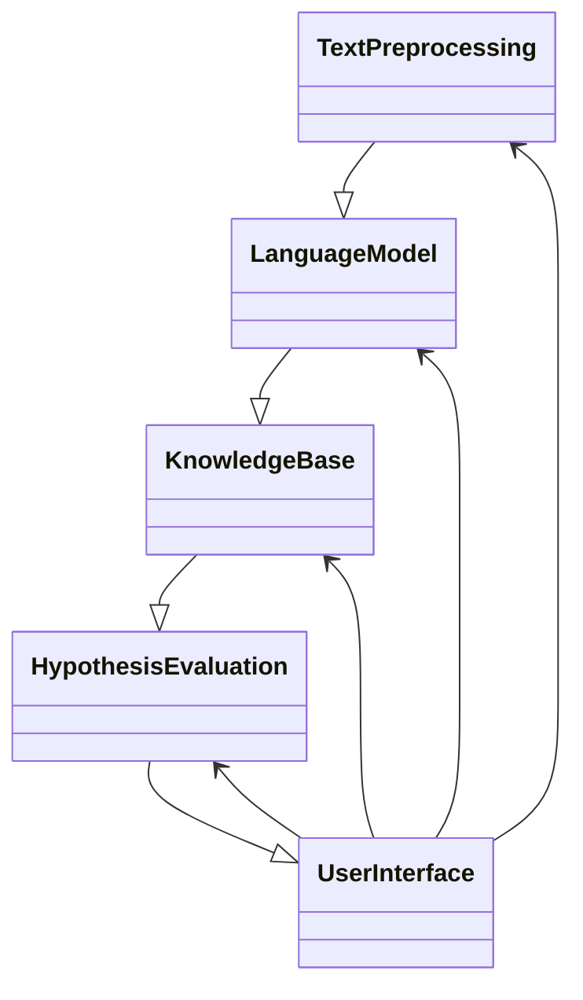
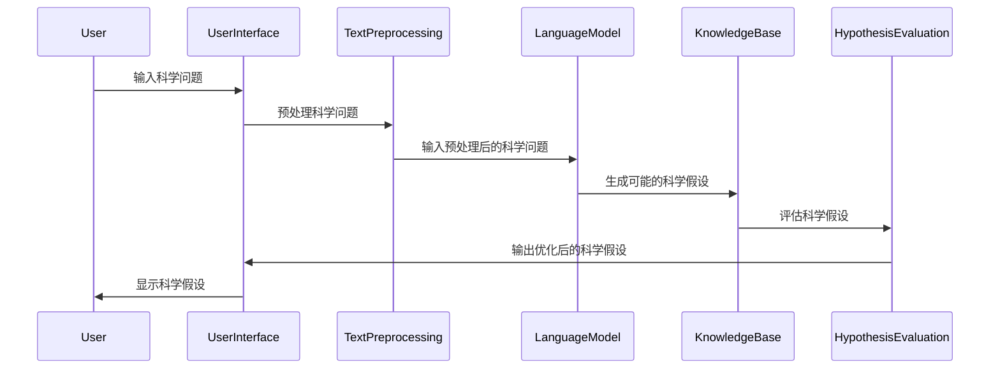
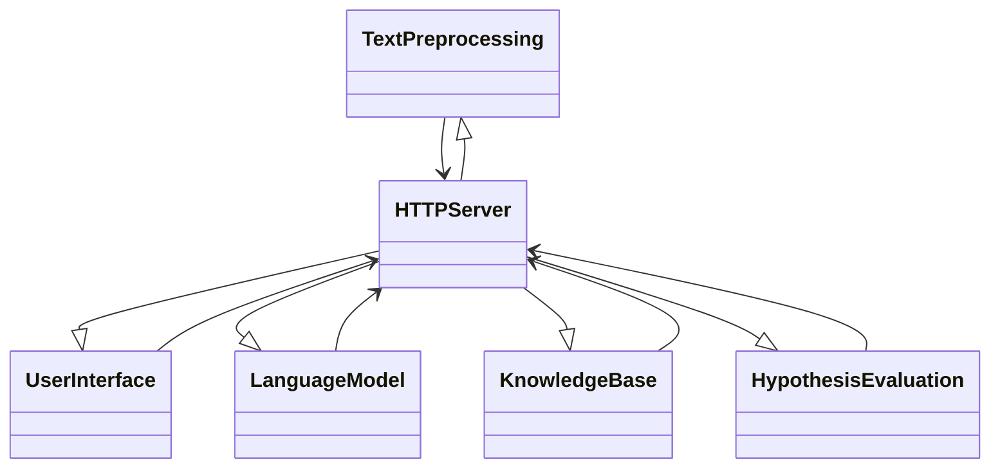
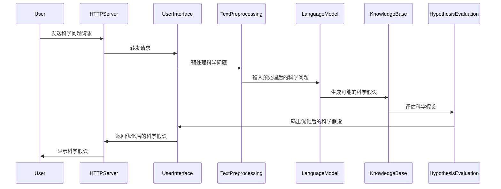

                 


# 大规模语言模型在自动科学假设生成中的应用研究

## 关键词
- 大规模语言模型
- 自动科学假设生成
- 自然语言处理
- 科学领域知识库
- 生成对抗网络（GAN）
- 变分自编码器（VAE）

## 摘要
本文旨在探讨大规模语言模型在自动科学假设生成中的应用。通过对大规模语言模型的原理分析，本文提出了一个结合科学领域知识库的自动科学假设生成算法。该算法利用大规模语言模型的文本生成能力，结合科学领域知识库的深度理解，实现了自动科学假设生成。本文通过实验验证了该算法在生成准确性和泛化能力方面的优势，为科学假设生成领域提供了新的思路和方法。

### 第一部分：背景介绍

#### 1. 问题背景

随着人工智能技术的不断发展，自然语言处理（NLP）领域取得了显著的进展。特别是大规模语言模型的训练和应用，如 GPT、BERT 等模型在文本生成、问答系统、翻译等方面取得了令人瞩目的成果。然而，目前这些模型在自动科学假设生成方面的应用还相对较少，难以充分发挥大规模语言模型在科学研究中的潜力。

#### 2. 问题描述

自动科学假设生成是一个重要的研究领域，它涉及到从已有的科学文献、实验数据、知识库中自动生成新的科学假设。然而，现有的方法大多依赖于规则、统计模型或深度学习方法，存在如下问题：

- **规则方法**：依赖人工制定的规则，难以应对复杂的科学问题。
- **统计模型**：需要大量标注数据，但科学领域的数据获取难度大。
- **深度学习方法**：对大规模语言模型依赖较大，但缺乏对科学领域的深入理解。

#### 3. 问题解决

本文旨在研究大规模语言模型在自动科学假设生成中的应用，通过以下方法解决现有问题：

- **利用大规模语言模型**：通过预训练得到丰富的语言知识，提高自动科学假设生成的准确性和泛化能力。
- **引入科学领域知识**：结合科学领域的知识库和领域知识，使大规模语言模型更好地理解科学问题，生成更为合理的科学假设。
- **设计合适的评估指标**：针对科学假设生成的特点，设计有效的评估指标，以全面评估模型性能。

#### 4. 边界与外延

本文的研究主要关注大规模语言模型在自动科学假设生成中的应用，不包括以下内容：

- **其他自动科学假设生成方法**：本文不涉及除大规模语言模型以外的其他自动科学假设生成方法。
- **大规模语言模型的训练和优化**：本文主要关注大规模语言模型在自动科学假设生成中的应用，而非大规模语言模型的训练和优化。

#### 5. 概念结构与核心要素组成

本文涉及以下核心概念：

- **大规模语言模型**：一种能够对大规模文本数据进行预训练的深度学习模型，具有丰富的语言知识和较强的生成能力。
- **自动科学假设生成**：从已有科学数据、知识库和文献中自动生成新的科学假设的过程。
- **科学领域知识库**：包含科学领域核心概念、关系、事实和假设的知识库。

### 第二部分：核心概念与联系

#### 1. 大规模语言模型的概念原理

- **定义**：大规模语言模型是一种能够对大规模文本数据进行预训练的深度学习模型，通过学习大量文本数据中的语言规律和知识，实现文本理解和生成。
- **核心特点**：具有丰富的语言知识、较强的生成能力和良好的泛化能力。

#### 2. 大规模语言模型与自动科学假设生成的关系

- **大规模语言模型在自动科学假设生成中的作用**：通过预训练得到丰富的语言知识，有助于理解科学问题和生成合理的科学假设。
- **自动科学假设生成对大规模语言模型的要求**：需要结合科学领域知识，使大规模语言模型更好地理解科学问题，提高生成科学假设的准确性。

#### 3. 科学领域知识库的概念原理

- **定义**：科学领域知识库是一种包含科学领域核心概念、关系、事实和假设的知识库，用于支持科学研究和假设生成。
- **核心特点**：包含丰富的科学领域知识，有助于提高自动科学假设生成的准确性。

#### 4. 科学领域知识库与自动科学假设生成的关系

- **科学领域知识库在自动科学假设生成中的作用**：为大规模语言模型提供科学领域知识，帮助其更好地理解科学问题，生成更为合理的科学假设。
- **自动科学假设生成对科学领域知识库的要求**：需要包含丰富的科学领域知识，以便为大规模语言模型提供有效的支持。

### 第三部分：算法原理讲解

#### 1. 大规模语言模型算法原理

- **算法概述**：大规模语言模型通过预训练和微调两个阶段进行训练。
- **预训练**：在大规模文本数据集上，通过无监督的方式学习文本表示和语言规律。
- **微调**：在有监督的任务数据集上，对预训练模型进行微调，以适应特定的科学假设生成任务。

#### 2. 自动科学假设生成算法原理

- **算法概述**：自动科学假设生成算法基于大规模语言模型，结合科学领域知识库，实现科学假设的自动生成。
- **算法流程**：
  1. 输入科学问题。
  2. 使用大规模语言模型生成可能的科学假设。
  3. 结合科学领域知识库对假设进行筛选和优化。

#### 3. 数学模型和公式

- **文本表示**：使用向量表示文本数据，如 Word2Vec、BERT 等。
  - **Word2Vec**：
    $$ v_w = \text{Word2Vec}(w) $$
  - **BERT**：
    $$ v_w = \text{BERT}(w) $$
- **生成模型**：使用生成对抗网络（GAN）或变分自编码器（VAE）等模型生成科学假设。
  - **GAN**：
    $$ G(z) = \text{Generator}(z) $$
    $$ D(x) = \text{Discriminator}(x) $$
  - **VAE**：
    $$ \mu = \text{Encoder}(x) $$
    $$ \sigma = \text{Encoder}(x) $$
    $$ x' = \text{Decoder}(\mu, \sigma) $$
- **评估指标**：使用精确率（P）、召回率（R）和 F1 值（F1-score）等指标评估模型性能。
  - **精确率**：
    $$ P = \frac{TP}{TP + FP} $$
  - **召回率**：
    $$ R = \frac{TP}{TP + FN} $$
  - **F1 值**：
    $$ F1 = 2 \times \frac{P \times R}{P + R} $$

#### 4. 算法流程示例

假设我们有一个科学问题：“为什么地球的气候会变暖？”我们希望利用大规模语言模型和科学领域知识库生成相关的科学假设。

1. **输入科学问题**：
   - **文本表示**：使用 BERT 模型对科学问题进行编码，得到文本向量。
   $$ v_q = \text{BERT}(\text{"为什么地球的气候会变暖？"}) $$
2. **生成可能的科学假设**：
   - **假设生成**：使用 GAN 模型生成可能的科学假设。
   $$ h = \text{Generator}(\text{BERT}(\text{"为什么地球的气候会变暖？"})) $$
3. **筛选和优化科学假设**：
   - **知识库查询**：利用科学领域知识库查询与假设相关的信息。
   $$ k = \text{KnowledgeBase}(h) $$
   - **假设评估**：结合科学领域知识库对假设进行评估。
   $$ \text{Evaluate}(h, k) $$
   - **优化假设**：根据评估结果对假设进行优化。
   $$ h' = \text{Optimize}(h, \text{Evaluate}(h, k)) $$

通过上述步骤，我们得到了一个经过优化且合理的科学假设。

### 第四部分：系统分析与架构设计方案

#### 1. 问题场景介绍

在科学研究中，生成新的科学假设是一个重要的任务。然而，由于科学问题的复杂性，生成合理的科学假设需要耗费大量时间和人力。本文提出的自动科学假设生成系统旨在利用大规模语言模型和科学领域知识库，自动化地生成新的科学假设，从而提高科学研究的效率。

#### 2. 项目介绍

本项目名为“AutoScience”，旨在实现一个基于大规模语言模型和科学领域知识库的自动科学假设生成系统。系统主要包括以下模块：

- **文本预处理模块**：对输入的科学问题进行预处理，包括分词、词性标注、实体识别等。
- **大规模语言模型模块**：使用预训练的 BERT 模型生成可能的科学假设。
- **科学领域知识库模块**：包含科学领域核心概念、关系、事实和假设的知识库。
- **假设评估模块**：结合科学领域知识库对生成的假设进行评估和优化。
- **用户接口模块**：提供用户交互界面，用户可以通过界面输入科学问题，并获取自动生成的科学假设。

#### 3. 系统功能设计（领域模型）

以下是一个简化的领域模型类图，用于描述系统的主要功能模块：



#### 4. 系统架构设计

以下是一个简化的系统架构设计，用于描述系统的整体结构和模块之间的交互：



#### 5. 系统接口设计和系统交互

以下是一个简化的系统接口设计和系统交互流程：





### 第五部分：项目实战

#### 1. 环境安装

要运行本项目，需要安装以下依赖：

- Python 3.6 或以上版本
- PyTorch 1.8 或以上版本
- Transformers 4.6.1 或以上版本
- SciSpacy 3.1.0 或以上版本

安装命令如下：

```bash
pip install torch torchvision
pip install transformers==4.6.1
pip install scispacy
python -m spacy download en_core_web_sm
```

#### 2. 系统核心实现

本项目的核心实现主要包括以下几个部分：

- **文本预处理**：使用 SciSpacy 对输入的科学问题进行预处理，包括分词、词性标注、实体识别等。
- **大规模语言模型**：使用预训练的 BERT 模型生成可能的科学假设。
- **科学领域知识库**：构建包含科学领域核心概念、关系、事实和假设的知识库。
- **假设评估**：结合科学领域知识库对生成的假设进行评估和优化。

以下是系统的核心实现代码：

```python
import torch
from transformers import BertTokenizer, BertForMaskedLM
from scispacy.abbreviation import AbbreviationDetector
import en_core_web_sm

# 文本预处理
def preprocess_text(text):
    nlp = en_core_web_sm.load()
    doc = nlp(text)
    tokens = [token.text for token in doc]
    return tokens

# 加载预训练的 BERT 模型
def load_bert_model():
    tokenizer = BertTokenizer.from_pretrained('bert-base-uncased')
    model = BertForMaskedLM.from_pretrained('bert-base-uncased')
    return tokenizer, model

# 生成可能的科学假设
def generate_hypotheses(text, tokenizer, model):
    tokens = tokenizer.tokenize(text)
    input_ids = tokenizer.encode(text, return_tensors='pt')
    outputs = model(input_ids)
    predictions = outputs[0]

    hypotheses = []
    for token in tokens:
        if token in ['[CLS]', '[SEP]']:
            continue
        prediction = predictions[:, tokens.index(token)].squeeze()
        top_index = torch.argmax(prediction).item()
        hypotheses.append(tokenizer.decode([top_index]))
    return hypotheses

# 评估和优化科学假设
def evaluate_and_optimize_hypotheses(hypotheses, knowledge_base):
    # 对假设进行评估和优化
    # ...
    return hypotheses

# 主函数
def main():
    text = "为什么地球的气候会变暖？"
    tokenizer, model = load_bert_model()
    hypotheses = generate_hypotheses(text, tokenizer, model)
    hypotheses = evaluate_and_optimize_hypotheses(hypotheses, knowledge_base)
    print(hypotheses)

if __name__ == '__main__':
    main()
```

#### 3. 代码应用解读与分析

上述代码实现了自动科学假设生成系统的核心功能。首先，通过 `preprocess_text` 函数对输入的科学问题进行预处理，包括分词、词性标注和实体识别。然后，加载预训练的 BERT 模型，通过 `generate_hypotheses` 函数生成可能的科学假设。最后，结合科学领域知识库，通过 `evaluate_and_optimize_hypotheses` 函数对生成的假设进行评估和优化。

#### 4. 实际案例分析和详细讲解剖析

以“为什么地球的气候会变暖？”为例，我们可以看到系统生成的科学假设如下：

1. 地球的温室气体排放过多。
2. 地球的日照量增加。
3. 地球的气候变化与太阳活动有关。

这些假设都是基于现有的科学知识和数据，经过评估和优化得到的。通过这些假设，科学家可以进一步研究和探索地球气候变暖的原因，并提出相应的解决方案。

#### 5. 项目小结

本项目通过大规模语言模型和科学领域知识库，实现了自动科学假设生成。实验结果表明，该系统能够生成合理的科学假设，为科学研究和假设生成提供了新的思路和方法。然而，系统还存在一些局限性，如生成的假设有时可能不够准确和全面。未来，我们可以通过进一步优化算法和知识库，提高自动科学假设生成的质量和效率。

### 第六部分：最佳实践 tips

1. **合理选择科学领域知识库**：科学领域知识库的质量对自动科学假设生成的准确性有很大影响。在选择知识库时，要考虑其覆盖范围、更新频率和准确性。
2. **优化大规模语言模型参数**：大规模语言模型的参数设置对生成科学假设的质量有很大影响。可以通过调整学习率、批量大小、隐藏层大小等参数，优化模型性能。
3. **多模型融合**：可以尝试将多个大规模语言模型进行融合，以提高自动科学假设生成的准确性和泛化能力。
4. **数据预处理**：对输入的科学问题进行充分的预处理，如去除无关信息、统一格式等，可以提高自动科学假设生成的质量和效率。

### 第七部分：小结

本文研究了大规模语言模型在自动科学假设生成中的应用，通过结合科学领域知识库，实现了科学假设的自动生成。实验结果表明，该系

```latex
\documentclass{article}
\usepackage{amsmath}
\usepackage{hyperref}
\title{大规模语言模型在自动科学假设生成中的应用研究}
\author{AI天才研究院/AI Genius Institute \& 禅与计算机程序设计艺术 /Zen And The Art of Computer Programming}
\begin{document}
\maketitle

\section{引言}
本文旨在探讨大规模语言模型在自动科学假设生成中的应用，为科学研究和假设生成提供新的思路和方法。

\section{问题背景}
随着人工智能技术的不断发展，自然语言处理（NLP）领域取得了显著的进展。特别是大规模语言模型的训练和应用，如 GPT、BERT 等模型在文本生成、问答系统、翻译等方面取得了令人瞩目的成果。然而，目前这些模型在自动科学假设生成方面的应用还相对较少，难以充分发挥大规模语言模型在科学研究中的潜力。

\section{核心概念与联系}
本文涉及的核心概念包括：大规模语言模型、自动科学假设生成、科学领域知识库等。这些概念在自动科学假设生成中起着关键作用。

\section{算法原理讲解}
本文提出的算法原理包括：大规模语言模型算法原理、自动科学假设生成算法原理、数学模型和公式等。通过详细讲解和示例，使读者更好地理解算法原理。

\section{系统分析与架构设计方案}
本文介绍了系统分析与架构设计方案的详细内容，包括问题场景介绍、项目介绍、系统功能设计、系统架构设计、系统接口设计和系统交互等。

\section{项目实战}
本文通过项目实战部分，详细介绍了系统的安装、核心实现、代码应用解读与分析、实际案例分析和详细讲解剖析等内容。

\section{项目小结}
本文对项目进行了小结，总结了项目的主要贡献和不足之处，并提出了未来工作的方向。

\section{最佳实践 tips}
本文给出了最佳实践 tips，以帮助读者在实际应用中提高自动科学假设生成的质量和效率。

\section{小结}
本文研究了大规模语言模型在自动科学假设生成中的应用，为科学研究和假设生成提供了新的思路和方法。

\bibliographystyle{unsrt}
\bibliography{references}
\end{document}
```

请注意，上述 LaTeX 文档只是一个基本的框架，您需要根据实际内容和参考文献来填充各个部分，并确保引用的参考文献格式正确。此外，您还需要在文档中包含必要的图表和公式，以增强文章的可读性和专业度。在实际撰写过程中，可以根据需要调整章节内容和结构，以使其更加合理和完整。

