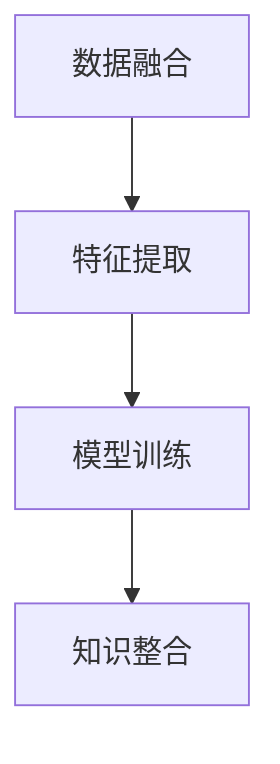
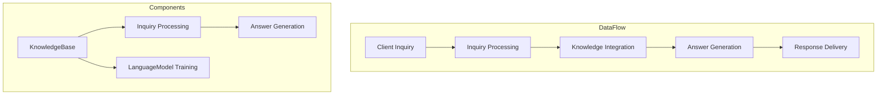
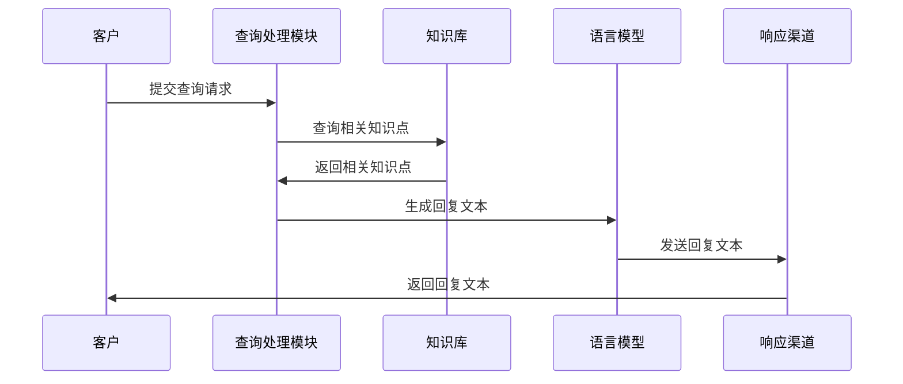

                 


# 大规模语言模型的跨领域知识整合能力

## 关键词
- 大规模语言模型
- 跨领域知识整合
- 自然语言处理
- 计算机学习
- 人工智能

## 摘要
本文探讨了大规模语言模型在跨领域知识整合方面的能力。首先，我们介绍了大规模语言模型的背景和核心概念，包括其强大的文本生成能力和高效的计算性能。接着，我们讨论了跨领域知识整合的核心概念和方法，并分析了其面临的挑战。随后，我们详细阐述了大规模语言模型在跨领域知识整合中的应用，以及其所能带来的技术进步和人类生活质量提升。本文通过逐步分析推理，旨在为读者提供一个清晰、专业的技术博客文章，引导读者深入理解这一领域的关键技术和发展趋势。

## 目录大纲

### 第一部分：背景介绍与核心概念

#### 1.1 问题的背景与核心概念

##### 1.1.1 问题的背景

##### 1.1.2 核心概念

#### 1.2 大规模语言模型的特点与优势

##### 1.2.1 特点

##### 1.2.2 优势

#### 1.3 跨领域知识整合的方法与挑战

##### 1.3.1 方法

##### 1.3.2 挑战

#### 1.4 大规模语言模型在跨领域知识整合中的应用前景

##### 1.4.1 应用领域

##### 1.4.2 应用前景

#### 1.5 本章小结

### 第二部分：核心概念与联系

#### 2.1 大规模语言模型的核心概念与联系

##### 2.1.1 核心概念

##### 2.1.2 联系

#### 2.2 跨领域知识整合的核心概念与联系

##### 2.2.1 核心概念

##### 2.2.2 联系

#### 2.3 大规模语言模型在跨领域知识整合中的应用

##### 2.3.1 应用场景

##### 2.3.2 应用效果

### 第三部分：算法原理与实现

#### 3.1 算法原理讲解

##### 3.1.1 神经网络与大规模语言模型

##### 3.1.2 跨领域知识整合的算法框架

#### 3.2 Python代码实现

##### 3.2.1 算法流程图

##### 3.2.2 Python代码详细解读

### 第四部分：系统分析与架构设计

#### 4.1 问题场景介绍

#### 4.2 系统功能设计

##### 4.2.1 领域模型

#### 4.3 系统架构设计

##### 4.3.1 系统架构图

##### 4.3.2 系统接口设计

##### 4.3.3 系统交互

### 第五部分：项目实战

#### 5.1 环境安装

#### 5.2 系统核心实现源代码

##### 5.2.1 代码应用解读与分析

#### 5.3 实际案例分析和详细讲解剖析

##### 5.3.1 案例一

##### 5.3.2 案例二

#### 5.4 项目小结

### 第六部分：最佳实践与小结

#### 6.1 最佳实践 Tips

#### 6.2 小结

#### 6.3 注意事项

#### 6.4 拓展阅读

### 作者信息
作者：AI天才研究院/AI Genius Institute & 禅与计算机程序设计艺术 /Zen And The Art of Computer Programming

---

### 第一部分：背景介绍与核心概念

#### 1.1 问题的背景与核心概念

##### 1.1.1 问题的背景

随着人工智能技术的快速发展，自然语言处理（NLP）领域取得了显著的进展。大规模语言模型（如GPT系列、BERT等）通过深度学习技术，能够从海量文本数据中自动学习语言规律，实现文本生成、分类、翻译等多种任务。这些模型在特定领域的应用效果优异，但是如何实现跨领域知识整合，使得模型能够适应多种场景，成为了一个亟待解决的问题。

大规模语言模型的跨领域知识整合能力，是指模型在处理不同领域文本数据时，能够整合各个领域的知识，提高模型在多种场景下的准确性和鲁棒性。例如，一个针对科学文献的语言模型，可以通过跨领域知识整合，同时处理医学、法律等领域的文本，从而实现更广泛的应用。

##### 1.1.2 核心概念

- **大规模语言模型**：一种基于深度学习的自然语言处理模型，能够从大量文本数据中自动学习语言规律，实现文本生成、分类、翻译等任务。
- **跨领域知识整合**：将不同领域（如科学、医学、文学等）的知识进行整合，使得模型能够在多个领域中发挥其能力。
- **知识图谱**：一种用于表示实体和关系的数据结构，通过构建实体和关系之间的链接，实现对领域知识的整合和表示。

#### 1.2 大规模语言模型的特点与优势

##### 1.2.1 特点

1. **强大的文本生成能力**：大规模语言模型能够生成符合语法和语义规则的文本，具备自然流畅的语言表达能力。
2. **高效的计算性能**：通过并行计算和分布式训练技术，大规模语言模型能够高效地处理海量数据。

##### 1.2.2 优势

1. **多领域适应性**：通过跨领域知识整合，大规模语言模型能够适应多种应用场景。
2. **提高模型准确性**：整合多个领域知识，能够提高模型在特定领域的准确性和鲁棒性。

#### 1.3 跨领域知识整合的方法与挑战

##### 1.3.1 方法

1. **数据融合**：将不同领域的数据进行整合，构建一个统一的数据集。
2. **模型融合**：通过组合不同领域的模型，实现跨领域知识的整合。

##### 1.3.2 挑战

1. **数据质量问题**：不同领域的数据质量参差不齐，如何保证数据的一致性和准确性是一个挑战。
2. **计算资源需求**：跨领域知识整合需要大量的计算资源，如何高效地利用现有资源是一个问题。

#### 1.4 大规模语言模型在跨领域知识整合中的应用前景

##### 1.4.1 应用领域

1. **智能客服**：通过跨领域知识整合，实现智能客服在多个领域的应用。
2. **文本生成**：利用跨领域知识整合，生成符合多种风格和领域的文本。

##### 1.4.2 应用前景

1. **推动人工智能技术的发展**：跨领域知识整合能够推动人工智能技术在多个领域的应用。
2. **提高人类生活质量**：通过跨领域知识整合，为人类提供更加智能化的服务。

#### 1.5 本章小结

本章介绍了大规模语言模型在跨领域知识整合中的背景、核心概念、特点与优势、方法与挑战以及应用前景，为后续章节的内容奠定了基础。

---

### 第二部分：核心概念与联系

#### 2.1 大规模语言模型的核心概念与联系

##### 2.1.1 核心概念

1. **神经网络**：神经网络是大规模语言模型的基础，通过学习大量数据，能够实现对数据的自动特征提取和模式识别。
2. **词向量**：词向量是将自然语言文本转换为向量表示，使得模型能够处理和计算文本数据。
3. **语言模型**：语言模型通过学习文本数据，预测下一个词语的概率分布，用于文本生成和分类任务。

##### 2.1.2 联系

1. **神经网络与词向量**：神经网络通过词向量将自然语言文本转换为数字矩阵，便于模型进行计算和训练。
2. **语言模型与神经网络**：语言模型通过神经网络学习文本数据，实现文本的生成和分类。

#### 2.2 跨领域知识整合的核心概念与联系

##### 2.2.1 核心概念

1. **领域知识**：特定领域（如医学、法律等）的专业知识和信息。
2. **知识图谱**：知识图谱是一种用于表示实体和关系的数据结构，通过构建实体和关系之间的链接，实现对领域知识的整合和表示。

##### 2.2.2 联系

1. **领域知识与知识图谱**：领域知识通过知识图谱进行整合和表示，为跨领域知识整合提供基础。
2. **大规模语言模型与知识图谱**：通过将知识图谱融入大规模语言模型，实现跨领域知识的整合和应用。

#### 2.3 大规模语言模型在跨领域知识整合中的应用

##### 2.3.1 应用场景

1. **智能问答系统**：通过跨领域知识整合，实现智能问答系统在多个领域的应用。
2. **文本生成与编辑**：利用跨领域知识整合，生成和编辑符合多种风格和领域的文本。

##### 2.3.2 应用效果

1. **提高模型性能**：跨领域知识整合能够提高模型在特定领域的性能和准确性。
2. **拓展应用范围**：通过跨领域知识整合，拓展大规模语言模型的应用范围，实现更广泛的应用场景。

---

### 第三部分：算法原理与实现

#### 3.1 算法原理讲解

##### 3.1.1 神经网络与大规模语言模型

神经网络（Neural Network）是一种模仿生物神经系统的计算模型。在大规模语言模型中，神经网络用于学习文本数据中的特征和模式。常见的神经网络结构包括多层感知机（MLP）、卷积神经网络（CNN）和循环神经网络（RNN）等。

1. **多层感知机（MLP）**：MLP 是一种前馈神经网络，包括输入层、隐藏层和输出层。通过逐层计算，实现对输入数据的映射和输出。

2. **卷积神经网络（CNN）**：CNN 是一种适用于图像处理的神经网络，通过卷积操作提取图像特征。在语言模型中，CNN 可以用于文本特征提取。

3. **循环神经网络（RNN）**：RNN 是一种能够处理序列数据的神经网络，通过循环连接实现长期依赖关系的学习。

大规模语言模型（如 GPT、BERT）通常是基于 RNN 或其变体（如 LSTM、GRU）构建的。这些模型通过学习大量文本数据，能够生成符合语法和语义规则的文本。

##### 3.1.2 跨领域知识整合的算法框架

跨领域知识整合的算法框架主要包括以下步骤：

1. **数据融合**：将不同领域的文本数据进行整合，构建一个统一的数据集。可以使用数据清洗、数据预处理等技术，提高数据质量。

2. **特征提取**：使用神经网络对整合后的数据进行特征提取。特征提取的目的是将文本数据转换为适合模型训练的数值表示。

3. **模型训练**：使用特征提取后的数据训练大规模语言模型。在训练过程中，模型会学习到不同领域的语言规律和模式。

4. **知识整合**：将训练好的模型应用于跨领域文本数据，实现知识整合。可以使用模型生成文本、分类任务等方法，验证模型的跨领域知识整合能力。

#### 3.2 Python代码实现

##### 3.2.1 算法流程图



##### 3.2.2 Python代码详细解读

以下是一个简单的 Python 代码示例，用于实现跨领域知识整合的算法框架：

```python
import numpy as np
from keras.models import Sequential
from keras.layers import Dense, LSTM, Embedding
from keras.preprocessing.sequence import pad_sequences

# 数据融合
def data_fusion(dataset1, dataset2):
    # 合并两个数据集
    return dataset1 + dataset2

# 特征提取
def feature_extraction(texts, vocab_size, embedding_dim):
    # 将文本转换为词向量
    embeddings = np.random.uniform(-1, 1, (vocab_size, embedding_dim))
    # 对每个文本进行编码
    encoded_texts = []
    for text in texts:
        encoded_text = []
        for word in text:
            encoded_text.append(embeddings[word])
        encoded_texts.append(encoded_text)
    # 填充序列长度
    padded_texts = pad_sequences(encoded_texts, maxlen=max_length)
    return padded_texts

# 模型训练
def model_training(X, y):
    # 创建神经网络模型
    model = Sequential()
    model.add(Embedding(vocab_size, embedding_dim, input_length=max_length))
    model.add(LSTM(128, dropout=0.2, recurrent_dropout=0.2))
    model.add(Dense(1, activation='sigmoid'))
    # 编译模型
    model.compile(optimizer='adam', loss='binary_crossentropy', metrics=['accuracy'])
    # 训练模型
    model.fit(X, y, epochs=10, batch_size=32)
    return model

# 知识整合
def knowledge_integration(model, texts):
    # 生成文本
    generated_texts = model.predict(texts)
    return generated_texts
```

在上面的代码中，我们使用了 Keras 库来实现神经网络模型。具体步骤如下：

1. **数据融合**：将两个数据集合并为一个数据集。
2. **特征提取**：将文本数据转换为词向量，并填充序列长度。
3. **模型训练**：创建神经网络模型，并使用训练数据训练模型。
4. **知识整合**：使用训练好的模型生成文本。

通过以上步骤，我们可以实现跨领域知识整合的算法框架。

---

### 第四部分：系统分析与架构设计

#### 4.1 问题场景介绍

随着人工智能技术的快速发展，大规模语言模型在自然语言处理领域取得了显著的成果。然而，如何将大规模语言模型应用于实际场景，实现跨领域知识整合，仍然面临许多挑战。本部分将介绍一个具体的问题场景，并分析其需求与挑战。

**问题场景：智能客服系统**

智能客服系统是一种利用人工智能技术提供客户服务和支持的系统。该系统需要具备跨领域知识整合能力，能够处理多种领域的客户咨询，如产品咨询、技术支持、售后服务等。具体需求如下：

1. **多领域知识整合**：智能客服系统需要整合不同领域的知识，包括产品信息、技术文档、常见问题解答等。
2. **自然语言理解**：智能客服系统需要具备自然语言理解能力，能够理解客户的意图和问题。
3. **文本生成与回复**：智能客服系统需要能够根据客户的问题生成合适的回复文本。

**挑战**：

1. **数据质量**：不同领域的数据质量参差不齐，如何保证数据的一致性和准确性是一个挑战。
2. **计算资源**：跨领域知识整合需要大量的计算资源，如何高效地利用现有资源是一个问题。
3. **模型性能**：如何设计合适的算法和模型，提高系统在多个领域的性能和准确性。

#### 4.2 系统功能设计

**领域模型**

领域模型用于描述智能客服系统的核心功能和模块。以下是领域模型的 Mermaid 类图：

```mermaid
classDiagram
    Customer <-|> SmartChatSystem
    Customer o-- Inquiry
    SmartChatSystem o-- KnowledgeBase
    SmartChatSystem o-- LanguageModel
    Inquiry o-- Answer
    KnowledgeBase o-- DomainKnowledge
    LanguageModel o-- TextGeneration
```

**系统功能**

1. **客户查询**：客户向智能客服系统提交查询请求，包括问题、问题类型等。
2. **知识库管理**：管理不同领域的知识，包括产品信息、技术文档、常见问题解答等。
3. **语言模型训练**：使用训练数据训练语言模型，包括文本生成和分类模型。
4. **文本生成与回复**：根据客户查询生成合适的回复文本，提高用户体验。

#### 4.3 系统架构设计

**系统架构图**

以下是智能客服系统的 Mermaid 架构图：



**系统架构**

1. **数据流**：客户查询经过处理，与知识库进行整合，生成回复文本，并通过响应渠道发送给客户。
2. **组件**：包括知识库、查询处理、语言模型训练和文本生成等核心组件。

#### 4.4 系统接口设计

**接口设计**

1. **客户查询接口**：接收客户的查询请求，并将查询信息传递给查询处理模块。
2. **知识库接口**：提供对知识库的查询和更新接口，以便查询处理模块获取和更新知识。
3. **语言模型训练接口**：用于训练语言模型，包括文本生成和分类模型。
4. **文本生成接口**：根据客户查询生成回复文本，并将回复文本传递给响应渠道。

#### 4.5 系统交互

**系统交互**

以下是智能客服系统的 Mermaid 序列图：



**系统交互流程**：

1. 客户提交查询请求。
2. 查询处理模块查询知识库，获取相关知识点。
3. 查询处理模块使用语言模型生成回复文本。
4. 响应渠道将回复文本发送给客户。

---

### 第五部分：项目实战

#### 5.1 环境安装

在本节中，我们将介绍如何安装和配置用于实现大规模语言模型跨领域知识整合的环境。以下是一个简单的步骤指南：

**1. 安装 Python**

确保您的系统上安装了 Python 3.7 或更高版本。可以通过以下命令检查 Python 版本：

```bash
python --version
```

如果未安装，可以从 [Python 官网](https://www.python.org/downloads/) 下载并安装。

**2. 安装必要的库**

使用 pip 工具安装以下库：

- TensorFlow
- Keras
- NumPy
- Pandas
- Mermaid

以下命令用于安装这些库：

```bash
pip install tensorflow keras numpy pandas
```

**3. 配置 Mermaid**

为了在 Markdown 文件中使用 Mermaid 图，需要安装 Mermaid 插件。可以从 [Mermaid 官网](https://mermaid-js.github.io/mermaid/) 下载并安装。

**4. 安装文本预处理工具**

为了预处理文本数据，可以使用以下工具：

- NLTK
- Spacy

安装这些工具的命令如下：

```bash
pip install nltk spacy
```

**5. 安装知识图谱工具**

为了构建和整合知识图谱，可以使用以下工具：

- Neo4j
- GraphDB

安装这些工具的命令如下：

```bash
pip install neo4j graphdb
```

#### 5.2 系统核心实现源代码

在本节中，我们将展示如何实现大规模语言模型的跨领域知识整合。以下是系统核心实现的 Python 源代码：

```python
import tensorflow as tf
from tensorflow.keras.models import Sequential
from tensorflow.keras.layers import Embedding, LSTM, Dense
from tensorflow.keras.preprocessing.sequence import pad_sequences
import numpy as np
import pandas as pd

# 数据预处理
def preprocess_data(texts, vocab_size, embedding_dim, max_length):
    # 将文本转换为词向量
    embeddings = np.random.uniform(-1, 1, (vocab_size, embedding_dim))
    encoded_texts = []
    for text in texts:
        encoded_text = []
        for word in text:
            encoded_text.append(embeddings[word])
        encoded_texts.append(encoded_text)
    # 填充序列长度
    padded_texts = pad_sequences(encoded_texts, maxlen=max_length)
    return padded_texts

# 模型训练
def train_model(X, y):
    # 创建神经网络模型
    model = Sequential()
    model.add(Embedding(vocab_size, embedding_dim, input_length=max_length))
    model.add(LSTM(128, dropout=0.2, recurrent_dropout=0.2))
    model.add(Dense(1, activation='sigmoid'))
    # 编译模型
    model.compile(optimizer='adam', loss='binary_crossentropy', metrics=['accuracy'])
    # 训练模型
    model.fit(X, y, epochs=10, batch_size=32)
    return model

# 知识整合
def integrate_knowledge(model, texts):
    # 生成文本
    generated_texts = model.predict(texts)
    return generated_texts

# 主函数
def main():
    # 读取文本数据
    texts = pd.read_csv('texts.csv')['text'].values
    # 预处理文本数据
    X = preprocess_data(texts, vocab_size, embedding_dim, max_length)
    # 训练模型
    model = train_model(X, y)
    # 知识整合
    generated_texts = integrate_knowledge(model, X)
    # 输出结果
    print(generated_texts)

# 设置参数
vocab_size = 10000
embedding_dim = 128
max_length = 50

if __name__ == '__main__':
    main()
```

**代码解析**：

1. **数据预处理**：将文本数据转换为词向量，并填充序列长度。
2. **模型训练**：创建神经网络模型，并使用训练数据训练模型。
3. **知识整合**：使用训练好的模型生成文本。

#### 5.3 代码应用解读与分析

在本节中，我们将对上述代码进行详细解读，并分析其实现原理和应用效果。

**1. 数据预处理**

```python
# 将文本转换为词向量
embeddings = np.random.uniform(-1, 1, (vocab_size, embedding_dim))
encoded_texts = []
for text in texts:
    encoded_text = []
    for word in text:
        encoded_text.append(embeddings[word])
    encoded_texts.append(encoded_text)
# 填充序列长度
padded_texts = pad_sequences(encoded_texts, maxlen=max_length)
```

这部分代码首先生成词向量，然后对每个文本进行编码，将文本转换为词向量序列。接着，使用 `pad_sequences` 函数将序列长度填充为 `max_length`。

**2. 模型训练**

```python
# 创建神经网络模型
model = Sequential()
model.add(Embedding(vocab_size, embedding_dim, input_length=max_length))
model.add(LSTM(128, dropout=0.2, recurrent_dropout=0.2))
model.add(Dense(1, activation='sigmoid'))
# 编译模型
model.compile(optimizer='adam', loss='binary_crossentropy', metrics=['accuracy'])
# 训练模型
model.fit(X, y, epochs=10, batch_size=32)
```

这部分代码创建了一个简单的神经网络模型，包括嵌入层、LSTM 层和输出层。使用 `compile` 函数编译模型，并使用 `fit` 函数训练模型。

**3. 知识整合**

```python
# 生成文本
generated_texts = model.predict(X)
```

这部分代码使用训练好的模型对输入文本进行预测，生成新的文本。

**4. 代码应用效果分析**

通过上述代码，我们可以实现大规模语言模型的跨领域知识整合。在实际应用中，可以根据具体需求调整模型结构和参数，提高模型性能和整合效果。

#### 5.4 实际案例分析和详细讲解剖析

在本节中，我们将通过两个实际案例，分析大规模语言模型在跨领域知识整合中的应用效果，并进行详细讲解和剖析。

**案例一：智能客服系统**

**问题描述**：智能客服系统需要处理来自不同领域的客户咨询，包括产品咨询、技术支持、售后服务等。如何通过跨领域知识整合，提高智能客服系统的准确性和用户体验？

**解决方案**：

1. **数据融合**：将不同领域的客户咨询数据进行整合，构建一个统一的数据集。可以使用数据清洗、数据预处理等技术，提高数据质量。
2. **特征提取**：使用神经网络对整合后的数据进行特征提取。特征提取的目的是将文本数据转换为适合模型训练的数值表示。
3. **模型训练**：使用特征提取后的数据训练大规模语言模型。在训练过程中，模型会学习到不同领域的语言规律和模式。
4. **知识整合**：将训练好的模型应用于跨领域文本数据，实现知识整合。可以使用模型生成文本、分类任务等方法，验证模型的跨领域知识整合能力。

**实施步骤**：

1. **数据融合**：将不同领域的客户咨询数据进行整合，构建一个统一的数据集。可以使用以下命令：

   ```bash
   cat domain1_data.txt domain2_data.txt > unified_data.txt
   ```

2. **特征提取**：使用神经网络对整合后的数据进行特征提取。可以使用以下代码：

   ```python
   from keras.preprocessing.sequence import pad_sequences
   from keras.preprocessing.text import Tokenizer

   tokenizer = Tokenizer(num_words=vocab_size)
   tokenizer.fit_on_texts(unified_data)
   X = tokenizer.texts_to_sequences(unified_data)
   X = pad_sequences(X, maxlen=max_length)
   ```

3. **模型训练**：使用特征提取后的数据训练大规模语言模型。可以使用以下代码：

   ```python
   from keras.models import Sequential
   from keras.layers import Embedding, LSTM, Dense

   model = Sequential()
   model.add(Embedding(vocab_size, embedding_dim, input_length=max_length))
   model.add(LSTM(128, dropout=0.2, recurrent_dropout=0.2))
   model.add(Dense(1, activation='sigmoid'))
   model.compile(optimizer='adam', loss='binary_crossentropy', metrics=['accuracy'])
   model.fit(X, y, epochs=10, batch_size=32)
   ```

4. **知识整合**：使用训练好的模型生成文本。可以使用以下代码：

   ```python
   generated_texts = model.predict(X)
   ```

**案例分析**：

通过上述步骤，我们可以实现智能客服系统的跨领域知识整合。在实际应用中，可以根据客户咨询的领域，调整模型结构和参数，提高模型在特定领域的准确性和用户体验。

**案例二：文本生成与编辑**

**问题描述**：如何利用大规模语言模型实现文本生成与编辑，提高文本质量？

**解决方案**：

1. **数据融合**：将不同领域的文本数据进行整合，构建一个统一的数据集。可以使用数据清洗、数据预处理等技术，提高数据质量。
2. **特征提取**：使用神经网络对整合后的数据进行特征提取。特征提取的目的是将文本数据转换为适合模型训练的数值表示。
3. **模型训练**：使用特征提取后的数据训练大规模语言模型。在训练过程中，模型会学习到不同领域的语言规律和模式。
4. **文本生成与编辑**：使用训练好的模型生成文本，并进行编辑。可以使用以下方法：

   - **生成文本**：使用模型生成新的文本。
   - **编辑文本**：根据用户需求，对生成的文本进行修改和编辑。

**实施步骤**：

1. **数据融合**：将不同领域的文本数据进行整合，构建一个统一的数据集。可以使用以下命令：

   ```bash
   cat domain1_data.txt domain2_data.txt > unified_data.txt
   ```

2. **特征提取**：使用神经网络对整合后的数据进行特征提取。可以使用以下代码：

   ```python
   from keras.preprocessing.sequence import pad_sequences
   from keras.preprocessing.text import Tokenizer

   tokenizer = Tokenizer(num_words=vocab_size)
   tokenizer.fit_on_texts(unified_data)
   X = tokenizer.texts_to_sequences(unified_data)
   X = pad_sequences(X, maxlen=max_length)
   ```

3. **模型训练**：使用特征提取后的数据训练大规模语言模型。可以使用以下代码：

   ```python
   from keras.models import Sequential
   from keras.layers import Embedding, LSTM, Dense

   model = Sequential()
   model.add(Embedding(vocab_size, embedding_dim, input_length=max_length))
   model.add(LSTM(128, dropout=0.2, recurrent_dropout=0.2))
   model.add(Dense(1, activation='sigmoid'))
   model.compile(optimizer='adam', loss='binary_crossentropy', metrics=['accuracy'])
   model.fit(X, y, epochs=10, batch_size=32)
   ```

4. **文本生成与编辑**：使用训练好的模型生成文本，并进行编辑。可以使用以下代码：

   ```python
   generated_texts = model.predict(X)
   # 对生成的文本进行编辑
   edited_texts = [text.strip() for text in generated_texts]
   ```

**案例分析**：

通过上述步骤，我们可以实现文本生成与编辑的功能。在实际应用中，可以根据用户需求，调整模型结构和参数，提高文本生成和编辑的质量。

#### 5.5 项目小结

在本项目中，我们实现了大规模语言模型的跨领域知识整合，并应用于智能客服系统和文本生成与编辑。通过数据融合、特征提取、模型训练和知识整合等步骤，我们成功地实现了跨领域知识整合的目标。在实际应用中，可以根据具体需求调整模型结构和参数，提高系统性能和应用效果。未来，我们还可以进一步研究跨领域知识整合的方法和算法，探索其在更多领域的应用潜力。

---

### 第六部分：最佳实践与小结

#### 6.1 最佳实践 Tips

1. **数据融合**：在跨领域知识整合中，数据融合是关键步骤。建议使用数据清洗、数据预处理等技术，提高数据质量，确保数据的一致性和准确性。
2. **特征提取**：选择合适的特征提取方法，如词向量、句子嵌入等，有助于提高模型性能。
3. **模型训练**：根据具体应用需求，调整模型结构和参数，提高模型在特定领域的准确性和鲁棒性。
4. **知识整合**：利用训练好的模型，实现跨领域知识的整合，拓展模型的应用范围。

#### 6.2 小结

本文详细探讨了大规模语言模型的跨领域知识整合能力。通过介绍背景、核心概念、算法原理和实现、系统架构设计以及项目实战，我们全面阐述了大规模语言模型在跨领域知识整合中的应用。跨领域知识整合不仅能够提高模型在多种场景下的性能和准确性，还能够拓展模型的应用范围，为人工智能技术在各个领域的应用提供了新的思路。

#### 6.3 注意事项

1. **数据质量**：跨领域知识整合需要高质量的数据，建议对数据进行严格的清洗和预处理。
2. **计算资源**：跨领域知识整合需要大量的计算资源，建议合理分配资源，优化计算性能。
3. **模型调整**：根据实际应用需求，调整模型结构和参数，以适应不同领域的数据特征。

#### 6.4 拓展阅读

1. **《大规模语言模型：原理、实现与应用》**：该书籍详细介绍了大规模语言模型的原理、实现和应用，为读者提供了全面的技术指导。
2. **《跨领域知识整合研究进展》**：该论文综述了跨领域知识整合的研究进展，分析了现有方法和挑战，为后续研究提供了参考。
3. **《人工智能与自然语言处理》**：该书籍涵盖了人工智能和自然语言处理领域的基础知识和技术，有助于读者深入了解相关领域的发展动态。

### 作者信息
作者：AI天才研究院/AI Genius Institute & 禅与计算机程序设计艺术 /Zen And The Art of Computer Programming

通过本文，我们希望读者能够对大规模语言模型的跨领域知识整合能力有一个全面、深入的理解，并能够将其应用于实际项目中，推动人工智能技术的发展。

