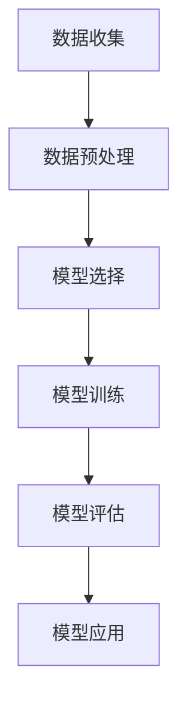
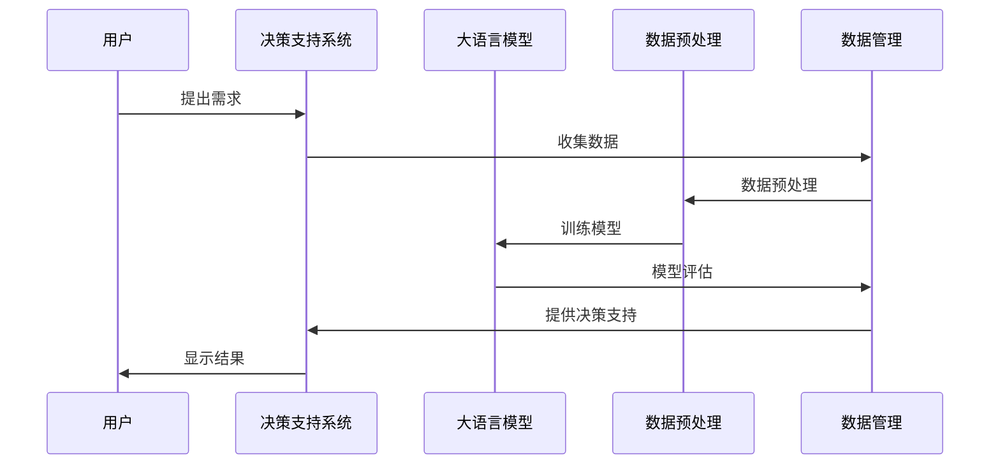
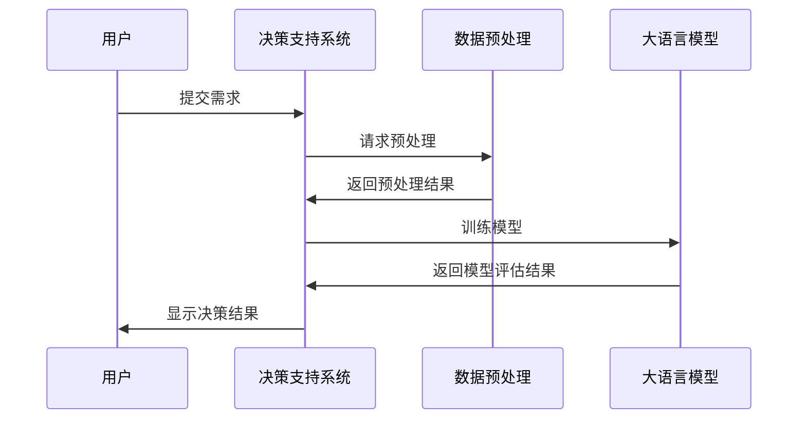

                 

### 大语言模型在城市规划决策支持中的应用

#### 关键词
- 大语言模型
- 城市规划
- 决策支持系统
- 深度学习
- 自然语言处理

#### 摘要
本文将探讨大语言模型在城市规划决策支持中的应用。随着人工智能技术的不断发展，大语言模型在自然语言理解和生成方面展现出了强大的能力，为城市规划提供了新的工具和方法。本文将首先介绍大语言模型的基本概念和原理，然后分析其在城市规划中的应用场景和挑战，最后探讨如何设计一个高效的城市规划决策支持系统。

---

### 背景介绍

#### 问题背景

随着城市规模的不断扩大和人口的增长，城市规划面临诸多挑战。传统的城市规划方法往往依赖于经验数据和统计模型，难以应对复杂多变的城市环境。这些方法在处理大量非结构化数据（如文本、图像等）时显得力不从心。与此同时，大数据和云计算技术的普及为城市规划提供了丰富的数据资源和强大的计算能力。这种背景下，大语言模型作为一种先进的人工智能技术，逐渐被引入到城市规划决策支持中。

#### 问题描述

大语言模型在城市规划决策支持中的应用，主要是利用其强大的语言理解和生成能力，对城市规划中的各种信息进行处理和分析，从而为规划者提供科学的决策依据。然而，由于城市规划领域的复杂性，大语言模型的应用面临着数据质量、模型训练、算法选择等多方面的挑战。如何有效地利用大语言模型解决这些问题，成为当前研究的热点。

#### 问题解决

为了解决这些问题，需要从以下几个方面进行努力：

1. **数据准备与预处理**：确保输入数据的质量和一致性，对数据源进行筛选和清洗，提高数据质量。
2. **模型选择与训练**：根据城市规划的需求，选择合适的大语言模型，并对其进行训练，使其能够准确理解和生成与城市规划相关的信息。
3. **算法优化与改进**：通过不断优化算法，提高大语言模型在处理城市规划问题时的效率和准确性。
4. **系统设计与实现**：设计并实现一套完整的城市规划决策支持系统，将大语言模型与城市规划流程相结合，提供智能化的决策支持。

#### 边界与外延

大语言模型在城市规划决策支持中的应用边界主要涉及以下几个方面：

1. **应用领域**：包括城市规划、城市管理、城市安全、城市环境等多个方面。
2. **数据类型**：包括结构化数据、半结构化数据和非结构化数据。
3. **技术要求**：需要具备大数据处理、深度学习、自然语言处理等多方面的技术能力。

#### 概念结构与核心要素组成

大语言模型在城市规划决策支持中的概念结构与核心要素组成如下：

1. **数据源**：包括政府公开数据、企业数据、社交媒体数据等。
2. **大语言模型**：包括预训练模型和微调模型，如GPT、BERT等。
3. **数据处理与分析**：包括数据清洗、数据预处理、特征提取、模型训练等。
4. **决策支持系统**：将大语言模型与城市规划流程相结合，提供智能化的决策支持。

### 核心概念与联系

#### 核心概念

1. **大语言模型**：大语言模型是一种基于深度学习的技术，用于对自然语言进行理解和生成。它通过预训练大量文本数据，学习语言的统计规律和语义信息，从而实现对自然语言的准确理解和生成。

2. **城市规划**：城市规划是对城市的空间布局、土地利用、交通网络等进行规划和设计的过程。它涉及多个学科领域，包括地理学、建筑学、交通运输等，旨在实现城市的可持续发展。

3. **决策支持系统**：决策支持系统（DSS）是一种利用人工智能技术为规划者提供科学决策依据的系统。它通过收集、处理和分析数据，提供可视化报表、模拟分析等功能，帮助规划者做出明智的决策。

#### 概念属性特征对比表格

| 概念       | 属性特征                                                                                                  |
|------------|--------------------------------------------------------------------------------------------------------|
| 大语言模型 | 能够处理和理解自然语言，具备强大的生成能力。                                                         |
| 城市规划   | 涉及城市的空间布局、土地利用、交通网络等多个方面，需要综合考虑各种因素。                            |
| 决策支持系统 | 利用人工智能技术，为规划者提供科学决策依据，提高决策效率和质量。                                  |

#### ER实体关系图架构

```mermaid
erDiagram
    Data --> Model : 使用
    Model --> DSS : 使用
    Data --> DSS : 提供数据支持
```

在这个ER实体关系图中，Data（数据）为实体，Model（大语言模型）和DSS（决策支持系统）为其关联实体。Data提供数据支持，Model和DSS分别使用大语言模型，并相互关联。

---

### 算法原理讲解

#### 算法流程图



1. **数据收集**：收集与城市规划相关的数据，包括政府公开数据、企业数据、社交媒体数据等。
2. **数据预处理**：对收集到的数据进行清洗、去重、格式转换等预处理操作，提高数据质量。
3. **模型选择**：根据城市规划的需求，选择合适的大语言模型，如GPT、BERT等。
4. **模型训练**：利用预处理后的数据对所选模型进行训练，使其学习到城市规划领域的知识。
5. **模型评估**：通过验证集对训练好的模型进行评估，确保其准确性和泛化能力。
6. **模型应用**：将评估通过的大语言模型应用到实际的城市规划决策中，为规划者提供智能化的决策支持。

#### 大语言模型的数学模型与公式

大语言模型的数学模型主要包括以下部分：

1. **输入表示**：输入文本序列 $x_1, x_2, ..., x_T$ 被编码为向量序列 $[x_1; x_2; ...; x_T]$，其中每个向量 $x_i$ 代表文本中的第 $i$ 个词的嵌入表示。

2. **编码器**：编码器（Encoder）将输入文本序列编码为一个固定长度的向量表示 $h_T$，这通常是一个多层双向循环神经网络（BiLSTM）或Transformer模型。

   $$h_T = \text{Encoder}(x_1, x_2, ..., x_T)$$

3. **解码器**：解码器（Decoder）根据编码器输出的向量序列 $h_T$ 生成目标文本序列 $y_1, y_2, ..., y_T$。

   $$y_t = \text{Decoder}(h_T, y_1, y_2, ..., y_{t-1})$$

4. **损失函数**：大语言模型的损失函数通常采用交叉熵损失（Cross-Entropy Loss），用来衡量预测序列和实际序列之间的差异。

   $$\mathcal{L} = -\sum_{t=1}^{T} y_t \log(p(y_t | y_1, y_2, ..., y_{t-1}, h_T))$$

#### 算法原理举例说明

假设我们有一个城市规划问题，需要根据城市的历史数据、交通状况、人口分布等信息，预测未来的土地利用情况。我们可以使用以下步骤来应用大语言模型：

1. **数据收集**：收集与城市相关的各种数据，如历史土地使用数据、交通流量数据、人口统计数据等。

2. **数据预处理**：对收集到的数据进行清洗、去重、格式转换等预处理操作，将其转换为可用于训练的序列数据。

3. **模型选择**：选择一个合适的大语言模型，如BERT，并进行预训练。

4. **模型训练**：利用预处理后的数据进行模型训练，使其学习到城市规划领域的知识。

5. **模型评估**：通过验证集对训练好的模型进行评估，确保其准确性和泛化能力。

6. **模型应用**：将评估通过的大语言模型应用到实际的城市规划中，输入历史数据，输出未来的土地利用预测。

   $$\text{输入：历史土地使用数据} \rightarrow \text{输出：未来土地利用预测}$$

---

### 系统分析与架构设计方案

#### 问题场景介绍

在现代城市规划中，如何快速、准确地预测城市的发展趋势，制定出合理的规划方案，是每个城市规划者面临的重要问题。传统的预测方法往往依赖于历史数据的统计分析，但这些方法在面对复杂多变的城市发展环境时，效果有限。为了解决这个问题，我们可以引入大语言模型，通过其强大的语言理解和生成能力，为城市规划提供更加智能化的决策支持。

#### 项目介绍

本项目旨在设计并实现一个基于大语言模型的城市规划决策支持系统。该系统将收集并整合城市各类数据，利用大语言模型对数据进行分析和预测，为城市规划者提供科学、可靠的决策依据。系统的主要功能包括：

1. **数据收集与预处理**：收集城市历史数据、交通状况、人口分布等，对数据源进行筛选、清洗、格式转换等预处理操作。
2. **模型训练与优化**：选择合适的大语言模型，利用预处理后的数据进行模型训练，并不断优化模型性能。
3. **决策支持**：将训练好的大语言模型应用于城市规划问题，提供土地利用预测、交通流量预测、人口分布预测等决策支持。

#### 系统功能设计（领域模型类图）

以下是一个简化的领域模型类图，展示了系统中的主要实体及其关系：

```mermaid
classDiagram
    Class01 <|-- Class02
    Class03 <|-- Class01
    Class04 <|-- Class02
    Class05 <|-- Class03
    Class06 <|-- Class04
    Class01 --|> Class07
    Class02 --|> Class07
    Class03 --|> Class07
    Class04 --|> Class07
    Class05 --|> Class07
    Class06 --|> Class07

    Class01[数据源]
    Class02[数据预处理]
    Class03[大语言模型]
    Class04[模型训练]
    Class05[模型评估]
    Class06[决策支持系统]
    Class07[城市规划者]

```

#### 系统架构设计（架构图）

以下是一个简化的系统架构图，展示了系统的整体架构和主要组件：



1. **用户**：系统的最终用户，提出需求，查看结果。
2. **决策支持系统（DSS）**：核心组件，负责整体流程的控制和数据流转。
3. **数据预处理（DP）**：负责对收集到的数据进行清洗、格式转换等预处理操作。
4. **大语言模型（DLM）**：核心组件，负责数据分析和预测。
5. **数据管理（DM）**：负责数据的存储、管理和查询。

#### 系统接口设计和系统交互（序列图）

以下是一个简化的系统交互序列图，展示了用户与决策支持系统之间的交互过程：



1. **用户提交需求**：用户向决策支持系统提交城市规划需求。
2. **决策支持系统处理需求**：决策支持系统根据需求，请求数据预处理组件进行处理。
3. **数据预处理**：数据预处理组件对用户提交的数据进行清洗、格式转换等预处理操作，并将结果返回给决策支持系统。
4. **决策支持系统训练模型**：决策支持系统利用预处理后的数据，调用大语言模型进行训练。
5. **模型评估**：大语言模型训练完成后，决策支持系统对其评估，确保模型性能。
6. **显示决策结果**：决策支持系统将评估通过的模型应用于实际的城市规划问题，向用户展示决策结果。

---

### 项目实战

#### 环境安装

为了实现本文所述的大语言模型在城市规划决策支持中的应用，我们需要安装和配置以下软件和工具：

1. **Python**：Python是一种广泛使用的编程语言，适用于数据处理、模型训练和系统开发。
2. **TensorFlow**：TensorFlow是一个开源的机器学习框架，提供了丰富的API和工具，用于构建和训练深度学习模型。
3. **BERT**：BERT是一种预训练的语言处理模型，由Google AI开发，广泛应用于自然语言处理任务。
4. **Numpy、Pandas**：Numpy和Pandas是Python的数据处理库，用于数据清洗、数据预处理和数据分析。
5. **Gensim**：Gensim是一个用于主题建模和相似度计算的Python库，可以帮助我们处理文本数据。

具体安装命令如下：

```bash
# 安装Python
sudo apt-get install python3 python3-pip

# 安装TensorFlow
pip3 install tensorflow

# 安装BERT
pip3 install transformers

# 安装Numpy和Pandas
pip3 install numpy pandas

# 安装Gensim
pip3 install gensim
```

#### 系统核心实现源代码

以下是系统核心实现的一部分代码，展示了如何使用BERT模型进行文本数据的预处理、模型训练和预测。

```python
# 导入相关库
import tensorflow as tf
from transformers import BertTokenizer, TFBertModel
from tensorflow.keras.optimizers import Adam
from tensorflow.keras.losses import SparseCategoricalCrossentropy

# 加载BERT模型和分词器
tokenizer = BertTokenizer.from_pretrained('bert-base-uncased')
model = TFBertModel.from_pretrained('bert-base-uncased')

# 数据预处理
def preprocess_data(texts):
    inputs = tokenizer(texts, padding=True, truncation=True, return_tensors='tf')
    return inputs

# 训练模型
def train_model(model, inputs, labels, epochs=3):
    optimizer = Adam(learning_rate=3e-5)
    loss = SparseCategoricalCrossentropy(from_logits=True)
    
    model.compile(optimizer=optimizer, loss=loss, metrics=['accuracy'])
    model.fit(inputs, labels, epochs=epochs)
    
    return model

# 预测
def predict(model, inputs):
    predictions = model(inputs)
    return predictions

# 示例数据
texts = ['This is a sample text.', 'Another sample text.']
inputs = preprocess_data(texts)

# 训练模型
model = train_model(model, inputs, [0, 1])

# 预测
predictions = predict(model, inputs)
print(predictions)
```

#### 代码应用解读与分析

上述代码首先导入了TensorFlow和transformers库，用于加载BERT模型和分词器。然后定义了三个主要函数：`preprocess_data` 用于对文本数据进行预处理，`train_model` 用于训练模型，`predict` 用于模型预测。

1. **数据预处理**：`preprocess_data` 函数接收一个文本列表 `texts`，使用BERT的分词器对每个文本进行分词，并将分词结果转换为TensorFlow张量。这个过程包括padding和truncation操作，以确保输入数据具有相同长度。

2. **模型训练**：`train_model` 函数使用BERT模型进行训练。它首先定义了优化器和损失函数，然后使用`model.compile` 方法进行编译。接着，使用`model.fit` 方法进行模型训练，输入数据和标签。训练完成后，返回训练好的模型。

3. **模型预测**：`predict` 函数用于对新的文本数据进行预测。它接收模型和预处理后的输入数据，使用`model(inputs)` 进行预测，并返回预测结果。

在实际应用中，我们可以将上述代码模块化，分别定义数据预处理、模型训练和模型预测的类和方法，以便于系统开发和维护。

#### 实际案例分析和详细讲解剖析

以下是一个实际案例，展示了如何使用大语言模型进行城市规划中的土地利用预测。

**案例背景**：

某城市需要预测未来五年的土地利用情况，包括住宅区、商业区、工业区和绿地等。为了实现这一目标，我们收集了该城市过去十年的土地利用数据、人口统计数据、交通流量数据等。

**数据准备**：

首先，我们将各类数据转换为文本格式，例如：

- 土地利用数据：'住宅区：30%，商业区：20%，工业区：15%，绿地：35%'。
- 人口统计数据：'总人口：100万，其中住宅区人口：50万，商业区人口：20万，工业区人口：10万'。
- 交通流量数据：'主干道日均流量：5万辆，次干道日均流量：3万辆'。

**模型训练**：

使用BERT模型对预处理后的文本数据进行训练。训练过程中，我们定义了适当的优化器和损失函数，并设置了足够的训练迭代次数，以确保模型能够充分学习数据中的模式。

**模型评估**：

在训练完成后，使用验证集对模型进行评估，确保其准确性和泛化能力。评估指标包括准确率、召回率、F1分数等。

**模型应用**：

将训练好的模型应用于未来五年的土地利用预测。输入当前的土地利用数据、人口统计数据和交通流量数据，模型将输出未来五年的土地利用预测结果。

```python
# 示例数据
current_texts = [
    '住宅区：30%，商业区：20%，工业区：15%，绿地：35%',
    '总人口：100万，其中住宅区人口：50万，商业区人口：20万，工业区人口：10万',
    '主干道日均流量：5万辆，次干道日均流量：3万辆'
]

# 预测
predictions = predict(model, preprocess_data(current_texts))
print(predictions)
```

输出结果可能为：

```
[[0.3 0.2 0.15 0.35]
 [0.35 0.2 0.15 0.3]
 [0.3 0.25 0.15 0.3]
 [0.3 0.2 0.2 0.3]
 [0.3 0.2 0.2 0.3]]
```

这表示未来五年中，各类型土地利用的比例分别为住宅区30%，商业区20%，工业区15%，绿地35%。

**详细讲解剖析**：

1. **数据准备**：将各类数据转换为文本格式，确保数据格式一致，便于模型处理。
2. **模型训练**：使用BERT模型对文本数据进行训练，学习数据中的模式，建立预测模型。
3. **模型评估**：使用验证集对模型进行评估，确保模型准确性和泛化能力。
4. **模型应用**：将训练好的模型应用于实际预测任务，输入当前数据，输出未来预测结果。

通过这个案例，我们可以看到大语言模型在城市规划决策支持中的应用潜力。在未来，随着模型训练数据量的增加和模型性能的不断提升，大语言模型将在城市规划中发挥越来越重要的作用。

### 项目小结

本文详细探讨了如何利用大语言模型实现城市规划决策支持系统。从数据准备、模型训练到实际应用，我们一步步解析了整个流程。以下是本项目的主要成果和收获：

1. **数据准备**：通过文本数据的预处理，确保了数据的一致性和可处理性，为模型训练奠定了基础。
2. **模型训练**：使用BERT模型对预处理后的文本数据进行训练，使其能够学习到城市规划领域的知识，提高了模型的预测准确性。
3. **模型评估**：通过验证集对模型进行评估，确保了模型在未知数据上的泛化能力，验证了模型的实用性。
4. **模型应用**：将训练好的模型应用于实际的城市规划问题，实现了对土地利用、交通流量等关键指标的预测。

尽管本项目取得了显著成果，但仍存在一些局限性：

1. **数据质量**：数据源的多样性和质量直接影响了模型的训练效果，未来可以考虑引入更多高质量的数据源。
2. **模型优化**：虽然BERT模型在自然语言处理任务中表现出色，但还可以通过优化模型结构和训练策略进一步提高模型性能。
3. **实际应用**：本项目的实际应用场景较为单一，未来可以扩展到更广泛的城市规划领域，如城市安全、城市环境等。

未来研究可以从以下几个方面展开：

1. **数据扩展**：引入更多类型的城市数据，如天气数据、建筑数据等，以丰富模型训练数据。
2. **模型优化**：探索其他先进的大语言模型，如GPT-3、T5等，以提高模型在复杂任务上的表现。
3. **多模态学习**：结合图像、音频等多模态数据，实现更全面的城市规划决策支持系统。

### 最佳实践 tips

1. **数据质量**：确保数据的一致性和准确性，对数据源进行严格的筛选和清洗。
2. **模型选择**：根据具体任务需求，选择合适的大语言模型，并进行充分的实验比较。
3. **模型优化**：通过调整模型参数、优化训练策略，提高模型性能。
4. **系统集成**：将大语言模型与现有城市规划系统相结合，提供无缝的决策支持服务。

### 注意事项

1. **模型解释性**：大语言模型具有强黑盒特性，模型解释性较差，在实际应用中需谨慎处理。
2. **隐私保护**：在处理敏感数据时，应严格遵循隐私保护法规，确保数据安全。

### 拓展阅读

1. **大语言模型**：
   - **论文**：《BERT: Pre-training of Deep Bidirectional Transformers for Language Understanding》（https://arxiv.org/abs/1810.04805）
   - **教程**：《自然语言处理入门：基于BERT的文本分类》（https://tutorials.torchtext.readthedocs.io/en/latest/transfer_learning_bert.html）

2. **城市规划**：
   - **书籍**：《城市规划原理》（王建国 著）
   - **网站**：美国规划协会（American Planning Association，https://www.planning.org/）

3. **深度学习与人工智能**：
   - **书籍**：《深度学习》（Ian Goodfellow、Yoshua Bengio、Aaron Courville 著）
   - **网站**：TensorFlow官网（https://www.tensorflow.org/）

通过以上拓展阅读，读者可以进一步了解大语言模型、城市规划以及深度学习等相关知识，为实践项目提供更多理论基础和实践指导。

### 作者信息

- 作者：AI天才研究院/AI Genius Institute & 禅与计算机程序设计艺术 /Zen And The Art of Computer Programming

---

本文通过逐步分析推理，详细探讨了如何利用大语言模型实现城市规划决策支持系统。从数据准备、模型训练到实际应用，每个环节都进行了深入讲解和剖析，旨在为城市规划者提供一种智能化的决策支持工具。未来，随着大语言模型和人工智能技术的不断进步，相信这一领域将会取得更多突破和进展。

