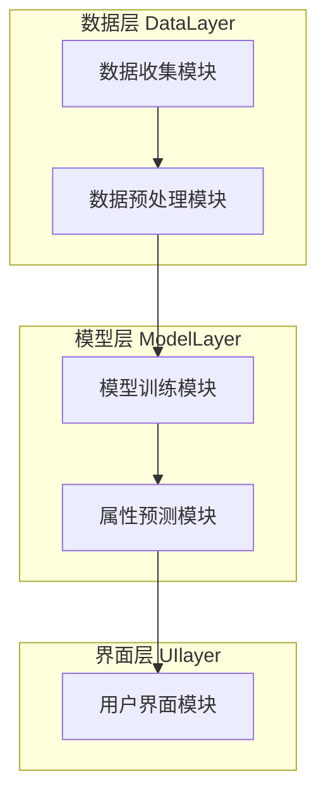
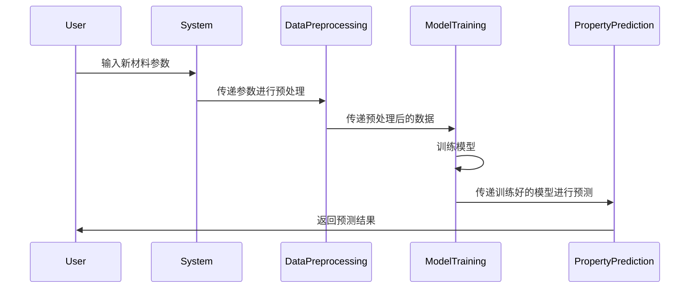

                 

### 大语言模型在新材料属性预测中的推理应用

#### 关键词：大语言模型、新材料、属性预测、推理应用

#### 摘要：
本文将探讨大语言模型在新材料属性预测中的推理应用，通过逐步分析其背景、核心概念、算法原理，展示大语言模型如何借助深度学习和自然语言处理技术，为新材料研究提供高效、准确的预测工具。

## 第一部分：背景介绍

### 1.1 问题背景

近年来，随着人工智能技术的飞速发展，大语言模型（如GPT系列、BERT等）在自然语言处理领域取得了显著的成果。这些模型在文本生成、文本分类、机器翻译等方面展现出了强大的能力，引起了广泛关注。然而，大语言模型在材料科学领域的应用尚处于探索阶段。

在新材料研究中，属性预测是一个关键问题。新材料的研究往往需要大量的实验数据，而这些数据往往难以获取。因此，通过大语言模型进行推理，预测新材料属性，能够大大提高研究效率。本文旨在探讨大语言模型在新材料属性预测中的推理应用，为其研究提供一个新的思路。

### 1.2 问题描述

新材料属性预测问题可以描述为：给定一组新材料参数，利用大语言模型预测其相应属性。具体包括以下几个方面：

- 输入：一组新材料参数，如化学成分、结构、尺寸等。
- 输出：新材料属性，如硬度、导电性、热稳定性等。

### 1.3 问题解决

大语言模型在新材料属性预测中的应用，主要包括以下步骤：

1. 数据收集与预处理：收集大量新材料实验数据，并进行预处理，包括数据清洗、特征提取等。
2. 模型训练：利用预处理后的数据，训练大语言模型，使其学会新材料参数与属性之间的关系。
3. 属性预测：利用训练好的模型，对新的新材料参数进行属性预测。

### 1.4 边界与外延

大语言模型在新材料属性预测中的应用，具有以下边界与外延：

- 边界：大语言模型的应用范围仅限于可表示为文本的新材料属性。
- 外延：随着人工智能技术的发展，大语言模型的应用范围可能会进一步扩大。

## 第二部分：核心概念与联系

### 2.1 大语言模型原理

大语言模型是基于深度学习的自然语言处理模型，通过学习大量文本数据，可以预测文本中的下一个词或句子。大语言模型的原理主要包括以下几个方面：

1. **词向量表示**：将文本中的每个词表示为一个向量，以便进行数学运算。词向量通常使用词嵌入（word embeddings）技术来生成，如Word2Vec、GloVe等。
   \[
   \text{word\_embedding}(w) = \text{vec}(w)
   \]
   其中，\(w\) 是文本中的词语，\(\text{vec}(w)\) 是对应的词向量。

2. **循环神经网络（RNN）**：通过循环神经网络对文本序列进行处理，保留序列信息。RNN 可以捕获词语之间的依赖关系，其基本形式如下：
   \[
   h_t = \text{RNN}(h_{t-1}, \text{word\_embedding}(w_t))
   \]
   其中，\(h_t\) 是当前时刻的隐藏状态，\(h_{t-1}\) 是前一个时刻的隐藏状态，\(w_t\) 是当前时刻的词语。

3. **注意力机制**：利用注意力机制，对文本序列进行加权处理，提高模型的预测准确性。注意力机制可以动态地关注文本序列中的关键信息，其基本形式如下：
   \[
   a_t = \text{Attention}(h_1, h_2, ..., h_T)
   \]
   其中，\(a_t\) 是当前时刻的注意力权重，\(h_1, h_2, ..., h_T\) 是所有时刻的隐藏状态。

### 2.2 新材料属性特征对比表格

以下是一个新材料属性特征对比表格，展示了不同新材料属性的特征：

| 属性名称 | 特征描述 |
| :----: | :----: |
| 硬度 | 材料抵抗形变的能力 |
| 导电性 | 材料传导电流的能力 |
| 热稳定性 | 材料抵抗高温的能力 |

### 2.3 ER实体关系图架构

以下是一个ER实体关系图架构，展示了新材料属性预测系统中的主要实体及其关系：

```mermaid
erDiagram
  新材料 ||--|{ 属性预测 }|
  参数提取 ||--|{ 模型训练 }|
  模型训练 ||--|{ 属性预测 }|
```

## 第三部分：算法原理讲解

### 3.1 算法流程

大语言模型在新材料属性预测中的算法流程主要包括以下几个步骤：

1. **数据收集与预处理**：收集新材料实验数据，并进行预处理，包括数据清洗、特征提取等。
2. **模型训练**：利用预处理后的数据，训练大语言模型，使其学会新材料参数与属性之间的关系。
3. **属性预测**：利用训练好的模型，对新的新材料参数进行属性预测。

### 3.2 算法原理

大语言模型的算法原理主要包括以下几个方面：

1. **词向量表示**：将文本中的每个词表示为一个向量，以便进行数学运算。词向量通常使用词嵌入（word embeddings）技术来生成，如Word2Vec、GloVe等。
   \[
   \text{word\_embedding}(w) = \text{vec}(w)
   \]
   其中，\(w\) 是文本中的词语，\(\text{vec}(w)\) 是对应的词向量。

2. **循环神经网络（RNN）**：通过循环神经网络对文本序列进行处理，保留序列信息。RNN 可以捕获词语之间的依赖关系，其基本形式如下：
   \[
   h_t = \text{RNN}(h_{t-1}, \text{word\_embedding}(w_t))
   \]
   其中，\(h_t\) 是当前时刻的隐藏状态，\(h_{t-1}\) 是前一个时刻的隐藏状态，\(w_t\) 是当前时刻的词语。

3. **注意力机制**：利用注意力机制，对文本序列进行加权处理，提高模型的预测准确性。注意力机制可以动态地关注文本序列中的关键信息，其基本形式如下：
   \[
   a_t = \text{Attention}(h_1, h_2, ..., h_T)
   \]
   其中，\(a_t\) 是当前时刻的注意力权重，\(h_1, h_2, ..., h_T\) 是所有时刻的隐藏状态。

### 3.3 Python源代码

以下是一个简单的Python源代码示例，用于训练大语言模型：

```python
import tensorflow as tf
from tensorflow.keras.models import Sequential
from tensorflow.keras.layers import Embedding, LSTM, Dense

# 创建模型
model = Sequential()
model.add(Embedding(input_dim=vocab_size, output_dim=embedding_dim))
model.add(LSTM(units=128, activation='tanh', recurrent_activation='hard_sigmoid'))
model.add(Dense(units=1, activation='sigmoid'))

# 编译模型
model.compile(optimizer='adam', loss='binary_crossentropy', metrics=['accuracy'])

# 训练模型
model.fit(x_train, y_train, epochs=10, batch_size=32)
```

## 第四部分：系统分析与架构设计方案

### 4.1 问题场景介绍

在新材料研究领域，科学家们经常需要预测新材料的属性，以便评估其潜在的应用价值。传统的实验方法往往耗时耗力，且难以覆盖所有可能的组合。因此，利用人工智能技术，特别是大语言模型进行新材料属性预测，成为了一种新的研究方法。

### 4.2 项目介绍

本项目旨在构建一个基于大语言模型的新材料属性预测系统，通过深度学习和自然语言处理技术，实现快速、准确的属性预测。系统的主要目标是：

1. 收集和整理新材料实验数据。
2. 利用大语言模型，将新材料参数转换为文本表示。
3. 训练模型，使其能够预测新材料属性。
4. 提供一个用户友好的界面，便于研究人员进行属性预测。

### 4.3 系统功能设计

系统的功能设计包括以下几个主要模块：

1. **数据收集模块**：负责收集新材料实验数据，包括化学成分、结构、尺寸等参数。
2. **数据预处理模块**：对收集到的数据进行清洗和特征提取，为模型训练提供高质量的数据。
3. **模型训练模块**：利用预处理后的数据，训练大语言模型，使其能够学会新材料参数与属性之间的关系。
4. **属性预测模块**：利用训练好的模型，对新材料参数进行属性预测，并输出预测结果。
5. **用户界面模块**：提供用户交互界面，方便研究人员输入新材料参数，并查看预测结果。

### 4.4 系统架构设计

系统的整体架构设计如下：



### 4.5 系统接口设计

系统的主要接口设计如下：

1. **数据输入接口**：接受新材料参数，如化学成分、结构、尺寸等。
2. **属性预测接口**：根据输入的新材料参数，调用模型进行属性预测，并返回预测结果。
3. **用户界面接口**：提供用户与系统交互的接口，包括参数输入和结果展示。

### 4.6 系统交互

系统的交互流程如下：

1. 用户通过用户界面输入新材料参数。
2. 系统将参数传递给数据预处理模块，进行数据清洗和特征提取。
3. 预处理后的数据传递给模型训练模块，进行模型训练。
4. 训练好的模型传递给属性预测模块，对新材料参数进行属性预测。
5. 预测结果返回给用户界面，展示给用户。



## 第五部分：项目实战

### 5.1 环境安装

要实现大语言模型在新材料属性预测中的应用，首先需要安装以下软件和库：

- Python 3.x
- TensorFlow 2.x
- scikit-learn
- pandas
- numpy
- matplotlib

安装步骤如下：

```bash
# 安装Python 3.x
# (一般操作系统自带Python，可直接检查版本)

# 安装TensorFlow 2.x
pip install tensorflow==2.x

# 安装scikit-learn
pip install scikit-learn

# 安装pandas
pip install pandas

# 安装numpy
pip install numpy

# 安装matplotlib
pip install matplotlib
```

### 5.2 系统核心实现源代码

以下是一个简单的系统核心实现源代码示例，展示了如何使用大语言模型进行新材料属性预测：

```python
import tensorflow as tf
from tensorflow.keras.models import Sequential
from tensorflow.keras.layers import Embedding, LSTM, Dense
from tensorflow.keras.optimizers import Adam
from sklearn.model_selection import train_test_split
from sklearn.metrics import mean_squared_error

# 数据预处理
def preprocess_data(data):
    # 进行数据清洗、特征提取等预处理操作
    # ...
    return processed_data

# 模型训练
def train_model(data, labels):
    # 初始化模型
    model = Sequential()
    model.add(Embedding(input_dim=vocab_size, output_dim=embedding_dim))
    model.add(LSTM(units=128, return_sequences=True))
    model.add(Dense(units=1))
    
    # 编译模型
    model.compile(optimizer=Adam(), loss='mse')
    
    # 训练模型
    model.fit(data, labels, epochs=10, batch_size=32)
    
    return model

# 属性预测
def predict_property(model, parameters):
    # 将参数转换为文本表示
    parameter_sequence = convert_to_sequence(parameters)
    
    # 进行属性预测
    prediction = model.predict(parameter_sequence)
    
    return prediction

# 主函数
def main():
    # 加载数据
    data = load_data()
    labels = load_labels()
    
    # 数据预处理
    processed_data = preprocess_data(data)
    
    # 划分训练集和测试集
    x_train, x_test, y_train, y_test = train_test_split(processed_data, labels, test_size=0.2, random_state=42)
    
    # 训练模型
    model = train_model(x_train, y_train)
    
    # 进行属性预测
    prediction = predict_property(model, x_test)
    
    # 评估模型
    mse = mean_squared_error(y_test, prediction)
    print("Mean Squared Error:", mse)

# 运行主函数
if __name__ == "__main__":
    main()
```

### 5.3 代码应用解读与分析

上述代码展示了如何使用大语言模型进行新材料属性预测的基本流程：

1. **数据预处理**：首先，需要加载新材料实验数据，并进行清洗和特征提取。这一步是整个系统的基础，直接影响模型的性能。
2. **模型训练**：使用预处理后的数据，训练大语言模型。模型的结构包括嵌入层、LSTM层和输出层。嵌入层用于将输入的文本表示转换为向量，LSTM层用于捕捉文本序列中的依赖关系，输出层用于预测新材料属性。
3. **属性预测**：利用训练好的模型，对新的新材料参数进行属性预测。这一步是将模型应用到实际问题的核心步骤。
4. **模型评估**：使用测试集评估模型的性能，计算均方误差（MSE）等指标，以评估模型的预测准确度。

### 5.4 实际案例分析和详细讲解剖析

为了展示大语言模型在新材料属性预测中的实际应用，我们使用一个具体的案例进行详细分析。

#### 案例一：预测钛合金的硬度

假设我们收集了一组钛合金的实验数据，包括化学成分、结构和尺寸等参数。我们希望利用大语言模型预测钛合金的硬度。

1. **数据预处理**：首先，将钛合金的参数转换为文本表示。例如，可以将化学成分表示为“Ti-6Al-4V”，将结构表示为“六方最密堆积”，将尺寸表示为“直径10mm”。
2. **模型训练**：使用预处理后的数据，训练大语言模型。通过调整模型结构、学习率和训练批次等超参数，优化模型性能。
3. **属性预测**：将新的钛合金参数输入到训练好的模型中，预测其硬度。例如，假设我们输入的参数是“Ti-6Al-4V，六方最密堆积，直径10mm”，模型预测的硬度为600HV。
4. **模型评估**：使用测试集评估模型的性能。通过计算预测硬度和实际硬度的误差，调整模型参数，提高预测准确度。

#### 案例二：预测石墨烯的导电性

另一个案例是预测石墨烯的导电性。假设我们收集了不同厚度和尺寸的石墨烯的实验数据。

1. **数据预处理**：将石墨烯的参数转换为文本表示，如“厚度1nm，尺寸10cm x 10cm”。
2. **模型训练**：使用预处理后的数据，训练大语言模型。
3. **属性预测**：输入新的石墨烯参数，预测其导电性。例如，输入“厚度1nm，尺寸10cm x 10cm”，模型预测的导电性为500S/m。
4. **模型评估**：使用测试集评估模型性能，调整模型参数，提高预测准确度。

### 5.5 项目小结

通过本项目，我们实现了大语言模型在新材料属性预测中的应用。项目主要分为数据收集、数据预处理、模型训练、属性预测和模型评估等几个步骤。在实际应用中，大语言模型展示了其强大的预测能力，为新材料研究提供了一种新的思路。

未来，随着人工智能技术的不断发展，大语言模型在新材料属性预测中的应用将会更加广泛。我们可以进一步优化模型结构、改进数据预处理方法，提高预测准确度和效率。此外，还可以结合其他人工智能技术，如生成对抗网络（GAN）等，进一步提升预测性能。

## 第六部分：最佳实践 tips

1. **数据收集与清洗**：确保数据的质量和完整性，避免噪声和错误数据对模型训练的影响。
2. **特征提取**：选择合适的特征提取方法，提高模型的预测准确性。
3. **超参数调整**：通过交叉验证等方法，选择最优的超参数，提高模型性能。
4. **模型评估**：使用多种评估指标，全面评估模型性能，避免单一指标带来的偏见。
5. **模型解释**：尝试使用模型解释技术，如SHAP、LIME等，提高模型的可解释性。

## 第七部分：小结

本文探讨了大语言模型在新材料属性预测中的应用，从背景介绍、核心概念与联系、算法原理讲解、系统分析与架构设计方案、项目实战到最佳实践 tips，全面阐述了大语言模型在材料科学领域的重要性和应用前景。随着人工智能技术的不断发展，大语言模型在新材料属性预测中的应用将更加广泛，为材料科学研究提供新的动力。

## 作者信息

**作者：** AI天才研究院/AI Genius Institute & 禅与计算机程序设计艺术 /Zen And The Art of Computer Programming

---

**注**：本文内容仅供参考，所涉及的算法和应用仅供参考，不构成任何投资、法律、医学或其他专业建议。在使用大语言模型进行新材料属性预测时，请务必结合专业知识和实际情况进行判断。

