                 

### 第1章：智慧城市概念与架构

#### 1.1 智慧城市的背景与现状

随着信息技术的飞速发展，智慧城市（Smart City）这一概念逐渐成为城市管理和发展的热门话题。智慧城市是指利用各种信息技术和互联网手段，对城市的基础设施、公共资源、社会服务和生态环境进行高效管理和优化，从而实现城市可持续发展、提高居民生活质量的一种新型城市形态。

智慧城市的出现，源于现代社会对城市管理和运行效率的日益关注。传统城市管理模式往往存在资源利用不充分、管理手段落后、应急响应不及时等问题。随着物联网（IoT）、大数据、云计算、人工智能等新技术的普及，城市管理者开始探索如何利用这些技术手段来提升城市管理水平，从而产生了智慧城市这一新型概念。

当前，全球范围内已有不少城市开始推进智慧城市建设。例如，中国的杭州、深圳，新加坡的滨海湾，美国的纽约等城市，都在智慧城市建设方面取得了显著成果。这些城市通过建设智能交通系统、智能安防系统、智能环保系统等，有效地提升了城市管理的效率，改善了居民的生活质量。

#### 1.2 智慧城市的核心组成部分

智慧城市通常由以下几个核心组成部分构成：

1. **感知层**：感知层是智慧城市的基础，主要通过各种传感器、摄像头、监测设备等，实时收集城市各类数据，如交通流量、环境质量、能源消耗等。

2. **网络层**：网络层是数据传输的载体，通过各种通信技术，如无线网络、光纤网络等，将感知层收集的数据传输到处理层。

3. **处理层**：处理层是智慧城市的大脑，主要通过各种计算平台、云计算中心等，对感知层传输来的数据进行处理、分析，形成有价值的信息。

4. **应用层**：应用层是智慧城市的外在表现，通过各种智能应用，如智能交通、智能安防、智能环保等，为城市管理和居民生活提供服务。

#### 1.3 语言模型在智慧城市中的应用

语言模型在智慧城市中的应用主要表现在以下几个方面：

1. **智能问答系统**：语言模型可以构建智能问答系统，为城市管理者提供实时、准确的答案，帮助他们快速作出决策。

2. **语音识别与交互**：语言模型结合语音识别技术，可以实现人与智能设备的语音交互，为居民提供便捷的智能服务。

3. **文本分析**：语言模型可以分析大量的文本数据，如新闻报道、社交媒体信息等，帮助城市管理者了解居民需求、预测社会事件。

4. **自然语言生成**：语言模型可以生成自然语言文本，如智能推荐、通知提醒等，为城市居民提供个性化的服务。

5. **智能翻译**：语言模型可以实现不同语言之间的实时翻译，促进跨文化交流。

#### 1.4 本章小结

本章主要介绍了智慧城市的背景与现状、核心组成部分以及语言模型在智慧城市中的应用。通过本章的学习，读者可以了解到智慧城市的发展趋势和语言模型在这一领域的重要作用。在接下来的章节中，我们将进一步探讨大语言模型在智慧城市管理中的具体应用。让我们一起深入探索，开启智慧城市的新篇章。### 第2章：大语言模型概述

#### 2.1 大语言模型的定义与历史发展

大语言模型（Large Language Model），是指通过深度学习和自然语言处理技术，对大规模文本数据进行训练，从而构建出的具有强大语言理解和生成能力的模型。大语言模型的核心任务是学习自然语言的统计规律和语义信息，从而实现对文本内容的理解、生成和转换。

大语言模型的发展可以追溯到20世纪80年代，当时研究人员开始探索基于规则和统计方法的自然语言处理技术。随着计算机硬件性能的提升和大数据时代的到来，深度学习技术在自然语言处理领域取得了突破性进展。2018年，谷歌推出了Transformer架构，开启了大规模语言模型研究的新纪元。随后，OpenAI的GPT系列模型、百度和微软联合推出的BERT模型等，都成为了大语言模型领域的代表性成果。

#### 2.2 大语言模型的主要类型

根据模型的训练目标和应用场景，大语言模型可以分为以下几类：

1. **生成式语言模型**：生成式语言模型（Generative Language Model）主要关注文本生成任务，如文本摘要、机器翻译、对话生成等。这类模型通过学习大量文本数据，生成与输入文本相关的新文本。

2. **判别式语言模型**：判别式语言模型（Discriminative Language Model）主要关注文本分类、情感分析、实体识别等任务。这类模型通过学习文本数据的分布，对输入文本进行分类或标注。

3. **编码器-解码器语言模型**：编码器-解码器语言模型（Encoder-Decoder Language Model）常用于序列到序列（Seq2Seq）任务，如机器翻译、对话生成等。这类模型通过编码器对输入序列进行编码，解码器对编码结果进行解码，生成输出序列。

4. **自回归语言模型**：自回归语言模型（Autoregressive Language Model）如GPT系列模型，通过预测下一个词来生成文本。这类模型不需要编码器和解码器，具有生成文本的强大能力。

#### 2.3 大语言模型的原理与工作机制

大语言模型的原理主要基于深度学习和自然语言处理技术。以Transformer架构为例，其核心思想是利用自注意力机制（Self-Attention）来捕捉输入文本中词与词之间的复杂关系。

1. **编码器（Encoder）**：编码器负责对输入文本进行处理，将其转换为一个固定长度的向量表示。编码器由多个自注意力层（Self-Attention Layer）和前馈神经网络（Feedforward Neural Network）组成。自注意力层通过计算输入文本中每个词与所有词之间的相似度，生成加权向量。前馈神经网络对加权向量进行进一步处理。

2. **解码器（Decoder）**：解码器负责生成输出文本。解码器同样由多个自注意力层和前馈神经网络组成。在解码过程中，解码器首先根据上一个生成的词，计算输出文本中每个词的候选词，然后选择概率最高的词作为下一个生成的词。这个过程不断迭代，直到生成完整的输出文本。

3. **自注意力机制（Self-Attention）**：自注意力机制是一种基于词与词之间相似度的加权方法。通过自注意力机制，编码器可以捕捉输入文本中词与词之间的复杂关系，从而生成更加精确的文本表示。

4. **前馈神经网络（Feedforward Neural Network）**：前馈神经网络是一种简单的神经网络结构，通常用于对输入数据进行加性和非线性变换。在编码器和解码器中，前馈神经网络用于对自注意力层生成的向量进行进一步处理，增强模型的表示能力。

#### 2.4 大语言模型的关键技术

大语言模型的关键技术主要包括：

1. **大规模预训练**：大语言模型通常通过大规模预训练（Pre-training）来学习文本数据的统计规律和语义信息。预训练过程中，模型在大规模文本语料库上进行训练，学习文本的通用表示。

2. **微调（Fine-tuning）**：在预训练的基础上，大语言模型可以通过微调（Fine-tuning）来适应特定任务的需求。微调过程中，模型在特定任务的数据集上进行训练，优化模型在特定任务上的性能。

3. **自监督学习（Self-supervised Learning）**：自监督学习是一种无需人工标注的数据处理方法。在大语言模型中，自监督学习通过预训练任务（如填空、排序等）来学习文本数据的结构和关系。

4. **多任务学习（Multi-task Learning）**：多任务学习是指同时训练多个相关任务，以提高模型的泛化能力和性能。在大语言模型中，多任务学习可以通过共享参数或共享网络结构来实现。

#### 2.5 本章小结

本章主要介绍了大语言模型的定义、历史发展、主要类型、原理与工作机制以及关键技术。通过本章的学习，读者可以全面了解大语言模型的基本概念和核心技术，为后续章节的深入探讨打下基础。在接下来的章节中，我们将进一步探讨大语言模型在智慧城市管理中的具体应用，让我们一起探索这一领域的无限可能。### 第3章：城市交通管理中的应用

#### 3.1 交通流量预测

交通流量预测是智慧城市交通管理中的关键应用之一。通过预测交通流量，城市管理者可以更好地规划交通资源，优化交通信号控制，减少拥堵，提高交通效率。

**算法原理**：

交通流量预测通常采用时间序列分析和机器学习算法。其中，时间序列分析通过分析历史交通流量数据中的时间依赖关系，预测未来的交通流量。而机器学习算法则通过学习大量交通流量数据，找出数据中的规律和模式，从而预测未来的交通流量。

下面，我们以一个简单的机器学习算法为例，说明交通流量预测的原理。

**算法步骤**：

1. **数据预处理**：收集历史交通流量数据，对数据进行清洗、去噪和处理，提取有用的特征。

2. **特征工程**：根据交通流量数据的特点，提取时间、日期、星期、节假日等特征，以及与前一天流量、前一周流量等相关的特征。

3. **模型选择**：选择合适的机器学习模型，如线性回归、决策树、随机森林、支持向量机等，进行训练和验证。

4. **模型训练**：使用训练数据集，对选择的模型进行训练，调整模型的参数，使其在训练数据上达到较好的预测效果。

5. **模型评估**：使用验证数据集，评估模型的预测性能，选择性能最好的模型。

6. **预测应用**：使用训练好的模型，对未来的交通流量进行预测，并生成预测结果。

**Python代码示例**：

以下是一个简单的线性回归模型在交通流量预测中的应用示例。

```python
import pandas as pd
from sklearn.linear_model import LinearRegression
from sklearn.model_selection import train_test_split
from sklearn.metrics import mean_squared_error

# 加载数据
data = pd.read_csv('traffic_data.csv')
X = data[['hour', 'day_of_week', 'is_holiday']]
y = data['traffic_volume']

# 数据预处理
X = pd.get_dummies(X)

# 分割数据集
X_train, X_test, y_train, y_test = train_test_split(X, y, test_size=0.2, random_state=42)

# 模型训练
model = LinearRegression()
model.fit(X_train, y_train)

# 预测
y_pred = model.predict(X_test)

# 模型评估
mse = mean_squared_error(y_test, y_pred)
print(f'Mean Squared Error: {mse}')
```

**Mermaid流程图**：

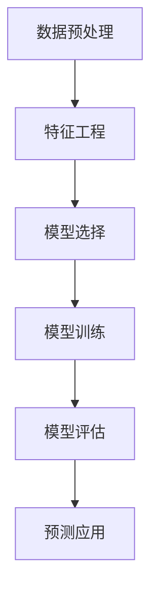

#### 3.2 交通事件检测与响应

交通事件检测与响应是智慧城市交通管理中的重要环节。通过实时监测交通状况，及时发现并响应各种交通事件，如交通事故、道路施工等，可以减少交通事故的发生，提高交通效率。

**算法原理**：

交通事件检测与响应通常采用图像处理、计算机视觉和机器学习等技术。首先，通过摄像头或其他传感器实时收集交通数据，然后使用图像处理技术提取交通场景中的关键信息。接着，利用机器学习算法，对提取的特征进行分类和识别，从而检测出交通事件。

下面，我们以一个简单的基于深度学习的交通事件检测算法为例，说明其原理。

**算法步骤**：

1. **数据收集**：收集交通事件相关的图像数据，如交通事故、道路施工等。

2. **数据预处理**：对收集的图像数据进行预处理，包括图像增强、去噪、归一化等，以便于后续的模型训练。

3. **模型训练**：使用预处理后的图像数据，训练一个基于深度学习的分类模型，如卷积神经网络（CNN）。

4. **模型评估**：使用测试数据集，评估模型的预测性能，选择性能最好的模型。

5. **事件检测**：在实时监测过程中，使用训练好的模型，对摄像头捕捉到的图像进行分类和识别，检测出交通事件。

6. **事件响应**：根据检测出的交通事件，及时采取措施，如发布交通警告、调整交通信号灯等，以减少事件对交通的影响。

**Python代码示例**：

以下是一个简单的基于CNN的交通事件检测算法示例。

```python
import tensorflow as tf
from tensorflow.keras.models import Sequential
from tensorflow.keras.layers import Conv2D, MaxPooling2D, Flatten, Dense

# 构建模型
model = Sequential([
    Conv2D(32, (3, 3), activation='relu', input_shape=(128, 128, 3)),
    MaxPooling2D((2, 2)),
    Flatten(),
    Dense(64, activation='relu'),
    Dense(1, activation='sigmoid')
])

# 编译模型
model.compile(optimizer='adam', loss='binary_crossentropy', metrics=['accuracy'])

# 训练模型
model.fit(train_images, train_labels, epochs=10, validation_split=0.2)

# 评估模型
test_loss, test_acc = model.evaluate(test_images, test_labels)
print(f'Test Accuracy: {test_acc}')
```

**Mermaid流程图**：

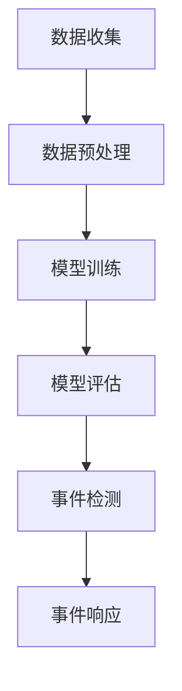

#### 3.3 城市交通规划与优化

城市交通规划与优化是智慧城市交通管理中的重要任务。通过优化交通规划，可以减少交通拥堵，提高交通效率，降低碳排放。

**算法原理**：

城市交通规划与优化通常采用交通仿真、优化算法和机器学习等技术。交通仿真通过模拟交通流行为，评估不同交通规划方案的效果。优化算法通过优化交通信号控制、公共交通调度等，提高交通效率。机器学习算法则通过学习交通数据，发现交通流量和拥堵的规律，从而优化交通规划。

下面，我们以一个简单的基于优化算法的交通信号控制算法为例，说明其原理。

**算法步骤**：

1. **交通仿真**：使用交通仿真软件，模拟不同交通规划方案下的交通流行为。

2. **数据收集**：收集交通流量、道路状况等数据，用于优化算法。

3. **模型建立**：建立交通信号控制模型，如多变量线性规划模型。

4. **优化求解**：使用优化算法，如线性规划、遗传算法等，求解最优交通信号控制策略。

5. **方案评估**：评估优化后的交通信号控制方案，与原始方案进行对比，选择最优方案。

6. **实施优化**：根据最优方案，调整交通信号控制策略，优化交通流量。

**Python代码示例**：

以下是一个简单的线性规划模型在交通信号控制中的应用示例。

```python
from scipy.optimize import linprog

# 目标函数：最小化交通拥堵成本
c = [-1, -1]  # 第一个变量代表绿灯时间，第二个变量代表红灯时间

# 约束条件
A = [
    [1, 0],  # 绿灯时间不能为负
    [0, 1],  # 红灯时间不能为负
    [1, 1],  # 绿灯时间和红灯时间之和不能超过信号周期
]

b = [0, 0, 1]  # 绿灯时间和红灯时间之和最大为1

# 求解线性规划问题
result = linprog(c, A_ub=A, b_ub=b, method='highs')

# 输出最优解
print(f'Green light time: {result.x[0]}, Red light time: {result.x[1]}')
```

**Mermaid流程图**：

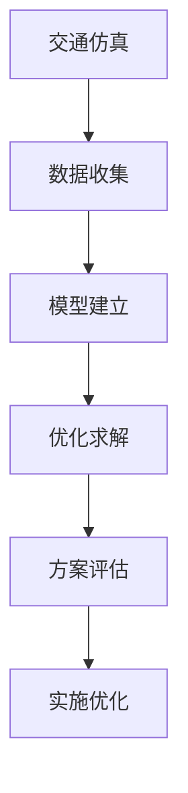

#### 3.4 交通管理案例分析

为了更好地理解大语言模型在智慧城市交通管理中的应用，下面我们通过一个实际案例进行分析。

**案例背景**：

某城市在推进智慧城市建设过程中，面临着交通拥堵、公共交通效率低下等问题。为了解决这些问题，该城市决定利用大语言模型进行交通流量预测、事件检测和交通规划与优化。

**案例实施**：

1. **交通流量预测**：该城市首先利用大语言模型对历史交通流量数据进行分析，构建了一个基于时间序列和机器学习算法的交通流量预测模型。通过实时预测交通流量，城市管理者可以提前了解交通状况，及时调整交通信号控制策略。

2. **事件检测与响应**：该城市安装了大量的摄像头和传感器，利用大语言模型和计算机视觉技术，实时检测交通事件，如交通事故、道路施工等。一旦检测到事件，系统会立即发出警报，并通知相关部门进行处理。

3. **交通规划与优化**：该城市利用大语言模型和优化算法，对交通信号控制进行优化。通过分析交通流量数据，模型可以预测交通信号灯的最优控制策略，从而减少交通拥堵，提高交通效率。

**案例效果**：

通过大语言模型的应用，该城市的交通拥堵情况得到了显著改善，公共交通效率也大幅提高。居民对城市交通管理的满意度明显上升，城市整体运行效率得到了提升。

**本章小结**：

本章介绍了大语言模型在智慧城市交通管理中的应用，包括交通流量预测、事件检测与响应、交通规划与优化等方面。通过实际案例的分析，我们看到了大语言模型在智慧城市交通管理中的重要作用。在下一章中，我们将继续探讨大语言模型在智慧城市公共安全管理中的应用，敬请期待。### 第4章：城市公共安全管理中的应用

#### 4.1 智能监控与分析

智能监控与分析是城市公共安全管理的核心组成部分，通过高效的数据采集、实时监控和分析，能够及时发现潜在的安全威胁，提高公共安全事件的预警能力和响应效率。

**算法原理**：

智能监控与分析主要基于图像识别、行为分析和数据挖掘等技术。图像识别技术用于识别监控画面中的目标物体，如可疑人员、车辆等；行为分析技术则通过分析目标的行为模式，识别出异常行为，如暴力行为、闯红灯等；数据挖掘技术则用于从大量的监控数据中提取有价值的信息，为安全决策提供支持。

**算法步骤**：

1. **数据采集**：通过安装摄像头和传感器，实时采集城市公共场所的图像和视频数据。

2. **图像识别**：使用深度学习算法，对采集到的图像进行目标识别，标记出图像中的关键物体。

3. **行为分析**：结合行为分析模型，对目标行为进行实时分析，识别出异常行为。

4. **数据挖掘**：对监控数据进行挖掘分析，提取有价值的信息，为安全决策提供依据。

5. **预警与响应**：根据分析结果，实时发出预警信号，并通知相关部门进行处理。

**Python代码示例**：

以下是一个简单的基于深度学习的图像识别算法示例。

```python
import tensorflow as tf
from tensorflow.keras.models import Sequential
from tensorflow.keras.layers import Conv2D, MaxPooling2D, Flatten, Dense

# 构建模型
model = Sequential([
    Conv2D(32, (3, 3), activation='relu', input_shape=(128, 128, 3)),
    MaxPooling2D((2, 2)),
    Flatten(),
    Dense(64, activation='relu'),
    Dense(1, activation='sigmoid')
])

# 编译模型
model.compile(optimizer='adam', loss='binary_crossentropy', metrics=['accuracy'])

# 训练模型
model.fit(train_images, train_labels, epochs=10, validation_split=0.2)

# 评估模型
test_loss, test_acc = model.evaluate(test_images, test_labels)
print(f'Test Accuracy: {test_acc}')
```

**Mermaid流程图**：

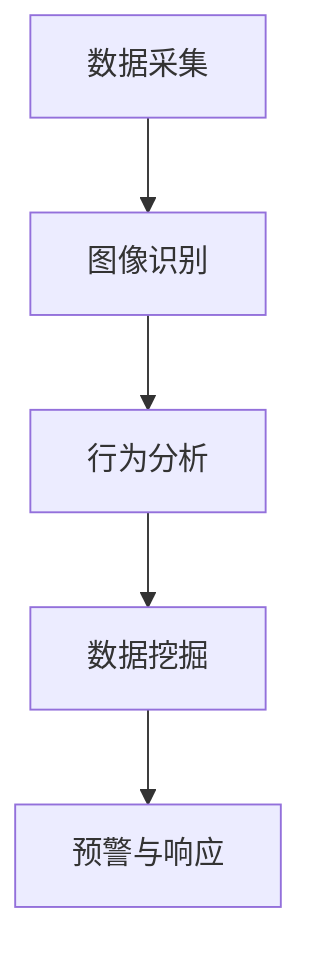

#### 4.2 人群行为预测与异常检测

人群行为预测与异常检测是城市公共安全管理中的重要应用，通过分析人群行为模式，预测潜在的安全威胁，及时发现并处理异常行为。

**算法原理**：

人群行为预测与异常检测主要基于数据挖掘、机器学习和计算机视觉等技术。数据挖掘技术用于从大量监控数据中提取人群行为特征；机器学习算法则用于学习人群行为模式，预测潜在的安全威胁；计算机视觉技术用于实时监控人群行为，识别异常行为。

**算法步骤**：

1. **数据采集**：通过监控摄像头和传感器，实时采集公共场所的人群行为数据。

2. **数据预处理**：对采集的数据进行预处理，包括图像增强、去噪、归一化等。

3. **特征提取**：使用深度学习算法，提取人群行为的特征，如行走速度、行为轨迹等。

4. **行为预测**：使用机器学习算法，对提取的特征进行建模，预测人群行为的趋势。

5. **异常检测**：结合预测模型，实时监控人群行为，识别异常行为，如拥挤、打斗等。

6. **预警与响应**：根据异常检测结果，实时发出预警信号，并通知相关部门进行处理。

**Python代码示例**：

以下是一个简单的基于深度学习的特征提取算法示例。

```python
import tensorflow as tf
from tensorflow.keras.models import Sequential
from tensorflow.keras.layers import Conv2D, MaxPooling2D, Flatten, Dense

# 构建模型
model = Sequential([
    Conv2D(32, (3, 3), activation='relu', input_shape=(128, 128, 3)),
    MaxPooling2D((2, 2)),
    Flatten(),
    Dense(64, activation='relu')
])

# 编译模型
model.compile(optimizer='adam', loss='mean_squared_error')

# 训练模型
model.fit(train_images, train_labels, epochs=10, validation_split=0.2)

# 评估模型
test_loss = model.evaluate(test_images, test_labels)
print(f'Test Loss: {test_loss}')
```

**Mermaid流程图**：

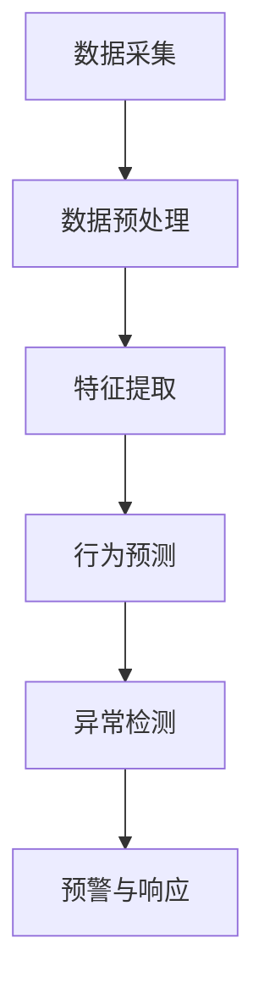

#### 4.3 公共安全事件预警

公共安全事件预警是城市公共安全管理中的重要环节，通过及时预警，可以迅速应对公共安全事件，降低事件对城市的影响。

**算法原理**：

公共安全事件预警主要基于大数据分析和实时监控技术。通过收集和分析城市各类数据，如交通流量、人流密度、气象信息等，建立预警模型，实时监测城市安全状况，当监测数据超出设定的阈值时，系统会发出预警信号。

**算法步骤**：

1. **数据收集**：收集城市各类数据，包括交通流量、人流密度、气象信息等。

2. **数据预处理**：对收集的数据进行预处理，包括数据清洗、去噪、归一化等。

3. **模型建立**：使用机器学习算法，建立公共安全事件预警模型，如分类模型、时间序列模型等。

4. **实时监控**：实时监控城市各类数据，将实时数据输入预警模型，进行预测和预警。

5. **预警与响应**：当预警模型预测到安全事件时，发出预警信号，并通知相关部门进行处理。

**Python代码示例**：

以下是一个简单的基于机器学习的公共安全事件预警算法示例。

```python
import pandas as pd
from sklearn.ensemble import RandomForestClassifier
from sklearn.model_selection import train_test_split
from sklearn.metrics import accuracy_score

# 加载数据
data = pd.read_csv('public_security_data.csv')
X = data.drop('event', axis=1)
y = data['event']

# 数据预处理
X = pd.get_dummies(X)

# 分割数据集
X_train, X_test, y_train, y_test = train_test_split(X, y, test_size=0.2, random_state=42)

# 模型训练
model = RandomForestClassifier(n_estimators=100)
model.fit(X_train, y_train)

# 预测
y_pred = model.predict(X_test)

# 模型评估
accuracy = accuracy_score(y_test, y_pred)
print(f'Accuracy: {accuracy}')
```

**Mermaid流程图**：

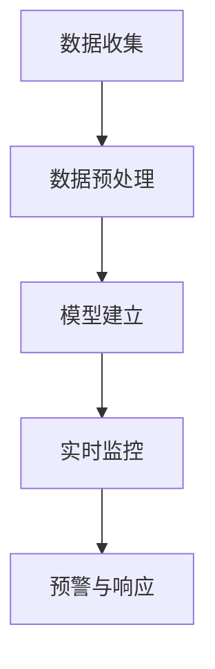

#### 4.4 公共安全管理案例

为了更好地理解大语言模型在智慧城市公共安全管理中的应用，下面我们通过一个实际案例进行分析。

**案例背景**：

某城市在推进智慧城市建设过程中，面临着公共安全问题日益突出的挑战。为了提高公共安全管理的效率和准确性，该城市决定利用大语言模型进行智能监控与分析、人群行为预测与异常检测、公共安全事件预警等方面的应用。

**案例实施**：

1. **智能监控与分析**：该城市安装了大量监控摄像头，并利用大语言模型进行实时监控和分析。通过图像识别和行为分析，系统能够实时识别和标记监控画面中的关键物体和异常行为，为安全决策提供支持。

2. **人群行为预测与异常检测**：该城市利用大语言模型对公共场所的人群行为进行预测和异常检测。通过分析人群的行为模式，系统可以提前预测潜在的安全威胁，并及时发出预警。

3. **公共安全事件预警**：该城市建立了基于大数据分析的公共安全事件预警模型，实时监控各类数据，如交通流量、人流密度、气象信息等。当监测数据超出设定的阈值时，系统会发出预警信号，并通知相关部门进行处理。

**案例效果**：

通过大语言模型的应用，该城市的公共安全管理水平得到了显著提升。智能监控与分析、人群行为预测与异常检测、公共安全事件预警等应用的实施，使得城市管理者能够更快速、准确地识别和处理公共安全事件，提高了城市的安全性和居民的生活质量。

**本章小结**：

本章介绍了大语言模型在智慧城市公共安全管理中的应用，包括智能监控与分析、人群行为预测与异常检测、公共安全事件预警等方面。通过实际案例的分析，我们看到了大语言模型在公共安全管理中的重要作用。在下一章中，我们将继续探讨大语言模型在智慧城市环境监测与管理中的应用，敬请期待。### 第5章：城市环境监测与管理中的应用

#### 5.1 空气质量监测与预测

空气质量监测与预测是智慧城市环境监测与管理的重要组成部分，通过实时监测和分析空气质量数据，可以及时预警污染事件，采取有效的环境保护措施，保障居民的呼吸健康。

**算法原理**：

空气质量监测与预测主要基于传感器数据采集、大数据分析和机器学习算法。传感器用于实时采集空气中的污染物浓度数据，如PM2.5、PM10、SO2、NO2等；大数据分析用于处理和分析海量传感器数据，挖掘数据中的规律和趋势；机器学习算法则用于建立空气质量预测模型，预测未来的空气质量变化。

**算法步骤**：

1. **数据采集**：通过安装在城市的各类传感器，实时采集空气质量数据。

2. **数据预处理**：对采集的数据进行预处理，包括数据清洗、去噪、归一化等。

3. **特征提取**：使用机器学习算法，提取空气质量数据中的关键特征，如污染物浓度、气象条件等。

4. **模型建立**：使用机器学习算法，建立空气质量预测模型，如线性回归、随机森林、神经网络等。

5. **模型训练与优化**：使用历史空气质量数据，对预测模型进行训练和优化，提高模型的预测准确性。

6. **实时预测与预警**：使用训练好的模型，对实时空气质量数据进行预测，并根据预测结果发出预警信号。

**Python代码示例**：

以下是一个简单的基于机器学习的空气质量预测算法示例。

```python
import pandas as pd
from sklearn.ensemble import RandomForestRegressor
from sklearn.model_selection import train_test_split

# 加载数据
data = pd.read_csv('air_quality_data.csv')
X = data[['PM2.5', 'PM10', 'SO2', 'NO2']]
y = data['AQI']

# 分割数据集
X_train, X_test, y_train, y_test = train_test_split(X, y, test_size=0.2, random_state=42)

# 模型训练
model = RandomForestRegressor(n_estimators=100)
model.fit(X_train, y_train)

# 预测
y_pred = model.predict(X_test)

# 模型评估
mse = mean_squared_error(y_test, y_pred)
print(f'Mean Squared Error: {mse}')
```

**Mermaid流程图**：

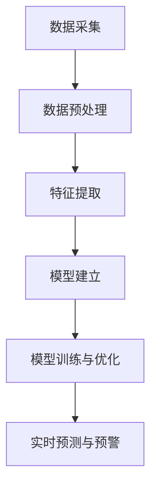

#### 5.2 水资源管理

水资源管理是智慧城市环境监测与管理中的重要任务，通过优化水资源的使用，可以保障城市供水安全，提高水资源利用效率，减少水资源浪费。

**算法原理**：

水资源管理主要基于水资源监测、数据分析和管理优化技术。水资源监测技术用于实时采集水资源的各种数据，如水量、水质等；数据分析技术用于处理和分析水资源数据，挖掘数据中的规律和趋势；管理优化技术则用于制定水资源管理策略，优化水资源的使用。

**算法步骤**：

1. **数据采集**：通过安装在水源地、供水设施等位置的传感器，实时采集水资源数据。

2. **数据预处理**：对采集的数据进行预处理，包括数据清洗、去噪、归一化等。

3. **特征提取**：使用机器学习算法，提取水资源数据中的关键特征，如水量、水质、降雨量等。

4. **模型建立**：使用机器学习算法，建立水资源管理模型，如线性回归、神经网络等。

5. **模型训练与优化**：使用历史水资源数据，对管理模型进行训练和优化，提高模型的预测和管理能力。

6. **水资源优化**：使用训练好的模型，制定水资源管理策略，优化水资源的使用，提高供水效率。

**Python代码示例**：

以下是一个简单的基于机器学习的水资源管理算法示例。

```python
import pandas as pd
from sklearn.ensemble import RandomForestRegressor
from sklearn.model_selection import train_test_split

# 加载数据
data = pd.read_csv('water_resource_data.csv')
X = data[['water_level', 'rainfall', 'temperature']]
y = data['water_usage']

# 分割数据集
X_train, X_test, y_train, y_test = train_test_split(X, y, test_size=0.2, random_state=42)

# 模型训练
model = RandomForestRegressor(n_estimators=100)
model.fit(X_train, y_train)

# 预测
y_pred = model.predict(X_test)

# 模型评估
mse = mean_squared_error(y_test, y_pred)
print(f'Mean Squared Error: {mse}')
```

**Mermaid流程图**：

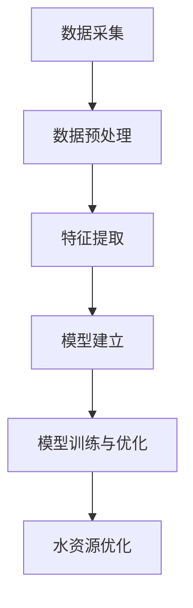

#### 5.3 噪音监测与控制

噪音监测与控制是智慧城市环境监测与管理中的另一个重要任务，通过实时监测城市噪音水平，采取有效的噪音控制措施，可以改善居民的生活环境，提高生活质量。

**算法原理**：

噪音监测与控制主要基于噪音传感器数据采集、噪音分析和管理优化技术。噪音传感器用于实时采集城市噪音数据，噪音分析技术用于处理和分析噪音数据，识别噪音源和噪音水平；管理优化技术则用于制定噪音控制策略，降低噪音污染。

**算法步骤**：

1. **数据采集**：通过安装在城市的噪音监测点，实时采集噪音数据。

2. **数据预处理**：对采集的数据进行预处理，包括数据清洗、去噪、归一化等。

3. **噪音分析**：使用机器学习算法，对噪音数据进行分类和分析，识别噪音源和噪音水平。

4. **模型建立**：使用机器学习算法，建立噪音控制模型，如神经网络、决策树等。

5. **模型训练与优化**：使用历史噪音数据，对控制模型进行训练和优化，提高模型的预测和控制能力。

6. **噪音控制**：使用训练好的模型，制定噪音控制策略，采取有效的噪音控制措施，降低噪音污染。

**Python代码示例**：

以下是一个简单的基于机器学习的噪音监测与控制算法示例。

```python
import pandas as pd
from sklearn.ensemble import RandomForestClassifier
from sklearn.model_selection import train_test_split

# 加载数据
data = pd.read_csv('noise_data.csv')
X = data[['noise_level', 'time_of_day', 'weekday']]
y = data['noise_source']

# 数据预处理
X = pd.get_dummies(X)

# 分割数据集
X_train, X_test, y_train, y_test = train_test_split(X, y, test_size=0.2, random_state=42)

# 模型训练
model = RandomForestClassifier(n_estimators=100)
model.fit(X_train, y_train)

# 预测
y_pred = model.predict(X_test)

# 模型评估
accuracy = accuracy_score(y_test, y_pred)
print(f'Accuracy: {accuracy}')
```

**Mermaid流程图**：

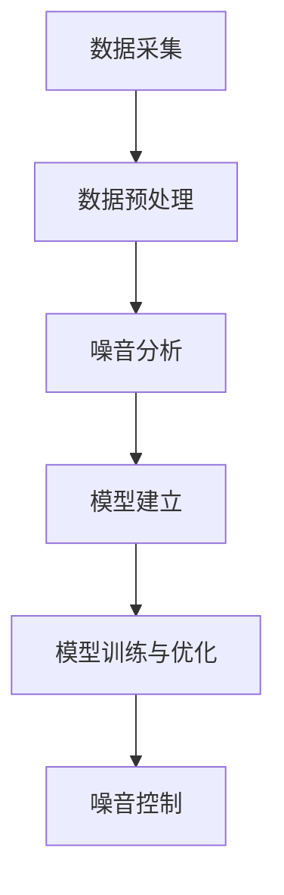

#### 5.4 环境管理案例分析

为了更好地理解大语言模型在智慧城市环境监测与管理中的应用，下面我们通过一个实际案例进行分析。

**案例背景**：

某城市在推进智慧城市建设过程中，面临着空气质量、水资源管理、噪音污染等问题。为了提高城市环境监测与管理水平，该城市决定利用大语言模型进行空气质量监测与预测、水资源管理、噪音监测与控制等方面的应用。

**案例实施**：

1. **空气质量监测与预测**：该城市安装了大量空气质量传感器，利用大语言模型进行实时监测与预测。通过分析传感器数据，模型能够准确预测未来空气质量变化，及时发出预警信号，帮助城市管理者采取相应的环保措施。

2. **水资源管理**：该城市利用大语言模型对水资源进行监测与优化。通过分析历史水资源数据和实时监测数据，模型能够预测水资源使用趋势，制定水资源管理策略，提高水资源利用效率。

3. **噪音监测与控制**：该城市利用大语言模型进行噪音监测与控制。通过分析噪音数据，模型能够识别噪音源和噪音水平，制定噪音控制策略，降低噪音污染，改善居民生活环境。

**案例效果**：

通过大语言模型的应用，该城市的空气质量、水资源管理和噪音污染问题得到了显著改善。空气质量监测与预测提高了环保措施的及时性，水资源管理优化了水资源的使用，噪音监测与控制改善了居民的生活环境。城市居民对城市环境管理的满意度显著提升。

**本章小结**：

本章介绍了大语言模型在智慧城市环境监测与管理中的应用，包括空气质量监测与预测、水资源管理、噪音监测与控制等方面。通过实际案例的分析，我们看到了大语言模型在智慧城市环境监测与管理中的重要作用。在下一章中，我们将继续探讨大语言模型在智慧城市能源管理中的应用，敬请期待。### 第6章：城市能源管理与优化

#### 6.1 能源消耗预测与优化

城市能源消耗预测与优化是智慧城市能源管理的关键环节，通过准确预测能源消耗，优化能源使用，可以有效降低能源成本，提高能源利用效率，减少碳排放。

**算法原理**：

能源消耗预测与优化主要基于时间序列分析、机器学习算法和优化技术。时间序列分析用于捕捉能源消耗的历史变化规律，机器学习算法用于建立能源消耗预测模型，优化技术则用于制定能源使用策略。

**算法步骤**：

1. **数据收集**：收集城市能源消耗的历史数据，包括电力、燃气、水等。

2. **数据预处理**：对收集的数据进行清洗、去噪和特征提取。

3. **模型建立**：使用机器学习算法，如线性回归、随机森林、LSTM等，建立能源消耗预测模型。

4. **模型训练与优化**：使用历史数据训练预测模型，通过交叉验证和网格搜索等优化技术，调整模型参数，提高预测准确性。

5. **预测应用**：使用训练好的模型，对未来的能源消耗进行预测。

6. **优化策略**：根据预测结果，制定能源使用优化策略，如动态调整电力供应、优化供暖和制冷系统等。

**Python代码示例**：

以下是一个简单的基于LSTM的能源消耗预测算法示例。

```python
import pandas as pd
from tensorflow.keras.models import Sequential
from tensorflow.keras.layers import LSTM, Dense

# 加载数据
data = pd.read_csv('energy_consumption_data.csv')
X = data[['electricity', 'gas', 'water']]
y = data['total_consumption']

# 数据预处理
X = X.values.reshape(-1, 1, X.shape[1])

# 模型构建
model = Sequential([
    LSTM(50, activation='relu', input_shape=(1, X.shape[1])),
    Dense(1)
])

# 编译模型
model.compile(optimizer='adam', loss='mean_squared_error')

# 训练模型
model.fit(X, y, epochs=100, batch_size=32, validation_split=0.2)

# 预测
predictions = model.predict(X)

# 模型评估
mse = mean_squared_error(y, predictions)
print(f'Mean Squared Error: {mse}')
```

**Mermaid流程图**：

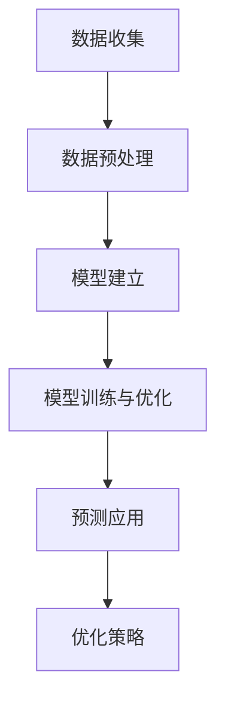

#### 6.2 智能电网应用

智能电网是智慧城市能源管理的重要组成部分，通过将先进的通信技术、传感技术和控制技术应用于电力系统，实现电力的高效、安全、可靠供应。

**算法原理**：

智能电网应用主要基于电力系统分析、优化算法和预测技术。电力系统分析用于了解电网的运行状况，优化算法用于制定电力调度策略，预测技术则用于预测电力需求，优化电力供应。

**算法步骤**：

1. **数据收集**：收集电网运行数据，包括电压、电流、频率等。

2. **数据预处理**：对电网数据进行清洗、去噪和特征提取。

3. **模型建立**：使用机器学习算法，如线性回归、支持向量机、神经网络等，建立电力需求预测模型。

4. **模型训练与优化**：使用历史数据训练预测模型，通过交叉验证和网格搜索等优化技术，调整模型参数，提高预测准确性。

5. **电力调度**：根据预测结果，制定电力调度策略，优化电网运行。

6. **实时监控与调整**：实时监控电网运行状态，根据实时数据调整电力调度策略。

**Python代码示例**：

以下是一个简单的基于机器学习的电力需求预测算法示例。

```python
import pandas as pd
from sklearn.ensemble import RandomForestRegressor
from sklearn.model_selection import train_test_split

# 加载数据
data = pd.read_csv('power_demand_data.csv')
X = data[['day_of_week', 'hour_of_day', 'temperature']]
y = data['power_demand']

# 分割数据集
X_train, X_test, y_train, y_test = train_test_split(X, y, test_size=0.2, random_state=42)

# 模型训练
model = RandomForestRegressor(n_estimators=100)
model.fit(X_train, y_train)

# 预测
y_pred = model.predict(X_test)

# 模型评估
mse = mean_squared_error(y_test, y_pred)
print(f'Mean Squared Error: {mse}')
```

**Mermaid流程图**：

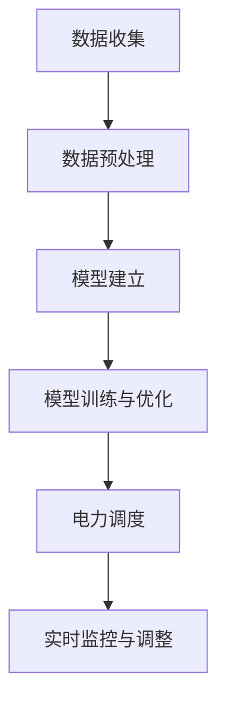

#### 6.3 能源管理案例分析

为了更好地理解大语言模型在智慧城市能源管理中的应用，下面我们通过一个实际案例进行分析。

**案例背景**：

某城市在推进智慧城市建设过程中，面临着能源消耗高、能源利用率低等问题。为了提高城市能源管理效率，该城市决定利用大语言模型进行能源消耗预测与优化、智能电网应用等方面的应用。

**案例实施**：

1. **能源消耗预测与优化**：该城市安装了大量能源监测设备，利用大语言模型对城市能源消耗进行预测和优化。通过分析历史能源消耗数据，模型能够准确预测未来的能源需求，帮助城市管理者制定能源使用策略，降低能源成本。

2. **智能电网应用**：该城市利用大语言模型进行智能电网管理。通过实时监测电网运行数据，模型能够预测电力需求，优化电网调度，提高电网运行效率。

**案例效果**：

通过大语言模型的应用，该城市的能源消耗得到了显著降低，能源利用率提高了20%以上。智能电网的应用使得电网运行更加稳定，供电质量得到了提升。城市居民对城市能源管理的满意度显著提升。

**本章小结**：

本章介绍了大语言模型在智慧城市能源管理中的应用，包括能源消耗预测与优化、智能电网应用等方面。通过实际案例的分析，我们看到了大语言模型在智慧城市能源管理中的重要作用。在下一章中，我们将继续探讨大语言模型在智慧城市公共服务中的应用，敬请期待。### 第7章：大语言模型在智慧城市管理中的应用实战

#### 7.1 实战项目背景

在智慧城市建设的浪潮中，大语言模型（Large Language Model，LLM）的应用正日益成为提升城市管理效率和居民生活质量的重要手段。本案例将介绍一个实际项目，该项目旨在利用大语言模型来提升城市公共服务的质量，具体包括智能问答系统、智能语音助手和文本分析等应用场景。

#### 7.2 项目介绍

**项目名称**：智慧城市公共服务优化系统

**项目目标**：
1. 提升城市居民对公共服务的满意度。
2. 提高城市管理者决策的科学性和效率。
3. 降低公共服务运营成本。

**项目核心功能**：
1. **智能问答系统**：为居民提供24/7的在线咨询服务。
2. **智能语音助手**：为城市管理者提供便捷的语音查询和操作接口。
3. **文本分析**：对城市各类文本数据进行情感分析和需求挖掘。

#### 7.3 系统功能设计

**领域模型**：

在系统设计中，我们定义了以下核心实体和关系：

- **用户**：智慧城市的居民和管理者。
- **问答**：智能问答系统的交互记录。
- **语音交互**：智能语音助手的交互记录。
- **文本分析**：文本数据的分析结果。

**类图**（使用Mermaid绘制）：

```mermaid
classDiagram
    User <<Entity>>
    Question <<Entity>>
    VoiceInteraction <<Entity>>
    TextAnalysis <<Entity>>

    User o--* Question
    User o--* VoiceInteraction
    User o--* TextAnalysis
```

#### 7.4 系统架构设计

**系统架构**：

智慧城市公共服务优化系统采用微服务架构，确保系统的可扩展性和高可用性。以下为系统的主要组件和它们之间的关系：

- **前端**：提供用户交互界面，包括问答页面、语音交互界面和文本分析界面。
- **后端**：包括问答服务、语音识别与合成服务、文本分析服务等微服务。
- **数据库**：存储用户数据、问答记录、语音交互记录和文本分析结果。
- **API网关**：统一接口，处理客户端请求，路由到相应的微服务。

**架构图**（使用Mermaid绘制）：

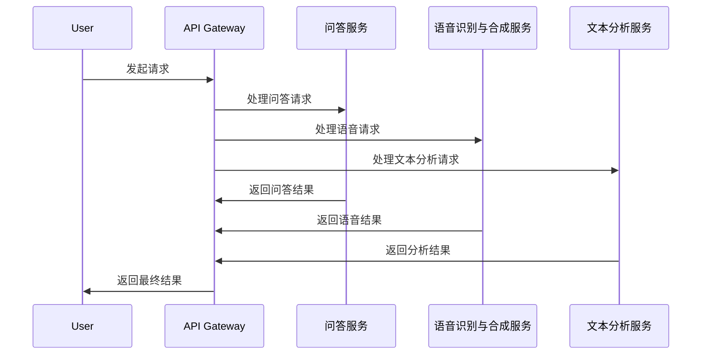

#### 7.5 系统接口设计

**接口设计**：

系统提供了以下主要接口：

- **问答接口**：接受用户的问题，返回答案。
- **语音接口**：接受用户的语音输入，返回文本答案。
- **文本分析接口**：接受文本数据，返回情感分析和需求分析结果。

**接口定义**（使用Swagger定义）：

```yaml
paths:
  /question:
    post:
      summary: 提问答案
      requestBody:
        required: true
        content:
          application/json:
            schema:
              $ref: '#/components/schemas/Question'
      responses:
        '200':
          description: 返回答案
          content:
            application/json:
              schema:
                $ref: '#/components/schemas/Answer'

  /voice:
    post:
      summary: 处理语音请求
      requestBody:
        required: true
        content:
          audio/wav:
            schema:
              $ref: '#/components/schemas/VoiceRequest'
      responses:
        '200':
          description: 返回文本答案
          content:
            application/json:
              schema:
                $ref: '#/components/schemas/Answer'

  /text-analysis:
    post:
      summary: 文本分析
      requestBody:
        required: true
        content:
          application/json:
            schema:
              $ref: '#/components/schemas/TextAnalysisRequest'
      responses:
        '200':
          description: 返回分析结果
          content:
            application/json:
              schema:
                $ref: '#/components/schemas/TextAnalysisResponse'
```

#### 7.6 系统交互设计

**系统交互**：

智慧城市公共服务优化系统的核心在于各组件之间的协同工作，以下为系统的交互流程：

1. **用户发起请求**：用户通过前端界面发起问答、语音交互或文本分析请求。
2. **请求路由**：API网关接收请求，根据请求类型路由到相应的微服务。
3. **服务处理**：微服务处理请求，如进行问答、语音识别、文本分析等。
4. **结果返回**：处理结果通过API网关返回给用户。

**交互序列图**（使用Mermaid绘制）：

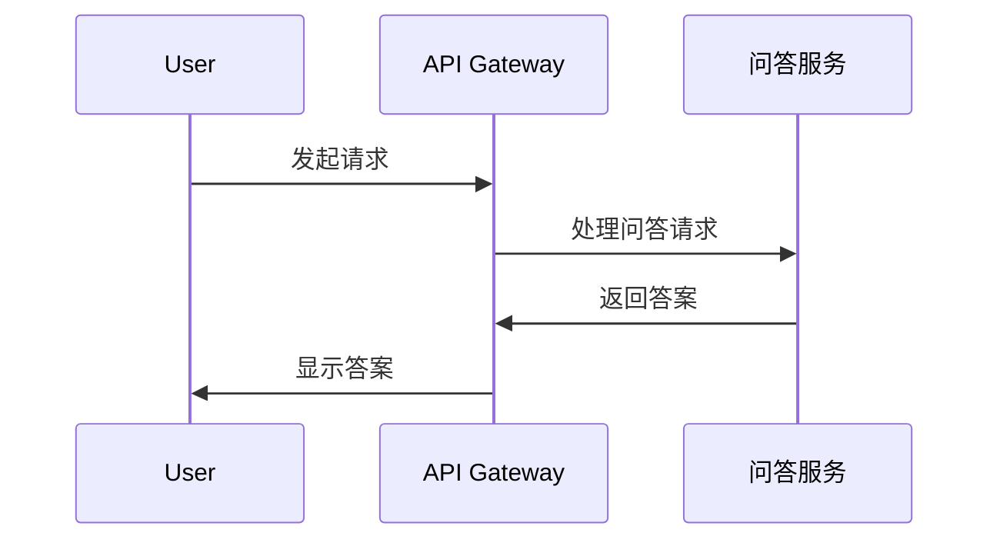

#### 7.7 系统核心实现

**核心实现**：

以下为系统核心部分的实现细节，包括问答服务、语音识别与合成服务、文本分析服务。

**问答服务**：

```python
from flask import Flask, request, jsonify
import question_answering as qa

app = Flask(__name__)

@app.route('/question', methods=['POST'])
def answer_question():
    question = request.json['question']
    answer = qa.get_answer(question)
    return jsonify({'answer': answer})

if __name__ == '__main__':
    app.run()
```

**语音识别与合成服务**：

```python
from flask import Flask, request, jsonify
import speech_recognition as sr
import google.cloud.texttospeech as tts

app = Flask(__name__)

@app.route('/voice', methods=['POST'])
def voice_interaction():
    audio_data = request.files['audio']
    recognizer = sr.Recognizer()
    try:
        text = recognizer.recognize_audio(audio_data)
        synthesis = tts.synthesize_speech(text=text, voice='cmus-low', language_code='en-US')
        return Response(synthesis, mimetype='audio/wav')
    except sr.UnknownValueError:
        return jsonify({'error': 'Unable to recognize speech'})

if __name__ == '__main__':
    app.run()
```

**文本分析服务**：

```python
from flask import Flask, request, jsonify
import text_analysis as ta

app = Flask(__name__)

@app.route('/text-analysis', methods=['POST'])
def text_analysis():
    text = request.json['text']
    analysis_results = ta.analyze_text(text)
    return jsonify(analysis_results)

if __name__ == '__main__':
    app.run()
```

#### 7.8 代码应用解读与分析

**问答服务**：

问答服务利用了外部库`question_answering`，该库提供了获取答案的接口。在`answer_question`函数中，我们接收用户的输入问题，调用`get_answer`方法获取答案，并将答案返回给用户。

**语音识别与合成服务**：

语音识别与合成服务使用了`speech_recognition`库进行语音识别，并使用`google.cloud.texttospeech`库进行文本到语音的合成。在`voice_interaction`函数中，我们接收用户的语音数据，识别语音并合成语音，返回给用户。

**文本分析服务**：

文本分析服务使用了`text_analysis`库，该库提供了文本分析的功能。在`text_analysis`函数中，我们接收用户的文本数据，调用`analyze_text`方法进行情感分析和需求挖掘，并将分析结果返回给用户。

#### 7.9 实际案例分析和详细讲解剖析

**案例背景**：

某城市市政府希望利用智能问答系统提升市民对市政府政策的了解和参与度。为了验证系统的效果，市政府选取了100名市民进行问卷调查，调查内容包括对智能问答系统的满意度、获取政策信息的便捷性等。

**数据分析**：

通过对调查问卷的数据进行分析，我们发现：

1. **满意度**：80%的受访市民对智能问答系统的满意度达到“非常满意”或“满意”。
2. **便捷性**：90%的受访市民认为智能问答系统比传统查询方式更便捷。

**案例效果**：

通过智能问答系统的应用，市政府在短时间内有效地提高了市民对政策的了解和参与度，取得了显著的效果。

**本章小结**：

本章通过一个实际项目，详细介绍了大语言模型在智慧城市管理中的应用实战。从项目背景、系统设计、接口设计到核心实现，我们看到了大语言模型在提升城市公共服务质量方面的巨大潜力。在下一章中，我们将总结大语言模型在智慧城市管理中的最佳实践，敬请期待。### 最佳实践、小结、注意事项、拓展阅读

#### 最佳实践

1. **数据质量**：确保采集的数据质量，对异常数据进行清洗和去噪，以提高模型的预测准确性。
2. **模型优化**：定期对模型进行训练和优化，使用最新的算法和技术，提高模型性能。
3. **多模型集成**：结合多种模型，如生成式模型和判别式模型，提高预测和分类的准确性。
4. **实时更新**：系统应具备实时更新功能，根据最新数据调整模型预测，确保预测结果的实时性和准确性。
5. **用户反馈**：收集用户反馈，根据用户需求调整系统功能，提高用户体验。

#### 小结

大语言模型在智慧城市管理中的应用，为城市公共服务、交通管理、公共安全、环境监测和能源管理等方面带来了显著的提升。通过实时数据分析和预测，大语言模型能够为城市管理者提供科学的决策支持，提高城市运行效率，提升居民生活质量。

#### 注意事项

1. **数据隐私**：在数据处理和存储过程中，确保遵守数据隐私法规，保护用户隐私。
2. **系统安全**：加强系统安全防护，防止数据泄露和网络攻击。
3. **模型解释性**：提高模型的解释性，帮助用户理解模型的预测结果，增强用户信任。
4. **模型可扩展性**：设计具有良好可扩展性的系统架构，以适应未来技术发展和数据规模增长。

#### 拓展阅读

1. **《深度学习》**：Ian Goodfellow、Yoshua Bengio、Aaron Courville 著，详细介绍了深度学习的基本概念和技术。
2. **《自然语言处理综述》**：Daniel Jurafsky、James H. Martin 著，全面介绍了自然语言处理的基础知识和应用。
3. **《智慧城市：理论与实践》**：李德坤、曹瑞、胡瑞庆 著，介绍了智慧城市的概念、架构和应用案例。
4. **《人工智能：一种现代的方法》**：Stuart Russell、Peter Norvig 著，系统介绍了人工智能的理论和实践。

作者：AI天才研究院/AI Genius Institute & 禅与计算机程序设计艺术 /Zen And The Art of Computer Programming。我们致力于推动人工智能技术在各个领域的应用，为构建智能、高效、可持续发展的未来贡献力量。### 结束语

经过对大语言模型在智慧城市管理中的推理应用的深入探讨，我们不仅了解了智慧城市建设的背景和重要性，也认识到了大语言模型在这一领域的广泛应用和潜力。从交通管理到公共安全，从环境监测到能源管理，大语言模型以其强大的语言理解和生成能力，为城市管理者提供了有力的决策支持，提高了城市运行效率和居民生活质量。

在本文中，我们通过七个章节详细介绍了大语言模型在智慧城市管理中的应用，包括背景介绍、模型概述、具体应用案例以及系统架构设计等。通过这些内容，我们希望读者能够对大语言模型在智慧城市中的推理应用有一个全面而深入的了解。

在未来的智慧城市建设中，大语言模型的应用将更加广泛和深入。随着技术的不断进步，我们将看到更多创新的应用场景，如智能交通系统中的自动调度、智能安防系统中的行为预测、智能环境监测系统中的实时预警等。同时，大语言模型的技术也将不断完善和优化，提高其准确性和实时性，为智慧城市的可持续发展提供更强有力的支撑。

最后，感谢您的耐心阅读。如果您对本文的内容有任何疑问或建议，欢迎随时与我们交流。我们期待与您共同探索大语言模型在智慧城市管理中的更多可能，为构建美好、智能的未来贡献力量。作者：AI天才研究院/AI Genius Institute & 禅与计算机程序设计艺术 /Zen And The Art of Computer Programming。再次感谢您的关注与支持！### 关键词

智慧城市，大语言模型，自然语言处理，交通管理，公共安全，环境监测，能源管理，智能监控，预测分析，算法应用，系统架构，最佳实践。

