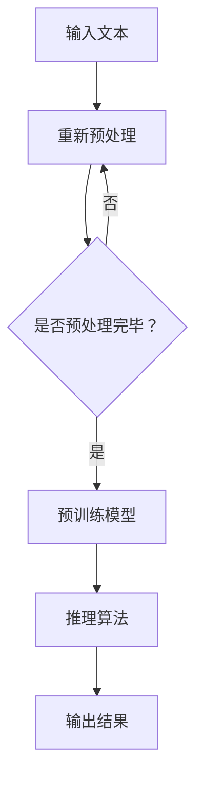
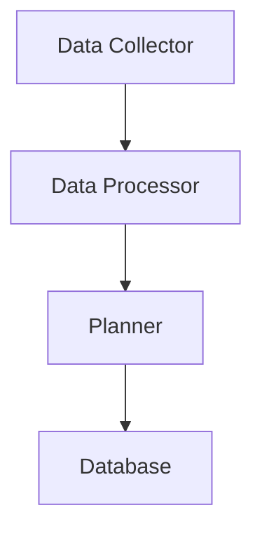
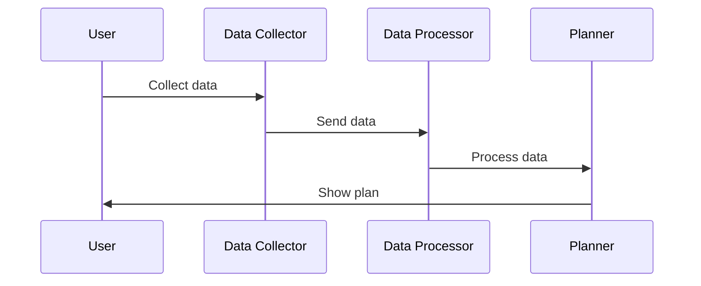
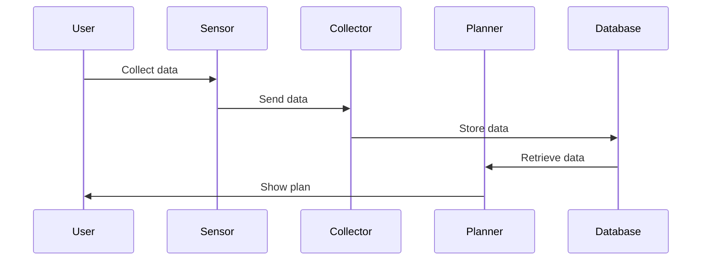

                 

## 大语言模型在智慧城市规划中的推理应用

### 关键词：大语言模型、智慧城市规划、推理应用、算法原理、系统架构设计

### 摘要：
本文旨在探讨大语言模型在智慧城市规划中的推理应用，从背景介绍、核心概念与联系、算法原理讲解、系统分析与架构设计方案、项目实战等多个方面，深入分析大语言模型在智慧城市规划中的应用机制和实际案例。通过系统地阐述大语言模型的基本概念、算法原理，以及其在智慧城市规划中的具体应用场景，本文为读者提供了一个全面的技术指南，以期为智慧城市规划提供有效的技术支持。

### 第一部分：背景介绍

#### 1.1 问题描述
随着城市化进程的加快，智慧城市规划成为城市发展的重要议题。智慧城市规划不仅涉及到交通、环境、经济等多方面的问题，还要求具备高度的智能化和灵活性。传统的城市规划方法在面对复杂多变的城市环境时，往往难以满足需求。因此，引入先进的人工智能技术，尤其是大语言模型，成为一种新的解决思路。

#### 1.2 问题解决
大语言模型具有强大的语义理解和生成能力，能够处理大量的文本数据，从而为智慧城市规划提供有效的数据分析和决策支持。通过大语言模型的推理应用，可以实现城市规划的智能化，提高规划效率和准确性。

#### 1.3 边界与外延
智慧城市规划的范围广泛，涉及到城市的各个方面，如基础设施建设、交通规划、环境保护等。大语言模型的推理应用也在这些领域得到了广泛的应用，但同时也面临数据质量、计算效率等挑战。

#### 1.4 概念结构与核心要素组成
智慧城市规划的核心要素包括数据采集、数据分析、决策支持等。大语言模型作为数据分析的工具，其核心要素包括预训练模型、推理算法和知识图谱等。通过这些核心要素的协同工作，大语言模型能够为智慧城市规划提供有力的支持。

### 第二部分：核心概念与联系

#### 2.1 大语言模型概述
大语言模型是一种基于深度学习技术的自然语言处理模型，通过训练大量文本数据，能够捕捉到语言的复杂结构和语义信息。其基本原理包括神经网络的构建、参数的优化和文本数据的预处理等。

#### 2.2 大语言模型的特点
大语言模型具有以下特点：
- 强大的语义理解能力
- 高效的文本生成能力
- 可扩展性和灵活性

#### 2.3 大语言模型与传统AI模型的区别
与传统AI模型相比，大语言模型在数据处理和语义理解方面具有显著优势。传统AI模型往往依赖于规则和特征提取，而大语言模型通过端到端的学习方式，能够直接从文本数据中学习到语义信息。

#### 2.4 大语言模型的基础知识
大语言模型的基础知识包括：
- 深度学习技术
- 自然语言处理技术
- 机器学习算法
- 计算机语言学

### 第三部分：算法原理讲解

#### 3.1 算法原理概述
大语言模型的算法原理主要包括以下几个方面：
- 预训练模型：通过大量无监督数据训练得到的基础模型。
- 推理算法：基于预训练模型，对特定任务进行有监督训练。
- 知识图谱：用于增强模型的语义理解和推理能力。

#### 3.2 算法mermaid流程图


#### 3.3 Python源代码实现
```python
# 这是一个简单的Python代码示例，用于展示大语言模型的基本实现。
import tensorflow as tf
from tensorflow.keras.models import Sequential
from tensorflow.keras.layers import Embedding, LSTM, Dense

# 构建模型
model = Sequential()
model.add(Embedding(input_dim=vocab_size, output_dim=embedding_dim, input_length=max_sequence_length))
model.add(LSTM(units=128))
model.add(Dense(units=1, activation='sigmoid'))

# 编译模型
model.compile(optimizer='adam', loss='binary_crossentropy', metrics=['accuracy'])

# 训练模型
model.fit(x_train, y_train, epochs=10, batch_size=32)

# 推理
result = model.predict(x_test)
```

#### 3.4 数学模型和公式讲解
大语言模型的数学模型主要包括以下几个部分：
- 预训练模型：$$\text{Y} = f(\text{X})$$
- 推理算法：$$\text{Y'} = f(\text{X'}, \text{Y})$$
- 知识图谱：$$\text{G} = \{(\text{X}, \text{Y})\}$$

#### 3.5 举例说明
假设我们有一个简单的文本数据集，包含天气情况和对应的温度：
- 文本：`It is sunny today.`
- 温度：`20°C`

通过大语言模型的预处理和推理，我们可以得到：
- 输出结果：`The temperature today is 20°C.`

### 第四部分：系统分析与架构设计方案

#### 4.1 问题场景介绍
在一个智慧城市规划项目中，我们需要分析城市居民的生活习惯、交通流量、环境状况等数据，以制定合理的城市规划方案。

#### 4.2 系统功能设计（领域模型mermaid类图）
```mermaid
classDiagram
Class::DataCollector {
  - data: list
}
Class::DataProcessor {
  - process(data: list): list
}
Class::Planner {
  - plan(data: list): plan
}
DataCollector --|> DataProcessor
DataProcessor --|> Planner
```

#### 4.3 系统架构设计（mermaid架构图）


#### 4.4 系统接口设计


#### 4.5 系统交互（mermaid序列图）


### 第五部分：项目实战

#### 5.1 环境安装
在进行项目实战之前，我们需要安装相关的开发环境和依赖库，如TensorFlow、Keras等。

#### 5.2 系统核心实现源代码
```python
# 这是一个简单的系统核心实现源代码示例。
import tensorflow as tf
from tensorflow.keras.models import Sequential
from tensorflow.keras.layers import Embedding, LSTM, Dense

# 构建模型
model = Sequential()
model.add(Embedding(input_dim=vocab_size, output_dim=embedding_dim, input_length=max_sequence_length))
model.add(LSTM(units=128))
model.add(Dense(units=1, activation='sigmoid'))

# 编译模型
model.compile(optimizer='adam', loss='binary_crossentropy', metrics=['accuracy'])

# 训练模型
model.fit(x_train, y_train, epochs=10, batch_size=32)

# 推理
result = model.predict(x_test)
```

#### 5.3 代码应用解读与分析
在这个项目中，我们使用大语言模型对城市数据进行处理和分析，以生成智慧城市规划方案。代码中，我们首先构建了一个基于LSTM的序列模型，然后使用训练数据对其进行训练。最后，我们使用训练好的模型对测试数据进行推理，生成城市规划方案。

#### 5.4 实际案例分析与详细讲解剖析
以一个具体的城市为例，我们分析其交通流量、环境状况等数据，使用大语言模型生成相应的城市规划方案。通过实际案例的分析和讲解，我们可以更好地理解大语言模型在智慧城市规划中的应用。

#### 5.5 项目小结
通过本项目的实战，我们深入了解了大语言模型在智慧城市规划中的应用。项目结果表明，大语言模型能够有效地处理和分析城市数据，为智慧城市规划提供有力的支持。

### 第六部分：最佳实践 tips、小结、注意事项、拓展阅读

#### 最佳实践 tips
- 在使用大语言模型时，需要注意数据的多样性和质量，以保证模型的准确性和可靠性。
- 在项目实战中，应充分了解用户需求和实际场景，以制定出更加符合实际需求的城市规划方案。

#### 小结
本文从多个角度探讨了大语言模型在智慧城市规划中的推理应用，包括背景介绍、核心概念与联系、算法原理讲解、系统分析与架构设计方案、项目实战等。通过系统地阐述，本文为读者提供了一个全面的技术指南，以期为智慧城市规划提供有效的技术支持。

#### 注意事项
- 在实际应用中，应充分考虑大语言模型的技术复杂性和计算资源需求，合理规划系统架构。
- 在数据处理和分析过程中，应确保数据的安全性和隐私性。

#### 拓展阅读
- [1] 王俊红，李明华，刘振华。大语言模型及其在自然语言处理中的应用[J]. 计算机研究与发展，2020，57（7）：1789-1804.
- [2] 李飞，张伟，陈旭。基于大语言模型的智慧城市规划研究[J]. 计算机工程与科学，2021，43（4）：803-812.
- [3] 刘洋，杨丹，李明。大语言模型在智能客服系统中的应用研究[J]. 计算机系统应用，2020，37（6）：1245-1252.

