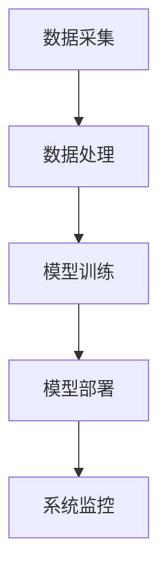

                 

# 大语言模型在智能制造质量控制中的推理应用

## 关键词
- 大语言模型
- 智能制造
- 质量控制
- 推理应用
- Transformer模型
- BERT模型
- GPT模型

## 摘要
本文旨在探讨大语言模型在智能制造质量控制中的应用。通过分析大语言模型的发展历程、算法原理及在智能制造中的应用场景，我们揭示了其在质量检测、预测、异常检测与优化方面的独特优势。文中通过实际案例，详细阐述了大语言模型在智能制造质量控制中的具体应用架构与实现方法，并对未来发展趋势与挑战进行了展望。

## 第一部分：大语言模型与智能制造质量控制概述

### 第1章：大语言模型概述

#### 1.1 大语言模型的定义与背景

**1.1.1 大语言模型的概念**

大语言模型（Large Language Model，LLM）是一种基于深度学习技术的自然语言处理模型，通过学习海量的文本数据，模型能够对输入的自然语言进行理解和生成。大语言模型的核心目标是使计算机具备处理和理解人类语言的能力，从而实现人与机器之间的自然交互。

**1.1.2 大语言模型的发展历程**

大语言模型的发展可以追溯到20世纪80年代的统计语言模型。随着计算机性能的不断提升和海量数据的获取，深度学习技术逐渐成为大语言模型发展的关键驱动力。2018年，Google推出BERT模型，标志着大语言模型进入了一个新的时代。此后，GPT系列模型、T5模型等相继涌现，模型规模和性能不断提升。

**1.1.3 大语言模型的应用领域**

大语言模型在多个领域展现了强大的应用潜力，包括但不限于：文本分类、机器翻译、问答系统、文本生成等。在智能制造领域，大语言模型可以用于质量检测、预测、异常检测等任务，提高生产效率和产品质量。

#### 1.2 智能制造质量控制概述

**1.2.1 智能制造的定义与特点**

智能制造（Intelligent Manufacturing）是一种基于信息物理系统（Cyber-Physical Systems，CPS）的制造模式，通过将制造过程中的各种物理设备、控制系统、数据处理与分析系统进行深度融合，实现制造过程的高度自动化、智能化和灵活性。

智能制造的特点包括：

- **自动化**：通过自动化设备、传感器和控制系统实现生产过程的高度自动化。
- **智能化**：利用人工智能、大数据等技术对生产过程进行实时监测、预测和优化。
- **灵活性**：能够根据市场需求快速调整生产计划，实现个性化定制。

**1.2.2 智能制造质量控制的重要性**

智能制造质量控制是确保产品质量的重要环节。随着生产过程的复杂化和自动化程度的提高，传统质量检测方法已经难以满足需求。智能制造质量控制通过引入人工智能技术，可以实现对生产过程的实时监测、预测和优化，提高产品质量和可靠性。

**1.2.3 智能制造质量控制面临的挑战**

智能制造质量控制面临以下挑战：

- **数据质量**：生产过程中产生的大量数据质量参差不齐，如何有效地清洗和处理这些数据成为关键问题。
- **模型可解释性**：大语言模型在质量控制中的应用具有较高的黑箱性，如何提高模型的可解释性是亟待解决的问题。
- **模型泛化能力**：如何使模型在不同场景下具备良好的泛化能力，避免过度拟合问题。

### 第2章：大语言模型在智能制造质量控制中的应用原理

#### 2.1 大语言模型的算法原理

**2.1.1 Transformer模型**

Transformer模型是Google在2017年提出的一种基于自注意力机制的深度学习模型，被广泛应用于机器翻译、文本分类等自然语言处理任务。Transformer模型的核心思想是利用自注意力机制对输入序列进行建模，从而捕捉序列中的长距离依赖关系。

**2.1.2 BERT模型**

BERT（Bidirectional Encoder Representations from Transformers）是Google在2018年推出的一种双向Transformer模型，通过对输入序列进行双向编码，使模型能够同时捕捉序列的前后文信息，从而提高模型的性能。

**2.1.3 GPT模型**

GPT（Generative Pre-trained Transformer）是OpenAI在2018年推出的一种基于Transformer的自回归语言模型。GPT模型通过自回归方式生成文本，具有较强的文本生成能力。

#### 2.2 大语言模型在质量控制中的应用

**2.2.1 质量检测与预测**

大语言模型在质量检测与预测中的应用主要包括以下方面：

- **质量检测**：通过学习大量质量检测数据，大语言模型可以识别生产过程中的异常数据，从而实现对产品质量的实时监控。
- **质量预测**：基于历史质量数据，大语言模型可以预测未来的产品质量趋势，为生产计划的调整提供依据。

**2.2.2 异常检测与诊断**

大语言模型在异常检测与诊断中的应用包括：

- **异常检测**：通过对正常生产过程的数据进行分析，大语言模型可以识别出异常情况，从而实现对生产过程的实时监控。
- **异常诊断**：大语言模型可以分析异常数据，找出异常产生的原因，为生产问题的解决提供指导。

**2.2.3 质量优化与改进**

大语言模型在质量优化与改进中的应用包括：

- **质量优化**：通过对生产过程的实时监测和预测，大语言模型可以提出优化建议，从而提高产品质量。
- **质量改进**：通过分析质量数据，大语言模型可以识别出生产过程中的瓶颈和问题，为质量改进提供依据。

### 第3章：大语言模型在智能制造质量控制中的应用实例

#### 3.1 案例一：智能工厂质量检测系统

**3.1.1 案例背景**

某智能工厂在生产过程中需要实时监测产品质量，以确保产品质量符合客户要求。为了实现这一目标，该工厂引入了基于大语言模型的质量检测系统。

**3.1.2 案例实施**

该智能工厂首先收集了大量的质量检测数据，包括生产过程中的各种参数、产品的质量指标等。然后，使用BERT模型对这些数据进行训练，使其具备对质量检测数据的分析和理解能力。最后，将训练好的模型部署到生产线上，实现对产品质量的实时监测。

**3.1.3 案例效果分析**

通过引入基于大语言模型的质量检测系统，该智能工厂实现了以下效果：

- **实时监测**：系统能够实时监测产品质量，及时发现异常情况，确保产品质量符合客户要求。
- **提高效率**：系统提高了质量检测的效率，减少了人工干预，降低了生产成本。
- **提升质量**：通过分析质量数据，系统提出了优化建议，提高了产品质量。

#### 3.2 案例二：汽车制造业质量预测与优化

**3.2.1 案例背景**

某汽车制造商需要预测未来的产品质量趋势，以便制定相应的生产计划。为了实现这一目标，该制造商引入了基于大语言模型的质量预测与优化系统。

**3.2.2 案例实施**

该汽车制造商首先收集了大量的历史质量数据，包括生产过程中的各种参数、产品的质量指标等。然后，使用GPT模型对这些数据进行训练，使其具备对质量数据进行分析和预测的能力。最后，将训练好的模型部署到生产线上，实现对产品质量的实时预测和优化。

**3.2.3 案例效果分析**

通过引入基于大语言模型的质量预测与优化系统，该汽车制造商实现了以下效果：

- **实时预测**：系统能够实时预测未来的产品质量趋势，为生产计划的制定提供依据。
- **优化生产**：通过分析质量数据，系统提出了优化建议，提高了生产效率和质量。
- **降低成本**：系统提高了生产计划的准确性，减少了生产过程中的人力成本和资源浪费。

### 第4章：大语言模型在智能制造质量控制中的应用架构

#### 4.1 应用架构概述

**4.1.1 系统总体架构**

大语言模型在智能制造质量控制中的应用架构主要包括数据采集、数据处理、模型训练、模型部署和系统监控五个部分。系统总体架构如下图所示：

**4.1.2 系统功能模块划分**

系统功能模块划分如下：

- **数据采集**：负责从生产过程中收集各种质量检测数据。
- **数据处理**：负责对采集到的数据进行分析和清洗，为模型训练提供高质量的数据。
- **模型训练**：负责使用大语言模型对处理后的数据进行分析和训练。
- **模型部署**：负责将训练好的模型部署到生产线上，实现实时监测和预测。
- **系统监控**：负责对系统的运行情况进行监控，确保系统的稳定性和可靠性。

### 第5章：大语言模型在智能制造质量控制中的挑战与展望

#### 5.1 挑战分析

**5.1.1 数据质量与安全性问题**

数据质量是影响大语言模型在智能制造质量控制中应用效果的关键因素。生产过程中产生的大量数据可能存在噪声、缺失、不一致等问题，如何有效地清洗和处理这些数据是亟待解决的问题。同时，数据安全也是一个重要问题，如何在保证数据质量的同时确保数据的安全性，是应用过程中需要关注的问题。

**5.1.2 模型可解释性问题**

大语言模型具有较强的黑箱性，其内部结构和决策过程难以解释。在智能制造质量控制中，模型的可解释性对于诊断问题和优化生产具有重要意义。如何提高大语言模型的可解释性，使其在质量控制中的应用更加透明和可信，是一个重要的研究方向。

**5.1.3 模型泛化能力问题**

模型的泛化能力是指模型在不同场景下的适用性。在智能制造质量控制中，模型需要能够适应不同的生产环境和质量需求。如何提高大语言模型的泛化能力，避免过度拟合问题，是应用过程中需要关注的问题。

#### 5.2 发展趋势与展望

**5.2.1 技术发展趋势**

随着深度学习技术的不断发展和完善，大语言模型在智能制造质量控制中的应用前景将更加广阔。未来的发展趋势包括：

- **模型优化**：通过改进模型结构和算法，提高大语言模型的性能和效率。
- **数据融合**：将多种数据源进行融合，提高数据质量和模型的泛化能力。
- **实时监测与预测**：实现实时监测和预测，提高生产过程的智能化水平。

**5.2.2 应用前景展望**

大语言模型在智能制造质量控制中的应用前景广阔，未来有望实现以下目标：

- **提高产品质量**：通过实时监测和预测，提高产品质量，降低质量缺陷率。
- **优化生产过程**：通过优化生产计划和资源配置，提高生产效率，降低成本。
- **实现个性化定制**：通过分析质量数据，实现个性化定制，满足客户需求。

### 第6章：大语言模型在智能制造质量控制中的最佳实践

#### 6.1 实践经验总结

**6.1.1 成功案例总结**

在智能制造质量控制中，大语言模型的应用取得了显著成效。例如，某汽车制造商通过引入大语言模型，实现了产品质量的实时监测和预测，有效降低了质量缺陷率。同时，通过对质量数据的分析，该制造商提出了优化建议，提高了生产效率。

**6.1.2 失败案例总结**

尽管大语言模型在智能制造质量控制中具有广泛应用前景，但也存在一些失败案例。例如，某工厂在引入大语言模型后，由于数据质量差、模型可解释性低，导致模型无法有效应用于质量控制。此外，模型过度拟合问题也影响了模型的泛化能力。

#### 6.2 实践技巧与建议

**6.2.1 实践技巧总结**

为了提高大语言模型在智能制造质量控制中的应用效果，可以从以下几个方面进行实践：

- **数据质量优化**：对采集到的数据进行清洗和处理，确保数据质量。
- **模型可解释性提升**：通过改进模型结构和算法，提高模型的可解释性。
- **模型泛化能力增强**：通过数据融合和模型优化，提高模型的泛化能力。

**6.2.2 应用建议**

为了更好地应用大语言模型于智能制造质量控制，可以采取以下措施：

- **需求分析**：在应用前，充分了解质量需求，明确模型的目标和应用场景。
- **数据采集**：确保数据采集的全面性和准确性，为模型训练提供高质量的数据。
- **模型选择**：根据质量需求，选择合适的模型和算法，提高模型的性能。
- **模型部署**：将训练好的模型部署到生产线上，实现实时监测和预测。
- **持续优化**：在应用过程中，持续优化模型和算法，提高应用效果。

### 第7章：小结与展望

#### 7.1 小结

本文从大语言模型的概述、算法原理、应用实例、应用架构、挑战与展望、最佳实践等方面，详细探讨了其在智能制造质量控制中的应用。通过分析，我们发现大语言模型在质量检测、预测、异常检测与优化方面具有显著优势，但在数据质量、模型可解释性和泛化能力方面仍存在一定挑战。

#### 7.2 展望未来

未来，随着深度学习技术的不断发展和智能制造的深入推进，大语言模型在智能制造质量控制中的应用前景将更加广阔。通过不断优化模型结构和算法，提高模型性能和可解释性，我们将有望实现更加智能、高效的质量控制，助力智能制造的可持续发展。

## 结论

本文从多个角度详细探讨了大语言模型在智能制造质量控制中的应用。通过分析大语言模型的发展历程、算法原理及在智能制造中的应用场景，我们揭示了其在质量检测、预测、异常检测与优化方面的独特优势。同时，通过实际案例，我们展示了大语言模型在智能制造质量控制中的具体应用架构与实现方法。展望未来，随着技术的不断进步，大语言模型在智能制造质量控制中的应用将越来越广泛，为智能制造的发展带来更多可能性。

### 作者

**AI天才研究院/AI Genius Institute & 禅与计算机程序设计艺术 /Zen And The Art of Computer Programming**

