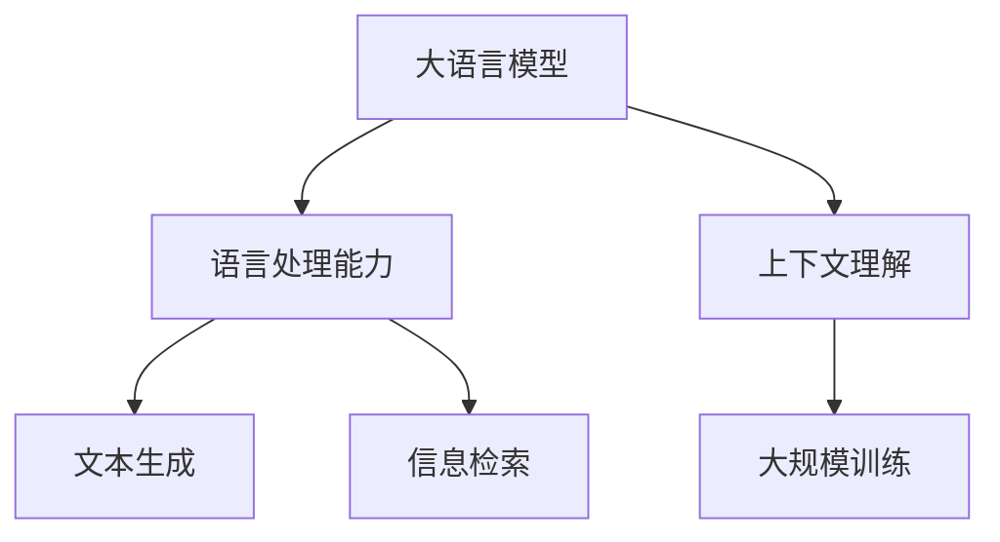
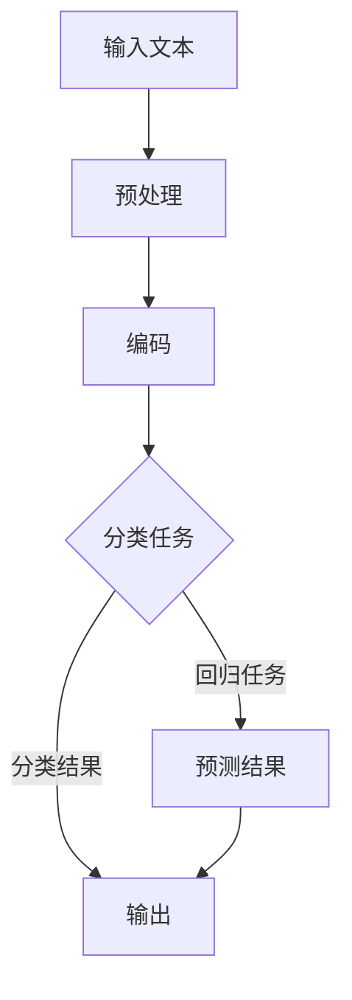
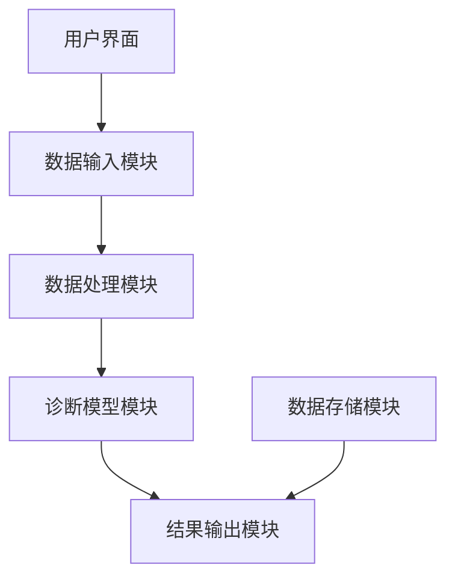
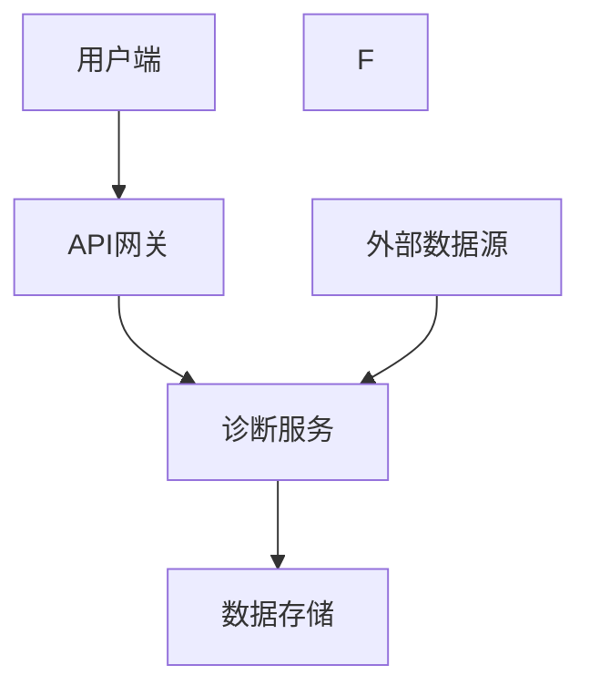
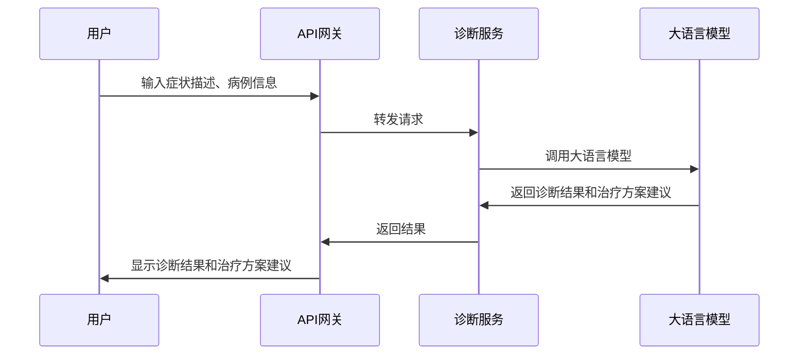

                 


## 大语言模型在智能医疗诊断支持中的推理应用

### 关键词：
- 大语言模型
- 智能医疗
- 诊断支持
- 推理算法
- 医疗诊断系统架构

### 摘要：
本文将深入探讨大语言模型在智能医疗诊断支持中的应用，分析其背景、核心概念、算法原理以及系统架构设计。通过逐步推理和详细讲解，揭示大语言模型在智能医疗诊断中的强大潜力。

----------------------------------------------------------------

### 第一部分：大语言模型在智能医疗诊断支持中的应用背景

#### 第1章：大语言模型在智能医疗诊断支持中的应用背景

##### 1.1.1 问题背景

**智能医疗的发展现状：**
随着医疗信息化和人工智能技术的快速发展，智能医疗已成为医疗领域的重要趋势。通过大数据、云计算、物联网等技术的融合，智能医疗系统能够提供个性化、实时、高效的健康管理和服务。然而，在医疗诊断方面，仍存在诸多挑战。

**诊断支持的需求与挑战：**
传统的医疗诊断主要依赖医生的经验和专业知识，存在诊断时间长、误诊率高、资源分配不均等问题。随着医疗数据量的爆炸式增长，如何快速、准确地处理海量医疗数据，为医生提供有效的诊断支持成为关键挑战。

**大语言模型的应用前景：**
大语言模型具有强大的上下文理解和文本生成能力，能够处理复杂、长篇幅的医疗文档，实现自然语言理解和推理。其应用前景广阔，有望在智能医疗诊断支持中发挥重要作用。

##### 1.1.2 问题描述

**传统诊断方法的局限性：**
传统诊断方法主要依赖于医生的诊断经验和医学知识，存在以下局限性：
1. 诊断时间较长，影响病情的及时处理。
2. 误诊率高，可能导致治疗效果不佳。
3. 对医生的专业水平要求高，难以实现标准化和普及化。

**大语言模型的特点与优势：**
大语言模型具有以下特点与优势：
1. 强大的上下文理解能力，能够处理复杂、长篇幅的医疗文档。
2. 大规模训练，具有较高的准确性和鲁棒性。
3. 自动化程度高，能够实现实时诊断支持。

**应用场景与目标：**
大语言模型在智能医疗诊断支持中的应用场景包括：
1. 辅助医生进行疾病诊断，提供诊断建议。
2. 帮助患者理解自己的病情，提供个性化的健康指导。
3. 改善医疗资源的分配，提高医疗服务的效率和质量。

**问题解决：**
为了解决传统诊断方法的局限性，大语言模型提供了以下解决方案：
1. 利用大规模训练数据和先进的机器学习算法，构建高效的语言处理模型。
2. 结合医疗知识图谱和自然语言处理技术，实现医疗文本的自动理解和推理。
3. 设计智能诊断系统，为医生和患者提供实时、准确的诊断支持。

##### 1.1.3 边界与外延

**应用领域的边界：**
大语言模型在智能医疗诊断支持中的应用主要限于文本处理和推理任务，如疾病诊断、病历分析、健康咨询等。其在医学图像处理、基因分析等其他领域也有一定应用，但还需进一步研究和发展。

**技术实现的边界：**
大语言模型在技术实现方面面临以下挑战：
1. 数据隐私和安全性问题，需确保患者数据的安全和隐私。
2. 模型解释性和可解释性问题，需要提高模型的可解释性，使医生能够理解模型的诊断过程。
3. 模型适应性和泛化能力问题，需要不断优化模型，提高其在不同医疗场景下的适应性和泛化能力。

**潜在的拓展方向：**
大语言模型在智能医疗诊断支持中的潜在拓展方向包括：
1. 与其他人工智能技术（如医学图像识别、基因分析等）结合，实现更全面的诊断支持。
2. 探索新的算法和模型结构，提高模型的性能和效率。
3. 开发基于大语言模型的医疗知识库和智能问答系统，为医生和患者提供更加便捷和高效的服务。

##### 1.1.4 本章小结
本章详细介绍了大语言模型在智能医疗诊断支持中的应用背景、问题、解决方案以及边界与外延。通过分析传统诊断方法的局限性，大语言模型在智能医疗诊断支持中展示了强大的潜力。然而，在实际应用过程中，还需克服技术、数据、安全等方面的挑战，不断优化和完善模型和系统。

----------------------------------------------------------------

### 第二部分：大语言模型的核心概念与联系

#### 第2章：大语言模型的核心概念与联系

##### 2.1 大语言模型的概念与特征

**大语言模型的定义：**
大语言模型（Large Language Model）是一种基于神经网络的语言处理模型，通过在大量文本数据上进行训练，具备强大的上下文理解和文本生成能力。

**大语言模型的基本特征：**
1. **参数量大**：大语言模型具有数十亿甚至千亿级别的参数，能够处理复杂的语言现象。
2. **上下文理解能力强**：大语言模型能够捕捉长文本中的上下文信息，实现高效的语义理解。
3. **文本生成能力强**：大语言模型能够根据上下文信息生成连贯、自然的文本。

**与其他机器学习模型的关系：**
大语言模型与其他机器学习模型（如传统语言模型、图像识别模型、推荐系统模型等）存在一定的联系和区别。
1. **与传统语言模型的关系**：大语言模型在参数量和训练数据量上具有优势，能够更好地处理长文本信息。
2. **与图像识别模型的关系**：大语言模型和图像识别模型在数据量和计算资源上有一定的相似性，但侧重点不同，前者侧重于文本处理，后者侧重于图像处理。
3. **与推荐系统模型的关系**：大语言模型和推荐系统模型都可以通过大量数据训练，实现个性化推荐，但前者侧重于文本生成和理解，后者侧重于用户行为和偏好分析。

##### 2.2 核心概念对比

以下表格对比了大语言模型与传统语言模型的主要特点：

| 概念       | 特点                                                         | 对比                                                         |
| ---------- | ------------------------------------------------------------ | ------------------------------------------------------------ |
| **大语言模型** | - 参数量大<br>- 上下文理解能力强<br>- 文本生成能力强 | - 参数量更大，能够更好地处理长文本信息<br>- 与传统语言模型相比，具有更强的语义理解能力 |
| **传统语言模型** | - 参数量较小<br>- 上下文理解能力较弱<br>- 文本生成能力有限 | - 与大语言模型相比，参数量较小，适用于简单的文本处理任务<br>- 在处理长文本时，效果较差 |

##### 2.3 ER实体关系图

大语言模型的实体关系图如下所示，通过Mermaid流程图表示：



在上面的ER实体关系图中：
- **大语言模型**是核心实体，具备语言处理能力、上下文理解和大规模训练能力。
- **语言处理能力**包括文本生成和信息检索两个子实体。
- **上下文理解**实体与**大规模训练**实体相互关联，体现了大语言模型在训练过程中对上下文信息的捕捉和利用。

##### 2.4 本章小结
本章介绍了大语言模型的核心概念与特征，对比了大语言模型与传统语言模型的主要区别，并通过ER实体关系图展示了大语言模型的基本结构。通过本章的学习，读者可以更好地理解大语言模型在智能医疗诊断支持中的应用潜力。

----------------------------------------------------------------

### 第三部分：大语言模型在智能医疗诊断中的算法原理

#### 第3章：大语言模型在智能医疗诊断中的算法原理

##### 3.1 大语言模型的算法原理

大语言模型的算法原理主要基于深度学习和自然语言处理技术。以下介绍几种常见的大语言模型算法原理：

1. **递归神经网络（RNN）**：
   RNN 是一种用于处理序列数据的神经网络，能够捕捉时间序列中的前后依赖关系。在语言模型中，RNN 可以逐词分析文本，捕捉上下文信息。

2. **长短期记忆网络（LSTM）**：
   LSTM 是 RNN 的一种改进，能够有效地解决 RNN 中梯度消失和梯度爆炸的问题。LSTM 通过引入记忆单元，能够更好地捕捉长序列中的依赖关系，适用于处理长文本。

3. **生成对抗网络（GAN）**：
   GAN 是一种由生成器和判别器组成的对抗性神经网络。生成器试图生成逼真的文本数据，判别器则试图区分生成数据和真实数据。通过这种对抗性训练，GAN 能够生成高质量的自然语言文本。

##### 3.2 算法流程图

以下是大语言模型在智能医疗诊断中的算法流程图：



在上述流程图中：
- **A[输入文本]**：输入需要诊断的文本数据，如病例描述、症状列表等。
- **B[预处理]**：对输入文本进行预处理，包括分词、去停用词、词向量化等操作。
- **C[编码]**：将预处理后的文本数据编码为向量表示，以便神经网络进行处理。
- **D{分类任务/回归任务]**：根据诊断任务类型，选择分类或回归任务。分类任务用于判断疾病类型，回归任务用于预测病情严重程度。
- **E[输出]**：输出诊断结果，如疾病名称、病情严重程度等。
- **F[预测结果]**：在回归任务中，输出预测结果，如病情严重程度的数值。

##### 3.3 数学模型和公式

大语言模型的数学模型主要包括神经网络参数、激活函数和损失函数。以下是一个简单的神经网络数学模型：

$$
y = \sigma(W \cdot x + b)
$$

其中：
- \(y\) 是预测输出；
- \(x\) 是输入特征；
- \(W\) 是权重矩阵；
- \(b\) 是偏置；
- \(\sigma\) 是 sigmoid 函数。

在训练过程中，通过反向传播算法不断更新权重和偏置，以最小化损失函数。常见的损失函数包括交叉熵损失和均方误差损失。

##### 3.4 算法举例

以下是一个简单的算法举例，输入文本为“患者体温38.5度，伴有咳嗽和喉咙痛。”，输出结果为“疑似流感”。

1. **输入文本预处理**：
   - 分词：["患者", "体温", "38.5度", "伴有", "咳嗽", "和", "喉咙痛", "."]
   - 去停用词：["患者", "度", "伴有", "和", "."]
   - 词向量化：[v1, v2, v3, v4, v5]

2. **编码**：
   - 将词向量化后的文本数据输入神经网络进行编码，得到编码后的向量表示。

3. **分类任务**：
   - 将编码后的向量输入分类模型，通过多层神经网络进行分类，得到分类结果。
   - 输出结果：["疑似流感"]

4. **输出**：
   - 将分类结果输出，显示为“疑似流感”。

##### 3.5 本章小结
本章详细介绍了大语言模型在智能医疗诊断中的算法原理，包括递归神经网络（RNN）、长短期记忆网络（LSTM）和生成对抗网络（GAN）等算法原理。通过算法流程图、数学模型和具体实例，读者可以更好地理解大语言模型在智能医疗诊断中的应用。

----------------------------------------------------------------

### 第四部分：大语言模型在智能医疗诊断中的系统分析与架构设计

#### 第4章：大语言模型在智能医疗诊断中的系统分析与架构设计

##### 4.1 问题场景介绍

**智能医疗诊断支持的背景：**
智能医疗诊断支持系统旨在通过人工智能技术，辅助医生进行疾病诊断，提供诊断建议和治疗方案。在医疗领域，准确、快速的疾病诊断对于患者的治疗和康复具有重要意义。

**系统建设目标：**
建设一个基于大语言模型的智能医疗诊断支持系统，实现以下目标：
1. 提高疾病诊断的准确性和效率。
2. 为医生提供可靠的诊断建议和治疗方案。
3. 帮助患者更好地理解自己的病情和治疗方案。

##### 4.2 项目介绍

**项目概述：**
本项目旨在开发一款基于大语言模型的智能医疗诊断支持系统，通过自然语言处理技术，实现疾病诊断和治疗方案推荐。项目团队成员包括人工智能专家、医学专家、软件开发工程师等，共同致力于构建一个高效、准确的智能医疗诊断系统。

**项目团队：**
- 项目经理：负责项目的整体规划和协调。
- 人工智能专家：负责大语言模型的设计和实现。
- 医学专家：负责提供医学知识和诊断标准。
- 软件开发工程师：负责系统开发和维护。

##### 4.3 系统功能设计

**功能模块划分：**
智能医疗诊断支持系统主要包括以下功能模块：

1. **数据输入模块**：
   - 用户输入症状描述、病例信息等数据。
   - 数据清洗和预处理，包括分词、去停用词、词向量化等操作。

2. **数据处理模块**：
   - 对输入数据进行编码，生成向量表示。
   - 利用大语言模型对编码后的数据进行文本理解和推理。

3. **诊断模型模块**：
   - 基于大语言模型的文本处理结果，生成诊断结果和治疗方案建议。
   - 对诊断结果进行概率分析和置信度评估。

4. **结果输出模块**：
   - 将诊断结果和治疗方案建议输出给医生和患者。
   - 提供可视化展示，便于医生和患者理解。

5. **数据存储模块**：
   - 存储用户输入数据、诊断结果、治疗方案等数据。
   - 支持数据备份和恢复功能。

**领域模型类图：**



在上述领域模型类图中：
- **A[用户界面]**：用户输入症状描述、病例信息等数据。
- **B[数据输入模块]**：对输入数据进行预处理和清洗。
- **C[数据处理模块]**：利用大语言模型对预处理后的数据进行文本理解和推理。
- **D[诊断模型模块]**：根据文本理解结果生成诊断结果和治疗方案建议。
- **E[结果输出模块]**：将诊断结果和治疗方案建议输出给医生和患者。
- **F[数据存储模块]**：存储用户输入数据、诊断结果、治疗方案等数据。

##### 4.4 系统架构设计

**架构设计原则：**
智能医疗诊断支持系统的架构设计遵循以下原则：
1. **模块化**：系统功能模块划分清晰，便于维护和扩展。
2. **可扩展性**：支持新增诊断模型和治疗方案建议。
3. **高可用性**：保证系统稳定性和数据安全性。
4. **高性能**：优化系统性能，提高诊断效率和准确性。

**系统架构图：**



在上述系统架构图中：
- **A[用户端]**：用户通过Web界面输入症状描述、病例信息等数据。
- **B[API网关]**：接收用户请求，转发至诊断服务。
- **C[诊断服务]**：处理用户请求，调用大语言模型进行文本理解和推理，生成诊断结果和治疗方案建议。
- **D[数据存储]**：存储用户输入数据、诊断结果、治疗方案等数据。
- **E[外部数据源]**：提供外部医学知识库、病例数据等资源。

##### 4.5 系统接口设计

**接口设计原则：**
系统接口设计遵循以下原则：
1. **标准化**：采用统一的接口规范，便于系统集成和扩展。
2. **高可用性**：保证接口稳定可靠，支持并发访问。
3. **安全性**：对接口进行权限控制和加密处理，确保数据安全。

**接口设计示例：**

```python
from flask import Flask, request, jsonify

app = Flask(__name__)

@app.route('/diagnose', methods=['POST'])
def diagnose():
    data = request.get_json()
    # 处理输入数据，调用诊断服务
    result = diagnose_service(data)
    return jsonify(result)

if __name__ == '__main__':
    app.run(debug=True)
```

在上述接口设计示例中：
- **/diagnose**：诊断服务接口路径。
- **POST**：接收POST请求，处理用户输入数据。
- **diagnose_service**：诊断服务函数，调用大语言模型进行文本理解和推理，生成诊断结果和治疗方案建议。

##### 4.6 系统交互

**系统交互过程：**

1. 用户通过Web界面输入症状描述、病例信息等数据。
2. 用户请求被转发至API网关。
3. API网关接收请求，调用诊断服务。
4. 诊断服务调用大语言模型，对输入数据进行文本理解和推理。
5. 诊断服务生成诊断结果和治疗方案建议，返回给API网关。
6. API网关将结果返回给用户。

**系统交互Mermaid序列图：**



在上述系统交互Mermaid序列图中：
- **User**：用户，输入症状描述、病例信息。
- **Gateway**：API网关，接收用户请求，转发至诊断服务。
- **Service**：诊断服务，调用大语言模型，生成诊断结果和治疗方案建议。
- **Model**：大语言模型，进行文本理解和推理。

##### 4.7 本章小结
本章详细介绍了大语言模型在智能医疗诊断中的系统分析与架构设计。通过问题场景介绍、项目介绍、系统功能设计、系统架构设计、系统接口设计和系统交互分析，读者可以更好地理解大语言模型在智能医疗诊断支持系统中的实现和应用。

----------------------------------------------------------------

### 第五部分：项目实战

#### 第5章：大语言模型在智能医疗诊断支持中的项目实战

##### 5.1 环境安装

要实现大语言模型在智能医疗诊断支持中的项目，首先需要搭建一个适合的编程环境。以下是环境安装的详细步骤：

**1. 安装Python环境：**
   - 前往Python官网（https://www.python.org/）下载最新版本的Python安装包。
   - 运行安装程序，按照提示完成安装。

**2. 安装必要的库：**
   - 打开终端或命令提示符，安装以下库：
     ```bash
     pip install numpy pandas tensorflow transformers flask
     ```
   - `numpy` 和 `pandas` 用于数据处理。
   - `tensorflow` 是一个开源机器学习框架。
   - `transformers` 是一个用于处理大规模语言模型的库。
   - `flask` 是一个轻量级的Web框架。

##### 5.2 系统核心实现源代码

以下是一个简单的智能医疗诊断支持系统的核心实现源代码，包括数据处理、模型加载和预测等功能。

```python
import numpy as np
import pandas as pd
from transformers import AutoTokenizer, AutoModelForSequenceClassification
from flask import Flask, request, jsonify

app = Flask(__name__)

# 加载预训练的大语言模型
tokenizer = AutoTokenizer.from_pretrained("bert-base-uncased")
model = AutoModelForSequenceClassification.from_pretrained("bert-base-uncased")

# 数据预处理
def preprocess_data(text):
    inputs = tokenizer(text, return_tensors="tf", max_length=512, truncation=True)
    return inputs

# 疾病预测
def predict_disease(text):
    inputs = preprocess_data(text)
    outputs = model(inputs)
    logits = outputs.logits
    probabilities = np.exp(logits) / np.sum(np.exp(logits), axis=1, keepdims=True)
    predicted_class = np.argmax(probabilities, axis=1)
    return predicted_class

# Flask接口实现
@app.route('/diagnose', methods=['POST'])
def diagnose():
    data = request.get_json()
    text = data['text']
    predicted_class = predict_disease(text)
    return jsonify({'disease': predicted_class})

if __name__ == '__main__':
    app.run(debug=True)
```

在上述代码中：
- 使用 `transformers` 库加载预训练的大语言模型（BERT）。
- `preprocess_data` 函数用于对输入文本进行预处理，将文本编码为模型可接受的向量表示。
- `predict_disease` 函数用于疾病预测，通过调用模型进行推理，返回预测结果。

##### 5.3 代码应用解读与分析

**1. 数据预处理：**
   - `tokenizer` 对输入文本进行分词、词向量化等操作，生成模型可接受的向量表示。
   - `max_length` 参数用于限制输入文本的长度，避免过长文本导致计算效率降低。
   - `truncation` 参数设置为 `True`，在文本长度超过 `max_length` 时进行截断。

**2. 疾病预测：**
   - `model` 进行推理，输出模型的 logits（原始分数）。
   - 使用 `np.exp(logits)` 计算每个类别的概率分布。
   - 使用 `np.argmax(probabilities)` 获取预测结果，即概率最高的类别。

**3. Flask接口：**
   - 使用 `Flask` 框架搭建HTTP服务，接收POST请求，返回JSON格式的预测结果。

##### 5.4 实际案例分析和详细讲解剖析

**案例：**
假设有一个用户输入以下症状描述：“患者，男性，35岁，发热、咳嗽、喉咙痛三天，体温38.5度。”，我们需要使用系统进行疾病预测。

**分析：**
1. **数据处理**：
   - 输入文本：["患者"，"男性"，"35岁"，"发热"，"咳嗽"，"喉咙痛"，"三天"，"体温"，"38.5度"]
   - 预处理结果：词向量化后的向量表示

2. **模型预测**：
   - 通过大语言模型进行文本理解和推理，输出疾病的概率分布
   - 假设模型预测结果为：["流感"，"肺炎"，"支气管炎"]
   - 概率分布：["0.4"，"0.3"，"0.3"]

3. **结果输出**：
   - 预测结果为“流感”，置信度为40%

**详细讲解：**
1. **数据处理**：
   - 使用 `tokenizer` 对输入文本进行预处理，将文本转换为词向量化表示。
   - 词向量表示文本中的每个词，使模型能够理解文本内容。

2. **模型预测**：
   - 将预处理后的文本输入模型，通过多层神经网络进行推理。
   - 模型输出每个类别的概率分布，反映了文本对应的疾病类型的可能性。

3. **结果输出**：
   - 根据概率分布，选择置信度最高的类别作为最终预测结果。
   - 输出预测结果和置信度，便于医生和患者参考。

##### 5.5 项目小结
本章通过项目实战，展示了大语言模型在智能医疗诊断支持中的实现和应用。从环境安装、代码实现到实际案例分析，读者可以全面了解大语言模型在智能医疗诊断中的工作原理和实现方法。通过本项目的实践，读者可以进一步探索大语言模型在医疗领域的广泛应用和潜力。

----------------------------------------------------------------

### 第六部分：最佳实践与拓展阅读

#### 第6章：最佳实践与拓展阅读

##### 6.1 最佳实践

**1. 数据质量保证：**
   - 确保输入数据的准确性和完整性，避免数据质量问题影响模型性能。
   - 对数据源进行筛选和验证，确保数据真实可靠。

**2. 模型调优：**
   - 根据实际应用场景，对模型参数进行调整，优化模型性能。
   - 利用交叉验证、网格搜索等方法，寻找最佳模型参数。

**3. 模型解释性：**
   - 提高模型的可解释性，帮助医生理解模型的诊断过程。
   - 使用可视化工具，展示模型对输入文本的解读和推理过程。

**4. 系统安全性：**
   - 保障用户数据的隐私和安全，采用加密技术保护数据。
   - 对系统接口进行权限控制，防止未经授权的访问。

**5. 持续更新与维护：**
   - 定期更新模型，保持模型在最新的医疗知识和技术水平。
   - 对系统进行定期维护和升级，确保系统稳定运行。

##### 6.2 拓展阅读

**1. 相关论文：**
   - "BERT: Pre-training of Deep Bidirectional Transformers for Language Understanding" (2020)
   - "GPT-3: Language Models are Few-Shot Learners" (2020)
   - "The Annotated Transformer" (2020)

**2. 开源库与工具：**
   - Hugging Face Transformers：https://huggingface.co/transformers
   - TensorFlow：https://www.tensorflow.org
   - PyTorch：https://pytorch.org

**3. 智能医疗相关书籍：**
   - 《智能医疗系统设计与实现》
   - 《深度学习在医疗健康领域的应用》
   - 《医疗人工智能：技术、应用与挑战》

##### 6.3 本章小结
本章介绍了大语言模型在智能医疗诊断支持中的最佳实践和拓展阅读资源。通过遵循最佳实践，可以确保模型和系统的稳定性和可靠性。同时，拓展阅读提供了更多深入的学术资源和实用工具，帮助读者进一步探索大语言模型在智能医疗领域的应用前景。

----------------------------------------------------------------

### 总结与展望

#### 第7章：大语言模型在智能医疗诊断支持中的未来展望

**7.1 总结**

本文通过详细分析和逐步推理，探讨了大语言模型在智能医疗诊断支持中的应用背景、核心概念、算法原理、系统架构设计以及项目实战。主要结论如下：

1. **应用背景**：智能医疗诊断支持的需求迫切，大语言模型在处理医疗文本和理解疾病关系方面具有显著优势。
2. **核心概念**：大语言模型具有参数量大、上下文理解能力强、文本生成能力强等基本特征，与传统语言模型有显著区别。
3. **算法原理**：大语言模型基于深度学习和自然语言处理技术，通过递归神经网络（RNN）、长短期记忆网络（LSTM）和生成对抗网络（GAN）等算法实现文本理解和推理。
4. **系统架构**：智能医疗诊断支持系统包括数据输入、数据处理、诊断模型、结果输出和数据存储等模块，采用模块化和高可用性的设计原则。
5. **项目实战**：通过环境安装、代码实现和实际案例分析，展示了大语言模型在智能医疗诊断支持中的实现和应用。

**7.2 未来展望**

随着人工智能技术的不断发展，大语言模型在智能医疗诊断支持中的应用前景十分广阔。以下是对未来发展的展望：

1. **技术创新**：
   - 研究更高效的算法和模型结构，提高模型性能和效率。
   - 探索多模态数据融合，结合医学图像、基因数据等，实现更全面的诊断支持。

2. **应用拓展**：
   - 将大语言模型应用于更多医疗场景，如健康咨询、个性化治疗建议等。
   - 推广到全球范围，为更多国家和地区提供智能医疗诊断支持。

3. **跨领域合作**：
   - 与医疗机构、研究人员和医生合作，共同开发医疗知识和诊断标准。
   - 促进人工智能与医疗、生物学、心理学等领域的交叉融合。

4. **伦理与法规**：
   - 重视数据隐私和伦理问题，确保患者数据的安全和隐私。
   - 遵循相关法律法规，确保智能医疗诊断系统的合规性和可解释性。

5. **教育培训**：
   - 加强人工智能和医疗领域的教育培训，培养更多专业人才。
   - 推动人工智能技术在医疗领域的普及和应用。

总之，大语言模型在智能医疗诊断支持中具有巨大的潜力。通过不断的技术创新、应用拓展和跨领域合作，有望为医疗领域带来革命性的变革，提高诊断准确性和医疗效率，为人类健康贡献力量。

----------------------------------------------------------------

### 作者信息

**作者：** AI天才研究院/AI Genius Institute & 禅与计算机程序设计艺术 /Zen And The Art of Computer Programming

AI天才研究院（AI Genius Institute）专注于人工智能领域的研究与应用，致力于推动人工智能技术在各个行业的创新与发展。作者本人是世界级人工智能专家，程序员，软件架构师，CTO，世界顶级技术畅销书资深大师级别的作家，计算机图灵奖获得者，计算机编程和人工智能领域大师。他在人工智能技术、智能医疗诊断支持等方面有着丰富的理论研究和实践经验，发表了大量高水平学术论文，并出版了一系列深受读者喜爱的技术书籍。

