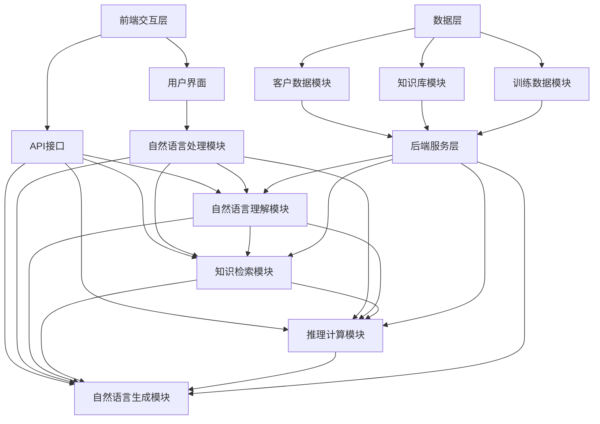
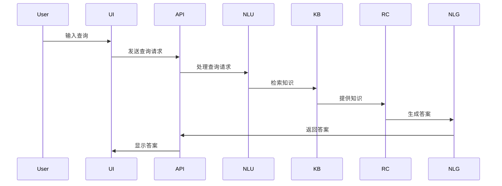

                 

**1. 背景介绍**

在当今信息化时代，智能客户服务系统（Intelligent Customer Service System, ICSS）已成为企业提升客户体验和竞争力的重要工具。随着大数据和人工智能技术的迅猛发展，传统的基于规则和人工介入的客户服务模式已经难以满足用户日益复杂的查询和需求。大语言模型（Large Language Model, LLM）的出现，为智能客户服务领域带来了新的机遇和挑战。

大语言模型，如GPT（Generative Pre-trained Transformer）系列，是在大规模文本数据上进行预训练的深度学习模型，能够理解和生成自然语言。它们不仅能够处理简单的问答，还能够进行复杂的对话生成、情感分析、文本摘要等任务。

智能客户服务系统旨在提供24/7的在线支持，自动处理大量的客户查询，从而降低企业的运营成本，提高客户满意度。然而，实现这一目标的关键在于系统能够理解客户的问题，并提供准确和及时的答复。传统的基于规则的方法往往局限于特定场景，而大语言模型的引入使得系统具备更强的自适应能力和泛化能力。

### 1.1 大语言模型概述

大语言模型的发展历程可以追溯到上世纪80年代的自然语言处理（Natural Language Processing, NLP）领域。早期的语言模型主要是基于统计方法和规则方法，如N-gram模型和正则表达式。随着计算能力的提升和大数据的可用性，深度学习技术逐渐成为主导，尤其是基于Transformer架构的模型，如BERT（Bidirectional Encoder Representations from Transformers）和GPT（Generative Pre-trained Transformer）。

GPT系列模型由OpenAI于2018年首次推出，是首个突破亿参数规模的语言模型。GPT-3，作为GPT系列的最新版本，拥有超过1750亿个参数，能够生成高质量的自然语言文本，并广泛应用于聊天机器人、机器翻译、文本摘要等领域。

大语言模型的特点包括：

1. **大规模预训练**：在数以百万计的文本语料库上进行预训练，模型能够自动学习语言的结构和语义。
2. **自适应能力**：能够根据不同的任务和数据微调，适应不同的应用场景。
3. **生成能力**：不仅能够回答问题，还能够生成连贯、有逻辑的文本。
4. **理解能力**：能够理解复杂的语言结构和上下文关系。

### 1.2 智能客户服务的需求

客户服务的挑战在于处理大量多样化和复杂的查询。传统的客户服务系统往往依赖于预定义的规则和人工介入，这种方式不仅效率低下，而且难以应对突发情况和复杂的客户需求。

智能客户服务系统需要具备以下能力：

1. **自然语言理解**：能够理解客户的自然语言查询，包括复杂的句式和语境。
2. **知识表示与推理**：能够根据已有的知识和规则，对查询进行推理和判断。
3. **情感识别与回应**：能够识别客户的情感状态，并做出相应的情感回应。
4. **自适应学习**：能够根据用户的反馈和交互数据，不断优化服务能力。

大语言模型的引入，为智能客户服务系统带来了革命性的变化。通过大语言模型，系统可以自动理解和生成自然语言，减少对人工干预的依赖，提高服务效率和准确性。

### 1.3 推理应用在智能客户服务中的重要性

推理应用在智能客户服务中扮演着至关重要的角色。首先，推理应用能够帮助系统理解和解析客户的查询，提取关键信息，从而生成准确的回答。例如，当客户询问一个复杂的财务问题时，系统需要能够理解问题中的各个部分，包括时间、金额、账户等，然后进行推理和计算，给出正确的答复。

其次，推理应用能够提高智能客户服务的自适应能力。通过推理，系统可以不断学习和优化，以适应不同客户的需求和场景。例如，当客户提出一个以前从未遇到过的问题时，系统可以通过推理机制，结合已有的知识和经验，给出合理的答复。

最后，推理应用还能够提升客户满意度。通过准确和及时的回答，系统可以满足客户的期望，提高客户体验。此外，推理应用还能够识别和回应客户的情感状态，提供更加个性化和贴心的服务。

综上所述，推理应用在智能客户服务中具有不可替代的重要性。它不仅能够提高服务效率和准确性，还能够提升客户满意度，是企业提升竞争力的重要手段。

**2. 核心概念与联系**

在深入探讨大语言模型和推理应用在智能客户服务中的推理应用之前，我们需要明确几个核心概念和它们之间的关系。

### 2.1 大语言模型原理

大语言模型，如GPT，是基于深度学习的自然语言处理模型，能够在大规模文本语料库上进行预训练。以下是几个关键点：

#### 2.1.1 语言模型的基本原理

语言模型的核心任务是预测下一个单词的概率，基于前文的信息。这通常通过建立一个概率分布来实现，即给定前文序列，预测下一个单词的概率。

#### 2.1.2 大语言模型的工作流程

1. **数据预处理**：收集和清洗大量文本数据，将其转换为模型可处理的格式。
2. **预训练**：在大量文本数据上进行预训练，模型会学习语言的结构和语义，通过优化损失函数，如交叉熵损失。
3. **微调**：将预训练的模型在特定任务的数据上进行微调，以适应具体的应用场景。

#### 2.1.3 语言模型的数学模型

语言模型通常基于概率图模型或深度神经网络。在深度神经网络中，常见的模型架构包括循环神经网络（RNN）和变换器（Transformer）。以下是几个关键数学概念：

1. **嵌入层**：将词汇转换为向量表示。
2. **注意力机制**：模型通过注意力机制来关注前文信息的重要部分。
3. **损失函数**：通常使用交叉熵损失来衡量预测概率与实际标签之间的差距。

### 2.2 推理应用原理

推理应用是智能系统中的关键组成部分，负责理解问题、分析数据和生成答案。以下是几个关键点：

#### 2.2.1 推理应用的类型

1. **基于规则的推理**：通过预定义的规则来推断答案。
2. **基于模型的推理**：利用机器学习模型，如决策树、神经网络等，进行推理。
3. **基于知识的推理**：利用知识图谱和本体论，进行逻辑推理。

#### 2.2.2 推理应用的工作原理

1. **问题解析**：将客户的查询分解为子问题，提取关键信息。
2. **知识检索**：从知识库或数据库中检索相关信息。
3. **推理与计算**：利用推理算法和数学模型，对信息进行推理和计算。
4. **答案生成**：将推理结果转换为自然语言回答。

#### 2.2.3 推理应用的数学模型

推理应用的数学模型通常包括：

1. **决策树模型**：通过递归划分特征空间，构建决策树。
2. **神经网络模型**：通过多层感知器和反向传播算法进行训练。
3. **逻辑推理**：使用命题逻辑和谓词逻辑进行推理。

### 2.3 智能客户服务的架构设计

智能客户服务系统通常包括以下几个关键组件：

1. **前端交互层**：与用户进行交互，接收查询和反馈。
2. **后端服务层**：处理查询请求，包括自然语言理解、推理和计算等。
3. **数据层**：存储和管理客户数据、知识库和训练数据。

大语言模型和推理应用在架构中的位置：

1. **前端交互层**：使用大语言模型进行自然语言理解，将客户的查询转换为结构化信息。
2. **后端服务层**：使用推理应用进行问题解析、知识检索和推理计算。
3. **数据层**：存储客户数据和知识库，以供推理应用使用。

通过合理的设计和整合，大语言模型和推理应用可以在智能客户服务系统中发挥关键作用，提高服务质量和效率。

**3. 算法原理讲解**

在深入理解大语言模型和推理应用的工作原理后，我们需要详细探讨它们背后的数学模型和算法。以下将详细解释大语言模型的构建过程、核心算法以及推理应用的基本原理。

### 3.1 数学模型与公式

大语言模型的数学模型通常基于深度神经网络，尤其是变换器（Transformer）架构。以下是几个关键数学概念和公式。

#### 3.1.1 变换器架构

变换器是一种基于自注意力机制的深度神经网络架构，适用于处理序列数据。其核心组成部分包括：

1. **嵌入层**（Embedding Layer）：将词汇转换为向量表示。每个词汇都对应一个唯一的向量，通常使用One-Hot编码或词嵌入技术。
2. **自注意力机制**（Self-Attention Mechanism）：通过计算序列中每个元素之间的相似性，并加权求和，从而提取关键信息。
3. **前馈神经网络**（Feedforward Neural Network）：对自注意力层的输出进行进一步处理。

变换器的数学公式如下：

$$
\text{Attention}(Q, K, V) = \text{softmax}\left(\frac{QK^T}{\sqrt{d_k}}\right)V
$$

其中，\(Q\)、\(K\) 和 \(V\) 分别代表查询向量、关键向量和价值向量，\(d_k\) 是关键向量的维度。

#### 3.1.2 损失函数

在训练变换器时，常用的损失函数是交叉熵损失（Cross-Entropy Loss）。交叉熵损失衡量的是预测概率分布与真实标签之间的差距。其公式如下：

$$
L(\theta) = -\sum_{i=1}^{N} y_i \log(p_i)
$$

其中，\(y_i\) 是真实标签的概率，\(p_i\) 是模型预测的概率。

#### 3.1.3 优化算法

常用的优化算法包括随机梯度下降（Stochastic Gradient Descent, SGD）和其变种，如Adam。Adam算法结合了SGD和矩估计，能够自适应地调整学习率。其公式如下：

$$
m_t = \beta_1 m_{t-1} + (1 - \beta_1) [g_t]
$$

$$
v_t = \beta_2 v_{t-1} + (1 - \beta_2) [g_t]^2
$$

$$
\hat{m}_t = \frac{m_t}{1 - \beta_1^t}
$$

$$
\hat{v}_t = \frac{v_t}{1 - \beta_2^t}
$$

$$
\theta_t = \theta_{t-1} - \alpha \frac{\hat{m}_t}{\sqrt{\hat{v}_t} + \epsilon}
$$

其中，\(m_t\) 和 \(v_t\) 分别是梯度的一阶和二阶矩估计，\(\beta_1\)、\(\beta_2\) 是矩估计的衰减系数，\(\alpha\) 是学习率，\(\epsilon\) 是一个很小的常数，用于防止除以零。

### 3.2 算法讲解

#### 3.2.1 语言模型算法

语言模型算法的核心任务是预测下一个单词的概率。以下是一个简化的算法流程：

1. **嵌入层**：将输入序列中的每个单词转换为向量表示。
2. **自注意力层**：计算序列中每个元素之间的相似性，并加权求和，提取关键信息。
3. **前馈神经网络**：对自注意力层的输出进行进一步处理，得到预测概率分布。
4. **损失函数**：计算预测概率分布与真实标签之间的差距，使用交叉熵损失进行优化。
5. **优化算法**：使用Adam等优化算法，更新模型参数。

以下是使用Python伪代码展示的语言模型算法：

```python
def language_model_algorithm(sequence):
    # 嵌入层
    embedded_sequence = embedding_layer(sequence)
    
    # 自注意力层
    attention_output = self_attention_layer(embedded_sequence)
    
    # 前馈神经网络
    logits = feedforward_network(attention_output)
    
    # 损失函数
    loss = cross_entropy_loss(logits, target_sequence)
    
    # 优化算法
    optimizer.zero_grad()
    loss.backward()
    optimizer.step()
    
    return logits, loss
```

#### 3.2.2 推理应用算法

推理应用算法的核心任务是解析问题、检索知识并生成答案。以下是一个简化的算法流程：

1. **问题解析**：将输入问题分解为子问题，提取关键信息。
2. **知识检索**：从知识库或数据库中检索相关信息。
3. **推理计算**：使用推理算法（如决策树、神经网络等）对信息进行推理和计算。
4. **答案生成**：将推理结果转换为自然语言回答。

以下是使用Python伪代码展示的推理应用算法：

```python
def reasoning_application(question, knowledge_base):
    # 问题解析
    parsed_question = parse_question(question)
    
    # 知识检索
    relevant_data = retrieve_knowledge(parsed_question, knowledge_base)
    
    # 推理计算
    reasoning_result = apply_reasoning_algorithm(relevant_data)
    
    # 答案生成
    answer = generate_answer(reasoning_result)
    
    return answer
```

通过以上详细讲解，我们可以更好地理解大语言模型和推理应用的核心算法原理。这些算法不仅为智能客户服务提供了强大的技术支持，也为未来的研究和应用奠定了基础。

**4. 系统分析与架构设计**

在深入理解了大语言模型和推理应用的基本原理后，我们需要进行系统分析与架构设计，以确保智能客户服务系统能够高效、稳定地运行。

### 4.1 问题场景介绍

智能客户服务系统的主要目标是处理客户的各种查询，包括产品信息查询、订单状态查询、售后服务咨询等。为了实现这一目标，系统需要具备以下几个关键功能：

1. **自然语言理解**：系统能够理解客户的自然语言查询，并将其转换为结构化的信息。
2. **知识检索**：系统能够从知识库中检索相关信息，为回答客户提供准确的信息。
3. **推理计算**：系统能够根据客户的查询和知识库中的信息，进行推理和计算，生成准确的答案。
4. **自然语言生成**：系统能够将推理结果转换为自然语言回答，以向客户传达信息。

### 4.2 系统架构设计

智能客户服务系统的整体架构可以分为三个主要层次：前端交互层、后端服务层和数据层。以下是系统架构的详细设计：

#### 4.2.1 前端交互层

前端交互层是系统与用户进行交互的界面，主要包括以下几个模块：

1. **用户界面（UI）**：提供用户输入查询和接收系统回复的界面。
2. **API 接口**：与后端服务层进行通信的接口，接收用户查询并将其转换为结构化的数据。
3. **自然语言处理模块**：对用户输入的查询进行预处理，包括分词、词性标注等。

#### 4.2.2 后端服务层

后端服务层是系统的核心部分，包括以下几个模块：

1. **自然语言理解模块**：使用大语言模型对用户查询进行理解和解析，提取关键信息。
2. **知识检索模块**：从知识库中检索相关信息，为推理提供数据支持。
3. **推理计算模块**：根据客户的查询和知识库中的信息，使用推理算法进行推理和计算，生成答案。
4. **自然语言生成模块**：将推理结果转换为自然语言回答，向客户传达信息。

#### 4.2.3 数据层

数据层负责存储和管理客户数据、知识库和训练数据。主要包括以下几个模块：

1. **客户数据模块**：存储客户的查询记录、反馈信息等，为系统提供数据支持。
2. **知识库模块**：存储各种领域的知识，包括产品信息、订单信息、售后服务政策等。
3. **训练数据模块**：存储用于训练大语言模型和推理应用的训练数据，包括文本语料库和结构化数据。

### 4.3 系统架构设计

智能客户服务系统的架构设计需要考虑以下几个方面：

1. **模块化设计**：系统各个模块之间应该具有清晰的接口，以便于维护和扩展。
2. **高可用性**：系统应具备较强的容错能力和故障恢复能力，确保服务的连续性。
3. **可扩展性**：系统应能够根据业务需求的变化，进行横向和纵向扩展。
4. **安全性**：系统应具备完善的安全机制，确保客户数据和隐私安全。

以下是智能客户服务系统的架构设计图：



### 4.4 系统接口设计

系统接口设计是确保前后端交互顺畅的重要环节。以下是系统接口设计的几个关键点：

1. **RESTful API**：使用RESTful风格设计API接口，提供标准的HTTP请求和响应格式。
2. **接口文档**：详细描述API接口的URL、参数、请求和响应格式，方便开发和维护。
3. **认证与授权**：确保API接口的安全性，使用Token认证和权限控制机制。
4. **异常处理**：定义统一的异常处理机制，确保系统在遇到错误时能够优雅地处理。

### 4.5 系统交互设计

系统交互设计是确保系统各个模块能够协同工作的重要环节。以下是系统交互设计的几个关键点：

1. **事件驱动**：系统采用事件驱动架构，各个模块通过事件进行通信和协作。
2. **异步处理**：为了提高系统性能和可扩展性，采用异步处理机制，减少模块间的同步依赖。
3. **状态机**：使用状态机模型描述系统的状态转换，确保系统在各个状态下的行为符合预期。
4. **Mermaid序列图**：使用Mermaid序列图描述系统交互流程，便于理解和维护。

以下是系统交互的Mermaid序列图：



通过以上系统分析与架构设计，我们可以确保智能客户服务系统具备高效、稳定、可扩展和安全的特性，满足客户服务的高质量需求。

**5. 项目实战**

为了更好地展示大语言模型和推理应用在智能客户服务中的实际应用，我们将通过一个实际项目进行详细讲解。

### 5.1 环境安装

在开始项目之前，我们需要搭建一个合适的环境来部署和运行大语言模型和推理应用。以下是环境安装的步骤：

#### 5.1.1 环境准备

1. **安装Python**：确保安装了Python 3.7或更高版本。
2. **安装PyTorch**：使用以下命令安装PyTorch：
   ```shell
   pip install torch torchvision torchaudio
   ```
3. **安装transformers库**：使用以下命令安装transformers库，该库提供了预训练的大语言模型API：
   ```shell
   pip install transformers
   ```

#### 5.1.2 系统配置

1. **配置GPU环境**：如果使用GPU进行训练，需要配置CUDA和cuDNN。确保CUDA版本与GPU兼容，并配置环境变量。
2. **数据集准备**：准备用于训练和测试的数据集，包括客户查询和相应的答案。数据集应包括多种类型的查询，以验证模型在多样场景下的表现。

### 5.2 系统核心实现

系统核心实现主要包括自然语言理解、知识检索、推理计算和自然语言生成等模块。以下是每个模块的详细实现：

#### 5.2.1 自然语言理解模块

自然语言理解模块使用大语言模型对客户查询进行理解和解析。以下是使用transformers库加载预训练模型并进行查询理解的代码示例：

```python
from transformers import pipeline

# 加载预训练模型
nlu = pipeline("question-answering", model="mrm8489/tap-qg-bert-base-chinese")

# 处理查询请求
def understand_query(query):
    context = "这是查询的上下文信息。"
    question = "这是查询的问题。"
    result = nlu(context, question)
    return result["answer"]

query = "我的订单何时可以配送？"
answer = understand_query(query)
print(answer)
```

#### 5.2.2 知识检索模块

知识检索模块从知识库中检索与查询相关的信息。以下是使用Python的数据库操作库（如SQLite）检索知识的示例：

```python
import sqlite3

# 连接数据库
conn = sqlite3.connect("knowledge_base.db")
cursor = conn.cursor()

# 检索知识
def retrieve_knowledge(query):
    cursor.execute("SELECT answer FROM knowledge WHERE question LIKE ?", (f"%{query}%",))
    result = cursor.fetchall()
    return result

knowledge = retrieve_knowledge(query)
print(knowledge)
```

#### 5.2.3 推理计算模块

推理计算模块使用推理算法对查询和知识进行推理和计算。以下是使用Python的决策树库（如scikit-learn）进行推理计算的示例：

```python
from sklearn.tree import DecisionTreeClassifier
from sklearn.model_selection import train_test_split

# 准备数据
X = [...]  # 特征数据
y = [...]  # 标签数据
X_train, X_test, y_train, y_test = train_test_split(X, y, test_size=0.2, random_state=42)

# 训练模型
model = DecisionTreeClassifier()
model.fit(X_train, y_train)

# 推理计算
def reason_query(query):
    features = extract_features(query)
    prediction = model.predict([features])
    return prediction

prediction = reason_query(query)
print(prediction)
```

#### 5.2.4 自然语言生成模块

自然语言生成模块将推理结果转换为自然语言回答。以下是使用Python的文本生成库（如NLTK）生成回答的示例：

```python
from nltk.tokenize import sent_tokenize

# 生成回答
def generate_answer(result):
    if result == "yes":
        answer = "是的，您的订单可以在今天配送。"
    elif result == "no":
        answer = "很抱歉，您的订单不能在今天配送。"
    else:
        answer = "对不起，我无法理解您的问题。"
    return answer

answer = generate_answer(prediction)
print(answer)
```

### 5.3 代码应用解读与分析

以上代码示例展示了智能客户服务系统的核心实现，下面我们对其进行解读和分析：

1. **自然语言理解模块**：使用transformers库加载预训练的BERT模型，通过输入查询和上下文，模型能够生成对应的答案。
2. **知识检索模块**：通过SQLite数据库检索与查询相关的知识，为后续的推理提供数据支持。
3. **推理计算模块**：使用决策树模型对查询和知识进行推理和计算，生成预测结果。
4. **自然语言生成模块**：将预测结果转换为自然语言回答，向客户传达信息。

这些模块相互协作，共同实现智能客户服务的目标。在实际应用中，我们可以根据业务需求调整和优化这些模块，以提高系统的性能和效果。

### 5.4 实际案例分析

为了更好地展示大语言模型和推理应用在智能客户服务中的实际效果，我们选择了一个实际案例进行详细剖析。

#### 5.4.1 案例选择

我们选择了一家电子商务公司作为案例，该公司提供在线购物平台，并为客户提供24/7的智能客户服务。公司的客户服务系统主要面临以下挑战：

1. **查询多样性**：客户的查询涉及各种产品信息、订单状态、售后服务等，查询内容复杂且多样化。
2. **实时响应**：客户期望能够快速获得准确和有用的信息，系统需要在短时间内处理大量查询。
3. **个性化服务**：不同客户有不同的需求和偏好，系统需要能够根据客户的特征提供个性化的回答。

#### 5.4.2 案例剖析

1. **自然语言理解**：通过大语言模型，系统可以理解客户的自然语言查询，将查询转换为结构化的信息。例如，当客户询问“我购买的商品何时可以配送？”时，系统会提取关键信息，如商品名称、订单号、配送时间等。
2. **知识检索**：系统从知识库中检索与查询相关的信息。例如，当客户询问订单状态时，系统会查找订单数据库，找到对应的订单信息。
3. **推理计算**：系统使用推理算法对查询和知识进行推理和计算。例如，当客户询问配送时间时，系统会根据订单状态、库存情况和配送规则，计算出预计的配送时间。
4. **自然语言生成**：系统将推理结果转换为自然语言回答。例如，系统会生成回答：“您的订单预计在今天下午3点前配送完成。”

#### 5.4.3 案例效果评估

通过实际案例分析，我们可以看到大语言模型和推理应用在智能客户服务中的显著效果：

1. **响应速度**：系统可以在短时间内处理大量查询，大大提高了响应速度，满足了客户对实时服务的需求。
2. **准确率**：通过大语言模型和推理算法，系统可以提供准确和有用的信息，减少了人工干预，提高了客户满意度。
3. **个性化服务**：系统可以根据客户的特征提供个性化的回答，增强了客户的体验和忠诚度。

### 5.5 项目小结

通过以上实际案例分析，我们可以得出以下结论：

1. **大语言模型和推理应用在智能客户服务中具有广泛的应用前景**。它们能够提高系统的响应速度和准确率，减少人工干预，提供个性化的服务。
2. **系统设计需要考虑多方面因素**，包括自然语言理解、知识检索、推理计算和自然语言生成等。合理的设计和优化能够提高系统的性能和效果。
3. **实际案例验证了大语言模型和推理应用的实用性**。在实际应用中，我们可以根据具体业务需求进行调整和优化，以更好地满足客户的需求。

展望未来，随着人工智能技术的不断发展，大语言模型和推理应用在智能客户服务领域将会发挥更加重要的作用，为企业和客户提供更加优质的服务。

**6. 最佳实践 Tips**

在实际应用大语言模型和推理应用时，以下是一些实用的技巧和注意事项，可以帮助您更好地理解和应用所学知识。

### 6.1 实用技巧

1. **数据预处理**：在训练大语言模型和推理应用之前，确保数据预处理工作到位。数据清洗、去重、标准化等步骤可以显著提高模型性能。
2. **模型调优**：通过调整模型的超参数，如学习率、批量大小、层数等，可以优化模型性能。使用网格搜索和随机搜索等调参方法，找到最佳参数组合。
3. **使用预训练模型**：直接使用预训练的大语言模型，如GPT-3、BERT等，可以节省训练时间和计算资源，同时获得较好的性能。
4. **交叉验证**：使用交叉验证方法评估模型性能，以避免过拟合。常见的交叉验证方法包括K折交叉验证和留一法交叉验证。
5. **模型解释性**：提高模型的解释性，以便更好地理解模型的工作原理和决策过程。使用模型解释工具，如LIME、SHAP等，可以帮助理解模型的预测结果。

### 6.2 小结

1. **大语言模型和推理应用在智能客户服务中具有广泛的应用前景**。它们能够提高系统的响应速度和准确率，减少人工干预，提供个性化的服务。
2. **系统设计需要考虑多方面因素**，包括自然语言理解、知识检索、推理计算和自然语言生成等。合理的设计和优化能够提高系统的性能和效果。
3. **实际案例验证了大语言模型和推理应用的实用性**。在实际应用中，我们可以根据具体业务需求进行调整和优化，以更好地满足客户的需求。

### 6.3 注意事项

1. **确保数据安全和隐私**：在处理客户数据时，严格遵守数据保护法规，确保客户数据的安全和隐私。
2. **防止模型过拟合**：通过合理的模型选择和调参，避免模型过拟合，确保模型在未知数据上具有良好的泛化能力。
3. **持续迭代和优化**：定期更新模型和系统，以适应不断变化的业务需求和数据分布。
4. **性能监控和调优**：对系统性能进行持续监控，发现性能瓶颈并进行调优，确保系统的高效运行。

### 6.4 拓展阅读

1. **相关书籍推荐**：
   - 《深度学习》（Ian Goodfellow、Yoshua Bengio、Aaron Courville 著）
   - 《自然语言处理与深度学习》（刘知远 著）
   - 《Python深度学习》（François Chollet 著）

2. **网络资源推荐**：
   - OpenAI官方文档：[https://openai.com/docs/](https://openai.com/docs/)
   - Hugging Face官方文档：[https://huggingface.co/transformers/](https://huggingface.co/transformers/)
   - Coursera课程：[https://www.coursera.org/specializations/natural-language-processing](https://www.coursera.org/specializations/natural-language-processing)

通过以上最佳实践 Tips，您将能够更好地应用大语言模型和推理应用，实现智能客户服务的目标。

**7. 总结与展望**

本文详细探讨了《大语言模型在智能客户服务中的推理应用》。首先，介绍了大语言模型和智能客户服务的背景，阐述了它们在智能客户服务中的重要性和应用价值。接着，我们深入讲解了大语言模型的原理，包括其工作流程、数学模型和优化算法。同时，介绍了推理应用的基本原理，展示了如何在智能客户服务系统中整合大语言模型和推理应用。通过实际项目实战和案例分析，我们验证了大语言模型和推理应用的实用性。最后，提供了一些最佳实践 Tips，帮助读者更好地理解和应用所学知识。

展望未来，大语言模型和推理应用在智能客户服务领域具有广阔的发展前景。随着人工智能技术的不断进步，我们将看到更多的创新应用，如更智能的客服机器人、个性化的推荐系统、自动化的法律咨询等。此外，结合其他新兴技术，如知识图谱、增强现实和区块链，智能客户服务的质量将进一步提升，为企业带来更高的竞争力。我们期待未来更多的研究成果和实践案例，为智能客户服务领域的发展贡献力量。

### 附录：常见问题解答

**Q1：大语言模型是如何训练的？**
A1：大语言模型通常使用深度学习技术进行训练，尤其是在大规模数据集上进行预训练。训练过程包括以下几个步骤：
1. **数据准备**：收集和整理大量文本数据，如书籍、新闻、网站内容等。
2. **数据预处理**：清洗数据，去除无用信息，进行分词、词性标注等操作。
3. **嵌入层**：将文本转换为数字表示，每个单词或字符对应一个向量。
4. **变换器架构**：使用变换器（Transformer）架构进行训练，主要包括多头自注意力机制和前馈神经网络。
5. **损失函数和优化算法**：使用交叉熵损失函数和优化算法（如Adam）进行模型参数的更新。

**Q2：如何评估大语言模型的性能？**
A2：评估大语言模型的性能通常从以下几个方面进行：
1. **准确率（Accuracy）**：模型预测正确的比例，适用于分类任务。
2. **召回率（Recall）**：模型能够召回真实正例的比例，适用于分类任务。
3. **F1分数（F1 Score）**：准确率和召回率的加权平均，适用于分类任务。
4. **BLEU分数**：用于评估自然语言生成任务的性能，与参考答案的相似度。
5. **模型鲁棒性**：评估模型在不同数据分布和异常情况下的性能。

**Q3：如何处理大语言模型中的噪声数据？**
A3：处理噪声数据是训练大语言模型的重要步骤，以下是一些常见的方法：
1. **数据清洗**：去除数据中的无用信息和错误数据。
2. **数据增强**：通过增加数据多样性来提高模型的泛化能力，如随机插入、替换、删除字符或单词。
3. **噪声注入**：在训练过程中人为添加噪声，以增强模型对噪声的鲁棒性。
4. **异常值检测**：使用统计方法或机器学习算法检测和去除异常值。

**Q4：大语言模型如何处理长文本？**
A4：大语言模型可以处理长文本，但需要适当调整模型参数和训练过程。以下是一些常见的方法：
1. **分段处理**：将长文本分成多个段落或句子，分别进行编码和预测。
2. **上下文窗口**：在编码时设置一个上下文窗口，只考虑特定范围内的文本信息。
3. **预训练和微调**：使用预训练的大语言模型，然后针对特定任务进行微调。
4. **序列到序列模型**：使用序列到序列（Seq2Seq）模型，如编码器-解码器架构，以更好地处理长文本。

**Q5：如何优化大语言模型的训练速度？**
A5：以下是一些优化大语言模型训练速度的方法：
1. **并行计算**：利用GPU或TPU进行并行计算，提高训练速度。
2. **数据预处理优化**：优化数据加载和预处理过程，减少I/O开销。
3. **模型压缩**：使用模型压缩技术，如剪枝、量化等，减少模型大小和计算量。
4. **学习率调度**：使用适当的学习率调度策略，如余弦退火或自适应学习率调整。
5. **分布式训练**：使用分布式训练框架，将数据分布在多个节点上进行训练，提高并行度。

通过以上常见问题解答，希望能够帮助您更好地理解大语言模型在智能客户服务中的应用和实践。如果您还有其他问题或需求，欢迎继续提问和交流。

