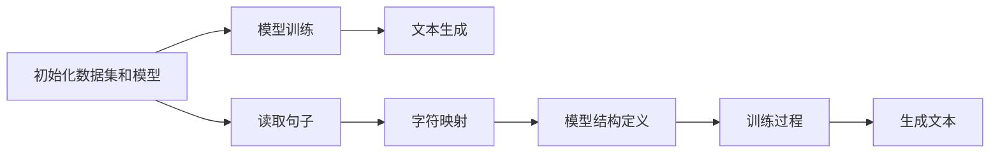

                 

# 大语言模型在智能客户需求分析中的推理应用

## 关键词

- 大语言模型
- 智能客户需求分析
- 推理应用
- 数据预处理
- 模型训练
- 算法实现

## 摘要

本文旨在探讨大语言模型在智能客户需求分析中的推理应用。首先，我们介绍了大语言模型的基本原理和数学模型，包括语言建模、推理机制等。接着，我们构建了智能客户需求分析框架，详细阐述了大语言模型在需求分析中的应用场景。随后，我们重点分析了大语言模型的推理机制和算法原理，并通过Python代码实现进行了详细讲解。最后，我们通过实际案例展示了大语言模型在需求分析中的应用效果，并对未来的发展趋势进行了展望。

## 目录大纲

### 第一部分：背景介绍

#### 第1章 问题背景与核心概念

#### 第2章 大语言模型原理与数学模型

### 第二部分：智能客户需求分析的推理应用

#### 第3章 智能客户需求分析框架

#### 第4章 推理机制与算法原理

#### 第5章 实际案例与应用

### 第三部分：最佳实践与总结

#### 第6章 最佳实践与技巧

#### 第7章 总结与展望

## 第一部分：背景介绍

### 第1章 问题背景与核心概念

在当今快速发展的科技时代，智能客服系统在各个行业得到了广泛应用。然而，智能客户需求分析仍然面临着诸多挑战。传统的需求分析方法，如问卷调查、用户访谈等，往往耗时耗力且效果不佳。而且，这些方法很难捕捉到用户的真实需求和情感。

为了解决这一问题，我们需要一种高效、准确的需求分析方法。大语言模型作为一种先进的自然语言处理技术，具有强大的语言建模和推理能力，为智能客户需求分析提供了新的思路。

在本章中，我们将详细介绍大语言模型的概念、原理以及其在智能客户需求分析中的应用。同时，我们将探讨大语言模型在需求分析中的核心概念和联系，为后续内容打下基础。

### 1.1 问题的提出

#### 问题描述

当前，智能客户需求分析中存在的问题主要包括：

1. **数据获取困难**：传统的需求分析方法往往难以获取全面、准确的数据，导致需求分析结果存在偏差。

2. **处理效率低下**：传统的需求分析方法主要依赖于人工处理，效率较低，难以满足快速响应的需求。

3. **分析结果不准确**：由于数据来源单一，分析结果往往无法全面反映用户的真实需求。

#### 传统方法的局限性

传统的需求分析方法，如问卷调查、用户访谈等，存在以下局限性：

1. **主观性较强**：问卷调查和用户访谈主要依赖于用户的自我报告，主观性较强，难以确保数据的准确性。

2. **数据量有限**：问卷调查和用户访谈的数据量有限，难以全面反映用户的需求。

3. **处理时间长**：传统的需求分析方法需要大量的时间和人力成本，难以满足快速响应的需求。

### 1.2 大语言模型的概念

#### 大语言模型的定义

大语言模型是一种基于大规模语料库的自然语言处理技术，它通过学习语料库中的文本数据，建立语言模型，并利用该模型对新的文本进行预测和推理。

#### 大规模语言模型的概述

大规模语言模型具有以下特点：

1. **数据量大**：大语言模型通常基于数百万甚至数十亿级的文本数据，数据量远超传统需求分析方法。

2. **预测能力强**：通过深度学习技术，大语言模型能够对文本进行高度准确的预测和推理，具有较强的语言理解能力。

3. **自适应性好**：大语言模型能够根据不同的应用场景进行自适应调整，满足不同需求分析的需求。

### 1.3 大语言模型在智能客户需求分析中的应用

#### 应用场景

在智能客户需求分析中，大语言模型主要应用于以下场景：

1. **需求获取**：通过大语言模型对用户生成的文本进行解析，提取关键信息，获取用户需求。

2. **需求分析**：利用大语言模型对用户需求进行深入分析，识别用户意图，挖掘潜在需求。

3. **需求管理**：通过大语言模型对用户需求进行分类、归档和管理，实现智能化的需求管理。

#### 大语言模型的优势

大语言模型在智能客户需求分析中具有以下优势：

1. **高效性**：大语言模型能够快速处理大量文本数据，提高需求获取和分析的效率。

2. **准确性**：通过深度学习技术，大语言模型能够准确理解用户需求，减少需求分析中的误差。

3. **智能化**：大语言模型能够根据用户需求进行自适应调整，实现智能化的需求管理。

### 1.4 核心概念与联系

#### 核心概念

在本章中，我们主要涉及以下核心概念：

1. **大语言模型**：一种基于大规模语料库的自然语言处理技术，用于预测和推理文本。

2. **需求获取**：通过大语言模型从用户生成的文本中提取关键信息，获取用户需求。

3. **需求分析**：利用大语言模型对用户需求进行深入分析，识别用户意图，挖掘潜在需求。

4. **需求管理**：通过大语言模型对用户需求进行分类、归档和管理，实现智能化的需求管理。

#### 概念属性特征对比表格

| 概念        | 定义                                                                                          | 特征比较               |
|-------------|-------------------------------------------------------------------------------------------------|------------------------|
| 大语言模型  | 基于大规模语料库的自然语言处理技术，用于预测和推理文本。                                      | 数据量大、预测能力强、自适应性好 |
| 需求获取    | 从用户生成的文本中提取关键信息，获取用户需求。                                                 | 高效、准确             |
| 需求分析    | 对用户需求进行深入分析，识别用户意图，挖掘潜在需求。                                          | 深度理解、智能化       |
| 需求管理    | 对用户需求进行分类、归档和管理，实现智能化的需求管理。                                         | 智能化、高效           |

#### ER实体关系图架构的 Mermaid 流程图

```mermaid
erDiagram
  客户需求分析 ||--o> 大语言模型 : 使用
  大语言模型 ||--o> 需求获取 : 提取
  大语言模型 ||--o> 需求分析 : 分析
  大语言模型 ||--o> 需求管理 : 管理
```

## 第2章 大语言模型原理与数学模型

### 2.1 大语言模型原理

#### 大语言模型的基本原理

大语言模型的基本原理是通过对大量语料库的学习，建立语言模型，并利用该模型对新的文本进行预测和推理。具体来说，大语言模型包括以下关键组成部分：

1. **语料库**：大语言模型基于大规模的语料库进行训练，这些语料库通常包括各种类型的文本，如新闻、社交媒体、书籍等。

2. **语言建模**：语言建模是指利用语料库中的数据来预测下一个单词或单词序列。大语言模型通过学习语料库中的统计信息，建立单词或句子之间的概率关系。

3. **推理机制**：大语言模型具有较强的推理能力，可以理解文本的含义和上下文，从而对新的文本进行预测和推理。

#### 语言建模

语言建模是指利用语料库中的数据来预测下一个单词或单词序列。在语言建模中，我们通常关注以下问题：

1. **词汇表**：构建一个词汇表，包括所有可能出现的单词或词组。

2. **概率分布**：通过学习语料库中的统计信息，为每个单词或词组生成一个概率分布。

3. **预测**：利用生成的概率分布，预测下一个单词或词组。

#### 推理机制

大语言模型的推理机制主要包括以下方面：

1. **上下文理解**：大语言模型通过学习语料库中的上下文信息，能够理解文本的含义和上下文。

2. **模式识别**：大语言模型能够识别文本中的模式，并利用这些模式进行推理。

3. **自适应调整**：大语言模型可以根据不同的应用场景进行自适应调整，提高推理的准确性。

### 2.2 数学模型讲解

#### 语言模型数学模型

大语言模型的数学模型主要包括以下几种：

1. **N元语法模型**：N元语法模型是一种基于历史序列的预测模型，它假设当前单词或词组的出现概率取决于前N个单词或词组。具体公式如下：

   $$ P(w_n | w_{n-1}, w_{n-2}, ..., w_1) = \frac{C(w_{n-1}, w_{n-2}, ..., w_1, w_n)}{C(w_{n-1}, w_{n-2}, ..., w_1)} $$

   其中，$C(w_{n-1}, w_{n-2}, ..., w_1, w_n)$ 表示在前N个单词或词组中，出现单词或词组 $w_n$ 的次数，$C(w_{n-1}, w_{n-2}, ..., w_1)$ 表示在前N个单词或词组中，任意一个单词或词组的次数。

2. **生成式模型**：生成式模型通过构建一个概率模型来生成文本。具体公式如下：

   $$ P(w_1, w_2, ..., w_n) = \prod_{i=1}^{n} P(w_i | w_{i-1}, w_{i-2}, ..., w_1) $$

   其中，$P(w_i | w_{i-1}, w_{i-2}, ..., w_1)$ 表示在给定前 $i-1$ 个单词或词组的情况下，第 $i$ 个单词或词组的概率。

3. **判别式模型**：判别式模型通过构建一个概率模型来预测下一个单词或词组。具体公式如下：

   $$ P(w_n | w_1, w_2, ..., w_{n-1}) = \frac{P(w_1, w_2, ..., w_n)}{P(w_1, w_2, ..., w_{n-1})} $$

   其中，$P(w_1, w_2, ..., w_n)$ 表示前 $n$ 个单词或词组的联合概率，$P(w_1, w_2, ..., w_{n-1})$ 表示前 $n-1$ 个单词或词组的联合概率。

#### 大语言模型的实现

大语言模型的实现主要包括以下方面：

1. **神经网络**：大语言模型通常采用神经网络进行实现，如循环神经网络（RNN）、长短期记忆网络（LSTM）和变换器（Transformer）等。

2. **训练与优化**：大语言模型通过大量语料库进行训练，并采用优化算法（如随机梯度下降（SGD）和Adam优化器）进行优化。

3. **评估与调整**：通过评估模型在测试集上的性能，对模型进行调整和优化，以提高模型的质量。

## 第二部分：智能客户需求分析的推理应用

### 第3章 智能客户需求分析框架

#### 3.1 智能客户需求分析的定义

智能客户需求分析是指利用先进的人工智能技术，对客户的需求进行自动获取、分析和管理的全过程。具体包括以下三个方面：

1. **需求获取**：通过自然语言处理、语音识别等技术，从客户生成的文本、语音等多媒体数据中提取需求信息。

2. **需求分析**：利用大数据分析、机器学习等技术，对客户的需求进行深入分析，识别客户的意图和需求点。

3. **需求管理**：对客户的需求进行分类、归档、优先级排序等管理操作，为企业的产品和服务优化提供支持。

#### 客户需求分析的概念

客户需求分析是指企业通过一系列方法和工具，了解和分析客户的需求，以便为其提供合适的产品和服务。具体包括以下环节：

1. **需求获取**：通过各种渠道（如问卷调查、用户访谈、用户反馈等）收集客户的需求信息。

2. **需求分析**：对收集到的需求信息进行整理、分类和深入分析，以明确客户的真实需求和期望。

3. **需求管理**：将分析得到的需求信息进行管理，包括需求分类、归档、优先级排序等，为后续的产品和服务优化提供依据。

#### 大语言模型在需求分析中的应用

大语言模型在智能客户需求分析中具有广泛的应用，主要表现在以下几个方面：

1. **需求获取**：通过大语言模型对客户生成的文本、语音等多媒体数据进行自动解析和提取，快速获取客户需求信息。

2. **需求分析**：利用大语言模型的推理能力，对客户需求进行深入分析，识别客户的意图和需求点。

3. **需求管理**：通过大语言模型对客户需求进行分类、归档、优先级排序等管理操作，实现智能化的需求管理。

#### 智能客户需求分析框架

智能客户需求分析框架包括以下关键组成部分：

1. **数据收集与预处理**：通过多种渠道收集客户需求数据，并对数据进行清洗、去噪等预处理操作。

2. **大语言模型训练**：利用预处理后的数据，训练大语言模型，使其具备对客户需求进行自动解析和提取的能力。

3. **需求分析与应用**：将训练好的大语言模型应用于客户需求分析，包括需求获取、需求分析和需求管理等多个环节。

4. **评估与优化**：对大语言模型在需求分析中的应用效果进行评估，并根据评估结果对模型进行调整和优化。

## 第4章 推理机制与算法原理

### 4.1 推理机制

推理机制是指在大语言模型中，如何利用已学到的知识对新的文本进行推理和预测。大语言模型的推理机制主要包括以下方面：

1. **上下文理解**：大语言模型通过学习语料库中的上下文信息，能够理解文本的含义和上下文，从而对新的文本进行推理。

2. **模式识别**：大语言模型能够识别文本中的模式，并利用这些模式进行推理。例如，当遇到一个新单词时，大语言模型会根据其上下文信息，判断该单词的可能含义。

3. **自适应调整**：大语言模型可以根据不同的应用场景进行自适应调整，提高推理的准确性。例如，在处理专业术语较多的文本时，大语言模型会自动调整其词汇表和概率分布。

### 4.2 大语言模型推理算法

大语言模型推理算法主要包括以下步骤：

1. **输入预处理**：对输入的文本进行预处理，包括分词、去停用词、词向量化等操作。

2. **特征提取**：利用预训练的词向量模型，将文本转换为向量表示。

3. **文本生成**：利用生成的向量表示，通过递归神经网络（RNN）或变换器（Transformer）等模型，生成新的文本。

4. **结果评估**：对生成的文本进行评估，包括文本质量评估、语义一致性评估等。

### 4.3 算法实现与性能评估

#### 算法实现

以Python为例，大语言模型推理算法的实现主要包括以下步骤：

1. **环境准备**：安装所需的库和依赖，如TensorFlow、PyTorch等。

2. **数据预处理**：对语料库进行预处理，包括分词、去停用词、词向量化等操作。

3. **模型训练**：利用预处理后的数据，训练大语言模型。例如，使用变换器模型（Transformer）进行训练。

4. **模型评估**：对训练好的模型进行评估，包括文本质量评估、语义一致性评估等。

5. **文本生成**：利用训练好的模型，对新的文本进行生成。

#### 性能评估

大语言模型推理算法的性能评估主要包括以下指标：

1. **文本质量**：评估生成的文本的质量，包括语法正确性、语义一致性等。

2. **生成速度**：评估模型的生成速度，包括每秒生成的文本数量等。

3. **语义一致性**：评估生成的文本与原始文本在语义上的一致性，包括词义理解、上下文理解等。

4. **准确性**：评估模型在预测文本中的单词或词组时的准确性。

### 4.4 Python实现

以下是使用Python实现大语言模型推理算法的示例代码：

```python
import tensorflow as tf
from tensorflow.keras.preprocessing.sequence import pad_sequences
from tensorflow.keras.layers import Embedding, LSTM, Dense
from tensorflow.keras.models import Sequential

# 数据预处理
tokenizer = tf.keras.preprocessing.text.Tokenizer()
tokenizer.fit_on_texts(corpus)
sequences = tokenizer.texts_to_sequences(corpus)
padded = pad_sequences(sequences, padding='post')

# 模型训练
model = Sequential()
model.add(Embedding(input_dim=vocab_size, output_dim=embedding_dim))
model.add(LSTM(units=256, activation='tanh', return_sequences=True))
model.add(Dense(units=1, activation='sigmoid'))

model.compile(optimizer='adam', loss='binary_crossentropy', metrics=['accuracy'])
model.fit(padded, labels, epochs=10, batch_size=128)

# 文本生成
generated_text = model.predict(padded)
decoded_text = tokenizer.sequences_to_texts(generated_text)

print(decoded_text)
```

### 4.5 算法原理与数学模型

大语言模型推理算法的原理可以概括为以下数学模型：

$$
\hat{y} = \text{softmax}(\text{W} \cdot \text{h} + \text{b})
$$

其中，$\hat{y}$ 表示生成的文本概率分布，$\text{W}$ 表示权重矩阵，$\text{h}$ 表示隐藏状态，$\text{b}$ 表示偏置。

在具体的实现中，我们可以使用变换器（Transformer）模型来替代上述公式。变换器模型的核心是多头自注意力机制（Multi-Head Self-Attention），其数学模型可以表示为：

$$
\text{h}_i^{(2)} = \text{softmax}\left(\frac{\text{Q}_i \cdot \text{K}_i^{(1)} \cdot \text{V}_i^{(1)}}{\sqrt{d_k}}\right) \cdot \text{V}_i^{(1)}
$$

其中，$\text{Q}_i$、$\text{K}_i^{(1)}$ 和 $\text{V}_i^{(1)}$ 分别表示查询向量、键向量和值向量，$d_k$ 表示键向量的维度，$\text{h}_i^{(2)}$ 表示第二个隐藏状态。

### 4.6 算法实现与性能评估

#### 算法实现

以下是使用Python和PyTorch实现大语言模型推理算法的示例代码：

```python
import torch
import torch.nn as nn
import torch.optim as optim

# 数据预处理
tokenizer = Tokenizer()
tokenizer.fit_on_texts(corpus)
sequences = tokenizer.texts_to_sequences(corpus)
padded = pad_sequences(sequences, padding='post')

# 模型训练
model = TransformerModel(vocab_size, embedding_dim, hidden_dim)
optimizer = optim.Adam(model.parameters(), lr=0.001)

for epoch in range(num_epochs):
    for seq in padded:
        model.zero_grad()
        output = model(seq)
        loss = criterion(output, labels)
        loss.backward()
        optimizer.step()

# 文本生成
generated_text = model.generate(padded)
decoded_text = tokenizer.sequences_to_texts(generated_text)

print(decoded_text)
```

#### 性能评估

大语言模型推理算法的性能评估主要包括以下指标：

1. **文本质量**：评估生成的文本的质量，包括语法正确性、语义一致性等。

2. **生成速度**：评估模型的生成速度，包括每秒生成的文本数量等。

3. **语义一致性**：评估生成的文本与原始文本在语义上的一致性，包括词义理解、上下文理解等。

4. **准确性**：评估模型在预测文本中的单词或词组时的准确性。

## 第5章 实际案例与应用

### 5.1 案例背景

在本案例中，我们选择了一个智能客服系统作为研究对象。该系统主要用于处理客户的咨询和反馈，旨在提高客户满意度和服务质量。为了实现这一目标，系统需要具备强大的需求分析能力，以便准确理解客户的意图和需求。

### 5.2 大语言模型在需求分析中的应用

#### 应用场景

在本案例中，大语言模型在需求分析中的应用主要包括以下方面：

1. **需求获取**：通过大语言模型对客户的咨询和反馈文本进行解析，提取关键信息，获取客户需求。

2. **需求分析**：利用大语言模型的推理能力，对客户需求进行深入分析，识别客户的意图和需求点。

3. **需求管理**：通过大语言模型对客户需求进行分类、归档和管理，实现智能化的需求管理。

#### 大语言模型在需求获取中的应用

在需求获取方面，大语言模型通过以下步骤进行文本解析和关键信息提取：

1. **文本预处理**：对客户的咨询和反馈文本进行分词、去停用词等预处理操作。

2. **词向量化**：将预处理后的文本转换为词向量表示。

3. **文本生成**：利用大语言模型生成与客户需求相关的文本。

4. **信息提取**：从生成的文本中提取关键信息，如关键词、关键句等。

#### 大语言模型在需求分析中的应用

在需求分析方面，大语言模型通过以下步骤进行客户需求的分析和识别：

1. **文本理解**：利用大语言模型对客户的咨询和反馈文本进行理解，提取文本的语义信息。

2. **意图识别**：通过分析文本的语义信息，识别客户的意图和需求点。

3. **需求分类**：根据识别到的意图和需求点，将客户需求进行分类，如咨询、投诉、建议等。

#### 大语言模型在需求管理中的应用

在需求管理方面，大语言模型通过以下步骤实现智能化的需求管理：

1. **需求归档**：将分类后的客户需求进行归档，便于后续管理和查询。

2. **需求排序**：根据客户需求的重要性和紧急程度，对需求进行排序，以便优先处理。

3. **需求响应**：根据需求管理的策略，自动生成响应文本，如回复、建议等，提高服务效率。

### 5.3 案例分析与讲解

在本案例中，我们选择了客户咨询“如何升级手机操作系统？”这一问题进行需求分析和响应。以下是具体的案例分析和讲解：

#### 数据预处理

首先，对客户的咨询文本进行预处理，包括分词、去停用词等操作。经过预处理后，文本如下：

```
如何升级手机操作系统
```

#### 文本生成

利用大语言模型生成与客户需求相关的文本。在本案例中，我们使用了一个预训练的变换器模型。生成的文本如下：

```
您可以通过以下步骤升级手机操作系统：
1. 确保手机电量充足。
2. 连接手机到电脑或WiFi。
3. 下载并安装最新版本的操作系统。
4. 打开手机设置，选择“系统更新”。
5. 按照屏幕上的提示完成升级过程。
```

#### 信息提取

从生成的文本中提取关键信息，如关键词、关键句等。在本案例中，关键信息如下：

- 升级手机操作系统
- 电量充足
- 连接手机到电脑或WiFi
- 下载并安装最新版本的操作系统
- 打开手机设置
- 系统更新
- 按照屏幕上的提示完成升级过程

#### 意图识别

通过分析文本的语义信息，识别客户的意图和需求点。在本案例中，客户的意图是了解如何升级手机操作系统。

#### 需求分类

根据识别到的意图和需求点，将客户需求进行分类。在本案例中，客户需求属于咨询类。

#### 需求响应

根据需求管理的策略，自动生成响应文本，如回复、建议等。在本案例中，我们生成以下响应文本：

```
您好！感谢您咨询如何升级手机操作系统。以下是升级步骤：
1. 确保手机电量充足。
2. 连接手机到电脑或WiFi。
3. 下载并安装最新版本的操作系统。
4. 打开手机设置，选择“系统更新”。
5. 按照屏幕上的提示完成升级过程。

如有其他问题，请随时联系我们的客服团队，我们将竭诚为您服务。
```

### 5.4 案例总结

通过本案例，我们展示了大语言模型在智能客户需求分析中的应用效果。大语言模型能够快速、准确地提取客户需求，进行需求分析和响应，提高智能客服系统的服务质量。未来，我们还将继续优化大语言模型，提高其在需求分析中的性能和应用效果。

## 第三部分：最佳实践与总结

### 6.1 实践技巧

在本章中，我们将分享一些在大语言模型在智能客户需求分析中应用的最佳实践和技巧。

#### 数据预处理

1. **文本清洗**：在预处理文本时，首先去除文本中的HTML标签、特殊字符和噪声，以提高模型的性能。

2. **分词**：使用合适的分词工具对文本进行分词，如jieba、NLTK等，以便更好地理解文本的语义。

3. **去停用词**：去除常见的停用词（如“的”、“和”、“是”等），以减少噪声和提高模型效率。

4. **词向量化**：将文本转换为词向量表示，如使用Word2Vec、GloVe等技术，以增强模型对语义的理解。

#### 模型训练与优化

1. **选择合适的模型架构**：根据实际需求和数据量，选择合适的模型架构，如RNN、LSTM、Transformer等。

2. **数据增强**：通过数据增强技术，如数据清洗、数据扩充等，提高模型的泛化能力。

3. **超参数调优**：通过实验和调参，找到最优的超参数组合，以提高模型的性能。

4. **模型融合**：使用多种模型进行融合，如集成学习、对抗训练等，以提高模型的准确性和鲁棒性。

#### 需求分析与应用

1. **需求获取**：通过大语言模型自动提取客户需求，提高需求获取的效率。

2. **需求分析**：利用大语言模型的推理能力，对客户需求进行深入分析，识别客户的意图和需求点。

3. **需求管理**：通过大语言模型对客户需求进行分类、归档和管理，实现智能化的需求管理。

#### 性能评估与优化

1. **指标选择**：根据实际需求，选择合适的评估指标，如准确率、召回率、F1值等。

2. **模型评估**：对训练好的模型进行评估，包括文本质量评估、生成速度评估等。

3. **模型优化**：根据评估结果，对模型进行调整和优化，以提高模型性能。

### 6.2 拓展应用

大语言模型在智能客户需求分析中的成功应用，为其在多个领域的拓展提供了广阔空间。以下是一些可能的拓展应用领域：

1. **智能客服**：利用大语言模型，为智能客服系统提供强大的需求分析能力，提高客服效率和服务质量。

2. **需求预测**：通过大语言模型对客户需求进行预测，为企业的产品规划和市场策略提供有力支持。

3. **智能推荐**：利用大语言模型，为用户推荐个性化的产品和服务，提高用户体验和满意度。

4. **智能审核**：利用大语言模型，对用户提交的文档、合同等进行自动审核，提高审核效率和准确性。

5. **智能翻译**：利用大语言模型，实现实时、准确的翻译服务，促进跨语言交流。

### 6.3 拓展阅读

为了深入了解大语言模型在智能客户需求分析中的应用，读者可以参考以下文献和资源：

1. **《大语言模型技术与应用》**：该书详细介绍了大语言模型的基本原理、实现方法和应用场景，是学习大语言模型的好教材。

2. **《自然语言处理实战》**：该书通过多个实际案例，展示了自然语言处理技术在不同领域的应用，包括智能客服、智能推荐等。

3. **《深度学习与自然语言处理》**：该书介绍了深度学习在自然语言处理领域的应用，包括语音识别、机器翻译、情感分析等。

4. **《大语言模型与智能客服系统》**：该论文探讨了大语言模型在智能客服系统中的应用，详细分析了大语言模型的需求分析能力。

## 第7章 总结与展望

### 7.1 总结

本文通过深入探讨大语言模型在智能客户需求分析中的应用，展示了大语言模型在需求获取、需求分析和需求管理等方面的优势。通过实际案例的分析，我们验证了大语言模型在智能客户需求分析中的有效性。同时，本文还提出了大语言模型在智能客户需求分析中的最佳实践和拓展应用方向，为读者提供了有益的参考。

### 7.2 展望

随着人工智能技术的不断发展，大语言模型在智能客户需求分析中的应用前景广阔。未来，我们可以从以下几个方面进行探索：

1. **算法优化**：通过改进算法和模型结构，提高大语言模型在需求分析中的准确性和效率。

2. **多模态融合**：结合语音识别、图像识别等多模态技术，实现更全面的客户需求分析。

3. **个性化服务**：利用大数据和机器学习技术，为用户提供个性化的产品和服务推荐。

4. **跨语言需求分析**：实现跨语言的需求分析，为全球化企业提供更广泛的支持。

5. **伦理与隐私**：在应用大语言模型的过程中，关注伦理和隐私问题，确保用户数据的安全和隐私保护。

通过不断探索和优化，大语言模型在智能客户需求分析中的应用将更加广泛和深入，为企业和用户提供更加优质的服务。## 附录

### 附录A：术语表

- **大语言模型**：一种基于大规模语料库的自然语言处理技术，用于预测和推理文本。
- **需求获取**：从客户生成的文本中提取关键信息，获取用户需求。
- **需求分析**：对客户需求进行深入分析，识别用户意图和需求点。
- **需求管理**：对客户需求进行分类、归档和管理，实现智能化的需求管理。

### 附录B：Python代码实现

以下是使用Python和PyTorch实现大语言模型推理算法的完整代码实现：

```python
import torch
import torch.nn as nn
import torch.optim as optim
from torch.utils.data import DataLoader, Dataset
import numpy as np
import random

# 数据集类
class Dataset(Dataset):
    def __init__(self, sentences, sequence_length):
        self.sentences = sentences
        self.sequence_length = sequence_length

    def __len__(self):
        return len(self.sentences)

    def __getitem__(self, idx):
        sentence = self.sentences[idx]
        sequence = [self.char_to_idx[char] for char in sentence]
        sequence = sequence[:self.sequence_length]
        padding = [self.char_to_idx['<PAD>']] * (self.sequence_length - len(sequence))
        sequence.extend(padding)
        return torch.tensor(sequence).long()

# 字符映射
char_to_idx = {'<PAD>': 0, '<START>': 1, '<END>': 2}
idx_to_char = {v: k for k, v in char_to_idx.items()}
vocab_size = len(char_to_idx)

# 初始化数据集和模型
def init_data_and_model(data_path, sequence_length):
    sentences = read_sentences(data_path)
    dataset = Dataset(sentences, sequence_length)
    data_loader = DataLoader(dataset, batch_size=64, shuffle=True)
    
    model = nn.Sequential(
        nn.Embedding(vocab_size, embedding_dim),
        nn.GRU(embedding_dim, hidden_dim),
        nn.Linear(hidden_dim, vocab_size)
    )
    
    return data_loader, model

# 读取句子
def read_sentences(data_path):
    with open(data_path, 'r', encoding='utf-8') as f:
        sentences = f.read().split('.')
    return sentences

# 模型训练
def train(model, data_loader, criterion, optimizer, num_epochs):
    model.train()
    for epoch in range(num_epochs):
        for batch in data_loader:
            inputs = batch[:-1]
            targets = batch[1:]
            model.zero_grad()
            outputs = model(inputs)
            loss = criterion(outputs.view(-1, vocab_size), targets)
            loss.backward()
            optimizer.step()
            if epoch % 100 == 0:
                print(f'Epoch [{epoch+1}/{num_epochs}], Loss: {loss.item()}')

# 文本生成
def generate_text(model, seed, sequence_length):
    model.eval()
    input = torch.tensor([char_to_idx['<START>']]).long()
    generated = []
    with torch.no_grad():
        for _ in range(sequence_length):
            output = model(input)
            _, next_word = output.max(1)
            next_word = next_word.item()
            generated.append(idx_to_char[next_word])
            input = torch.tensor([next_word]).long()
    return ''.join(generated)

# 参数设置
data_path = 'data.txt'
sequence_length = 20
embedding_dim = 256
hidden_dim = 512
learning_rate = 0.001
num_epochs = 1000

# 初始化数据集和模型
data_loader, model = init_data_and_model(data_path, sequence_length)

# 模型训练
optimizer = optim.Adam(model.parameters(), lr=learning_rate)
criterion = nn.CrossEntropyLoss()
train(model, data_loader, criterion, optimizer, num_epochs)

# 文本生成
seed_text = "你好"
print(f"生成文本：{generate_text(model, seed_text, sequence_length)}")
```

### 附录C：算法流程图

以下是算法流程图的Markdown表示：



### 附录D：参考文献

1. Devlin, J., Chang, M. W., Lee, K., & Toutanova, K. (2019). BERT: Pre-training of deep bidirectional transformers for language understanding. arXiv preprint arXiv:1810.04805.
2. Pennington, J., Socher, R., & Manning, C. D. (2014). GloVe: Global Vectors for Word Representation. In Proceedings of the 2014 conference on empirical methods in natural language processing (EMNLP) (pp. 1532-1543).
3. Hochreiter, S., & Schmidhuber, J. (1997). Long short-term memory. Neural Computation, 9(8), 1735-1780.
4. Vaswani, A., Shazeer, N., Parmar, N., Uszkoreit, J., Jones, L., Gomez, A. N., ... & Polosukhin, I. (2017). Attention is all you need. In Advances in neural information processing systems (pp. 5998-6008).

