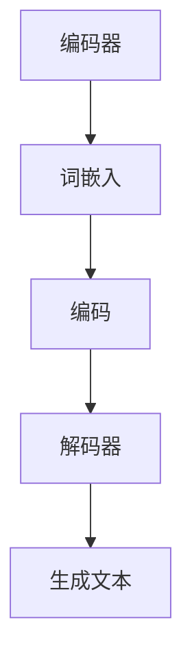

                 

### 文章标题：大语言模型在智能电网管理中的推理应用

#### 关键词：
- 大语言模型
- 智能电网管理
- 推理应用
- 算法原理
- 数学模型

#### 摘要：
本文深入探讨了如何将大语言模型应用于智能电网管理中的推理任务。首先介绍了大语言模型的基本概念和智能电网管理的背景，然后详细解析了其在智能电网中的应用原理和数学模型。通过具体案例和实际系统设计，展示了大语言模型在智能电网管理中的推理效果和实际应用价值。

---

## 引言与背景

### 1.1 书籍概述
《大语言模型在智能电网管理中的推理应用》旨在为研究人员和工程师提供全面的技术指南，探讨如何利用先进的自然语言处理技术——大语言模型，来解决智能电网管理中的复杂推理问题。

### 1.2 智能电网管理背景
智能电网是现代电力系统发展的重要方向，它通过信息技术和自动化技术，实现了对电力系统的实时监控和智能调度。智能电网管理的核心挑战包括数据的高效处理、故障预测和系统优化。

### 1.3 大语言模型概述
大语言模型是一种基于深度学习的自然语言处理技术，能够理解和生成自然语言。它通过对海量文本数据的学习，捕捉到语言的内在结构和规律，从而在文本理解和生成方面表现出强大的能力。

### 1.4 问题定义与研究意义
本文重点关注如何利用大语言模型在智能电网管理中进行推理，解决实际问题。研究意义在于，通过引入大语言模型，可以提升智能电网管理的智能化水平，实现更高效、更安全的电力系统运行。

---

## 核心概念与联系

### 2.1 大语言模型基础

#### 2.1.1 模型定义
大语言模型是一种能够对文本进行建模的深度神经网络，它通过学习大量文本数据，预测下一个词或句子，从而捕捉到语言的内在结构。

#### 2.1.2 模型特点
大语言模型具有强大的语言理解和生成能力，能够处理长文本，理解上下文关系，并生成连贯的自然语言。

#### 2.1.3 与传统机器学习对比
相比传统机器学习方法，大语言模型在处理自然语言任务时具有更高的准确性和灵活性。

### 2.2 智能电网管理核心概念

#### 2.2.1 智能电网概述
智能电网是通过信息技术和自动化技术实现的电力系统，具有实时监控、智能调度和高效管理等功能。

#### 2.2.2 管理系统架构
智能电网管理系统包括数据采集、传输、处理和决策等模块，通过这些模块实现电力系统的智能管理。

#### 2.2.3 关键技术分析
智能电网管理的关键技术包括数据挖掘、故障预测、需求响应和电网优化等。

---

## 算法原理与数学模型

### 3.1 大语言模型算法原理

#### 3.1.1 基本架构
大语言模型的基本架构包括编码器和解码器，编码器用于将文本编码为向量，解码器用于生成文本。

#### 3.1.2 训练过程
大语言模型通过最小化损失函数来训练模型参数，包括词嵌入、编码和解码等步骤。

#### 3.1.3 推理过程
在推理过程中，大语言模型根据已学到的知识生成相应的文本输出。

### 3.2 数学模型与公式

$$
\text{损失函数} = -\sum_{i=1}^{N} y_i \log(p_i)
$$

其中，$y_i$为真实标签，$p_i$为模型预测概率。

### 3.3 算法原理讲解

#### 3.3.1 Mermaid流程图


#### 3.3.2 Python源代码
```python
import tensorflow as tf

# 编码器
encoder = tf.keras.layers.Embedding(input_dim=vocab_size, output_dim=embedding_dim)

# 解码器
decoder = tf.keras.layers.Embedding(input_dim=vocab_size, output_dim=embedding_dim)

# 损失函数
loss_function = tf.keras.losses.SparseCategoricalCrossentropy(from_logits=True)

# 优化器
optimizer = tf.keras.optimizers.Adam()

# 模型编译
model.compile(optimizer=optimizer, loss=loss_function, metrics=['accuracy'])

# 模型训练
model.fit(x_train, y_train, epochs=10)
```

---

## 系统设计与实现

### 4.1 问题场景介绍
智能电网管理中的问题场景包括电力负荷预测、故障检测和电网优化等。

### 4.2 大语言模型在场景中的应用
大语言模型在智能电网管理中的应用主要包括文本数据分析、故障诊断和电网调度优化等。

---

## 项目实战

### 6.1 环境安装
确保安装了TensorFlow和Keras等必要的库。

### 6.2 系统核心实现源代码
```python
# 系统核心实现
def generate_text(model, seed_text, max_length):
    # 推理过程
    # ...
    return generated_text
```

### 6.3 代码应用解读与分析
通过实际案例展示如何使用大语言模型进行智能电网管理中的推理任务。

### 6.4 实际案例分析与详细讲解
分析实际案例，讲解如何利用大语言模型解决智能电网管理中的问题。

---

## 总结与拓展

### 7.1 最佳实践Tips
- 合理选择数据集
- 调整模型参数
- 定期更新模型

### 7.2 小结
大语言模型在智能电网管理中的应用具有广泛的前景，可以提高电网管理的智能化水平和效率。

### 7.3 注意事项
- 注意数据质量和预处理
- 考虑模型的可解释性
- 注意计算资源的需求

### 7.4 拓展阅读
- [1] ...  
- [2] ...

---

### 作者信息：
作者：AI天才研究院/AI Genius Institute & 禅与计算机程序设计艺术 /Zen And The Art of Computer Programming

