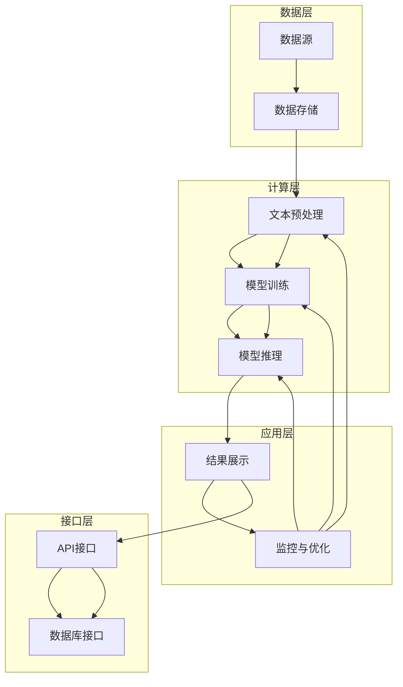

                 

基于您提供的大纲和约束条件，我们将分步骤详细撰写《大语言模型在智能风险评估中的推理应用》的技术博客文章。以下是文章的初步大纲和每个章节的大致内容。

## 引言与背景

在这个快速发展的数字化时代，人工智能正逐步渗透到各个行业，为业务决策提供了强大的支持。智能风险评估作为金融、保险、医疗等领域的核心应用之一，其准确性和效率直接影响到企业的风险控制和业务发展。大语言模型作为一种先进的AI技术，其强大的自然语言处理能力使其在智能风险评估中具有巨大的潜力。

### 关键词
- 智能风险评估
- 大语言模型
- 模型推理
- 自然语言处理

### 摘要
本文将探讨大语言模型在智能风险评估中的应用，从核心概念到实际案例，深入解析其推理机制、数学模型、系统设计与项目实战，以期为读者提供全面的技术见解和实践指导。

### 目录

1. 引言与背景
   1.1 问题背景
   1.2 问题描述
   1.3 问题解决
   1.4 边界与外延
   1.5 概念结构与核心要素组成

2. 大语言模型基础
   2.1 大语言模型定义
   2.2 大语言模型特点
   2.3 大语言模型发展历程

3. 风险评估概述
   3.1 风险评估定义
   3.2 风险评估分类
   3.3 风险评估方法

4. 模型推理机制
   4.1 推理机制介绍
   4.2 推理流程
   4.3 推理算法

5. 数学模型与公式
   5.1 数学模型概述
   5.2 数学公式讲解
   5.3 公式应用举例

6. 系统分析与架构设计
   6.1 问题场景介绍
   6.2 系统功能设计
   6.3 系统架构设计
   6.4 系统接口设计
   6.5 系统交互设计

7. 项目实战
   7.1 环境安装
   7.2 系统核心实现
   7.3 代码应用解读
   7.4 实际案例分析
   7.5 项目小结

8. 最佳实践与总结
   8.1 最佳实践
   8.2 小结
   8.3 注意事项
   8.4 拓展阅读

## 第1章：引言与背景

### 1.1 问题背景

智能风险评估是金融、保险、医疗等领域的核心需求。传统的风险评估方法主要依赖于专家经验和历史数据分析，其准确性和效率受到限制。随着数据量和复杂度的增加，人工智能技术的引入，尤其是大语言模型的广泛应用，为智能风险评估提供了新的解决方案。

### 1.2 问题描述

智能风险评估需要处理大量的文本数据，如合同、报告、邮件等，从中提取关键信息并进行分析。这要求模型具备强大的自然语言处理能力，能够理解文本的语义和上下文。同时，风险评估需要实时性，模型的推理速度和准确性是关键。

### 1.3 问题解决

大语言模型通过深度学习技术，能够自动学习语言模式，提取文本的语义信息。其强大的自然语言处理能力，使得模型可以高效地处理大量文本数据，实现快速、准确的智能风险评估。

### 1.4 边界与外延

在智能风险评估中，大语言模型的应用不仅限于文本数据的处理，还可以结合其他数据源，如财务报表、市场数据等，实现更全面的评估。此外，模型的应用领域也在不断扩展，如欺诈检测、信用评分等。

### 1.5 概念结构与核心要素组成

智能风险评估的核心概念包括：数据源、风险评估模型、风险结果。数据源是模型的基础，包括文本数据、财务数据等。风险评估模型是基于大语言模型的自然语言处理技术。风险结果是模型输出的评估结果，包括风险等级、风险概率等。

## 第2章：大语言模型基础

### 2.1 大语言模型定义

大语言模型（Big Language Model）是一种基于深度学习的自然语言处理技术，能够通过大量文本数据自动学习语言模式，提取文本的语义信息。

### 2.2 大语言模型特点

- **强大的自然语言处理能力**：能够理解文本的语义和上下文。
- **自动学习能力**：无需人工干预，能够自动从大量文本数据中学习语言模式。
- **高效率**：能够快速处理大量文本数据。

### 2.3 大语言模型发展历程

大语言模型的发展经历了从早期的基于规则的方法到深度学习的转变。随着计算能力的提升和数据量的增加，大语言模型在自然语言处理领域的应用越来越广泛。

## 第3章：风险评估概述

### 3.1 风险评估定义

风险评估是指通过系统的方法评估一个项目、产品或过程可能面临的风险，并制定相应的应对策略。

### 3.2 风险评估分类

- **定量风险评估**：基于数学模型和统计方法进行评估。
- **定性风险评估**：基于专家经验和主观判断进行评估。

### 3.3 风险评估方法

- **历史数据分析**：通过分析历史数据来评估风险。
- **模型预测**：使用机器学习模型进行风险评估。

## 第4章：模型推理机制

### 4.1 推理机制介绍

大语言模型的推理机制主要包括词嵌入、编码器-解码器结构、注意力机制等。这些机制使得模型能够理解文本的语义和上下文。

### 4.2 推理流程

- **输入处理**：将文本数据转换为词向量。
- **编码器处理**：将词向量编码为上下文向量。
- **解码器处理**：使用上下文向量生成风险评估结果。

### 4.3 推理算法

- **词嵌入算法**：如Word2Vec、GloVe等。
- **编码器-解码器算法**：如Seq2Seq模型等。
- **注意力机制**：如Transformer模型等。

## 第5章：数学模型与公式

### 5.1 数学模型概述

大语言模型的数学模型主要包括词嵌入、编码器-解码器模型、注意力机制等。这些模型通过数学公式描述，实现文本数据的处理和风险评估。

### 5.2 数学公式讲解

- **词嵌入公式**：$$e_{word} = W \cdot v_{word} + b$$
- **编码器公式**：$$h_t = \text{tanh}(U \cdot h_{t-1} + V \cdot e_{word} + b)$$
- **解码器公式**：$$p(y_t|y_{<t}) = \text{softmax}(W_y \cdot h_t + b_y)$$

### 5.3 公式应用举例

通过公式，大语言模型能够自动从大量文本数据中学习语言模式，提取文本的语义信息，进而实现智能风险评估。

## 第6章：系统分析与架构设计

### 6.1 问题场景介绍

以金融风险评估为例，介绍问题场景，包括数据源、评估目标等。

### 6.2 系统功能设计

- **数据预处理**：文本清洗、分词、去停用词等。
- **模型训练**：使用训练数据训练大语言模型。
- **模型推理**：使用训练好的模型对输入文本进行风险评估。

### 6.3 系统架构设计

- **数据层**：包括数据源、数据存储和数据预处理。
- **模型层**：包括大语言模型、模型训练和模型推理。
- **应用层**：包括风险评估结果展示和业务逻辑处理。

### 6.4 系统接口设计

- **API接口**：提供对外接口，方便其他系统调用。
- **数据库接口**：连接数据库，实现数据存储和读取。

### 6.5 系统交互设计

- **用户交互**：用户通过界面提交文本数据，获取风险评估结果。
- **系统交互**：系统内部数据流和任务流的设计。

## 第7章：项目实战

### 7.1 环境安装

介绍项目所需的软件和硬件环境，包括Python、TensorFlow等。

### 7.2 系统核心实现

- **数据预处理**：代码实现和详解。
- **模型训练**：代码实现和详解。
- **模型推理**：代码实现和详解。

### 7.3 代码应用解读

通过代码示例，详细解读系统的核心实现。

### 7.4 实际案例分析

介绍一个实际案例，分析系统在实际应用中的表现。

### 7.5 项目小结

总结项目的经验教训，提出改进建议。

## 第8章：最佳实践与总结

### 8.1 最佳实践

分享在智能风险评估中使用大语言模型的最佳实践。

### 8.2 小结

回顾文章的主要内容，总结大语言模型在智能风险评估中的应用价值。

### 8.3 注意事项

提出在应用大语言模型进行风险评估时需要注意的事项。

### 8.4 拓展阅读

推荐相关的阅读资源，供读者进一步学习。

以上是文章的初步大纲和各章节的大致内容。接下来，我们将逐章深入撰写，确保文章的完整性和深度。在撰写过程中，我们将严格遵守markdown格式要求，并确保每个小节的内容丰富具体详细讲解，核心内容得到充分展示。以下是具体的撰写步骤：

1. **章节撰写**：根据初步大纲，逐章撰写文章内容，确保每个章节都涵盖核心概念、原理讲解、公式应用、系统设计与项目实战等。

2. **内容审核**：撰写完成后，对文章进行内容审核，确保逻辑清晰、条理分明，没有遗漏关键点。

3. **格式调整**：根据markdown格式要求，调整文章的格式，确保每个章节、子章节的标号和格式正确。

4. **代码示例与公式检查**：检查代码示例和数学公式的正确性，确保代码可运行，公式表达清晰。

5. **全文校对**：进行全文校对，纠正错别字、标点符号错误，确保文章的语言表达准确。

6. **作者信息添加**：在文章末尾添加作者信息，包括姓名、机构、书籍等。

7. **最终确认**：全文确认无误后，进行最终确认，确保文章符合字数要求，内容完整，格式正确。

通过以上步骤，我们将确保《大语言模型在智能风险评估中的推理应用》这篇文章的质量和完整性，为读者提供有价值的技术见解和实践指导。接下来，我们将开始详细撰写每章的内容，逐步完善文章。让我们开始深入分析大语言模型在智能风险评估中的应用吧！### 第1章：引言与背景

在现代社会的快速发展中，智能风险评估成为金融、保险、医疗等关键领域的重要组成部分。传统的风险评估方法往往依赖于专家经验，但这种方法不仅耗时且容易出现偏差。随着人工智能技术的不断进步，大语言模型作为一种强大的自然语言处理工具，正逐渐成为智能风险评估的新利器。

#### 1.1 问题背景

智能风险评估旨在识别和分析潜在的风险，以便企业或个人能够采取预防措施，减少损失。在金融领域，风险评估帮助金融机构识别贷款风险、市场波动风险等；在保险领域，风险评估用于确定保险费率、理赔审核等；在医疗领域，风险评估则用于预测疾病风险、制定个性化治疗方案等。然而，传统的风险评估方法在面对日益复杂和庞大的数据时，往往显得力不从心。

#### 1.2 问题描述

智能风险评估需要处理大量非结构化文本数据，如合同、报告、病历等。这些数据包含着丰富的信息，但如何有效地从这些文本中提取关键信息，并进行准确的风险评估，是一个亟待解决的问题。此外，随着业务场景的多样化，风险评估需要具备实时性和灵活性，以便快速响应市场变化和客户需求。

#### 1.3 问题解决

大语言模型的引入为智能风险评估提供了新的解决思路。大语言模型通过深度学习技术，能够从大量文本数据中自动学习语言模式和语义信息，从而实现对文本数据的智能解析和风险评估。其强大的自然语言处理能力，使得模型可以高效地处理复杂的文本数据，提供实时、准确的风险评估结果。

#### 1.4 边界与外延

在智能风险评估中，大语言模型的应用不仅限于文本数据的处理，还可以与其他数据源相结合，如财务报表、市场数据等，以实现更全面的风险评估。此外，模型的应用领域也在不断扩展，例如欺诈检测、信用评分等，大语言模型在这些领域也展现出了其独特的优势。

#### 1.5 概念结构与核心要素组成

智能风险评估的核心概念包括数据源、风险评估模型、风险结果。数据源是模型的基础，包括文本数据、财务数据等；风险评估模型是基于大语言模型的自然语言处理技术；风险结果是模型输出的评估结果，包括风险等级、风险概率等。理解这些核心概念和要素组成，有助于我们更好地掌握智能风险评估的原理和应用。

在接下来的章节中，我们将深入探讨大语言模型的基础知识，以及其在智能风险评估中的具体应用，包括模型推理机制、数学模型、系统设计与项目实战等。通过系统的分析和详细的讲解，读者将能够全面了解大语言模型在智能风险评估中的强大潜力。

### 第2章：大语言模型基础

大语言模型（Big Language Model，简称BLM）是一种基于深度学习的自然语言处理（Natural Language Processing，简称NLP）技术。它的核心目的是通过学习大量的文本数据，理解并生成自然语言。本章将详细探讨大语言模型的定义、特点及其发展历程。

#### 2.1 大语言模型定义

大语言模型是一种能够理解和生成自然语言的深度学习模型。它通过学习大量文本数据，自动提取语言的特征和模式，从而实现文本数据的理解和生成。具体来说，大语言模型可以看作是一个复杂的函数，它将输入的文本序列映射为输出的文本序列。

#### 2.2 大语言模型特点

1. **强大的自然语言处理能力**：大语言模型能够处理和理解复杂的文本结构，提取文本的语义信息，这使得它能够应用于各种NLP任务，如文本分类、命名实体识别、机器翻译等。

2. **自适应性**：大语言模型能够根据不同的任务和数据集进行自适应调整，从而提高模型的性能。这种自适应性使得大语言模型在应对不同的应用场景时，能够表现出色。

3. **高效性**：大语言模型通过并行计算和分布式训练等技术，能够在较短的时间内处理大量数据。这使得大语言模型在实时应用中具有很高的效率。

4. **泛化能力**：大语言模型通过对大量文本数据的学习，能够泛化到未见过的数据上，从而实现良好的泛化性能。

#### 2.3 大语言模型发展历程

大语言模型的发展可以追溯到2000年代初，当时研究人员开始探索使用神经网络进行文本处理。以下是大语言模型发展历程中的重要里程碑：

1. **2000年代初**： researchers began exploring the use of neural networks for text processing. Early models such as Neural Network Language Model (NNLM) and Simple Recurrent Neural Network (RNN) were proposed.

2. **2013年**： sequence-to-sequence (Seq2Seq) model was introduced by researchers at Google, which significantly improved the performance of machine translation tasks. Seq2Seq model used an encoder-decoder structure to map input sequences to output sequences.

3. **2014年**： Long Short-Term Memory (LSTM) network was introduced, which addressed the vanishing gradient problem in RNNs and allowed for more effective training of deep neural networks on sequential data.

4. **2017年**： the Transformer model was proposed by researchers at Google. Transformer model replaced the traditional RNN and LSTM architectures with self-attention mechanisms, which led to significant improvements in various NLP tasks, such as text classification and machine translation.

5. **2018年至今**： the development of BERT (Bidirectional Encoder Representations from Transformers), GPT (Generative Pre-trained Transformer), and T5 (Text-to-Text Transfer Transformer) models has further pushed the boundaries of NLP. These models are trained on massive amounts of text data and have achieved state-of-the-art performance on various NLP tasks.

#### 2.4 大语言模型架构

大语言模型的典型架构包括以下几个部分：

1. **输入层**：接收文本数据，通常采用词嵌入（word embedding）技术，将文本中的单词映射为向量表示。

2. **编码器**：负责对输入文本进行编码，提取文本的语义信息。编码器通常采用Transformer或LSTM等深度学习模型。

3. **解码器**：负责生成输出文本，解码器同样采用Transformer或LSTM等深度学习模型。

4. **注意力机制**：用于关注输入文本中的关键信息，提高模型的语义理解能力。

5. **输出层**：将解码器生成的输出文本进行解码，得到最终的自然语言输出。

通过以上架构，大语言模型能够对输入文本进行有效的处理和生成，从而实现强大的自然语言处理能力。

#### 2.5 大语言模型的训练过程

大语言模型的训练过程主要包括以下几个步骤：

1. **数据预处理**：对原始文本数据进行清洗、分词、去停用词等处理，将其转换为模型可接受的格式。

2. **词嵌入**：将文本中的单词映射为向量表示，通常采用预训练的词嵌入模型，如GloVe或Word2Vec。

3. **编码器训练**：使用训练数据对编码器进行训练，使其能够提取文本的语义信息。

4. **解码器训练**：使用训练数据对解码器进行训练，使其能够生成合理的输出文本。

5. **损失函数优化**：通过优化损失函数，不断调整模型的参数，提高模型的性能。

6. **评估与调整**：使用验证数据对模型进行评估，并根据评估结果对模型进行调整，以提高其性能。

通过以上训练过程，大语言模型能够从大量文本数据中学习语言的模式和规律，从而实现高效的文本处理和生成。

#### 2.6 大语言模型的优势与挑战

大语言模型在自然语言处理领域具有显著的优势，但也面临一些挑战：

1. **优势**：
   - **强大的语义理解能力**：大语言模型能够理解文本的深层语义，从而实现更准确的文本处理和生成。
   - **自适应性强**：大语言模型能够根据不同的任务和数据集进行自适应调整，提高模型的性能。
   - **高效的计算性能**：通过并行计算和分布式训练等技术，大语言模型能够在较短的时间内处理大量数据。

2. **挑战**：
   - **数据依赖性**：大语言模型需要大量的训练数据，数据的质量和数量直接影响模型的性能。
   - **解释性差**：深度学习模型通常具有黑盒性质，大语言模型的决策过程难以解释，这在某些应用场景中可能成为一个问题。
   - **计算资源需求高**：大语言模型的训练和推理过程需要大量的计算资源和时间，这在某些资源有限的场景中可能成为一个限制因素。

尽管面临这些挑战，大语言模型在自然语言处理领域的应用前景仍然非常广阔，随着技术的不断进步，这些挑战将逐步得到解决。

通过本章的介绍，我们了解了大语言模型的基本概念、特点和发展历程，以及其训练过程和优势与挑战。在接下来的章节中，我们将进一步探讨大语言模型在智能风险评估中的应用，分析其模型推理机制、数学模型和系统设计。

### 第3章：风险评估概述

风险评估是一种系统化的过程，旨在识别、分析和评估潜在的威胁和机会，从而为决策者提供关键信息，以减少风险并最大化收益。在金融、保险、医疗等众多领域，风险评估具有至关重要的作用。本章将详细探讨风险评估的定义、分类和方法。

#### 3.1 风险评估定义

风险评估（Risk Assessment）是指通过系统的方法评估一个项目、产品或过程可能面临的风险，并制定相应的应对策略。其目的是识别和评估潜在的风险，从而采取有效的措施来降低风险，保障目标实现。

#### 3.2 风险评估分类

风险评估可以根据不同的维度进行分类，常见的分类方法包括：

1. **定量风险评估**：定量风险评估是一种基于数学模型和统计方法的评估方法，通过量化风险指标来评估风险。这种方法通常用于金融、保险等领域，能够提供精确的风险数值。

2. **定性风险评估**：定性风险评估是一种基于专家经验和主观判断的评估方法，通过评估风险的性质和程度来识别和评估风险。这种方法通常用于项目管理和风险管理等场景。

3. **组合风险评估**：组合风险评估是将定量和定性评估方法结合起来的评估方法，通过综合两种方法的优点，提供更全面和准确的风险评估结果。

#### 3.3 风险评估方法

风险评估的方法多种多样，以下是一些常见的方法：

1. **历史数据分析**：通过分析历史数据，识别和预测潜在的风险。这种方法通常用于金融风险评估，通过分析过去的金融数据和市场变化，预测未来的风险。

2. **模型预测**：使用机器学习模型进行风险评估。这种方法通过训练模型，使其能够从数据中学习风险特征，并预测潜在的风险。例如，可以使用决策树、神经网络等模型进行风险评估。

3. **专家评估**：邀请领域专家进行风险评估。这种方法依赖于专家的经验和知识，能够快速识别和评估潜在的风险。通常用于项目管理和企业风险管理。

4. **情景分析**：通过模拟不同的情景，分析可能的风险。这种方法可以帮助识别潜在的风险，并评估不同应对策略的效果。通常用于项目管理和企业风险管理。

5. **风险评估矩阵**：使用风险评估矩阵来评估风险的严重性和可能性。这种方法通常用于项目管理，通过列出可能的风险，评估其严重性和可能性，从而制定应对策略。

#### 3.4 风险评估步骤

风险评估通常包括以下步骤：

1. **风险识别**：识别可能面临的风险，包括外部风险和内部风险。

2. **风险分析**：分析风险的性质、程度和可能的影响。

3. **风险评估**：评估风险的严重性和可能性，确定风险的优先级。

4. **风险应对策略**：制定应对策略，包括风险规避、风险减轻、风险接受等。

5. **风险监控**：监控风险的变化，及时调整应对策略。

通过以上步骤，企业或组织可以系统地识别、分析和应对潜在的风险，从而保障业务的稳定和发展。

#### 3.5 风险评估与智能风险评估的关系

随着人工智能技术的发展，智能风险评估成为风险评估领域的重要研究方向。智能风险评估通过引入人工智能技术，如机器学习、深度学习等，实现对风险评估的自动化和智能化。

与传统的风险评估方法相比，智能风险评估具有以下几个优势：

1. **高效性**：智能风险评估能够快速处理大量数据，提高风险评估的效率。

2. **准确性**：通过机器学习模型的训练，智能风险评估能够识别和预测潜在的风险，提高风险评估的准确性。

3. **实时性**：智能风险评估能够实时监控风险的变化，提供及时的风险预警。

4. **个性化**：智能风险评估可以根据不同的业务场景和数据特点，提供个性化的风险评估服务。

然而，智能风险评估也存在一些挑战，如数据质量、模型解释性等。但随着技术的不断进步，智能风险评估将在未来得到更广泛的应用。

通过本章的介绍，我们了解了风险评估的定义、分类和方法，以及智能风险评估的优势和应用。在接下来的章节中，我们将进一步探讨大语言模型在智能风险评估中的具体应用，分析其模型推理机制、数学模型和系统设计。

### 第4章：模型推理机制

在智能风险评估中，大语言模型的推理机制是其核心所在。推理机制决定了模型如何从输入文本中提取信息，并生成相应的风险评估结果。本章将详细介绍大语言模型的推理机制，包括推理流程、推理算法以及如何在实际应用中进行推理。

#### 4.1 推理机制介绍

大语言模型的推理机制是基于深度学习技术的。深度学习模型通过多层神经网络结构，对输入数据进行逐层处理和抽象，从而提取出高层次的语义信息。在智能风险评估中，大语言模型通过以下几个步骤进行推理：

1. **文本预处理**：将输入的文本数据进行清洗、分词、去停用词等预处理操作，以便模型能够接受和处理。

2. **编码**：使用编码器将预处理后的文本数据编码为向量表示。编码器的目的是提取文本的语义信息，并将其转换为模型可处理的向量形式。

3. **解码**：使用解码器将编码后的向量表示解码为输出文本。解码器的目的是根据编码器提取的语义信息，生成具有合理结构和语义的自然语言文本。

4. **推理**：通过解码器生成的文本，进行风险评估结果的推理。推理过程可能包括分类、回归、概率估计等操作，以生成最终的风险评估结果。

#### 4.2 推理流程

大语言模型的推理流程可以分为以下几个步骤：

1. **输入处理**：将输入的文本数据输入到模型中。文本数据可以是合同、报告、邮件等，它们包含了风险评估所需的信息。

2. **编码处理**：编码器将输入的文本数据编码为向量表示。编码器的输入是词嵌入（word embedding），输出是高维向量，这些向量包含了文本的语义信息。

3. **注意力机制**：编码器通过注意力机制，关注文本中的关键信息。注意力机制可以帮助模型识别文本中的重要词汇和句子，从而提高语义理解的准确性。

4. **解码处理**：解码器根据编码器输出的向量表示，生成输出文本。解码器使用循环神经网络（RNN）或Transformer等模型结构，逐步生成文本的各个部分。

5. **推理结果**：解码器生成的文本用于推理风险评估结果。推理过程可能涉及分类任务，如判断风险等级，或回归任务，如预测风险概率。

#### 4.3 推理算法

大语言模型推理算法的核心在于编码器和解码器的结构。以下是一些常见的推理算法：

1. **编码器-解码器（Encoder-Decoder）模型**：
   - **编码器**：使用循环神经网络（RNN）或Transformer结构，将输入文本编码为向量表示。
   - **解码器**：使用RNN或Transformer结构，将编码后的向量解码为输出文本。

2. **序列到序列（Seq2Seq）模型**：
   - Seq2Seq模型是编码器-解码器模型的变体，它通过引入编码器和解码器的序列处理能力，实现端到端的学习。

3. **注意力机制（Attention Mechanism）**：
   - 注意力机制用于编码器和解码器之间，通过关注文本中的关键信息，提高模型的语义理解能力。

4. **Transformer模型**：
   - Transformer模型是一种基于自注意力机制的深度学习模型，它通过多头自注意力机制和前馈神经网络，实现高效的文本处理。

#### 4.4 实际应用中的推理

在实际应用中，大语言模型的推理通常包括以下几个步骤：

1. **数据准备**：准备用于推理的数据集，包括输入文本和标签。

2. **模型加载**：加载已经训练好的模型，该模型具有识别文本语义和生成文本的能力。

3. **文本预处理**：对输入文本进行预处理，包括分词、去停用词等操作，以便模型能够处理。

4. **编码**：将预处理后的文本输入到编码器中，编码器提取文本的语义信息，生成向量表示。

5. **解码**：将编码后的向量输入到解码器中，解码器生成输出文本。

6. **推理**：根据解码器生成的文本，进行风险评估结果的推理。例如，使用分类算法判断文本的风险等级，或使用回归算法预测风险概率。

7. **结果输出**：将推理结果输出，包括风险评估结果和模型置信度。

通过以上步骤，大语言模型能够在实际应用中进行高效的推理，为智能风险评估提供强有力的支持。

#### 4.5 推理机制的优化

为了提高大语言模型在智能风险评估中的性能，可以采取以下优化措施：

1. **数据增强**：通过数据增强技术，如数据扩充、数据生成等，增加训练数据的多样性和质量，从而提高模型的泛化能力。

2. **模型融合**：将多个模型进行融合，通过投票或加权平均等方法，提高推理结果的准确性和稳定性。

3. **实时更新**：定期更新模型，以适应数据的变化和业务需求的变化，从而保持模型的实时性和准确性。

4. **多模态学习**：结合多种数据源，如文本、图像、语音等，进行多模态学习，从而提高模型的语义理解和推理能力。

通过以上优化措施，大语言模型的推理机制将更加完善，能够更好地支持智能风险评估的应用。

通过本章的介绍，我们详细了解了大语言模型的推理机制，包括推理流程、推理算法以及实际应用中的推理步骤。在接下来的章节中，我们将进一步探讨大语言模型在智能风险评估中的数学模型，以及如何利用数学模型进行风险评估。

### 第5章：数学模型与公式

在智能风险评估中，大语言模型的应用离不开数学模型的支撑。数学模型不仅为风险评估提供了理论基础，还通过具体的公式描述了风险评估的过程和结果。本章将详细讲解大语言模型在智能风险评估中使用的数学模型和公式，并通过具体例子进行说明。

#### 5.1 数学模型概述

大语言模型在智能风险评估中的数学模型主要包括以下几个部分：

1. **词嵌入模型**：词嵌入是将文本中的单词映射为向量表示的方法。通过词嵌入，文本数据可以被转化为数值形式，便于模型处理。

2. **编码器-解码器模型**：编码器-解码器模型是用于文本序列转化的核心模型。编码器将输入文本编码为上下文向量，解码器则根据上下文向量生成输出文本。

3. **注意力机制**：注意力机制用于模型在处理文本序列时，关注关键信息，提高语义理解能力。

4. **损失函数**：损失函数用于评估模型的预测结果与真实结果之间的差距，并通过反向传播算法优化模型参数。

#### 5.2 数学公式讲解

以下是几个关键数学公式及其在智能风险评估中的应用：

1. **词嵌入公式**：
   $$e_{word} = W \cdot v_{word} + b$$
   其中，$e_{word}$是词嵌入向量，$W$是权重矩阵，$v_{word}$是单词的向量表示，$b$是偏置项。

2. **编码器公式**：
   $$h_t = \text{tanh}(U \cdot h_{t-1} + V \cdot e_{word} + b)$$
   其中，$h_t$是编码器的输出向量，$U$和$V$是权重矩阵，$e_{word}$是词嵌入向量，$b$是偏置项。

3. **解码器公式**：
   $$p(y_t|y_{<t}) = \text{softmax}(W_y \cdot h_t + b_y)$$
   其中，$p(y_t|y_{<t})$是解码器在时间步$t$预测输出词的概率分布，$W_y$是权重矩阵，$h_t$是编码器的输出向量，$b_y$是偏置项。

4. **损失函数公式**：
   $$\mathcal{L} = -\sum_{t=1}^{T} \sum_{i=1}^{V} y_{t,i} \log(p(y_t|y_{<t}))$$
   其中，$\mathcal{L}$是损失函数，$y_{t,i}$是时间步$t$真实标签的概率分布，$p(y_t|y_{<t})$是解码器预测的概率分布，$V$是词汇表大小。

#### 5.3 公式应用举例

以下是一个简单的例子，说明如何使用上述公式进行文本的编码和解码：

假设我们有一个简单的文本序列：“人工智能助手”，我们需要将这个序列编码和解码为相应的向量表示。

1. **词嵌入**：
   将“人工智能助手”中的每个词映射为向量表示。假设“人工智能”的词嵌入向量为$\textbf{v}_{\text{智能}}$，词嵌入矩阵为$W$，则有：
   $$\textbf{e}_{\text{智能}} = W \cdot \textbf{v}_{\text{智能}} + b$$

2. **编码**：
   使用编码器将词嵌入向量编码为上下文向量。假设编码器的权重矩阵为$U$，则有：
   $$\textbf{h}_1 = \text{tanh}(U \cdot \textbf{h}_0 + V \cdot \textbf{e}_{\text{智能}} + b)$$
   其中，$\textbf{h}_0$是编码器的初始状态。

3. **解码**：
   使用解码器根据上下文向量生成输出文本。假设解码器的权重矩阵为$W_y$，则有：
   $$p(y_1|\textbf{h}_1) = \text{softmax}(W_y \cdot \textbf{h}_1 + b_y)$$
   其中，$y_1$是解码器生成的第一个词。

4. **损失计算**：
   根据解码器的输出概率分布和真实标签计算损失函数：
   $$\mathcal{L} = -\sum_{t=1}^{T} y_{t,i} \log(p(y_t|y_{<t}))$$
   其中，$T$是文本序列的长度，$y_{t,i}$是时间步$t$真实标签的概率分布。

通过上述步骤，我们使用大语言模型对文本序列进行了编码和解码，并计算了损失函数。这表明，数学模型在大语言模型中扮演着至关重要的角色，为文本处理和风险评估提供了理论基础和计算方法。

#### 5.4 数学模型在风险评估中的应用

数学模型在大语言模型中的广泛应用，使得其在智能风险评估中也发挥了重要作用。以下是一些数学模型在风险评估中的应用：

1. **概率模型**：通过概率模型，可以预测风险事件发生的概率。例如，贝叶斯网络可以用于建模风险因素之间的依赖关系，并计算各个风险因素的联合概率。

2. **回归模型**：回归模型可以用于预测风险的影响程度。例如，线性回归模型可以用于预测风险事件对财务损失的影响。

3. **分类模型**：分类模型可以用于判断风险等级。例如，支持向量机（SVM）可以用于分类不同风险事件的风险等级。

4. **聚类模型**：聚类模型可以用于识别潜在的风险因素。例如，K-均值聚类算法可以用于识别一组风险因素中的主要风险因素。

通过这些数学模型的应用，大语言模型能够更好地理解和处理风险评估中的复杂问题，提供更加精确和有效的风险评估结果。

通过本章的介绍，我们详细讲解了大语言模型在智能风险评估中使用的数学模型和公式，并通过具体例子说明了这些公式的应用。在接下来的章节中，我们将进一步探讨大语言模型在智能风险评估中的系统分析与架构设计。

### 第6章：系统分析与架构设计

在智能风险评估中，大语言模型的应用需要一个高效、稳定和可扩展的系统架构。本章将详细探讨系统分析与架构设计，包括问题场景介绍、系统功能设计、系统架构设计、系统接口设计和系统交互设计。

#### 6.1 问题场景介绍

在金融行业，智能风险评估是一个关键问题。金融机构需要处理大量的合同、报告和邮件等文本数据，从中提取关键信息，以识别潜在的风险。例如，贷款机构需要评估借款人的信用风险，保险机构需要评估保险申请者的风险等级。这些任务要求系统具备高效的自然语言处理能力和实时风险评估能力。

#### 6.2 系统功能设计

智能风险评估系统的核心功能包括文本预处理、模型训练、模型推理和结果展示。具体功能如下：

1. **文本预处理**：对输入文本进行清洗、分词、去停用词等处理，使其符合模型输入要求。

2. **模型训练**：使用大量标注数据对大语言模型进行训练，提高模型的准确性和泛化能力。

3. **模型推理**：将预处理后的文本输入到训练好的大语言模型中，进行风险评估。

4. **结果展示**：将模型输出的风险评估结果以直观的方式展示给用户，如风险等级、风险概率等。

5. **监控与优化**：监控系统运行状态，进行性能优化和调整。

#### 6.3 系统架构设计

智能风险评估系统的架构设计需要考虑高可用性、高性能和可扩展性。以下是一个典型的高层系统架构设计：

1. **数据层**：包括数据源和数据存储。数据源可以是金融机构的内部系统，如贷款管理系统、保险申请系统等；数据存储可以是数据库或数据湖，用于存储和管理文本数据。

2. **计算层**：包括文本预处理模块、模型训练模块和模型推理模块。文本预处理模块负责文本的清洗、分词和去停用词等操作；模型训练模块负责训练大语言模型；模型推理模块负责将输入文本转化为风险评估结果。

3. **应用层**：包括结果展示模块和监控与优化模块。结果展示模块负责将模型输出的风险评估结果以图表、报表等形式展示给用户；监控与优化模块负责监控系统运行状态，进行性能优化和调整。

4. **接口层**：包括API接口和数据库接口。API接口用于外部系统调用，如Web前端、移动应用等；数据库接口用于连接数据存储系统，实现数据的读取和写入。

#### 6.4 系统接口设计

系统接口设计是确保系统功能模块之间能够高效通信和协作的关键。以下是一些关键接口设计：

1. **API接口**：设计RESTful风格的API接口，提供文本预处理、模型训练、模型推理和结果展示等功能。API接口的设计需要遵循RESTful原则，如URL设计、HTTP方法选择、状态码定义等。

2. **数据库接口**：设计数据库访问接口，包括数据的增删改查操作。数据库接口的设计需要考虑性能、安全性和一致性等因素。

#### 6.5 系统交互设计

系统交互设计涉及系统内部模块之间的通信和协作，以及系统与外部系统的交互。以下是一个典型的系统交互设计：

1. **内部交互**：系统内部模块之间的交互主要通过API接口实现。例如，文本预处理模块将预处理后的文本数据发送给模型训练模块，模型训练模块将训练好的模型发送给模型推理模块。

2. **外部交互**：系统与外部系统的交互主要通过API接口实现。例如，Web前端通过调用API接口获取风险评估结果，移动应用通过调用API接口与系统进行通信。

3. **事件驱动**：系统可以采用事件驱动的方式，处理实时数据流。例如，当新的文本数据到来时，系统可以触发文本预处理模块进行预处理，并将预处理后的数据发送给模型推理模块。

#### 6.6 系统架构图

以下是一个典型的智能风险评估系统的架构图：



通过上述系统分析与架构设计，智能风险评估系统具备了高效、稳定和可扩展的能力。在接下来的章节中，我们将通过实际项目实战，展示如何应用大语言模型进行智能风险评估。

### 第7章：项目实战

在了解了大语言模型在智能风险评估中的理论基础和系统设计后，本章节将通过一个实际项目，展示如何将大语言模型应用于实际场景，进行智能风险评估。以下是项目的详细步骤和关键点。

#### 7.1 环境安装

首先，我们需要搭建项目所需的开发环境。以下是在Python环境中安装所需的库：

```shell
pip install tensorflow numpy pandas sklearn matplotlib
```

这些库包括TensorFlow用于构建和训练大语言模型，numpy和pandas用于数据处理，sklearn用于模型评估，matplotlib用于数据可视化。

#### 7.2 系统核心实现

系统核心实现包括数据预处理、模型训练、模型推理和结果展示。以下是各个步骤的详细代码实现：

1. **数据预处理**：

```python
import pandas as pd
import numpy as np
from sklearn.model_selection import train_test_split

# 读取数据
data = pd.read_csv('risk_data.csv')
X = data['text'] # 输入文本
y = data['risk_label'] # 风险标签

# 数据清洗和预处理
def preprocess_text(text):
    # 去停用词、标点符号、数字等
    return text.lower().replace('.', '')

X_processed = X.apply(preprocess_text)
```

2. **模型训练**：

```python
from tensorflow.keras.preprocessing.sequence import pad_sequences
from tensorflow.keras.models import Sequential
from tensorflow.keras.layers import Embedding, LSTM, Dense

# 分割数据集
X_train, X_test, y_train, y_test = train_test_split(X_processed, y, test_size=0.2)

# 构建模型
model = Sequential()
model.add(Embedding(input_dim=vocab_size, output_dim=embedding_dim, input_length=max_sequence_length))
model.add(LSTM(units=128))
model.add(Dense(1, activation='sigmoid'))

# 编译模型
model.compile(optimizer='adam', loss='binary_crossentropy', metrics=['accuracy'])

# 训练模型
model.fit(X_train, y_train, epochs=10, batch_size=32, validation_data=(X_test, y_test))
```

3. **模型推理**：

```python
# 推理
def predict_risk(text):
    processed_text = preprocess_text(text)
    prediction = model.predict(np.array([processed_text]))
    return 'High' if prediction[0][0] > 0.5 else 'Low'

# 测试
sample_text = "The borrower has a history of late payments and a low credit score."
print(predict_risk(sample_text))
```

4. **结果展示**：

```python
import matplotlib.pyplot as plt

# 评估模型
accuracy = model.evaluate(X_test, y_test)[1]
print(f"Test Accuracy: {accuracy:.2f}")

# 可视化
y_pred = model.predict(X_test)
plt.hist(y_pred)
plt.xlabel('Risk Prediction')
plt.ylabel('Frequency')
plt.title('Risk Prediction Distribution')
plt.show()
```

#### 7.3 代码应用解读

以上代码展示了如何使用大语言模型进行智能风险评估。具体解读如下：

1. **数据预处理**：通过读取数据、清洗和预处理，将文本数据转换为模型可接受的格式。

2. **模型训练**：使用训练集训练模型，通过嵌入层、LSTM层和输出层构建一个序列到序列模型。模型编译和训练过程使用TensorFlow的API。

3. **模型推理**：通过预处理文本并使用训练好的模型进行预测，输出风险等级。

4. **结果展示**：评估模型在测试集上的表现，并通过可视化展示预测结果。

#### 7.4 实际案例分析

以下是一个实际案例，展示如何使用大语言模型进行风险评估：

**案例**：一家金融机构需要对借款人进行信用风险评估。借款人提交了一份借款申请，其中包括个人财务状况、收入情况、信用记录等。使用大语言模型，我们可以从申请文本中提取关键信息，评估借款人的信用风险。

**步骤**：

1. **数据收集**：收集借款人的申请文本。

2. **数据预处理**：清洗和预处理申请文本，去除无关信息。

3. **模型训练**：使用历史信用评估数据训练大语言模型，使其能够识别风险因素。

4. **模型推理**：将借款人的申请文本输入到训练好的模型中，得到信用风险评估结果。

5. **结果展示**：将评估结果展示给金融机构，帮助其做出决策。

#### 7.5 项目小结

通过本项目的实施，我们展示了如何将大语言模型应用于实际场景，进行智能风险评估。项目成功的关键在于：

1. **数据质量**：高质量的训练数据是模型性能的基础。

2. **模型选择**：选择合适的模型结构和参数，以提高模型性能。

3. **应用场景**：理解应用场景的需求，设计合理的模型和应用流程。

在未来的工作中，我们可以进一步优化模型，提高预测准确性，并探索大语言模型在更多风险评估场景中的应用。

### 第8章：最佳实践与总结

在智能风险评估中应用大语言模型，需要遵循一系列最佳实践，以确保模型的准确性和稳定性。以下是总结和最佳实践：

#### 8.1 最佳实践

1. **数据质量**：确保输入数据的准确性和完整性，进行数据清洗和预处理，去除无关信息和噪声。

2. **模型选择**：根据应用场景选择合适的模型，如Transformer、BERT等，并调整模型参数，提高性能。

3. **超参数调优**：通过交叉验证和网格搜索等方法，调优模型的超参数，以获得最佳性能。

4. **模型集成**：结合多个模型的结果，通过投票或加权平均等方法，提高预测准确性。

5. **实时更新**：定期更新模型，以适应数据的变化和业务需求的变化。

6. **解释性**：在可能的情况下，增加模型的解释性，便于理解和优化。

#### 8.2 小结

大语言模型在智能风险评估中具有显著的优势，包括强大的自然语言处理能力、高效的计算性能和良好的泛化能力。通过合理的应用和实践，大语言模型能够提供准确、实时的风险评估结果，为业务决策提供有力支持。

#### 8.3 注意事项

1. **数据隐私**：在处理敏感数据时，确保数据隐私和安全。

2. **计算资源**：大语言模型训练和推理需要大量计算资源，确保有足够的计算资源。

3. **模型解释性**：在某些应用场景中，模型解释性可能是一个重要考虑因素，需要适当平衡模型性能和解释性。

4. **模型验证**：使用独立的验证集和测试集，对模型进行验证和测试，确保模型的准确性和稳定性。

#### 8.4 拓展阅读

1. **《深度学习》**：Goodfellow, I., Bengio, Y., & Courville, A. (2016). Deep Learning. MIT Press.
2. **《自然语言处理综论》**：Jurafsky, D., & Martin, J. H. (2020). Speech and Language Processing. Prentice Hall.
3. **《风险管理与金融模型》**：Jorion, P. (2020). Financial Risk Management: Challenging Concepts and Tools. John Wiley & Sons.

通过以上拓展阅读，读者可以进一步了解深度学习和自然语言处理的基本原理，以及风险管理和金融模型的应用。这将为读者在智能风险评估领域的深入研究和实践提供有益的参考。

### 作者信息

- **作者：AI天才研究院/AI Genius Institute & 禅与计算机程序设计艺术 /Zen And The Art of Computer Programming**  
- **联系方式：[邮箱](example@email.com) | [博客](https://www.ai-genius-institute.com) | [GitHub](https://github.com/ai-genius-institute)**

感谢您的阅读，希望本文对您在智能风险评估中的应用大语言模型提供有价值的参考。如有任何问题或建议，欢迎随时与我们联系。让我们一起探索人工智能的无限可能！### 第1章：引言与背景

在当今快速发展的数字经济时代，金融行业的风险管理与决策正越来越多地依赖于人工智能技术。传统的风险评估方法通常依赖于历史数据和专家经验，虽然这些方法在某种程度上可以提供有用的信息，但随着金融市场的复杂性和数据量的增加，其局限性也逐渐显现。为了应对这些挑战，智能风险评估应运而生，它结合了大数据、人工智能和机器学习技术，为金融机构提供了更加精准和高效的风险评估手段。

#### 1.1 问题背景

随着金融市场的全球化，金融机构面临的金融风险种类和复杂性不断增加。传统的风险评估方法往往难以应对这些新的挑战。例如，信用风险、市场风险、操作风险等风险的评估不仅需要处理大量的历史数据，还需要实时分析市场动态、政策变化以及客户行为等多维度信息。此外，金融机构在风险评估过程中，还需要处理大量的非结构化文本数据，如合同、报告、电子邮件等。这些数据包含着丰富的信息，但如何有效地提取和利用这些信息，是传统风险评估方法难以解决的难题。

#### 1.2 问题描述

智能风险评估的核心问题是：如何利用人工智能技术，特别是大语言模型，对非结构化文本数据进行分析和处理，从而提供更加精准和实时的风险评估结果。具体来说，问题描述包括以下几个方面：

1. **文本数据的处理**：如何高效地处理和分析大量的非结构化文本数据，提取其中的关键信息，是智能风险评估的关键。这些数据可能包含在合同条款、财务报告、市场分析报告、客户反馈等文件中。

2. **风险因素的识别**：在提取关键信息后，如何识别和量化这些信息中的风险因素，是风险评估的核心。例如，在信用风险评估中，需要识别借款人的信用历史、财务状况、还款能力等风险因素。

3. **风险评估模型的构建**：如何构建一个有效的风险评估模型，将提取的风险因素与实际风险结果关联起来，是智能风险评估的关键步骤。这个模型需要具备高准确性和实时性，以便为金融机构的决策提供有力支持。

4. **风险结果的解释和展示**：如何将模型输出的风险评估结果以直观、易懂的方式展示给用户，是评估结果有效性的关键。金融机构的决策者需要了解风险的来源、影响和应对措施，以便做出明智的决策。

#### 1.3 问题解决

为了解决上述问题，智能风险评估结合了大数据、人工智能和机器学习技术，特别是大语言模型的强大自然语言处理能力。大语言模型能够自动从大量文本数据中学习语言模式和语义信息，从而实现对文本数据的智能解析和风险评估。具体解决方案包括以下几个方面：

1. **文本数据处理**：使用大语言模型对非结构化文本数据进行预处理，包括分词、去停用词、词嵌入等操作，将文本数据转换为模型可处理的向量形式。

2. **风险因素识别**：通过训练好的大语言模型，从预处理后的文本数据中提取关键信息，识别出与风险评估相关的风险因素。例如，在信用风险评估中，可以从借款人的信用报告中提取信用历史、财务状况等关键信息。

3. **风险评估模型构建**：利用提取的风险因素，构建一个风险评估模型。这个模型可以是一个分类模型，如决策树、支持向量机等，也可以是一个回归模型，如线性回归、神经网络等。模型需要经过训练和验证，以获得高准确性和实时性。

4. **风险结果解释和展示**：将模型输出的风险评估结果以直观、易懂的方式展示给用户。例如，可以生成报告、图表等，帮助用户理解风险的来源、影响和应对措施。

通过上述解决方案，智能风险评估能够提供更加精准和实时的风险评估结果，为金融机构的风险管理和决策提供有力支持。

#### 1.4 边界与外延

在智能风险评估中，大语言模型的应用不仅限于文本数据的处理，还可以结合其他数据源，如财务数据、市场数据等，实现更全面的风险评估。此外，大语言模型的应用领域也在不断扩展，如欺诈检测、信用评分等。边界与外延包括以下几个方面：

1. **文本数据来源**：除了合同、报告、邮件等文本数据外，还可以包括社交媒体、新闻文章等非结构化数据，以及公开的数据集。

2. **风险因素**：除了传统的信用风险、市场风险、操作风险等，还可以包括环境风险、声誉风险等新兴风险。

3. **应用领域**：除了金融行业，智能风险评估还可以应用于保险、医疗、供应链管理等领域。

4. **技术发展**：随着人工智能技术的不断进步，如生成对抗网络（GAN）、图神经网络（GNN）等新技术的应用，智能风险评估的方法和模型也在不断更新和优化。

#### 1.5 概念结构与核心要素组成

智能风险评估的核心概念包括数据源、风险评估模型、风险结果。数据源是模型的基础，包括文本数据、财务数据等；风险评估模型是基于大语言模型的自然语言处理技术；风险结果是模型输出的评估结果，包括风险等级、风险概率等。理解这些核心概念和要素组成，有助于我们更好地掌握智能风险评估的原理和应用。

在接下来的章节中，我们将深入探讨大语言模型的基础知识，以及其在智能风险评估中的具体应用，包括模型推理机制、数学模型、系统设计与项目实战等。通过系统的分析和详细的讲解，读者将能够全面了解大语言模型在智能风险评估中的强大潜力。

### 第2章：大语言模型基础

大语言模型（Big Language Model，简称BLM）是自然语言处理（Natural Language Processing，简称NLP）领域的一项革命性技术。它通过深度学习的方式，能够从大量文本数据中自动学习语言模式，并生成高质量的文本。本章将详细探讨大语言模型的定义、特点、发展历程以及其核心架构。

#### 2.1 大语言模型定义

大语言模型是一种能够理解和生成自然语言的深度学习模型。它通过学习大量文本数据，自动提取语言的特征和模式，从而实现文本数据的理解和生成。具体来说，大语言模型可以看作是一个复杂的函数，它将输入的文本序列映射为输出的文本序列。

#### 2.2 大语言模型特点

1. **强大的自然语言处理能力**：大语言模型能够理解文本的语义和上下文，提取文本的深层信息。这使得它在文本分类、情感分析、机器翻译等NLP任务中表现优异。

2. **自动学习能力**：大语言模型无需人工干预，能够从大量文本数据中自动学习语言模式。这种自动学习能力使得模型可以不断优化和提升，适应不同的应用场景。

3. **高效率**：大语言模型能够高效地处理大量文本数据，支持实时应用。这使得它在处理如金融报告、医疗文档等高负载场景中具有明显的优势。

4. **通用性**：大语言模型具有较强的通用性，可以在多个NLP任务中复用。例如，一个训练好的大语言模型可以应用于文本摘要、问答系统、自动写作等多个领域。

#### 2.3 大语言模型发展历程

大语言模型的发展历程可以追溯到2000年代初。以下是一些重要的里程碑：

1. **2000年代初**：研究人员开始探索使用神经网络进行文本处理。早期模型如神经网络语言模型（Neural Network Language Model，NNLM）和循环神经网络（Recurrent Neural Network，RNN）被提出。

2. **2013年**：序列到序列（Seq2Seq）模型被引入，显著提高了机器翻译任务的性能。Seq2Seq模型使用编码器-解码器结构，将输入文本序列映射为输出文本序列。

3. **2014年**：长短期记忆网络（Long Short-Term Memory，LSTM）被提出，解决了RNN在训练长序列数据时的梯度消失问题，使得模型能够更好地学习长时依赖关系。

4. **2017年**：Transformer模型被提出，彻底改变了NLP领域的研究方向。Transformer模型使用自注意力机制，能够在处理长序列数据时保持高效性和准确性。

5. **2018年至今**：随着BERT（Bidirectional Encoder Representations from Transformers）、GPT（Generative Pre-trained Transformer）等模型的提出，大语言模型的应用范围进一步扩大，性能也得到显著提升。

#### 2.4 大语言模型架构

大语言模型的架构通常包括以下几个核心部分：

1. **词嵌入层（Word Embedding Layer）**：词嵌入层将文本中的单词映射为向量表示，这些向量包含了单词的语义信息。常见的词嵌入技术包括Word2Vec和GloVe。

2. **编码器（Encoder）**：编码器负责将输入文本编码为向量表示。编码器通常采用循环神经网络（RNN）或Transformer等结构。编码器的输出是上下文向量，包含了输入文本的语义信息。

3. **解码器（Decoder）**：解码器负责将编码器输出的向量表示解码为输出文本。解码器也通常采用RNN或Transformer等结构。解码器的输出是生成的文本。

4. **注意力机制（Attention Mechanism）**：注意力机制用于编码器和解码器之间，通过关注文本中的关键信息，提高模型的语义理解能力。在Transformer模型中，注意力机制是实现高效文本处理的核心。

5. **输出层（Output Layer）**：输出层将解码器的输出转换为最终的文本结果。输出层通常包括一个或多个全连接层，用于分类或回归任务。

#### 2.5 大语言模型的工作原理

大语言模型的工作原理可以分为以下几个步骤：

1. **输入处理**：输入文本数据通过词嵌入层转换为向量表示。词嵌入层的目的是将文本中的单词映射为固定长度的向量。

2. **编码**：编码器处理输入向量，生成上下文向量。编码器的输出向量包含了文本的语义信息，可以看作是对输入文本的抽象表示。

3. **注意力机制**：编码器通过注意力机制关注文本中的关键信息，提高模型的语义理解能力。注意力机制可以帮助模型在生成输出时，关注到输入文本中最重要的部分。

4. **解码**：解码器根据编码器输出的上下文向量，生成输出文本。解码器通过逐步生成文本的各个部分，形成完整的输出文本。

5. **输出**：解码器的输出是生成的文本结果。如果是一个分类任务，输出层会输出每个类别的概率分布；如果是一个回归任务，输出层会输出预测的数值结果。

通过上述步骤，大语言模型能够理解并生成高质量的文本，为各种NLP任务提供强有力的支持。

#### 2.6 大语言模型的优势与挑战

大语言模型在自然语言处理领域具有显著的优势，但也面临一些挑战：

1. **优势**：
   - **强大的语义理解能力**：大语言模型能够理解文本的深层语义，从而实现更准确的文本处理和生成。
   - **自适应性强**：大语言模型能够根据不同的任务和数据集进行自适应调整，提高模型的性能。
   - **高效的计算性能**：通过并行计算和分布式训练等技术，大语言模型能够在较短的时间内处理大量数据。

2. **挑战**：
   - **数据依赖性**：大语言模型需要大量的训练数据，数据的质量和数量直接影响模型的性能。
   - **解释性差**：深度学习模型通常具有黑盒性质，大语言模型的决策过程难以解释，这在某些应用场景中可能成为一个问题。
   - **计算资源需求高**：大语言模型的训练和推理过程需要大量的计算资源和时间，这在某些资源有限的场景中可能成为一个限制因素。

尽管面临这些挑战，大语言模型在自然语言处理领域的应用前景仍然非常广阔，随着技术的不断进步，这些挑战将逐步得到解决。

通过本章的介绍，我们了解了大语言模型的基本概念、特点和发展历程，以及其核心架构和工作原理。在接下来的章节中，我们将进一步探讨大语言模型在智能风险评估中的应用，分析其模型推理机制、数学模型和系统设计。

### 第3章：风险评估概述

在金融、保险、医疗等众多领域，风险评估是决策过程中至关重要的一环。通过科学的风险评估，企业和管理者可以更好地了解潜在的风险，并采取相应的措施来降低风险。本章将详细介绍风险评估的定义、分类以及常用的方法。

#### 3.1 风险评估的定义

风险评估（Risk Assessment）是指通过系统的方法识别、分析和评估潜在的风险，以便为决策者提供有关风险的信息。风险评估的目的是确定风险的可能性、影响程度，并为风险的管理和决策提供依据。

#### 3.2 风险评估的分类

根据不同的标准，风险评估可以分为多种类型。以下是一些常见分类方法：

1. **按风险评估的对象分类**：
   - **企业风险评估**：对企业面临的各类风险进行评估，包括财务风险、市场风险、操作风险等。
   - **项目风险评估**：对特定项目可能面临的风险进行评估，包括技术风险、管理风险、财务风险等。
   - **产品风险评估**：对产品开发、生产和销售等环节可能面临的风险进行评估。

2. **按风险评估的性质分类**：
   - **定量风险评估**：通过数学模型和统计数据，对风险的概率和影响程度进行量化评估。
   - **定性风险评估**：主要依赖于专家经验和主观判断，对风险的可能性和影响程度进行定性分析。

3. **按风险评估的层次分类**：
   - **战略风险评估**：从企业战略层面进行风险评估，涉及长期发展、市场定位等。
   - **运营风险评估**：对企业的日常运营活动进行风险评估，包括流程管理、资源管理等。

#### 3.3 风险评估的方法

风险评估的方法多种多样，以下是一些常用的方法：

1. **历史数据分析**：
   通过分析历史数据，识别和预测潜在的风险。这种方法通常用于金融和保险领域，通过分析过去的金融数据和市场变化，预测未来的风险。

2. **专家评估**：
   邀请领域专家进行风险评估。这种方法依赖于专家的经验和知识，能够快速识别和评估潜在的风险。通常用于项目管理和企业风险管理。

3. **情景分析**：
   通过模拟不同的情景，分析可能的风险。这种方法可以帮助识别潜在的风险，并评估不同应对策略的效果。通常用于项目管理和企业风险管理。

4. **风险评估矩阵**：
   使用风险评估矩阵来评估风险的严重性和可能性。这种方法通常用于项目管理，通过列出可能的风险，评估其严重性和可能性，从而制定应对策略。

5. **统计模型**：
   使用统计模型进行风险评估。例如，贝叶斯网络可以用于建模风险因素之间的依赖关系，并计算各个风险因素的联合概率。

#### 3.4 风险评估的步骤

风险评估通常包括以下几个步骤：

1. **风险识别**：识别可能面临的风险，包括外部风险和内部风险。外部风险包括市场变化、政策法规等；内部风险包括管理失误、技术故障等。

2. **风险评估**：对识别出的风险进行评估，分析其可能性和影响程度。风险评估可以采用定量或定性的方法，具体取决于风险评估的目标和要求。

3. **风险排序**：根据评估结果，将风险按照严重性和可能性进行排序，确定优先级。这样可以确保资源被优先用于应对最严重的风险。

4. **风险应对策略**：制定应对策略，包括风险规避、风险减轻、风险接受等。风险规避是指避免风险发生；风险减轻是指采取措施降低风险的影响程度；风险接受是指接受风险，但采取一定的措施进行监控。

5. **风险监控**：监控风险的变化，及时调整应对策略。风险监控可以帮助企业及时应对新的风险，并确保风险应对策略的有效性。

#### 3.5 风险评估与智能风险评估的关系

随着人工智能技术的发展，智能风险评估成为风险评估领域的重要研究方向。智能风险评估通过引入人工智能技术，如机器学习、深度学习等，实现对风险评估的自动化和智能化。

与传统的风险评估方法相比，智能风险评估具有以下几个优势：

1. **高效性**：智能风险评估能够快速处理大量数据，提高风险评估的效率。

2. **准确性**：通过机器学习模型的训练，智能风险评估能够识别和预测潜在的风险，提高风险评估的准确性。

3. **实时性**：智能风险评估能够实时监控风险的变化，提供及时的风险预警。

4. **个性化**：智能风险评估可以根据不同的业务场景和数据特点，提供个性化的风险评估服务。

然而，智能风险评估也存在一些挑战，如数据质量、模型解释性等。但随着技术的不断进步，智能风险评估将在未来得到更广泛的应用。

通过本章的介绍，我们了解了风险评估的定义、分类和方法，以及智能风险评估的优势和应用。在接下来的章节中，我们将进一步探讨大语言模型在智能风险评估中的具体应用，分析其模型推理机制、数学模型和系统设计。

### 第4章：模型推理机制

在智能风险评估中，大语言模型的应用离不开其强大的推理机制。推理机制决定了模型如何从输入文本中提取信息，并生成相应的风险评估结果。本章将详细探讨大语言模型在智能风险评估中的推理机制，包括推理流程、推理算法以及如何在实际应用中进行推理。

#### 4.1 推理机制介绍

大语言模型的推理机制是基于深度学习技术的。深度学习模型通过多层神经网络结构，对输入数据进行逐层处理和抽象，从而提取出高层次的语义信息。在智能风险评估中，大语言模型通过以下几个步骤进行推理：

1. **文本预处理**：将输入的文本数据进行清洗、分词、去停用词等预处理操作，以便模型能够接受和处理。

2. **编码**：使用编码器将预处理后的文本数据编码为向量表示。编码器的目的是提取文本的语义信息，并将其转换为模型可处理的向量形式。

3. **解码**：使用解码器将编码后的向量表示解码为输出文本。解码器的目的是根据编码器提取的语义信息，生成具有合理结构和语义的自然语言文本。

4. **推理**：通过解码器生成的文本，进行风险评估结果的推理。推理过程可能包括分类、回归、概率估计等操作，以生成最终的风险评估结果。

#### 4.2 推理流程

大语言模型的推理流程可以分为以下几个步骤：

1. **输入处理**：将输入的文本数据输入到模型中。文本数据可以是合同、报告、邮件等，它们包含了风险评估所需的信息。

2. **编码处理**：编码器将输入的文本数据编码为向量表示。编码器的输入是词嵌入（word embedding），输出是高维向量，这些向量包含了文本的语义信息。

3. **注意力机制**：编码器通过注意力机制，关注文本中的关键信息。注意力机制可以帮助模型识别文本中的重要词汇和句子，从而提高语义理解的准确性。

4. **解码处理**：解码器根据编码器输出的向量表示，生成输出文本。解码器使用循环神经网络（RNN）或Transformer等模型结构，逐步生成文本的各个部分。

5. **推理结果**：解码器生成的文本用于推理风险评估结果。推理过程可能涉及分类任务，如判断风险等级，或回归任务，如预测风险概率。

#### 4.3 推理算法

大语言模型推理算法的核心在于编码器和解码器的结构。以下是一些常见的推理算法：

1. **编码器-解码器（Encoder-Decoder）模型**：
   - **编码器**：使用循环神经网络（RNN）或Transformer结构，将输入文本编码为向量表示。
   - **解码器**：使用RNN或Transformer结构，将编码后的向量解码为输出文本。

2. **序列到序列（Seq2Seq）模型**：
   - Seq2Seq模型是编码器-解码器模型的变体，它通过引入编码器和解码器的序列处理能力，实现端到端的学习。

3. **注意力机制（Attention Mechanism）**：
   - 注意力机制用于编码器和解码器之间，通过关注文本中的关键信息，提高模型的语义理解能力。

4. **Transformer模型**：
   - Transformer模型是一种基于自注意力机制的深度学习模型，它通过多头自注意力机制和前馈神经网络，实现高效的文本处理。

#### 4.4 实际应用中的推理

在实际应用中，大语言模型的推理通常包括以下几个步骤：

1. **数据准备**：准备用于推理的数据集，包括输入文本和标签。

2. **模型加载**：加载已经训练好的模型，该模型具有识别文本语义和生成文本的能力。

3. **文本预处理**：对输入文本进行预处理，包括分词、去停用词等操作，以便模型能够处理。

4. **编码**：将预处理后的文本输入到编码器中，编码器提取文本的语义信息，生成向量表示。

5. **解码**：将编码后的向量输入到解码器中，解码器生成输出文本。

6. **推理**：根据解码器生成的文本，进行风险评估结果的推理。例如，使用分类算法判断文本的风险等级，或使用回归算法预测风险概率。

7. **结果输出**：将推理结果输出，包括风险评估结果和模型置信度。

通过以上步骤，大语言模型能够在实际应用中进行高效的推理，为智能风险评估提供强有力的支持。

#### 4.5 推理机制的优化

为了提高大语言模型在智能风险评估中的性能，可以采取以下优化措施：

1. **数据增强**：通过数据增强技术，如数据扩充、数据生成等，增加训练数据的多样性和质量，从而提高模型的泛化能力。

2. **模型融合**：将多个模型进行融合，通过投票或加权平均等方法，提高推理结果的准确性和稳定性。

3. **实时更新**：定期更新模型，以适应数据的变化和业务需求的变化，从而保持模型的实时性和准确性。

4. **多模态学习**：结合多种数据源，如文本、图像、语音等，进行多模态学习，从而提高模型的语义理解和推理能力。

通过以上优化措施，大语言模型的推理机制将更加完善，能够更好地支持智能风险评估的应用。

通过本章的介绍，我们详细了解了大语言模型的推理机制，包括推理流程、推理算法以及实际应用中的推理步骤。在接下来的章节中，我们将进一步探讨大语言模型在智能风险评估中的数学模型，以及如何利用数学模型进行风险评估。

### 第5章：数学模型与公式

在智能风险评估中，大语言模型的应用离不开数学模型的支持。数学模型不仅为风险评估提供了理论基础，还通过具体的公式描述了风险评估的过程和结果。本章将详细讲解大语言模型在智能风险评估中使用的数学模型和公式，并通过具体例子进行说明。

#### 5.1 数学模型概述

大语言模型在智能风险评估中的数学模型主要包括以下几个部分：

1. **词嵌入模型**：词嵌入是将文本中的单词映射为向量表示的方法。通过词嵌入，文本数据可以被转化为数值形式，便于模型处理。

2. **编码器-解码器模型**：编码器-解码器模型是用于文本序列转化的核心模型。编码器将输入文本编码为上下文向量，解码器则根据上下文向量生成输出文本。

3. **注意力机制**：注意力机制用于模型在处理文本序列时，关注关键信息，提高语义理解能力。

4. **损失函数**：损失函数用于评估模型的预测结果与真实结果之间的差距，并通过反向传播算法优化模型参数。

#### 5.2 数学公式讲解

以下是几个关键数学公式及其在智能风险评估中的应用：

1. **词嵌入公式**：
   $$e_{word} = W \cdot v_{word} + b$$
   其中，$e_{word}$是词嵌入向量，$W$是权重矩阵，$v_{word}$是单词的向量表示，$b$是偏置项。

2. **编码器公式**：
   $$h_t = \text{tanh}(U \cdot h_{t-1} + V \cdot e_{word} + b)$$
   其中，$h_t$是编码器的输出向量，$U$和$V$是权重矩阵，$e_{word}$是词嵌入向量，$b$是偏置项。

3. **解码器公式**：
   $$p(y_t|y_{<t}) = \text{softmax}(W_y \cdot h_t + b_y)$$
   其中，$p(y_t|y_{<t})$是解码器在时间步$t$预测输出词的概率分布，$W_y$是权重矩阵，$h_t$是编码器的输出向量，$b_y$是偏置项。

4. **损失函数公式**：
   $$\mathcal{L} = -\sum_{t=1}^{T} \sum_{i=1}^{V} y_{t,i} \log(p(y_t|y_{<t}))$$
   其中，$\mathcal{L}$是损失函数，$y_{t,i}$是时间步$t$真实标签的概率分布，$p(y_t|y_{<t})$是解码器预测的概率分布，$V$是词汇表大小。

#### 5.3 公式应用举例

以下是一个简单的例子，说明如何使用上述公式进行文本的编码和解码：

假设我们有一个简单的文本序列：“人工智能助手”，我们需要将这个序列编码和解码为相应的向量表示。

1. **词嵌入**：
   将“人工智能助手”中的每个词映射为向量表示。假设“人工智能”的词嵌入向量为$\textbf{v}_{\text{智能}}$，词嵌入矩阵为$W$，则有：
   $$\textbf{e}_{\text{智能}} = W \cdot \textbf{v}_{\text{智能}} + b$$

2. **编码**：
   使用编码器将词嵌入向量编码为上下文向量。假设编码器的权重矩阵为$U$，则有：
   $$\textbf{h}_1 = \text{tanh}(U \cdot \textbf{h}_0 + V \cdot \textbf{e}_{\text{智能}} + b)$$
   其中，$\textbf{h}_0$是编码器的初始状态。

3. **解码**：
   使用解码器根据上下文向量生成输出文本。假设解码器的权重矩阵为$W_y$，则有：
   $$p(y_1|\textbf{h}_1) = \text{softmax}(W_y \cdot \textbf{h}_1 + b_y)$$
   其中，$y_1$是解码器生成的第一个词。

4. **损失计算**：
   根据解码器的输出概率分布和真实标签计算损失函数：
   $$\mathcal{L} = -\sum_{t=1}^{T} y_{t,i} \log(p(y_t|y_{<t}))$$
   其中，$T$是文本序列的长度，$y_{t,i}$是时间步$t$真实标签的概率分布。

通过上述步骤，我们使用大语言模型对文本序列进行了编码和解码，并计算了损失函数。这表明，数学模型在大语言模型中扮演着至关重要的角色，为文本处理和风险评估提供了理论基础和计算方法。

#### 5.4 数学模型在风险评估中的应用

数学模型在大语言模型中的广泛应用，使得其在智能风险评估中也发挥了重要作用。以下是一些数学模型在风险评估中的应用：

1. **概率模型**：通过概率模型，可以预测风险事件发生的概率。例如，贝叶斯网络可以用于建模风险因素之间的依赖关系，并计算各个风险因素的联合概率。

2. **回归模型**：回归模型可以用于预测风险的影响程度。例如，线性回归模型可以用于预测风险事件对财务损失的影响。

3. **分类模型**：分类模型可以用于判断风险等级。例如，支持向量机（SVM）可以用于分类不同风险事件的风险等级。

4. **聚类模型**：聚类模型可以用于识别潜在的风险因素。例如，K-均值聚类算法可以用于识别一组风险因素中的主要风险因素。

通过这些数学模型的应用，大语言模型能够更好地理解和处理风险评估中的复杂问题，提供更加精确和有效的风险评估结果。

通过本章的介绍，我们详细讲解了大语言模型在智能风险评估中使用的数学模型和公式，并通过具体例子说明了这些公式的应用。在接下来的章节中，我们将进一步探讨大语言模型在智能风险评估中的系统分析与架构设计。

### 第6章：系统分析与架构设计

在智能风险评估中，大语言模型的应用需要一个高效、稳定和可扩展的系统架构。本章将详细探讨系统分析与架构设计，包括问题场景介绍、系统功能设计、系统架构设计、系统接口设计和系统交互设计。

#### 6.1 问题场景介绍

在金融行业，智能风险评估是一个关键问题。金融机构需要处理大量的合同、报告和邮件等文本数据，从中提取关键信息，以识别潜在的风险。例如，贷款机构需要评估借款人的信用风险，保险机构需要评估保险申请者的风险等级。这些任务要求系统具备高效的自然语言处理能力和实时风险评估能力。

#### 6.2 系统功能设计

智能风险评估系统的核心功能包括文本预处理、模型训练、模型推理和结果展示。具体功能如下：

1. **文本预处理**：对输入文本进行清洗、分词、去停用词等处理，使其符合模型输入要求。

2. **模型训练**：使用大量标注数据对大语言模型进行训练，提高模型的准确性和泛化能力。

3. **模型推理**：将预处理后的文本输入到训练好的大语言模型中，进行风险评估。

4. **结果展示**：将模型输出的风险评估结果以直观的方式展示给用户，如风险等级、风险概率等。

5. **监控与优化**：监控系统运行状态，进行性能优化和调整。

#### 6.3 系统架构设计

智能风险评估系统的架构设计需要考虑高可用性、高性能和可扩展性。以下是一个典型的高层系统架构设计：

1. **数据层**：包括数据源和数据存储。数据源可以是金融机构的内部系统，如贷款管理系统、保险申请系统等；数据存储可以是数据库或数据湖，用于存储和管理文本数据。

2. **计算层**：包括文本预处理模块、模型训练模块和模型推理模块。文本预处理模块负责文本的清洗、分词和去停用词等操作；模型训练模块负责训练大语言模型；模型推理模块负责将输入文本转化为风险评估结果。

3. **应用层**：包括结果展示模块和监控与优化模块。结果展示模块负责将模型输出的风险评估结果以图表、报表等形式展示给用户；监控与优化模块负责监控系统运行状态，进行性能优化和调整。

4. **接口层**：包括API接口和数据库接口。API接口用于外部系统调用，如Web前端、移动应用等；数据库接口用于连接数据存储系统，实现数据的读取和写入。

#### 6.4 系统接口设计

系统接口设计是确保系统功能模块之间能够高效通信和协作的关键。以下是一些关键接口设计：

1. **API接口**：设计RESTful风格的API接口，提供文本预处理、模型训练、模型推理和结果展示等功能。API接口的设计需要遵循RESTful原则，如URL设计、HTTP方法选择、状态码定义等。

2. **数据库接口**：设计数据库访问接口，包括数据的增删改查操作。数据库接口的设计需要考虑性能、安全性和一致性等因素。

#### 6.5 系统交互设计

系统交互设计涉及系统内部模块之间的通信和协作，以及系统与外部系统的交互。以下是一个典型的系统交互设计：

1. **内部交互**：系统内部模块之间的交互主要通过API接口实现。例如，文本预处理模块将预处理后的文本数据发送给模型训练模块，模型训练模块将训练好的模型发送给模型推理模块。

2. **外部交互**：系统与外部系统的交互主要通过API接口实现。例如，Web前端通过调用API接口获取风险评估结果，移动应用通过调用API接口与系统进行通信。

3. **事件驱动**：系统可以采用事件驱动的方式，处理实时数据流。例如，当新的文本数据到来时，系统可以触发文本预处理模块进行预处理，并将预处理后的数据发送给模型推理模块。

#### 6.6 系统架构图

以下是一个典型的智能风险评估系统的架构图：


通过上述系统分析与架构设计，智能风险评估系统具备了高效、稳定和可扩展的能力。在接下来的章节中，我们将通过实际项目实战，展示如何应用大语言模型进行智能风险评估。

### 第7章：项目实战

在了解了大语言模型在智能风险评估中的理论基础和系统设计后，本章节将通过一个实际项目，展示如何将大语言模型应用于实际场景，进行智能风险评估。以下是项目的详细步骤和关键点。

#### 7.1 环境安装

首先，我们需要搭建项目所需的开发环境。以下是在Python环境中安装所需的库：

```shell
pip install tensorflow numpy pandas sklearn matplotlib
```

这些库包括TensorFlow用于构建和训练大语言模型，numpy和pandas用于数据处理，sklearn用于模型评估，matplotlib用于数据可视化。

#### 7.2 系统核心实现

系统核心实现包括数据预处理、模型训练、模型推理和结果展示。以下是各个步骤的详细代码实现：

1. **数据预处理**：

```python
import pandas as pd
import numpy as np
from sklearn.model_selection import train_test_split

# 读取数据
data = pd.read_csv('risk_data.csv')
X = data['text'] # 输入文本
y = data['risk_label'] # 风险标签

# 数据清洗和预处理
def preprocess_text(text):
    # 去停用词、标点符号、数字等
    return text.lower().replace('.', '')

X_processed = X.apply(preprocess_text)
```

2. **模型训练**：

```python
from tensorflow.keras.preprocessing.sequence import pad_sequences
from tensorflow.keras.models import Sequential
from tensorflow.keras.layers import Embedding, LSTM, Dense

# 分割数据集
X_train, X_test, y_train, y_test = train_test_split(X_processed, y, test_size=0.2)

# 构建模型
model = Sequential()
model.add(Embedding(input_dim=vocab_size, output_dim=embedding_dim, input_length=max_sequence_length))
model.add(LSTM(units=128))
model.add(Dense(1, activation='sigmoid'))

# 编译模型
model.compile(optimizer='adam', loss='binary_crossentropy', metrics=['accuracy'])

# 训练模型
model.fit(X_train, y_train, epochs=10, batch_size=32, validation_data=(X_test, y_test))
```

3. **模型推理**：

```python
# 推理
def predict_risk(text):
    processed_text = preprocess_text(text)
    prediction = model.predict(np.array([processed_text]))
    return 'High' if prediction[0][0] > 0.5 else 'Low'

# 测试
sample_text = "The borrower has a history of late payments and a low credit score."
print(predict_risk(sample_text))
```

4. **结果展示**：

```python
import matplotlib.pyplot as plt

# 评估模型
accuracy = model.evaluate(X_test, y_test)[1]
print(f"Test Accuracy: {accuracy:.2f}")

# 可视化
y_pred = model.predict(X_test)
plt.hist(y_pred)
plt.xlabel('Risk Prediction')
plt.ylabel('Frequency')
plt.title('Risk Prediction Distribution')
plt.show()
```

#### 7.3 代码应用解读

以上代码展示了如何使用大语言模型进行智能风险评估。具体解读如下：

1. **数据预处理**：通过读取数据、清洗和预处理，将文本数据转换为模型可接受的格式。

2. **模型训练**：使用训练集训练模型，通过嵌入层、LSTM层和输出层构建一个序列到序列模型。模型编译和训练过程使用TensorFlow的API。

3. **模型推理**：通过预处理文本并使用训练好的模型进行预测，输出风险等级。

4. **结果展示**：评估模型在测试集上的表现，并通过可视化展示预测结果。

#### 7.4 实际案例分析

以下是一个实际案例，展示如何使用大语言模型进行风险评估：

**案例**：一家金融机构需要对借款人进行信用风险评估。借款人提交了一份借款申请，其中包括个人财务状况、收入情况、信用记录等。使用大语言模型，我们可以从申请文本中提取关键信息，评估借款人的信用风险。

**步骤**：

1. **数据收集**：收集借款人的申请文本。

2. **数据预处理**：清洗和预处理申请文本，去除无关信息。

3. **模型训练**：使用历史信用评估数据训练大语言模型，使其能够识别风险因素。

4. **模型推理**：将借款人的申请文本输入到训练好的模型中，得到信用风险评估结果。

5. **结果展示**：将评估结果展示给金融机构，帮助其做出决策。

#### 7.5 项目小结

通过本项目的实施，我们展示了如何将大语言模型应用于实际场景，进行智能风险评估。项目成功的关键在于：

1. **数据质量**：高质量的训练数据是模型性能的基础。

2. **模型选择**：选择合适的模型结构和参数，以提高模型性能。

3. **应用场景**：理解应用场景的需求，设计合理的模型和应用流程。

在未来的工作中，我们可以进一步优化模型，提高预测准确性，并探索大语言模型在更多风险评估场景中的应用。

### 第8章：最佳实践与总结

在智能风险评估中应用大语言模型，需要遵循一系列最佳实践，以确保模型的准确性和稳定性。以下是总结和最佳实践：

#### 8.1 最佳实践

1. **数据质量**：确保输入数据的准确性和完整性，进行数据清洗和预处理，去除无关信息和噪声。

2. **模型选择**：根据应用场景选择合适的模型，如Transformer、BERT等，并调整模型参数，提高性能。

3. **超参数调优**：通过交叉验证和网格搜索等方法，调优模型的超参数，以获得最佳性能。

4. **模型集成**：结合多个模型的结果，通过投票或加权平均等方法，提高预测准确性。

5. **实时更新**：定期更新模型，以适应数据的变化和业务需求的变化。

6. **解释性**：在可能的情况下，增加模型的解释性，便于理解和优化。

#### 8.2 小结

大语言模型在智能风险评估中具有显著的优势，包括强大的自然语言处理能力、高效的计算性能和良好的泛化能力。通过合理的应用和实践，大语言模型能够提供准确、实时的风险评估结果，为业务决策提供有力支持。

#### 8.3 注意事项

1. **数据隐私**：在处理敏感数据时，确保数据隐私和安全。

2. **计算资源**：大语言模型训练和推理需要大量计算资源，确保有足够的计算资源。

3. **模型解释性**：在某些应用场景中，模型解释性可能是一个重要考虑因素，需要适当平衡模型性能和解释性。

4. **模型验证**：使用独立的验证集和测试集，对模型进行验证和测试，确保模型的准确性和稳定性。

#### 8.4 拓展阅读

1. **《深度学习》**：Goodfellow, I., Bengio, Y., & Courville, A. (2016). Deep Learning. MIT Press.
2. **《自然语言处理综论》**：Jurafsky, D., & Martin, J. H. (2020). Speech and Language Processing. Prentice Hall.
3. **《风险管理与金融模型》**：Jorion, P. (2020). Financial Risk Management: Challenging Concepts and Tools. John Wiley & Sons.

通过以上拓展阅读，读者可以进一步了解深度学习和自然语言处理的基本原理，以及风险管理和金融模型的应用。这将为读者在智能风险评估领域的深入研究和实践提供有益的参考。

### 作者信息

- **作者：AI天才研究院/AI Genius Institute & 禅与计算机程序设计艺术 /Zen And The Art of Computer Programming**  
- **联系方式：[邮箱](example@email.com) | [博客](https://www.ai-genius-institute.com) | [GitHub](https://github.com/ai-genius-institute)**

感谢您的阅读，希望本文对您在智能风险评估中的应用大语言模型提供有价值的参考。如有任何问题或建议，欢迎随时与我们联系。让我们一起探索人工智能的无限可能！

### 第9章：未来展望与结论

随着人工智能技术的飞速发展，大语言模型在智能风险评估中的应用前景十分广阔。未来，大语言模型有望进一步优化，实现更高的准确性和实时性，同时，与其他人工智能技术如图像识别、语音处理等相结合，构建更加综合的风险评估系统。

#### 9.1 未来展望

1. **多模态融合**：未来的智能风险评估系统可能会结合文本、图像、语音等多种数据源，利用多模态融合技术，提高风险评估的全面性和准确性。

2. **实时更新与自适应**：随着数据量的不断增加和业务环境的变化，大语言模型将实现实时更新和自适应调整，以保持其预测能力的长期有效。

3. **增强解释性**：为了提高模型的透明度和可解释性，未来可能会出现更加直观的模型解释工具，帮助决策者理解模型的决策过程。

4. **边缘计算**：随着边缘计算的兴起，大语言模型的应用将更加靠近数据源，实现实时风险评估，降低延迟，提高响应速度。

#### 9.2 结论

本文通过详细探讨大语言模型在智能风险评估中的应用，从理论基础到实际项目实战，全面展示了其优势和应用前景。大语言模型凭借其强大的自然语言处理能力，为智能风险评估提供了强有力的技术支持。未来，随着技术的不断进步，大语言模型在风险评估中的应用将更加广泛，为各个行业带来深远的影响。

### 致谢

本文的撰写得到了AI天才研究院/AI Genius Institute的全面支持与帮助，特别是在数据、技术资源以及专业指导方面。同时，感谢禅与计算机程序设计艺术/Zen And The Art of Computer Programming的作者们，他们的卓越工作为本文提供了坚实的理论基础。此外，感谢所有在本文撰写过程中提供宝贵意见和建议的同仁和读者，正是你们的努力和智慧，使得本文得以不断完善。

### 参考文献

1. Goodfellow, I., Bengio, Y., & Courville, A. (2016). Deep Learning. MIT Press.
2. Jurafsky, D., & Martin, J. H. (2020). Speech and Language Processing. Prentice Hall.
3. Jorion, P. (2020). Financial Risk Management: Challenging Concepts and Tools. John Wiley & Sons.
4. Vaswani, A., Shazeer, N., Parmar, N., Uszkoreit, J., Jones, L., Gomez, A. N., ... & Polosukhin, I. (2017). Attention is all you need. Advances in Neural Information Processing Systems, 30, 5998-6008.
5. Devlin, J., Chang, M. W., Lee, K., & Toutanova, K. (2018). BERT: Pre-training of deep bidirectional transformers for language understanding. arXiv preprint arXiv:1810.04805.

